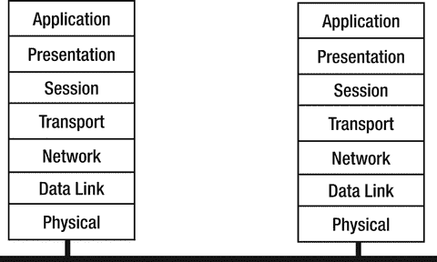

# 七、安全

尽管互联网最初被设计为一个抵御敌对代理攻击的系统，但它发展成为一个相对可信的实体的合作环境。唉，那些日子早就过去了。垃圾邮件、拒绝服务(DoS)攻击、网络钓鱼企图等等都表明，任何人使用互联网都要自担风险。

应用程序必须构建为在敌对环境中正常工作。“正确地”不再仅仅意味着程序功能方面的正确，还意味着确保传输数据的隐私性和完整性，只允许合法用户访问，以及其他安全问题。

这当然会使你的程序更加复杂。在使应用程序安全的过程中，涉及到一些困难而微妙的计算问题。尝试自己去做(比如自己编加密库)通常注定会失败。相反，您需要使用安全专业人员设计的库。

如果这让事情变得更困难，你为什么要烦恼呢？几乎每天都有关于泄露信用卡信息的报道，关于政府官员运行的私人服务器被黑客攻击的报道，以及关于系统因拒绝服务攻击而瘫痪的报道。这些攻击中有许多可能是由于面向网络的应用程序中的编码错误造成的，如缓冲区溢出、跨站点脚本和 SQL 注入。但是大量的错误可以追溯到糟糕的网络处理:密码以纯文本形式传递，安全凭证被请求但没有被检查，以及仅仅信任你所处的环境。例如，一位同事最近购买了一台家用物联网设备。他使用 wireshark 查看它在自己的网络上做了什么，发现它正在用认证令牌`admin.admin`发送 RTMP 消息。一个简单的攻击媒介，甚至不需要破解密码！一家知名公司制造的无人机使用了存在已知缺陷的加密技术，可以被其他无人机“窃取”。一种越来越常见的窃取数据的方法是充当“流氓”无线接入点，假装是当地咖啡店的合法接入点，但监控通过的一切，包括您的银行账户详细信息。这些都是“低垂的果实”。数据泄露的范围由 [`http://www.informationisbeautiful.net/visualizations/worlds-biggest-data-breaches-hacks/`](http://www.informationisbeautiful.net/visualizations/worlds-biggest-data-breaches-hacks/) 的“全球最大数据泄露”显示。

本章介绍了 Go 提供的基本加密工具，您可以将这些工具构建到您的应用程序中。如果你不这样做，你的公司损失了 100 万美元——或者更糟，你的客户损失了 100 万美元——那么责任就会回到你身上。

## ISO 安全架构

分布式系统的 ISO OSI(开放系统互连)七层模型是众所周知的，并在图 [7-1](#Fig1) 中重复。



图 7-1。

The OSI seven-layer model of distributed systems

不太为人所知的是，ISO 在这个架构上建立了一系列的文档。对于我们这里的目的，最重要的是 ISO 安全架构模型，ISO 7498-2。这需要购买，但是 ITU 已经制定了一个技术上与之一致的文件，X.800，可以从 ITU 的 [`https://www.itu.int/rec/dologin_pub.asp?lang=e&id=T-REC-X.800-199103-I!!PDF-E&type=items`](https://www.itu.int/rec/dologin_pub.asp?lang=e&id=T-REC-X.800-199103-I!!PDF-E&type=items) 获得。

### 功能和级别

安全系统所需的主要功能如下:

*   认证:身份证明
*   数据完整性:数据没有被篡改
*   机密性:数据不会暴露给其他人
*   公证/签名
*   访问控制
*   保证/可用性

这些是 OSI 堆栈的以下级别所必需的:

*   对等实体认证(3，4，7)
*   数据源认证(3，4，7)
*   访问控制服务(3，4，7)
*   连接机密性(1，2，3，4，6，7)
*   无连接机密性(1，2，3，4，6，7)
*   选择性字段机密性(6，7)
*   流量机密性(1，3，7)
*   恢复连接完整性(4，7)
*   无恢复的连接完整性(4，7)
*   连接完整性选择字段(7)
*   无连接完整性选择字段(7)
*   起源时的不可否认性(7)
*   收据的不可否认性(7)

### 机制

实现这种安全级别的机制如下:

*   对等实体认证
    *   加密
    *   数字签名
    *   认证交换
*   数据源认证
    *   加密
    *   数字签名
*   访问控制服务
    *   访问控制列表
    *   密码
    *   功能列表
    *   标签
*   连接保密性
    *   加密
    *   路由控制
*   无连接保密性
    *   加密
    *   路由控制
*   选择性字段保密
    *   加密
*   交通流量保密性
    *   加密
    *   交通填充
    *   路由控制
*   恢复连接完整性
    *   加密
    *   数据完整性
*   无恢复的连接完整性
    *   加密
    *   数据完整性
*   连接完整性选择字段
    *   加密
    *   数据完整性
*   无连接完整性
    *   加密
    *   数字签名
    *   数据完整性
*   无连接完整性选择字段
    *   加密
    *   数字签名
    *   数据完整性
*   原始不可否认性
    *   数字签名
    *   数据完整性
    *   公证
*   收据的不可否认性
    *   数字签名
    *   数据完整性
    *   公证

## 数据完整性

确保数据完整性意味着提供一种测试数据未被篡改的方法。通常，这是通过将数据中的字节组成一个简单的数字来实现的。这个过程称为散列，得到的数字称为散列或散列值。

一个简单的哈希算法只是将数据中的所有字节相加。但是，这仍然允许几乎任何数量的数据更改，并且仍然保留哈希值。例如，攻击者可以交换两个字节。这保留了哈希值，但最终您可能欠某人 65，536 美元，而不是 256 美元。

用于安全目的的散列算法必须是“强有力的”，这样攻击者就很难找到具有相同散列值的不同字节序列。这使得很难根据攻击者的目的修改数据。安全研究人员一直在测试哈希算法，看看他们是否能破解它们——也就是说，找到一种简单的方法，用字节序列来匹配哈希值。他们设计了一系列被认为是强大的加密哈希算法。

Go 支持多种哈希算法，包括 MD4、MD5、RIPEMD-160、SHA1、SHA224、SHA256、SHA384 和 SHA512。就 Go 程序员而言，它们都遵循相同的模式:适当包中的函数`New`(或类似函数)从`hash`包中返回一个`Hash`对象。

一个`hash`有一个`io.Writer`，你把要哈希的数据写到这个 writer。可以通过`Size`查询哈希值中的字节数，通过`Sum`查询哈希值。

一个典型的例子是 MD5 散列法。这使用了`md5`包。哈希值是一个 16 字节的数组。这通常以 ASCII 形式打印为四个十六进制数，每个由四个字节组成。一个简单的程序是`MD5Hash.go`:

```go
/* MD5Hash
 */

package main

import (
        "crypto/md5"
        "fmt"
)

func main() {
        hash := md5.New()
        bytes := []byte("hello\n")
        hash.Write(bytes)
        hashValue := hash.Sum(nil)
        hashSize := hash.Size()
        for n := 0; n < hashSize; n += 4 {
                var val uint32
                val = uint32(hashValue[n])<<24 +
                        uint32(hashValue[n+1])<<16 +
                        uint32(hashValue[n+2])<<8 +
                        uint32(hashValue[n+3])
                fmt.Printf("%x ", val)
        }
        fmt.Println()
}

```

这个程序打印`"b1946ac9 2492d234 7c6235b4 d2611184"`。

对此的一种变体是 HMAC(键控散列消息验证码)，它向散列算法添加了一个密钥。用这个变化不大。要将 MD5 散列与密钥一起使用，请将对`hash := md5.New()`的调用替换为:

```go
hash := hmac.New(md5.New, []byte("secret"))

```

## 对称密钥加密

有两种主要的数据加密机制。对称密钥加密使用加密和解密都相同的单个密钥。加密和解密代理都需要知道这个密钥。没有讨论这个密钥如何在代理之间传输。

与哈希算法一样，加密算法也有很多种。现在已知许多算法都有弱点，一般来说，随着时间的推移，随着计算机速度的提高，算法会变得越来越弱。Go 支持多种对称密钥算法，如 AES 和 DES。

这些算法是块算法。也就是说，他们处理数据块。如果您的数据与块大小不一致，您必须在末尾用额外的空白填充它。

每个算法由一个`Cipher`对象表示。这是由`NewCipher`在适当的包中创建的，并以对称密钥作为参数。

一旦有了密码，就可以用它来加密和解密数据块。我们使用 AES-128，其密钥大小为 128 位(16 字节)，块大小为 128 位。密钥的大小决定了使用哪个版本的 AES。说明这一点的一个程序是`Aes.go`:

```go
/* Aes
 */

package main

import (
        "bytes"
        "crypto/aes"
        "fmt"
)

func main() {
        key := []byte("my key, len 16 b")
        cipher, err := aes.NewCipher(key)
        if err != nil {
                fmt.Println(err.Error())
        }
        src := []byte("hello 16 b block")

        var enc [16]byte
        cipher.Encrypt(enc[0:], src)

        var decrypt [16]byte
        cipher.Decrypt(decrypt[0:], enc[0:])
        result := bytes.NewBuffer(nil)
        result.Write(decrypt[0:])
        fmt.Println(string(result.Bytes()))
}

```

这使用共享的 16 字节密钥`"my key, len 16 b"`对 16 字节块`"hello 16 b block"`进行加密和解密。

## 公钥加密

另一种主要的加密类型是公钥加密。公钥加密和解密需要两个密钥:一个用于加密，另一个用于解密。加密密钥通常以某种方式公开，这样任何人都可以加密发送给你的消息。解密密钥必须保密；否则，每个人都可以解密这些消息！公钥系统是非对称的，不同的密钥用于不同的用途。

Go 支持的公钥加密系统有很多。一个典型的例子是 RSA 方案。

从随机数生成 RSA 私钥和公钥的程序是`GenRSAKeys.go`:

```go
/* GenRSAKeys
 */

package main

import (
        "crypto/rand"
        "crypto/rsa"
        "crypto/x509"
        "encoding/gob"
        "encoding/pem"
        "fmt"
        "os"
)

func main() {
        reader := rand.Reader
        bitSize := 512
        key, err := rsa.GenerateKey(reader, bitSize)
        checkError(err)

        fmt.Println("Private key primes", key.Primes[0].String(), key.Primes[1].String())
        fmt.Println("Private key exponent", key.D.String())

        publicKey := key.PublicKey
        fmt.Println("Public key modulus", publicKey.N.String())
        fmt.Println("Public key exponent", publicKey.E)

        saveGobKey("private.key", key)
        saveGobKey("public.key", publicKey)

        savePEMKey("private.pem", key)
}

func saveGobKey(fileName string, key interface{}) {
        outFile, err := os.Create(fileName)
        checkError(err)
        encoder := gob.NewEncoder(outFile)
        err = encoder.Encode(key)
        checkError(err)
        outFile.Close()
}

func savePEMKey(fileName string, key *rsa.PrivateKey) {

        outFile, err := os.Create(fileName)
        checkError(err)

        var privateKey = &pem.Block{Type: "RSA PRIVATE KEY",
                Bytes: x509.MarshalPKCS1PrivateKey(key)}

        pem.Encode(outFile, privateKey)

        outFile.Close()
}

func checkError(err error) {
        if err != nil {
                fmt.Println("Fatal error ", err.Error())
                os.Exit(1)
        }
}

```

该程序还使用`gob`序列化来保存证书。它们可以被`LoadRSAKeys.go`程序读回:

```go
/* LoadRSAKeys
 */

package main

import (
        "crypto/rsa"
        "encoding/gob"
        "fmt"
        "os"
)

func main() {
        var key rsa.PrivateKey

        loadKey("private.key", &key)

        fmt.Println("Private key primes", key.Primes[0].String(), key.Primes[1].String())
        fmt.Println("Private key exponent", key.D.String())

        var publicKey rsa.PublicKey
        loadKey("public.key", &publicKey)

        fmt.Println("Public key modulus", publicKey.N.String())
        fmt.Println("Public key exponent", publicKey.E)
}

func loadKey(fileName string, key interface{}) {
        inFile, err := os.Open(fileName)
        checkError(err)
        decoder := gob.NewDecoder(inFile)
        err = decoder.Decode(key)
        checkError(err)
        inFile.Close()
}

func checkError(err error) {
        if err != nil {
                fmt.Println("Fatal error ", err.Error())
                os.Exit(1)
        }
}

```

## X.509 证书

公钥基础设施(PKI)是一个框架，用于收集公钥，以及其他信息，如所有者姓名和位置，以及它们之间的链接，从而提供某种批准机制。

目前使用的主要 PKI 基于 X.509 证书。例如，web 浏览器使用它们来验证网站的身份。

为我的网站生成自签名 X.509 证书并将其存储在一个`.cer`文件中的示例程序是`GenX509Cert.go`:

```go
/* GenX509Cert
 */

package main

import (
        "crypto/rand"
        "crypto/rsa"
        "crypto/x509"
        "crypto/x509/pkix"
        "encoding/gob"
        "encoding/pem"
        "fmt"
        "math/big"
        "os"
        "time"
)

func main() {
        random := rand.Reader

        var key rsa.PrivateKey
        loadKey("private.key", &key)

        now := time.Now()
        then := now.Add(60 * 60 * 24 * 365 * 1000 * 1000 * 1000) // one year
        template := x509.Certificate{
                SerialNumber: big.NewInt(1),
                Subject: pkix.Name{
                        CommonName:   "jan.newmarch.name",
                        Organization: []string{"Jan Newmarch"},
                },
                NotBefore: now,
                NotAfter:  then,

                SubjectKeyId: []byte{1, 2, 3, 4},
                KeyUsage:     x509.KeyUsageCertSign | x509.KeyUsageKeyEncipherment | x509.KeyUsageDigitalSignature,

                BasicConstraintsValid: true,
                IsCA:     true,
                DNSNames: []string{"jan.newmarch.name", "localhost"},
        }
        derBytes, err := x509.CreateCertificate(random, &template,
                &template, &key.PublicKey, &key)
        checkError(err)

        certCerFile, err := os.Create("jan.newmarch.name.cer")
        checkError(err)
        certCerFile.Write(derBytes)
        certCerFile.Close()

        certPEMFile, err := os.Create("jan.newmarch.name.pem")
        checkError(err)
        pem.Encode(certPEMFile, &pem.Block{Type: "CERTIFICATE", Bytes: derBytes})
        certPEMFile.Close()

        keyPEMFile, err := os.Create("private.pem")
        checkError(err)
        pem.Encode(keyPEMFile, &pem.Block{Type: "RSA PRIVATE KEY",
                Bytes: x509.MarshalPKCS1PrivateKey(&key)})
        keyPEMFile.Close()
}

func

loadKey(fileName string, key interface{}) {
        inFile, err := os.Open(fileName)
        checkError(err)
        decoder := gob.NewDecoder(inFile)
        err = decoder.Decode(key)
        checkError(err)
        inFile.Close()
}

func checkError(err error) {
        if err != nil {
                fmt.Println("Fatal error ", err.Error())
                os.Exit(1)
        }
}

```

这可以由`LoadX509Cert.go`回读:

```go
/* LoadX509Cert
 */

package main

import (
        "crypto/x509"
        "fmt"
        "os"
)

func main() {
        certCerFile, err := os.Open("jan.newmarch.name.cer")
        checkError(err)
        derBytes := make([]byte, 1000) // bigger than the file
        count, err := certCerFile.Read(derBytes)
        checkError(err)
        certCerFile.Close()

        // trim the bytes to actual length in call
        cert, err := x509.ParseCertificate(derBytes[0:count])
        checkError(err)

        fmt.Printf("Name %s\n", cert.Subject.CommonName)
        fmt.Printf("Not before %s\n", cert.NotBefore.String())
        fmt.Printf("Not after %s\n", cert.NotAfter.String())

}

func checkError(err error

) {
        if err != nil {
                fmt.Println("Fatal error ", err.Error())
                os.Exit(1)
        }
}

```

## 坦克激光瞄准镜（Tank Laser-Sight 的缩写）

如果你必须自己做所有的重活，加密/解密方案的用处是有限的。目前，互联网上支持加密消息传递的最流行的机制是 TLS(传输层安全性),其前身是 SSL(安全套接字层)。

在 TLS 中，客户端和服务器使用 X.509 证书协商身份。一旦完成，它们之间就发明了一个密钥，所有的加密/解密都是用这个密钥完成的。协商相对较慢，但一旦完成，就会使用更快的密钥机制。服务器需要有证书；如果需要，客户可以有一个。

### 基本客户

我们首先说明连接到一个服务器，该服务器具有由“众所周知的”认证机构(CA)如 RSA 签署的证书。从 web 服务器获取报头信息的程序可以适用于从 TLS web 服务器获取报头信息。节目是`TLSGetHead.go`。(我们在这里举例说明`TLS.Dial`，并将在后面的章节中讨论 HTTPS。)

```go
/* TLSGetHead
 */
package main

import (
        "crypto/tls"
        "fmt"
        "io/ioutil"
        "os"
)

func main() {
        if len(os.Args) != 2 {
                fmt.Println("Usage: ", os.Args[0], "host:port")
                os.Exit(1)
        }
        service := os.Args[1]

        conn, err := tls.Dial("tcp", service, nil)
        checkError(err)

        _, err = conn.Write([]byte("HEAD / HTTP/1.0\r\n\r\n"))
        checkError(err)

        result, err := ioutil.ReadAll(conn)
        checkError(err)

        fmt.Println(string(result))

        conn.Close()
        os.Exit(0)
}

func checkError(err error) {
        if err != nil {
                fmt.Println("Fatal error ", err.Error())
                os.Exit(1)
        }
}

```

当针对适当的站点运行时，例如 [`www.google.com:443`](http://www.google.com:443) :

```go
go run TLSGetHead.go www.google.com:443

```

它会产生如下输出:

```go
HTTP/1.0 302 Found
Cache-Control: private
Content-Type: text/html; charset=UTF-8
Location: https://www.google.com.au/?gfe_rd=cr&ei=L3lvWKSXMdPr8AfvhqKIBg
Content-Length: 263
Date: Fri, 06 Jan 2017 11:02:07 GMT
Alt-Svc: quic=":443"; ma=2592000; v="35,34"

```

其他站点可能会产生其他响应，但是这个客户端仍然很高兴已经与正确的身份验证服务器建立了 TLS 会话。

有趣的是运行这个网站 [`www.gooogle.com`](http://www.gooogle.com) (注意多余的 o！):

```go
go run TLSGetHead.go www.gooogle.com:443

```

这个网站实际上属于谷歌，因为他们可能是为了降低欺诈风险而购买的。该程序抛出一个致命错误，因为站点证书不适用于带有三个操作系统的 gooogle:

```go
Fatal error  x509: certificate is valid for google.com, *.2mdn.net, *.android.com, *.appengine.google.com, *.au.doubleclick.net, *.cc-dt.com, *.cloud.google.com, ...

```

指向同一个三 o 网站的浏览器如 Firefox 也会发出安全警报。

### 使用自签名证书的服务器

如果服务器使用自签名证书，可能在组织内部使用或者在试验时使用，那么 Go package when 将生成一个错误:`"x509: certificate signed by unknown authority"`。证书必须安装到客户端的操作系统中(这将依赖于操作系统)，或者客户端必须将证书安装为根 CA。我们将展示第二种方式。

使用 TLS 和任何证书的 echo 服务器是`TLSEchoServer.go`:

```go
/* TLSEchoServer
 */
package main

import (
        "crypto/rand"
        "crypto/tls"
        "fmt"
        "net"
        "os"
        "time"
)

func main() {

        cert, err := tls.LoadX509KeyPair("jan.newmarch.name.pem", "private.pem")
        checkError(err)
        config := tls.Config{Certificates: []tls.Certificate{cert}}

        now := time.Now()
        config.Time = func() time.Time { return now }
        config.Rand = rand.Reader

        service := "0.0.0.0:1200"

        listener, err := tls.Listen("tcp", service, &config)
        checkError(err)
        fmt.Println("Listening")
        for {
                conn, err := listener.Accept()
                if err != nil {
                        fmt.Println(err.Error())
                        continue
                }
                fmt.Println("Accepted")
                go handleClient(conn)
        }
}

func handleClient(conn net.Conn) {
        defer conn.Close()

        var buf [512]byte
        for {
                fmt.Println("Trying to read")
                n, err := conn.Read(buf[0:])
                if err != nil {
                        fmt.Println(err)
                        return
                }
                _, err = conn.Write(buf[0:n])
                if err != nil {
                        return
                }
        }
}

func checkError(err error) {
        if err != nil {
                fmt.Println("Fatal error ", err.Error())
                os.Exit(1)
        }
}

```

如果证书是自签名的，简单的 TLS 客户端将无法与此服务器一起工作，这里就是这样。我们需要将一个配置作为第三个参数设置为`TLS.` `Dial`，它将我们的证书安装为根证书。感谢 Josh Bleecher Snyder 在“获取 x509:由未知权威签署的证书”( [`https://groups.google.com/forum/#!topic/golang-nuts/v5ShM8R7Tdc`](https://groups.google.com/forum/#!topic/golang-nuts/v5ShM8R7Tdc) )中展示了如何做到这一点。然后，服务器与`TLSEchoClient.go`客户机一起工作。

```go
/* TLSEchoClient
 */
package main

import (
        "crypto/tls"
        "crypto/x509"
        "fmt"
        "os"
)

func main() {
        if len(os.Args) != 2 {
                fmt.Println("Usage: ", os.Args[0], "host:port")
                os.Exit(1)
        }
        service := os.Args[1]

        // Load the PEM self-signed certificate
        certPemFile, err := os.Open("jan.newmarch.name.pem")
        checkError(err)
        pemBytes := make([]byte, 1000) // bigger than the file
        _, err = certPemFile.Read(pemBytes)
        checkError(err)
        certPemFile.Close()

        // Create a new certificate pool
        certPool := x509.NewCertPool()
        // and add our certificate
        ok := certPool.AppendCertsFromPEM(pemBytes)
        if !ok {
                fmt.Println("PEM read failed")
        } else {
                fmt.Println("PEM read ok")
        }

        // Dial, using a config

with root cert set to ours
        conn, err := tls.Dial("tcp", service, &tls.Config{RootCAs: certPool})
        checkError(err)

        // Now write and read
lots
        for n := 0; n < 10; n++ {
                fmt.Println("Writing...")
                conn.Write([]byte("Hello " + string(n+48)))

                var buf [512]byte
                n, err := conn.Read(buf[0:])
                checkError(err)

                fmt.Println(string(buf[0:n]))
        }
        conn.Close()
        os.Exit(0)
}

func checkError(err error) {
        if err != nil {
                fmt.Println("Fatal error ", err.Error())
                os.Exit(1)
        }
}

```

## 结论

安全性本身是一个很大的领域，本章几乎没有涉及到它。然而，主要的概念已经涵盖。没有强调的是在设计阶段需要构建多少安全性:事后才想到安全性几乎总是失败的。