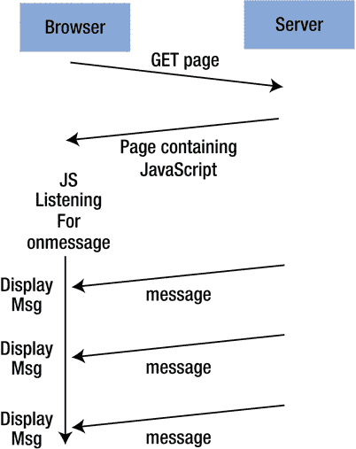

# 十五、WebSocket

web 用户代理(如浏览器)和 web 服务器(如 Apache)之间的标准交互模型是，用户代理发出 HTTP 请求，服务器对每个请求作出单个回复。在浏览器的情况下，通过点击链接、在地址栏中输入 URL、点击前进或后退按钮等来发出请求。响应被视为一个新页面，并被加载到浏览器窗口中。

这种传统模式有很多弊端。第一个是每个请求打开和关闭一个新的 TCP 连接。HTTP 1.1 通过允许持久连接解决了这个问题，这样一个连接可以在短时间内保持打开，以允许在同一个服务器上进行多个请求(例如，对图像的请求)。

虽然 HTTP 1.1 持久连接缓解了包含大量图形的页面加载缓慢的问题，但它并没有改善交互模型。即使使用表单，模型仍然是提交表单并将响应显示为新页面。JavaScript 有助于在提交前对表单数据进行错误检查，但不会改变模型。

AJAX(异步 JavaScript 和 XML)对用户交互模型做出了重大改进。这允许浏览器发出请求，并使用响应来更新使用 HTML 文档对象模型(DOM)的显示。但是交互模型是一样的。AJAX 只是影响浏览器管理返回页面的方式。Go 中没有对 AJAX 的显式额外支持，因为不需要:HTTP 服务器只是看到一个普通的 HTTP POST 请求，其中可能包含一些 XML 或 JSON 数据，这可以使用已经讨论过的技术来处理。

所有这些仍然是浏览器(或用户代理)到服务器的通信。缺少的是服务器到浏览器的通信，其中浏览器已经建立了到服务器的 TCP 连接并从服务器读取消息。这可以由 WebSockets 来完成:浏览器(或任何用户代理)保持打开一个到 WebSockets 服务器的长期 TCP 连接。TCP 连接允许任何一方发送任意数据包，因此任何应用程序协议都可以在 WebSocket 上使用。

WebSocket 的启动是通过用户代理发送一个特殊的 HTTP 请求来实现的，这个请求说“切换到 WebSockets”。HTTP 请求下面的 TCP 连接保持打开，但是用户代理和服务器都切换到使用 WebSockets 协议，而不是获取 HTTP 响应并关闭套接字。

注意，仍然是浏览器或用户代理发起 WebSockets 连接。浏览器不运行自己的 TCP 服务器。虽然 IETF RFC6455 的规范很复杂(见 [`https://tools.ietf.org/html/rfc6455`](https://tools.ietf.org/html/rfc6455) )，但该协议被设计得相当容易使用。客户端打开一个 HTTP 连接，然后用自己的 WS 协议替换 HTTP 协议，重用相同的 TCP 或新的连接。

Go 在一个子存储库中有一些对 WebSockets 的支持，但实际上推荐第三方的包。本章考虑了这两种包。

## WebSockets 服务器

WebSockets 服务器最初是一个 HTTP 服务器，接受 TCP 连接并处理 TCP 连接上的 HTTP 请求。当一个请求将该连接切换为 WebSockets 连接时，协议处理程序将从 HTTP 处理程序更改为 WebSocket 处理程序。因此，只有 TCP 连接的角色发生了变化，服务器仍然是其他请求的 HTTP 服务器，而该连接下面的 TCP 套接字用作 WebSocket。

在第 8 章中讨论的简单服务器之一，HTTP 注册了各种处理程序，比如文件处理程序或函数处理程序。为了处理 WebSockets 请求，我们只需注册一个不同类型的处理程序—web sockets 处理程序。服务器使用哪个处理程序取决于 URL 模式。例如，可以为`/`注册一个文件处理程序，为`/cgi-bin/...`注册一个函数处理程序，为`/ws`注册一个 WebSockets 处理程序。

仅预期用于 WebSockets 的 HTTP 服务器可能如下运行:

```go
func main() {
        http.Handle("/", websocket.Handler(WSHandler))
        err := http.ListenAndServe(":12345", nil)
        checkError(err)
}

```

一个更复杂的服务器可能通过添加更多的处理程序来处理 HTTP 和 WebSockets 请求。

## Go 子存储库包

Go 有一个名为`golang.org/x/net/websocket`的子库包。要使用它，您必须首先下载它:

```go
go get golang.org/x/net/websocket

```

这个包的文档陈述如下:

> This package currently lacks some features found in another more actively maintained WebSockets package: [`https://godoc.org/github.com/gorilla/websocket`](https://godoc.org/github.com/gorilla/websocket)

这表明使用替代包可能会更好。尽管如此，我们在这里认为这个包与本书其余部分使用 Go 团队的包是一致的。后面一节将介绍替代包。

### 消息对象

HTTP 是一种流协议。WebSockets 是基于框架的。您准备一个数据块(任何大小)并将其作为一组帧发送。帧可以包含 UTF-8 编码的字符串或字节序列。

使用 WebSockets 最简单的方法就是准备一个数据块，并请求 Go WebSockets 库将其打包为一组帧数据，通过网络发送，并作为同一个数据块接收。`websocket`包包含一个名为`Message`的便利对象来完成这一任务。`Message`对象有两个方法——`Send`和`Receive`——将 WebSocket 作为第一个参数。第二个参数要么是存储数据的变量的地址，要么是要发送的数据。发送字符串数据的代码如下所示:

```go
msgToSend := "Hello"
err := websocket.Message.Send(ws, msgToSend)

var msgToReceive string
err := websocket.Message.Receive(conn, &msgToReceive)

```

发送字节数据的代码如下所示:

```go
 dataToSend := []byte{0, 1, 2}
 err := websocket.Message.Send(ws, dataToSend)

 var dataToReceive []byte
 err := websocket.Message.Receive(conn, &dataToReceive)

```

接下来给出一个发送和接收字符串数据的 echo 服务器。请注意，在 WebSockets 中，任何一方都可以发起消息发送，在这个服务器中，当客户端连接(发送/接收)时，我们将消息从服务器发送到客户端，而不是更普通的接收/发送服务器。服务器是`EchoServer.go`:

```go
/* EchoServer
 */
package main

import (
        "fmt"
        "golang.org/x/net/websocket"
        "net/http"
        "os"
)

func Echo(ws *websocket.Conn) {
        fmt.Println("Echoing")

        for n := 0; n < 10; n++ {
                msg := "Hello  " + string(n+48)
                fmt.Println("Sending to client: " + msg)
                err := websocket.Message.Send(ws, msg)
                if err != nil {
                        fmt.Println("Can't send")
                        break
                }

                var reply string
                err = websocket.Message.Receive(ws, &reply)
                if err != nil {
                        fmt.Println("Can't receive")
                        break
                }
                fmt.Println("Received back from client: " + reply)
        }
}

func main() {

        http.Handle("/", websocket.Handler(Echo))
        err := http.ListenAndServe(":12345", nil)
        checkError(err)
}

func checkError(err error) {
        if err != nil {
                fmt.Println("Fatal error ", err.Error())
                os.Exit(1)
        }
}

```

它的运行方式如下:

```go
go run EchoServer.go

```

与此服务器对话的客户端是`EchoClient.go`:

```go
/* EchoClient
 */
package main

import (
        "fmt"
        "golang.org/x/net/websocket"
        "io"
        "os"
)

func main() {
        if len(os.Args) != 2 {
                fmt.Println("Usage: ", os.Args[0], "ws://host:port")
                os.Exit(1)
        }
        service := os.Args[1]

        conn, err := websocket.Dial(service, "", "http://localhost:12345")
        checkError(err)
        var msg string
        for {
                err := websocket.Message

.Receive(conn, &msg)
                if err != nil {
                        if err == io.EOF {
                                // graceful shutdown by server
                                break
                        }
                        fmt.Println("Couldn't receive msg " + err.Error())
                        break
                }
                fmt.Println("Received from server: " + msg)
                // return the msg
                err = websocket.Message.Send(conn, msg)
                if err != nil {
                        fmt.Println("Couldn’t return msg")
                        break
                }
        }
        os.Exit(0)
}

func checkError(err error) {
        if err != nil {
                fmt.Println("Fatal error ", err.Error())
                os.Exit(1)
        }
}

```

它的运行方式如下:

```go
go run EchoClient.go ws://localhost:12345

```

客户端的输出是服务器发送的内容:

```go
Received from server: Hello  0
Received from server: Hello  1
Received from server: Hello  2
Received from server: Hello  3
Received from server: Hello  4
Received from server: Hello  5
Received from server: Hello  6
Received from server: Hello  7
Received from server: Hello  8
Received from server

: Hello  9

```

### JSON 对象

预计许多 WebSockets 客户机和服务器将以 JSON 格式交换数据。对于 Go 程序，这意味着 Go 对象将被整理成 JSON 格式，如第 [4](04.html) 章所述，然后作为 UTF-8 字符串发送，而接收者将读取该字符串并将其解组回 Go 对象。

名为`JSON`的`websocket`便利对象将为您完成这项工作。它有发送和接收数据的`Send`和`Receive`方法，就像`Message`对象一样。

我们考虑这样一种情况，客户端使用 WebSockets(可以双向发送消息)向服务器发送一个`Person`对象。从客户端读取消息并将其打印到服务器的标准输出的服务器是`PersonServerJSON.go`:

```go
/* PersonServerJSON
 */
package main

import (
        "fmt"
        "golang.org/x/net/websocket"
        "net/http"
        "os"
)

type Person struct {
        Name   string
        Emails []string
}

func ReceivePerson(ws *websocket.Conn) {
        var person Person
        err := websocket.JSON.Receive(ws, &person)
        if err != nil {
                fmt.Println("Can't receive")
        } else {

                fmt.Println("Name: " + person.Name)
                for _, e := range person.Emails {
                        fmt.Println("An email: " + e)
                }
        }
}

func main() {

        http.Handle("/", websocket.Handler(ReceivePerson))
        err := http.ListenAndServe(":12345", nil)
        checkError(err)
}

func checkError(err error) {
        if err != nil {
                fmt.Println("Fatal error ", err.Error())
                os.Exit(1)
        }
}

```

发送 JSON 格式的`Person`对象的客户端是`PersonClientJSON.go`:

```go
/* PersonClientJSON
 */
package main

import (
        "fmt"
        "golang.org/x/net/websocket"
        "os"
)

type Person struct {
        Name   string
        Emails []string
}

func main() {
        if len(os.Args) != 2 {
                fmt.Println("Usage: ", os.Args[0], "ws://host:port")
                os.Exit(1)
        }
        service := os.Args[1]

        conn, err := websocket.Dial(service, "",
                "http://localhost")
        checkError(err)

        person := Person{Name: "Jan",
                Emails: []string{"ja@newmarch.name", "jan.newmarch@gmail.com"},
        }

        err = websocket.JSON.Send(conn, person)
        if err != nil {
                fmt.Println("Couldn't send msg " + err.Error())
        }
        os.Exit(0)
}

func checkError(err error) {
        if err != nil {
                fmt.Println("Fatal error ", err.Error())
                os.Exit(1)
        }
}

```

服务器按如下方式运行:

```go
go run PersonServerJSON.go

```

客户端运行如下:

```go
go run PersonClientJSON.go  ws://localhost:12345

```

服务器端的输出是客户端发送的内容:

```go
Name: Jan
An email: ja@newmarch.name
An email: jan.newmarch@gmail.com

```

### 编解码器类型

`Message`和`JSON`对象都是类型`Codec`的实例。该类型定义如下:

```go
type Codec struct {
    Marshal   func(v interface{}) (data []byte, payloadType byte, err error)
    Unmarshal func(data []byte, payloadType byte, v interface{}) (err error)
}

```

`Codec`类型实现了之前使用的`Send`和`Receive`方法。

很可能 WebSockets 也将用于交换 XML 数据。我们可以通过包装第 12 章[中讨论的 XML `marshal`和`unmarshal`方法来构建一个 XML `Codec`对象，以给出一个合适的`Codec`对象。](12.html)

我们可以这样创建一个`XMLCodec`包，叫做`XMLCodec.go`:

```go
package xmlcodec

import (
        "encoding/xml"
        "golang.org/x/net/websocket"
)

func xmlMarshal(v interface{}) (msg []byte, payloadType byte, err error) {
        msg, err = xml.Marshal(v)
        return msg, websocket.TextFrame, nil
}

func xmlUnmarshal(msg []byte, payloadType byte, v interface{}) (err error) {
        err = xml.Unmarshal(msg, v)
        return err
}

var XMLCodec = websocket.Codec{xmlMarshal, xmlUnmarshal}

```

这个文件应该安装在`GOPATH`的`src`子目录下:

```go
$GOPATH/src/xmlcodec/XMLCodec.go

```

然后，我们可以将 Go 对象(如`Person`)序列化为 XML 文档，并将它们从客户机发送到服务器。接收文档并将其打印到标准输出的服务器如下:

```go
/* PersonServerXML
 */
package main

import (
        "fmt"
        "golang.org/x/net/websocket"
        "net/http"
        "os"
        "xmlcodec"
)

type Person struct {
        Name   string
        Emails []string
}

func ReceivePerson(ws *websocket.Conn) {
        var person Person
        err := xmlcodec.XMLCodec.Receive(ws, &person)
        if err != nil {
                fmt.Println("Can't receive")
        } else {

                fmt.Println("Name: " + person.Name)
                for _, e := range person.Emails {
                        fmt.Println("An email: " + e)
                }
        }
}

func main() {

        http.Handle("/", websocket.Handler(ReceivePerson))
        err := http.ListenAndServe(":12345", nil)
        checkError(err)
}

func checkError(err error) {
        if err != nil {
                fmt.Println("Fatal error ", err.Error())
                os.Exit(1)
        }
}

```

发送 XML 格式的`Person`对象的客户端是`PersonClientXML.go`:

```go
/* PersonClientXML
 */
package main

import (
        "fmt"
        "golang.org/x/net/websocket"
        "os"
        "xmlcodec"
)

type Person struct {
        Name   string
        Emails []string
}

func main() {
        if len(os.Args) != 2 {
                fmt.Println("Usage: ", os.Args[0], "ws://host:port")
                os.Exit(1)
        }
        service := os.Args[1]

        conn, err := websocket.Dial(service, "", "http://localhost")
        checkError(err)

        person := Person{Name: "Jan",
                Emails: []string{"ja@newmarch.name", "jan.newmarch@gmail.com"},
        }

        err = xmlcodec.XMLCodec.Send(conn, person)
        if err != nil {
                fmt.Println("Couldn't send msg " + err.Error())
        }
        os.Exit(0)
}

func

checkError(err error) {
        if err != nil {
                fmt.Println("Fatal error ", err.Error())
                os.Exit(1)
        }
}

```

服务器按如下方式运行:

```go
go run PersonServerXML.go

```

客户端运行如下:

```go
go run PersonClientXML.go  ws://localhost:12345

```

服务器端的输出是客户端发送的内容:

```go
Name: Jan
An email: ja@newmarch.name
An email: jan.newmarch@gmail.com

```

### TLS 上的 WebSockets

WebSocket 可以建立在安全 TLS 套接字之上。我们在第 [8](08.html) 章中讨论了如何使用第 [7](07.html) 章中的证书来使用 TLS 套接字。它不加修改地用于 WebSockets。也就是我们用`http.ListenAndServeTLS`代替`http.ListenAndServe`。

下面是使用 TLS 的 echo 服务器:

```go
/* EchoServerTLS
 */
package main

import (
        "fmt"
        "golang.org/x/net/websocket"
        "net/http"
        "os"
)

func Echo(ws *websocket.Conn) {
        fmt.Println("Echoing")

        for n := 0; n < 10; n++ {
                msg := "Hello  " + string(n+48)
                fmt.Println("Sending to client: " + msg)
                err := websocket.Message.Send(ws, msg)
                if err != nil {
                        fmt.Println("Can't send")
                        break
                }

                var reply string
                err = websocket.Message.Receive(ws, &reply)
                if err != nil {
                        fmt.Println("Can't receive")
                        break
                }
                fmt.Println("Received back from client: " + reply)
        }
}

func main() {

        http.Handle("/", websocket.Handler(Echo))
        err := http.ListenAndServeTLS(":12345", "jan.newmarch.name.pem",
                "private.pem", nil)
        checkError(err)
}

func checkError(err error) {
        if err != nil {
                fmt.Println("Fatal error ", err.Error())
                os.Exit(1)
        }
}

```

客户端与之前的 echo 客户端相同。改变的只是 URL，它使用了`wss`方案，而不是`ws`方案:

```go
EchoClient wss://localhost:12345/

```

如果服务器提供的 TLS 证书是有效的，这将很好地工作。我使用的证书不是:它是自签名的，这通常是一个信号，表明您正在进入一个危险区域。如果你想继续下去，你需要采用我们在第 [8](08.html) 章中通过打开 TLS `InsecureSkipVerify`标志所做的同样的“移除安全检查”。这是由程序`EchoClientTLS.go`完成的，它使用这个标志建立一个配置，然后调用`DialConfig`代替`Dial`:

```go
/* EchoClientTLS
 */
package main

import (
         "fmt"
         "crypto/tls"
         "golang.org/x/net/websocket"
         "io"
         "os"
)

func main() {
         if len(os.Args) != 2 {
                    fmt.Println("Usage: ", os.Args[0], "wss://host:port")
                    os.Exit(1)
         }

         config, err := websocket.NewConfig(os.Args[1], "http://localhost")
         checkError(err)
         tlsConfig := &tls.Config{InsecureSkipVerify: true}
         config.TlsConfig = tlsConfig

         conn, err := websocket.DialConfig(config)
         checkError(err)
         var msg string
         for {
                   err := websocket.Message.Receive(conn, &msg)
                   if err != nil {
                               if err == io.EOF {
                                          // graceful shutdown by server
                                          break
                               }
                               fmt.Println("Couldn't receive msg " + err.Error())
                               break
                   }
                   fmt.Println("Received from server: " + msg)
                   // return the msg
                   err = websocket.Message.Send(conn, msg)
                   if err != nil {
                               fmt.Println("Couldn't return msg")
                               break
                   }
         }
         os.Exit(0)
}

func

checkError(err error) {
         if err != nil {
                     fmt.Println("Fatal error ", err.Error())
                     os.Exit(1)
         }
}

```

### HTML 页面中的 WebSockets

WebSockets 最初的驱动程序是允许 HTTP 用户代理(如浏览器和服务器)之间的全双工交互。典型的用例是浏览器中的 JavaScript 程序与服务器交互。在本节中，我们将构建一个 web/WebSockets 服务器，该服务器提供一个 HTML 页面，该页面设置一个 WebSocket 并使用 WebSockets 显示来自该服务器的信息。我们正在观察图 [15-1](#Fig1) 所示的情况。



图 15-1。

Full duplex interaction situation

物联网时代即将到来。因此，我们可以期待来自传感器和传感器网络的数据被用来驱动执行器，并在浏览器中显示关于物联网网络的信息。关于使用 Raspberry Pi 和 Arduinos 构建传感器网络的书籍数不胜数，但我们将通过在“传感器”上显示 CPU 温度来大大简化这种情况，每隔几秒钟在网页上更新一次。

来自 Debian 包`lm-sensors`的 Linux `sensors`命令将它所知道的传感器的值写入标准输出。我的桌面计算机上的命令`sensors`产生如下输出:

```go
acpitz-virtual-0
Adapter: Virtual device
temp1:        +27.8°C  (crit = +105.0°C)
temp2:        +29.8°C  (crit = +105.0°C)

coretemp-isa-0000
Adapter: ISA adapter
Physical id 0:  +58.0°C  (high = +105.0°C, crit = +105.0°C)
Core 0:         +57.0°C  (high = +105.0°C, crit = +105.0°C)
Core 1:         +58.0°C  (high = +105.0°C, crit = +105.0°C)

```

在刷新时，通常`Core 0`和`Core 1`上的温度会改变。

在 Windows 上，执行相同操作的命令如下:

```go
wmic /namespace:\\root\wmi PATH MSAcpi_ThermalZoneTemperature get CurrentTemperature

```

当它运行时，会有如下输出

```go
42.4° C

```

在 Mac 上，使用 [`https://github.com/lavoiesl/osx-cpu-temp`](https://github.com/lavoiesl/osx-cpu-temp) 中的命令 osx-cpu-temp。

如果你不想经历这些步骤，就用一个更普通的程序代替，比如约会。

我们提供了一个 Go 程序来传递来自`ROOT_DIR`目录的 HTML 文档，然后从 URL `GetTemp`建立一个 WebSocket。服务器端的 WebSocket 每两秒钟从`sensors`获取一次输出，并发送给 Socket 的客户端。web/WebSockets 服务器运行在端口`12345`上，没有特别的原因。安装完`lm-sensors`包后，这个程序将在 Linux 下运行。对于其他系统，用任何其他有趣的系统调用代替`exec.Command`调用。

Go 服务器是`TemperatureServer.go`:

```go
/* TemperatureServer
 */
package main

import (
        "fmt"
        "golang.org/x/net/websocket"
        "net/http"
        "os"
        "os/exec"
        "time"
)

var ROOT_DIR = "/home/httpd/html/golang-hidden/websockets"

func GetTemp(ws *websocket.Conn) {
        for {

                msg, _ := exec.Command("sensors").Output()
                fmt.Println("Sending to client: " + string(msg[:]))
                err := websocket.Message.Send(ws, string(msg[:]))
                if err != nil {
                        fmt.Println("Can't send")
                        break
                }
                time.Sleep(2 * 1000 * 1000 * 1000)

                var reply string
                err = websocket.Message.Receive(ws, &reply)
                if err != nil {
                        fmt.Println("Can't receive")
                        break
                }
                fmt.Println("Received back from client: " + reply)
        }
}

func main() {
        fileServer := http.FileServer(http.Dir(ROOT_DIR))
        http.Handle("/GetTemp", websocket.Handler(GetTemp))
        http.Handle("/", fileServer)
        err := http.ListenAndServe(":12345", nil)
        checkError(err)
}

func checkError(err error) {
        if err != nil {
                fmt.Println("Fatal error ", err.Error())
                os.Exit(1)
        }
}

```

它的运行方式如下:

```go
go run TemperatureServer.go

```

开始这项工作的顶级 HTML 文件是`websocket.html`:

```go
<!DOCTYPE HTML>
<html>
  <head>

    <script type="text/javascript">
      function WebSocketTest()
      {
        if ("WebSocket" in window)
        {
          alert("WebSocket is supported by your Browser!");

          // Let us open a web socket
          var ws = new WebSocket("ws://localhost:12345/GetTemp");

          ws.onopen = function()
          {
            alert("WS is opened...");
          };

          ws.onmessage = function (evt)
          {
            var received_msg = evt.data;
            // uncomment next line if you want to get alerts on each message
            //alert("Message is received..." + received_msg);
            document.getElementById("temp").innerHTML = "<pre>" + received_msg + "</pre>"
            ws.send("Message received")
          };

          ws.onclose = function()
          {
            // websocket

is closed.
            alert("Connection is closed...");
          };
        }

        else
        {
          // The browser doesn't support WebSocket
          alert("WebSocket NOT supported by your Browser!");
        }
      }
    </script>

  </head>
  <body>

    <div id="temp">
      <a href="javascript:WebSocketTest()">Run temperature sensor</a>
    </div>

  </body>
</html>

```

该程序使用 JavaScript 打开一个 WebSockets 连接，并处理`onopen` `,` `onmessage`和`onclose`事件。它使用`evt.data`和`send`功能进行读写。它在一个预先格式化的元素中显示数据，就像上面的数据一样。每两秒钟刷新一次。HTML 文档的结构基于 TutorialsPoint ( [`https://www.tutorialspoint.com/html5/html5_websocket.htm`](https://www.tutorialspoint.com/html5/html5_websocket.htm) )的 HTML5 - WebSockets。

## 大猩猩套餐

WebSockets 的替代包是`github.com/gorilla/websocket`包。要使用它，您需要运行以下命令:

```go
go get github.com/gorilla/websocket

```

### 回声服务器

使用这个包的 echo 服务器是`EchoServerGorilla.go`。它通过引入对一个`websocket.Upgrader`对象的调用，使得 HTTP 到 WebSockets 的转换更加明确。它也更清楚地区分了发送文本和二进制消息。

```go
/* EchoServerGorilla
 */
package main

import (
        "fmt"
        "github.com/gorilla/websocket"
        "net/http"
        "os"
)

var upgrader = websocket.Upgrader{
        ReadBufferSize:  1024,
        WriteBufferSize: 1024,
}

func Handler(w http.ResponseWriter, r *http.Request) {
        fmt.Println("Handling /")
        conn, err := upgrader.Upgrade(w, r, nil)
        if err != nil {
                fmt.Println(err)
                return
        }

        for n := 0; n < 10; n++ {
                msg := "Hello  " + string(n+48)
                fmt.Println("Sending to client: " + msg)
                err = conn.WriteMessage(websocket.TextMessage, []byte(msg))

                _, reply, err := conn.ReadMessage()
                if err != nil {
                        fmt.Println("Can't receive")
                        break
                }
                fmt.Println("Received back from client: " + string(reply[:]))
        }
        conn.Close()
}

func main() {
        http.HandleFunc("/", Handler)
        err := http.ListenAndServe("localhost:12345", nil)
        checkError(err)
}

func checkError(err error) {
        if err != nil {
                fmt.Println("Fatal error ", err.Error())
                os.Exit(1)
        }
}

```

服务器按如下方式运行:

```go
go run EchoServerGorilla

```

### 回显客户端

使用这个包的 echo 客户端是`EchoClientGorilla.go`:

```go
/* EchoClientGorilla
 */
package main

import (
        "fmt"
        "github.com/gorilla/websocket"
        "io"
        "net/http"
        "os"
)

func main() {
        if len(os.Args) != 2 {
                fmt.Println("Usage: ", os.Args[0], "ws://host:port")
                os.Exit(1)
        }
        service := os.Args[1]

        header := make(http.Header)
        header.Add("Origin", "http://localhost:12345")
        conn, _, err := websocket.DefaultDialer.Dial(service, header)
        checkError(err)

        for {
                _, reply, err := conn.ReadMessage()
                if err != nil {

                        if err == io.EOF {
                                // graceful shutdown by server
                                fmt.Println(`EOF from server`)
                                break
                        }
                        if websocket.IsCloseError(err, websocket.CloseAbnormalClosure) {
                                fmt.Println(`Close from server`)
                                break
                        }
                        fmt.Println("Couldn't receive msg " + err.Error())
                        break
                }
                //checkError(err)
                fmt.Println("Received from server: " + string(reply[:]))

                // return the msg
                err = conn.WriteMessage(websocket.TextMessage, reply)
                if err != nil {
                        fmt.Println("Couldn't return msg")
                        break
                }
        }
        os.Exit(0)
}

func checkError(err error) {
        if err != nil {
                fmt.Println("Fatal error ", err.Error())
                os.Exit(1)
        }
}

```

客户端运行如下:

```go
go run EchoClientGorila ws://localhost:12345

```

## 结论

WebSockets 标准是 IETF RFC，所以预计不会有大的变化。这将允许 HTTP 用户代理和服务器建立双向套接字连接，并使某些交互方式变得更加容易。Go 有两个包支持 WebSockets。