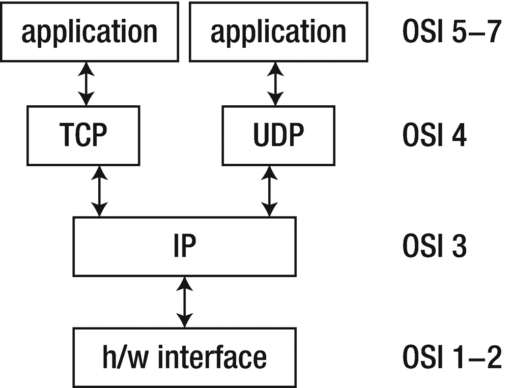

# 架构层次

本章涵盖了分布式系统的主要架构特性。分布式系统是由通过网络交互的组件组成的集合。你无法在毫无构想的情况下构建一个系统。如果你不了解系统运行的环境，你也无法构建它。`GUI` 程序与批处理程序不同；游戏程序与商业程序不同；分布式程序与单机程序也不同。它们各有其方法、常见模式、典型问题以及常用解决方案。

本章将介绍分布式系统的高层架构方面。审视这类系统有多种视角，其中许多都会涉及。我们从分层模型入手，以帮助理解组件边界，讨论网络实现细节，并思考组件之间如何传递消息，最后总结错误条件及其思考方式。

## 协议层

分布式系统*很复杂*。它涉及多台计算机，这些计算机必须以某种方式连接起来。必须编写程序在系统中的每台计算机上运行，并且它们必须相互协作以完成分布式任务。

处理复杂性的常见方法是将其分解为更小、更简单的部分。这些部分有其自身的结构，同时也具备与其他相关部分通信的明确定义方式。在分布式系统中，这些部分被称为*协议层*，它们具有清晰定义的功能。它们形成一个栈，每一层与上层和下层进行通信。层与层之间的通信由协议定义。

网络通信需要协议来涵盖从高层应用通信到底层线缆通信的全过程，而复杂性则通过协议层中的封装来处理。

### ISO OSI 协议

尽管从未完全实现，但 OSI（开放系统互连）协议在讨论和影响分布式系统设计的方式上产生了重大影响。其常见形式如图 1-1 所示。

**图 1-1** 开放系统互连协议

### OSI 层

从底层到顶层，每一层的功能如下：

- **物理层**使用电气、光学或无线电技术传输比特流。
- **数据链路层**将信息包封装成网络帧，以便通过物理层传输，并再还原为信息包。
- **网络层**提供交换和路由技术。
- **传输层**提供端系统间的透明数据传输，并负责端到端的错误恢复和流量控制。
- **会话层**负责建立、管理和终止应用程序之间的连接。
- **表示层**提供对数据表示差异（例如加密）的独立性。
- **应用层**支持应用程序和终端用户进程。

OSI 模型中的一层通常映射到现代协议；例如，`TCP/IP` 中的 `IP` 映射到网络层，也称为第 3 层（物理层为第 1 层）。应用层（第 7 层）映射到 `HTTP`。有些协议（如 `HTTPS`）似乎融合了第 5 层（会话层）和第 6 层（表示层）。没有模型是完美的；OSI 模型之外存在其他更贴近现实情况的替代模型，例如 `TCP/IP` 协议模型。

### TCP/IP 协议

在 OSI 模型被争论、讨论、部分实现和争执不休的同时，DARPA 互联网研究项目正忙于构建 `TCP/IP` 协议。这些协议取得了巨大成功，并催生了**互联网**（首字母大写）。这是一个更简单的协议栈，如图 1-2 所示。

**图 1-2** TCP/IP 协议

### 其他替代协议

尽管看起来并非如此，但 `TCP/IP` 协议并非唯一存在的协议，长远来看甚至可能不是最成功的。维基百科的网络协议列表（见 `https://en.wikipedia.org/wiki/List_of_network_protocols_(OSI_model)`) 在 OSI ISO 的每一层都列出了大量其他协议。其中许多已过时或用途不大，但由于各个领域技术的进步——例如太空互联网和物联网——总会有新协议的空间。

本书主要关注 OSI 第 3 层和第 4 层（`TCP/IP`，包括 `UDP`），但您应了解还有其他协议存在。

## 网络

*网络*是一种用于连接称为主机的终端系统的通信系统。连接机制可能涉及铜线、以太网、光纤或无线技术，但这并非我们此处关注的焦点。局域网（LAN）连接距离较近的计算机，通常属于家庭、小型组织或大型组织的一部分。

广域网（WAN）跨越更大的物理区域连接计算机，例如城市之间。还有其他类型，如城域网（MAN）、个人局域网（PAN），甚至体域网（BAN）。

互联网是连接两个或多个不同网络（通常是局域网或广域网）的网络。内联网是一个所有网络都属于单一组织的互联网。

互联网和内联网之间存在显著差异。通常，内联网处于单一管理控制之下，将实施一套统一的策略。相反，互联网不受单一机构控制，对不同部分实施的控制甚至可能互不兼容。

此类差异的一个简单例子是：内联网通常仅限于由少数供应商提供的、运行特定操作系统标准化版本的计算机。而互联网则通常包含各式各样的计算机和操作系统。

本书的技术适用于互联网。它们也适用于内联网，但后者中您也会发现专用的、不可移植的系统。

此外，还有所有互联网之“母”：因特网。它只是一个非常非常庞大的互联网，将我们连接到谷歌，将我的计算机连接到你的计算机，以此类推。

## 网关

*网关*是用于连接两个或多个网络的实体的通用术语。中继器在物理层工作，将信息从一个子网复制到另一个子网。网桥在数据链路层工作，在网络之间复制帧。路由器在网络层工作，不仅在网络之间移动信息，还决定路由路径。

## 主机级网络

在单个主机上，设计、调试或部署基于网络的软件时，我们还需要考虑其他事项。其中一些包括：

- DNS（域名系统，即人类友好的命名）
- 防火墙（例如，阻止入站或出站流量）
- 路由（例如，确定将数据包发送到哪个网络）
- 主机身份管理（例如，IP 地址）
- 性能控制（例如，流量整形或重试）
- 连接问题（例如，缺失网络适配器、机器内进程通信）

通过示例，我们将了解主机配置错误可能如何体现在我们的软件中。

