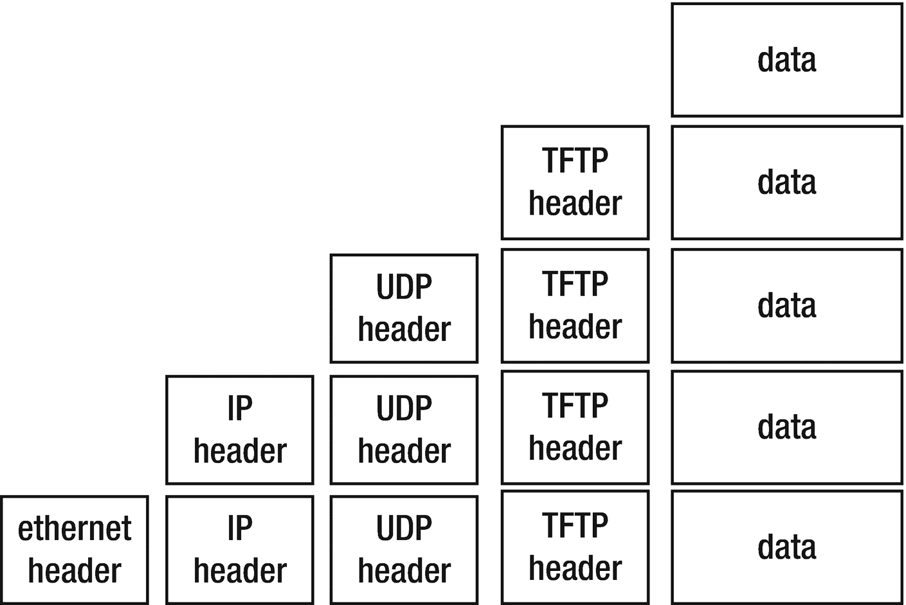

# 数据包封装

在 OSI 或 TCP/IP 协议栈中，各层之间的通信是通过将数据包从一层发送到下一层，最终跨越网络完成的。每一层都需要维护其自身的管理信息。当数据包向下传递时，该层通过向上层接收到的数据包添加头部信息来实现这一点。在接收端，当数据包向上传递时，这些头部信息会被移除。

例如，TFTP（简单文件传输协议）用于在计算机之间传输文件。它使用基于 IP 协议之上的 UDP 协议，而 IP 协议则可能通过以太网发送。这看起来如图 1-3 所示。

图 1-3

TFTP（简单文件传输协议）

