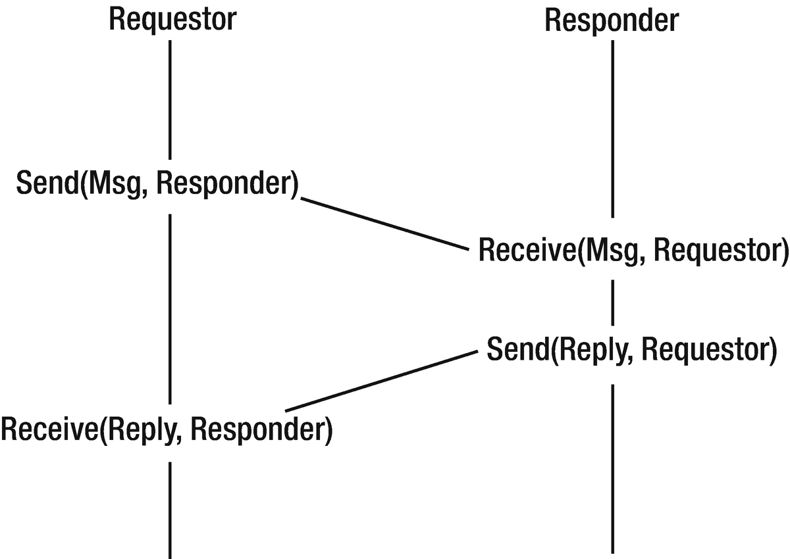
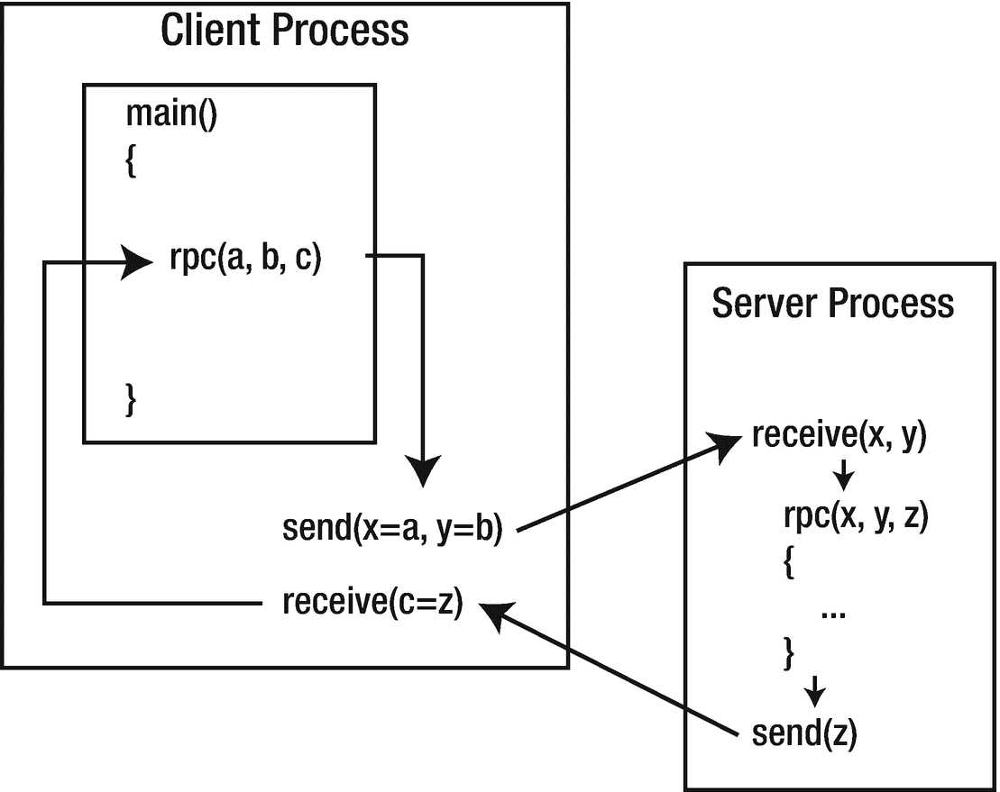

# 通信模型

在一个分布式系统中，会有许多组件（即进程）运行，它们之间必须相互通信。为此，有两种主要模型：消息传递和远程过程调用。在网络环境中，这些模型允许进程间（和/或线程间）通信，旨在调用远程进程上的行为。

## 消息传递

有些语言是建立在消息传递原则之上的。并发语言（和工具）经常使用这种机制，最著名的例子可能是 UNIX 管道。UNIX 管道是一个字节管道，但这并非其固有限制：微软的 PowerShell 可以沿其管道发送对象，而像 Parlog 这样的并发语言可以在并发进程之间发送消息中的任意逻辑数据结构。较新的语言如 Go 也拥有（线程间）消息传递的机制。

消息传递是分布式系统的一种原始机制。建立一个连接，然后沿连接向下推送一些数据。在另一端，解析消息内容并对其做出响应，可能会发送回消息。如图 1-4 所示。

图 1-4

消息传递通信模型

事件驱动系统以类似的方式运作。在底层，编程语言 `node.js` 运行一个事件循环，等待 I/O 事件，调度这些事件的处理程序并做出响应。在更高层次，大多数用户界面系统使用事件循环等待用户输入，而在网络世界中，Ajax 使用 `XMLHttpRequest` 发送和接收请求。

## 远程过程调用

在任何系统中，都存在从系统一个部分到另一个部分的信息传输和流程控制。在过程式语言中，这可能包括过程调用，其中信息被放置在调用栈上，然后流程控制转移到程序的另一部分。

即使是在过程调用中，也存在各种变体。代码可能是静态链接的，因此控制权从程序可执行代码的一个部分转移到另一个部分。由于库例程的使用日益增多，将此类代码放在共享对象（`.so`）或动态链接库（`.dll`）中已变得司空见惯，此时控制权会转移到一个独立的代码片段。

库与调用代码运行在同一台机器上。将控制权转移到运行在不同机器上的过程（即远程库）是一个（概念上）简单的步骤。但其具体机制并不简单！然而，这种控制模型催生了远程过程调用（RPC），后续章节将对此进行详细讨论。如图 1-5 所示。

图 1-5

远程过程调用通信模型

这方面有很多例子：有些基于特定的编程语言，例如 Go 的 `rpc` 包（在第 13 章讨论），有些则是覆盖多种语言的 RPC 系统，例如 SOAP 和 Google 的 gRPC。

消息传递和 RPC 之间的区别可能并不明确。从一个层面来看，它们都涉及到在“别处”调用行为。一般来说，与消息传递（例如调用远程队列系统）相比，RPC 往往不那么抽象（即，看起来和感觉上像常规的过程调用）。但在底层，RPC 还是通过传递消息来实现的。

