# 分布式计算模型

在最高层面上，我们可以考虑分布式系统中各组件的等价性或非等价性。最常见的情况是非对称的：客户端向服务器发送请求，服务器进行响应。这就是*客户端-服务器*系统。

如果两个组件是对等的，都能够发起和响应消息，那么我们就有了一个*对等网络*系统。请注意，这是一个逻辑上的分类：一个对等点可能是拥有 16,000 个核心的超级计算机；另一个可能是一部手机。但如果两者都能执行类似的操作，那么它们就是对等点。

这些示意图如图 1-6 所示。

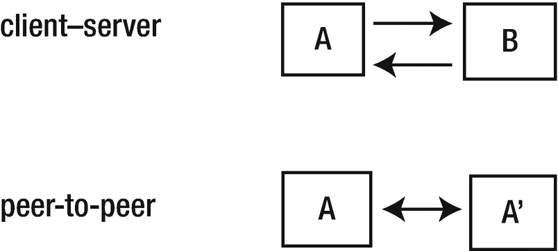

图 1-6

客户端-服务器系统与对等网络系统

客户端-服务器系统的一个例子是浏览器与 Web 服务器通信。对等网络系统的一个例子是数据库系统，其中数据在两者上都有副本且均可访问。

这些系统的组合产生了所谓的多层架构，其中三层架构是最常见的一种（即，表示层 -> 应用层 -> 数据层，或浏览器 -> Web 服务器 -> 数据库）。

## 客户端-服务器系统

图 1-7 展示了客户端-服务器系统的另一种视图。

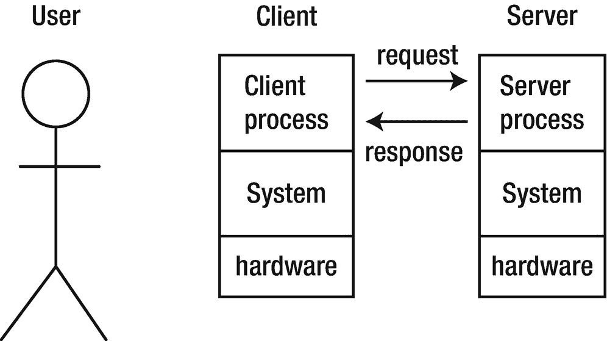

图 1-7

客户端-服务器系统

这个视图可能来自一个需要了解系统组件的开发者。同时，它也可能是用户持有的视图：浏览器的用户知道浏览器正在自己的系统上运行，但同时与别处的服务器通信。

之前的图表与我们之前讨论的 OSI 模型看起来很相似。图 1-7 中的各层也是可选的；例如，我们可以将客户端和服务器进程放在同一台硬件上。位于同一台机器上意味着我们可能可以移除 OSI 模型中的某些层，包括第一层（物理层）、第二层（数据链路层）和第三层（网络层）。我们说“可能”是因为，出于各种原因（如工具同质性或安全性），这些层可能仍然是被需要的。

## 客户端-服务器应用

某些应用可能是无缝分布式的，用户甚至意识不到它是分布式的。用户将看到他们视角下的系统，如图 1-8 所示。

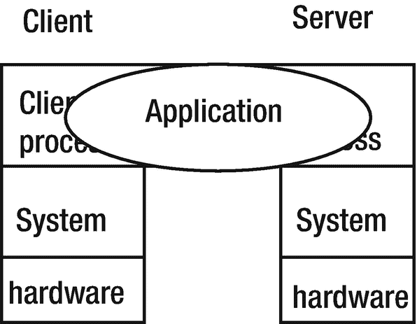

图 1-8

用户视角下的系统

为了正常运行，两个组件都必须安装，这种无缝性的复杂程度会因应用（及其使用方式）而异。

## 服务器分布

客户端-服务器系统不必是简单的。基础模型是单客户端、单服务器系统，如图 1-9 所示。

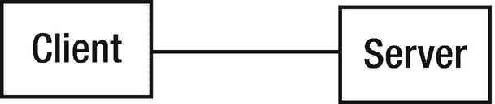

图 1-9

单客户端、单服务器系统

然而，也可以有多客户端、单服务器的情况，如图 1-10 所示。

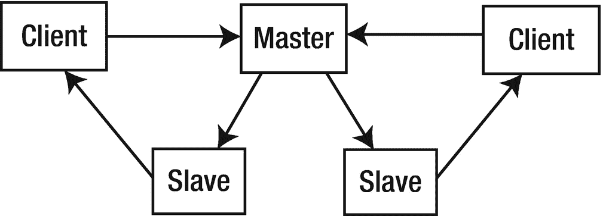

图 1-10

多客户端、单服务器系统

在这个系统中，主服务器接收请求，但不是自己逐个处理，而是将它们传递给其他服务器处理。这是一种在可能存在并发客户端时常见的模型。

也存在单客户端、多服务器的情况，如图 1-11 所示。

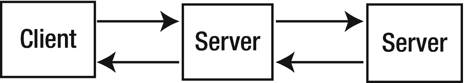

图 1-11

单客户端、多服务器系统

这种类型的系统经常出现在一个服务器需要作为其他服务器的客户端时，例如业务逻辑服务器从数据库服务器获取信息。当然，也可能存在多客户端与多服务器的情况。

同样，这些组件可能在也可能不在同一物理硬件上。

## 通信流

前面的图表展示了系统高级组件之间的连接视图。数据将在这些组件之间流动，并且可以通过多种方式流动，下文将对此进行讨论。

### 同步通信

在同步通信中，一方将发送一条消息并阻塞，等待回复。这通常是最容易实现的模型，仅依赖于阻塞 I/O。然而，可能需要存在超时机制，以防出现某种错误导致永远不会发送回复。

### 异步通信

在异步通信中，一方发送一条消息后，不等待回复，而是继续进行其他工作。当回复最终到达时，再对其进行处理。这可能在另一个线程中处理，或者通过中断当前线程来处理。这类应用程序构建起来更困难，但使用起来更灵活。

在考虑这些协议层及相关实现时，我们如何描述通信流并不总是显而易见的。例如，TCP 是同步的还是异步的？在设计网络应用时，通信流用于描述应用的逻辑（你是等待响应还是不等待响应？）。当我们向传输层（TCP）提供数据时，我们并不等待它发送和响应，我们的应用会继续运行。从这个角度来看，我们认为 TCP 是异步的。

### 流式通信

在流式通信中，一方会发送连续的消息流。在线视频就是一个很好的例子。流式传输可能需要实时处理，可能容忍也可能不容忍丢失，可以是单向的，或者允许如控制消息那样的反向通信。这就是为何 TCP 常优先于 UDP 使用，即使这种有序性需要付出代价。

### 发布/订阅

在发布/订阅系统中，各方订阅主题，而其他方则向这些主题发布消息。这可以小规模，也可以大规模，如 Twitter 这样的服务和 Kafka 这样的软件所示范的那样。设计一个包含发布/订阅功能的多层系统可以实现生产者和消费者的解耦。解耦使我们更具容错性，并通常能提高系统扩展能力（例如，增加更多生产者和消费者）。将消息存储于第三方（即远程队列）提供了这种能力。队列如何运行和扩展本身就是一个涉及分布式计算（和存储）的研究领域。

## 组件分布

一种简单但有效的分解许多应用的方法是将它们视为由三部分组成：

- 表示组件
- 应用逻辑
- 数据访问

*表示组件*负责与用户的交互，包括显示数据和收集输入。它可以是具有按钮、列表、菜单等元素的现代图形用户界面，或者是较旧的、通过提问获取答案的命令行风格界面。它也可能涵盖更广泛的交互方式，例如与收银机和 ATM 等物理设备的交互。它还可以涵盖与非人类用户的交互，比如在机器对机器系统中。在这个层面上，细节并不重要。

*应用逻辑*负责解释用户的响应、应用业务规则、准备查询，以及管理来自第三组件的响应。

*数据访问*组件负责存储和检索数据。这通常通过数据库实现，但并非必须如此。

### 高德纳分类法

基于这种应用的三部分分解，高德纳公司考虑了在客户端-服务器系统中这些组件如何进行分布。他们提出了五种模型，如图 1-12 所示。这些模型概念化了客户端或服务器上的各种用途。虽然处于高层，但它们仍然列举了关于功能放置的多种可能性。

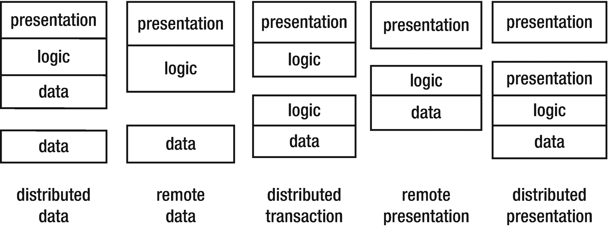

图 1-12

高德纳的五种模型

#### 示例：分布式数据库

Gartner 模型 - 分布式数据（见图 1-13）

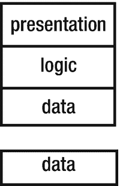

图 1-13

Gartner 模型 – 分布式数据

现代手机就是一个很好的例子。由于内存有限，它们可能在本地存储数据库的一小部分，以便通常能够快速响应。然而，如果需要的数据不在本地存储中，则可能会向远程数据库发送请求以获取额外的数据。

`Google Maps` 是另一个很好的例子。所有地图都存储在`Google`的服务器上。当用户请求某张地图时，“附近”的地图也会被下载到浏览器中的一个小型数据库中。当用户稍微移动地图时，所需的额外数据已经在本地存储中，从而实现快速响应。

#### 示例：网络文件服务

Gartner 模型 - 远程数据（见图 1-14）

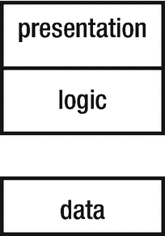

图 1-14

Gartner 模型 – 远程数据

这种分类允许远程客户端访问共享文件系统。此类系统有很多例子：`NFS`、`DCE` 等。

#### 示例：万维网

Gartner 分类 - 分布式事务（见图 1-15）

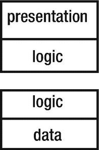

图 1-15

Gartner 模型 – 分布式事务

在万维网上，客户端可能拥有`JavaScript`（过去是`Java Applets`甚至是`Adobe Flash`）中的逻辑，而服务器则拥有`CGI`脚本或类似技术（`Ruby on Rails`等）中的逻辑。这是一个分布式的超文本系统，具有许多额外的机制。

#### 示例：终端仿真

Gartner 分类 - 远程表示（见图 1-16）

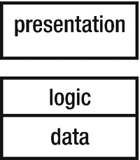

图 1-16

Gartner 模型 – 远程表示

终端仿真允许远程系统充当本地系统上的普通终端。`Telnet` 是最常见的例子。

#### 示例：安全外壳

Gartner 分类 - 分布式表示（见图 1-17）

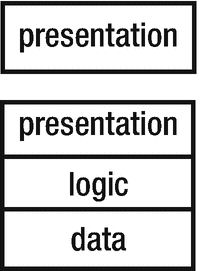

图 1-17

Gartner 模型 – 分布式表示

`UNIX`上的安全外壳允许你连接到远程系统，在那里运行命令，并在本地显示结果。表示是在远程机器上准备好的，并在本地显示。在`Windows`下，远程桌面的行为类似。

### 三层模型

当然，既然有两层，那就可以有三层、四层或更多层。图 1-18 展示了一些三层模型的可能性。

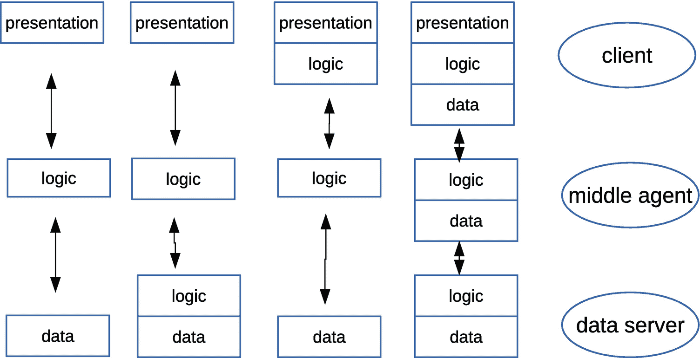

图 1-18

三层模型

现代万维网是其中最右侧模型的一个很好的例子。后端由数据库组成，通常运行存储过程来保存部分数据库逻辑。中间层是一个`HTTP`服务器，例如运行`PHP`脚本（或`Ruby on Rails`、`JSP`页面、`Go` `net/http`包等）的`Apache`。这将管理部分逻辑，并在本地存储诸如`HTML`页面之类的数据。前端是用于显示页面的浏览器，在部分`JavaScript`的控制下运行。在`HTML5`中，前端也可能拥有本地数据库。

### 胖与瘦

组件常用的标签是“胖”或“瘦”。胖组件占用大量内存并进行复杂处理。相反，瘦组件则两者都很少做。似乎不存在“正常”大小的组件，只有胖的或瘦的！

胖或瘦是一个相对的概念。浏览器通常被认为是瘦的，因为它们只负责显示网页。然而，我`Linux`机器上的`Firefox`几乎占用半 GB 内存，我可不认为这算小！

## 中间件模型

中间件是连接分布式系统组件的“粘合剂”。这些组件是操作系统所提供功能之外的附加组件。中间件模型如图 1-19 所示。

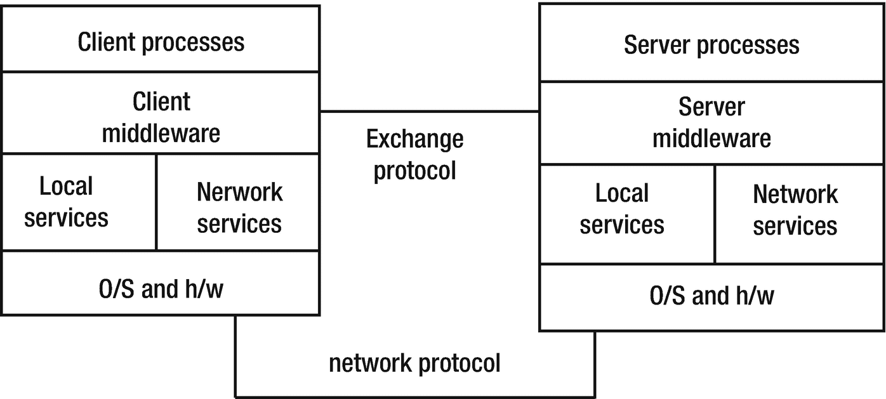

图 1-19

中间件模型

中间件的组成部分包括以下内容：

*   中间件层是一个使用网络服务的、与应用程序无关的软件。
*   能够跨不同应用程序规范化访问和/或操作。
*   配置（例如，安全配置文件）。

`TCP/IP` 是通常由操作系统提供的服务的一个例子。

### 中间件示例

中间件的示例包括以下内容：

*   原始服务，如文件传输或电子邮件
*   基本服务，如`RPC`（例如`Apache Thrift`或`gRPC`）
*   对象服务，如`RMI`和`Jini`
*   集成服务，如`DCE`（`分布式计算环境` – `DNS`、时间等）
*   分布式对象服务，如`CORBA`和`OLE`/`ActiveX`（即发现服务）
*   万维网
*   企业服务总线

我们使用中间件库来最大限度地减少开发自定义解决方案的需求，就像任何共享库一样，但侧重于基于网络的服务。

### 中间件功能

中间件的功能可以包括以下这些：

*   在不同计算机上启动进程
*   会话管理
*   允许客户端定位服务器的目录服务
*   远程数据访问（例如，编码/解码）
*   允许服务器处理多个客户端的并发控制
*   安全性和完整性
*   监控
*   终止进程，包括本地和远程进程

在构建自定义 Web 服务器时，也会使用“中间件”这个术语。例如，如果你想记录每个请求和/或响应到本地文件，你可以将函数（称为中间件）添加到操作栈中。当你的函数恰好利用了如前所述的网络服务时，我们就简单地称之为中间件。

## 处理连续体

Gartner 模型基于将应用程序分解为表示、应用逻辑和数据处理组件。图 1-20 展示了更细粒度的分解。

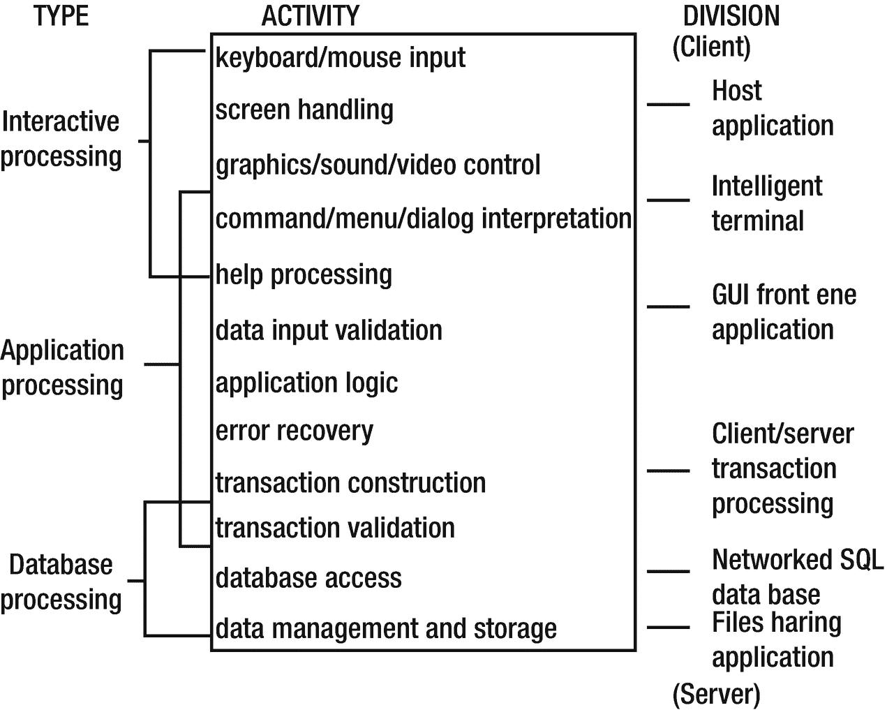

图 1-20

将应用程序分解为其表示组件

