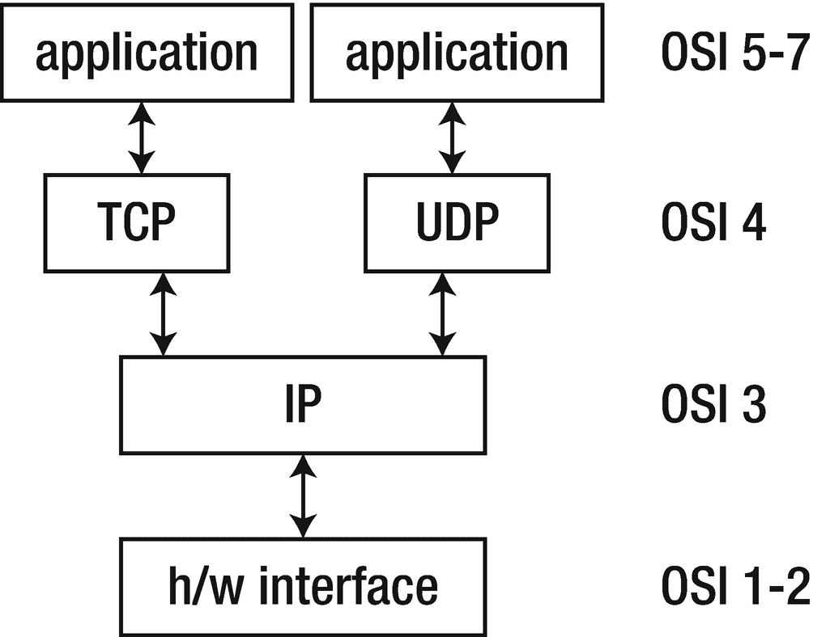

# 3. 套接字级编程

套接字是网络端点的一种抽象表示。根据操作系统的不同，我们可以基于以下特性构建套接字：域、类型和协议。“域”通常代表远程网络连接（例如，通过 IPv4 或 IPv6）或本地连接（例如，通过文件系统）。当我们无需考虑跨越多网络传输时，可以获得多种优化。“类型”用于选择面向连接或无连接的套接字配对。套接字为建立点对点通信提供了必要的抽象。

世界上存在多种网络。从非常古老的网络（如串行链路），到由铜线和光纤构成的广域网，再到各种类型的无线网络（用于计算机和电话等电信设备）。这些网络在物理链路层显然不同，但在许多情况下，它们在 OSI 模型的高层也不同。

多年来，网络技术已逐渐收敛到由 IP 和 TCP/UDP 构成的“互联网协议栈”。例如，蓝牙定义了物理层和协议层，但在此之上，它还有一个 IP 协议栈，因此许多互联网编程技术同样适用于蓝牙设备。类似地，开发物联网（IoT）无线技术（如 LoRaWAN 和 6LoWPAN）也包含了 IP 协议栈。

虽然 IP 提供了 OSI 模型的网络层（第 3 层），但 TCP 和 UDP 处理的是传输层（第 4 层）。即使在互联网世界中，它们也并非最终方案：SCTP（流控制传输协议）来自电信领域，旨在挑战 TCP 和 UDP；而要在行星际空间提供互联网服务，则需要新的、正在开发中的协议，如 DTN（延迟容忍网络）。尽管如此，IP、TCP 和 UDP 现在以及未来相当长一段时间内仍将是主要的网络技术。Go 对此类编程风格提供了全面支持。

本章将展示如何使用 Go 进行 TCP 和 UDP 编程，以及如何使用原始套接字处理其他协议。

## TCP/IP 协议栈

OSI 模型（ISO/IEC 7498）是通过委员会流程制定的，即先设立标准，然后实施。OSI 标准的某些部分晦涩难懂，某些部分不易实现，还有部分尚未实现。

TCP/IP 协议则是由 DARPA（美国国防部高级研究计划局）长期项目开发的。其工作方式是先有实现，随后发布 RFC（请求评议）。TCP/IP 是主要的 UNIX 网络协议。TCP/IP 代表传输控制协议/互联网协议（RFC 793/RFC 791）。

如图 3-1 所示，TCP/IP 协议栈比 OSI 协议栈更简洁。



TCP 是一种面向连接的协议，而 UDP（用户数据报协议）是一种无连接协议。

接下来，我们讨论点对点通信层（物理层/数据链路层）之上的各层。

### IP 数据报

IP 层提供了一种无连接且不可靠的交付系统。它将每个数据报视为独立于其他数据报。数据报之间的任何关联必须由更高层提供。数据报本身具有明确定义的格式；从高层次看，它包含一个头部和一个有效载荷。重要的字段包括地址信息和上层协议选择。

IP 层为其自身头部提供校验和。IP 协议默认将任何错误纠正交由其他层处理。头部包含源地址和目标地址。IP 层负责通过互联网进行路由。它还负责将大型数据报拆分成较小的数据报进行传输，并在另一端重新组装。结合前述内容，每个路由器都通过其校验和验证 IP 数据包的正确性。此外，路由器会修改 IP 数据包头部（例如，修改 TTL），从而触发其重新计算并替换头部。

在网络层之上，我们有以下传输层选项。

### UDP

UDP 同样是无连接且不可靠的。它相对于 IP 增加了数据报内容的校验和以及*端口号*。这些端口号用于实现客户端-服务器模型，稍后你会看到。可以把端口想象成公寓号码，而 IP 地址则是公寓的街道门牌号。

### TCP

TCP 提供了逻辑，在 IP 之上构建可靠的面向连接协议。它提供了一个*虚拟电路*，两个进程可以通过它进行通信。它还使用端口号来标识主机上的服务。在 TCP 中，客户端-服务器连接中使用的两个套接字代表一个虚拟电路。虽然感觉像是专用的物理连接，但许多虚拟电路可以运行在同一个（或多个）物理连接上。

我们简要介绍了网络层（IP）和传输层（UDP/TCP），但还有很多需要学习的内容。例如，IP 分片和 TCP 分段允许每一层控制传递给下一层的每个数据包的大小。这听起来可能相似，但在本例中，TCP 分段包含序列信息以保持数据包顺序（可靠性），而 IP 分片则侧重于优化将数据传递给其下层（这些下层有自己的最大尺寸）。

IP 地址是使用套接字的关键。


## 互联网地址

要使用某项服务，你必须能够找到它。互联网为计算机等设备使用了一套地址方案，以便能够定位它们。这套地址方案最初设计时，只有少量计算机连接，并且非常慷慨地允许使用 32 位无符号整数，最多提供 2³² 个地址。这就是所谓的 IPv4 地址。近年来，连接（或至少可直接寻址）设备的数量已威胁要超过这个数字，因此正在逐步过渡到 IPv6。这种过渡并不均衡，例如在谷歌的图表中有所体现（`https://www.google.com/intl/en/ipv6/statistics.html`——截至 2022 年 1 月约为 37%）。遗憾的是——从 Jan 的角度来看——很少有澳大利亚的 IP 提供商支持 IPv6（截至 2022 年约为 30%）。在美国（对 Ron 而言），这个比例略高，约为 50%。这些数字基于观察到的传入流量和相关记录。

### IPv4 地址

地址是一个 32 位整数，用于表示 IP 地址。这个地址指向单个设备上的网络接口卡。该地址通常以十进制表示四个字节，并用点分隔，例如 `127.0.0.1` 或 `66.102.11.104`。这种点分十进制格式以一种对用户友好的方式包含了多条信息。

任何设备的 IP 地址通常由两部分组成：设备所在网络的地址，以及该网络内设备的地址。从前，网络地址和内部地址的划分很简单，基于 IP 地址中使用的（点之间的）字节。

- 在 A 类网络中，第一个字节标识网络，后三个字节标识设备。只有 128 个 A 类网络，由互联网领域的早期参与者拥有，例如 IBM、通用电气公司和麻省理工学院。^(²) 示例：`3.x.y.z`。

- B 类网络使用前两个字节标识网络，后两个字节标识子网内的设备。这允许一个子网内最多有 2¹⁶（65,536）个设备。示例：`142.90.y.z`。

- C 类网络使用前三个字节标识网络，最后一个字节标识该网络内的设备。这允许一个子网内最多有 2⁸（实际上是 254，而不是 256，因为最低和最高地址被保留）个设备。示例：`192.168.123.z`。

在 C 类网络之外，还定义了其他类别（D 类和 E 类）。我们在此停止，因为当讨论当今网络时，这更多是历史研究而非实用知识。

如果你需要一个网络上有 400 台计算机，这种方案就行不通了。254 太小（C 类），而 65,536（-2）又太大（B 类）。用二进制算术来说，你大约需要 512（-2）。这可以通过使用 23 位网络地址和 9 位设备地址来实现。类似地，如果你需要多达 1024（-2）个设备，则使用 22 位网络地址和 10 位设备地址。一种新的方案被创建出来以替代基于类别的寻址，称为无类别域间路由（又称 CIDR），它能够实现我们正在描述的场景。

给定一个设备的 IP 地址，并且知道网络地址使用了多少位 `N`，就可以相对直接地提取出网络地址和该网络内的设备地址。形成一个“网络掩码”（也称为子网掩码），它是一个 32 位的二进制数，前 `N` 位全是 1，其余位全是 0。例如，如果网络地址使用 16 位，则掩码为 `11111111111111110000000000000000`。使用二进制有些不方便，因此通常使用十进制字节。对于 16 位网络地址，网络掩码是 `255.255.0.0`；对于 24 位网络地址，是 `255.255.255.0`；对于 23 位地址，是 `255.255.254.0`；对于 22 位地址，则是 `255.255.252.0`。这个网络掩码是基于类别的寻址的通用形式。24 位网络的简写是 `/24`；22 位地址的简写是 `/22`。

因此，要找到设备的网络地址，将其 IP 地址与网络掩码进行按位 **与** 运算，而要找到子网内的设备地址，则将 IP 地址与网络掩码的按位取反结果进行按位 **与** 运算。例如，IP 地址 `192.168.1.3` 的二进制值是 `11000000101010000000000100000011`（使用 IP 地址子网掩码计算器）。如果使用 16 位网络掩码，网络地址为 `1100000010101000 0000000000000000`（即 `192.168.0.0`），而设备地址为 `0000000000000000 0000000100000011`（即 `0.0.1.3`）。

当网络提供商为你提供一个网络时，会同时提供一个网络掩码。例如，本地 ISP 为你办公室提供一个 `w.x.y.z/29` 网络（6 个主机地址）。ISP 从 RIR（区域互联网注册管理机构）/IANA（互联网号码分配机构）获得一个地址块（大量主机）。通常，子网号每减少一位，主机数量就会翻倍（2 的幂次方）。

### IPv6 地址

互联网的发展远远超出了最初的预期。最初慷慨的 32 位寻址方案已濒临枯竭。存在一些令人不快的变通方法，例如 NAT（网络地址转换）寻址，但最终我们将不得不切换到更宽的地址空间。IPv6 使用 128 位地址。即使是字节来表示这类地址也变得繁琐，因此使用十六进制数字，每四位一组，并用冒号分隔。一个典型的地址可能是 `FE80:CD00:0000:0CDE:1257:0000:211E:729C`。

这些地址不容易记忆！DNS 将变得更加重要。有一些技巧可以简化某些地址，例如省略前导零和压缩重复的数字。例如，“localhost”是 `0:0:0:0:0:0:0:1`，可以简写为 `::1`。

每个地址分为三个部分。第一部分是用于互联网路由的网络地址，是地址的前 64 位。第二部分是 16 位的网络掩码。这用于将网络划分为子网。它可以提供从仅一个子网（全零）到 65,535 个子网（全一）的任何数量。最后一部分是设备部分，占 48 位。前面的地址中，网络部分为 `FE80:CD00:0000:0CDE`，子网部分为 `1257`，设备部分为 `0000:211E:729C`。

IPv6 和 IPv4 对比的一些要点：

- IPv6 没有校验和头部（它假设其他层执行验证）。

- IPv6 中头部许多字段是可选的。

- 虽然总体上更大，但整体数据包头部结构解析速度更快（简化了路由器处理）。

- 由于数据报大小更大并且减少了路由器重组（移至边缘节点），IPv6 相比 IPv4 减少了分片。


## IP 地址类型

终于，我们可以开始使用一些 Go 语言的网络包了。`net` 包定义了 Go 网络编程中许多有用的类型、函数和方法。`IP` 类型被定义为一个字节数组：

```go
type IP []byte
```

有几个函数可以操作 `IP` 类型的变量，但实践中你可能只会用到其中一部分。例如，`ParseIP(String)` 函数可以处理点分十进制的 IPv4 地址或冒号分隔的 IPv6 地址，而 `IP` 的 `String()` 方法则会返回一个字符串。需要注意的是，返回的字符串可能与原始输入不同：`0:0:0:0:0:0:0:1` 的字符串形式是 `::1`。

演示此过程的程序是 `ip.go`：

```
$ mkdir ch3
$ cd ch3
ch3$ vi ip.go
/* IP
*/
package main
import (
"fmt"
"log"
"net"
"os"
)
func main() {
if len(os.Args) != 2 {
log.Fatalln("Usage: %s ip-addr\n", os.Args[0])
}
name := os.Args[1]
addr := net.ParseIP(name)
if addr == nil {
fmt.Println("Invalid address")
} else {
fmt.Println("The address is ", addr.String())
}
}
```

可以像下面这样运行它：

```bash
ch3$ go run ip.go 127.0.0.1
```

输出如下：

```
The address is 127.0.0.1
```

或者也可以这样运行：

```bash
ch3$ go run IP.go 0:0:0:0:0:0:0:1
```

输出如下：

```
The address is ::1
```

如果你不熟悉，冒号地址是 IPv6 地址，其中包括 `::1`，它是 `127.0.0.1`（在 IPv4 中）的 IPv6 版本。

`IP` 类型的底层存储是一个字节数组。正如前面例子中暗示的那样，我们可以将 IPv4 和 IPv6 地址存储在同一类型中。`ParseIP`（以及最终存储到 `IP` 中）的用途包括：序列化、方便访问相关八位字节（例如，A 类地址对应 `myip[0]` – 第一个字节），以及对各种输入形式进行通用规范化（例如，`127.000.000.001 -> 127.0.0.1`）。

值得注意的是，`ParseIP` 并不一定对所有形式都进行规范化；这些非标准形式被称为“罕见 IP 地址格式”。例如，一些工具会将 `127.1` 扩展为 `127.0.0.1`；而 `net.ParseIP` 则不会。与所有编程环境一样，要捕获所有计划内或计划外的标准或事实标准是很困难的。你可以在 Golang 项目跟踪器上看到关于这个问题的持续讨论（“net: should expand IP address 1.1 to 1.0.0.1 #36822”，[`https://github.com/golang/go/issues/36822`](https://github.com/golang/go/issues/36822)）。

## 使用现有文档和示例

当你继续学习本书中的示例时，你会使用内置的示例和文档来更深入地研究标准库。例如，查看 `net` 包中名为 `IP` 的别名类型以及使用它的函数和方法。

```
ch3$ go doc net.IP
package net // import "net"
type IP []byte
An IP is a single IP address, a slice of bytes. Functions in this package
accept either 4-byte (IPv4) or 16-byte (IPv6) slices as input.
Note that in this documentation, referring to an IP address as an IPv4
address or an IPv6 address is a semantic property of the address, not just
the length of the byte slice: a 16-byte slice can still be an IPv4 address.
func IPv4(a, b, c, d byte) IP
func ParseIP(s string) IP
func (ip IP) DefaultMask() IPMask
func (ip IP) Equal(x IP) bool
func (ip IP) IsGlobalUnicast() bool
func (ip IP) IsInterfaceLocalMulticast() bool
func (ip IP) IsLinkLocalMulticast() bool
func (ip IP) IsLinkLocalUnicast() bool
func (ip IP) IsLoopback() bool
func (ip IP) IsMulticast() bool
func (ip IP) IsUnspecified() bool
func (ip IP) MarshalText() ([]byte, error)
func (ip IP) Mask(mask IPMask) IP
func (ip IP) String() string
func (ip IP) To16() IP
func (ip IP) To4() IP
func (ip *IP) UnmarshalText(text []byte) error
```

注意，有些函数返回 `IP`；其他则是使用它的方法。大多数方法看起来都是属性检查；例如，这个 IP 是回环地址吗？

接下来，让我们深入了解 `net.ParseIP`。

```
ch3$ go doc net.ParseIP
package net // import "net"
func ParseIP(s string) IP
ParseIP parses s as an IP address, returning the result. The string s can be
in IPv4 dotted decimal ("192.0.2.1"), IPv6 ("2001:db8::68"), or IPv4-mapped
IPv6 ("::ffff:192.0.2.1") form. If s is not a valid textual representation
of an IP address, ParseIP returns nil.
```

最终，你会想要找到特定函数或类型的使用示例。你的 Go 发行版通常包含示例，无论是通过测试函数还是内部使用。我们可以通过以下方式找到与 `ParseIP` 相关的测试（在基于 Unix 的系统中）：

```bash
ch3$ go test -list ".*ParseIP.*" $(go env GOROOT)/src/net
TestParseIP
BenchmarkParseIP
ExampleParseIP
ok          net        0.106s
```

以下是运行上述相关测试和基准测试的示例，重点针对 `net.ParseIP`：

```bash
ch3$ go test -run ParseIP -bench ParseIP -count=1 $(go env GOROOT)/src/net
goos: darwin
goarch: amd64
pkg: net
cpu: Intel(R) Core(TM) i7-9750H CPU @ 2.60GHz
BenchmarkParseIP-12              934454              1309 ns/op
PASS
ok          net        2.295s
```

关于前面的命令，有几点需要注意。`go env GOROOT` 会输出 Go 标准库的安装路径；`$()` 用于 UNIX 子 shell 执行（在 Windows 上，你可以直接运行 `go env GOROOT` 然后复制/粘贴）。假设采用标准包布局，我们知道 `net` 包位于 `$(go env GOROOT)/src/net`。其余命令是标准的 Go 测试命令：

*   `-list` *正则表达式* // 查找匹配 *正则表达式* 的测试/基准/示例。
*   `-run` *正则表达式* // 运行 Test*正则表达式*。
*   `-bench` *正则表达式* // 运行 Bench*正则表达式*。
*   `-count=1` // 防止测试缓存结果。

运行测试示例只是一个开始；查看代码将提供更深入的知识。以 `ParseIP` 为例，一旦我们找到测试源文件，就可以进行查看（你的输出可能不同）：

```
ch3$ grep -l TestParseIP -nr $(go env GOROOT)/src/net
/usr/local/go/src/net/ip_test.go
/usr/local/go/src/net/netip/netip_pkg_test.go (netip package has a 'smaller' ip type)
```

如果你查看 `ip_test.go` 中的相关测试及其输入，我们就能了解 `ParseIP` 期望的输入类型及其相关输出。


```
var parseIPTests = []struct {
	in  string
	out IP
}{
	{"127.0.1.2", IPv4(127, 0, 1, 2)},
	{"127.0.0.1", IPv4(127, 0, 0, 1)},
	{"127.001.002.003", IPv4(127, 1, 2, 3)},
	{"::ffff:127.1.2.3", IPv4(127, 1, 2, 3)},
	{"::ffff:127.001.002.003", IPv4(127, 1, 2, 3)},
	{"::ffff:7f01:0203", IPv4(127, 1, 2, 3)},
	{"0:0:0:0:0000:ffff:127.1.2.3", IPv4(127, 1, 2, 3)},
	{"0:0:0:0:000000:ffff:127.1.2.3", IPv4(127, 1, 2, 3)},
	{"0:0:0:0::ffff:127.1.2.3", IPv4(127, 1, 2, 3)},
	{"2001:4860:0:2001::68", IP{0x20, 0x01, 0x48, 0x60, 0, 0, 0x20, 0x01, 0, 0, 0, 0, 0, 0, 0x00, 0x68}},
	{"2001:4860:0000:2001:0000:0000:0000:0068", IP{0x20, 0x01, 0x48, 0x60, 0, 0, 0x20, 0x01, 0, 0, 0, 0, 0, 0, 0x00, 0x68}},
	{"-0.0.0.0", nil},
	{"0.-1.0.0", nil},
	{"0.0.-2.0", nil},
	{"0.0.0.-3", nil},
	{"127.0.0.256", nil},
	{"abc", nil},
	{"123:", nil},
	{"fe80::1%lo0", nil},
	{"fe80::1%911", nil},
	{"", nil},
	{"a1:a2:a3:a4::b1:b2:b3:b4", nil}, // Issue 6628
}

func TestParseIP(t *testing.T) {
	for _, tt := range parseIPTests {
		if out := ParseIP(tt.in); !reflect.DeepEqual(out, tt.out) {
			t.Errorf("ParseIP(%q) = %v, want %v", tt.in, out, tt.out)
		}
		if tt.in == "" {
			// Tested in TestMarshalEmptyIP below.
			continue
		}
		var out IP
		if err := out.UnmarshalText([]byte(tt.in)); !reflect.DeepEqual(out, tt.out) || (tt.out == nil) != (err != nil) {
			t.Errorf("IP.UnmarshalText(%q) = %v, %v, want %v", tt.in, out, err, tt.out)
		}
	}
}
```

希望这能说服你去查阅现有的文档和示例。也许还会说服你为自己写的代码创建良好的文档和示例。我们不应仅止步于示例或测试。Go 语言一个常被忽视的特性是，**Go 语言本身是用 Go 编写的**。这意味着它很容易理解。由于测试位于 `test_ip.go` 文件中，可以安全地假设 `ParseIP`（以及本例中的 `IP`）的实际代码位于 `ip.go` 中。

除了本节内容之外，我们假定你正在标准库中查找并审阅相关的示例。

### IPMask 类型

一个 IP 地址通常被划分为网络地址、子网和设备部分。网络地址和子网构成了设备部分的*前缀*。掩码是一个全为二进制 1、长度为前缀长度、后面全为 0 的 IP 地址。

为了处理掩码操作，你可以使用以下类型：

```
type IPMask []byte
```

创建一个网络掩码最简单的函数是使用 CIDR 表示法：一连串的 1 后面跟着 0，总长度等于位数：

```
func CIDRMask(ones, bits int) IPMask
```

然后，IP 地址的一个方法可以使用掩码来找到该 IP 地址对应的网络：

```
func (ip IP) Mask(mask IPMask) IP
```

以下名为 `mask.go` 的程序演示了其用法：

```
ch3$ vi mask.go
/* Mask
*/
package main
import (
	"fmt"
	"log"
	"net"
	"os"
	"strconv"
)
func main() {
	if len(os.Args) != 4 {
		log.Fatalln("Usage: %s dotted-ip-addr ones bits\n", os.Args[0])
	}
	dotAddr := os.Args[1]
	ones, _ := strconv.Atoi(os.Args[2])
	bits, _ := strconv.Atoi(os.Args[3])
	addr := net.ParseIP(dotAddr)
	if addr == nil {
		log.Fatalln("nil Invalid address")
	}
	mask := net.CIDRMask(ones, bits)
	computedOnes, computedBits := mask.Size()
	network := addr.Mask(mask)
	fmt.Println("Address is ", addr.String(),
		"\nMask length is ", computedBits,
		"\nLeading ones count is ", computedOnes,
		"\nMask is (hex) ", mask.String(),
		"\nNetwork is ", network.String())
}
```

可以编译（`go build mask.go`）为 `mask`，然后按如下方式运行：

```
ch3$ mask   
```

或者也可以直接按如下方式运行：

```
ch3$ go run mask.go   
```

对于 `/24` 网络上的 IPv4 地址 `103.232.159.187`，我们得到以下结果：

```
ch3$ go run mask.go 103.232.159.187 24 32
Address is  103.232.159.187
Mask length is  32
Leading ones count is  24
Mask is (hex)  ffffff00
Network is  103.232.159.0
```

对于网络部分为 `fda3:97c:1eb`、子网为 `fff0`、设备部分为 `5444:903a:33f0:3a6b` 的 IPv6 地址 `fda3:97c:1eb:fff0:5444:903a:33f0:3a6b`，我们得到以下结果：

```
ch3$ go run mask.go fda3:97c:1eb:fff0:5444:903a:33f0:3a6b 52 128
Address is  fda3:97c:1eb:fff0:5444:903a:33f0:3a6b
Mask length is  128
Leading ones count is  52
Mask is (hex)  fffffffffffff0000000000000000000
Network is  fda3:97c:1eb:f000::
```

当你审查一个函数的文档时，要注意其结果和相关的错误检查。在前面的例子中，如果我们传入的“bits”值与 IPv4 或 IPv6 地址的宽度不匹配，会导致 `CIDRMask` 返回 `nil`。然后将 `nil` 掩码值传递给 `addr.Mask` 会相应地返回 `nil`。我们可以讨论前面的例子是否过于简单而无法处理错误（可能吧）；但同样重要的是，要注意库返回了什么（即使它没有解释原因，例如，为什么返回 `nil` 而不是错误字符串）。

```
ch3$ go run mask.go 103.232.159.187 24 44 # 44 != 32 nor 128
Address is  103.232.159.187
Mask length is  0
Leading ones count is  0
Mask is (hex)  
Network is  
```

IPv4 网络掩码通常以四字节点分表示法给出，例如 `/24` 网络的 `255.255.255.0`。有一个函数可以从这样一个四字节的 IPv4 地址创建掩码：

```
func IPv4Mask(a, b, c, d byte) IPMask
```

此外，IP 还有一个方法可以返回（仅限）IPv4 的默认掩码：

```
func (ip IP) DefaultMask() IPMask
```

注意，掩码的字符串形式是一个十六进制数，例如 `/24` 掩码的 `ffffff00`。

以下名为 `ipv4mask.go` 的程序说明了这些内容：

```
ch3$ vi ipv4mask.go
/* IPv4Mask
*/
package main
import (
	"fmt"
	"log"
	"net"
	"os"
)
func main() {
	if len(os.Args) != 2 {
		log.Fatalln("Usage: %s dotted-ip-addr\n", os.Args[0])
	}
	dotAddr := os.Args[1]
	addr := net.ParseIP(dotAddr)
	if addr == nil {
		log.Fatalln("nil Invalid address")
	}
	mask := addr.DefaultMask()
	network := addr.Mask(mask)
	ones, bits := mask.Size()
	fmt.Println("Address is ", addr.String(),
		"\nDefault mask length is ", bits,
		"\nLeading ones count is ", ones,
		"\nMask is (hex) ", mask.String(),
		"\nNetwork is ", network.String())
	derivedMask := net.IPv4Mask(255, 255, 0, 0) // working on mask
	fmt.Printf("Network using %s: %s\n", derivedMask, addr.Mask(derivedMask))
}
```

例如，在家庭网络中运行以下命令

```
ch3$ go run ipv4mask.go 192.168.1.3
```

会得到以下结果：

```
Address is  192.168.1.3
Default mask length is  32
Leading ones count is  24
Mask is (hex)  ffffff00
Network is  192.168.1.0
Network using ffff0000: 192.168.0.0
```


#### 基本路由

了解了如何将 IP 地址与子网掩码进行（二进制）与运算以得出网络 IP 后，它的用途是什么呢？其主要用途在于路由：路由器需要确定下一跳（即数据包发送的目的地）。由于计算机通常不止一跳之遥，我们需要借助一系列路由器来传输流量。每个路由器都维护着一个查找表，并据此决定将流量转发至何处。如果为每个目标 IP 都映射一个特定的下一跳，效率会非常低下。因此，我们改为将多个 IP 路由至同一个特定的下一跳。换句话说，一个子网对应一个特定的下一跳。下面是一个将数据包路由到特定目的地的示例。

```
ch3$ vi ipv4router.go
/* IPv4Router
*/
package main
import (
"fmt"
"net"
)
func main() {
routingTable := []struct {
subnetmask net.IP
network    net.IP
nextHop    net.IP
}{
{net.IP{255, 255, 255, 240}, net.IP{192, 17, 7, 208}, net.IP{192, 12, 7, 15}},
{net.IP{255, 255, 255, 240}, net.IP{192, 17, 7, 144}, net.IP{192, 12, 7, 67}},
{net.IP{255, 255, 255, 0}, net.IP{192, 17, 7, 0}, net.IP{192, 12, 7, 251}},
{net.IP{0, 0, 0, 0}, net.IP{0, 0, 0, 0}, net.IP{10, 10, 10, 10}},
}
incomingPacketsToRoute := []struct {
sourceAddr      net.IP
destinationAddr net.IP
data            string
}{
{net.IP{1, 2, 3, 4}, net.IP{2, 3, 4, 5}, "who knows, send to 0.0.0.0"},
{net.IP{1, 2, 3, 4}, net.IP{192, 17, 7, 20}, "better be 192.17.7.251"},
}
for _, packetToRoute := range incomingPacketsToRoute {
for _, routingEntry := range routingTable {
r := packetToRoute.destinationAddr.Mask(net.IPMask(routingEntry.subnetmask))
if r.Equal(routingEntry.network) {
fmt.Printf("For destination %s nexthop is %s\n", packetToRoute.destinationAddr, routingEntry.nextHop)
break //check remaining ips
}
}
}
}
ch3$ go run IPv4Router.go
For destination 2.3.4.5 nexthop is 10.10.10.10
For destination 192.17.7.20 nexthop is 192.12.7.251
```

如上述输出所示，第一个数据包的目的地为 `2.3.4.5`，但路由表中未找到匹配项。路由表中的最后一条记录通常是默认路由。在我们的表中，其默认的下一跳是 `10.10.10.10`。第二个数据包的目的地 `192.17.7.20` 与网络 IP `192.17.7.0` 匹配，其对应的下一跳是 `192.12.7.251`。

#### IPAddr 类型

`net` 包中的许多其它函数和方法会返回一个指向 `IPAddr` 的指针。这只是一个包含 IP 地址（以及 IPv6 地址可能需要的区域标识）的结构体。当存在多个网络接口的模糊 IPv6 地址时，可能需要区域标识。您可以在此处了解区域（IPv6 范围地址）的相关信息：[`https://datatracker.ietf.org/doc/html/rfc4007`](https://datatracker.ietf.org/doc/html/rfc4007)。

```
type IPAddr {
IP IP
Zone string
}
```

该类型的主要用途是对 IP 主机名执行 DNS 查找。

```
func ResolveIPAddr(net, addr string) (*IPAddr, error)
```

其中 `net` 的值可以是 `ip`、`ip4` 或 `ip6`。这在名为 `resolveip.go` 的程序中有所展示：

```
ch3$ vi resolveip.go
/* ResolveIP
*/
package main
import (
"fmt"
"log"
"net"
"os"
)
func main() {
if len(os.Args) != 2 {
log.Fatalln("Usage: %s hostname\n", os.Args[0])
}
name := os.Args[1]
addr, err := net.ResolveIPAddr("ip", name)
if err != nil {
log.Fatalln("Resolution error", err.Error())
}
fmt.Println("Resolved address is ", addr.String())
}
```

运行此程序：

```
ch3$ go run resolveip.go www.google.com
```

会返回以下结果：

```
Resolved address is 142.250.64.22
```

如果将 `ResolveIPAddr()` 中 `net` 类型的第一个参数指定为 `ip6` 而非 `ip`，则会得到如下结果：

```
Resolved address is  2404:6800:4006:801::2004
```

根据 Google 从您地址所在位置呈现出的不同情况，您可能会得到不同的结果。

根据 `ResolveIPAddr` 的文档，其参数在 `Dial` (`go doc net.Dial`) 中有详细说明。*网络*参数必须属于 IP 协议族，即 `ip`、`ip4` 或 `ip6`。*网络*参数后可选地追加一个协议，例如 `icmp` 或其协议编号 `1`。

```
addr, err := net.ResolveIPAddr("ip4:icmp", name)
```

通过使用*网络*参数和可选的*协议*，我们可以验证*名称*是否可以用于该特定目的。例如，如果我们对 `ip4:icmp` 使用 IPv6 地址，则会失败。要了解更多信息，可以查阅内部文档 `go doc -u net.protocols`。需要使用 `-u` 参数，因为 `var protocols` 是未导出的。

前面的代码使用了名为 *name* 的变量。官方文档将该参数称为 *address*。我们使用 *name* 是为了说明传入的不仅仅可以是 IP 地址。通常，如果您的 IP 端点（*name/address*）可以解析为多个 IP 地址，则不应使用 `ResolveIPAddr`。当存在多个结果时，以下函数会更有帮助。

#### 主机规范名称和地址查找

`ResolveIPAddr` 函数会对主机名执行 DNS 查找，并返回单个 IP 地址。其运作方式取决于操作系统及其配置。例如，Linux/UNIX 系统可能会使用 `/etc/resolv.conf` 或 `/etc/hosts`，其搜索顺序在 `/etc/nsswitch.conf` 中设置。

许多主机可能拥有多个名称（例如，[`www.myserver.com`](http://www.myserver.com) -> `myserver.com`）；这些 CNAME 记录（规范名称）最终会解析为一个 A 记录（例如，`myserver.com` -> IP）。如果您想查找规范名称，请使用 `LookupCNAME`：

```
func LookupCNAME(name string) (cname string, err error).
```

某些主机可能有多个 IP 地址，这通常是由于安装了多个网络接口卡。它们也可能拥有多个主机名作为别名。`LookupHost` 函数会返回一个地址切片。

```
func LookupHost(name string) (cname string, addrs []string, err error)
```

以下名为 `lookuphost.go` 的程序演示了这两个函数：

```
ch3$ vi lookuphost.go
/* LookupHost
*/
package main
import (
"fmt"
"log"
"net"
"os"
)
func main() {
if len(os.Args) != 2 {
log.Fatalln("Usage: %s hostname\n", os.Args[0])
}
name := os.Args[1]
cname, _ := net.LookupCNAME(name)
fmt.Println(cname)
addrs, err := net.LookupHost(cname)
if err != nil {
log.Fatalln("Error: ", err.Error())
}
for _, addr := range addrs {
fmt.Println(addr)
}
}
```

我们首先通过查找规范名称来标准化主机名。然后查看该结果名称是否对应一个或多个 IP 地址。请注意，此函数返回的是字符串，而非 IP 地址值。当您运行上述程序时：

```
ch3$ go run lookuphost.go go.dev
```

它会输出类似以下内容：

```
2001:4860:4802:32::15
2001:4860:4802:36::15
2001:4860:4802:38::15
2001:4860:4802:34::15
216.239.32.21
216.239.36.21
216.239.38.21
216.239.34.21
```

如果您在 UNIX 平台上，可以通过 `dig` 命令来比较这些结果。

```
ch3$ ch3 % dig go.dev A go.dev AAAA +short
216.239.34.21
216.239.38.21
216.239.32.21
216.239.36.21
2001:4860:4802:38::15
2001:4860:4802:34::15
2001:4860:4802:36::15
2001:4860:4802:32::15
```

还有许多其他的 Lookup 函数可以学习。

```
go doc net | grep Lookup
like Dial or directly with functions like LookupHost and LookupAddr, varies
func LookupAddr(addr string) (names []string, err error)
func LookupCNAME(host string) (cname string, err error)
func LookupHost(host string) (addrs []string, err error)
func LookupIP(host string) ([]IP, error)
func LookupMX(name string) ([]*MX, error)
func LookupNS(name string) ([]*NS, error)
func LookupPort(network, service string) (port int, err error)
func LookupSRV(service, proto, name string) (cname string, addrs []*SRV, err error)
func LookupTXT(name string) ([]string, error)
```

其中一些与电子邮件有关，包括 MX 和 TXT；另一些用于通用资源标识，如 CNAME、Host 和 NS。


## 服务

服务运行在主机上。它们通常是长期存在的，并设计为等待请求并响应请求。服务有多种类型，它们可以通过多种方式向客户端提供服务。互联网世界中的许多服务都基于两种通信方法——TCP 和 UDP，尽管还有其他通信协议（如 SCTP）正在等待接管。许多其他类型的服务，例如点对点、远程过程调用、通信代理等，都是构建在 TCP 和 UDP 之上的。

### 端口

服务存在于主机上。我们可以使用 IP 地址定位一台主机。但在每台计算机上，可能存在许多服务，因此需要一种简单的方法来区分它们。TCP、UDP、SCTP 等使用的方法就是端口号。这是一个介于 1 到 65535 之间的无符号整数，每个服务会关联一个或多个这样的端口号。

有许多“标准”端口。Telnet 通常使用 TCP 协议的端口 23。DNS 使用端口 53，可以使用 TCP 或 UDP。FTP 使用端口 21 和 20，一个用于命令，另一个用于数据传输。HTTP 通常使用端口 80，但也常使用端口 8000、8080 和 8088，且均使用 TCP。X Window 系统经常占用端口 6000-6007，同时使用 TCP 和 UDP。

在 UNIX 系统上，常用端口列在文件 `/etc/services` 中。Go 语言有一个函数可以在所有系统上查询端口：

```
func LookupPort(network, service string) (port int, err error)
```

其中 `network` 参数是一个字符串，例如 `"tcp"` 或 `"udp"`，而 `service` 是一个字符串，例如 `"telnet"` 或 `"domain"`（用于 DNS）。

使用此函数的程序是 `lookupport.go`：

```
ch3$ vi lookupport.go
/* LookupPort
*/
package main
import (
"fmt"
"log"
"net"
"os"
)
func main() {
if len(os.Args) != 3 {
log.Fatalln("Usage: %s network-type service\n", os.Args[0])
}
networkType := os.Args[1]
service := os.Args[2]
port, err := net.LookupPort(networkType, service)
if err != nil {
log.Fatalln("Error: ", err.Error())
}
fmt.Println("Service port ", port)
}
```

例如：

```
ch3$ go run lookupport.go tcp telnet
Service port  23
ch3$ go run lookupport.go udp quake
Service port  26000
```

端口管理不仅仅涉及使用默认服务映射（例如 SSH 对应 22）。一种概念称为临时端口；这些端口的范围通常从 32768 到 60999（可能因操作系统而异）。临时端口被服务用来将每个客户端的流量转移到临时（即临时的）端口；在通信会话结束时，端口被释放。另外需要注意，各种软件平台也会为预定义目的使用端口范围；例如，Kubernetes 默认使用 32000 到 32768 的范围在其内部网络上暴露服务。端口使用没有集中管理，可能会发生冲突。处理端口时，最佳实践是进行验证和恢复逻辑。

#### TCPAddr 类型

`TCPAddr` 类型是一个包含 IP、端口和区域的结构体。区域用于区分可能存在歧义的 IPv6 链路本地地址和站点本地地址，因为不同的网络接口卡（NIC）可能具有相同的 IPv6 地址。

```
type TCPAddr struct {
IP   IP
Port int
Zone string
}
```

用于创建 `TCPAddr` 的函数是 `ResolveTCPAddr`：

```
func ResolveTCPAddr(net, addr string) (*TCPAddr, error)
```

其中 `net` 是 `tcp`、`tcp4` 或 `tcp6` 之一，`addr` 是一个由主机名或 IP 地址后跟 `:` 和端口号组成的字符串，例如 `www.google.com:80` 或 `127.0.0.1:ssh`。如果地址是已经包含冒号的 IPv6 地址，那么主机部分必须用方括号括起来，例如 `[::1]:23`。另一个特例常用于服务器，其中主机地址为零，因此 TCP 地址实际上就是端口名，例如 HTTP 服务器的 `:80`。

与 `IPAddr` 类似，解析为 `TCPAddr`（或稍后看到的 `UDPAddr`）允许我们验证和标准化我们的网络端点。

## TCP 套接字

当你知道如何通过网络和端口 ID 访问服务时，接下来该怎么做？如果你是客户端，你需要一个 API，允许你连接到服务，然后向该服务发送消息并从服务读取回复。

如果你是服务器，你需要能够绑定到一个端口并在其上监听。当消息到达时，你需要能够读取它并向客户端写回响应。

`net.TCPConn` 是 Go 语言中允许客户端和服务器之间进行全双工通信的类型。两个主要的方法如下：

```
func (c *TCPConn) Write(b []byte) (n int, err error)
func (c *TCPConn) Read(b []byte) (n int, err error)
```

`TCPConn` 同时被客户端和服务器用于读取和写入消息。

请注意，`TCPConn` 实现了 `io.Reader` 和 `io.Writer` 接口，因此任何使用读取器或写入器的方法都可以应用于 `TCPConn`。


### TCP 客户端

一旦客户端为某个服务建立了 TCP 地址，它就会“拨号”连接该服务。如果成功，拨号函数会返回一个用于通信的 `TCPConn`。客户端和服务器通过这个连接交换消息。通常，客户端使用 `TCPConn` 向服务器写入请求，并从 `TCPConn` 读取响应。这个过程会持续到其中一方（或双方）关闭连接。客户端通过以下函数建立 TCP 连接：

```
func DialTCP(net string, laddr, raddr *TCPAddr) (*TCPConn, error)
```

其中 `laddr` 是本地地址（客户端侧），通常设置为 `nil`；`raddr` 是服务的远程地址（服务器侧）。`net` 字符串可以是 `"tcp4"`、`"tcp6"` 或 `"tcp"`，具体取决于您希望建立 TCPv4 连接、TCPv6 连接，或者不在意协议版本。

一个简单的例子是客户端与 Web（HTTP）服务器通信。我们将在后续章节中更详细地讨论 HTTP 客户端和服务器，因此现在先保持简单。

客户端可以发送的其中一种消息是 `HEAD` 消息。它向服务器查询关于服务器本身以及服务器上某个文档的信息。服务器会返回信息，但不会返回文档本身。查询 HTTP 服务器的请求可能如下所示：

```
"HEAD / HTTP/1.0\r\n\r\n"
```

这个请求用于询问关于根文档和服务器的信息。一个典型的响应可能如下：

```
HTTP/1.0 200 OK
Content-Type: text/html; charset=ISO-8859-1
P3P: CP="This is not a P3P policy! See g.co/p3phelp for more info."
Date: Mon, 02 Aug 2021 21:56:38 GMT
Server: gws
X-XSS-Protection: 0
X-Frame-Options: SAMEORIGIN
Expires: Mon, 02 Aug 2021 21:56:38 GMT
Cache-Control: private
Set-Cookie: 1P_JAR=2021-08-02-21; expires=Wed, 01-Sep-2021 21:56:38 GMT; path=/; domain=.google.com; Secure
Set-Cookie: NID=220=U9k4rAwVrhFaS20KHO0Ff0EQv6ZxzK_3zgVTlf3uBLPl6G1PZ_040Kz6SpQvCba7aA9bZo3bKbKadUCN9EQNNPMUJh11QLUsnYeMoS1iOC7QZa-eKDCheZcywo_nMt__KcKHLIUIc6BUFEIAayyEala5qb4d7YanhTrKPQsEqaA; expires=Tue, 01-Feb-2022 21:56:38 GMT; path=/; domain=.google.com; HttpOnly
```

我们首先给出程序（`getheadinfo.go`），它用于为 TCP 地址建立连接、发送请求字符串，然后读取并打印响应。该程序名为 `getheadinfo.go`：

```
ch3$ vi getheadinfo.go
/* GetHeadInfo
*/
package main
import (
"fmt"
"io/ioutil"
"log"
"net"
"os"
)
func main() {
if len(os.Args) != 2 {
log.Fatalln("Usage: %s host:port ", os.Args[0])
}
service := os.Args[1]
tcpAddr, err := net.ResolveTCPAddr("tcp4", service)
checkError(err)
conn, err := net.DialTCP("tcp", nil, tcpAddr)
checkError(err)
_, err = conn.Write([]byte("HEAD / HTTP/1.0\r\n\r\n"))
checkError(err)
result, err := ioutil.ReadAll(conn)
checkError(err)
fmt.Println(string(result))
}
func checkError(err error) {
if err != nil {
log.Fatalln("Fatal error: %s", err.Error())
}
}
ch3$ go run getheadinfo.go golang.org:80
HTTP/1.0 200 OK
Content-Type: text/html; charset=ISO-8859-1
P3P: CP="This is not a P3P policy! See g.co/p3phelp for more info."
Date: Mon, 03 Jan 2022 23:37:35 GMT
Server: gws
X-XSS-Protection: 0
X-Frame-Options: SAMEORIGIN
Expires: Mon, 03 Jan 2022 23:37:35 GMT
Cache-Control: private
Set-Cookie: 1P_JAR=2022-01-03-23; expires=Wed, 02-Feb-2022 23:37:35 GMT; path=/; domain=.google.com; Secure
Set-Cookie: NID=511=iZvpsJc9liI44GQwANJFCMUc5Xgko8dCWw9Q2_L4QwwizOtxQ3my4Uk8MFjPsYbOXCsGEntPRPnyHSJoE3UfPqQ6WH3akir2iks2GzKZYv-58SFCx2qN7hFIXalS2nLT5V7X4EBH9wAkzodE-5sEcv6gDvu0fAliFXxnuFAFHdw; expires=Tue, 05-Jul-2022 23:37:35 GMT; path=/; domain=.google.com; HttpOnly
```

首先需要注意的是，程序中几乎进行了过度的错误检查。这对于网络编程（以及 Go 语言）来说是很正常的：网络程序出错的几率远高于独立运行的程序。客户端、服务器或中间的任何路由器和交换机都可能发生硬件故障；通信可能被防火墙阻断；网络负载可能导致超时；客户端与服务器通信时，服务器可能崩溃。程序执行了以下检查：

*   指定的地址可能存在语法错误。例如，端口未指定。

*   尝试连接远程服务可能失败。例如，请求的服务可能未运行，或者网络上不存在该主机。例如，主机名拼写错误。

*   即使连接已建立，如果连接突然中断或网络超时，向服务写入数据也可能失败。

*   类似地，读取操作也可能像上述情况一样失败。

从服务器读取数据需要一点说明。在这个例子中，我们本质上是在读取服务器的单个响应。该响应会在连接的文件结束符处终止。然而，它可能由多个 TCP 数据包组成，因此我们需要持续读取直到文件结束。`io/ioutil` 函数 `ReadAll` 会处理这些问题并返回完整的响应。（感谢 `golang-nuts` 邮件列表上的 Roger Peppe。）

这里还涉及一些语言层面的问题。首先，大多数函数返回一个双值，其中可能的错误作为第二个返回值。如果没有错误发生，则返回 `nil`。在 C 语言中，通过返回特殊值（如 `NULL`、-1 或 0，如果可能的话）来实现相同的行为。在 Java 中，相同的错误检查通过抛出和捕获异常来实现，这可能会使代码看起来非常混乱。


## 白天时间服务器

我们能构建的最简单的服务就是白天时间服务。这是一项由 RFC 867 定义的标准互联网服务，在 TCP 和 UDP 上的默认端口均为 13。不幸的是，随着对安全性的（合理）担忧日益增加，如今很少有站点还运行着白天时间服务器了。没关系，我们可以自己构建一个。（感兴趣的话，如果你在系统上安装了 `inetd/systemd`，通常都会附带一个白天时间服务器。）

一个服务器在某个端口上注册自己，并监听该端口。然后它会阻塞在一个 "accept" 操作上，等待客户端连接。当一个客户端连接时，`accept` 调用会返回一个连接对象。白天时间服务非常简单，它只需将当前时间写入客户端，关闭连接，然后继续等待下一个客户端。

相关的调用如下：

```
func ListenTCP(network string, laddr *TCPAddr) (*TCPListener, error)
func (l *TCPListener) Accept() (Conn, error)
```

参数 `net` 可以设置为以下字符串之一：`"tcp"`、`"tcp4"` 或 `"tcp6"`。如果你希望监听所有网络接口，IP 地址应设置为零；如果只想监听某个特定网络接口，则设置为该接口的 IP 地址。如果端口设置为零，操作系统会为你选择一个端口。否则，你可以自己选择端口。请注意，在 UNIX 系统上，除非你是系统管理员 root，否则不能监听 1024 以下的端口，而且 128 以下的端口已由 IETF 标准化。示例程序选择了端口 1200，没有什么特殊原因。TCP 地址指定为 `:1200` – 所有接口，端口 1200。程序名为 `daytimeserver.go`：

```
ch3$ vi daytimeserver.go
/* DaytimeServer
*/
package main
import (
"log"
"net"
"time"
)
func main() {
service := ":1200"
tcpAddr, err := net.ResolveTCPAddr("tcp", service)
checkError(err)
listener, err := net.ListenTCP("tcp", tcpAddr)
checkError(err)
for {
conn, err := listener.Accept()
if err != nil {
continue
}
daytime := time.Now().String()
conn.Write([]byte(daytime)) // 不关心返回值
conn.Close()                // 对这个客户端的处理已完成
}
}
func checkError(err error) {
if err != nil {
log.Fatalln("Fatal error: %s", err.Error())
}
}
```

如果你运行这个服务器，它会一直等待，看起来没什么动静。当有客户端连接时，它会发送当前时间字符串作为响应，然后返回等待下一个客户端。

```
ch3$ go run daytimeserver.go
```

注意服务器与客户端在错误处理上的不同。服务器应该永远运行下去，因此如果某个客户端出现任何错误，服务器只需忽略该客户端并继续运行。否则，客户端可能会尝试破坏与服务器的连接，导致服务器宕机！

我们还没有构建客户端。这很容易，只需修改之前的客户端，省略初始写入操作即可。或者，直接打开一个 telnet 连接到该主机：

```
ch3$ telnet localhost 1200
```

这将产生类似下面的输出：

```
Trying ::1...
Connected to localhost.
Escape character is '^]'.
2022-01-03 18:40:16.602125 -0500 EST m=+2.486360923Connection closed by foreign host.
```

其中 `日期` 就是服务器的输出。

## 多线程服务器

`echo` 是另一个简单的 IETF 服务。`simpleechoserver.go` 程序只是读取客户端输入的内容并将其返回：

```
ch3$ vi simpleechoserver.go
/* SimpleEchoServer
*/
package main
import (
"fmt"
"log"
"net"
)
func main() {
service := ":1201"
tcpAddr, err := net.ResolveTCPAddr("tcp4", service)
checkError(err)
listener, err := net.ListenTCP("tcp", tcpAddr)
checkError(err)
for {
conn, err := listener.Accept()
if err != nil {
continue
}
handleClient(conn)
conn.Close() // 处理完成
}
}
func handleClient(conn net.Conn) {
var buf [512]byte
for {
n, err := conn.Read(buf[0:])
checkError(err)
fmt.Println(string(buf[0:]))
_, err = conn.Write(buf[0:n])
checkError(err)
}
}
func checkError(err error) {
if err != nil {
log.Fatalln("Fatal error: %s", err.Error())
}
}
ch3$ go run simpleechoserver.go
```

但如果你再打开两个终端，并尝试像这样用 telnet 连接到 echo 服务，第二个连接会失败：

```
ch3$ telnet localhost 1201 # 在第一个终端中
// 输入 hello
ch3$ telnet localhost 1201 # 在第二个终端中，被第一个 telnet 客户端阻塞
```

虽然它能工作，但这个服务器有一个严重问题：它是单线程的（就像我们的白天时间服务一样）。当一个客户端与它保持连接时，其他客户端无法完全连接。其他客户端会被阻塞，很可能超时。幸运的是，这可以通过将客户端处理程序改为 `go` 例程轻松解决。我们还将关闭连接的操作移到了处理程序中，因为现在它属于那里。程序名为 `threadedechoserver.go`：

```
ch3$ vi threadedechoserver.go
/* ThreadedEchoServer
*/
package main
import (
"fmt"
"log"
"net"
)
func main() {
service := ":1201"
tcpAddr, err := net.ResolveTCPAddr("tcp4", service)
checkError(err)
listener, err := net.ListenTCP("tcp", tcpAddr)
checkError(err)
for {
conn, err := listener.Accept()
if err != nil {
continue
}
// 作为 goroutine 运行
go handleClient(conn)
}
}
func handleClient(conn net.Conn) {
// 退出时关闭连接
defer conn.Close()
var buf [512]byte
for {
// 最多读取 512 字节
n, err := conn.Read(buf[0:])
checkError(err)
fmt.Println(string(buf[0:]))
// 写入读取到的 n 个字节
_, err = conn.Write(buf[0:n])
checkError(err)
}
}
func checkError(err error) {
if err != nil {
log.Fatal("Fatal error: %s", err.Error())
}
}
```

这个简单的重构将我们带入了一个更有趣的世界。本书假设你已具备 Go 语言基础知识；但如果不及需注意的方面，仍有失偏颇。进入并发世界后，我们需要考虑状态管理（如果应用程序需要）、跨线程安全、资源耗尽等问题。此处不提供详细信息，留待你今后思考。

如果你运行与之前单线程版本相同的场景（一个服务器，两个 telnet 客户端），你会发现任何一个客户端都可以随时进行通信。

## 控制 TCP 连接

### 超时

如果客户端响应不够快，即没有及时向服务器写入请求，服务器可能需要让该客户端超时。这应该是一个较长的周期（几分钟），因为用户可能需要一些时间。相反，客户端可能希望（在更短的时间后）让服务器超时。两者都通过以下方式实现：

```
func (c *IPConn) SetDeadline(t time.Time) error
```

这需要在套接字上进行任何读取或写入之前执行。

### 保持连接

即使没有数据要发送，客户端也可能希望保持与服务器的连接。它可以使用：

```
func (c *TCPConn) SetKeepAlive(keepalive bool) error
```

还有其他几种连接控制方法，这些方法在 `net` 包中有文档说明。

要了解更多关于超时和保持连接的信息，请查阅现有的测试并运行它们：

```
ch3$ go test -test.v -run "Timeout|KeepAlive" -count=1 $(go env GOROOT)/src/net
=== RUN   TestDialerKeepAlive
--- PASS: TestDialerKeepAlive (0.00s)
=== RUN   TestRetryTimeout
dnsclient_unix_test.go:985: 192.0.2.1:53 {{16532 false 0 false false true false RCodeSuccess} [{www.golang.org. TypeTXT ClassINET}] [] [] []} 2022-01-03 18:49:09.787565 -0500 EST m=+5.003120852
dnsclient_unix_test.go:985: 192.0.2.2:53 {{25591 false 0 false false true false RCodeSuccess} [{www.golang.org. TypeTXT ClassINET}] [] [] []} 2022-01-03 18:49:09.79893 -0500 EST m=+5.014486668
--- PASS: TestRetryTimeout (0.01s)
=== RUN   TestDNSTimeout
--- PASS: TestDNSTimeout (0.00s)
...
ch3$ go test -list "Timeout|KeepAlive" $(go env GOROOT)/src/net
TestDialerKeepAlive
TestRetryTimeout
TestDNSTimeout
...
```


## UDP 数据报

在无连接协议中，每条消息都包含其来源和目的地的信息。不会建立使用长期套接字的"会话"。UDP 客户端和服务器利用数据报，这些数据报是包含源和目的地信息的独立消息。这些消息不维护任何状态，除非客户端或服务器自行维护。消息不保证送达，也可能会乱序到达。

客户端最常见的情况是发送一条消息并希望收到回复。服务器最常见的情况是接收一条消息，然后向该客户端发送一个或多个回复。然而，在对等场景中，服务器可能只是将消息转发给其他对等方。

Go 语言中 TCP 和 UDP 处理的主要区别在于如何处理来自多个客户端的数据包，没有 TCP 会话的缓冲来管理事务。所需的主要调用如下：

```
func ResolveUDPAddr(network, address string) (*UDPAddr, error)
func DialUDP(network string, laddr, raddr *UDPAddr) (*UDPConn, error)
func ListenUDP(network string, laddr *UDPAddr) (*UDPConn, error)
func (c *UDPConn) ReadFromUDP(b []byte) (n int, addr *UDPAddr, err error)
func (c *UDPConn) WriteToUDP(b []byte, addr *UDPAddr) (int, error)
```

UDP 时间服务的客户端不需要做太多更改；只需将 `udpdaytimeclient.go` 程序中的 `...TCP...` 调用改为 `...UDP...` 调用：

```
ch3$ vi udpdaytimeclient.go
/* UDPDaytimeClient
*/
package main
import (
"fmt"
"log"
"net"
"os"
)
func main() {
if len(os.Args) != 2 {
log.Fatalln("Usage: %s host:port", os.Args[0])
}
service := os.Args[1]
udpAddr, err := net.ResolveUDPAddr("udp", service)
checkError(err)
conn, err := net.DialUDP("udp", nil, udpAddr)
checkError(err)
_, err = conn.Write([]byte("anything"))
checkError(err)
var buf [512]byte
n, err := conn.Read(buf[0:])
checkError(err)
fmt.Println(string(buf[0:n]))
}
func checkError(err error) {
if err != nil {
log.Fatalln("Fatal error ", err.Error())
}
}
```

服务器在 `udpdaytimeserver.go` 程序中需要做更多更改：

```
ch3$ vi udpdaytimeserver.go
/* UDPDaytimeServer
*/
package main
import (
"log"
"net"
"time"
)
func main() {
service := ":1200"
udpAddr, err := net.ResolveUDPAddr("udp", service)
checkError(err)
conn, err := net.ListenUDP("udp", udpAddr)
checkError(err)
for {
handleClient(conn)
}
}
func handleClient(conn *net.UDPConn) {
var buf [512]byte
_, addr, err := conn.ReadFromUDP(buf[0:])
checkError(err)
daytime := time.Now().String()
conn.WriteToUDP([]byte(daytime), addr)
}
func checkError(err error) {
if err != nil {
log.Fatalln("Fatal error ", err.Error())
}
}
```

服务器运行如下：

```
ch3$ go run udpdaytimeserver.go
```

同一主机上的客户端运行如下：

```
ch3$ go run udpdaytimeclient.go :1200
```

客户端输出类似于：

```
2022-01-03 18:57:00.616532 -0500 EST m=+8.044046910
```

### 服务器监听多个套接字

服务器可能不仅要监听一个端口，还要监听多个端口上的多个客户端。在这种情况下，它必须在这些端口之间使用某种轮询机制。

在 C 语言中，`select()` 调用让内核来完成这项工作。该调用接受多个文件描述符。进程被挂起。当其中某个描述符上的 I/O 准备就绪时，进程会被唤醒并继续执行。这比忙轮询更经济。在 Go 中，你可以通过为每个端口使用不同的 `go` 例程来实现相同的效果。当底层的 `select()` 发现该线程的 I/O 已准备就绪时，该线程将变为可运行状态。

### Conn、PacketConn 和 Listener 类型

到目前为止，我们通过使用例如 `DialTCP` 和 `DialUDP`（分别返回 `TCPConn` 和 `UDPConn`）来区分 TCP 和 UDP 的 API。`Conn` 类型是一个接口，`TCPConn` 和 `UDPConn` 都实现了这个接口。在很大程度上，你可以使用这个接口而不是这两种具体类型。

你可以使用一个单一的函数，而不是为 TCP 和 UDP 分别使用不同的拨号函数：

```
func Dial(network, address string) (Conn, error)
func DialIP(network string, laddr, raddr *IPAddr) (*IPConn, error)
```

`network` 可以是 `tcp`、`tcp4`（仅 IPv4）、`tcp6`（仅 IPv6）、`udp`、`udp4`（仅 IPv4）、`udp6`（仅 IPv6）、`ip`、`ip4`（仅 IPv4）和 `ip6`（仅 IPv6）中的任意一个，以及一些特定于 UNIX 的，例如用于 UNIX 套接字的 `unix`。它将返回 `Conn` 接口的适当实现。请注意，此函数接受一个字符串而不是地址作为 (`r)addr` 参数，这样使用它的程序可以避免先确定地址类型。

使用此函数可以对程序进行微小更改。例如，前面从网页获取 `HEAD` 信息的程序可以重写为 `ipgetheadinfo.go`：

```
ch3$ vi ipgetheadinfo.go
/* IPGetHeadInfo
*/
package main
import (
"bytes"
"fmt"
"io"
"log"
"net"
"os"
)
func main() {
if len(os.Args) != 2 {
log.Fatalln("Usage: %s host:port", os.Args[0])
}
service := os.Args[1]
conn, err := net.Dial("tcp", service)
checkError(err)
_, err = conn.Write([]byte("HEAD / HTTP/1.0\r\n\r\n"))
checkError(err)
result, err := readFully(conn)
checkError(err)
fmt.Println(string(result))
}
func readFully(conn net.Conn) ([]byte, error) {
defer conn.Close()
result := bytes.NewBuffer(nil)
var buf [512]byte
for {
n, err := conn.Read(buf[0:])
result.Write(buf[0:n])
if err != nil {
if err == io.EOF {
break
}
return nil, err
}
}
return result.Bytes(), nil
}
func checkError(err error) {
if err != nil {
log.Fatalln("Fatal error: %s", err.Error())
}
}
```

可以在我的机器上运行如下：

```
ch3$ go run ipgetheadinfo.go yahoo.com:80 # 不能使用 go.dev，因为它在 443 端口上使用 TLS
```

它会打印关于运行在端口 80 上的服务器的以下信息：

```
HTTP/1.0 200 OK
Date: Tue, 04 Jan 2022 00:02:13 GMT
Server: ATS
Cache-Control: no-store, no-cache, max-age=0, private
Content-Type: text/html
Content-Language: en
Expires: -1
X-Frame-Options: SAMEORIGIN
Content-Length: 12
```

编写服务器也可以使用此函数类似地简化：

```
func Listen(network, address string) (Listener, error)
```

这将返回一个实现 `Listener` 接口的对象。此接口有一个方法 `Accept`：

```
type Listener interface {
// Accept 等待并返回监听器上的下一个连接。
Accept() (Conn, error)
// Close 关闭监听器。
// 任何被阻塞的 Accept 操作都将被解除阻塞并返回错误。
Close() error
// Addr 返回监听器的网络地址。
Addr() Addr
}
```

这将允许构建一个服务器。使用它，之前给出的多线程 `Echo` 服务器变成了 `threadedipechoserver.go`：

```
ch3$ vi threadedipechoserver.go
/* ThreadedIPEchoServer
*/
package main
import (
"log"
"net"
)
func main() {
service := ":1200"
listener, err := net.Listen("tcp", service)
checkError(err)
for {
conn, err := listener.Accept()
if err != nil {
continue
}
go handleClient(conn)
}
}
func handleClient(conn net.Conn) {
defer conn.Close()
var buf [512]byte
for {
n, err := conn.Read(buf[0:])
checkError(err)
_, err = conn.Write(buf[0:n])
checkError(err)
}
}
func checkError(err error) {
if err != nil {
log.Fatalln("Fatal error: %s", err.Error())
}
}
```

如果你想编写一个 UDP 服务器，可以使用名为 `PacketConn` 的接口以及一个返回其实例的方法：

```
func ListenPacket(network, address string) (PacketConn, error)
```

此接口的主要方法是 `ReadFrom` 和 `WriteTo`，用于处理数据包的读取和写入。

Go 的 `net` 包推荐使用这些接口类型而不是具体类型。但是，使用它们会丢失特定的方法，例如 `TCPConn` 的 `SetKeepAlive` 和 `UDPConn` 的 `SetReadBuffer`，除非你进行类型转换。由你来选择。


## 原始套接字与 `IPConn` 类型

本节涵盖大多数程序员不太需要的高级内容。它涉及*原始套接字*，允许程序员构建自己的 IP 协议或使用 TCP 或 UDP 之外的协议。

TCP 和 UDP 并非仅有的构建于 IP 层之上的协议。网站 ([`http://www.iana.org/assignments/protocol-numbers`](http://www.iana.org/assignments/protocol-numbers)) 列出了其中大约 140 种协议（此列表在 UNIX 系统中通常位于文件 `/etc/protocols` 中）。在该列表中，TCP 和 UDP 分别只占据第 6 和第 17 号。

Go 允许你构建所谓的原始套接字，以便能够使用其他协议之一进行通信，甚至构建你自己的协议。但它提供的支持非常有限：它会连接主机，并在主机之间写入和读取数据包。在后面的章节中，我们将探讨如何在 TCP 之上设计和实现自己的协议；本节考虑的是同类问题，但位于 IP 层。

为了简化问题，我们使用几乎最简单的示例：如何向主机发送 IPv4 ping 消息。Ping 使用 ICMP 协议中的 `echo` 命令。这是一个面向字节的协议，客户端向另一台主机发送字节流，然后主机进行回复。ICMP 数据包有效载荷的格式如下：

-   第一个字节为 8，表示回显消息。
-   第二个字节为零。
-   第三和第四个字节是整个消息的校验和。
-   第五和第六个字节是任意标识符。
-   第七和第八个字节是任意序列号。
-   数据包的其余部分是用户数据。

该数据包可以使用 `Conn.Write` 方法发送，该方法会准备包含此有效载荷的数据包。接收到的回复包含 20 字节的 IPv4 头部。（例如，请参见关于互联网控制消息协议 ICMP 的维基百科文章。）

以下名为 `ping.go` 的程序将准备一个 IP 连接，向主机发送 ping 请求，并获取回复。运行它可能需要 root 权限：

```
ch3$ vi ping.go
/* Ping
*/
package main
import (
"fmt"
"log"
"net"
"os"
)
// 将其更改为你自己的 IP 地址，或保留为 0.0.0.0
const myIPAddress = "0.0.0.0"
const ipv4HeaderSize = 20
func main() {
if len(os.Args) != 2 {
log.Fatalln("Usage: ", os.Args[0], "host")
}
localAddr, err := net.ResolveIPAddr("ip4", myIPAddress)
checkError(err)
remoteAddr, err := net.ResolveIPAddr("ip4", os.Args[1])
checkError(err)
conn, err := net.DialIP("ip4:icmp", localAddr, remoteAddr)
checkError(err)
var msg [512]byte
msg[0] = 8  // echo
msg[1] = 0  // code 0
msg[2] = 0  // checksum, fix later
msg[3] = 0  // checksum, fix later
msg[4] = 0  // identifier[0]
msg[5] = 13 // identifier[1] (arbitrary)
msg[6] = 0  // sequence[0]
msg[7] = 37 // sequence[1] (arbitrary)
len := 8
// now fix checksum bytes
check := checkSum(msg[0:len])
msg[2] = byte(check >> 8)
msg[3] = byte(check & 255)
// send the message
_, err = conn.Write(msg[0:len])
checkError(err)
fmt.Print("Message sent:    ")
for n := 0; n > 16) + (sum & 0xffff)
sum += (sum >> 16)
var answer uint16 = uint16(^sum)
return answer
}
func checkError(err error) {
if err != nil {
log.Fatalln("Fatal error: %s", err.Error())
}
}
```

运行时将目标地址作为参数。接收到的消息与发送的消息相比，应该仅在第一个类型字节以及第三和第四个校验和字节上有所不同，如下所示：

```
ch3$ sudo env "PATH=$PATH" go run ping.go google.com
Message sent:     8 0 247 205 0 13 0 37
Message received: 0 0 255 205 0 13 0 37
```

注意我们使用了“sudo”（在 Linux 上），因为如 `DialIP` 中所设置，使用 ICMP 需要 root 权限。

## 结论

本章探讨了在 IP、TCP 和 UDP 层面进行编程。如果你想要实现自己的协议，或为现有协议构建客户端或服务器，这通常是必需的。

