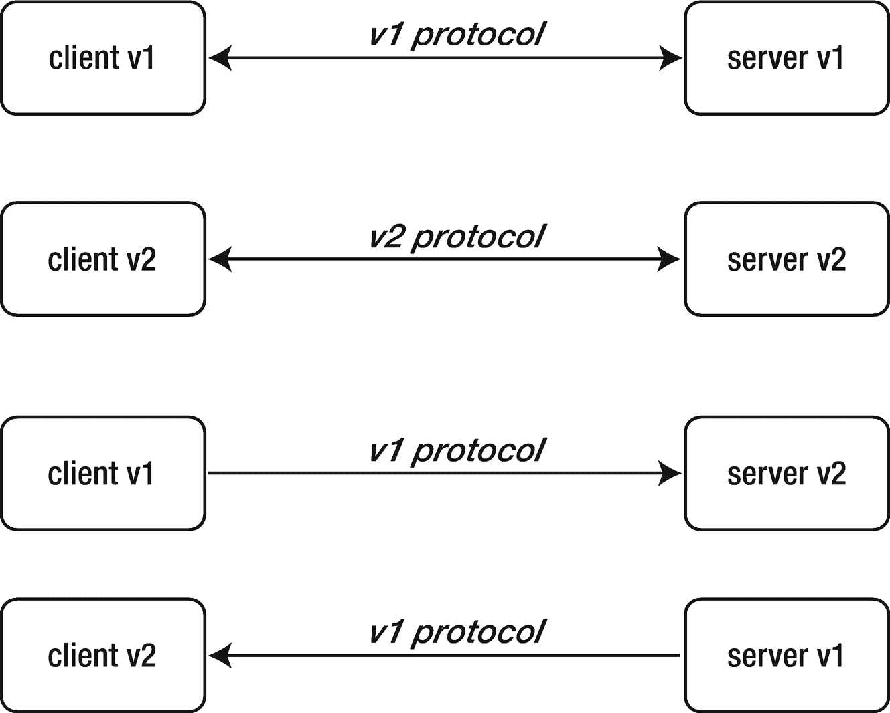
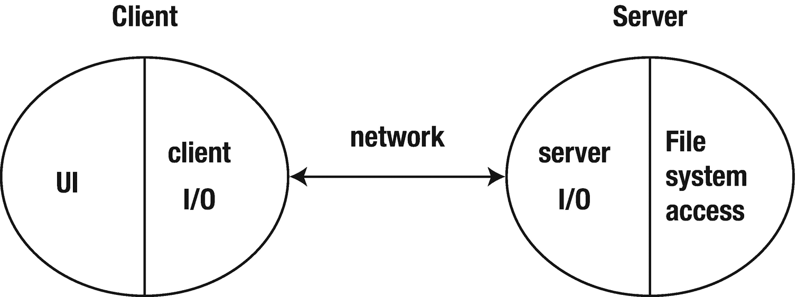
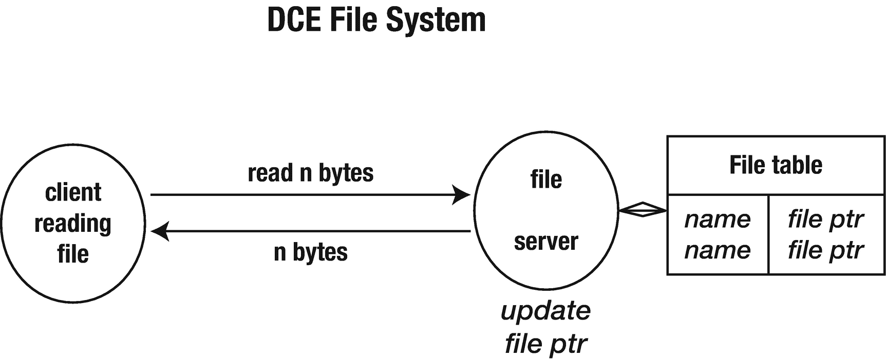
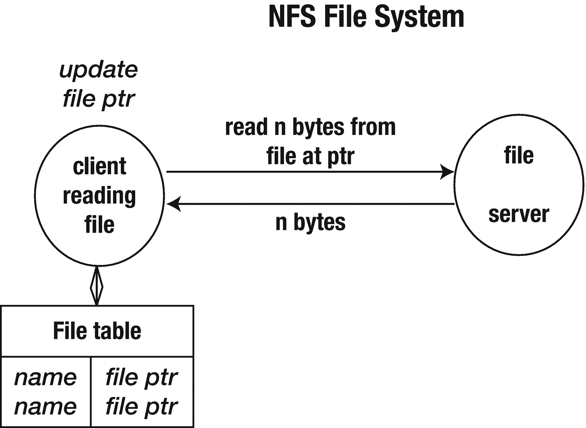
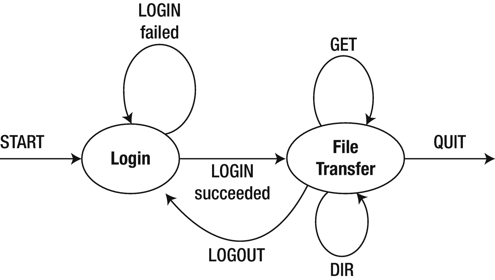

# 5. 应用层协议

客户端和服务器需要通过消息交换信息。TCP 和 UDP 提供了实现此功能的传输机制。这两个进程还需要建立一种协议，以便有意义地进行消息交换。协议通过指定消息和数据类型、编码格式等，定义了分布式应用的两个组件之间可以进行哪种对话。本章将探讨此过程中涉及的一些问题，并给出一个简单的客户端-服务器应用的完整示例。

## 协议设计

在设计协议时，有许多可能性和需要决定的问题。其中一些问题包括：

*   是广播还是点对点？广播可以使用 UDP、本地多播，或者更实验性的 MBONE。点对点可以是 TCP 或 UDP。通常，在 IP 层面，我们通常考虑以下拓扑结构：单播、多播、广播和任播。

*   是有状态还是无状态？一方维护另一方的状态是否合理？一方维护另一方的状态通常更简单，但如果某个部分崩溃了会发生什么？

*   传输协议是可靠还是不可靠？可靠通常较慢，但这样就不必过分担心消息丢失。例如，围绕可靠性的决策影响了 HTTP 的演进。

*   是否需要回复？如果需要回复，如何处理丢失的回复？可以使用超时机制。返回空的 RPC 函数就是一个例子。

*   你想要什么数据格式？上一章讨论了几种可能性。

*   你的通信是突发性的还是稳定流？以太网和互联网最擅长处理突发性流量。视频流，尤其是语音，需要稳定流。如果需要，你如何管理服务质量（QoS）？

*   是否需要多个流并需要同步？数据是否需要与任何内容同步，例如视频和语音？

*   你是在构建一个独立的应用程序，还是一个供他人使用的库？所需的文档标准可能会有所不同。

## 为什么你应该关心

据报道，亚马逊首席执行官杰夫·贝佐斯在 2002 年发表了以下声明：

*   所有团队今后都必须通过服务接口公开其数据和功能。

*   团队之间必须通过这些接口进行通信。

*   不允许有任何其他形式的进程间通信：不允许直接链接，不允许直接读取另一个团队的数据存储，不允许共享内存模型，不允许任何后门。唯一允许的通信是通过网络上的服务接口调用。

*   他们使用什么技术并不重要。HTTP、Corba、Pubsub、自定义协议——都没关系。贝佐斯不关心。

*   所有服务接口，无一例外，都必须从头开始设计为可外部化。也就是说，团队必须规划并设计，使其能够将接口公开给外部世界的开发者。没有例外。

*   任何不这样做的人都将被解雇。

（来源：Steve Yegge 的帖子转载于 [`https://gist.github.com/chitchcock/1281611`](https://gist.github.com/chitchcock/1281611)）

贝佐斯所做的，是将世界上最成功的互联网公司之一围绕服务架构进行重构，并且接口必须足够清晰，以至于*所有*通信都必须仅通过这些接口进行——没有混淆或错误。


## 版本控制

客户端-服务器系统中使用的协议会随着系统扩展而不断演变。这会引发兼容性问题：版本 2 的客户端会发出版本 1 服务器无法理解的请求，而版本 2 的服务器发送的响应，版本 1 的客户端也无法理解。

理想情况下，每一方都应该能够理解自身版本及所有更早版本的消息。它应该能够以旧式响应格式回复旧式查询。见图 5-1。



图 5-1 — 兼容性与版本控制

如果协议改动过大，与旧版格式通信的能力可能会丧失。在这种情况下，你需要确保不存在任何旧版本的副本，但这通常是不可能的。

随着版本控制经验的积累，偏好可能会改变。例如，Protocol Buffers 在 v3 版本中移除了 `required` 语法以追求简洁。^(⁸)

协议的设置通常包含版本信息。对协议（或 API）进行版本控制是一种机制，它能让客户端和服务器就一组端点、请求和响应（或消息）达成一致。显式的版本控制可能很清晰，但通常会随着协议的更改限制组件间的交互。存在一些替代方案，包括无版本 API（有时称为开放 API），其目标是保持前后向兼容性。像 HTTP 这样的协议在这些方面已通过其使用方式（而非设计本身）得到了演进。最近，GraphQL 及类似工具在无版本领域展现出了前景。最后一点，无版本并不意味着完全没有版本控制；它只是意味着在协议的不同版本间具有更高的兼容性。

## 万维网

万维网是一个历经多个不同版本的系统的好例子。底层的 HTTP 协议尽管经历了多个版本，却以极佳的方式管理着版本控制。大多数服务器/浏览器都支持 HTTP/3 版本，同时也支持更早的版本。在 2021 年，HTTP/2 版本的网络流量占比略高于 60%，HTTP/3（QUIC）约占 5%，其余几乎全是 HTTP/1.1 的流量。我们可以看到 HTTP 版本中与 `GET` 请求相关的某种变化类型：

| 请求 | 版本 |
| --- | --- |
| `GET /` | `Pre 1.0` |
| `GET / HTTP/1.0` | `HTTP 1.0` |
| `GET / HTTP/1.1` | `HTTP 1.1` |
| `GET / HTTP/1.1 Connection: Upgrade, HTTP2-Settings Upgrade: h2c` | `HTTP 2` |
| `QUIC version 1Alt-Svc: h3=":50123"` | `HTTP 3` |

HTTP/2 是一种二进制格式，与早期版本不兼容。尽管如此，它存在一种协商机制，即发送带有升级字段的 HTTP/1.1 请求以升级到 HTTP/2。如果客户端接受，即可完成升级。如果客户端不理解升级参数，连接将继续使用 HTTP/1.1。

HTTP/3 也是一种二进制格式，它用 UDP 替代了 TCP 传输。其他改进包括默认安全。虽然尚未 100%完成，但 HTTP/3 已处于成为新 HTTP 标准的最后阶段。^(⁹)

虽然最初是为 HTML 设计的，但 HTTP 可以承载任何内容。如果我们只看 HTML，它已经历了大量版本，有时几乎不尝试确保版本间的兼容性：

- HTML5，它已经在版本修订之间放弃任何版本信令。
- HTML 版本 1-4（各自不同），其中“浏览器战争”期间的版本问题尤为突出。
- 不同浏览器识别的非标准标签。
- 非 HTML 文档通常需要可能不存在的内容处理器。你的浏览器有处理 Flash 的程序吗？
- 对文档内容的处理不一致（例如，某些样式表内容会导致某些浏览器崩溃）。
- 对 JavaScript 的支持不同（以及不同版本的 JavaScript）。
- 不同的 Java 运行时引擎。
- 许多页面不符合任何 HTML 版本（例如，存在语法错误）。

HTML5（实际上还有许多早期版本）是一个极好的例子，说明了*不*应该如何进行版本控制。在撰写本文时，最新修订版是修订版 5。“在此版本中，引入了新特性以帮助 Web 应用程序作者，基于对主流创作实践的研究引入了新元素……”。不仅添加了一些新特性，一些较旧的特性（应该已不多用了）也被移除且不再有效。没有方法让 HTML5 文档表明它使用的是哪个修订版。有关此主题的更多信息，请查看“HTML – Living Standard”（`https://html.spec.whatwg.org/`）。

## 消息格式

在上一章中，我们讨论了一些表示要在线路上发送的数据的可能性。现在我们将目光向上移动一层，关注可能包含此类数据的消息。

- 客户端和服务器将交换具有不同含义的消息：
    - 登录请求。
    - 登录回复。
    - 获取记录请求。
    - 记录数据回复。
- 客户端将准备一个请求，该请求必须能被服务器理解。
- 服务器将准备一个回复，该回复必须能被客户端理解。

通常，消息的第一部分会是消息类型。

- 客户端到服务器：
    ```
    LOGIN
    GET  grade
    ```

- 服务器到客户端：
    ```
    LOGIN succeeded
    GRADE
    ```

消息类型可以是字符串或整数。例如，HTTP 使用像 404 这样的整数来表示“未找到”（尽管这些整数是以字符串形式写入的）。从客户端到服务器以及从服务器到客户端的消息是不相交的。从客户端到服务器的 `LOGIN` 消息与从服务器到客户端的 `LOGIN` 消息是不同的消息，它们可能在协议中扮演互补的角色。

### 数据格式

消息有两种主要的格式选择：字节编码或字符编码。

#### 字节格式

在字节格式中：

- 消息的第一部分通常是一个字节，用于区分消息类型。
- 消息处理器检查这个首字节以区分消息类型，然后执行一个 switch 语句来选择该类型的适当处理器。
- 消息中的后续字节根据预定义的格式（如前一章所述）包含消息内容。

其优点是紧凑，因此速度快。缺点是由数据的不透明性引起的：可能更难发现错误，更难调试，并且需要专门的解码函数。字节编码格式的例子有很多，包括像 DNS 和 NFS 这样的主要协议，以及像 Skype 这样的近期协议。当然，如果你的协议没有公开说明，那么字节格式也会使他人更难对其进行逆向工程！

以下是字节格式服务器的伪代码：

```
handleClient(conn) {
while (true) {
byte b = conn.readByte()
switch (b) {
case MSG_1: ...
case MSG_2: ...
...
}
}
}
```

Go 语言的 `net` 包提供了对管理字节流的基本支持。接口 `net.Conn` 包含以下方法（以及其他方法）：

```
Read(b []byte) (n int, err error)
Write(b []byte) (n int, err error)
```

这些方法由 `net.TCPConn` 和 `net.UDPConn` 实现。


#### 字符格式

在此模式下，所有数据尽可能以字符形式发送。例如，整数 `234` 将会被当作三个字符 `2`、`3` 和 `4` 来发送，而不是作为单个字节 `234` 发送。本质上为二进制格式的数据可能经过 Base64 编码，转换为 7 位格式，然后以 ASCII 字符形式发送，正如前一章所述。

在字符格式下：

*   一条消息由一个或多个行组成。消息的第一行起始单词通常是代表消息类型的词。
*   可以使用字符串处理函数来解码消息类型和数据。
*   第一行的剩余部分以及后续行包含数据。
*   使用面向行的函数和面向行的惯例来管理这些内容。

伪代码如下所示：

```
handleClient() {
  line = conn.readLine()
  if (line.startsWith(...) {
    ...
  } else if (line.startsWith(...) {
    ...
  }
}
```

字符格式更易于设置和调试。例如，您可以使用 `telnet` 连接到任意端口上的服务器，并向该服务器发送客户端请求。虽然没有像 `telnet` 这样简单的工具用于向客户端发送服务器响应，但您可以使用 `tcpdump` 或 `wireshark` 等工具来监听 TCP 流量，并立即查看客户端向服务器发送了什么，以及从服务器接收了什么。

在 Go 语言中，对于管理字符流的支持水平不尽相同。字符集和字符编码存在重大问题，我们将在后续章节中探讨这些问题。如果我们假装所有内容都是 ASCII，就像从前那样，那么字符格式处理起来就相当简单了。在这个层面上，主要的复杂之处在于不同操作系统中“换行符”的差异。UNIX 使用单个字符 `\n`。Windows 和其他系统（更准确地说）使用 `\r\n` 这对字符。在互联网上，`\r\n` 这对字符最为常见。UNIX 系统只需注意不要假定为 `\n` 即可。

## 一个简单的示例

这个示例涉及一个目录浏览协议，它基本上是 FTP 的精简版，甚至没有文件传输部分。我们只考虑列出目录名、列出目录内容以及更改当前目录——当然，所有操作都在服务器端进行。这是一个完整的工作示例，展示了如何创建客户端-服务器应用程序的所有组件。它是一个简单的程序，包含了双向消息以及消息协议的设计。

### 独立应用程序

来看一个简单的非客户端-服务器程序，它允许你列出服务器上某个目录中的文件，并更改和打印当前目录的名称。我们省略了文件复制部分，因为这会增加程序长度，但不会引入重要的概念。为简单起见，假定所有文件名均为 7 位 ASCII 格式。我们先来看一个独立的应用程序，它看起来像图 5-2 所示。


图 5-2

独立应用程序

伪代码如下所示：

```
read line from user
while not eof do
  if line == dir
    list directory // 本地函数调用
  else
    if line == cd 
      change directory // 本地函数调用
    else
      if line == pwd
        print directory // 本地函数调用
      else
        if line == quit
          quit
        else
          complain
  read line from user
```

非分布式应用只需通过本地函数调用将用户界面和文件访问代码连接起来即可。

### 客户端-服务器应用程序

在客户端-服务器场景中，客户端位于用户端，与位于其他地方的服务器进行通信。该程序的某些方面仅属于表示层，例如从用户处获取命令。有些是客户端发送给服务器的消息；有些则完全属于服务器端。参见图 5-3。



图 5-3

客户端-服务器场景

## 客户端

对于一个简单的目录浏览器，假设所有目录和文件都在服务器端，我们仅将文件信息从服务器传输到客户端。客户端（包括表示层方面）将变为：

```
read line from user
while not eof do
  if line == dir
    list directory // 对服务器的网络调用
  else
    if line == cd 
      change directory // 对服务器的网络调用
  else
      if line == pwd
        print directory // 对服务器的网络调用
      else
        if line == quit
          quit
        else
          complain
  read line from user
```

其中，`list directory`、`change directory` 和 `print directory` 这些调用现在都涉及对服务器的网络调用。细节尚未展示，将在后面讨论。

### 备选的表示层方面

GUI 程序可以将目录内容显示为列表，供用户选择文件并对其执行更改目录等操作。客户端将由与图形对象上发生的各种事件相关联的动作来控制。伪代码可能如下所示：

```
change dir button:
  if there is a selected file
    change directory // 对服务器的远程调用
    if successful
      update directory label
      list directory // 对服务器的远程调用
      update directory list
```

从不同用户界面调用的函数应该是相同的——更改表示层不应改变网络代码。

### 服务器端

服务器端独立于客户端使用的任何表示层。它对所有客户端都是相同的：

```
while read command from client
  if command == dir
    send list directory // 服务器上的本地调用
  else
    if command == cd 
      change directory // 服务器上的本地调用
    else
      if command == pwd
        send print directory // 服务器上的本地调用
      else
```

### 协议：非正式版

| 客户端请求 | 服务器响应 |
| --- | --- |
| `dir` | 发送文件列表 |
| `cd <directory>` | 更改 `dir`。若失败则发送错误信息。若成功则发送 `ok`。 |
| `pwd` | 发送当前目录 |
| `quit` | 退出 |

### 文本协议

这是一个简单的协议。我们需要发送的最复杂的数据结构是用于目录列表的字符串数组。在这种情况下，我们不需要上一章中的重量级序列化技术。在此情况下，我们可以使用简单的文本格式。

但即使我们将协议设计得简单，仍需详细指定它。我们选择以下消息格式：

*   所有消息均为 7 位 US-ASCII 格式。
*   消息区分大小写。
*   每条消息由一系列行组成。
*   每条消息第一行的第一个单词描述消息类型。所有其他单词为消息数据。
*   所有单词之间正好由一个空格字符分隔。
*   每行以 CR-LF 结尾。

上述某些选择在实际协议中会有所弱化。例如：

*   消息类型可以不区分大小写。这只需在解码前将消息类型字符串映射为小写即可。
*   单词之间可以保留任意数量的空白字符。这只会增加一点复杂性（需要压缩空白字符）。
*   可以使用诸如 `\` 这样的续行符将长行拆分为多行。这会使处理过程变得更复杂。
*   仅使用 `\n` 或 `\r\n` 作为行终止符。这使得识别行尾变得更加困难。

所有这些变体都存在于实际协议中。累积起来，它们使得字符串处理比本示例更复杂。

| 客户端请求 | 服务器响应 |
| --- | --- |
| `send "DIR"` | 发送文件列表，每行一个文件，以空行结束 |
| `send "CD <directory>"` | 更改 `dir`。若失败则发送 `"ERROR"`。若成功则发送 `"OK"`。 |
| `send "PWD"` | 发送当前工作目录 |

我们还应该指定传输层：

*   所有消息均通过客户端到服务器建立的 TCP 连接发送。


## 服务器代码

服务器端代码是 `ftpserver.go`：

```go
$ mkdir ch5
$ cd ch5
ch5$ vi ftpserver.go
/* FTP 服务器
*/
package main
import (
"log"
"net"
"os"
"strings"
)
const (
DIR = "DIR"
CD  = "CD"
PWD = "PWD"
)
func main() {
service := "0.0.0.0:1202"
tcpAddr, err := net.ResolveTCPAddr("tcp", service)
checkError(err)
listener, err := net.ListenTCP("tcp", tcpAddr)
checkError(err)
for {
conn, err := listener.Accept()
if err != nil {
continue
}
go handleClient(conn)
}
}
func handleClient(conn net.Conn) {
defer conn.Close()
var buf [512]byte
for {
n, err := conn.Read(buf[0:])
if err != nil {
conn.Close()
return
}
s := strings.Split(string(buf[0:n]), " ")
log.Println(s)
// 解码请求
switch s[0] {
case CD:
chdir(conn, s[1])
case DIR:
dirList(conn)
case PWD:
pwd(conn)
default:
log.Println("未知命令 ", s)
}
}
}
func chdir(conn net.Conn, s string) {
if os.Chdir(s) == nil {
conn.Write([]byte("OK"))
} else {
conn.Write([]byte("ERROR"))
}
}
func pwd(conn net.Conn) {
s, err := os.Getwd()
if err != nil {
conn.Write([]byte(""))
return
}
conn.Write([]byte(s))
}
func dirList(conn net.Conn) {
// 结束时发送空行
defer conn.Write([]byte("\r\n"))
dir, err := os.Open(".")
if err != nil {
return
}
names, err := dir.Readdirnames(-1)
if err != nil {
return
}
for _, nm := range names {
conn.Write([]byte(nm + "\r\n"))
}
}
func checkError(err error) {
if err != nil {
log.Fatalln("致命错误 ", err.Error())
}
}
```

## 客户端代码

命令行客户端是 `ftpclient.go`：

```go
ch5$ vi ftpclient.go
/* FTP 客户端
*/
package main
import (
"bufio"
"bytes"
"fmt"
"log"
"net"
"os"
"strings"
)
// 用户界面使用的字符串
const (
uiDir  = "dir"
uiCd   = "cd"
uiPwd  = "pwd"
uiQuit = "quit"
)
// 网络传输使用的字符串
const (
DIR = "DIR"
CD  = "CD"
PWD = "PWD"
)
func main() {
if len(os.Args) != 2 {
log.Fatalln("用法: ", os.Args[0], "host")
}
host := os.Args[1]
conn, err := net.Dial("tcp", host+":1202")
checkError(err)
reader := bufio.NewReader(os.Stdin)
for {
line, err := reader.ReadString('\n')
// 去除尾部空白字符
line = strings.TrimRight(line, " \t\r\n")
if err != nil {
break
}
// 分割为命令 + 参数
strs := strings.SplitN(line, " ", 2)
// 解码用户请求
switch strs[0] {
case uiDir:
dirRequest(conn)
case uiCd:
if len(strs) != 2 {
fmt.Println("cd <目录>")
continue
}
fmt.Println("CD \"", strs[1], "\"")
cdRequest(conn, strs[1])
case uiPwd:
pwdRequest(conn)
case uiQuit:
conn.Close()
os.Exit(0)
default:
fmt.Println("未知命令")
}
}
}
func dirRequest(conn net.Conn) {
conn.Write([]byte(DIR + " "))
var buf [512]byte
result := bytes.NewBuffer(nil)
for {
// 持续读取直到遇到空行
n, _ := conn.Read(buf[0:])
result.Write(buf[0:n])
length := result.Len()
contents := result.Bytes()
if string(contents[length-4:]) == "\r\n\r\n" {
fmt.Println(string(contents[0 : length-4]))
return
}
}
}
func cdRequest(conn net.Conn, dir string) {
conn.Write([]byte(CD + " " + dir))
var response [512]byte
n, _ := conn.Read(response[0:])
s := string(response[0:n])
if s != "OK" {
fmt.Println("切换目录失败")
}
}
func pwdRequest(conn net.Conn) {
conn.Write([]byte(PWD))
var response [512]byte
n, _ := conn.Read(response[0:])
s := string(response[0:n])
fmt.Println("当前目录 \"" + s + "\"")
}
func checkError(err error) {
if err != nil {
log.Fatalln("致命错误 ", err.Error())
}
}
```

以下是一个使用我们的 FTP 服务器和客户端的示例会话；在一个终端中，运行服务器：

```
ch5$ go run ftpserver.go
```

在另一个终端中，运行 FTP 客户端：

```
ch5$ go run ftpclient.go localhost
pwd
当前目录 ".../ch5"
dir
ftpserver.go
ftpclient.go
```

尝试其他命令，例如 `cd ..`。

## Textproto 包

`textproto` 包包含旨在简化文本协议（如 HTTP 和 SNMP）管理的函数。

这些格式对于跨多行的单个逻辑行有一些鲜为人知的规则，例如：”HTTP/1.1 头部字段值可以折叠到多行，只要续行以空格或水平制表符开头“（HTTP1.1 规范）。允许此类行的格式可以使用 `textproto.Reader.ReadContinuedLine()` 函数读取，此外还有更简单的函数如 `textproto.Reader.ReadLine()`。

这些协议还使用以三位数字代码开头的行来指示状态值，例如 HTTP 的 `404`。这些可以使用 `textproto.Reader.ReadCodeLine()` 读取。它们还具有键名：键值的行，例如 `Content-Type: image/gif`。此类行可以通过 `textproto.Reader.ReadMIMEHeader()` 读入到一个映射中。

以下是一个示例，我们利用了一个名为 netcat（即 `nc`）的外部工具。该工具常用于编写 TCP、UDP 或 Unix 域套接字的脚本。在此示例中，我们创建了一个发送 HTTP 请求消息的客户端。netcat 将监听该请求。一旦客户端执行，你将把结果输入到 netcat 终端中（模拟响应）。在客户端中，我们只期望一个以 `404` 开头的响应，否则我们将报错退出。创建以下客户端 `textprotoclient.go`：

```go
ch5$ vi textprotoclient.go
/* textproto
*/
package main
import (
"fmt"
"log"
"net/textproto"
)
func main() {
conn, e := textproto.Dial("unix", "/tmp/fakewebserver")
checkerror(e)
defer conn.Close()
fmt.Println("发送请求以检索 /mypage")
id, e := conn.Cmd("GET /mypage")
checkerror(e)
conn.StartResponse(id)
defer conn.EndResponse(id)
// 通过 nc 或你自己的服务器模拟返回一个 200 状态码
code, stringResult, err := conn.ReadCodeLine(200)
checkerror(err)
fmt.Println(code, "\n", stringResult, "\n", err)
}
func checkerror(err error) {
if err != nil {
log.Fatalln("错误: ", err)
}
}
```

以下是一个示例会话；在一个终端中，运行 netcat：

```
ch5$ nc -lkU /tmp/fakewebserver
```

在另一个终端中，运行我们的客户端：

```
ch5$ go run textprotoclient.go
发送请求以检索 /mypage
```

我们的 netcat 服务器将显示：

```
ch5$ nc -lkU /tmp/fakewebserver
GET /mypage
```

在 netcat 服务器中，输入以下内容（`200 This will work`）：

```
ch5$ nc -lkU /tmp/fakewebserver
GET /mypage
200 这样可以正常
```

最后，回到我们的客户端，我们看到：

```
ch5$ go run textprotoclient.go
发送请求以检索 /mypage

这样可以正常

```

前面的代码显示了一个以 `200` 开头的响应；如果我们再次运行并从服务器返回 `400`，我们会收到一个错误。不要将其与 HTTP 混淆；许多协议（例如 SMTP）都使用数字代码。


## 状态信息

应用程序通常利用状态信息来简化处理过程。例如：

- 保存指向当前文件位置的文件指针
- 保存当前鼠标位置
- 保存当前客户的值

在分布式系统中，此类状态信息既可以保存在客户端，也可以保存在服务器端，或两者兼有。

关键问题在于，一个进程保存的是关于*自身*的状态信息，还是关于*对方*进程的状态信息。一个进程可以任意保存关于自身的状态信息，不会引发任何问题。但如果它需要保存关于对方进程状态的信息，问题就会出现。该进程实际掌握的对对方状态的认知可能会变得不正确。这可能是由消息丢失（在`UDP`中）、更新失败或软件错误引起的。

一个例子是读取文件。在单进程应用程序中，文件处理代码作为应用程序的一部分运行。它维护一个打开文件表以及每个文件中的当前位置。每次执行读取或写入操作时，都会更新这个文件位置。在分布式系统中，这种简单模型不再适用。参见图 5-4。



图 5-4

`DCE` 文件系统

在图 5-4 所示的`DCE`文件系统中，文件服务器跟踪客户端的打开文件以及客户端的文件指针位置。如果消息可能丢失（但`DCE`使用`TCP`），这些信息可能会变得不同步。如果客户端崩溃，服务器最终必须将客户端的文件表超时移除。



图 5-5

`NFS` 文件系统

在`NFS`中，服务器不维护这种状态。由客户端来维护。从客户端到达服务器的每次文件访问都必须在客户端指定的适当位置打开文件，以执行操作。参见图 5-5。

如果服务器维护关于客户端的信息，则它必须能够在客户端崩溃时恢复。如果不保存这些信息，那么每次事务处理时，客户端都必须传输足够的信息以供服务器运作。

如果连接不可靠，则必须采取额外的处理措施，以确保两者不会失去同步。经典的例子是银行账户交易，其中消息可能会丢失。事务服务器可能需要作为客户端-服务器系统的一部分。

### 应用状态转换图

状态转换图跟踪应用程序的当前状态以及将其转移到新状态的变化。

前面的例子基本上只有一个状态：文件传输。如果我们添加一个登录机制，那将会增加一个称为 *login* 的状态，应用程序需要在 `login` 和 `file transfer` 状态之间切换，如图 5-6 所示。



图 5-6

状态转换图

这种状态变化也可以表示为表格：

| 当前状态 | 转换 | 下一个状态 |
| --- | --- | --- |
| `login` | `login failed` | `login` |
| | `login succeeded` | `file transfer` |
| `file transfer` | `dir` | `file transfer` |
| | `get` | `file transfer` |
| | `logout` | `login` |
| | `quit` | `-` |

### 客户端状态转换图

客户端状态图必须遵循应用状态图。不过它包含更多细节：它*先写入*，然后*再读取*。

| 当前状态 | 写入 | 读取 | 下一个状态 |
| --- | --- | --- | --- |
| `login` | `LOGIN name password` | `FAILED` | `Login` |
| | | `OK` | `file transfer` |
| `file transfer` | `CD dir` | `OK` | `file transfer` |
| | | `FAILED` | `file transfer` |
| | `GET filename` | `#lines + contents` | `file transfer` |
| | | `FAILED` | `file transfer` |
| | `DIR` | `File names + blank line` | `file transfer` |
| | | `blank line (Error)` | `file transfer` |
| `quit` | `none` | | `Quit` |

### 服务器端状态转换图

服务器状态图也必须遵循应用状态图。它也同样包含更多细节：它*先读取*，然后*再写入*。

| 当前状态 | 读取 | 写入 | 下一个状态 |
| --- | --- | --- | --- |
| `login` | `LOGIN name password` | `FAILED` | `Login` |
| | | `OK` | `file transfer` |
| `file transfer` | `CD dir` | `SUCCEEDED` | `file transfer` |
| | | `FAILED` | `file transfer` |
| | `GET filename` | `#lines + contents` | `file transfer` |
| | | `FAILED` | `file transfer` |
| | `DIR` | `filenames + blank line` | `file transfer` |
| | | `blank line (failed)` | `file transfer` |
| `quit` | `none` | `Login` |

### 服务器伪代码

以下是服务器伪代码：

```
state = login
while true
read line
switch (state)
case login:
get NAME from line
get PASSWORD from line
if NAME and PASSWORD verified
write SUCCEEDED
state = file_transfer
else
write FAILED
state = login
case file_transfer:
if line.startsWith CD
get DIR from line
if chdir DIR okay
write SUCCEEDED
state = file_transfer
else
write FAILED
state = file_transfer
...
```

我们并未提供此服务器或客户端的实际代码，因为它们非常直观。

## 结论

构建任何应用程序在开始编写代码之前都需要进行设计决策。与独立系统相比，分布式应用需要你做更多样化的决策。本章探讨了其中一些方面，并展示了最终代码可能的样子。我们仅仅触及了协议设计的要素。有许多正式和非正式的模型。`IETF`（互联网工程任务组）在其`RFC`（请求评议）中为其协议规范创建了标准格式，每个网络工程师迟早都需要处理`RFC`。

脚注 1 2


