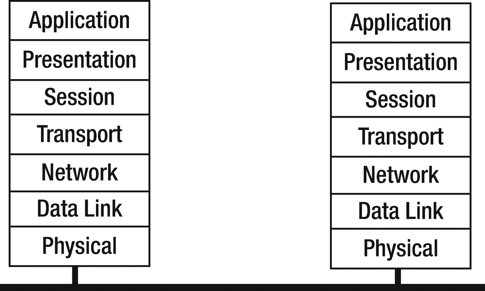

# ISO 安全架构

ISO OSI（开放系统互连）七层分布式系统模型广为人知，如图 7-1 所示。



图 7-1 分布式系统的 OSI 七层模型

较少为人知的是，ISO 在此架构基础上构建了整套文档体系。就我们这里的目的而言，最重要的是 ISO 安全架构模型 ISO 7498-2。该标准需付费购买，但 ITU 发布了一份技术内容与其一致的文件，可从 ITU 网站获取：[`https://www.itu.int/rec/dologin_pub.asp?lang=e&id=T-REC-X.800-199103-I!!PDF-E&type=items`](http://www.itu.int/rec/dologin_pub.asp?lang=e&id=T-REC-X.800-199103-I!!PDF-E&type=items)。

## 功能与层级

安全系统所需的主要功能如下：

-   认证：身份证明。
-   数据完整性：数据未被篡改。
-   机密性：数据不向他人泄露。
-   公证/签名：向可信第三方注册数据以备后续验证。
-   访问控制：防止对资源的未授权访问。
-   可用性：授权实体可按需访问。

这些功能在 OSI 协议栈的以下层级是必需的：

-   对等实体认证（第 3、4、7 层）
-   数据源认证（第 3、4、7 层）
-   访问控制服务（第 3、4、7 层）
-   连接机密性（第 1、2、3、4、6、7 层）
-   无连接机密性（第 1、2、3、4、6、7 层）
-   选择字段机密性（第 6、7 层）
-   流量流机密性（第 1、3、7 层）
-   带恢复的连接完整性（第 4、7 层）
-   不带恢复的连接完整性（第 3、4、7 层）
-   连接完整性选择字段（第 7 层）
-   无连接完整性选择字段（第 7 层）
-   源发抗抵赖（第 7 层）
-   交付抗抵赖（第 7 层）

## 机制

实现上述安全级别的机制如下：

-   对等实体认证
    -   加密
    -   数字签名
    -   认证交换
-   数据源认证
    -   加密
    -   数字签名
-   访问控制服务
    -   访问控制列表
    -   密码
    -   能力列表
    -   标签
-   连接机密性
    -   加密
    -   路由控制
-   无连接机密性
    -   加密
    -   路由控制
-   选择字段机密性
    -   加密
-   流量流机密性
    -   加密
    -   流量填充
    -   路由控制
-   带恢复的连接完整性
    -   加密
    -   数据完整性
-   不带恢复的连接完整性
    -   加密
    -   数据完整性
-   连接完整性选择字段
    -   加密
    -   数据完整性
-   无连接完整性
    -   加密
    -   数字签名
    -   数据完整性
-   无连接完整性选择字段
    -   加密
    -   数字签名
    -   数据完整性
-   源发抗抵赖
    -   数字签名
    -   数据完整性
    -   公证
-   交付抗抵赖
    -   数字签名
    -   数据完整性
    -   公证

## 数据完整性

确保数据完整性意味着提供一种检验数据是否被篡改的方法。通常，这是通过从数据字节中计算出一个简单数字来实现的。这个过程称为哈希，得到的结果称为哈希值或散列值。

一种简单的哈希算法就是将所有数据字节相加求和。然而，这种方法几乎允许任何方式的数据调整，同时仍能保持哈希值不变。例如，攻击者可以交换两个字节。这不会改变哈希值，但可能导致你欠别人 65536 美元，而不是 256 美元。

用于安全目的的哈希算法必须是“强”的，使得攻击者极难找到另一个具有相同哈希值的字节序列。这增加了攻击者按自己意图修改数据的难度。安全研究人员不断测试哈希算法，看能否破解它们——即找到一种简单方法来构造与哈希值匹配的字节序列。他们设计了一系列被认为很强且专用于密码学的哈希算法。

Go 语言支持多种哈希算法，包括 MD4、MD5、RIPEMD-160、SHA1、SHA224、SHA256、SHA384 和 SHA512。对于 Go 程序员而言，它们都遵循相同的模式：相应包中的函数 `New`（或类似函数）返回一个来自 `hash` 包的 `Hash` 对象。使用 `go list` 命令，我们可以查看此包及相关包：

```
$ mkdir ch7
$ cd ch7
ch7$ go list crypto/...
crypto
crypto/aes
crypto/cipher
crypto/des
crypto/dsa
crypto/ecdsa
crypto/ed25519
crypto/ed25519/internal/edwards25519
crypto/ed25519/internal/edwards25519/field
crypto/elliptic
crypto/elliptic/internal/fiat
crypto/hmac
crypto/internal/randutil
crypto/internal/subtle
crypto/md5
crypto/rand
crypto/rc4
crypto/rsa
crypto/sha1
crypto/sha256
crypto/sha512
crypto/subtle
crypto/tls
crypto/x509
crypto/x509/internal/macos
crypto/x509/pkix
```

哈希对象实现了 `io.Writer` 接口，你可以将待哈希的数据写入该 writer。你可以通过 `Size` 方法查询哈希值的字节数，通过 `Sum` 方法获取哈希值。

一个典型用例是 MD5 哈希（注意：不安全）。这使用 `md5` 包。哈希值是一个 16 字节数组。通常以四个十六进制数的 ASCII 形式打印出来，每个数由四个字节组成。一个简单的程序是 `md5hash.go`：

```
ch7$ vi md5hash.go
/* MD5Hash
*/
package main
import (
"crypto/md5"
"fmt"
)
func main() {
hash := md5.New()
bytes := []byte("hello\n")
hash.Write(bytes) // 将数据添加到运行中的哈希
hashValue := hash.Sum(nil) // 检索哈希后的数据
hashSize := hash.Size() // Sum 返回的字节数
// 对于 hashValue 中的每 4 个字节
// 我们通过移位将它们填充到一个字节 val 中
// val[first_byte] = hashValue[n] 左移 24 位
// 第二和第三个字节位置分别左移 16 和 8 位...
// val[fourth_byte] = hashValue[n+3]
// 最后，我们得到一个打印的 uint32 值
for n := 0; n < hashSize; n += 4 {
var val uint32
val = uint32(hashValue[n])<<24 +
uint32(hashValue[n+1])<<16 +
uint32(hashValue[n+2])<<8 +
uint32(hashValue[n+3])
fmt.Printf("%x ", val)
}
fmt.Println()
}
ch7$ go run md5hash.go
b1946ac9 2492d234 7c6235b4 d2611184
```

如果你做一个微小的改动，比如将 `hello` 中的 `o` 改为 `0`，你会看到一个新的哈希值。

```
ch$ go run md5hash.go // 将 hello 改为 hell0 后
cd6fcbf3 8d05a093 9006387 f0446665
```

虽然 `md5` 提供了一定的保护（例如，文件完整性），但它无法说明是谁创建或提供了该文件。HMAC 不仅提供完整性（例如，通过 `md5`），还提供认证。消费者必须拥有相同的密钥和输入才能重新构建 HMAC。

上述内容侧重于机制；`md5` 并非哈希函数中的最佳选择。一般来说，你应该选用更优的函数，例如用 `sha256` 替代 `md5`。

```
// 将 "crypto/sha256" 添加到 import 中
hash := hmac.New(sha256.New, []byte("secret"))
```

将我们之前的代码改为使用 `sha256`（使用硬编码的密钥）会生成以下输出（例如，输入使用 "hello"）：

```
171b5670 f7b4037f b90bef77 3b022130 e48100fd d40ea023 730097da 9a68f4ff
```

除了哈希算法的选择之外，其他考虑因素还包括密钥质量（例如，大小和随机性）。尽管使用了密钥，但 HMAC 并非加密。这意味着它独立于原始数据（即未加密数据）并存。

`md5` 提供完整性，但碰撞意味着另一个文件（原像）可以产生相同的哈希值；因此，消息的真实性不足。HMAC 通过添加密钥提供了真实性；然而，维护密钥的真实性会引发更多问题。


## 对称密钥加密

加密数据主要有两种机制。对称密钥加密使用同一密钥进行加密和解密。加密和解密双方都需知晓该密钥。我们暂不讨论密钥如何在双方之间传输（例如，`HMAC`）。

与哈希算法一样，有许多加密算法。如今，许多算法已被发现存在缺陷，而且随着计算机性能提升，算法通常会随时间推移而变弱。Go 语言支持多种对称密钥算法，例如 `AES` 和 `DES`。

这些算法属于 *分组* 算法，即它们对数据块进行操作。如果你的数据长度与块大小不对齐，则需要在末尾进行填充。

每个算法都由一个 `Cipher` 对象表示。该对象通过相应包中的 `NewCipher` 函数创建，并将对称密钥作为参数传入。

获得密码后，你就可以用它来加密和解密数据块。我们采用 `AES-128`，其密钥长度为 128 位（16 字节），块大小也为 128 位。密钥长度决定了使用哪个版本的 `AES`。演示此过程的程序是 `aes.go`：

```
ch7$ vi aes.go
/* Aes
*/
package main
import (
"bytes"
"crypto/aes"
"fmt"
)
func main() {
key := []byte("my key, len 16 b")
cipher, err := aes.NewCipher(key)
if err != nil {
fmt.Println(err.Error())
}
src := []byte("hello 16 b block")
var enc [16]byte
cipher.Encrypt(enc[0:], src)
var decrypt [16]byte
cipher.Decrypt(decrypt[0:], enc[0:])
result := bytes.NewBuffer(nil)
result.Write(decrypt[0:])
fmt.Println(string(result.Bytes()))
}
ch7$ go run aes.go
hello 16 b block
```

该程序使用共享的 16 字节密钥 `"my key, len 16 b"`，对 16 字节数据块 `"hello 16 b block"` 进行加密和解密。

虽然我们不详细讨论哈希/认证的工作原理，但有一些注意事项，例如我们的密钥长度必须为 16、24 或 32 字节，这反过来又用于选择相应的 `AES-128`、`AES-192` 或 `AES-256` 算法。如果使用了错误的密钥长度，将会看到 `crypto.KeySizeError`，并且如果没有处理该错误，编码操作（例如解码）将导致程序崩溃。更多信息请参见 `go doc crypto/aes.NewCipher` 和 `go doc crypto/aes.KeySizeError`。

下面是一些以哈希为核心的非常流行的软件。通过这个网址，我们可以看到一份关于 Git 中为何需要从 `sha-1` 迁移到 `sha-256` 的详细历史：

[`https://git-scm.com/docs/hash-function-transition/#_choice_of_hash`](https://git-scm.com/docs/hash-function-transition/#_choice_of_hash)

比特币也以其在区块链中利用哈希技术而闻名。以下是使用哈希的示例代码：

[`https://github.com/bitcoin/bitcoin/blob/master/src/merkleblock.cpp`](https://github.com/bitcoin/bitcoin/blob/master/src/merkleblock.cpp)

此外，两者都使用了一种称为默克尔树的技术。Git 提交是树的顶端，比特币中的一组交易也以其为顶端。你可以在此了解更多关于这一有趣技术的信息：[`https://en.wikipedia.org/wiki/Merkle_tree`](https://en.wikipedia.org/wiki/Merkle_tree)。

### 公钥加密

另一种主要的加密类型是公钥加密。公钥加密和解密需要 *两* 个密钥：一个用于加密，另一个用于解密。加密密钥通常以某种方式公开，以便任何人都可以用它向你加密消息。解密密钥必须保密，否则所有人都能解密这些消息！公钥系统是非对称的，不同的用途使用不同的密钥。

一些利用公钥相关技术的软件系统包括 `SSH`（你持有私钥，客户端和服务器都拥有公钥）和安全网站（公钥嵌入在你下载的证书中，服务器持有私钥）。这些非对称公钥用于在一段短暂的会话中生成对称密钥对。密钥只是公钥基础设施（PKI，例如密钥与证书管理结合）的一部分，这是一个庞大而有趣的话题。

Go 语言支持多种公钥加密系统，`RSA` 方案是其中典型的一种。

生成 `RSA` 私钥和公钥的程序是 `genrsakeys.go`：

```
ch7$ vi genrsakeys.go
/* GenRSAKeys
*/
package main
import (
"crypto/rand"
"crypto/rsa"
"crypto/x509"
"encoding/gob"
"encoding/pem"
"fmt"
"log"
"os"
)
func main() {
reader := rand.Reader
bitSize := 2048
key, err := rsa.GenerateKey(reader, bitSize)
checkError(err)
fmt.Printf("Private key primes:\n[0]:%s\n[1]:%s\n", key.Primes[0].String(),
key.Primes[1].String())
fmt.Println("Private key exponent:\n", key.D.String())
publicKey := key.PublicKey
fmt.Println("Public key modulus:\n", publicKey.N.String())
fmt.Println("Public key exponent:\n", publicKey.E)
saveGobKey("private.key", key)
saveGobKey("public.key", publicKey)
savePEMKey("private.pem", key)
}
func saveGobKey(fileName string, key interface{}) {
outFile, err := os.Create(fileName)
checkError(err)
encoder := gob.NewEncoder(outFile)
err = encoder.Encode(key)
checkError(err)
outFile.Close()
}
func savePEMKey(fileName string, key *rsa.PrivateKey) {
outFile, err := os.Create(fileName)
checkError(err)
var privateKey = &pem.Block{Type: "RSA PRIVATE KEY",
Bytes: x509.MarshalPKCS1PrivateKey(key)}
pem.Encode(outFile, privateKey)
outFile.Close()
}
func checkError(err error) {
if err != nil {
log.Fatalln("Fatal error ", err.Error())
}
}
```

该程序使用 `gob` 序列化保存密钥和相关的证书（通过 `pem`）。它们可以通过 `loadrsakeys.go` 程序读回：

```
ch7$ vi loadrsakeys.go
/* LoadRSAKeys
*/
package main
import (
"crypto/rsa"
"encoding/gob"
"fmt"
"log"
"os"
)
func main() {
var key rsa.PrivateKey
loadKey("private.key", &key)
fmt.Printf("Private key primes:\n[0]:%s\n[1]:%s\n", key.Primes[0].String(),
key.Primes[1].String())
fmt.Println("Private key exponent:\n", key.D.String())
var publicKey rsa.PublicKey
loadKey("public.key", &publicKey)
fmt.Println("Public key modulus:\n", publicKey.N.String())
fmt.Println("Public key exponent:\n", publicKey.E)
}
func loadKey(fileName string, key interface{}) {
inFile, err := os.Open(fileName)
checkError(err)
decoder := gob.NewDecoder(inFile)
err = decoder.Decode(key)
checkError(err)
inFile.Close()
}
func checkError(err error) {
if err != nil {
log.Fatalln("Fatal error ", err.Error())
}
}
```

执行创建和加载程序后，输出结果如下：

```
ch7$ go run genrsakeys.go
Private key primes:
[0]:1554 ... 3581
[1]:1759 ... 6267
Private key exponent:
1034 ... 7793
Public key modulus:
2735 ... 2127
Public key exponent:

ch7$ go run loadrsakeys.go
Private key primes:
[0]:1554 ... 3581
[1]:1759 ... 6267
Private key exponent:
1034 ... 7793
Public key modulus:
2735 ... 2127
Public key exponent:

```

由于长度原因，上述输出已做缩写。需要注意的是，它们生成的输出（密钥）与编码过程后加载的版本相匹配。我们尚未传输任何加密数据，只是在为这种传输做准备。


## X.509 证书

公钥基础设施（PKI）是一个用于管理公钥集合的框架，同时包含所有者名称、位置等附加信息，以及它们之间提供某种认证机制的关联关系。

目前使用的主要 PKI 基于 X.509 证书。例如，网络浏览器使用它们来验证网站的身份。

以下是一个示例程序，用于为我的网站生成自签名 X.509 证书，并将其存储在 `.cer` 文件中，程序名为 `genx509cert.go`：

```
ch7$ vi genx509cert.go
/* GenX509Cert
*/
package main
import (
"crypto/rand"
"crypto/rsa"
"crypto/x509"
"crypto/x509/pkix"
"encoding/gob"
"encoding/pem"
"fmt"
"math/big"
"os"
"time"
)
func main() {
random := rand.Reader
var key rsa.PrivateKey
loadKey("private.key", &key)
now := time.Now()
then := now.Add(60 * 60 * 24 * 365 * 1000 * 1000 * 1000)
// one year
template := x509.Certificate{
SerialNumber: big.NewInt(1),
Subject: pkix.Name{
CommonName:   "jan.newmarch.name",
Organization: []string{"Jan Newmarch"},
},
NotBefore:    now,
NotAfter:     then,
SubjectKeyId: []byte{1, 2, 3, 4},
KeyUsage: x509.KeyUsageCertSign |
x509.KeyUsageKeyEncipherment | x509.KeyUsageDigitalSignature,
BasicConstraintsValid: true,
IsCA:                  true,
DNSNames: []string{"jan.newmarch.name",
"localhost"},
}
derBytes, err := x509.CreateCertificate(random, &template,
&template, &key.PublicKey, &key)
checkError(err)
certCerFile, err := os.Create("jan.newmarch.name.cer")
checkError(err)
certCerFile.Write(derBytes)
certCerFile.Close()
certPEMFile, err := os.Create("jan.newmarch.name.pem")
checkError(err)
pem.Encode(certPEMFile, &pem.Block{Type: "CERTIFICATE", Bytes: derBytes})
certPEMFile.Close()
keyPEMFile, err := os.Create("private.pem")
checkError(err)
pem.Encode(keyPEMFile, &pem.Block{Type: "RSA PRIVATE KEY",
Bytes: x509.MarshalPKCS1PrivateKey(&key)})
keyPEMFile.Close()
}
func loadKey(fileName string, key interface{}) {
inFile, err := os.Open(fileName)
checkError(err)
decoder := gob.NewDecoder(inFile)
err = decoder.Decode(key)
checkError(err)
inFile.Close()
}
func checkError(err error) {
if err != nil {
fmt.Println("Fatal error ", err.Error())
os.Exit(1)
}
}
```

接下来，我们加载刚刚生成的加密资产，并进行基本的正确性检查，创建 `loadx509cert.go`：

```
ch7$ vi loadx509cert.go
/* LoadX509Cert
*/
package main
import (
"crypto/rsa"
"crypto/x509"
"encoding/gob"
"fmt"
"log"
"os"
)
func main() {
// load certificate so we can access embedded public key
certCerFile, err := os.Open("jan.newmarch.name.cer")
checkError(err)
derBytes := make([]byte, 1000) // bigger than the file
count, err := certCerFile.Read(derBytes)
checkError(err)
certCerFile.Close()
// trim the bytes to actual length in call
cert, err := x509.ParseCertificate(derBytes[0:count])
checkError(err)
fmt.Printf("Name %s\n", cert.Subject.CommonName)
fmt.Printf("Not before %s\n", cert.NotBefore.String())
fmt.Printf("Not after %s\n", cert.NotAfter.String())
// load non-emdedded public key
// should be the same as above embedded key
pub, err := os.Open("public.key")
checkError(err)
dec := gob.NewDecoder(pub)
publicKey := new(rsa.PrivateKey)
err = dec.Decode(publicKey)
checkError(err)
pub.Close()
// genx509cert.go created a public key and certificate
// certificates also embed the public key
// we are comparing the public key and the embedded public key fields
// see go doc crypto/rsa.PublicKey for more
if cert.PublicKey.(*rsa.PublicKey).N.Cmp(publicKey.N) == 0 {
if publicKey.E == cert.PublicKey.(*rsa.PublicKey).E {
fmt.Println("Same public key")
return
}
}
fmt.Println("Different public key")
}
func checkError(err error) {
if err != nil {
log.Fatalln("Fatal error ", err.Error())
}
}
```

在这里，我们可以看到证书的创建和确认的完整往返过程。

```
ch7$ go run genx509cert.go
```

注意证书和 pem 文件的创建。

```
ch7$ go run loadx509cert.go
Name jan.newmarch.name
Not before 2021-12-26 22:51:42 +0000 UTC
Not after 2022-12-26 22:51:42 +0000 UTC
Same public key
```

### TLS

如果需要自己处理所有繁重的工作，加密/解密方案的使用就有限。目前互联网上支持加密消息传递最流行的机制是 TLS（传输层安全性），其前身为 SSL（安全套接层）。

在 TLS 中，客户端和服务器使用 X.509 证书协商身份。一旦完成，它们之间会生成一个密钥，所有加密/解密都使用该密钥完成。协商过程相对较慢，但完成后，将使用更快的密钥机制。服务器*必须*拥有证书；客户端在需要时*可以*拥有证书。

#### 基础客户端

我们首先演示如何连接到一个拥有由“知名”证书颁发机构（CA）（如 RSA）签名的证书的服务器。之前用于从 Web 服务器获取 HEAD 信息的程序，可以调整为从 TLS Web 服务器获取 HEAD 信息。该程序是 `tlsgethead.go`。这里我们演示了 `TLS.Dial`，将在后续章节讨论 HTTPS。

```
ch7$ vi tlsgethead.go
/* TLSGetHead
*/
package main
import (
"crypto/tls"
"fmt"
"io/ioutil"
"log"
"os"
)
func main() {
if len(os.Args) != 2 {
log.Fatalln("Usage: ", os.Args[0], "host:port")
}
service := os.Args[1]
// Dial over secure channel
conn, err := tls.Dial("tcp", service, nil)
checkError(err)
_, err = conn.Write([]byte("HEAD / HTTP/1.0\r\n\r\n"))
checkError(err)
result, err := ioutil.ReadAll(conn)
checkError(err)
fmt.Println(string(result))
conn.Close()
os.Exit(0)
}
func checkError(err error) {
if err != nil {
log.Fatalln("Fatal error ", err.Error())
}
}
```

当我们使用 `tlsgethead.go` 客户端连接到一个合适的网站（如 `google.com`）时，会看到 HTTP HEAD 请求结果：

```
ch7$ go run tlsgethead.go google.com:443
HTTP/1.0 200 OK
Content-Type: text/html; charset=ISO-8859-1
P3P: CP="This is not a P3P policy! See g.co/p3phelp for more info."
Date: Sun, 26 Dec 2021 23:10:40 GMT
Server: gws
X-XSS-Protection: 0
X-Frame-Options: SAMEORIGIN
Expires: Sun, 26 Dec 2021 23:10:40 GMT
Cache-Control: private
Set-Cookie: 1P_JAR=2021-12-26-23; expires=Tue, 25-Jan-2022 23:10:40 GMT; path=/; domain=.google.com; Secure
Set-Cookie: NID=511=KAxTu1K-XmrjU5Pml-zP015rWWWWafskpa1bdm4Kcn96qPutrX_Ezc8-gSprT5Xo3fjkxwRdB0Am5E7LqAlQJn61VABmytAfahOauqempNg8egIAus5Ch7ypME8dnJ7VRh7Hd0F6XSViYsyHAWDcauelaxMCGRtW5RSU_Nef3UQ; expires=Mon, 27-Jun-2022 23:10:40 GMT; path=/; domain=.google.com; HttpOnly
Alt-Svc: h3=":443"; ma=2592000,h3-29=":443"; ma=2592000,h3-Q050=":443"; ma=2592000,h3-Q046=":443"; ma=2592000,h3-Q043=":443"; ma=2592000,quic=":443"; ma=2592000; v="46,43"
```

其他网站可能产生不同的响应，但这个客户端依然可以成功与一个具有正确认证的服务器建立 TLS 会话。

有趣的是，当我们对 `gooogle.com` 站点（注意多了一个“o”！）运行此客户端时：

```
ch7$ go run tlsgethead.go gooogle.com:443
```

该站点实际上属于 Google，因为 Google 很可能购买了它以减少欺诈风险。程序抛出了一个致命错误，因为站点证书不是针对有三个“o”的 *gooogle* 的：

```
Fatal error  x509: certificate is valid for www.google.com, not gooogle.com
exit status 1
```

过去，浏览器会对这种类型的错误进行报错，现在它们有时会重定向到正确的域名。


#### 使用自签名证书的服务器

如果服务器使用了自签名证书（例如在组织内部使用或进行实验时），Go 包将生成一个错误：`"x509: certificate signed by unknown authority"`。要么必须将证书安装到客户端的操作系统中（这取决于操作系统），要么客户端必须将该证书作为根 CA 安装。我们将展示第二种方法。

使用 TLS 和 *任何* 证书的回声服务器是 `tlsechoserver.go`：

```
ch7$ vi tlsechoserver.go
/* TLSEchoServer
*/
package main
import (
"crypto/tls"
"fmt"
"log"
"net"
)
func main() {
cert, err := tls.LoadX509KeyPair("jan.newmarch.name.pem",
"private.pem")
checkError(err)
config := tls.Config{Certificates: []tls.Certificate{cert}}
service := "0.0.0.0:1200"
listener, err := tls.Listen("tcp", service, &config)
checkError(err)
fmt.Println("Listening")
for {
conn, err := listener.Accept()
if err != nil {
fmt.Println(err.Error())
continue
}
fmt.Println("Accepted")
go handleClient(conn)
}
}
func handleClient(conn net.Conn) {
defer conn.Close()
var buf [512]byte
for {
fmt.Println("Trying to read")
n, err := conn.Read(buf[0:])
if err != nil {
fmt.Println(err)
return
}
fmt.Println(string(buf[0:]))
_, err = conn.Write(buf[0:n])
if err != nil {
return
}
}
}
func checkError(err error) {
if err != nil {
log.Fatalln("Fatal error ", err.Error())
}
}
```

如果证书是自签名的（此处正是如此），一个简单的 TLS 客户端将无法与此服务器配合使用。我们需要将一个配置作为第三个参数传递给 `tls.Dial`，该配置将我们的证书安装为根证书。感谢 Josh Bleecher Snyder 在“Getting x509: Certificate Signed by Unknown Authority”([`https://groups.google.com/forum/#!topic/golang-nuts/v5ShM8R7Tdc`](https://groups.google.com/forum/#!topic/golang-nuts/v5ShM8R7Tdc)) 中展示了如何做到这一点。然后，服务器可以与 `tlsechoclient.go` 客户端配合使用。

```
ch7$ vi tlsechoclient.go
package main
import (
"crypto/tls"
"crypto/x509"
"fmt"
"os"
)
func main() {
rootPEM, err := os.ReadFile("jan.newmarch.name.pem")
// First, create the set of root certificates. For this example we only
// have one. It's also possible to omit this in order to use the
// default root set of the current operating system.
roots := x509.NewCertPool()
if ok := roots.AppendCertsFromPEM(rootPEM); !ok {
panic("failed to parse root certificate")
}
conn, err := tls.Dial("tcp", "localhost:1200", &tls.Config{
RootCAs: roots,
})
if err != nil {
panic("failed to connect: " + err.Error())
}
// Now write and read lots
for n := 0; n < 10; n++ {
fmt.Println("Writing...")
conn.Write([]byte("Hello " + string(n+48)))
var buf [512]byte
n, _ := conn.Read(buf[0:])
fmt.Println(string(buf[0:n]))
}
conn.Close()
}
```

在一个终端中运行服务器。

```
ch7$ go run tlsechoserver.go
... listening ...
```

在另一个终端中，运行客户端。

```
ch7$ go run tlsechoclient.go localhost:1200
Writing...
Hello 0
Writing...
Hello 1
...
Writing...
Hello 9
```

回到服务器端，我们看到以下内容：

```
Accepted
Trying to read
Hello 0
Trying to read
Hello 1
...
EOF
```

我们也可以修改客户端，使其不接受自签名证书。通过将代码修改如下，结果将会不同。

```
conn, err := tls.Dial("tcp", "localhost:1200", &tls.Config{
//                RootCAs: roots,
InsecureSkipVerify: false,
})
// assuming the server is running with valid root certificate
ch7$ go run tlsechoclient.go localhost:1200
panic: failed to connect: x509: "jan.newmarch.name" certificate is not trusted
goroutine 1 [running]:
main.main()
/Users/ronaldpetty/github.com/apress/network-prog-with-go-2e/ch7/tlsechoclient.go:25 +0x2bb
exit status 2
```

在服务器端，我们看到以下错误：

```
Trying to read
remote error: tls: bad certificate
```

## 总结

安全性本身就是一个巨大的领域，本章只是浅尝辄止。然而，主要概念已经涵盖。尚未强调的是，安全性需要在设计阶段就融入其中：事后才考虑安全措施几乎总是失败的。

