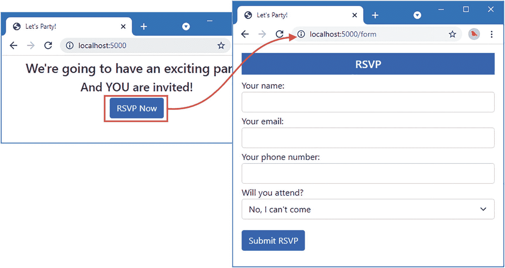
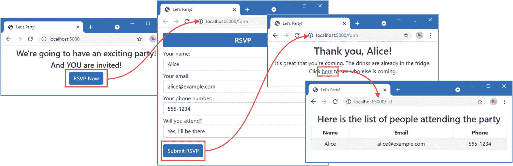
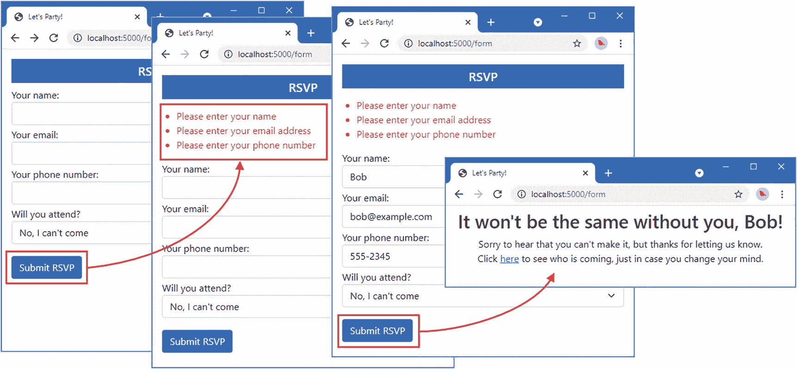

# 第 1 章 你的第一个 Go 应用程序

上手 Go 的最佳方式就是直接动手实践。在本章中，我将介绍如何准备 Go 开发环境，以及如何创建并运行一个简单的 Web 应用程序。本章的目的是让你初步了解编写 Go 语言是什么样的感受，因此如果你不理解所使用的全部语言特性，也不必担心。所有你需要了解的内容都将在后续章节中详细解释。

## 场景设定

想象一下，有位朋友决定举办一场跨年晚会，并请我创建一个 Web 应用程序，让她的受邀者能够以电子方式回复是否参加。她要求以下几个关键功能：

- 一个展示晚会信息的主页
- 一个用于回复的表格，提交后将显示致谢页面
- 确保回复表格必填项的验证功能
- 一个显示谁将参加晚会的汇总页面

在本章中，我将创建一个 Go 项目，并用它来开发一个包含上述所有功能的简单应用程序。

提示

你可以从 [`https://github.com/apress/pro-go`](https://github.com/apress/pro-go) 下载本章以及本书其他所有章节的示例项目。如果在运行示例时遇到问题，请参阅第 2 章了解如何获取帮助。

## 安装开发工具

第一步是安装 Go 开发工具。请访问 [`https://golang.org/dl`](https://golang.org/dl)，下载适用于你操作系统的安装文件。安装程序支持 Windows、Linux 和 macOS。请根据你的平台，按照 [`https://golang.org/doc/install`](https://golang.org/doc/install) 上的安装说明进行操作。安装完成后，打开命令提示符，运行清单 1-1 中所示的命令，该命令将通过打印出版本号来确认 Go 工具已安装成功。

**本书的更新**

Go 语言正在积极开发中，新版本不断涌现，这意味着当你阅读本书时，可能已有更新的版本可用。Go 在保持兼容性方面有出色的策略，因此即使使用更新的版本，你也能毫无问题地跟随本书中的示例。如果确实遇到问题，请查看本书的 GitHub 仓库 [`https://github.com/apress/pro-go`](https://github.com/apress/pro-go)，我会在其中发布免费的更新内容，以解决可能出现的破坏性变更。

这种更新方式对我和 Apress 来说都是一项持续的试验，它也在不断发展——尤其是因为我并不清楚 Go 未来的版本会包含什么内容。目标是通过补充本书中的示例来延长本书的生命周期。

对于更新将是什么样子、采取何种形式，或者在我将其纳入本书新版本之前会持续更新多久，我在此不作任何承诺。请保持开放的心态，并在新版本发布时查看本书的仓库。如果你有改进更新内容的建议，请发送电子邮件至 `adam@adam-freeman.com` 告知我。

```
go version
清单 1-1
检查 Go 安装
```

截至目前的最新版本是 1.17.1，在我的 Windows 机器上输出如下：

```
go version go1.17.1 windows/amd64
```

无论你看到不同的版本号还是不同的操作系统信息都无关紧要——重要的是`go`命令能够运行并产生输出。

### 安装 Git

某些 Go 命令依赖于 Git 版本控制系统。请访问 [`https://git-scm.com`](https://git-scm.com)，并按照适用于你操作系统的安装说明进行安装。

### 选择代码编辑器

剩下的唯一步骤是选择代码编辑器。Go 源代码文件是纯文本文件，这意味着你几乎可以使用任何编辑器。不过，有些编辑器为 Go 提供了专门支持。最受欢迎的选择是 Visual Studio Code，它免费使用，并支持最新的 Go 语言特性。如果你没有特别偏好，我推荐你使用 Visual Studio Code。可以从 [`http://code.visualstudio.com`](http://code.visualstudio.com) 下载 Visual Studio Code，所有主流操作系统都有相应的安装程序。当你在下一节开始项目工作时，系统会提示你安装适用于 Go 的 Visual Studio Code 扩展。

如果你不喜欢 Visual Studio Code，可以在 [`https://github.com/golang/go/wiki/IDEsAndTextEditorPlugins`](https://github.com/golang/go/wiki/IDEsAndTextEditorPlugins) 上找到可用选项列表。学习本书示例不需要特定的代码编辑器，所有创建和编译项目的任务都在命令行中完成。


## 创建项目

打开命令提示符，导航至合适的位置，创建一个名为 `partyinvites` 的文件夹。然后进入 `partyinvites` 文件夹，运行清单 1-2 中的命令，启动一个新 Go 项目。

```
go mod init partyinvites
清单 1-2
启动一个 Go 项目
```

正如我在第 3 章中所解释的，`go` 命令几乎可用于所有开发任务。该命令会创建一个名为 `go.mod` 的文件，该文件用于跟踪项目所依赖的包，如有需要，也可用于发布项目。

Go 代码文件的扩展名为 `.go`。使用你所选的编辑器，在 `partyinvites` 文件夹中创建一个名为 `main.go` 的文件，其内容如清单 1-3 所示。如果你是第一次使用 Visual Studio Code 编辑 Go 文件，系统会提示你安装支持 Go 语言的扩展。

```
package main
import "fmt"
func main() {
fmt.Println("TODO: add some features")
}
清单 1-3
partyinvites 文件夹中 main.go 文件的内容
```

如果你曾使用过任何 C 或类 C 语言（如 C# 或 Java），那么 Go 的语法会让你感觉熟悉。本书会深入介绍 Go 语言，但仅凭清单 1-3 中代码的关键字和结构，你就能了解很多东西。

功能被组织到包中，这就是清单 1-3 中出现 `package` 语句的原因。对包的依赖通过 `import` 语句实现，该语句允许在代码文件中访问这些包所包含的功能。语句被分组到函数中，函数使用 `func` 关键字定义。清单 1-3 中有一个名为 `main` 的函数。这是应用程序的*入口点*，意味着应用程序被编译并运行时，执行将从这里开始。

`main` 函数包含一条代码语句，该语句调用了一个名为 `Println` 的函数，该函数由名为 `fmt` 的包提供。`fmt` 包是 Go 提供的大量标准库的一部分，本书第二部分会对此进行介绍。`Println` 函数用于打印一个字符串。

尽管细节可能不熟悉，但清单 1-3 中代码的目的很容易理解：当应用程序执行时，它会输出一条简单的消息。在 `partyinvites` 文件夹中运行清单 1-4 所示的命令，以编译并执行该项目。（注意，该命令中 `run` 后面有一个句点。）

```
go run .
清单 1-4
编译并执行项目
```

`go run` 命令在开发过程中非常有用，因为它可以将编译和执行任务合为一步。该应用程序将产生以下输出：

```
TODO: add some features
```

如果你收到编译器错误，可能的原因是你没有完全按照清单 1-3 所示输入代码。Go 对代码的定义方式有特定要求。你可能更喜欢将左花括号放在单独的一行，并且可能已经自动按这种方式格式化了代码，如清单 1-5 所示。

```
package main
import "fmt"
func main()
{
fmt.Println("TODO: add some features")
}
清单 1-5
在 partyinvites 文件夹的 main.go 文件中将花括号放在新行
```

运行清单 1-4 中的命令来编译项目，你将收到以下错误：

```
### partyinvites
.\main.go:5:6: missing function body
.\main.go:6:1: syntax error: unexpected semicolon or newline before {
```

Go 强制要求特定的代码风格，并以不寻常的方式处理常见的代码元素，比如分号。Go 语法的细节将在后续章节中介绍，但现在，务必严格按照示例所示来操作，以避免错误。

### 定义数据类型与集合

下一步是创建一个自定义数据类型来表示 RSVP 回复，如清单 1-6 所示。

```
package main
import "fmt"
type Rsvp struct {
Name, Email, Phone string
WillAttend bool
}
func main() {
fmt.Println("TODO: add some features")
}
清单 1-6
在 partyinvites 文件夹的 main.go 文件中定义数据类型
```

Go 允许使用 `type` 关键字定义自定义类型并为其命名。清单 1-6 创建了一个名为 `Rsvp` 的 `struct` 数据类型。结构体允许将一组相关的值组合在一起。`Rsvp` 结构体定义了四个字段，每个字段都有一个名称和一个数据类型。`Rsvp` 字段使用的数据类型是 `string` 和 `bool`，它们是用于表示字符串和布尔值的内置类型。（Go 的内置类型将在第 4 章中介绍。）

接下来，我需要将 `Rsvp` 值收集到一起。在后面的章节中，我会解释如何在 Go 应用程序中使用数据库，但对于本章来说，将回复存储在内存中就足够了，这意味着当应用程序停止时，回复将丢失。

Go 内置了对固定长度数组、可变长度数组（称为*切片*）以及包含键值对的映射（map）的支持。清单 1-7 创建了一个切片，当要存储的值的数量事先未知时，这是一个很好的选择。

```
package main
import "fmt"
type Rsvp struct {
Name, Email, Phone string
WillAttend bool
}
var responses = make([]*Rsvp, 0, 10)
func main() {
fmt.Println("TODO: add some features")
}
清单 1-7
在 partyinvites 文件夹的 main.go 文件中定义切片
```

这条新语句依赖于 Go 的多个特性，从语句末尾向前推理解起来最容易。

Go 提供了内置函数来执行对数组、切片和映射的常见操作。其中一个函数是 `make`，在清单 1-7 中用于初始化一个新的切片。`make` 函数的最后两个参数是初始大小和初始容量。

```
...
var responses = make([]*Rsvp, 0, 10)
...
```

我指定大小参数为零，以创建一个空切片。切片会随着新项目的添加自动调整大小，初始容量决定了在切片需要调整大小之前可以添加多少项。在这种情况下，在需要调整大小之前，可以向切片中添加十项。

`make` 方法的第一个参数指定了切片将要存储的数据类型：

```
...
var responses = make([]*Rsvp, 0, 10)
...
```

方括号 `[]` 表示一个切片。星号 `*` 表示一个指针。类型中的 `Rsvp` 部分表示清单 1-6 中定义的结构体类型。综合起来，`[]*Rsvp` 表示一个指向 `Rsvp` 结构体实例的指针的切片。

如果你是从 C# 或 Java 转到 Go，看到*指针*这个术语可能会畏缩，因为 C# 或 Java 不允许直接使用指针。但你可以放心，因为 Go 不允许进行那些可能导致开发者陷入麻烦的指针操作。正如我在第 4 章中所解释的，在 Go 中使用指针仅决定值在使用时是否被复制。通过指定我的切片将包含指针，我是在告诉 Go 在将 `Rsvp` 值添加到切片时不要创建它们的副本。

语句的其余部分将初始化后的切片赋值给一个变量，以便我可以在代码的其他地方使用它：

```
...
var responses = make([]*Rsvp, 0, 10)
...
```


`var`关键字表明我在定义一个名为`responses`的新变量。等号`=`是 Go 语言的赋值运算符，它将`responses`变量的值设置为新创建的切片。我不必指定`responses`变量的类型，因为 Go 编译器会从其赋值结果中推断其类型。

### 创建 HTML 模板

Go 附带了一个全面的标准库，其中包含对 HTML 模板的支持。在`partyinvites`文件夹中创建一个名为`layout.html`的文件，其内容如清单 1-8 所示。

```
Let's Party!

{{ block "body" . }} Content Goes Here {{ end }}
```

此模板将是一个布局，包含应用程序生成的所有响应所共有的内容。它定义了一个基本的 HTML 文档，包括一个指定 Bootstrap CSS 框架样式表的`link`元素，该样式表将从内容分发网络(CDN)加载。我将在第 24 章中演示如何从文件夹提供此文件，但为简单起见，我在此章节中使用了 CDN。示例应用程序在离线状态下仍可工作，但您将看到没有图表中所示样式的 HTML 元素。

清单 1-8 中的双花括号`{{`和`}}`用于将动态内容插入到模板生成的输出中。这里使用的`block`表达式定义了占位符内容，这些内容将在运行时被另一个模板替换。

要创建将向用户打招呼的内容，请在`partyinvites`文件夹中添加一个名为`welcome.html`的文件，其内容如清单 1-9 所示。

```
{{ define "body"}}

 We're going to have an exciting party!
And YOU are invited!

RSVP Now

{{ end }}
```

要创建允许用户对 RSVP 做出响应的模板，请在`partyinvites`文件夹中添加一个名为`form.html`的文件，其内容如清单 1-10 所示。

```
{{ define "body"}}
RSVP
{{ if gt (len .Errors) 0}}

{{ range .Errors }}
{{ .  }}
{{ end }}

{{ end }}

Your name:

Your email:

Your phone number:

Will you attend?

Yes, I'll be there

No, I can't come

Submit RSVP

{{ end }}
```

要创建将呈现给与会者的模板，请在`partyinvites`文件夹中添加一个名为`thanks.html`的文件，其内容如清单 1-11 所示。

```
{{ define "body"}}

Thank you, {{ . }}!
 It's great that you're coming. The drinks are already in the fridge!
Click here to see who else is coming.

{{ end }}
```

要创建当邀请被拒绝时将呈现的模板，请在`partyinvites`文件夹中添加一个名为`sorry.html`的文件，其内容如清单 1-12 所示。

```
{{ define "body"}}

It won't be the same without you, {{ . }}!
Sorry to hear that you can't make it, but thanks for letting us know.

Click here to see who is coming,
just in case you change your mind.

{{ end }}
```

要创建将显示与会者列表的模板，请在`partyinvites`文件夹中添加一个名为`list.html`的文件，其内容如清单 1-13 所示。

```
{{ define "body"}}

Here is the list of people attending the party

NameEmailPhone

{{ range . }}
{{ if .WillAttend }}

{{ .Name }}
{{ .Email }}
{{ .Phone }}

{{ end }}
{{ end }}

{{ end }}
```

#### 加载模板

下一步是加载模板，以便它们可用于生成内容，如清单 1-14 所示。我将分阶段编写此代码，并解释每一步所做的更改。（您的代码编辑器中可能会显示错误高亮，但在后续清单中添加新的代码语句后，此问题将得到解决。）

```
package main
import (
"fmt"
"html/template"
)
type Rsvp struct {
Name, Email, Phone string
WillAttend bool
}
var responses = make([]*Rsvp, 0, 10)
var templates = make(map[string]*template.Template, 3)
func loadTemplates() {
// TODO - load templates here
}
func main() {
loadTemplates()
}
```

第一个更改是对`import`语句的更改，声明了对`html/template`包提供的功能的依赖，该包是 Go 标准库的一部分。此包提供对加载和渲染 HTML 模板的支持，详细信息将在第 23 章中介绍。

下一个新的语句创建了一个名为`templates`的变量。赋给此变量的值类型看起来比实际更复杂：

```
...
var templates = make(map[string]*template.Template, 3)
...
```

`map`关键字表示一个映射，其键类型在方括号中指定，后跟值类型。此映射的键类型是`string`，值类型是`*template.Template`，这意味着指向`template`包中定义的`Template`结构体的指针。当您导入一个包时，其提供的功能将使用包名的最后一部分进行访问。在这种情况下，`html/template`包提供的功能通过`template`访问，其中一个功能是名为`Template`的结构体。星号表示指针，这意味着映射使用`string`键来存储指向`html/template`包定义的`Template`结构体实例的指针。

接下来，我创建了一个名为`loadTemplates`的新函数，该函数目前尚未执行任何操作，但将负责加载前面清单中定义的 HTML 文件并处理它们以创建将存储在映射中的`*template.Template`值。此函数在`main`函数中被调用。您可以直接在代码文件中定义和初始化变量，但最有用的语言功能只能在函数内部完成。

现在我需要实现`loadTemplates`函数。每个模板都与布局一起加载，如清单 1-15 所示，这意味着我不必在每个文件中重复基本的 HTML 文档结构。

```
package main
import (
"fmt"
"html/template"
)
type Rsvp struct {
Name, Email, Phone string
WillAttend bool
}
var responses = make([]*Rsvp, 0, 10)
var templates = make(map[string]*template.Template, 3)
func loadTemplates() {
templateNames := [5]string { "welcome", "form", "thanks", "sorry", "list" }
for index, name := range templateNames {
t, err := template.ParseFiles("layout.html", name + ".html")
if (err == nil) {
templates[name] = t
fmt.Println("Loaded template", index, name)
} else {
panic(err)
}
}
}
func main() {
loadTemplates()
}
```

`loadTemplates`函数中的第一个语句使用 Go 的简洁语法定义了变量，该语法只能在函数内部使用。此语法指定名称，后跟冒号(`:`)、赋值运算符(`=`)和一个值：

```
...
templateNames := [5]string { "welcome", "form", "thanks", "sorry", "list" }
...
```


#### 标题层级调整

该语句创建了一个名为`templateNames`的变量，其值为一个包含五个`string`值的数组，这些值使用字面量表示。这些名称对应于之前定义的文件名。在 Go 中，数组的长度是固定的，分配给`templateNames`变量的数组只能容纳五个值。

这五个值在`for`循环中使用`range`关键字进行枚举，如下所示：

```go
...
for index, name := range templateNames {
...
```

`range`关键字与`for`关键字一起使用，用于枚举数组、切片和映射（map）。`for`循环内的语句会针对数据源（本例中为数组）中的每个值执行一次，并且这些语句会获得两个值以供操作：

```go
...
for index, name := range templateNames {
...
```

`index`变量被赋值为当前正在枚举的数组值的位置。`name`变量被赋值为当前位置的值。第一个变量的类型始终是`int`，这是 Go 中用于表示整数的内置数据类型。另一个变量的类型与数据源存储的值类型对应。此循环中枚举的数组包含`string`值，这意味着`name`变量将被赋值为`index`值指示的数组位置上的`string`。

`for`循环内的第一条语句用于加载模板：

```go
...
t, err := template.ParseFiles("layout.html", name + ".html")
...
```

`html/template`包提供了一个名为`ParseFiles`的函数，用于加载和处理 HTML 文件。Go 最有用且不寻常的特性之一是函数可以返回多个结果值。`ParseFiles`函数返回两个结果：一个指向`template.Template`值的指针和一个`error`，`error`是 Go 中用于表示错误的内置数据类型。使用创建变量的简洁语法将这些结果分配给变量，如下所示：

```go
...
t, err := template.ParseFiles("layout.html", name + ".html")
...
```

我无需指定结果被分配给的变量的类型，因为它们对于 Go 编译器来说已经是已知的。模板被分配给名为`t`的变量，`error`被分配给名为`err`的变量。这是 Go 中的常见模式，它允许我通过检查`err`的值是否为`nil`（Go 的空值）来确定模板是否已加载：

```go
...
t, err := template.ParseFiles("layout.html", name + ".html")
if (err == nil) {
    templates[name] = t
    fmt.Println("Loaded template", index, name)
} else {
    panic(err)
}
...
```

如果`err`为`nil`，则向映射中添加一个键值对，使用`name`的值作为键，使用赋给`t`的`*template.Template`作为值。Go 使用标准索引表示法为数组、切片和映射赋值。

如果`err`的值不是`nil`，则表示出现了问题。Go 提供了一个名为`panic`的函数，可以在发生不可恢复的错误时调用。调用`panic`的效果可能有所不同，正如我在第[15]章中解释的那样，但对于此应用程序，它的效果将是输出堆栈跟踪并终止执行。

使用`go run .`命令编译并执行项目；您将在加载模板时看到以下输出：

```text
Loaded template 0 welcome
Loaded template 1 form
Loaded template 2 thanks
Loaded template 3 sorry
Loaded template 4 list
```

## 创建 HTTP 处理程序和服务器

Go 标准库包括用于创建 HTTP 服务器和处理 HTTP 请求的内置支持。首先，我需要定义函数，这些函数将在用户请求应用程序的默认 URL 路径（即`/`）时被调用，以及在向用户显示与会者列表（将通过 URL 路径`/list`请求）时被调用，如清单[1-16]所示。

```go
package main

import (
    "fmt"
    "html/template"
    "net/http"
)

type Rsvp struct {
    Name, Email, Phone string
    WillAttend bool
}

var responses = make([]*Rsvp, 0, 10)
var templates = make(map[string]*template.Template, 3)

func loadTemplates() {
    templateNames := [5]string { "welcome", "form", "thanks", "sorry", "list" }
    for index, name := range templateNames {
        t, err := template.ParseFiles("layout.html", name + ".html")
        if (err == nil) {
            templates[name] = t
            fmt.Println("Loaded template", index, name)
        } else {
            panic(err)
        }
    }
}

func welcomeHandler(writer http.ResponseWriter, request *http.Request) {
    templates["welcome"].Execute(writer, nil)
}

func listHandler(writer http.ResponseWriter, request *http.Request) {
    templates["list"].Execute(writer, responses)
}

func main() {
    loadTemplates()
    http.HandleFunc("/", welcomeHandler)
    http.HandleFunc("/list", listHandler)
}
Listing 1-16
Defining the Initial Request Handlers in the main.go File in the partyinvites Folder
```

处理 HTTP 请求的功能在`net/http`包中定义，该包是 Go 标准库的一部分。处理请求的函数必须具有特定的参数组合，如下所示：

```go
...
func welcomeHandler(writer http.ResponseWriter, request *http.Request) {
...
```

第二个参数是指向`Request`结构体实例的指针，该结构体定义在`net/http`包中，描述了正在处理的请求。第一个参数是接口的一个例子，这就是为什么它没有被定义为指针。接口指定了一组方法，任何结构体类型都可以实现这些方法，从而允许编写代码来利用任何实现这些方法的类型，我将在第[11]章中详细解释这一点。

最常用的接口之一是`Writer`，它被广泛用于可以写入数据的地方，例如文件、字符串和网络连接。`ResponseWriter`类型添加了处理 HTTP 响应特有的附加功能。

Go 对接口和抽象有一种巧妙（尽管不同寻常）的方法，其结果是在清单[1-16]中定义的函数接收到的`ResponseWriter`可以被任何知道如何使用`Writer`接口写入数据的代码使用。这包括我在加载模板时创建的`*Template`类型定义的`Execute`方法，这使得在 HTTP 响应中使用渲染模板的输出变得容易：

```go
...
templates["list"].Execute(writer, responses)
...
```

该语句从分配给`templates`变量的映射中读取`*template.Template`，并调用其定义的`Execute`方法。第一个参数是`ResponseWriter`，响应输出将被写入其中；第二个参数是一个数据值，可以在模板中包含的表达式里使用。

`net/http`包定义了`HandleFunc`函数，该函数用于指定 URL 路径和将接收匹配请求的处理程序。我使用`HandleFunc`注册了新的处理程序函数，以便它们响应`/`和`/list` URL 路径：

```go
...
http.HandleFunc("/", welcomeHandler)
http.HandleFunc("/list", listHandler)
...
```


我在后续章节中演示了如何自定义请求分发流程，但标准库包含一个基本的 URL 路由系统，该系统会将传入请求匹配并传递给处理函数进行处理。虽然我尚未定义应用所需的所有处理函数，但已具备足够的功能来通过 HTTP 服务器开始处理请求，如清单 1-17 所示。

```go
package main
import (
"fmt"
"html/template"
"net/http"
)
type Rsvp struct {
Name, Email, Phone string
WillAttend bool
}
var responses = make([]*Rsvp, 0, 10)
var templates = make(map[string]*template.Template, 3)
func loadTemplates() {
templateNames := [5]string { "welcome", "form", "thanks", "sorry", "list" }
for index, name := range templateNames {
t, err := template.ParseFiles("layout.html", name + ".html")
if (err == nil) {
templates[name] = t
fmt.Println("Loaded template", index, name)
} else {
panic(err)
}
}
}
func welcomeHandler(writer http.ResponseWriter, request *http.Request) {
templates["welcome"].Execute(writer, nil)
}
func listHandler(writer http.ResponseWriter, request *http.Request) {
templates["list"].Execute(writer, responses)
}
func main() {
loadTemplates()
http.HandleFunc("/", welcomeHandler)
http.HandleFunc("/list", listHandler)
err := http.ListenAndServe(":5000", nil)
if (err != nil) {
fmt.Println(err)
}
}
清单 1-17
在 partyinvites 文件夹的 main.go 文件中创建 HTTP 服务器
```

这些新语句创建了一个 HTTP 服务器，监听 5000 端口上的请求，该端口由 `ListenAndServe` 函数的第一个参数指定。第二个参数是 `nil`，它告诉服务器应使用通过 `HandleFunc` 函数注册的函数来处理请求。在 `partyinvites` 文件夹中运行清单 1-18 所示的命令来编译并执行该项目。

```
go run .
清单 1-18
编译并执行项目
```

打开一个新浏览器，请求 URL `http://localhost:5000`，这将产生如图 1-1 所示的响应。（如果你使用的是 Windows，则可能会被 Windows 防火墙提示批准，然后服务器才能处理请求。在阅读本章时，每次使用 `go run .` 命令都需要授予批准。后续章节将介绍一个简单的 PowerShell 脚本来解决此问题。）


图 1-1

处理 HTTP 请求

确认应用能够生成响应后，按 `Ctrl+C` 停止应用。

## 编写表单处理函数

点击“立即 RSVP”按钮没有效果，因为没有为它指向的 `/form` URL 定义处理函数。清单 1-19 定义了新的处理函数，并开始实现应用所需的功能。

```go
package main
import (
"fmt"
"html/template"
"net/http"
)
type Rsvp struct {
Name, Email, Phone string
WillAttend bool
}
var responses = make([]*Rsvp, 0, 10)
var templates = make(map[string]*template.Template, 3)
func loadTemplates() {
templateNames := [5]string { "welcome", "form", "thanks", "sorry", "list" }
for index, name := range templateNames {
t, err := template.ParseFiles("layout.html", name + ".html")
if (err == nil) {
templates[name] = t
fmt.Println("Loaded template", index, name)
} else {
panic(err)
}
}
}
func welcomeHandler(writer http.ResponseWriter, request *http.Request) {
templates["welcome"].Execute(writer, nil)
}
func listHandler(writer http.ResponseWriter, request *http.Request) {
templates["list"].Execute(writer, responses)
}
type formData struct {
*Rsvp
Errors []string
}
func formHandler(writer http.ResponseWriter, request *http.Request) {
if request.Method == http.MethodGet {
templates["form"].Execute(writer, formData {
Rsvp: &Rsvp{}, Errors: []string {},
})
}
}
func main() {
loadTemplates()
http.HandleFunc("/", welcomeHandler)
http.HandleFunc("/list", listHandler)
http.HandleFunc("/form", formHandler)
err := http.ListenAndServe(":5000", nil)
if (err != nil) {
fmt.Println(err)
}
}
清单 1-19
在 partyinvites 文件夹的 main.go 文件中添加表单处理函数
```

`form.html` 模板期望接收一个特定的数据结构来渲染其内容。为表示此结构，我定义了一个名为 `formData` 的新结构体类型。Go 的结构体不仅可以是名称-值字段的简单组合，它们还支持使用现有结构体创建新结构体。在此例中，我使用指向现有 `Rsvp` 结构体的指针来定义 `formData` 结构体，如下所示：

```go
...
type formData struct {
*Rsvp
Errors []string
}
...
```

其结果是，`formData` 结构体可以像定义了 `Rsvp` 结构体中的 `Name`、`Email`、`Phone` 和 `WillAttend` 字段一样被使用，并且我可以使用现有的 `Rsvp` 值来创建 `formData` 结构体的实例。星号表示指针，这意味着在创建 `formData` 值时，我不想复制 `Rsvp` 值。

新的处理函数检查 `request.Method` 字段的值，该值返回收到的 HTTP 请求的类型。对于 GET 请求，会执行 `form` 模板，如下所示：

```go
...
if request.Method == http.MethodGet {
templates["form"].Execute(writer, formData {
Rsvp: &Rsvp{}, Errors: []string {},
})
...
```

响应 GET 请求时没有数据可用来填充模板，但我需要向模板提供预期的数据结构。为此，我使用字段的默认值创建了一个 `formData` 结构体的实例：

```go
...
templates["form"].Execute(writer, formData {
Rsvp: &Rsvp{}, Errors: []string {},
})
...
```

Go 没有 `new` 关键字，值通过花括号创建，对于未指定值的字段会使用默认值。这种语句一开始可能难以解析，但它通过创建 `Rsvp` 结构体的新实例并创建一个不包含任何值的字符串切片来创建 `formData` 结构体。与号（`&` 字符）创建了一个指向值的指针：

```go
...
templates["form"].Execute(writer, formData {
Rsvp: &Rsvp{}, Errors: []string {},
})
...
```

`formData` 结构体被定义为期望一个指向 `Rsvp` 值的指针，而 & 符号允许我创建这个指针。在 `partyinvites` 文件夹中运行清单 1-20 所示的命令来编译并执行该项目。

```
go run .
清单 1-20
编译并执行项目
```

打开一个新浏览器，请求 URL `http://localhost:5000`，然后点击“立即 RSVP”按钮。新的处理函数将接收来自浏览器的请求，并显示如图 1-2 所示的 HTML 表单。



图 1-2

显示 HTML 表单


## 处理表单数据

现在我需要处理 POST 请求并读取用户在表单中输入的数据，如代码清单 1-21 所示。该清单仅显示对 `formHandler` 函数所做的更改；`main.go` 文件的其余部分保持不变。

```go
...
func formHandler(writer http.ResponseWriter, request *http.Request) {
    if request.Method == http.MethodGet {
        templates["form"].Execute(writer, formData {
            Rsvp: &Rsvp{}, Errors: []string {},
        })
    } else if request.Method == http.MethodPost {
        request.ParseForm()
        responseData := Rsvp {
            Name: request.Form["name"][0],
            Email: request.Form["email"][0],
            Phone: request.Form["phone"][0],
            WillAttend: request.Form["willattend"][0] == "true",
        }
        responses = append(responses, &responseData)
        if responseData.WillAttend {
            templates["thanks"].Execute(writer, responseData.Name)
        } else {
            templates["sorry"].Execute(writer, responseData.Name)
        }
    }
}
...
```
*代码清单 1-21：在 `partyinvites` 文件夹的 `main.go` 文件中处理表单数据*

`ParseForm` 方法会处理 HTTP 请求中包含的表单数据，并填充一个可通过 `Form` 字段访问的映射（map）。然后，利用这些表单数据创建了一个 `Rsvp` 值：

```go
...
responseData := Rsvp {
    Name: request.Form["name"][0],
    Email: request.Form["email"][0],
    Phone: request.Form["phone"][0],
    WillAttend: request.Form["willattend"][0] == "true",
}
...
```

该语句演示了如何为结构体的字段赋特定值来实例化结构体，这与代码清单 1-19 中使用的默认值形成对比。HTML 表单可以包含多个同名的值，因此表单数据以值的切片形式呈现。我知道每个名称只有一个值，因此使用大多数语言通用的标准从零开始的索引符号来访问切片中的第一个值。

创建 `Rsvp` 值后，我将其添加到分配给 `responses` 变量的切片中：

```go
...
responses = append(responses, &responseData)
...
```

`append` 函数用于将值追加到切片中。请注意，我使用了 &（取地址符）来创建一个指向我所创建的 `Rsvp` 值的指针。如果没有使用指针，那么我的 `Rsvp` 值在添加到切片时会被复制。

其余的语句则根据 `WillAttend` 字段的值来选择要向用户呈现的模板。

在 `partyinvites` 文件夹中运行代码清单 1-22 所示的命令，以编译并执行项目。

```bash
go run .
```
*代码清单 1-22：编译并执行项目*

打开一个新的 Web 浏览器，请求 URL `http://localhost:5000`，然后点击“立即回复”按钮。填写表单并点击“提交回复”按钮；您将根据使用 HTML `select` 元素选择的值，得到相应的响应。点击回复中的链接，可以查看应用程序已收到的回复摘要，如图 1-3 所示。



*图 1-3：处理表单数据*

## 添加数据验证

完成该应用程序所需的只是添加一些基本验证，以确保用户填写了表单，如代码清单 1-23 所示。该清单显示了对 `formHandler` 函数所做的更改，`main.go` 文件的其余部分保持不变。

```go
...
func formHandler(writer http.ResponseWriter, request *http.Request) {
    if request.Method == http.MethodGet {
        templates["form"].Execute(writer, formData {
            Rsvp: &Rsvp{}, Errors: []string {},
        })
    } else if request.Method == http.MethodPost {
        request.ParseForm()
        responseData := Rsvp {
            Name: request.Form["name"][0],
            Email: request.Form["email"][0],
            Phone: request.Form["phone"][0],
            WillAttend: request.Form["willattend"][0] == "true",
        }
        errors := []string {}
        if responseData.Name == "" {
            errors = append(errors, "请输入您的姓名")
        }
        if responseData.Email == "" {
            errors = append(errors, "请输入您的电子邮件地址")
        }
        if responseData.Phone == "" {
            errors = append(errors, "请输入您的电话号码")
        }
        if len(errors) > 0 {
            templates["form"].Execute(writer, formData {
                Rsvp: &responseData, Errors: errors,
            })
        } else {
            responses = append(responses, &responseData)
            if responseData.WillAttend {
                templates["thanks"].Execute(writer, responseData.Name)
            } else {
                templates["sorry"].Execute(writer, responseData.Name)
            }
        }
    }
}
...
```
*代码清单 1-23：在 `partyinvites` 文件夹的 `main.go` 文件中检查表单数据*

当用户没有为某个表单字段提供值时，应用程序将从请求中收到一个空字符串（`""`）。代码清单 1-23 中的新语句检查了 `Name`（姓名）、`Email`（电子邮件）和 `Phone`（电话）字段，并为每个没有值的字段向字符串切片中添加一条消息。我使用内置的 `len` 函数来获取 errors 切片中的值的数量，如果存在错误，则重新渲染 `form` 模板的内容，并将错误消息包含在模板接收的数据中。如果没有错误，则使用 `thanks`（感谢）或 `sorry`（抱歉）模板。

在 `partyinvites` 文件夹中运行代码清单 1-24 所示的命令，以编译并执行项目。

```bash
go run .
```
*代码清单 1-24：编译并执行项目*

打开一个新的 Web 浏览器，请求 URL `http://localhost:5000`，然后点击“立即回复”按钮。在不向表单中输入任何值的情况下，点击“提交回复”按钮；您将看到警告消息，如图 1-4 所示。在表单中输入一些详细信息并再次提交，您将看到最终消息。



*图 1-4：验证数据*

## 本章小结

在本章中，我安装了 Go 软件包，并使用其包含的工具，仅通过一个代码文件和一些基本的 HTML 模板创建了一个简单的 Web 应用程序。现在您已经看到了 Go 的实际应用，下一章将把本书置于具体背景中。

