# 3. 使用 Go 工具

在本章中，我将介绍 Go 开发工具，其中大部分已在第 1 章中随 Go 包一起安装。我会讲解 Go 项目的基本结构，说明如何编译和执行 Go 代码，并演示如何安装和使用 Go 应用程序的调试器。此外，我还会介绍 Go 的代码检查与格式化工具。

**提示**

您可以从 [`https://github.com/apress/pro-go`](https://github.com/apress/pro-go) 下载本章及本书其他章节的示例项目。如果在运行示例时遇到问题，请参阅第 2 章获取帮助。

## 使用 `go` 命令

`go` 命令提供了编译和执行 Go 代码所需的所有功能，本书全程都会使用它。与 `go` 命令配合使用的参数用于指定要执行的操作，例如第 1 章中使用的 `run` 参数，该参数用于编译并执行 Go 源代码。`go` 命令支持大量参数；表 3-1 描述了最常用的几个。

**表 3-1** `go` 命令的常用参数

| 参数 | 描述 |
| --- | --- |
| `build` | `go build` 命令编译当前目录中的源代码并生成可执行文件，详见“编译与运行源代码”一节。 |
| `clean` | `go clean` 命令移除 `go build` 命令产生的输出，包括可执行文件及构建过程中创建的所有临时文件，详见“编译与运行源代码”一节。 |
| `doc` | `go doc` 命令从源代码生成文档。简单示例请参见“检查 Go 代码”一节。 |
| `fmt` | `go fmt` 命令确保源代码文件中一致的缩进和对齐，详见“格式化 Go 代码”一节。 |
| `get` | `go get` 命令下载并安装外部包，详见第 12 章。 |
| `install` | `go install` 命令下载包，通常用于安装工具包，如“调试 Go 代码”一节所示。 |
| `help` | `go help` 命令显示其他 Go 功能的帮助信息。例如，命令 `go help build` 会显示关于 `build` 参数的详细信息。 |
| `mod` | `go mod` 命令用于创建和管理 Go 模块，如“定义模块”一节所示，第 12 章将有更详细介绍。 |
| `run` | `go run` 命令构建并执行指定文件夹中的源代码，但不生成可执行输出文件，详见“使用 Go Run 命令”一节。 |
| `test` | `go test` 命令执行单元测试，详见第 31 章。 |
| `version` | `go version` 命令输出 Go 版本号。 |
| `vet` | `go vet` 命令检测 Go 代码中的常见问题，详见“修复 Go 代码中的常见问题”一节。 |

## 创建 Go 项目

Go 项目没有复杂的结构，设置起来非常快捷。打开一个新的命令提示符窗口，在合适的位置创建一个名为 `tools` 的文件夹。在该 `tools` 文件夹中添加一个名为 `main.go` 的文件，其内容如清单 3-1 所示。

```
package main
import "fmt"
func main() {
fmt.Println("Hello, Go")
}
```

**清单 3-1** `tools` 文件夹中 `main.go` 文件的内容

我将在后续章节中深入讲解 Go 语言的细节，但作为入门，图 3-1 展示了 `main.go` 文件中的关键元素。

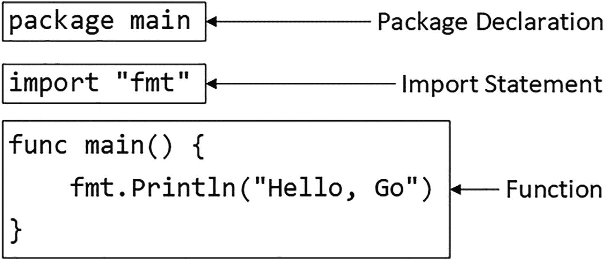

**图 3-1** 代码文件中的关键元素

### 理解包声明

第一个语句是包声明。包用于将相关功能分组，每个代码文件都必须声明其内容所属的包。包声明使用 `package` 关键字，后跟包的名称，如图 3-2 所示。本例文件中的语句指定了一个名为 `main` 的包。

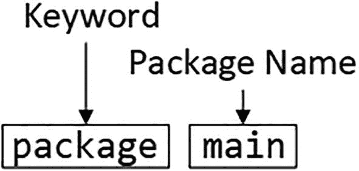

**图 3-2** 为代码文件指定包

### 理解导入语句

接下来的语句是导入语句，用于声明对其它包的依赖。`import` 关键字后跟包名，包名用双引号括起来，如图 3-3 所示。清单 3-1 中的导入语句指定了一个名为 `fmt` 的包，这是 Go 内置的用于读写格式化字符串的包（我将在第 17 章中详细描述）。

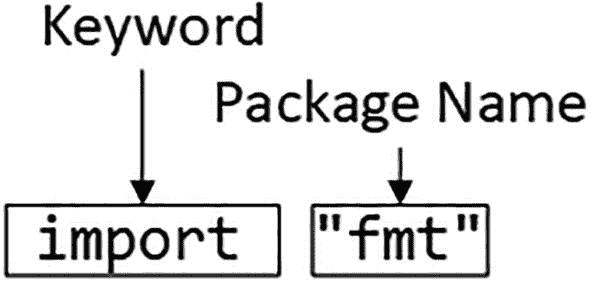

**图 3-3** 声明包依赖

**提示**

Go 提供的所有内置包的完整列表可在 [`https://golang.org/pkg`](https://golang.org/pkg) 上找到。

### 理解函数

`main.go` 文件中的其余语句定义了一个名为 `main` 的函数。我将在第 8 章中详细描述函数，但 `main` 函数是特殊的。当你在名为 `main` 的包中定义一个名为 `main` 的函数时，你就创建了一个*入口点*，命令行应用程序的执行正是从这里开始的。图 3-4 展示了 `main` 函数的结构。

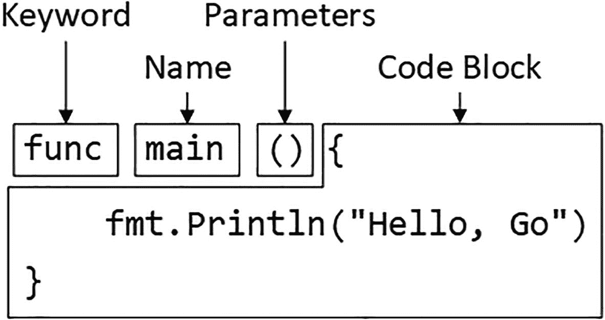

**图 3-4** `main` 函数的结构

Go 函数的基本结构与其他语言类似。`func` 关键字表示一个函数，后跟函数名，本例中为 `main`。

清单 3-1 中的函数没有定义参数，由空括号表示，并且不产生任何结果。我将在后续示例中介绍更复杂的函数，但这个简单的函数已足够入门使用。

函数的代码块包含了当该函数被调用时将执行的语句。由于 `main` 函数是入口点，当项目的编译输出被执行时，该函数将被自动调用。


### 理解代码语句

`main` 函数包含一条代码语句。当你通过 `import` 语句声明对某个包的依赖时，会获得一个包引用，从而能够访问该包的功能。默认情况下，包引用被赋值为包名，因此，例如 `fmt` 包提供的功能，需要通过 `fmt` 包引用来访问，如图 3-5 所示。

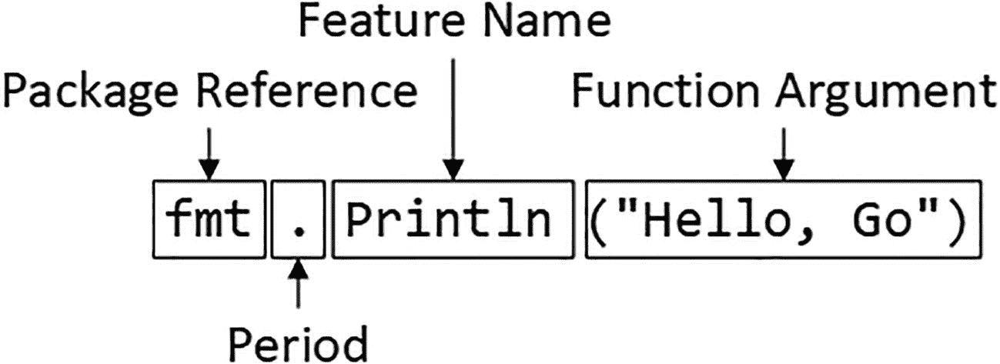

**图 3-5** – 访问包功能

该语句调用了 `fmt` 包提供的一个名为 `Println` 的函数。此函数将字符串写入标准输出，这意味着在下一节构建并运行项目时，该字符串将显示在控制台上。

要访问该函数，需使用包名，后跟句点，然后是函数名：`fmt.Println`。向该函数传递一个参数，即要写入的字符串。

## 在 Go 代码中使用分号

Go 对分号的处理方式不同寻常：分号是终止代码语句所必需的，但在源代码文件中却不需要。实际上，Go 构建工具在处理文件时会自行确定分号应该放在哪里，其效果相当于开发者手动添加了分号。

因此，分号可以在 Go 源代码文件中使用，但并非必需，按惯例通常会省略。

如果你不遵循预期的 Go 代码风格，可能会出现一些奇怪的问题。例如，如果你尝试将 `function` 或 `for` 循环的左花括号放在下一行，就会收到编译器错误，如下所示：

```
package main
import "fmt"
func main()
{
fmt.Println("Hello, Go")
}
```

错误信息会提示意外的分号和缺少函数体。这是因为 Go 工具自动插入了分号，效果如下：

```
package main
import "fmt"
func main();
{
fmt.Println("Hello, Go")
}
```

当你理解了错误产生的原因后，这些错误信息就变得更有意义了，不过如果你习惯这种花括号放置方式，可能需要一些时间来适应预期的代码格式。

在本书中，我尽量遵循不带分号的约定，但几十年来我一直在使用需要分号的语言编写代码，因此你可能会发现偶尔有示例因习惯而添加了分号。我在“格式化 Go 代码”一节中介绍的 `go fmt` 命令，会移除分号并调整其他格式问题。

## 编译并运行源代码

`go build` 命令用于编译 Go 源代码并生成可执行文件。在 `tools` 文件夹中运行清单 3-2 所示的命令来编译代码。

```
go build main.go
```

**清单 3-2** – 使用编译器

编译器处理 `main.go` 文件中的语句，并生成一个可执行文件，在 Windows 上命名为 `main.exe`，在其他平台上命名为 `main`。（一旦我在“定义模块”一节中引入模块，编译器将开始创建具有更有用名称的文件。）

在 `tools` 文件夹中运行清单 3-3 所示的命令来运行可执行文件。

```
./main
```

**清单 3-3** – 运行编译后的可执行文件

项目的入口点——即 `main` 包中名为 `main` 的函数——被执行并产生以下输出：

```
Hello, Go
```

### 配置 Go 编译器

Go 编译器的行为可以通过额外的参数进行配置，尽管默认设置对于大多数项目来说已经足够。最有用的两个参数是 `-a`（强制完整重新编译，即使文件未更改）和 `-o`（指定编译输出文件的名称）。使用 `go help build` 命令查看所有可用选项的完整列表。默认情况下，编译器生成一个可执行文件，但也有其他可用的输出类型——详情请参见 [`https://golang.org/cmd/go/#hdr-Build_modes`](https://golang.org/cmd/go/%2523hdr-Build_modes)。

### 清理

要移除编译过程中的输出，请在 `tools` 文件夹中运行清单 3-4 所示的命令。

```
go clean main.go
```

**清单 3-4** – 清理

上一节中创建的编译可执行文件被移除，只留下源代码文件。

### 使用 Go Run 命令

大多数常规开发工作使用 `go run` 命令进行。在 `tools` 文件夹中运行清单 3-5 所示的命令。

```
go run main.go
```

**清单 3-5** – 使用 Go Run 命令

该文件在单一步骤中被编译并执行，而无需在 `tools` 文件夹中创建可执行文件。可执行文件会被创建，但位于一个临时文件夹中，然后从该临时文件夹运行。（正是这一系列临时位置导致 Windows 防火墙在第一章中使用 `go run` 命令时每次都需要请求权限。每次运行该命令，都会在一个新的临时文件夹中创建可执行文件，这对防火墙来说就像是一个全新的文件。）

清单 3-5 中的命令产生以下输出：

```
Hello, Go
```

### 定义模块

上一节演示了你只需要创建一个代码文件即可开始，但更常见的做法是创建一个 Go 模块，这是开始新项目时的常规第一步。创建 Go 模块可以使项目轻松使用第三方包，并简化构建过程。在 `tools` 文件夹中运行清单 3-6 所示的命令。

```
go mod init tools
```

**清单 3-6** – 创建模块

此命令在 `tools` 文件夹中添加一个名为 `go.mod` 的文件。大多数项目从 `go mod init` 命令开始的原因是它能简化构建过程。无需指定特定的代码文件，项目只需使用一个点号（表示当前目录中的项目）即可构建和执行。在 `tools` 文件夹中运行清单 3-7 所示的命令，编译并执行其中包含的代码，而无需指定代码文件名。

```
go run .
```

**清单 3-7** – 编译并执行一个项目

`go.mod` 文件还有其他用途——正如后续章节所展示的那样——但本书剩余部分的所有示例我都以 `go mod init` 命令开始，以简化构建过程。


## 调试 Go 代码

Go 应用程序的标准调试器名为 Delve。它是一款第三方工具，但得到了 Go 开发团队的充分支持与推荐。Delve 支持 Windows、macOS、Linux 和 FreeBSD 平台。如需安装 Delve 包，请打开一个新的命令提示符窗口，并运行清单 3-8 中所示的命令。

> **提示：** 各平台的详细安装说明请参见 [`github.com/go-delve/delve/tree/master/Documentation/installation`](https://github.com/go-delve/delve/tree/master/Documentation/installation)。根据你所选的操作系统，可能还需要进行额外配置。

```
go install github.com/go-delve/delve/cmd/dlv@latest
清单 3-8
安装调试器包
```

`go install` 命令用于下载并安装某个包，常用于安装调试器等工具。类似的命令 `go get` 则用于处理那些提供代码功能、需要被包含在应用程序中的包，如第 12 章所示。

为确保调试器已正确安装，请运行清单 3-9 所示的命令。

```
dlv version
清单 3-9
运行调试器
```

如果你收到错误信息，提示找不到 `dlv` 命令，请尝试直接指定其路径。默认情况下，`dlv` 命令会被安装在 `~/go/bin` 文件夹中（不过可以通过设置 `GOPATH` 环境变量来覆盖此默认路径），如清单 3-10 所示。

```
~/go/bin/dlv
清单 3-10
使用路径运行调试器
```

如果包已正确安装，你将看到类似如下的输出，不过具体的版本号和构建 ID 可能有所不同：

```
Delve 调试器
版本: 1.7.1
构建: $Id: 3bde2354aafb5a4043fd59838842c4cd4a8b6f0b $
```

### 使用 Println 函数进行调试

我喜欢像 Delve 这样的调试器，但我只会在一些无法通过我的首选调试技巧——`Println` 函数——解决的问题上使用它们。我使用 `Println` 是因为它快速、简单且可靠，而且大多数 bug（至少在我自己的代码中）都是由于函数没有接收到我期望的值，或者某个特定语句没有在我预期的时候被执行所致。这些简单的问题通过向控制台输出一条消息就能轻松诊断。

如果 `Println` 输出的信息没有帮助，那么我会启动调试器，设置断点，然后逐步执行代码。即使在那个时候，一旦我对问题的原因有了初步了解，我往往还是会回到 `Println` 语句来验证我的理论。

许多开发者不愿承认他们觉得调试器笨拙或令人困惑，最终都会偷偷地用回 `Println`。调试器*确实*让人困惑，但使用所有可用的工具并不可耻。`Println` 函数和调试器是互补的工具，重要的是 bug 能够得到修复，无论通过何种方式。

### 准备调试

`main.go` 文件中没有足够的代码来进行调试。请添加清单 3-11 中所示的语句，以创建一个循环，该循环将打印出一系列数字值。

```
package main
import "fmt"
func main() {
fmt.Println("Hello, Go")
for i := 0; i < 5; i++ {
fmt.Println(i)
}
}
清单 3-11
在 tools 文件夹的 main.go 文件中添加一个循环
```

我将在第 6 章中描述 `for` 语法，但本章我只需要一些代码语句来演示调试器的工作方式。使用 `go run .` 命令编译并执行代码；你将看到以下输出：

```
Hello, Go

```

### 使用调试器

要启动调试器，请在 `tools` 文件夹中运行清单 3-12 中所示的命令。

```
dlv debug main.go
清单 3-12
启动调试器
```

此命令会启动一个基于文本的调试客户端。刚开始可能会觉得它令人困惑，但一旦你习惯了它的工作方式，就会发现它极其强大。第一步是创建一个断点，通过指定代码中的一个位置来实现，如清单 3-13 所示。

```
break bp1 main.main:3
清单 3-13
创建断点
```

`break` 命令用于创建断点。参数指定了断点的名称和位置。位置可以用多种方式指定，但清单 3-13 中使用的位置指定了包名、该包中的函数以及该函数中的行号，如图 3-6 所示。

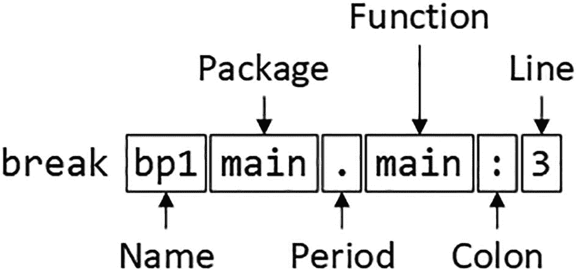

**图 3-6：** 指定断点位置

断点的名称是 `bp1`，其位置指定了 `main` 包中 `main` 函数的第三行。调试器会显示以下确认消息：

```
断点 1 设置在 0x697716，对应 main.main() c:/tools/main.go:8
```

接下来，我将为这个断点创建一个条件，这样只有当指定的表达式计算结果为 `true` 时，程序执行才会暂停。在调试器中输入清单 3-14 中所示的命令，然后按回车键。

```
condition bp1 i == 2
清单 3-14
在调试器中指定断点条件

`condition` 命令的参数指定了一个断点和一个表达式。此命令告诉调试器，名为 `bp1` 的断点仅在表达式 `i == 2` 为 `true` 时才暂停执行。要开始执行代码，请输入清单 3-15 中所示的命令，然后按回车键。

```
continue
清单 3-15
在调试器中开始执行
```

调试器开始执行代码，并产生以下输出：

```
Hello, Go

```

当清单 3-15 中指定的条件满足时，程序执行会暂停，调试器会显示相应的代码以及执行停止的位置：

```
> [bp1] main.main() c:/tools/main.go:8 (命中 goroutine(1):1 总次数:1) (PC: 0x207716)
3: import "fmt"
4:
5: func main() {
6:     fmt.Println("Hello, Go")
7:     for i := 0; i    8:         fmt.Println(i)
9:     }
10: }
```

调试器提供了一套完整的命令用于检查和修改应用程序的状态，其中最常用的命令如表 3-2 所示。（调试器支持的全部命令集请参见 [`github.com/go-delve/delve`](https://github.com/go-delve/delve)。）

**表 3-2：** 有用的调试器状态命令

| 命令 | 描述 |
| --- | --- |
| `print <expr>` | 该命令用于计算表达式并显示结果。它可以用来显示一个值（`print i`），或者执行更复杂的测试（`print i > 0`）。 |
| `set <variable> = <value>` | 该命令用于更改指定变量的值。 |
| `locals` | 该命令用于打印所有局部变量的值。 |
| `whatis <expr>` | 该命令用于打印指定表达式的类型，例如 `whatis i`。我将在第 4 章中描述 Go 的类型。 |

运行清单 3-16 中所示的命令，以显示变量 `i` 的当前值。

```
print i
清单 3-16
在调试器中打印一个值
```


调试器显示响应值 `2`，即变量的当前值，该值符合我在清单 3-16 中为断点指定的条件。调试器提供了一整套用于控制执行的命令，其中最常用的命令如表 3-3 所示。

| 命令 | 描述 |
| --- | --- |
| `continue` | 此命令恢复应用程序的执行。 |
| `next` | 此命令移动到下一条语句。 |
| `step` | 此命令进入当前语句。 |
| `stepout` | 此命令跳出当前语句。 |
| `restart` | 此命令重新启动进程。使用 `continue` 命令开始执行。 |
| `exit` | 此命令退出调试器。 |

输入 `continue` 命令以恢复执行，这将产生以下输出：

```
Process 3160 has exited with status 0
```

我为断点指定的条件不再满足，因此程序会运行直到终止。使用 `exit` 命令退出调试器并返回命令提示符。

#### 使用 Delve 编辑器插件

Delve 也受到一系列编辑器插件的支持，这些插件为 Go 提供了基于 UI 的调试体验。完整的插件列表可在 [`https://github.com/go-delve/delve`](https://github.com/go-delve/delve) 找到，但最佳的 Go/Delve 调试体验之一是由 Visual Studio Code 提供的，并且当安装 Go 语言工具时会自动安装该插件。

如果你使用 Visual Studio Code，可以通过点击代码编辑器的边缘来创建断点，并使用“运行”菜单中的“开始调试”命令启动调试器。

如果你收到错误或被提示选择环境，请打开 `main.go` 文件进行编辑，点击编辑器窗口中的任意代码语句，然后再次选择“开始调试”命令。

我不打算详细描述使用 Visual Studio Code（或任何编辑器）进行调试的过程，但图 3-7 展示了条件断点暂停执行后的调试器状态，重现了上一节中的命令行示例。

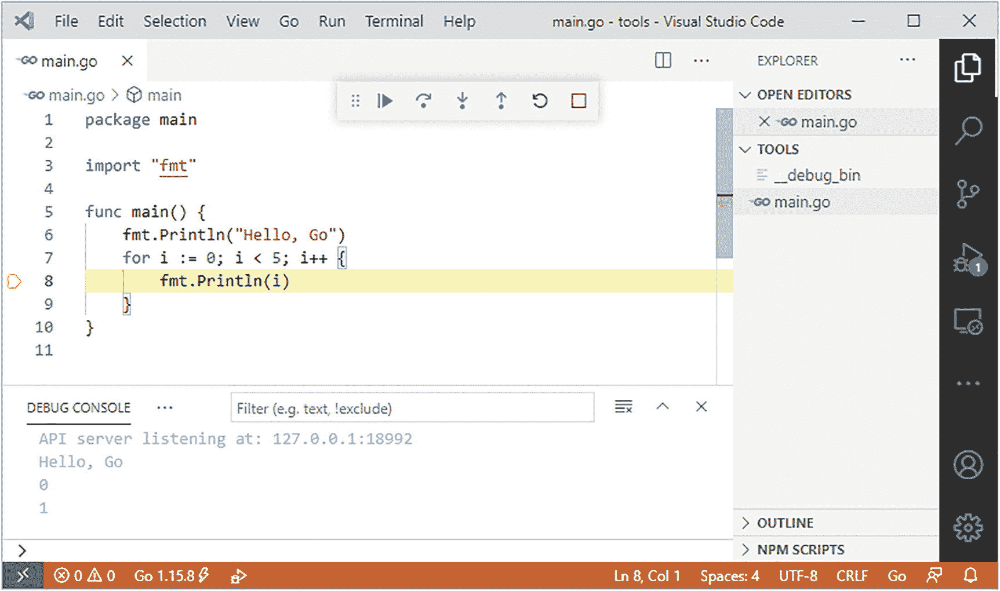

使用 Delve 编辑器插件

## Linting Go 代码

Linter 是一种工具，它使用一组规则检查代码文件，这些规则描述那些导致混淆、产生意外结果或降低代码可读性的问题。Go 最广泛使用的 linter 叫做 `golint`，它应用的规则来自两个来源。第一个是 Google 制作的《Effective Go》文档 ([`https://golang.org/doc/effective_go.html`](https://golang.org/doc/effective_go.html))，该文档提供了编写清晰简洁 Go 代码的技巧。第二个来源是来自代码审查的评论合集 ([`https://github.com/golang/go/wiki/CodeReviewComments`](https://github.com/golang/go/wiki/CodeReviewComments))。

`golint` 的问题在于它不提供任何配置选项，并且始终应用所有规则，这可能导致你关心的警告淹没在一长串你不关心的规则警告中。我更喜欢使用 `revive` linter 包，它可以直接替代 `golint`，但支持控制哪些规则被应用。要安装 `revive` 包，请打开一个新的命令提示符，并运行清单 3-17 中所示的命令。

```
go install github.com/mgechev/revive@latest
```

**LINTING 的喜与悲**

Linter 可以成为一个强大的有益工具，尤其是在一个技能和经验水平参差不齐的开发团队中。Linter 可以检测常见问题以及那些导致意外行为或长期维护问题的细微错误。我喜欢这类 linting，并且在我完成一个主要应用功能或将代码提交到版本控制之前，喜欢通过 linting 过程运行我的代码。

但是，当使用规则将某个开发者的个人偏好强加于整个团队时，linter 也可能成为不和与冲突的工具。这通常是在“有主见”的旗帜下进行的。其逻辑是，开发者花了太多时间争论不同的编码风格，而被强制以相同方式编写代码对所有人都更好。

我的经验是，开发者只会找到其他事情来争论，而强制编码风格往往只是借口，让一个人的偏好成为整个开发团队的强制性要求。

我在本章中没有使用流行的 `golint` 包，因为它无法禁用单个规则。我尊重 `golint` 开发者强烈的个人观点，但使用 `golint` 让我感觉像是在和某个我根本不认识的人进行无休止的争论，这不知怎么地，感觉比和团队里那个对缩进感到不满的开发者进行无休止的争论更糟糕。

我的建议是，谨慎使用 linting，并专注于那些会造成真正问题的问题。给予各个开发者自然表达的自由，只关注那些对项目有可察觉影响的问题。这与 Go 的“有主见”精神相悖，但我认为，生产力不是通过盲目地执行武断的规则来实现的，无论这些规则的本意多么良好。


### 使用 Linter

`main.go` 文件非常简单，以至于 linter 找不到任何问题。请添加清单 3-19 中所示的语句，这些语句是合法的 Go 代码，但不遵守 linter 应用的规则。

```
package main
import "fmt"
func main() {
PrintHello()
for i := 0; i < 5; i++ {
PrintNumber(i)
}
}
func PrintHello() {
fmt.Println("Hello, Go")
}
func PrintNumber(number int) {
fmt.Println(number)
}
```

保存更改，并使用命令提示符运行清单 3-19 中所示的命令。（与 `dlv` 命令一样，你可能需要指定 `home` 文件夹中的 `go/bin` 路径才能运行此命令。）

```
revive
```

linter 会检查 `main.go` 文件并报告以下问题：

```
main.go:12:1: exported function PrintHello should have comment or be unexported
main.go:16:1: exported function PrintNumber should have comment or be unexported
```

正如我在第 12 章中解释的，以大写字母开头的函数被称为 **导出（exported）** 函数，并且可以在其定义的包之外使用。导出函数的惯例是提供描述性注释。linter 已标记出 `PrintHello` 和 `PrintNumber` 函数没有注释的事实。清单 3-20 为其中一个函数添加了注释。

```
package main
import "fmt"
func main() {
PrintHello()
for i := 0; i < 5; i++ {
PrintNumber(i)
}
}
func PrintHello() {
fmt.Println("Hello, Go")
}
// This function writes a number using the fmt.Println function
func PrintNumber(number int) {
fmt.Println(number)
}
```

再次运行 `revive` 命令；你会收到关于 `PrintNumber` 函数的不同错误：

```
main.go:12:1: exported function PrintHello should have comment or be unexported
main.go:16:1: comment on exported function PrintNumber should be of the form "PrintNumber ..."
```

一些 linter 规则在其要求上很具体。清单 3-20 中的注释不被接受，因为 Effective Go 声明注释应包含以函数名开头的句子，并应提供函数目的的简要概述，正如 [`https://golang.org/doc/effective_go.html#commentary`](https://golang.org/doc/effective_go.html%2523commentary) 所述。清单 3-21 修订了注释，以遵循所需的结构。

```
package main
import "fmt"
func main() {
PrintHello()
for i := 0; i < 5; i++ {
PrintNumber(i)
}
}
func PrintHello() {
fmt.Println("Hello, Go")
}
// PrintNumber writes a number using the fmt.Println function
func PrintNumber(number int) {
fmt.Println(number)
}
```

再次运行 `revive` 命令；linter 将完成执行而不会报告 `PrintNumber` 函数的任何错误，但 `PrintHello` 函数仍会报告一个警告，因为它没有注释。

### 理解 Go 文档

linter 对注释如此严格的原因是因为它们被 `go doc` 命令使用，该命令从源代码注释生成文档。你可以在 [`https://blog.golang.org/godoc`](https://blog.golang.org/godoc) 查看如何使用 `go doc` 命令的详细信息，但你可以通过在 `tools` 文件夹中运行 `go doc -all` 命令来快速演示它如何使用注释来记录一个包。

### 禁用 Linter 规则

可以使用代码文件中的注释来配置 `revive` 包，为代码段禁用一个或多个规则。在清单 3-22 中，我使用注释禁用了导致 `PrintNumber` 函数警告的规则。

```
package main
import "fmt"
func main() {
PrintHello()
for i := 0; i < 5; i++ {
PrintNumber(i)
}
}
// revive:disable:exported
func PrintHello() {
fmt.Println("Hello, Go")
}
// revive:enable:exported
// PrintNumber writes a number using the fmt.Println function
func PrintNumber(number int) {
fmt.Println(number)
}
```

控制 linter 所需的语法是 `revive`，后跟一个冒号、`enable` 或 `disable`，并可选择再跟一个冒号和 linter 规则的名称。例如，`revive:disable:exported` 注释可防止 linter 实施名为 `exported` 的规则，该规则一直在生成警告。`revive:enable:exported` 注释启用该规则，以便将其应用于代码文件中后续的语句。

你可以在 [`https://github.com/mgechev/revive#available-rules`](https://github.com/mgechev/revive%2523available-rules) 找到 linter 支持的规则列表。或者，你也可以从注释中省略规则名称，以控制所有规则的应用。


### 创建 Linter 配置文件

当你想抑制特定代码区域的警告，但在项目的其他地方仍然应用规则时，使用代码注释会很有帮助。如果你根本不想应用某条规则，那么可以使用 TOML 格式的配置文件。在 `tools` 文件夹中添加一个名为 `revive.toml` 的文件，其内容如清单 3-23 所示。

> **提示**  
> TOML 格式是专门为配置文件设计的，其描述位于 [`https://toml.io/en`](https://toml.io/en)。`revive` 的全部配置选项说明位于 [`https://github.com/mgechev/revive#configuration`](https://github.com/mgechev/revive%2523configuration)。

```
ignoreGeneratedHeader = false
severity = "warning"
confidence = 0.8
errorCode = 0
warningCode = 0
[rule.blank-imports]
[rule.context-as-argument]
[rule.context-keys-type]
[rule.dot-imports]
[rule.error-return]
[rule.error-strings]
[rule.error-naming]
#[rule.exported]
[rule.if-return]
[rule.increment-decrement]
[rule.var-naming]
[rule.var-declaration]
[rule.package-comments]
[rule.range]
[rule.receiver-naming]
[rule.time-naming]
[rule.unexported-return]
[rule.indent-error-flow]
[rule.errorf]
清单 3-23
tools 文件夹中 revive.toml 文件的内容
```

这是 [`https://github.com/mgechev/revive#recommended-configuration`](https://github.com/mgechev/revive%2523recommended-configuration) 中描述的默认 `revive` 配置，只是我在启用 `exported` 规则的条目前面加了一个 `#` 字符。在清单 3-24 中，我已经从 `main.go` 文件中移除了注释，这些注释不再是满足 linter 要求所必需的。

```
package main
import "fmt"
func main() {
PrintHello()
for i := 0; i < 5; i++ {
PrintNumber(i)
}
}
func PrintHello() {
fmt.Println("Hello, Go")
}
func PrintNumber(number int) {
fmt.Println(number)
}
清单 3-24
从 tools 文件夹中的 main.go 文件移除注释
```

要使用带有配置文件的 linter，在 `tools` 文件夹中运行清单 3-25 所示的命令。

```
revive -config revive.toml
清单 3-25
使用配置文件运行 Linter
```

将不会有任何输出，因为唯一触发错误的规则已被禁用。

### 在代码编辑器中进行 Lint 检查

某些代码编辑器支持自动进行代码 lint 检查。例如，如果你使用的是 Visual Studio Code，lint 检查会在后台执行，并将问题标记为警告。Visual Studio Code 默认使用的 linter 会不时更改；在撰写本文时是 `staticcheck`，它是可配置的，但之前是 `golint`，而 `golint` 是不可配置的。

通过“首选项” ➤ “扩展” ➤ “Go” ➤ “Lint Tool” 配置选项，可以轻松地将 linter 更改为 `revive`。如果你想使用自定义配置文件，请使用“Lint Flags”配置选项添加一个标志，其值为 `-config=./revive.toml`，这将选取 `revive.toml` 文件。

## 修复 Go 代码中的常见问题

`go vet` 命令用于识别可能是错误的语句。与通常关注代码风格问题的 linter 不同，`go vet` 命令能够找出那些可以编译但很可能不会按开发者意图执行的代码。

我喜欢 `go vet` 命令，因为它能发现其他工具遗漏的错误，尽管分析器并不能发现所有错误，有时也会将一些没有问题的代码高亮显示为问题。在清单 3-26 中，我在 `main.go` 文件中添加了一条语句，故意引入了一个错误。

```
package main
import "fmt"
func main() {
PrintHello()
for i := 0; i < 5; i++ {
i = i
PrintNumber(i)
}
}
func PrintHello() {
fmt.Println("Hello, Go")
}
func PrintNumber(number int) {
fmt.Println(number)
}
清单 3-26
在 tools 文件夹中的 main.go 文件添加一条语句
```

新语句将变量 `i` 赋值给自己，Go 编译器允许这样做，但这很可能是一个错误。要分析代码，请在 `tools` 文件夹中使用命令提示符运行清单 3-27 所示的命令。

```
go vet main.go
清单 3-27
分析代码
```

`go vet` 命令将检查 `main.go` 文件中的语句，并产生以下警告：

```
### _/C_/tools
.\main.go:8:9: i 对 i 的自我赋值
```

`go vet` 命令产生的警告会指明代码中检测到问题的位置，并提供问题的描述。

`go vet` 命令会对代码应用多个分析器，你可以在 [`https://golang.org/cmd/vet`](https://golang.org/cmd/vet) 查看分析器列表。你可以选择启用或禁用单个分析器，但要知道哪个分析器生成了特定消息可能比较困难。要找出哪个分析器负责某个警告，请在 `tools` 文件夹中运行清单 3-28 所示的命令。

```
go vet -json main.go
清单 3-28
识别分析器
```

`json` 参数会生成 JSON 格式的输出，该输出按分析器对警告进行分组，如下所示：

```
### _/C_/tools {
"_/C_/tools": {
"assign": [
{
"posn": "C:\\tools\\main.go:8:9",
"message": "i 对 i 的自我赋值"
}
]
}
}
```

使用此命令可以揭示，名为 `assign` 的分析器负责生成针对 `main.go` 文件的警告。一旦知道了名称，就可以启用或禁用该分析器，如清单 3-29 所示。

```
go vet -assign=false
go vet -assign
清单 3-29
选择分析器
```

清单 3-29 中的第一个命令运行除 `assign` 之外的所有分析器，而 `assign` 正是生成自我赋值语句警告的分析器。第二个命令仅运行 `assign` 分析器。

#### 了解每个分析器的功能

弄清楚每个 `go vet` 分析器在寻找什么可能比较困难。我觉得 Go 团队为这些分析器编写的单元测试很有帮助，因为它们包含了正在寻找的问题类型的示例。这些测试位于 [`https://github.com/golang/go/tree/master/src/cmd/vet/testdata`](https://github.com/golang/go/tree/master/src/cmd/vet/testdata)。

某些编辑器（包括 Visual Studio Code）会在编辑器窗口中显示来自 `go vet` 的消息，如图 3-8 所示，这使得无需显式运行命令就能轻松获益于代码分析。

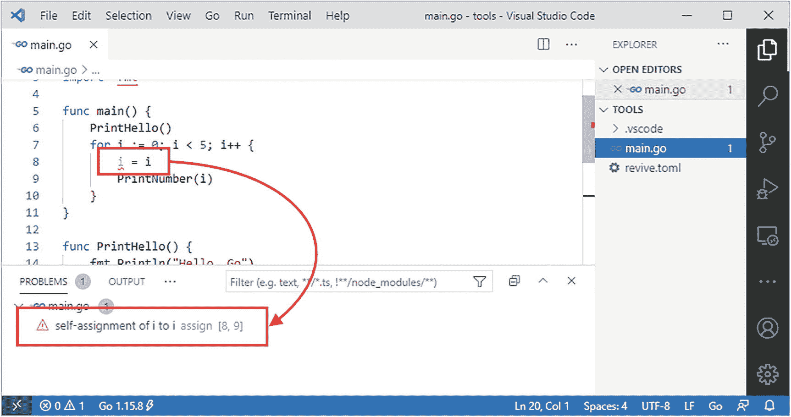

**图 3-8**  
代码编辑器中的潜在代码问题

Visual Studio Code 在编辑器窗口中标记该错误，并在“问题”窗口中显示详细信息。默认情况下，使用 `go vet` 进行分析是启用的，你可以通过“设置” ➤ “扩展” ➤ “Go” ➤ “Vet On Save” 配置项来禁用此功能。


## 格式化 Go 代码

`go fmt` 命令可以统一格式化 Go 源代码文件。该命令没有可配置的选项来改变其应用的格式，它会将代码转换为 Go 开发团队指定的风格。最明显的变化包括：使用制表符进行缩进、对齐注释以及删除不必要的分号。清单 3-30 展示了一段缩进不一致、注释未对齐且包含非必需分号的代码。

> **提示：** 您可能会发现，当代码粘贴到编辑器窗口或保存文件时，编辑器会自动格式化代码。

```
package main
import "fmt"
func main() {
PrintHello  ()
for i := 0; i < 5; i++ { // 带计数器的循环
PrintHello(); // 打印消息
PrintNumber(i); // 打印计数器值
}
}
func PrintHello  () {
fmt.Println("Hello, Go");
}
func PrintNumber  (number int) {
fmt.Println(number);
}
清单 3-30
在 tools 文件夹的 main.go 文件中创建格式问题
```

在 `tools` 文件夹中运行清单 3-31 所示的命令以重新格式化代码。

```
go fmt main.go
清单 3-31
格式化源代码
```

格式化程序将删除分号、调整缩进并对齐注释，生成如下格式化后的代码：

```
package main
import "fmt"
func main() {
PrintHello()
for i := 0; i < 5; i++ { // 带计数器的循环
PrintHello()   // 打印消息
PrintNumber(i) // 打印计数器值
}
}
func PrintHello() {
fmt.Println("Hello, Go")
}
func PrintNumber(number int) {
fmt.Println(number)
}
```

本书的示例中未使用 `go fmt`，因为使用制表符会导致在打印页面上出现布局问题。为了确保代码在书籍印刷时显示正常，我不得不使用空格进行缩进，而 `go fmt` 会将这些空格替换为制表符。

## 本章小结

在本章中，我介绍了用于 Go 开发的工具。我解释了如何编译和执行源代码、如何调试 Go 代码、如何使用 linter、如何格式化源代码以及如何查找常见问题。下一章，我将开始介绍 Go 语言的功能特性，首先从基本数据类型讲起。

# 4. 基本类型、值和指针

本章开始介绍 Go 语言，重点介绍基本数据类型，然后介绍如何使用它们创建常量和变量。同时，我还会介绍 Go 对指针的支持。指针可能会引起混淆，特别是如果您从 Java 或 C# 等语言转向 Go 语言，我将解释 Go 指针的工作原理，演示其有用之处，并说明为何无需畏惧指针。

任何编程语言提供的功能都是为了协同使用，这使得逐步介绍它们变得有些困难。本书本部分的一些示例依赖于后面章节介绍的功能特性。这些示例包含了足够的细节来提供上下文，并引用了书中可以找到更多细节的部分。表 4-1 将 Go 的基本功能特性置于上下文中。

**表 4-1** 将基本类型、值和指针功能置于上下文中

| 问题 | 答案 |
| --- | --- |
| 它们是什么？ | 数据类型用于存储所有编程中共有的基本值，包括数字、字符串和 `true`/`false` 值。这些数据类型可用于定义常量和变量值。指针是一种特殊的数据类型，用于存储内存地址。 |
| 它们为什么有用？ | 基本数据类型本身对于存储值很有用，但它们也是定义更复杂数据类型的基础，我将在第 10 章中解释。指针之所以有用，是因为它们允许程序员决定一个值在被使用时是否应该被复制。 |
| 如何使用它们？ | 基本数据类型有各自的名称，例如 `int` 和 `float64`，并且可以与 `const` 和 `var` 关键字一起使用。指针使用地址运算符 `&` 创建。 |
| 是否有任何陷阱或限制？ | Go 语言不会自动进行值转换，除了被称为*无类型常量*的特殊类别值。 |
| 是否有替代方案？ | 基本数据类型没有替代方案，它们在 Go 开发中被广泛使用。 |

**表 4-2** 章节总结

| 问题 | 解决方案 | 清单 |
| --- | --- | --- |
| 直接使用值 | 使用字面量值 | 6 |
| 定义常量 | 使用 `const` 关键字 | 7, 10 |
| 定义可转换为相关数据类型的常量 | 创建无类型常量 | 8, 9, 11 |
| 定义变量 | 使用 `var` 关键字或短声明语法 | 12–21 |
| 防止未使用变量的编译器错误 | 使用空标识符 | 22, 23 |
| 定义指针 | 使用地址运算符 | 24, 25, 29–30 |
| 跟随指针 | 在指针变量名前使用星号 | 26–28, 31 |

## 本章准备工作

为准备本章，请打开一个新的命令提示符，导航到一个方便的位置，并创建一个名为 `basicFeatures` 的目录。运行清单 4-1 所示的命令来为项目创建 `go.mod` 文件。

```
go mod init basicfeatures
清单 4-1
创建示例项目
```

将名为 `main.go` 的文件添加到 `basicFeatures` 文件夹中，其内容如清单 4-2 所示。

> **提示：** 您可以从 [`https://github.com/apress/pro-go`](https://github.com/apress/pro-go) 下载本章以及本书其他所有章节的示例项目。如果在运行示例时遇到问题，请参阅第 2 章了解如何获取帮助。

```
package main
import (
"fmt"
"math/rand"
)
func main() {
fmt.Println(rand.Int())
}
清单 4-2
basicFeatures 文件夹中 main.go 文件的内容
```

在命令提示符下，在 `basicFeatures` 文件夹中运行清单 4-3 所示的命令。

```
go run .
清单 4-3
运行示例项目
```

`main.go` 文件中的代码将被编译并执行，产生如下输出：

```

```

该代码的输出总是相同的值，尽管它是由随机数包生成的，我将在第 18 章中解释原因。


### 使用 Go 标准库

Go 通过其*标准库*提供了一系列广泛有用的功能，标准库是用来描述内置 API 的术语。Go 标准库以一组*包*的形式呈现，这些包是第 1 章中使用的 Go 安装程序的一部分。

我将在第 12 章中描述 Go 包的创建和使用方式，但部分示例依赖于标准库中的包，因此理解它们的使用方式至关重要。

标准库中的每个包都汇集了一组相关功能。清单 4-2 中的代码使用了两个包：`fmt` 包提供格式化和写入字符串的功能，`math/rand` 包则处理随机数。

使用包的第一步是定义 `import` 语句。图 4-1 展示了清单 4-2 中使用的 `import` 语句。

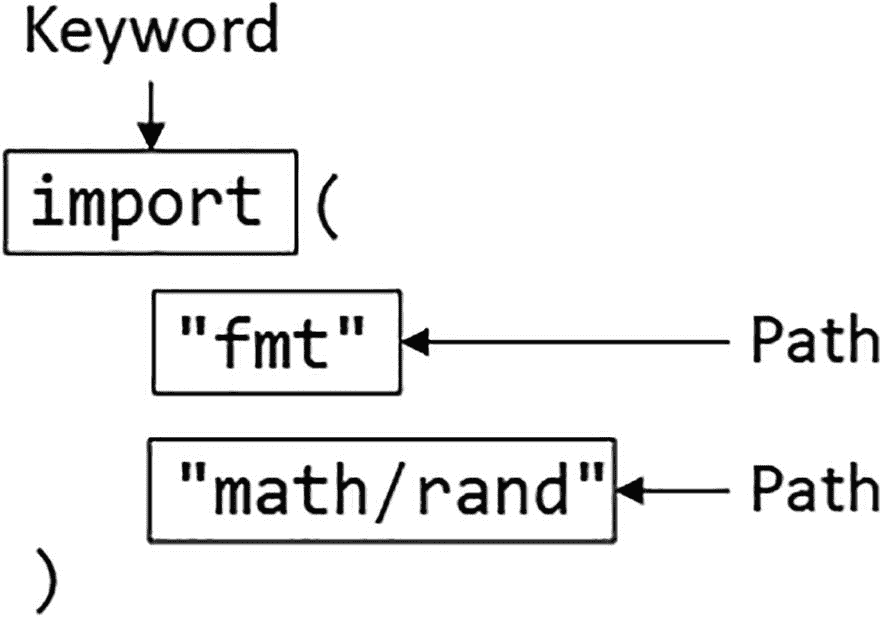

**图 4-1** – 导入包

`import` 语句包含两部分：`import` 关键字和包路径。如果导入多个包，路径需要用括号括起来。

`import` 语句创建了一个包引用，通过它可以访问包提供的功能。包引用的名称是包路径中的最后一个片段。`fmt` 包的路径只有一个片段，因此包引用名为 `fmt`。`math/rand` 路径有两个片段——`math` 和 `rand`——因此包引用名为 `rand`。（我将在第 12 章中解释如何选择自己的包引用名称。）

`fmt` 包定义了一个 `Println` 函数，用于将值写入标准输出；`math/rand` 包定义了一个 `Int` 函数，用于生成随机整数。要访问这些函数，我使用其包引用，后跟句点和函数名，如图 4-2 所示。

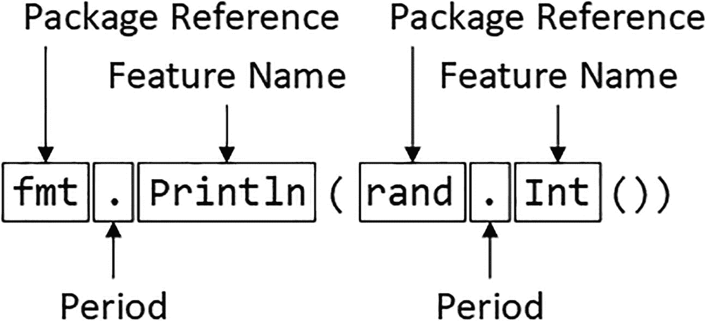

**图 4-2** – 使用包引用

**提示**  
Go 标准库包列表可在 [`https://golang.org/pkg`](https://golang.org/pkg) 查看。最有用的包将在第 2 部分中描述。

`fmt` 包提供的一个相关功能是将静态内容与数据值组合成字符串，如清单 4-4 所示。

```
package main
import (
"fmt"
"math/rand"
)
func main() {
fmt.Println("Value:", rand.Int())
}
```

**清单 4-4** – 在 `basicFeatures` 文件夹的 `main.go` 文件中组合字符串

传递给 `Println` 函数的逗号分隔值序列被组合成一个字符串，然后写入标准输出。要编译并执行代码，请使用命令提示符在 `basicFeatures` 文件夹中运行清单 4-5 所示的命令。

```
go run .
```

**清单 4-5** – 运行示例项目

`main.go` 文件中的代码将被编译并执行，产生以下输出：

```
Value: 5577006791947779410
```

还有更多有用的字符串组合方式——我将在第 2 部分中描述——但这种方法简单实用，便于我在示例中提供输出。

## 了解基本数据类型

Go 提供了一组基本数据类型，如表 4-3 所示。在接下来的章节中，我将描述这些类型并解释如何使用它们。这些类型是 Go 开发的基础，其许多特性在其他语言中也会很熟悉。

**表 4-3** – Go 基本数据类型

| 名称 | 描述 |
| --- | --- |
| `int` | 此类型表示整数，可正可负。`int` 类型的大小取决于平台，为 32 位或 64 位。还有特定大小的整数类型，例如 `int8`、`int16`、`int32` 和 `int64`，但除非需要特定大小，否则应使用 `int` 类型。 |
| `uint` | 此类型表示正整数。`uint` 类型的大小取决于平台，为 32 位或 64 位。还有特定大小的无符号整数类型，例如 `uint8`、`uint16`、`uint32` 和 `uint64`，但除非需要特定大小，否则应使用 `uint` 类型。 |
| `byte` | 此类型是 `uint8` 的别名，通常用于表示数据的一个字节。 |
| `float32`、`float64` | 这些类型表示带小数的数字。这些类型分配 32 位或 64 位来存储值。 |
| `complex64`、`complex128` | 这些类型表示具有实部和虚部的复数。这些类型分配 64 位或 128 位来存储值。 |
| `bool` | 此类型表示布尔值，值为 `true` 和 `false`。 |
| `string` | 此类型表示字符序列。 |
| `rune` | 此类型表示单个 Unicode 码点。Unicode 很复杂，但——粗略地说——这就是单个字符的表示。`rune` 类型是 `int32` 的别名。 |

**GO 中的复数**

如表 4-3 所述，Go 内置支持具有实部和虚部的复数。我记得在学校学过复数，但很快就忘光了，直到我开始阅读 Go 语言规范才重新想起。本书中不会描述复数的使用，因为它们仅在特定领域（例如电气工程）中使用。你可以在 [`https://en.wikipedia.org/wiki/Complex_number`](https://en.wikipedia.org/wiki/Complex_number) 了解更多关于复数的信息。


### 理解字面量

Go 的值可以通过字面量来表示，即直接在源代码文件中定义该值。字面量的常见用途包括表达式中的操作数和函数的参数，如代码清单 4-6 所示。

**提示：** 请注意，我在代码清单 4-6 的 `import` 语句中注释掉了 `math/rand` 包。在 Go 中，导入未使用的包是一个错误。

```
package main
import (
"fmt"
//"math/rand"
)
func main() {
fmt.Println("Hello, Go")
fmt.Println(20 + 20)
fmt.Println(20 + 30)
}
```

*代码清单 4-6：在 basicFeatures 文件夹的 main.go 文件中使用字面量*

`main` 函数中的第一条语句使用了一个字符串字面量（由双引号表示）作为 `fmt.Println` 函数的参数。其他语句在表达式中使用了 `int` 类型的字面量，这些表达式的结果被用作 `fmt.Println` 函数的参数。编译并执行该代码，你将看到以下输出：

```
Hello, Go
40
50
```

使用字面量时无需指定类型，因为编译器会根据值的表示方式来推断其类型。为便于快速参考，表 4-4 给出了基本类型的字面量示例。

**表 4-4：字面量示例**

| 类型 | 示例 |
| --- | --- |
| `int` | `20`, `-20`。也可以使用十六进制（`0x14`）、八进制（`0o24`）和二进制表示法（`0b0010100`）。 |
| `uint` | 没有 `uint` 字面量。所有整数类型的字面量都被视为 `int` 值。 |
| `byte` | 没有 `byte` 字面量。由于 `byte` 类型是 `uint8` 类型的别名，字节通常表示为整数字面量（如 `101`）或 `rune` 字面量（`'e'`）。 |
| `float64` | `20.2`, `-20.2`, `1.2e10`, `1.2e-10`。也可以使用十六进制表示法（`0x2p10`），尽管指数部分以十进制数字表示。 |
| `bool` | `true`, `false`。 |
| `string` | `"Hello"`。如果值用双引号括起来（`"Hello\n"`），则会解释反斜杠转义的字符序列。如果值用反引号括起来（`` `Hello\n` ``），则不会解释转义序列。 |
| `rune` | `'A'`, `'\n'`, `'\u00A5'`, `'¥'`。字符、字形和转义序列用单引号（`'` 字符）括起来。 |

## 使用常量

常量是特定值的名称，使其能够被重复且一致地使用。在 Go 中定义常量有两种方式：有类型常量和无类型常量。代码清单 4-7 展示了有类型常量的使用。

```
package main
import (
"fmt"
//"math/rand"
)
func main() {
const price float32 = 275.00
const tax float32 = 27.50
fmt.Println(price + tax)
}
```

*代码清单 4-7：在 basicFeatures 文件夹的 main.go 文件中定义有类型常量*

有类型常量使用 `const` 关键字定义，后跟名称、类型和值赋值，如图 4-3 所示。

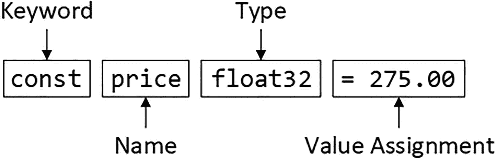

*图 4-3：定义有类型常量*

该语句创建了一个名为 `price` 的 `float32` 类型常量，其值为 `275.00`。代码清单 4-7 中的代码创建了两个常量，并将它们用于传递给 `fmt.Println` 函数的表达式中。编译并运行代码，你将得到以下输出：

```
302.5
```

### 理解无类型常量

Go 对其数据类型有严格的规则，并且不执行自动类型转换，这可能会使常见的编程任务复杂化，如代码清单 4-8 所示。

```
package main
import (
"fmt"
//"math/rand"
)
func main() {
const price float32 = 275.00
const tax float32 = 27.50
const quantity int = 2
fmt.Println("Total:", quantity * (price + tax))
}
```

*代码清单 4-8：在 basicFeatures 文件夹的 main.go 文件中混合数据类型*

新常量的类型是 `int`，对于只能表示整数数量的场景（例如产品数量）来说，这是一个合适的选择。该常量在传递给 `fmt.Println` 函数的表达式中用于计算总价。但编译该代码时，编译器报告了以下错误：

```
.\main.go:12:26: invalid operation: quantity * (price + tax) (mismatched types int and float32)
```

大多数编程语言会自动转换类型以允许表达式求值，但 Go 更严格的方法意味着 `int` 和 `float32` 类型不能混合使用。*无类型常量* 功能使常量的使用更加方便，因为 Go 编译器会执行有限的自动转换，如代码清单 4-9 所示。

```
package main
import (
"fmt"
//"math/rand"
)
func main() {
const price float32 = 275.00
const tax float32 = 27.50
const quantity = 2
fmt.Println("Total:", quantity * (price + tax))
}
```

*代码清单 4-9：在 basicFeatures 文件夹的 main.go 文件中使用无类型常量*

无类型常量的定义不带数据类型，如图 4-4 所示。

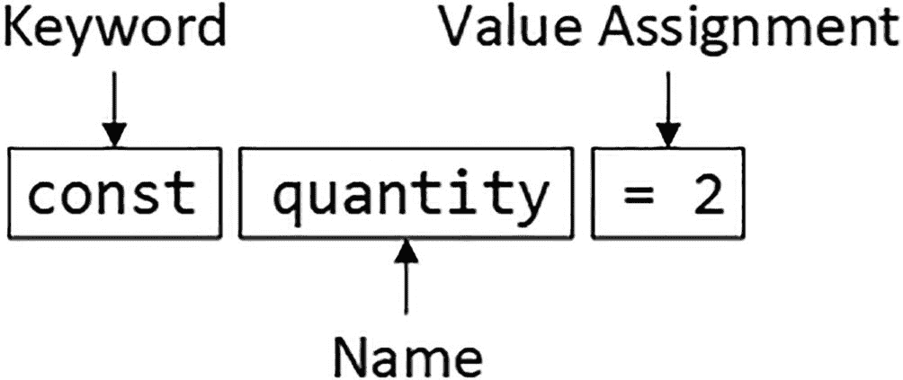

*图 4-4：定义无类型常量*

在定义 `quantity` 常量时省略类型，告诉 Go 编译器它应该对该常量的类型更加灵活。当对传递给 `fmt.Println` 函数的表达式求值时，Go 编译器会将 `quantity` 的值转换为 `float32` 类型。编译并执行代码，你将得到以下输出：

```
Total: 605
```

只有当值可以用目标类型表示时，无类型常量才会被转换。实际上，这意味着你可以混合使用无类型的整数和浮点数数值，但其他数据类型之间的转换必须显式执行，我将在第 5 章中介绍。

#### 理解 IOTA

`iota` 关键字可用于创建一系列连续的无类型整数常量，而无需为它们单独赋值。以下是一个 `iota` 示例：

```
...
const (
Watersports = iota
Soccer
Chess
)
...
```

该模式创建了一系列常量，每个常量都被赋以一个整数值，从零开始。你可以在第 3 部分看到 `iota` 的示例。

### 使用单个语句定义多个常量

可以使用单个语句定义多个常量，如代码清单 4-10 所示。

```
package main
import (
"fmt"
//"math/rand"
)
func main() {
const price, tax float32 = 275, 27.50
const quantity, inStock = 2, true
fmt.Println("Total:", quantity * (price + tax))
fmt.Println("In stock: ", inStock)
}
```

*代码清单 4-10：在 basicFeatures 文件夹的 main.go 文件中定义多个常量*

`const` 关键字后跟一个逗号分隔的名称列表、一个等号和一个逗号分隔的值列表，如图 4-5 所示。如果指定了类型，则所有常量都会以该类型创建。如果省略了类型，则会创建无类型常量，并且每个常量的类型将从其值推断而来。

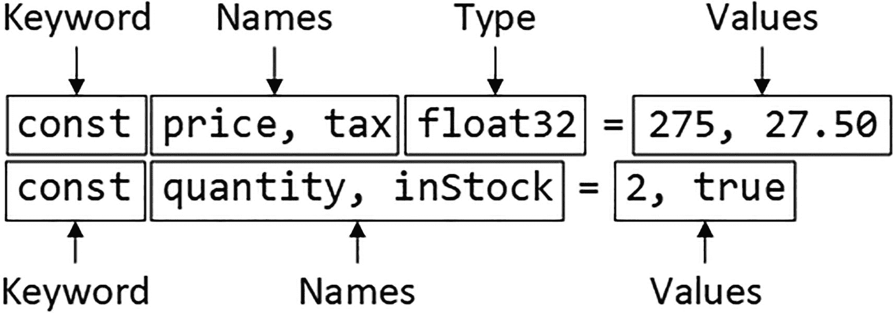

*图 4-5：定义多个常量*

编译并执行代码清单 4-10 中的代码将产生以下输出：

```
Total: 605
In stock:  true
```


### 再探字面量

无类型常量可能看起来像是一个奇怪的功能，但它能让 Go 语言的编程工作变得容易得多。你会发现自己经常依赖这个功能，甚至常常没有意识到，因为字面值就是无类型常量。这意味着你可以在表达式中使用字面值，并依靠编译器来处理类型不匹配的问题，如代码清单 4-11 所示。

```
package main
import (
"fmt"
//"math/rand"
)
func main() {
const price, tax float32 = 275, 27.50
const quantity, inStock = 2, true
fmt.Println("Total:", 2 * quantity * (price + tax))
fmt.Println("In stock: ", inStock)
}
```

高亮显示的表达式使用了字面值 `2`（如表格 4-4 所述，这是一个 `int` 类型值），以及两个 `float32` 类型的值。由于 `int` 值可以表示为 `float32`，因此该值会被自动转换。编译并执行这段代码，将产生以下输出：

```
Total: 1210
In stock:  true
```

## 使用变量

变量使用 `var` 关键字定义，与常量不同，变量的值可以更改，如代码清单 4-12 所示。

```
package main
import "fmt"
func main() {
var price float32 = 275.00
var tax float32 = 27.50
fmt.Println(price + tax)
price = 300
fmt.Println(price + tax)
}
```

变量使用 `var` 关键字、名称、类型和值赋值来声明，如图 4-6 所示。

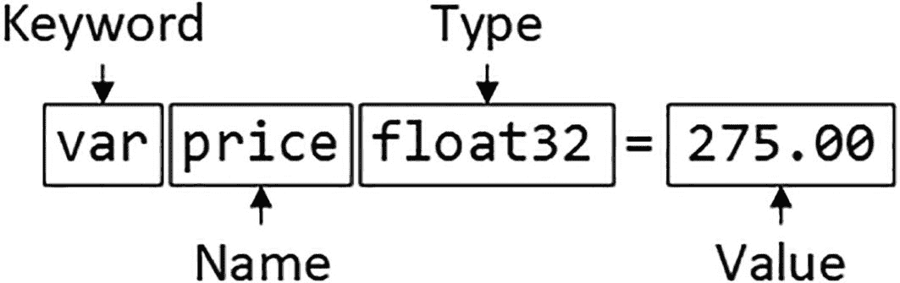

代码清单 4-12 定义了 `price` 和 `tax` 变量，两者都被赋值为 `float32` 类型。使用等号将新值赋给 `price` 变量，这是 Go 语言的赋值运算符，如图 4-7 所示。（请注意，我可以将值 `300` 赋给一个浮点型变量。这是因为字面值 `300` 是一个无类型常量，可以表示为 `float32` 值。）

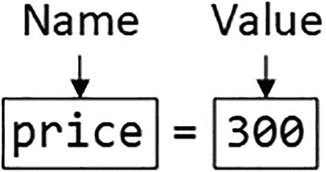

代码清单 4-12 中的代码使用 `fmt.Println` 函数向标准输出写入两个字符串，编译并执行后，将产生以下输出：

```
302.5
327.5
```

### 省略变量的数据类型

Go 编译器可以根据初始值推断变量的类型，从而允许省略类型，如代码清单 4-13 所示。

```
package main
import "fmt"
func main() {
var price = 275.00
var price2 = price
fmt.Println(price)
fmt.Println(price2)
}
```

变量使用 `var` 关键字、名称和值赋值来定义，但省略了类型，如图 4-8 所示。变量的值可以使用字面值、常量名称或其他变量名称来设置。在该代码清单中，`price` 变量的值是使用字面值设置的，而 `price2` 的值则被设置为 `price` 的当前值。

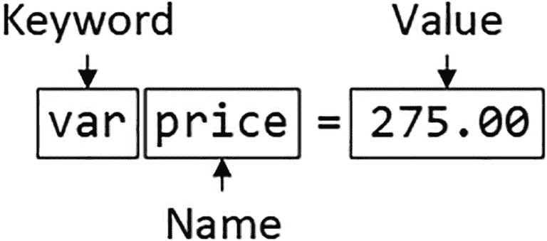

编译器会根据赋给变量的值来推断其类型。编译器会检查赋给 `price` 的字面值，并将其类型推断为 `float64`，如表格 4-4 所述。`price2` 的类型也会被推断为 `float64`，因为它的值是通过 `price` 的值设置的。编译并执行代码清单 4-13 中的代码，将产生以下输出：

```

```

省略类型对于变量的效果与对于常量不同。Go 编译器不允许混合使用不同类型，如代码清单 4-14 所示。

```
package main
import "fmt"
func main() {
var price = 275.00
var tax float32 = 27.50
fmt.Println(price + tax)
}
```

编译器总是将浮点字面值的类型推断为 `float64`，这与 `tax` 变量的 `float32` 类型不匹配。Go 语言严格的类型执行机制意味着编译代码时，编译器会产生以下错误：

```
.\main.go:10:23: invalid operation: price + tax (mismatched types float64 and float32)
```

要在同一表达式中使用 `price` 和 `tax` 变量，它们必须具有相同的类型，或者可以转换为相同的类型。我将在第 5 章中解释类型转换的不同方法。

### 省略变量的值赋值

变量可以在没有初始值的情况下定义，如代码清单 4-15 所示。

```
package main
import "fmt"
func main() {
var price float32
fmt.Println(price)
price = 275.00
fmt.Println(price)
}
```

变量使用 `var` 关键字，后跟名称和类型来定义，如图 4-9 所示。当没有初始值时，不能省略类型。

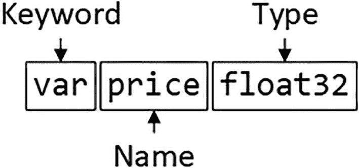

以这种方式定义的变量会被赋予指定类型的*零值*，如表格 4-5 所述。

基本数据类型的零值：

| 类型 | 零值 |
| --- | --- |
| `int` | 0 |
| `uint` | 0 |
| `byte` | 0 |
| `float64` | 0 |
| `bool` | false |
| `string` | ""（空字符串） |
| `rune` | 0 |

数字类型的零值是 0，编译并执行代码即可看到。输出中显示的第一个值是零值，接着是后续语句中显式赋的值：

```

```

### 使用单个语句定义多个变量

可以使用单个语句定义多个变量，如代码清单 4-16 所示。

```
package main
import "fmt"
func main() {
var price, tax = 275.00, 27.50
fmt.Println(price + tax)
}
```

这与定义常量的方法相同，每个变量的初始值用于推断其类型。如果没有分配初始值，则必须指定一个类型，如代码清单 4-17 所示，所有变量都将使用指定的类型创建并赋予其零值。

```
package main
import "fmt"
func main() {
var price, tax float64
price = 275.00
tax = 27.50
fmt.Println(price + tax)
}
```

编译并执行代码清单 4-16 和代码清单 4-17 将产生相同的输出：

```
302.5
```


### 使用短变量声明语法

短变量声明提供了一种声明变量的简写形式，如代码清单 4-18 所示。

```go
package main
import "fmt"
func main() {
price := 275.00
fmt.Println(price)
}
代码清单 4-18
在 basicFeatures 文件夹的 main.go 文件中使用短变量声明语法
```

这种简写语法依次指定了变量名、冒号、等号和初始值，如图 4-10 所示。这里没有使用 `var` 关键字，并且无法指定数据类型。

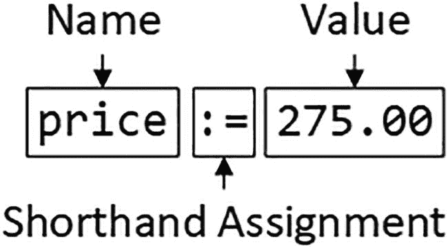

图 4-10

短变量声明语法

当编译并执行代码清单 4-18 中的代码时，会产生以下输出：

```

```

通过创建以逗号分隔的名称列表和值列表，可以用一条语句定义多个变量，如代码清单 4-19 所示。

```go
package main
import "fmt"
func main() {
price, tax, inStock := 275.00, 27.50, true
fmt.Println("Total:", price + tax)
fmt.Println("In stock:", inStock)
}
代码清单 4-19
在 basicFeatures 文件夹的 main.go 文件中定义多个变量
```

在简写语法中未指定任何类型，这意味着可以创建不同类型的变量，依靠编译器从分配给每个变量的值推断其类型。当编译并执行代码清单 4-19 中的代码时，会产生以下输出：

```
Total: 302.5
In stock: true
```

短变量声明语法只能在函数内部使用，例如代码清单 4-19 中的 `main` 函数。Go 函数将在第 8 章中详细说明。

### 使用短变量语法重定义变量

Go 通常不允许重定义变量，但在使用短语法时做出了有限的例外。为了演示默认行为，代码清单 4-20 使用了 `var` 关键字来定义一个变量，其名称与同一函数内已存在的变量相同。

```go
package main
import "fmt"
func main() {
price, tax, inStock := 275.00, 27.50, true
fmt.Println("Total:", price + tax)
fmt.Println("In stock:", inStock)
var price2, tax = 200.00, 25.00
fmt.Println("Total 2:", price2 + tax)
}
代码清单 4-20
在 basicFeatures 文件夹的 main.go 文件中重定义一个变量
```

第一个新语句使用 `var` 关键字定义了名为 `price2` 和 `tax` 的变量。`main` 函数中已存在一个名为 `tax` 的变量，这会导致编译代码时出现以下错误：

```
.\main.go:10:17: tax redeclared in this block
```

然而，如果使用短语法，则允许重定义变量，如代码清单 4-21 所示，只要至少有一个正在定义的其他变量尚不存在，并且该变量的类型不发生改变即可。

```go
package main
import "fmt"
func main() {
price, tax, inStock := 275.00, 27.50, true
fmt.Println("Total:", price + tax)
fmt.Println("In stock:", inStock)
price2, tax := 200.00, 25.00
fmt.Println("Total 2:", price2 + tax)
}
代码清单 4-21
在 basicFeatures 文件夹的 main.go 文件中使用短语法
```

编译并执行该项目，你会看到以下输出：

```
Total: 302.5
In stock: true
Total 2: 225
```

### 使用空白标识符

在 Go 中，定义一个变量却不使用它是非法的，如代码清单 4-22 所示。

```go
package main
import "fmt"
func main() {
price, tax, inStock, discount := 275.00, 27.50, true, true
var salesPerson = "Alice"
fmt.Println("Total:", price + tax)
fmt.Println("In stock:", inStock)
}
代码清单 4-22
在 basicFeatures 文件夹的 main.go 文件中定义未使用的变量
```

该代码清单定义了名为 `discount` 和 `salesperson` 的变量，这两个变量在后续代码中均未被使用。编译代码时，会报告以下错误：

```
.\main.go:6:26: discount declared but not used
.\main.go:7:9: salesPerson declared but not used
```

解决此问题的一种方法是移除未使用的变量，但这并不总是可行。针对这些情况，Go 提供了*空白标识符*，用于表示一个将不会被使用的值，如代码清单 4-23 所示。

```go
package main
import "fmt"
func main() {
price, tax, inStock, _ := 275.00, 27.50, true, true
var _ = "Alice"
fmt.Println("Total:", price + tax)
fmt.Println("In stock:", inStock)
}
代码清单 4-23
在 basicFeatures 文件夹的 main.go 文件中使用空白标识符
```

空白标识符是下划线（`_` 字符），它可以用在通常使用一个名称会创建一个将来不会被使用的变量的任何地方。当编译并执行代码清单 4-23 中的代码时，会产生以下输出：

```
Total: 302.5
In stock: true
```

这是另一个看似不寻常的特性，但在使用 Go 函数时却很重要。正如我在第 8 章中所解释的，Go 函数可以返回多个结果，当你需要其中某些结果值但不需要其他结果值时，空白标识符就很有用。


## 理解指针

指针常常被误解，尤其是当你从 Java 或 C# 这类语言转到 Go 时——这些语言在幕后使用指针，但会小心地将其对开发者隐藏。要理解指针的工作原理，最好的起点是了解 Go 在不使用指针时的情况，如代码清单 4-24 所示。

> **提示**  
> 本节最后一个示例将简单演示指针为何有用，而不仅仅是解释其用法。

```
package main
import "fmt"
func main() {
first := 100
second := first
first++
fmt.Println("First:", first)
fmt.Println("Second:", second)
}
```

代码清单 4-24 中的代码编译并执行后会输出以下结果：

```
First: 101
Second: 100
```

代码清单 4-24 创建了两个变量。名为 `first` 的变量通过字面量赋值。名为 `second` 的变量则使用 `first` 的值进行赋值，如下所示：

```
...
first := 100
second := first
...
```

在创建 `second` 时，Go 会复制 `first` 的当前值，此后这两个变量互不依赖。每个变量都是对存储其值的独立内存位置的引用，如图 4-11 所示。

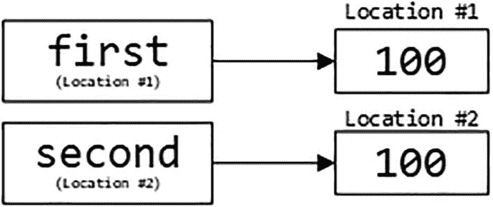

*图 4-11：独立的值*

当我在代码清单 4-24 中使用 `++` 运算符递增 `first` 变量时，Go 会读取该变量关联内存位置的值，递增后将其存储回同一个内存位置。`second` 变量所赋的值保持不变，因为这一变更仅影响 `first` 变量存储的值，如图 4-12 所示。

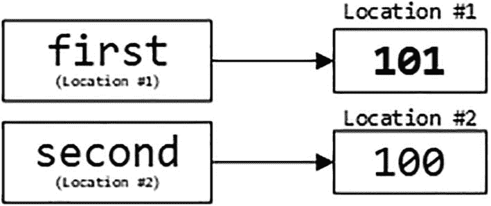

*图 4-12：修改值*

### 理解指针算术

指针之所以名声不好，是因为*指针算术*。指针将内存位置存储为数值，这意味着可以使用算术运算符对其进行操作，从而访问其他内存位置。例如，你可以从一个指向 `int` 值的位置开始，将该值增加一个 `int` 所占用的位数，然后读取相邻的值。这种方法虽有用，但也可能导致意外结果，比如试图访问错误位置或超出程序分配内存范围的位置。

Go 不支持指针算术，这意味着不能通过指向某个位置的指针来获取其他位置。如果尝试对指针执行算术运算，编译器会报告错误。

#### 定义指针

指针是一种变量，其值为内存地址。代码清单 4-25 定义了一个指针。

```
package main
import "fmt"
func main() {
first := 100
var second *int = &first
first++
fmt.Println("First:", first)
fmt.Println("Second:", second)
}
```

指针使用与号（`&` 字符，即*取址运算符*）后跟变量名来定义，如图 4-13 所示。

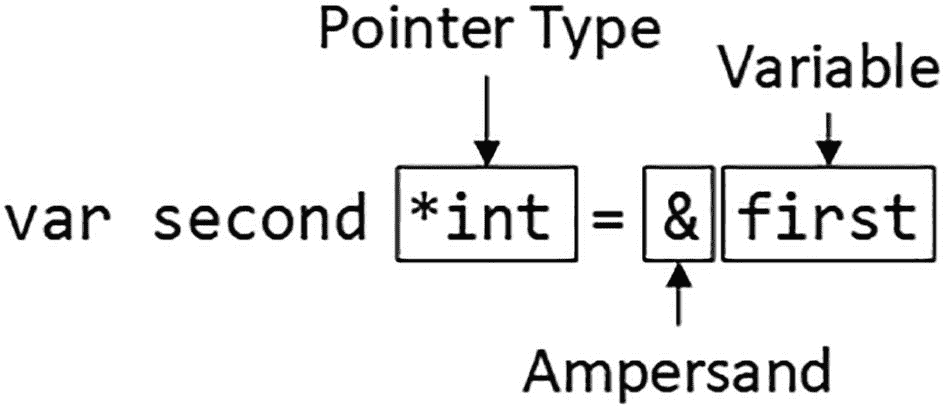

*图 4-13：定义指针*

指针与 Go 中的其他变量类似，它们有类型和值。`second` 变量的值将是 Go 用于存储 `first` 变量值的内存地址。编译并执行代码，你会看到类似下面的输出：

```
First: 101
Second: 0xc000010088
```

根据 Go 选择存储 `first` 变量值的位置不同，你可能会看到不同的输出。具体的内存位置并不重要，重要的是变量之间的关系，如图 4-14 所示。

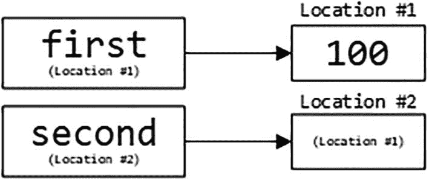

*图 4-14：指针及其内存位置*

指针的类型基于创建它时所用的变量类型，并在该类型前加上星号（`*` 字符）。名为 `second` 的变量类型为 `*int`，因为它是对值为 `int` 类型的 `first` 变量应用取址运算符得到的。当你看到 `*int` 类型时，就知道它是一个变量，其值为存储 `int` 变量的内存地址。

指针的类型是固定的，因为 Go 中所有类型都是固定的。这意味着，例如创建一个指向 `int` 的指针后，你可以改变它所指向的值，但不能用它来指向用于存储其他类型（如 `float64`）的内存地址。这个限制很重要——在 Go 中，指针不仅仅是内存地址，更是可能存储特定类型值的内存地址。


### 跟随指针

*跟随指针*（*following a pointer*）指的是读取指针所指向内存地址处的值，通过使用星号（`*` 字符）来实现，如清单 4-26 所示。在本例中，我还对指针使用了短变量声明语法。Go 会像推断其他类型一样推断指针类型。

```
package main
import "fmt"
func main() {
first := 100
second := &first
first++
fmt.Println("First:", first)
fmt.Println("Second:", *second)
}
```

星号告诉 Go 跟随指针并获取该内存位置的值，如图 4-15 所示。这一过程被称为*解引用*（*dereferencing*）指针。

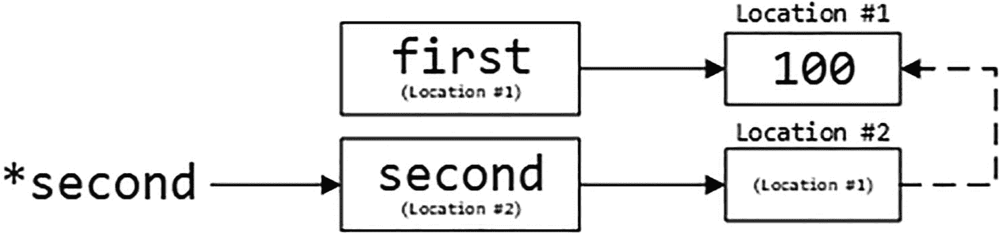

编译并执行清单 4-26 中的代码，将产生以下输出：

```
First: 101
Second: 101
```

一个常见的误解是认为 `first` 和 `second` 变量值相同，但实际情况并非如此。这里有两个值。有一个 `int` 值，可以通过名为 `first` 的变量访问。还有一个 `*int` 值，它存储了 `first` 值的内存地址。可以跟随这个 `*int` 值，从而访问所存储的 `int` 值。但是，由于 `*int` 值本身也是一个值，它可以独立使用，这意味着它可以赋值给其他变量、作为参数调用函数等。

清单 4-27 演示了指针的第一种用途：跟随指针，并递增内存位置处的值。

```
package main
import "fmt"
func main() {
first := 100
second := &first
first++
*second++
fmt.Println("First:", first)
fmt.Println("Second:", *second)
}
```

编译并执行这段代码，将产生以下输出：

```
First: 102
Second: 102
```

清单 4-28 演示了指针的第二种用途：将其本身作为一个值使用，并赋值给另一个变量。

```
package main
import "fmt"
func main() {
first := 100
second := &first
first++
*second++
var myNewPointer *int
myNewPointer = second
*myNewPointer++
fmt.Println("First:", first)
fmt.Println("Second:", *second)
}
```

第一个新语句定义了一个新变量，我使用 `var` 关键字来强调该变量类型是 `*int`，即指向 `int` 值的指针。下一条语句将 `second` 变量的值赋给新变量，这意味着 `second` 和 `myNewPointer` 的值都是 `first` 值的内存地址。跟随任一指针访问的是同一内存位置，因此递增 `myNewPointer` 会影响通过跟随 `second` 指针所获得的值。编译并执行代码，你将看到以下输出：

```
First: 103
Second: 103
```

### 理解指针的零值

已定义但未赋值的指针，其零值为 `nil`，如清单 4-29 所示。

```
package main
import "fmt"
func main() {
first := 100
var second *int
fmt.Println(second)
second = &first
fmt.Println(second)
}
```

指针 `second` 被定义但未初始化赋值，并使用 `fmt.Println` 函数输出。接着使用地址运算符创建指向 `first` 变量的指针，并再次输出 `second` 的值。编译并执行清单 4-29 中的代码，将产生以下输出（忽略结果中的 `<` 和 `>`，这只是 `Println` 函数用来表示 `nil` 的符号）：

```
0xc000010088
```

如果跟随一个尚未赋值的指针，将会发生运行时错误，如清单 4-30 所示。

```
package main
import "fmt"
func main() {
first := 100
var second *int
fmt.Println(*second)
second = &first
fmt.Println(second == nil)
}
```

这段代码可以编译，但执行时会产生以下错误：

```
panic: runtime error: invalid memory address or nil pointer dereference
[signal 0xc0000005 code=0x0 addr=0x0 pc=0xec798a]
goroutine 1 [running]:
main.main()
C:/basicFeatures/main.go:10 +0x2a
exit status 2
```

### 指向指针的指针

由于指针存储的是内存地址，因此可以创建一个指针，其值是另一个指针的内存地址，如清单 4-31 所示。

```
package main
import "fmt"
func main() {
first := 100
second := &first
third := &second
fmt.Println(first)
fmt.Println(*second)
fmt.Println(**third)
}
```

跟随指针链的语法可能有些别扭。本例中需要两个星号。第一个星号跟随指针到内存位置，获取变量 `second` 所存储的值，这是一个 `*int` 值。第二个星号跟随名为 `second` 的指针，从而访问变量 `first` 所存储值的内存位置。在大多数项目中你不需要这样做，但这确实很好地印证了指针的工作方式，以及如何沿着指针链找到数据值。编译并执行清单 4-31 中的代码，将产生以下输出：

```
100
100
100
```


#### 理解指针为何有用

人们很容易在指针的工作原理中迷失方向，而忽视它们为何能成为程序员的得力助手。指针之所以有用，是因为它们允许程序员在传递值和传递引用之间做出选择。后续章节中会有大量使用指针的示例，但为了结束本章，一个快速的演示会有所帮助。也就是说，本节中的代码清单依赖于后续章节才会解释的特性，因此您可能需要在之后回过头来再看这些示例。代码清单 4-32 提供了一个在处理值时非常有用的示例。

```
package main
import (
"fmt"
"sort"
)
func main() {
names := [3]string {"Alice", "Charlie", "Bob"}
secondName := names[1]
fmt.Println(secondName)
sort.Strings(names[:])
fmt.Println(secondName)
}
代码清单 4-32
在 basicFeatures 文件夹的 main.go 文件中处理值
```

语法可能不常见，但这个示例很简单。创建了一个包含三个字符串值的数组，并将位置 1 的值赋给一个名为 `secondName` 的变量。`secondName` 变量的值被写入控制台，然后数组被排序，`secondName` 变量的值再次被写入控制台。编译并执行此代码会产生以下输出：

```
Charlie
Charlie
```

当创建 `secondName` 变量时，数组中位置 1 的字符串值被复制到一个新的内存位置，这就是该值不受排序操作影响的原因。因为值已被复制，所以它现在与数组完全无关，对数组进行排序不会影响 `secondName` 变量的值。

代码清单 4-33 为该示例引入了一个指针变量。

```
package main
import (
"fmt"
"sort"
)
func main() {
names := [3]string {"Alice", "Charlie", "Bob"}
secondPosition := &names[1]
fmt.Println(*secondPosition)
sort.Strings(names[:])
fmt.Println(*secondPosition)
}
代码清单 4-33
在 basicFeatures 文件夹的 main.go 文件中使用指针
```

当创建 `secondPosition` 变量时，其值是用于存储数组中位置 1 的 `string` 值的内存地址。当数组被排序时，数组中条目的顺序发生了变化，但指针仍然指向位置 1 的内存地址，这意味着通过该指针返回的是排序后的值，当代码被编译并执行时，会产生以下输出：

```
Charlie
Bob
```

指针意味着我可以保持对位置 1 的引用，这种方式能够访问当前的值，从而反映对数组内容所做的任何更改。这是一个简单的例子，但它展示了指针如何为开发者提供在复制值和使用引用之间进行选择的灵活性。

如果您仍然对指针感到不确定，那么可以考虑一下您熟悉的其他语言是如何处理值与引用的问题的。例如，我经常使用的 `C#` 既支持通过值传递的结构体（struct），也支持通过引用传递的类实例。Go 和 `C#` 都让我可以选择是使用副本还是引用。区别在于 `C#` 让我在创建数据类型时一次性做出选择，而 Go 则让我在每次使用值时做出选择。Go 的方法更灵活，但需要程序员做更多的考量。

## 本章小结

在本章中，我介绍了 Go 提供的基本内置类型，这些类型构成了几乎所有语言特性的基础。我解释了如何使用完整语法和简短语法来定义常量和变量；演示了无类型常量的使用；并描述了 Go 中指针的用法。在下一章中，我将介绍可以对内置数据类型执行的操作，并解释如何将值从一种类型转换为另一种类型。

# 5. 操作与类型转换

在本章中，我将介绍 Go 的运算符，这些运算符用于执行算术运算、比较值以及创建产生 `true`/`false` 结果的逻辑表达式。我还将解释将值从一种类型转换为另一种类型的过程，这可以通过结合使用内置语言特性和 Go 标准库提供的功能来完成。表 5-1 将 Go 的操作和类型转换置于上下文中。

**表 5-1** 操作与类型转换的应用场景

| 问题 | 答案 |
| --- | --- |
| 它们是什么？ | 基本操作用于算术运算、比较运算和逻辑判断。类型转换功能允许将一种类型的值表示为另一种类型。 |
| 它们为什么有用？ | 几乎每个编程任务都需要基本操作，很难编写不包含它们的代码。因为 Go 严格的类型规则阻止不同类型的值一起使用，所以类型转换功能非常有用。 |
| 如何使用它们？ | 基本操作通过运算符来应用，这些运算符与其他语言中使用的类似。类型转换要么通过使用 Go 的显式转换语法，要么通过使用 Go 标准库包提供的功能来执行。 |
| 有没有什么陷阱或限制？ | 任何转换过程都可能导致精度损失，因此必须小心，确保转换值不会产生比任务所需精度更低的结果。 |
| 有替代方案吗？ | 没有。本章描述的特性是 Go 开发的基础。|

**表 5-2** 本章摘要

| 问题 | 解决方案 | 代码清单 |
| --- | --- | --- |
| 执行算术运算 | 使用算术运算符 | 4–7 |
| 拼接字符串 | 使用 `+` 运算符 | 8 |
| 比较两个值 | 使用比较运算符 | 9–11 |
| 组合表达式 | 使用逻辑运算符 | 12 |
| 从一种类型转换为另一种类型 | 执行显式转换 | 13–15 |
| 将浮点值转换为整数 | 使用 `math` 包定义的函数 | 16 |
| 将字符串解析为另一种数据类型 | 使用 `strconv` 包定义的函数 | 17–28 |
| 将值表示为字符串 | 使用 `strconv` 包定义的函数 | 29–32 |

## 本章准备工作

为准备本章内容，请打开一个新的命令提示符，导航到一个方便的位置，并创建一个名为 `operations` 的目录。运行代码清单 5-1 中所示的命令来初始化项目。

**提示** 你可以从 `https://github.com/apress/pro-go` 下载本章——以及本书所有其他章节——的示例项目。如果运行示例时遇到问题，请参阅第 2 章了解如何获取帮助。

```
go mod init operations
代码清单 5-1
初始化项目
```

在 `operations` 文件夹中添加一个名为 `main.go` 的文件，内容如代码清单 5-2 所示。

```
package main
import "fmt"
func main() {
fmt.Println("Hello, Operations")
}
代码清单 5-2
operations 文件夹中 main.go 文件的内容
```

在命令提示符下，转到 `operations` 文件夹并运行代码清单 5-3 中所示的命令。

```
go run .
代码清单 5-3
运行示例项目
```

`main.go` 文件中的代码将被编译并执行，产生以下输出：

```
Hello, Operations
```


## 理解 Go 语言运算符

Go 语言提供了一套标准的运算符，表 5-3 描述了最常用的一些运算符，尤其是处理第 4 章所述数据类型时会经常用到。

### 表 5-3 Go 语言基本运算符

| 运算符 | 描述 |
| --- | --- |
| `+`, `-`, `*`, `/`, `%` | 用于对数值进行算术运算，详见“理解算术运算符”一节。`+` 运算符也可用于字符串拼接，详见“拼接字符串”一节。 |
| `==`, `!=`, `<`, `<=`, `>`, `>=` | 用于比较两个值，详见“理解比较运算符”一节。 |
| `\|\|`, `&&`, `!` | 逻辑运算符，应用于 `bool` 值并返回 `bool` 类型结果，详见“理解逻辑运算符”一节。 |
| `=`, `:=` | 赋值运算符。标准赋值运算符（`=`）用于在定义常量或变量时设置初始值，或更改已定义变量的值。短变量声明运算符（`:=`）用于定义变量并赋值，详见第 4 章。 |
| `-=`, `+=`, `++`, `--` | 用于递增和递减数值，详见“使用递增和递减运算符”一节。 |
| `&`, `\|`, `^`, `&^`, `<<`, `>>` | 位运算符，应用于整型值。这些运算符在主流开发中不常用，但可在第 31 章中看到示例，其中使用 `\|` 运算符配置 Go 语言的日志功能。 |

## 理解算术运算符

算术运算符可应用于数值数据类型（`float32`、`float64`、`int`、`uint` 以及第 4 章描述的特定尺寸类型）。例外是取余运算符（`%`），它只能用于整数。表 5-4 描述了算术运算符。

### 表 5-4 算术运算符

| 运算符 | 描述 |
| --- | --- |
| `+` | 返回两个操作数之和。 |
| `-` | 返回两个操作数之差。 |
| `*` | 返回两个操作数之积。 |
| `/` | 返回两个操作数之商。 |
| `%` | 返回余数，类似于其他编程语言提供的取模运算符，但可以返回负值，详见“使用取余运算符”一节。 |

与算术运算符一起使用的值必须为相同类型（例如全部是 `int` 值），或者可以用相同类型表示，例如无类型数值常量。代码清单 5-4 演示了算术运算符的使用。

```
package main
import "fmt"
func main() {
price, tax := 275.00, 27.40
sum := price + tax
difference := price - tax
product := price * tax
quotient := price / tax
fmt.Println(sum)
fmt.Println(difference)
fmt.Println(product)
fmt.Println(quotient)
}
代码清单 5-4
在 operations 文件夹的 main.go 文件中使用算术运算符
```

编译并执行代码清单 5-4 中的代码将产生以下输出：

```
302.4
247.6
10.036496350364963
```

#### 理解算术溢出

Go 语言允许整数值通过回绕的方式溢出，而不是报错。浮点数值会溢出到正无穷或负无穷。代码清单 5-5 展示了两种数据类型的溢出情况。

```
package main
import (
"fmt"
"math"
)
func main() {
var intVal = math.MaxInt64
var floatVal = math.MaxFloat64
fmt.Println(intVal * 2)
fmt.Println(floatVal * 2)
fmt.Println(math.IsInf((floatVal * 2), 0))
}
代码清单 5-5
在 operations 文件夹的 main.go 文件中使数值溢出
```

最容易故意造成溢出的方法是使用 `math` 包，它是 Go 标准库的一部分。我将在第 18 章更详细地描述该包，但本章我只关注每个数据类型可表示的最小值和最大值的常量，以及 `IsInf` 函数，该函数可用于确定浮点值是否已溢出到无穷大。在代码清单中，我使用 `MaxInt64` 和 `MaxFloat64` 常量设置了两个变量的值，然后在传递给 `fmt.Println` 函数的表达式中使它们溢出。编译并执行该代码清单将产生以下输出：

```
-2
+Inf
true
```

整数值回绕后产生 `-2`，浮点数值溢出到 `+Inf`，表示正无穷。`math.IsInf` 函数用于检测无穷大。

### 使用取余运算符

Go 语言提供 `%` 运算符，当一个整数值被另一个整数除时，该运算符返回余数。这经常被误认为是其他编程语言（如 Python）提供的取模运算符，但与之不同的是，Go 语言的取余运算符可以返回负值，如代码清单 5-6 所示。

```
package main
import (
"fmt"
"math"
)
func main() {
posResult := 3 % 2
negResult := -3 % 2
absResult := math.Abs(float64(negResult))
fmt.Println(posResult)
fmt.Println(negResult)
fmt.Println(absResult)
}
代码清单 5-6
在 operations 文件夹的 main.go 文件中使用取余运算符
```

取余运算符在两个表达式中使用，以演示可以产生正负结果。`math` 包提供了 `Abs` 函数，该函数返回 `float64` 类型的绝对值，但结果也是 `float64` 类型。编译并执行代码清单 5-6 中的代码将产生以下输出：

```
1
-1
1
```

### 使用递增和递减运算符

Go 语言提供了一组用于递增和递减数值的运算符，如代码清单 5-7 所示。这些运算符可应用于整数和浮点数。

```
package main
import (
"fmt"
//    "math"
)
func main() {
value := 10.2
value++
fmt.Println(value)
value += 2
fmt.Println(value)
value -= 2
fmt.Println(value)
value--
fmt.Println(value)
}
代码清单 5-7
在 operations 文件夹的 main.go 文件中使用递增和递减运算符
```

`++` 和 `--` 运算符将值递增或递减 1。`+=` 和 `-=` 将值按指定量递增或递减。这些操作受前述溢出行为的影响，但在其他方面与其他语言中的类似运算符一致，只是 `++` 和 `--` 运算符只能是后置的，这意味着不支持 `--value` 这样的表达式。编译并执行代码清单 5-7 中的代码将产生以下输出：

```
11.2
13.2
11.2
10.2
```


### 拼接字符串

`+` 运算符可用于拼接字符串以生成更长的字符串，如代码清单 5-8 所示。

```
package main
import (
"fmt"
//    "math"
)
func main() {
greeting := "Hello"
language := "Go"
combinedString := greeting + ", " + language
fmt.Println(combinedString)
}
代码清单 5-8
在 operations 文件夹的 main.go 文件中拼接字符串
```

`+` 运算符的结果是一个新字符串，代码清单 5-8 中的代码在编译并执行后会产生以下输出：

```
Hello, Go
```

Go 不会将字符串与其他数据类型拼接，但标准库中确实包含一些函数，可以从不同类型的值组合出字符串，详见第 17 章。

## 理解比较运算符

比较运算符用于比较两个值，如果它们相同则返回 `bool` 值 `true`，否则返回 `false`。表 5-5 描述了每个运算符执行的比较操作。

**表 5-5**  
比较运算符

| 运算符 | 描述 |
| --- | --- |
| `==` | 如果操作数相等，此运算符返回 `true`。 |
| `!=` | 如果操作数不相等，此运算符返回 `true`。 |
| `<` | 如果第一个操作数小于第二个操作数，此运算符返回 `true`。 |
| `>` | 如果第一个操作数大于第二个操作数，此运算符返回 `true`。 |
| `<=` | 如果第一个操作数小于或等于第二个操作数，此运算符返回 `true`。 |
| `>=` | 如果第一个操作数大于或等于第二个操作数，此运算符返回 `true`。 |

与比较运算符一起使用的值必须属于同一类型，或者必须是可表示为目标类型的无类型常量，如代码清单 5-9 所示。

```
package main
import (
"fmt"
//    "math"
)
func main() {
first := 100
const second = 200.00
equal := first == second
notEqual := first != second
lessThan := first < second
lessThanOrEqual := first <= second
greaterThan := first > second
greaterThanOrEqual := first >= second
fmt.Println(equal)
fmt.Println(notEqual)
fmt.Println(lessThan)
fmt.Println(lessThanOrEqual)
fmt.Println(greaterThan)
fmt.Println(greaterThanOrEqual)
}
代码清单 5-9
在 operations 文件夹的 main.go 文件中使用无类型常量
```

无类型常量是一个浮点值，但可以表示为整数值，因为其小数部分为零。这使得变量 `first` 和常量 `second` 可以在比较中一起使用。例如，对于常量值 `200.01`，这是不可能的，因为浮点值无法在不舍弃小数部分并创建不同值的情况下表示为整数。对此，需要进行显式转换，本章稍后将介绍。代码清单 5-9 中的代码在编译并执行后会产生以下输出：

```
false
true
true
true
false
false
```

**执行三元比较**

Go 没有提供三元运算符，这意味着不能使用像这样的表达式：

```
...
max := first > second ? first : second
...
```

相反，需要将表 5-5 中描述的比较运算符之一与 `if` 语句一起使用，如下所示：

```
...
var max int
if (first > second) {
max = first
} else {
max = second
}
...
```

这种语法不够简洁，但和 Go 的许多特性一样，你会很快习惯在没有三元表达式的情况下工作。

#### 比较指针

可以比较指针，看它们是否指向同一内存位置，如代码清单 5-10 所示。

```
package main
import (
"fmt"
//    "math"
)
func main() {
first := 100
second := &first
third := &first
alpha := 100
beta := &alpha
fmt.Println(second == third)
fmt.Println(second == beta)
}
代码清单 5-10
在 operations 文件夹的 main.go 文件中比较指针
```

Go 的相等运算符（`==`）用于比较内存位置。在代码清单 5-10 中，名为 `second` 和 `third` 的指针都指向同一位置，因此相等。名为 `beta` 的指针指向一个不同的内存位置。代码清单 5-10 中的代码在编译并执行后会产生以下输出：

```
true
false
```

重要的是要理解，比较的是内存位置，而不是它们存储的值。如果你想比较值，那么应该解引用指针，如代码清单 5-11 所示。

```
package main
import (
"fmt"
//    "math"
)
func main() {
first := 100
second := &first
third := &first
alpha := 100
beta := &alpha
fmt.Println(*second == *third)
fmt.Println(*second == *beta)
}
代码清单 5-11
在 operations 文件夹的 main.go 文件中解引用指针进行比较
```

这些比较解引用指针，以比较所引用内存位置中存储的值，当代码编译并执行后会产生以下输出：

```
true
true
```

## 理解逻辑运算符

逻辑运算符用于比较 `bool` 值，如表 5-6 所述。这些运算符产生的结果可以赋值给变量，或用作流程控制表达式的一部分，我将在第 6 章中介绍。

**表 5-6**  
逻辑运算符

| 运算符 | 描述 |
| --- | --- |
| `&#124;&#124;` | 如果任一操作数为 `true`，此运算符返回 `true`。如果第一个操作数为 `true`，则不会评估第二个操作数。 |
| `&&` | 如果两个操作数都为 true，此运算符返回 `true`。如果第一个操作数为 `false`，则不会评估第二个操作数。 |
| `!` | 此运算符与单个操作数一起使用。如果操作数为 `false`，则返回 `true`；如果操作数为 `true`，则返回 `false`。 |

代码清单 5-12 展示了如何使用逻辑运算符生成值并将其赋值给变量。

```
package main
import (
"fmt"
//    "math"
)
func main() {
maxMph := 50
passengerCapacity := 4
airbags := true
familyCar := passengerCapacity > 2 && airbags
sportsCar := maxMph > 100 || passengerCapacity == 2
canCategorize := !familyCar && !sportsCar
fmt.Println(familyCar)
fmt.Println(sportsCar)
fmt.Println(canCategorize)
}
代码清单 5-12
在 operations 文件夹的 main.go 文件中使用逻辑运算符
```

只有 `bool` 值才能与逻辑运算符一起使用，Go 不会尝试转换值来获取 `true` 或 `false` 结果。如果逻辑运算符的操作数是一个表达式，则会计算该表达式以生成用于比较的 `bool` 结果。代码清单 5-12 中的代码在编译并执行后会产生以下输出：

```
true
false
false
```

Go 在使用逻辑运算符时会短路评估过程，这意味着会评估最少数量的值来产生结果。对于 `&&` 运算符，当遇到 `false` 值时停止评估。对于 `||` 运算符，当遇到 `true` 值时停止评估。在这两种情况下，后续的值都无法改变操作的结果，因此不需要进行额外的评估。


## 转换、解析和格式化值

Go 语言不允许在运算中混用类型，并且不会自动转换类型（无类型常量除外）。为了展示编译器对混合数据类型的响应，清单 5-13 包含了一条对不同类型值应用加法运算符的语句。（你可能会发现代码编辑器自动更正了清单 5-13 中的代码，你可能需要撤销更正，以使编辑器中的代码与清单匹配，从而看到编译器错误。）

```
package main
import (
"fmt"
//    "math"
)
func main() {
kayak := 275
soccerBall := 19.50
total := kayak + soccerBall
fmt.Println(total)
}
```

用于定义 `kayak` 和 `soccerBall` 变量的字面量值会产生一个 `int` 值和一个 `float64` 值，然后它们被用于加法运算来设置 `total` 变量的值。编译代码时，会报告以下错误：

```
.\main.go:13:20: invalid operation: kayak + soccerBall (mismatched types int and float64)
```

对于这样一个简单的例子，我只需将用于初始化 `kayak` 变量的字面量值改为 `275.00`，这会产生一个 `float64` 变量。但在实际项目中，类型很少能这么容易更改，这正是 Go 语言提供后续章节所描述特性的原因。

### 执行显式类型转换

*显式转换*会转换一个值，以改变其类型，如清单 5-14 所示。

```
package main
import (
"fmt"
//    "math"
)
func main() {
kayak := 275
soccerBall := 19.50
total := float64(kayak) + soccerBall
fmt.Println(total)
}
```

显式转换的语法是 `T(x)`，其中 `T` 是目标类型，`x` 是要转换的值或表达式。在清单 5-14 中，我使用显式转换从 `kayak` 变量生成一个 `float64` 值，如图 5-1 所示。

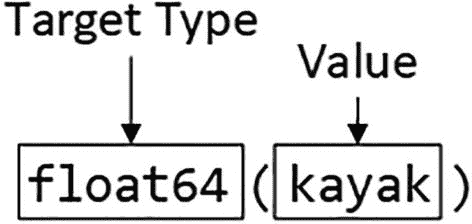

类型的显式转换

转换为 `float64` 值意味着加法运算中的类型是一致的。清单 5-14 中的代码编译并执行后，会生成以下输出：

```
294.5
```

#### 理解显式转换的局限性

仅当值能够在目标类型中*表示*时才能使用显式转换。这意味着你可以在数值类型之间以及字符串和 rune 之间进行转换，但其他组合，例如将 `int` 值转换为 `bool` 值，则不受支持。

选择要转换的值时必须小心，因为显式转换可能导致数值精度丢失或溢出，如清单 5-15 所示。

```
package main
import (
"fmt"
//    "math"
)
func main() {
kayak := 275
soccerBall := 19.50
total := kayak + int(soccerBall)
fmt.Println(total)
fmt.Println(int8(total))
}
```

此清单将 `float64` 值转换为 `int` 以进行加法运算，并另外将 `int` 转换为 `int8`（如第 4 章所述，这是一种分配了 8 位存储空间的有符号整数类型）。该代码编译并执行后，会生成以下输出：

```

```

当从浮点数转换为整数时，值的小数部分会被丢弃，因此浮点数 `19.50` 变成了 `int` 值 `19`。丢弃小数部分是为什么 `total` 变量的值是 `294`，而不是上一节中产生的 `294.5` 的原因。

第二个显式转换中使用的 `int8` 太小，无法表示 `int` 值 `294`，因此变量溢出，如前面“理解算术溢出”部分所述。

### 将浮点值转换为整数

如前例所示，显式转换可能产生意外结果，尤其是在将浮点值转换为整数时。最安全的方法是向相反方向转换，即表示整数和浮点值。但如果这不可行，那么 `math` 包提供了一组有用的函数，可以受控地进行转换，如表 5-7 所述。

表 5-7：`math` 包中用于转换数值类型的函数

| 函数 | 描述 |
| --- | --- |
| `Ceil(value)` | 此函数返回大于指定浮点值的最小整数。例如，大于 `27.1` 的最小整数是 `28`。 |
| `Floor(value)` | 此函数返回小于指定浮点值的最大整数。例如，小于 `27.1` 的最大整数是 `28`。 |
| `Round(value)` | 此函数将指定的浮点值四舍五入到最接近的整数。 |
| `RoundToEven(value)` | 此函数将指定的浮点值四舍五入到最接近的偶数整数。 |

表中描述的函数返回 `float64` 值，然后可以将其显式转换为 `int` 类型，如清单 5-16 所示。

```
package main
import (
"fmt"
"math"
)
func main() {
kayak := 275
soccerBall := 19.50
total := kayak + int(math.Round(soccerBall))
fmt.Println(total)
}
```

`math.Round` 函数会将 `soccerBall` 值从 `19.5` 四舍五入到 `20`，然后将其显式转换为 `int` 并用于加法运算。清单 5-16 中的代码编译并执行后，会生成以下输出：

```

```


#### 从字符串解析

Go 标准库包含 `strconv` 包，该包提供了将 `string` 值转换为其他基本数据类型的函数。表 5-8 描述了用于将字符串解析为其他数据类型的函数。

**表 5-8.** 将字符串解析为其他数据类型的函数

| 函数 | 描述 |
| --- | --- |
| `ParseBool(str)` | 该函数将字符串解析为 `bool` 值。可识别的字符串值有 `"true"`、`"false"`、`"TRUE"`、`"FALSE"`、`"True"`、`"False"`、`"T"`、`"F"`、`"0"` 和 `"1"`。 |
| `ParseFloat(str, size)` | 该函数将字符串解析为具有指定大小的浮点值，详见“解析浮点数”一节。 |
| `ParseInt(str, base, size)` | 该函数将字符串解析为具有指定基数和大小的 `int64` 值。可接受的基数有 2（二进制）、8（八进制）、16（十六进制）和 10，详见“解析整数”一节。 |
| `ParseUint(str, base, size)` | 该函数将字符串解析为具有指定基数和大小的无符号整数值。 |
| `Atoi(str)` | 该函数将字符串解析为基数为 10 的 `int` 值，相当于调用 `ParseInt(str, 10, 0)`，详见“使用整数便捷函数”一节。 |

代码清单 5-17 展示了如何使用 `ParseBool` 函数将字符串解析为 `bool` 值。

```
package main
import (
"fmt"
"strconv"
)
func main() {
val1 := "true"
val2 := "false"
val3 := "not true"
bool1, b1err := strconv.ParseBool(val1)
bool2, b2err := strconv.ParseBool(val2)
bool3, b3err := strconv.ParseBool(val3)
fmt.Println("Bool 1", bool1, b1err)
fmt.Println("Bool 2", bool2, b2err)
fmt.Println("Bool 3", bool3, b3err)
}
代码清单 5-17
在 operations 文件夹的 main.go 文件中解析字符串
```

正如我在第 6 章中解释的那样，Go 函数可以产生多个结果值。表 5-8 中描述的函数返回两个结果值：解析结果和一个错误，如图 5-2 所示。

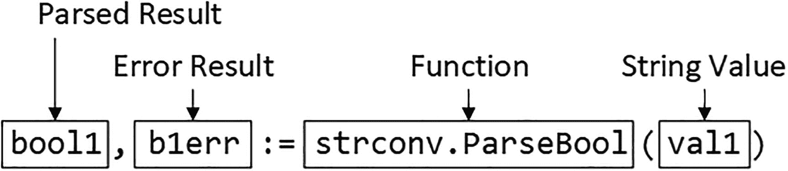

**图 5-2.** 解析字符串

你可能习惯于使用抛出异常来报告问题的语言，这些异常可以通过专门的 `catch` 等关键字捕获并处理。Go 的做法是将错误赋值给表 5-8 中函数产生的第二个结果。如果错误结果为 `nil`，则表示字符串已成功解析。如果错误结果不是 `nil`，则解析失败。你可以通过编译并执行代码清单 5-17 中的代码来查看成功和失败解析的示例，该代码会生成以下输出：

```
Bool 1 true 
Bool 2 false 
Bool 3 false strconv.ParseBool: parsing "not true": invalid syntax
```

前两个字符串被解析为 `true` 和 `false` 值，并且这两个函数调用的错误结果均为 `nil`。第三个字符串不在表 5-8 描述的可识别值列表中，因此无法解析。对于此操作，错误结果提供了问题的详细信息。

必须要检查错误结果，因为当字符串无法解析时，另一个结果将默认返回零值。如果你不检查错误结果，就无法区分从字符串正确解析出的 `false` 值和因解析失败而使用的零值。对错误的检查通常使用 `if`/`else` 关键字来完成，如代码清单 5-18 所示。我在第 6 章中描述了 `if` 关键字及相关特性。

```
package main
import (
"fmt"
"strconv"
)
func main() {
val1 := "0"
bool1, b1err := strconv.ParseBool(val1)
if b1err == nil {
fmt.Println("Parsed value:", bool1)
} else {
fmt.Println("Cannot parse", val1)
}
}
代码清单 5-18
在 operations 文件夹的 main.go 文件中检查错误
```

`if`/`else` 块允许将零值与成功处理能够解析为 `false` 值的字符串区分开来。正如我在第 6 章中解释的那样，Go 的 `if` 语句可以定义一个初始化语句，这使得可以在单个语句中调用转换函数并检查其结果，如代码清单 5-19 所示。

```
package main
import (
"fmt"
"strconv"
)
func main() {
val1 := "0"
if bool1, b1err := strconv.ParseBool(val1); b1err == nil {
fmt.Println("Parsed value:", bool1)
} else {
fmt.Println("Cannot parse", val1)
}
}
代码清单 5-19
在 operations 文件夹的 main.go 文件中用单个语句检查错误
```

当编译并执行项目时，代码清单 5-18 和代码清单 5-19 均会生成以下输出：

```
Parsed value: false
```


### 解析整数

`ParseInt` 和 `ParseUint` 函数需要指定字符串所表示数字的进制，以及用于表示解析值的数据类型大小，如代码清单 5-20 所示。

```go
package main
import (
"fmt"
"strconv"
)
func main() {
val1 := "100"
int1, int1err := strconv.ParseInt(val1, 0, 8)
if int1err == nil {
fmt.Println("Parsed value:", int1)
} else {
fmt.Println("Cannot parse", val1)
}
}
```

**代码清单 5-20**：在 `operations` 文件夹的 `main.go` 文件中解析整数

`ParseInt` 函数的第一个参数是要解析的字符串。第二个参数是数字的进制，如果设为 0，则让函数根据字符串前缀自动检测进制。最后一个参数是用于存放解析值的数据类型大小。在这个示例中，我让函数自动检测进制，并指定大小为 8。

编译并执行代码清单 5-20 中的代码，你将看到以下输出，显示了解析后的整数值：

```
Parsed value: 100
```

你可能会认为指定大小会改变结果的类型，但事实并非如此，该函数始终返回 `int64` 类型。这个大小仅指定了解析值必须能够容纳的数据大小。如果字符串值包含的数字无法在指定大小内表示，则解析会失败。在代码清单 5-21 中，我将字符串值改成了一个更大的数字。

```go
package main
import (
"fmt"
"strconv"
)
func main() {
val1 := "500"
int1, int1err := strconv.ParseInt(val1, 0, 8)
if int1err == nil {
fmt.Println("Parsed value:", int1)
} else {
fmt.Println("Cannot parse", val1, int1err)
}
}
```

**代码清单 5-21**：在 `operations` 文件夹的 `main.go` 文件中增加数值

字符串 `"500"` 可以解析为整数，但它太大，无法表示为 8 位值，而 8 位正是 `ParseInt` 参数指定的大小。编译并执行代码后，输出显示了函数返回的错误：

```
Cannot parse 500 strconv.ParseInt: parsing "500": value out of range
```

这看似是一种间接的方法，但它允许 Go 在确保可以安全地对成功解析的结果执行显式转换的同时，维持其类型规则，如代码清单 5-22 所示。

```go
package main
import (
"fmt"
"strconv"
)
func main() {
val1 := "100"
int1, int1err := strconv.ParseInt(val1, 0, 8)
if int1err == nil {
smallInt := int8(int1)
fmt.Println("Parsed value:", smallInt)
} else {
fmt.Println("Cannot parse", val1, int1err)
}
}
```

**代码清单 5-22**：在 `operations` 文件夹的 `main.go` 文件中显式转换结果

在调用 `ParseInt` 函数时指定大小为 8，使我能够安全地执行到 `int8` 类型的显式转换，而不会发生溢出。编译并执行代码清单 5-22 中的代码，将产生以下输出：

```
Parsed value: 100
```

### 解析二进制、八进制和十六进制整数

`Parse<Type>` 函数接收的 `base` 参数允许解析非十进制数字字符串，如代码清单 5-23 所示。

```go
package main
import (
"fmt"
"strconv"
)
func main() {
val1 := "100"
int1, int1err := strconv.ParseInt(val1, 2, 8)
if int1err == nil {
smallInt := int8(int1)
fmt.Println("Parsed value:", smallInt)
} else {
fmt.Println("Cannot parse", val1, int1err)
}
}
```

**代码清单 5-23**：在 `operations` 文件夹的 `main.go` 文件中解析二进制值

字符串 `"100"` 可以解析为十进制数值 100，但它也可能表示二进制数值 4。通过使用 `ParseInt` 函数的第二个参数，我可以指定基数为 `2`，这意味着该字符串将被解释为二进制值。编译并执行代码，你将看到从二进制字符串解析出的数字的十进制表示形式：

```
Parsed value: 4
```

你也可以让 `Parse<Type>` 函数使用前缀来自动检测值的进制，如代码清单 5-24 所示。

```go
package main
import (
"fmt"
"strconv"
)
func main() {
val1 := "0b1100100"
int1, int1err := strconv.ParseInt(val1, 0, 8)
if int1err == nil {
smallInt := int8(int1)
fmt.Println("Parsed value:", smallInt)
} else {
fmt.Println("Cannot parse", val1, int1err)
}
}
```

**代码清单 5-24**：在 `operations` 文件夹的 `main.go` 文件中使用前缀

表 5-8 中描述的函数可以根据解析值的前缀来确定其进制。表 5-9 描述了所支持的前缀集合。

**表 5-9：** 数字字符串的进制前缀

| 前缀 | 描述 |
| --- | --- |
| `0b` | 此前缀表示二进制值，例如 `0b1100100`。 |
| `0o` | 此前缀表示八进制值，例如 `0o144`。 |
| `0x` | 此前缀表示十六进制值，例如 `0x64`。 |

代码清单 5-24 中的字符串带有 `0b` 前缀，这表示一个二进制值。编译并执行代码，将产生以下输出：

```
Parsed value: 100
```

#### 使用整数便捷函数

对于许多项目而言，最常见的解析任务是从包含十进制数字的字符串创建 `int` 值，如代码清单 5-25 所示。

```go
package main
import (
"fmt"
"strconv"
)
func main() {
val1 := "100"
int1, int1err := strconv.ParseInt(val1, 10, 0)
if int1err == nil {
var intResult int = int(int1)
fmt.Println("Parsed value:", intResult)
} else {
fmt.Println("Cannot parse", val1, int1err)
}
}
```

**代码清单 5-25**：在 `operations` 文件夹的 `main.go` 文件中执行常见的解析任务

这是一个非常常见的任务，因此 `strconv` 包提供了 `Atoi` 函数，该函数可以一步完成解析和显式转换，如代码清单 5-26 所示。

```go
package main
import (
"fmt"
"strconv"
)
func main() {
val1 := "100"
int1, int1err := strconv.Atoi(val1)
if int1err == nil {
var intResult int = int1
fmt.Println("Parsed value:", intResult)
} else {
fmt.Println("Cannot parse", val1, int1err)
}
}
```

**代码清单 5-26**：在 `operations` 文件夹的 `main.go` 文件中使用便捷函数

`Atoi` 函数只接收待解析的值，并且不支持解析非十进制值。其结果类型是 `int`，而不是 `ParseInt` 函数产生的 `int64` 类型。编译并执行代码清单 5-25 和 5-26 中的代码，将产生以下输出：

```
Parsed value: 100
```


#### 解析浮点数

`ParseFloat` 函数用于解析包含浮点数的字符串，如代码清单 5-27 所示。

```
package main
import (
"fmt"
"strconv"
)
func main() {
val1 := "48.95"
float1, float1err := strconv.ParseFloat(val1, 64)
if float1err == nil {
fmt.Println("Parsed value:", float1)
} else {
fmt.Println("Cannot parse", val1, float1err)
}
}
代码清单 5-27
operations 文件夹中 main.go 文件内的浮点数值解析
```

`ParseFloat` 函数的第一个参数是要解析的值。第二个参数指定结果的大小。`ParseFloat` 函数返回一个 `float64` 类型的值，但如果指定了 `32`，则结果可以显式转换为 `float32` 类型的值。

`ParseFloat` 函数可以解析带有指数的值，如代码清单 5-28 所示。

```
package main
import (
"fmt"
"strconv"
)
func main() {
val1 := "4.895e+01"
float1, float1err := strconv.ParseFloat(val1, 64)
if float1err == nil {
fmt.Println("Parsed value:", float1)
} else {
fmt.Println("Cannot parse", val1, float1err)
}
}
代码清单 5-28
operations 文件夹中 main.go 文件内的指数值解析
```

编译并执行代码清单 5-27 和 5-28 会得到相同的输出：

```
Parsed value: 48.95
```

### 将值格式化为字符串

Go 标准库还提供了将基本数据值转换为字符串的功能，这些字符串可以直接使用，也可以与其他字符串组合。`strconv` 包提供了表 5-10 中描述的函数。

表 5-10

将值转换为字符串的 strconv 函数

| 函数 | 描述 |
| --- | --- |
| `FormatBool(val)` | 此函数根据指定的 `bool` 值返回字符串 `true` 或 `false`。 |
| `FormatInt(val, base)` | 此函数返回指定 `int64` 值的字符串表示形式，使用指定的基数表示。 |
| `FormatUint(val, base)` | 此函数返回指定 `uint64` 值的字符串表示形式，使用指定的基数表示。 |
| `FormatFloat(val, format, precision, size)` | 此函数返回指定 `float64` 值的字符串表示形式，使用指定的格式、精度和大小表示。 |
| `Itoa(val)` | 此函数返回指定 `int` 值的字符串表示形式，使用十进制基数 10 表示。 |

#### 格式化布尔值

`FormatBool` 函数接受一个 `bool` 值并返回其字符串表示形式，如代码清单 5-29 所示。这是表 5-10 中描述的最简单的函数，因为它只返回 `true` 和 `false` 字符串。

```
package main
import (
"fmt"
"strconv"
)
func main() {
val1 := true
val2 := false
str1 := strconv.FormatBool(val1)
str2 := strconv.FormatBool(val2)
fmt.Println("Formatted value 1: " + str1)
fmt.Println("Formatted value 2: " + str2)
}
代码清单 5-29
operations 文件夹中 main.go 文件内的布尔值格式化
```

请注意，我使用了 `+` 运算符将 `FormatBool` 函数的结果与字面字符串连接起来，这样只向 `fmt.Println` 函数传递了一个参数。编译并执行代码清单 5-29 中的代码会产生以下输出：

```
Formatted value 1: true
Formatted value 2: false
```

#### 格式化整数值

`FormatInt` 和 `FormatUint` 函数将整数值格式化为字符串，如代码清单 5-30 所示。

```
package main
import (
"fmt"
"strconv"
)
func main() {
val := 275
base10String := strconv.FormatInt(int64(val), 10)
base2String := strconv.FormatInt(int64(val), 2)
fmt.Println("Base 10: " + base10String)
fmt.Println("Base 2: " + base2String)
}
代码清单 5-30
operations 文件夹中 main.go 文件内的整数值格式化
```

`FormatInt` 函数只接受 `int64` 类型的值，因此我执行了显式转换，并指定了以十进制 (基数 10) 和二进制 (基数 2) 表示该值的字符串。编译并执行该代码会产生以下输出：

```
Base 10: 275
Base 2: 100010011
```

#### 使用整数便捷函数

整数值通常使用 `int` 类型表示，并使用基数 10 转换为字符串。`strconv` 包提供了 `Itoa` 函数，这是一种执行此特定转换的更便捷方式，如代码清单 5-31 所示。

```
package main
import (
"fmt"
"strconv"
)
func main() {
val := 275
base10String := strconv.Itoa(val)
base2String := strconv.FormatInt(int64(val), 2)
fmt.Println("Base 10: " + base10String)
fmt.Println("Base 2: " + base2String)
}
代码清单 5-31
operations 文件夹中 main.go 文件内的便捷函数使用
```

`Itoa` 函数接受一个 `int` 值，该值被显式转换为 `int64` 并传递给 `ParseInt` 函数。代码清单 5-31 中的代码会产生以下输出：

```
Base 10: 275
Base 2: 100010011
```


### 格式化浮点数值

将浮点数值表示为字符串需要额外的配置选项，因为有不同的格式可用。清单 5-32 展示了一个使用 `FormatFloat` 函数的基本格式化操作。

```
package main
import (
"fmt"
"strconv"
)
func main() {
val := 49.95
Fstring := strconv.FormatFloat(val, 'f', 2, 64)
Estring := strconv.FormatFloat(val, 'e', -1, 64)
fmt.Println("Format F: " + Fstring)
fmt.Println("Format E: " + Estring)
}
Listing 5-32
Converting a Floating-Point Number in the main.go File in the operations Folder
```

`FormatFloat` 函数的第一个参数是要处理的值。第二个参数是一个 `byte` 值，它指定了字符串的格式。`byte` 通常表示为一个 `rune` 字面量值，表 5-11 描述了最常用的格式 rune。（如第 4 章所述，`byte` 类型是 `uint8` 的别名，为了方便，通常使用 `rune` 来表示。）

**表 5-11**  
浮点数字符串格式化常用格式选项

| 功能 | 描述 |
| --- | --- |
| `f` | 浮点数值将表示为 `±ddd.ddd` 的形式，不带指数，例如 `49.95`。 |
| `e, E` | 浮点数值将表示为 `±ddd.ddde±dd` 的形式，例如 `4.995e+01` 或 `4.995E+01`。表示指数的字母的大小写由用作格式参数的 rune 的大小写决定。 |
| `g, G` | 对于较大的指数，浮点数值将使用 `e`/`E` 格式表示；对于较小的值，则使用 `f` 格式表示。 |

`FormatFloat` 函数的第三个参数指定小数点后要显示的位数。特殊值 `-1` 可用于选择最少的位数，从而生成一个可以无精度损失地解析回相同浮点数值的字符串。最后一个参数决定是否对浮点数值进行四舍五入，以便其可以表示为 `float32` 或 `float64` 值，使用值 `32` 或 `64` 来指定。

这些参数意味着，以下语句使用格式选项 `f`、两位小数，并对值进行四舍五入以便能够用 `float64` 类型表示，从而对赋值给名为 `val` 的变量的值进行格式化：

```
...
Fstring := strconv.FormatFloat(val, 'f', 2, 64)
...
```

其效果是将该值格式化为一个可用于表示货币金额的字符串。清单 5-32 中的代码在编译和执行后会产生以下输出：

```
Format F: 49.95
Format E: 4.995e+01
```

## 本章小结

在本章中，我介绍了 Go 语言的运算符，并展示了如何使用它们执行算术、比较、拼接和逻辑运算。我还描述了使用 Go 语言内置特性和 Go 标准库中的函数将一种类型转换为另一种类型的不同方法。在下一章中，我将介绍 Go 的流程控制特性。

# 6. 流程控制

在本章中，我将介绍 Go 语言中用于控制执行流程的特性。Go 支持其他编程语言中常见的关键字，例如 `if`、`for`、`switch` 等，但每个关键字都具有一些不寻常且创新的特性。表 6-1 介绍了 Go 流程控制特性的上下文。

**表 6-1**  
流程控制上下文介绍

| 问题 | 答案 |
| --- | --- |
| 它是什么？ | 流程控制允许程序员有选择地执行语句。 |
| 为什么它有用？ | 没有流程控制，应用程序按顺序执行一系列代码语句，然后退出。流程控制允许改变这个顺序，推迟某些语句的执行并重复执行其他语句。 |
| 如何使用它？ | Go 支持流程控制关键字，包括 `if`、`for` 和 `switch`，每个关键字都以不同的方式控制执行流程。 |
| 是否有任何陷阱或限制？ | Go 为其每个流程控制关键字引入了不寻常的特性，这些特性提供了额外的功能，必须小心使用。 |
| 是否有替代方案？ | 没有。流程控制是一种基本的语言特性。 |

**表 6-2**  
本章摘要

| 问题 | 解决方案 | 清单 |
| --- | --- | --- |
| 有条件地执行语句 | 使用 `if` 语句，可选的 `else if` 和 `else` 子句以及初始化语句 | 4–10 |
| 重复执行语句 | 使用 `for` 循环，可选的初始化和完成语句 | 11–13 |
| 中断循环 | 使用 `continue` 或 `break` 关键字 | 14 |
| 枚举一个值序列 | 使用带有 `range` 关键字的 `for` 循环 | 15–18 |
| 执行复杂比较以有条件地执行语句 | 使用 `switch` 语句，可选的初始化语句 | 19–21, 23–26 |
| 强制一个 `case` 语句流入下一个 `case` 语句 | 使用 `fallthrough` 关键字 | 22 |
| 指定执行应跳转到的位置 | 使用标签 | 27 |

## 本章准备

为准备本章，请打开一个新的命令提示符，导航到一个方便的位置，并创建一个名为 `flowcontrol` 的目录。导航到 `flowcontrol` 文件夹，并运行清单 6-1 中所示的命令来初始化项目。

**提示**  
你可以从 [`github.com/apress/pro-go`](https://github.com/apress/pro-go) 下载本章的示例项目——以及本书所有其他章节的示例项目。如果在运行示例时遇到问题，请参阅第 2 章了解如何获取帮助。

```
go mod init flowcontrol
Listing 6-1
Initializing the Project
```

向 `flowcontrol` 文件夹添加一个名为 `main.go` 的文件，内容如清单 6-2 所示。

```
package main
import "fmt"
func main() {
kayakPrice := 275.00
fmt.Println("Price:", kayakPrice)
}
Listing 6-2
The Contents of the main.go File in the flowcontrol Folder
```

在 `flowcontrol` 文件夹中使用命令提示符运行清单 6-3 中所示的命令。

```
go run .
Listing 6-3
Running the Example Project
```

`main.go` 文件中的代码将被编译并执行，产生以下输出：

```
Price: 275
```

## 理解流程控制

Go 应用程序中的执行流程很容易理解，尤其是当应用程序像示例这样简单时。定义在特殊 `main` 函数中的语句（称为应用程序的*入口点*）按照它们定义的顺序执行。一旦所有这些语句都执行完毕，应用程序就会退出。图 6-1 说明了基本流程。

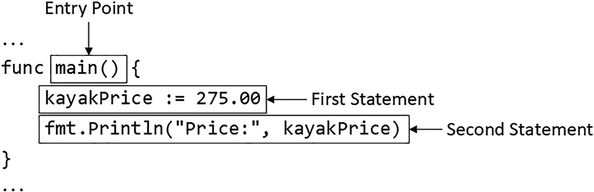

**图 6-1**  
执行流程

每条语句执行后，流程会移动到下一条语句，并重复此过程，直到没有语句可以执行为止。

有些应用程序恰好需要这种基本的执行流程，但对于大多数应用程序来说，会使用以下各节描述的特性来控制执行流程，以便有选择地执行语句。


### 使用 if 语句

`if` 语句用于仅当指定的表达式求值结果产生 `bool` 值 `true` 时，才执行一组语句，如清单 6-4 所示。

```
package main
import "fmt"
func main() {
kayakPrice := 275.00
if kayakPrice > 100 {
fmt.Println("Price is greater than 100")
}
}
Listing 6-4
Using an if Statement in the main.go File in the flowcontrol Folder
```

`if` 关键字后跟表达式，然后是待执行的语句组，语句组用花括号包裹，如图 6-2 所示。

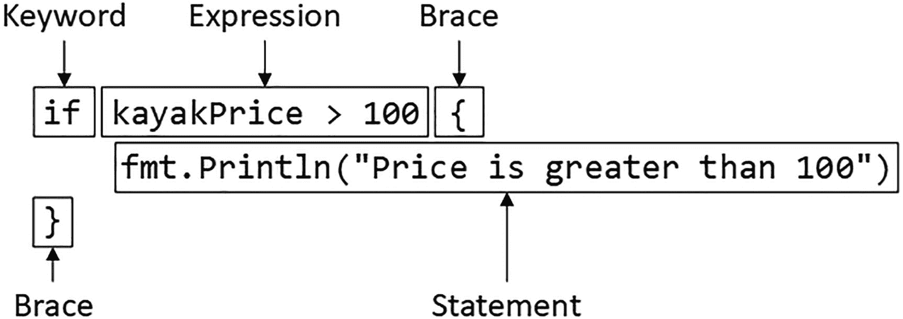

图 6-2  
if 语句的结构

清单 6-4 中的表达式使用 `>` 运算符将 `kayakPrice` 变量的值与字面常量值 `100` 进行比较。该表达式求值为 `true`，这意味着花括号内的语句得以执行，并产生以下输出：

```
Price is greater than 100
```

我倾向于将表达式放在圆括号内，如清单 6-5 所示。Go 语言不要求使用圆括号，但我是出于习惯而使用它们。

```
package main
import "fmt"
func main() {
kayakPrice := 275.00
if (kayakPrice > 100) {
fmt.Println("Price is greater than 100")
}
}
Listing 6-5
Using Parentheses in the main.go File in the flowcontrol Folder
```

## 关于流程控制语句语法的限制

就 `if` 语句和其他流程控制语句的语法而言，Go 语言的灵活性不如其他语言。首先，即使代码块中只有一条语句，花括号也不能省略，这意味着不允许使用以下语法：

```
...
if (kayakPrice > 100)
fmt.Println("Price is greater than 100")
...
```

其次，左花括号必须与流程控制关键字在同一行，不能出现在下一行，这意味着也不允许使用以下语法：

```
...
if (kayakPrice > 100)
{
fmt.Println("Price is greater than 100")
}
...
```

第三，如果要将长表达式拆分成多行，不能在值或变量名之后换行：

```
...
if (kayakPrice > 100
&& kayakPrice < 500) {
fmt.Println("Price is greater than 100 and less than 500")
}
...
```

Go 编译器会对所有这些语句报错，问题在于构建过程尝试在源代码中插入分号的方式。无法改变这种行为，这也是本书中有些示例格式怪异的原因：某些代码语句包含的字符数超过了印刷页面上一行所能显示的数量，我不得不小心地拆分这些语句以避免此问题。

## 使用 else 关键字

`else` 关键字可用于在 `if` 语句中创建附加子句，如清单 6-6 所示。

```
package main
import "fmt"
func main() {
kayakPrice := 275.00
if (kayakPrice > 500) {
fmt.Println("Price is greater than 500")
} else if (kayakPrice < 300) {
fmt.Println("Price is less than 300")
}
}
Listing 6-6
Using the else Keyword in the main.go File in the flowcontrol Folder
```

当 `else` 关键字与 `if` 关键字结合使用时，仅当表达式的值为 `true` 且前一个子句中的表达式为 `false` 时，才会执行花括号中的代码语句，如图 6-3 所示。

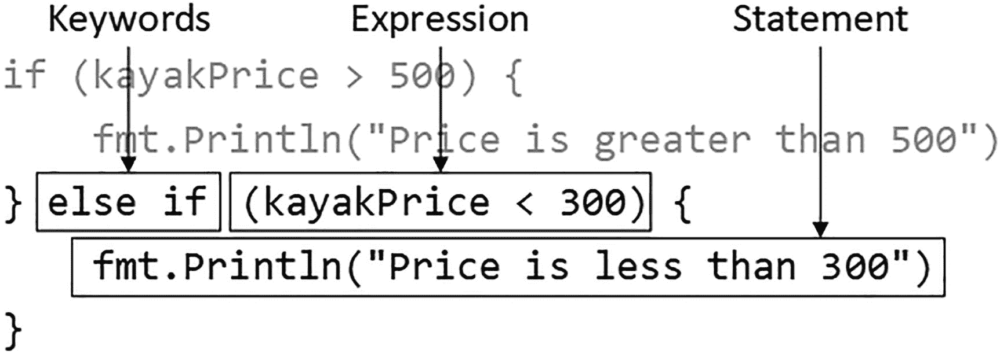

图 6-3  
if 语句中的 else/if 子句

在清单 6-6 中，`if` 子句中使用的表达式产生 `false` 结果，因此执行流程转到 `else`/`if` 表达式，该表达式产生 `true` 结果。编译并执行清单 6-6 中的代码会产生以下输出：

```
Price is less than 300
```

可以重复使用 `else`/`if` 组合来创建一系列子句，如清单 6-7 所示。只有在之前所有表达式都产生 `false` 结果时，才会执行每个子句。

```
package main
import "fmt"
func main() {
kayakPrice := 275.00
if (kayakPrice > 500) {
fmt.Println("Price is greater than 500")
} else if (kayakPrice  200 && kayakPrice < 300) {
fmt.Println("Price is between 200 and 300")
}
}
Listing 6-7
Defining Multiple else/if Clauses in the main.go File in the flowcontrol Folder
```

执行过程会遍历 `if` 语句，对表达式求值，直到获得 `true` 值或没有更多表达式可供求值为止。编译并执行清单 6-7 中的代码会产生以下输出：

```
Price is between 200 and 300
```

`else` 关键字也可用于创建回退子句。仅当语句中的所有 `if` 和 `else`/`if` 表达式都产生 `false` 结果时，才会执行回退子句中的语句，如清单 6-8 所示。

```
package main
import "fmt"
func main() {
kayakPrice := 275.00
if (kayakPrice > 500) {
fmt.Println("Price is greater than 500")
} else if (kayakPrice < 100) {
fmt.Println("Price is less than 100")
} else {
fmt.Println("Price not matched by earlier expressions")
}
}
Listing 6-8
Creating a Fallback Clause in the main.go File in the flowcontrol Folder
```

回退子句必须在语句末尾定义，并通过不带表达式的 `else` 关键字来指定，如图 6-4 所示。

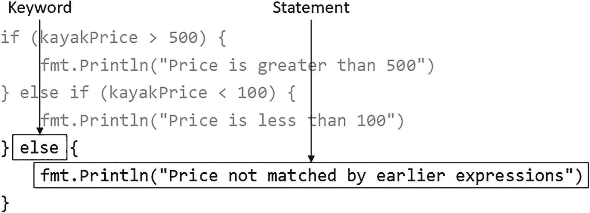

图 6-4  
if 语句中的回退子句

编译并执行清单 6-8 中的代码会产生以下输出：

```
Price not matched by earlier expressions
```

## 理解 if 语句的作用域

`if` 语句中的每个子句都有自己的作用域，这意味着变量只能在其被定义的子句内部访问。这也意味着你可以在不同子句中对不同用途使用相同的变量名，如清单 6-9 所示。

```
package main
import "fmt"
func main() {
kayakPrice := 275.00
if (kayakPrice > 500) {
scopedVar := 500
fmt.Println("Price is greater than", scopedVar)
} else if (kayakPrice < 100) {
scopedVar := "Price is less than 100"
fmt.Println(scopedVar)
} else {
scopedVar := false
fmt.Println("Matched: ", scopedVar)
}
}
Listing 6-9
Relying on Scopes in the main.go File in the flowcontrol Folder
```

`if` 语句中的每个子句都定义了一个名为 `scopedVar` 的变量，且每个变量的类型都不同。每个变量都是其所属子句的局部变量，这意味着它无法在其他子句或 `if` 语句外部访问。编译并执行清单 6-9 中的代码会产生以下输出：

```
Matched:  false
```


### 在 `if` 语句中使用初始化语句

Go 语言允许 `if` 语句使用一个初始化语句，该语句会在 `if` 语句的表达式求值之前执行。初始化语句被限制为 Go 的简单语句，这通常意味着该语句可以定义一个新变量、为已有变量赋新值，或者调用一个函数。

此功能最常见的用途是初始化一个随后在表达式中使用的变量，如代码清单 6-10 所示。

```go
package main
import (
"fmt"
"strconv"
)
func main() {
priceString := "275"
if kayakPrice, err := strconv.Atoi(priceString); err == nil {
fmt.Println("Price:", kayakPrice)
} else {
fmt.Println("Error:", err)
}
}
```

`if` 关键字后紧跟着初始化语句，然后是一个分号和待求值的表达式，如图 6-5 所示。

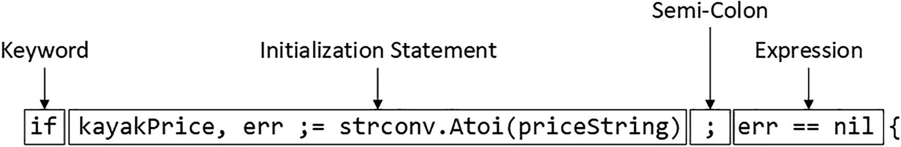

**图 6-5** 使用初始化语句

代码清单 6-10 中的初始化语句调用了第 5 章中描述的 `strconv.Atoi` 函数，以将一个字符串解析为 `int` 值。该函数返回两个值，分别赋值给名为 `kayakPrice` 和 `err` 的变量：

```go
...
if kayakPrice, err := strconv.Atoi(priceString); err == nil {
...
```

由初始化语句定义的变量的作用域是整个 `if` 语句，包括表达式在内。`err` 变量被用在 `if` 语句的表达式中，以判断字符串是否被无错误解析：

```go
...
if kayakPrice, err := strconv.Atoi(priceString); err == nil {
...
```

这些变量也可以在 `if` 子句以及任何 `else`/`if` 和 `else` 子句中使用：

```go
...
if kayakPrice, err := strconv.Atoi(priceString); err == nil {
fmt.Println("Price:", kayakPrice)
} else {
fmt.Println("Error:", err)
}
...
```

代码清单 6-10 中的代码在编译并执行后会产生以下输出：

```
Price: 275
```

**在初始化语句中使用括号**

正如我之前所解释的，我倾向于在 `if` 语句中使用括号来括起表达式。当使用初始化语句时，这仍然是可行的，但必须确保括号只应用于表达式，如下所示：

```go
...
if kayakPrice, err := strconv.Atoi(priceString); (err == nil) {
...
```

括号不能应用于初始化语句，也不能用来括起该语句的这两个部分。

## 使用 `for` 循环

`for` 关键字用于创建循环，以重复执行语句。最基本的 `for` 循环会无限重复，除非被 `break` 关键字中断，如代码清单 6-11 所示。（`return` 关键字也可用于终止循环。）

```go
package main
import (
"fmt"
//"strconv"
)
func main() {
counter := 0
for {
fmt.Println("Counter:", counter)
counter++
if (counter > 3) {
break
}
}
}
```

`for` 关键字后跟着要重复执行的语句，这些语句用花括号括起来，如图 6-6 所示。对于大多数循环来说，其中一个语句会是 `break` 关键字，用于终止循环。

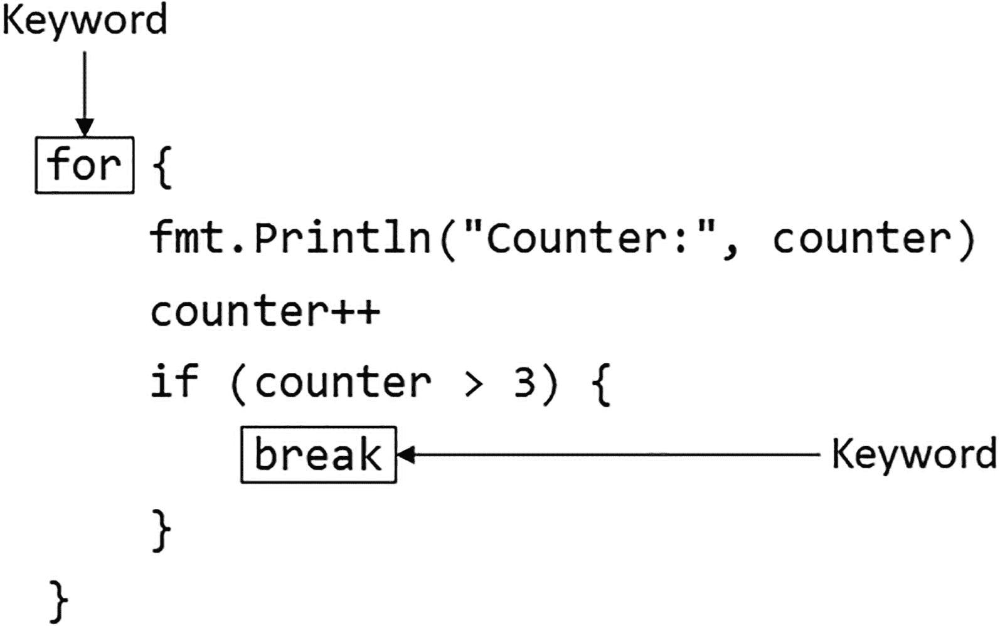

**图 6-6** 基本的 `for` 循环

代码清单 6-11 中的 `break` 关键字位于一个 `if` 语句内部，这意味着直到 `if` 语句的表达式产生 `true` 值时，循环才会终止。代码清单 6-11 中的代码在编译并执行后会产生以下输出：

```
Counter: 0
Counter: 1
Counter: 2
Counter: 3
```

### 将条件整合到循环中

上一节演示的循环代表了一个常见需求：重复执行直到满足某个条件。这是一个非常普遍的需求，因此可以将条件整合到循环语法中，如代码清单 6-12 所示。

```go
package main
import (
"fmt"
//"strconv"
)
func main() {
counter := 0
for (counter <= 3) {
//     break
// }
}
}
```

条件在 `for` 关键字和包裹循环语句的左花括号之间指定，如图 6-7 所示。条件可以用括号括起来，如示例中所示，但这并非强制要求。

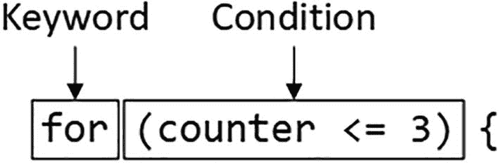

**图 6-7** `for` 循环的条件

花括号内的语句将在条件求值为 `true` 时重复执行。在此示例中，当 `counter` 变量的值小于或等于 3 时，条件产生 `true`，代码在编译并执行后会产生以下结果：

```
Counter: 0
Counter: 1
Counter: 2
Counter: 3
```

### 使用初始化语句和完成语句

循环可以定义附加的语句，这些语句在循环第一次迭代之前（称为*初始化语句*）和每次迭代之后（称为*后置语句*）执行，如代码清单 6-13 所示。

**提示** 与 `if` 语句一样，可以将括号应用于 `for` 语句的条件，但不能应用于初始化语句或后置语句。

```go
package main
import (
"fmt"
//"strconv"
)
func main() {
for counter := 0; counter <= 3; counter++ {
fmt.Println("Counter:", counter)
// counter++
}
}
```

初始化语句、条件和后置语句由分号分隔，并跟在 `for` 关键字之后，如图 6-8 所示。

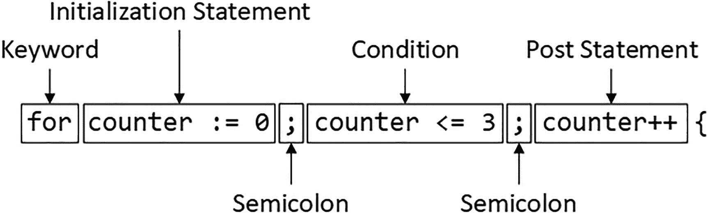

**图 6-8** 带有初始化语句和后置语句的 `for` 循环

首先执行初始化语句，然后对条件进行求值。如果条件产生 `true` 结果，则执行花括号内的语句，接着执行后置语句。然后再次对条件求值，并重复此循环。这意味着初始化语句仅执行一次，而每当条件产生 `true` 结果时，后置语句都会执行一次；如果条件在首次求值时产生 `false` 结果，则后置语句永远不会执行。代码清单 6-13 中的代码在编译并执行后会产生以下输出：

```
Counter: 0
Counter: 1
Counter: 2
Counter: 3
```

**重新创建 DO...WHILE 循环**

Go 语言没有提供 `do...while` 循环，这是其他编程语言提供的一种功能，用于定义一个至少执行一次的循环，之后通过条件求值来决定是否需要进行后续迭代。虽然有些笨拙，但可以使用 `for` 循环实现类似的效果，如下所示：

```go
package main
import (
"fmt"
)
func main() {
for counter := 0; true; counter++ {
fmt.Println("Counter:", counter)
if (counter > 3) {
break
}
}
}
```

`for` 循环的条件是 `true`，随后的迭代由 `if` 语句控制，该语句使用 `break` 关键字来终止循环。


### 循环的继续执行

`continue` 关键字可用于终止当前值的 `for` 循环语句执行，并进入下一次迭代，如代码清单 6-14 所示。

```go
package main
import (
"fmt"
//"strconv"
)
func main() {
for counter := 0; counter <= 3; counter++ {
if (counter == 1) {
continue
}
fmt.Println("Counter:", counter)
}
}
```
*代码清单 6-14：在 `flowcontrol` 文件夹的 `main.go` 文件中继续执行循环*

`if` 语句确保只有当 `counter` 变量的值等于 `1` 时，才会执行 `continue` 关键字。对于这个值，执行流程将不会到达调用 `fmt.Println` 函数的语句，编译并执行上述代码将产生以下输出：

```
Counter: 0
Counter: 2
Counter: 3
```

### 枚举序列

`for` 关键字可以与 `range` 关键字一起使用，创建枚举序列的循环，如代码清单 6-15 所示。

```go
package main
import (
"fmt"
//"strconv"
)
func main() {
product := "Kayak"
for index, character := range product {
fmt.Println("Index:", index, "Character:", string(character))
}
}
```
*代码清单 6-15：在 `flowcontrol` 文件夹的 `main.go` 文件中使用 `range` 关键字*

此示例枚举一个字符串，`for` 循环将其视为一个 `rune` 值序列，每个 `rune` 值代表一个字符。循环的每次迭代都会将值赋给两个变量，这两个变量分别提供当前在序列中的索引以及当前索引处的值，如图 6-9 所示。

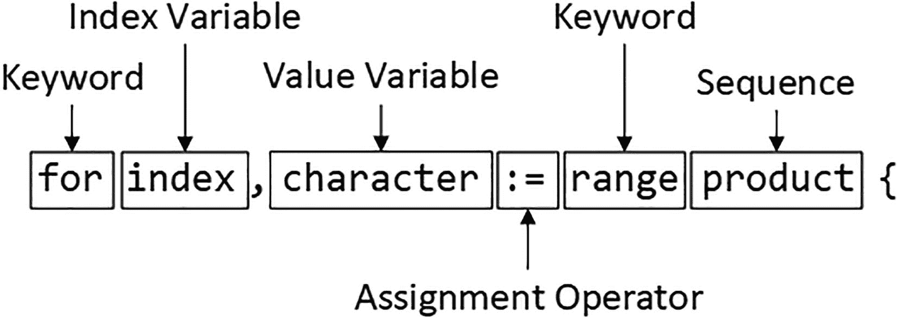

*图 6-9：枚举序列*

对于序列中的每一项，`for` 循环大括号内的语句都会执行一次。这些语句可以读取两个变量的值，从而访问序列中的元素。对于代码清单 6-15 而言，这意味着循环内的语句可以访问字符串中包含的各个字符，编译并执行后会产生以下输出：

```
Index: 0 Character: K
Index: 1 Character: a
Index: 2 Character: y
Index: 3 Character: a
Index: 4 Character: k
```

#### 枚举序列时仅接收索引或值

如果定义了一个变量但未使用，Go 会报告错误。如果只需要索引值，你可以从 `for...range` 语句中省略值变量，如代码清单 6-16 所示。

```go
package main
import (
"fmt"
//"strconv"
)
func main() {
product := "Kayak"
for index := range product {
fmt.Println("Index:", index)
}
}
```
*代码清单 6-16：在 `flowcontrol` 文件夹的 `main.go` 文件中接收索引值*

此示例中的 `for` 循环将为 `product` 字符串中的每个字符生成一个索引值序列，编译并执行后会产生以下输出：

```
Index: 0
Index: 1
Index: 2
Index: 3
Index: 4
```

当你只需要序列中的值而不需要索引时，可以使用空白标识符，如代码清单 6-17 所示。

```go
package main
import (
"fmt"
//"strconv"
)
func main() {
product := "Kayak"
for _, character := range product {
fmt.Println("Character:", string(character))
}
}
```
*代码清单 6-17：在 `flowcontrol` 文件夹的 `main.go` 文件中接收值*

空白标识符（`_` 字符）用于索引变量，而普通变量用于接收值。编译并执行代码清单 6-17 中的代码将产生以下输出：

```
Character: K
Character: a
Character: y
Character: a
Character: k
```

#### 枚举内置数据结构

`range` 关键字也可以与 Go 提供的内置数据结构一起使用——数组、切片和映射——这些内容将在第 7 章中描述，包括使用 `for` 和 `range` 关键字的示例。为快速参考，代码清单 6-18 展示了一个使用 `range` 关键字枚举数组内容的 `for` 循环。

```go
package main
import (
"fmt"
//"strconv"
)
func main() {
products := []string { "Kayak", "Lifejacket", "Soccer Ball"}
for index, element:= range products {
fmt.Println("Index:", index, "Element:", element)
}
}
```
*代码清单 6-18：在 `flowcontrol` 文件夹的 `main.go` 文件中枚举数组*

此示例使用字面量语法定义数组，数组是固定长度的值集合。（Go 也有内置的变长集合，称为*切片*，以及键值映射。）该数组包含三个字符串值，每次执行 `for` 循环时，当前索引和元素都会被赋给这两个变量，编译并执行代码将产生以下输出：

```
Index: 0 Element: Kayak
Index: 1 Element: Lifejacket
Index: 2 Element: Soccer Ball
```

## 使用 switch 语句

`switch` 语句提供了一种替代方法来控制执行流程，它是基于将表达式的结果与特定值进行匹配，而不是评估 `true` 或 `false` 的结果，如代码清单 6-19 所示。这是执行多重比较的一种简洁方式，为复杂的 `if`/`else if`/`else` 语句提供了更简洁的替代方案。

> **注意：** `switch` 语句也可用于区分数据类型，这将在第 11 章中描述。

```go
package main
import (
"fmt"
//"strconv"
)
func main() {
product := "Kayak"
for index, character := range product {
switch (character) {
case 'K':
fmt.Println("K at position", index)
case 'y':
fmt.Println("y at position", index)
}
}
}
```
*代码清单 6-19：在 `flowcontrol` 文件夹的 `main.go` 文件中使用 `switch` 语句*

`switch` 关键字后跟一个值或表达式，其结果用于执行比较。比较是针对一系列 `case` 语句进行的，每个 `case` 语句指定一个值，如图 6-10 所示。

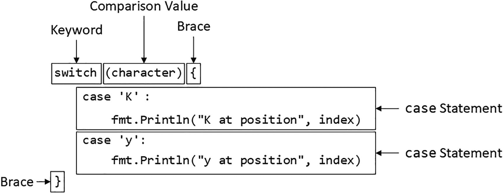

*图 6-10：一个基本的 `switch` 语句*

在代码清单 6-19 中，`switch` 语句用于检查应用于 `string` 值的 `for` 循环产生的每个字符，生成一个 `rune` 值序列，并使用 `case` 语句来匹配特定的字符。

`case` 关键字后跟一个值、一个冒号以及一个或多个语句，当比较值与 `case` 语句值匹配时执行这些语句，如图 6-11 所示。

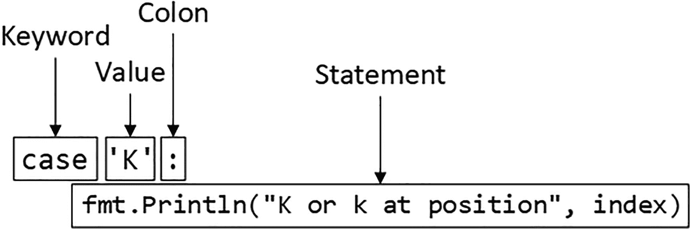

*图 6-11：`case` 语句的结构*

此 `case` 语句匹配 rune `K`，当匹配时，将执行调用 `fmt.Println` 函数的语句。编译并执行代码清单 6-19 中的代码将产生以下输出：

```
K at position 0
y at position 2
```


### 匹配多个值

在某些语言中，`switch` 语句会“穿透”（fall through），这意味着一旦某个 `case` 语句匹配成功，就会一直执行语句直到遇到 `break` 语句，哪怕这意味着会继续执行后续 `case` 语句中的代码。穿透通常用于让多个 `case` 语句执行相同代码，但必须谨慎使用 `break` 关键字来防止意外地持续执行。

Go 的 `switch` 语句不会自动穿透，但可以通过逗号分隔的列表指定多个值，如代码清单 6-20 所示。

```
package main
import (
"fmt"
//"strconv"
)
func main() {
product := "Kayak"
for index, character := range product {
switch (character) {
case 'K', 'k':
fmt.Println("K or k at position", index)
case 'y':
fmt.Println("y at position", index)
}
}
}
代码清单 6-20
在 flowcontrol 文件夹的 main.go 文件中使用多个值
```

`case` 语句所匹配的值集合以逗号分隔的列表形式表示，如图 6-12 所示。

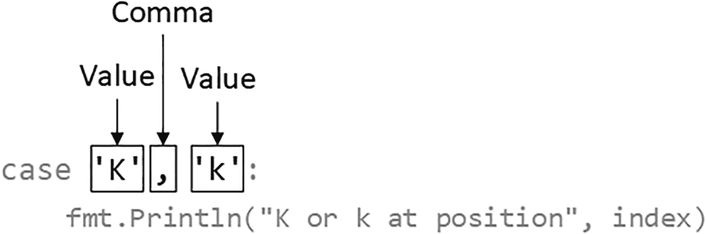

*图 6-12：在 `case` 语句中指定多个值*

`case` 语句将匹配任意一个指定的值，当编译并运行代码清单 6-20 中的代码时，会生成以下输出：

```
K or k at position 0
y at position 2
K or k at position 4
```

#### 终止 `case` 语句的执行

虽然每个 `case` 语句不需要强制使用 `break` 关键字来终止，但它可以用于在到达 `case` 语句末尾之前结束语句的执行，如代码清单 6-21 所示。

```
package main
import (
"fmt"
//"strconv"
)
func main() {
product := "Kayak"
for index, character := range product {
switch (character) {
case 'K', 'k':
if (character == 'k') {
fmt.Println("Lowercase k at position", index)
break
}
fmt.Println("Uppercase K at position", index)
case 'y':
fmt.Println("y at position", index)
}
}
}
代码清单 6-21
在 flowcontrol 文件夹的 main.go 文件中使用 break 关键字
```

`if` 语句用于检查当前 `rune` 是否为 `k`，如果是，则调用 `fmt.Println` 函数，然后使用 `break` 关键字终止 `case` 语句的执行，阻止后续任何语句被执行。编译并运行代码清单 6-21 中的代码，会生成以下输出：

```
Uppercase K at position 0
y at position 2
Lowercase k at position 4
```

### 强制穿透到下一个 `case` 语句

Go 的 `switch` 语句不会自动穿透，但可以通过 `fallthrough` 关键字启用此行为，如代码清单 6-22 所示。

```
package main
import (
"fmt"
//"strconv"
)
func main() {
product := "Kayak"
for index, character := range product {
switch (character) {
case 'K':
fmt.Println("Uppercase character")
fallthrough
case 'k':
fmt.Println("k at position", index)
case 'y':
fmt.Println("y at position", index)
}
}
}
代码清单 6-22
在 flowcontrol 文件夹的 main.go 文件中实现穿透
```

第一个 `case` 语句包含了 `fallthrough` 关键字，这意味着执行将继续到下一个 `case` 语句中的代码。编译并运行代码清单 6-22 中的代码，会生成以下输出：

```
Uppercase character
k at position 0
y at position 2
k at position 4
```

### 提供 `default` 子句

`default` 关键字用于定义一个子句，当没有任何 `case` 语句匹配 `switch` 语句的值时，将执行该子句，如代码清单 6-23 所示。

```
package main
import (
"fmt"
//"strconv"
)
func main() {
product := "Kayak"
for index, character := range product {
switch (character) {
case 'K', 'k':
if (character == 'k') {
fmt.Println("Lowercase k at position", index)
break
}
fmt.Println("Uppercase K at position", index)
case 'y':
fmt.Println("y at position", index)
default:
fmt.Println("Character", string(character), "at position", index)
}
}
}
代码清单 6-23
在 flowcontrol 文件夹的 main.go 文件中添加 default 子句
```

`default` 子句中的语句仅会在那些没有被 `case` 语句匹配的值上执行。在此示例中，字符 `K`、`k` 和 `y` 被 `case` 语句匹配，因此 `default` 子句将仅用于其他字符。编译并运行代码清单 6-23 中的代码，会生成以下输出：

```
Uppercase K at position 0
Character a at position 1
y at position 2
Character a at position 3
Lowercase k at position 4
```

### 使用初始化语句

`switch` 语句可以带有一个初始化语句来定义，这是一种准备比较值的有用方式，以便在 `case` 语句中引用该值。代码清单 6-24 演示了 `switch` 语句中一个常见问题：使用表达式来产生比较值。

```
package main
import (
"fmt"
//"strconv"
)
func main() {
for counter := 0; counter < 20; counter++ {
switch(counter / 2) {
case 2, 3, 5, 7:
fmt.Println("Prime value:", counter / 2)
default:
fmt.Println("Non-prime value:", counter / 2)
}
}
}
代码清单 6-24
在 flowcontrol 文件夹的 main.go 文件中使用表达式
```

`switch` 语句对 `counter` 变量的值应用除法运算符来产生其比较值，这意味着必须在 `case` 语句中执行相同的操作，才能将匹配的值传递给 `fmt.Println` 函数。使用初始化语句可以避免这种重复，如代码清单 6-25 所示。

```
package main
import (
"fmt"
//"strconv"
)
func main() {
for counter := 0; counter < 20; counter++ {
switch val := counter / 2; val {
case 2, 3, 5, 7:
fmt.Println("Prime value:", val)
default:
fmt.Println("Non-prime value:", val)
}
}
}
代码清单 6-25
在 flowcontrol 文件夹的 main.go 文件中使用初始化语句
```

初始化语句跟随在 `switch` 关键字之后，并通过分号与比较值分隔开，如图 6-13 所示。

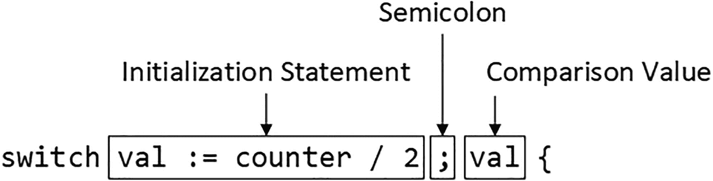

*图 6-13：`switch` 语句的初始化语句*

初始化语句通过除法运算符创建了一个名为 `val` 的变量。这意味着 `val` 既可用作比较值，也可以在 `case` 语句内部访问，从而避免了重复执行该运算。代码清单 6-24 和代码清单 6-25 是等效的，两者在编译并运行后都会产生以下输出：

```
Non-prime value: 0
Non-prime value: 0
Non-prime value: 1
Non-prime value: 1
Prime value: 2
Prime value: 2
Prime value: 3
Prime value: 3
Non-prime value: 4
Non-prime value: 4
Prime value: 5
Prime value: 5
Non-prime value: 6
Non-prime value: 6
Prime value: 7
Prime value: 7
Non-prime value: 8
Non-prime value: 8
Non-prime value: 9
Non-prime value: 9
```


### 省略比较值

Go 为 `switch` 语句提供了一种不同的方法，即省略比较值，并在 `case` 语句中使用表达式。这强化了 `switch` 语句是 `if` 语句的简洁替代方案这一理念，如代码清单 [6-26] 所示。

```
package main
import (
"fmt"
//"strconv"
)
func main() {
for counter := 0; counter < 10; counter++ {
if counter == 0 {
fmt.Println("Zero value")
} else if counter < 3 {
fmt.Println(counter, "is < 3")
} else if counter >= 3 && counter < 7 {
fmt.Println(counter, "is >= 3 && < 7")
} else {
fmt.Println(counter, "is >= 7")
}
}
}
```

当省略比较值时，每个 `case` 语句都带有一个条件。执行 `switch` 语句时，会对每个条件求值，直到某个条件产生 `true` 结果，或到达可选的 `default` 子句。当项目被编译并执行时，代码清单 [6-26] 产生以下输出：

```
Zero value
1 is < 3
2 is < 3
3 is >= 3 && < 7
4 is >= 3 && < 7
5 is >= 3 && < 7
6 is >= 3 && < 7
7 is >= 7
8 is >= 7
9 is >= 7
```

## 使用标签语句

标签语句允许执行跳转到不同的点，比其他流程控制特性提供了更大的灵活性。代码清单 [6-27] 展示了标签语句的使用。

```
package main
import (
"fmt"
//"strconv"
)
func main() {
counter := 0
target: fmt.Println("Counter", counter)
counter++
if (counter < 5) {
goto target
}
}
```

标签由一个名称、一个冒号和一个常规代码语句定义，如图 [6-14] 所示。`goto` 关键字用于跳转到标签。

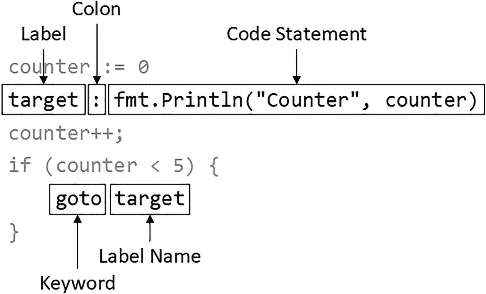

**图 6-14** - 标记语句

**提示：** 关于何时可以跳转到标签有一些限制，例如，不能从外部 `switch` 语句跳入 `case` 语句。

在此示例中，分配给标签的名称为 `target`。当执行到达 `goto` 关键字时，它会跳转到具有指定标签的语句。其效果是一个基本的循环，使得 `counter` 变量的值在小于 5 时递增。当编译并执行时，代码清单 [6-27] 产生以下输出：

```
Counter 0
Counter 1
Counter 2
Counter 3
Counter 4
```

## 总结

在本章中，我描述了 Go 的流程控制特性。我解释了如何使用 `if` 和 `switch` 语句有条件地执行语句，以及如何使用 `for` 循环重复执行语句。如本章所示，Go 的流程控制关键字比其他语言少，但每个关键字都有附加功能，例如初始化语句和对 `range` 关键字的支持。在下一章中，我将介绍 Go 的集合类型：数组、切片和映射。

# 7. 使用数组、切片和映射

在本章中，我将介绍 Go 内置的集合类型：数组、切片和映射。这些特性允许将相关值分组，就像其他特性一样，Go 在集合方面采用了与其他语言不同的方法。我还将介绍 Go `string` 值的一个不寻常方面，它可以像数组一样处理，但根据元素的使用方式表现出不同的行为。表 [7-1] 将数组、切片和映射置于上下文中。

**表 7-1** - 数组、切片和映射的上下文

| 问题 | 答案 |
| --- | --- |
| 它们是什么？ | Go 集合类用于对相关值进行分组。数组存储固定数量的值，切片存储可变数量的值，映射存储键值对。 |
| 为什么它们有用？ | 这些集合类是跟踪相关数据值的一种便捷方式。 |
| 如何使用它们？ | 每种集合类型都可以使用字面量语法或 `make` 函数来使用。 |
| 是否有任何陷阱或限制？ | 必须谨慎理解对切片执行的操作对底层数组的影响，以避免意外结果。 |
| 有替代方案吗？ | 您不必使用这些类型中的任何一种，但使用它们会使大多数编程任务更容易。 |

**表 7-2** - 章节总结

| 问题 | 解决方案 | 代码清单 |
| --- | --- | --- |
| 存储固定数量的值 | 使用数组 | [4]–[8] |
| 比较数组 | 使用比较运算符 | [9] |
| 枚举数组 | 使用带有 `range` 关键字的 `for` 循环 | [10], [11] |
| 存储可变数量的值 | 使用切片 | [12]–[13], [16], [17], [23] |
| 向切片追加项目 | 使用 `append` 函数 | [14]–[15], [18], [20]–[22] |
| 从现有数组创建切片或从切片中选择元素 | 使用范围 | [19], [24] |
| 将元素复制到切片中 | 使用 `copy` 函数 | [25], [29] |
| 从切片中删除元素 | 使用带有省略要删除元素范围的 `append` 函数 | [30] |
| 枚举切片 | 使用带有 `range` 关键字的 `for` 循环 | [31] |
| 对切片中的元素进行排序 | 使用 `sort` 包 | [32] |
| 比较切片 | 使用 `reflect` 包 | [33], [34] |
| 获取切片底层数组的指针 | 执行显式转换为数组类型，其长度小于或等于切片中的元素数量 | [35] |
| 存储键值对 | 使用映射 | [36]–[40] |
| 从映射中删除键值对 | 使用 `delete` 函数 | [41] |
| 枚举映射的内容 | 使用带有 `range` 关键字的 `for` 循环 | [42], [43] |
| 从字符串中读取字节值或字符 | 将字符串用作数组或执行显式转换为 `[]rune` 类型 | [44]–[48] |
| 枚举字符串中的字符 | 使用带有 `range` 关键字的 `for` 循环 | [49] |
| 枚举字符串中的字节 | 执行显式转换为 `[]byte` 类型，并使用带有 `range` 关键字的 `for` 循环 | [50] |

## 本章准备

为准备本章，打开一个新的命令提示符，导航到方便的位置，并创建一个名为 `collections` 的目录。导航到 `collections` 文件夹，并运行代码清单 [7-1] 中所示的命令来初始化项目。

```
go mod init collections
```

将一个名为 `main.go` 的文件添加到 `collections` 文件夹，其内容如代码清单 [7-2] 所示。

**提示：** 您可以从 [`https://github.com/apress/pro-go`](https://github.com/apress/pro-go) 下载本章（以及本书所有其他章节）的示例项目。请参阅第 [2] 章了解如果在运行示例时遇到问题如何获取帮助。

```
package main
import "fmt"
func main() {
fmt.Println("Hello, Collections")
}
```

使用命令提示符在 `collections` 文件夹中运行代码清单 [7-3] 中所示的命令。

```
go run .
```

`main.go` 文件中的代码将被编译并执行，产生以下输出：

```
Hello, Collections
```


### 处理数组

Go 数组的长度是固定的，包含单一类型的元素，通过索引进行访问，如代码清单 7-4 所示。

```
package main
import "fmt"
func main() {
var names [3]string
names[0] = "Kayak"
names[1] = "Lifejacket"
names[2] = "Paddle"
fmt.Println(names)
}
```

数组类型在方括号中包含数组的大小，接着是数组将包含的元素类型，即所谓的*底层类型*，如图 7-1 所示。数组的长度和元素类型不能更改，并且数组长度必须指定为常量。（稍后本章将介绍的切片可以存储可变数量的值。）

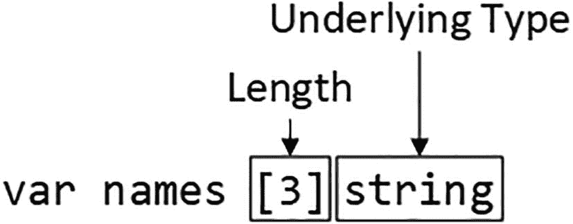

数组创建后，会用元素类型的零值进行填充。在此示例中，`names` 数组将用空字符串（`""`）填充，这是 `string` 类型的零值。数组中的元素使用从零开始的索引符号进行访问，如图 7-2 所示。

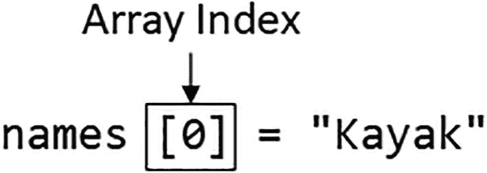

代码清单 7-4 中的最后一条语句将数组传递给 `fmt.Println`，它会生成数组的字符串表示并将其写入控制台，编译并执行代码时将产生以下输出：

```
[Kayak Lifejacket Paddle]
```

## 使用数组字面量语法

可以使用字面量语法在一条语句中定义并填充数组，如代码清单 7-5 所示。

```
package main
import "fmt"
func main() {
names := [3]string { "Kayak", "Lifejacket", "Paddle" }
fmt.Println(names)
}
```

数组类型后面跟着包含填充数组元素的花括号，如图 7-3 所示。

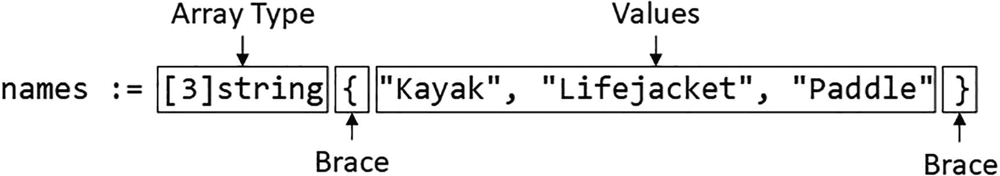

**提示**

使用字面量语法指定的元素数量可以小于数组的容量。数组中任何未提供值的位置都将被分配该数组类型的零值。

代码清单 7-5 中的代码在编译并执行时会产生以下输出：

```
[Kayak Lifejacket Paddle]
```

### 创建多维数组

Go 数组是一维的，但可以组合创建多维数组，如下所示：

```
...
var coords [3][3]int
...
```

此语句创建一个容量为 3、底层类型为容量同样是 3 的 `int` 数组的数组，从而产生一个 3×3 的 `int` 值数组。可以使用两个索引位置来指定单个值，如下所示：

```
...
coords[1][2] = 10
...
```

这种语法有些笨拙，尤其是对于维度更多的数组，但它功能完备，并且保持了 Go 处理数组方式的一致性。

## 理解数组类型

数组的类型是其大小和底层类型的组合。以下是代码清单 7-5 中定义数组的语句：

```
...
names := [3]string { "Kayak", "Lifejacket", "Paddle" }
...
```

`names` 变量的类型是 `[3]string`，意思是一个底层类型为 `string`、容量为 3 的数组。底层类型和容量的每种组合都是一种不同的类型，如代码清单 7-6 所示。

```
package main
import "fmt"
func main() {
names := [3]string { "Kayak", "Lifejacket", "Paddle" }
var otherArray [4]string = names
fmt.Println(names)
}
```

此示例中两个数组的底层类型相同，但编译器会报告错误，即使 `otherArray` 的容量足以容纳 `names` 数组中的元素也是如此。以下是编译器产生的错误：

```
.\main.go:9:9: cannot use names (type [3]string) as type [4]string in assignment
```

### 让编译器确定数组长度

使用字面量语法时，编译器可以从元素列表中推断出数组的长度，如下所示：

```
...
names := [...]string { "Kayak", "Lifejacket", "Paddle" }
...
```

显式长度被替换为三个句点（`...`），这告诉编译器根据字面量值确定数组长度。`names` 变量的类型仍然是 `[3]string`，唯一的区别是你可以添加或删除字面量值，而无需同时更新显式指定的长度。在本书的示例中，我不会使用此功能，因为我希望尽可能清晰地表明所使用的类型。

## 理解数组值

正如我在第 4 章中解释的，Go 默认使用值而非引用。此行为也适用于数组，这意味着将数组赋值给一个新变量会复制数组及其包含的值，如代码清单 7-7 所示。

```
package main
import "fmt"
func main() {
names := [3]string { "Kayak", "Lifejacket", "Paddle" }
otherArray := names
names[0] = "Canoe"
fmt.Println("names:", names)
fmt.Println("otherArray:", otherArray)
}
```

在此示例中，我将 `names` 数组赋值给一个名为 `otherArray` 的新变量，然后更改 `names` 数组索引零处的值，最后写出这两个数组。编译并执行代码会产生以下输出，表明数组及其内容已被复制：

```
names: [Canoe Lifejacket Paddle]
otherArray: [Kayak Lifejacket Paddle]
```

可以使用指针来创建对数组的引用，如代码清单 7-8 所示。

```
package main
import "fmt"
func main() {
names := [3]string { "Kayak", "Lifejacket", "Paddle" }
otherArray := &names
names[0] = "Canoe"
fmt.Println("names:", names)
fmt.Println("otherArray:", *otherArray)
}
```

`otherArray` 变量的类型是 `*[3]string`，表示指向一个容量为 3 个 `string` 值的数组的指针。数组指针的工作方式与任何其他指针一样，必须解引用才能访问数组内容。代码清单 7-8 中的代码在编译并执行时会产生以下输出：

```
names: [Canoe Lifejacket Paddle]
otherArray: [Canoe Lifejacket Paddle]
```

你也可以创建包含指针的数组，这意味着数组中的值在复制数组时不会被复制。而且，正如我在第 4 章中演示的，你可以创建指向数组中特定位置的指针，即使数组内容被更改，该指针也能提供对该位置值的访问权限。


### 比较数组

比较运算符 `==` 和 `!=` 可以应用于数组，如代码清单 7-9 所示。

```
package main
import "fmt"
func main() {
names := [3]string { "Kayak", "Lifejacket", "Paddle" }
moreNames := [3]string { "Kayak", "Lifejacket", "Paddle" }
same := names == moreNames
fmt.Println("comparison:", same)
}
```

当数组类型相同且包含相同顺序的相等元素时，它们就是相等的。`names` 和 `moreNames` 数组相等，因为它们都是 `[3]string` 数组，并且包含相同的字符串值。代码清单 7-9 中的代码会产生以下输出：

```
comparison: true
```

### 枚举数组

使用 `for` 和 `range` 关键字对数组进行枚举，如代码清单 7-10 所示。

```
package main
import "fmt"
func main() {
names := [3]string { "Kayak", "Lifejacket", "Paddle" }
for index, value := range names {
fmt.Println("Index:", index, "Value:", value)
}
}
```

我在第 6 章中详细描述了 `for` 循环，但当与 `range` 关键字一起使用时，`for` 关键字会枚举数组的内容，在枚举数组时为每个元素生成两个值，如图 7-4 所示。

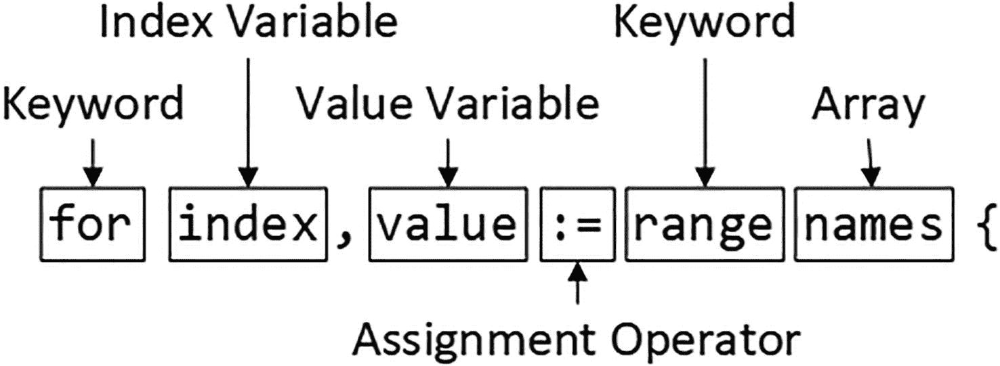

第一个值（在代码清单 7-10 中分配给 `index` 变量）被赋值给当前正在枚举的数组位置。第二个值（在代码清单 7-10 中分配给名为 `value` 的变量）被赋值给当前位置的元素。编译并执行该清单会产生以下输出：

```
Index: 0 Value: Kayak
Index: 1 Value: Lifejacket
Index: 2 Value: Paddle
```

Go 不允许定义变量而不使用。如果你不需要同时使用索引和值，可以使用下划线（`_` 字符）代替变量名，如代码清单 7-11 所示。

```
package main
import "fmt"
func main() {
names := [3]string { "Kayak", "Lifejacket", "Paddle" }
for _, value := range names {
fmt.Println("Value:", value)
}
}
```

下划线被称为*空白标识符*，当某个特性返回的值后续不再使用且不应分配名称时，就会用到它。代码清单 7-11 中的代码在枚举数组时丢弃了当前索引，并产生以下输出：

```
Value: Kayak
Value: Lifejacket
Value: Paddle
```

## 使用切片

将切片视为可变长度数组是理解它的最佳方式，因为当不知道需要存储多少个值，或者数量随时间变化时，切片就非常有用。定义切片的一种方法是使用内置的 `make` 函数，如代码清单 7-12 所示。

```
package main
import "fmt"
func main() {
names := make([]string, 3)
names[0] = "Kayak"
names[1] = "Lifejacket"
names[2] = "Paddle"
fmt.Println(names)
}
```

`make` 函数接受指定切片类型和长度的参数，如图 7-5 所示。

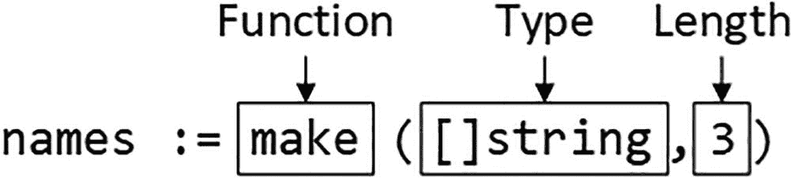

此示例中的切片类型是 `[]string`，表示一个保存 `string` 值的切片。长度不是切片类型的一部分，因为切片的大小可以变化，我在本节后面会演示这一点。切片也可以使用字面量语法创建，如代码清单 7-13 所示。

```
package main
import "fmt"
func main() {
names := []string {"Kayak", "Lifejacket", "Paddle"}
fmt.Println(names)
}
```

切片字面量语法与数组的语法类似，切片的初始长度由字面量值的数量推断得出，如图 7-6 所示。

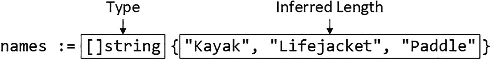

切片类型和长度的组合用于创建一个数组，该数组作为切片的数据存储。切片是一个包含三个值的数据结构：一个指向数组的指针、切片的长度和切片的容量。切片的长度是它可以存储的元素数量，容量是数组中可存储的元素数量。在此示例中，长度和容量都是 3，如图 7-7 所示。

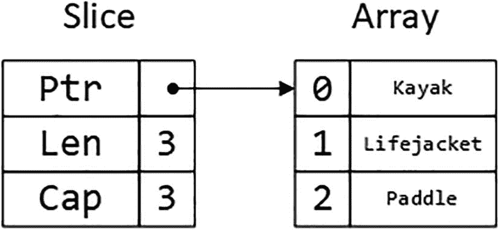

切片支持数组风格的索引表示法，允许访问底层数组中的元素。尽管图 7-7 更真实地表示了切片，但图 7-8 展示了切片如何映射到其数组。

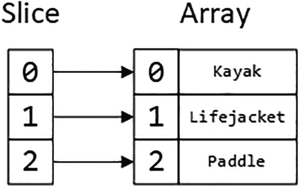

此切片与其数组之间的映射很简单，但切片并不总是与其数组有如此直接的映射关系，后续示例会演示这一点。编译并执行代码清单 7-12 和代码清单 7-13 中的代码会产生以下输出：

```
[Kayak Lifejacket Paddle]
```


### 向切片追加元素

切片的一个关键优势在于它可以扩展以容纳更多元素，如代码清单 7-14 所示。

```
package main
import "fmt"
func main() {
names := []string {"Kayak", "Lifejacket", "Paddle"}
names = append(names, "Hat", "Gloves")
fmt.Println(names)
}
```

内置的 `append` 函数接收一个切片以及一个或多个要添加到该切片的元素，元素之间用逗号分隔，如图 7-9 所示。

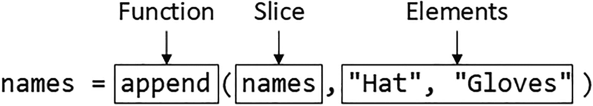

图 7-9：向切片追加元素

`append` 函数会创建一个足够大以容纳新元素的数组，复制现有的数组，并添加新的值。`append` 函数返回的结果是一个映射到新数组上的切片，如图 7-10 所示。

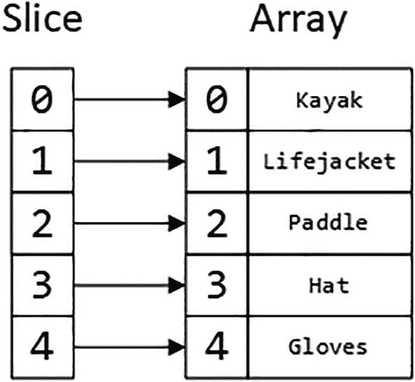

图 7-10：向切片追加元素的结果

代码清单 7-14 中的代码在编译并执行后会产生以下输出，显示两个新元素已添加到切片中：

```
[Kayak Lifejacket Paddle Hat Gloves]
```

原始的切片及其底层数组仍然存在并可被使用，如代码清单 7-15 所示。

```
package main
import "fmt"
func main() {
names := []string {"Kayak", "Lifejacket", "Paddle"}
appendedNames := append(names, "Hat", "Gloves")
names[0] = "Canoe"
fmt.Println("names:", names)
fmt.Println("appendedNames:", appendedNames)
}
```

在这个例子中，`append` 函数的结果被赋值给一个不同的变量，效果是有了两个切片，其中一个是由另一个切片创建的。每个切片都有一个底层数组，并且这些切片是独立的。代码清单 7-15 中的代码在编译并执行后会产生以下输出，表明通过一个切片更改值不会影响另一个切片：

```
names: [Canoe Lifejacket Paddle]
appendedNames: [Kayak Lifejacket Paddle Hat Gloves]
```

#### 分配额外的切片容量

创建和复制数组可能效率较低。如果你预期需要向切片追加元素，可以在使用 `make` 函数时指定额外的容量，如代码清单 7-16 所示。

```
package main
import "fmt"
func main() {
names := make([]string, 3, 6)
names[0] = "Kayak"
names[1] = "Lifejacket"
names[2] = "Paddle"
fmt.Println("len:", len(names))
fmt.Println("cap:", cap(names))
}
```

如前所述，切片具有*长度*和*容量*。切片的长度是它当前可以包含的值的数量，而容量则是在切片必须调整大小并创建新数组之前，可在底层数组中存储的元素数量。容量总是至少等于长度，但如果使用 `make` 函数分配了额外的容量，则可以更大。代码清单 7-16 中对 `make` 函数的调用创建了一个长度为 3、容量为 6 的切片，如图 7-11 所示。

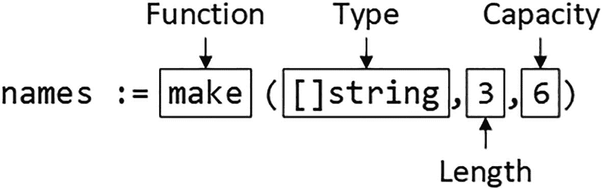

图 7-11：分配额外容量

**提示**：你也可以对标准的固定长度数组使用 `len` 和 `cap` 函数。这两个函数都会返回数组的长度，例如，对于一个类型为 `[3]string` 的数组，两个函数都会返回 `3`。有关示例，请参阅“使用 `copy` 函数”一节。

内置的 `len` 和 `cap` 函数分别返回切片的长度和容量。代码清单 7-16 中的代码在编译并执行后会产生以下输出：

```
len: 3
cap: 6
```

其效果是切片的底层数组有了一些增长空间，如图 7-12 所示。

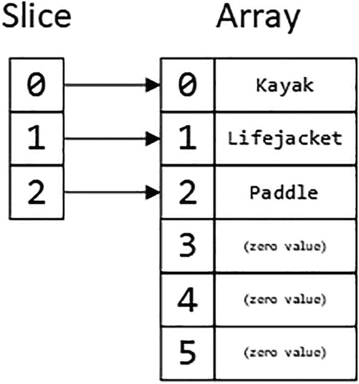

图 7-12：底层数组具有额外容量的切片

当 `append` 函数在具有足够容量容纳新元素的切片上调用时，底层数组不会被替换，如代码清单 7-17 所示。

**警告**：如果你定义了一个切片变量但没有对其进行初始化，那么结果将是一个长度为 0、容量为 0 的切片，并且当向它追加元素时会导致错误。

```
package main
import "fmt"
func main() {
names := make([]string, 3, 6)
names[0] = "Kayak"
names[1] = "Lifejacket"
names[2] = "Paddle"
appendedNames := append(names, "Hat", "Gloves")
names[0] = "Canoe"
fmt.Println("names:", names)
fmt.Println("appendedNames:", appendedNames)
}
```

`append` 函数的结果是一个长度增加但仍然由同一个底层数组支持的切片。原始切片仍然存在并且由同一数组支持，其效果是现在有两个对单个数组的视图，如图 7-13 所示。

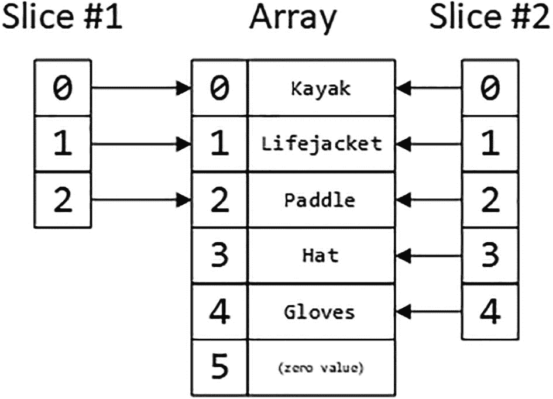

图 7-13：由单个数组支持的多个切片

由于这些切片由同一个数组支持，因此通过一个切片分配新值也会影响另一个切片，这可以从代码清单 7-17 代码的输出中看到：

```
names: [Canoe Lifejacket Paddle]
appendedNames: [Canoe Lifejacket Paddle Hat Gloves]
```

### 将一个切片追加到另一个切片

`append` 函数可用于将一个切片追加到另一个切片，如代码清单 7-18 所示。

```
package main
import "fmt"
func main() {
names := make([]string, 3, 6)
names[0] = "Kayak"
names[1] = "Lifejacket"
names[2] = "Paddle"
moreNames := []string { "Hat Gloves"}
appendedNames := append(names, moreNames...)
fmt.Println("appendedNames:", appendedNames)
}
```

第二个参数后面跟三个点（`...`），这是必需的，因为内置的 `append` 函数定义了一个*可变参数*，我将在第 8 章中描述。对于本章来说，只要知道你可以将一个切片的内容追加到另一个切片即可，前提是使用了这三个点。（如果你省略了这三个点，Go 编译器将会报告错误，因为它认为你试图将第二个切片作为单个值添加到第一个切片，并且它知道类型不匹配。）代码清单 7-18 中的代码在编译并执行后会产生以下输出：

```
appendedNames: [Kayak Lifejacket Paddle Hat Gloves]
```


### 从现有数组创建切片

切片可以通过使用现有数组来创建，这建立在前文示例所述行为的基础之上，并强调了切片作为数组视图的本质。代码清单 7-19 定义了一个数组，并使用它来创建切片。

```go
package main
import "fmt"
func main() {
products := [4]string { "Kayak", "Lifejacket", "Paddle", "Hat"}
someNames := products[1:3]
allNames := products[:]
fmt.Println("someNames:", someNames)
fmt.Println("allNames", allNames)
}
```

`products` 变量被赋值为一个标准的固定长度数组，其中包含 `string` 类型的值。该数组通过一个指定了低值和高值的范围来创建切片，如图 7-14 所示。

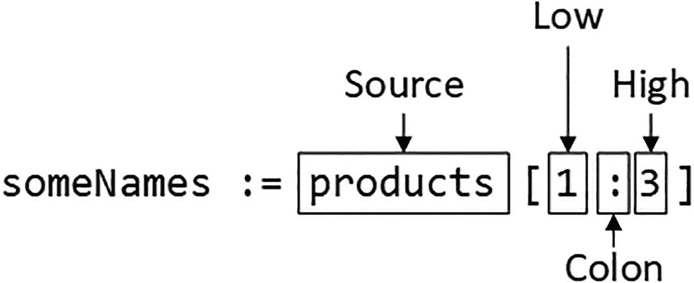

使用范围从现有数组创建切片

范围用方括号表示，低值和高值之间用冒号分隔。切片中的第一个索引被设置为低值，其长度是高值减去低值的结果。这意味着范围 `[1:3]` 创建了一个切片，其零索引映射到数组的索引 1，且长度为 2。正如本例所示，切片不必与底层数组的起始位置对齐。

范围的起始索引和数量可以省略，以便包含来源中的所有元素，如图 7-15 所示。（你也可以只省略其中一个值，后面的示例会展示。）

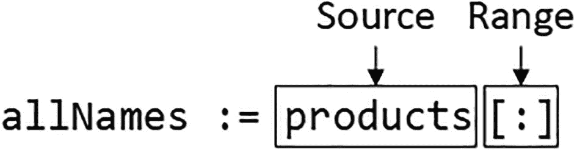

包含所有元素的范围

代码清单 7-19 中的代码创建了两个切片，这两个切片都由同一个数组支持。`someNames` 切片提供了数组的部分视图，而 `allNames` 切片则是整个数组的视图，如图 7-16 所示。

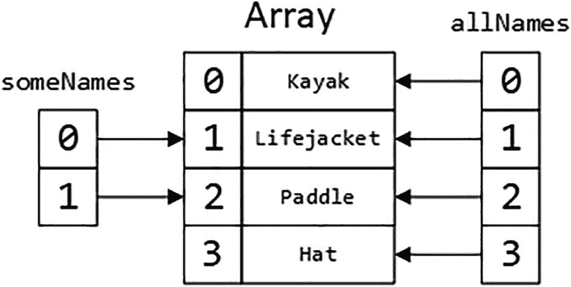

从现有数组创建切片

代码清单 7-19 中的代码编译并执行后，会产生以下输出：

```
someNames: [Lifejacket Paddle]
allNames [Kayak Lifejacket Paddle Hat]
```

### 使用现有数组创建切片时追加元素

当追加元素时，切片与现有数组之间的关系可能会产生不同的结果。

如前例所示，可以对切片进行偏移，使其第一个索引位置不在数组的起始位置，并且其最后一个索引不指向数组的最后一个元素。在代码清单 7-19 中，`someNames` 切片的索引 0 映射到了数组的索引 1。在此之前，切片的容量与底层数组的长度保持一致，但现在情况不同了，因为偏移的效果是减少了切片可以使用的数组部分。代码清单 7-20 添加了打印两个切片长度和容量信息的语句。

```go
package main
import "fmt"
func main() {
products := [4]string { "Kayak", "Lifejacket", "Paddle", "Hat"}
someNames := products[1:3]
allNames := products[:]
fmt.Println("someNames:", someNames)
fmt.Println("someNames len:", len(someNames), "cap:", cap(someNames))
fmt.Println("allNames", allNames)
fmt.Println("allNames len", len(allNames), "cap:", cap(allNames))
}
```

代码清单 7-20 中的代码编译并执行后，会产生以下输出，证实了偏移切片的效果：

```
someNames: [Lifejacket Paddle]
someNames len: 2 cap: 3
allNames [Kayak Lifejacket Paddle Hat]
allNames len 4 cap: 4
```

代码清单 7-21 向 `someNames` 切片追加了一个元素。

```go
package main
import "fmt"
func main() {
products := [4]string { "Kayak", "Lifejacket", "Paddle", "Hat"}
someNames := products[1:3]
allNames := products[:]
someNames = append(someNames, "Gloves")
fmt.Println("someNames:", someNames)
fmt.Println("someNames len:", len(someNames), "cap:", cap(someNames))
fmt.Println("allNames", allNames)
fmt.Println("allNames len", len(allNames), "cap:", cap(allNames))
}
```

这个切片有足够的容量来容纳新元素而无需扩容，但用于存储该元素的数组位置已经包含在 `allNames` 切片中，这意味着 `append` 操作会扩展 `someNames` 切片，并改变通过 `allNames` 切片可以访问的一个值，如图 7-17 所示。

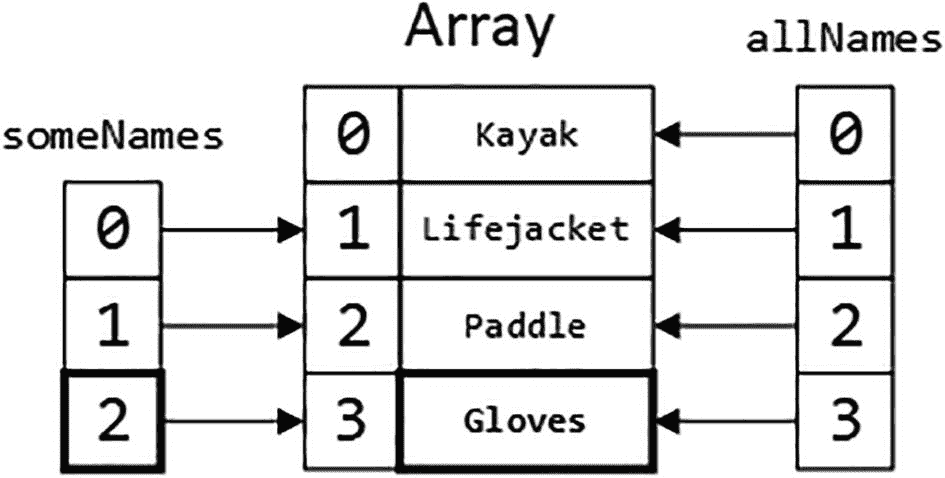

向切片追加元素

### 让切片行为可预测

切片共享数组的方式会引起混淆。一些开发者期望切片是独立的，当值被存储到多个切片共用的数组时，会得到意外的结果。另一些开发者编写的代码期望数组被共享，但当扩容导致切片分离时，也会得到意外的结果。

切片看似不可预测，但仅仅是因为你使用它们的方式不一致。我的建议是将切片分为两类，在创建时决定它属于哪一类，并且不改变其类别。

第一类是固定长度数组的固定长度视图。这听起来比实际更有用，因为切片可以映射到数组的特定区域，并且可以通过编程方式选择这个区域。在此类别中，你可以修改切片中的元素，但不能追加新元素，这意味着所有映射到该数组的切片都将使用修改后的元素。

第二类是可变长度的数据集合。我确保此类别中的每个切片都有自己的底层数组，并且不被任何其他切片共享。这种方法允许我自由地向切片添加新元素，而无需担心对其他切片的影响。


如果你在使用切片时感到困惑，且没有得到预期结果，那么请问自己：你的每个切片属于哪一类？你是否在处理切片时存在不一致，或者从同一源数组中创建了不同类别的切片？

如果你将切片用作数组的固定视图，那么你可以期待多个切片对该数组提供一致的视图，并且你赋值的任何新值都将被所有映射到被修改元素的切片所反映。

这一结果由清单 7-21 中的代码编译和执行后产生的输出所证实：

```
someNames: [Lifejacket Paddle Gloves]
someNames len: 3 cap: 3
allNames [Kayak Lifejacket Paddle Gloves]
allNames len 4 cap: 4
```

将值`Gloves`追加到`someNames`切片会改变`allNames[3]`返回的值，因为这些切片共享同一个数组。

输出还显示切片的长度和容量相同，这意味着在没有创建更大的后备数组的情况下，切片已经没有扩展空间。为了确认这一行为，清单 7-22 向`someNames`切片追加了另一个元素。

```
package main
import "fmt"
func main() {
products := [4]string { "Kayak", "Lifejacket", "Paddle", "Hat"}
someNames := products[1:3]
allNames := products[:]
someNames = append(someNames, "Gloves")
someNames = append(someNames, "Boots")
fmt.Println("someNames:", someNames)
fmt.Println("someNames len:", len(someNames), "cap:", cap(someNames))
fmt.Println("allNames", allNames)
fmt.Println("allNames len", len(allNames), "cap:", cap(allNames))
}
清单 7-22：在 collections 文件夹的 main.go 文件中追加另一个元素

```

第一次调用`append`函数会在现有的后备数组中扩展`someNames`切片。当再次调用`append`函数时，没有剩余容量，因此会创建一个新数组，复制内容，两个切片由不同的数组支持，如图 7-18 所示。

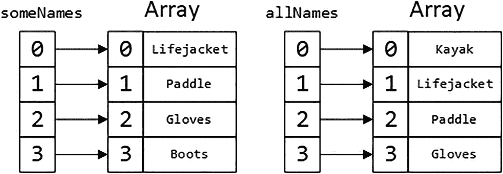

图 7-18：通过追加元素导致切片调整大小

调整大小的过程只复制切片映射的数组元素，这具有重新对齐切片和数组索引的效果。清单 7-22 中的代码在编译和执行后产生以下输出：

```
someNames: [Lifejacket Paddle Gloves Boots]
someNames len: 4 cap: 6
allNames [Kayak Lifejacket Paddle Gloves]
allNames len 4 cap: 4
```

### 从数组创建切片时指定容量

范围可以包含一个最大容量，这在一定程度上可以控制数组何时会被复制，如清单 7-23 所示。

```
package main
import "fmt"
func main() {
products := [4]string { "Kayak", "Lifejacket", "Paddle", "Hat"}
someNames := products[1:3:3]
allNames := products[:]
someNames = append(someNames, "Gloves")
//someNames = append(someNames, "Boots")
fmt.Println("someNames:", someNames)
fmt.Println("someNames len:", len(someNames), "cap:", cap(someNames))
fmt.Println("allNames", allNames)
fmt.Println("allNames len", len(allNames), "cap:", cap(allNames))
}
清单 7-23：在 collections 文件夹的 main.go 文件中指定切片容量

```

这个附加的值被称为*最大值*，在高位值之后指定，如图 7-19 所示，并且必须在被切片的数组边界内。

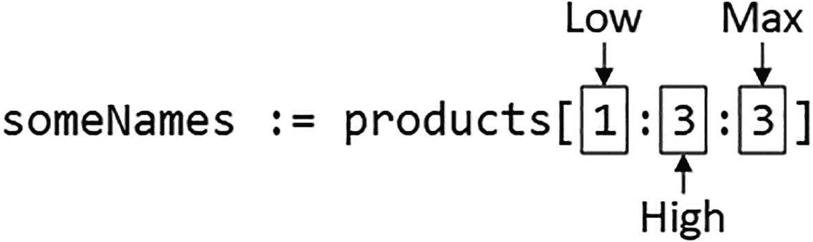

图 7-19：在范围中指定容量

最大值并不直接指定最大容量。相反，最大容量是通过从最大值中减去低位值来确定的。在示例中，最大值是`3`，低位值是`1`，这意味着容量将被限制为 2。结果是`append`操作导致切片调整大小并分配自己的数组，而不是在现有数组中扩展，这可以从清单 7-23 代码的输出中看出：

```
someNames: [Lifejacket Paddle Gloves]
someNames len: 3 cap: 4
allNames [Kayak Lifejacket Paddle Hat]
allNames len 4 cap: 4
```

切片调整大小意味着追加到`someNames`切片的`Gloves`值不会成为`allNames`切片映射的值之一。

### 从其他切片创建切片

切片也可以从其他切片创建，但如果它们被调整大小，切片之间的关系不会保留。为了说明这一点，清单 7-24 从一个切片创建了另一个切片。

```
package main
import "fmt"
func main() {
products := [4]string { "Kayak", "Lifejacket", "Paddle", "Hat"}
allNames := products[1:]
someNames := allNames[1:3]
allNames = append(allNames, "Gloves")
allNames[1] = "Canoe"
fmt.Println("someNames:", someNames)
fmt.Println("allNames", allNames)
}
清单 7-24：在 collections 文件夹的 main.go 文件中从切片创建切片

```

用于创建`someNames`切片的范围应用于`allNames`，它本身也是一个切片：

```
...
someNames := allNames[1:3]
...
```

这个范围创建了一个映射到`allNames`切片中第二个和第三个元素的切片。`allNames`切片是使用它自己的范围创建的：

```
...
allNames := products[1:]
...
```

这个范围创建了一个映射到源数组中除第一个元素之外的所有元素的切片。这些范围的效果是组合的，这意味着`someNames`切片将映射到数组中的第二个和第三个位置，如图 7-20 所示。

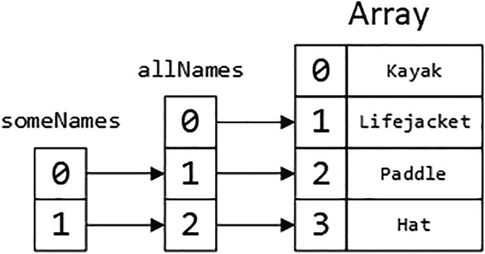

图 7-20：从切片创建切片

使用一个切片创建另一个切片是一种有效的方法，可以继承偏移起始位置，这正是图 7-19 所展示的。但请记住，切片本质上是数组部分的指针，这意味着它们不能指向另一个切片。实际上，范围用于确定由同一个数组支持的切片映射，如图 7-21 所示。

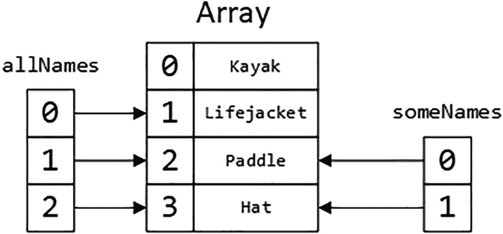

图 7-21：切片的实际排列

切片的行为与本章节中的其他示例一致：如果追加元素时没有可用容量，切片将被调整大小，此时它们将不再共享同一个数组。

### 使用`copy`函数

`copy`函数用于在切片之间复制元素。此函数可用于确保切片拥有独立的数组，以及创建组合来自不同源元素的切片。


#### 使用 `copy` 函数确保切片数组独立

`copy` 函数可用于复制现有切片，选择部分或全部元素，但确保新切片由其自有数组支持，如代码清单 7-25 所示。

```go
package main
import "fmt"
func main() {
products := [4]string { "Kayak", "Lifejacket", "Paddle", "Hat"}
allNames := products[1:]
someNames := make([]string, 2)
copy(someNames, allNames)
fmt.Println("someNames:", someNames)
fmt.Println("allNames", allNames)
}
代码清单 7-25
在 collections 文件夹的 main.go 文件中复制切片
```

`copy` 函数接受两个参数，即目标切片和源切片，如图 7-22 所示。

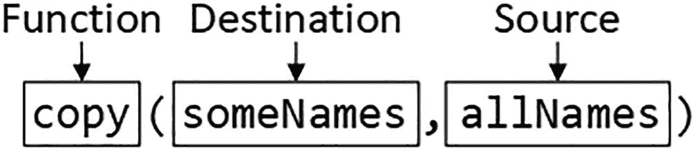

图 7-22

使用内置的 `copy` 函数

该函数将元素复制到目标切片。切片不必具有相同长度，因为 `copy` 函数只会在到达目标切片或源切片的末尾时停止复制。即使现有后备数组中有可用容量，目标切片的大小也不会调整，这意味着你必须确保它有足够的长度来容纳你想要复制的元素数量。

代码清单 7-25 中 `copy` 语句的效果是：元素从 `allNames` 切片中复制，直到 `someNames` 切片的长度被耗尽。编译并执行该代码清单将产生以下输出：

```go
someNames: [Lifejacket Paddle]
allNames [Lifejacket Paddle Hat]
```

`someNames` 切片的长度为 `2`，这意味着从 `allNames` 切片复制了两个元素。即使 `someNames` 切片有额外的容量，也不会复制更多元素，因为 `copy` 函数依赖的是切片的长度。

#### 理解未初始化切片的陷阱

正如我在上一节中所解释的，`copy` 函数不会调整目标切片的大小。一个常见的陷阱是试图将元素复制到尚未初始化的切片中，如代码清单 7-26 所示。

```go
package main
import "fmt"
func main() {
products := [4]string { "Kayak", "Lifejacket", "Paddle", "Hat"}
allNames := products[1:]
var someNames []string
copy(someNames, allNames)
fmt.Println("someNames:", someNames)
fmt.Println("allNames", allNames)
}
代码清单 7-26
在 collections 文件夹的 main.go 文件中将元素复制到未初始化的切片
```

我用一条定义了 `someNames` 变量但未初始化的语句，替换了使用 `make` 函数初始化 `someNames` 切片的语句。这段代码可以编译并执行，不会报错，但会产生以下结果：

```go
someNames: []
allNames [Lifejacket Paddle Hat]
```

没有元素被复制到目标切片。发生这种情况是因为未初始化的切片长度和容量都为零。当到达目标切片的长度时，`copy` 函数会停止复制，由于长度为零，因此不会发生任何复制操作。没有报告错误，因为 `copy` 函数按预期方式工作，但这很少是预期的效果，如果你遇到切片意外为空的情况，这很可能是原因。

#### 复制切片时指定范围

可以使用范围对要复制的元素进行精细控制，如代码清单 7-27 所示。

```go
package main
import "fmt"
func main() {
products := [4]string { "Kayak", "Lifejacket", "Paddle", "Hat"}
allNames := products[1:]
someNames := []string { "Boots", "Canoe"}
copy(someNames[1:], allNames[2:3])
fmt.Println("someNames:", someNames)
fmt.Println("allNames", allNames)
}
代码清单 7-27
在 collections 文件夹的 main.go 文件中使用范围复制元素
```

应用于目标切片的范围意味着复制的元素将从位置 1 开始。应用于源切片的范围意味着复制将从位置 2 的元素开始，并且将复制一个元素。编译并执行代码清单 7-27 中的代码将产生以下输出：

```go
someNames: [Boots Hat]
allNames [Lifejacket Paddle Hat]
```

#### 复制不同大小的切片

导致“理解未初始化切片的陷阱”一节中所述问题的行为允许复制不同大小的切片，只要记得初始化它们即可。如果目标切片比源切片大，那么复制将继续，直到源切片中的最后一个元素被复制，如代码清单 7-28 所示。

```go
package main
import "fmt"
func main() {
products := []string { "Kayak", "Lifejacket", "Paddle", "Hat"}
replacementProducts := []string { "Canoe", "Boots"}
copy(products, replacementProducts)
fmt.Println("products:", products)
}
代码清单 7-28
在 collections 文件夹的 main.go 文件中复制较小的源切片
```

源切片仅包含两个元素，并且未使用范围。结果是 `copy` 函数开始将元素从 `replacementProducts` 切片复制到 `products` 切片，并在到达 `replacementProducts` 切片的末尾时停止。`products` 切片中的其余元素不受复制操作影响，如示例输出所示：

```go
products: [Canoe Boots Paddle Hat]
```

如果目标切片比源切片小，那么复制将继续，直到目标切片中的所有元素都被替换，如代码清单 7-29 所示。

```go
package main
import "fmt"
func main() {
products := []string { "Kayak", "Lifejacket", "Paddle", "Hat"}
replacementProducts := []string { "Canoe", "Boots"}
copy(products[0:1], replacementProducts)
fmt.Println("products:", products)
}
代码清单 7-29
在 collections 文件夹的 main.go 文件中复制较大的源切片
```

用于目标切片范围的切片长度为 1，这意味着只会从源数组复制一个元素，如示例输出所示：

```go
products: [Canoe Lifejacket Paddle Hat]
```

### 删除切片元素

没有用于删除切片元素的内置函数，但可以使用范围和 `append` 函数执行此操作，如代码清单 7-30 所示。

```go
package main
import "fmt"
func main() {
products := [4]string { "Kayak", "Lifejacket", "Paddle", "Hat"}
deleted := append(products[:2], products[3:]...)
fmt.Println("Deleted:", deleted)
}
代码清单 7-30
在 collections 文件夹的 main.go 文件中删除切片元素
```

要删除一个值，可使用 `append` 方法组合两个范围，这两个范围包含切片中除不再需要的元素之外的所有元素。编译并执行代码清单 7-30 将产生以下输出：

```go
Deleted: [Kayak Lifejacket Hat]
```


### 枚举切片

切片的枚举方式与数组相同，使用`for`和`range`关键字，如代码清单 7-31 所示。

```go
package main
import "fmt"
func main() {
products := []string { "Kayak", "Lifejacket", "Paddle", "Hat"}
for index, value := range products[2:] {
fmt.Println("Index:", index, "Value:", value)
}
}
```

我在代码清单 7-31 中描述了`for`循环的不同使用方式，但当与`range`关键字结合时，`for`关键字可以枚举切片，为每个元素生成`index`和`value`变量。代码清单 7-31 中的代码将输出以下内容：

```
Index: 0 Value: Paddle
Index: 1 Value: Hat
```

### 排序切片

切片没有内置的排序支持，但标准库包含`sort`包，该包定义了用于对不同类型切片进行排序的函数。`sort`包将在第 18 章中详细描述，但代码清单 7-32 演示了一个简单示例，为本章提供一些背景。

```go
package main
import (
"fmt"
"sort"
)
func main() {
products := []string { "Kayak", "Lifejacket", "Paddle", "Hat"}
sort.Strings(products)
for index, value := range products {
fmt.Println("Index:", index, "Value:", value)
}
}
```

`Strings`函数对`[]string`中的值进行原地排序，当示例编译并执行时，将产生以下结果：

```
Index: 0 Value: Hat
Index: 1 Value: Kayak
Index: 2 Value: Lifejacket
Index: 3 Value: Paddle
```

正如第 18 章所解释的，`sort`包包含对包含整数和字符串的切片进行排序的函数，并支持对自定义数据类型进行排序。

### 比较切片

Go 限制使用比较运算符，因此切片只能与`nil`值进行比较。比较两个切片会产生错误，代码清单 7-33 将演示这一点。

```go
package main
import (
"fmt"
//"sort"
)
func main() {
p1 := []string { "Kayak", "Lifejacket", "Paddle", "Hat"}
p2 := p1
fmt.Println("Equal:", p1 == p2)
}
```

当编译此代码时，会产生以下错误：

```
.\main.go:13:30: invalid operation: p1 == p2 (slice can only be compared to nil)
```

然而，有一种方法可以比较切片。标准库包含一个名为`reflect`的包，其中包含一个名为`DeepEqual`的便捷函数。`reflect`包在第 27 章至第 29 章中描述，并包含高级特性（这就是为什么需要三章来描述其提供的特性）。`DeepEqual`函数可用于比较比相等运算符更广泛的数据类型，包括切片，如代码清单 7-34 所示。

```go
package main
import (
"fmt"
"reflect"
)
func main() {
p1 := []string { "Kayak", "Lifejacket", "Paddle", "Hat"}
p2 := p1
fmt.Println("Equal:", reflect.DeepEqual(p1, p2))
}
```

`DeepEqual`函数很方便，但在你自己的项目中用它之前，你应该阅读描述`reflect`包的章节以了解其工作原理。该清单在编译并执行时将产生以下输出：

```
Equal: true
```

### 获取切片底层的数组

如果你有一个切片但需要一个数组（通常是因为某个函数需要数组作为参数），你可以对切片执行显式转换，如代码清单 7-35 所示。

```go
package main
import (
"fmt"
//"reflect"
)
func main() {
p1 := []string { "Kayak", "Lifejacket", "Paddle", "Hat"}
arrayPtr := (*[3]string)(p1)
array := *arrayPtr
fmt.Println(array)
}
```

我分两步完成了这个任务。第一步是对`[]string`切片执行显式类型转换，转换为`*[3]string`。在指定数组类型时必须小心，因为如果数组所需的元素数量超过切片的长度，则会发生错误。数组的长度可以小于切片的长度，在这种情况下，数组将不包含所有切片的值。在这个例子中，切片中有四个值，而我指定了一个可以存储三个值的数组类型，这意味着数组将只包含前三个切片值。

在第二步中，我跟随指针获取数组值，然后将其打印出来。代码清单 7-35 中的代码在编译并执行时产生以下输出：

```
[Kayak Lifejacket Paddle]
```

## 使用映射

映射是一种内建的数据结构，它将数据值与键关联起来。与数组将值与顺序的整数位置关联不同，映射可以使用其他数据类型作为键，如代码清单 7-36 所示。

```go
package main
import "fmt"
func main() {
products := make(map[string]float64, 10)
products["Kayak"] = 279
products["Lifejacket"] = 48.95
fmt.Println("Map size:", len(products))
fmt.Println("Price:", products["Kayak"])
fmt.Println("Price:", products["Hat"])
}
```

映射使用内建的`make`函数创建，就像切片一样。映射的类型使用`map`关键字指定，后跟方括号中的键类型，再后跟值类型，如图 7-23 所示。`make`函数的最后一个参数指定了映射的初始容量。映射和切片一样，会自动调整大小，并且可以省略大小参数。

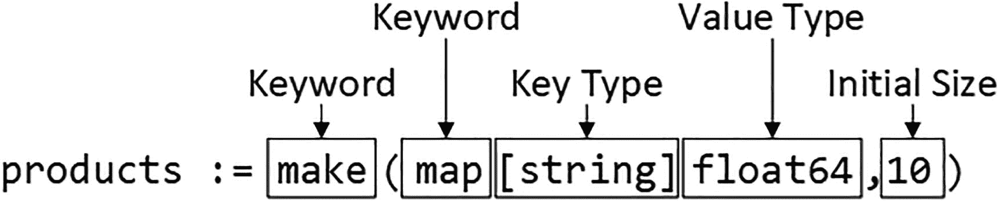

图 7-23：定义映射

代码清单 7-36 中的语句将存储`float64`值，这些值使用`string`键进行索引。使用类似数组的语法将值存储到映射中，但指定的是键而不是位置，如下所示：

```
...
products["Kayak"] = 279
...
```

此语句使用键`Kayak`存储`float64`值。使用相同的语法从映射中读取值：

```
...
fmt.Println("Price:", products["Kayak"])
...
```

如果映射包含指定的键，则返回与该键关联的值。如果映射不包含该键，则返回映射值类型的零值。使用内建的`len`函数获取映射中存储的项目数量，如下所示：

```
...
fmt.Println("Map size:", len(products))
...
```

代码清单 7-36 中的代码在编译并执行时产生以下输出：

```
Map size: 2
Price: 279
Price: 0
```


### 使用映射字面量语法

切片也可以使用字面量语法来定义，如代码清单 7-37 所示。

```
package main
import "fmt"
func main() {
products := map[string]float64 {
"Kayak" : 279,
"Lifejacket": 48.95,
}
fmt.Println("Map size:", len(products))
fmt.Println("Price:", products["Kayak"])
fmt.Println("Price:", products["Hat"])
}
Listing 7-37
在 collections 文件夹的 main.go 文件中使用映射字面量语法
```

字面量语法在大括号之间指定映射的初始内容。每个映射条目使用键、冒号、值，然后逗号来指定，如图 7-24 所示。

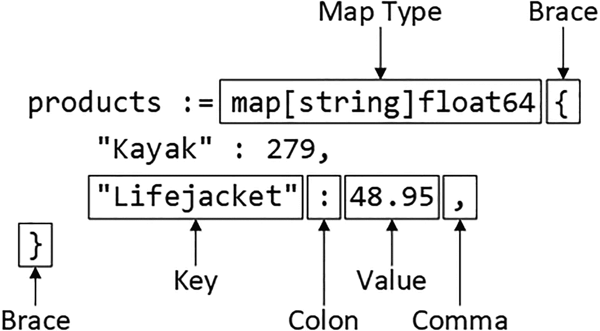

图 7-24  
映射字面量语法

Go 对语法很讲究，如果映射值后面没有逗号或结束大括号，就会产生错误。我更倾向于使用尾随逗号，这样可以将结束大括号放在代码文件的下一行。

字面量语法中使用的键必须是唯一的，如果两个字面量条目使用了相同的名称，编译器会报错。编译并执行代码清单 7-37 会产生以下输出：

```
Map size: 2
Price: 279
Price: 0
```

### 检查映射中的元素

如前所述，当读取没有对应键的值时，映射会返回值类型的零值。这可能使得难以区分存储的值恰好是零值还是键不存在，如代码清单 7-38 所示。

```
package main
import "fmt"
func main() {
products := map[string]float64 {
"Kayak" : 279,
"Lifejacket": 48.95,
"Hat": 0,
}
fmt.Println("Hat:", products["Hat"])
}
Listing 7-38
在 collections 文件夹的 main.go 文件中读取映射值
```

这段代码的问题在于 `products["Hat"]` 返回零，但不知道这是因为零是存储的值，还是因为没有与键 `Hat` 相关联的值。为了解决这个问题，映射在读取值时会产生两个值，如代码清单 7-39 所示。

```
package main
import "fmt"
func main() {
products := map[string]float64 {
"Kayak" : 279,
"Lifejacket": 48.95,
"Hat": 0,
}
value, ok := products["Hat"]
if (ok) {
fmt.Println("Stored value:", value)
} else {
fmt.Println("No stored value")
}
}
Listing 7-39
在 collections 文件夹的 main.go 文件中判断映射中是否存在值
```

这被称为“逗号 ok”技巧，即从映射中读取值时，将值赋给两个变量：

```
...
value, ok := products["Hat"]
...
```

第一个值要么是与指定键关联的值，要么是键不存在时的零值。第二个值是 `bool` 类型，如果映射包含指定键则为 `true`，否则为 `false`。第二个值通常赋给名为 `ok` 的变量，这就是“逗号 ok”这个术语的由来。

此技巧可以使用初始化语句进行简化，如代码清单 7-40 所示。

```
package main
import "fmt"
func main() {
products := map[string]float64 {
"Kayak" : 279,
"Lifejacket": 48.95,
"Hat": 0,
}
if value, ok := products["Hat"]; ok {
fmt.Println("Stored value:", value)
} else {
fmt.Println("No stored value")
}
}
Listing 7-40
在 collections 文件夹的 main.go 文件中使用初始化语句
```

编译并执行代码清单 7-39 和 7-40 中的代码会产生以下输出，表明键 `Hat` 在映射中存储了值 `0`：

```
Stored value: 0
```

### 从映射中删除元素

使用内置的 `delete` 函数从映射中删除元素，如代码清单 7-41 所示。

```
package main
import "fmt"
func main() {
products := map[string]float64 {
"Kayak" : 279,
"Lifejacket": 48.95,
"Hat": 0,
}
delete(products, "Hat")
if value, ok := products["Hat"]; ok {
fmt.Println("Stored value:", value)
} else {
fmt.Println("No stored value")
}
}
Listing 7-41
在 collections 文件夹的 main.go 文件中从映射中删除元素
```

`delete` 函数的参数是映射和要删除的键。如果指定的键不在映射中，不会报错。编译并执行代码清单 7-41 中的代码会产生以下输出，确认 `Hat` 键已不在映射中：

```
No stored value
```

### 枚举映射的内容

使用 `for` 和 `range` 关键字来枚举映射，如代码清单 7-42 所示。

```
package main
import "fmt"
func main() {
products := map[string]float64 {
"Kayak" : 279,
"Lifejacket": 48.95,
"Hat": 0,
}
for key, value := range products {
fmt.Println("Key:", key, "Value:", value)
}
}
Listing 7-42
在 collections 文件夹的 main.go 文件中枚举映射
```

当 `for` 和 `range` 关键字与映射一起使用时，两个变量会在枚举映射内容时被赋予键和值。编译并执行代码清单 7-42 中的代码会产生以下输出（尽管它们的顺序可能不同，我将在下一节解释）：

```
Key: Kayak Value: 279
Key: Lifejacket Value: 48.95
Key: Hat Value: 0
```

#### 按顺序枚举映射

你可能会看到代码清单 7-42 的结果顺序不同，因为无法保证映射的内容会按任何特定顺序被枚举。如果你想按顺序获取映射中的值，最好的方法是枚举映射并创建一个包含键的切片，对切片进行排序，然后枚举切片以从映射中读取值，如代码清单 7-43 所示。

```
package main
import (
"fmt"
"sort"
)
func main() {
products := map[string]float64 {
"Kayak" : 279,
"Lifejacket": 48.95,
"Hat": 0,
}
keys := make([]string, 0, len(products))
for key, _ := range products {
keys = append(keys, key)
}
sort.Strings(keys)
for _, key := range keys {
fmt.Println("Key:", key, "Value:", products[key])
}
}
Listing 7-43
在 collections 文件夹的 main.go 文件中按键顺序枚举映射
```

编译并执行项目，你将看到以下输出，显示按键排序的值：

```
Key: Hat Value: 0
Key: Kayak Value: 279
Key: Lifejacket Value: 48.95
```


### 理解字符串的双重本质

在第 4 章中，我将字符串描述为字符序列。这一说法是正确的，但实际情况更为复杂，因为 Go 语言的字符串具有双重人格，具体表现取决于你如何使用它们。

Go 语言将字符串视为字节数组，并支持数组索引和切片范围表示法，如代码清单 7-44 所示。

```
package main
import (
"fmt"
"strconv"
)
func main() {
var price string = "$48.95"
var currency byte = price[0]
var amountString string = price[1:]
amount, parseErr  := strconv.ParseFloat(amountString, 64)
fmt.Println("Currency:", currency)
if (parseErr == nil) {
fmt.Println("Amount:", amount)
} else {
fmt.Println("Parse Error:", parseErr)
}
}
代码清单 7-44
collections 文件夹中的 main.go 文件中对字符串进行索引和切片
```

我使用了完整的变量声明语法来强调每个变量的类型。当使用索引表示法时，结果是从字符串指定位置取出的一个 `byte`：

```
...
var currency byte = price[0]
...
```

该语句选择位置为零处的 `byte` 并将其赋值给名为 `currency` 的变量。当对 `string` 进行切片时，切片也是以字节为单位描述的，但结果是 `string`：

```
...
var amountString string = price[1:]
...
```

该范围选取除位置零处的 `byte` 之外的所有字节，并将缩短后的字符串赋值给名为 `amountString` 的变量。使用代码清单 7-44 所示的命令编译并执行此代码，将生成以下输出：

```
Currency: 36
Amount: 48.95
```

正如我在第 4 章中解释的那样，`byte` 类型是 `uint8` 的别名，这就是为什么 `currency` 的值显示为数字的原因：Go 语言并不知道数值 `36` 应表示为美元符号。图 7-25 展示了作为字节数组的 `string`，并说明了如何对其进行索引和切片。

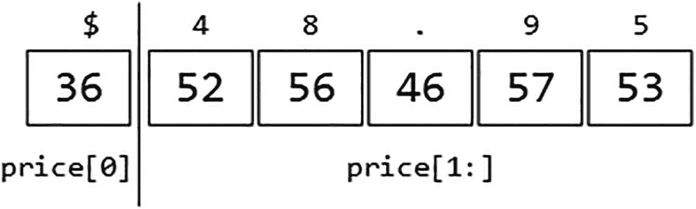

图 7-25

作为字节数组的字符串

对字符串进行切片会生成另一个字符串，但需要显式转换才能将 `byte` 解释为其所代表的字符，如代码清单 7-45 所示。

```
package main
import (
"fmt"
"strconv"
)
func main() {
var price string = "$48.95"
var currency string = string(price[0])
var amountString string = price[1:]
amount, parseErr  := strconv.ParseFloat(amountString, 64)
fmt.Println("Currency:", currency)
if (parseErr == nil) {
fmt.Println("Amount:", amount)
} else {
fmt.Println("Parse Error:", parseErr)
}
}
代码清单 7-45
collections 文件夹中的 main.go 文件中转换结果
```

编译并执行代码，你将看到以下结果：

```
Currency: $
Amount: 48.95
```

这看起来是有效的，但其中包含一个陷阱，如果更改货币符号，就可以发现这个问题，如代码清单 7-46 所示。（如果你所在的地区键盘上没有欧元货币符号，请按住 `Alt` 键，然后在数字小键盘上按 `0128`。）

```
package main
import (
"fmt"
"strconv"
)
func main() {
var price string = "€48.95"
var currency string = string(price[0])
var amountString string = price[1:]
amount, parseErr  := strconv.ParseFloat(amountString, 64)
fmt.Println("Currency:", currency)
if (parseErr == nil) {
fmt.Println("Amount:", amount)
} else {
fmt.Println("Parse Error:", parseErr)
}
}
代码清单 7-46
collections 文件夹中的 main.go 文件中更改货币符号
```

编译并执行代码，你将看到类似如下的输出：

```
Currency: â
Parse Error: strconv.ParseFloat: parsing "\x82\xac48.95": invalid syntax
```

问题在于，数组和范围表示法选取的是字节，但并非所有字符都只用一个字节表示。新的货币符号使用三个字节存储，如图 7-26 所示。

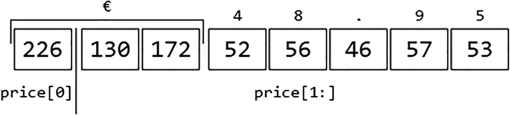

图 7-26

更改货币符号

该图显示了仅获取单个 `byte` 值如何只能获得货币符号的一部分。它还显示了切片包含了该货币符号三个字节中的两个，后面跟着字符串的其余部分。你可以使用 `len` 函数确认货币符号的更改增加了数组的大小，如代码清单 7-47 所示。

```
package main
import (
"fmt"
"strconv"
)
func main() {
var price string = "€48.95"
var currency string = string(price[0])
var amountString string = price[1:]
amount, parseErr  := strconv.ParseFloat(amountString, 64)
fmt.Println("Length:", len(price))
fmt.Println("Currency:", currency)
if (parseErr == nil) {
fmt.Println("Amount:", amount)
} else {
fmt.Println("Parse Error:", parseErr)
}
}
代码清单 7-47
collections 文件夹中的 main.go 文件中获取字符串长度
```

`len` 函数将字符串视为字节数组，代码清单 7-47 中的代码编译并执行后，会生成以下输出：

```
Length: 8
Currency: â
Parse Error: strconv.ParseFloat: parsing "\x82\xac48.95": invalid syntax
```

输出证实该字符串中有八个字节，这就是索引和切片产生奇怪结果的原因。


#### 将字符串转换为 Rune

`rune` 类型表示一个 Unicode 码点，本质上等同于单个字符。为了避免在字符中间切割字符串，可以执行显式转换为 `rune` 切片，如代码清单 7-48 所示。

**提示**  
Unicode 极其复杂，这在任何试图描述跨越数千年演变的多种书写系统的标准中都是意料之中的。本书不会详细描述 Unicode，为简单起见，我将 `rune` 值视为单个字符，这对大多数开发项目来说已经足够。我会对 Unicode 进行充分说明，以解释 Go 特性的工作原理。

```go
package main
import (
    "fmt"
    "strconv"
)
func main() {
    var price []rune = []rune("€48.95")
    var currency string = string(price[0])
    var amountString string = string(price[1:])
    amount, parseErr := strconv.ParseFloat(amountString, 64)
    fmt.Println("Length:", len(price))
    fmt.Println("Currency:", currency)
    if (parseErr == nil) {
        fmt.Println("Amount:", amount)
    } else {
        fmt.Println("Parse Error:", parseErr)
    }
}
```

*代码清单 7-48：在 `collections` 文件夹的 `main.go` 文件中转换为 Rune*

我对字面量字符串应用了显式转换，并将切片赋值给 `price` 变量。当处理 `rune` 切片时，各个字节会被分组到它们所表示的字符中，而无需关心每个字符需要多少个字节，如图 7-27 所示。

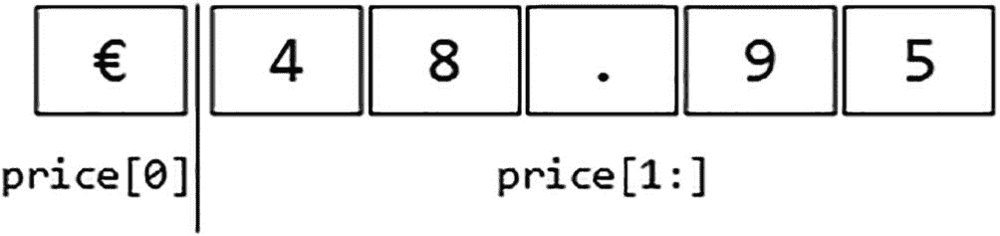

*图 7-27：一个 rune 切片*

如第 4 章所述，`rune` 类型是 `int32` 的别名，这意味着打印 `rune` 值时会显示用于表示该字符的数值。这意味着，与之前的 `byte` 示例类似，我必须将单个 `rune` 显式转换为 `string`，如下所示：

```go
...
var currency string = string(price[0])
...
```

但是，与之前的示例不同，我还必须对创建的切片执行显式转换，如下所示：

```go
...
var amountString string = string(price[1:])
...
```

切片的结果类型是 `[]rune`；换句话说，对 `rune` 切片进行切片会得到另一个 `rune` 切片。编译并执行代码清单 7-48 中的代码，将产生以下输出：

```
Length: 6
Currency: €
Amount: 48.95
```

`len` 函数返回 `6`，因为该数组包含的是字符，而非字节。当然，其余输出也符合预期，因为没有孤立的字节来影响结果。

**理解为什么字节和 Rune 都有用**  
Go 处理字符串的方式可能看起来有些奇怪，但它有其用途。当你关心如何存储字符串并需要知道分配多少空间时，字节很重要。当你关注字符串的内容时（例如在现有字符串中插入新字符），字符就很重要。字符串的这两个方面都很重要。然而，理解对于任何给定操作，你需要处理的是字节还是字符至关重要。

你可能会倾向于只使用字节，只要只使用那些由单个字节表示的字符（通常是 ASCII 字符），这就能正常工作。这在最初可能可行，但几乎总是以糟糕的结局收场，特别是当你的代码处理用户输入的非 ASCII 字符集或处理包含非 ASCII 数据的文件时。只需额外做少量工作，接受 Unicode 确实存在并依赖 Go 来处理字节到字符的转换，会更简单也更安全。

#### 枚举字符串

`for` 循环可用于枚举字符串的内容。这个特性展示了 Go 在处理字节到 rune 的映射方面的一些巧妙之处。代码清单 7-49 枚举了一个字符串。

```go
package main
import (
    "fmt"
    //"strconv"
)
func main() {
    var price = "€48.95"
    for index, char := range price {
        fmt.Println(index, char, string(char))
    }
}
```

*代码清单 7-49：在 `collections` 文件夹的 `main.go` 文件中枚举字符串*

我在本例中使用了一个包含欧元货币符号的字符串，这演示了当与 `for` 循环一起使用时，Go 将字符串视为 rune 序列。编译并执行代码清单 7-49 中的代码，你将看到以下输出：

```
0 8364 €
3 52 4
4 56 8
5 46 .
6 57 9
7 53 5
```

`for` 循环将字符串视作元素数组。输出的值分别是当前元素的索引、该元素的数值以及将该数值转换成的 `string`。

请注意，`index` 值不是连续的。`for` 循环将字符串处理为从底层字节序列派生出的字符序列。索引值对应于构成每个字符的第一个字节，如图 7-2 所示。例如，第二个索引值是 `3`，因为字符串中的第一个字符由位置 `0`、`1` 和 `2` 的字节组成。

如果你想枚举底层字节而不将它们转换为字符，则可以执行显式转换为 `byte` 切片，如代码清单 7-50 所示。

```go
package main
import (
    "fmt"
    //"strconv"
)
func main() {
    var price = "€48.95"
    for index, char := range []byte(price) {
        fmt.Println(index, char)
    }
}
```

*代码清单 7-50：在 `collections` 文件夹的 `main.go` 文件中枚举字符串中的字节*

使用代码清单 7-50 所示的命令编译并执行此代码，你将看到以下输出：

```
0 226
1 130
2 172
3 52
4 56
5 46
6 57
7 53
```

索引值是连续的，并且显示的是单个字节的值，而不会将其解释为它们所表示的字符的一部分。

## 总结

在本章中，我介绍了 Go 的集合类型。我解释了数组是固定长度的值序列，切片是由数组支持的变长序列，而映射是键值对的集合。我演示了如何使用范围来选择元素，解释了切片与其底层数组之间的关系，并向你展示了如何执行常见任务（例如从切片中删除元素），对于这些任务，Go 没有内置的特性。本章最后，我解释了字符串的复杂性质，这可能会给那些假设所有字符都可以用单个字节数据来表示的程序员带来问题。在下一章中，我将讲解 Go 中函数的使用。


# 定义与使用函数

本章将介绍 Go 语言中的函数，它们能将代码语句组合在一起，并在需要时执行。Go 函数具有一些不寻常的特性，其中最有用的是能够定义多个返回值。正如我将要解释的，这是对函数常见问题的一个优雅解决方案。表 8-1 对函数进行了概述。

**表 8-1** 函数概述

| 问题 | 答案 |
| --- | --- |
| 什么是函数？ | 函数是一组代码语句，仅在程序执行流程中调用该函数时才执行。 |
| 为什么它们有用？ | 函数允许将功能定义一次并重复使用。 |
| 如何使用它们？ | 通过函数名调用函数，并且可以通过参数向函数提供要处理的数据值。函数中语句的执行结果可以作为函数结果产生。 |
| 是否存在任何陷阱或局限性？ | Go 函数的行为大体符合预期，并增加了诸如多返回值和命名返回值等有用的特性。 |
| 是否有替代方案？ | 没有，函数是 Go 语言的核心特性。 |

表 8-2 总结了本章内容。

**表 8-2** 章节总结

| 问题 | 解决方案 | 清单 |
| --- | --- | --- |
| 分组语句以便按需执行 | 定义一个函数 | 4 |
| 定义一个函数，使其包含的语句所使用的值可以改变 | 定义函数参数 | 5–8 |
| 允许函数接受可变数量的参数 | 定义一个可变参数 | 9–13 |
| 使用在函数外部定义的值的引用 | 定义接受指针的参数 | 14, 15 |
| 从函数中定义的语句产生输出 | 定义一个或多个结果 | 16–22 |
| 丢弃函数产生的结果 | 使用空白标识符 | 23 |
| 安排一个函数在当前执行的函数完成时被调用 | 使用 `defer` 关键字 | 24 |

## 本章准备

为准备本章内容，请打开一个新的命令提示符，导航到一个方便的位置，创建一个名为 `functions` 的目录。导航到 `functions` 文件夹，并运行清单 8-1 中所示的命令来初始化项目。

> **提示：** 你可以从 [`https://github.com/apress/pro-go`](https://github.com/apress/pro-go) 下载本章以及本书所有其他章节的示例项目。如果在运行示例时遇到问题，请参阅第 2 章了解如何获取帮助。

```
go mod init functions
```
*清单 8-1* 初始化项目

在 `functions` 文件夹中添加一个名为 `main.go` 的文件，其内容如清单 8-2 所示。

```
package main
import "fmt"
func main() {
fmt.Println("Hello, Functions")
}
```
*清单 8-2* `functions` 文件夹中 `main.go` 文件的内容

使用命令提示符在 `functions` 文件夹中运行清单 8-3 所示的命令。

```
go run .
```
*清单 8-3* 运行示例项目

`main.go` 文件中的代码将被编译并执行，产生以下输出：

```
Hello, Functions
```

## 定义一个简单函数

函数是作为单个动作被使用和重用的语句组。作为开端，清单 8-4 定义了一个简单的函数。

```
package main
import "fmt"
func printPrice() {
kayakPrice := 275.00
kayakTax := kayakPrice * 0.2
fmt.Println("Price:", kayakPrice, "Tax:", kayakTax)
}
func main() {
fmt.Println("About to call function")
printPrice()
fmt.Println("Function complete")
}
```
*清单 8-4* 在 `functions` 文件夹的 `main.go` 文件中定义一个函数

函数由 `func` 关键字定义，后跟函数名、圆括号以及用大括号括起的代码块，如图 8-1 所示。

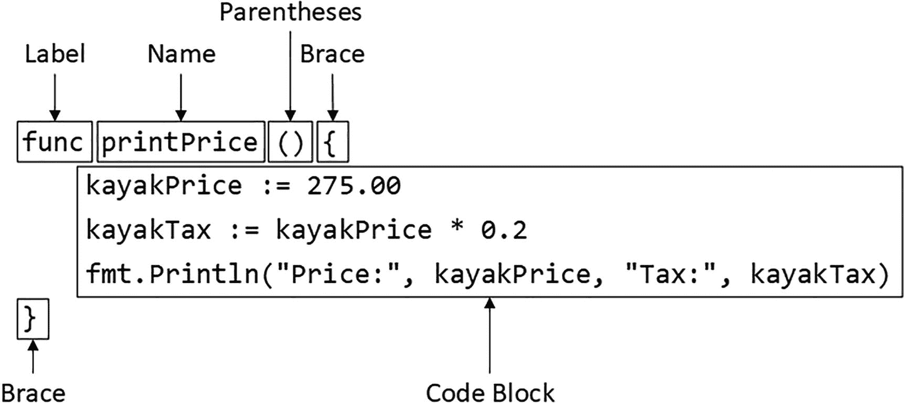

**图 8-1** 函数结构剖析

现在 `main.go` 代码文件中有了两个函数。新函数名为 `printPrice`，它包含定义两个变量并调用 `fmt` 包中 `Println` 函数的语句。`main` 函数是应用程序的入口点，执行在此开始和结束。Go 函数必须使用大括号定义，并且左大括号必须定义在 `func` 关键字和函数名的同一行。其他语言中常见的惯例，例如省略大括号或将大括号放在下一行，是不允许的。

> **注意：** 请注意 `printPrice` 函数是与 `main.go` 文件中已有的 `main` 函数一起定义的。Go 确实支持在其他函数内部定义函数，但需要使用不同的语法，这将在第 9 章中描述。

`main` 函数调用 `printPrice` 函数，这是通过一条指定函数名后跟圆括号的语句完成的，如图 8-2 所示。

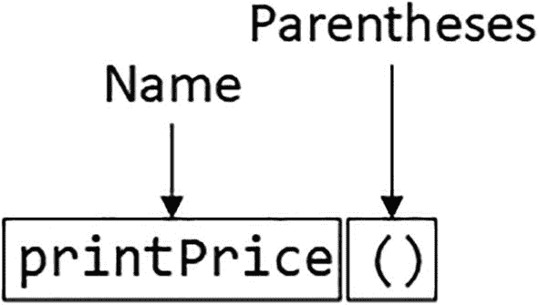

**图 8-2** 调用函数

当函数被调用时，函数代码块中包含的语句将被执行。当所有语句执行完毕，程序继续执行调用该函数语句之后的下一条语句。这可以从清单 8-4 中的代码被编译和执行时产生的输出中看到：

```
About to call function
Price: 275 Tax: 55
Function complete
```


### 定义与使用函数参数

参数允许函数在被调用时接收数据值，从而改变其行为。清单 8-5 修改了上一节中定义的 `printPrice` 函数，使其定义了参数。

```
package main
import "fmt"
func printPrice(product string, price float64, taxRate float64) {
taxAmount := price * taxRate
fmt.Println(product, "price:", price, "Tax:", taxAmount)
}
func main() {
printPrice("Kayak", 275, 0.2)
printPrice("Lifejacket", 48.95, 0.2)
printPrice("Soccer Ball", 19.50, 0.15)
}
Listing 8-5
Defining Function Parameters in the main.go File in the functions Folder
```

参数通过名称后跟类型来定义。多个参数用逗号分隔，如图 8-3 所示。

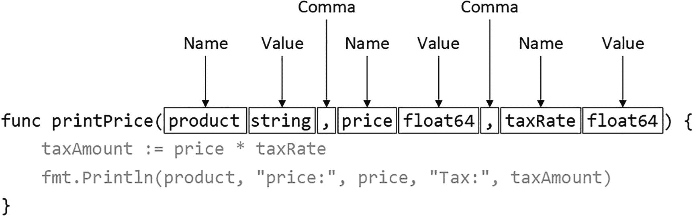

Figure 8-3

Defining function parameters

清单 8-5 为 `printPrice` 函数添加了三个参数：一个名为 `product` 的 `string`，一个名为 `price` 的 `float64`，以及一个名为 `taxRate` 的 `float64`。在函数的代码块内，通过参数名称访问其对应的值，如图 8-4 所示。

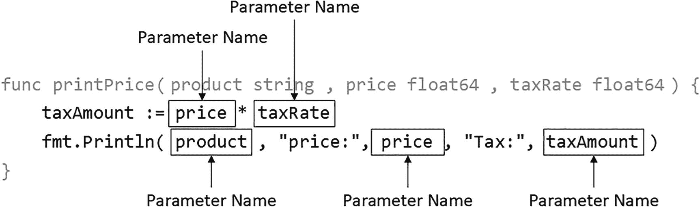

Figure 8-4

Accessing a parameter inside a code block

在调用函数时，参数的值作为实参提供，这意味着每次调用函数时都可以提供不同的值。实参放在函数名后的括号内，用逗号分隔，并且顺序与参数定义的顺序一致，如图 8-5 所示。

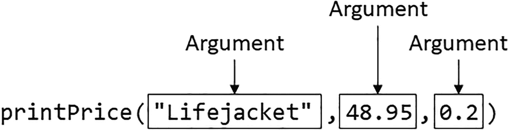

Figure 8-5

Invoking a function with arguments

用作实参的值必须与函数定义的参数类型相匹配。编译并执行清单 8-5 中的代码将产生以下输出：

```
Kayak price: 275 Tax: 55
Lifejacket price: 48.95 Tax: 9.790000000000001
Soccer Ball price: 19.5 Tax: 2.925
```

`Lifejacket` 产品显示的值包含一个长小数部分，对于货币金额通常需要进行四舍五入。我将在第 17 章中解释如何将数字值格式化为字符串。

**注意：** Go 不支持可选参数或参数的默认值。

## 省略参数类型

当相邻参数具有相同类型时，可以省略其类型，如清单 8-6 所示。

```
package main
import "fmt"
func printPrice(product string, price, taxRate float64) {
taxAmount := price * taxRate
fmt.Println(product, "price:", price, "Tax:", taxAmount)
}
func main() {
printPrice("Kayak", 275, 0.2)
printPrice("Lifejacket", 48.95, 0.2)
printPrice("Soccer Ball", 19.50, 0.15)
}
Listing 8-6
Omitting the Parameter Data Type in the main.go File in the functions Folder
```

`price` 和 `taxRate` 参数都是 `float64` 类型，并且由于它们相邻，因此该数据类型仅应用于该类型中的最后一个参数。省略参数的数据类型不会改变参数或其类型。清单 8-6 中的代码产生以下输出：

```
Kayak price: 275 Tax: 55
Lifejacket price: 48.95 Tax: 9.790000000000001
Soccer Ball price: 19.5 Tax: 2.925
```

## 省略参数名称

下划线（`_` 字符）可以用于函数已定义但未在函数代码语句中使用的参数，如清单 8-7 所示。

```
package main
import "fmt"
func printPrice(product string, price, _ float64) {
taxAmount := price * 0.25
fmt.Println(product, "price:", price, "Tax:", taxAmount)
}
func main() {
printPrice("Kayak", 275, 0.2)
printPrice("Lifejacket", 48.95, 0.2)
printPrice("Soccer Ball", 19.50, 0.15)
}
Listing 8-7
Omitting a Parameter Name in the main.go File in the functions Folder
```

下划线被称为*空白标识符*，其结果是定义一个参数：调用函数时必须为其提供一个值，但无法在函数的代码块内访问其值。这听起来可能像一个奇怪的功能，但它是一种很有用的方式，可以用来指示某个参数在函数内部未被使用——这在实现接口所需的方法时可能会出现。编译并执行清单 8-7 中的代码将产生以下输出：

```
Kayak price: 275 Tax: 68.75
Lifejacket price: 48.95 Tax: 12.2375
Soccer Ball price: 19.5 Tax: 4.875
```

函数也可以省略其所有参数的名称，如清单 8-8 所示。

```
package main
import "fmt"
func printPrice(string, float64, float64) {
// taxAmount := price * 0.25
fmt.Println("No parameters")
}
func main() {
printPrice("Kayak", 275, 0.2)
printPrice("Lifejacket", 48.95, 0.2)
printPrice("Soccer Ball", 19.50, 0.15)
}
Listing 8-8
Omitting All Parameter Names in the main.go File in the functions Folder
```

没有名称的参数无法在函数内部访问，此功能主要与接口（将在第 11 章中描述）结合使用，或者在定义函数类型（将在第 9 章中描述）时使用。编译并执行清单 8-8 中的代码将产生以下输出：

```
No parameters
No parameters
No parameters
```


### 定义可变参数

可变参数可以接受数量不定的值，这能让函数更易于使用。为了理解可变参数所解决的问题，考虑另一种替代方案会有所帮助，如代码清单 8-9 所示。

```
package main
import "fmt"
func printSuppliers(product string, suppliers []string ) {
for _, supplier := range suppliers {
fmt.Println("Product:", product, "Supplier:", supplier)
}
}
func main() {
printSuppliers("Kayak", []string {"Acme Kayaks", "Bob's Boats", "Crazy Canoes"})
printSuppliers("Lifejacket", []string {"Sail Safe Co"})
}
```

`printSuppliers` 函数定义的第二个参数通过 `string` 切片接受数量不定的供应商。这样做是可行的，但可能有些笨拙，因为即使只需要一个 `string`，也需要构建切片，就像这样：

```
printSuppliers("Lifejacket", []string {"Sail Safe Co"})
```

可变参数允许函数更优雅地接收数量不定的参数，如代码清单 8-10 所示。

```
package main
import "fmt"
func printSuppliers(product string, suppliers ...string ) {
for _, supplier := range suppliers {
fmt.Println("Product:", product, "Supplier:", supplier)
}
}
func main() {
printSuppliers("Kayak", "Acme Kayaks", "Bob's Boats", "Crazy Canoes")
printSuppliers("Lifejacket", "Sail Safe Co")
}
```

可变参数使用省略号（三个点）定义，后面跟着类型，如图 8-6 所示。

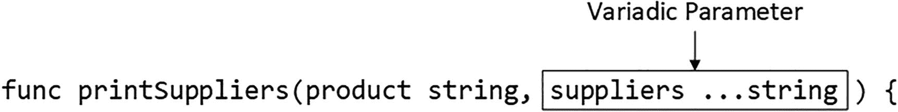

可变参数必须是函数定义的最后一个参数，并且只能使用单一类型，例如本例中的 `string` 类型。调用函数时，可以指定数量不定的字符串参数，而无需创建切片：

```
printSuppliers("Kayak", "Acme Kayaks", "Bob's Boats", "Crazy Canoes")
```

可变参数的类型不会改变，提供的值仍然包含在一个切片中。对于代码清单 8-10 来说，这意味着 `suppliers` 参数的类型仍然是 `[]string`。代码清单 8-9 和 8-10 中的代码编译并执行后，会产生以下输出：

```
Product: Kayak Supplier: Acme Kayaks
Product: Kayak Supplier: Bob's Boats
Product: Kayak Supplier: Crazy Canoes
Product: Lifejacket Supplier: Sail Safe Co
```

## 处理可变参数无参数的情况

Go 允许完全省略可变参数的实参，这可能会导致意外结果，如代码清单 8-11 所示。

```
package main
import "fmt"
func printSuppliers(product string, suppliers ...string ) {
for _, supplier := range suppliers {
fmt.Println("Product:", product, "Supplier:", supplier)
}
}
func main() {
printSuppliers("Kayak", "Acme Kayaks", "Bob's Boats", "Crazy Canoes")
printSuppliers("Lifejacket", "Sail Safe Co")
printSuppliers("Soccer Ball")
}
```

对 `printSuppliers` 函数的新调用没有为 `suppliers` 参数提供任何实参。发生这种情况时，Go 使用 `nil` 作为参数值，这可能会给那些假设切片中至少有一个值的代码带来问题。编译并运行代码清单 8-11 中的代码；你将收到以下输出：

```
Product: Kayak Supplier: Acme Kayaks
Product: Kayak Supplier: Bob's Boats
Product: Kayak Supplier: Crazy Canoes
Product: Lifejacket Supplier: Sail Safe Co
```

没有关于 `Soccer Ball` 产品的输出，因为 `nil` 切片的长度为零，所以 `for` 循环从未执行。代码清单 8-12 通过检查此问题来修正它。

```
package main
import "fmt"
func printSuppliers(product string, suppliers ...string ) {
if (len(suppliers) == 0) {
fmt.Println("Product:", product, "Supplier: (none)")
} else {
for _, supplier := range suppliers {
fmt.Println("Product:", product, "Supplier:", supplier)
}
}
}
func main() {
printSuppliers("Kayak", "Acme Kayaks", "Bob's Boats", "Crazy Canoes")
printSuppliers("Lifejacket", "Sail Safe Co")
printSuppliers("Soccer Ball")
}
```

我使用了第 7 章中描述的内置 `len` 函数来识别空切片，尽管我也可以检查 `nil` 值。编译并执行代码；你将收到以下输出，该输出处理了调用函数时未提供可变参数值的情况：

```
Product: Kayak Supplier: Acme Kayaks
Product: Kayak Supplier: Bob's Boats
Product: Kayak Supplier: Crazy Canoes
Product: Lifejacket Supplier: Sail Safe Co
Product: Soccer Ball Supplier: (none)
```

## 使用切片作为可变参数的值

可变参数允许调用函数时无需创建切片，但当你已经有一个想使用的切片时，这就不太有用了。针对这种情况，在传递给函数的最后一个参数后面加上省略号，就可以使用切片，如代码清单 8-13 所示。

```
package main
import "fmt"
func printSuppliers(product string, suppliers ...string ) {
if (len(suppliers) == 0) {
fmt.Println("Product:", product, "Supplier: (none)")
} else {
for _, supplier := range suppliers {
fmt.Println("Product:", product, "Supplier:", supplier)
}
}
}
func main() {
names := []string {"Acme Kayaks", "Bob's Boats", "Crazy Canoes"}
printSuppliers("Kayak", names...)
printSuppliers("Lifejacket", "Sail Safe Co")
printSuppliers("Soccer Ball")
}
```

这种技术避免了将切片拆解成单个值，然后再将它们组合回切片以用于可变参数的必要。编译并执行代码清单 8-13 中的代码，你将收到以下输出：

```
Product: Kayak Supplier: Acme Kayaks
Product: Kayak Supplier: Bob's Boats
Product: Kayak Supplier: Crazy Canoes
Product: Lifejacket Supplier: Sail Safe Co
Product: Soccer Ball Supplier: (none)
```


### 使用指针作为函数参数

默认情况下，Go 会复制作为参数传入的值，因此对参数的修改仅限于函数内部，如代码清单 8-14 所示。

```
package main
import "fmt"
func swapValues(first, second int) {
fmt.Println("Before swap:", first, second)
temp := first
first = second
second = temp
fmt.Println("After swap:", first, second)
}
func main() {
val1, val2 := 10, 20
fmt.Println("Before calling function", val1, val2)
swapValues(val1, val2)
fmt.Println("After calling function", val1, val2)
}
代码清单 8-14
在 functions 文件夹的 main.go 文件中修改参数值
```

`swapValues` 函数接收两个 `int` 值，先打印它们，然后交换，再次打印。在函数调用前后，都打印了传入函数的值。代码清单 8-14 的输出显示，在 `swapValues` 函数中对值的修改不会影响 `main` 函数中定义的变量：

```
Before calling function 10 20
Before swap: 10 20
After swap: 20 10
After calling function 10 20
```

Go 允许函数接收指针，这会改变上述行为，如代码清单 8-15 所示。

```
package main
import "fmt"
func swapValues(first, second *int) {
fmt.Println("Before swap:", *first, *second)
temp := *first
*first = *second
*second = temp
fmt.Println("After swap:", *first, *second)
}
func main() {
val1, val2 := 10, 20
fmt.Println("Before calling function", val1, val2)
swapValues(&val1, &val2)
fmt.Println("After calling function", val1, val2)
}
代码清单 8-15
在 functions 文件夹的 main.go 文件中定义带指针的函数
```

`swapValues` 函数仍然交换两个值，但这次是通过指针进行的，这意味着修改发生在 `main` 函数也在使用的内存位置上。这一点可以从代码的输出中看出：

```
Before calling function 10 20
Before swap: 10 20
After swap: 20 10
After calling function 20 10
```

有更好的方法来完成像交换值这样的任务——包括使用多个函数返回值（如下一节所述）——但这个例子展示了函数可以直接通过值工作，也可以通过指针间接工作。

## 定义和使用函数返回值

函数可以定义返回值，这使得函数能够向调用者提供操作的结果，如代码清单 8-16 所示。

```
package main
import "fmt"
func calcTax(price float64) float64 {
return price + (price * 0.2)
}
func main() {
products := map[string]float64 {
"Kayak" : 275,
"Lifejacket": 48.95,
}
for product, price := range products {
priceWithTax := calcTax(price)
fmt.Println("Product: ", product, "Price:", priceWithTax)
}
}
代码清单 8-16
在 functions 文件夹的 main.go 文件中生成函数返回值
```

该函数通过在参数之后指定一个数据类型来声明其返回值，如图 8-7 所示。

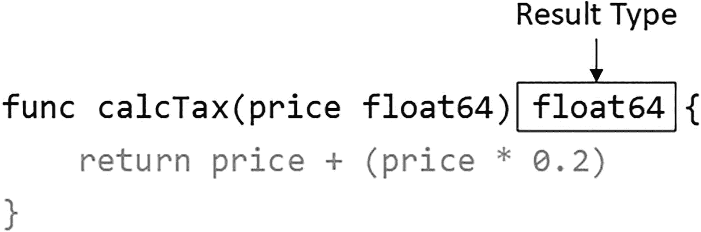

图 8-7

定义函数返回值

`calcTax` 函数生成一个 `float64` 类型的返回值，该返回值由 `return` 语句产生，如图 8-8 所示。

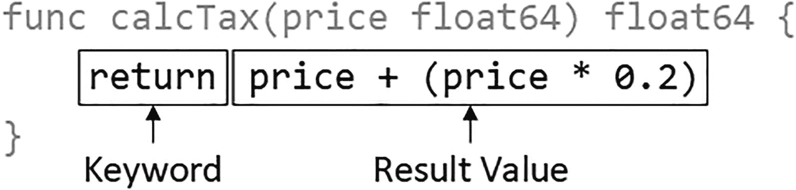

图 8-8

生成函数返回值

当函数被调用时，其返回值可以赋值给一个变量，如图 8-9 所示。

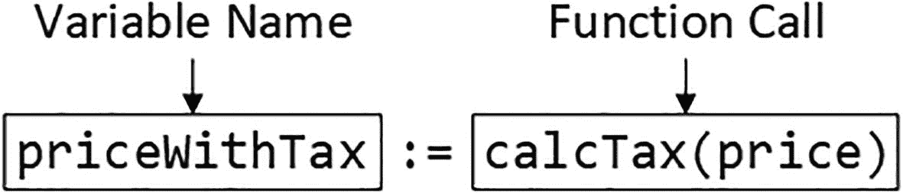

图 8-9

使用函数返回值

函数返回值可以直接在表达式中使用。代码清单 8-17 省略了变量，直接调用 `calcTax` 函数来为 `fmt.Println` 函数生成参数。

```
package main
import "fmt"
func calcTax(price float64) float64 {
return price + (price * 0.2)
}
func main() {
products := map[string]float64 {
"Kayak" : 275,
"Lifejacket": 48.95,
}
for product, price := range products {
fmt.Println("Product: ", product, "Price:", calcTax(price))
}
}
代码清单 8-17
在 functions 文件夹的 main.go 文件中直接使用函数返回值
```

Go 使用了 `calcTax` 函数产生的返回值，而无需定义中间变量。代码清单 8-16 和 8-17 中的代码产生以下输出：

```
Product:  Kayak Price: 330
Product:  Lifejacket Price: 58.74
```

### 返回多个函数返回值

Go 函数的一个不寻常的特性是能够产生多个返回值，如代码清单 8-18 所示。

```
package main
import "fmt"
func swapValues(first, second int) (int, int) {
return second, first
}
func main() {
val1, val2 := 10, 20
fmt.Println("Before calling function", val1, val2)
val1, val2 = swapValues(val1, val2)
fmt.Println("After calling function", val1, val2)
}
代码清单 8-18
在 functions 文件夹的 main.go 文件中产生多个返回值
```

函数返回值的类型使用括号分组，如图 8-10 所示。

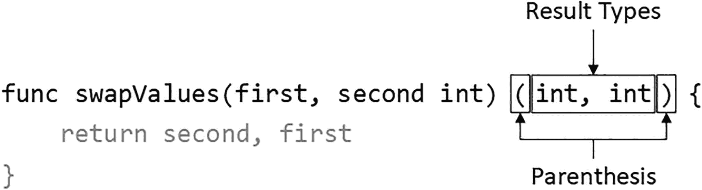

图 8-10

定义多个返回值

当一个函数定义了多个返回值时，使用 `return` 关键字提供每个返回值对应的值，并用逗号分隔，如图 8-11 所示。

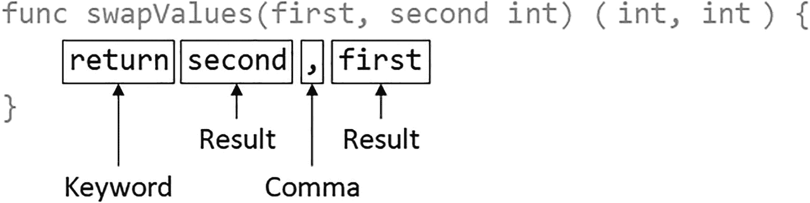

图 8-11

返回多个返回值

`swapValues` 函数使用 `return` 关键字产生两个 `int` 类型的返回值，这些值是通过其参数接收到的。这些返回值可以赋值给调用该函数的语句中的变量，同样用逗号分隔，如图 8-12 所示。

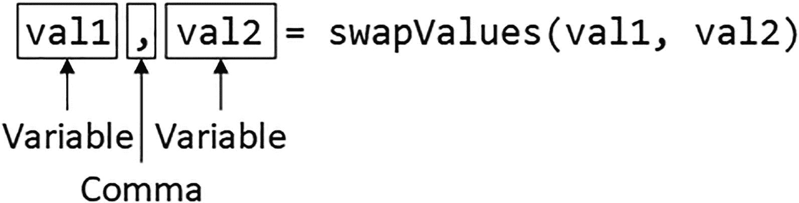

图 8-12

接收多个返回值

编译并执行代码清单 8-18 中的代码会产生以下输出：

```
Before calling function 10 20
After calling function 20 10
```


### 使用多个结果而非多重含义

多函数结果乍看可能有些奇怪，但可用于避免其他语言中常见的错误来源，即根据返回的值为单一结果赋予不同的含义。清单 8-19 展示了因给单一结果附加多种含义而导致的问题。

```
package main
import "fmt"
func calcTax(price float64) float64 {
if (price > 100) {
return price * 0.2
}
return -1
}
func main() {
products := map[string]float64 {
"Kayak" : 275,
"Lifejacket": 48.95,
}
for product, price := range products {
tax := calcTax(price)
if (tax != -1) {
fmt.Println("Product: ", product, "Tax:", tax)
} else {
fmt.Println("Product: ", product, "No tax due")
}
}
}
清单 8-19
在 functions 文件夹的 main.go 文件中使用单一结果
```

`calcTax` 函数使用 `float64` 结果来传达两种结果。对于大于 100 的值，结果表示应缴税额；对于小于 100 的值，结果表示无需缴税。编译并执行清单 8-19 中的代码会生成以下结果：

```
Product:  Kayak Tax: 55
Product:  Lifejacket No tax due
```

随着项目演进，给单一结果赋予多重含义可能成为问题。税务机关可能开始对某些购买行为进行退税，这将使值 `-1` 变得模棱两可，因为它可能表示无需缴税，也可能表示应退税 1 美元。

解决这种歧义的方法有很多，但使用多个函数结果是一种优雅的解决方案——尽管需要花些时间去适应。在清单 8-20 中，我修改了 `calcTax` 函数，使其产生多个结果。

```
package main
import "fmt"
func calcTax(price float64) (float64, bool) {
if (price > 100) {
return price * 0.2, true
}
return 0, false
}
func main() {
products := map[string]float64 {
"Kayak" : 275,
"Lifejacket": 48.95,
}
for product, price := range products {
taxAmount, taxDue := calcTax(price)
if (taxDue) {
fmt.Println("Product: ", product, "Tax:", taxAmount)
} else {
fmt.Println("Product: ", product, "No tax due")
}
}
}
清单 8-20
在 functions 文件夹的 main.go 文件中使用多个结果
```

`calcTax` 方法返回的额外结果是一个 `bool` 值，用于指示是否应缴税，从而将该信息与其他结果分离。在清单 8-20 中，两个结果在单独的语句中获取，但多结果非常适合 `if` 语句对初始化语句的支持，如清单 8-21 所示。（有关此功能的详细信息，请参阅第 12 章。）

```
package main
import "fmt"
func calcTax(price float64) (float64, bool) {
if (price > 100) {
return price * 0.2, true
}
return 0, false
}
func main() {
products := map[string]float64 {
"Kayak" : 275,
"Lifejacket": 48.95,
}
for product, price := range products {
if taxAmount, taxDue := calcTax(price); taxDue {
fmt.Println("Product: ", product, "Tax:", taxAmount)
} else {
fmt.Println("Product: ", product, "No tax due")
}
}
}
清单 8-21
在 functions 文件夹的 main.go 文件中使用初始化语句
```

通过在初始化语句中调用 `calcTax` 函数获取两个结果，然后将 `bool` 结果用作语句的表达式。清单 8-20 和 8-21 中的代码会生成以下输出：

```
Product:  Kayak Tax: 55
Product:  Lifejacket No tax due
```

### 使用命名结果

函数的结果可以有名称，在函数执行期间可以为其分配值。当执行到达 `return` 关键字时，将返回分配给结果的当前值，如清单 8-22 所示。

```
package main
import "fmt"
func calcTax(price float64) (float64, bool) {
if (price > 100) {
return price * 0.2, true
}
return 0, false
}
func calcTotalPrice(products map[string]float64,
minSpend float64) (total, tax float64)  {
total = minSpend
for _, price := range products {
if taxAmount, due := calcTax(price); due {
total += taxAmount;
tax += taxAmount
} else {
total += price
}
}
return
}
func main() {
products := map[string]float64 {
"Kayak" : 275,
"Lifejacket": 48.95,
}
total1, tax1 := calcTotalPrice(products, 10)
fmt.Println("Total 1:", total1, "Tax 1:", tax1)
total2, tax2 := calcTotalPrice(nil, 10)
fmt.Println("Total 2:", total2, "Tax 2:", tax2)
}
清单 8-22
在 functions 文件夹的 main.go 文件中使用命名结果
```

命名结果定义为名称和结果类型的组合，如图 8-13 所示。

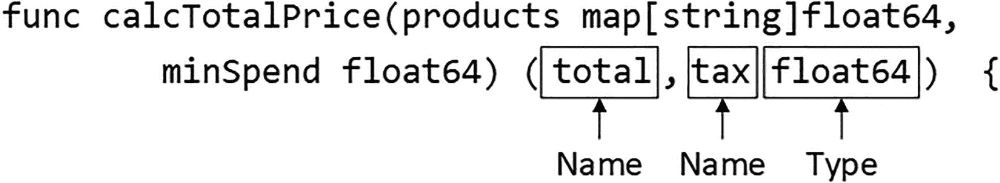

图 8-13

命名结果

`calcTotalPrice` 函数定义了名为 `total` 和 `tax` 的结果。两者都是 `float64` 值，这意味着我可以省略第一个名称的数据类型。在函数内部，结果可以像普通变量一样使用：

```
...
total = minSpend
for _, price := range products {
if taxAmount, due := calcTax(price); due {
total += taxAmount;
tax += taxAmount
} else {
total += price
}
}
...
```

`return` 关键字单独使用，从而返回分配给命名结果的当前值。清单 8-22 中的代码会生成以下输出：

```
Total 1: 113.95 Tax 1: 55
Total 2: 10 Tax 2: 0
```

### 使用空白标识符丢弃结果

Go 要求所有声明的变量都必须被使用，当函数返回不需要的值时，这可能会很棘手。为避免编译器错误，可以使用空白标识符（`_` 字符）来表示不会被使用的结果，如清单 8-23 所示。

```
package main
import "fmt"
func calcTotalPrice(products map[string]float64) (count int, total float64)  {
count = len(products)
for _, price := range products {
total += price
}
return
}
func main() {
products := map[string]float64 {
"Kayak" : 275,
"Lifejacket": 48.95,
}
_, total  := calcTotalPrice(products)
fmt.Println("Total:", total)
}
清单 8-23
在 functions 文件夹的 main.go 文件中丢弃函数结果
```

`calcTotalPrice` 函数返回两个结果，但只使用了其中一个。空白标识符用于不需要的值，从而避免编译器错误。清单 8-23 中的代码会生成以下输出：

```
Total: 323.95
```


  
### 使用 `defer` 关键字

`defer` 关键字用于调度一个函数调用，该调用将在当前函数返回前立即执行，如代码清单 8-24 所示。

```
package main
import "fmt"
func calcTotalPrice(products map[string]float64) (count int, total float64)  {
fmt.Println("函数开始")
defer fmt.Println("第一个 defer 调用")
count = len(products)
for _, price := range products {
total += price
}
defer fmt.Println("第二个 defer 调用")
fmt.Println("函数即将返回")
return
}
func main() {
products := map[string]float64 {
"Kayak" : 275,
"Lifejacket": 48.95,
}
_, total  := calcTotalPrice(products)
fmt.Println("总计:", total)
}
代码清单 8-24
在 functions 文件夹的 main.go 文件中使用 defer 关键字
```

`defer` 关键字用于函数调用之前，如图 8-14 所示。

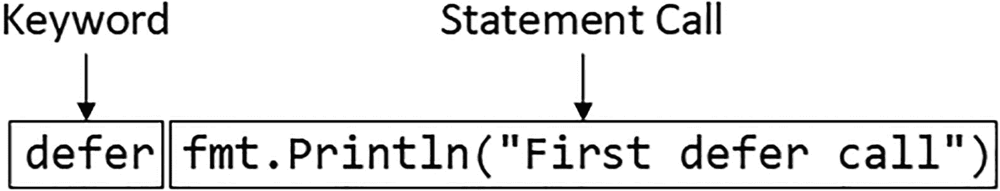

图 8-14

`defer` 关键字

`defer` 关键字的主要用途是调用释放资源的函数，例如关闭已打开的文件（参见第 22 章）或 HTTP 连接（第 24 章和第 25 章）。如果没有 `defer` 关键字，释放资源的语句必须出现在函数末尾，而这往往是在资源创建和使用之后的许多条语句之后。`defer` 关键字允许你将创建、使用和释放资源的语句组合在一起。

如代码清单 8-24 所示，`defer` 关键字可用于任何函数调用，并且单个函数可以多次使用 `defer` 关键字。在函数即将返回之前，Go 将按照定义顺序执行通过 `defer` 关键字调度的调用。代码清单 8-24 中的代码调度了 `fmt.Println` 函数的调用，编译并执行后会产生以下输出：

```
函数开始
函数即将返回
第二个 defer 调用
第一个 defer 调用
总计: 323.95
```

## 本章小结

在本章中，我介绍了 Go 函数，解释了如何定义和使用它们。我演示了参数可以定义的不同方式，以及 Go 函数如何产生结果。在下一章中，我将介绍函数如何作为类型使用。

### 使用函数类型

在本章中，我将介绍 Go 如何处理函数类型，这是一个有用（尽管有时令人困惑）的特性，它允许以一致的方式描述函数，并像其他值一样进行描述。表 9-1 将函数类型置于上下文中。

表 9-1  
函数类型的上下文

| 问题 | 答案 |
| --- | --- |
| 什么是函数类型？ | Go 中的函数具有数据类型，该类型描述了函数接受的参数组合以及函数产生的结果。此类型可以显式指定，也可以从使用字面量语法定义的函数中推断得出。 |
| 它们为什么有用？ | 将函数视为数据类型意味着它们可以分配给变量，并且只要一个函数具有相同的参数和结果组合，就可以替换另一个函数。 |
| 如何使用它们？ | 函数类型使用 `func` 关键字定义，后跟描述参数和结果的签名。不指定函数体。 |
| 是否有任何陷阱或限制？ | 函数类型的高级用法可能变得难以理解和调试，尤其是在定义了嵌套的字面量函数时。 |
| 是否有替代方案？ | 你不必使用函数类型或使用字面量语法定义函数，但这样做可以减少代码重复并提高所写代码的灵活性。 |

表 9-2 总结了本章内容。

表 9-2  
本章总结

| 问题 | 解决方案 | 代码清单 |
| --- | --- | --- |
| 描述具有特定参数和结果组合的函数 | 使用函数类型 | 4–7 |
| 简化函数类型的重复表达 | 使用函数类型别名 | 8 |
| 定义特定于代码区域的函数 | 使用字面量函数语法 | 9–12 |
| 访问函数外部定义的值 | 使用函数闭包 | 13–18 |

## 本章准备工作

为准备本章内容，请打开一个新的命令提示符，导航到一个方便的位置，并创建一个名为 `functionTypes` 的目录。导航到 `functionTypes` 文件夹，并运行代码清单 9-1 中所示的命令来初始化项目。

```
go mod init functionTypes
代码清单 9-1
初始化项目
```

向 `functionTypes` 文件夹添加一个名为 `main.go` 的文件，其内容如代码清单 9-2 所示。

提示

你可以从 [`https://github.com/apress/pro-go`](https://github.com/apress/pro-go) 下载本章（以及本书所有其他章节）的示例项目。如果在运行示例时遇到问题，请参阅第 2 章了解如何获取帮助。

```
package main
import "fmt"
func main() {
fmt.Println("你好，函数类型")
}
代码清单 9-2
functionTypes 文件夹中 main.go 文件的内容
```

在命令提示符下，导航到 `functionTypes` 文件夹并运行代码清单 9-3 中所示的命令。

```
go run .
代码清单 9-3
运行示例项目
```

`main.go` 文件中的代码将被编译并执行，产生以下输出：

```
你好，函数类型
```  


### 理解函数类型

在 Go 语言中，函数拥有数据类型，这意味着它们可以被赋值给变量，并用作函数参数、实参和返回值。代码清单 9-4 展示了函数数据类型的一个简单用法。

```
package main
import "fmt"
func calcWithTax(price float64) float64 {
return price + (price * 0.2)
}
func calcWithoutTax(price float64) float64 {
return price
}
func main() {
products := map[string]float64 {
"Kayak" : 275,
"Lifejacket": 48.95,
}
for product, price := range products {
var calcFunc func(float64) float64
if (price > 100) {
calcFunc = calcWithTax
} else {
calcFunc = calcWithoutTax
}
totalPrice := calcFunc(price)
fmt.Println("Product:", product, "Price:", totalPrice)
}
}
代码清单 9-4
在 functionTypes 文件夹的 main.go 文件中使用函数数据类型
```

这个示例包含两个函数，每个函数都定义了一个 `float64` 参数并返回一个 `float64` 结果。`main` 函数中的 `for` 循环会选中其中一个函数，并用它来计算某个产品的总价。循环中的第一条语句定义了一个变量，如图 9-1 所示。

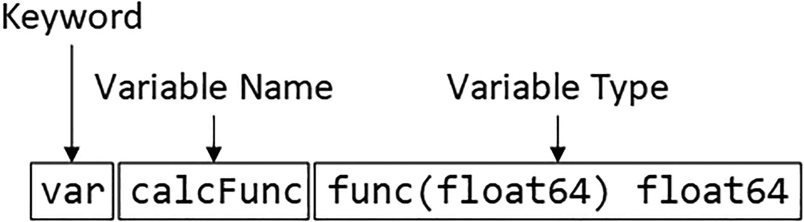

图 9-1

定义函数类型变量

函数类型使用 `func` 关键字来指定，后面跟着括号中的参数类型，然后是结果类型。这被称为**函数签名**。如果有多个结果，那么结果类型也需要用括号括起来。代码清单 9-4 中的函数类型描述了一个接受 `float64` 参数并返回 `float64` 结果的函数。

代码清单 9-4 中定义的 `calcFunc` 变量可以被赋值为任何与其类型匹配的值，这意味着任何参数和结果的数量及类型都正确的函数。要将特定函数赋值给变量，需要使用该函数的名称，如图 9-2 所示。

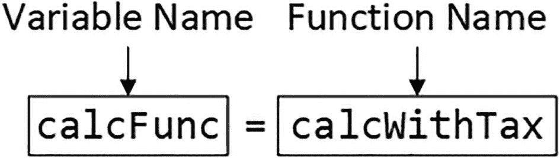

图 9-2

将函数赋值给变量

一旦函数被赋值给变量，就可以像使用变量名作为函数名那样来调用它。在示例中，这意味着赋值给 `calcFunc` 变量的函数可以如图 9-3 所示进行调用。

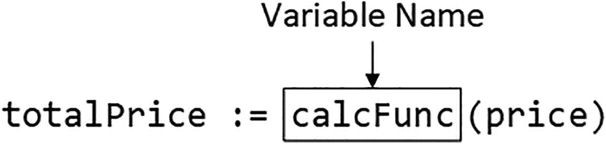

图 9-3

通过变量调用函数

其效果是，无论哪个函数被赋值给了 `totalPrice` 变量，该函数都会被调用。如果 `price` 值大于 100，则将 `calcWithTax` 函数赋值给 `totalPrice` 变量，并执行此函数。如果 `price` 小于或等于 100，则将 `calcWithoutTax` 函数赋值给 `totalPrice` 变量，并执行此函数。代码清单 9-4 中的代码在编译和执行时会产生以下输出（不过你可能看到的结果顺序不同，正如第 7 章所述）：

```
Product: Kayak Price: 330
Product: Lifejacket Price: 48.95
```

## 理解函数比较与零值类型

Go 的比较运算符不能用于比较函数，但可以用于判断一个函数是否已被赋值给变量，如代码清单 9-5 所示。

```
package main
import "fmt"
func calcWithTax(price float64) float64 {
return price + (price * 0.2)
}
func calcWithoutTax(price float64) float64 {
return price
}
func main() {
products := map[string]float64 {
"Kayak" : 275,
"Lifejacket": 48.95,
}
for product, price := range products {
var calcFunc func(float64) float64
fmt.Println("Function assigned:", calcFunc == nil)
if (price > 100) {
calcFunc = calcWithTax
} else {
calcFunc = calcWithoutTax
}
fmt.Println("Function assigned:", calcFunc == nil)
totalPrice := calcFunc(price)
fmt.Println("Product:", product, "Price:", totalPrice)
}
}
代码清单 9-5
在 functionTypes 文件夹的 main.go 文件中检查赋值
```

函数类型的零值是 `nil`，代码清单 9-5 中的新语句使用相等运算符来判断一个函数是否已被赋值给 `calcFunc` 变量。代码清单 9-5 中的代码会产生以下输出：

```
Function assigned: true
Function assigned: false
Product: Kayak Price: 330
Function assigned: true
Function assigned: false
Product: Lifejacket Price: 48.95
```

## 将函数用作参数

函数类型可以像任何其他类型一样使用，包括作为其他函数的参数，如代码清单 9-6 所示。

注意

以下章节中的某些描述可能难以理解，因为需要频繁使用 *函数* 这个词。我建议你密切关注代码示例，这有助于理解文本内容。

```
package main
import "fmt"
func calcWithTax(price float64) float64 {
return price + (price * 0.2)
}
func calcWithoutTax(price float64) float64 {
return price
}
func printPrice(product string, price float64, calculator func(float64) float64 ) {
fmt.Println("Product:", product, "Price:", calculator(price))
}
func main() {
products := map[string]float64 {
"Kayak" : 275,
"Lifejacket": 48.95,
}
for product, price := range products {
if (price > 100) {
printPrice(product, price, calcWithTax)
} else {
printPrice(product, price, calcWithoutTax)
}
}
}
代码清单 9-6
在 functionTypes 文件夹的 main.go 文件中将函数用作参数
```

`printPrice` 函数定义了三个参数，其中前两个接收 `string` 和 `float64` 类型的值。第三个参数名为 `calculator`，接收一个接收 `float64` 值并返回 `float64` 结果的函数，如图 9-4 所示。

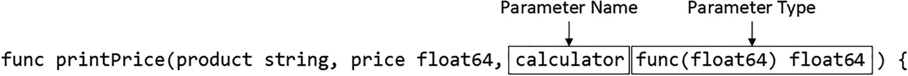

图 9-4

函数参数

在 `printPrice` 函数内部，`calculator` 参数的使用方式与任何其他函数相同：

```
...
fmt.Println("Product:", product, "Price:", calculator(price))
...
```

重要的是，`printPrice` 函数不知道也不关心它通过 `calculator` 参数接收到的是 `calcWithTax` 还是 `calcWithoutTax` 函数。`printPrice` 函数只知道它可以用一个 `float64` 参数调用 `calculator` 函数并接收一个 `float64` 结果，因为这是该参数的函数类型。

选择使用哪个函数由 `main` 函数中的 `if` 语句决定，并且函数名被用来将一个函数作为参数传递给另一个函数，如下所示：

```
...
printPrice(product, price, calcWithTax)
...
```

代码清单 9-6 中的代码在编译和执行时会产生以下输出：

```
Product: Kayak Price: 330
Product: Lifejacket Price: 48.95
```


### 使用函数作为结果

函数也可以作为结果，这意味着函数返回的值是另一个函数，如代码清单 9-7 所示。

```
package main
import "fmt"
func calcWithTax(price float64) float64 {
return price + (price * 0.2)
}
func calcWithoutTax(price float64) float64 {
return price
}
func printPrice(product string, price float64, calculator func(float64) float64 ) {
fmt.Println("Product:", product, "Price:", calculator(price))
}
func selectCalculator(price float64) func(float64) float64 {
if (price > 100) {
return calcWithTax
}
return calcWithoutTax
}
func main() {
products := map[string]float64 {
"Kayak" : 275,
"Lifejacket": 48.95,
}
for product, price := range products {
printPrice(product, price, selectCalculator(price))
}
}
代码清单 9-7  在 functionTypes 文件夹的 main.go 文件中生成函数结果
```

`selectCalculator` 函数接收一个 `float64` 值并返回一个函数，如图 9-5 所示。

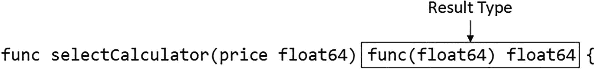

图 9-5  函数类型结果

`selectCalculator` 产生的结果是一个函数，该函数接受一个 `float64` 值并产生一个 `float64` 结果。`selectCalculator` 的调用者并不知道自己收到的是 `calcWithTax` 还是 `calcWithoutTax` 函数，只知道会收到一个具有指定签名的函数。编译并执行代码清单 9-7 中的代码会生成以下输出：

```
Product: Kayak Price: 330
Product: Lifejacket Price: 48.95
```

## 创建函数类型别名

如之前的示例所示，使用函数类型可能显得冗长且重复，这会导致代码难以阅读和维护。Go 支持类型别名，可用于为函数签名分配名称，这样在使用函数类型时就不必每次都指定参数和结果类型，如代码清单 9-8 所示。

```
package main
import "fmt"
type calcFunc func(float64) float64
func calcWithTax(price float64) float64 {
return price + (price * 0.2)
}
func calcWithoutTax(price float64) float64 {
return price
}
func printPrice(product string, price float64, calculator calcFunc) {
fmt.Println("Product:", product, "Price:", calculator(price))
}
func selectCalculator(price float64) calcFunc {
if (price > 100) {
return calcWithTax
}
return calcWithoutTax
}
func main() {
products := map[string]float64 {
"Kayak" : 275,
"Lifejacket": 48.95,
}
for product, price := range products {
printPrice(product, price, selectCalculator(price))
}
}
代码清单 9-8  在 functionTypes 文件夹的 main.go 文件中使用类型别名
```

别名使用 `type` 关键字创建，后跟别名名称，再跟类型，如图 9-6 所示。

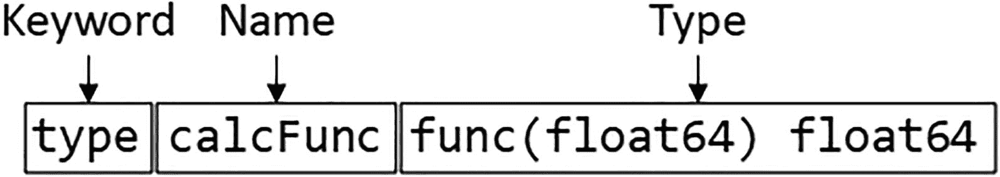

图 9-6  类型别名

> **注意**  
> `type` 关键字也用于创建自定义类型，如第 10 章所述。

代码清单 9-8 中的别名将名称 `calcFunc` 分配给接受一个 `float64` 参数并产生一个 `float64` 结果的函数类型。可以使用别名名称代替函数类型，如下所示：

```
...
func selectCalculator(price float64) calcFunc {
...
```

你不必为函数类型使用别名，但它们可以简化代码，并更容易识别特定函数签名的使用。代码清单 9-8 中的代码会生成以下输出：

```
Product: Kayak Price: 330
Product: Lifejacket Price: 48.95
```

## 使用函数字面量语法

函数字面量语法允许定义特定于代码区域的函数，如代码清单 9-9 所示。

```
package main
import "fmt"
type calcFunc func(float64) float64
// func calcWithTax(price float64) float64 {
//     return price + (price * 0.2)
// }
// func calcWithoutTax(price float64) float64 {
//     return price
// }
func printPrice(product string, price float64, calculator calcFunc) {
fmt.Println("Product:", product, "Price:", calculator(price))
}
func selectCalculator(price float64) calcFunc {
if (price > 100) {
var withTax calcFunc = func (price float64) float64 {
return price + (price * 0.2)
}
return withTax
}
withoutTax := func (price float64) float64 {
return price
}
return withoutTax
}
func main() {
products := map[string]float64 {
"Kayak" : 275,
"Lifejacket": 48.95,
}
for product, price := range products {
printPrice(product, price, selectCalculator(price))
}
}
代码清单 9-9  在 functionTypes 文件夹的 main.go 文件中使用字面量语法的函数
```

字面量语法省略了名称，因此 `func` 关键字后紧跟参数、结果类型和代码块，如图 9-7 所示。由于名称被省略，用这种方式定义的函数被称为**匿名函数**。

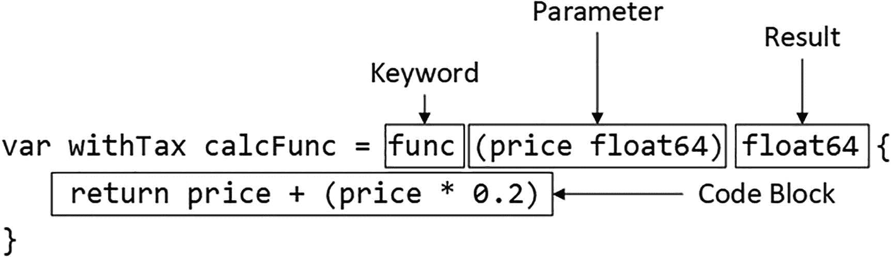

图 9-7  函数字面量语法

> **注意**  
> Go 不支持箭头函数（即通过 `=>` 操作符更简洁地表达函数，而无需 `func` 关键字和花括号包围的代码块）。在 Go 中，函数必须始终使用关键字和函数体来定义。

字面量语法创建的函数可以像任何其他值一样使用，包括将函数赋值给变量，这正是我在代码清单 9-9 中所做的。函数字面量的类型由函数签名定义，这意味着函数参数的数量和类型必须与变量类型匹配，如下所示：

```
...
var withTax calcFunc = func (price float64) float64 {
return price + (price * 0.2)
}
...
```

这个字面量函数的签名与 `calcFunc` 类型别名匹配，具有一个 `float64` 参数和一个 `float64` 结果。字面量函数也可以与短变量声明语法一起使用：

```
...
withoutTax := func (price float64) float64 {
return price
}
...
```

Go 编译器会根据函数签名确定变量类型，这意味着 `withoutTax` 变量的类型是 `func(float64) float64`。编译并执行代码清单 9-9 中的代码会生成以下输出：

```
Product: Kayak Price: 330
Product: Lifejacket Price: 48.95
```

### 理解函数变量作用域

函数与其他任何值一样被对待，但添加税费的函数只能通过 `withTax` 变量访问，而该变量又只能在 `if` 语句的代码块内访问，如代码清单 9-10 所示。

```
...
func selectCalculator(price float64) calcFunc {
if (price > 100) {
var withTax calcFunc = func (price float64) float64 {
return price + (price * 0.2)
}
return withTax
} else if (price < 10) {
return withTax
}
withoutTax := func (price float64) float64 {
return price
}
return withoutTax
}
...
代码清单 9-10  在 functionTypes 文件夹的 main.go 文件中在其作用域外使用函数
```

`else`/`if` 子句中的语句尝试访问赋值给 `withTax` 变量的函数。该变量无法访问，因为它位于另一个代码块中，因此编译器会生成以下错误：

```
### command-line-arguments
.\main.go:18:16: undefined: withTax
```


### 直接使用函数值

在之前的示例中，我将函数赋值给变量，是为了演示 Go 语言把字面量函数当作普通值一样对待。但实际上，函数不必赋值给变量，可以像其他任何字面量值一样直接使用，如代码清单 9-11 所示。

```go
package main
import "fmt"
type calcFunc func(float64) float64
func printPrice(product string, price float64, calculator calcFunc) {
fmt.Println("Product:", product, "Price:", calculator(price))
}
func selectCalculator(price float64) calcFunc {
if (price > 100) {
return func (price float64) float64 {
return price + (price * 0.2)
}
}
return func (price float64) float64 {
return price
}
}
func main() {
products := map[string]float64 {
"Kayak" : 275,
"Lifejacket": 48.95,
}
for product, price := range products {
printPrice(product, price, selectCalculator(price))
}
}
代码清单 9-11
在 functionTypes 文件夹的 main.go 文件中直接使用函数
```

`return` 关键字直接作用于函数本身，无需将函数赋值给变量。代码清单 9-11 中的代码输出如下：

```go
Product: Kayak Price: 330
Product: Lifejacket Price: 48.95
```

字面量函数也可以作为其他函数的参数，如代码清单 9-12 所示。

```go
package main
import "fmt"
type calcFunc func(float64) float64
func printPrice(product string, price float64, calculator calcFunc) {
fmt.Println("Product:", product, "Price:", calculator(price))
}
func main() {
products := map[string]float64 {
"Kayak" : 275,
"Lifejacket": 48.95,
}
for product, price := range products {
printPrice(product, price, func (price float64) float64 {
return price + (price * 0.2)
})
}
}
代码清单 9-12
在 functionTypes 文件夹的 main.go 文件中使用字面量函数参数
```

`printPrice` 函数的最后一个参数使用了字面量语法，并且没有将该函数赋值给变量。代码清单 9-12 中的代码输出如下：

```go
Product: Kayak Price: 330
Product: Lifejacket Price: 58.74
```

### 理解函数闭包

使用字面量语法定义的函数可以引用周围代码中的变量，这一特性被称为*闭包*。这个特性可能难以理解，因此我将首先从一个不依赖闭包的示例开始，如代码清单 9-13 所示，然后再解释如何改进它。

```go
package main
import "fmt"
type calcFunc func(float64) float64
func printPrice(product string, price float64, calculator calcFunc) {
fmt.Println("Product:", product, "Price:", calculator(price))
}
func main() {
watersportsProducts := map[string]float64 {
"Kayak" : 275,
"Lifejacket": 48.95,
}
soccerProducts := map[string] float64 {
"Soccer Ball": 19.50,
"Stadium": 79500,
}
calc := func(price float64) float64 {
if (price > 100) {
return price + (price * 0.2)
}
return price;
}
for product, price := range watersportsProducts {
printPrice(product, price, calc)
}
calc = func(price float64) float64 {
if (price > 50) {
return price + (price * 0.1)
}
return price
}
for product, price := range soccerProducts {
printPrice(product, price, calc)
}
}
代码清单 9-13
在 functionTypes 文件夹的 main.go 文件中使用多个函数
```

两个映射分别包含水上运动和足球类产品的名称和价格。这些映射通过 `for` 循环进行遍历，并为每个映射元素调用 `printPrice` 函数。`printPrice` 函数所需的参数之一是 `calcFunc`，这是一个用于计算产品含税总价的函数。每个产品类别所需的免税门槛和税率不同，如表 9-3 所述。

表 9-3  
产品类别门槛与税率

| 类别 | 门槛 | 税率 |
|----------|-----------|----------|
| 水上运动 | 100 | 20% |
| 足球 | 50 | 10% |

注意

请不要写信抱怨说我虚构的税率显示了对足球的厌恶。我对所有运动都一视同仁地不喜欢，除了长跑——我热衷于长跑，主要是因为每跑一英里，我就能离那些谈论运动的人更远一些。

我使用字面量语法创建了应用每个类别门槛的函数。这样做是可行的，但存在高度的重复性，如果价格计算方式发生变化，我必须记住更新每个类别的计算器函数。

我想要的是能够整合计算价格所需的公共代码，并允许通过每个类别的变化来配置这些公共代码。使用闭包特性可以轻松实现这一点，如代码清单 9-14 所示。

```go
package main
import "fmt"
type calcFunc func(float64) float64
func printPrice(product string, price float64, calculator calcFunc) {
fmt.Println("Product:", product, "Price:", calculator(price))
}
func priceCalcFactory(threshold, rate float64) calcFunc {
return func(price float64) float64 {
if (price > threshold) {
return price + (price * rate)
}
return price
}
}
func main() {
watersportsProducts := map[string]float64 {
"Kayak" : 275,
"Lifejacket": 48.95,
}
soccerProducts := map[string] float64 {
"Soccer Ball": 19.50,
"Stadium": 79500,
}
waterCalc := priceCalcFactory(100, 0.2);
soccerCalc := priceCalcFactory(50, 0.1)
for product, price := range watersportsProducts {
printPrice(product, price, waterCalc)
}
for product, price := range soccerProducts {
printPrice(product, price, soccerCalc)
}
}
代码清单 9-14
在 functionTypes 文件夹的 main.go 文件中使用函数闭包
```

关键新增部分是 `priceCalcFactory` 函数，在本节中我将其称为*工厂函数*，以区别于代码的其他部分。工厂函数的作用是为特定的门槛和税率组合创建计算器函数。这个任务由函数签名描述，如图 9-8 所示。


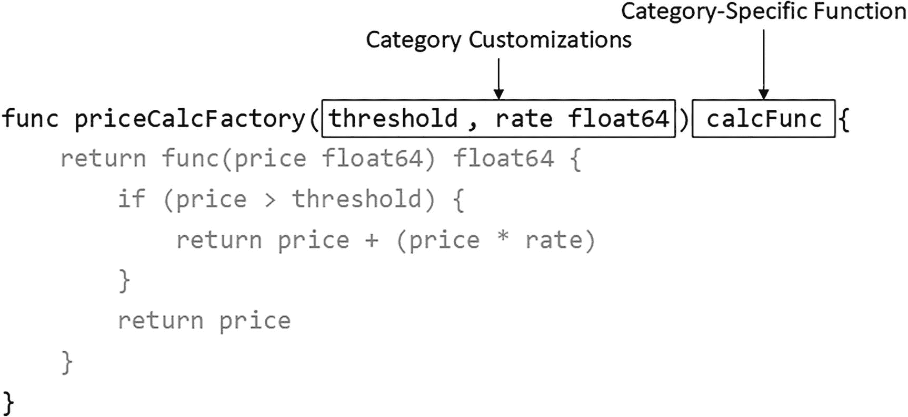

**图 9-8**

### 工厂函数签名

工厂函数的输入是某个类别的 `threshold` 和 `rate`，输出是一个用于计算该类别的价格函数。工厂函数中的代码使用字面量语法定义了一个计算器函数，该函数包含执行计算的通用代码，如图 9-9 所示。

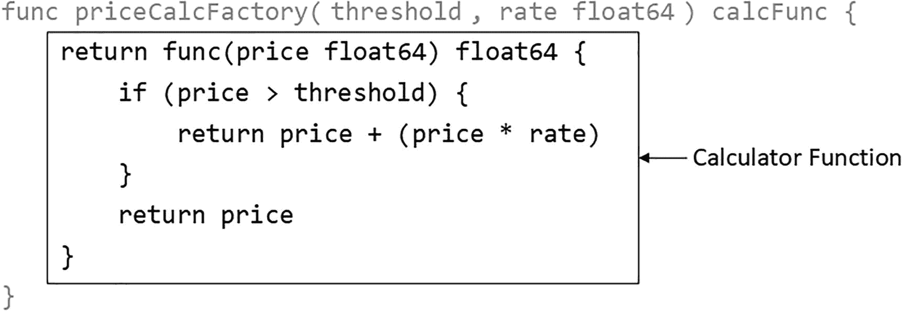

**图 9-9**

### 通用代码

闭包特性是工厂函数和计算器函数之间的纽带。计算器函数依赖两个变量来生成结果，如下所示：

```
...
return func(price float64) float64 {
if (price > threshold) {
return price + (price * rate)
}
return price
}
...
```

`threshold` 和 `rate` 值取自工厂函数的参数，如下所示：

```
...
func priceCalcFactory(threshold, rate float64) calcFunc {
...
```

闭包特性允许函数访问周围代码中的变量和参数。在本例中，计算器函数依赖工厂函数的参数。当计算器函数被调用时，这些参数值被用来生成结果，如图 9-10 所示。

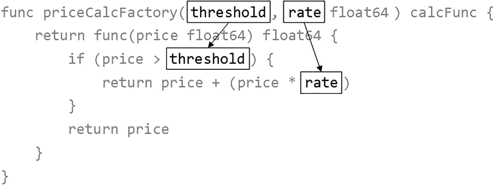

**图 9-10**

### 函数闭包

如果一个函数*闭合*了它所需值的来源，则称该函数“闭包”于这些来源，即计算器函数*闭包*于工厂函数的 `threshold` 和 `rate` 参数。

最终得到一个工厂函数，它能创建专为某个产品类别的税率门槛和税率定制的计算器函数。计算价格所需的代码已被整合，因此更改将应用于所有类别。清单 9-13 和清单 9-14 都能生成以下输出：

```
Product: Kayak Price: 330
Product: Lifejacket Price: 48.95
Product: Soccer Ball Price: 19.5
Product: Stadium Price: 87450
```

### 理解闭包的求值时机

函数所闭包的变量在每次函数被调用时才会被求值，这意味着函数外部的改动会影响它产生的结果，如清单 9-15 所示。

```
package main
import "fmt"
type calcFunc func(float64) float64
func printPrice(product string, price float64, calculator calcFunc) {
fmt.Println("Product:", product, "Price:", calculator(price))
}
var prizeGiveaway = false
func priceCalcFactory(threshold, rate float64) calcFunc {
return func(price float64) float64 {
if (prizeGiveaway) {
return 0
} else if (price > threshold) {
return price + (price * rate)
}
return price
}
}
func main() {
watersportsProducts := map[string]float64 {
"Kayak" : 275,
"Lifejacket": 48.95,
}
soccerProducts := map[string] float64 {
"Soccer Ball": 19.50,
"Stadium": 79500,
}
prizeGiveaway = false
waterCalc := priceCalcFactory(100, 0.2);
prizeGiveaway = true
soccerCalc := priceCalcFactory(50, 0.1)
for product, price := range watersportsProducts {
printPrice(product, price, waterCalc)
}
for product, price := range soccerProducts {
printPrice(product, price, soccerCalc)
}
}
```

**清单 9-15** 在 `functionTypes` 文件夹的 `main.go` 文件中修改闭包所引用的值

计算器函数闭包于 `prizeGiveaway` 变量，这导致价格降至零。在创建水上运动类别的函数之前，`prizeGiveaway` 变量被设置为 `false`；在创建 `soccer` 类别的函数之前，它被设置为 `true`。

但由于闭包是在函数被调用时才求值，因此使用的是 `prizeGiveaway` 变量的当前值，而非函数创建时的值。结果，两个类别的价格都降为零，代码产生如下输出：

```
Product: Lifejacket Price: 0
Product: Kayak Price: 0
Product: Soccer Ball Price: 0
Product: Stadium Price: 0
```

### 强制提前求值

在函数被调用时求值闭包可能很有用，但如果你想使用函数创建时变量的当前值，则需要复制该值，如清单 9-16 所示。

```
...
func priceCalcFactory(threshold, rate float64) calcFunc {
fixedPrizeGiveway := prizeGiveaway
return func(price float64) float64 {
if (fixedPrizeGiveway) {
return 0
} else if (price > threshold) {
return price + (price * rate)
}
return price
}
}
...
```

**清单 9-16** 在 `functionTypes` 文件夹的 `main.go` 文件中强制提前求值

计算器函数闭包于 `fixedPrizeGiveway` 变量，该变量的值在工厂函数被调用时设置。这确保了即使 `prizeGiveaway` 的值发生变化，计算器函数也不会受影响。通过给工厂函数添加参数也能达到相同效果，因为函数参数默认是按值传递的。清单 9-17 为工厂函数添加了一个参数。

```
package main
import "fmt"
type calcFunc func(float64) float64
func printPrice(product string, price float64, calculator calcFunc) {
fmt.Println("Product:", product, "Price:", calculator(price))
}
var prizeGiveaway = false
func priceCalcFactory(threshold, rate float64, zeroPrices bool) calcFunc {
return func(price float64) float64 {
if (zeroPrices) {
return 0
} else if (price > threshold) {
return price + (price * rate)
}
return price
}
}
func main() {
watersportsProducts := map[string]float64 {
"Kayak" : 275,
"Lifejacket": 48.95,
}
soccerProducts := map[string] float64 {
"Soccer Ball": 19.50,
"Stadium": 79500,
}
prizeGiveaway = false
waterCalc := priceCalcFactory(100, 0.2, prizeGiveaway);
prizeGiveaway = true
soccerCalc := priceCalcFactory(50, 0.1, prizeGiveaway)
for product, price := range watersportsProducts {
printPrice(product, price, waterCalc)
}
for product, price := range soccerProducts {
printPrice(product, price, soccerCalc)
}
}
```

**清单 9-17** 在 `functionTypes` 文件夹的 `main.go` 文件中添加参数

在清单 9-16 和清单 9-17 中，当 `prizeGiveaway` 变量被更改时，计算器函数不受影响，并产生如下输出：

```
Product: Kayak Price: 330
Product: Lifejacket Price: 48.95
Product: Stadium Price: 0
Product: Soccer Ball Price: 0
```


### 闭包指针以防止过早求值

大多数与闭包相关的问题都是由函数创建后变量发生变化引起的，这可以通过上一节中的技术来解决。有时，您可能会遇到相反的问题，即需要避免过早求值，以确保函数使用的是当前值。在这种情况下，使用指针可以防止值被复制，如代码清单 9-18 所示。

```
package main
import "fmt"
type calcFunc func(float64) float64
func printPrice(product string, price float64, calculator calcFunc) {
fmt.Println("Product:", product, "Price:", calculator(price))
}
var prizeGiveaway = false
func priceCalcFactory(threshold, rate float64, zeroPrices *bool) calcFunc {
return func(price float64) float64 {
if (*zeroPrices) {
return 0
} else if (price > threshold) {
return price + (price * rate)
}
return price
}
}
func main() {
watersportsProducts := map[string]float64 {
"Kayak" : 275,
"Lifejacket": 48.95,
}
soccerProducts := map[string] float64 {
"Soccer Ball": 19.50,
"Stadium": 79500,
}
prizeGiveaway = false
waterCalc := priceCalcFactory(100, 0.2, &prizeGiveaway);
prizeGiveaway = true
soccerCalc := priceCalcFactory(50, 0.1, &prizeGiveaway)
for product, price := range watersportsProducts {
printPrice(product, price, waterCalc)
}
for product, price := range soccerProducts {
printPrice(product, price, soccerCalc)
}
}
代码清单 9-18
在 functionTypes 文件夹的 main.go 文件中闭包指针
```

在此例中，工厂函数定义了一个参数，该参数接收一个指向`bool`值的指针，计算器函数闭包于此指针。当调用计算器函数时，会跟随该指针，从而确保使用当前值。代码清单 9-18 中的代码产生以下输出：

```
Product: Kayak Price: 0
Product: Lifejacket Price: 0
Product: Soccer Ball Price: 0
Product: Stadium Price: 0
```

## 本章小结

在本章中，我描述了 Go 语言处理函数类型的方式，允许它们像任何其他数据类型一样使用，并且允许将函数视为任何其他值。我解释了如何描述函数类型，并向您展示了如何使用它们来定义其他函数的参数和结果。我演示了如何通过类型别名来避免在代码中重复复杂的函数类型，并解释了函数字面量语法的使用以及函数闭包的工作方式。在下一章中，我将解释如何通过创建结构体类型来定义自定义数据类型。

# 10. 定义结构体

在本章中，我将介绍结构体，这是 Go 语言中定义自定义数据类型的方式。我将向您展示如何定义新的结构体类型，描述如何从这些类型创建值，并解释值被复制时会发生什么。表 10-1 将结构体放在上下文中进行说明。

**表 10-1**

结构体上下文说明

| 问题 | 答案 |
| --- | --- |
| 它们是什么？ | 结构体是由字段组成的数据类型。 |
| 为什么它们有用？ | 结构体允许定义自定义数据类型。 |
| 如何使用它们？ | 使用 `type` 和 `struct` 关键字来定义类型，可以指定字段名称和类型。 |
| 是否有陷阱或限制？ | 必须注意避免意外复制结构体值，并确保在使用之前初始化存储指针的字段。 |
| 是否有替代方案？ | 简单的应用程序可以仅使用内置数据类型，但大多数应用程序需要定义自定义类型，而结构体是唯一的选择。 |

**表 10-2**

本章摘要

| 问题 | 解决方案 | 代码清单 |
| --- | --- | --- |
| 定义自定义数据类型 | 定义结构体类型 | 4, 24 |
| 创建结构体值 | 使用字面量语法创建新值，并为各个字段赋值 | 5–7, 15 |
| 定义类型为另一个结构体的结构体字段 | 定义嵌入字段 | 8, 9 |
| 比较结构体值 | 使用比较运算符，确保被比较的值具有相同类型，或者具有相同字段（所有字段必须可比较）的类型 | 10, 11 |
| 转换结构体类型 | 执行显式转换，确保类型具有相同的字段 | 12 |
| 定义未分配名称的结构体 | 定义匿名结构体 | 13–14 |
| 防止结构体在分配给变量或用作函数参数时被复制 | 使用指针 | 16–21, 25–29 |
| 一致地创建结构体值 | 定义构造函数 | 22, 23 |

## 本章准备

为准备本章，打开一个新的命令提示符，导航到一个方便的位置，并创建一个名为 `structs` 的目录。导航到 `structs` 文件夹并运行清单 10-1 中所示的命令来初始化项目。

提示

您可以从 [`https://github.com/apress/pro-go`](https://github.com/apress/pro-go) 下载本章以及本书所有其他章节的示例项目。参见第 2 章了解如何在运行示例时遇到问题时获得帮助。

```
go mod init structs
代码清单 10-1
初始化项目
```

在 `structs` 文件夹中添加一个名为 `main.go` 的文件，内容如清单 10-2 所示。

```
package main
import "fmt"
func main() {
fmt.Println("Hello, Structs")
}
代码清单 10-2
structs 文件夹中 main.go 文件的内容
```

使用命令提示符在 `structs` 文件夹中运行清单 10-3 中所示的命令。

```
go run .
代码清单 10-3
运行示例项目
```

`main.go` 文件中的代码将被编译并执行，产生以下输出：

```
Hello, Structs
```

## 定义和使用结构体

自定义数据类型是使用 Go 语言的结构体功能定义的，如清单 10-4 所示。

```
package main
import "fmt"
func main() {
type Product struct {
name, category string
price float64
}
kayak := Product {
name: "Kayak",
category: "Watersports",
price: 275,
}
fmt.Println(kayak.name, kayak.category, kayak.price)
kayak.price = 300
fmt.Println("Changed price:", kayak.price)
}
代码清单 10-4
在 structs 文件夹的 main.go 文件中创建自定义数据类型
```

自定义数据类型在 Go 语言中被称为*结构体类型*，使用 `type` 关键字、一个名称和 `struct` 关键字来定义。花括号内包含一系列字段，每个字段都通过名称和类型来定义。相同类型的字段可以一起声明，如图 10-1 所示，并且所有字段必须具有不同的名称。

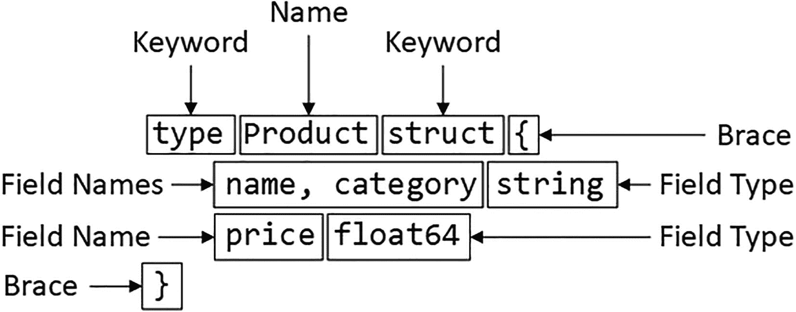

**图 10-1**

定义结构体类型

此结构体类型名为 `Product`，它有三个字段：`name` 和 `category` 字段保存 `string` 值，`price` 字段保存 `float64` 值。`name` 和 `category` 字段具有相同的类型，可以一起定义。

**GO 语言中的类在哪里？**

Go 语言不像其他语言那样区分结构体和类。所有自定义数据类型都定义为结构体，而决定按引用还是按值传递取决于是否使用指针。正如我在第 4 章中解释的那样，这达到了与拥有单独类型类别相同的效果，并且具有额外的灵活性，允许在每次使用值时都可以做出选择。然而，这要求程序员更加勤勉，在编码过程中必须仔细思考该选择的后果。两种方法没有孰优孰劣，结果本质上是相同的。


### 创建结构体值

下一步是使用自定义类型创建一个值，这需要用到结构体类型名称，后跟包含结构体字段值的大括号，如图 10-2 所示。

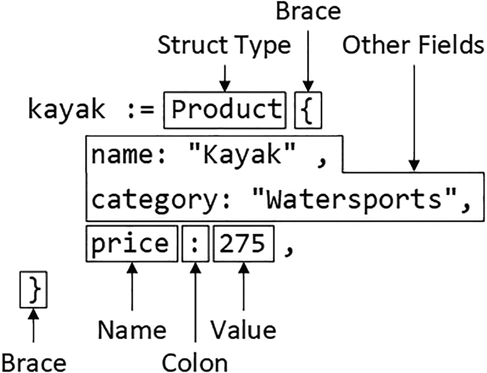

**图 10-2** – 创建结构体值

清单 10-4 中创建的值是一个 `Product`，其 `name` 字段被赋值为 `Kayak`，`category` 字段为 `Watersports`，`price` 字段为 `275`。该结构体值被赋值给一个名为 `kayak` 的变量。

Go 对语法要求严格，如果最后一个字段的值后面没有逗号或右花括号，就会报错。我通常倾向于使用尾随逗号，这样可以将右花括号放在代码文件的下一行，就像我在第 7 章处理映射字面量语法时那样。

> **注意：** Go 不允许结构体与 `const` 关键字一起使用，如果你试图定义一个常量结构体，编译器会报错。只有第 9 章中描述的数据类型才能用于创建常量。

### 使用结构体值

结构体值的字段通过变量名来访问，因此，赋值给 `kayak` 变量的结构体值的 `name` 字段的值，可以通过 `kayak.name` 来访问，如图 10-3 所示。

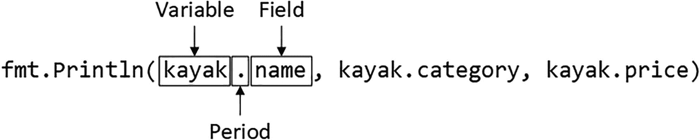

**图 10-3** – 访问结构体字段

可以使用相同的语法为结构体字段赋予新值，如图 10-4 所示。

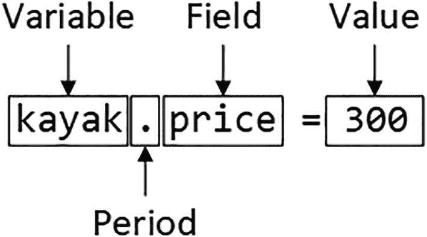

**图 10-4** – 修改结构体字段

该语句将 `kayak` 变量所赋值的 `Product` 结构体值的 `price` 字段设置为 `300`。清单 10-4 中的代码在编译和执行后会产生以下输出：

```
Kayak Watersports 275
Changed price: 300
```

**理解结构体标签**

结构体类型可以使用标签来定义，这些标签提供了关于字段应如何处理的信息。结构体标签只是字符串，由处理结构体值的代码通过 `reflect` 包提供的功能来解释。关于如何使用结构体标签来改变结构体在 JSON 数据中的编码方式，请参见第 21 章；关于如何自行访问结构体标签的详细信息，请参见第 28 章。

### 部分赋值结构体值

创建结构体值时，不必为所有字段提供值，如清单 10-5 所示。

```go
package main
import "fmt"
func main() {
type Product struct {
name, category string
price float64
}
kayak := Product {
name: "Kayak",
category: "Watersports",
}
fmt.Println(kayak.name, kayak.category, kayak.price)
kayak.price = 300
fmt.Println("Changed price:", kayak.price)
}
```

**清单 10-5** – 在 `structs` 文件夹的 `main.go` 文件中分配部分字段

没有为赋值给 `kayak` 变量的结构体的 `price` 字段提供初始值。当字段未提供值时，会使用该字段类型的零值。对于清单 10-5，`price` 字段的零值是 `0`，因为该字段类型是 `float64`；代码在编译和执行后会产生以下输出：

```
Kayak Watersports 0
Changed price: 300
```

如输出所示，省略初始值并不会阻止后续为该字段赋值。

如果你定义了一个结构体类型的变量但没有为其赋值，那么所有字段都会被赋予零值，如清单 10-6 所示。

```go
package main
import "fmt"
func main() {
type Product struct {
name, category string
price float64
}
kayak := Product {
name: "Kayak",
category: "Watersports",
}
fmt.Println(kayak.name, kayak.category, kayak.price)
kayak.price = 300
fmt.Println("Changed price:", kayak.price)
var lifejacket Product
fmt.Println("Name is zero value:", lifejacket.name == "")
fmt.Println("Category is zero value:", lifejacket.category == "")
fmt.Println("Price is zero value:", lifejacket.price == 0)
}
```

**清单 10-6** – 在 `structs` 文件夹的 `main.go` 文件中未赋值的变量

`lifejacket` 变量的类型是 `Product`，但其字段没有被赋予任何值。`lifejacket` 的所有字段的值都是其类型的零值，这由清单 10-6 的输出所证实：

```
Kayak Watersports 0
Changed price: 300
Name is zero value: true
Category is zero value: true
Price is zero value: true
```

**使用 `new` 函数创建结构体值**

你可能会看到使用内置的 `new` 函数来创建结构体值的代码，如下所示：

```go
...
var lifejacket = new(Product)
...
```

结果是一个指向结构体值的指针，该结构体值的字段被初始化为其类型的零值。这等价于以下语句：

```go
...
var lifejacket = &Product{}
...
```

这两种方法可以互换，选择哪种取决于个人偏好。

### 使用字段位置创建结构体值

结构体值可以不用字段名来定义，只要值的类型与结构体类型定义字段的顺序相对应即可，如清单 10-7 所示。

```go
package main
import "fmt"
func main() {
type Product struct {
name, category string
price float64
}
var kayak = Product { "Kayak", "Watersports", 275.00 }
fmt.Println("Name:", kayak.name)
fmt.Println("Category:", kayak.category)
fmt.Println("Price:", kayak.price)
}
```

**清单 10-7** – 在 `structs` 文件夹的 `main.go` 文件中省略字段名

用于定义结构体值的字面量语法仅包含值，这些值按照指定的顺序分配给结构体字段。清单 10-7 中的代码会产生以下输出：

```
Name: Kayak
Category: Watersports
Price: 275
```


### 定义嵌入字段

如果一个字段定义时没有名称，则称为*嵌入字段*，并通过其类型名称来访问，如代码清单 10-8 所示。

```
package main
import "fmt"
func main() {
type Product struct {
name, category string
price float64
}
type StockLevel struct {
Product
count int
}
stockItem := StockLevel {
Product: Product { "Kayak", "Watersports", 275.00 },
count: 100,
}
fmt.Println("Name:", stockItem.Product.name)
fmt.Println("Count:", stockItem.count
}
代码清单 10-8
在 structs 文件夹的 main.go 文件中定义嵌入字段
```

`StockLevel` 结构体类型有两个字段。第一个字段是嵌入字段，仅通过类型（即 `Product` 结构体类型）来定义，如图 10-5 所示。

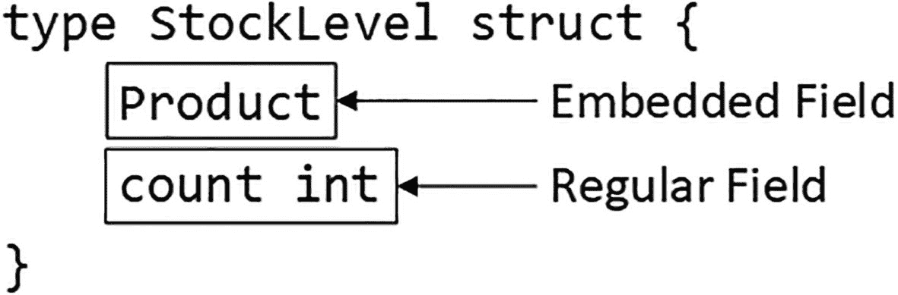

图 10-5
定义嵌入字段

嵌入字段通过字段类型的名称来访问，这就是该特性对于字段类型为结构体的情形最为有用的原因。在此例中，嵌入字段使用 `Product` 类型定义，这意味着使用 `Product` 作为字段名称对其进行赋值和读取，如下所示：

```
...
stockItem := StockLevel {
Product: Product { "Kayak", "Watersports", 275.00 },
count: 100,
}
...
fmt.Println(fmt.Sprint("Name: ", stockItem.Product.name))
...
```

编译并执行代码清单 10-8 中的代码，将产生以下输出：

```
Name: Kayak
Count: 100
```

如前所述，字段名称在结构体类型中必须是唯一的，这意味着对于特定类型，只能定义一个嵌入字段。如果需要定义两个相同类型的字段，则必须为其中一个字段赋予名称，如代码清单 10-9 所示。

```
package main
import "fmt"
func main() {
type Product struct {
name, category string
price float64
}
type StockLevel struct {
Product
Alternate Product
count int
}
stockItem := StockLevel {
Product: Product { "Kayak", "Watersports", 275.00 },
Alternate: Product{"Lifejacket", "Watersports", 48.95 },
count: 100,
}
fmt.Println("Name:", stockItem.Product.name)
fmt.Println("Alt Name:", stockItem.Alternate.name)
}
代码清单 10-9
在 structs 文件夹的 main.go 文件中定义一个额外的字段
```

`StockLevel` 类型有两个 `Product` 类型的字段，但其中只能有一个是嵌入字段。对于第二个字段，我为其指定了一个名称，用于后续访问该字段。编译并执行代码清单 10-9 中的代码，将产生以下输出：

```
Name: Kayak
Alt Name: Lifejacket
```

### 比较结构体值

如果结构体的所有字段都可以进行比较，那么结构体值本身也是可比较的。代码清单 10-10 创建了几个结构体值，并使用比较运算符来判断它们是否相等。

```
package main
import "fmt"
func main() {
type Product struct {
name, category string
price float64
}
p1 := Product { name: "Kayak", category: "Watersports", price: 275.00 }
p2 := Product { name: "Kayak", category: "Watersports", price: 275.00 }
p3 := Product { name: "Kayak", category: "Boats", price: 275.00 }
fmt.Println("p1 == p2:", p1 == p2)
fmt.Println("p1 == p3:", p1 == p3)
}
代码清单 10-10
在 structs 文件夹的 main.go 文件中比较结构体值
```

结构体值 `p1` 和 `p2` 相等，因为它们的字段全部相等。结构体值 `p1` 和 `p3` 不相等，因为它们的 `category` 字段所赋予的值不同。编译并执行项目，你会看到以下结果：

```
p1 == p2: true
p1 == p3: false
```

如果结构体类型定义了不可比较类型的字段，例如切片（slice），则该结构体无法进行比较，如代码清单 10-11 所示。

```
package main
import "fmt"
func main() {
type Product struct {
name, category string
price float64
otherNames []string
}
p1 := Product { name: "Kayak", category: "Watersports", price: 275.00 }
p2 := Product { name: "Kayak", category: "Watersports", price: 275.00 }
p3 := Product { name: "Kayak", category: "Boats", price: 275.00 }
fmt.Println("p1 == p2:", p1 == p2)
fmt.Println("p1 == p3:", p1 == p3)
}
代码清单 10-11
在 structs 文件夹的 main.go 文件中添加一个不可比较的字段
```

如第 7 章所述，Go 的比较运算符不能用于切片，这意味着 `Product` 值无法进行比较。编译这段代码时，会产生以下错误：

```
.\main.go:17:33: 无效操作: p1 == p2 (包含 []string 的结构体无法比较)
.\main.go:18:33: 无效操作: p1 == p3 (包含 []string 的结构体无法比较)
```

#### 结构体类型之间的转换

一个结构体类型可以转换为任何具有相同字段的其他结构体类型，即所有字段必须具有相同的名称、类型，并且按照相同的顺序定义，如代码清单 10-12 所示。

```
package main
import "fmt"
func main() {
type Product struct {
name, category string
price float64
//otherNames []string
}
type Item struct {
name string
category string
price float64
}
prod := Product { name: "Kayak", category: "Watersports", price: 275.00 }
item := Item { name: "Kayak", category: "Watersports", price: 275.00 }
fmt.Println("prod == item:", prod == Product(item))
}
代码清单 10-12
在 structs 文件夹的 main.go 文件中转换结构体类型
```

由 `Product` 和 `Item` 结构体类型创建的值可以进行比较，因为它们按照相同的顺序定义了相同的字段。编译并执行项目；你会看到以下输出：

```
prod == item: true
```


### 定义匿名结构体类型

匿名结构体类型在定义时不使用名称，如代码清单 10-13 所示。

```
package main
import "fmt"
func writeName(val struct {
name, category string
price float64}) {
fmt.Println("Name:", val.name)
}
func main() {
type Product struct {
name, category string
price float64
//otherNames []string
}
type Item struct {
name string
category string
price float64
}
prod := Product { name: "Kayak", category: "Watersports", price: 275.00 }
item := Item { name: "Stadium", category: "Soccer", price: 75000 }
writeName(prod)
writeName(item)
}
```

`writeName` 函数使用匿名结构体类型作为其参数，这意味着它可以接受任何定义了指定字段集合的结构体类型。编译并执行该项目，你将看到以下输出：

```
Name: Kayak
Name: Stadium
```

我并不觉得这个功能如代码清单 10-13 所示那样特别有用，但有一种变体我确实会用到，那就是在一步之内定义匿名结构体并为其赋值。这在调用那些在运行时利用 `reflect` 包提供的功能来检查其接收类型的代码时非常有用，我将在第 27 章到第 29 章中介绍这一点。`reflect` 包包含高级功能，但它也被标准库的其他部分使用，例如对 JSON 数据编码的内置支持。我将在第 21 章详细解释 JSON 功能，但就本章而言，代码清单 10-14 演示了如何使用匿名结构体来选择要包含在 JSON 字符串中的字段。

```
package main
import (
"fmt"
"encoding/json"
"strings"
)
func main() {
type Product struct {
name, category string
price float64
}
prod := Product { name: "Kayak", category: "Watersports", price: 275.00 }
var builder strings.Builder
json.NewEncoder(&builder).Encode(struct {
ProductName string
ProductPrice float64
}{
ProductName: prod.name,
ProductPrice: prod.price,
})
fmt.Println(builder.String())
}
```

不用担心 `encoding/json` 和 `strings` 包，这些将在后续章节中介绍。这个示例演示了如何一步定义匿名结构体并为其赋值，我在代码清单 10-14 中使用它创建了一个具有 `ProductName` 和 `ProductPrice` 字段的结构体，然后使用 `Product` 字段中的值为其赋值。编译并执行该项目，你将看到以下输出：

```
{"ProductName":"Kayak","ProductPrice":275}
```

## 创建包含结构体值的数组、切片和映射

在使用结构体值填充数组、切片和映射时，可以省略结构体类型，如代码清单 10-15 所示。

```
package main
import "fmt"
func main() {
type Product struct {
name, category string
price float64
//otherNames []string
}
type StockLevel struct {
Product
Alternate Product
count int
}
array := [1]StockLevel {
{
Product: Product { "Kayak", "Watersports", 275.00 },
Alternate: Product{"Lifejacket", "Watersports", 48.95 },
count: 100,
},
}
fmt.Println("Array:", array[0].Product.name)
slice := []StockLevel {
{
Product: Product { "Kayak", "Watersports", 275.00 },
Alternate: Product{"Lifejacket", "Watersports", 48.95 },
count: 100,
},
}
fmt.Println("Slice:", slice[0].Product.name)
kvp := map[string]StockLevel {
"kayak": {
Product: Product { "Kayak", "Watersports", 275.00 },
Alternate: Product{"Lifejacket", "Watersports", 48.95 },
count: 100,
},
}
fmt.Println("Map:", kvp["kayak"].Product.name)
}
```

代码清单 10-15 中的代码创建了一个数组、一个切片和一个映射，它们都填充了一个 `StockLevel` 值。编译器可以从包含的数据结构中推断出结构体值的类型，从而使代码表达更简洁。代码清单 10-15 产生以下输出：

```
Array: Kayak
Slice: Kayak
Map: Kayak
```

## 理解结构体与指针

将结构体赋值给一个新变量或将结构体用作函数参数时，会创建一个复制了字段值的新值，如代码清单 10-16 所示。

```
package main
import "fmt"
func main() {
type Product struct {
name, category string
price float64
}
p1 := Product {
name: "Kayak",
category: "Watersports",
price: 275,
}
p2 := p1
p1.name = "Original Kayak"
fmt.Println("P1:", p1.name)
fmt.Println("P2:", p2.name)
}
```

创建了一个结构体值并分配给变量 `p1`，然后复制给变量 `p2`。第一个结构体值的 `name` 字段被更改，然后两个 `name` 值都被打印出来。代码清单 10-16 的输出证实了赋值结构体值会创建一个副本：

```
P1: Original Kayak
P2: Kayak
```

与其他数据类型一样，可以使用指针创建对结构体值的引用，如代码清单 10-17 所示。

```
package main
import "fmt"
func main() {
type Product struct {
name, category string
price float64
}
p1 := Product {
name: "Kayak",
category: "Watersports",
price: 275,
}
p2 := &p1
p1.name = "Original Kayak"
fmt.Println("P1:", p1.name)
fmt.Println("P2:", (*p2).name)
}
```

我使用一个与号（&）创建了一个指向 `p1` 变量的指针，并将该地址赋给了 `p2`，`p2` 的类型变为 `*Product`，这意味着它是一个指向 `Product` 值的指针。请注意，我必须使用括号来解引用指针以访问结构体值，然后读取 `name` 字段的值，如图 10-6 所示。

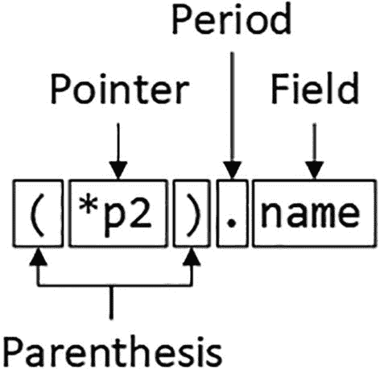

**图 10-6** 通过指针读取结构体字段

其效果是，对 `name` 字段所做的更改可以通过 `p1` 和 `p2` 两者读取到，当代码被编译并执行时，会产生以下输出：

```
P1: Original Kayak
P2: Original Kayak
```


### 理解结构体指针便捷语法

通过指针访问结构体字段的方式有些笨拙，这成为一个问题，因为结构体常被用作函数参数和返回值，需要使用指针来确保结构体不被不必要地复制，并且函数所做的更改能影响作为参数接收的值，如代码清单 10-18 所示。

```go
package main
import "fmt"
type Product struct {
name, category string
price float64
}
func calcTax(product *Product) {
if ((*product).price > 100) {
(*product).price += (*product).price * 0.2
}
}
func main() {
kayak := Product {
name: "Kayak",
category: "Watersports",
price: 275,
}
calcTax(&kayak)
fmt.Println("Name:", kayak.name, "Category:",
kayak.category, "Price", kayak.price)
}
```
*代码清单 10-18 - 在 structs 文件夹的 main.go 文件中使用结构体指针*

这段代码能工作，但可读性差，尤其是在同一段代码中有多处引用时，比如 `calcTax` 方法的函数体。

为了简化这类代码，Go 允许在访问结构体字段时无需星号就能跟随指针，如代码清单 10-19 所示。

```go
package main
import "fmt"
type Product struct {
name, category string
price float64
}
func calcTax(product *Product) {
if (product.price > 100) {
product.price += product.price * 0.2
}
}
func main() {
kayak := Product {
name: "Kayak",
category: "Watersports",
price: 275,
}
calcTax(&kayak)
fmt.Println("Name:", kayak.name, "Category:",
kayak.category, "Price", kayak.price)
}
```
*代码清单 10-19 - 在 structs 文件夹的 main.go 文件中使用结构体指针便捷语法*

星号和括号不再是必需的，这使得指向结构体的指针可以被当作结构体值来对待，如图 10-7 所示。

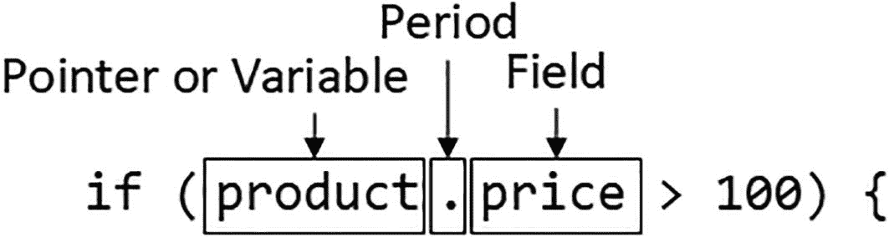

*图 10-7 - 使用结构体或指向结构体的指针*

这个特性不会改变函数参数的数据类型，其仍然是 `*Product`，并且仅适用于访问字段时。代码清单 10-18 和 10-19 都产生如下输出：

```
Name: Kayak Category: Watersports Price 330
```

### 理解指向值的指针

之前的示例分两步使用指针。第一步是创建一个值并将其赋值给一个变量，像这样：

```go
...
kayak := Product {
name: "Kayak",
category: "Watersports",
price: 275,
}
...
```

第二步是使用取地址运算符来创建指针，像这样：

```go
...
calcTax(&kayak)
...
```

在创建指针之前，无需将结构体值赋值给变量，取地址运算符可以直接与字面量结构体语法一起使用，如代码清单 10-20 所示。

```go
package main
import "fmt"
type Product struct {
name, category string
price float64
}
func calcTax(product *Product) {
if (product.price > 100) {
product.price += product.price * 0.2
}
}
func main() {
kayak := &Product {
name: "Kayak",
category: "Watersports",
price: 275,
}
calcTax(kayak)
fmt.Println("Name:", kayak.name, "Category:",
kayak.category, "Price", kayak.price)
}
```
*代码清单 10-20 - 在 structs 文件夹的 main.go 文件中直接创建指针*

取地址运算符用在结构体类型之前，如图 10-8 所示。

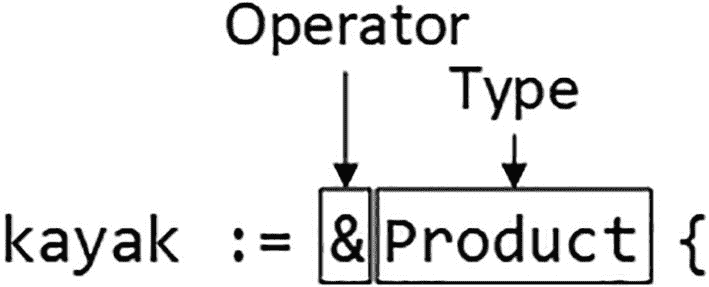

*图 10-8 - 创建指向结构体值的指针*

代码清单 10-20 中的代码只使用了一个指向 `Product` 值的指针，这意味着先创建常规变量再用来创建指针毫无益处。能够直接从值创建指针有助于使代码更简洁，如代码清单 10-21 所示。

```go
package main
import "fmt"
type Product struct {
name, category string
price float64
}
func calcTax(product *Product) *Product {
if (product.price > 100) {
product.price += product.price * 0.2
}
return product
}
func main() {
kayak := calcTax(&Product {
name: "Kayak",
category: "Watersports",
price: 275,
})
fmt.Println("Name:", kayak.name, "Category:",
kayak.category, "Price", kayak.price)
}
```
*代码清单 10-21 - 在 structs 文件夹的 main.go 文件中直接使用指针*

我修改了 `calcTax` 函数，使其返回一个结果，这样函数就能通过指针对 `Product` 值进行转换。在 `main` 函数中，我使用取地址运算符结合字面量语法创建了一个 `Product` 值，并将其指针传递给 `calcTax` 函数，然后将转换后的结果赋值给类型为 `*Pointer` 的变量。代码清单 10-20 和 10-21 都产生如下输出：

```
Name: Kayak Category: Watersports Price 330
```


### 理解结构体构造函数

构造函数负责使用通过参数接收的值来创建结构体值，如代码清单 10-22 所示。

```
package main
import "fmt"
type Product struct {
name, category string
price float64
}
func newProduct(name, category string, price float64) *Product {
return &Product{name, category, price}
}
func main() {
products := [2]*Product {
newProduct("Kayak", "Watersports", 275),
newProduct("Hat", "Skiing", 42.50),
}
for _, p := range products {
fmt.Println("Name:", p.name, "Category:",  p.category, "Price", p.price)
}
}
代码清单 10-22
在 structs 文件夹的 main.go 文件中定义构造函数
```

构造函数用于一致地创建结构体值。构造函数通常命名为 `new` 或 `New`，后跟结构体类型，例如用于创建 `Product` 值的构造函数命名为 `newProduct`。（我将在第 12 章解释为什么构造函数名称通常以大写字母开头。）

构造函数返回结构体指针，地址运算符直接与结构体字面量语法一起使用，如图 10-9 所示。

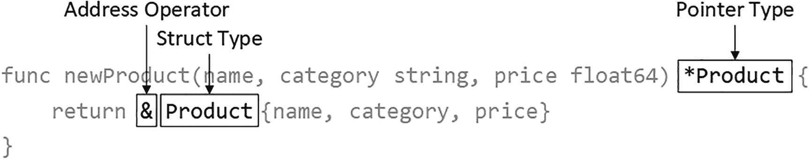

图 10-9
在构造函数中使用指针

我喜欢在构造函数中通过依赖字段位置来创建值，如代码清单 10-22 所示，尽管这只是我的个人偏好。重要的是要记住返回一个指针，以避免函数返回时结构体值被复制。代码清单 10-22 使用数组存储产品数据，你可以在数组类型中看到指针的使用：

```
...
products := [2]*Product {
...
```

此类型指定一个包含两个指向 `Product` 结构体值的指针的数组。代码清单 10-22 中的代码编译并执行后会产生以下输出：

```
Name: Kayak Category: Watersports Price 275
Name: Hat Category: Skiing Price 42.5
```

使用构造函数的好处是一致性，确保对构造过程的更改会反映在该函数创建的所有结构体值中。例如，代码清单 10-23 修改了构造函数以对所有产品应用折扣。

```
...
func newProduct(name, category string, price float64) *Product {
return &Product{name, category, price - 10}
}
...
代码清单 10-23
在 structs 文件夹的 main.go 文件中修改构造函数
```

这是一个简单的更改，但它将应用于由 `newProduct` 函数创建的所有 `Product` 值，这意味着我不必在代码中找到所有创建 `Product` 值的地方并逐一修改。遗憾的是，Go 在定义了构造函数后并不会阻止使用字面量语法，这意味着需要自觉使用构造函数。代码清单 10-23 中的代码会产生以下输出：

```
Name: Kayak Category: Watersports Price 265
Name: Hat Category: Skiing Price 32.5
```

### 为结构体字段使用指针类型

指针也可以用于 `struct` 字段，包括指向其他结构体类型的指针，如代码清单 10-24 所示。

```
package main
import "fmt"
type Product struct {
name, category string
price float64
*Supplier
}
type Supplier struct {
name, city string
}
func newProduct(name, category string, price float64, supplier *Supplier) *Product {
return &Product{name, category, price -10, supplier}
}
func main() {
acme := &Supplier { "Acme Co", "New York"}
products := [2]*Product {
newProduct("Kayak", "Watersports", 275, acme),
newProduct("Hat", "Skiing", 42.50, acme),
}
for _, p := range products {
fmt.Println("Name:", p.name, "Supplier:",
p.Supplier.name, p.Supplier.city)
}
}
代码清单 10-24
在 structs 文件夹的 main.go 文件中为结构体字段使用指针
```

我向 `Product` 类型添加了一个嵌入字段，该字段使用 `Supplier` 类型，并更新了 `newProduct` 函数，使其接受一个指向 `Supplier` 的指针。通过 `Product` 结构体定义的字段来访问 `Supplier` 结构体定义的字段，如图 10-10 所示。

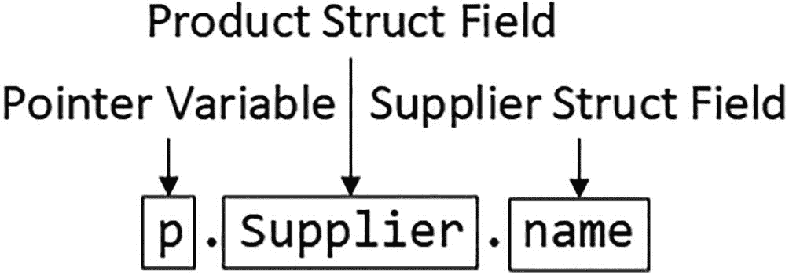

图 10-10
访问嵌套的结构体字段

请注意 Go 如何处理嵌入结构体字段的指针类型使用，它允许我通过结构体类型的名称来引用该字段，在此例中 `Supplier` 就是该名称。代码清单 10-24 中的代码会产生以下输出：

```
Name: Kayak Supplier: Acme Co New York
Name: Hat Supplier: Acme Co New York
```


### 理解指针字段的复制

复制结构体时，必须注意对指针字段的影响，如代码清单 10-25 所示。

```
package main
import "fmt"
type Product struct {
name, category string
price float64
*Supplier
}
type Supplier struct {
name, city string
}
func newProduct(name, category string, price float64, supplier *Supplier) *Product {
return &Product{name, category, price -10, supplier}
}
func main() {
acme := &Supplier { "Acme Co", "New York"}
p1 := newProduct("Kayak", "Watersports", 275, acme)
p2 := *p1
p1.name = "Original Kayak"
p1.Supplier.name = "BoatCo"
for _, p := range []Product { *p1, p2 } {
fmt.Println("Name:", p.name, "Supplier:",
p.Supplier.name, p.Supplier.city)
}
}
代码清单 10-25
在 structs 文件夹的 main.go 文件中复制一个结构体
```

`newProduct` 函数用于创建一个指向 `Product` 值的指针，该指针被赋值给一个名为 `p1` 的变量。该指针被解引用并赋值给一个名为 `p2` 的变量，其效果是复制了 `Product` 值。接着修改了 `p1.name` 和 `p1.Supplier.name` 字段，然后使用 `for` 循环输出这两个 `Product` 值的详细信息，产生如下输出：

```
Name: Original Kayak Supplier: BoatCo New York
Name: Kayak Supplier: BoatCo New York
```

输出显示，对 `name` 字段的修改仅影响了一个 `Product` 值，而对 `Supplier.name` 字段的修改则影响了两个值。这是因为复制 `Product` 结构体时，复制的是赋值给 `Supplier` 字段的指针，而不是该指针所指向的值，从而产生了如图 10-11 所示的效果。

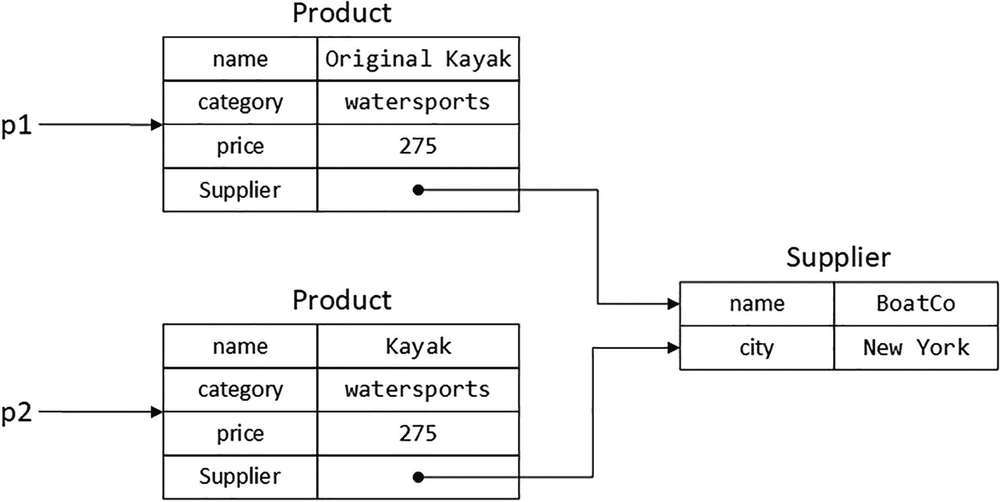

图 10-11

复制一个包含指针字段的结构体所产生的效果

这通常被称为*浅拷贝*，即指针被复制，但指针所指向的值并未被复制。Go 语言没有内置支持执行*深拷贝*（即跟随指针并复制其指向的值）。相反，必须手动执行复制，如代码清单 10-26 所示。

```
package main
import "fmt"
type Product struct {
name, category string
price float64
*Supplier
}
type Supplier struct {
name, city string
}
func newProduct(name, category string, price float64, supplier *Supplier) *Product {
return &Product{name, category, price -10, supplier}
}
func copyProduct(product *Product) Product {
p := *product
s := *product.Supplier
p.Supplier = &s
return p
}
func main() {
acme := &Supplier { "Acme Co", "New York"}
p1 := newProduct("Kayak", "Watersports", 275, acme)
p2 := copyProduct(p1)
p1.name = "Original Kayak"
p1.Supplier.name = "BoatCo"
for _, p := range []Product { *p1, p2 } {
fmt.Println("Name:", p.name, "Supplier:",
p.Supplier.name, p.Supplier.city)
}
}
代码清单 10-26
在 structs 文件夹的 main.go 文件中复制一个结构体值
```

为了确保 `Supplier` 被复制，`copyProduct` 函数将其赋值给一个单独的变量，然后创建一个指向该变量的指针。这种方法虽然笨拙，但效果是强制复制了该结构体——尽管这是一种特定于单一结构体类型的技术，并且必须为每个嵌套的结构体字段重复执行。代码清单 10-26 的输出显示了深拷贝的效果：

```
Name: Original Kayak Supplier: BoatCo New York
Name: Kayak Supplier: Acme Co New York
```

## 理解结构体与结构体指针的零值

结构体类型的零值是一个结构体值，其所有字段都被赋予其类型的零值。指向结构体的指针的零值是 `nil`，如代码清单 10-27 所示。

```
package main
import "fmt"
type Product struct {
name, category string
price float64
}
func main() {
var prod Product
var prodPtr *Product
fmt.Println("Value:", prod.name, prod.category, prod.price)
fmt.Println("Pointer:", prodPtr)
}
代码清单 10-27
在 structs 文件夹的 main.go 文件中检查零类型
```

编译并执行该项目，你会在输出中看到零值，其中 `name` 和 `category` 字段为空字符串，因为空字符串是 `string` 类型的零值：

```
Value: 0
Pointer: <nil>
```

这里有一个我经常遇到的陷阱：当结构体定义了一个指向另一个结构体类型的指针字段时，如代码清单 10-28 所示。

```
package main
import "fmt"
type Product struct {
name, category string
price float64
*Supplier
}
type Supplier struct {
name, city string
}
func main() {
var prod Product
var prodPtr *Product
fmt.Println("Value:", prod.name, prod.category, prod.price, prod.Supplier.name)
fmt.Println("Pointer:", prodPtr)
}
代码清单 10-28
在 structs 文件夹的 main.go 文件中添加一个指针字段
```

这里的问题在于尝试访问内嵌结构体的 `name` 字段。内嵌字段的零值是 `nil`，这会导致以下运行时错误：

```
panic: runtime error: invalid memory address or nil pointer dereference
[signal 0xc0000005 code=0x0 addr=0x0 pc=0x5bc592]
goroutine 1 [running]:
main.main()
C:/structs/main.go:20 +0x92
exit status 2
```

我经常遇到这个错误，以至于习惯性地初始化结构体指针字段，如代码清单 10-29 所示，并且在后续章节中也会经常重复这种做法。

```
...
func main() {
var prod Product = Product{ Supplier: &Supplier{}}
var prodPtr *Product
fmt.Println("Value:", prod.name, prod.category, prod.price, prod.Supplier.name)
fmt.Println("Pointer:", prodPtr)
}
...
代码清单 10-29
在 structs 文件夹的 main.go 文件中初始化一个结构体指针字段
```

这避免了运行时错误，你可以通过编译并执行该项目产生的输出看到：

```
Value:   0
Pointer: <nil>
```

## 总结

在本章中，我描述了 Go 语言的结构体特性，该特性用于创建自定义数据类型。我解释了如何定义结构体字段、如何从结构体类型创建值，以及如何在集合中使用结构体类型。我还向你展示了如何创建匿名结构体，以及如何使用指针来控制结构体值被复制时值的处理方式。下一章，我将介绍 Go 语言对方法和接口的支持。


# 11. 使用方法和接口

在本章中，我将介绍 Go 对方法的支持，这些方法可用于为结构体提供功能，并通过接口创建抽象。表 11-1 将这些功能放在上下文中。

表 11-1
将方法和接口置于上下文中

| 问题 | 答案 |
| --- | --- |
| 它们是什么？ | 方法是在结构体上调用的函数，可以访问该值类型定义的所有字段。接口定义了一组方法，可以由结构体类型实现。 |
| 为什么它们有用？ | 这些功能允许类型通过其共同特征进行混合和使用。 |
| 如何使用它们？ | 方法使用 `func` 关键字定义，但额外添加了一个接收者。接口使用 `type` 和 `interface` 关键字定义。 |
| 是否存在任何陷阱或限制？ | 在创建方法时，谨慎使用指针很重要；使用接口时也需小心，以避免底层动态类型带来的问题。 |
| 是否有替代方案？ | 这些是可选功能，但它们使得创建复杂数据类型并通过其提供的常见功能使用它们成为可能。 |

表 11-2 总结了本章内容。

表 11-2
章节总结

| 问题 | 解决方案 | 清单 |
| --- | --- | --- |
| 定义方法 | 使用函数语法，但添加一个接收者，通过该接收者调用方法 | 4–8, 13–15 |
| 对结构体值的引用调用方法 | 为方法接收者使用指针 | 9, 10 |
| 在非结构体类型上定义方法 | 使用类型别名 | 11, 12 |
| 描述多个类型将共享的共同特征 | 定义一个接口 | 16 |
| 实现接口 | 使用选定的结构体类型作为接收者，定义接口指定的所有方法 | 17, 18 |
| 使用接口 | 对接口值调用方法 | 19–21 |
| 确定将结构体值赋值给接口变量时是否会复制该值 | 赋值时使用指针或值，或在实现接口方法时使用指针类型作为接收者 | 22–25 |
| 比较接口值 | 使用比较运算符，并确保动态类型是可比较的 | 26, 27 |
| 访问接口值的动态类型 | 使用类型断言 | 28–31 |
| 定义可以赋值任何值的变量 | 使用空接口 | 32–34 |

## 本章准备

为准备本章，打开一个新的命令提示符，导航到一个方便的位置，并创建一个名为 `methodsAndInterfaces` 的目录。导航到 `methodsAndInterfaces` 文件夹并运行清单 11-1 中所示的命令来初始化项目。

```
go mod init methodsandinterfaces
清单 11-1
初始化项目
```

在 `methodsAndInterfaces` 文件夹中添加一个名为 `main.go` 的文件，内容如清单 11-2 所示。

提示
你可以从 [`https://github.com/apress/pro-go`](https://github.com/apress/pro-go) 下载本章以及本书所有其他章节的示例项目。如果在运行示例时遇到问题，请参阅第 2 章了解如何获得帮助。

```
package main
import "fmt"
type Product struct {
name, category string
price float64
}
func main() {
products := []*Product {
{"Kayak", "Watersports", 275 },
{"Lifejacket", "Watersports", 48.95 },
{"Soccer Ball", "Soccer", 19.50},
}
for _, p := range products {
fmt.Println("Name:", p.name, "Category:", p.category, "Price", p.price)
}
}
清单 11-2
methodsAndInterfaces 文件夹中 main.go 文件的内容
```

使用命令提示符在 `methodsAndInterfaces` 文件夹中运行清单 11-3 中所示的命令。

```
go run .
清单 11-3
运行示例项目
```

`main.go` 文件中的代码将被编译并执行，产生以下输出：

```
Name: Kayak Category: Watersports Price 275
Name: Lifejacket Category: Watersports Price 48.95
Name: Soccer Ball Category: Soccer Price 19.5
```

## 定义和使用方法

方法是可以通过值调用的函数，是表达对特定类型进行操作的函数的便捷方式。理解方法如何工作的最佳方式是从常规函数开始，如清单 11-4 所示。

```
package main
import "fmt"
type Product struct {
name, category string
price float64
}
func printDetails(product *Product) {
fmt.Println("Name:", product.name, "Category:", product.category,
"Price", product.price)
}
func main() {
products := []*Product {
{"Kayak", "Watersports", 275 },
{"Lifejacket", "Watersports", 48.95 },
{"Soccer Ball", "Soccer", 19.50},
}
for _, p := range products {
printDetails(p)
}
}
清单 11-4
在 methodsAndInterfaces 文件夹的 main.go 文件中定义函数
```

`printDetails` 函数接收一个指向 `Product` 类型的指针，并用它来输出 `name`、`category` 和 `price` 字段的值。本节的关键点是 `printDetails` 函数的调用方式：

```
...
printDetails(p)
...
```

函数名后面跟着用括号括起来的参数。清单 11-5 将相同的功能实现为方法。

```
package main
import "fmt"
type Product struct {
name, category string
price float64
}
func newProduct(name, category string, price float64) *Product {
return &Product{ name, category, price }
}
func (product *Product) printDetails() {
fmt.Println("Name:", product.name, "Category:", product.category,
"Price", product.price)
}
func main() {
products := []*Product {
newProduct("Kayak", "Watersports", 275),
newProduct("Lifejacket", "Watersports", 48.95),
newProduct("Soccer Ball", "Soccer", 19.50),
}
for _, p := range products {
p.printDetails()
}
}
清单 11-5
在 methodsAndInterfaces 文件夹的 main.go 文件中定义方法
```

方法定义为函数，使用相同的 `func` 关键字，但额外添加了一个*接收者*，它表示一个特殊参数，即方法操作的类型，如图 11-1 所示。

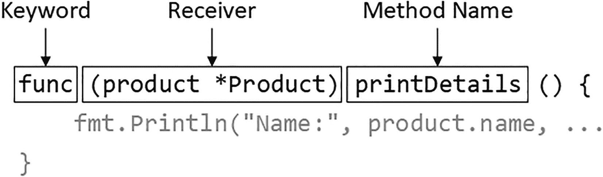

图 11-1
方法

此方法的接收者类型是 `*Product`，并命名为 `product`，可以像任何普通函数参数一样在方法内部使用。代码块无需更改，可以将接收者视为常规函数参数：

```
...
func (product *Product) printDetails() {
fmt.Println("Name:", product.name, "Category:", product.category,
"Price", product.price)
}
...
```

方法不同于常规函数之处在于方法的调用方式：

```
...
p.printDetails()
...
```

方法通过一个其类型与接收者匹配的值来调用。在此示例中，我使用由 `for` 循环生成的 `*Product` 值来调用切片中每个值的 `printDetails` 方法，产生以下输出：

```
Name: Kayak Category: Watersports Price 275
Name: Lifejacket Category: Watersports Price 48.95
Name: Soccer Ball Category: Soccer Price 19.5
```


### 定义方法参数与返回值

方法可以定义参数和返回值，这与普通函数类似，如代码清单 11-6 所示，但额外增加了接收者。

```
package main
import "fmt"
type Product struct {
name, category string
price float64
}
func newProduct(name, category string, price float64) *Product {
return &Product{ name, category, price }
}
func (product *Product) printDetails() {
fmt.Println("Name:", product.name, "Category:", product.category,
"Price",  product.calcTax(0.2, 100))
}
func (product *Product) calcTax(rate, threshold float64) float64 {
if (product.price > threshold) {
return product.price + (product.price * rate)
}
return product.price;
}
func main() {
products := []*Product {
newProduct("Kayak", "Watersports", 275),
newProduct("Lifejacket", "Watersports", 48.95),
newProduct("Soccer Ball", "Soccer", 19.50),
}
for _, p := range products {
p.printDetails()
}
}
代码清单 11-6
methodsAndInterfaces 文件夹中 main.go 文件内的参数与返回值
```

方法参数定义在方法名之后的圆括号内，其后是返回值类型，如图 11-2 所示。

![[external image]](images/512642_1_En_11_Chapter/512642_1_En_11_Fig2_HTML.jpg)

图 11-2

包含参数与返回值的方法

`calcTax` 方法定义了 `rate` 和 `threshold` 参数，并返回一个 `float64` 类型的值。在该方法的代码块内部，无需特殊处理即可区分接收者和普通参数。

调用方法时，其参数传递方式与普通函数相同，如下所示：

```
...
product.calcTax(0.2, 100)
...
```

在此例中，`printDetails` 方法调用了 `calcTax` 方法，并产生以下输出：

```
Name: Kayak Category: Watersports Price 330
Name: Lifejacket Category: Watersports Price 48.95
Name: Soccer Ball Category: Soccer Price 19.5
```

### 理解方法重载

Go 不支持方法重载，即不允许定义多个名称相同但参数不同的方法。相反，每个方法名称与接收者类型的组合必须是唯一的，无论定义的其他参数是什么。在代码清单 11-7 中，我定义了名称相同但接收者类型不同的方法。

```
package main
import "fmt"
type Product struct {
name, category string
price float64
}
type Supplier struct {
name, city string
}
func newProduct(name, category string, price float64) *Product {
return &Product{ name, category, price }
}
func (product *Product) printDetails() {
fmt.Println("Name:", product.name, "Category:", product.category,
"Price",  product.calcTax(0.2, 100))
}
func (product *Product) calcTax(rate, threshold float64) float64 {
if (product.price > threshold) {
return product.price + (product.price * rate)
}
return product.price;
}
func (supplier *Supplier) printDetails() {
fmt.Println("Supplier:", supplier.name, "City:", supplier.city)
}
func main() {
products := []*Product {
newProduct("Kayak", "Watersports", 275),
newProduct("Lifejacket", "Watersports", 48.95),
newProduct("Soccer Ball", "Soccer", 19.50),
}
for _, p := range products {
p.printDetails()
}
suppliers := []*Supplier {
{ "Acme Co", "New York City"},
{ "BoatCo", "Chicago"},
}
for _,s := range suppliers {
s.printDetails()
}
}
代码清单 11-7
methodsAndInterfaces 文件夹中 main.go 文件内名称相同的方法
```

`*Product` 和 `*Supplier` 类型都有 `printDetails` 方法，这是允许的，因为每个方法都代表了唯一的名称与接收者类型组合。代码清单 11-7 中的代码产生以下输出：

```
Name: Kayak Category: Watersports Price 330
Name: Lifejacket Category: Watersports Price 48.95
Name: Soccer Ball Category: Soccer Price 19.5
Supplier: Acme Co City: New York City
Supplier: BoatCo City: Chicago
```

如果我尝试定义一个与现有名称/接收者组合重复的方法，编译器会报错，无论剩余的方法参数是否不同，如代码清单 11-8 所示。

```
package main
import "fmt"
type Product struct {
name, category string
price float64
}
type Supplier struct {
name, city string
}
// ...为简洁起见省略了其他方法...
func (supplier *Supplier) printDetails() {
fmt.Println("Supplier:", supplier.name, "City:", supplier.city)
}
func (supplier *Supplier) printDetails(showName bool) {
if (showName) {
fmt.Println("Supplier:", supplier.name, "City:", supplier.city)
} else {
fmt.Println("Supplier:", supplier.name)
}
}
func main() {
products := []*Product {
newProduct("Kayak", "Watersports", 275),
newProduct("Lifejacket", "Watersports", 48.95),
newProduct("Soccer Ball", "Soccer", 19.50),
}
for _, p := range products {
p.printDetails()
}
suppliers := []*Supplier {
{ "Acme Co", "New York City"},
{ "BoatCo", "Chicago"},
}
for _,s := range suppliers {
s.printDetails()
}
}
代码清单 11-8
methodsAndInterfaces 文件夹中 main.go 文件内定义另一个方法
```

新的方法会产生以下编译器错误：

```
### command-line-arguments
.\main.go:34:6: method redeclared: Supplier.printDetails
method(*Supplier) func()
method(*Supplier) func(bool)
.\main.go:34:27: (*Supplier).printDetails redeclared in this block
previous declaration at .\main.go:30:6
```


### 理解指针接收者与值接收者

接收者为指针类型的方法也可以通过底层类型的普通值来调用，这意味着，例如，一个方法类型为 `*Product` 时，可以与 `Product` 值一起使用，如代码清单 11-9 所示。

```
package main
import "fmt"
type Product struct {
name, category string
price float64
}
// type Supplier struct {
//     name, city string
// }
// func newProduct(name, category string, price float64) *Product {
//     return &Product{ name, category, price }
// }
func (product *Product) printDetails() {
fmt.Println("Name:", product.name, "Category:", product.category,
"Price",  product.calcTax(0.2, 100))
}
func (product *Product) calcTax(rate, threshold float64) float64 {
if (product.price > threshold) {
return product.price + (product.price * rate)
}
return product.price;
}
// func (supplier *Supplier) printDetails() {
//     fmt.Println("Supplier:", supplier.name, "City:", supplier.city)
// }
func main() {
kayak := Product { "Kayak", "Watersports", 275 }
kayak.printDetails()
}
代码清单 11-9  在 methodsAndInterfaces 文件夹的 main.go 文件中调用方法
```

`kayak` 变量被赋值为一个 `Product` 值，但用于调用接收者为 `*Product` 的 `printDetails` 方法。Go 会自动处理这种不匹配并无缝调用该方法。反之亦然，即接收者为值类型的方法也可以通过指针来调用，如代码清单 11-10 所示。

```
package main
import "fmt"
type Product struct {
name, category string
price float64
}
func (product Product) printDetails() {
fmt.Println("Name:", product.name, "Category:", product.category,
"Price",  product.calcTax(0.2, 100))
}
func (product *Product) calcTax(rate, threshold float64) float64 {
if (product.price > threshold) {
return product.price + (product.price * rate)
}
return product.price;
}
func main() {
kayak := &Product { "Kayak", "Watersports", 275 }
kayak.printDetails()
}
代码清单 11-10  在 methodsAndInterfaces 文件夹的 main.go 文件中调用方法
```

这一特性意味着，你可以根据期望的方法行为来编写方法，使用指针可以避免值拷贝，或者允许方法修改接收者。

**注意**

此特性带来的一个影响是，在方法重载方面，值类型和指针类型被视为相同类型，这意味着一个名为 `printDetails`、接收者类型为 `Product` 的方法，将与另一个名为 `printDetails`、接收者类型为 `*Product` 的方法发生冲突。

代码清单 11-9 和 11-10 均会产生以下输出：

```
Name: Kayak Category: Watersports Price 330
```

#### 通过接收者类型调用方法

Go 方法的一个不常见之处是，它们可以通过接收者类型来调用，因此，具有以下签名的方法：

```
...
func (product Product) printDetails() {
...
```

可以像这样调用：

```
...
Product.printDetails(Product{ "Kayak", "Watersports", 275 })
...
```

在这种调用方式中，方法接收者类型（此例中为 `Product`）的名称后跟一个句点和方法名。参数就是用作接收者值的 `Product` 值。代码清单 11-9 和 11-10 中展示的自动指针/值映射特性，在通过接收者类型调用方法时不适用，这意味着，具有指针类型签名的方法，例如：

```
...
func (product *Product) printDetails() {
...
```

必须通过指针类型来调用，并且传入一个指针参数，如下所示：

```
...
(*Product).printDetails(&Product{ "Kayak", "Watersports", 275 })
...
```

不要将此特性与 C# 或 Java 等语言提供的静态方法相混淆。Go 中没有静态方法，通过类型调用方法与通过值或指针调用方法的效果相同。

### 为类型别名定义方法

可以为当前包中定义的任何类型定义方法。我将在第 12 章解释如何向项目中添加包，但就本章而言，只有一个包含单个包的代码文件，这意味着方法只能为 `main.go` 文件中定义的类型定义。

但这并不意味着方法仅限于结构体，因为 `type` 关键字可用于为任何类型创建别名，并且可以为该别名定义方法。（我在第 9 章中介绍了 `type` 关键字，作为简化处理函数类型的一种方式。）代码清单 11-11 创建了一个别名及其方法。

```
package main
import "fmt"
type Product struct {
name, category string
price float64
}
type ProductList []Product
func (products *ProductList) calcCategoryTotals() map[string]float64 {
totals := make(map[string]float64)
for _, p := range *products {
totals[p.category] = totals[p.category] + p.price
}
return totals
}
func main() {
products := ProductList {
{ "Kayak", "Watersports", 275 },
{ "Lifejacket", "Watersports", 48.95 },
{"Soccer Ball", "Soccer", 19.50 },
}
for category, total := range products.calcCategoryTotals() {
fmt.Println("Category: ", category, "Total:", total)
}
}
代码清单 11-11  在 methodsAndInterfaces 文件夹的 main.go 文件中为类型别名定义方法
```

`type` 关键字用于为 `[]Product` 类型创建别名，别名为 `ProductList`。该类型可用于定义方法，既可以使用值类型接收者，也可以像本例一样使用指针接收者。

你并不总能以调用某个别名上定义的方法所需的类型来接收数据，例如在处理函数结果时。在这些情况下，你可以执行类型转换，如代码清单 11-12 所示。

```
package main
import "fmt"
type Product struct {
name, category string
price float64
}
type ProductList []Product
func (products *ProductList) calcCategoryTotals() map[string]float64 {
totals := make(map[string]float64)
for _, p := range *products {
totals[p.category] = totals[p.category] + p.price
}
return totals
}
func getProducts() []Product {
return []Product {
{ "Kayak", "Watersports", 275 },
{ "Lifejacket", "Watersports", 48.95 },
{"Soccer Ball", "Soccer", 19.50 },
}
}
func main() {
products := ProductList(getProducts())
for category, total := range products.calcCategoryTotals() {
fmt.Println("Category: ", category, "Total:", total)
}
}
代码清单 11-12  在 methodsAndInterfaces 文件夹的 main.go 文件中执行类型转换
```

`getProducts` 函数返回的结果类型为 `[]Product`，通过显式转换将其转换为 `ProductList`，从而可以使用该别名上定义的方法。代码清单 11-11 和 11-12 中的代码会产生以下输出：

```
Category:  Watersports Total: 323.95
Category:  Soccer Total: 19.5
```


## 将类型和方法放在不同文件中

随着项目变得越来越复杂，定义自定义类型及其方法所需的代码量会迅速增加，导致单个代码文件难以管理。Go 项目可以组织成多个文件，在构建项目时由编译器将这些文件合并。

下一节的示例太长，无法在一个代码清单中完整展示，否则本章剩余部分将充斥着大量未发生变化的长代码段。因此，我将引入多个代码文件。

这一特性是 Go 语言对*包（packages）*支持的一部分。*包*提供了在项目中组织代码文件的不同方式，我将在第 12 章中介绍。本章中，我将使用包的最简单方面，即在项目文件夹中使用多个代码文件。

向 `methodsAndInterfaces` 文件夹中添加一个名为 `product.go` 的文件，其内容如代码清单 11-13 所示。

```go
package main
type Product struct {
name, category string
price float64
}
```

向 `methodsAndInterfaces` 文件夹中添加一个名为 `service.go` 的文件，并用它来定义代码清单 11-14 中所示的类型。

```go
package main
type Service struct {
description string
durationMonths int
monthlyFee float64
}
```

最后，用代码清单 11-15 所示的内容替换 `main.go` 文件的内容。

```go
package main
import "fmt"
func main() {
kayak := Product { "Kayak", "Watersports", 275 }
insurance := Service {"Boat Cover", 12, 89.50 }
fmt.Println("Product:", kayak.name, "Price:", kayak.price)
fmt.Println("Service:", insurance.description, "Price:",
insurance.monthlyFee * float64(insurance.durationMonths))
}
```

这段代码使用在其他文件中定义的结构体类型来创建值。编译并执行该项目，将产生以下输出：

```text
Product: Kayak Price: 275
Service: Boat Cover Price: 1074
```

## 定义和使用接口

很容易设想一个场景，即上一节中定义的 `Product` 和 `Service` 类型被一起使用。例如，一个个人账户包可能需要向用户呈现一份支出列表，其中一些支出用 `Product` 值表示，另一些用 `Service` 值表示。尽管这些类型有共同的目的，但 Go 的类型规则阻止它们一起使用，例如创建一个包含两种类型值的切片。

### 定义接口

这个问题通过*接口（interfaces）*来解决。接口描述了一组方法，而不指定这些方法的实现。如果一个类型实现了接口定义的所有方法，那么该类型的值就可以在任何允许使用该接口的地方使用。第一步是定义一个接口，如代码清单 11-16 所示。

```go
package main
import "fmt"
type Expense interface {
getName() string
getCost(annual bool) float64
}
func main() {
kayak := Product { "Kayak", "Watersports", 275 }
insurance := Service {"Boat Cover", 12, 89.50 }
fmt.Println("Product:", kayak.name, "Price:", kayak.price)
fmt.Println("Service:", insurance.description, "Price:",
insurance.monthlyFee * float64(insurance.durationMonths))
}
```

接口使用 `type` 关键字、名称、`interface` 关键字以及由花括号括起来的方法签名主体来定义，如图 11-3 所示。

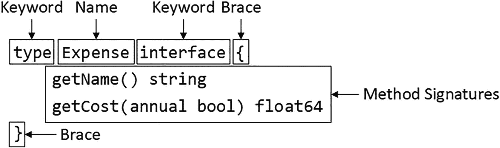

这个接口被命名为 `Expense`，接口体包含一个方法签名。方法签名由名称、参数和结果类型组成，如图 11-4 所示。

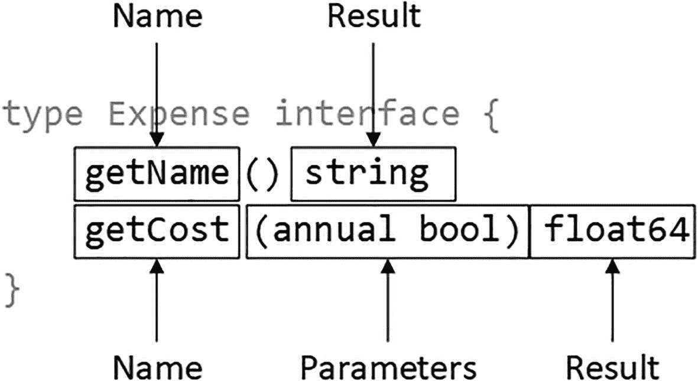

`Expense` 接口描述了两个方法。第一个方法是 `getName`，不接受任何参数并返回一个字符串。第二个方法名为 `getCost`，接受一个 `bool` 参数并返回一个 `float64` 结果。

### 实现接口

要实现一个接口，必须为结构体类型定义接口指定的所有方法，如代码清单 11-17 所示。

```go
package main
type Product struct {
name, category string
price float64
}
func (p Product) getName() string {
return p.name
}
func (p Product) getCost(_ bool) float64 {
return p.price
}
```

大多数语言需要用关键字来表明一个类型实现了接口，但 Go 仅要求定义接口指定的所有方法。Go 允许使用不同的参数和结果名称，但方法必须具有相同的名称、参数类型和结果类型。代码清单 11-18 为 `Service` 类型定义了实现接口所需的方法。

```go
package main
type Service struct {
description string
durationMonths int
monthlyFee float64
}
func (s Service) getName() string {
return s.description
}
func (s Service) getCost(recur bool) float64 {
if (recur) {
return s.monthlyFee * float64(s.durationMonths)
}
return s.monthlyFee
}
```

接口只描述方法，而不描述字段。因此，接口通常指定返回存储在结构体字段中的值的方法，例如代码清单 11-17 和代码清单 11-18 中的 `getName` 方法。


### 使用接口

一旦实现了接口，你就可以通过接口类型来引用值，如代码清单 11-19 所示。

```go
package main
import "fmt"
type Expense interface {
getName() string
getCost(annual bool) float64
}
func main() {
expenses := []Expense {
Product { "Kayak", "Watersports", 275 },
Service {"Boat Cover", 12, 89.50 },
}
for _, expense := range expenses {
fmt.Println("Expense:", expense.getName(), "Cost:", expense.getCost(true))
}
}
```

在此示例中，我定义了一个 `Expense` 切片，并利用字面量语法为其填充了 `Product` 和 `Service` 值。该切片用于一个 `for` 循环，循环中对每个值调用了 `getName` 和 `getCost` 方法。

类型为接口的变量拥有两种类型：*静态类型* 和 *动态类型*。静态类型就是接口类型。动态类型则是赋给该变量的、实现了该接口的值的类型，例如本例中的 `Product` 或 `Service`。静态类型从不改变——例如，一个 `Expense` 变量的静态类型始终是 `Expense`——但动态类型可以通过赋给一个实现了该接口的不同类型的新值来改变。

`for` 循环只处理静态类型——`Expense`——并且不知道（也无需知道）这些值的动态类型。通过使用接口，我能够将不同的动态类型组合在一起，并使用静态接口类型指定的通用方法。编译并执行该项目，你将看到以下输出：

```
Expense: Kayak Cost: 275
Expense: Boat Cover Cost: 1074
```

#### 在函数中使用接口

接口类型可用于变量、函数参数和函数返回值，如代码清单 11-20 所示。

> **注意：** 不能将接口作为接收者来定义方法。与接口关联的唯一方法就是它自身指定的那些。

```go
package main
import "fmt"
type Expense interface {
getName() string
getCost(annual bool) float64
}
func calcTotal(expenses []Expense) (total float64) {
for _, item := range expenses {
total += item.getCost(true)
}
return
}
func main() {
expenses := []Expense {
Product { "Kayak", "Watersports", 275 },
Service {"Boat Cover", 12, 89.50 },
}
for _, expense := range expenses {
fmt.Println("Expense:", expense.getName(), "Cost:", expense.getCost(true))
}
fmt.Println("Total:", calcTotal(expenses))
}
```

`calcTotal` 函数接收一个包含 `Expense` 值的切片，并通过 `for` 循环对其进行处理，从而得出一个 `float64` 类型的总额。编译并执行该项目，将产生以下输出：

```
Expense: Kayak Cost: 275
Expense: Boat Cover Cost: 1074
Total: 1349
```

#### 为结构体字段使用接口

接口类型可用于结构体字段，这意味着字段可以被赋值为任何实现了该接口所定义方法的类型的值，如代码清单 11-21 所示。

```go
package main
import "fmt"
type Expense interface {
getName() string
getCost(annual bool) float64
}
func calcTotal(expenses []Expense) (total float64) {
for _, item := range expenses {
total += item.getCost(true)
}
return
}
type Account struct {
accountNumber int
expenses []Expense
}
func main() {
account := Account {
accountNumber: 12345,
expenses: []Expense {
Product { "Kayak", "Watersports", 275 },
Service {"Boat Cover", 12, 89.50 },
},
}
for _, expense := range account.expenses {
fmt.Println("Expense:", expense.getName(), "Cost:", expense.getCost(true))
}
fmt.Println("Total:", calcTotal(account.expenses))
}
```

`Account` 结构体有一个 `expenses` 字段，其类型是 `Expense` 值的切片，其用法与其他任何字段无异。编译并执行该项目，将产生以下输出：

```
Expense: Kayak Cost: 275
Expense: Boat Cover Cost: 1074
Total: 1349
```

### 理解指针方法接收者的影响

`Product` 和 `Service` 类型定义的方法都拥有值接收者，这意味着这些方法将在 `Product` 或 `Service` 值的副本上被调用。这可能会造成混淆，因此代码清单 11-22 提供了一个简单的示例。

```go
package main
import "fmt"
type Expense interface {
getName() string
getCost(annual bool) float64
}
func main() {
product := Product { "Kayak", "Watersports", 275 }
var expense Expense = product
product.price = 100
fmt.Println("Product field value:", product.price)
fmt.Println("Expense method result:", expense.getCost(false))
}
```

此示例创建了一个 `Product` 结构体值，将其赋给一个 `Expense` 变量，然后修改了该结构体值的 `price` 字段，并分别直接通过字段和通过接口方法输出了该字段值。编译并执行代码，你将得到以下结果：

```
Product field value: 100
Expense method result: 275
```

`Product` 值在赋给 `Expense` 变量时被复制了，这意味着对 `price` 字段的修改不会影响 `getCost` 方法的结果。

在向接口变量赋值时，可以使用指向结构体值的指针，如代码清单 11-23 所示。

```go
package main
import "fmt"
type Expense interface {
getName() string
getCost(annual bool) float64
}
func main() {
product := Product { "Kayak", "Watersports", 275 }
var expense Expense = &product
product.price = 100
fmt.Println("Product field value:", product.price)
fmt.Println("Expense method result:", expense.getCost(false))
}
```

使用指针意味着将对 `Product` 值的引用赋给了 `Expense` 变量，但这并不会改变接口变量的类型，其仍然是 `Expense`。编译并执行该项目，你将在输出中看到这种引用的效果——对 `price` 字段的修改会反映在 `getCost` 方法的结果中：

```
Product field value: 100
Expense method result: 100
```

这很有用，因为这意味着你可以选择赋给接口变量的值将如何被使用。但它也可能反直觉，因为无论变量被赋的是 `Product` 还是 `*Product` 值，其类型始终是 `Expense`。

你可以在实现接口方法时指定指针接收者，从而强制使用引用，如代码清单 11-24 所示。

```go
package main
type Product struct {
name, category string
price float64
}
func (p *Product) getName() string {
return p.name
}
func (p *Product) getCost(_ bool) float64 {
return p.price
}
```

这是一个小改动，但意味着 `Product` 类型不再实现 `Expense` 接口，因为所需的方法不再被定义。相反，是 `*Product` 类型实现了该接口，这意味着指向 `Product` 值的指针可以被当作 `Expense` 值处理，但普通的 `Product` 值不行。编译并执行该项目，你将得到与代码清单 11-23 相同的输出：

```
Product field value: 100
Expense method result: 100
```

代码清单 11-25 尝试将一个 `Product` 值赋给一个 `Expense` 变量。


```
package main
import "fmt"
type Expense interface {
getName() string
getCost(annual bool) float64
}
func main() {
product := Product { "Kayak", "Watersports", 275 }
var expense Expense = product
product.price = 100
fmt.Println("Product field value:", product.price)
fmt.Println("Expense method result:", expense.getCost(false))
}
```
清单 11-25 在 `methodsAndInterfaces` 文件夹的 `main.go` 文件中赋值

编译该项目，您将收到以下错误，提示需要使用指针接收器：

```
.\main.go:14:9: cannot use product (type Product) as type Expense in assignment:
Product does not implement Expense (getCost method has pointer receiver)
```

## 比较接口值

接口值可以使用 Go 比较运算符进行比较，如清单 11-26 所示。如果两个接口值具有相同的动态类型且所有字段都相等，则这两个接口值相等。

```
package main
import "fmt"
type Expense interface {
getName() string
getCost(annual bool) float64
}
func main() {
var e1 Expense = &Product { name: "Kayak" }
var e2 Expense = &Product { name: "Kayak" }
var e3 Expense = Service { description: "Boat Cover" }
var e4 Expense = Service { description: "Boat Cover" }
fmt.Println("e1 == e2", e1 == e2)
fmt.Println("e3 == e4", e3 == e4)
}
```
清单 11-26 在 `methodsAndInterfaces` 文件夹的 `main.go` 文件中比较接口值

比较接口值时必须小心，并且不可避免地需要了解一些动态类型的知识。

前两个 `Expense` 值不相等。这是因为这些值的动态类型是指针类型，而指针只有在指向同一内存位置时才相等。后两个 `Expense` 值相等，因为它们是具有相同字段值的简单结构体值。编译并执行该项目以确认这些值的相等性：

```
e1 == e2 false
e3 == e4 true
```

如果动态类型不可比较，接口相等性检查也可能导致运行时错误。清单 11-27 向 `Service` 结构体添加了一个字段。

```
package main
type Service struct {
description string
durationMonths int
monthlyFee float64
features []string
}
func (s Service) getName() string {
return s.description
}
func (s Service) getCost(recur bool) float64 {
if (recur) {
return s.monthlyFee * float64(s.durationMonths)
}
return s.monthlyFee
}
```
清单 11-27 在 `methodsAndServices` 文件夹的 `service.go` 文件中添加字段

正如第 7 章所述，切片是不可比较的。编译并执行该项目，您将看到新字段的效果：

```
panic: runtime error: comparing uncomparable type main.Service
goroutine 1 [running]:
main.main()
C:/main.go:20 +0x1c5
exit status 2
```

## 执行类型断言

接口可能很有用，但也可能带来问题，能够直接访问动态类型通常很有用，这被称为*类型收窄*，即从不太精确的类型过渡到更精确的类型的过程。

*类型断言*用于访问接口值的动态类型，如清单 11-28 所示。

```
package main
import "fmt"
type Expense interface {
getName() string
getCost(annual bool) float64
}
func main() {
expenses := []Expense {
Service {"Boat Cover", 12, 89.50, []string{} },
Service {"Paddle Protect", 12, 8, []string{} },
}
for _, expense := range expenses {
s := expense.(Service)
fmt.Println("Service:", s.description, "Price:",
s.monthlyFee * float64(s.durationMonths))
}
}
```
清单 11-28 在 `methodsAndInterfaces` 文件夹的 `main.go` 文件中使用类型断言

类型断言的执行方式是在值后面加上一个句点，然后以括号形式指定目标类型，如图 11-5 所示。

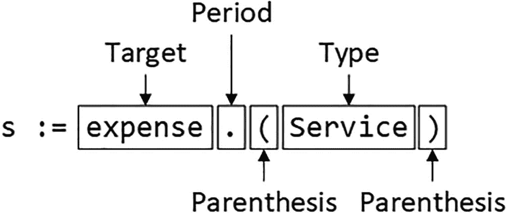

图 11-5 类型断言

在清单 11-28 中，我使用类型断言从 `Expense` 接口类型的切片中访问动态的 `Service` 值。一旦获得了可以操作的 `Service` 值，就可以使用为 `Service` 类型定义的所有字段和方法，而不仅仅是 `Expense` 接口定义的方法。

### 类型断言与类型转换

不要将类型断言（如图 11-6 所示）与第 5 章描述的类型转换语法混淆。类型断言只能应用于接口，用于告知编译器某个接口值具有特定的动态类型。类型转换只能应用于特定类型（而非接口），并且仅在这些类型的结构兼容时才能使用，例如在具有相同字段的结构体类型之间进行转换。

编译并执行清单 11-28 中的代码，将产生以下输出：

```
Service: Boat Cover Price: 1074
Service: Paddle Protect Price: 96
```

### 执行类型断言前进行测试

使用类型断言时，编译器相信程序员比它更了解代码中的动态类型，例如，相信一个 `Expense` 切片只包含 `Supplier` 值。为了了解情况并非如此时会发生什么，清单 11-29 向 `Expense` 切片中添加了一个 `*Product` 值。

```
package main
import "fmt"
type Expense interface {
getName() string
getCost(annual bool) float64
}
func main() {
expenses := []Expense {
Service {"Boat Cover", 12, 89.50, []string{} },
Service {"Paddle Protect", 12, 8, []string{} },
&Product { "Kayak", "Watersports", 275 },
}
for _, expense := range expenses {
s := expense.(Service)
fmt.Println("Service:", s.description, "Price:",
s.monthlyFee * float64(s.durationMonths))
}
}
```
清单 11-29 在 `methodsAndInterfaces` 文件夹的 `main.go` 文件中混合动态类型

编译并执行该项目；代码执行时您将看到以下错误：

```
panic: interface conversion: main.Expense is *main.Product, not main.Service
```

Go 运行时尝试执行断言但失败了。为避免此问题，有一种特殊形式的类型断言可以指示断言是否能够执行，如清单 11-30 所示。

```
package main
import "fmt"
type Expense interface {
getName() string
getCost(annual bool) float64
}
func main() {
expenses := []Expense {
Service {"Boat Cover", 12, 89.50, []string{} },
Service {"Paddle Protect", 12, 8, []string{} },
&Product { "Kayak", "Watersports", 275 },
}
for _, expense := range expenses {
if s, ok := expense.(Service); ok {
fmt.Println("Service:", s.description, "Price:",
s.monthlyFee * float64(s.durationMonths))
} else {
fmt.Println("Expense:", expense.getName(),
"Cost:", expense.getCost(true))
}
}
}
```
清单 11-30 在 `methodsAndInterfaces` 文件夹的 `main.go` 文件中测试断言

类型断言可以产生两个结果，如图 11-6 所示。第一个结果被赋值为动态类型，第二个结果是一个 `bool` 值，指示断言是否能够执行。

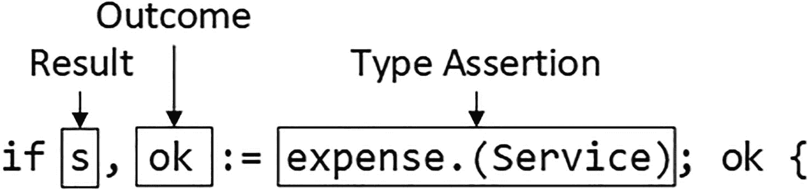

图 11-6 类型断言的两种结果

`bool` 值可以与 `if` 语句配合使用，以便为特定的动态类型执行语句。编译并执行该项目；您将看到以下输出：

```
Service: Boat Cover Price: 1074
Service: Paddle Protect Price: 96
Expense: Kayak Cost: 275
```


### 启用动态类型切换

Go 语言的 `switch` 语句可用于访问动态类型，如清单 11-31 所示，这可以成为使用 `if` 语句进行类型断言的一种更简洁的方式。

```
package main
import "fmt"
type Expense interface {
getName() string
getCost(annual bool) float64
}
func main() {
expenses := []Expense {
Service {"Boat Cover", 12, 89.50, []string{} },
Service {"Paddle Protect", 12, 8, []string{} },
&Product { "Kayak", "Watersports", 275 },
}
for _, expense := range expenses {
switch value := expense.(type) {
case Service:
fmt.Println("Service:", value.description, "Price:",
value.monthlyFee * float64(value.durationMonths))
case *Product:
fmt.Println("Product:", value.name, "Price:", value.price)
default:
fmt.Println("Expense:", expense.getName(),
"Cost:", expense.getCost(true))
}
}
}
清单 11-31
在 methodsAndInterfaces 文件夹的 main.go 文件中进行类型切换
```

`switch` 语句使用一种特殊的类型断言，其中使用了 `type` 关键字，如图 11-7 所示。

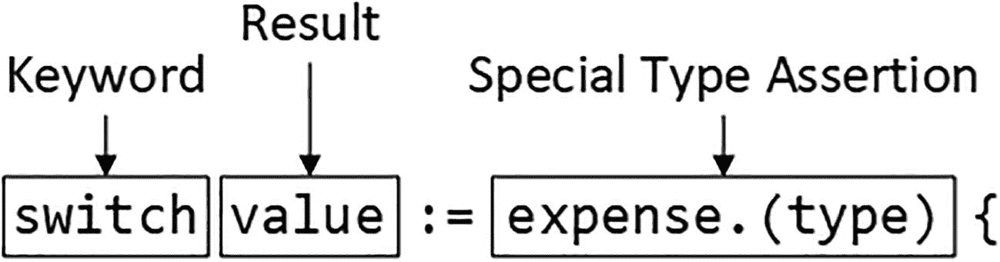

图 11-7

类型切换

每个 `case` 语句指定一个类型和一段代码块，当 `switch` 语句评估的值具有指定类型时，将执行该代码块。Go 编译器足够智能，能够理解 `switch` 语句评估的值之间的关系，并且不允许为不匹配的类型编写 `case` 语句。例如，如果存在针对 `Product` 类型的 `case` 语句，编译器会报错，因为 `switch` 语句正在评估 `Expense` 类型的值，而 `Product` 类型不具备实现该接口所需的方法（因为 `product.go` 文件中的方法使用了指针接收器，见清单 11-24）。

在 `case` 语句内部，可以将结果视为指定的类型，这意味着，例如，在指定了 `Supplier` 类型的 `case` 语句中，可以使用 `Supplier` 类型定义的所有字段和方法。

可以使用 `default` 语句来指定一个代码块，当没有任何 `case` 语句匹配时，将执行该代码块。编译并执行该项目，您将看到以下输出：

```
Service: Boat Cover Price: 1074
Service: Paddle Protect Price: 96
Product: Kayak Price: 275
```

## 使用空接口

Go 语言允许使用空接口——即一个未定义任何方法的接口——来表示任何类型，这可以成为将没有共同特征的不同类型分组的一种有用方式，如清单 11-32 所示。

```
package main
import "fmt"
type Expense interface {
getName() string
getCost(annual bool) float64
}
type Person struct {
name, city string
}
func main() {
var expense Expense = &Product { "Kayak", "Watersports", 275 }
data := []interface{} {
expense,
Product { "Lifejacket", "Watersports", 48.95 },
Service {"Boat Cover", 12, 89.50, []string{} },
Person { "Alice", "London"},
&Person { "Bob", "New York"},
"This is a string",
100,
true,
}
for _, item := range data {
switch value := item.(type) {
case Product:
fmt.Println("Product:", value.name, "Price:", value.price)
case *Product:
fmt.Println("Product Pointer:", value.name, "Price:", value.price)
case Service:
fmt.Println("Service:", value.description, "Price:",
value.monthlyFee * float64(value.durationMonths))
case Person:
fmt.Println("Person:", value.name, "City:", value.city)
case *Person:
fmt.Println("Person Pointer:", value.name, "City:", value.city)
case string, bool, int:
fmt.Println("Built-in type:", value)
default:
fmt.Println("Default:", value)
}
}
}
清单 11-32
在 methodsAndInterfaces 文件夹的 main.go 文件中使用空接口
```

空接口以字面量语法使用，通过 `interface` 关键字和空花括号定义，如图 11-8 所示。

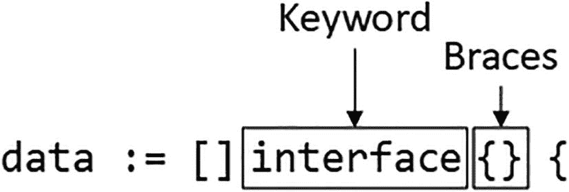

图 11-8

空接口

空接口代表所有类型，包括内置类型以及已定义的任何结构体和接口。在清单中，我定义了一个空的数组切片，其中混合了 `Product`、`*Product`、`Service`、`Person`、`*Person`、`string`、`int` 和 `bool` 类型的值。该切片由 `for` 循环处理，循环中使用 `switch` 语句将每个值缩小到特定类型。编译并执行该项目，将产生以下输出：

```
Product Pointer: Kayak Price: 275
Product: Lifejacket Price: 48.95
Service: Boat Cover Price: 1074
Person: Alice City: London
Person Pointer: Bob City: New York
Built-in type: This is a string
Built-in type: 100
Built-in type: true
```


好的，作为高级文档工程师和翻译员，我将遵循您的注意事项，将给定的英文文本翻译成中文。


### 使用空接口作为函数参数

空接口可以用作函数参数的类型，允许使用任何值来调用函数，如代码清单 11-33 所示。

```go
package main
import "fmt"
type Expense interface {
getName() string
getCost(annual bool) float64
}
type Person struct {
name, city string
}
func processItem(item interface{}) {
switch value := item.(type) {
case Product:
fmt.Println("Product:", value.name, "Price:", value.price)
case *Product:
fmt.Println("Product Pointer:", value.name, "Price:", value.price)
case Service:
fmt.Println("Service:", value.description, "Price:",
value.monthlyFee * float64(value.durationMonths))
case Person:
fmt.Println("Person:", value.name, "City:", value.city)
case *Person:
fmt.Println("Person Pointer:", value.name, "City:", value.city)
case string, bool, int:
fmt.Println("Built-in type:", value)
default:
fmt.Println("Default:", value)
}
}
func main() {
var expense Expense = &Product { "Kayak", "Watersports", 275 }
data := []interface{} {
expense,
Product { "Lifejacket", "Watersports", 48.95 },
Service {"Boat Cover", 12, 89.50, []string{} },
Person { "Alice", "London"},
&Person { "Bob", "New York"},
"This is a string",
100,
true,
}
for _, item := range data {
processItem(item)
}
}
代码清单 11-33
在 methodsAndInterfaces 文件夹的 main.go 文件中使用空接口参数
```

空接口也可以用于可变参数，这允许使用任意数量的参数来调用函数，每个参数都可以是任何类型，如代码清单 11-34 所示。

```go
package main
import "fmt"
type Expense interface {
getName() string
getCost(annual bool) float64
}
type Person struct {
name, city string
}
func processItems(items ...interface{}) {
for _, item := range items {
switch value := item.(type) {
case Product:
fmt.Println("Product:", value.name, "Price:", value.price)
case *Product:
fmt.Println("Product Pointer:", value.name, "Price:", value.price)
case Service:
fmt.Println("Service:", value.description, "Price:",
value.monthlyFee * float64(value.durationMonths))
case Person:
fmt.Println("Person:", value.name, "City:", value.city)
case *Person:
fmt.Println("Person Pointer:", value.name, "City:", value.city)
case string, bool, int:
fmt.Println("Built-in type:", value)
default:
fmt.Println("Default:", value)
}
}
}
func main() {
var expense Expense = &Product { "Kayak", "Watersports", 275 }
data := []interface{} {
expense,
Product { "Lifejacket", "Watersports", 48.95 },
Service {"Boat Cover", 12, 89.50, []string{} },
Person { "Alice", "London"},
&Person { "Bob", "New York"},
"This is a string",
100,
true,
}
processItems(data...)
}
代码清单 11-34
在 methodsAndInterfaces 文件夹的 main.go 文件中使用可变参数
```

编译并执行项目后，代码清单 11-33 和代码清单 11-34 都会产生以下输出：

```
Product Pointer: Kayak Price: 275
Product: Lifejacket Price: 48.95
Service: Boat Cover Price: 1074
Person: Alice City: London
Person Pointer: Bob City: New York
Built-in type: This is a string
Built-in type: 100
Built-in type: true
```

## 本章小结

在本章中，我描述了 Go 对方法的支持，包括为结构体类型定义方法以及定义方法接口集合。我演示了结构体如何实现接口，这允许混合类型一起使用。在下一章中，我将解释 Go 如何使用包和模块来支持项目结构。

# 创建和使用包

包是 Go 的一项功能，它允许对项目进行结构化，以便将相关功能组合在一起，而不必将所有代码放在单个文件或文件夹中。在本章中，我将描述如何创建和使用包，以及如何使用第三方开发的包。表 12-1 将包置于上下文中。

**表 12-1** 将包置于上下文中

| 问题 | 答案 |
| --- | --- |
| 它们是什么？ | 包允许对项目进行结构化，以便相关功能可以一起开发。 |
| 为什么它们有用？ | 包是 Go 实现访问控制的方式，因此功能的实现对使用它的代码是隐藏的。 |
| 如何使用它们？ | 通过在文件夹中创建代码文件并使用 `package` 关键字来表示它们属于哪个包来定义包。 |
| 是否有任何陷阱或限制？ | 有意义的名称数量有限，包名之间的冲突很常见，需要使用别名来避免错误。 |
| 有替代方案吗？ | 简单的应用程序可以在不需要包的情况下编写。 |

**表 12-2** 章节总结

| 问题 | 解决方案 | 代码清单 |
| --- | --- | --- |
| 定义一个包 | 创建一个文件夹并添加包含 `package` 语句的代码文件。 | 4, 9, 10, 15, 16 |
| 使用一个包 | 添加一个 `import` 语句，指定包及其所在模块的路径。 | 5 |
| 控制对包中功能的访问 | 通过在功能名称中使用首字母大写来导出功能。首字母小写是不可导出的，不能在包外部使用。 | 6–8 |
| 处理包冲突 | 使用别名或点导入。 | 11–14 |
| 在加载包时执行任务 | 定义一个初始化函数。 | 17, 18 |
| 执行包初始化函数而不导入其包含的功能 | 在 `import` 语句中使用空白标识符。 | 19, 20 |
| 使用外部包 | 使用 `go get` 命令。 | 21, 22 |
| 移除未使用的包依赖项 | 使用 `go mod tidy` 命令。 | 23 |

## 本章准备

为准备本章，打开一个新的命令提示符，导航到一个方便的位置，并创建一个名为 `packages` 的目录。导航到 `packages` 文件夹并运行代码清单 12-1 中所示的命令来初始化项目。

> **提示**  
> 你可以从 [`https://github.com/apress/pro-go`](https://github.com/apress/pro-go) 下载本章的示例项目——以及本书所有其他章节的示例项目。参见第 2 章，了解如果在运行示例时遇到问题如何获取帮助。

```
go mod init packages
代码清单 12-1
初始化项目
```

在 `packages` 文件夹中添加一个名为 `main.go` 的文件，内容如代码清单 12-2 所示。

```
package main
import "fmt"
func main() {
fmt.Println("Hello, Packages and Modules")
}
代码清单 12-2
packages 文件夹中 main.go 文件的内容
```

使用命令提示符在 `packages` 文件夹中运行代码清单 12-3 中所示的命令。

```
go run .
代码清单 12-3
运行示例项目
```

`main.go` 文件中的代码将被编译和执行，产生以下输出：

```
Hello, Packages and Modules
```


## 理解模块文件

本书中所有示例项目的第一步都是创建一个模块文件，这通过清单 12-1 中的命令完成。

模块文件的原始目的是发布代码，以便它可以在其他项目中使用，甚至可能由其他开发者使用。模块文件至今仍为此目的而使用，但随着 Go 开始获得主流开发领域的认可，已发布项目的比例已经下降。如今，创建模块文件最常见的原因是它能轻松安装已发布的包，并且还有一个额外的好处：允许使用清单 12-3 所示的命令，而不必向 Go 构建工具提供需要编译的单个文件列表。

清单 12-1 中的命令在 `packages` 文件夹中创建了一个名为 `go.mod` 的文件，内容如下：

```
module packages
go 1.17
```

`module` 语句指定了模块的名称，该名称由清单 12-1 中的命令指定。这个名称很重要，因为后续示例将演示它用于导入同一项目中其他包以及第三方包的功能。`go` 语句指定了所使用的 Go 版本，本书使用的是 1.17 版本。

## 创建自定义包

包使得项目能够增加结构，从而将相关功能组合在一起。创建 `packages/store` 文件夹，并在其中添加一个名为 `product.go` 的文件，内容如清单 12-4 所示。

```
package store
type Product struct {
Name, Category string
price float64
}
清单 12-4
packages/store 文件夹中 product.go 文件的内容
```

自定义包使用 `package` 关键字定义，我指定的包名为 `store`：

```
...
package store
...
```

`package` 语句指定的名称应与代码文件所在文件夹的名称匹配，在此例中为 `store`。

`Product` 类型与之前章节中定义的类似类型有一些重要区别，我将在后续部分进行解释。

### 注释导出的特性

Go 语言检查器会对任何从包中导出但未在注释中描述的特性报告错误。注释应简洁且具有描述性，惯例是以特性的名称开头，如下所示：

```
...
// Product describes an item for sale
type Product struct {
Name, Category string // Name and type of the product
price float64
}
...
```

当注释自定义类型时，也可以描述导出的字段。Go 还支持描述整个包的注释，该注释出现在 `package` 关键字之前，如下所示：

```
...
// Package store provides types and methods
// commonly required for online sales
package store
...
```

这些注释会被 `go doc` 工具处理，用于生成代码文档。为简洁起见，本书的示例中未添加注释，但在编写供其他开发者使用的包时，注释代码尤为重要。

### 使用自定义包

对自定义包的依赖通过 `import` 语句声明，如清单 12-5 所示。

```
package main
import (
"fmt"
"packages/store"
)
func main() {
product := store.Product {
Name: "Kayak",
Category: "Watersports",
}
fmt.Println("Name:", product.Name)
fmt.Println("Category:", product.Category)
}
清单 12-5
在 packages 文件夹的 main.go 文件中使用自定义包
```

`import` 语句将包指定为一个路径，该路径由清单 12-1 中命令创建的模块名称和包名称组成，两者之间用正斜杠分隔，如图 12-1 所示。

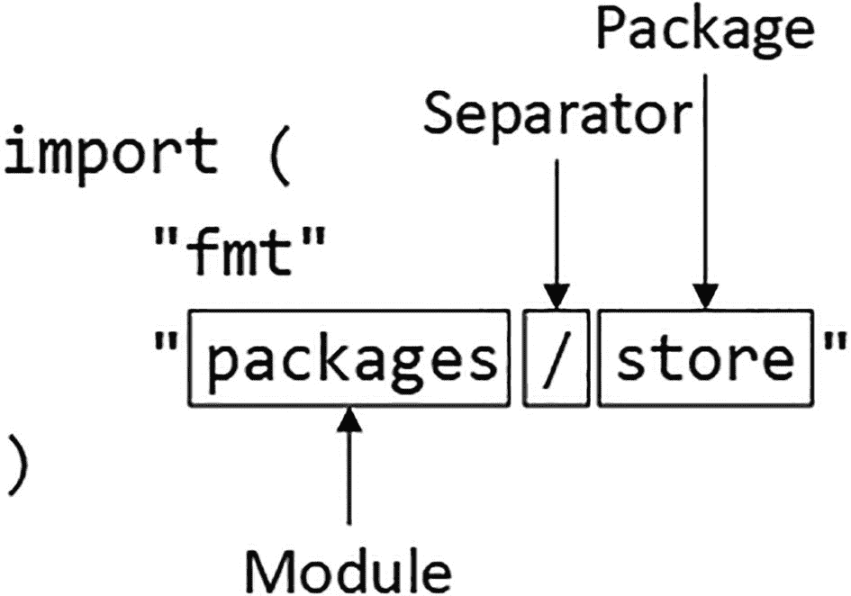

图 12-1

导入自定义包

包提供的导出功能通过将包名称作为前缀来访问，如下所示：

```
...
var product *store.Product = &store.Product {
...
```

为了指定 `Product` 类型，我必须在该类型前面加上包名称，如图 12-2 所示。

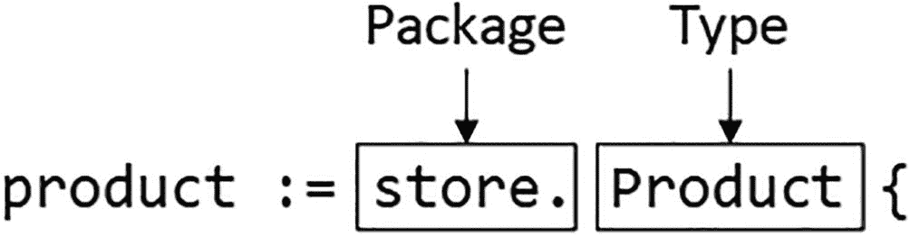

图 12-2

使用包名称

构建并执行该项目，将产生以下输出：

```
Name: Kayak
Category: Watersports
```


### 理解包访问控制

清单 12-4 中定义的`Product`类型与之前章节中定义的类似类型有一个重要区别：`Name`和`Category`属性的首字母均为大写。

Go 语言采用了一种独特的访问控制方式。它不依赖于`public`和`private`这类专用关键字，而是通过检查代码文件中类型、函数和方法等特性名称的首字母来判断。如果首字母是小写，则该特性只能在定义它的包内使用。若要将特性导出到包外使用，则需将其首字母大写。

清单 12-4 中结构体类型的名称是`Product`，这意味着该类型可以在`store`包外部使用。`Name`和`Category`字段的名称也以大写字母开头，因此它们也是导出的。`price`字段的首字母为小写，这意味着它只能在`store`包内部访问。图 12-3 展示了这些差异。

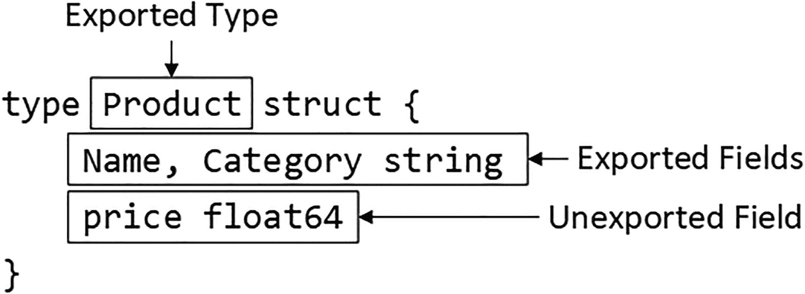

图 12-3

导出特性与私有特性

编译器会强制执行包导出规则，这意味着如果在`store`包外部访问`price`字段，就会产生错误，如清单 12-6 所示。

```
package main
import (
"fmt"
"packages/store"
)
func main() {
product := store.Product {
Name: "Kayak",
Category: "Watersports",
price: 279,
}
fmt.Println("Name:", product.Name)
fmt.Println("Category:", product.Category)
fmt.Println("Price:", product.price)
}
清单 12-6
在 packages 文件夹的 main.go 文件中访问未导出字段
```

第一个改动尝试在使用字面量语法创建`Product`值时，为`price`字段设置一个值。第二个改动则尝试读取`price`字段的值。

访问控制规则由编译器强制执行，编译代码时会报告以下错误：

```
.\main.go:13:9: cannot refer to unexported field 'price' in struct literal of type store.Product
.\main.go:18:34: product.price undefined (cannot refer to unexported field or method price)
```

要解决这些错误，我可以选择导出`price`字段，或者导出用于访问该字段值的方法或函数。清单 12-7 定义了一个构造函数用于创建`Product`值，以及用于获取和设置`price`字段的方法。

```
package store
type Product struct {
Name, Category string
price float64
}
func NewProduct(name, category string, price float64) *Product {
return &Product{ name, category, price }
}
func (p *Product) Price() float64 {
return p.price
}
func (p *Product) SetPrice(newPrice float64)  {
p.price = newPrice
}
清单 12-7
在 store 文件夹的 product.go 文件中定义方法
```

访问控制规则不适用于单个函数或方法的参数，这意味着`NewProduct`函数必须将首字母大写才能被导出，但参数名称可以使用小写。

这些方法遵循访问字段的导出方法的典型命名约定，即`Price`方法返回字段值，`SetPrice`方法分配新值。清单 12-8 更新了`main.go`文件中的代码，以使用这些新特性。

```
package main
import (
"fmt"
"packages/store"
)
func main() {
product := store.NewProduct("Kayak", "Watersports", 279)
fmt.Println("Name:", product.Name)
fmt.Println("Category:", product.Category)
fmt.Println("Price:", product.Price())
}
清单 12-8
在 packages 文件夹的 main.go 文件中使用包特性
```

使用清单 12-8 中的命令编译并执行项目，你将会得到以下输出，这表明`main`包中的代码可以通过`Price`方法读取`price`字段：

```
Name: Kayak
Category: Watersports
Price: 279
```

### 向包中添加代码文件

包可以包含多个代码文件，为了简化开发，当访问同一包中定义的特性的，访问控制规则和包前缀不再适用。在`store`文件夹中添加一个名为`tax.go`的文件，内容如清单 12-9 所示。

```
package store
const defaultTaxRate float64 = 0.2
const minThreshold = 10
type taxRate struct {
rate, threshold float64
}
func newTaxRate(rate, threshold float64) *taxRate {
if (rate == 0) {
rate = defaultTaxRate
}
if (threshold < minThreshold) {
threshold = minThreshold
}
return &taxRate{rate, threshold}
}
func (taxRate *taxRate) calcTax(product *Product) float64 {
if (product.price > taxRate.threshold) {
return product.price + (product.price * taxRate.rate)
}
return product.price
}
清单 12-9
store 文件夹中 tax.go 文件的内容
```

`tax.go`文件中定义的所有特性都是未导出的，这意味着它们只能在`store`包内部使用。请注意，`calcTax`方法可以访问`Product`类型的`price`字段，并且无需将其引用为`store.Product`，因为它们在同一个包中：

```
...
func (taxRate *taxRate) calcTax(product *Product) float64 {
if (product.price > taxRate.threshold) {
return product.price + (product.price * taxRate.rate)
}
return product.price
}
...
```

在清单 12-10 中，我修改了`Product.Price`方法，使其返回`price`字段的值加上税费。

```
package store
var standardTax = newTaxRate(0.25, 20)
type Product struct {
Name, Category string
price float64
}
func NewProduct(name, category string, price float64) *Product {
return &Product{ name, category, price }
}
func (p *Product) Price() float64 {
return standardTax.calcTax(p)
}
func (p *Product) SetPrice(newPrice float64)  {
p.price = newPrice
}
清单 12-10
在 store 文件夹的 product.go 文件中计算税费
```

`Price`方法可以访问未导出的`calcTax`方法，但该方法——以及它所属的类型——只能在`store`包内部使用。使用清单 12-10 中的命令编译并执行代码，你将会得到以下输出：

```
Name: Kayak
Category: Watersports
Price: 348.75
```

避免重定义陷阱

一个常见的错误是在同一个包的不同文件中重复使用名称。这是我经常犯的错误，包括在编写清单 12-10 所示的示例时。我的`product.go`文件中最初的代码版本包含了以下语句：

```
...
var taxRate = newTaxRate(0.25, 20)
...
```

这会导致编译错误，因为`tax.go`文件定义了一个名为`taxRate`的结构体类型。编译器不会区分分配给变量的名称和分配给类型的名称，并会报告类似如下的错误：

```
store\tax.go:6:6: taxRate redeclared in this block
previous declaration at store\product.go:3:5
```

你也可能在代码编辑器中看到错误提示，说`taxRate`是一个无效的类型。这是同一问题的不同表现。要避免这些错误，你必须确保包中定义的顶层特性具有唯一的名称。名称不需要在包之间或在函数和方法内部保持唯一。


### 处理包名冲突

导入包时，模块名和包名的组合确保了包的唯一标识。但在访问包所提供的功能时，仅使用包名，这可能导致冲突。为了了解这个问题是如何产生的，请创建 `packages`/`fmt` 文件夹，并在其中添加一个名为 `formats.go` 的文件，其代码如代码清单 12-11 所示。

```
package fmt
import "strconv"
func ToCurrency(amount float64) string {
return "$" + strconv.FormatFloat(amount, 'f', 2, 64)
}
```

代码清单 12-11  
`fmt` 文件夹中 `formats.go` 文件的内容

此文件导出名为 `ToCurrency` 的函数，该函数接收一个 `float64` 值，并使用我在第 17 章中描述的 `strconv.FormatFloat` 函数，生成一个格式化的美元金额。

代码清单 12-11 中定义的 `fmt` 包与一个最广泛使用的标准库包同名。当两个包同时使用时就会引发问题，如代码清单 12-12 所示。

```
package main
import (
"fmt"
"packages/store"
"packages/fmt"
)
func main() {
product := store.NewProduct("Kayak", "Watersports", 279)
fmt.Println("Name:", product.Name)
fmt.Println("Category:", product.Category)
fmt.Println("Price:", fmt.ToCurrency(product.Price()))
}
```

代码清单 12-12  
`packages` 文件夹中 `main.go` 文件内使用同名包

编译该项目，您将收到以下错误：

```
.\main.go:6:5: fmt redeclared as imported package name
previous declaration at .\main.go:4:5
.\main.go:13:5: undefined: "packages/fmt".Println
.\main.go:14:5: undefined: "packages/fmt".Println
.\main.go:15:5: undefined: "packages/fmt".Println
```

## 使用包别名

处理包名冲突的一种方法是使用别名，它允许使用不同的名称来访问包，如代码清单 12-13 所示。

```
package main
import (
"fmt"
"packages/store"
currencyFmt "packages/fmt"
)
func main() {
product := store.NewProduct("Kayak", "Watersports", 279)
fmt.Println("Name:", product.Name)
fmt.Println("Category:", product.Category)
fmt.Println("Price:", currencyFmt.ToCurrency(product.Price()))
}
```

代码清单 12-13  
`packages` 文件夹中 `main.go` 文件内使用包别名

包的别名在导入路径之前声明，如图 12-4 所示。

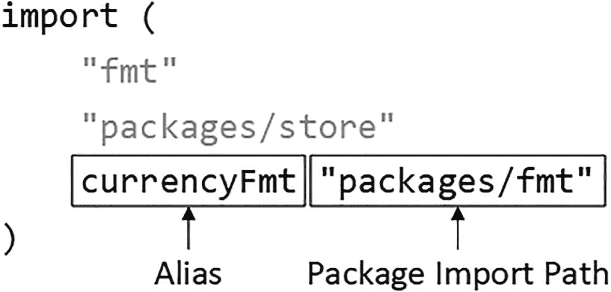

图 12-4  
包别名

本例中的别名解决了名称冲突，使得以 `packages/fmt` 路径导入的包所定义的功能可以通过 `currencyFmt` 作为前缀来访问，如下所示：

```
...
fmt.Println("Price:", currencyFmt.ToCurrency(product.Price()))
...
```

编译并执行该项目，您将收到以下输出，该输出依赖于标准库中的 `fmt` 包以及已被别名的自定义 `fmt` 包定义的功能：

```
Name: Kayak
Category: Watersports
Price: $348.75
```

## 使用点导入

有一种特殊的别名，称为*点导入*，它允许在不使用前缀的情况下使用包的功能，如代码清单 12-14 所示。

```
package main
import (
"fmt"
"packages/store"
. "packages/fmt"
)
func main() {
product := store.NewProduct("Kayak", "Watersports", 279)
fmt.Println("Name:", product.Name)
fmt.Println("Category:", product.Category)
fmt.Println("Price:", ToCurrency(product.Price()))
}
```

代码清单 12-14  
`packages` 文件夹中 `main.go` 文件内使用点导入

点导入使用句点作为包别名，如图 12-5 所示。

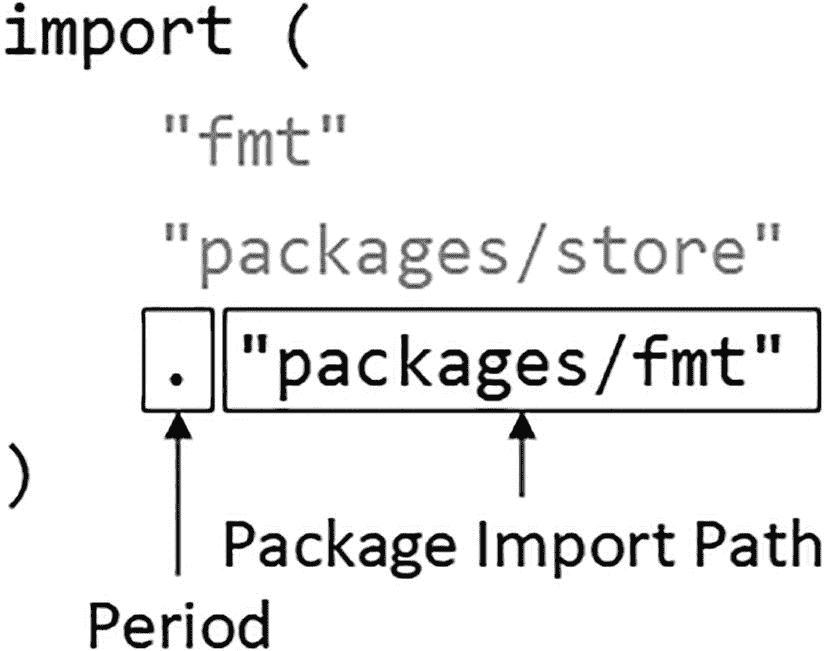

图 12-5  
使用点导入

点导入允许我在不使用前缀的情况下访问 `ToCurrency` 函数，如下所示：

```
...
fmt.Println("Price:", ToCurrency(product.Price()))
...
```

使用点导入时，必须确保从该包导入的功能名称未在导入包中定义。对于本例，这意味着我必须确保 `ToCurrency` 这个名称没有被 `main` 包中定义的任何功能使用。因此，点导入应谨慎使用。

## 创建嵌套包

包可以在其他包内部定义，这使得将复杂功能分解为尽可能多的单元变得容易。创建 `packages/store/cart` 文件夹，并在其中添加一个名为 `cart.go` 的文件，其内容如代码清单 12-15 所示。

```
package cart
import "packages/store"
type Cart struct {
CustomerName string
Products []store.Product
}
func (cart *Cart) GetTotal() (total float64) {
for _, p := range cart.Products {
total += p.Price()
}
return
}
```

代码清单 12-15  
`store/cart` 文件夹中 `cart.go` 文件的内容

`package` 语句的使用方式与任何其他包相同，无需包含父包或外层包的名称。对自定义包的依赖必须包含完整的包路径，如代码清单所示。代码清单 12-15 中的代码定义了一个名为 `Cart` 的结构体类型，它导出了 `CustomerName` 和 `Products` 字段，以及一个 `GetTotal` 方法。

导入嵌套包时，包路径以模块名开头并列出包的序列，如代码清单 12-16 所示。

```
package main
import (
"fmt"
"packages/store"
. "packages/fmt"
"packages/store/cart"
)
func main() {
product := store.NewProduct("Kayak", "Watersports", 279)
cart := cart.Cart {
CustomerName: "Alice",
Products: []store.Product{ *product },
}
fmt.Println("Name:", cart.CustomerName)
fmt.Println("Total:",  ToCurrency(cart.GetTotal()))
}
```

代码清单 12-16  
`packages` 文件夹中 `main.go` 文件内使用嵌套包

嵌套包定义的功能使用包名访问，与任何其他包一样。在代码清单 12-16 中，这意味着 `store/cart` 包导出的类型和函数使用 `cart` 作为前缀来访问。编译并执行该项目，您将收到以下输出：

```
Name: Alice
Total: $348.75
```


### 使用包初始化函数

每个代码文件都可以包含一个初始化函数，该函数仅在所有包都已加载且所有其他初始化（例如定义常量和变量）完成之后执行。初始化函数最常见的用途是执行难以计算或需要重复计算的操作，如代码清单 12-17 所示。

```go
package store
const defaultTaxRate float64 = 0.2
const minThreshold = 10
var categoryMaxPrices = map[string]float64 {
"Watersports": 250 + (250 * defaultTaxRate),
"Soccer": 150 + (150 * defaultTaxRate),
"Chess": 50 + (50 * defaultTaxRate),
}
type taxRate struct {
rate, threshold float64
}
func newTaxRate(rate, threshold float64) *taxRate {
if (rate == 0) {
rate = defaultTaxRate
}
if (threshold < minThreshold) {
threshold = minThreshold
}
return &taxRate{rate, threshold}
}
func (taxRate *taxRate) calcTax(product *Product) (price float64) {
if product.price > taxRate.threshold {
price = product.price + (product.price * taxRate.rate)
} else {
price = product.price
}
if max, ok := categoryMaxPrices[product.Category]; ok && price > max {
price = max
}
return
}
代码清单 12-17
在 store 文件夹的 tax.go 文件中计算最高价格
```

这些改动引入了类别特定的最高价格，它们存储在一个映射中。每个类别的最高价格都以相同的方式计算，这导致了代码重复，并使代码难以阅读和维护。

这个问题用 `for` 循环可以轻松解决，但 Go 语言只允许在函数内部使用循环，而我需要在代码文件的顶层执行这些计算。

解决方案是使用初始化函数，该函数在包加载时自动调用，并且可以使用 `for` 循环等语言特性，如代码清单 12-18 所示。

```go
package store
const defaultTaxRate float64 = 0.2
const minThreshold = 10
var categoryMaxPrices = map[string]float64 {
"Watersports": 250,
"Soccer": 150,
"Chess": 50,
}
func init() {
for category, price := range categoryMaxPrices {
categoryMaxPrices[category] = price + (price * defaultTaxRate)
}
}
type taxRate struct {
rate, threshold float64
}
func newTaxRate(rate, threshold float64) *taxRate {
// ...为简洁起见，省略了语句...
}
func (taxRate *taxRate) calcTax(product *Product) (price float64) {
// ...为简洁起见，省略了语句...
}
代码清单 12-18
在 store 文件夹的 tax.go 文件中使用初始化函数
```

初始化函数名为 `init`，定义时没有参数和返回值。`init` 函数会被自动调用，为包的使用提供准备机会。编译并执行代码清单 12-17 和 12-18 中的代码，都会产生以下输出：

```
Name: Kayak
Price: $300.00
```

`init` 函数并不是一个常规的 Go 函数，不能被直接调用。此外，与常规函数不同，单个文件可以定义多个 `init` 函数，所有这些函数都会被执行。

### 避免多个初始化函数的陷阱

每个代码文件都可以有自己的初始化函数。使用标准 Go 编译器时，初始化函数会根据文件名的字母顺序执行，因此 `a.go` 文件中的函数会在 `b.go` 文件中的函数之前执行，依此类推。

但此顺序并非 Go 语言规范的一部分，不应依赖于此。你的初始化函数应该是自包含的，不应依赖于其他 `init` 函数之前已被调用。

#### 仅为初始化效果而导入包

Go 语言禁止导入包却不使用它，如果你依赖于初始化函数的效果，但又无需使用该包导出的任何功能，这就会成为一个问题。创建 `packages/data` 文件夹，并向其中添加一个名为 `data.go` 的文件，内容如代码清单 12-19 所示。

```go
package data
import "fmt"
func init() {
fmt.Println(("data.go init function invoked"))
}
func GetData() []string {
return []string {"Kayak", "Lifejacket", "Paddle", "Soccer Ball"}
}
代码清单 12-19
data 文件夹中 data.go 文件的内容
```

在本示例中，初始化函数在被调用时会输出一条消息。如果我需要初始化函数的效果，但不需要使用该包导出的 `GetData` 函数，那么我可以使用空白标识符作为包名的别名来 `import` 该包，如代码清单 12-20 所示。

```go
package main
import (
"fmt"
"packages/store"
. "packages/fmt"
"packages/store/cart"
_ "packages/data"
)
func main() {
product := store.NewProduct("Kayak", "Watersports", 279)
cart := cart.Cart {
CustomerName: "Alice",
Products: []store.Product{ *product },
}
fmt.Println("Name:", cart.CustomerName)
fmt.Println("Total:",  ToCurrency(cart.GetTotal()))
}
代码清单 12-20
在 packages 文件夹的 main.go 文件中为初始化而导入
```

空白标识符（下划线字符）允许导入包而无需使用其导出的功能。编译并执行该项目，你将看到由代码清单 12-19 中定义的初始化函数输出的消息：

```
data.go init function invoked
Name: Alice
Total: $300.00
```


## 使用外部包

项目可以通过使用第三方开发的包来扩展。使用 `go get` 命令下载并安装包。在 `packages` 文件夹中运行清单 12-21 所示的命令，将包添加到示例项目中。

```
go get github.com/fatih/color@v1.10.0
清单 12-21
安装包
```

`go get` 命令的参数是包含你想要使用的包的模块的路径。其后跟着 `@` 字符和包版本号，版本号以字母 `v` 开头，如图 12-6 所示。

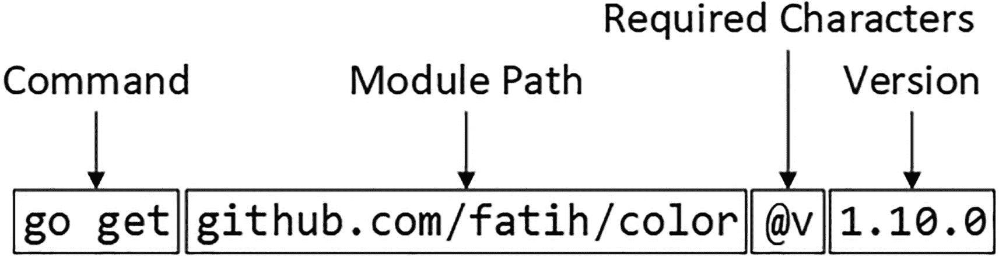

图 12-6

选择包

`go get` 命令功能强大，它知道清单 12-21 中指定的路径是一个 GitHub URL。它会下载指定版本的模块，然后编译并安装其中包含的包，以便在项目中使用。（包以源代码形式分发，这样它们就可以为你正在使用的平台进行编译。）

### 寻找 Go 包

有两个有用的资源可以用来查找 Go 包。第一个是 [`https://pkg.go.dev`](https://pkg.go.dev)，它提供了一个搜索引擎。不幸的是，可能需要花些时间才能弄清楚需要哪些关键字才能找到特定类型的包。

第二个资源是 [`https://github.com/golang/go/wiki/Projects`](https://github.com/golang/go/wiki/Projects)，它提供了一个精心挑选的 Go 项目列表，并按类别分组。并非所有列在 `pkg.go.dev` 上的项目都出现在这个列表中，我倾向于同时使用这两种资源来查找包。

在选择模块时必须小心。许多 Go 模块是由个人开发者编写的，用于解决某个问题，然后发布给其他人使用。这创建了一个丰富的模块生态系统，但这意味着维护和支持可能不一致。例如，我在这节中使用的 `github.com/fatih/color` 模块已经退役，不再接收更新。我很乐意继续使用它，因为我在本章中对它的使用很简单，而且代码运行良好。你必须对你项目中依赖的模块进行同样的评估。

当 `go get` 命令完成后，检查 `go.mod` 文件，你会看到新的配置语句：

```
module packages
go 1.17
require (
github.com/fatih/color v1.10.0 // indirect
github.com/mattn/go-colorable v0.1.8 // indirect
github.com/mattn/go-isatty v0.0.12 // indirect
golang.org/x/sys v0.0.0-20200223170610-d5e6a3e2c0ae // indirect
)
```

`require` 语句指出了对 `github.com/fatih/color` 模块及其所需的其他模块的依赖关系。语句末尾的 `indirect` 注释是自动添加的，因为项目代码尚未使用这些包。当获取模块时，会创建一个名为 `go.sum` 的文件，其中包含用于验证包的校验和。

**注意**：你也可以使用 `go.mod` 文件来创建对你本地创建的项目的依赖关系，这是我在第 3 部分 SportsStore 示例中采用的方法。详情请参见第 35 章。

一旦模块安装完成，它包含的包就可以在项目中使用，如清单 12-22 所示。

```
package main
import (
//"fmt"
"packages/store"
. "packages/fmt"
"packages/store/cart"
_ "packages/data"
"github.com/fatih/color"
)
func main() {
product := store.NewProduct("Kayak", "Watersports", 279)
cart := cart.Cart {
CustomerName: "Alice",
Products: []store.Product{ *product },
}
color.Green("Name: " + cart.CustomerName)
color.Cyan("Total: " + ToCurrency(cart.GetTotal()))
}
清单 12-22
在 packages 文件夹中的 main.go 文件里使用第三方包
```

外部包的导入和使用方式与自定义包相同。`import` 语句指定模块路径，该路径的最后一部分用于访问包导出的特性。在这个例子中，包名为 `color`，这是访问包功能的前缀。

清单 12-22 中使用的 `Green` 和 `Cyan` 函数写入彩色输出，如果你编译并运行该项目，将会看到如图 12-7 所示的输出。

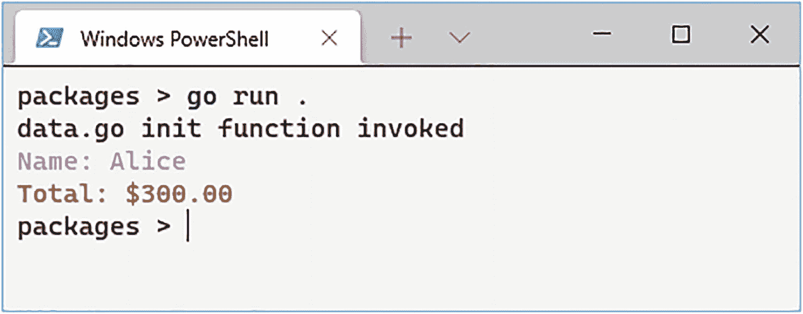

图 12-7

运行示例应用程序

### 理解最小版本选择

第一次运行清单 12-22 中的 `go get` 命令时，你会看到下载的模块列表，这说明了模块有它们自己的依赖关系，并且这些依赖关系会被自动解析：

```
go: downloading github.com/fatih/color v1.10.0
go: downloading github.com/mattn/go-isatty v0.0.12
go: downloading github.com/mattn/go-colorable v0.1.8
go: downloading golang.org/x/sys v0.0.0-20200223170610-d5e6a3e2c0ae
```

下载的内容会被缓存，这就是为什么下次对同一个模块使用 `go get` 命令时不会看到这些消息的原因。

你可能会发现你的项目依赖于不同版本的模块，尤其是在具有大量依赖关系的复杂项目中。在这种情况下，Go 会使用这些依赖关系指定的最新版本。例如，如果存在对模块版本 1.1 和 1.5 的依赖，Go 在构建项目时将使用版本 1.5。Go 只会使用依赖关系指定的最新版本，即使有更新的版本可用。例如，如果某个模块最新的依赖关系指定了版本 1.5，即使版本 1.6 可用，Go 也不会使用它。

这种方法的效果是，如果某个模块依赖于更新的版本，你的项目可能不会使用你通过 `go get` 命令选择的模块版本进行编译。同样地，如果另一个模块（或 `go.mod` 文件）指定了更新的版本，那么模块可能无法使用其依赖关系所期望的版本进行编译。

### 管理外部包

`go get` 命令会向 `go.mod` 文件添加依赖关系，但如果外部包不再需要，这些依赖关系不会自动移除。清单 12-23 更改了 `main.go` 文件的内容，移除了对 `github.com/fatih/color` 包的使用。

```
package main
import (
"fmt"
"packages/store"
. "packages/fmt"
"packages/store/cart"
_ "packages/data"
//"github.com/fatih/color"
)
func main() {
product := store.NewProduct("Kayak", "Watersports", 279)
cart := cart.Cart {
CustomerName: "Alice",
Products: []store.Product{ *product },
}
// color.Green("Name: " + cart.CustomerName)
// color.Cyan("Total: " + ToCurrency(cart.GetTotal()))
fmt.Println("Name:", cart.CustomerName)
fmt.Println("Total:",  ToCurrency(cart.GetTotal()))
}
清单 12-23
在 packages 文件夹中的 main.go 文件里移除包
```

要更新 `go.mod` 文件以反映此更改，请在 `packages` 文件夹中运行清单 12-24 所示的命令。

```
go mod tidy
清单 12-24
更新包依赖关系
```

该命令会检查项目代码，确定不再依赖于 `require` 的 `github.com/fatih/color` 模块中的任何包，然后从 `go.mod` 文件中移除 `require` 语句：

```
module packages
go 1.17
```


## 本章小结

在本章中，我讲解了包在 Go 开发中扮演的角色。我展示了如何使用包为项目增加结构，以及包如何提供对第三方开发功能的访问。下一章，我将介绍 Go 中用于组合类型的特性，通过这些特性可以创建复杂类型。

# 13. 类型与接口组合

在本章中，我将解释如何将类型组合起来创建新功能。Go 没有使用你可能在其他语言中熟悉的继承机制，而是采用了一种称为*组合*的方法。这可能比较难理解，因此本章将回顾前面几章中介绍的一些特性，为解释组合过程奠定坚实的基础。表 13-1 展示了类型和接口组合的上下文。

**表 13-1.** 类型与接口组合的上下文

| 问题 | 答案 |
| --- | --- |
| 这是什么？ | 组合是通过组合结构体和接口来创建新类型的过程。 |
| 为什么有用？ | 组合允许基于现有类型定义新类型。 |
| 如何使用？ | 将现有类型嵌入到新类型中。 |
| 是否有陷阱或限制？ | 组合的工作方式与继承不同，需要小心操作才能达到预期效果。 |
| 是否有替代方案？ | 组合是可选的，你也可以创建完全独立的类型。 |

表 13-2 总结了本章内容。

**表 13-2.** 本章总结

| 问题 | 解决方案 | 代码清单 |
| --- | --- | --- |
| 组合结构体类型 | 添加嵌入字段 | 7-9, 14–17 |
| 在已组合类型上继续构建 | 创建嵌套的嵌入类型链 | 10–13 |
| 组合接口类型 | 在新接口定义中添加现有接口的名称 | 25–26 |

## 本章准备

为准备本章内容，打开一个新命令提示符，导航到方便的位置，创建一个名为 `composition` 的目录。在 `composition` 文件夹中运行清单 13-1 所示的命令以创建模块文件。

**提示**

你可以从 [`https://github.com/apress/pro-go`](https://github.com/apress/pro-go) 下载本章以及本书其他章节的示例项目。如果在运行示例时遇到问题，请参阅第 2 章了解如何获取帮助。

```
go mod init composition
```

**清单 13-1.** 初始化模块

在 `composition` 文件夹中添加一个名为 `main.go` 的文件，内容如清单 13-2 所示。

```
package main
import "fmt"
func main() {
fmt.Println("Hello, Composition")
}
```

**清单 13-2.** `composition` 文件夹中 `main.go` 文件的内容

使用命令提示符在 `composition` 文件夹中运行清单 13-3 所示的命令。

```
go run .
```

**清单 13-3.** 运行示例项目

`main.go` 文件中的代码将被编译并执行，产生以下输出：

```
Hello, Composition
```

## 理解类型组合

如果你习惯使用 C# 或 Java 等语言，那么你可能曾创建过基类，并通过创建子类来添加更具体的功能。子类从基类继承功能，从而避免代码重复。其结果是形成一组类，其中基类定义通用功能，而各个子类则补充更具体的特性，如图 13-1 所示。


**图 13-1.** 一组类

Go 不支持类或继承，而是专注于*组合*。尽管存在差异，组合仍然可以用于创建类型层次结构，只是方式不同。

### 定义基类型

首先定义一个结构体类型和一个方法，我将在后续示例中使用它们来创建更具体的类型。创建 `composition/store` 文件夹，并在其中添加一个名为 `product.go` 的文件，内容如清单 13-4 所示。

```
package store
type Product struct {
Name, Category string
price float64
}
func (p *Product) Price(taxRate float64) float64 {
return p.price + (p.price * taxRate)
}
```

**清单 13-4.** `store` 文件夹中 `product.go` 文件的内容

`Product` 结构体定义了导出字段 `Name` 和 `Category`，以及一个未导出字段 `price`。此外还有一个名为 `Price` 的方法，它接受一个 `float64` 参数，并利用该参数与 `price` 字段计算含税价格。

#### 定义构造函数

由于 Go 不支持类，因此也不支持类构造函数。如前所述，一种常见的约定是定义一个名为 `New<Type>` 的构造函数，例如 `NewProduct`，如清单 13-5 所示，这样可以为所有字段（即使未导出的字段）提供值。与其他代码特性一样，构造函数名称首字母的大小写决定了它是否在包外导出。

```
package store
type Product struct {
Name, Category string
price float64
}
func NewProduct(name, category string, price float64) *Product {
return &Product{ name, category, price }
}
func (p *Product) Price(taxRate float64) float64 {
return p.price + (p.price * taxRate)
}
```

**清单 13-5.** 在 `store` 文件夹的 `product.go` 文件中定义构造函数

构造函数函数仅是一种约定，其使用并非强制要求，这意味着只要不为未导出字段赋值，就可以使用字面量语法创建导出类型。清单 13-6 展示了构造函数和字面量语法的使用。

```
package main
import (
"fmt"
"composition/store"
)
func main() {
kayak := store.NewProduct("Kayak", "Watersports", 275)
lifejacket := &store.Product{ Name: "Lifejacket", Category:  "Watersports"}
for _, p := range []*store.Product { kayak, lifejacket} {
fmt.Println("Name:", p.Name, "Category:", p.Category, "Price:", p.Price(0.2))
}
}
```

**清单 13-6.** 在 `composition` 文件夹的 `main.go` 文件中创建结构体值

只要定义了构造函数，就应该使用它，因为这有助于更轻松地管理值创建方式的变化，并能确保字段得到正确初始化。在清单 13-6 中，使用字面量语法意味着未给 `price` 字段赋值，这会影响 `Price` 方法的输出。但由于 Go 不强制使用构造函数，因此使用构造函数需要一定的自律性。

编译并运行项目，你将得到以下输出：

```
Name: Kayak Category: Watersports Price: 330
Name: Lifejacket Category: Watersports Price: 0
```


## 组合类型

Go 语言支持通过组合结构体类型来实现**组合**，而非继承。在 `store` 文件夹中添加一个名为 `boat.go` 的文件，内容如代码清单 13-7 所示。

```
package store
type Boat struct {
*Product
Capacity int
Motorized bool
}
func NewBoat(name string, price float64, capacity int, motorized bool) *Boat {
return &Boat {
NewProduct(name, "Watersports", price), capacity, motorized,
}
}
代码清单 13-7
store 文件夹中 boat.go 文件的内容
```

`Boat` 结构体类型定义了一个嵌入的 `*Product` 字段，如图 13-2 所示。

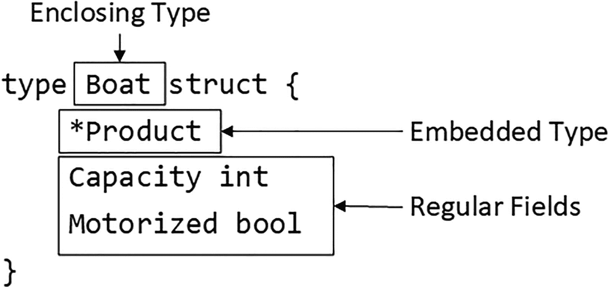

图 13-2

嵌入一个类型

一个结构体可以混合常规字段和嵌入字段类型，但嵌入字段是组合特性的重要组成部分，稍后你将看到这一点。

`NewBoat` 函数是一个构造函数，它使用其参数创建一个 `Boat`，并包含嵌入的 `Product` 值。代码清单 13-8 展示了这个新结构体的使用。

```
package main
import (
"fmt"
"composition/store"
)
func main() {
boats := []*store.Boat {
store.NewBoat("Kayak", 275, 1, false),
store.NewBoat("Canoe", 400, 3, false),
store.NewBoat("Tender", 650.25, 2, true),
}
for _, b := range boats {
fmt.Println("Conventional:", b.Product.Name, "Direct:", b.Name)
}
}
代码清单 13-8
在 composition 文件夹的 main.go 文件中使用 Boat 结构体
```

这些新语句创建了一个包含 `Boat` 类型的 `*Boat` 切片，并使用 `NewBoat` 构造函数进行填充。

对于包含类型为另一个结构体类型的字段，Go 语言会给予特殊处理，就像示例项目中 `Boat` 类型拥有 `*Product` 字段一样。你可以在 `for` 循环中的语句里看到这种特殊处理，该语句负责输出每个 `Boat` 的详细信息。

Go 语言允许通过两种方式访问嵌套类型的字段。第一种是传统方法，即遍历类型层次结构以获取所需的值。`*Product` 字段是嵌入的，这意味着它的名字就是它的类型。要访问 `Name` 字段，我可以这样遍历嵌套类型：

```
...
fmt.Println("Conventional:", b.Product.Name, "Direct:", b.Name)
...
```

Go 语言也允许直接使用嵌套的字段类型，就像这样：

```
...
fmt.Println("Conventional:", b.Product.Name, "Direct:", b.Name)
...
```

`Boat` 类型并没有定义 `Name` 字段，但由于直接访问特性，它可以被视为定义了该字段。这被称为**字段提升**，Go 语言实际上将类型“扁平化”了，使得 `Boat` 类型的行为就像它定义了由嵌套的 `Product` 类型提供的字段一样，如图 13-3 所示。

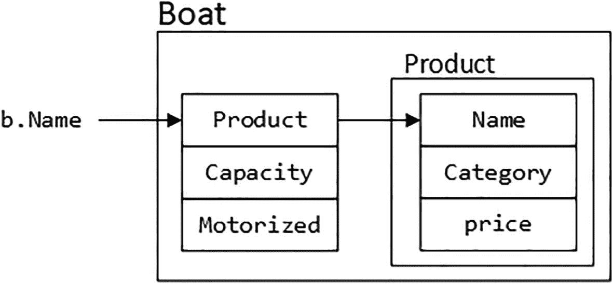

图 13-3

提升的字段

编译并执行该项目，你将看到两种方法产生的值相同：

```
Conventional: Kayak Direct: Kayak
Conventional: Canoe Direct: Canoe
Conventional: Tender Direct: Tender
```

方法也会被提升，因此为嵌套类型定义的方法可以从外部类型调用，如代码清单 13-9 所示。

```
package main
import (
"fmt"
"composition/store"
)
func main() {
boats := []*store.Boat {
store.NewBoat("Kayak", 275, 1, false),
store.NewBoat("Canoe", 400, 3, false),
store.NewBoat("Tender", 650.25, 2, true),
}
for _, b := range boats {
fmt.Println("Boat:", b.Name, "Price:", b.Price(0.2))
}
}
代码清单 13-9
在 composition 文件夹的 main.go 文件中调用方法
```

如果字段类型是值类型，例如 `Product`，那么所有使用 `Product` 或 `*Product` 接收器定义的方法都会被提升。如果字段类型是指针类型，例如 `*Product`，那么只有使用 `*Product` 接收器定义的方法会被提升。

`*Boat` 类型没有定义 `Price` 方法，但 Go 语言提升了使用 `*Product` 接收器定义的方法。编译并执行该项目，你将得到以下输出：

```
Boat: Kayak Price: 330
Boat: Canoe Price: 480
Boat: Tender Price: 780.3
```

**理解提升字段与字面量语法**

Go 语言在结构体值创建之后才会应用其特殊处理来提升字段。例如，如果我使用 `NewBoat` 函数创建了一个值，像这样：

```
...
boat := store.NewBoat("Kayak", 275, 1, false)
...
```

那么我可以像这样读取和赋值给提升的字段：

```
...
boat.Name = "Green Kayak"
...
```

但是，当最初使用字面量语法创建值时，这个特性不可用，这意味着我不能像这样替换 `NewBoat` 函数：

```
...
boat := store.Boat { Name: "Kayak", Category: "Watersports",
Capacity: 1, Motorized: false }
...
```

编译器不允许直接赋值，并且在编译代码时会报告“未知字段”错误。如果你确实使用字面量语法，那么必须像这样为嵌套字段赋值：

```
...
boat := store.Boat { Product: &store.Product{ Name: "Kayak",
Category: "Watersports"}, Capacity: 1, Motorized: false }
...
```

正如我在“创建嵌套类型链”一节中解释的，Go 语言使得使用组合特性创建复杂类型变得容易，但这使得字面量语法的使用越来越困难，并产生容易出错且难以维护的代码。我的建议是使用构造函数，并且在一个构造函数中调用另一个构造函数，就像 `NewBoat` 函数在代码清单 13-7 中调用 `NewProduct` 函数一样。

### 创建嵌套类型链

组合特性可用于创建复杂的嵌套类型链，其字段和方法会被提升到顶层外部类型。在 `store` 文件夹中添加一个名为 `rentalboats.go` 的文件，内容如代码清单 13-10 所示。

```
package store
type RentalBoat struct {
*Boat
IncludeCrew bool
}
func NewRentalBoat(name string, price float64, capacity int,
motorized, crewed bool) *RentalBoat {
return &RentalBoat{NewBoat(name, price, capacity, motorized), crewed}
}
代码清单 13-10
store 文件夹中 rentalboats.go 文件的内容
```

`RentalBoat` 类型由 `*Boat` 类型组合而成，而 `*Boat` 类型又由 `*Product` 类型组合而成，形成了一个链条。Go 语言执行提升操作，使得链条中所有三种类型定义的字段都可以被直接访问，如代码清单 13-11 所示。

```
package main
import (
"fmt"
"composition/store"
)
func main() {
rentals := []*store.RentalBoat {
store.NewRentalBoat("Rubber Ring", 10, 1, false, false),
store.NewRentalBoat("Yacht", 50000, 5, true, true),
store.NewRentalBoat("Super Yacht", 100000, 15, true, true),
}
for _, r := range rentals {
fmt.Println("Rental Boat:", r.Name, "Rental Price:", r.Price(0.2))
}
}
代码清单 13-11
在 composition 文件夹的 main.go 文件中直接访问嵌套字段
```

Go 语言从嵌套的 `Boat` 和 `Product` 类型提升字段，使其可以通过顶层 `RentalBoat` 类型访问，从而允许在代码清单 13-11 中读取 `Name` 字段。方法也会被提升到顶层类型，这就是为什么我可以使用 `Price` 方法，即使它是在链条末端的 `*Product` 类型上定义的。编译并执行代码清单 13-11 中的代码，将产生以下输出：

```
Rental Boat: Rubber Ring Rental Price: 12
Rental Boat: Yacht Rental Price: 60000
Rental Boat: Super Yacht Rental Price: 120000
```


### 在同一个结构体中使用多个嵌套类型

类型可以定义多个结构体字段，并且 Go 会为所有嵌套类型提升字段。清单 13-12 定义了一个描述船务人员的新类型，并将其用作另一个结构体中的字段类型。

```go
package store

type Crew struct {
    Captain, FirstOfficer string
}

type RentalBoat struct {
    *Boat
    IncludeCrew bool
    *Crew
}

func NewRentalBoat(name string, price float64, capacity int,
    motorized, crewed bool, captain, firstOfficer string) *RentalBoat {
    return &RentalBoat{NewBoat(name, price, capacity, motorized), crewed,
        &Crew{captain, firstOfficer}}
}
```
（清单 13-12：在 `store` 文件夹的 `rentalboats.go` 文件中定义一个新类型）

`RentalBoat` 类型拥有 `*Boat` 和 `*Crew` 字段，Go 会提升这两个嵌套类型的所有字段和方法，如清单 13-13 所示。

```go
package main

import (
    "fmt"
    "composition/store"
)

func main() {
    rentals := []*store.RentalBoat{
        store.NewRentalBoat("Rubber Ring", 10, 1, false, false, "N/A", "N/A"),
        store.NewRentalBoat("Yacht", 50000, 5, true, true, "Bob", "Alice"),
        store.NewRentalBoat("Super Yacht", 100000, 15, true, true,
            "Dora", "Charlie"),
    }
    for _, r := range rentals {
        fmt.Println("Rental Boat:", r.Name, "Rental Price:", r.Price(0.2),
            "Captain:", r.Captain)
    }
}
```
（清单 13-13：在 `composition` 文件夹的 `main.go` 文件中使用提升的字段）

编译并执行该项目，你将看到以下输出，其中增加了船务人员的详细信息：

```
Rental Boat: Rubber Ring Rental Price: 12 Captain: N/A
Rental Boat: Yacht Rental Price: 60000 Captain: Bob
Rental Boat: Super Yacht Rental Price: 120000 Captain: Dora
```

### 理解何时不能进行提升

只有当封闭类型上没有定义同名的字段或方法时，Go 才能执行提升，否则会导致意外的结果。在 `store` 文件夹中添加一个名为 `specialdeal.go` 的文件，其代码如清单 13-14 所示。

```go
package store

type SpecialDeal struct {
    Name string
    *Product
    price float64
}

func NewSpecialDeal(name string, p *Product, discount float64) *SpecialDeal {
    return &SpecialDeal{name, p, p.price - discount}
}

func (deal *SpecialDeal) GetDetails() (string, float64, float64) {
    return deal.Name, deal.price, deal.Price(0)
}
```
（清单 13-14：`store` 文件夹中 `specialdeal.go` 文件的内容）

`SpecialDeal` 类型定义了一个 `*Product` 嵌入字段。这种组合导致了重复字段，因为两个类型都定义了 `Name` 和 `price` 字段。此外还有一个构造函数和 `GetDetails` 方法，该方法返回 `Name` 和 `price` 字段的值，以及 `Price` 方法的结果（为了示例更易于理解，此处调用 `Price` 时传入了零作为参数）。清单 13-15 使用这个新类型来演示如何处理提升。

```go
package main

import (
    "fmt"
    "composition/store"
)

func main() {
    product := store.NewProduct("Kayak", "Watersports", 279)
    deal := store.NewSpecialDeal("Weekend Special", product, 50)
    Name, price, Price := deal.GetDetails()
    fmt.Println("Name:", Name)
    fmt.Println("Price field:", price)
    fmt.Println("Price method:", Price)
}
```
（清单 13-15：在 `composition` 文件夹的 `main.go` 文件中使用新类型）

这段代码创建了一个 `*Product`，然后用来创建一个 `*SpecialDeal`。调用 `GetDetails` 方法，并打印其返回的三个结果。编译并运行代码，你将看到以下输出：

```
Name: Weekend Special
Price field: 229
Price method: 279
```

前两个结果可能符合预期：`Product` 类型中的 `Name` 和 `price` 字段没有被提升，因为 `SpecialDeal` 类型有同名的字段。

第三个结果可能会引发问题。Go 可以提升 `Price` 方法，但当它被调用时，它使用的是 `Product` 中的 `price` 字段，而不是 `SpecialDeal` 中的。

很容易忘记字段和方法提升只是一个便利特性。清单 13-14 中的这条语句：

```go
return deal.Name, deal.price, deal.Price(0)
```

是以下语句的更简洁写法：

```go
return deal.Name, deal.price, deal.Product.Price(0)
```

当通过结构体字段调用方法时，很明显调用 `Price` 方法的结果不会使用 `SpecialDeal` 类型定义的 `price` 字段。

如果我想要能够调用 `Price` 方法并得到一个确实依赖于 `SpecialDeal.price` 字段的结果，那么我必须定义一个新方法，如清单 13-16 所示。

```go
package store

type SpecialDeal struct {
    Name string
    *Product
    price float64
}

func NewSpecialDeal(name string, p *Product, discount float64) *SpecialDeal {
    return &SpecialDeal{name, p, p.price - discount}
}

func (deal *SpecialDeal) GetDetails() (string, float64, float64) {
    return deal.Name, deal.price, deal.Price(0)
}

func (deal *SpecialDeal) Price(taxRate float64) float64 {
    return deal.price
}
```
（清单 13-16：在 `store` 文件夹的 `specialdeal.go` 文件中定义一个方法）

新的 `Price` 方法阻止了 Go 提升 `Product` 方法，并在项目编译和执行后产生以下结果：

```
Name: Weekend Special
Price field: 229
Price method: 229
```

#### 理解提升的二义性

一个相关的问题是，当两个嵌入字段使用相同的字段或方法名时，如清单 13-17 所示。

```go
package main

import (
    "fmt"
    "composition/store"
)

func main() {
    kayak := store.NewProduct("Kayak", "Watersports", 279)
    type OfferBundle struct {
        *store.SpecialDeal
        *store.Product
    }
    bundle := OfferBundle{
        store.NewSpecialDeal("Weekend Special", kayak, 50),
        store.NewProduct("Lifrejacket", "Watersports", 48.95),
    }
    fmt.Println("Price:", bundle.Price(0))
}
```
（清单 13-17：在 `composition` 文件夹的 `main.go` 文件中产生二义性的方法）

`OfferBundle` 类型有两个嵌入字段，它们都具有 `Price` 方法。Go 无法区分这两个方法，清单 13-17 中的代码在编译时会报以下错误：

```
.\main.go:22:33: ambiguous selector bundle.Price
```

## 理解组合与接口

组合类型可以轻松构建专门化的功能，而无需重复通用类型所需的代码；例如，项目中的 `Boat` 类型可以构建在 `Product` 类型提供的功能之上。

这看起来与其他语言中的类相似，但有一个重要的区别：每个组合后的类型都是独立的，不能用在需要其组成部分类型的地方，如清单 13-18 所示。

```go
package main

import (
    "fmt"
    "composition/store"
)

func main() {
    products := map[string]*store.Product{
        "Kayak": store.NewBoat("Kayak", 279, 1, false),
        "Ball":  store.NewProduct("Soccer Ball", "Soccer", 19.50),
    }
    for _, p := range products {
        fmt.Println("Name:", p.Name, "Category:", p.Category, "Price:", p.Price(0.2))
    }
}
```
（清单 13-18：在 `composition` 文件夹的 `main.go` 文件中混合使用类型）

Go 编译器不允许将 `Boat` 作为值用在需要 `Product` 值的切片中。在 C# 或 Java 这类语言中，这是允许的，因为 `Boat` 会是 `Product` 的子类，但 Go 处理类型的方式并非如此。如果你编译该项目，将会看到以下错误：

```
.\main.go:11:9: cannot use store.NewBoat("Kayak", 279, 1, false) (type *store.Boat) as type *store.Product in map value
```


### 使用组合实现接口

正如我在第 11 章中所解释的，Go 使用接口来描述可由多种类型实现的方法。

Go 在判断某个类型是否符合接口时，会考虑提升的方法，这避免了重复编写已通过嵌入字段实现的方法。为了理解其工作原理，在 `store` 文件夹中添加一个名为 `forsale.go` 的文件，内容如代码清单 13-19 所示。

```
package store
type ItemForSale interface {
Price(taxRate float64) float64
}
代码清单 13-19
store 文件夹中 forsale.go 文件的内容
```

`ItemForSale` 类型是一个接口，它指定了一个名为 `Price` 的单一方法，该方法有一个 `float64` 型参数和一个 `float64` 型返回值。代码清单 13-20 使用该接口类型创建了一个映射，其中填充了符合该接口的条目。

```
package main
import (
"fmt"
"composition/store"
)
func main() {
products := map[string]store.ItemForSale {
"Kayak": store.NewBoat("Kayak", 279, 1, false),
"Ball": store.NewProduct("Soccer Ball", "Soccer", 19.50),
}
for key, p := range products {
fmt.Println("Key:", key, "Price:", p.Price(0.2))
}
}
代码清单 13-20
在 composition 文件夹的 main.go 文件中使用接口
```

将映射改为使用接口后，我就可以存储 `Product` 和 `Boat` 类型的值了。`Product` 类型直接符合 `ItemForSale` 接口，因为存在一个 `Price` 方法，其签名与接口指定的一致，且接收者为 `*Product`。

`*Boat` 接收者并没有 `Price` 方法，但 Go 会考虑从 `Boat` 类型的嵌入字段中提升而来的 `Price` 方法，并用它来满足接口的要求。编译并执行该项目，你将看到以下输出：

```
Key: Kayak Price: 334.8
Key: Ball Price: 23.4
```

#### 理解类型切换的局限性

接口只能指定方法，这就是为什么在代码清单 13-20 中，我在输出时使用了映射中存储值的键。在第 11 章中，我解释了可以使用 `switch` 语句来获取底层类型，但这可能并不像你期望的那样工作，如代码清单 13-21 所示。

```
package main
import (
"fmt"
"composition/store"
)
func main() {
products := map[string]store.ItemForSale {
"Kayak": store.NewBoat("Kayak", 279, 1, false),
"Ball": store.NewProduct("Soccer Ball", "Soccer", 19.50),
}
for key, p := range products {
switch item := p.(type) {
case *store.Product, *store.Boat:
fmt.Println("Name:", item.Name, "Category:", item.Category,
"Price:", item.Price(0.2))
default:
fmt.Println("Key:", key, "Price:", p.Price(0.2))
}
}
}
代码清单 13-21
在 composition 文件夹的 main.go 文件中访问底层类型
```

代码清单 13-21 中的 `case` 语句指定了 `*Product` 和 `*Boat`，这会导致编译器失败，并出现以下错误：

```
.\main.go:21:42: item.Name undefined (type store.ItemForSale has no field or method Name)
.\main.go:21:66: item.Category undefined (type store.ItemForSale has no field or method Category)
```

问题在于，指定了多个类型的 `case` 语句会匹配所有这些类型的值，但不会执行类型断言。对于代码清单 13-21 来说，这意味着 `*Product` 和 `*Boat` 的值会被 `case` 语句匹配，但 `item` 变量的类型将是 `ItemForSale`，这就是编译器报错的原因。相反，必须使用额外的类型断言或单类型 `case` 语句，如代码清单 13-22 所示。

```
package main
import (
"fmt"
"composition/store"
)
func main() {
products := map[string]store.ItemForSale {
"Kayak": store.NewBoat("Kayak", 279, 1, false),
"Ball": store.NewProduct("Soccer Ball", "Soccer", 19.50),
}
for key, p := range products {
switch item := p.(type) {
case *store.Product:
fmt.Println("Name:", item.Name, "Category:", item.Category,
"Price:", item.Price(0.2))
case *store.Boat:
fmt.Println("Name:", item.Name, "Category:", item.Category,
"Price:", item.Price(0.2))
default:
fmt.Println("Key:", key, "Price:", p.Price(0.2))
}
}
}
代码清单 13-22
在 composition 文件夹的 main.go 文件中使用单独的 case 语句
```

当指定单个类型时，`case` 语句会执行类型断言，尽管这可能导致代码重复，因为每个类型都需要单独处理。编译并执行代码清单 13-22 中的代码，将产生以下输出：

```
Name: Kayak Category: Watersports Price: 334.8
Name: Soccer Ball Category: Soccer Price: 23.4
```

另一种解决方案是定义能够提供属性值访问的接口方法。这可以通过向现有接口添加方法，或者定义一个新的独立接口来实现，如代码清单 13-23 所示。

```
package store
type Product struct {
Name, Category string
price float64
}
func NewProduct(name, category string, price float64) *Product {
return &Product{ name, category, price }
}
func (p *Product) Price(taxRate float64) float64 {
return p.price + (p.price * taxRate)
}
type Describable interface  {
GetName() string
GetCategory() string
}
func (p *Product) GetName() string {
return p.Name
}
func (p *Product) GetCategory() string {
return p.Category
}
代码清单 13-23
在 store 文件夹的 product.go 文件中定义接口
```

`Describable` 接口定义了 `GetName` 和 `GetCategory` 方法，这些方法已为 `*Product` 类型实现。代码清单 13-24 修改了 `switch` 语句，使其使用接口而不是字段。

```
package main
import (
"fmt"
"composition/store"
)
func main() {
products := map[string]store.ItemForSale {
"Kayak": store.NewBoat("Kayak", 279, 1, false),
"Ball": store.NewProduct("Soccer Ball", "Soccer", 19.50),
}
for key, p := range products {
switch item := p.(type) {
case store.Describable:
fmt.Println("Name:", item.GetName(), "Category:", item.GetCategory(),
"Price:", item.(store.ItemForSale).Price(0.2))
default:
fmt.Println("Key:", key, "Price:", p.Price(0.2))
}
}
}
代码清单 13-24
在 composition 文件夹的 main.go 文件中使用接口
```

这种方法是可行的，但它依赖于向 `ItemForSale` 接口的类型断言来访问 `Price` 方法。这有问题，因为一个类型可能实现了 `Describable` 接口，却没有实现 `ItemForSale` 接口，这会导致运行时错误。我可以通过将 `Price` 方法添加到 `Describable` 接口来处理类型断言，但还有另一种方法，我将在下一节中描述。编译并执行该项目，你将看到以下输出：

```
Name: Kayak Category: Watersports Price: 334.8
Name: Soccer Ball Category: Soccer Price: 23.4
```


### 组合接口

Go 允许将一个接口与其他接口组合，如代码清单 13-25 所示。

```go
package store
type Product struct {
	Name, Category string
	price float64
}
func NewProduct(name, category string, price float64) *Product {
	return &Product{ name, category, price }
}
func (p *Product) Price(taxRate float64) float64 {
	return p.price + (p.price * taxRate)
}
type Describable interface  {
	GetName() string
	GetCategory() string
	ItemForSale
}
func (p *Product) GetName() string {
	return p.Name
}
func (p *Product) GetCategory() string {
	return p.Category
}
```

一个接口可以包含另一个接口，其效果是类型必须实现外层接口和内层接口定义的所有方法。接口比结构体更简单，没有需要提升的字段或方法。组合接口的结果是外层和内层类型定义的方法的并集。在此示例中，这个并集意味着实现 `Describable` 接口需要 `GetName`、`GetCategory` 和 `Price` 方法。由 `Describable` 接口直接定义的 `GetName` 和 `GetCategory` 方法，与 `ItemForSale` 接口定义的 `Price` 方法形成了一个并集。

对 `Describable` 接口的修改意味着上一节中使用的类型断言不再需要，如代码清单 13-26 所示。

```go
package main
import (
	"fmt"
	"composition/store"
)
func main() {
	products := map[string]store.ItemForSale {
		"Kayak": store.NewBoat("Kayak", 279, 1, false),
		"Ball": store.NewProduct("Soccer Ball", "Soccer", 19.50),
	}
	for key, p := range products {
		switch item := p.(type) {
		case store.Describable:
			fmt.Println("Name:", item.GetName(), "Category:", item.GetCategory(),
				"Price:", item.Price(0.2))
		default:
			fmt.Println("Key:", key, "Price:", p.Price(0.2))
		}
	}
}
```

任何实现了 `Describable` 接口的类型，其值都必须拥有一个 `Price` 方法，因为代码清单 13-25 中执行了组合操作，这意味着可以调用该方法，而无需进行有风险的类型断言。编译并执行该项目，你将收到以下输出：

```
Name: Kayak Category: Watersports Price: 334.8
Name: Soccer Ball Category: Soccer Price: 23.4
```

## 本章小结

在本章中，我描述了 Go 类型如何被组合以创建更复杂的功能，为其他语言基于继承的方法提供了一种替代方案。下一章，我将描述协程（goroutines）和通道（channels），它们是 Go 用于管理并发的特性。

# 14. 使用协程和通道

Go 对编写并发应用程序提供了出色的支持，其使用的特性比我用过的任何其他语言都更简单、更直观。本章我将介绍*协程*（goroutines）的使用，它允许函数并发执行，以及*通道*（channels），通过它协程可以异步产生结果。表 14-1 将协程和通道置于适当的上下文中。

**表 14-1：** 协程和通道的上下文

| 问题 | 答案 |
| --- | --- |
| 它们是什么？ | 协程是由 Go 运行时创建和管理的轻量级线程。通道是承载特定类型值的管道。 |
| 它们为什么有用？ | 协程允许函数并发执行，而无需处理操作系统线程的复杂性。通道允许协程异步产生结果。 |
| 如何使用它们？ | 使用 `go` 关键字创建协程。通道被定义为数据类型。 |
| 是否有任何陷阱或限制？ | 必须小心管理通道的方向。共享数据的协程需要额外的特性，这些将在第 14 章中描述。 |
| 是否有替代方案？ | 协程和通道是 Go 内置的并发特性，但某些应用程序可以依赖单线程执行，该线程默认被创建用来执行 main 函数。 |

**表 14-2：** 本章摘要

| 问题 | 解决方案 | 代码清单 |
| --- | --- | --- |
| 异步执行函数 | 创建一个协程 | 7 |
| 从异步执行的函数获取结果 | 使用通道 | 10, 15, 16, 22–26 |
| 使用通道发送和接收值 | 使用箭头表达式 | 11–13 |
| 指示将不再通过通道发送更多值 | 使用 `close` 函数 | 17–20 |
| 枚举从通道接收到的值 | 使用带 `range` 关键字的 `for` 循环 | 21 |
| 使用多个通道发送或接收值 | 使用 `select` 语句 | 27–32 |


## 本章准备

要开始本章的学习，请打开一个新的命令提示符，导航到一个方便的位置，并创建一个名为 `concurrency` 的目录。运行如代码清单 14-1 所示的命令来创建一个模块文件。

> **提示**  
> 你可以从 [`https://github.com/apress/pro-go`](https://github.com/apress/pro-go) 下载本章以及本书其他所有章节的示例项目。如果在运行示例时遇到问题，请参阅第 2 章了解如何获取帮助。

```
go mod init concurrency
代码清单 14-1
初始化模块
```

向 `concurrency` 文件夹中添加一个名为 `product.go` 的文件，其内容如代码清单 14-2 所示。

```
package main
import "strconv"
type Product struct {
Name, Category string
Price float64
}
var ProductList = []*Product {
{ "Kayak", "Watersports", 279 },
{ "Lifejacket", "Watersports", 49.95 },
{ "Soccer Ball", "Soccer", 19.50 },
{ "Corner Flags", "Soccer", 34.95 },
{ "Stadium", "Soccer", 79500 },
{ "Thinking Cap", "Chess", 16 },
{ "Unsteady Chair", "Chess", 75 },
{ "Bling-Bling King", "Chess", 1200 },
}
type ProductGroup []*Product
type ProductData = map[string]ProductGroup
var Products =  make(ProductData)
func ToCurrency(val float64) string {
return "$" + strconv.FormatFloat(val, 'f', 2, 64)
}
func init() {
for _, p := range ProductList {
if _, ok := Products[p.Category]; ok {
Products[p.Category] = append(Products[p.Category], p)
} else {
Products[p.Category] = ProductGroup{ p }
}
}
}
代码清单 14-2
concurrency 文件夹中 product.go 文件的内容
```

该文件定义了一个名为 `Product` 的自定义类型，以及一些类型别名，我利用这些别名创建了一个按类别组织产品的映射（map）。我在切片（slice）和映射中使用了 `Product` 类型，并借助一个 `init` 函数（详见第 12 章）来根据切片内容填充映射，而切片本身则通过字面量语法进行填充。该文件还包含一个 `ToCurrency` 函数，用于将 `float64` 类型的值格式化为美元货币字符串，我将在本章中用其格式化结果。

向 `concurrency` 文件夹中添加一个名为 `operations.go` 的文件，其内容如代码清单 14-3 所示。

```
package main
import "fmt"
func CalcStoreTotal(data ProductData) {
var storeTotal float64
for category, group := range data {
storeTotal += group.TotalPrice(category)
}
fmt.Println("Total:", ToCurrency(storeTotal))
}
func (group ProductGroup) TotalPrice(category string, ) (total float64) {
for _, p := range group {
total += p.Price
}
fmt.Println(category, "subtotal:", ToCurrency(total))
return
}
代码清单 14-3
concurrency 文件夹中 operations.go 文件的内容
```

该文件定义了操作 `product.go` 文件中创建的类型别名的方法。如我在第 11 章中所述，方法只能定义在同一包内创建的类型上，这意味着例如我不能为 `[]*Product` 类型定义方法，但可以为该类型创建一个别名，并将别名用作方法接收者。

向 `concurrency` 文件夹中添加一个名为 `main.go` 的文件，其内容如代码清单 14-4 所示。

```
package main
import "fmt"
func main() {
fmt.Println("main function started")
CalcStoreTotal(Products)
fmt.Println("main function complete")
}
代码清单 14-4
concurrency 文件夹中 main.go 文件的内容
```

在命令提示符下，导航到 `concurrency` 文件夹，运行如代码清单 14-5 所示的命令。

```
go run .
代码清单 14-5
运行示例项目
```

代码将被编译并执行，产生以下输出：

```
main function started
Watersports subtotal: $328.95
Soccer subtotal: $79554.45
Chess subtotal: $1291.00
Total: $81174.40
main function complete
```

## 理解 Go 如何执行代码

执行 Go 程序的关键构建块是 *goroutine*，它是 Go 运行时创建的一个轻量级线程。所有 Go 程序都至少使用一个 goroutine，因为这是 Go 执行 `main` 函数中代码的方式。当编译后的 Go 代码被执行时，运行时会创建一个 goroutine，该 goroutine 从入口点（即 `main` 包中的 `main` 函数）开始执行语句。`main` 函数中的每条语句都会按定义顺序依次执行。goroutine 会持续执行语句，直到到达 `main` 函数的末尾，此时应用程序终止。

goroutine *同步地* 执行 `main` 函数中的每条语句，这意味着它会等待当前语句执行完毕后再继续执行下一条语句。`main` 函数中的语句可以调用其他函数、使用 `for` 循环、创建值，以及使用本书中描述的所有其他特性。`main` goroutine 会沿代码路径逐条执行语句，依次推进。

对于示例应用程序来说，这意味着产品映射会被顺序处理，每个产品类别依次被处理，并且在每个类别内部，每个产品也会依次被处理，如图 14-1 所示。

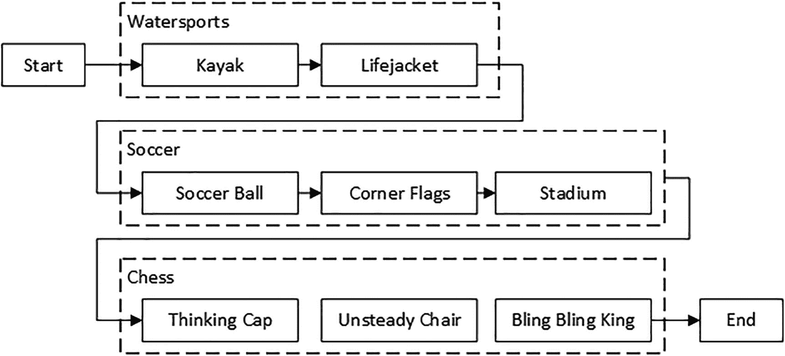

**图 14-1** 顺序执行

代码清单 14-6 添加了一条语句，在处理每个产品时输出其详细信息，这将展示图中所示的流程。

```
package main
import "fmt"
func CalcStoreTotal(data ProductData) {
var storeTotal float64
for category, group := range data {
storeTotal += group.TotalPrice(category)
}
fmt.Println("Total:", ToCurrency(storeTotal))
}
func (group ProductGroup) TotalPrice(category string) (total float64) {
for _, p := range group {
fmt.Println(category, "product:", p.Name)
total += p.Price
}
fmt.Println(category, "subtotal:", ToCurrency(total))
return
}
代码清单 14-6
在 concurrency 文件夹的 operations.go 文件中添加一条语句
```

编译并执行代码，你将看到类似以下的输出：

```
main function started
Soccer product: Soccer Ball
Soccer product: Corner Flags
Soccer product: Stadium
Soccer subtotal: $79554.45
Chess product: Thinking Cap
Chess product: Unsteady Chair
Chess product: Bling-Bling King
Chess subtotal: $1291.00
Watersports product: Kayak
Watersports product: Lifejacket
Watersports subtotal: $328.95
Total: $81174.40
main function complete
```

根据从映射中检索键的顺序，你可能会看到不同的结果，但关键在于，一个类别中的所有产品都会处理完毕，然后才会执行到下一个类别。

同步执行的优势在于简单性和一致性——同步代码的行为易于理解且可预测。其缺点则是效率可能低下。像示例中那样顺序处理九个数据项并不会产生任何问题，但大多数实际项目都有更大的数据量或需要执行其他任务，这意味着顺序执行耗时过长，且无法足够快地产生结果。


## 创建额外的 Goroutine

Go 允许开发者创建额外的 goroutine，这些 goroutine 可以与 `main` goroutine 同时执行代码。如清单 14-7 所示，Go 使得创建新 goroutine 变得非常简单。

```
package main
import "fmt"
func CalcStoreTotal(data ProductData) {
var storeTotal float64
for category, group := range data {
go group.TotalPrice(category)
}
fmt.Println("Total:", ToCurrency(storeTotal))
}
func (group ProductGroup) TotalPrice(category string) (total float64) {
for _, p := range group {
fmt.Println(category, "product:", p.Name)
total += p.Price
}
fmt.Println(category, "subtotal:", ToCurrency(total))
return
}
清单 14-7  在 concurrency 文件夹的 operations.go 文件中创建 Go 例程
```

使用 `go` 关键字后跟应异步执行的函数或方法，即可创建一个 goroutine，如图 14-2 所示。

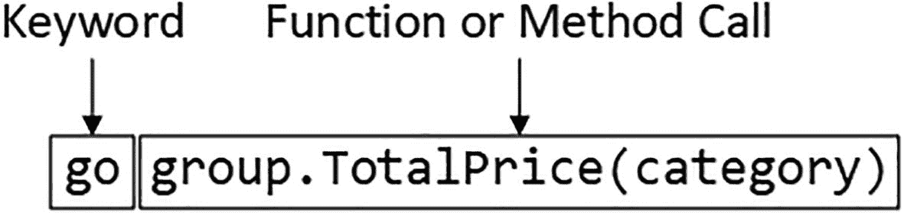

图 14-2  一个 goroutine

当 Go 运行时遇到 `go` 关键字时，它会创建一个新的 goroutine，并用它来执行指定的函数或方法。这改变了程序的执行方式，因为在任意给定时刻，可能存在多个 goroutine，每个都在执行自己的一组语句。这些语句是*并发*执行的，这意味着它们同时被执行。在这个例子中，每次调用 `TotalPrice` 方法都会创建一个 goroutine，这意味着各个类别会被并发处理，如图 14-3 所示。

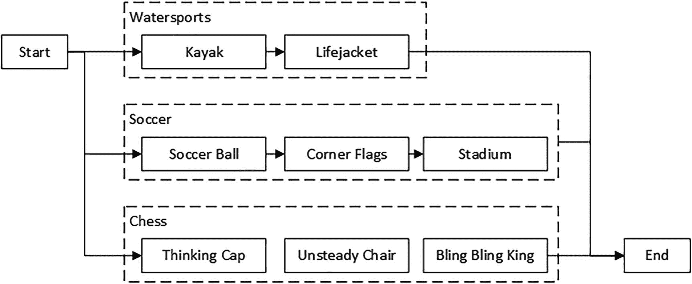

图 14-3  并发函数调用

Go 例程使得调用函数和方法变得容易，但清单 14-7 中的改动引入了一个常见问题。编译并执行该项目，你将看到如下结果：

```
main function started
Total: $0.00
main function complete
```

你可能会看到略有不同的结果，其中可能包含一个或多个类别的分类小计。但大多数情况下，你会看到这些消息。在将 goroutine 引入代码之前，`TotalPrice` 方法是这样调用的：

```
...
storeTotal += group.TotalPrice(category)
...
```

这是一个同步函数调用。它告诉运行时逐一执行 `TotalPrice` 方法中的语句，并将结果赋值给名为 `storeTotal` 的变量。在所有 `TotalPrice` 语句处理完毕之前，程序不会继续执行。但清单 14-7 引入了一个 goroutine 来执行该函数，如下所示：

```
...
go group.TotalPrice(category)
...
```

这条语句告诉运行时使用一个新的 goroutine 来执行 `TotalPrice` 方法中的语句。运行时不会等待 goroutine 执行完该方法，而是立即继续执行下一条语句。这正是 goroutine 的全部意义所在，因为 `TotalPrice` 方法将被异步调用，这意味着其中一个 goroutine 在评估其语句的同时，原始 goroutine 正在执行 `main` 函数中的语句。但正如我之前解释的，当 `main` goroutine 执行完 `main` 函数中的所有语句时，程序就会终止。结果就是，在用于执行 `TotalPrice` 方法的 goroutine 完成之前，程序就已经终止了，这就是为什么我们没有看到任何分类小计。

在介绍更多特性时，我会解释如何解决这个问题，但眼下，我只需要让程序持续足够长的时间，以便让 goroutine 能够完成，如清单 14-8 所示。

```
package main
import (
"fmt"
"time"
)
func main() {
fmt.Println("main function started")
CalcStoreTotal(Products)
time.Sleep(time.Second * 5)
fmt.Println("main function complete")
}
清单 14-8  在 concurrency 文件夹的 main.go 文件中延迟程序退出
```

`time` 包是标准库的一部分，在第 19 章会进行描述。`time` 包提供了 `Sleep` 函数，该函数会使执行该语句的 goroutine 暂停。暂停时长通过一组表示时间间隔的数字常量来指定，因此 `time.Second` 表示一秒，乘以 5 后得到五秒的时长。在这个例子中，它会暂停 `main` goroutine 的执行，从而给创建的 goroutine 留出时间来执行 `TotalPrice` 方法。当暂停时长过去后，`main` goroutine 会恢复执行语句，到达函数末尾，并导致程序终止。

编译并执行该项目，你将看到如下输出：

```
main function started
Watersports product: Kayak
Watersports product: Lifejacket
Watersports subtotal: $328.95
Soccer product: Soccer Ball
Soccer product: Corner Flags
Soccer product: Stadium
Soccer subtotal: $79554.45
Chess product: Thinking Cap
Chess product: Unsteady Chair
Chess product: Bling-Bling King
Chess subtotal: $1291.00
Total: $0.00
main function complete
```

程序不再提前退出，但很难确定 goroutine 是否在并发工作。这是因为这个例子太简单了，以至于一个 goroutine 可以在 Go 创建并启动下一个 goroutine 的极短时间内完成。在清单 14-9 中，我添加了另一个暂停，这会减慢 `TotalPrice` 方法的执行速度，以帮助说明代码是如何执行的。（在实际项目中你不应该这样做，但这有助于理解这些特性的工作原理。）

```
package main
import (
"fmt"
"time"
)
func CalcStoreTotal(data ProductData) {
var storeTotal float64
for category, group := range data {
go group.TotalPrice(category)
}
fmt.Println("Total:", ToCurrency(storeTotal))
}
func (group ProductGroup) TotalPrice(category string) (total float64) {
for _, p := range group {
fmt.Println(category, "product:", p.Name)
total += p.Price
time.Sleep(time.Millisecond * 100)
}
fmt.Println(category, "subtotal:", ToCurrency(total))
return
}
清单 14-9  在 concurrency 文件夹的 operations.go 文件中添加 Sleep 语句
```

新语句在 `TotalPrice` 方法的 `for` 循环的每次迭代中增加了 100 毫秒的延迟。编译并执行代码，你将看到类似下面的输出：

```
main function started
Total: $0.00
Soccer product: Soccer Ball
Watersports product: Kayak
Chess product: Thinking Cap
Chess product: Unsteady Chair
Watersports product: Lifejacket
Soccer product: Corner Flags
Chess product: Bling-Bling King
Soccer product: Stadium
Watersports subtotal: $328.95
Soccer subtotal: $79554.45
Chess subtotal: $1291.00
main function complete
```

你可能会看到结果顺序不同，但关键是，不同类别的消息是交错出现的，这表明数据正在被并行处理。（如果清单 14-9 中的改动没有给你带来预期的结果，那么你可能需要增加 `time.Sleep` 函数引入的暂停时长。）


### 从 Goroutine 中获取结果

当我在代码清单 14-7 中创建 goroutine 时，改变了调用`TotalPrice`方法的方式。原本的代码如下所示：

```
...
storeTotal += group.TotalPrice(category)
...
```

但引入 Go 例程后，我将语句改为：

```
...
go group.TotalPrice(category)
...
```

我获得了异步执行能力，但失去了方法的返回结果，这就是为什么代码清单 14-9 的输出中总计结果为零：

```
...
Total: $0.00
...
```

从异步执行的函数中获取结果可能很复杂，因为这需要在产生结果的 goroutine 和使用结果的 goroutine 之间进行协作。

为了解决这个问题，Go 提供了*通道（channels）*，这是一种可以发送和接收数据的管道。我将逐步在示例中引入通道，从代码清单 14-10 开始，这意味着在完成所有步骤前该示例无法编译。

```
package main
import (
"fmt"
"time"
)
func CalcStoreTotal(data ProductData) {
var storeTotal float64
var channel chan float64 = make(chan float64)
for category, group := range data {
go group.TotalPrice(category)
}
fmt.Println("Total:", ToCurrency(storeTotal))
}
func (group ProductGroup) TotalPrice(category string) (total float64) {
for _, p := range group {
fmt.Println(category, "product:", p.Name)
total += p.Price
time.Sleep(time.Millisecond * 100)
}
fmt.Println(category, "subtotal:", ToCurrency(total))
return
}
```

代码清单 14-10  
在`concurrency`文件夹的`operations.go`文件中定义通道

通道是强类型的，这意味着它们将携带指定类型或接口的值。通道的类型由`chan`关键字后跟通道将携带的类型组成，如图 14-4 所示。使用内置的`make`函数创建通道，并指定通道类型。

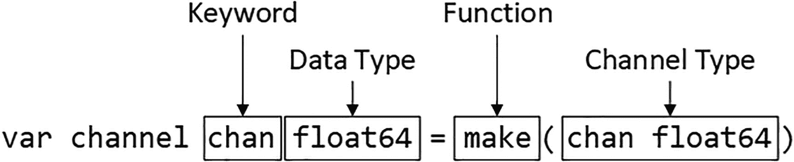

图 14-4  
定义通道

在本清单中，我使用了完整的变量声明语法以强调类型，即`chan float64`，表示一个携带`float64`值的通道。

**注意：** `sync`包提供了管理共享数据的 goroutine 的功能，如第 30 章所述。

## 使用通道发送结果

下一步是更新`TotalPrice`方法，使其通过通道发送结果，如代码清单 14-11 所示。

```
package main
import (
"fmt"
"time"
)
func CalcStoreTotal(data ProductData) {
var storeTotal float64
var channel chan float64 = make(chan float64)
for category, group := range data {
go group.TotalPrice(category)
}
fmt.Println("Total:", ToCurrency(storeTotal))
}
func (group ProductGroup) TotalPrice(category string, resultChannel chan float64)  {
var total float64
for _, p := range group {
fmt.Println(category, "product:", p.Name)
total += p.Price
time.Sleep(time.Millisecond * 100)
}
fmt.Println(category, "subtotal:", ToCurrency(total))
resultChannel <- total
}
```

代码清单 14-11  
在`concurrency`文件夹的`operations.go`文件中使用通道发送结果

第一个更改是移除传统的返回结果，并添加一个`chan float64`参数，其类型与代码清单 14-10 中创建的通道相匹配。我还定义了一个名为`total`的变量，这在此前并非必需，因为该函数使用了命名返回值。

另一个更改展示了如何使用通道发送结果。先指定通道，后跟一个由`<`和`-`字符组成的指向箭头，然后是值，如图 14-5 所示。

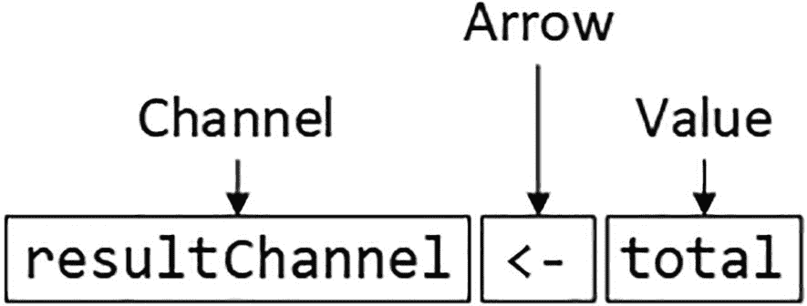

图 14-5  
发送结果

该语句通过`resultChannel`通道发送`total`值，使其可被应用程序中其他部分接收。需要注意的是，当通过通道发送值时，发送方无需了解该值将如何被接收和使用，就如同常规的同步函数不知道其返回值将如何被使用一样。


### 通过通道接收结果

箭头语法用于从通道接收值，这将允许 `CalcStoreTotal` 函数接收 `TotalPrice` 方法发送的数据，如清单 14-12 所示。

```go
package main
import (
"fmt"
"time"
)
func CalcStoreTotal(data ProductData) {
var storeTotal float64
var channel chan float64 = make(chan float64)
for category, group := range data {
go group.TotalPrice(category, channel)
}
for i := 0; i < len(data); i++ {
storeTotal += <- channel
}
fmt.Println("Total:", ToCurrency(storeTotal))
}
func (group ProductGroup) TotalPrice(category string, resultChannel chan float64)  {
var total float64
for _, p := range group {
fmt.Println(category, "product:", p.Name)
total += p.Price
time.Sleep(time.Millisecond * 100)
}
fmt.Println(category, "subtotal:", ToCurrency(total))
resultChannel <- total
}
清单 14-12
在 concurrency 文件夹的 operations.go 文件中接收结果
```

箭头放在通道之前以从中接收值，如图 14-6 所示，接收到的值可以像任何标准 Go 表达式的一部分一样使用，例如示例中使用的 `+=` 操作。

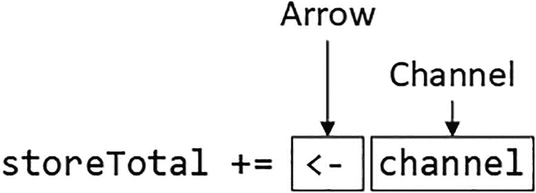

图 14-6  
接收结果

在此示例中，我知道可以从通道接收的结果数量恰好与我创建的 goroutine 数量匹配。而且，由于我为映射中的每个键创建了一个 goroutine，因此可以在 `for` 循环中使用 `len` 函数来读取所有结果。

通道可以在多个 goroutine 之间安全地共享，本节中所做更改的效果是：为调用 `TotalPrice` 方法而创建的 Go 例程都通过 `CalcStoreTotal` 函数创建的通道发送其结果，并在该通道中接收和处理它们。

从通道接收是一个阻塞操作，这意味着在接收到值之前不会继续执行，这意味着我不再需要阻止程序终止，如清单 14-13 所示。

```go
package main
import (
"fmt"
//"time"
)
func main() {
fmt.Println("main function started")
CalcStoreTotal(Products)
//time.Sleep(time.Second * 5)
fmt.Println("main function complete")
}
清单 14-13
在 concurrency 文件夹的 main.go 文件中移除 Sleep 语句
```

这些更改的总体效果是，程序启动并开始执行 `main` 函数中的语句。这导致调用 `CalcStoreTotal` 函数，该函数创建一个通道并启动多个 goroutine。这些 goroutine 执行 `TotalPrice` 方法中的语句，该方法使用通道发送其结果。

`main` goroutine 继续执行 `CalcStoreTotal` 函数中的语句，该函数通过通道接收结果。这些结果用于计算总金额，并将其打印出来。然后执行 `main` 函数中的其余语句，程序终止。

编译并执行该项目，您将看到以下输出：

```
main function started
Watersports product: Kayak
Chess product: Thinking Cap
Soccer product: Soccer Ball
Soccer product: Corner Flags
Watersports product: Lifejacket
Chess product: Unsteady Chair
Chess product: Bling-Bling King
Soccer product: Stadium
Watersports subtotal: $328.95
Chess subtotal: $1291.00
Soccer subtotal: $79554.45
Total: $81174.40
main function complete
```

您可能会看到消息以不同的顺序显示，但需要注意的关键点是总金额计算正确，如下所示：

```
...
Total: $81174.40
...
```

通道用于协调 goroutine，允许 `main` goroutine 等待在 `CalcStoreTotal` 函数中创建的 goroutine 产生的各个结果。图 14-7 显示了这些例程与通道之间的关系。

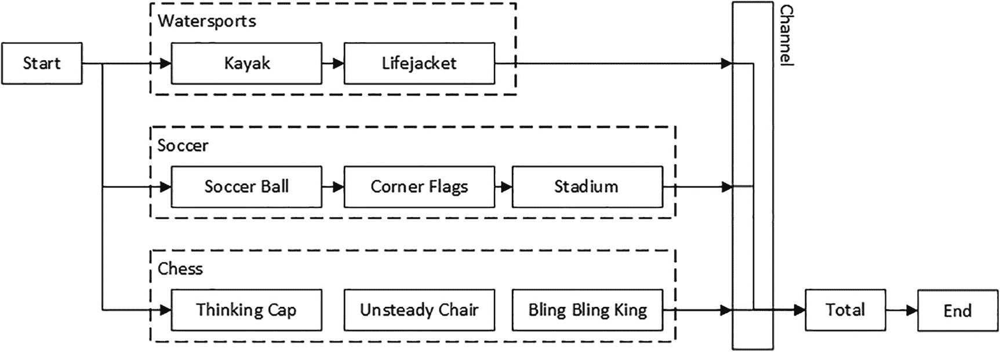

图 14-7  
使用通道进行协调

### 使用适配器异步执行函数

重写现有函数或方法以使用通道并不总是可行的，但在包装器中异步执行同步函数是一件简单的事情，如下所示：

```go
...
calcTax := func(price float64) float64 {
return price + (price * 0.2)
}
wrapper := func (price float64, c chan float64)  {
c <- calcTax(price)
}
resultChannel := make(chan float64)
go wrapper(275, resultChannel)
result := <- resultChannel
fmt.Println("Result:", result)
...
```

`wrapper` 函数接收一个通道，它使用该通道发送通过同步执行 `calcTax` 函数获得的值。这可以通过定义一个不将其赋值给变量的函数来更简洁地表达，如下所示：

```go
...
go func (price float64, c chan float64) {
c <- calcTax(price)
}(275, resultChannel)
...
```

这种语法有点笨拙，因为用于调用函数的参数直接在函数定义之后写出。但结果是相同的，即同步函数可以由 goroutine 执行，并将结果通过通道发送出去。

### 使用通道

上一节演示了通道的基本用法及其在协调 goroutine 中的应用。在接下来的几节中，我将描述使用通道来改变协调方式的不同方法，从而使 goroutine 能够适应不同的场景。


### 协调通道

默认情况下，通过通道发送和接收数据是阻塞操作。这意味着，发送值的 goroutine 在另一个 goroutine 从该通道接收到该值之前，不会执行任何后续语句。如果第二个 goroutine 发送了一个值，它将会被阻塞，直到通道被清空，从而形成一个等待接收值的 goroutine 队列。这种情况在另一个方向上也会发生，因此接收值的 goroutine 会阻塞，直到另一个 goroutine 发送一个值。示例项目中的代码清单 14-14 更改了发送和接收值的方式，以突出显示此行为。

```
package main
import (
"fmt"
"time"
)
func CalcStoreTotal(data ProductData) {
var storeTotal float64
var channel chan float64 = make(chan float64)
for category, group := range data {
go group.TotalPrice(category, channel)
}
time.Sleep(time.Second * 5)
fmt.Println("-- 开始从通道接收")
for i := 0; i < len(data); i++ {
fmt.Println("-- 通道读取挂起")
value :=  <- channel
fmt.Println("-- 通道读取完成", value)
storeTotal += value
time.Sleep(time.Second)
}
fmt.Println("总计:", ToCurrency(storeTotal))
}
func (group ProductGroup) TotalPrice(category string, resultChannel chan float64)  {
var total float64
for _, p := range group {
//fmt.Println(category, "product:", p.Name)
total += p.Price
time.Sleep(time.Millisecond * 100)
}
fmt.Println(category, "通道发送", ToCurrency(total))
resultChannel <- total
fmt.Println(category, "通道发送完成")
}
代码清单 14-14
在 concurrency 文件夹的 operations.go 文件中发送和接收值
```

这些修改引入了延迟：在 `CalcStoreTotal` 创建 goroutine 之后，以及在从通道接收第一个值之前。每次接收值之前和之后也有延迟。

这些延迟的效果是，让 goroutine 在接收任何值之前完成其工作并通过通道发送值。编译并执行该项目，你将看到以下输出：

```
main function started
Watersports 通道发送 $328.95
Chess 通道发送 $1291.00
Soccer 通道发送 $79554.45
-- 开始从通道接收
-- 通道读取挂起
Watersports 通道发送完成
-- 通道读取完成 328.95
-- 通道读取挂起
-- 通道读取完成 1291
Chess 通道发送完成
-- 通道读取挂起
-- 通道读取完成 79554.45
Soccer 通道发送完成
总计: $81174.40
main function complete
```

我倾向于通过想象人与人之间的互动来理解并发应用。如果鲍勃有消息要告诉爱丽丝，默认的通道行为要求爱丽丝和鲍勃约定一个会面地点，先到者必须等待另一方到达。只有当两人都在场时，鲍勃才会将消息给爱丽丝。当查理也有消息要告诉爱丽丝时，他会在鲍勃后面排队。大家都耐心等待，消息仅在发送方和接收方都可用时才进行传递，并且消息是按顺序处理的。

你可以在代码清单 14-14 的输出中看到这种模式。goroutine 启动，处理它们的数据，并通过通道发送它们的结果：

```
...
Watersports 通道发送 $328.95
Chess 通道发送 $1291.00
Soccer 通道发送 $79554.45
...
```

因为没有可用的接收方，所以 goroutine 被迫等待，形成一个等待的发送方队列，直到接收方开始工作。每当接收到一个值，发送方的 goroutine 就会被解除阻塞，并能够继续执行 `TotalPrice` 方法中的语句。

### 使用带缓冲的通道

默认的通道行为可能导致 goroutine 在完成工作时出现活动爆发，随后是漫长的空闲期等待接收消息。这对示例应用程序没有影响，因为 goroutine 在它们的消息被接收后就完成了，但在实际项目中，goroutine 通常执行重复性任务，等待接收方可能会导致性能瓶颈。

另一种方法是创建一个带有缓冲区的通道，该缓冲区用于接受来自发送方的值，并将它们存储起来，直到接收方可用。这使得发送消息成为非阻塞操作，允许发送方将其值传递给通道并继续工作，而无需等待接收方。这类似于爱丽丝的办公桌上有一个收件箱。发送方来到爱丽丝的办公室，将他们的消息放入收件箱，等待爱丽丝有空时阅读。但是，如果收件箱已满，那么他们必须等到她处理完一些积压的工作后，才能发送新消息。代码清单 14-15 创建了一个带有缓冲区的通道。

```
...
func CalcStoreTotal(data ProductData) {
var storeTotal float64
var channel chan float64 = make(chan float64, 2)
for category, group := range data {
go group.TotalPrice(category, channel)
}
time.Sleep(time.Second * 5)
fmt.Println("-- 开始从通道接收")
for i := 0; i < len(data); i++ {
fmt.Println("-- 通道读取挂起")
value :=  <- channel
fmt.Println("-- 通道读取完成", value)
storeTotal += value
time.Sleep(time.Second)
}
fmt.Println("总计:", ToCurrency(storeTotal))
}
...
代码清单 14-15
在 concurrency 文件夹的 operations.go 文件中创建带缓冲的通道
```

缓冲区的大小作为参数传递给 `make` 函数，如图 14-8 所示。

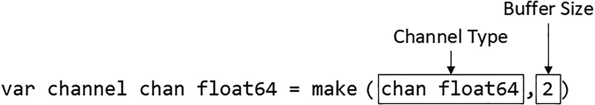

**图 14-8** — 带缓冲的通道

在这个例子中，我将缓冲区大小设置为 2，这意味着两个发送方能够通过通道发送值，而无需等待它们被接收。任何后续的发送方将不得不等待，直到其中一个缓冲消息被接收。通过编译并执行该项目，你可以看到这种行为，它会产生以下输出：

```
main function started
Watersports 通道发送 $328.95
Watersports 通道发送完成
Chess 通道发送 $1291.00
Chess 通道发送完成
Soccer 通道发送 $79554.45
-- 开始从通道接收
-- 通道读取挂起
Soccer 通道发送完成
-- 通道读取完成 328.95
-- 通道读取挂起
-- 通道读取完成 1291
-- 通道读取挂起
-- 通道读取完成 79554.45
总计: $81174.40
main function complete
```

你可以看到，即使没有接收方准备好，`Watersports` 和 `Chess` 类别发送的值也被通道接收了。`Soccer` 通道的发送方被迫等待，直到接收方的 `time.Sleep` 调用结束并且值从通道中被接收。

在实际项目中，会使用更大的缓冲区，其大小要经过选择，以便有足够的容量让 goroutine 发送消息而无需等待。（我通常指定缓冲区大小为 100，这对于大多数项目来说通常足够大，但又不至于大到占用大量内存。）


### 检查通道缓冲区

你可以使用内置的 `cap` 函数来确定通道缓冲区的大小，并使用 `len` 函数来确定缓冲区中的值的数量，如清单 14-16 所示。

```
...
func CalcStoreTotal(data ProductData) {
var storeTotal float64
var channel chan float64 = make(chan float64, 2)
for category, group := range data {
go group.TotalPrice(category, channel)
}
time.Sleep(time.Second * 5)
fmt.Println("-- 开始从通道接收数据")
for i := 0; i < len(data); i++ {
fmt.Println(len(channel), cap(channel))
fmt.Println("-- 通道读取待处理：缓冲区中有",
len(channel), "项，缓冲区大小为", cap(channel))
value :=  <- channel
fmt.Println("-- 通道读取完成", value)
storeTotal += value
time.Sleep(time.Second)
}
fmt.Println("总计:", ToCurrency(storeTotal))
}
...
清单 14-16
在 concurrency 文件夹中的 operations.go 文件中检查通道缓冲区
```

修改后的语句使用 `len` 和 `cap` 函数来报告通道缓冲区中的值的数量以及缓冲区的总大小。编译并执行代码，你将看到在接收值时的缓冲区详细信息：

```
main 函数启动
水上运动通道发送 $328.95
水上运动通道发送完成
国际象棋通道发送 $1291.00
国际象棋通道发送完成
足球通道发送 $79554.45
-- 开始从通道接收数据
-- 通道读取待处理：缓冲区中有 2 项，缓冲区大小为 2
足球通道发送完成
-- 通道读取完成 328.95
-- 通道读取待处理：缓冲区中有 2 项，缓冲区大小为 2
-- 通道读取完成 1291
-- 通道读取待处理：缓冲区中有 1 项，缓冲区大小为 2
-- 通道读取完成 79554.45
总计: $81174.40
main 函数完成
```

使用 `len` 和 `cap` 函数可以了解通道缓冲区的情况，但不应使用其结果来试图避免发送消息时的阻塞。Goroutine 是并行执行的，这意味着在你检查缓冲区容量之后但在发送值之前，可能有值已被发送到通道。有关如何可靠地无阻塞发送和接收的详细信息，请参阅“使用 Select 语句”部分。

### 发送和接收未知数量的值

`CalcStoreTotal` 函数利用其对正在处理的数据的了解来确定应从通道接收多少次值。这种洞察并不总是可用的，而且将要发送到通道的值的数量往往是事先未知的。作为演示，在 `concurrency` 文件夹中添加一个名为 `orderdispatch.go` 的文件，内容如清单 14-17 所示。

```
package main
import (
"fmt"
"math/rand"
"time"
)
type DispatchNotification struct {
Customer string
*Product
Quantity int
}
var Customers = []string{"Alice", "Bob", "Charlie", "Dora"}
func DispatchOrders(channel chan DispatchNotification) {
rand.Seed(time.Now().UTC().UnixNano())
orderCount := rand.Intn(3) + 2
fmt.Println("订单数量:", orderCount)
for i := 0; i < orderCount; i++ {
channel <- DispatchNotification{
Customer: Customers[rand.Intn(len(Customers)-1)],
Quantity: rand.Intn(10),
Product:  ProductList[rand.Intn(len(ProductList)-1)],
}
}
}
清单 14-17
在 concurrency 文件夹中的 orderdispatch.go 文件内容
```

`DispatchOrders` 函数创建随机数量的 `DispatchNotification` 值，并通过 `channel` 参数接收到的通道发送它们。我将在第 18 章中描述如何使用 `math/rand` 包创建随机数，但对于本章，只需知道每个调度通知的详细信息也是随机的就足够了，因此客户名称、产品和数量都会变化，通过通道发送的值的总数也会变化（尽管至少会发送两个，只是为了能看到一些输出）。

无法事先知道 `DispatchOrders` 函数会创建多少个 `DispatchNotification` 值，这给编写从通道接收数据的代码带来了挑战。清单 14-18 采用了最简单的方法，即使用 `for` 循环，这意味着代码将永远尝试接收值。

```
package main
import (
"fmt"
//"time"
)
func main() {
dispatchChannel := make(chan DispatchNotification, 100)
go DispatchOrders(dispatchChannel)
for {
details := <- dispatchChannel
fmt.Println("派送至", details.Customer, ":", details.Quantity,
"x", details.Product.Name)
}
}
清单 14-18
在 concurrency 文件夹中的 main.go 文件中使用 for 循环接收值
```

这个 `for` 循环无法正常工作，因为发送方停止产生值后，接收代码仍会尝试从通道获取值。如果所有 goroutine 都被阻塞，Go 运行时将终止程序，你可以通过编译并执行该项目看到这一点，这将产生以下输出：

```
订单数量: 4
派送至 Charlie : 3 x 救生衣
派送至 Bob : 6 x 足球
派送至 Bob : 7 x 思考帽
派送至 Charlie : 5 x 体育场
致命错误: 所有 goroutine 都处于休眠状态 - 死锁！
goroutine 1 [通道接收]:
main.main()
C:/concurrency/main.go:12 +0xa6
exit status 2
```

你将看到不同的输出，这反映了 `DispatchNotification` 数据的随机性。重要的是，goroutine 在发送完其值后退出，导致 `main` goroutine 持续等待接收值而被阻塞。Go 运行时检测到没有活动的 goroutine，于是终止了应用程序。


#### 关闭通道

这个问题的解决方案是让发送方指示何时不再有值通过通道发送，这通过关闭通道来实现，如清单 14-19 所示。

```go
package main
import (
"fmt"
"math/rand"
"time"
)
type DispatchNotification struct {
Customer string
*Product
Quantity int
}
var Customers = []string{"Alice", "Bob", "Charlie", "Dora"}
func DispatchOrders(channel chan DispatchNotification) {
rand.Seed(time.Now().UTC().UnixNano())
orderCount := rand.Intn(3) + 2
fmt.Println("Order count:", orderCount)
for i := 0; i < orderCount; i++ {
channel <- DispatchNotification{
Customer: Customers[rand.Intn(len(Customers)-1)],
Quantity: rand.Intn(10),
Product:  ProductList[rand.Intn(len(ProductList)-1)],
}
}
close(channel)
}
```

内置的 `close` 函数接受一个通道作为参数，用于指示将不再有值通过该通道发送。接收方可以在请求值时检查通道是否关闭，如清单 14-20 所示。

**提示**

仅当有助于协调 goroutine 时才需要关闭通道。Go 不要求关闭通道以释放资源或执行任何类型的清理任务。

```go
package main
import (
"fmt"
//"time"
)
func main() {
dispatchChannel := make(chan DispatchNotification, 100)
go DispatchOrders(dispatchChannel)
for {
if details, open := <- dispatchChannel; open {
fmt.Println("Dispatch to", details.Customer, ":", details.Quantity,
"x", details.Product.Name)
} else {
fmt.Println("Channel has been closed")
break
}
}
}
```

接收运算符可用于获取两个值。第一个值被赋值为从通道接收到的值，第二个值指示通道是否关闭，如图 14-9 所示。

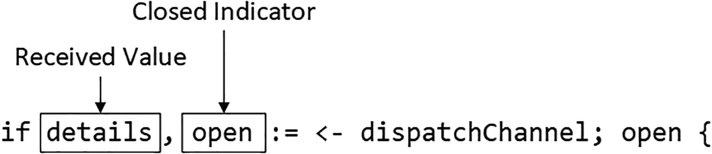

如果通道是打开的，则关闭指示器将为 `false`，并且从通道接收到的值将被赋值给另一个变量。如果通道已关闭，则关闭指示器将为 `true`，并且通道类型的零值将被分配给另一个变量。

描述比代码更复杂，但实际使用起来很容易，因为通道读取操作可以用作 `if` 表达式的初始化语句，通过关闭指示器来确定通道何时已关闭。清单 14-20 中的代码定义了一个 `else` 子句，当通道关闭时执行该子句，这会阻止进一步尝试从通道接收数据，并允许程序干净地退出。

**注意**

通道一旦关闭，再向其发送值是非法操作。

编译并执行该项目，您将看到类似于以下的输出：

```
Order count: 3
Dispatch to Bob : 2 x Soccer Ball
Dispatch to Alice : 9 x Thinking Cap
Dispatch to Bob : 3 x Soccer Ball
Channel has been closed
```

#### 枚举通道值

`for` 循环可以与 `range` 关键字一起使用来枚举通过通道发送的值，从而更容易地接收值，并在通道关闭时终止循环，如清单 14-21 所示。

```go
package main
import (
"fmt"
//"time"
)
func main() {
dispatchChannel := make(chan DispatchNotification, 100)
go DispatchOrders(dispatchChannel)
for details := range dispatchChannel {
fmt.Println("Dispatch to", details.Customer, ":", details.Quantity,
"x", details.Product.Name)
}
fmt.Println("Channel has been closed")
}
```

`range` 表达式每次迭代产生一个值，该值是从通道接收到的。`for` 循环将持续接收值，直到通道关闭。（您可以在未关闭的通道上使用 `for`...`range` 循环，这种情况下循环将永远不会退出。）编译并执行该项目，您将看到类似于以下的输出：

```
Order count: 2
Dispatch to Alice : 9 x Kayak
Dispatch to Charlie : 8 x Corner Flags
Channel has been closed
```


### 限制通道方向

默认情况下，通道可用于发送和接收数据，但在将通道用作参数时可以对此进行限制，使其只能执行发送或接收操作。我发现这个功能有助于避免错误，因为发送和接收操作的语法相似，我有时本想发送消息却执行了接收操作，如代码清单 14-22 所示。

```
package main
import (
"fmt"
"math/rand"
"time"
)
type DispatchNotification struct {
Customer string
*Product
Quantity int
}
var Customers = []string{"Alice", "Bob", "Charlie", "Dora"}
func DispatchOrders(channel chan DispatchNotification) {
rand.Seed(time.Now().UTC().UnixNano())
orderCount := rand.Intn(3) + 2
fmt.Println("Order count:", orderCount)
for i := 0; i < orderCount; i++ {
channel <- DispatchNotification{
Customer: Customers[rand.Intn(len(Customers)-1)],
Quantity: rand.Intn(10),
Product:  ProductList[rand.Intn(len(ProductList)-1)],
}
if (i == 1) {
notification := <- channel
fmt.Println("Read:", notification.Customer)
}
}
close(channel)
}
代码清单 14-22
concurrency 文件夹中 orderdispatch.go 文件里的操作错误
```

在示例代码中很容易发现这个问题，但我通常是在使用 `if` 语句有条件地通过通道发送额外值时犯这个错误。结果是，该函数会接收到自己刚刚发送的消息，并将其从通道中移除。

有时消息丢失会导致预期的接收者协程阻塞，从而触发之前描述的死锁检测并终止程序，但更常见的情况是程序继续运行却产生意外结果。编译并执行该代码，你会得到类似以下的输出：

```
Order count: 4
Read: Alice
Dispatch to Alice : 4 x Unsteady Chair
Dispatch to Alice : 7 x Unsteady Chair
Dispatch to Bob : 0 x Thinking Cap
Channel has been closed
```

输出显示将通过通道发送四个值，但只接收到了三个。这个问题可以通过限制通道方向来解决，如代码清单 14-23 所示。

```
package main
import (
"fmt"
"math/rand"
"time"
)
type DispatchNotification struct {
Customer string
*Product
Quantity int
}
var Customers = []string{"Alice", "Bob", "Charlie", "Dora"}
func DispatchOrders(channel chan<- DispatchNotification) {
rand.Seed(time.Now().UTC().UnixNano())
orderCount := rand.Intn(3) + 2
fmt.Println("Order count:", orderCount)
for i := 0; i < orderCount; i++ {
channel <- DispatchNotification{
Customer: Customers[rand.Intn(len(Customers)-1)],
Quantity: rand.Intn(10),
Product:  ProductList[rand.Intn(len(ProductList)-1)],
}
if (i == 1) {
notification := <- channel
fmt.Println("Read:", notification.Customer)
}
}
close(channel)
}
代码清单 14-23
concurrency 文件夹中 orderdispatch.go 文件里的通道方向限制
```

通道的方向在 `chan` 关键字旁指定，如图 14-10 所示。

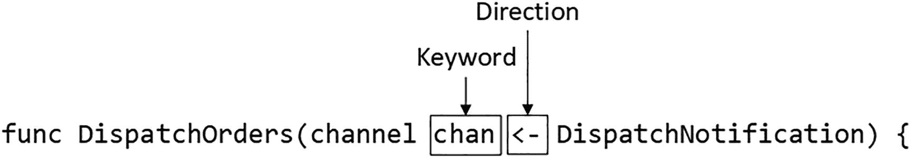

图 14-10

指定通道方向

箭头的位置指明了通道的方向。当箭头跟在 `chan` 关键字之后（如代码清单 14-23 所示），则该通道只能用于发送。如果箭头位于 `chan` 关键字之前（例如 `<-chan`），则通道只能用于接收。尝试从只发送通道接收数据（反之亦然）会在编译时报错，你可以编译该项目看看：

```
### concurrency
.\orderdispatch.go:29:29: invalid operation: <-channel (receive from send-only type chan<- DispatchNotification)
```

这样一来，`DispatchOrders` 函数中的错误就很容易发现了，我可以删除从通道接收数据的语句，如代码清单 14-24 所示。

```
package main
import (
"fmt"
"math/rand"
"time"
)
type DispatchNotification struct {
Customer string
*Product
Quantity int
}
var Customers = []string{"Alice", "Bob", "Charlie", "Dora"}
func DispatchOrders(channel chan<- DispatchNotification) {
rand.Seed(time.Now().UTC().UnixNano())
orderCount := rand.Intn(3) + 2
fmt.Println("Order count:", orderCount)
for i := 0; i < orderCount; i++ {
channel <- DispatchNotification{
Customer: Customers[rand.Intn(len(Customers)-1)],
Quantity: rand.Intn(10),
Product:  ProductList[rand.Intn(len(ProductList)-1)],
}
// if (i == 1) {
//     notification := <- channel
//     fmt.Println("Read:", notification.Customer)
// }
}
close(channel)
}
代码清单 14-24
修正 concurrency 文件夹中 orderdispatch.go 文件里的错误
```

该代码将编译无误，并产生与代码清单 14-22 类似的输出。


#### 限制通道参数方向

上一节中的修改使得 `DispatchOrders` 函数能够声明其仅需通过通道发送消息而无需接收消息。这是一个有用的特性，但它并未解决这样一种情况：你希望仅提供一个单向通道，而不是让函数自行决定其接收什么。

定向通道是一种类型，因此清单 14-25 中函数参数的类型为 `chan<- DispatchNotification`，这表示一个仅用于发送的通道，它将承载 `DispatchNotification` 值。Go 允许将双向通道赋值给单向通道变量，从而可以施加限制，如清单 14-26 所示。

```
package main
import (
"fmt"
//"time"
)
func receiveDispatches(channel <-chan DispatchNotification) {
for details := range channel {
fmt.Println("Dispatch to", details.Customer, ":", details.Quantity,
"x", details.Product.Name)
}
fmt.Println("Channel has been closed")
}
func main() {
dispatchChannel := make(chan DispatchNotification, 100)
var sendOnlyChannel chan<- DispatchNotification = dispatchChannel
var receiveOnlyChannel <-chan DispatchNotification = dispatchChannel
go DispatchOrders(sendOnlyChannel)
receiveDispatches(receiveOnlyChannel)
}
```

我使用完整的变量语法来定义仅发送和仅接收的通道变量，然后将它们用作函数参数。这确保了仅发送通道的接收者只能发送值或关闭通道，而仅接收通道的接收者只能接收值。这些限制应用于同一个底层通道，因此通过 `sendOnlyChannel` 发送的消息将通过 `receiveOnlyChannel` 被接收。

对通道方向的限制也可以通过显式转换来创建，如清单 14-27 所示。

```
package main
import (
"fmt"
//"time"
)
func receiveDispatches(channel <-chan DispatchNotification) {
for details := range channel {
fmt.Println("Dispatch to", details.Customer, ":", details.Quantity,
"x", details.Product.Name)
}
fmt.Println("Channel has been closed")
}
func main() {
dispatchChannel := make(chan DispatchNotification, 100)
// var sendOnlyChannel chan<- DispatchNotification = dispatchChannel
// var receiveOnlyChannel <-chan DispatchNotification = dispatchChannel
go DispatchOrders(chan<- DispatchNotification(dispatchChannel))
receiveDispatches((<-chan DispatchNotification)(dispatchChannel))
}
```

对于仅接收通道的显式转换，需要在通道类型周围加上括号，以防止编译器将其解释为转换为 `DispatchNotification` 类型。清单 14-26 和 14-27 中的代码会产生相同的输出，输出内容类似于以下内容：

```
Order count: 4
Dispatch to Bob : 0 x Kayak
Dispatch to Alice : 2 x Stadium
Dispatch to Bob : 6 x Stadium
Dispatch to Alice : 3 x Thinking Cap
Channel has been closed
```

## 使用 Select 语句

`select` 关键字用于对将从通道发送或接收的操作进行分组，这允许创建复杂的 goroutine 和通道编排。`select` 语句有几种用途，因此我将从基础开始讲解，然后逐步介绍更高级的选项。为准备本节中的示例，清单 14-28 增加了 `DispatchOrders` 函数发送的 `DispatchNotification` 值的数量，并引入了一个延迟，以便它们在更长的时间内发送。

```
package main
import (
"fmt"
"math/rand"
"time"
)
type DispatchNotification struct {
Customer string
*Product
Quantity int
}
var Customers = []string{"Alice", "Bob", "Charlie", "Dora"}
func DispatchOrders(channel chan<- DispatchNotification) {
rand.Seed(time.Now().UTC().UnixNano())
orderCount := rand.Intn(5) + 5
fmt.Println("Order count:", orderCount)
for i := 0; i < orderCount; i++ {
channel <- DispatchNotification{
Customer: Customers[rand.Intn(len(Customers)-1)],
Quantity: rand.Intn(10),
Product:  ProductList[rand.Intn(len(ProductList)-1)],
}
// if (i == 1) {
//     notification := <- channel
//     fmt.Println("Read:", notification.Customer)
// }
time.Sleep(time.Millisecond * 750)
}
close(channel)
}
```


### 无阻塞接收

使用`select`语句最简单的场景是无阻塞地从通道接收数据，确保当通道为空时，协程无需等待。清单 14-28 展示了以此方式使用`select`语句的简单示例。

```go
package main
import (
"fmt"
"time"
)
// func receiveDispatches(channel <-chan DispatchNotification) {
//     for details := range channel {
//         fmt.Println("Dispatch to", details.Customer, ":", details.Quantity,
//             "x", details.Product.Name)
//     }
//     fmt.Println("Channel has been closed")
// }
func main() {
dispatchChannel := make(chan DispatchNotification, 100)
go DispatchOrders(chan<- DispatchNotification(dispatchChannel))
// receiveDispatches((<-chan DispatchNotification)(dispatchChannel))
for {
select {
case details, ok := <- dispatchChannel:
if ok {
fmt.Println("Dispatch to", details.Customer, ":",
details.Quantity, "x", details.Product.Name)
} else {
fmt.Println("Channel has been closed")
goto alldone
}
default:
fmt.Println("-- No message ready to be received")
time.Sleep(time.Millisecond * 500)
}
}
alldone: fmt.Println("All values received")
}
```

`select`语句的结构与`switch`语句类似，区别在于其`case`子句执行的是通道操作。当`select`语句执行时，会逐一评估每个通道操作，直到找到可以无阻塞执行的那一个。随后执行该通道操作，并运行该`case`子句中的代码块。如果没有任何通道操作可以执行，则执行`default`子句中的代码。图 14-11 展示了`select`语句的结构。

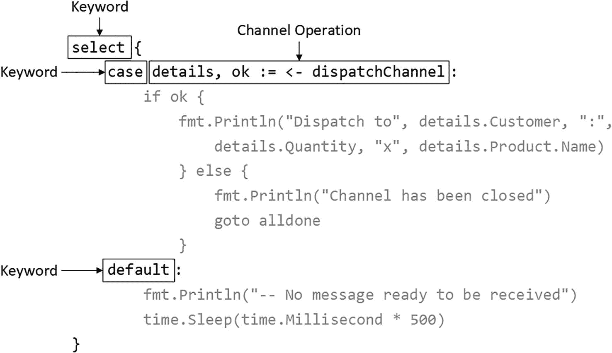

**图 14-11**：`select`语句

`select`语句只会对`case`子句评估一次，这就是为什么我在清单 14-28 中还配合使用了`for`循环。循环会持续执行`select`语句，当通道中有可用数据时，`select`就会从中接收值。如果没有可用值，则执行`default`子句，该子句引入了一个睡眠周期。

清单 14-28 中的`case`子句通道操作会检查通道是否已关闭，如果已关闭，则使用`goto`关键字跳转到一个标签语句，该标签位于`for`循环之外。

编译并执行该项目，你将会看到与下面类似的输出。由于数据是随机生成的，输出可能略有不同：

```plaintext
-- No message ready to be received
Order count: 5
Dispatch to Bob : 5 x Soccer Ball
-- No message ready to be received
Dispatch to Bob : 0 x Thinking Cap
-- No message ready to be received
Dispatch to Alice : 2 x Corner Flags
-- No message ready to be received
-- No message ready to be received
Dispatch to Bob : 6 x Corner Flags
-- No message ready to be received
Dispatch to Alice : 2 x Corner Flags
-- No message ready to be received
-- No message ready to be received
Channel has been closed
All values received
```

通过`time.Sleep`方法引入的延迟，导致值通过通道发送的速率与接收速率之间产生了微小的不匹配。结果就是，当通道为空时，`select`语句有时仍会被执行。与常规通道操作会阻塞不同，此时`select`语句会执行`default`子句中的代码。一旦通道关闭，循环即终止。

### 从多通道接收

正如前一个示例所展示的，`select`语句可用于无阻塞接收。但当存在多个通道，且值以不同速率发送时，这个特性会变得更加有用。`select`语句允许接收方从任意一个有值的通道获取数据，而无需在任何一个通道上阻塞，如清单 14-29 所示。

```go
package main
import (
"fmt"
"time"
)
func enumerateProducts(channel chan<- *Product) {
for _, p := range ProductList[:3] {
channel <- p
time.Sleep(time.Millisecond * 800)
}
close(channel)
}
func main() {
dispatchChannel := make(chan DispatchNotification, 100)
go DispatchOrders(chan<- DispatchNotification(dispatchChannel))
productChannel := make(chan *Product)
go enumerateProducts(productChannel)
openChannels := 2
for  {
select {
case details, ok := <- dispatchChannel:
if ok {
fmt.Println("Dispatch to", details.Customer, ":",
details.Quantity, "x", details.Product.Name)
} else {
fmt.Println("Dispatch channel has been closed")
dispatchChannel = nil
openChannels--
}
case product, ok := <- productChannel:
if ok {
fmt.Println("Product:", product.Name)
} else {
fmt.Println("Product channel has been closed")
productChannel = nil
openChannels--
}
default:
if (openChannels == 0) {
goto alldone
}
fmt.Println("-- No message ready to be received")
time.Sleep(time.Millisecond * 500)
}
}
alldone: fmt.Println("All values received")
}
```

在此示例中，`select`语句用于从两个通道接收值：一个传递`DispatchNotification`值，另一个传递`Product`值。每次执行`select`语句时，它会遍历`case`子句，并构建一个可以无阻塞读取值的`case`列表。然后，会从该列表中随机选择一个`case`子句执行。如果没有`case`子句可以执行，则执行`default`子句。

需要注意管理已关闭的通道，因为通道关闭后的每次接收操作都会返回`nil`值，并依赖关闭标志来表明通道已关闭。不幸的是，这意味着`select`语句总是会选择已关闭通道的`case`子句，因为这类通道始终准备就绪，无需阻塞即可提供值——尽管该值已经无用。

**提示**：如果省略`default`子句，那么`select`语句将会阻塞，直到其中一个通道有值可接收。这有时很有用，但当通道可能被关闭时，这种方式无法处理。

管理已关闭的通道需要采取两项措施。第一项是防止`select`语句在通道关闭后选中它。可以通过将通道变量赋值为`nil`来实现，如下所示：

```go
...
dispatchChannel = nil
...
```

`nil`通道永远无法就绪，不会被选中，从而允许`select`语句转到其他`case`子句，这些子句的通道可能仍然开着。

第二项措施是在所有通道都关闭后跳出`for`循环，否则`select`语句将无休止地执行`default`子句。清单 14-29 使用了一个`int`变量，当某个通道关闭时，该变量值递减。当开放通道的数量降至零时，使用`goto`语句跳出循环。编译并执行该项目，你将看到类似下面的输出，展示了单个接收器如何从两个通道获取值：


### 输出结果

```
Order count: 5
Product: Kayak
Dispatch to Alice : 9 x Unsteady Chair
-- No message ready to be received
Dispatch to Bob : 6 x Kayak
-- No message ready to be received
Product: Lifejacket
Dispatch to Charlie : 5 x Thinking Cap
-- No message ready to be received
-- No message ready to be received
Dispatch to Alice : 1 x Stadium
Product: Soccer Ball
-- No message ready to be received
Dispatch to Charlie : 8 x Lifejacket
-- No message ready to be received
Product channel has been closed
-- No message ready to be received
Dispatch channel has been closed
All values received
```

## 无阻塞发送

`select` 语句也可用于向通道发送数据而不发生阻塞，如清单 14-30 所示。

```
package main
import (
"fmt"
"time"
)
func enumerateProducts(channel chan<- *Product) {
for _, p := range ProductList {
select {
case channel <- p:
fmt.Println("Sent product:", p.Name)
default:
fmt.Println("Discarding product:", p.Name)
time.Sleep(time.Second)
}
}
close(channel)
}
func main() {
productChannel := make(chan *Product, 5)
go enumerateProducts(productChannel)
time.Sleep(time.Second)
for p := range productChannel {
fmt.Println("Received product:", p.Name)
}
}
Listing 14-30
Sending Using a select Statement in the main.go File in the concurrency Folder
```

清单 14-30 中的通道创建时带有小型缓冲区，并且需要经过短暂延迟后才会从通道接收值。这意味着 `enumerateProducts` 函数可以在缓冲区满之前通过通道发送值而不发生阻塞。`select` 语句的 `default` 分支会丢弃无法发送的值。编译并执行代码，你将看到类似以下的输出：

```
Sent product: Kayak
Sent product: Lifejacket
Sent product: Soccer Ball
Sent product: Corner Flags
Sent product: Stadium
Discarding product: Thinking Cap
Discarding product: Unsteady Chair
Received product: Kayak
Received product: Lifejacket
Received product: Soccer Ball
Received product: Corner Flags
Received product: Stadium
Sent product: Bling-Bling King
Received product: Bling-Bling King
```

输出显示，`select` 语句在检测到发送操作会阻塞时，转而去执行了 `default` 分支。在清单 14-30 中，`case` 语句包含一条输出消息的语句，但这并非必需；`case` 语句可以只指定发送操作而不附带额外语句，如清单 14-31 所示。

```
package main
import (
"fmt"
"time"
)
func enumerateProducts(channel chan<- *Product) {
for _, p := range ProductList {
select {
case channel <- p:
//fmt.Println("Sent product:", p.Name)
default:
fmt.Println("Discarding product:", p.Name)
time.Sleep(time.Second)
}
}
close(channel)
}
func main() {
productChannel := make(chan *Product, 5)
go enumerateProducts(productChannel)
time.Sleep(time.Second)
for p := range productChannel {
fmt.Println("Received product:", p.Name)
}
}
Listing 14-31
Omitting Statements in the main.go File in the concurrency Folder
```

## 发送到多个通道

如果有多个通道可用，可以使用 `select` 语句找到一个发送不会阻塞的通道，如清单 14-32 所示。

**提示**

你可以在同一个 `select` 语句中混用包含发送和接收操作的 `case` 语句。当执行 `select` 语句时，Go 运行时会构建一个可被执行而不阻塞的 `case` 语句列表，并从中随机选择一个，这个被选中的可以是发送或接收语句。

```
package main
import (
"fmt"
"time"
)
func enumerateProducts(channel1, channel2 chan<- *Product) {
for _, p := range ProductList {
select {
case channel1 <- p:
fmt.Println("Send via channel 1")
case channel2 <- p:
fmt.Println("Send via channel 2")
}
}
close(channel1)
close(channel2)
}
func main() {
c1 := make(chan *Product, 2)
c2 := make(chan *Product, 2)
go enumerateProducts(c1, c2)
time.Sleep(time.Second)
for p := range c1 {
fmt.Println("Channel 1 received product:", p.Name)
}
for p := range c2 {
fmt.Println("Channel 2 received product:", p.Name)
}
}
Listing 14-32
Sending Over Multiple Channels in the main.go File in the concurrency Folder
```

此示例有两个带小型缓冲区的通道。与接收的情况类似，`select` 语句会构建一个可无阻塞发送值的通道列表，然后从中随机选择一个。如果没有通道可用，则会执行 `default` 分支。本示例中没有 `default` 分支，这意味着 `select` 语句将发生阻塞，直到至少有一个通道可以接收值。

在创建执行 `enumerateProducts` 函数的 goroutine 之后，需要等待一秒钟才会从通道接收值。这意味着只有缓冲区决定了向通道发送是否会阻塞。编译并执行该项目，你将得到以下输出：

```
Send via channel 1
Send via channel 1
Send via channel 2
Send via channel 2
Channel 1 received product: Kayak
Channel 1 received product: Lifejacket
Channel 1 received product: Stadium
Send via channel 1
Send via channel 1
Send via channel 1
Send via channel 1
Channel 1 received product: Thinking Cap
Channel 1 received product: Unsteady Chair
Channel 1 received product: Bling-Bling King
Channel 2 received product: Soccer Ball
Channel 2 received product: Corner Flags
```

一个常见的错误是认为 `select` 语句会将值均匀地分配到多个通道。如前面所述，`select` 语句会随机选择一个可无阻塞执行的 `case` 语句，这意味着值的分配是不可预测的，可能是不均匀的。通过重复运行该示例，你可以观察到这一效果：值会以不同的顺序发送到各个通道。

## 本章小结

在本章中，我介绍了 goroutine 的使用方法，它能让 Go 函数并发执行。Goroutine 通过通道异步产生结果，通道也在本章中做了介绍。Goroutine 和通道使得编写并发应用程序变得容易，而无需管理单个执行线程。在下一章中，我将介绍 Go 对错误处理的支持。


# 15. 错误处理

本章描述了 Go 语言处理错误的方式。我将介绍表示错误的接口，向你展示如何创建错误，并解释处理错误的不同方法。我还会介绍 panic，这是处理不可恢复错误的方式。表格 15-1 将错误处理置于上下文中。

**表 15-1.** 错误处理上下文

| 问题 | 答案 |
| --- | --- |
| 它是什么？ | Go 的错误处理允许表示和处理异常情况与失败。 |
| 它为什么有用？ | 应用程序经常会遇到意外情况，错误处理功能提供了一种在出现这些情况时做出响应的方法。 |
| 如何使用？ | `error` 接口用于定义错误条件，这些条件通常作为函数结果返回。当发生不可恢复的错误时，会调用 `panic` 函数。 |
| 有陷阱或限制吗？ | 必须注意确保将错误传达给应用程序中最能判断情况严重性的部分。 |
| 有替代方案吗？ | 你不必在代码中使用 `error` 接口，但它在 Go 标准库中被广泛使用，并且很难避免。 |

表格 15-2 总结了本章内容。

**表 15-2.** 本章总结

| 问题 | 解决方案 | 代码清单 |
| --- | --- | --- |
| 指示发生了错误 | 创建一个实现 `error` 接口的结构体并将其作为函数结果返回 | 7–8, 11, 12 |
| 通过通道报告错误 | 向用于通道消息的结构体类型添加一个 `error` 字段 | 9–10 |
| 指示发生了不可恢复的错误 | 调用 `panic` 函数 | 13, 16 |
| 从 panic 中恢复 | 使用 `defer` 关键字注册一个调用 `recover` 函数的函数 | 14, 15, 17–19 |

## 本章准备

为准备本章，请打开一个新的命令提示符，导航到一个方便的位置，并创建一个名为 `errorHandling` 的目录。在 `errorHandling` 文件夹中运行代码清单 15-1 所示的命令来创建一个模块文件。

**提示**

你可以从 [`https://github.com/apress/pro-go`](https://github.com/apress/pro-go) 下载本章以及本书其他所有章节的示例项目。如果在运行示例时遇到问题，请参阅第 2 章了解如何获取帮助。

```
go mod init errorHandling
代码清单 15-1
初始化模块
```

在 `errorHandling` 文件夹中添加一个名为 `product.go` 的文件，内容如代码清单 15-2 所示。

```
package main
import "strconv"
type Product struct {
Name, Category string
Price float64
}
type ProductSlice []*Product
var Products = ProductSlice {
{ "Kayak", "Watersports", 279 },
{ "Lifejacket", "Watersports", 49.95 },
{ "Soccer Ball", "Soccer", 19.50 },
{ "Corner Flags", "Soccer", 34.95 },
{ "Stadium", "Soccer", 79500 },
{ "Thinking Cap", "Chess", 16 },
{ "Unsteady Chair", "Chess", 75 },
{ "Bling-Bling King", "Chess", 1200 },
}
func ToCurrency(val float64) string {
return "$" + strconv.FormatFloat(val, 'f', 2, 64)
}
代码清单 15-2
errorHandling 文件夹中 product.go 文件的内容
```

该文件定义了一个名为 `Product` 的自定义类型，一个 `*Product` 值切片的别名，以及一个使用字面量语法填充的切片。我还定义了一个将 `float64` 值格式化为美元金额的函数。

在 `errorHandling` 文件夹中添加一个名为 `operations.go` 的文件，内容如代码清单 15-3 所示。

```
package main
func (slice ProductSlice) TotalPrice(category string) (total float64) {
for _, p := range slice {
if (p.Category == category) {
total += p.Price
}
}
return
}
代码清单 15-3
errorHandling 文件夹中 operations.go 文件的内容
```

该文件定义了一个方法，它接收一个 `ProductSlice`，并对具有指定 `Category` 值的 `Product` 值的 `Price` 字段进行求和。

在 `errorHandling` 文件夹中添加一个名为 `main.go` 的文件，内容如代码清单 15-4 所示。

```
package main
import "fmt"
func main() {
categories := []string { "Watersports", "Chess" }
for _, cat := range categories {
total := Products.TotalPrice(cat)
fmt.Println(cat, "Total:", ToCurrency(total))
}
}
代码清单 15-4
errorHandling 文件夹中 main.go 文件的内容
```

使用命令提示符在 `errorHandling` 文件夹中运行代码清单 15-5 所示的命令。

```
go run .
代码清单 15-5
运行示例项目
```

代码将被编译并执行，产生以下输出：

```
Watersports Total: $328.95
Chess Total: $1291.00
```

## 处理可恢复的错误

Go 使得表达异常条件变得容易，这允许函数或方法向调用代码指示出现了问题。例如，代码清单 15-6 添加了会从 `TotalPrice` 方法产生有问题结果的语句。

```
package main
import "fmt"
func main() {
categories := []string { "Watersports", "Chess", "Running" }
for _, cat := range categories {
total := Products.TotalPrice(cat)
fmt.Println(cat, "Total:", ToCurrency(total))
}
}
代码清单 15-6
在 errorHandling 文件夹的 main.go 文件中调用方法
```

编译并执行项目，你将收到以下输出：

```
Watersports Total: $328.95
Chess Total: $1291.00
Running Total: $0.00
```

`TotalPrice` 方法对于 `Running` 类别的响应是模糊的。零结果可能意味着指定类别中没有产品，或者意味着有产品但它们的总和为零。调用 `TotalPrice` 方法的代码无法得知零值代表什么。

在一个简单的示例中，很容易从上下文理解结果：`Running` 类别中没有产品。在实际项目中，这种结果可能更难以理解和响应。

Go 提供了一个名为 `error` 的预定义接口，它提供了一种解决此问题的方法。以下是该接口的定义：

```
type error interface {
Error() string
}
```

该接口要求错误定义一个名为 `Error` 的方法，该方法返回一个字符串。


### 生成错误

函数和方法可以通过产生 `error` 响应来表达异常或意外的结果，如清单 15-7 所示。

```
package main
type CategoryError struct {
requestedCategory string
}
func (e *CategoryError) Error() string {
return "Category " + e.requestedCategory + " does not exist"
}
func (slice ProductSlice) TotalPrice(category string) (total float64,
err *CategoryError) {
productCount := 0
for _, p := range slice {
if (p.Category == category) {
total += p.Price
productCount++
}
}
if (productCount == 0) {
err = &CategoryError{ requestedCategory: category}
}
return
}
清单 15-7
在 errorHandling 文件夹的 operations.go 文件中定义一个错误
```

`CategoryError` 类型定义了一个未导出的 `requestedCategory` 字段，并且有一个符合 `error` 接口的方法。`TotalPrice` 方法的签名已更新，现在返回两个结果：原始的 `float64` 值和一个 `error`。如果 `for` 循环没有找到任何具有指定类别的产品，则 `err` 结果被赋值为一个 `CategoryError` 值，表明请求了一个不存在的类别。清单 15-8 更新了调用代码以使用该错误结果。

```
package main
import "fmt"
func main() {
categories := []string { "Watersports", "Chess", "Running" }
for _, cat := range categories {
total, err := Products.TotalPrice(cat)
if (err == nil) {
fmt.Println(cat, "Total:", ToCurrency(total))
} else {
fmt.Println(cat, "(no such category)")
}
}
}
清单 15-8
在 errorHandling 文件夹的 main.go 文件中处理错误
```

调用 `TotalPrice` 方法的结果通过检查两个结果的组合来确定。

如果错误结果为 `nil`，则请求的类别存在，并且 `float64` 结果代表其价格总和，即使该总和为零。如果 `error` 结果不为 `nil`，则请求的类别不存在，并且应忽略 `float64` 值。编译并执行项目，您将看到该错误使得清单 15-8 中的代码能够识别出不存在的产品类别：

```
Watersports Total: $328.95
Chess Total: $1291.00
Running (no such category)
```

#### 忽略错误结果

我不建议忽略错误结果，因为这意味着您将丢失重要信息——但如果您不需要知道何时出错，则可以使用空白标识符代替错误结果的名称，如下所示：

```
package main
import "fmt"
func main() {
categories := []string { "Watersports", "Chess", "Running" }
for _, cat := range categories {
total, _ := Products.TotalPrice(cat)
fmt.Println(cat, "Total:", ToCurrency(total))
}
}
```

这种技术阻止了调用代码理解 `TotalPrice` 方法的完整响应，应谨慎使用。

### 通过通道报告错误

如果函数是使用 goroutine 执行的，那么唯一的通信方式就是通过通道，这意味着任何问题的详细信息必须与成功操作一起传递。保持错误处理尽可能简单非常重要，我建议避免尝试使用额外的通道或创建复杂的机制来在通道之外发信号通知错误情况。我更倾向于创建一个自定义类型来整合两种结果，如清单 15-9 所示。

```
package main
type CategoryError struct {
requestedCategory string
}
func (e *CategoryError) Error() string {
return "Category " + e.requestedCategory + " does not exist"
}
type ChannelMessage struct {
Category string
Total float64
*CategoryError
}
func (slice ProductSlice) TotalPrice(category string) (total float64,
err *CategoryError) {
productCount := 0
for _, p := range slice {
if (p.Category == category) {
total += p.Price
productCount++
}
}
if (productCount == 0) {
err = &CategoryError{ requestedCategory: category}
}
return
}
func (slice ProductSlice) TotalPriceAsync (categories []string,
channel chan<- ChannelMessage) {
for _, c := range categories {
total, err := slice.TotalPrice(c)
channel <- ChannelMessage{
Category: c,
Total: total,
CategoryError: err,
}
}
close(channel)
}
清单 15-9
在 errorHandling 文件夹的 operations.go 文件中定义类型和函数
```

`ChannelMessage` 类型允许我传达准确反映 `TotalPrice` 方法结果所需的一对结果，该方法由新的 `TotalPriceAsync` 方法异步执行。这种方式的结果类似于同步方法结果可以表达错误的方式。

如果一个通道只有一个发送方，您可以在发生错误后关闭该通道。但如果存在多个发送方，则必须注意避免关闭通道，因为它们可能仍然能够生成有效的结果，并且会尝试向已关闭的通道发送数据，这将导致程序以 panic 终止。

清单 15-10 更新了 main 函数，以使用 `TotalPrice` 方法的新异步版本。

```
package main
import "fmt"
func main() {
categories := []string { "Watersports", "Chess", "Running" }
channel := make(chan ChannelMessage, 10)
go Products.TotalPriceAsync(categories, channel)
for message := range channel {
if message.CategoryError == nil {
fmt.Println(message.Category, "Total:", ToCurrency(message.Total))
} else {
fmt.Println(message.Category, "(no such category)")
}
}
}
清单 15-10
在 errorHandling 文件夹的 main.go 文件中使用新方法
```

编译并执行项目，您将收到类似于以下内容的输出：

```
Watersports Total: $328.95
Chess Total: $1291.00
Running (no such category)
```


### 使用错误便捷函数

为应用程序可能遇到的每种错误类型定义数据类型可能会很繁琐。标准库中的 `errors` 包提供了一个 `New` 函数，该函数返回一个内容为 `string` 的 `error`。这种方法的缺点在于它只能创建简单的错误，但其优点是简单明了，如代码清单 15-11 所示。

```go
package main
import "errors"
// type CategoryError struct {
//     requestedCategory string
// }
// func (e *CategoryError) Error() string {
//     return "Category " + e.requestedCategory + " does not exist"
//}
type ChannelMessage struct {
Category string
Total float64
CategoryError error
}
func (slice ProductSlice) TotalPrice(category string) (total float64,
err error) {
productCount := 0
for _, p := range slice {
if (p.Category == category) {
total += p.Price
productCount++
}
}
if (productCount == 0) {
err = errors.New("Cannot find category")
}
return
}
func (slice ProductSlice) TotalPriceAsync (categories []string,
channel chan<- ChannelMessage) {
for _, c := range categories {
total, err := slice.TotalPrice(c)
channel <- ChannelMessage{
Category: c,
Total: total,
CategoryError: err,
}
}
close(channel)
}
```

代码清单 15-11：在 `errorHandling` 文件夹的 `operations.go` 文件中使用 `Errors` 便捷函数

虽然在这个例子中去除了自定义错误类型，但生成的 `error` 不再包含被请求类别的详细信息。这不是一个大问题，因为可以合理地期望调用代码拥有这些信息，但对于那些无法接受的情况，可以使用 `fmt` 包轻松创建包含更复杂字符串内容的错误。

`fmt` 包负责格式化字符串，它通过格式化动词来实现这一点。这些动词将在第 17 章中详细描述，`fmt` 包提供的函数之一是 `Errorf`，它使用格式化字符串创建 `error` 值，如代码清单 15-12 所示。

```go
package main
import "fmt"
type ChannelMessage struct {
Category string
Total float64
CategoryError error
}
func (slice ProductSlice) TotalPrice(category string) (total float64,
err error) {
productCount := 0
for _, p := range slice {
if (p.Category == category) {
total += p.Price
productCount++
}
}
if (productCount == 0) {
err = fmt.Errorf("Cannot find category: %v", category)
}
return
}
func (slice ProductSlice) TotalPriceAsync (categories []string,
channel chan<- ChannelMessage) {
for _, c := range categories {
total, err := slice.TotalPrice(c)
channel <- ChannelMessage{
Category: c,
Total: total,
CategoryError: err,
}
}
close(channel)
}
```

代码清单 15-12：在 `errorHandling` 文件夹的 `operations.go` 文件中使用 `Errorf` 格式化函数

`Errorf` 函数的第一个参数中的 `%v` 是格式化动词的一个例子，它会被下一个参数替换，如第 17 章所述。代码清单 15-11 和代码清单 15-12 都会产生以下输出，该输出与错误响应中的消息无关：

```
Watersports Total: $328.95
Chess Total: $1291.00
Running (no such category)
```

## 处理不可恢复的错误

有些错误非常严重，应当导致应用程序立即终止，这个过程称为*恐慌（panicking）*，如代码清单 15-13 所示。

```go
package main
import "fmt"
func main() {
categories := []string { "Watersports", "Chess", "Running" }
channel := make(chan ChannelMessage, 10)
go Products.TotalPriceAsync(categories, channel)
for message := range channel {
if message.CategoryError == nil {
fmt.Println(message.Category, "Total:", ToCurrency(message.Total))
} else {
panic(message.CategoryError)
//fmt.Println(message.Category, "(no such category)")
}
}
}
```

代码清单 15-13：在 `errorHandling` 文件夹的 `main.go` 文件中触发恐慌

当找不到某个类别时，`main` 函数不再打印消息，而是触发恐慌，这是通过内置的 `panic` 函数完成的，如图 15-1 所示。

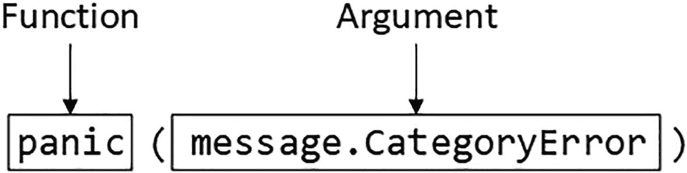

图 15-1：`panic` 函数

调用 `panic` 函数时需要传入一个参数，该参数可以是任何有助于解释恐慌原因的值。在代码清单 15-13 中，`panic` 函数被调用时传入了一个 `error`，这是一种将 Go 语言错误处理功能结合起来的实用方式。

当调用 `panic` 函数时，正在执行的函数会停止，所有的 `defer` 函数都会被执行。（`defer` 特性在第 8 章中有描述。）恐慌会沿着调用栈向上冒泡，终止调用函数的执行，并调用它们的 `defer` 函数。在示例中，是 `GetProducts` 函数触发了恐慌，这导致了 `CountProducts` 函数的终止，最后是 `main` 函数的终止，此时应用终止。编译并执行代码，您将看到以下输出，其中显示了恐慌的栈跟踪信息：

```
Watersports Total: $328.95
Chess Total: $1291.00
panic: Cannot find category: Running
goroutine 1 [running]:
main.main()
C:/errorHandling/main.go:16 +0x309
exit status 2
```

输出显示发生了恐慌，并且发生在 `main` 包的 `main` 函数内部，由 `main.go` 文件的第 16 行语句引发。在更复杂的应用程序中，恐慌显示的栈跟踪信息有助于弄清楚恐慌发生的原因。

### 定义恐慌函数和非恐慌函数

对于何时适合返回错误、何时使用恐慌更有用，并没有明确的规则。问题在于问题的严重程度通常最好由调用函数来决定，而触发恐慌的决定往往不是由调用函数做出的。正如我之前解释的，使用不存在的产品类别在某些情况下可能是一个严重的、不可恢复的问题，而在另一些情况下则可能是预期的结果，这两种情况完全有可能存在于同一个项目中。

一种常见的约定是提供函数的两个版本，一个返回错误，另一个触发恐慌。在第 16 章中可以看到这种安排的例子，其中 `regexp` 包定义了一个返回错误的 `Compile` 函数和一个触发恐慌的 `MustCompile` 函数。


### 从恐慌中恢复

Go 提供了内置函数 `recover`，调用它可以阻止恐慌沿调用栈向上传播并终止程序。`recover` 函数必须在通过 `defer` 关键字执行的代码中调用，如代码清单 15-14 所示。

```
package main
import "fmt"
func main() {
recoveryFunc := func() {
if arg := recover(); arg != nil {
if err, ok := arg.(error); ok {
fmt.Println("Error:", err.Error())
} else if str, ok := arg.(string); ok {
fmt.Println("Message:", str)
} else {
fmt.Println("Panic recovered")
}
}
}
defer recoveryFunc()
categories := []string { "Watersports", "Chess", "Running" }
channel := make(chan ChannelMessage, 10)
go Products.TotalPriceAsync(categories, channel)
for message := range channel {
if message.CategoryError == nil {
fmt.Println(message.Category, "Total:", ToCurrency(message.Total))
} else {
panic(message.CategoryError)
//fmt.Println(message.Category, "(no such category)")
}
}
}
代码清单 15-14
在 errorHandling 文件夹的 main.go 文件中从恐慌中恢复
```

此示例使用 `defer` 关键字注册一个函数，该函数将在 `main` 函数完成时执行，即使没有发生恐慌也会执行。调用 `recover` 函数时，如果发生了恐慌，它会返回一个值，从而阻止恐慌的继续传播，并提供对用于调用 `panic` 函数的参数的访问，如图 15-2 所示。

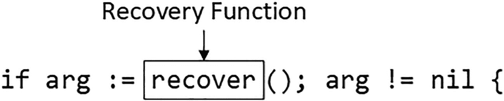

图 15-2

从恐慌中恢复

由于任何值都可以传递给 `panic` 函数，所以 `recover` 函数返回值的类型是空接口（`interface{}`），这需要在使用之前进行类型断言。代码清单 15-14 中的恢复函数处理了 `error` 和 `string` 类型，这是两种最常见的恐慌参数类型。

定义一个函数并立即与 `defer` 关键字结合使用可能会显得笨拙，因此恐慌恢复通常使用匿名函数来完成，如代码清单 15-15 所示。

```
package main
import "fmt"
func main() {
defer func() {
if arg := recover(); arg != nil {
if err, ok := arg.(error); ok {
fmt.Println("Error:", err.Error())
} else if str, ok := arg.(string); ok {
fmt.Println("Message:", str)
} else {
fmt.Println("Panic recovered")
}
}
}()
categories := []string { "Watersports", "Chess", "Running" }
channel := make(chan ChannelMessage, 10)
go Products.TotalPriceAsync(categories, channel)
for message := range channel {
if message.CategoryError == nil {
fmt.Println(message.Category, "Total:", ToCurrency(message.Total))
} else {
panic(message.CategoryError)
//fmt.Println(message.Category, "(no such category)")
}
}
}
代码清单 15-15
在 errorHandling 文件夹的 main.go 文件中使用匿名函数

请注意匿名函数右大括号后面使用了括号，这是调用匿名函数所必需的，而不仅仅是定义它。编译并执行代码清单 15-14 和 15-15 都会产生相同的输出：

```
Watersports Total: $328.95
Chess Total: $1291.00
Error: Cannot find category: Running
```

### 恢复后再次恐慌

你可能会从一个恐慌中恢复过来，但随后意识到情况终究是无法恢复的。发生这种情况时，你可以启动一个新的恐慌，要么提供一个新的参数，要么重用调用 `recover` 函数时收到的值，如代码清单 15-16 所示。

```
package main
import "fmt"
func main() {
defer func() {
if arg := recover(); arg != nil {
if err, ok := arg.(error); ok {
fmt.Println("Error:", err.Error())
panic(err)
} else if str, ok := arg.(string); ok {
fmt.Println("Message:", str)
} else {
fmt.Println("Panic recovered")
}
}
}()
categories := []string { "Watersports", "Chess", "Running" }
channel := make(chan ChannelMessage, 10)
go Products.TotalPriceAsync(categories, channel)
for message := range channel {
if message.CategoryError == nil {
fmt.Println(message.Category, "Total:", ToCurrency(message.Total))
} else {
panic(message.CategoryError)
//fmt.Println(message.Category, "(no such category)")
}
}
}
代码清单 15-16
在 errorHandling 文件夹的 main.go 文件中恢复后有选择地再次恐慌
```

这个延迟函数恢复了恐慌，检查了错误的详细信息，然后再次引发恐慌。编译并执行该项目，你将看到更改的效果：

```
Watersports Total: $328.95
Chess Total: $1291.00
Error: Cannot find category: Running
panic: Cannot find category: Running [recovered]
panic: Cannot find category: Running
goroutine 1 [running]:
main.main.func1()
C:/errorHandling/main.go:11 +0x1c8
panic({0xad91a0, 0xc000088230})
C:/Program Files/Go/src/runtime/panic.go:1038 +0x215
main.main()
C:/errorHandling/main.go:29 +0x333
exit status 2
```


### 从 Go 协程的恐慌中恢复

恐慌会沿着调用栈向上传播，但仅会到达当前协程的顶部，此时会导致应用程序终止。这种限制意味着必须在协程执行的代码中恢复恐慌，如代码清单 15-17 所示。

```go
package main
import "fmt"
type CategoryCountMessage struct {
Category string
Count int
}
func processCategories(categories [] string, outChan chan <- CategoryCountMessage) {
defer func() {
if arg := recover(); arg != nil {
fmt.Println(arg)
}
}()
channel := make(chan ChannelMessage, 10)
go Products.TotalPriceAsync(categories, channel)
for message := range channel {
if message.CategoryError == nil {
outChan <- CategoryCountMessage {
Category: message.Category,
Count: int(message.Total),
}
} else {
panic(message.CategoryError)
}
}
close(outChan)
}
func main() {
categories := []string { "Watersports", "Chess", "Running" }
channel := make(chan CategoryCountMessage)
go processCategories(categories, channel)
for message := range channel {
fmt.Println(message.Category, "Total:", message.Count)
}
}
代码清单 15-17
在 errorHandling 文件夹的 main.go 文件中从恐慌中恢复
```

`main` 函数使用一个协程来调用 `processCategories` 函数，如果 `TotalPriceAsync` 函数发送了一个 `error`，该函数就会引发恐慌。`processCategories` 函数从恐慌中恢复，但这会带来一个意想不到的后果，你可以通过编译和执行项目得到的输出来看到：

```
Watersports Total: 328
Chess Total: 1291
Cannot find category: Running
fatal error: all goroutines are asleep - deadlock!
goroutine 1 [chan receive]:
main.main()
C:/errorHandling/main.go:39 +0x1c5
exit status 2
```

问题在于，从恐慌中恢复并不会恢复执行 `processCategories` 函数，这意味着 `close` 函数永远不会在 `main` 函数接收消息的那个通道上被调用。`main` 函数试图接收一条永远不会被发送的消息，从而阻塞在通道上，触发了 Go 运行时的死锁检测。

最简单的方法是在恢复过程中调用通道上的 `close` 函数，如代码清单 15-18 所示。

```go
...
defer func() {
if arg := recover(); arg != nil {
fmt.Println(arg)
close(outChan)
}
}()
...
代码清单 15-18
在 errorHandling 文件夹的 main.go 文件中确保关闭通道
```

这可以防止死锁，但它没有向 `main` 函数指示 `processCategories` 函数未能完成其工作，这可能会带来后果。一个更好的方法是在关闭通道之前，通过通道表示这个结果，如代码清单 15-19 所示。

```go
package main
import "fmt"
type CategoryCountMessage struct {
Category string
Count int
TerminalError interface{}
}
func processCategories(categories [] string, outChan chan <- CategoryCountMessage) {
defer func() {
if arg := recover(); arg != nil {
fmt.Println(arg)
outChan <- CategoryCountMessage{
TerminalError: arg,
}
close(outChan)
}
}()
channel := make(chan ChannelMessage, 10)
go Products.TotalPriceAsync(categories, channel)
for message := range channel {
if message.CategoryError == nil {
outChan <- CategoryCountMessage {
Category: message.Category,
Count: int(message.Total),
}
} else {
panic(message.CategoryError)
}
}
close(outChan)
}
func main() {
categories := []string { "Watersports", "Chess", "Running" }
channel := make(chan CategoryCountMessage)
go processCategories(categories, channel)
for message := range channel {
if (message.TerminalError == nil) {
fmt.Println(message.Category, "Total:", message.Count)
} else {
fmt.Println("A terminal error occured")
}
}
}
代码清单 15-19
在 errorHandling 文件夹的 main.go 文件中指示失败
```

结果是，如何处理恐慌的决策从协程传递给了调用代码，调用代码可以根据具体问题选择继续执行或触发新的恐慌。编译并执行该项目，你将得到以下输出：

```
Watersports Total: 328
Chess Total: 1291
Cannot find category: Running
A terminal error occured
```

## 本章小结

在本章中，我描述了 Go 中用于处理错误情况的特性。我介绍了 `error` 类型，并展示了如何创建自定义错误，以及如何使用便捷函数创建带有简单消息的错误。我还解释了恐慌，即如何处理不可恢复的错误。我说明了关于一个错误是否不可恢复的决定可能是主观的，这就是为什么 Go 允许恢复恐慌。我解释了恢复过程，并演示了如何使其适应在协程中有效工作。在下一章中，我将开始描述 Go 标准库。

