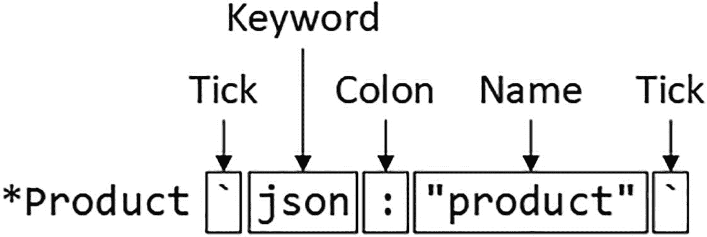

# 处理 JSON 数据

在本章中，我将介绍 Go 标准库对 JavaScript 对象表示法（JSON）格式的支持。JSON 已成为表示数据的实际标准，这主要是因为其简单且跨平台兼容。如果你之前没有接触过 JSON，请参阅 [`http://json.org`](http://json.org) 了解该数据格式的简要说明。JSON 通常是 RESTful Web 服务中使用的数据格式，我将在第 3 部分进行演示。表 21-1 将 JSON 功能置于上下文中。

**表 21-1** 将处理 JSON 数据置于上下文中

| 问题 | 回答 |
| --- | --- |
| 它是什么？ | JSON 数据是数据交换的实际标准，尤其在 HTTP 应用中。 |
| 它为什么有用？ | JSON 足够简单，任何语言都支持，但能表示相对复杂的数据。 |
| 如何使用？ | `encoding/json` 包提供了对 JSON 数据进行编码和解码的支持。 |
| 是否存在陷阱或限制？ | 并非所有 Go 数据类型都能用 JSON 表示，这要求开发者注意 Go 数据类型将如何被表达。 |
| 有哪些替代方案？ | 还有许多其他数据编码方式，其中一些由 Go 标准库支持。 |

表 21-2 总结了本章内容。

**表 21-2** 章节总结

| 问题 | 解决方案 | 代码清单 |
| --- | --- | --- |
| 编码 JSON 数据 | 使用 `Writer` 创建 `Encoder`，并调用 `Encode` 方法 | 2–7, 14, 15 |
| 控制结构体编码 | 使用 JSON 结构体标签或实现 `Mashaler` 接口 | 8–13, 16 |
| 解码 JSON 数据 | 使用 `Reader` 创建 `Decoder`，并调用 `Decode` 方法 | 17–25 |
| 控制结构体解码 | 使用 JSON 结构体标签或实现 `Unmarshaler` 接口 | 26–28 |

## 本章准备工作

本章继续使用第 20 章中创建的 `readersandwriters` 项目。本章无需做任何更改。打开新的命令提示符，导航到 `readersandwriters` 文件夹，运行列表 21-1 中所示的命令来编译并执行项目。

提示：你可以从 [`https://github.com/apress/pro-go`](https://github.com/apress/pro-go) 下载本章（以及本书所有其他章节）的示例项目。如果在运行示例时遇到问题，请参阅第 2 章了解如何获得帮助。

```
go run .
```
*列表 21-1* 编译并执行项目

编译后的项目在执行时会产生以下输出：

```
It was a kayak. A huge kayak.
```

## 读取和写入 JSON 数据

`encoding/json` 包提供了对 JSON 数据进行编码和解码的支持，如下各节所示。为方便参考，表 21-3 描述了用于创建编码和解码 JSON 数据的结构体的构造函数，这些函数将在后面详细说明。

**表 21-3** 用于 JSON 数据的 `encoding/json` 构造函数

| 名称 | 描述 |
| --- | --- |
| `NewEncoder(writer)` | 此函数返回一个 `Encoder`，可用于编码 JSON 数据并将其写入指定的 `Writer`。 |
| `NewDecoder(reader)` | 此函数返回一个 `Decoder`，可用于从指定的 `Reader` 读取 JSON 数据并解码。 |

注意：Go 标准库包含用于其他数据格式的包，包括 XML 和 CSV。详情请参阅 [`https://golang.org/pkg/encoding`](https://golang.org/pkg/encoding)。

`encoding/json` 包还提供了不使用 `Reader` 或 `Writer` 进行 JSON 编码和解码的函数，如表 21-4 所述。

**表 21-4** 用于创建和解析 JSON 数据的函数

| 名称 | 描述 |
| --- | --- |
| `Marshal(value)` | 此函数将指定的值编码为 JSON。结果是包含于 `byte` 切片中的 JSON 内容以及一个 `error`，用于指示任何编码问题。 |
| `Unmarshal(byteSlice, val)` | 此函数解析指定字节切片中包含的 JSON 数据，并将结果分配给指定的值。 |

### 编码 JSON 数据

`NewEncoder` 构造函数用于创建 `Encoder`，该 `Encoder` 可以使用表 21-5 中描述的方法将 JSON 数据写入 `Writer`。

**表 21-5** `Encoder` 方法

| 名称 | 描述 |
| --- | --- |
| `Encode(val)` | 此方法将指定的值编码为 JSON 并写入 `Writer`。 |
| `SetEscapeHTML(on)` | 此方法接受一个 `bool` 参数，当为 `true` 时，会对 HTML 中危险字符进行转义。默认行为是转义这些字符。 |
| `SetIndent(prefix, indent)` | 此方法指定一个前缀和缩进，应用于 JSON 输出中每个字段的名称。 |

除 JavaScript 外，在任何语言中，JSON 表达的数据类型都不会与原生数据类型完全对应。表 21-6 总结了基本 Go 数据类型在 JSON 中如何表示。

**表 21-6** 在 JSON 中表达基本 Go 数据类型

| 数据类型 | 描述 |
| --- | --- |
| `bool` | Go 的 `bool` 值表示为 JSON 的 `true` 或 `false`。 |
| `string` | Go 的 `string` 值表示为 JSON 字符串。默认情况下，不安全的 HTML 字符会被转义。 |
| `float32, float64` | Go 的浮点值表示为 JSON 数字。 |
| `int, int<size>` | Go 的整数值表示为 JSON 数字。 |
| `uint, uint<size>` | Go 的整数值表示为 JSON 数字。 |
| `byte` | Go 的字节表示为 JSON 数字。 |
| `rune` | Go 的符文表示为 JSON 数字。 |
| `nil` | Go 的 `nil` 值表示为 JSON 的 `null` 值。 |
| `指针` | JSON 编码器会跟随指针，并编码指针指向位置的值。 |

列表 21-2 演示了创建 JSON 编码器并编码一些基本 Go 类型的过程。

```
package main

import (
    //"io"
    "strings"
    "fmt"
    "encoding/json"
)

// func writeReplaced(writer io.Writer, str string, subs ...string) {
//     replacer := strings.NewReplacer(subs...)
//     replacer.WriteString(writer, str)
// }

func main() {
    var b bool = true
    var str string = "Hello"
    var fval float64 = 99.99
    var ival int = 200
    var pointer *int = &ival
    var writer strings.Builder

    encoder := json.NewEncoder(&writer)
    for _, val := range []interface{} {b, str, fval, ival, pointer} {
        encoder.Encode(val)
    }
    fmt.Print(writer.String())
}
```
*列表 21-2* 在 `readersandwriters` 文件夹的 `main.go` 文件中编码 JSON 数据

列表 21-2 定义了一系列不同类型的变量。使用 `NewEncoder` 构造函数创建一个 `Encoder`，然后使用 `for` 循环将每个值编码为 JSON。数据被写入一个 `Builder`，调用其 `String` 方法来显示 JSON。编译并执行项目，你将看到以下输出：

```
true
"Hello"
99.99

```

注意，我在列表 21-2 中使用了 `fmt.Print` 函数来生成输出。JSON `Encoder` 在编码每个值后会添加一个换行符。


#### 编码数组和切片

Go 的切片和数组会被编码为 JSON 数组，唯一的例外是 `byte` 切片会被编码为 base64 编码的字符串。而字节数组则被编码为 JSON 数字数组。清单 21-3 演示了对数组和切片（包括字节类型）的支持。

```go
package main
import (
"strings"
"fmt"
"encoding/json"
)
func main() {
names := []string {"Kayak", "Lifejacket", "Soccer Ball"}
numbers := [3]int { 10, 20, 30}
var byteArray [5]byte
copy(byteArray[0:], []byte(names[0]))
byteSlice := []byte(names[0])
var writer strings.Builder
encoder := json.NewEncoder(&writer)
encoder.Encode(names)
encoder.Encode(numbers)
encoder.Encode(byteArray)
encoder.Encode(byteSlice)
fmt.Print(writer.String())
}
清单 21-3
在 readersandwriters 文件夹的 main.go 文件中编码切片和数组
```

`Encoder` 会将每个数组表达为 JSON 语法格式，但字节切片除外。编译并执行该项目，你将看到以下输出：

```json
["Kayak","Lifejacket","Soccer Ball"]
[10,20,30]
[75,97,121,97,107]
"S2F5YWs="
```

请注意，字节数组和字节切片的处理方式是不同的，即使它们的内容相同。

#### 编码映射

Go 映射会被编码为 JSON 对象，映射的键用作对象的键。映射中包含的值根据其类型进行编码。清单 21-4 编码了一个包含 `float64` 类型值的映射。

**提示**

映射也可用于创建 Go 数据的自定义 JSON 表示，如“创建完全自定义的 JSON 编码”一节所述。

```go
package main
import (
"strings"
"fmt"
"encoding/json"
)
func main() {
m := map[string]float64 {
"Kayak": 279,
"Lifejacket": 49.95,
}
var writer strings.Builder
encoder := json.NewEncoder(&writer)
encoder.Encode(m)
fmt.Print(writer.String())
}
清单 21-4
在 readersandwriters 文件夹的 main.go 文件中编码映射
```

编译并执行该项目，你将看到以下输出，其中展示了映射中的键和值如何被编码为 JSON 对象：

```json
{"Kayak":279,"Lifejacket":49.95}
```

#### 编码结构体

`Encoder` 会将结构体值表达为 JSON 对象，使用导出的结构体字段名作为对象的键，字段值作为对象的值，如清单 21-5 所示。未导出的字段会被忽略。

```go
package main
import (
"strings"
"fmt"
"encoding/json"
)
func main() {
var writer strings.Builder
encoder := json.NewEncoder(&writer)
encoder.Encode(Kayak)
fmt.Print(writer.String())
}
清单 21-5
在 readersandwriters 文件夹的 main.go 文件中编码结构体
```

此示例编码了名为 `Kayak` 的 `Product` 结构体值，该结构体定义在第 20 章中。`Product` 结构体定义了导出的 `Name`、`Category` 和 `Price` 字段，这些字段可以在项目编译并执行时生成的输出中看到：

```json
{"Name":"Kayak","Category":"Watersports","Price":279}
```

##### 理解 JSON 编码中字段提升的影响

当一个结构体定义了本身也是结构体的内嵌字段时，内嵌结构体的字段会被提升并编码，就像它们是由外层类型定义的一样。在 `readersandwriters` 文件夹中添加一个名为 `discount.go` 的文件，内容如清单 21-6 所示。

```go
package main
type DiscountedProduct struct {
*Product
Discount float64
}
清单 21-6
readersandwriters 文件夹中 discount.go 文件的内容
```

`DiscountedProduct` 结构体类型定义了一个内嵌的 `Product` 字段。清单 21-7 创建了一个 `DiscountedProduct` 值并将其编码为 JSON。

```go
package main
import (
"strings"
"fmt"
"encoding/json"
)
func main() {
var writer strings.Builder
encoder := json.NewEncoder(&writer)
dp := DiscountedProduct {
Product: &Kayak,
Discount: 10.50,
}
encoder.Encode(&dp)
fmt.Print(writer.String())
}
清单 21-7
在 readersandwriters 文件夹的 main.go 文件中编码带有内嵌字段的结构体
```

`Encoder` 会将 `Product` 的字段提升到 JSON 输出中，如下所示项目编译并执行时的输出所示：

```json
{"Name":"Kayak","Category":"Watersports","Price":279,"Discount":10.5}
```

请注意，清单 21-7 编码了一个指向 `struct` 值的指针。`Encode` 函数会跟随该指针并在其指向的位置编码值，这意味着清单 21-7 中的代码在编码 `DiscountedProduct` 值时不会创建副本。

#### 自定义结构体的 JSON 编码

结构体的编码方式可以通过使用*结构体标签*进行自定义，结构体标签是跟随字段的字符串字面量。结构体标签是 Go 中反射支持的一部分，我将在第 28 章中描述，但对于本章来说，只需要知道标签位于字段之后，并可用于更改字段在 JSON 中编码的两个方面，如清单 21-8 所示。

```go
package main
type DiscountedProduct struct {
*Product `json:"product"`
Discount float64
}
清单 21-8
在 discount.go 文件中使用结构体标签
```

结构体标签遵循特定格式，如图 21-1 所示。术语 `json` 后跟一个冒号，再后跟编码字段时应使用的名称，该名称用双引号括起来。整个标签用反引号括起来。



图 21-1

结构体类型

清单 21-8 中的标签为内嵌字段指定了名称 `product`。编译并执行该项目，你将看到以下输出，这表明使用此标签阻止了字段提升：

```json
{"product":{"Name":"Kayak","Category":"Watersports","Price":279},"Discount":10.5}
```

##### 省略字段

`Encoder` 会跳过使用指定名称（连字符 `-` 字符）的标签修饰的字段，如清单 21-9 所示。

```go
package main
type DiscountedProduct struct {
*Product `json:"product"`
Discount float64 `json:"-"`
}
清单 21-9
在 discount.go 文件中省略字段
```

这个新标签告诉 `Encoder` 在创建 `DiscountedProduct` 值的 JSON 表示时跳过 `Discount` 字段。编译并执行该项目，你将看到以下输出：

```json
{"product":{"Name":"Kayak","Category":"Watersports","Price":279}}
```


### 省略未赋值的字段

默认情况下，JSON 的`Encoder`会包含结构体字段，即使它们尚未被赋值，如清单 21-10 所示。

```go
package main
import (
"strings"
"fmt"
"encoding/json"
)
func main() {
var writer strings.Builder
encoder := json.NewEncoder(&writer)
dp := DiscountedProduct {
Product: &Kayak,
Discount: 10.50,
}
encoder.Encode(&dp)
dp2 := DiscountedProduct { Discount: 10.50 }
encoder.Encode(&dp2)
fmt.Print(writer.String())
}
```

编译并执行代码，你会看到对`nil`字段的默认处理方式：

```json
{"product":{"Name":"Kayak","Category":"Watersports","Price":279}}
{"product":null}
```

要忽略`nil`字段，需将`omitempty`关键字添加到字段的标签中，如清单 21-11 所示。

```go
package main
type DiscountedProduct struct {
*Product `json:"product,omitempty"`
Discount float64 `json:"-"`
}
```

`omitempty`关键字与字段名之间用逗号分隔，但**不能**包含空格。编译并执行代码，你将看到没有空字段的输出：

```json
{"product":{"Name":"Kayak","Category":"Watersports","Price":279}}
{}
```

要在不更改名称或字段提升的情况下跳过`nil`字段，请指定不带名称的`omitempty`关键字，如清单 21-12 所示。

```go
package main
type DiscountedProduct struct {
*Product `json:",omitempty"`
Discount float64 `json:"-"`
}
```

如果已为嵌入字段赋值，`Encoder`将提升`Product`字段；如果未赋值，则会忽略该字段。编译并执行项目，你将看到以下输出：

```json
{"Name":"Kayak","Category":"Watersports","Price":279}
{}
```

### 强制字段编码为字符串

结构体标签可用于强制将字段值编码为字符串，从而覆盖该字段类型的正常编码，如清单 21-13 所示。

```go
package main
type DiscountedProduct struct {
*Product `json:",omitempty"`
Discount float64 `json:",string"`
}
```

添加`string`关键字会覆盖默认编码，并为`Discount`字段生成字符串。编译并执行项目后，你可以从输出中看到这一点：

```json
{"Name":"Kayak","Category":"Watersports","Price":279,"Discount":"10.5"}
{"Discount":"10.5"}
```

## 编码接口

JSON 编码器可用于赋值给接口变量的值，但实际编码的是动态类型。在`readersandwriters`文件夹中添加一个名为`interface.go`的文件，内容如清单 21-14 所示。

```go
package main
type Named interface { GetName() string }
type Person struct { PersonName string}
func (p *Person) GetName() string { return p.PersonName}
func (p *DiscountedProduct) GetName() string { return p.Name}
```

该文件定义了一个简单的接口和一个实现该接口的结构体，同时还为`DiscountedProduct`结构体定义了一个方法，使其也实现该接口。清单 21-15 使用 JSON 编码器编码一个接口切片。

```go
package main
import (
"strings"
"fmt"
"encoding/json"
)
func main() {
var writer strings.Builder
encoder := json.NewEncoder(&writer)
dp := DiscountedProduct {
Product: &Kayak,
Discount: 10.50,
}
namedItems := []Named { &dp, &Person{ PersonName: "Alice"}}
encoder.Encode(namedItems)
fmt.Print(writer.String())
}
```

`Named`值的切片包含不同的动态类型，编译并执行项目可以看到这一点：

```json
[{"Name":"Kayak","Category":"Watersports","Price":279,"Discount":"10.5"},
{"PersonName":"Alice"}]
```

接口的任何方面都不会用于适配 JSON，切片中每个值的所有导出字段都会包含在 JSON 中。这可能是一个有用的特性，但在解码此类 JSON 时必须小心，因为每个值可能具有不同的字段集，我将在“解码数组”一节中解释这一点。

## 创建完全自定义的 JSON 编码

`Encoder`会检查结构体是否实现了`Marshaler`接口，该接口表示具有自定义编码的类型，并定义了表 21-7 中描述的方法。

| 名称           | 描述                                                                                     |
| -------------- | ---------------------------------------------------------------------------------------- |
| `MarshalJSON()` | 调用此方法以创建值的 JSON 表示，并返回包含 JSON 的字节切片以及表示编码问题的`error`。 |

清单 21-16 为指向`DiscountedProduct`结构体类型的指针实现了`Marshaler`接口。

```go
package main
import "encoding/json"
type DiscountedProduct struct {
*Product `json:",omitempty"`
Discount float64 `json:",string"`
}
func (dp *DiscountedProduct) MarshalJSON() (jsn []byte, err error) {
if (dp.Product != nil) {
m := map[string]interface{} {
"product": dp.Name,
"cost": dp.Price - dp.Discount,
}
jsn, err = json.Marshal(m)
}
return
}
```

`MarshalJSON`方法可以以任何适合项目的方式生成 JSON，但我发现最可靠的方法是使用对 map 编码的支持。我定义一个键为`string`的 map，并使用空接口作为值。这允许我通过向 map 添加键值对来构建 JSON，然后将 map 传递给`Marshal`函数（见表 21-7），该函数使用内置支持来编码 map 中的每个值。编译并执行项目，你将看到以下输出：

```json
[{"cost":268.5,"product":"Kayak"},{"PersonName":"Alice"}]
```


#### 解码 JSON 数据

`NewDecoder` 构造函数创建一个 `Decoder`，可以使用表 21-8 中描述的方法，解码从 `Reader` 获取的 JSON 数据。

**表 21-8**
**`Decoder` 的方法**

| 名称 | 描述 |
| --- | --- |
| `Decode(value)` | 此方法读取并解码数据，用于创建指定的值。该方法返回一个 `error`，指示解码数据时出现的问题，例如类型不匹配或遇到 EOF。 |
| `DisallowUnknownFields()` | 默认情况下，在解码结构体类型时，`Decoder` 会忽略 JSON 数据中任何没有对应结构体字段的键。调用此方法会导致 `Decode` 返回错误，而不是忽略该键。 |
| `UseNumber()` | 默认情况下，JSON 数值被解码为 `float64` 值。调用此方法将使用 `Number` 类型代替，如“解码数值”一节所述。 |

清单 21-17 演示了解码基本数据类型。

```
package main
import (
"strings"
//"fmt"
"encoding/json"
"io"
)
func main() {
reader := strings.NewReader(`true "Hello" 99.99 200`)
vals := []interface{} { }
decoder := json.NewDecoder(reader)
for {
var decodedVal interface{}
err := decoder.Decode(&decodedVal)
if (err != nil) {
if (err != io.EOF) {
Printfln("Error: %v", err.Error())
}
break
}
vals = append(vals, decodedVal)
}
for _, val := range vals {
Printfln("Decoded (%T): %v", val, val)
}
}
```

**清单 21-17**
*在 readersandwriters 文件夹的 main.go 文件中解码基本数据类型*

我创建了一个 `Reader`，它从一个包含一系列值的字符串中生成数据，这些值用空格分隔（JSON 规范允许值之间用空格或换行符分隔）。

解码数据的第一步是创建 `Decoder`，它接受一个 `Reader`。我想解码多个值，所以在 `for` 循环内部调用 `Decode` 方法。`Decoder` 能够为 JSON 值选择合适的 Go 数据类型，这是通过向 `Decode` 方法传递一个指向空接口的指针来实现的，如下所示：

```
...
var decodedVal interface{}
err := decoder.Decode(&decodedVal)
...
```

`Decode` 方法返回一个 `error`，它指示解码问题，但也用于通过 `io.EOF` 错误来标识数据结束。一个 `for` 循环重复解码值，直到遇到 EOF，然后我使用另一个 `for` 循环，使用第 17 章中描述的格式化动词，写出每个解码后的类型和值。编译并执行该项目，你将看到解码后的值：

```
Decoded (bool): true
Decoded (string): Hello
Decoded (float64): 99.99
Decoded (float64): 200
```

#### 解码数值

JSON 使用单一数据类型来表示浮点数和整数值。`Decoder` 将这些数值解码为 `float64` 值，这可以从上一个示例的输出中看到。

可以通过调用 `Decoder` 的 `UseNumber` 方法来改变此行为，该方法会使 JSON 数值被解码为 `Number` 类型，该类型定义在 `encoding/json` 包中。`Number` 类型定义了表 21-9 中描述的方法。

**表 21-9**
**`Number` 类型定义的方法**

| 名称 | 描述 |
| --- | --- |
| `Int64()` | 此方法将解码后的值作为 `int64` 返回，并返回一个 `error`，指示该值是否无法转换。 |
| `Float64()` | 此方法将解码后的值作为 `float64` 返回，并返回一个 `error`，指示该值是否无法转换。 |
| `String()` | 此方法返回来自 JSON 数据的未转换的 `string`。 |

表 21-9 中的方法按顺序使用。并非所有 JSON 数值都能表示为 Go 的 `int64` 值，因此这通常是首先调用的方法。如果尝试转换为整数失败，则可以调用 `Float64` 方法。如果某个数字无法转换为任何一种 Go 类型，则可以使用 `String` 方法获取来自 JSON 数据的未转换字符串。此顺序如清单 21-18 所示。

```
package main
import (
"strings"
//"fmt"
"encoding/json"
"io"
)
func main() {
reader := strings.NewReader(`true "Hello" 99.99 200`)
vals := []interface{} { }
decoder := json.NewDecoder(reader)
decoder.UseNumber()
for {
var decodedVal interface{}
err := decoder.Decode(&decodedVal)
if (err != nil) {
if (err != io.EOF) {
Printfln("Error: %v", err.Error())
}
break
}
vals = append(vals, decodedVal)
}
for _, val := range vals {
if num, ok := val.(json.Number); ok {
if ival, err := num.Int64(); err == nil {
Printfln("Decoded Integer: %v", ival)
} else if fpval, err := num.Float64(); err == nil {
Printfln("Decoded Floating Point: %v", fpval)
} else {
Printfln("Decoded String: %v", num.String())
}
} else {
Printfln("Decoded (%T): %v", val, val)
}
}
}
```

**清单 21-18**
*在 readersandwriters 文件夹的 main.go 文件中解码数字*

编译并执行代码，你将看到其中一个 JSON 值已被转换为 `int64` 值：

```
Decoded (bool): true
Decoded (string): Hello
Decoded Floating Point: 99.99
Decoded Integer: 200
```

#### 为解码指定类型

前面的示例将一个空接口变量传递给 `Decode` 方法，如下所示：

```
...
var decodedVal interface{}
err := decoder.Decode(&decodedVal)
...
```

这会让 `Decoder` 为将要解码的 JSON 值选择 Go 数据类型。如果你知道正在解码的 JSON 数据的结构，你可以通过使用该类型的变量来接收解码值，从而指示 `Decoder` 使用特定的 Go 类型，如清单 21-19 所示。

```
package main
import (
"strings"
//"fmt"
"encoding/json"
//"io"
)
func main() {
reader := strings.NewReader(`true "Hello" 99.99 200`)
var bval bool
var sval string
var fpval float64
var ival int
vals := []interface{} { &bval, &sval, &fpval, &ival }
decoder := json.NewDecoder(reader)
for i := 0; i < len(vals); i++ {
err := decoder.Decode(vals[i])
if err != nil {
Printfln("Error: %v", err.Error())
break
}
}
Printfln("Decoded (%T): %v", bval, bval)
Printfln("Decoded (%T): %v", sval, sval)
Printfln("Decoded (%T): %v", fpval, fpval)
Printfln("Decoded (%T): %v", ival, ival)
}
```

**清单 21-19**
*在 readersandwriters 文件夹的 main.go 文件中指定解码类型*

清单 21-19 指定了应使用的解码数据类型，并为方便起见将它们分组到一个切片中。值被解码为目标类型，这可以在编译并执行项目时显示的输出中看到：

```
Decoded (bool): true
Decoded (string): Hello
Decoded (float64): 99.99
Decoded (int): 200
```

如果 `Decoder` 无法将 JSON 值解码为指定的类型，它将返回一个错误。只有在您确信自己了解将要解码的 JSON 数据时，才应使用此技术。


### 解码数组

`Decoder`会**自动**处理数组，但必须小心，因为 JSON 允许数组包含不同类型的值，这与 Go 强制执行的严格类型规则相冲突。清单 21-20 演示了如何解码数组。

```go
package main

import (
	"strings"
	//"fmt"
	"encoding/json"
	"io"
)

func main() {
	reader := strings.NewReader(`[10,20,30]["Kayak","Lifejacket",279]`)
	vals := []interface{}{}
	decoder := json.NewDecoder(reader)
	for {
		var decodedVal interface{}
		err := decoder.Decode(&decodedVal)
		if err != nil {
			if err != io.EOF {
				Printfln("Error: %v", err.Error())
			}
			break
		}
		vals = append(vals, decodedVal)
	}
	for _, val := range vals {
		Printfln("Decoded (%T): %v", val, val)
	}
}
```

*清单 21-20 在 readersandwriters 文件夹的 main.go 文件中解码一个数组*

源 JSON 数据包含两个数组，一个只包含数字，另一个混合了数字和字符串。`Decoder`不会尝试判断一个 JSON 数组是否可以用单个 Go 类型表示，而是将每个数组解码成一个空接口切片：

```
Decoded ([]interface {}): [10 20 30]
Decoded ([]interface {}): [Kayak Lifejacket 279]
```

每个值都根据 JSON 值进行类型化，但切片的类型是空接口。如果你事先知道 JSON 数据的结构，并且正在解码一个包含单一 JSON 数据类型的数组，那么你可以将所需类型的 Go 切片传递给`Decode`方法，如清单 21-21 所示。

```go
package main

import (
	"strings"
	//"fmt"
	"encoding/json"
	//"io"
)

func main() {
	reader := strings.NewReader(`[10,20,30]["Kayak","Lifejacket",279]`)
	ints := []int{}
	mixed := []interface{}{}
	vals := []interface{}{&ints, &mixed}
	decoder := json.NewDecoder(reader)
	for i := 0; i < len(vals); i++ {
		err := decoder.Decode(vals[i])
		if err != nil {
			Printfln("Error: %v", err.Error())
			break
		}
	}
	Printfln("Decoded (%T): %v", ints, ints)
	Printfln("Decoded (%T): %v", mixed, mixed)
}
```

*清单 21-21 在 readersandwriters 文件夹的 main.go 文件中指定解码后的数组类型*

我可以指定一个`int`切片来解码 JSON 数据中的第一个数组，因为所有值都可以表示为 Go 的`int`值。第二个数组包含混合值，这意味着我必须将空接口指定为目标类型。当使用空接口时，字面量切片语法很笨拙，因为需要两组花括号：

```go
...
mixed := []interface{}{}
...
```

空接口类型包含空花括号（`interface{}`），指定空切片（`{}`）也是如此。编译并执行项目，你会看到第一个 JSON 数组已被解码成一个`int`切片：

```
Decoded ([]int): [10 20 30]
Decoded ([]interface {}): [Kayak Lifejacket 279]
```

### 解码映射

JavaScript 对象表示为键值对，这使得将它们解码为 Go 映射变得容易，如清单 21-22 所示。

```go
package main

import (
	"strings"
	//"fmt"
	"encoding/json"
	//"io"
)

func main() {
	reader := strings.NewReader(`{"Kayak" : 279, "Lifejacket" : 49.95}`)
	m := map[string]interface{}{}
	decoder := json.NewDecoder(reader)
	err := decoder.Decode(&m)
	if err != nil {
		Printfln("Error: %v", err.Error())
	} else {
		Printfln("Map: %T, %v", m, m)
		for k, v := range m {
			Printfln("Key: %v, Value: %v", k, v)
		}
	}
}
```

*清单 21-22 在 readersandwriters 文件夹的 main.go 文件中解码一个映射*

最安全的方法是定义一个具有`string`键和空接口值的映射，这确保了 JSON 数据中的所有键值对都可以解码到该映射中，如清单 21-22 所示。一旦 JSON 被解码，就会使用一个`for`循环来枚举映射内容，当项目被编译和执行时，会产生以下输出：

```
Map: map[string]interface {}, map[Kayak:279 Lifejacket:49.95]
Key: Kayak, Value: 279
Key: Lifejacket, Value: 49.95
```

单个 JSON 对象可以用于多种数据类型作为值，但如果你事先知道将要解码的 JSON 对象具有单一值类型，那么在定义数据将被解码到的映射时，你可以更具体地指定，如清单 21-23 所示。

```go
package main

import (
	"strings"
	//"fmt"
	"encoding/json"
	//"io"
)

func main() {
	reader := strings.NewReader(`{"Kayak" : 279, "Lifejacket" : 49.95}`)
	m := map[string]float64{}
	decoder := json.NewDecoder(reader)
	err := decoder.Decode(&m)
	if err != nil {
		Printfln("Error: %v", err.Error())
	} else {
		Printfln("Map: %T, %v", m, m)
		for k, v := range m {
			Printfln("Key: %v, Value: %v", k, v)
		}
	}
}
```

*清单 21-23 在 readersandwriters 文件夹的 main.go 文件中使用特定的值类型*

JSON 对象中的值都可以表示为 Go 的`float64`类型，因此清单 21-23 将映射类型更改为`map[string]float64`。编译并执行项目，你会看到映射类型的更改：

```
Map: map[string]float64, map[Kayak:279 Lifejacket:49.95]
Key: Kayak, Value: 279
Key: Lifejacket, Value: 49.95
```

### 解码结构体

JSON 对象的键值结构可以解码为 Go 结构体值，如清单 21-24 所示，尽管这需要比将数据解码为映射更多的 JSON 数据知识。

**解码为接口类型**

正如本章前面所解释的，JSON 编码器通过使用动态类型的导出字段对值进行编码来处理接口。这是因为 JSON 处理的是键值对，无法表达方法。因此，你不能直接从 JSON 解码到接口变量。相反，你必须解码到一个结构体或映射，然后将创建的值赋给一个接口变量。

```go
package main

import (
	"strings"
	//"fmt"
	"encoding/json"
	"io"
)

func main() {
	reader := strings.NewReader(`
		{"Name":"Kayak","Category":"Watersports","Price":279}
		{"Name":"Lifejacket","Category":"Watersports" }
		{"name":"Canoe","category":"Watersports", "price": 100, "inStock": true }
	`)
	decoder := json.NewDecoder(reader)
	for {
		var val Product
		err := decoder.Decode(&val)
		if err != nil {
			if err != io.EOF {
				Printfln("Error: %v", err.Error())
			}
			break
		} else {
			Printfln("Name: %v, Category: %v, Price: %v",
				val.Name, val.Category, val.Price)
		}
	}
}
```

*清单 21-24 在 readersandwriters 文件夹的 main.go 文件中解码为一个结构体*

`Decoder`解码 JSON 对象，并使用键来设置导出结构体字段的值。字段和 JSON 键的大小写不必匹配，并且`Decoder`会忽略任何没有对应结构体字段的 JSON 键，以及任何没有对应 JSON 键的结构体字段。清单 21-24 中的 JSON 对象包含不同的大小写，并且键的数量多于或少于`Product`结构体的字段。`Decoder`尽其所能地处理数据，当项目被编译和执行时，会产生以下输出：

```
Name: Kayak, Category: Watersports, Price: 279
Name: Lifejacket, Category: Watersports, Price: 0
Name: Canoe, Category: Watersports, Price: 100
```


### 禁止未使用的键

默认情况下，`Decoder` 会忽略 JSON 中那些没有对应结构体字段的键。可以通过调用 `DisallowUnknownFields` 方法来改变此行为，如代码清单 21-25 所示，当遇到此类键时会触发一个错误。

```
...
decoder := json.NewDecoder(reader)
decoder.DisallowUnknownFields()
...
代码清单 21-25
在 readersandwriters 文件夹的 main.go 文件中禁止未使用的键
```

代码清单 21-25 中定义的其中一个 JSON 对象包含一个 `inStock` 键，该键没有对应的 `Product` 字段。通常，这个键会被忽略，但由于调用了 `DisallowUnknownFields` 方法，解码该对象会产生一个错误，你可以在输出中看到：

```
Name: Kayak, Category: Watersports, Price: 279
Name: Lifejacket, Category: Watersports, Price: 0
Error: json: unknown field "inStock"
```

### 使用结构体标签控制解码

JSON 对象中使用的键并不总是与 Go 项目中结构体定义的字段一致。当发生这种情况时，可以使用结构体标签来映射 JSON 数据和结构体，如代码清单 21-26 所示。

```
package main
import "encoding/json"
type DiscountedProduct struct {
*Product `json:",omitempty"`
Discount float64 `json:"offer,string"`
}
func (dp *DiscountedProduct) MarshalJSON() (jsn []byte, err error) {
if (dp.Product != nil) {
m := map[string]interface{} {
"product": dp.Name,
"cost": dp.Price - dp.Discount,
}
jsn, err = json.Marshal(m)
}
return
}
代码清单 21-26
在 readersandwriters 文件夹的 discount.go 文件中使用结构体标签
```

应用于 `Discount` 字段的标签告诉 `Decoder`，该字段的值应从名为 `offer` 的 JSON 键中获取，并且该值将从字符串解析，而不是通常期望的 Go `float64` 值的 JSON 数字。代码清单 21-27 将一个 JSON 字符串解码为 `DiscountedProduct` 结构体值。

```
package main
import (
"strings"
//"fmt"
"encoding/json"
"io"
)
func main() {
reader := strings.NewReader(`
{"Name":"Kayak","Category":"Watersports","Price":279, "Offer": "10"}`)
decoder := json.NewDecoder(reader)
for {
var val DiscountedProduct
err := decoder.Decode(&val)
if err != nil {
if err != io.EOF {
Printfln("Error: %v", err.Error())
}
break
} else {
Printfln("Name: %v, Category: %v, Price: %v, Discount: %v",
val.Name, val.Category, val.Price, val.Discount)
}
}
}
代码清单 21-27
在 readersandwriters 文件夹的 main.go 文件中解码带有标签的结构体
```

编译并执行项目，你将看到结构体标签如何用于控制 JSON 数据的解码：

```
Name: Kayak, Category: Watersports, Price: 279, Discount: 10
```

### 创建完全自定义的 JSON 解码器

`Decoder` 会检查结构体是否实现了 `Unmarshaler` 接口，该接口表示一个具有自定义编码的类型，并定义了表 21-10 中描述的方法。

**表 21-10** Unmarshaler 方法

| 名称 | 描述 |
| --- | --- |
| `UnmarshalJSON(byteSlice)` | 调用此方法来解码指定字节切片中包含的 JSON 数据。结果是表示编码问题的 `error`。 |

代码清单 21-28 为 `DiscountedProduct` 结构体类型的指针实现了该接口。

```
package main
import (
"encoding/json"
"strconv"
)
type DiscountedProduct struct {
*Product `json:",omitempty"`
Discount float64 `json:"offer,string"`
}
func (dp *DiscountedProduct) MarshalJSON() (jsn []byte, err error) {
if (dp.Product != nil) {
m := map[string]interface{} {
"product": dp.Name,
"cost": dp.Price - dp.Discount,
}
jsn, err = json.Marshal(m)
}
return
}
func (dp *DiscountedProduct) UnmarshalJSON(data []byte) (err error) {
mdata := map[string]interface{} {}
err = json.Unmarshal(data, &mdata)
if (dp.Product == nil) {
dp.Product = &Product{}
}
if (err == nil) {
if name, ok := mdata["Name"].(string); ok {
dp.Name = name
}
if category, ok := mdata["Category"].(string); ok {
dp.Category = category
}
if price, ok := mdata["Price"].(float64); ok {
dp.Price = price
}
if discount, ok := mdata["Offer"].(string); ok {
fpval, fperr := strconv.ParseFloat(discount, 64)
if (fperr == nil) {
dp.Discount = fpval
}
}
}
return
}
代码清单 21-28
在 readersandwriters 文件夹的 discount.go 文件中定义自定义解码器
```

这个 `UnmarshalJSON` 方法的实现使用了 `Unmarshal` 方法将 JSON 数据解码到一个映射中，然后检查 `DiscountedProduct` 结构体所需的每个值的类型。编译并执行项目，你将看到自定义解码：

```
Name: Kayak, Category: Watersports, Price: 279, Discount: 10
```

## 本章小结

在本章中，我描述了 Go 对处理 JSON 数据的支持，这依赖于第 20 章中描述的 `Reader` 和 `Writer` 接口。这些接口在整个标准库中一致使用，正如你将在下一章中看到的，我将解释如何读写文件。

