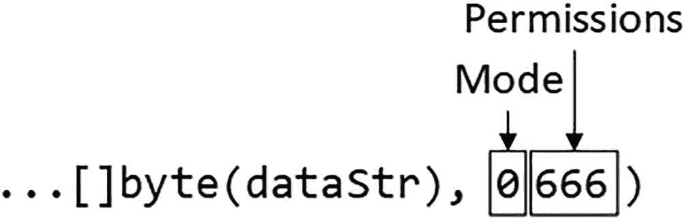

# 22. 文件处理

在本章中，我将介绍 Go 标准库为处理文件和目录提供的功能。Go 在多个平台上运行，标准库采用平台中立的方法，这样代码编写就无需了解不同操作系统使用的文件系统。表 22-1 提供了文件处理的背景信息。

**表 22-1** 文件处理背景

| 问题 | 答案 |
| --- | --- |
| 它们是什么？ | 这些功能提供对文件系统的访问，以便可以读写文件。 |
| 它们为什么有用？ | 文件用于从日志记录到配置文件的各种场景。 |
| 如何使用它们？ | 通过 `os` 包访问这些功能，该包提供对文件系统的平台中立访问。 |
| 是否存在陷阱或限制？ | 必须考虑底层文件系统的一些因素，尤其是在处理路径时。 |
| 是否有其他替代方案？ | Go 支持其他存储数据的方式，例如数据库，但没有访问文件的替代机制。 |

**表 22-2** 本章摘要

| 问题 | 解决方案 | 代码清单 |
| --- | --- | --- |
| 读取文件内容 | 使用 `ReadFile` 函数 | 6–8 |
| 控制文件的读取方式 | 获取一个 `File` 结构体并使用其提供的功能 | 9–10 |
| 写入文件内容 | 使用 `WriteFile` 函数 | 11 |
| 控制文件的写入方式 | 获取一个 `File` 结构体并使用其提供的功能 | 12, 13 |
| 创建新文件 | 使用 `Create` 或 `CreateTemp` 函数 | 14 |
| 处理文件路径 | 使用 `path/filepath` 包中的函数，或使用 `os` 包中提供的常见位置函数 | 15 |
| 管理文件和目录 | 使用 `os` 包提供的函数 | 16–17, 19, 20 |
| 判断文件是否存在 | 检查 `Stat` 函数返回的 `error` | 18 |


## 本章准备工作

为完成本章的准备工作，请打开一个新的命令提示符，导航至一个方便的位置，并创建一个名为`files`的目录。运行清单 22-1 所示的命令来创建一个模块文件。

> **提示**
>
> 你可以从 [`https://github.com/apress/pro-go`](https://github.com/apress/pro-go) 下载本章——以及本书其他所有章节——的示例项目。如果在运行示例时遇到问题，请参阅第 2 章了解如何获取帮助。

```
go mod init files
清单 22-1
初始化模块
```

在`files`文件夹中添加一个名为`printer.go`的文件，内容如清单 22-2 所示。

```
package main
import "fmt"
func Printfln(template string, values ...interface{}) {
fmt.Printf(template + "\n", values...)
}
清单 22-2
files 文件夹中 printer.go 文件的内容
```

在`files`文件夹中添加一个名为`product.go`的文件，内容如清单 22-3 所示。

```
package main
type Product struct {
Name, Category string
Price float64
}
var Products = []Product {
{ "Kayak", "Watersports", 279 },
{ "Lifejacket", "Watersports", 49.95 },
{ "Soccer Ball", "Soccer", 19.50 },
{ "Corner Flags", "Soccer", 34.95 },
{ "Stadium", "Soccer", 79500 },
{ "Thinking Cap", "Chess", 16 },
{ "Unsteady Chair", "Chess", 75 },
{ "Bling-Bling King", "Chess", 1200 },
}
清单 22-3
files 文件夹中 product.go 文件的内容
```

在`files`文件夹中添加一个名为`main.go`的文件，内容如清单 22-4 所示。

```
package main
func main() {
for _, p := range Products {
Printfln("Product: %v, Category: %v, Price: $%.2f",
p.Name, p.Category, p.Price)
}
}
清单 22-4
files 文件夹中 main.go 文件的内容
```

在命令提示符中，于`files`文件夹内运行清单 22-5 所示的命令。

```
go run .
清单 22-5
运行示例项目
```

代码将被编译并执行，产生以下输出：

```
Product: Kayak, Category: Watersports, Price: $279.00
Product: Lifejacket, Category: Watersports, Price: $49.95
Product: Soccer Ball, Category: Soccer, Price: $19.50
Product: Corner Flags, Category: Soccer, Price: $34.95
Product: Stadium, Category: Soccer, Price: $79500.00
Product: Thinking Cap, Category: Chess, Price: $16.00
Product: Unsteady Chair, Category: Chess, Price: $75.00
Product: Bling-Bling King, Category: Chess, Price: $1200.00
```

### 读取文件

处理文件时，关键包是`os`包。该包以一种隐藏大部分实现细节的方式提供对操作系统特性（包括文件系统）的访问，这意味着无论使用哪种操作系统，都可以使用相同的函数来达到相同的结果。

`os`包采用的中立方法导致了一些妥协，并倾向于 UNIX/Linux，而非 Windows。但即便如此，`os`包提供的功能是可靠且稳定的，使得编写的 Go 代码可以在不同平台上无需修改即可使用。表 22-3 描述了`os`包中用于读取文件的函数。

**表 22-3** `os`包中用于读取文件的函数

| 名称 | 描述 |
| --- | --- |
| `ReadFile(name)` | 此函数打开指定文件并读取其内容。返回结果是一个包含文件内容的`byte`切片，以及一个指示打开或读取文件时出现问题的`error`。 |
| `Open(name)` | 此函数打开指定文件以供读取。返回结果是一个`File`结构体和一个指示打开文件时出现问题的`error`。 |

为准备本章此部分的示例，请在`files`文件夹中添加一个名为`config.json`的文件，内容如清单 22-6 所示。

```
{
"Username": "Alice",
"AdditionalProducts": [
{"name": "Hat", "category": "Skiing", "price": 10},
{"name": "Boots", "category":"Skiing", "price": 220.51 },
{"name": "Gloves", "category":"Skiing", "price": 40.20 }
]
}
清单 22-6
files 文件夹中 config.json 文件的内容
```

读取文件最常见的原因之一是加载配置数据。JSON 格式非常适合配置文件，因为它处理简单，在 Go 标准库中有良好的支持（如第 21 章所示），并且可以表示复杂的结构。

## 使用便捷的读取函数

`ReadFile`函数提供了一种便捷的方式，可以在一步操作中将文件的完整内容读取到一个字节切片中。在`files`文件夹中添加一个名为`readconfig.go`的文件，内容如清单 22-7 所示。

```
package main
import "os"
func LoadConfig() (err error) {
data, err := os.ReadFile("config.json")
if (err == nil) {
Printfln(string(data))
}
return
}
func init() {
err := LoadConfig()
if (err != nil) {
Printfln("Error Loading Config: %v", err.Error())
}
}
清单 22-7
files 文件夹中 readconfig.go 文件的内容
```

`LoadConfig`函数使用`ReadFile`函数来读取`config.json`文件的内容。当应用程序执行时，将从当前工作目录读取该文件，这意味着我只需使用文件名即可打开该文件。

文件内容以`byte`切片形式返回，然后被转换为`string`并输出。`LoadConfig`函数由一个初始化函数调用，这确保了配置文件被读取。编译并执行代码，你将在应用程序产生的输出中看到`config.json`文件的内容：

```
{
"Username": "Alice",
"AdditionalProducts": [
{"name": "Hat", "category": "Skiing", "price": 10},
{"name": "Boots", "category":"Skiing", "price": 220.51 },
{"name": "Gloves", "category":"Skiing", "price": 40.20 }
]
}
Product: Kayak, Category: Watersports, Price: $279.00
Product: Lifejacket, Category: Watersports, Price: $49.95
Product: Soccer Ball, Category: Soccer, Price: $19.50
Product: Corner Flags, Category: Soccer, Price: $34.95
Product: Stadium, Category: Soccer, Price: $79500.00
Product: Thinking Cap, Category: Chess, Price: $16.00
Product: Unsteady Chair, Category: Chess, Price: $75.00
Product: Bling-Bling King, Category: Chess, Price: $1200.00
```


#### 解码 JSON 数据

对于示例配置文件，将文件内容作为字符串接收并不理想，更有用的做法是将内容解析为 JSON。只需将字节数据包装起来，使其可以通过 `Reader` 访问，即可轻松实现，如代码清单 22-8 所示。

```
package main
import (
"os"
"encoding/json"
"strings"
)
type ConfigData struct {
UserName string
AdditionalProducts []Product
}
var Config ConfigData
func LoadConfig() (err error) {
data, err := os.ReadFile("config.json")
if (err == nil) {
decoder := json.NewDecoder(strings.NewReader(string(data)))
err = decoder.Decode(&Config)
}
return
}
func init() {
err := LoadConfig()
if (err != nil) {
Printfln("Error Loading Config: %v", err.Error())
} else {
Printfln("Username: %v", Config.UserName)
Products = append(Products, Config.AdditionalProducts...)
}
}
代码清单 22-8
在 files 文件夹的 readconfig.go 文件中解码 JSON 数据
```

我本可以将 `config.json` 文件中的 JSON 数据解码到一个映射中，但在代码清单 22-8 中，我采用了一种更有结构化的方法，定义了一个结构体类型，其字段与配置数据的结构相匹配。我发现这种做法在实际项目中更容易使用配置数据。一旦配置数据被解码，我就输出 `UserName` 字段的值，并将 `Product` 值追加到 `product.go` 文件中定义的切片中。编译并执行该项目，你将看到以下输出：

```
Username: Alice
Product: Kayak, Category: Watersports, Price: $279.00
Product: Lifejacket, Category: Watersports, Price: $49.95
Product: Soccer Ball, Category: Soccer, Price: $19.50
Product: Corner Flags, Category: Soccer, Price: $34.95
Product: Stadium, Category: Soccer, Price: $79500.00
Product: Thinking Cap, Category: Chess, Price: $16.00
Product: Unsteady Chair, Category: Chess, Price: $75.00
Product: Bling-Bling King, Category: Chess, Price: $1200.00
Product: Hat, Category: Skiing, Price: $10.00
Product: Boots, Category: Skiing, Price: $220.51
Product: Gloves, Category: Skiing, Price: $40.20
```

### 使用 File 结构体读取文件

`Open` 函数打开一个文件用于读取，并返回一个 `File` 值（表示已打开的文件）以及一个错误（用于指示打开文件时出现的问题）。`File` 结构体实现了 `Reader` 接口，这使得读取和处理示例 JSON 数据变得简单，而无需将整个文件读入字节切片，如代码清单 22-9 所示。

使用标准输入、输出和错误

`os` 包定义了三个 `*File` 变量，分别名为 `Stdin`、`Stdout` 和 `Stderr`，它们提供了对标准输入、标准输出和标准错误的访问。

```
package main
import (
"os"
"encoding/json"
//"strings"
)
type ConfigData struct {
UserName string
AdditionalProducts []Product
}
var Config ConfigData
func LoadConfig() (err error) {
file, err := os.Open("config.json")
if (err == nil) {
defer file.Close()
decoder := json.NewDecoder(file)
err = decoder.Decode(&Config)
}
return
}
func init() {
err := LoadConfig()
if (err != nil) {
Printfln("Error Loading Config: %v", err.Error())
} else {
Printfln("Username: %v", Config.UserName)
Products = append(Products, Config.AdditionalProducts...)
}
}
代码清单 22-9
在 files 文件夹的 readconfig.go 文件中读取配置文件
```

`File` 结构体还实现了 `Closer` 接口（在第 21 章中描述），该接口定义了一个 `Close` 方法。可以使用 `defer` 关键字在封闭函数完成时调用 `Close` 方法，如下所示：

```
...
defer file.Close()
...
```

如果你愿意，也可以简单地在函数末尾调用 `Close` 方法，但使用 `defer` 关键字可以确保即使在函数提前返回时文件也能被关闭。结果与之前的示例相同，你可以通过编译和执行该项目来验证。

```
Username: Alice
Product: Kayak, Category: Watersports, Price: $279.00
Product: Lifejacket, Category: Watersports, Price: $49.95
Product: Soccer Ball, Category: Soccer, Price: $19.50
Product: Corner Flags, Category: Soccer, Price: $34.95
Product: Stadium, Category: Soccer, Price: $79500.00
Product: Thinking Cap, Category: Chess, Price: $16.00
Product: Unsteady Chair, Category: Chess, Price: $75.00
Product: Bling-Bling King, Category: Chess, Price: $1200.00
Product: Hat, Category: Skiing, Price: $10.00
Product: Boots, Category: Skiing, Price: $220.51
Product: Gloves, Category: Skiing, Price: $40.20
```


### 从特定位置读取

`File` 结构体定义了 `Reader` 接口所要求之外的方法，这些方法允许在文件的特定位置执行读取操作，如表 22-4 所述。

**表 22-4** `File` 结构体定义的用于在特定位置读取的方法

| 名称 | 描述 |
| --- | --- |
| `ReadAt(slice, offset)` | 该方法由 `ReaderAt` 接口定义，在文件中指定的位置偏移量处，将数据读取到指定的切片中。 |
| `Seek(offset, how)` | 该方法由 `Seeker` 接口定义，移动文件中的偏移量，以便进行下一次读取。偏移量由两个参数共同决定：第一个参数指定偏移的字节数，第二个参数决定如何应用偏移量——值为 `0` 表示偏移量相对于文件开头，值为 `1` 表示偏移量相对于当前读取位置，值为 `2` 表示偏移量相对于文件末尾。 |

清单 22-10 演示了如何使用表 22-4 中的方法从文件中读取特定的数据段，然后将这些数据段组合成一个 JSON 字符串并进行解码。

```
package main
import (
"os"
"encoding/json"
//"strings"
)
type ConfigData struct {
UserName string
AdditionalProducts []Product
}
var Config ConfigData
func LoadConfig() (err error) {
file, err := os.Open("config.json")
if (err == nil) {
defer file.Close()
nameSlice := make([]byte, 5)
file.ReadAt(nameSlice, 20)
Config.UserName = string(nameSlice)
file.Seek(55, 0)
decoder := json.NewDecoder(file)
err = decoder.Decode(&Config.AdditionalProducts)
}
return
}
func init() {
err := LoadConfig()
if (err != nil) {
Printfln("Error Loading Config: %v", err.Error())
} else {
Printfln("Username: %v", Config.UserName)
Products = append(Products, Config.AdditionalProducts...)
}
}
```

从特定位置读取需要了解文件结构。在这个例子中，我知道要读取的数据的位置，这让我可以使用 `ReadAt` 方法读取用户名字段，并使用 `Seek` 方法跳转到产品数据的起始位置。编译并执行该项目，你将看到以下输出：

```
Username: Alice
Product: Kayak, Category: Watersports, Price: $279.00
Product: Lifejacket, Category: Watersports, Price: $49.95
Product: Soccer Ball, Category: Soccer, Price: $19.50
Product: Corner Flags, Category: Soccer, Price: $34.95
Product: Stadium, Category: Soccer, Price: $79500.00
Product: Thinking Cap, Category: Chess, Price: $16.00
Product: Unsteady Chair, Category: Chess, Price: $75.00
Product: Bling-Bling King, Category: Chess, Price: $1200.00
Product: Hat, Category: Skiing, Price: $10.00
Product: Boots, Category: Skiing, Price: $220.51
Product: Gloves, Category: Skiing, Price: $40.20
```

如果运行此示例时收到错误，那么很可能是清单 22-10 中指定的位置与你的 JSON 文件结构不符。作为第一步，尤其是在 Linux 上，请确保你已保存同时包含 CR 和 LR 字符的文件，你可以在 Visual Studio Code 中通过单击窗口底部的 LR 指示器来完成此操作。

## 写入文件

`os` 包也包含了用于写入文件的函数，如表 22-5 所述。这些函数比它们对应的读取函数更复杂，因为需要更多的配置选项。

**表 22-5** `os` 包用于写入文件的函数

| 名称 | 描述 |
| --- | --- |
| `WriteFile(name, slice, modePerms)` | 该函数使用指定的名称、模式和权限创建一个文件，并写入指定的 `byte` 切片的内容。如果文件已存在，其内容将被 `byte` 切片替换。返回值是一个错误，报告创建文件或写入数据时出现的任何问题。 |
| `OpenFile(name, flag, modePerms)` | 该函数使用指定的名称打开文件，并使用标志来控制文件的打开方式。如果创建了新文件，则会应用指定的模式和权限。返回值是一个提供对文件内容访问权限的 `File` 值，以及一个指示打开文件时出现问题的错误。 |

### 使用便捷写入函数

`WriteFile` 函数提供了一种便捷的方式，可以一步完成整个文件的写入，如果文件不存在则会创建它。清单 22-11 演示了 `WriteFile` 函数的用法。

```
package main
import (
"fmt"
"time"
"os"
)
func main() {
total := 0.0
for _, p := range Products {
total += p.Price
}
dataStr := fmt.Sprintf("Time: %v, Total: $%.2f\n",
time.Now().Format("Mon 15:04:05"), total)
err := os.WriteFile("output.txt", []byte(dataStr), 0666)
if (err == nil) {
fmt.Println("Output file created")
} else {
Printfln("Error: %v", err.Error())
}
}
```

`WriteFile` 函数的前两个参数是文件名和包含待写入数据的字节切片。第三个参数结合了文件的两种设置：文件模式和文件权限，如图 22-1 所示。



**图 22-1** 文件模式与文件权限

文件模式用于指定文件的特殊属性，但对于普通文件，如示例所示，使用值为 0。你可以在 [`https://golang.org/pkg/io/fs/#FileMode`](https://golang.org/pkg/io/fs/%2523FileMode) 找到文件模式值及其设置的列表，但在大多数项目中并不需要它们，本书中也不作描述。

文件权限使用更广泛，遵循 UNIX 风格的文件权限，由三位数字组成，分别设置文件所有者、用户组和其他用户的访问权限。每个数字是应授予权限的总和，其中读取权限值为 4，写入权限值为 2，执行权限值为 1。这些值相加，因此读取和写入文件的权限通过将值 4 和 2 相加得到权限值 6。在清单 22-11 中，我想创建一个所有用户都能读写文件，因此我将三个设置的值都设为 6，得到权限 `666`。

如果文件不存在，`WriteFile` 函数会创建它，你可以通过编译和执行项目来看到这一点，项目会输出以下内容：

```
Username: Alice
Output file created
```

检查 `files` 文件夹的内容，你会看到一个名为 `output.txt` 的文件已被创建，内容类似于下面所示，不过你会看到不同的时间戳：

```
Time: Sun 07:05:06, Total: $81445.11
```

如果指定的文件已经存在，`WriteFile` 方法会替换其内容，你可以通过再次执行编译后的程序来验证。执行完成后，原始内容将被新的时间戳替换：

```
Time: Sun 07:08:21, Total: $81445.11
```


### 使用 File 结构体写入文件

`OpenFile` 函数用于打开文件并返回一个 `File` 值。与 `Open` 函数不同，`OpenFile` 函数接受一个或多个用于指定文件打开方式的标志位。这些标志位在 `os` 包中定义为常量，如表 22-6 所示。使用这些标志位时需要小心，因为它们并非在所有操作系统上都受支持。

**表 22-6** 文件打开标志位

| 名称 | 描述 |
| --- | --- |
| `O_RDONLY` | 此标志位以只读方式打开文件，即只能从文件读取，不能写入。 |
| `O_WRONLY` | 此标志位以只写方式打开文件，即只能写入文件，不能读取。 |
| `O_RDWR` | 此标志位以读写方式打开文件，即可写入和读取文件。 |
| `O_APPEND` | 此标志位会将写入操作追加到文件末尾。 |
| `O_CREATE` | 如果文件不存在，此标志位会创建该文件。 |
| `O_EXCL` | 此标志位与 `O_CREATE` 结合使用，以确保创建的是新文件。如果文件已存在，此标志位将触发错误。 |
| `O_SYNC` | 此标志位启用同步写入，即在写入函数/方法返回之前，数据会被写入存储设备。 |
| `O_TRUNC` | 此标志位会截断文件中已有的内容。 |

标志位通过按位或运算符进行组合，如清单 22-12 所示。

```go
package main
import (
"fmt"
"time"
"os"
)
func main() {
total := 0.0
for _, p := range Products {
total += p.Price
}
dataStr := fmt.Sprintf("Time: %v, Total: $%.2f\n",
time.Now().Format("Mon 15:04:05"), total)
file, err := os.OpenFile("output.txt",
os.O_WRONLY | os.O_CREATE | os.O_APPEND, 0666)
if (err == nil) {
defer file.Close()
file.WriteString(dataStr)
} else {
Printfln("Error: %v", err.Error())
}
}
```

**清单 22-12** 在 `files` 文件夹的 `main.go` 文件中写入文件

我组合使用了 `O_WRONLY` 标志位以写入方式打开文件，`O_CREATE` 标志位在文件不存在时创建它，以及 `O_APPEND` 标志位将任何写入的数据追加到文件末尾。

`File` 结构体定义了表 22-7 中描述的方法，用于在文件打开后向其中写入数据。

**表 22-7** 用于写入数据的 File 方法

| 名称 | 描述 |
| --- | --- |
| `Seek(offset, how)` | 此方法设置后续操作的位置。 |
| `Write(slice)` | 此方法将指定的字节切片内容写入文件。返回值为写入的字节数和一个指示写入问题的错误。 |
| `WriteAt(slice, offset)` | 此方法在指定位置写入切片中的数据，与 `ReadAt` 方法相对应。 |
| `WriteString(str)` | 此方法将一个字符串写入文件。这是一个便捷方法，它将字符串转换为字节切片，调用 `Write` 方法，并返回其接收到的结果。 |

在清单 22-12 中，我使用了 `WriteString` 便捷方法将一个字符串写入文件。编译并执行该项目，程序完成后，你将在 `output.txt` 文件的末尾看到一条额外的消息：

```
Time: Sun 07:08:21, Total: $81445.11
Time: Sun 07:49:14, Total: $81445.11
```

### 将 JSON 数据写入文件

`File` 结构体实现了 `Writer` 接口，这使得文件可以与前面章节中描述的用于格式化和处理字符串的函数一起使用。这也意味着可以使用第 21 章中描述的 JSON 功能将 JSON 数据写入文件，如清单 22-13 所示。

```go
package main
import (
// "fmt"
// "time"
"os"
"encoding/json"
)
func main() {
cheapProducts := []Product {}
for _, p := range Products {
if (p.Price < 100) {
cheapProducts = append(cheapProducts, p)
}
}
file, err := os.OpenFile("cheap.json", os.O_WRONLY | os.O_CREATE, 0666)
if (err == nil) {
defer file.Close()
encoder := json.NewEncoder(file)
encoder.Encode(cheapProducts)
} else {
Printfln("Error: %v", err.Error())
}
}
```

**清单 22-13** 在 `files` 文件夹的 `main.go` 文件中将 JSON 数据写入文件

此示例选择 `Price` 值小于 `100` 的 `Product` 值，将它们放入一个切片中，并使用一个 JSON `Encoder` 将该切片写入名为 `cheap.json` 的文件。编译并执行该项目，执行完成后，你将看到 `files` 文件夹中有一个名为 `cheap.json` 的文件，其内容如下（为适应页面显示，我已进行格式化）：

```json
[{"Name":"Lifejacket","Category":"Watersports","Price":49.95},
{"Name":"Soccer Ball","Category":"Soccer","Price":19.5},
{"Name":"Corner Flags","Category":"Soccer","Price":34.95},
{"Name":"Thinking Cap","Category":"Chess","Price":16},
{"Name":"Unsteady Chair","Category":"Chess","Price":75},
{"Name":"Hat","Category":"Skiing","Price":10},
{"Name":"Gloves","Category":"Skiing","Price":40.2}]
```


### 使用便捷函数创建新文件

虽然可以使用上一节演示的 `OpenFile` 函数创建新文件，但 `os` 包也提供了一些有用的便捷函数，如表 22-8 所述。

**表 22-8** `os` 包中用于创建文件的函数

| 名称 | 描述 |
| --- | --- |
| `Create(name)` | 此函数等价于使用 `O_RDWR`、`O_CREATE` 和 `O_TRUNC` 标志调用 `OpenFile`。返回结果包括一个可用于读写的 `File` 和一个用于指示创建文件问题的 `error`。请注意，这种标志组合意味着如果指定名称的文件已存在，它将被打开，并且其内容将被删除。 |
| `CreateTemp(dirName, fileName)` | 此函数在指定名称的目录中创建一个新文件。如果名称为空字符串，则使用通过 `TempDir` 函数（如表 22-9 所述）获取的系统临时目录。创建的文件名包含随机字符序列，如表格后的文本所演示。文件以 `O_RDWR`、`O_CREATE` 和 `O_EXCL` 标志打开。文件关闭时不会被删除。 |

`CreateTemp` 函数可能很有用，但重要的是要理解此函数的目的是生成一个随机文件名，而在其他所有方面，创建的文件只是一个普通文件。创建的文件不会自动删除，并且在应用程序执行后会保留在存储设备上。

清单 22-14 演示了 `CreateTemp` 函数的用法，并展示了如何控制文件名的随机部分的位置。

```
package main
import (
// "fmt"
// "time"
"os"
"encoding/json"
)
func main() {
cheapProducts := []Product {}
for _, p := range Products {
if (p.Price < 100) {
cheapProducts = append(cheapProducts, p)
}
}
file, err := os.CreateTemp(".", "tempfile-*.json")
if (err == nil) {
defer file.Close()
encoder := json.NewEncoder(file)
encoder.Encode(cheapProducts)
} else {
Printfln("Error: %v", err.Error())
}
}
```

**清单 22-14** 在 `files` 文件夹的 `main.go` 文件中创建临时文件

临时文件的位置通过一个句点指定，意味着当前工作目录。如表 22-8 所述，如果使用空字符串，则文件将在默认临时目录中创建，该目录通过表 22-9 中描述的 `TempDir` 函数获取。文件名可以包含星号（`*` 字符），如果存在，则文件名的随机部分将替换它。如果文件名不包含星号，则文件名的随机部分将附加到名称的末尾。

编译并执行项目，执行完成后，你将在 `files` 文件夹中看到一个新文件。我的项目中的文件名为 `tempfile-1732419518.json`，但你的文件名会不同，并且每次执行程序时你都会看到一个具有唯一名称的新文件。

### 处理文件路径

本章到目前为止的示例都使用了当前工作目录中的文件，这通常是启动编译后可执行文件的位置。如果你想在其他位置读取和写入文件，则必须指定文件路径。问题在于，并非所有 Go 支持的操作系统都以相同的方式表达文件路径。例如，在 Linux 系统上，我主目录中名为 `mydata.json` 的文件的路径可能如下所示：

```
/home/adam/mydata.json
```

我通常将项目部署到 Linux，但我更喜欢在 Windows 上进行开发，在该系统上，我主目录中相同文件的路径表示如下：

```
C:\Users\adam\mydata.json
```

Windows 比你预期的更灵活，Go 函数（如 `OpenFile`）调用的底层 API 与文件分隔符无关，并且会同时接受反斜杠和正斜杠。这意味着在编写 Go 代码时，我可以将文件路径表示为 `c:/users/adam/mydata.json` 甚至 `/users/adam/mydata.json`，而 Windows 仍然可以正确打开该文件。但文件分隔符只是平台之间的差异之一。卷的处理方式不同，并且存储文件的默认位置也不同。因此，例如，我可能能够使用 `/home/adam.mydata.json` 或 `/users/mydata.json` 读取我的假设数据文件，但正确的选择将取决于我正在使用的操作系统。随着 Go 被移植到更多平台，将会有更广泛的可能位置。为了解决这个问题，`os` 包提供了一组函数，用于返回常见位置的路径，如表 22-9 所述。

**表 22-9** `os` 包定义的常见位置函数

| 名称 | 描述 |
| --- | --- |
| `Getwd()` | 此函数返回当前工作目录，以 `string` 表示，以及一个指示获取该值时出现问题的 `error`。 |
| `UserHomeDir()` | 此函数返回用户的主目录以及一个指示获取路径时出现问题的 error。 |
| `UserCacheDir()` | 此函数返回用户特定缓存数据的默认目录以及一个指示获取路径时出现问题的 error。 |
| `UserConfigDir()` | 此函数返回用户特定配置数据的默认目录以及一个指示获取路径时出现问题的 error。 |
| `TempDir()` | 此函数返回临时文件的默认目录以及一个指示获取路径时出现问题的 error。 |

一旦你获得了路径，你可以将其视为字符串，并简单地附加额外的段，或者为了避免错误，使用 `path/filepath` 包提供的函数来操作路径，其中最有用的一些函数在表 22-10 中描述。

**表 22-10** 用于路径的 `path/filepath` 函数


| 名称 | 描述 |
| --- | --- |
| `Abs(path)` | 该函数返回绝对路径，如果你有一个相对路径（例如文件名）时，此函数非常有用。 |
| `IsAbs(path)` | 如果指定路径是绝对路径，此函数返回 `true`。 |
| `Base(path)` | 此函数返回路径中的最后一个元素。 |
| `Clean(path)` | 此函数通过清除重复的分隔符和相对引用来整理路径字符串。 |
| `Dir(path)` | 此函数返回路径中除最后一个元素外的所有部分。 |
| `EvalSymlinks(path)` | 此函数评估符号链接并返回结果路径。 |
| `Ext(path)` | 此函数从指定路径返回文件扩展名，该扩展名被认为是路径字符串中最后一个句点之后的后缀。 |
| `FromSlash(path)` | 此函数将每个正斜杠替换为平台的文件分隔符字符。 |
| `ToSlash(path)` | 此函数将平台的文件分隔符替换为正斜杠。 |
| `Join(...elements)` | 此函数使用平台的文件分隔符合并多个元素。 |
| `Match(pattern, path)` | 如果路径与指定模式匹配，此函数返回 `true`。 |
| `Split(path)` | 此函数返回指定路径中最后一个路径分隔符两侧的组成部分。 |
| `SplitList(path)` | 此函数将路径拆分为其组成部分，并以字符串切片形式返回。 |
| `VolumeName(path)` | 此函数返回指定路径的卷名部分；如果路径不包含卷，则返回空字符串。 |

清单 22-15 演示了从表 22-10 所述便利函数返回的路径开始，并使用表 22-9 中的函数对其进行操作的过程。

```
package main
import (
// "fmt"
// "time"
"os"
//"encoding/json"
"path/filepath"
)
func main() {
path, err := os.UserHomeDir()
if (err == nil) {
path = filepath.Join(path, "MyApp", "MyTempFile.json")
}
Printfln("Full path: %v", path)
Printfln("Volume name: %v", filepath.VolumeName(path))
Printfln("Dir component: %v", filepath.Dir(path))
Printfln("File component: %v", filepath.Base(path))
Printfln("File extension: %v", filepath.Ext(path))
}
清单 22-15
在 files 文件夹的 main.go 文件中处理路径
```

此示例从 `UserHomeDir` 函数返回的路径开始，使用 `Join` 函数添加额外的段，然后输出路径的不同部分。你得到的结果将取决于你的用户名和平台。以下是我在 Windows 机器上收到的输出：

```
Username: Alice
Full path: C:\Users\adam\MyApp\MyTempFile.json
Volume name: C:
Dir component: C:\Users\adam\MyApp
File component: MyTempFile.json
File extension: .json
```

以下是我在 Ubuntu 测试机器上收到的输出：

```
Username: Alice
Full path: /home/adam/MyApp/MyTempFile.json
Volume name:
Dir component: /home/adam/MyApp
File component: MyTempFile.json
File extension: .json
```

## 管理文件和目录

上一节描述的函数用于处理路径，但这些路径只是字符串。当我在清单 22-15 中向路径添加段时，结果只是另一个字符串，文件系统上并没有相应的更改。要进行此类更改，`os` 包提供了表 22-11 中描述的函数。

### 表 22-11：用于管理文件和目录的 os 包函数

| 名称 | 描述 |
| --- | --- |
| `Chdir(dir)` | 此函数将当前工作目录更改为指定目录。结果是一个 `error`，用于指示进行更改时出现的问题。 |
| `Mkdir(name, modePerms)` | 此函数创建具有指定名称和模式/权限的目录。结果是一个 `error`，如果创建成功则为 `nil`；如果出现问题则描述该问题。 |
| `MkdirAll(name, modePerms)` | 此函数执行与 `Mkdir` 相同的任务，但会创建指定路径中的任何父目录。 |
| `MkdirTemp(parentDir, name)` | 此函数类似于 `CreateTemp`，但创建的是目录而非文件。一个随机字符串会被附加到指定名称的末尾或替换星号，并且新目录会在指定的父目录内创建。结果返回目录名称和一个指示问题的 `error`。 |
| `Remove(name)` | 此函数删除指定的文件或目录。结果是一个描述出现问题的 `error`。 |
| `RemoveAll(name)` | 此函数删除指定的文件或目录。如果名称指定的是一个目录，则其包含的所有子项也会被删除。结果是一个描述出现问题的 `error`。 |
| `Rename(old, new)` | 此函数重命名指定的文件或文件夹。结果是一个描述出现问题的 `error`。 |
| `Symlink(old, new)` | 此函数创建指向指定文件的符号链接。结果是一个描述出现问题的 `error`。 |

清单 22-16 使用 `MkdirAll` 函数来确保创建文件路径所需的目录均已存在，这样在尝试创建文件时就不会出错。

```
package main
import (
// "fmt"
// "time"
"os"
"encoding/json"
"path/filepath"
)
func main() {
path, err := os.UserHomeDir()
if (err == nil) {
path = filepath.Join(path, "MyApp", "MyTempFile.json")
}
Printfln("Full path: %v", path)
err = os.MkdirAll(filepath.Dir(path), 0766)
if (err == nil) {
file, err := os.OpenFile(path, os.O_CREATE | os.O_WRONLY, 0666)
if (err == nil) {
defer file.Close()
encoder := json.NewEncoder(file)
encoder.Encode(Products)
}
}
if (err != nil) {
Printfln("Error %v", err.Error())
}
}
清单 22-16
在 files 文件夹的 main.go 文件中创建目录
```

为了确保路径中的目录存在，我使用了 `filepath.Dir` 函数，并将结果传递给 `os.MkdirAll` 函数。然后，我可以使用 `OpenFile` 函数并指定 `O_CREATE` 标志来创建文件。我将 `File` 作为 JSON `Encoder` 的 `Writer`，并将清单 22-3 中定义的 `Product` 切片的内容写入新文件。defer 语句中的 `Close` 关闭了文件。编译并执行项目，你会看到在你的主文件夹中创建了一个名为 `MyApp` 的目录，其中包含一个名为 `MyTempFile.json` 的 JSON 文件。该文件将包含以下 JSON 数据（为了适应页面宽度已重新格式化）：

```
[{"Name":"Lifejacket","Category":"Watersports","Price":49.95},
{"Name":"Soccer Ball","Category":"Soccer","Price":19.5},
{"Name":"Corner Flags","Category":"Soccer","Price":34.95},
{"Name":"Thinking Cap","Category":"Chess","Price":16},
{"Name":"Unsteady Chair","Category":"Chess","Price":75},
{"Name":"Hat","Category":"Skiing","Price":10},
{"Name":"Gloves","Category":"Skiing","Price":40.2}]
```


### 探索文件系统

如果你知道所需文件的位置，可以直接使用上一节描述的函数创建路径，并利用这些路径打开文件。但如果你的项目需要处理由其他进程创建的文件，那么你就需要探索文件系统。`os` 包提供了表 22-12 中描述的函数。

表 22-12  
用于列出目录的 `os` 包函数

| 名称 | 描述 |
| --- | --- |
| `ReadDir(name)` | 该函数读取指定目录，并返回一个 `DirEntry` 切片，其中每个元素描述了目录中的一个条目。 |

`ReadDir` 函数返回一个实现了 `DirEntry` 接口的值切片，该接口定义了表 22-13 中描述的方法。

表 22-13  
`DirEntry` 接口定义的方法

| 名称 | 描述 |
| --- | --- |
| `Name()` | 该方法返回由 `DirEntry` 值描述的文件或目录的名称。 |
| `IsDir()` | 如果 `DirEntry` 值代表一个目录，则该方法返回 `true`。 |
| `Type()` | 该方法返回一个 `FileMode` 值（`FileMode` 是 `uint32` 的别名），该值描述了由 `DirEntry` 值代表的文件或目录的更多信息和权限。 |
| `Info()` | 该方法返回一个 `FileInfo` 值，提供关于由 `DirEntry` 值代表的文件或目录的额外细节。 |

`Info` 方法返回的 `FileInfo` 接口用于获取文件或目录的详细信息。`FileInfo` 接口定义的最有用的方法在表 22-14 中描述。

表 22-14  
`FileInfo` 接口定义的有用方法

| 名称 | 描述 |
| --- | --- |
| `Name()` | 该方法返回一个字符串，包含文件或目录的名称。 |
| `Size()` | 该方法返回文件的大小，以 `int64` 值表示。 |
| `Mode()` | 该方法返回文件或目录的文件模式和权限设置。 |
| `ModTime()` | 该方法返回文件或目录的最后修改时间。 |

你也可以使用表 22-15 中描述的函数获取单个文件的 `FileInfo` 值。

表 22-15  
用于检查文件的 `os` 包函数

| 名称 | 描述 |
| --- | --- |
| `Stat(path)` | 该函数接受一个路径字符串。它返回一个描述文件的 `FileInfo` 值和一个 `error`，后者用于指示检查文件时出现的问题。 |

清单 22-17 使用了 `ReadDir` 函数来枚举项目文件夹的内容。

```
package main
import (
// "fmt"
// "time"
"os"
//"encoding/json"
//"path/filepath"
)
func main() {
path, err := os.Getwd()
if (err == nil) {
dirEntries, err := os.ReadDir(path)
if (err == nil) {
for _, dentry := range dirEntries {
Printfln("Entry name: %v, IsDir: %v", dentry.Name(), dentry.IsDir())
}
}
}
if (err != nil) {
Printfln("Error %v", err.Error())
}
}
清单 22-17
在 files 文件夹的 main.go 文件中枚举文件
```

`for` 循环用于枚举 `ReadDir` 函数返回的 `DirEntry` 值，并输出 `Name` 和 `IsDir` 函数的结果。编译并执行该项目，你将看到类似于以下的输出，根据 `CreateTemp` 函数创建的文件名可能会有所不同：

```
Username: Alice
Entry name: cheap.json, IsDir: false
Entry name: config.go, IsDir: false
Entry name: config.json, IsDir: false
Entry name: go.mod, IsDir: false
Entry name: main.go, IsDir: false
Entry name: output.txt, IsDir: false
Entry name: product.go, IsDir: false
Entry name: tempfile-1732419518.json, IsDir: false
```

### 判断文件是否存在

`os` 包定义了一个名为 `IsNotExist` 的函数，它接受一个错误，如果该错误表示文件不存在，则返回 `true`，如清单 22-18 所示。

```
package main
import (
// "fmt"
// "time"
"os"
// "encoding/json"
// "path/filepath"
)
func main() {
targetFiles := []string { "no_such_file.txt", "config.json" }
for _, name := range targetFiles {
info, err := os.Stat(name)
if os.IsNotExist(err) {
Printfln("File does not exist: %v", name)
} else if err != nil  {
Printfln("Other error: %v", err.Error())
} else {
Printfln("File %v, Size: %v", info.Name(), info.Size())
}
}
}
清单 22-18
在 files 文件夹的 main.go 文件中检查文件是否存在
```

`Stat` 函数返回的错误被传递给 `IsNotExist` 函数，从而能够识别不存在的文件。编译并执行该项目，你将收到以下输出：

```
Username: Alice
File does not exist: no_such_file.txt
File config.json, Size: 262
```

### 使用模式定位文件

`path/filepath` 包定义了 `Glob` 函数，该函数返回目录中与指定模式匹配的所有名称。表 22-16 对该函数进行了快速参考描述。

表 22-16  
用于使用模式定位文件的 `path/filepath` 函数

| 名称 | 描述 |
| --- | --- |
| `Match(pattern, name)` | 该函数将单个路径与模式进行匹配。结果是一个 `bool` 值（表示是否匹配）和一个 `error`（表示模式或执行匹配过程中的问题）。 |
| `Glob(pathPatten)` | 该函数查找所有与指定模式匹配的文件。结果是一个包含匹配路径的 `string` 切片和一个表示执行搜索过程中出现问题的错误。 |

表 22-16 中的函数使用的模式采用表 22-17 中描述的语法。

表 22-17  
`path/filepath` 函数的搜索模式语法

| 项 | 描述 |
| --- | --- |
| `*` | 匹配任何字符序列（不包括路径分隔符）。 |
| `?` | 匹配任何单个字符（不包括路径分隔符）。 |
| `[a-Z]` | 匹配指定范围内的任何字符。 |

清单 22-19 使用 `Glob` 函数获取当前工作目录中 JSON 文件的路径。

```
package main
import (
// "fmt"
// "time"
"os"
// "encoding/json"
"path/filepath"
)
func main() {
path, err := os.Getwd()
if (err == nil) {
matches, err := filepath.Glob(filepath.Join(path, "*.json"))
if (err == nil) {
for _, m := range matches {
Printfln("Match: %v", m)
}
}
}
if (err != nil) {
Printfln("Error %v", err.Error())
}
}
清单 22-19
在 files 文件夹的 main.go 文件中定位文件
```

我使用 `Getwd` 和 `Join` 函数创建搜索模式，并输出 `Glob` 函数返回的路径。编译并执行该项目，你将看到以下输出，不过路径会反映你项目文件夹的位置：

```
Username: Alice
Match: C:\files\cheap.json
Match: C:\files\config.json
Match: C:\files\tempfile-1732419518.json
```


### 处理目录下的所有文件

除了使用模式匹配，另一种方法是枚举特定位置的所有文件，这可以通过表 22-18 中描述的函数来实现，该函数定义在`path/filepath`包中。

**表 22-18**  
`path/filepath`包提供的函数

| 名称 | 描述 |
| --- | --- |
| `WalkDir(directory, func)` | 此函数对指定目录中的每个文件和目录调用指定的函数。 |

由`WalkDir`调用的回调函数接收一个包含路径的字符串、一个提供文件或目录详细信息的`DirEntry`值，以及一个指示访问该文件或目录时出现问题的错误。回调函数的结果是一个错误，通过返回特殊的`SkipDir`值来阻止`WalkDir`函数进入当前目录。清单 22-20 演示了`WalkDir`函数的使用。

```
package main
import (
// "fmt"
// "time"
"os"
//"encoding/json"
"path/filepath"
)
func callback(path string, dir os.DirEntry, dirErr error) (err error) {
info, _ := dir.Info()
Printfln("路径 %v, 大小: %v", path, info.Size())
return
}
func main() {
path, err := os.Getwd()
if (err == nil) {
err = filepath.WalkDir(path, callback)
} else {
Printfln("错误 %v", err.Error())
}
}
```

此示例使用`WalkDir`函数枚举当前工作目录的内容，并写出找到的每个文件的路径和大小。编译并执行该项目，你将看到类似于以下的输出：

```
用户名: Alice
路径 C:\files, 大小: 4096
路径 C:\files\cheap.json, 大小: 384
路径 C:\files\config.json, 大小: 262
路径 C:\files\go.mod, 大小: 28
路径 C:\files\main.go, 大小: 467
路径 C:\files\output.txt, 大小: 74
路径 C:\files\product.go, 大小: 679
路径 C:\files\readconfig.go, 大小: 870
路径 C:\files\tempfile-1732419518.json, 大小: 384
```

## 小结

在本章中，我描述了用于处理文件的标准库支持。我介绍了读写文件的便利特性，解释了`File`结构体的使用，并演示了如何探索和管理文件系统。在下一章中，我将解释如何创建和使用 HTML 与文本模板。

