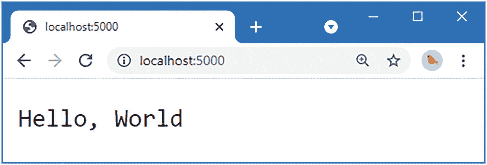
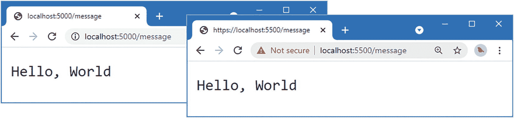
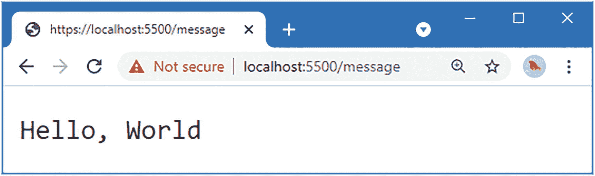
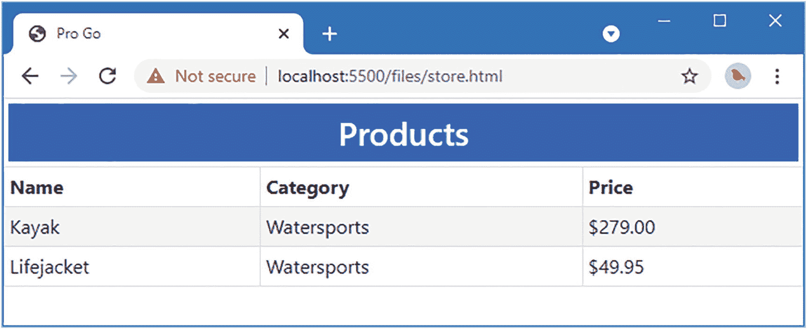
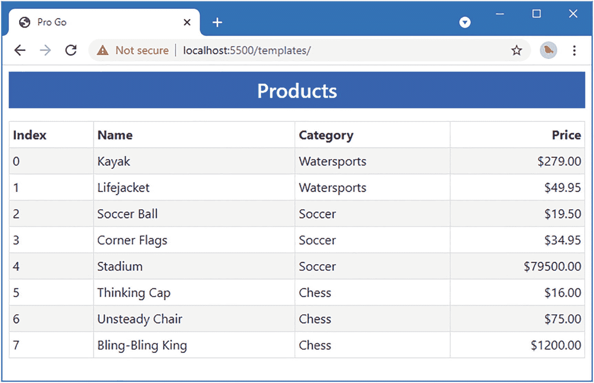
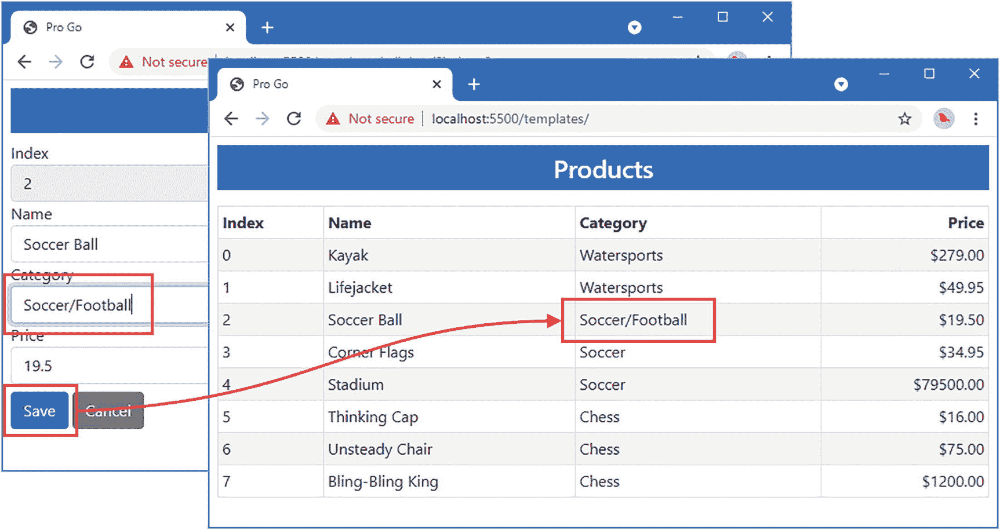
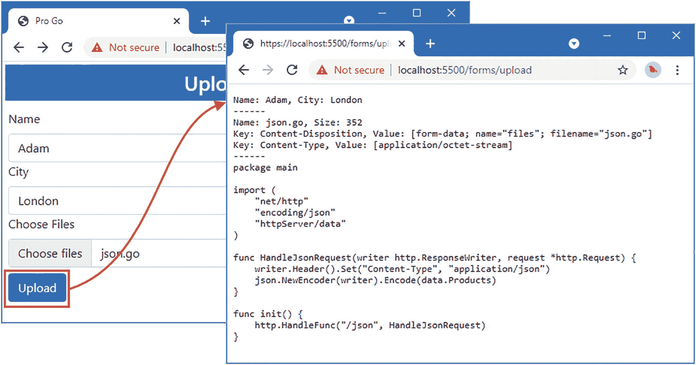
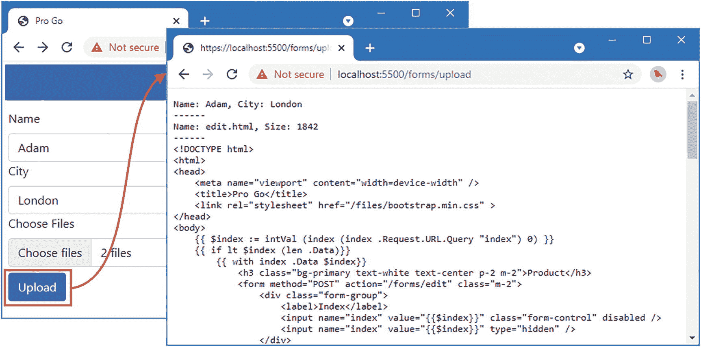
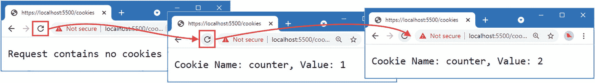

# 23. 使用 HTML 与文本模板

在本章中，我描述了用于从模板生成 HTML 和文本内容的标准库包。这些模板包在生成大量内容时非常有用，并且对生成动态内容提供了广泛的支持。表 23-1 介绍了 HTML 与文本模板的上下文背景。

**表 23-1**  
HTML 与文本模板的上下文背景

| 问题 | 答案 |
| --- | --- |
| 它们是什么？ | 这些模板允许根据 Go 数据值动态生成 HTML 和文本内容。 |
| 它们为什么有用？ | 当需要大量内容时，模板非常有用，因为将内容定义为字符串会变得难以管理。 |
| 如何使用它们？ | 模板是 HTML 或文本文件，其中包含供模板处理引擎使用的指令注释。渲染模板时，会处理这些指令以生成 HTML 或文本内容。 |
| 是否有任何陷阱或限制？ | 模板语法有违直觉，且不会被 Go 编译器检查。这意味着必须小心使用正确的语法，这可能是一个令人沮丧的过程。 |
| 是否有其他替代方案？ | 模板是可选的，少量内容可以使用字符串生成。 |

**表 23-2**  
本章小结

| 问题 | 解决方案 | 清单 |
| --- | --- | --- |
| 生成 HTML 文档 | 定义一个包含操作（actions）的 HTML 模板，将数据值合并到输出中。加载并执行模板，为操作提供数据。 | 6–10 |
| 枚举已加载的模板 | 枚举`Templates`方法的结果。 | 11 |
| 定位特定模板 | 使用`Lookup`方法。 | 12 |
| 生成动态内容 | 使用模板操作。 | 13, 21 |
| 格式化数据值 | 使用格式化函数。 | 14–16 |
| 抑制空白字符 | 在模板中添加连字符。 | 17–19 |
| 处理切片 | 使用切片函数。 | 22 |
| 按条件执行模板内容 | 使用条件操作和函数。 | 23-24 |
| 创建嵌套模板 | 使用`define`和`template`操作。 | 25–27 |
| 定义默认模板 | 使用`block`和`template`操作。 | 28–30 |
| 创建在模板中使用的函数 | 定义模板函数。 | 31–32, 35, 36 |
| 禁用函数结果的编码 | 返回由`html/template`包定义的类型别名之一。 | 33, 34 |
| 存储数据值以便在模板中稍后使用 | 定义模板变量。 | 37–40 |
| 生成文本文档 | 使用`text/template`包。 | 41, 42 |

## 本章准备工作

为了准备本章，打开一个新的命令提示符，导航到一个方便的位置，并创建一个名为`htmltext`的目录。运行清单 23-1 中所示的命令来创建一个模块文件。

> 提示：你可以从`https://github.com/apress/pro-go`下载本章以及本书其他所有章节的示例项目。如果在运行示例时遇到问题，请参阅第 2 章以获取帮助。

```
go mod init htmltext
```

在`htmltext`文件夹中添加一个名为`printer.go`的文件，其内容如清单 23-2 所示。

```
package main
import "fmt"
func Printfln(template string, values ...interface{}) {
fmt.Printf(template + "\n", values...)
}
```

在`htmltext`文件夹中添加一个名为`product.go`的文件，其内容如清单 23-3 所示。

```
package main
type Product struct {
Name, Category string
Price float64
}
var Kayak = Product {
Name: "Kayak",
Category: "Watersports",
Price: 279,
}
var Products = []Product {
{ "Kayak", "Watersports", 279 },
{ "Lifejacket", "Watersports", 49.95 },
{ "Soccer Ball", "Soccer", 19.50 },
{ "Corner Flags", "Soccer", 34.95 },
{ "Stadium", "Soccer", 79500 },
{ "Thinking Cap", "Chess", 16 },
{ "Unsteady Chair", "Chess", 75 },
{ "Bling-Bling King", "Chess", 1200 },
}
func (p *Product) AddTax() float64 {
return p.Price * 1.2
}
func (p * Product) ApplyDiscount(amount float64) float64 {
return p.Price - amount
}
```

在`htmltext`文件夹中添加一个名为`main.go`的文件，其内容如清单 23-4 所示。

```
package main
func main() {
for _, p := range Products {
Printfln("Product: %v, Category: %v, Price: $%.2f",
p.Name, p.Category, p.Price)
}
}
```

使用命令提示符在`htmltext`文件夹中运行清单 23-5 所示的命令。

```
go run .
```

代码将被编译并执行，产生以下输出：

```
Product: Kayak, Category: Watersports, Price: $279.00
Product: Lifejacket, Category: Watersports, Price: $49.95
Product: Soccer Ball, Category: Soccer, Price: $19.50
Product: Corner Flags, Category: Soccer, Price: $34.95
Product: Stadium, Category: Soccer, Price: $79500.00
Product: Thinking Cap, Category: Chess, Price: $16.00
Product: Unsteady Chair, Category: Chess, Price: $75.00
Product: Bling-Bling King, Category: Chess, Price: $1200.00
```


### 创建 HTML 模板

`html/template` 包支持创建模板，这些模板通过数据结构进行处理，以生成动态的 HTML 输出。创建 `htmltext/templates` 文件夹，并向其中添加一个名为 `template.html` 的文件，其内容如代码清单 23-6 所示。

> **注意：** 本章的示例生成的是 HTML 片段。有关生成完整 HTML 文档的示例，请参阅第 3 部分。

```
Template Value: {{ . }}
代码清单 23-6
templates 文件夹中 template.html 文件的内容
```

模板包含静态内容以及由双花括号括起来的表达式，这些表达式被称为*动作*。代码清单 23-6 中的模板使用了最简单的动作——一个句点（`.` 字符），它会打印出用于执行模板的数据，我将在下一节中对此进行解释。

一个项目可以包含多个模板文件。在 `templates` 文件夹中添加一个名为 `extras.html` 的文件，其内容如代码清单 23-7 所示。

```
Extras Template Value: {{ . }}
代码清单 23-7
templates 文件夹中 extras.html 文件的内容
```

新模板使用了与上一个示例相同的动作，但具有不同的静态内容，以便在下一节中明确哪个模板已被执行。在介绍了使用模板的基本技术之后，我将介绍更复杂的模板动作。

## 加载和执行模板

使用模板是一个两步过程。首先，加载模板文件并进行处理，以创建 `Template` 值。表 23-3 描述了用于加载模板文件的函数。

**表 23-3：用于加载模板文件的 `html/template` 函数**

| 名称 | 描述 |
| --- | --- |
| `ParseFiles(...files)` | 此函数加载一个或多个由名称指定的文件。结果是一个可用于生成内容的 `Template` 值，以及一个用于报告加载模板时出现问题的 `error`。 |
| `ParseGlob(pattern)` | 此函数加载一个或多个由模式选定的文件。结果是一个可用于生成内容的 `Template` 值，以及一个用于报告加载模板时出现问题的 `error`。 |

如果你能一致地命名你的模板文件，那么你可以使用 `ParseGlob` 函数通过一个简单的模式来加载它们。如果你需要特定的文件——或者文件命名不一致——那么你可以使用 `ParseFiles` 函数来指定单独的文件。

加载模板文件后，表 23-3 中的函数返回的 `Template` 值用于选择一个模板并执行它以生成内容，使用的就是表 23-4 中描述的方法。

**表 23-4：用于选择和执行模板的 Template 方法**

| 名称 | 描述 |
| --- | --- |
| `Templates()` | 此函数返回一个切片，其中包含指向已加载的 `Template` 值的指针。 |
| `Lookup(name)` | 此函数为指定的已加载模板返回一个 `*Template`。 |
| `Name()` | 此方法返回 `Template` 的名称。 |
| `Execute(writer, data)` | 此函数使用指定的数据执行 `Template`，并将输出写入指定的 `Writer`。 |
| `ExecuteTemplate(writer, templateName, data)` | 此函数使用指定的名称和数据执行模板，并将输出写入指定的 `Writer`。 |

在代码清单 23-8 中，我加载并执行了一个模板。

```
package main
import (
"html/template"
"os"
)
func main() {
t, err := template.ParseFiles("templates/template.html")
if (err == nil) {
t.Execute(os.Stdout, &Kayak)
} else {
Printfln("Error: %v", err.Error())
}
}
代码清单 23-8
在 htmltext 文件夹的 main.go 文件中加载并执行模板
```

我使用了 `ParseFiles` 函数来加载单个模板。`ParseFiles` 函数返回一个 `Template` 值，我在此值上调用了 `Execute` 方法，将标准输出指定为 `Writer`，并将一个 `Product` 作为模板要处理的数据。

`template.html` 文件的内容被处理，其中包含的动作被执行，并将传递给 `Execute` 方法的数据参数插入到发送给 `Writer` 的输出中。编译并执行该项目，你将看到以下输出：

```
Template Value: {Kayak Watersports 279}
```

模板输出包含了 `Product` 结构体的字符串表示形式。在本章后面，我将介绍从结构体值生成内容的更有用的方法。

### 加载多个模板

处理多个模板有两种方法。第一种是为每个模板创建一个单独的 `Template` 值，并分别执行它们，如代码清单 23-9 所示。

```
package main
import (
"html/template"
"os"
)
func main() {
t1, err1 := template.ParseFiles("templates/template.html")
t2, err2 := template.ParseFiles("templates/extras.html")
if (err1 == nil && err2 == nil) {
t1.Execute(os.Stdout, &Kayak)
os.Stdout.WriteString("\n")
t2.Execute(os.Stdout, &Kayak)
} else {
Printfln("Error: %v %v", err1.Error(), err2.Error())
}
}
代码清单 23-9
在 htmltext 文件夹的 main.go 文件中使用独立的模板
```

注意，我在执行模板之间写入了一个换行符。模板的输出与文件中的内容完全一致。`templates` 目录中的两个文件都不包含换行符，所以我不得不在输出中添加一个来分隔模板生成的内容。编译并执行该项目，你将看到以下输出：

```
Template Value: {Kayak Watersports 279}
Extras Template Value: {Kayak Watersports 279}
```

使用单独的 `Template` 值是最简单的方法，但另一种方法是将多个文件加载到一个单独的 `Template` 值中，然后指定要执行的模板名称，如代码清单 23-10 所示。

```
package main
import (
"html/template"
"os"
)
func main() {
allTemplates, err1 := template.ParseFiles("templates/template.html",
"templates/extras.html")
if (err1 == nil) {
allTemplates.ExecuteTemplate(os.Stdout, "template.html", &Kayak)
os.Stdout.WriteString("\n")
allTemplates.ExecuteTemplate(os.Stdout, "extras.html", &Kayak)
} else {
Printfln("Error: %v %v", err1.Error())
}
}
代码清单 23-10
在 htmltext 文件夹的 main.go 文件中使用组合模板
```

当使用 `ParseFiles` 加载多个文件时，结果是一个 `Template` 值，可以调用其上的 `ExecuteTemplate` 方法来执行指定的模板。文件名被用作模板名称，这意味着本例中的模板被命名为 `template.html` 和 `extras.html`。

> **注意：** 你可以在由 `ParseFiles` 或 `ParseGlob` 函数返回的 `Template` 上调用 `Execute` 方法，此时将选择并执行第一个加载的模板来生成输出。使用 `ParseGlob` 函数时要小心，因为第一个加载的模板——因此也就是将要执行的模板——可能不是你期望的文件。

你不必为模板文件使用文件扩展名，但我这样做是为了区分本节创建的模板与本章后面创建的文本模板。编译并执行该项目，你将看到以下输出：

```
Template Value: {Kayak Watersports 279}
Extras Template Value: {Kayak Watersports 279}
```

加载多个模板允许将内容定义在多个文件中，这样，一个模板可以依赖于另一个模板生成的内容，我将在本章后面的“定义模板块”部分对此进行演示。


#### 枚举已加载的模板

枚举已加载的模板非常有用，尤其是在使用 `ParseGlob` 函数时，可以确保所有预期的文件都已找到。代码清单 23-11 使用了 `Templates` 方法来获取模板列表，并使用 `Name` 方法获取每个模板的名称。

```
package main
import (
"html/template"
//"os"
)
func main() {
allTemplates, err := template.ParseGlob("templates/*.html")
if (err == nil) {
for _, t := range allTemplates.Templates() {
Printfln("Template name: %v", t.Name())
}
} else {
Printfln("Error: %v %v", err.Error())
}
}
代码清单 23-11
在 htmltext 文件夹的 main.go 文件中枚举已加载的模板
```

传递给 `ParseGlob` 函数的模式会选中 `templates` 文件夹中所有扩展名为 `html` 的文件。编译并执行该项目，你将看到已加载的模板列表：

```
Template name: extras.html
Template name: template.html
```

#### 查找特定模板

除了指定名称，另一种方法是使用 `Lookup` 方法来选择模板，这在需要将模板作为参数传递给函数时非常有用，如代码清单 23-12 所示。

```
package main
import (
"html/template"
"os"
)
func Exec(t *template.Template) error {
return t.Execute(os.Stdout, &Kayak)
}
func main() {
allTemplates, err := template.ParseGlob("templates/*.html")
if (err == nil) {
selectedTemplated := allTemplates.Lookup("template.html")
err = Exec(selectedTemplated)
}
if (err != nil) {
Printfln("Error: %v %v", err.Error())
}
}
代码清单 23-12
在 htmltext 文件夹的 main.go 文件中查找模板
```

此示例使用 `Lookup` 方法获取从 `template.txt` 文件加载的模板，并将其作为参数传递给 `Exec` 函数，该函数使用标准输出执行模板。编译并执行该项目，你将看到以下输出：

```
Template Value: {Kayak Watersports 279}
```

### 理解模板动作

Go 模板支持多种动作，这些动作可用于根据传递给 `Execute` 或 `ExecuteTemplate` 方法的数据生成内容。为快速参考，表 23-5 总结了模板动作，其中最有用的动作将在后续章节中演示。

**表 23-5** 模板动作

| 动作 | 描述 |
| --- | --- |
| `{{ value }}` `{{ expr }}` | 该动作将数据值或表达式的结果插入模板。句点 (`.`) 用于引用传递给 `Execute` 或 `ExecuteTemplate` 函数的数据值。详细信息请参阅“插入数据值”一节。 |
| `{{ value.fieldname }}` | 该动作插入结构体字段的值。详细信息请参阅“插入数据值”一节。 |
| `{{ value.method arg }}` | 该动作调用一个方法并将结果插入模板输出。不使用括号，参数之间用空格分隔。详细信息请参阅“插入数据值”一节。 |
| `{{ func arg }}` | 该动作调用一个函数并将结果插入输出。有用于常见任务的内置函数，例如格式化数据值，也可以自定义函数，如“定义模板函数”一节所述。 |
| `{{ expr &#124; value.method }}` `{{ expr &#124; func }}` | 表达式可以使用竖线 (`|`) 链接，这样第一个表达式的结果将用作第二个表达式的最后一个参数。 |
| `{{ range value }}` `...` `{{ end }}` | 该动作遍历指定的切片，并为每个元素添加位于 `range` 和 `end` 关键字之间的内容。嵌套内容中的动作会被执行，当前元素可通过句点访问。详细信息请参阅“在模板中使用切片”一节。 |
| `{{ range value }}` `...` `{{ else }}` `...` `{{ end }}` | 该动作类似于 range/end 组合，但定义了一段当切片没有元素时使用的嵌套内容。 |
| `{{ if expr }}` `...` `{{ end }}` | 该动作计算一个表达式，如果结果为 `true`，则执行嵌套的模板内容，如“条件执行模板内容”一节所示。该动作可以与可选的 `else` 和 `else if` 子句一起使用。 |
| `{{ with expr }}` `...` `{{ end }}` | 该动作计算一个表达式，如果结果不为 `nil` 或空字符串，则执行嵌套的模板内容。该动作可以与可选的子句一起使用。 |
| `{{ define "name" }}` `...` `{{ end }}` | 该动作定义一个具有指定名称的模板。 |
| `{{ template "name" expr }}` | 该动作使用指定的名称和数据执行模板，并将结果插入输出。 |
| `{{ block "name" expr }}` `...` `{{ end }}` | 该动作定义一个具有指定名称的模板，并使用指定的数据调用它。这通常用于定义一个可以被另一个文件加载的模板替换的模板，如“定义模板块”一节所示。 |


好的，作为一名高级文档工程师和翻译员，我将严格遵循您提供的注意事项和示例，将给定的英文文本翻译成中文。


### 插入数据值

模板中最简单的任务就是将值插入到由模板生成的输出中，这通过创建一个包含表达式（可生成你想插入的值）的操作来实现。表 23-6 描述了基本的模板表达式，其中最有用的一些表达式将在后续章节中演示。

**表 23-6**：用于向模板中插入值的模板表达式

| 表达式 | 描述 |
| --- | --- |
| `.` | 此表达式将传递给 `Execute` 或 `ExecuteTemplate` 方法的值插入到模板输出中。 |
| `.Field` | 此表达式将指定字段的值插入到模板输出中。 |
| `.Method` | 此表达式调用指定的无参方法，并将结果插入到模板输出中。 |
| `.Method arg` | 此表达式使用指定的参数调用指定的方法，并将结果插入到模板输出中。 |
| `call .Field arg` | 此表达式调用一个结构体函数字段，使用以空格分隔的指定参数。函数的结果被插入到模板输出中。 |

在上一节中，我只使用了句点，其效果是插入用于执行模板的数据值的字符串表示形式。大多数实际项目中的模板都包含特定字段的值或调用方法的结果，如清单 23-13 所示。

```
Template Value: {{ . }}
Name: {{ .Name }}
Category: {{ .Category }}
Price: {{ .Price }}
Tax: {{ .AddTax }}
Discount Price: {{ .ApplyDiscount 10 }}
清单 23-13
在 templates 文件夹中的 template.html 文件中插入数据值
```

这些新操作包含的表达式会写出 `Name`、`Category` 和 `Price` 字段的值，以及调用 `AddTax` 和 `ApplyDiscount` 方法的结果。访问字段的语法与 Go 代码大致相似，但调用方法和函数的方式差异很大，很容易出错。与 Go 代码不同，方法调用时不使用括号，参数只需在方法名称后用空格分隔指定。开发者有责任确保参数的类型可被方法或函数使用。编译并执行该项目，你将看到以下输出：

```
Template Value: {Kayak Watersports 279}
Name: Kayak
Category: Watersports
Price: 279
Tax: 334.8
Discount Price: 269
```

### 理解上下文转义

值会被自动转义，以确保它们安全地包含在 HTML、CSS 和 JavaScript 代码中，并根据上下文应用适当的转义规则。例如，一个像 `"It was a <big> boat"` 这样的字符串值，如果用作 HTML 元素的文本内容，会被插入为 `"It was a &lt;big&gt; boat"`；但如果用在 JavaScript 代码中作为字符串字面量，则会插入为 `"It was a \u003cbig\u003e boat"`。有关值如何转义的完整详细信息，请参见 [`https://golang.org/pkg/html/template`](https://golang.org/pkg/html/template)。

### 格式化数据值

模板支持用于常见任务的内置函数，包括格式化插入到输出中的数据值，如表 23-7 所述。其他内置函数将在后续章节中介绍。

**表 23-7**：用于格式化数据的内置模板函数

| 名称 | 描述 |
| --- | --- |
| `print` | 这是 `fmt.Sprint` 函数的别名。 |
| `printf` | 这是 `fmt.Sprintf` 函数的别名。 |
| `println` | 这是 `fmt.Sprintln` 函数的别名。 |
| `html` | 此函数对值进行编码，以便安全地包含在 HTML 文档中。 |
| `js` | 此函数对值进行编码，以便安全地包含在 JavaScript 文档中。 |
| `urlquery` | 此函数对值进行编码，以便用于 URL 查询字符串。 |

这些函数通过指定其名称，后跟一个以空格分隔的参数列表来调用。在清单 23-14 中，我使用了 `printf` 函数来格式化模板输出中包含的一些数据字段。

```
Template Value: {{ . }}
Name: {{ .Name }}
Category: {{ .Category }}
Price: {{ printf "$%.2f" .Price }}
Tax: {{ printf "$%.2f" .AddTax }}
Discount Price: {{ .ApplyDiscount 10 }}
清单 23-14
在 templates 文件夹中的 template.html 文件中使用格式化函数

使用 `printf` 函数可以将两个数据值格式化为美元金额，编译并执行项目后，将产生以下输出：

```
Extras Template Value: {Kayak Watersports 279}
Name: Kayak
Category: Watersports
Price: $279.00
Tax: $334.80
Discount Price: 269
```

### 链式与括号化模板表达式

链式表达式可以为值创建管道，从而允许将一个方法或函数的输出用作另一个方法或函数的输入。清单 23-15 通过链式连接 `ApplyDiscount` 方法的结果，将其用作 `printf` 函数的参数，从而创建了一个管道。

```
Template Value: {{ . }}
Name: {{ .Name }}
Category: {{ .Category }}
Price: {{ printf "$%.2f" .Price }}
Tax: {{ printf "$%.2f" .AddTax }}
Discount Price: {{ .ApplyDiscount 10 | printf "$%.2f" }}
清单 23-15
在 templates 文件夹中的 template.html 文件中使用链式表达式
```

表达式使用竖线（`|` 字符）进行链式连接，其效果是一个表达式的结果被用作下一个表达式的最后一个参数。在清单 23-15 中，调用 `ApplyDiscount` 方法的结果被用作调用内置 `printf` 函数的最后一个参数。编译并执行该项目，你将在模板生成的输出中看到格式化后的值：

```
Extras Template Value: {Kayak Watersports 279}
Name: Kayak
Category: Watersports
Price: $279.00
Tax: $334.80
Discount Price: $269.00
```

链式连接只能用于传递给函数的最后一个参数。另一种方法——也是可以用来设置其他函数参数的方法——是使用括号，如清单 23-16 所示。

```
Template Value: {{ . }}
Name: {{ .Name }}
Category: {{ .Category }}
Price: {{ printf "$%.2f" .Price }}
Tax: {{ printf "$%.2f" .AddTax }}
Discount Price: {{ printf "$%.2f" (.ApplyDiscount 10) }}
清单 23-16
在 templates 文件夹中的 template.html 文件中使用括号
```

这里调用了 `ApplyDiscount` 方法，并将其结果用作 `printf` 函数的参数。清单 23-16 中的模板产生的输出与清单 23-15 相同。


#### 修剪空白

默认情况下，模板的内容会严格按照文件中的定义进行渲染，包括动作之间的任何空白。HTML 对元素间的空白不敏感，但空白仍可能对文本内容和属性值造成问题，特别是当你希望编排模板内容使其易于阅读时，如清单 23-17 所示。

```
Name: {{ .Name }}, Category: {{ .Category }}, Price,
{{ printf "$%.2f" .Price }}

清单 23-17
在 templates 文件夹的 template.html 文件中编排模板内容
```

我添加了换行和缩进，以便内容适合打印页面，并将元素内容与其标签分开。编译并执行项目时，这些空白会包含在输出中：

```
Name: Kayak, Category: Watersports, Price,
$279.00
```

可以使用减号来修剪空白，将其紧跟在打开或关闭动作的花括号之后或之前。在清单 23-18 中，我使用此功能修剪了清单 23-17 中引入的空白。

```
Name: {{ .Name }}, Category: {{ .Category }}, Price,
{{- printf "$%.2f" .Price -}}

清单 23-18
在 templates 文件夹的 template.html 文件中修剪空白
```

减号必须用空格与动作表达式的其余部分隔开。其效果是移除动作之前或之后的所有空白，你可以通过编译并执行项目来看到这一点，它将产生以下输出：

```
Name: Kayak, Category: Watersports, Price,$279.00
```

最终动作周围的空白已被移除，但开头的 `h1` 标签后仍有一个换行符，因为空白修剪仅适用于动作。如果无法从模板中移除这些空白，则可以使用一个向输出中插入空字符串的动作来仅修剪空白，如清单 23-19 所示。

```
{{- "" -}} Name: {{ .Name }}, Category: {{ .Category }}, Price,
{{- printf "$%.2f" .Price -}}

清单 23-19
在 templates 文件夹的 template.html 文件中修剪额外的空白
```

新动作不会引入任何新输出，仅用于修剪周围的空白，这可以通过编译并执行项目来查看：

```
Name: Kayak, Category: Watersports, Price,$279.00
```

即使有了这个功能，在编写易于理解的模板时，控制空白仍然很困难，你将在后续示例中看到这一点。如果特定的文档结构很重要，那么你就必须接受更难阅读和维护的模板。如果可读性和可维护性是优先考虑的因素，那么你就必须接受模板输出中额外的空白。

#### 在模板中使用切片

模板动作可用于为切片生成内容，如清单 23-20 所示，它替换了整个模板。

```
{{ range . -}}
Name: {{ .Name }}, Category: {{ .Category }}, Price,
{{- printf "$%.2f" .Price }}
{{ end }}

清单 23-20
在 templates 文件夹的 template.html 文件中处理切片
```

`range` 表达式会遍历指定的数据，我在清单 23-20 中使用了句点来选择用于执行模板的数据值，稍后将对此进行配置。`range` 表达式和 `end` 表达式之间的模板内容会为切片中的每个值重复，当前值被赋值给句点，以便可以在嵌套动作中使用它。清单 23-20 的效果是，`Name`、`Category` 和 `Price` 字段被插入到由 `range` 表达式枚举的切片中每个值的输出中。

注意

`range` 关键字也可用于枚举映射，如本章稍后的“定义模板变量”部分所述。

清单 23-21 更新了执行模板的代码，使用切片代替单个 `Product` 值。

```
package main
import (
"html/template"
"os"
)
func Exec(t *template.Template) error {
return t.Execute(os.Stdout, Products)
}
func main() {
allTemplates, err := template.ParseGlob("templates/*.html")
if (err == nil) {
selectedTemplated := allTemplates.Lookup("template.html")
err = Exec(selectedTemplated)
}
if (err != nil) {
Printfln("Error: %v %v", err.Error())
}
}

清单 23-21
在 htmltext 文件夹的 main.go 文件中使用切片执行模板
```

编译并执行代码，你将看到以下输出：

```
Name: Kayak, Category: Watersports, Price,$279.00
Name: Lifejacket, Category: Watersports, Price,$49.95
Name: Soccer Ball, Category: Soccer, Price,$19.50
Name: Corner Flags, Category: Soccer, Price,$34.95
Name: Stadium, Category: Soccer, Price,$79500.00
Name: Thinking Cap, Category: Chess, Price,$16.00
Name: Unsteady Chair, Category: Chess, Price,$75.00
Name: Bling-Bling King, Category: Chess, Price,$1200.00
```

请注意，我在清单 23-20 中向包含 `range` 表达式的动作应用了减号。我希望 `range` 和 `end` 动作内的模板内容通过放在新行并添加缩进来在视觉上清晰可辨，但这会导致输出中出现额外的换行和间距。在 `range` 表达式末尾放置减号会修剪嵌套内容中的所有前导空白。我没有向 `end` 动作添加减号，这具有保留尾部换行符的效果，从而使切片中每个元素的输出都显示在单独的行上。

##### 使用内置切片函数

Go 文本模板支持表 23-8 中描述的内置函数来处理切片。

**表 23-8** 用于切片的内置模板函数

| 名称 | 描述 |
| --- | --- |
| `slice` | 此函数创建一个新切片。其参数是原始切片、起始索引和结束索引。 |
| `index` | 此函数返回指定索引处的元素。 |
| `len` | 此函数返回指定切片的长度。 |

清单 23-22 使用内置函数来报告切片的大小、获取特定索引处的元素以及创建新切片。

```
There are {{ len . }} products in the source data.
First product: {{ index . 0 }}
{{ range slice . 3 5 -}}
Name: {{ .Name }}, Category: {{ .Category }}, Price,
{{- printf "$%.2f" .Price }}
{{ end }}

清单 23-22
在 templates 文件夹的 template.html 文件中使用内置函数
```

编译并执行项目，你将看到以下输出：

```
There are 8 products in the source data.
First product: {Kayak Watersports 279}
Name: Corner Flags, Category: Soccer, Price,$34.95
Name: Stadium, Category: Soccer, Price,$79500.00
```


#### 条件执行模板内容

动作可用于根据其表达式的计算结果，有条件地向输出中插入内容，如清单 23-23 所示。

```
There are {{ len . }} products in the source data.
First product: {{ index . 0 }}
{{ range . -}}
{{ if lt .Price 100.00 -}}
Name: {{ .Name }}, Category: {{ .Category }}, Price,
{{- printf "$%.2f" .Price }}
{{ end -}}
{{ end }}
清单 23-23
在 templates 文件夹中的 template.html 文件中使用条件动作
```

`if` 关键字后面跟一个表达式，该表达式决定是否执行嵌套的模板内容。为了帮助编写这些动作的表达式，模板支持表 23-9 中描述的函数。

**表 23-9**  
模板条件函数

| 函数 | 描述 |
| --- | --- |
| `eq arg1 arg2` | 如果 `arg1 == arg2`，此函数返回 `true`。 |
| `ne arg1 arg2` | 如果 `arg1 != arg2`，此函数返回 `true`。 |
| `lt arg1 arg2` | 如果 `arg1 < arg2`，此函数返回 `true`。 |
| `le arg1 arg2` | 如果 `arg1 <= arg2`，此函数返回 `true`。 |
| `gt arg1 arg2` | 如果 `arg1 > arg2`，此函数返回 `true`。 |
| `ge arg1 arg2` | 如果 `arg1 >= arg2`，此函数返回 `true`。 |
| `and arg1 arg2` | 如果 `arg1` 和 `arg2` 均为 `true`，此函数返回 `true`。 |
| `not arg1` | 如果 `arg1` 为 `false`，此函数返回 `true`；如果为 `true`，则返回 `false`。 |

这些函数的语法与模板其他功能保持一致，在习惯之前会显得有些别扭。在清单 23-23 中，我使用了以下表达式：

```
...
{{ if lt .Price 100.00 -}}
...
```

`if` 关键字表示一个条件动作，`lt` 函数执行小于比较，其余参数指定 `range` 表达式中当前值的 `Price` 字段以及一个字面值 `100.00`。表 23-9 中描述的比较函数在处理数据类型时没有复杂的方法，这意味着我必须将字面值指定为 `100.00`，以便将其作为 `float64` 处理，而不能依赖 Go 处理无类型常量的方式。

`range` 动作枚举 `Product` 切片中的值，并执行嵌套的 `if` 动作。只有当当前元素的 `Price` 字段值小于 100 时，`if` 动作才会执行其嵌套内容。编译并执行该项目，你将看到以下输出：

```
There are 8 products in the source data.
First product: {Kayak Watersports 279}
Name: Lifejacket, Category: Watersports, Price,$49.95
Name: Soccer Ball, Category: Soccer, Price,$19.50
Name: Corner Flags, Category: Soccer, Price,$34.95
Name: Thinking Cap, Category: Chess, Price,$16.00
Name: Unsteady Chair, Category: Chess, Price,$75.00
```

尽管使用了减号来修剪空白，但由于我选择构建模板的方式，输出的格式仍然很奇怪。如前所述，在构建易于阅读的模板和管理输出中的空白之间存在权衡。本章我侧重于使模板易于理解，因此示例的输出格式比较别扭。

### 使用可选条件动作

`if` 动作可以与可选的 `else` 和 `else if` 关键字一起使用，如清单 23-24 所示，从而允许提供回退内容，这些内容将在 `if` 表达式为 `false` 时执行，或仅在第二个表达式为 `true` 时执行。

```
There are {{ len . }} products in the source data.
First product: {{ index . 0 }}
{{ range . -}}
{{ if lt .Price 100.00 -}}
Name: {{ .Name }}, Category: {{ .Category }}, Price,
{{- printf "$%.2f" .Price }}
{{ else if gt .Price 1500.00 -}}
Expensive Product {{ .Name }} ({{ printf "$%.2f" .Price}})
{{ else -}}
Midrange Product: {{ .Name }} ({{ printf "$%.2f" .Price}})
{{ end -}}
{{ end }}
清单 23-24
在 templates 文件夹中的 template.html 文件中使用可选关键字
```

编译并执行该项目，你将看到 `if`、`else if` 和 `else` 动作产生以下输出：

```
There are 8 products in the source data.
First product: {Kayak Watersports 279}
Midrange Product: Kayak ($279.00)
Name: Lifejacket, Category: Watersports, Price,$49.95
Name: Soccer Ball, Category: Soccer, Price,$19.50
Name: Corner Flags, Category: Soccer, Price,$34.95
Expensive Product Stadium ($79500.00)
Name: Thinking Cap, Category: Chess, Price,$16.00
Name: Unsteady Chair, Category: Chess, Price,$75.00
Midrange Product: Bling-Bling King ($1200.00)
```


### 创建具名嵌套模板

`define` 操作用于创建一个可通过名称执行的嵌套模板，这样就能将内容定义一次，然后通过 `template` 操作重复使用，如清单 23-25 所示。

```
{{ define "currency" }}{{ printf "$%.2f" . }}{{ end }}
{{ define "basicProduct" -}}
Name: {{ .Name }}, Category: {{ .Category }}, Price,
{{- template "currency" .Price }}
{{- end }}
{{ define "expensiveProduct" -}}
Expensive Product {{ .Name }} ({{ template "currency" .Price }})
{{- end }}
There are {{ len . }} products in the source data.
First product: {{ index . 0 }}
{{ range . -}}
{{ if lt .Price 100.00 -}}
{{ template "basicProduct" . }}
{{ else if gt .Price 1500.00 -}}
{{ template "expensiveProduct" . }}
{{ else -}}
Midrange Product: {{ .Name }} ({{ printf "$%.2f" .Price}})
{{ end -}}
{{ end }}
```

> **清单 23-25：** 在 `templates` 文件夹中的 `template.html` 文件中定义并使用嵌套模板

`define` 关键字后跟用引号括起来的模板名称，模板以 `end` 关键字结束。`template` 关键字用于执行一个具名模板，需要指定模板名称和一个数据值：

```
...
{{- template "currency" .Price }}
...
```

此操作执行名为 `currency` 的模板，并使用 `Price` 字段的值作为数据值。在具名模板内部，可以通过句点（`.`）来访问该数据值：

```
...
{{ define "currency" }}{{ printf "$%.2f" . }}{{ end }}
...
```

一个具名模板可以调用其他具名模板，如清单 23-25 所示，其中 `basicProduct` 和 `expensiveProduct` 模板执行了 `currency` 模板。

嵌套的具名模板可能会加剧空白符问题，因为模板周围的空白符（为了清晰起见，我在清单 23-25 中添加的）会被包含在主模板的输出中。解决此问题的一种方法是将具名模板定义在单独的文件中，但也可以通过只使用具名模板（即使是主输出部分）来解决，如清单 23-26 所示。

```
{{ define "currency" }}{{ printf "$%.2f" . }}{{ end }}
{{ define "basicProduct" -}}
Name: {{ .Name }}, Category: {{ .Category }}, Price,
{{- template "currency" .Price }}
{{- end }}
{{ define "expensiveProduct" -}}
Expensive Product {{ .Name }} ({{ template "currency" .Price }})
{{- end }}
{{ define "mainTemplate" -}}
There are {{ len . }} products in the source data.
First product: {{ index . 0 }}
{{ range . -}}
{{ if lt .Price 100.00 -}}
{{ template "basicProduct" . }}
{{ else if gt .Price 1500.00 -}}
{{ template "expensiveProduct" . }}
{{ else -}}
Midrange Product: {{ .Name }} ({{ printf "$%.2f" .Price}})
{{ end -}}
{{ end }}
{{- end}}
```

> **清单 23-26：** 在 `templates` 文件夹中的 `template.html` 文件中添加一个具名模板

对主模板内容使用 `define` 和 `end` 关键字，可以排除用于分隔其他具名模板的空白符。在清单 23-27 中，我通过在选择要执行的模板时使用其名称来完成此更改。

```go
package main

import (
	"html/template"
	"os"
)

func Exec(t *template.Template) error {
	return t.Execute(os.Stdout, Products)
}

func main() {
	allTemplates, err := template.ParseGlob("templates/*.html")
	if err == nil {
		selectedTemplated := allTemplates.Lookup("mainTemplate")
		err = Exec(selectedTemplated)
	}
	if err != nil {
		Printfln("Error: %v %v", err.Error())
	}
}
```

> **清单 23-27：** 在 `htmltext` 文件夹的 `main.go` 文件中选取具名模板

任何具名模板都可以直接执行，但我选择了 `mainTemplate`。编译并运行项目后，会得到以下输出：

```
There are 8 products in the source data.
First product: {Kayak Watersports 279}
Midrange Product: Kayak ($279.00)
Name: Lifejacket, Category: Watersports, Price,$49.95
Name: Soccer Ball, Category: Soccer, Price,$19.50
Name: Corner Flags, Category: Soccer, Price,$34.95
Expensive Product Stadium ($79500.00)
Name: Thinking Cap, Category: Chess, Price,$16.00
Name: Unsteady Chair, Category: Chess, Price,$75.00
Midrange Product: Bling-Bling King ($1200.00)
```

### 定义模板块

模板块用于定义带有默认内容的模板，该默认内容可以在另一个模板文件中被覆盖，这需要多个模板被同时加载和执行。这通常用于提供公共内容，例如布局，如清单 23-28 所示。

```
{{ define "mainTemplate" -}}
This is the layout header
{{ block "body" . }}
There are {{ len . }} products in the source data.
{{ end }}
This is the layout footer
{{ end }}
```

> **清单 23-28：** 在 `templates` 文件夹中的 `template.html` 文件中定义一个块

`block` 操作用于为模板指定一个名称，但与 `define` 操作不同，该模板会直接包含在输出中，而无需使用 `template` 操作。通过编译并运行项目可以看到这一点（我已格式化输出以移除空白符）：

```
This is the layout header
There are 8 products in the source data.
This is the layout footer
```

单独使用时，模板文件的输出包含块中的内容。但此内容可以被另一个模板文件重新定义。在 `templates` 文件夹中添加一个名为 `list.html` 的文件，内容如清单 23-29 所示。

```
{{ define "body" }}
{{ range . }}
Product: {{ .Name }} ({{ printf "$%.2f" .Price}})
{{ end -}}
{{ end }}
```

> **清单 23-29：** `templates` 文件夹中 `list.html` 文件的内容

要使用此特性，必须按顺序加载模板文件，如清单 23-30 所示。

```go
package main

import (
	"html/template"
	"os"
)

func Exec(t *template.Template) error {
	return t.Execute(os.Stdout, Products)
}

func main() {
	allTemplates, err := template.ParseFiles("templates/template.html",
		"templates/list.html")
	if err == nil {
		selectedTemplated := allTemplates.Lookup("mainTemplate")
		err = Exec(selectedTemplated)
	}
	if err != nil {
		Printfln("Error: %v %v", err.Error())
	}
}
```

> **清单 23-30：** 在 `htmltext` 文件夹的 `main.go` 文件中加载模板

模板必须按顺序加载，即包含 `block` 操作的文件要在包含用于重新定义该模板的 `define` 操作的文件之前加载。当模板被加载后，`list.html` 文件中定义的模板会重新定义名为 `body` 的模板，从而让 `list.html` 文件中的内容替换掉 `template.html` 文件中的内容。编译并运行项目，您将看到以下输出（我已格式化以移除空白符）：

```
This is the layout header
Product: Kayak ($279.00)
Product: Lifejacket ($49.95)
Product: Soccer Ball ($19.50)
Product: Corner Flags ($34.95)
Product: Stadium ($79500.00)
Product: Thinking Cap ($16.00)
Product: Unsteady Chair ($75.00)
Product: Bling-Bling King ($1200.00)
This is the layout footer
```


### 定义模板函数

前面章节描述的内置模板函数可以通过特定于某个`Template`的自定义函数进行补充，这意味着这些函数是在代码中定义和设置的。清单 23-31 演示了设置自定义函数的过程。

```
package main
import (
"html/template"
"os"
)
func GetCategories(products []Product) (categories []string) {
catMap := map[string]string {}
for _, p := range products {
if (catMap[p.Category] == "") {
catMap[p.Category] = p.Category
categories = append(categories, p.Category)
}
}
return
}
func Exec(t *template.Template) error {
return t.Execute(os.Stdout, Products)
}
func main() {
allTemplates := template.New("allTemplates")
allTemplates.Funcs(map[string]interface{} {
"getCats": GetCategories,
})
allTemplates, err := allTemplates.ParseGlob("templates/*.html")
if (err == nil) {
selectedTemplated := allTemplates.Lookup("mainTemplate")
err = Exec(selectedTemplated)
}
if (err != nil) {
Printfln("Error: %v %v", err.Error())
}
}
清单 23-31
在 htmltext 文件夹的 main.go 文件中定义自定义函数
```

`GetCategories` 函数接收一个 `Product` 切片，并返回唯一的 `Category` 值集合。为了设置 `GetCategories` 函数，使其能被 `Template` 使用，需要调用 `Funcs` 方法，并传入一个从函数名到函数的映射，如下所示：

```
...
allTemplates.Funcs(map[string]interface{} {
"getCats": GetCategories,
})
...
```

清单 23-31 中的映射指定 `GetCategories` 函数将使用名称 `getCats` 来调用。`Funcs` 方法必须在解析模板文件之前调用，这意味着需要先使用 `New` 函数创建一个 `Template`，这样就能在调用 `ParseFiles` 或 `ParseGlob` 方法之前注册自定义函数：

```
...
allTemplates := template.New("allTemplates")
allTemplates.Funcs(map[string]interface{} {
"getCats": GetCategories,
})
allTemplates, err := allTemplates.ParseGlob("templates/*.html")
...
```

在模板内部，可以使用与内置函数相同的语法来调用自定义函数，如清单 23-32 所示。

```
{{ define "mainTemplate" -}}
There are {{ len . }} products in the source data.
{{ range getCats .  -}}
Category: {{ . }}
{{ end }}
{{- end }}
清单 23-32
在 templates 文件夹的 template.html 文件中使用自定义函数
```

使用 `range` 关键字来枚举自定义函数返回的类别，这些类别会被包含在模板输出中。编译并执行该项目，你将看到以下输出（为消除空白符已进行格式化）：

```
There are 8 products in the source data.
Category: Watersports
Category: Soccer
Category: Chess
```

### 禁用函数结果编码

函数产生的结果会被编码，以确保安全地包含在 HTML 文档中。这对于生成 HTML、JavaScript 或 CSS 片段的函数来说可能是个问题，如清单 23-33 所示。

```
...
func GetCategories(products []Product) (categories []string) {
catMap := map[string]string {}
for _, p := range products {
if (catMap[p.Category] == "") {
catMap[p.Category] = p.Category
categories = append(categories, "p.Category")
}
}
return
}
...
清单 23-33
在 htmltext 文件夹的 main.go 文件中创建 HTML 片段
```

`GetCategories` 函数已被修改，现在它生成一个包含 HTML 字符串的切片。模板引擎对这些值进行了编码，这一点可以从编译并执行项目后的输出中看出：

```
There are 8 products in the source data.
Category: &lt;b&gt;p.Category&lt;/b&gt;
Category: &lt;b&gt;p.Category&lt;/b&gt;
Category: &lt;b&gt;p.Category&lt;/b&gt;
```

这是一种良好的实践，但当函数用于生成应直接包含在模板中而不进行编码的内容时，就会引发问题。针对这些情况，`html/template` 包定义了一组 `string` 类型别名，用于表明函数返回的结果需要特殊处理，如表 23-10 所述。

**表 23-10** 用于标识内容类型的类型别名

| 名称 | 描述 |
| --- | --- |
| `CSS` | 此类型表示 CSS 内容。 |
| `HTML` | 此类型表示一个 HTML 片段。 |
| `HTMLAttr` | 此类型表示将用作 HTML 属性值的值。 |
| `JS` | 此类型表示一段 JavaScript 代码片段。 |
| `JSStr` | 此类型表示一个用于 JavaScript 表达式中引号内的值。 |
| `Srcset` | 此类型表示可在 `img` 元素的 `srcset` 属性中使用的值。 |
| `URL` | 此类型表示一个 URL。 |

为了防止常规的内容处理，生成内容的函数应使用表 23-10 中列出的类型之一，如清单 23-34 所示。

```
...
func GetCategories(products []Product) (categories []template.HTML) {
catMap := map[string]string {}
for _, p := range products {
if (catMap[p.Category] == "") {
catMap[p.Category] = p.Category
categories = append(categories, "p.Category")
}
}
return
}
...
清单 23-34
在 htmltext 文件夹的 main.go 文件中返回 HTML 内容
```

这一更改告诉模板系统，`GetCategories` 函数返回的结果是 HTML。编译并执行项目后，将产生以下输出：

```
There are 8 products in the source data.
Category: p.Category
Category: p.Category
Category: p.Category
```

### 提供对标准库函数的访问

模板函数也可以用来提供对标准库所提供功能的访问，如清单 23-35 所示。

```
package main
import (
"html/template"
"os"
"strings"
)
func GetCategories(products []Product) (categories []string) {
catMap := map[string]string {}
for _, p := range products {
if (catMap[p.Category] == "") {
catMap[p.Category] = p.Category
categories = append(categories, p.Category)
}
}
return
}
func Exec(t *template.Template) error {
return t.Execute(os.Stdout, Products)
}
func main() {
allTemplates := template.New("allTemplates")
allTemplates.Funcs(map[string]interface{} {
"getCats": GetCategories,
"lower": strings.ToLower,
})
allTemplates, err := allTemplates.ParseGlob("templates/*.html")
if (err == nil) {
selectedTemplated := allTemplates.Lookup("mainTemplate")
err = Exec(selectedTemplated)
}
if (err != nil) {
Printfln("Error: %v %v", err.Error())
}
}
清单 23-35
在 htmltext 文件夹的 main.go 文件中添加函数映射
```

新的映射提供了对 `ToLower` 函数的访问，该函数将字符串转换为小写，如第 16 章所述。在模板内部，可以使用名称 `lower` 来调用该函数，如清单 23-36 所示。

```
{{ define "mainTemplate" -}}
There are {{ len . }} products in the source data.
{{ range getCats .  -}}
Category: {{ lower . }}
{{ end }}
{{- end }}
清单 23-36
在 templates 文件夹的 template.html 文件中使用模板函数
```

编译并执行项目，你将看到以下输出：

```
There are 8 products in the source data.
Category: watersports
Category: soccer
Category: chess
```


### 定义模板变量

动作可以在其表达式中定义变量，并可在嵌入的模板内容中访问这些变量，如清单 23-37 所示。当你需要在表达式中生成一个值进行评估，并且在嵌套内容中也用到同一值时，这一特性非常有用。

```
{{ define "mainTemplate" -}}
{{ $length := len . }}
源数据中共有 {{ $length }} 个产品。
{{ range getCats .  -}}
分类: {{ lower . }}
{{ end }}
{{- end }}
清单 23-37
在 templates 文件夹的 template.html 文件中定义与使用模板变量
```

模板变量名以 `$` 字符为前缀，并使用短变量声明语法创建。第一个动作创建了一个名为 `length` 的变量，该变量在随后的动作中被使用。编译并运行项目，你将看到以下输出：

```
源数据中共有 8 个产品。
分类: watersports
分类: soccer
分类: chess
```

清单 23-38 展示了一个更复杂的定义与使用模板变量的例子。

```
{{ define "mainTemplate" -}}
源数据中共有 {{ len . }} 个产品。
{{- range getCats .  -}}
{{ if ne ($char := slice (lower .) 0 1) "s"  }}
{{$char}}: {{.}}
{{- end }}
{{- end }}
{{- end }}
清单 23-38
在 templates 文件夹的 template.html 文件中定义与使用模板变量
```

在这个例子中，`if` 动作使用了 `slice` 和 `lower` 函数来获取当前分类的第一个字符，并在用于 `if` 表达式之前将其赋值给名为 `$char` 的变量。`$char` 变量在嵌套的模板内容中被访问，这避免了重复使用 `slice` 和 `lower` 函数。编译并运行项目，你将看到以下输出：

```
源数据中共有 8 个产品。
w: Watersports
c: Chess
```

### 在 Range 动作中使用模板变量

变量也可以与 `range` 动作一起使用，这使得可以在模板中使用映射（map）。在清单 23-39 中，我更新了执行模板的 Go 代码，以向 `Execute` 方法传递一个映射。

```
...
func Exec(t *template.Template) error {
productMap := map[string]Product {}
for _, p := range Products {
productMap[p.Name] = p
}
return t.Execute(os.Stdout, &productMap)
}
...
清单 23-39
在 htmltext 文件夹的 main.go 文件中使用映射
```

清单 23-40 更新了模板，以使用模板变量枚举映射的内容。

```
{{ define "mainTemplate" -}}
{{ range $key, $value := . -}}
{{ $key }}: {{ printf "$%.2f" $value.Price }}
{{ end }}
{{- end }}
清单 23-40
在 templates 文件夹的 template.html 文件中枚举映射
```

语法略显别扭，`range` 关键字、变量和赋值运算符出现的顺序不同寻常，但其效果是映射中的键和值可以在模板中使用。编译并运行项目，你将看到以下输出：

```
Bling-Bling King: $1200.00
Corner Flags: $34.95
Kayak: $279.00
Lifejacket: $49.95
Soccer Ball: $19.50
Stadium: $79500.00
Thinking Cap: $16.00
Unsteady Chair: $75.00
```

## 创建文本模板

`html/template` 包构建在 `text/template` 包提供的功能之上，后者可以直接用于执行文本模板。HTML 当然也是文本，不同之处在于 `text/template` 包不会自动转义内容。在其他所有方面，使用文本模板与使用 HTML 模板相同。在 `templates` 文件夹中添加一个名为 `template.txt` 的文件，内容如清单 23-41 所示。

```
{{ define "mainTemplate" -}}
{{ range $key, $value := . -}}
{{ $key }}: {{ printf "$%.2f" $value.Price }}
{{ end }}
{{- end }}
清单 23-41
templates 文件夹中 template.txt 文件的内容

该模板与清单 23-40 中的模板类似，只是不包含 `h1` 元素。模板动作、表达式、变量和空白修剪都是相同的。而且，如清单 23-42 所示，用于加载和执行模板的函数名称也相同，只是通过不同的包来访问。

```
package main
import (
"text/template"
"os"
"strings"
)
func GetCategories(products []Product) (categories []string) {
catMap := map[string]string {}
for _, p := range products {
if (catMap[p.Category] == "") {
catMap[p.Category] = p.Category
categories = append(categories, p.Category)
}
}
return
}
func Exec(t *template.Template) error {
productMap := map[string]Product {}
for _, p := range Products {
productMap[p.Name] = p
}
return t.Execute(os.Stdout, &productMap)
}
func main() {
allTemplates := template.New("allTemplates")
allTemplates.Funcs(map[string]interface{} {
"getCats": GetCategories,
"lower": strings.ToLower,
})
allTemplates, err := allTemplates.ParseGlob("templates/*.txt")
if (err == nil) {
selectedTemplated := allTemplates.Lookup("mainTemplate")
err = Exec(selectedTemplated)
}
if (err != nil) {
Printfln("Error: %v %v", err.Error())
}
}
清单 23-42
在 htmltext 文件夹的 main.go 文件中加载与执行文本模板
```

除了更改 `import` 语句并选择扩展名为 `txt` 的文件外，加载和执行文本模板的过程是相同的。编译并运行项目，你将看到以下输出：

```
Bling-Bling King: $1200.00
Corner Flags: $34.95
Kayak: $279.00
Lifejacket: $49.95
Soccer Ball: $19.50
Stadium: $79500.00
Thinking Cap: $16.00
Unsteady Chair: $75.00
```

## 本章小结

在本章中，我介绍了用于创建 HTML 和文本模板的标准库。模板可以包含多种动作，这些动作用于在输出中包含内容。模板的语法可能有些别扭——必须严格按照模板引擎的要求来表达内容——但模板引擎灵活且可扩展，并且如我在第 3 部分中所示，可以轻松修改以改变其行为。


### 创建 HTTP 服务器

本章将介绍用于创建 HTTP 服务器和处理 HTTP 及 HTTPS 请求的标准库支持。我将展示如何创建服务器，并解释处理请求的不同方式，包括表单请求。表 24-1 说明了 HTTP 服务器的上下文。

表 24-1: HTTP 服务器上下文说明

| 问题 | 答案 |
| --- | --- |
| 这是什么？ | 本章介绍的功能使 Go 应用程序能够轻松创建 HTTP 服务器。 |
| 有什么用处？ | HTTP 是使用最广泛的协议之一，既适用于面向用户的应用程序，也适用于 Web 服务。 |
| 如何使用？ | 使用 `net/http` 包的功能来创建服务器和处理请求。 |
| 是否存在陷阱或限制？ | 这些功能设计精良且易于使用。 |
| 是否有替代方案？ | 标准库支持其他网络协议，也支持打开和使用更底层的网络连接。详见 [`https://pkg.go.dev/net@go1.17.1`](https://pkg.go.dev/net%2540go1.17.1) 了解 `net` 包及其子包的信息，例如实现 SMTP 协议的 `net/smtp`。 |

表 24-2 总结了本章内容。

表 24-2: 本章摘要

| 问题 | 解决方案 | 代码清单 |
| --- | --- | --- |
| 创建 HTTP 或 HTTPS 服务器 | 使用 `ListenAndServe` 或 `ListenAndServeTLS` 函数 | 6, 7, 11 |
| 检查 HTTP 请求 | 使用 `Request` 结构体的功能 | 8 |
| 生成响应 | 使用 `ResponseWriter` 接口或便捷函数 | 9 |
| 处理对特定 URL 的请求 | 使用集成路由器 | 10, 12 |
| 提供静态内容 | 使用 `FileServer` 和 `StripPrefix` 函数 | 13–17 |
| 使用模板生成响应或生成 JSON 响应 | 将内容写入 `ResponseWriter` | 18–20 |
| 处理表单数据 | 使用 `Request` 方法 | 21–25 |
| 设置或读取 Cookie | 使用 `Cookie`、`Cookies` 和 `SetCookie` 方法 | 26 |

## 本章准备

为准备本章内容，请打开一个新的命令提示符，导航到一个方便的位置，并创建一个名为 `httpserver` 的目录。运行代码清单 24-1 所示的命令来创建模块文件。

提示

你可以从 [`https://github.com/apress/pro-go`](https://github.com/apress/pro-go) 下载本章以及本书其他章节的示例项目。如果在运行示例时遇到问题，请参阅第 2 章了解如何获取帮助。

```
go mod init httpserver
```

代码清单 24-1: 初始化模块

在 `httpserver` 文件夹中添加一个名为 `printer.go` 的文件，内容如代码清单 24-2 所示。

```
package main
import "fmt"
func Printfln(template string, values ...interface{}) {
fmt.Printf(template + "\n", values...)
}
```

代码清单 24-2: `httpserver` 文件夹中 `printer.go` 文件的内容

在 `httpserver` 文件夹中添加一个名为 `product.go` 的文件，内容如代码清单 24-3 所示。

```
package main
type Product struct {
Name, Category string
Price float64
}
var Products = []Product {
{ "Kayak", "Watersports", 279 },
{ "Lifejacket", "Watersports", 49.95 },
{ "Soccer Ball", "Soccer", 19.50 },
{ "Corner Flags", "Soccer", 34.95 },
{ "Stadium", "Soccer", 79500 },
{ "Thinking Cap", "Chess", 16 },
{ "Unsteady Chair", "Chess", 75 },
{ "Bling-Bling King", "Chess", 1200 },
}
```

代码清单 24-3: `httpserver` 文件夹中 `product.go` 文件的内容

在 `httpserver` 文件夹中添加一个名为 `main.go` 的文件，内容如代码清单 24-4 所示。

```
package main
func main() {
for _, p := range Products {
Printfln("Product: %v, Category: %v, Price: $%.2f",
p.Name, p.Category, p.Price)
}
}
```

代码清单 24-4: `httpserver` 文件夹中 `main.go` 文件的内容

使用命令提示符在 `httpserver` 文件夹中运行代码清单 24-5 所示的命令。

```
go run .
```

代码清单 24-5: 运行示例项目

项目将被编译并执行，产生以下输出：

```
Product: Kayak, Category: Watersports, Price: $279.00
Product: Lifejacket, Category: Watersports, Price: $49.95
Product: Soccer Ball, Category: Soccer, Price: $19.50
Product: Corner Flags, Category: Soccer, Price: $34.95
Product: Stadium, Category: Soccer, Price: $79500.00
Product: Thinking Cap, Category: Chess, Price: $16.00
Product: Unsteady Chair, Category: Chess, Price: $75.00
Product: Bling-Bling King, Category: Chess, Price: $1200.00
```

## 创建简单的 HTTP 服务器

`net/http` 包使得创建简单的 HTTP 服务器变得容易，随后可以扩展该服务器以添加更复杂和有用的功能。代码清单 24-6 展示了一个服务器，它以简单的字符串响应请求。

```
package main
import (
"net/http"
"io"
)
type StringHandler struct {
message string
}
func (sh StringHandler) ServeHTTP(writer http.ResponseWriter,
request *http.Request) {
io.WriteString(writer, sh.message)
}
func main() {
err := http.ListenAndServe(":5000", StringHandler{ message: "Hello, World"})
if (err != nil) {
Printfln("Error: %v", err.Error())
}
}
```

代码清单 24-6: 在 `httpserver` 文件夹的 `main.go` 文件中创建简单的 HTTP 服务器

虽然只有几行代码，但它们足以创建一个 HTTP 服务器，该服务器以 `Hello, World` 响应请求。编译并执行项目，然后使用 Web 浏览器请求 `http://localhost:5000`，将产生如图 24-1 所示的结果。



图 24-1: 对 HTTP 请求的响应

### 处理 Windows 防火墙权限请求

Windows 用户可能会收到内置防火墙的提示，要求允许网络访问。不幸的是，`go run` 命令每次运行时都会在一个唯一路径下创建可执行文件，这意味着每次修改代码并执行时，你都会被提示授予访问权限。要解决此问题，请在项目文件夹中创建一个名为 `buildandrun.ps1` 的文件，内容如下：

```
$file = "./httpserver.exe"
&go build -o $file
if ($LASTEXITCODE -eq 0) {
&$file
}
```

这个 PowerShell 脚本每次都将项目编译到同一个文件，并且在没有错误的情况下执行结果，这意味着你只需授予一次防火墙访问权限。通过项目文件夹中运行以下命令来执行该脚本：

```
./buildandrun.ps1
```

每次构建和执行项目时都必须使用此命令，以确保编译后的输出写入到同一位置。

尽管代码清单 24-6 中的代码行数不多，但需要花些时间理解。不过，花时间了解 HTTP 服务器是如何创建的是值得的，因为它能揭示 `net/http` 包提供的许多功能。


### 创建 HTTP 监听器与处理器

`net/http` 包提供了一组便捷函数，可简化 HTTP 服务器的创建过程，无需指定过多细节。表 24-3 描述了这些用于搭建服务器的便捷函数。

**表 24-3：net/http 便捷函数**

| 名称 | 描述 |
| --- | --- |
| `ListenAndServe(addr, handler)` | 此函数在指定地址上开始监听 HTTP 请求，并将请求传递给指定的处理器。 |
| `ListenAndServeTLS(addr, cert, key, handler)` | 此函数开始监听 HTTPS 请求。参数包括地址、证书、密钥和处理器。 |

`ListenAndServe` 函数会在指定的网络地址上开始监听 HTTP 请求。`ListenAndServeTLS` 函数对 HTTPS 请求执行相同操作，我将在“支持 HTTPS 请求”一节中进行演示。

表 24-3 中的函数接受的地址可用于限制 HTTP 服务器，使其仅接受特定接口上的请求，或监听任何接口上的请求。代码清单 24-6 采用了后一种方法，即仅指定端口号：

```
err := http.ListenAndServe(":5000", StringHandler{ message: "Hello, World"})
```

未指定名称或地址，仅端口号跟在冒号后面，这意味着这条语句创建了一个 HTTP 服务器，该服务器在所有接口上监听端口 5000 的请求。

当请求到达时，它会被传递给一个处理器，该处理器负责生成响应。处理器必须实现 `Handler` 接口，该接口定义了表 24-4 中描述的方法。

**表 24-4：Handler 接口定义的方法**

| 名称 | 描述 |
| --- | --- |
| `ServeHTTP(writer, request)` | 调用此方法来处理 HTTP 请求。请求由 `Request` 值描述，响应通过 `ResponseWriter` 写入，两者都作为参数接收。 |

我将在后面的章节中更详细地描述 `Request` 和 `ResponseWriter` 类型，但 `ResponseWriter` 接口定义了 `Writer` 接口所需的 `Write` 方法（第 20 章中描述），这意味着我可以使用 `io` 包中定义的 `WriteString` 函数来生成字符串响应：

```
io.WriteString(writer, sh.message)
```

将所有这些特性组合在一起，结果就是一个 HTTP 服务器，它可以在所有接口上监听端口 5000 的请求，并通过写入字符串来创建响应。诸如打开网络连接和解析 HTTP 请求之类的细节都在后台处理。

### 检查请求

HTTP 请求由 `net/http` 包中定义的 `Request` 结构体表示。表 24-5 描述了 `Request` 结构体定义的基本字段。

**表 24-5：Request 结构体定义的基本字段**

| 名称 | 描述 |
| --- | --- |
| `Method` | 此字段以 `string` 形式提供 HTTP 方法（GET、POST 等）。`net/http` 包为 HTTP 方法定义了常量，例如 `MethodGet` 和 `MethodPost`。 |
| `URL` | 此字段返回请求的 URL，以 `URL` 值形式表示。 |
| `Proto` | 此字段返回一个 `string`，指示请求使用的 HTTP 版本。 |
| `Host` | 此字段返回一个包含请求主机名的 `string`。 |
| `Header` | 此字段返回一个 `Header` 值，它是 `map[string][]string` 的别名，包含请求头。map 的键是头的名称，值是包含头值的字符串切片。 |
| `Trailer` | 此字段返回一个 `map[string]string`，包含请求体之后可能包含的任何附加头。 |
| `Body` | 此字段返回一个 `ReadCloser`，它是一个接口，结合了 `Reader` 接口的 `Read` 方法和 `Closer` 接口的 `Close` 方法，这两个接口都在第 22 章中描述。 |

代码清单 24-7 向请求处理函数添加了一些语句，将基本的 `Request` 字段值写入标准输出。

```
package main
import (
"net/http"
"io"
)
type StringHandler struct {
message string
}
func (sh StringHandler) ServeHTTP(writer http.ResponseWriter,
request *http.Request) {
Printfln("Method: %v", request.Method)
Printfln("URL: %v", request.URL)
Printfln("HTTP Version: %v", request.Proto)
Printfln("Host: %v", request.Host)
for name, val := range  request.Header {
Printfln("Header: %v, Value: %v", name, val)
}
Printfln("---")
io.WriteString(writer, sh.message)
}
func main() {
err := http.ListenAndServe(":5000", StringHandler{ message: "Hello, World"})
if (err != nil) {
Printfln("Error: %v", err.Error())
}
}
代码清单 24-7
在 httpserver 文件夹的 main.go 文件中编写请求字段
```

编译并执行项目，然后请求 `http://localhost:5000`。你会在浏览器窗口中看到与前一个示例相同的响应，但这次命令提示符下也会有输出。具体输出取决于你的浏览器，以下是使用 Google Chrome 时收到的输出：

```
Method: GET
URL: /
HTTP Version: HTTP/1.1
Host: localhost:5000
Header: Upgrade-Insecure-Requests, Value: [1]
Header: Sec-Fetch-Site, Value: [none]
Header: Sec-Fetch-Mode, Value: [navigate]
Header: Sec-Fetch-User, Value: [?1]
Header: Accept-Encoding, Value: [gzip, deflate, br]
Header: Connection, Value: [keep-alive]
Header: Cache-Control, Value: [max-age=0]
Header: User-Agent, Value: [Mozilla/5.0 (Windows NT 10.0; Win64; x64)
AppleWebKit/537.36 (KHTML, like Gecko) Chrome/91.0.4472.124 Safari/537.36]
Header: Accept, Value: [text/html,application/xhtml+xml,application/xml;q=0.9,
image/avif,image/webp,image/apng,*/*;q=0.8,application/signedexchange;
v=b3;q=0.9]
Header: Sec-Fetch-Dest, Value: [document]
Header: Sec-Ch-Ua, Value: [" Not;A Brand";v="99", "Google Chrome";v="91",
"Chromium";v="91"]
Header: Accept-Language, Value: [en-GB,en-US;q=0.9,en;q=0.8]
Header: Sec-Ch-Ua-Mobile, Value: [?0]

Method: GET
URL: /favicon.ico
HTTP Version: HTTP/1.1
Host: localhost:5000
Header: Sec-Fetch-Site, Value: [same-origin]
Header: Sec-Fetch-Dest, Value: [image]
Header: Referer, Value: [http://localhost:5000/]
Header: Pragma, Value: [no-cache]
Header: Cache-Control, Value: [no-cache]
Header: User-Agent, Value: [Mozilla/5.0 (Windows NT 10.0; Win64; x64)
AppleWebKit/537.36 (KHTML, like Gecko) Chrome/91.0.4472.124 Safari/537.36]
Header: Accept-Language, Value: [en-GB,en-US;q=0.9,en;q=0.8]
Header: Sec-Ch-Ua, Value: [" Not;A Brand";v="99", "Google Chrome";v="91",
"Chromium";v="91"]
Header: Sec-Ch-Ua-Mobile, Value: [?0]
Header: Sec-Fetch-Mode, Value: [no-cors]
Header: Accept-Encoding, Value: [gzip, deflate, br]
Header: Connection, Value: [keep-alive]
Header: Accept, Value:[image/avif,image/webp,image/apng,image/svg+xml,
image/*,*/*;q=0.8]

```

浏览器发出了两个 HTTP 请求。第一个是对 `/` 的请求，即请求 URL 的路径部分。第二个请求是对 `/favicon.ico` 的请求，浏览器发送该请求是为了获取一个图标，以显示在窗口或选项卡顶部。

**使用请求上下文**

`net/http` 包为 `Request` 结构体定义了一个 `Context` 方法，该方法返回一个 `context.Context` 接口的实现。`Context` 接口用于管理请求在应用程序中的流程，这将在第 30 章中描述。在第 3 部分中，我将在自定义 Web 平台和在线商店中使用 `Context` 功能。


### 过滤请求和生成响应

HTTP 服务器对所有请求都以相同方式响应，这并不理想。为了生成不同的响应，需要检查 URL 以确定请求的内容，并使用`net/http`包提供的函数发送适当的响应。`URL`结构体定义的最有用的字段和方法如表 24-6 所述。

**表 24-6** URL 结构体定义的有用字段和方法

| 名称 | 描述 |
| --- | --- |
| `Scheme` | 该字段返回 URL 的 scheme 组件。 |
| `Host` | 该字段返回 URL 的 host 组件，可能包含端口。 |
| `RawQuery` | 该字段返回 URL 的查询字符串。使用`Query`方法将查询字符串处理成 map。 |
| `Path` | 该字段返回 URL 的 path 组件。 |
| `Fragment` | 该字段返回 URL 的 fragment 组件，不包含`#`字符。 |
| `Hostname()` | 该方法返回 URL 的主机名组件（`string`类型）。 |
| `Port()` | 该方法返回 URL 的端口组件（`string`类型）。 |
| `Query()` | 该方法返回一个`map[string][]string`（键为`string`，值为`string`切片的 map），包含查询字符串字段。 |
| `User()` | 该方法返回与请求关联的用户信息，如第 30 章所述。 |
| `String()` | 该方法返回 URL 的`string`表示。 |

`ResponseWriter`接口定义了创建响应时可用的方法。如前所述，该接口包含`Write`方法，因此可以用作`Writer`，但`ResponseWriter`还定义了表 24-7 中描述的方法。注意，必须在调用`Write`方法之前完成设置响应头。

**表 24-7** ResponseWriter 方法

| 名称 | 描述 |
| --- | --- |
| `Header()` | 该方法返回一个`Header`（`map[string][]string`的别名），用于设置响应头。 |
| `WriteHeader(code)` | 该方法设置响应的状态码，指定为`int`类型。`net/http`包为大多数状态码定义了常量。 |
| `Write(data)` | 该方法将数据写入响应体，并实现了`Writer`接口。 |

在清单 24-8 中，更新了请求处理函数，以对图标文件的请求返回 404 Not Found 响应。

```
package main
import (
"net/http"
"io"
)
type StringHandler struct {
message string
}
func (sh StringHandler) ServeHTTP(writer http.ResponseWriter,
request *http.Request) {
if (request.URL.Path == "/favicon.ico") {
Printfln("Request for icon detected - returning 404")
writer.WriteHeader(http.StatusNotFound)
return
}
Printfln("Request for %v", request.URL.Path)
io.WriteString(writer, sh.message)
}
func main() {
err := http.ListenAndServe(":5000", StringHandler{ message: "Hello, World"})
if (err != nil) {
Printfln("Error: %v", err.Error())
}
}
```
**清单 24-8** 在 httpserver 文件夹的 main.go 文件中生成不同响应

请求处理函数检查`URL.Path`字段以检测图标请求，并通过使用`WriteHeader`方法设置状态码（使用`StatusNotFound`常量，尽管也可以直接指定整数`404`）来响应。编译并执行项目，使用浏览器请求`http://localhost:5000`。浏览器将收到图 24-1 所示的响应，并且在命令提示符下会看到 Go 应用程序的以下输出：

```
Request for /
Request for icon detected - returning 404
```

可能会发现，浏览器后续对`http://localhost:5000`的请求不会再次触发对图标文件的请求。这是因为浏览器记录了 404 响应，并知道该 URL 没有图标文件。清除浏览器缓存，然后重新请求`http://localhost:5000`即可恢复原始行为。

## 使用响应便利函数

`net/http`包提供了一组便利函数，可用于创建对 HTTP 请求的常见响应，如表 24-8 所述。

**表 24-8** 响应便利函数

| 名称 | 描述 |
| --- | --- |
| `Error(writer, message, code)` | 该函数将响应头设置为指定状态码，将`Content-Type`头设置为`text/plain`，并将错误消息写入响应体。同时设置`X-Content-Type-Options`头，以防止浏览器将响应解释为文本以外的内容。 |
| `NotFound(writer, request)` | 该函数调用`Error`函数，并指定 404 错误码。 |
| `Redirect(writer, request, url, code)` | 该函数向指定的 URL 发送重定向响应，并带有指定的状态码。 |
| `ServeFile(writer, request, fileName)` | 该函数发送包含指定文件内容的响应。`Content-Type`头基于文件名设置，但可以在调用函数前显式设置该头来覆盖。请参阅“创建静态 HTTP 服务器”部分中的文件服务示例。 |

在清单 24-9 中，使用`NotFound`函数实现了一个简单的 URL 处理方案。

```
package main
import (
"net/http"
"io"
)
type StringHandler struct {
message string
}
func (sh StringHandler) ServeHTTP(writer http.ResponseWriter,
request *http.Request) {
Printfln("Request for %v", request.URL.Path)
switch request.URL.Path {
case "/favicon.ico":
http.NotFound(writer, request)
case "/message":
io.WriteString(writer, sh.message)
default:
http.Redirect(writer, request, "/message", http.StatusTemporaryRedirect)
}
}
func main() {
err := http.ListenAndServe(":5000", StringHandler{ message: "Hello, World"})
if (err != nil) {
Printfln("Error: %v", err.Error())
}
}
```
**清单 24-9** 在 httpserver 文件夹的 main.go 文件中使用便利函数

清单 24-9 使用`switch`语句来决定如何响应请求。编译并执行项目，使用浏览器请求`http://localhost:5000/message`，将产生之前图 24-1 所示的响应。如果浏览器请求图标文件，服务器将返回 404 响应。对于所有其他请求，浏览器将被重定向到`/message`。


### 使用便捷的路由处理器

检查 URL 并选择响应的过程可能会产生难以阅读和维护的复杂代码。为简化这一过程，`net/http` 包提供了一个`Handler`实现，允许将 URL 匹配与请求处理分离，如代码清单 24-10 所示。

```
package main
import (
"net/http"
"io"
)
type StringHandler struct {
message string
}
func (sh StringHandler) ServeHTTP(writer http.ResponseWriter,
request *http.Request) {
Printfln("Request for %v", request.URL.Path)
io.WriteString(writer, sh.message)
}
func main() {
http.Handle("/message", StringHandler{ "Hello, World"})
http.Handle("/favicon.ico", http.NotFoundHandler())
http.Handle("/", http.RedirectHandler("/message", http.StatusTemporaryRedirect))
err := http.ListenAndServe(":5000", nil)
if (err != nil) {
Printfln("Error: %v", err.Error())
}
}
```

实现这一功能的关键是向`ListenAndServe`函数传入`nil`参数，如下所示：

```
...
err := http.ListenAndServe(":5000", nil)
...
```

这会启用默认的处理器，该处理器会根据表 24-9 中描述的函数设置的规则，将请求路由到对应的处理器。

**表 24-9** 用于创建路由规则的 `net/http` 函数

| 名称 | 描述 |
| --- | --- |
| `Handle(pattern, handler)` | 此函数创建一个规则，当请求匹配该模式时，调用指定`Handler`的`ServeHTTP`方法。 |
| `HandleFunc(pattern, handlerFunc)` | 此函数创建一个规则，当请求匹配该模式时，调用指定的函数。该函数接收`ResponseWriter`和`Request`参数。 |

为帮助设置路由规则，`net/http` 包提供了表 24-10 中描述的函数，这些函数用于创建`Handler`实现，其中一些函数包装了表 24-7 中描述的响应函数。

**表 24-10** 用于创建请求处理器的 `net/http` 函数

| 名称 | 描述 |
| --- | --- |
| `FileServer(root)` | 此函数创建一个`Handler`，使用`ServeFile`函数生成响应。有关提供文件的示例，请参见“创建静态 HTTP 服务器”一节。 |
| `NotFoundHandler()` | 此函数创建一个`Handler`，使用`NotFound`函数生成响应。 |
| `RedirectHandler(url, code)` | 此函数创建一个`Handler`，使用`Redirect`函数生成响应。 |
| `StripPrefix(prefix, handler)` | 此函数创建一个`Handler`，从请求 URL 中移除指定的前缀，并将请求传递给指定的`Handler`。详情请参见“创建静态 HTTP 服务器”一节。 |
| `TimeoutHandler(handler, duration, message)` | 此函数将请求传递给指定的`Handler`，但如果响应未在指定时间内生成，则会生成错误响应。 |

用于匹配请求的模式可以表示为路径（例如`/favicon.ico`），也可以表示为树（带有尾随斜杠，例如`/files/`）。匹配时优先选择最长的模式，根路径（`"/"`）匹配任何请求，并作为后备路由。

在代码清单 24-10 中，我使用`Handle`函数设置了三个路由：

```
...
http.Handle("/message", StringHandler{ "Hello, World"})
http.Handle("/favicon.ico", http.NotFoundHandler())
http.Handle("/", http.RedirectHandler("/message", http.StatusTemporaryRedirect))
...
```

这样做的效果是：对`/message`的请求被路由到`StringHandler`，对`/favicon.ico`的请求会得到`404 Not Found`响应，而所有其他请求都会被重定向到`/message`。这与上一节中的配置相同，但 URL 与请求处理器之间的映射与生成响应的代码是分离的。

### 支持 HTTPS 请求

`net/http` 包内置了对 HTTPS 的支持。要准备使用 HTTPS，你需要在`httpserver`文件夹中添加两个文件：一个证书文件和一个私钥文件。

**获取 HTTPS 证书**

开始使用 HTTPS 的一个好方法是使用自签名证书，它可用于开发和测试。如果你还没有自签名证书，你可以使用诸如 [`getacert.com`](https://getacert.com) 或 [`www.selfsignedcertificate.com`](https://www.selfsignedcertificate.com) 之类的网站在线创建一个，这两个网站都可以让你轻松免费地创建自签名证书。

无论你的证书是否是自签名的，使用 HTTPS 都需要两个文件。第一个是证书文件，通常具有`.cer`或`.cert`文件扩展名。第二个是私钥文件，通常具有`.key`文件扩展名。

当你准备好部署应用程序时，可以使用真实的证书。我推荐 [`letsencrypt.org`](https://letsencrypt.org)，它提供免费证书并且（相对）易于使用。我无法帮助读者获取和使用证书，因为这需要控制颁发证书的域名以及访问私钥，而私钥应保密。如果你在跟随示例时遇到问题，我建议使用自签名证书。

`ListenAndServeTLS` 函数用于启用 HTTPS，其额外参数指定了证书和私钥文件。在我的项目中，它们分别被命名为`certificate.cer`和`certificate.key`，如代码清单 24-11 所示。

```
package main
import (
"net/http"
"io"
)
type StringHandler struct {
message string
}
func (sh StringHandler) ServeHTTP(writer http.ResponseWriter,
request *http.Request) {
Printfln("Request for %v", request.URL.Path)
io.WriteString(writer, sh.message)
}
func main() {
http.Handle("/message", StringHandler{ "Hello, World"})
http.Handle("/favicon.ico", http.NotFoundHandler())
http.Handle("/", http.RedirectHandler("/message", http.StatusTemporaryRedirect))
go func () {
err := http.ListenAndServeTLS(":5500", "certificate.cer",
"certificate.key", nil)
if (err != nil) {
Printfln("HTTPS Error: %v", err.Error())
}
}()
err := http.ListenAndServe(":5000", nil)
if (err != nil) {
Printfln("Error: %v", err.Error())
}
}
```

`ListenAndServeTLS` 和 `ListenAndServe` 函数会阻塞，因此我使用了一个 goroutine 来同时支持 HTTP 和 HTTPS 请求，其中 HTTP 在端口 `5000` 上处理，HTTPS 在端口 `5500` 上处理。

`ListenAndServeTLS` 和 `ListenAndServe` 函数在调用时都传入了 `nil` 作为处理器，这意味着 HTTP 和 HTTPS 请求将使用相同的路由集进行处理。编译并执行该项目，然后使用浏览器请求 `http://localhost:5000` 和 `https://localhost:5500`。请求将以相同的方式处理，如图 24-2 所示。如果你使用的是自签名证书，浏览器会警告你证书无效，你需要接受安全风险后，浏览器才会显示内容。



**图 24-2** 支持 HTTPS 请求


#### 将 HTTP 请求重定向到 HTTPS

创建 Web 服务器时，一个常见需求是将 HTTP 请求重定向到 HTTPS 端口。这可以通过创建一个自定义处理器来实现，如清单 24-12 所示。

```
package main
import (
"net/http"
"io"
"strings"
)
type StringHandler struct {
message string
}
func (sh StringHandler) ServeHTTP(writer http.ResponseWriter,
request *http.Request) {
Printfln("请求 %v", request.URL.Path)
io.WriteString(writer, sh.message)
}
func HTTPSRedirect(writer http.ResponseWriter,
request *http.Request) {
host := strings.Split(request.Host, ":")[0]
target := "https://" + host + ":5500" + request.URL.Path
if len(request.URL.RawQuery) > 0 {
target += "?" + request.URL.RawQuery
}
http.Redirect(writer, request, target, http.StatusTemporaryRedirect)
}
func main() {
http.Handle("/message", StringHandler{ "Hello, World"})
http.Handle("/favicon.ico", http.NotFoundHandler())
http.Handle("/", http.RedirectHandler("/message", http.StatusTemporaryRedirect))
go func () {
err := http.ListenAndServeTLS(":5500", "certificate.cer",
"certificate.key", nil)
if (err != nil) {
Printfln("HTTPS 错误: %v", err.Error())
}
}()
err := http.ListenAndServe(":5000", http.HandlerFunc(HTTPSRedirect))
if (err != nil) {
Printfln("错误: %v", err.Error())
}
}
清单 24-12
将 httpserver 文件夹中的 main.go 文件重定向到 HTTPS
```

清单 24-12 中用于 HTTP 的处理器将客户端重定向到 HTTPS URL。编译并执行项目，请求 `http://localhost:5000`。响应会将浏览器重定向到 HTTPS 服务，产生如图 24-3 所示的输出。



图 24-3

使用 HTTPS

## 创建静态 HTTP 服务器

`net/http` 包内置了使用文件内容响应请求的支持。为了准备静态 HTTP 服务器，创建 `httpserver/static` 文件夹，并向其中添加一个名为 `index.html` 的文件，内容如清单 24-13 所示。

注意

本章中 HTML 文件和模板中的 `class` 属性都应用了由 Bootstrap CSS 包定义的样式，该包将在清单 24-15 中被添加到项目中。有关每个类的作用以及 Bootstrap 包提供的其他功能，请参见 [`https://getbootstrap.com`](https://getbootstrap.com)。

```

Pro Go

Hello, World

清单 24-13
static 文件夹中 index.html 文件的内容
```

接下来，在 `httpserver/static` 文件夹中添加一个名为 `store.html` 的文件，内容如清单 24-14 所示。

```

Pro Go

Products

NameCategoryPrice

KayakWatersports$279.00
LifejacketWatersports$49.95

清单 24-14
static 文件夹中 store.html 文件的内容
```

HTML 文件依赖 Bootstrap CSS 包来设计 HTML 内容的样式。在 `httpserver` 文件夹中运行清单 24-15 所示的命令，将 Bootstrap CSS 文件下载到 `static` 文件夹中。（你可能需要安装 `curl` 命令。）

```
curl https://cdn.jsdelivr.net/npm/bootstrap@5.0.2/dist/css/bootstrap.min.css --output static/bootstrap.min.css
清单 24-15
下载 CSS 文件
```

如果您使用的是 Windows，可以使用清单 24-16 中所示的 PowerShell 命令下载 CSS 文件。

```
Invoke-WebRequest -OutFile static/bootstrap.min.css -Uri https://cdn.jsdelivr.net/npm/bootstrap@5.0.2/dist/css/bootstrap.min.css
清单 24-16
下载 CSS 文件（Windows）
```

### 创建静态文件路由

现在有了可用的 HTML 和 CSS 文件，是时候定义路由，使它们可以通过 HTTP 请求访问，如清单 24-17 所示。

```
...
func main() {
http.Handle("/message", StringHandler{ "Hello, World"})
http.Handle("/favicon.ico", http.NotFoundHandler())
http.Handle("/", http.RedirectHandler("/message", http.StatusTemporaryRedirect))
fsHandler := http.FileServer(http.Dir("./static"))
http.Handle("/files/", http.StripPrefix("/files", fsHandler))
go func () {
err := http.ListenAndServeTLS(":5500", "certificate.cer",
"certificate.key", nil)
if (err != nil) {
Printfln("HTTPS 错误: %v", err.Error())
}
}()
err := http.ListenAndServe(":5000", http.HandlerFunc(HTTPSRedirect))
if (err != nil) {
Printfln("错误: %v", err.Error())
}
}
...
清单 24-17
在 httpserver 文件夹中的 main.go 文件中定义路由
```

`FileServer` 函数创建一个提供文件服务的处理器，通过 `Dir` 函数指定目录。（也可以直接提供文件服务，但需要谨慎，因为很容易让请求选择目标文件夹之外的文件。最安全的选择是像本例中这样使用 `Dir` 函数。）

我将提供 `static` 文件夹中的内容，URL 路径以 `files` 开头，这样对 `/files/store.html` 的请求将由 `static/store.html` 文件处理。为此，我使用了 `StripPrefix` 函数，它创建一个处理器，移除路径前缀并将请求传递给另一个处理器来处理。如我在清单 24-17 中所做的那样，将这些处理器组合起来，意味着我可以安全地使用 `files` 前缀暴露 `static` 文件夹的内容。

请注意，我指定了带有尾部斜杠的路由，如下所示：

```
...
http.Handle("/files/", http.StripPrefix("/files", fsHandler))
...
```

如前所述，内置路由器支持路径和树，为目录进行路由需要一个树，通过尾部斜杠指定。编译并执行项目，使用浏览器请求 `https://localhost:5500/files/store.html`，你将收到如图 24-4 所示的响应。



图 24-4

提供静态内容服务

提供文件服务支持一些有用的功能。首先，响应的 `Content-Type` 标头会根据文件扩展名自动设置。其次，未指定文件的请求会通过 `index.html` 来处理，这一点可以通过请求 `https://localhost:5500/files` 看到，产生的响应如图 24-5 所示。最后，如果请求指定了一个文件，但该文件不存在，则会自动发送 404 响应，这也如图 24-5 所示。


图 24-5

回退响应


## 使用模板生成响应

HTTP 请求并没有对使用模板作为响应提供内置支持，但设置一个处理器来利用 `html/template` 包提供的功能（我在第 23 章中已描述）是一个简单的过程。首先，创建 `httpserver/templates` 文件夹，并向其中添加一个名为 `products.html` 的文件，其内容如清单 24-18 所示。

```

Pro Go

Products

IndexNameCategory
Price

{{ range $index, $product := .Data }}

{{ $index }}
{{ $product.Name }}
{{ $product.Category }}

{{ printf "$%.2f" $product.Price }}

{{ end }}

清单 24-18
templates 文件夹中 products.html 文件的内容
```

接下来，向 `httpserver` 文件夹添加一个名为 `dynamic.go` 的文件，其内容如清单 24-19 所示。

```
package main
import (
"html/template"
"net/http"
"strconv"
)
type Context struct {
Request *http.Request
Data []Product
}
var htmlTemplates *template.Template
func HandleTemplateRequest(writer http.ResponseWriter, request *http.Request) {
path := request.URL.Path
if (path == "") {
path = "products.html"
}
t := htmlTemplates.Lookup(path)
if (t == nil) {
http.NotFound(writer, request)
} else {
err := t.Execute(writer, Context{  request, Products})
if (err != nil) {
http.Error(writer, err.Error(), http.StatusInternalServerError)
}
}
}
func init() {
var err error
htmlTemplates = template.New("all")
htmlTemplates.Funcs(map[string]interface{} {
"intVal": strconv.Atoi,
})
htmlTemplates, err = htmlTemplates.ParseGlob("templates/*.html")
if (err == nil) {
http.Handle("/templates/", http.StripPrefix("/templates/",
http.HandlerFunc(HandleTemplateRequest)))
} else {
panic(err)
}
}
清单 24-19
httpserver 文件夹中 dynamic.go 文件的内容
```

初始化函数会加载 `templates` 文件夹中所有扩展名为 `html` 的模板，并设置路由，以便以 `/templates/` 开头的请求由 `HandleTemplateRequest` 函数处理。此函数查找模板，如果未指定文件路径则回退到 `products.html` 文件，执行模板，并写入响应。编译并执行项目，使用浏览器请求 `https://localhost:5500/templates`，将产生如图 24-6 所示的响应。



图 24-6

使用 HTML 模板生成响应

注意

我这里展示的方法有一个局限性，即传递给模板的数据是硬编码在 `HandleTemplateRequest` 函数中的。我将在第 3 部分演示一种更灵活的方法。

## 理解内容类型嗅探

请注意，在使用模板生成响应时，我无需设置 `Content-Type` 标头。在提供文件服务时，`Content-Type` 标头是根据文件扩展名设置的，但在此情况下无法这样做，因为我是直接将内容写入 `ResponseWriter`。

当响应没有 `Content-Type` 标头时，写入 `ResponseWriter` 的前 512 字节内容会被传递给 `DetectContentType` 函数，该函数实现了 [`https://mimesniff.spec.whatwg.org`](https://mimesniff.spec.whatwg.org) 定义的 MIME 嗅探算法。嗅探过程无法检测所有内容类型，但对于标准 Web 类型（如 HTML、CSS 和 JavaScript）表现良好。`DetectContentType` 函数返回一个 MIME 类型，用作 `Content-Type` 标头的值。在此示例中，嗅探算法检测到内容是 HTML，并将标头设置为 `text/html`。通过显式设置 `Content-Type` 标头，可以禁用内容嗅探过程。

## 使用 JSON 数据响应

JSON 响应广泛用于 Web 服务，这些服务为不希望接收 HTML 的客户端（例如 Angular 或 React JavaScript 客户端）提供对应用程序数据的访问。我将在第 3 部分创建一个更复杂的 Web 服务，但对于本章而言，只需理解用于提供静态和动态 HTML 内容的相同功能也可以用来生成 JSON 响应就足够了。向 `httpserver` 文件夹添加一个名为 `json.go` 的文件，其内容如清单 24-20 所示。

```
package main
import (
"net/http"
"encoding/json"
)
func HandleJsonRequest(writer http.ResponseWriter, request *http.Request) {
writer.Header().Set("Content-Type", "application/json")
json.NewEncoder(writer).Encode(Products)
}
func init() {
http.HandleFunc("/json", HandleJsonRequest)
}
清单 24-20
httpserver 文件夹中 json.go 文件的内容
```

初始化函数创建了一条路由，这意味着对 `/json` 的请求将由 `HandleJsonRequest` 函数处理。此函数使用第 21 章中描述的 JSON 功能对清单 24-3 中创建的 `Product` 值切片进行编码。请注意，我在清单 24-20 中显式设置了 `Content-Type` 标头：

```go
...
writer.Header().Set("Content-Type", "application/json")
...
```

本章前面描述的嗅探功能无法可靠地识别 JSON 内容，并会导致响应具有 `text/plain` 内容类型。许多 Web 服务客户端会忽略 `Content-Type` 标头而将响应视为 JSON，但依赖此行为并非好主意。编译并执行项目，使用浏览器请求 `https://localhost:5500/json`。浏览器将显示以下 JSON 内容：

```json
[{"Name":"Kayak","Category":"Watersports","Price":279},
{"Name":"Lifejacket","Category":"Watersports","Price":49.95},
{"Name":"Soccer Ball","Category":"Soccer","Price":19.5},
{"Name":"Corner Flags","Category":"Soccer","Price":34.95},
{"Name":"Stadium","Category":"Soccer","Price":79500},
{"Name":"Thinking Cap","Category":"Chess","Price":16},
{"Name":"Unsteady Chair","Category":"Chess","Price":75},
{"Name":"Bling-Bling King","Category":"Chess","Price":1200}]
```

## 处理表单数据

`net/http` 包提供了轻松接收和处理表单数据的支持。向 `templates` 文件夹添加一个名为 `edit.html` 的文件，其内容如清单 24-21 所示。

```

Pro Go

{{ $index := intVal (index (index .Request.URL.Query "index") 0) }}
{{ if lt $index (len .Data)}}
{{ with index .Data $index}}
Product

Index

Name

Category

Price

Save
Cancel

{{ end }}
{{ else }}

No Product At Specified Index

{{end }}

清单 24-21
templates 文件夹中 edit.html 文件的内容
```

此模板利用模板变量、表达式和函数从请求中获取查询字符串，并选择第一个 `index` 值，将其转换为 `int` 并用于从提供给模板的数据中检索 `Product` 值：

```go
...
{{ $index := intVal (index (index .Request.URL.Query "index") 0) }}
{{ if lt $index (len .Data)}}
{{ with index .Data $index}}
...
```

这些表达式比我通常希望在模板中看到的更复杂，我将在第 3 部分向您展示一种我认为更健壮的方法。然而，对于本章而言，这使我能够生成一个 HTML 表单，为 `Product` 结构体定义的字段呈现 `input` 元素，该表单将其数据提交到由 `action` 属性指定的 URL，如下所示：

```html
...
<form action="/templates/edit" method="post">
...
```


### 从请求中读取表单数据

现在我已经在项目中添加了`form`，可以编写接收其中数据的代码了。`Request`结构体定义了表 24-11 中描述的用于处理表单数据的字段和方法。

**表 24-11** `Request`表单数据字段和方法

| 名称 | 描述 |
| --- | --- |
| `Form` | 该字段返回一个`map[string][]string`，其中包含已解析的表单数据和查询字符串参数。在读取此字段之前，必须先调用`ParseForm`方法。 |
| `PostForm` | 此字段与`Form`类似，但排除了查询字符串参数，因此映射中仅包含来自请求体的数据。在读取此字段之前，必须先调用`ParseForm`方法。 |
| `MultipartForm` | 该字段返回一个多部分表单，使用`mime/multipart`包中定义的`Form`结构体表示。在读取此字段之前，必须先调用`ParseMultipartForm`方法。 |
| `FormValue(key)` | 此方法返回指定表单键的第一个值，如果没有值则返回空字符串。此方法的数据源来自`Form`字段，调用`FormValue`方法会自动调用`ParseForm`或`ParseMultipartForm`来解析表单。 |
| `PostFormValue(key)` | 此方法返回指定表单键的第一个值，如果没有值则返回空字符串。此方法的数据源来自`PostForm`字段，调用`PostFormValue`方法会自动调用`ParseForm`或`ParseMultipartForm`来解析表单。 |
| `FormFile(key)` | 此方法提供对表单中具有指定键的第一个文件的访问。返回结果是一个`File`、一个`FileHeader`（两者均在`mime/multipart`包中定义）以及一个`error`。调用此函数会触发`ParseForm`或`ParseMultipartForm`函数来解析表单。 |
| `ParseForm()` | 此方法解析表单并填充`Form`和`PostForm`字段。返回结果是一个描述解析问题的错误。 |
| `ParseMultipartForm(max)` | 此方法解析 MIME 多部分表单并填充`MultipartForm`字段。参数指定分配给表单数据的最大字节数，返回结果是一个`error`，描述处理表单时出现的任何问题。 |

如果你了解正在处理的表单结构，`FormValue`和`PostFormValue`方法是访问表单数据最便捷的方式。在`httpserver`文件夹中添加一个名为`forms.go`的文件，内容如代码清单 24-22 所示。

```
package main
import (
"net/http"
"strconv"
)
func ProcessFormData(writer http.ResponseWriter, request *http.Request) {
if (request.Method == http.MethodPost) {
index, _ := strconv.Atoi(request.PostFormValue("index"))
p := Product {}
p.Name = request.PostFormValue("name")
p.Category = request.PostFormValue("category")
p.Price, _ = strconv.ParseFloat(request.PostFormValue("price"), 64)
Products[index] = p
}
http.Redirect(writer, request, "/templates", http.StatusTemporaryRedirect)
}
func init() {
http.HandleFunc("/forms/edit", ProcessFormData)
}
```

**代码清单 24-22** `httpserver`文件夹中`forms.go`文件的内容

`init`函数设置了一个新路由，使得`ProcessFormData`函数处理路径为`/forms/edit`的请求。在`ProcessFormData`函数内部，会检查请求方法，并使用请求中的表单数据来创建`Product`结构体并替换现有数据值。在实际项目中，验证表单提交的数据至关重要，但本章中我假定表单包含有效数据。

编译并执行项目，使用浏览器请求`https://localhost:5500/templates/edit.html?index=2`，这将选中代码清单 24-3 中切片里索引为 2 的`Product`值。将`Category`字段的值更改为`Soccer/Football`，然后点击“Save”按钮。表单中的数据将被应用，浏览器会重定向，如图 24-7 所示。



**图 24-7** 处理表单数据


### 读取多部分表单

编码为 `multipart/form-data` 的表单允许将二进制数据（如文件）安全地发送到服务器。要创建一个允许服务器接收文件的表单，请在 `static` 文件夹中创建一个名为 `upload.html` 的文件，其内容如代码清单 24-23 所示。

```
Pro Go

Upload File

Name

City

Choose Files

Upload

代码清单 24-23
static 文件夹中 upload.html 文件的内容
```

`form` 元素上的 `enctype` 属性创建了一个多部分表单，而 `type` 为 `file` 的 `input` 元素则创建了一个允许用户选择文件的表单控件。`multiple` 属性告诉浏览器允许用户选择多个文件，稍后我将回过头来介绍这一点。在 `httpserver` 文件夹中添加一个名为 `upload.go` 的文件，其代码如代码清单 24-24 所示，用于接收和处理表单数据。

```
package main
import (
"net/http"
"io"
"fmt"
)
func HandleMultipartForm(writer http.ResponseWriter, request *http.Request) {
fmt.Fprintf(writer, "Name: %v, City: %v\n", request.FormValue("name"),
request.FormValue("city"))
fmt.Fprintln(writer, "------")
file, header, err := request.FormFile("files")
if (err == nil) {
defer file.Close()
fmt.Fprintf(writer, "Name: %v, Size: %v\n", header.Filename, header.Size)
for k, v := range header.Header {
fmt.Fprintf(writer, "Key: %v, Value: %v\n", k, v)
}
fmt.Fprintln(writer, "------")
io.Copy(writer, file)
} else {
http.Error(writer, err.Error(), http.StatusInternalServerError)
}
}
func init() {
http.HandleFunc("/forms/upload", HandleMultipartForm)
}
代码清单 24-24
httpserver 文件夹中 upload.go 文件的内容
```

`FormValue` 和 `PostFormValue` 方法可用于访问表单中的字符串值，但必须使用 `FormFile` 方法来访问文件，如下所示：

```
...
file, header, err := request.FormFile("files")
...
```

`FormFile` 方法的第一个返回值是一个 `File`，定义在 `mime/multipart` 包中，它是一个接口，组合了第 20 章和第 22 章中描述的 `Reader`、`Closer`、`Seeker` 和 `ReaderAt` 接口。其效果是，上传文件的内容可以作为 `Reader` 来处理，并支持从特定位置进行定位或读取。在这个例子中，我将上传文件的内容复制到 `ResponseWriter`。

`FormFile` 方法的第二个返回值是一个 `FileHeader`，也定义在 `mime/multipart` 包中。这个结构体定义了表 24-12 中描述的字段和方法。

**表 24-12** `FileHeader` 字段和方法

| 名称 | 描述 |
| --- | --- |
| `Name` | 该字段返回一个包含文件名称的 `string`。 |
| `Size` | 该字段返回一个包含文件大小的 `int64`。 |
| `Header` | 该字段返回一个 `map[string][]string`，其中包含包含该文件的 MIME 部分的标头。 |
| `Open()` | 该方法返回一个 `File`，可用于读取与标头关联的内容，如下一节所示。|

编译并执行项目，使用浏览器请求 `https://localhost:5500/files/upload.html`。输入你的姓名和城市，点击 `Choose Files` 按钮，并选择一个文件（我将在下一节解释如何处理多个文件）。你可以选择系统中的任何文件，但为了简单起见，文本文件是最佳选择。点击 `Upload` 按钮，表单将被提交。响应将包含姓名和城市值，以及文件的标头和内容，如图 24-8 所示。



**图 24-8** 处理包含文件的多部分表单

### 在表单中接收多个文件

`FormFile` 方法只返回指定名称的第一个文件，这意味着当允许用户为单个表单元素选择多个文件（如示例表单所示）时，它不能被使用。

`Request.MultipartForm` 字段提供了对多部分表单中数据的完全访问，如代码清单 24-25 所示。

```
package main
import (
"net/http"
"io"
"fmt"
)
func HandleMultipartForm(writer http.ResponseWriter, request *http.Request) {
request.ParseMultipartForm(10000000)
fmt.Fprintf(writer, "Name: %v, City: %v\n",
request.MultipartForm.Value["name"][0],
request.MultipartForm.Value["city"][0])
fmt.Fprintln(writer, "------")
for _, header := range request.MultipartForm.File["files"] {
fmt.Fprintf(writer, "Name: %v, Size: %v\n", header.Filename, header.Size)
file, err := header.Open()
if (err == nil) {
defer file.Close()
fmt.Fprintln(writer, "------")
io.Copy(writer, file)
} else {
http.Error(writer, err.Error(), http.StatusInternalServerError)
return
}
}
}
func init() {
http.HandleFunc("/forms/upload", HandleMultipartForm)
}
代码清单 24-25
在 httpserver 文件夹的 upload.go 文件中处理多个文件
```

你必须在访问 `MultipartForm` 字段之前确保调用了 `ParseMultipartForm` 方法。`MultipartForm` 字段返回一个 `Form` 结构体，定义在 `mime/multipart` 包中，它定义了表 24-13 中描述的字段。

**表 24-13** `Form` 字段

| 名称 | 描述 |
| --- | --- |
| `Value` | 该字段返回一个包含表单值的 `map[string][]string`。 |
| `File` | 该字段返回一个包含文件的 `map[string][]*FileHeader`。 |

在代码清单 24-25 中，我使用 `Value` 字段从表单中获取 `name` 和 `city` 值。我使用 `File` 字段获取表单中所有名称为 `files` 的文件，这些文件由 `FileHeader` 值表示，如 表 24-13 所述。编译并执行项目，使用浏览器请求 `https://localhost:5500/files/upload.html`，并填写表单。这次，点击 `Choose Files` 按钮时，选择两个或更多文件。提交表单，你将看到所有所选文件的内容，如图 24-9 所示。对于这个例子，文本文件是首选。



**图 24-9** 处理多个文件


## 读取与设置 Cookie

`net/http` 包定义了 `SetCookie` 函数，用于向发送给客户端的响应中添加 `Set-Cookie` 标头。为方便查阅，表 24-14 描述了 `SetCookie` 函数。

**表 24-14** `net/http` 中用于设置 Cookie 的函数

| 名称 | 描述 |
| --- | --- |
| `SetCookie(writer, cookie)` | 该函数向指定的 `ResponseWriter` 添加 `Set-Cookie` 标头。Cookie 通过指向 `Cookie` 结构体的指针来描述，该结构体将在下文介绍。 |

Cookie 使用 `Cookie` 结构体来描述，该结构体定义于 `net/http` 包中，并定义了表 24-15 中描述的字段。仅使用 `Name` 和 `Value` 字段即可创建一个基础的 Cookie。

**表 24-15** `Cookie` 结构体定义的字段

| 名称 | 描述 |
| --- | --- |
| `Name` | 该字段表示 Cookie 的名称，以 `string` 类型表示。 |
| `Value` | 该字段表示 Cookie 的值，以 `string` 类型表示。 |
| `Path` | 该可选字段指定 Cookie 的路径。 |
| `Domain` | 该可选字段指定将设置 Cookie 的主机/域名。 |
| `Expires` | 该字段指定 Cookie 的过期时间，以 `time.Time` 值表示。 |
| `MaxAge` | 该字段指定 Cookie 过期前的秒数，以 `int` 类型表示。 |
| `Secure` | 当此 `bool` 字段为 `true` 时，客户端仅会通过 HTTPS 连接发送 Cookie。 |
| `HttpOnly` | 当此 `bool` 字段为 `true` 时，客户端将阻止 JavaScript 代码访问该 Cookie。 |
| `SameSite` | 该字段使用 `SameSite` 常量指定 Cookie 的跨源策略，定义了 `SameSiteDefaultMode`、`SameSiteLaxMode`、`SameSiteStrictMode` 和 `SameSiteNoneMode`。 |

`Cookie` 结构体也用于获取客户端发送的 Cookie 集合，这可以通过表 24-16 中描述的 `Request` 方法来实现。

**表 24-16** 用于处理 Cookie 的 `Request` 方法

| 名称 | 描述 |
| --- | --- |
| `Cookie(name)` | 此方法返回具有指定名称的 `Cookie` 值的指针，以及一个 `error`，用于指示何时没有匹配的 Cookie。 |
| `Cookies()` | 此方法返回一个 `Cookie` 指针的切片。 |

在 `httpserver` 文件夹中添加一个名为 `cookies.go` 的文件，其中包含如代码清单 24-26 所示的代码。

```
package main

import (
    "net/http"
    "fmt"
    "strconv"
)

func GetAndSetCookie(writer http.ResponseWriter, request *http.Request) {
    counterVal := 1
    counterCookie, err := request.Cookie("counter")
    if (err == nil) {
        counterVal, _ = strconv.Atoi(counterCookie.Value)
        counterVal++
    }
    http.SetCookie(writer, &http.Cookie{
        Name: "counter", Value: strconv.Itoa(counterVal),
    })

    if (len(request.Cookies()) > 0) {
        for _, c := range request.Cookies() {
            fmt.Fprintf(writer, "Cookie Name: %v, Value: %v", c.Name, c.Value)
        }
    } else {
        fmt.Fprintln(writer, "Request contains no cookies")
    }
}

func init() {
    http.HandleFunc("/cookies", GetAndSetCookie)
}
```

**代码清单 24-26** `httpserver` 文件夹中 `cookies.go` 文件的内容

此示例设置了一个 `/cookies` 路由，`GetAndSetCookie` 函数为其设置了一个名为 `counter` 的 Cookie，初始值为零。当请求中包含该 Cookie 时，会读取其值，解析为 `int` 并递增，从而用于设置新的 Cookie 值。该函数还会枚举请求中的 Cookie，并将 `Name` 和 `Value` 字段写入响应。

编译并执行该项目，然后使用浏览器请求 `https://localhost:5500/cookies`。客户端最初没有可发送的 Cookie，但之后每次重复请求时，都会读取并递增 Cookie 值，如图 24-10 所示。



**图 24-10** 读取与设置 Cookie

## 本章小结

在本章中，我描述了用于创建 HTTP 服务器和处理 HTTP 请求的标准库特性。在下一章中，我将描述用于创建和发送 HTTP 请求的补充特性。

