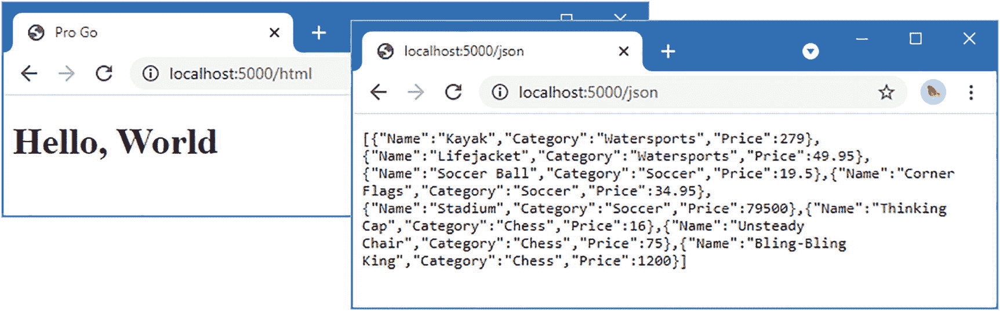
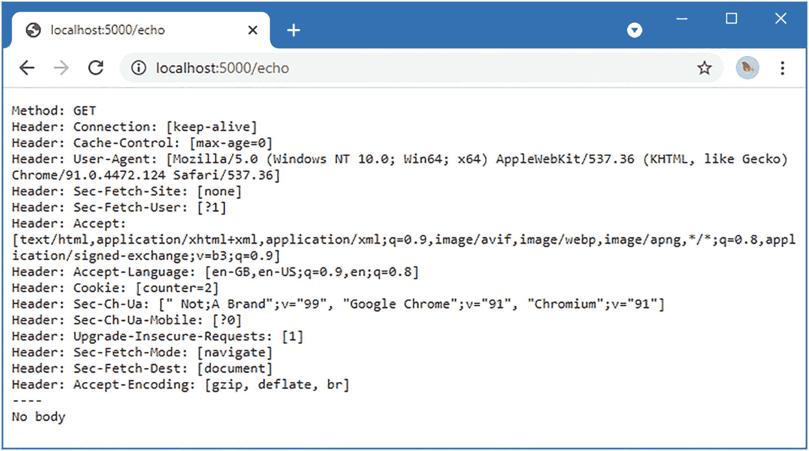

# 25. 创建 HTTP 客户端

在本章中，我将描述用于发起 HTTP 请求的标准库特性，使应用程序能够使用 Web 服务器。表 25-1 阐述了 HTTP 请求的上下文。

**表 25-1** HTTP 客户端上下文说明

| 问题 | 答案 |
| --- | --- |
| 它们是什么？ | HTTP 请求用于从 HTTP 服务器检索数据，例如在第 24 章中创建的服务器。 |
| 它们有何用处？ | HTTP 是使用最广泛的协议之一，常用于提供可呈现给用户的内容以及可通过编程方式消费的数据。 |
| 如何使用？ | 使用 `net/http` 包的特性来创建和发送请求，并处理响应。 |
| 是否存在陷阱或限制？ | 这些特性设计良好且易于使用，尽管某些特性需要按特定顺序使用。 |
| 有哪些替代方案？ | 标准库包含对其他网络协议的支持，也支持打开和使用底层网络连接。有关 `net` 包及其子包（例如实现 SMTP 协议的 `net/smtp`）的详细信息，请参阅 [`https://pkg.go.dev/net@go1.17.1`](https://pkg.go.dev/net%2540go1.17.1)。 |

**表 25-2** 本章概要

| 问题 | 解决方案 | 代码清单 |
| --- | --- | --- |
| 发送 HTTP 请求 | 针对特定 HTTP 方法使用便捷方法 | 8–12 |
| 配置 HTTP 请求 | 使用 `Client` 结构体定义的字段和方法 | 13 |
| 创建预配置的请求 | 使用 `NewRequest` 便捷函数 | 14 |
| 在请求中使用 Cookie | 使用 Cookie jar | 15–18 |
| 配置重定向处理方式 | 使用 `CheckRedirect` 字段注册一个函数来处理重定向 | 19–21 |
| 发送多部分表单 | 使用 `mime/multipart` 包 | 22, 23 |


## 本章准备工作

为准备本章内容，请打开一个新的命令提示符，导航至一个方便的位置，并创建一个名为 `httpclient` 的目录。运行清单 25-1 所示的命令来创建一个模块文件。

**提示：** 你可以从 [`github.com/apress/pro-go`](https://github.com/apress/pro-go) 下载本章及本书所有其他章节的示例项目。如果在运行示例时遇到问题，请参阅第 2 章了解如何获取帮助。

```
go mod init httpclient
```

*清单 25-1：初始化模块*

在 `httpclient` 文件夹中添加一个名为 `printer.go` 的文件，内容如清单 25-2 所示。

```
package main
import "fmt"
func Printfln(template string, values ...interface{}) {
fmt.Printf(template + "\n", values...)
}
```

*清单 25-2：`httpclient` 文件夹中 `printer.go` 文件的内容*

在 `httpclient` 文件夹中添加一个名为 `product.go` 的文件，内容如清单 25-3 所示。

```
package main
type Product struct {
Name, Category string
Price float64
}
var Products = []Product {
{ "Kayak", "Watersports", 279 },
{ "Lifejacket", "Watersports", 49.95 },
{ "Soccer Ball", "Soccer", 19.50 },
{ "Corner Flags", "Soccer", 34.95 },
{ "Stadium", "Soccer", 79500 },
{ "Thinking Cap", "Chess", 16 },
{ "Unsteady Chair", "Chess", 75 },
{ "Bling-Bling King", "Chess", 1200 },
}
```

*清单 25-3：`httpclient` 文件夹中 `product.go` 文件的内容*

在 `httpclient` 文件夹中添加一个名为 `index.html` 的文件，内容如清单 25-4 所示。

```

Pro Go

Hello, World

```

*清单 25-4：`httpclient` 文件夹中 `index.html` 文件的内容*

在 `httpclient` 文件夹中添加一个名为 `server.go` 的文件，内容如清单 25-5 所示。

```
package main
import (
"encoding/json"
"fmt"
"io"
"net/http"
"os"
)
func init() {
http.HandleFunc("/html",
func (writer http.ResponseWriter, request *http.Request) {
http.ServeFile(writer, request, "./index.html")
})
http.HandleFunc("/json",
func (writer http.ResponseWriter, request *http.Request) {
writer.Header().Set("Content-Type", "application/json")
json.NewEncoder(writer).Encode(Products)
})
http.HandleFunc("/echo",
func (writer http.ResponseWriter, request *http.Request) {
writer.Header().Set("Content-Type", "text/plain")
fmt.Fprintf(writer, "Method: %v\n", request.Method)
for header, vals := range request.Header {
fmt.Fprintf(writer, "Header: %v: %v\n", header, vals)
}
fmt.Fprintln(writer, "----")
data, err := io.ReadAll(request.Body)
if (err == nil) {
if len(data) == 0 {
fmt.Fprintln(writer, "No body")
} else {
writer.Write(data)
}
} else {
fmt.Fprintf(os.Stdout,"Error reading body: %v\n", err.Error())
}
})
}
```

*清单 25-5：`httpclient` 文件夹中 `server.go` 文件的内容*

此代码文件中的初始化函数创建了生成 HTML 和 JSON 响应的路由。还有一个路由会在响应中回显请求的详细信息。

在 `httpclient` 文件夹中添加一个名为 `main.go` 的文件，内容如清单 25-6 所示。

```
package main
import (
"net/http"
)
func main() {
Printfln("Starting HTTP Server")
http.ListenAndServe(":5000", nil)
}
```

*清单 25-6：`httpclient` 文件夹中 `main.go` 文件的内容*

在命令提示符中，于 `usingstrings` 文件夹内运行清单 25-7 所示的命令。

```
go run .
```

*清单 25-7：运行示例项目*

### 处理 Windows 防火墙权限请求

如第 24 章所述，每次编译代码时，Windows 防火墙都会提示网络访问权限。为解决此问题，请在项目文件夹中创建一个名为 `buildandrun.ps1` 的文件，内容如下：

```
$file = "./httpclient.exe"
&go build -o $file
if ($LASTEXITCODE -eq 0) {
&$file
}
```

此 PowerShell 脚本每次都编译项目到同一个文件，并在没有错误时执行结果，这意味着你只需授予防火墙访问权限一次。在项目文件夹中运行以下命令来执行该脚本：

```
./buildandrun.ps1
```

你必须每次使用此命令来构建和运行项目，以确保编译输出被写入同一位置。

`httpclient` 文件夹中的代码将被编译并执行。使用网络浏览器请求 `http://localhost:5000/html` 和 `http://localhost:5000/json`，将产生如图 25-1 所示的响应。



*图 25-1：运行示例应用程序*

要查看回显结果，请请求 `http://localhost:5000/echo`，这将产生类似于图 25-2 的输出，不过根据你的操作系统和浏览器，你可能会看到不同的详细信息。



*图 25-2：在响应中回显请求的详细信息*


### 发送简单 HTTP 请求

`net/http` 包提供了一组便捷函数，用于执行基本的 HTTP 请求。这些函数的命名与其创建的 HTTP 请求方法相对应，如表 25-3 所述。

**表 25-3** HTTP 请求便捷方法

| 名称 | 描述 |
| --- | --- |
| `Get(url)` | 该函数向指定的 HTTP 或 HTTPS URL 发送 GET 请求。返回结果为 `Response` 值与一个 `error`，该错误用于报告请求过程中的问题。 |
| `Head(url)` | 该函数向指定的 HTTP 或 HTTPS URL 发送 HEAD 请求。HEAD 请求仅返回 GET 请求会返回的头部信息。返回结果为 `Response` 值与一个 `error`，该错误用于报告请求过程中的问题。 |
| `Post(url, contentType, reader)` | 该函数向指定的 HTTP 或 HTTPS URL 发送 POST 请求，并附带指定的 `Content-Type` 头部值。表单内容由指定的 `Reader` 提供。返回结果为 `Response` 值与一个 `error`，该错误用于报告请求过程中的问题。 |
| `PostForm(url, data)` | 该函数向指定的 HTTP 或 HTTPS URL 发送 POST 请求，并将 `Content-Type` 头部设置为 `application/x-www-form-urlencoded`。表单内容由 `map[string][]string` 提供。返回结果为 `Response` 值与一个 `error`，该错误用于报告请求过程中的问题。 |

清单 25-8 使用了 `Get` 方法向服务器发送一个 GET 请求。服务器在一个 goroutine 中启动，以防止其阻塞，并允许在同一个应用程序内发送 HTTP 请求。这是本章将使用的模式，因为它避免了分离客户端和服务器项目。我使用了第 19 章中描述的 `time.Sleep` 函数，以确保 goroutine 有足够的时间启动服务器。你可能需要根据系统情况增加延迟时间。

```
package main
import (
"net/http"
"os"
"time"
)
func main() {
go http.ListenAndServe(":5000", nil)
time.Sleep(time.Second)
response, err := http.Get("http://localhost:5000/html")
if (err == nil) {
response.Write(os.Stdout)
} else {
Printfln("Error: %v", err.Error())
}
}
清单 25-8
在 httpclient 文件夹的 main.go 文件中发送一个 GET 请求
```

`Get` 函数的参数是一个包含请求 URL 的字符串。返回结果是一个 `Response` 值和一个用于报告发送请求时任何问题的 `error`。

**注意**

表 25-3 中函数返回的 `error` 值用于报告创建和发送请求时的问题，但当服务器返回 HTTP 错误状态码时，该错误不会被使用。

`Response` 结构体描述了 HTTP 服务器发送的响应，并定义了表 25-4 中所示的字段和方法。

**表 25-4** Response 结构体定义的字段和方法

| 名称 | 描述 |
| --- | --- |
| `StatusCode` | 该字段返回响应状态码，以 `int` 类型表示。 |
| `Status` | 该字段返回一个包含状态描述的 `string`。 |
| `Proto` | 该字段返回一个包含响应 HTTP 协议的 `string`。 |
| `Header` | 该字段返回一个包含响应头部的 `map[string][]string`。 |
| `Body` | 该字段返回一个 `ReadCloser`，它是一个定义了 `Close` 方法的 `Reader`，并提供对响应体的访问。 |
| `Trailer` | 该字段返回一个包含响应尾部的 `map[string][]string`。 |
| `ContentLength` | 该字段返回 `Content-Length` 头部的值，解析为 `int64` 类型。 |
| `TransferEncoding` | 该字段返回一组 `Transfer-Encoding` 头部的值。 |
| `Close` | 如果响应包含设置为 `close` 的 `Connection` 头部（表明应关闭 HTTP 连接），此 `bool` 类型字段返回 `true`。 |
| `Uncompressed` | 如果服务器发送了压缩响应，且该响应已被 `net/http` 包解压缩，此字段返回 `true`。 |
| `Request` | 该字段返回用于获取此响应的 `Request`。`Request` 结构体在第 24 章中描述。 |
| `TLS` | 该字段提供 HTTPS 连接的详细信息。 |
| `Cookies()` | 该方法返回一个 `[]*Cookie`，包含响应中的 `Set-Cookie` 头部。`Cookie` 结构体在第 24 章中描述。 |
| `Location()` | 该方法从响应的 `Location` 头部返回 `URL`，以及一个在响应不包含此头部时指示错误的 `error`。 |
| `Write(writer)` | 该方法将响应摘要写入指定的 `Writer`。 |

我在清单 25-8 中使用了 `Write` 方法，它会输出响应摘要。编译并执行项目，你将会看到类似于下面的输出，但头部值可能不同：

```
HTTP/1.1 200 OK
Content-Length: 182
Accept-Ranges: bytes
Content-Type: text/html; charset=utf-8
Date: Sat, 25 Sep 2021 08:23:21 GMT
Last-Modified: Sat, 25 Sep 2021 06:51:09 GMT

Pro Go

Hello, World

```

当你只是想查看响应时，`Write` 方法很方便，但大多数项目会检查状态码以确保请求成功，然后读取响应体，如清单 25-9 所示。

```
package main
import (
"net/http"
"os"
"time"
"io"
)
func main() {
go http.ListenAndServe(":5000", nil)
time.Sleep(time.Second)
response, err := http.Get("http://localhost:5000/html")
if (err == nil && response.StatusCode == http.StatusOK) {
data, err := io.ReadAll(response.Body)
if (err == nil) {
defer response.Body.Close()
os.Stdout.Write(data)
}
} else {
Printfln("Error: %v, Status Code: %v", err.Error(), response.StatusCode)
}
}
清单 25-9
在 httpclient 文件夹的 main.go 文件中读取响应体
```

我使用了 `io` 包中定义的 `ReadAll` 函数，将响应 `Body` 读取到一个 `byte` 切片中，然后将其写入标准输出。编译并执行项目，你将会看到以下输出，显示了 HTTP 服务器发送的响应体内容：

```

Pro Go

Hello, World

```

当响应包含数据（如 JSON）时，可以将它们解析为 Go 值，如清单 25-10 所示。

```
package main
import (
"net/http"
//"os"
"time"
//"io"
"encoding/json"
)
func main() {
go http.ListenAndServe(":5000", nil)
time.Sleep(time.Second)
response, err := http.Get("http://localhost:5000/json")
if (err == nil && response.StatusCode == http.StatusOK) {
defer response.Body.Close()
data := []Product {}
err = json.NewDecoder(response.Body).Decode(&data)
if (err == nil) {
for _, p := range data {
Printfln("Name: %v, Price: $%.2f", p.Name, p.Price)
}
} else {
Printfln("Decode error: %v", err.Error())
}
} else {
Printfln("Error: %v, Status Code: %v", err.Error(), response.StatusCode)
}
}
清单 25-10
在 httpclient 文件夹的 main.go 文件中读取并解析数据
```

JSON 数据使用第 21 章中描述的 `encoding/json` 包进行解码。数据被解码为一个 `Product` 切片，并通过 `for` 循环进行枚举，当项目编译并执行时，将产生以下输出：

```
Name: Kayak, Price: $279.00
Name: Lifejacket, Price: $49.95
Name: Soccer Ball, Price: $19.50
Name: Corner Flags, Price: $34.95
Name: Stadium, Price: $79500.00
Name: Thinking Cap, Price: $16.00
Name: Unsteady Chair, Price: $75.00
Name: Bling-Bling King, Price: $1200.00
```


## 发送 POST 请求

`Post` 和 `PostForm` 函数用于发送 POST 请求。`PostForm` 函数会将值的映射编码为表单数据，如代码清单 25-11 所示。

```
package main
import (
"net/http"
"os"
"time"
"io"
//"encoding/json"
)
func main() {
go http.ListenAndServe(":5000", nil)
time.Sleep(time.Second)
formData := map[string][]string {
"name":  { "Kayak "},
"category": { "Watersports"},
"price":  { "279"},
}
response, err := http.PostForm("http://localhost:5000/echo", formData)
if (err == nil && response.StatusCode == http.StatusOK) {
io.Copy(os.Stdout, response.Body)
defer response.Body.Close()
} else {
Printfln("Error: %v, Status Code: %v", err.Error(), response.StatusCode)
}
}
代码清单 25-11
在 httpclient 文件夹的 main.go 文件中发送表单
```

HTML 表单支持每个键对应多个值，这就是映射中值为字符串切片的原因。在代码清单 25-11 中，我为表单的每个键只发送了一个值，但仍需将该值括在大括号中以创建一个切片。`PostForm` 函数对映射进行编码，将数据添加到请求体中，并将 `Content-Type` 标头设置为 `application/x-www-form-urlencoded`。该表单被发送到 `/echo` URL，该 URL 简单地将在响应中收到的服务器请求原样返回。编译并执行该项目，你将看到以下输出：

```
Method: POST
Header: User-Agent: [Go-http-client/1.1]
Header: Content-Length: [42]
Header: Content-Type: [application/x-www-form-urlencoded]
Header: Accept-Encoding: [gzip]

category=Watersports&name=Kayak+&price=279
```

#### 使用 Reader 发布表单

`Post` 函数向服务器发送 POST 请求，并通过从 `Reader` 中读取内容来创建请求体，如代码清单 25-12 所示。与 `PostForm` 函数不同，数据不必编码为表单格式。

```
package main
import (
"net/http"
"os"
"time"
"io"
"encoding/json"
"strings"
)
func main() {
go http.ListenAndServe(":5000", nil)
time.Sleep(time.Second)
var builder strings.Builder
err := json.NewEncoder(&builder).Encode(Products[0])
if (err == nil) {
response, err := http.Post("http://localhost:5000/echo",
"application/json",
strings.NewReader(builder.String()))
if (err == nil && response.StatusCode == http.StatusOK) {
io.Copy(os.Stdout, response.Body)
defer response.Body.Close()
} else {
Printfln("Error: %v", err.Error())
}
} else {
Printfln("Error: %v", err.Error())
}
}
代码清单 25-12
在 httpclient 文件夹的 main.go 文件中从 Reader 发布数据
```

此示例将代码清单 25-12 中定义的 `Product` 值切片的第一个元素编码为 JSON，准备数据以便其能够作为 `Reader` 进行处理。`Post` 函数的参数分别是请求发送到的 URL、`Content-Type` 标头的值以及 `Reader`。编译并执行该项目，你将看到回显的请求数据：

```
Method: POST
Header: User-Agent: [Go-http-client/1.1]
Header: Content-Length: [54]
Header: Content-Type: [application/json]
Header: Accept-Encoding: [gzip]

{"Name":"Kayak","Category":"Watersports","Price":279}
```

#### 理解 Content-Length 标头

如果检查代码清单 25-11 和代码清单 25-12 发送的请求，你会发现它们都包含一个 `Content-Length` 标头。此标头会自动设置，但仅当可以预先确定请求体中包含多少数据时，才会包含在请求中。这是通过检查 `Reader` 以确定动态类型来实现的。当数据使用 `strings.Reader`、`bytes.Reader` 或 `bytes.Buffer` 类型存储在内存中时，会使用内置的 `len` 函数来确定数据量，并使用结果来设置 `Content-Length` 标头。

对于所有其他类型，`Content-Type` 标头不会设置，而是使用*分块编码*，这意味着请求体以数据块的形式写入，其大小作为请求体的一部分声明。这种方法允许发送请求，而无需为了计算有多少字节而读取 `Reader` 中的所有数据。分块编码的描述参见 [`https://developer.mozilla.org/en-US/docs/Web/HTTP/Headers/Transfer-Encoding`](https://developer.mozilla.org/en-US/docs/Web/HTTP/Headers/Transfer-Encoding)。


### 配置 HTTP 客户端请求

当需要对 HTTP 请求进行精细控制时，可使用 `Client` 结构体，它定义了表 25-5 所示的字段和方法。

**表 25-5** `Client` 字段和方法

| 名称 | 描述 |
| --- | --- |
| `Transport` | 该字段用于选择发送 HTTP 请求时将使用的传输层。`net/http` 包提供了一个默认的传输层。 |
| `CheckRedirect` | 该字段用于指定处理重复重定向的自定义策略，详见"管理重定向"一节。 |
| `Jar` | 该字段返回一个 `CookieJar`，用于管理 Cookie，详见"使用 Cookie"一节。 |
| `Timeout` | 该字段用于设置请求的超时时间，以 `time.Duration` 类型指定。 |
| `Do(request)` | 此方法发送指定的 `Request`，返回 `Response` 和一个指示发送请求问题的 `error`。 |
| `CloseIdleConnections()` | 此方法关闭当前打开但未使用的空闲 HTTP 请求。 |
| `Get(url)` | 此方法由表 25-3 中描述的 `Get` 函数调用。 |
| `Head(url)` | 此方法由表 25-3 中描述的 `Head` 函数调用。 |
| `Post(url, contentType, reader)` | 此方法由表 25-3 中描述的 `Post` 函数调用。 |
| `PostForm(url, data)` | 此方法由表 25-3 中描述的 `PostForm` 函数调用。 |

`net/http` 包定义了 `DefaultClient` 变量，它提供了一个默认的 `Client`，可用于使用表 25-5 中描述的字段和方法。当使用表 25-3 中描述的函数时，实际使用的就是该变量。

描述 HTTP 请求的 `Request` 结构体与第 24 章中用于 HTTP 服务器的结构体相同。表 25-6 描述了对于客户端请求最常用的 `Request` 字段和方法。

**表 25-6** 有用的 `Request` 字段和方法

| 名称 | 描述 |
| --- | --- |
| `Method` | 此 `string` 字段指定将用于请求的 HTTP 方法。`net/http` 包为 HTTP 方法定义了常量，如 `MethodGet` 和 `MethodPost`。 |
| `URL` | 此 `URL` 字段指定将发送请求的目标 URL。`URL` 结构体在第 24 章中定义。 |
| `Header` | 该字段用于指定请求的头部信息。头部以 `map[string][]string` 形式指定，当使用字面量结构体语法创建 `Request` 值时，该字段将为 `nil`。 |
| `ContentLength` | 该字段用于使用 `int64` 类型的值设置 `Content-Length` 头部。 |
| `TransferEncoding` | 该字段用于使用字符串切片设置 `Transfer-Encoding` 头部。 |
| `Body` | 此 `ReadCloser` 字段指定请求体的来源。如果你有一个没有定义 `Close` 方法的 `Reader`，则可以使用 `io.NopCloser` 函数创建一个 `Close` 方法不执行任何操作的 `ReadCloser`。 |

创建 `URL` 值的最简单方法是使用 `net/url` 包提供的 `Parse` 函数，该函数解析一个字符串，表 25-7 提供了快速参考。

**表 25-7** 用于解析 URL 值的函数

| 名称 | 描述 |
| --- | --- |
| `Parse(string)` | 此方法将一个 `string` 解析为 `URL`。返回结果为 `URL` 值和一个指示解析字符串问题的 `error`。 |

清单 25-13 结合了上述表格中描述的功能，创建了一个简单的 HTTP POST 请求。

```go
package main
import (
"net/http"
"os"
"time"
"io"
"encoding/json"
"strings"
"net/url"
)
func main() {
go http.ListenAndServe(":5000", nil)
time.Sleep(time.Second)
var builder strings.Builder
err := json.NewEncoder(&builder).Encode(Products[0])
if (err == nil) {
reqURL, err := url.Parse("http://localhost:5000/echo")
if (err == nil) {
req := http.Request {
Method: http.MethodPost,
URL: reqURL,
Header: map[string][]string {
"Content-Type": { "application.json" },
},
Body: io.NopCloser(strings.NewReader(builder.String())),
}
response, err := http.DefaultClient.Do(&req)
if (err == nil && response.StatusCode == http.StatusOK) {
io.Copy(os.Stdout, response.Body)
defer response.Body.Close()
} else {
Printfln("Request Error: %v", err.Error())
}
} else {
Printfln("Parse Error: %v", err.Error())
}
} else {
Printfln("Encoder Error: %v", err.Error())
}
}
```

该清单使用字面量语法创建了一个新的请求，然后设置了 `Method`、`URL` 和 `Body` 字段。设置方法以便发送 POST 请求，使用 `Parse` 函数创建 `URL`，并使用 `io.NopCloser` 函数设置 `Body` 字段，该函数接受一个 `Reader` 并返回一个 `ReadCloser`，这是 `Request` 结构体所需的类型。`Header` 字段被分配了一个定义了 `Content-Type` 头部的映射。`Request` 的指针被传递给赋给 `DefaultClient` 变量的 `Client` 的 `Do` 方法，该方法发送请求。

此示例使用了本章开头设置的 `/echo` URL，该 URL 会在响应中回显服务器收到的请求。编译并执行该项目，你将看到以下输出：

```
Method: POST
Header: Content-Type: [application.json]
Header: Accept-Encoding: [gzip]
Header: User-Agent: [Go-http-client/1.1]

{"Name":"Kayak","Category":"Watersports","Price":279}
```


好的，作为一名高级文档工程师和翻译员，我将严格遵循您提供的注意事项，对给定的英文文本进行专业、准确的中文翻译。


## 使用便捷函数创建请求

之前的示例演示了可以使用结构体字面量语法来创建 `Request` 值，但 `net/http` 包也提供了一些便捷函数来简化流程，如表 25-8 所述。

**表 25-8** 用于创建请求的 net/http 便捷函数

| 名称 | 描述 |
| --- | --- |
| `NewRequest(method, url, reader)` | 此函数创建一个新的 `Reader`，并使用指定的方法、URL 和请求体进行配置。该函数还返回一个错误，用于指示创建值（包括解析以 `string` 形式表示的 URL）时出现的问题。 |
| `NewRequestWithContext(context, method, url, reader)` | 此函数创建一个新的 `Reader`，该 `Reader` 将在指定的上下文中发送。上下文将在第 30 章中描述。 |

清单 25-14 使用 `NewRequest` 函数（而非字面量语法）来创建一个 `Request`。

```go
package main

import (
	"net/http"
	"os"
	"time"
	"io"
	"encoding/json"
	"strings"
	//"net/url"
)

func main() {
	go http.ListenAndServe(":5000", nil)
	time.Sleep(time.Second)

	var builder strings.Builder
	err := json.NewEncoder(&builder).Encode(Products[0])
	if err == nil {
		req, err := http.NewRequest(http.MethodPost, "http://localhost:5000/echo",
			io.NopCloser(strings.NewReader(builder.String())))
		if err == nil {
			req.Header["Content-Type"] = []string{"application/json"}
			response, err := http.DefaultClient.Do(req)
			if err == nil && response.StatusCode == http.StatusOK {
				io.Copy(os.Stdout, response.Body)
				defer response.Body.Close()
			} else {
				Printfln("Request Error: %v", err.Error())
			}
		} else {
			Printfln("Request Init Error: %v", err.Error())
		}
	} else {
		Printfln("Encoder Error: %v", err.Error())
	}
}
```

*清单 25-14：在 httpclient 文件夹的 main.go 文件中使用便捷函数*

结果是相同的——一个可以传递给 `Client.Do` 方法的 `Request`，但我不需要显式解析 URL。 `NewRequest` 函数会初始化 `Header` 字段，因此我可以直接添加 `Content-Type` 标头，而无需先创建映射。编译并执行项目，你将看到发送到服务器的请求详情：

```
Method: POST
Header: User-Agent: [Go-http-client/1.1]
Header: Content-Type: [application/json]
Header: Accept-Encoding: [gzip]

{"Name":"Kayak","Category":"Watersports","Price":279}
```

### 处理 Cookie

`Client` 会跟踪它从服务器接收到的 cookie，并自动将其包含在后续请求中。为了进行准备，请在 `httpclient` 文件夹中添加一个名为 `server_cookie.go` 的文件，其内容如清单 25-15 所示。

```go
package main

import (
	"net/http"
	"strconv"
	"fmt"
)

func init() {
	http.HandleFunc("/cookie",
		func(writer http.ResponseWriter, request *http.Request) {
			counterVal := 1
			counterCookie, err := request.Cookie("counter")
			if err == nil {
				counterVal, _ = strconv.Atoi(counterCookie.Value)
				counterVal++
			}
			http.SetCookie(writer, &http.Cookie{
				Name: "counter", Value: strconv.Itoa(counterVal),
			})
			if len(request.Cookies()) > 0 {
				for _, c := range request.Cookies() {
					fmt.Fprintf(writer, "Cookie Name: %v, Value: %v\n",
						c.Name, c.Value)
				}
			} else {
				fmt.Fprintln(writer, "Request contains no cookies")
			}
		})
}
```

*清单 25-15：httpclient 文件夹中 server_cookie.go 文件的内容*

新路由设置并读取一个名为 `counter` 的 cookie，使用的是第 24 章其中一个示例中的代码。清单 25-16 更新了客户端请求以使用新 URL。

```go
package main

import (
	"net/http"
	"os"
	"time"
	"io"
	// "encoding/json"
	// "strings"
	//"net/url"
	"net/http/cookiejar"
)

func main() {
	go http.ListenAndServe(":5000", nil)
	time.Sleep(time.Second)

	jar, err := cookiejar.New(nil)
	if err == nil {
		http.DefaultClient.Jar = jar
	}

	for i := 0; i < 3; i++ {
		req, err := http.NewRequest(http.MethodGet,
			"http://localhost:5000/cookie", nil)
		if err == nil {
			response, err := http.DefaultClient.Do(req)
			if err == nil && response.StatusCode == http.StatusOK {
				io.Copy(os.Stdout, response.Body)
				defer response.Body.Close()
			} else {
				Printfln("Request Error: %v", err.Error())
			}
		} else {
			Printfln("Request Init Error: %v", err.Error())
		}
	}
}
```

*清单 25-16：在 httpclient 文件夹的 main.go 文件中更改 URL*

默认情况下，`Client` 值会忽略 cookie，这是一个明智的策略，因为一个响应中设置的 cookie 会影响后续请求，这可能会导致意外结果。要选择跟踪 cookie，需要将 `Jar` 字段设置为 `net/http/CookieJar` 接口的一个实现，该接口定义了表 25-9 中描述的方法。

**表 25-9** CookieJar 接口定义的方法

| 名称 | 描述 |
| --- | --- |
| `SetCookies(url, cookies)` | 此方法为指定的 URL 存储一个 `*Cookie` 切片。 |
| `Cookies(url)` | 此方法返回一个 `*Cookie` 切片，其中包含应对指定 URL 的请求中包含的 cookie。 |

`net/http/cookiejar` 包包含一个 `CookieJar` 接口的实现，该实现将 cookie 存储在内存中。Cookie jar 使用构造函数创建，如表 25-10 所述。

**表 25-10** net/http/cookiejar 包中的 Cookie Jar 构造函数

| 名称 | 描述 |
| --- | --- |
| `New(options)` | 此函数创建一个新的 `CookieJar`，并使用 `Options` 结构体进行配置，该结构体将在下文描述。该函数还会返回一个 `error`，用于报告创建 jar 时出现的问题。 |

`New` 函数接受一个 `net/http/cookiejar/Options` 结构体，用于配置 cookie jar。只有一个 `Options` 字段 `PublicSuffixList`，用于指定具有相同名称的接口的实现，该接口提供支持以防止 cookie 被设置得过于广泛，这可能导致隐私侵犯。标准库不包含 `PublicSuffixList` 接口的实现，但在 [`https://pkg.go.dev/golang.org/x/net/publicsuffix`](https://pkg.go.dev/golang.org/x/net/publicsuffix) 上有一个可用的实现。

在清单 25-16 中，我使用 `nil` 调用了 `New` 函数，这意味着没有使用 `PublicSuffixList` 的实现，然后将 `CookieJar` 分配给赋给 `DefaultClient` 变量的 `Client` 的 `Jar` 字段。编译并执行项目，你将看到以下输出：

```
Request contains no cookies
Cookie Name: counter, Value: 1
Cookie Name: counter, Value: 2
```

清单 25-16 中的代码发送了三个 HTTP 请求。第一个请求不包含 cookie，但服务器在响应中包含了一个。该 cookie 被包含在第二个和第三个请求中，这使得服务器能够读取并递增其中包含的值。

请注意，在清单 25-16 中，我不必管理 cookie。只需设置 cookie jar 即可，`Client` 会自动跟踪 cookie。


### 创建独立的客户端和 Cookie Jar

使用 `DefaultClient` 的一个后果是所有请求共享相同的 cookie，这很有用，尤其是因为 Cookie Jar 会确保每个请求只包含该 URL 所需的 cookie。

如果你不想共享 cookie，那么你可以创建一个拥有自己 Cookie Jar 的 `Client`，如清单 25-17 所示。

```
package main
import (
"net/http"
"os"
"time"
"io"
//"encoding/json"
//"strings"
//"net/url"
"net/http/cookiejar"
"fmt"
)
func main() {
go http.ListenAndServe(":5000", nil)
time.Sleep(time.Second)
clients := make([]http.Client, 3)
for index, client := range clients {
jar, err := cookiejar.New(nil)
if (err == nil) {
client.Jar = jar
}
for i := 0; i < 3; i++ {
req, err := http.NewRequest(http.MethodGet,
"http://localhost:5000/cookie", nil)
if (err == nil) {
response, err := client.Do(req)
if (err == nil && response.StatusCode == http.StatusOK) {
fmt.Fprintf(os.Stdout, "Client %v: ", index)
io.Copy(os.Stdout, response.Body)
defer response.Body.Close()
}  else {
Printfln("Request Error: %v", err.Error())
}
} else {
Printfln("Request Init Error: %v", err.Error())
}
}
}
}
```

此示例创建了三个独立的 `Client` 值，每个都有其自己的 `CookieJar`。每个 `Client` 发送三个请求，编译并执行该项目时，代码产生以下输出：

```
Client 0: Request contains no cookies
Client 0: Cookie Name: counter, Value: 1
Client 0: Cookie Name: counter, Value: 2
Client 1: Request contains no cookies
Client 1: Cookie Name: counter, Value: 1
Client 1: Cookie Name: counter, Value: 2
Client 2: Request contains no cookies
Client 2: Cookie Name: counter, Value: 1
Client 2: Cookie Name: counter, Value: 2
```

如果需要多个 `Client` 值但希望共享 cookie，则可以使用单个 `CookieJar`，如清单 25-18 所示。

```
package main
import (
"net/http"
"os"
"io"
"time"
//"encoding/json"
//"strings"
//"net/url"
"net/http/cookiejar"
"fmt"
)
func main() {
go http.ListenAndServe(":5000", nil)
time.Sleep(time.Second)
jar, err := cookiejar.New(nil)
clients := make([]http.Client, 3)
for index, client := range clients {
//jar, err := cookiejar.New(nil)
if (err == nil) {
client.Jar = jar
}
for i := 0; i < 3; i++ {
req, err := http.NewRequest(http.MethodGet,
"http://localhost:5000/cookie", nil)
if (err == nil) {
response, err := client.Do(req)
if (err == nil && response.StatusCode == http.StatusOK) {
fmt.Fprintf(os.Stdout, "Client %v: ", index)
io.Copy(os.Stdout, response.Body)
defer response.Body.Close()
}  else {
Printfln("Request Error: %v", err.Error())
}
} else {
Printfln("Request Init Error: %v", err.Error())
}
}
}
}
```

一个 `Client` 接收到的 cookie 会在后续请求中使用，如下面编译并执行项目时产生的输出所示：

```
Client 0: Request contains no cookies
Client 0: Cookie Name: counter, Value: 1
Client 0: Cookie Name: counter, Value: 2
Client 1: Cookie Name: counter, Value: 3
Client 1: Cookie Name: counter, Value: 4
Client 1: Cookie Name: counter, Value: 5
Client 2: Cookie Name: counter, Value: 6
Client 2: Cookie Name: counter, Value: 7
Client 2: Cookie Name: counter, Value: 8
```

### 管理重定向

默认情况下，一个 `Client` 在十次请求后会停止跟随重定向，但这可以通过指定自定义策略来更改。在 `httpclient` 文件夹中添加一个名为 `server_redirects.go` 的文件，其内容如清单 25-19 所示。

```
package main
import "net/http"
func init() {
http.HandleFunc("/redirect1",
func (writer http.ResponseWriter, request *http.Request) {
http.Redirect(writer, request, "/redirect2",
http.StatusTemporaryRedirect)
})
http.HandleFunc("/redirect2",
func (writer http.ResponseWriter, request *http.Request) {
http.Redirect(writer, request, "/redirect1",
http.StatusTemporaryRedirect)
})
}
```

重定向会持续进行，直到客户端停止跟随它们。清单 25-20 创建了一个请求，该请求发送到由清单 25-19 中定义的第一条路由处理的 URL。

```
package main
import (
"net/http"
"os"
"io"
"time"
//"encoding/json"
//"strings"
//"net/url"
//"net/http/cookiejar"
//"fmt"
)
func main() {
go http.ListenAndServe(":5000", nil)
time.Sleep(time.Second)
req, err := http.NewRequest(http.MethodGet,
"http://localhost:5000/redirect1", nil)
if (err == nil) {
var response *http.Response
response, err = http.DefaultClient.Do(req)
if (err == nil) {
io.Copy(os.Stdout, response.Body)
} else {
Printfln("Request Error: %v", err.Error())
}
} else {
Printfln("Error: %v", err.Error())
}
}
```

编译并执行该项目，你将看到一个错误，该错误在十次请求后阻止 `Client` 跟随重定向：

```
Request Error: Get "/redirect1": stopped after 10 redirects
```

自定义策略通过向 `Client.CheckRedirect` 字段分配一个函数来定义，如清单 25-21 所示。

```
package main
import (
"net/http"
"os"
"io"
"time"
//"encoding/json"
//"strings"
"net/url"
//"net/http/cookiejar"
//"fmt"
)
func main() {
go http.ListenAndServe(":5000", nil)
time.Sleep(time.Second)
http.DefaultClient.CheckRedirect = func(req *http.Request,
previous []*http.Request) error {
if len(previous) == 3 {
url, _ := url.Parse("http://localhost:5000/html")
req.URL =   url
}
return nil
}
req, err := http.NewRequest(http.MethodGet,
"http://localhost:5000/redirect1", nil)
if (err == nil) {
var response *http.Response
response, err = http.DefaultClient.Do(req)
if (err == nil) {
io.Copy(os.Stdout, response.Body)
} else {
Printfln("Request Error: %v", err.Error())
}
} else {
Printfln("Error: %v", err.Error())
}
}
```

该函数的参数是一个指向即将执行的 `Request` 的指针，以及一个包含导致重定向的请求的 `*Request` 切片。这意味着该切片将至少包含一个值，因为仅当服务器返回重定向响应时才会调用 `CheckRedirect`。

`CheckRedirect` 函数可以通过返回一个 `error` 来阻止请求，该错误随后作为 `Do` 方法的结果返回。或者 `CheckRedirect` 函数可以更改即将发出的请求，这正是清单 25-21 中所做的。当一个请求导致三次重定向时，自定义策略会更改 `URL` 字段，使 `Request` 指向本章前面设置的 `/html` URL，从而产生 HTML 结果。

结果是，对 `/redirect1` URL 的请求将导致在 `/redirect2` 和 `/redirect1` 之间进行短暂的重定向循环，然后策略更改 URL，产生以下输出：

```

Pro Go

Hello, World

```


### 创建多部分表单

`mime/multipart` 包可用于创建编码为 `multipart/form-data` 的请求体，这使得表单能够安全地包含二进制数据，例如文件内容。在 `httpclient` 文件夹中创建一个名为 `server_forms.go` 的文件，内容如清单 25-22 所示。

```
package main
import (
"net/http"
"fmt"
"io"
)
func init() {
http.HandleFunc("/form",
func (writer http.ResponseWriter, request *http.Request) {
err := request.ParseMultipartForm(10000000)
if (err == nil) {
for name, vals := range request.MultipartForm.Value {
fmt.Fprintf(writer, "Field %v: %v\n", name, vals)
}
for name, files := range request.MultipartForm.File {
for _, file := range files {
fmt.Fprintf(writer, "File %v: %v\n", name, file.Filename)
if f, err := file.Open(); err == nil {
defer f.Close()
io.Copy(writer, f)
}
}
}
} else {
fmt.Fprintf(writer, "Cannot parse form %v", err.Error())
}
})
}
清单 25-22
httpclient 文件夹中 server_forms.go 文件的内容
```

新的处理函数使用了第 24 章中描述的功能来解析多部分表单，并回显其包含的字段和文件。

要在客户端创建表单，需要使用 `multipart.Writer` 结构体，它是 `io.Writer` 的一个包装器，并通过表 25-11 中描述的构造函数创建。

表 25-11

`multipart.Writer` 构造函数

| 名称 | 描述 |
| --- | --- |
| `NewWriter(writer)` | 此函数创建一个新的 `multipart.Writer`，它将表单数据写入指定的 `io.Writer`。 |

一旦有了可用的 `multipart.Writer`，就可以使用表 25-12 中描述的方法来创建表单内容。

表 25-12

`multipart.Writer` 方法

| 名称 | 描述 |
| --- | --- |
| `CreateFormField(fieldname)` | 此方法创建一个具有指定名称的新表单字段。返回结果是一个用于写入字段数据的 `io.Writer` 和一个报告创建字段时出现问题的 `error`。 |
| `CreateFormFile(fieldname, filename)` | 此方法创建一个具有指定字段名称和文件名的新文件字段。返回结果是一个用于写入字段数据的 `io.Writer` 和一个报告创建字段时出现问题的 `error`。 |
| `FormDataContentType()` | 此方法返回一个 `string`，用于设置 `Content-Type` 请求标头，其中包含表示表单各部分之间边界的字符串。 |
| `Close()` | 此函数完成表单的创建，并写入表示表单数据结束的终止边界。 |

还定义了其他方法，可以对表单的构建方式进行精细控制，但表 25-12 中的方法对于大多数项目来说最为有用。清单 25-23 使用这些方法创建了一个发送到服务器的多部分表单。

```
package main
import (
"net/http"
"os"
"io"
"time"
//"encoding/json"
//"strings"
//"net/url"
//"net/http/cookiejar"
//"fmt"
"mime/multipart"
"bytes"
)
func main() {
go http.ListenAndServe(":5000", nil)
time.Sleep(time.Second)
var buffer bytes.Buffer
formWriter := multipart.NewWriter(&buffer)
fieldWriter, err := formWriter.CreateFormField("name")
if (err == nil) {
io.WriteString(fieldWriter, "Alice")
}
fieldWriter, err = formWriter.CreateFormField("city")
if (err == nil) {
io.WriteString(fieldWriter, "New York")
}
fileWriter, err := formWriter.CreateFormFile("codeFile", "printer.go")
if (err == nil) {
fileData, err := os.ReadFile("./printer.go")
if (err == nil) {
fileWriter.Write(fileData)
}
}
formWriter.Close()
req, err := http.NewRequest(http.MethodPost,
"http://localhost:5000/form", &buffer)
req.Header["Content-Type"] = []string{ formWriter.FormDataContentType()}
if (err == nil) {
var response *http.Response
response, err = http.DefaultClient.Do(req)
if (err == nil) {
io.Copy(os.Stdout, response.Body)
} else {
Printfln("Request Error: %v", err.Error())
}
} else {
Printfln("Error: %v", err.Error())
}
}
清单 25-23
在 httpclient 文件夹的 main.go 文件中创建并发送多部分表单
```

创建表单需要特定的顺序。首先，调用 `NewWriter` 函数获取一个 `multipart.Writer`：

```
...
var buffer bytes.Buffer
formWriter := multipart.NewWriter(&buffer)
...
```

需要使用 `Reader` 来将表单数据作为 HTTP 请求的请求体，但创建表单则需要 `Writer`。这是使用 `bytes.Buffer` 结构体的理想场景，它提供了 `Reader` 和 `Writer` 接口的内存实现。

创建 `multipart.Writer` 后，即可使用 `CreateFormField` 和 `CreateFormFile` 方法向表单添加字段和文件：

```
...
fieldWriter, err := formWriter.CreateFormField("name")
...
fileWriter, err := formWriter.CreateFormFile("codeFile", "printer.go")
...
```

这两个方法都返回一个 `Writer`，用于向表单写入内容。添加完字段和文件后，下一步是使用 `FormDataContentType` 方法的结果来设置 `Content-Type` 标头：

```
...
req.Header["Content-Type"] = []string{ formWriter.FormDataContentType()}
...
```

该方法返回的结果包含了用于表示表单各部分之间边界的字符串。最后一步（这一步很容易忘记）是调用 `multipart.Writer` 的 `Close` 方法，它会向表单添加一个最终的边界字符串。

**警告**

不要在调用 `Close` 方法时使用 `defer` 关键字；否则，最终的边界字符串会在请求发送之后才添加到表单中，从而生成一个并非所有服务器都能处理的表单。务必在发送请求之前调用 `Close` 方法。

编译并执行项目，你将看到多部分表单的内容在服务器响应中被回显：

```
Field city: [New York]
Field name: [Alice]
File codeFile: printer.go
package main
import "fmt"
func Printfln(template string, values ...interface{}) {
fmt.Printf(template + "\n", values...)
}
```

## 总结

在本章中，我介绍了用于发送 HTTP 请求的标准库功能，解释了如何使用不同的 HTTP 动词、如何发送表单以及如何处理诸如 cookies 之类的问题。在下一章中，我将向您展示 Go 标准库如何提供对数据库操作的支持。


