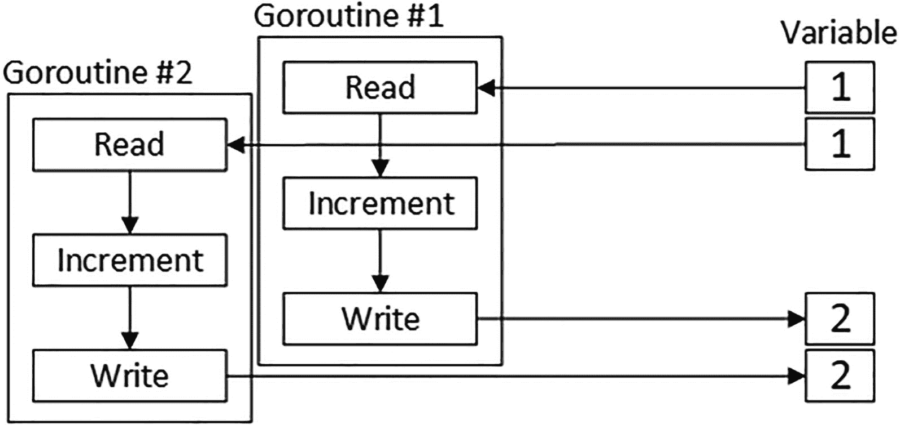
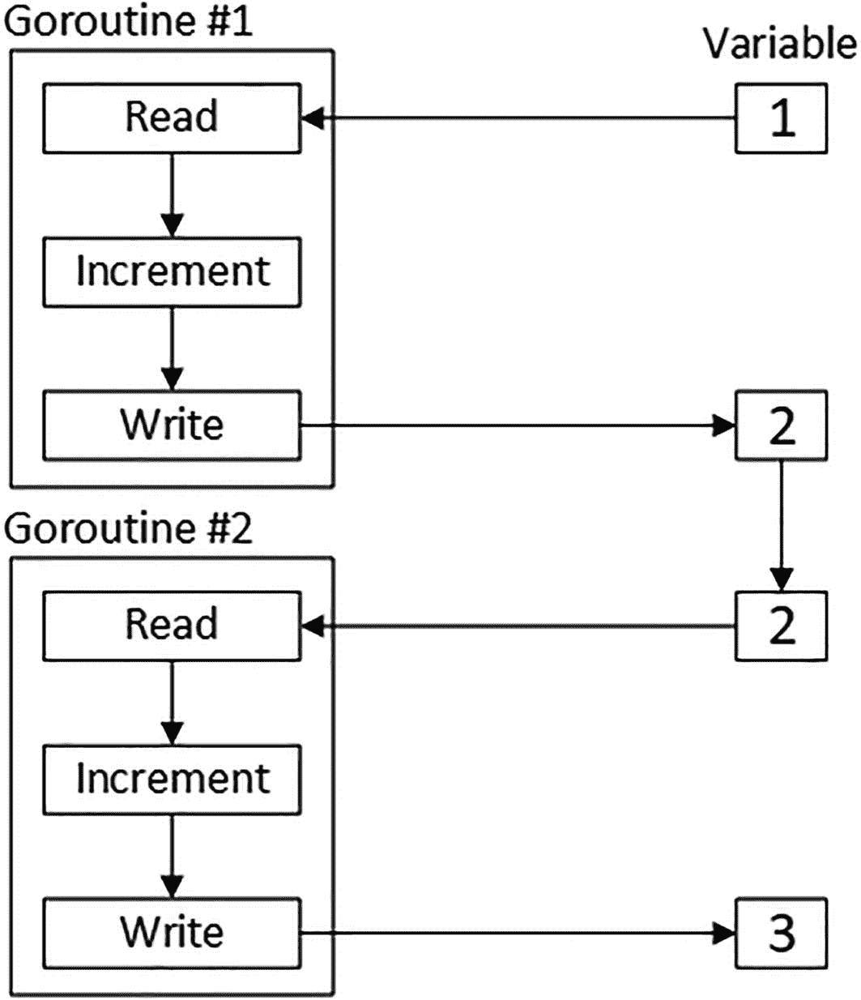

# 30. 协调 Goroutine

在本章中，我将介绍 Go 标准库中用于协调 goroutine 的包及其特性。表 30-1 展示了本章所述特性的上下文。

**表 30-1** 将协调 Goroutine 的特性置于上下文中

| 问题 | 答案 |
| --- | --- |
| 这些是什么？ | 当应用程序使用多个 goroutine 时，这些特性非常有用。 |
| 为什么它们有用？ | 当 goroutine 共享数据，或当在服务器中使用一个 goroutine 跨多个 API 组件处理请求时，goroutine 的使用会变得复杂。 |
| 如何使用它们？ | `sync` 包提供了管理 goroutine 的类型和函数，包括确保对数据的独占访问。`context` 包提供了用于支持服务器处理请求的特性，这通常通过 goroutine 完成。 |
| 是否有任何陷阱或局限性？ | 这些是高级特性，应谨慎使用。 |
| 是否有替代方案？ | 并非所有应用程序都需要这些特性，特别是如果它们使用不共享数据的 goroutine。 |

表 30-2 总结了本章内容。

**表 30-2** 本章总结

| 问题 | 解决方案 | 清单 |
| --- | --- | --- |
| 等待一个或多个 goroutine 完成 | 使用等待组 | 5, 6 |
| 防止多个 goroutine 同时访问数据 | 使用互斥锁 | 7–10 |
| 等待某个事件发生 | 使用条件变量 | 11, 12 |
| 确保函数只执行一次 | 使用 `Once` 结构体 | 13 |
| 为跨服务器 API 边界处理的请求提供上下文 | 使用上下文 | 14–17 |


## 准备工作

要开始准备本章内容，请打开一个新的命令提示符窗口，导航到一个方便的位置，并创建一个名为 `coordination` 的目录。然后在 `coordination` 文件夹中运行如代码清单 30-1 所示的命令，以创建一个模块文件。

> **提示**  
> 你可以从 [`https://github.com/apress/pro-go`](https://github.com/apress/pro-go) 下载本章——以及本书其他所有章节——的示例项目。如果在运行示例时遇到问题，请参阅第 2 章了解如何获取帮助。

```
go mod init coordination
代码清单 30-1
初始化模块
```

在 `coordination` 文件夹中添加一个名为 `printer.go` 的文件，其内容如代码清单 30-2 所示。

```
package main
import "fmt"
func Printfln(template string, values ...interface{}) {
fmt.Printf(template + "\n", values...)
}
代码清单 30-2
coordination 文件夹中 printer.go 文件的内容
```

在 `coordination` 文件夹中添加一个名为 `main.go` 的文件，其内容如代码清单 30-3 所示。

```
package main
func doSum(count int, val *int)  {
for i := 0; i < count; i++ {
*val++
}
}
func main() {
counter := 0
doSum(5000, &counter)
Printfln("Total: %v", counter)
}
代码清单 30-3
coordination 文件夹中 main.go 文件的内容
```

在 `coordination` 文件夹中运行如代码清单 30-4 所示的命令，以编译并执行该项目。

```
go run .
代码清单 30-4
编译并执行项目
```

此命令将产生以下输出：

```
Total: 5000
```

### 使用等待组

一个常见的问题是确保 `main` 函数在其启动的 goroutine 完成之前不会提前结束，因为一旦 `main` 结束，程序就会终止。至少对我来说，这种情况通常发生在将 goroutine 引入现有代码时，如代码清单 30-5 所示。

```
package main
func doSum(count int, val *int)  {
for i := 0; i < count; i++ {
*val++
}
}
func main() {
counter := 0
go doSum(5000, &counter)
Printfln("Total: %v", counter)
}
代码清单 30-5
在 coordination 文件夹的 main.go 文件中引入 Goroutine
```

创建 goroutine 是如此简单，以至于很容易忘记它们带来的影响。在这个例子中，`main` 函数的执行与 goroutine 并行进行，这意味着 `main` 函数中的最后一条语句会在 goroutine 完成执行 `doSum` 函数之前就被执行，从而导致编译并执行项目时产生如下输出：

```
Total: 0
```

`sync` 包提供了 `WaitGroup` 结构体，该结构体可用于等待一个或多个 goroutine 完成，它使用了表 30-3 中描述的方法。

**表 30-3**  
`WaitGroup` 结构体定义的方法

| 名称 | 描述 |
| --- | --- |
| `Add(num)` | 此方法将 `WaitGroup` 正在等待的 goroutine 数量增加指定的 `int` 值。 |
| `Done()` | 此方法将 `WaitGroup` 正在等待的 goroutine 数量减一。 |
| `Wait()` | 此方法会阻塞，直到对 `Add` 方法调用所指定的 goroutine 总数，每个都调用了 `Done` 方法一次。 |

`WaitGroup` 充当一个计数器。当创建 goroutine 时，调用 `Add` 方法来指定要启动的 goroutine 数量，这会增加计数器；之后调用 `Wait` 方法，该方法会阻塞。每个 goroutine 完成时，会调用 `Done` 方法，该方法会减少计数器。当计数器归零时，`Wait` 方法停止阻塞，完成等待过程。代码清单 30-6 为示例添加了一个 `WaitGroup`。

```
package main
import (
"sync"
)
var waitGroup = sync.WaitGroup{}
func doSum(count int, val *int)  {
for i := 0; i < count; i++ {
*val++
}
waitGroup.Done()
}
func main() {
counter := 0
waitGroup.Add(1)
go doSum(5000, &counter)
waitGroup.Wait()
Printfln("Total: %v", counter)
}
代码清单 30-6
在 coordination 文件夹的 main.go 文件中使用 WaitGroup
```

如果计数器变为负数，`WaitGroup` 会触发 panic，因此在启动 goroutine 之前调用 `Add` 方法以防止 `Done` 方法被过早调用是很重要的。同样重要的是，确保传递给 `Add` 方法的值总和等于 `Done` 方法被调用的次数。如果 `Done` 调用次数过少，`Wait` 方法将永远阻塞；但如果 `Done` 方法被调用次数过多，则 `WaitGroup` 会触发 panic。示例中只有一个 goroutine，但如果你编译并执行该项目，你会看到它阻止了 `main` 函数提前结束，并产生以下输出：

```
Total: 5000
```

#### 避免复制陷阱

切记不要复制 `WaitGroup` 值，因为这意味着不同的 goroutine 将针对不同的值调用 `Done` 和 `Wait` 方法，这通常会导致应用程序死锁。如果你想将 `WaitGroup` 作为函数参数传递，则需要使用指针，示例如下：

```
package main
import (
"sync"
)
func doSum(count int, val *int, waitGroup * sync.WaitGroup)  {
for i := 0; i < count; i++ {
*val++
}
waitGroup.Done()
}
func main() {
counter := 0
waitGroup := sync.WaitGroup{}
waitGroup.Add(1)
go doSum(5000, &counter, &waitGroup)
waitGroup.Wait()
Printfln("Total: %v", counter)
}
```

此原则适用于本节中描述的所有结构体。作为经验法则，协调工作需要所有 goroutine 使用同一个结构体值。


### 使用互斥（Mutual Exclusion）

如果多个 goroutine 访问同一份数据，那么有可能两个 goroutine 会同时访问该数据并导致意外结果。作为一个简单演示，清单 30-7 增加了示例中使用的 goroutine 数量。

```
package main
import (
"sync"
"time"
)
var waitGroup = sync.WaitGroup{}
func doSum(count int, val *int)  {
time.Sleep(time.Second)
for i := 0; i < count; i++ {
*val++
}
waitGroup.Done()
}
func main() {
counter := 0
numRoutines := 3
waitGroup.Add(numRoutines)
for i := 0; i < numRoutines; i++ {
go doSum(5000, &counter)
}
waitGroup.Wait()
Printfln("Total: %v", counter)
}
清单 30-7
在 coordination 文件夹的 main.go 文件中使用更多 Goroutine
```

此清单增加了执行 `doSum` 函数的 goroutine 数量，这些 goroutine 都在同时访问同一个变量。（调用 `time.Sleep` 函数是为了确保所有 goroutine 同时运行，这有助于强调本节要解决的问题，但不应在实际项目中这样做。）编译并执行该项目，你将看到以下输出：

```
Total: 12129
```

你可能会看到不同的结果，并且重复运行项目可能会每次生成不同的结果。你可能会得到正确结果——即 15,000，因为有三个 goroutine 各自执行 5,000 次操作——但在我的机器上很少出现这种情况。这种行为可能因操作系统而异。在我的简单测试中，我在 Windows 上始终遇到问题，而在 Linux 上则更常成功。

问题在于增量运算符不是原子的，这意味着它需要几个步骤才能完成：读取 `counter` 变量、递增它、再写回它。这是一个简化说明，但问题在于这些步骤被 goroutine 并行执行，并且开始重叠，如图 30-1 所示。



图 30-1

多个 Goroutine 访问同一个变量

第二个 goroutine 在第一个 goroutine 更新变量之前读取了它的值，这意味着两个 goroutine 都试图递增同一个值。结果是两个 goroutine 产生相同的结果并写入相同的值。这只是 goroutine 之间共享数据可能导致的潜在问题之一，但所有此类问题的根源都在于操作需要时间执行，在此期间其他 goroutine 也在试图处理该数据。

解决这个问题的一种方法是使用*互斥（mutual exclusion）*，它确保某个 goroutine 拥有对所需数据的独占访问权，并阻止其他 goroutine 访问该数据。

互斥就像从图书馆借书。在任何给定时间，只有一个人可以借出这本书，而所有其他想要这本书的人都必须等到第一个人用完，这时书才能被另一个人借出。

`sync` 包通过 `Mutex` 结构体提供了互斥功能，该结构体定义了表 30-4 中描述的方法。

**表 30-4** `Mutex` 结构体定义的方法

| 名称 | 描述 |
| --- | --- |
| `Lock()` | 该方法锁定 `Mutex`。如果 `Mutex` 已被锁定，该方法会阻塞直到它被解锁。 |
| `Unlock()` | 该方法解锁 `Mutex`。 |

清单 30-8 使用 `Mutex` 解决了示例中的问题。

> **注意**  
> 标准库包含 `sync/atomic` 包，该包定义了用于低级操作的函数，例如以原子方式递增整数，这意味着它们不会出现图 30-1 所示的那种问题。我没有描述这些函数，因为它们很难正确使用，并且 Go 开发团队建议改用本章介绍的功能。

```
package main
import (
"sync"
"time"
)
var waitGroup = sync.WaitGroup{}
var mutex = sync.Mutex{}
func doSum(count int, val *int)  {
time.Sleep(time.Second)
for i := 0; i < count; i++ {
mutex.Lock()
*val++
mutex.Unlock()
}
waitGroup.Done()
}
func main() {
counter := 0
numRoutines := 3
waitGroup.Add(numRoutines)
for i := 0; i < numRoutines; i++ {
go doSum(5000, &counter)
}
waitGroup.Wait()
Printfln("Total: %v", counter)
}
清单 30-8
在 coordination 文件夹的 main.go 文件中使用 Mutex
```

`Mutex` 在创建时是解锁状态，这意味着第一个调用 `Lock` 方法的 goroutine 不会阻塞，并且能够递增 `counter` 变量。我们说该 goroutine *获得了锁*。任何其他调用 `Lock` 方法的 goroutine 都会阻塞，直到 `Unlock` 方法被调用（称为*释放锁*），此时另一个 goroutine 将能够获得锁并继续访问 `counter` 变量。结果是同一时间只有一个 goroutine 可以递增该变量，如图 30-2 所示。



图 30-2

使用互斥

编译并执行该项目，你将看到以下输出，表明 goroutine 能够正确递增 `counter` 变量：

```
Total: 15000
```

使用互斥时必须小心谨慎，仔细考虑互斥锁使用方式的影响非常重要。例如，在清单 30-8 中，我每次递增变量时都加锁和解锁互斥锁。使用互斥锁会产生开销，另一种方法是在执行 `for` 循环之前锁定互斥锁，如清单 30-9 所示。

```
...
func doSum(count int, val *int)  {
time.Sleep(time.Second)
mutex.Lock()
for i := 0; i < count; i++ {
*val++
}
mutex.Unlock()
waitGroup.Done()
}
...
清单 30-9
在 coordination 文件夹的 main.go 文件中减少 Mutex 操作次数
```

对于这样一个简单的例子，这是一种更明智的方法，但实际情况通常更复杂，锁定较大段的代码可能会降低应用程序的响应能力并影响整体性能。我的建议是，先从只锁定访问共享数据的语句开始。

## 避免 `Mutex` 陷阱

使用互斥的最佳方法是小心谨慎并保守处理。你必须确保所有访问共享数据的代码都使用同一个 `Mutex`，并且每一次对 `Lock` 方法的调用都必须与一次对 `Unlock` 方法的调用相平衡。尝试进行巧妙增强或优化可能很诱人，但这可能导致性能不佳或应用程序死锁。


### 使用读写互斥锁

`Mutex` 将所有 goroutine 视为平等的，并且只允许一个 goroutine 获取锁。`RWMutex` 结构体则更加灵活，它支持两类 goroutine：读者和写者。多个读者可以同时获取锁，或者单个写者可以获取锁。其设计思想是，读者只关心与写者的冲突，并且可以与其他读者无碍地并发执行。`RWMutex` 结构体定义了表 30-5 中描述的方法。

**表 30-5** `RWMutex` 定义的方法

| 名称 | 描述 |
| --- | --- |
| `RLock()` | 此方法尝试获取读锁，并会阻塞直到获取成功。 |
| `RUnlock()` | 此方法释放读锁。 |
| `Lock()` | 此方法尝试获取写锁，并会阻塞直到获取成功。 |
| `Unlock()` | 此方法释放写锁。 |
| `RLocker()` | 此方法返回一个指向 `Locker` 的指针，用于获取和释放读锁，如“使用条件协调 Goroutine”部分所述。 |

`RWMutex` 并不像看起来那么复杂。下面是 `RWMutex` 遵循的规则：

- 如果 `RWMutex` 未锁定，则读者（通过调用 `RLock` 方法）或写者（通过调用 `Lock` 方法）均可获取锁。
- 如果锁被读者获取，则其他读者也可以通过调用 `RLock` 方法获取锁，该方法不会阻塞。`Lock` 方法会阻塞，直到所有读者通过调用 `RUnlock` 方法释放锁。
- 如果锁被写者获取，则 `RLock` 和 `Lock` 方法都会阻塞，以防止其他 goroutine 获取锁，直到调用了 `Unlock` 方法。
- 如果锁被读者获取，并且某个写者调用了 `Lock` 方法，则 `Lock` 和 `RLock` 方法都将阻塞，直到调用了 `Unlock` 方法。这可以防止互斥锁被读者永久锁定，而不给写者获取写锁的机会。

清单 30-10 演示了 `RWMutex` 的使用。

```
package main
import (
"sync"
"time"
"math"
"math/rand"
)
var waitGroup = sync.WaitGroup{}
var rwmutex = sync.RWMutex{}
var squares = map[int]int {}
func calculateSquares(max, iterations int) {
for i := 0; i < iterations; i++ {
val := rand.Intn(max)
rwmutex.RLock();
square, ok := squares[val]
rwmutex.RUnlock()
if (ok) {
Printfln("Cached value: %v = %v", val, square)
} else {
rwmutex.Lock()
if _, ok := squares[val]; !ok {
squares[val] = int(math.Pow(float64(val), 2))
Printfln("Added value: %v = %v", val, squares[val])
}
rwmutex.Unlock()
}
}
waitGroup.Done()
}
func main() {
rand.Seed(time.Now().UnixNano())
//counter := 0
numRoutines := 3
waitGroup.Add(numRoutines)
for i := 0; i < numRoutines; i++ {
go calculateSquares(10, 5)
}
waitGroup.Wait()
Printfln("Cached values: %v", len(squares))
}
清单 30-10
在 coordination 文件夹的 main.go 文件中使用 RWMutex
```

`calculateSquares` 函数获取读锁来检查 map 中是否包含一个随机选择的键。如果 map 包含该键，则读取关联的值，并释放读锁。如果 map 不包含该键，则获取写锁，为 map 添加该键的值，然后释放写锁。

使用 `RWMutex` 意味着当一个 goroutine 持有读锁时，其他 goroutine 也可以获取该锁并进行读取操作。读取数据不会引起任何并发问题，除非同时有数据在被修改。如果一个 goroutine 调用了 `Lock` 方法，它将无法获取写锁，直到所有获取了读锁的 goroutine 都释放了它。

请注意，在清单 30-10 中，goroutine 在获取写锁之前会先释放读锁。`RWMutex` 不支持从读锁升级到写锁（你可能在其他语言中遇到过），你必须在调用 `Lock` 方法之前释放读锁，以避免死锁。在释放读锁和获取写锁之间可能存在延迟，在此期间其他 goroutine 可能获取写锁并做出更改，因此一旦获取了写锁，检查数据状态是否已更改非常重要，如下所示：

```
...
rwmutex.Lock()
if _, ok := squares[val]; !ok {
squares[val] = int(math.Pow(float64(val), 2))
...
```

编译并执行该项目，你将看到类似如下的输出，尽管具体结果由随机选择的键决定：

```
Added value: 6 = 36
Added value: 2 = 4
Added value: 7 = 49
Cached value: 7 = 49
Added value: 8 = 64
Cached value: 6 = 36
Added value: 1 = 1
Cached value: 1 = 1
Added value: 3 = 9
Cached value: 8 = 64
Cached value: 8 = 64
Cached value: 1 = 1
Cached value: 1 = 1
Added value: 5 = 25
Cached values: 7
```


### 使用条件变量协调协程

前一示例中的协程共享同一数据，但彼此之间是独立的。当协程需要协调（例如等待某个事件发生）时，可以使用`Cond`结构体。`sync`包提供了表 30-6 中描述的函数，用于创建`Cond`结构体值。

**表 30-6** 用于创建`Cond`值的`sync`函数

| 名称 | 描述 |
| --- | --- |
| `NewCond(*locker)` | 此函数使用指定`Locker`的指针创建一个`Cond`。 |

`NewCond`函数的参数是一个`Locker`，它是一个接口，定义了表 30-7 中描述的方法。

**表 30-7** `Locker`接口定义的方法

| 名称 | 描述 |
| --- | --- |
| `Lock()` | 此方法获取由`Locker`管理的锁。 |
| `Unlock()` | 此方法释放由`Locker`管理的锁。 |

`Mutex`和`RWMutex`结构体定义了`Locker`接口要求的方法。对于`RWMutex`，`Lock`和`Unlock`方法操作的是写锁，而`RLocker`方法可用于获取一个操作读锁的`Locker`。表 30-8 描述了`Cond`结构体定义的字段和方法。

**表 30-8** `Cond`结构体定义的字段和方法

| 名称 | 描述 |
| --- | --- |
| `L` | 此字段返回传递给`NewCond`函数的`Locker`，用于获取锁。 |
| `Wait()` | 此方法释放锁并挂起协程。 |
| `Signal()` | 此方法唤醒一个等待中的协程。 |
| `Broadcast()` | 此方法唤醒所有等待中的协程。 |

清单 30-11 演示了如何使用`Cond`向等待中的协程通知事件。

```
package main
import (
"sync"
"time"
"math"
"math/rand"
)
var waitGroup = sync.WaitGroup{}
var rwmutex = sync.RWMutex{}
var readyCond = sync.NewCond(rwmutex.RLocker())
var squares = map[int]int {}
func generateSquares(max int) {
rwmutex.Lock()
Printfln("生成数据...")
for val := 0; val < max; val++ {
squares[val] = int(math.Pow(float64(val), 2))
}
rwmutex.Unlock()
Printfln("广播条件")
readyCond.Broadcast()
waitGroup.Done()
}
func readSquares(id, max, iterations int) {
readyCond.L.Lock()
for len(squares) == 0 {
readyCond.Wait()
}
for i := 0; i < iterations; i++ {
key := rand.Intn(max)
Printfln("#%v 读取值: %v = %v", id, key, squares[key])
time.Sleep(time.Millisecond * 100)
}
readyCond.L.Unlock()
waitGroup.Done()
}
func main() {
rand.Seed(time.Now().UnixNano())
numRoutines := 2
waitGroup.Add(numRoutines)
for i := 0; i < numRoutines; i++ {
go readSquares(i, 10, 5)
}
waitGroup.Add(1)
go generateSquares(10)
waitGroup.Wait()
Printfln("缓存的值数量: %v", len(squares))
}
清单 30-11
在 coordination 文件夹的 main.go 文件中使用 Cond
```

这个示例需要协程之间进行协调，如果没有`Cond`，这种协调将难以实现。一个协程负责用数据值填充 map，然后由其他协程读取。读取者在运行之前需要收到数据生成完成的通知。

读取者通过获取`Cond`锁并调用`Wait`方法来等待，如下所示：

```
...
readyCond.L.Lock()
for len(squares) == 0 {
readyCond.Wait()
}
...
```

调用`Wait`方法会挂起协程并释放锁，以便其他协程能够获取该锁。`Wait`方法的调用通常放在一个`for`循环中，该循环会检查协程正在等待的条件是否已满足，以确保数据处于预期状态。

当`Wait`方法解除阻塞时，无需再次获取锁，协程可以再次调用`Wait`方法，也可以访问共享数据。使用完共享数据后，必须释放锁：

```
...
readyCond.L.Unlock()
...
```

生成数据的协程使用`RWMutex`获取写锁，修改数据，释放写锁，然后调用`Cond.Broadcast`方法，该方法会唤醒所有等待中的协程。编译并执行该项目，你将看到类似于下面的输出结果，其中随机选择的键值可能会有所不同：

```
生成数据...
广播条件
#0 读取值: 4 = 16
#1 读取值: 1 = 1
#1 读取值: 5 = 25
#0 读取值: 6 = 36
#0 读取值: 2 = 4
#1 读取值: 2 = 4
#1 读取值: 6 = 36
#0 读取值: 6 = 36
#0 读取值: 6 = 36
#1 读取值: 8 = 64
缓存的值数量: 10
```

`readSquares`函数中调用`time.Sleep`函数减慢了数据的读取过程，这样两个读取协程就会同时处理数据，你可以从输出行中第一个数字的交错出现看到这一点。由于这些协程获取的是`RWMutex`读锁，因此它们都能获取锁并同时读取数据。清单 30-12 更改了`Cond`使用的锁类型。

```
...
var waitGroup = sync.WaitGroup{}
var rwmutex = sync.RWMutex{}
var readyCond = sync.NewCond(&rwmutex)
...
清单 30-12
在 coordination 文件夹的 main.go 文件中更改锁类型
```

这一更改意味着所有协程都使用写锁，即只有一个协程能够获取锁。编译并执行该项目，你会发现输出不再出现交错：

```
生成数据...
广播条件
#0 读取值: 5 = 25
#0 读取值: 8 = 64
#0 读取值: 9 = 81
#0 读取值: 0 = 0
#0 读取值: 4 = 16
#1 读取值: 7 = 49
#1 读取值: 8 = 64
#1 读取值: 5 = 25
#1 读取值: 8 = 64
#1 读取值: 5 = 25
缓存的值数量: 10
```


### 确保函数只执行一次

解决上一个示例的另一种方法是使用 `sync.Once` 结构体来确保 `generateSquares` 函数只执行一次。`Once` 结构体定义了一个方法，如表 30-9 所述。

**表 30-9** Once 方法

| 名称 | 描述 |
| --- | --- |
| `Do(func)` | 该方法执行指定的函数，但仅当该函数尚未被执行过时。 |

代码清单 30-13 演示了 `Once` 结构体的使用。

```go
package main
import (
"sync"
"time"
"math"
"math/rand"
)
var waitGroup = sync.WaitGroup{}
//var rwmutex = sync.RWMutex{}
//var readyCond = sync.NewCond(rwmutex.RLocker())
var once = sync.Once{}
var squares = map[int]int {}
func generateSquares(max int) {
//rwmutex.Lock()
Printfln("Generating data...")
for val := 0; val < max; val++ {
squares[val] = int(math.Pow(float64(val), 2))
}
// rwmutex.Unlock()
// Printfln("Broadcasting condition")
// readyCond.Broadcast()
// waitGroup.Done()
}
func readSquares(id, max, iterations int) {
once.Do(func () {
generateSquares(max)
})
// readyCond.L.Lock()
// for len(squares) == 0 {
//     readyCond.Wait()
// }
for i := 0; i < iterations; i++ {
key := rand.Intn(max)
Printfln("#%v Read value: %v = %v", id, key, squares[key])
time.Sleep(time.Millisecond * 100)
}
//readyCond.L.Unlock()
waitGroup.Done()
}
func main() {
rand.Seed(time.Now().UnixNano())
numRoutines := 2
waitGroup.Add(numRoutines)
for i := 0; i < numRoutines; i++ {
go readSquares(i, 10, 5)
}
// waitGroup.Add(1)
// go generateSquares(10)
waitGroup.Wait()
Printfln("Cached values: %v", len(squares))
}
```

*代码清单 30-13*：在 `coordination` 文件夹的 `main.go` 文件中的函数只执行一次

使用 `Once` 结构体简化了此示例，因为 `Do` 方法会阻塞，直到它接收的函数执行完毕，之后再次调用 `Do` 方法时不会再执行该函数。由于在此示例中，对共享数据的唯一修改是由 `generateSquares` 函数完成的，因此使用 `Do` 方法来执行此函数确保了这些修改是安全进行的。并非所有代码都能如此完美地适配 `Once` 模型，但在此示例中，我可以移除 `RWMutex` 和 `Cond`。编译并执行该项目，您将看到类似于以下的输出：

```
Generating data...
#1 Read value: 0 = 0
#0 Read value: 0 = 0
#0 Read value: 4 = 16
#1 Read value: 9 = 81
#1 Read value: 2 = 4
#0 Read value: 9 = 81
#0 Read value: 8 = 64
#1 Read value: 3 = 9
#1 Read value: 7 = 49
#0 Read value: 3 = 9
Cached values: 10
```

### 使用上下文

Go 语言使得创建服务器应用程序变得很容易，这些应用程序代表客户端接收请求，并在自己的 goroutine 中处理它们。`context` 包提供了 `Context` 接口，使用表 30-10 中描述的方法，可以更轻松地管理请求。

**表 30-10** `Context` 接口定义的方法

| 名称 | 描述 |
| --- | --- |
| `Value(key)` | 该方法返回与指定键关联的值。 |
| `Done()` | 该方法返回一个可用于接收取消通知的通道。 |
| `Deadline()` | 该方法返回表示请求截止时间的 `time.Time`，以及一个 `bool` 值，如果未指定截止时间，则该值为 `false`。 |
| `Err()` | 该方法返回一个 `error`，指示 `Done` 通道收到信号的原因。`context` 包定义了两个可用于比较 `error` 的变量：`Canceled` 表示请求被取消，`DeadlineExeeded` 表示已超过截止时间。 |

`context` 包提供了表 30-11 中描述的函数，用于创建 `Context` 值。

**表 30-11** 用于创建 `Context` 值的 `context` 包函数

| 名称 | 描述 |
| --- | --- |
| `Background()` | 该方法返回默认的 `Context`，其他上下文均由此派生。 |
| `WithCancel(ctx)` | 该方法返回一个上下文和一个取消函数，如“取消请求”一节所述。 |
| `WithDeadline(ctx, time)` | 该方法返回一个带有截止时间的上下文，截止时间使用 `time.Time` 值表示，如“设置截止时间”一节所述。 |
| `WithTimeout(ctx, duration)` | 该方法返回一个带有截止时间的上下文，截止时间使用 `time.Duration` 值表示，如“设置截止时间”一节所述。 |
| `WithValue(ctx, key, val)` | 该方法返回一个包含指定键值对的上下文，如“提供请求数据”一节所述。 |

为准备本节内容，代码清单 30-14 定义了一个模拟请求处理的函数。

```go
package main
import (
"sync"
"time"
// "math"
// "math/rand"
)
func processRequest(wg *sync.WaitGroup, count int) {
total := 0
for i := 0; i < count; i++ {
Printfln("Processing request: %v", total)
total++
time.Sleep(time.Millisecond * 250)
}
Printfln("Request processed...%v", total)
wg.Done()
}
func main() {
waitGroup := sync.WaitGroup {}
waitGroup.Add(1)
Printfln("Request dispatched...")
go processRequest(&waitGroup, 10)
waitGroup.Wait()
}
```

*代码清单 30-14*：在 `coordination` 文件夹的 `main.go` 文件中模拟请求处理

`processRequest` 函数通过递增计数器来模拟处理一个请求，并调用 `time.Sleep` 函数来放慢处理速度。`main` 函数使用一个 goroutine 来调用 `processRequest` 函数，模拟来自客户端的请求到达。（有关处理实际请求的示例，请参见第 3 部分。本节仅介绍上下文的工作原理。）编译并执行该项目，您将看到以下输出：

```
Request dispatched...
Processing request: 0
Processing request: 1
Processing request: 2
Processing request: 3
Processing request: 4
Processing request: 5
Processing request: 6
Processing request: 7
Processing request: 8
Processing request: 9
Request processed...10
```


#### 取消请求

`Context` 的第一个用途是在请求被取消时通知处理该请求的代码，如代码清单 30-19 所示。

```go
package main
import (
"sync"
"time"
// "math"
// "math/rand"
"context"
)
func processRequest(ctx context.Context, wg *sync.WaitGroup, count int) {
total := 0
for i := 0; i < count; i++ {
select {
case <- ctx.Done():
Printfln("Stopping processing - request cancelled")
goto end
default:
Printfln("Processing request: %v", total)
total++
time.Sleep(time.Millisecond * 250)
}
}
Printfln("Request processed...%v", total)
end:
wg.Done()
}
func main() {
waitGroup := sync.WaitGroup {}
waitGroup.Add(1)
Printfln("Request dispatched...")
ctx, cancel := context.WithCancel(context.Background())
go processRequest(ctx, &waitGroup, 10)
time.Sleep(time.Second)
Printfln("Canceling request")
cancel()
waitGroup.Wait()
}
```

`Background` 函数返回默认的 `Context`，它本身没什么实际作用，但为使用表 30-11 中描述的其他函数派生新的 `Context` 值提供了一个起点。 `WithCancel` 函数返回一个可以被取消的 `Context`，以及一个用于执行取消操作的函数：

```go
...
ctx, cancel := context.WithCancel(context.Background())
go processRequest(ctx, &waitGroup, 10)
...
```

派生的上下文被传递给 `processRequest` 函数。`main` 函数调用 `time.Sleep` 函数，让 `processRequest` 函数有机会执行一些工作，然后调用取消函数：

```go
...
time.Sleep(time.Second)
Printfln("Canceling request")
cancel()
...
```

调用取消函数会向上下文的 `Done` 方法返回的通道发送一条消息，该通道通过 `select` 语句进行监视：

```go
...
case <- ctx.Done():
Printfln("Stopping processing - request cancelled")
goto end
default:
Printfln("Processing request: %v", total)
total++
time.Sleep(time.Millisecond * 250)
}
...
```

如果请求未被取消，`Done` 通道会被阻塞，因此会执行 `default` 子句，从而允许处理请求。在每个工作单元之后检查该通道，并使用 `goto` 语句跳出处理循环，以便可以通知 `WaitGroup` 并结束函数。编译并执行该项目，您将看到模拟的请求处理被提前终止，输出如下：

```
Request dispatched...
Processing request: 0
Processing request: 1
Processing request: 2
Processing request: 3
Canceling request
Stopping processing - request cancelled
```

#### 设置截止时间

可以创建带有截止时间的上下文，截止时间过后，`Done` 通道会收到一个信号，就像请求被取消时一样。可以使用 `WithDeadline` 函数指定一个绝对时间，该函数接受一个 `time.Time` 值；或者，如代码清单 30-20 所示，`WithTimeout` 函数接受一个 `time.Duration`，它指定了一个相对于当前时间的截止时间。`Context.Deadline` 方法可用于在请求处理期间检查截止时间。

```go
package main
import (
"sync"
"time"
// "math"
// "math/rand"
"context"
)
func processRequest(ctx context.Context, wg *sync.WaitGroup, count int) {
total := 0
for i := 0; i < count; i++ {
select {
case <- ctx.Done():
if (ctx.Err() == context.Canceled) {
Printfln("Stopping processing - request cancelled")
} else {
Printfln("Stopping processing - deadline reached")
}
goto end
default:
Printfln("Processing request: %v", total)
total++
time.Sleep(time.Millisecond * 250)
}
}
Printfln("Request processed...%v", total)
end:
wg.Done()
}
func main() {
waitGroup := sync.WaitGroup {}
waitGroup.Add(1)
Printfln("Request dispatched...")
ctx, _ := context.WithTimeout(context.Background(), time.Second * 2)
go processRequest(ctx, &waitGroup, 10)
// time.Sleep(time.Second)
// Printfln("Canceling request")
// cancel()
waitGroup.Wait()
}
```

`WithDeadline` 和 `WithTimeout` 函数返回派生的上下文和一个取消函数，这允许在截止时间到期之前取消请求。在此示例中，`processRequest` 函数所需的时间超过了截止时间，这意味着 `Done` 通道将终止处理。编译并执行该项目，您将看到类似于以下的输出：

```
Request dispatched...
Processing request: 0
Processing request: 1
Processing request: 2
Processing request: 3
Processing request: 4
Processing request: 5
Processing request: 6
Processing request: 7
Stopping processing - deadline reached
```

#### 提供请求数据

`WithValue` 函数创建一个带有键值对的派生 `Context`，该键值对可以在请求处理期间读取，如代码清单 30-21 所示。

```go
package main
import (
"sync"
"time"
// "math"
// "math/rand"
"context"
)
const (
countKey  = iota
sleepPeriodKey
)
func processRequest(ctx context.Context, wg *sync.WaitGroup) {
total := 0
count := ctx.Value(countKey).(int)
sleepPeriod := ctx.Value(sleepPeriodKey).(time.Duration)
for i := 0; i < count; i++ {
select {
case <- ctx.Done():
if (ctx.Err() == context.Canceled) {
Printfln("Stopping processing - request cancelled")
} else {
Printfln("Stopping processing - deadline reached")
}
goto end
default:
Printfln("Processing request: %v", total)
total++
time.Sleep(sleepPeriod)
}
}
Printfln("Request processed...%v", total)
end:
wg.Done()
}
func main() {
waitGroup := sync.WaitGroup {}
waitGroup.Add(1)
Printfln("Request dispatched...")
ctx, _ := context.WithTimeout(context.Background(), time.Second * 2)
ctx = context.WithValue(ctx, countKey, 4)
ctx = context.WithValue(ctx, sleepPeriodKey, time.Millisecond * 250)
go processRequest(ctx, &waitGroup)
// time.Sleep(time.Second)
// Printfln("Canceling request")
// cancel()
waitGroup.Wait()
}
```

`WithValue` 函数只接受单个键值对，但可以重复调用表 30-11 中的函数来创建所需的特性组合。在代码清单 30-21 中，使用 `WithTimeout` 函数派生一个带有截止时间的 `Context`，然后将此派生的 `Context` 作为参数传递给 `WithValue` 函数，以添加两个键值对。这些数据通过 `Value` 方法访问，这意味着请求处理函数不必为其所需的所有数据值定义参数。编译并执行该项目，您将看到以下输出：

```
Request dispatched...
Processing request: 0
Processing request: 1
Processing request: 2
Processing request: 3
Request processed...4
```

## 小结

在本章中，我描述了用于协调 goroutine 的标准库特性，包括使用等待组（允许一个 goroutine 等待其他 goroutine 完成）和互斥锁（阻止 goroutine 同时修改相同数据）。我还介绍了 `Context` 特性，它允许服务器更一致地处理请求。在本书第 3 部分中，我将反复使用这个特性，其中我将创建一个自定义的 Web 应用程序框架和一个使用该框架的在线商店。在下一章中，我将介绍用于单元测试的标准库支持。


