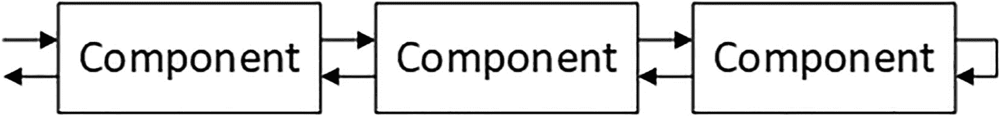
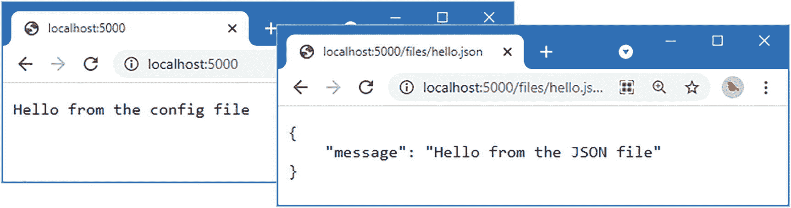
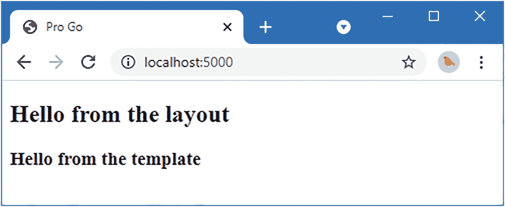
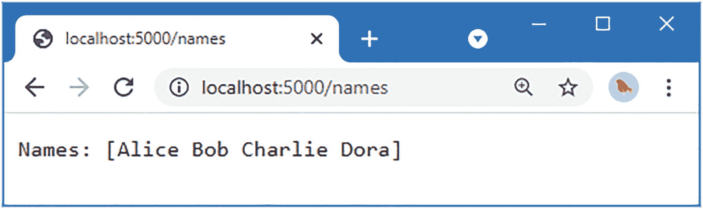
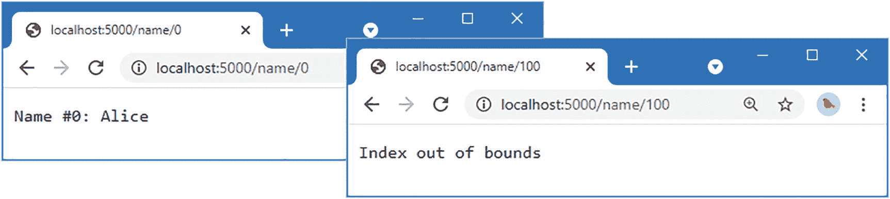
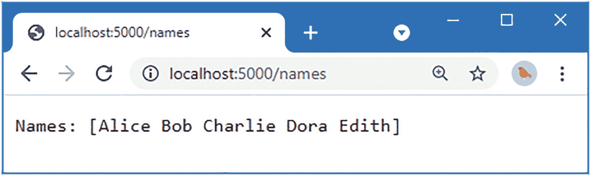

# 33. 中间件、模板和处理器

在本章中，我将继续第 32 章开始的 Web 应用平台开发，增加对处理 HTTP 请求的支持。

**提示** 你可以从 [`https://github.com/apress/pro-go`](https://github.com/apress/pro-go) 下载本章以及本书其他所有章节的示例项目。如果你在运行示例时遇到问题，请参阅第 2 章获取帮助。

### 创建请求管道

构建平台的下一步是创建一个 Web 服务，用于处理来自浏览器的 HTTP 请求。为做准备，我将创建一个简单的管道，其中包含可以检查和修改请求的中间件组件。

当 HTTP 请求到达时，它将被传递到管道中每个已注册的中间件组件，让每个组件都有机会处理请求并参与响应的生成。组件还可以终止请求处理，阻止请求被转发到管道中的后续组件。

一旦请求到达管道的末端，它会沿着管道反向传递，以便组件有机会进行进一步的更改或执行额外的工作，如图 33-1 所示。



*图 33-1：请求处理管道*

### 定义中间件组件接口

创建`platform/pipeline`文件夹，并在其中添加一个名为`component.go`的文件，内容如代码清单 33-1 所示。

```go
package pipeline
import (
"net/http"
)
type ComponentContext struct {
*http.Request
http.ResponseWriter
error
}
func (mwc *ComponentContext) Error(err error) {
mwc.error = err
}
func (mwc *ComponentContext) GetError() error {
return mwc.error
}
type MiddlewareComponent interface {
Init()
ProcessRequest(context *ComponentContext, next func(*ComponentContext))
}
```

*代码清单 33-1：pipeline 文件夹中 component.go 文件的内容*

顾名思义，`MiddlewareComponent`接口描述了中间件组件所需的功能。`Init`方法用于执行任何一次性设置，另一个名为`ProcessRequest`的方法负责处理 HTTP 请求。`ProcessRequest`方法定义的参数包括一个指向`ComponentContext`结构体的指针，以及一个将请求传递给管道中下一个组件的函数。

组件处理请求所需的一切都由`ComponentContext`结构体提供，通过它可以访问`http.Request`和`http.ResponseWriter`。`ComponentContext`结构体还定义了一个未导出的`error`字段，用于指示处理请求时的问题，并通过`Error`方法进行设置。

### 创建请求管道

为了创建处理请求的管道，请在`pipeline`文件夹中添加一个名为`pipeline.go`的文件，内容如代码清单 33-2 所示。

```go
package pipeline
import (
"net/http"
)
type RequestPipeline func(*ComponentContext)
var emptyPipeline RequestPipeline = func(*ComponentContext) { /* 什么都不做 */ }
func CreatePipeline(components ...MiddlewareComponent) RequestPipeline {
f := emptyPipeline
for i := len(components) -1 ; i >= 0; i-- {
currentComponent := components[i]
nextFunc := f
f = func(context *ComponentContext) {
if (context.error == nil) {
currentComponent.ProcessRequest(context, nextFunc)
}
}
currentComponent.Init()
}
return f
}
func (pl RequestPipeline) ProcessRequest(req *http.Request,
resp http.ResponseWriter) error {
ctx := ComponentContext {
Request: req,
ResponseWriter: resp,
}
pl(&ctx)
return ctx.error
}
```

*代码清单 33-2：pipeline 文件夹中 pipeline.go 文件的内容*

`CreatePipeline`函数是这个清单中最重要的部分，因为它接受一系列组件，并将它们连接起来，生成一个接受`ComponentContext`结构体指针的函数。该函数会调用管道中第一个组件的`ProcessRequest`方法，其`next`参数会调用下一个组件的`ProcessRequest`方法。这个链会依次将`ComponentContext`结构体传递给所有组件，除非其中一个组件调用了`Error`方法。请求通过`ProcessRequest`方法处理，该方法会创建`ComponentContext`值，并用它来启动请求处理。


### 创建基础组件

组件接口和管道的定义虽然简单，但它们为编写组件提供了灵活的基础。应用程序可以定义并选择自己的组件，但我会将一些基本功能作为平台的一部分包含进来。

#### 创建服务中间件组件

创建 `platform/pipeline/basic` 文件夹，并在其中添加一个名为 `services.go` 的文件，内容如代码清单 33-3 所示。

```go
package basic

import (
	"platform/pipeline"
	"platform/services"
)

type ServicesComponent struct{}

func (c *ServicesComponent) Init() {}

func (c *ServicesComponent) ProcessRequest(ctx *pipeline.ComponentContext,
	next func(*pipeline.ComponentContext)) {
	reqContext := ctx.Request.Context()
	ctx.Request.WithContext(services.NewServiceContext(reqContext))
	next(ctx)
}
```

此中间件组件会修改与请求关联的 `Context`，以便在请求处理过程中可以使用上下文范围内的服务。`http.Request.Context` 方法用于获取随请求创建的标准 `Context`，该上下文会为服务做好准备，然后通过 `WithContext` 方法进行更新。

上下文准备就绪后，通过调用名为 `next` 的参数所接收的函数，将请求沿管道传递：

```go
...
next(ctx)
...
```

该参数使中间件组件能够控制请求处理，并允许其修改后续组件接收到的上下文数据。同时，它也允许组件通过不调用 `next` 函数来中断请求处理流程。

#### 创建日志中间件组件

接下来，在 `basic` 文件夹中添加一个名为 `logging.go` 的文件，内容如代码清单 33-4 所示。

```go
package basic

import (
	"net/http"
	"platform/logging"
	"platform/pipeline"
	"platform/services"
)

type LoggingResponseWriter struct {
	statusCode int
	http.ResponseWriter
}

func (w *LoggingResponseWriter) WriteHeader(statusCode int) {
	w.statusCode = statusCode
	w.ResponseWriter.WriteHeader(statusCode)
}

func (w *LoggingResponseWriter) Write(b []byte) (int, error) {
	if w.statusCode == 0 {
		w.statusCode = http.StatusOK
	}
	return w.ResponseWriter.Write(b)
}

type LoggingComponent struct{}

func (lc *LoggingComponent) Init() {}

func (lc *LoggingComponent) ProcessRequest(ctx *pipeline.ComponentContext,
	next func(*pipeline.ComponentContext)) {
	var logger logging.Logger
	err := services.GetServiceForContext(ctx.Request.Context(), &logger)
	if err != nil {
		ctx.Error(err)
		return
	}
	loggingWriter := LoggingResponseWriter{0, ctx.ResponseWriter}
	ctx.ResponseWriter = &loggingWriter
	logger.Infof("REQ --- %v - %v", ctx.Request.Method, ctx.Request.URL)
	next(ctx)
	logger.Infof("RSP %v %v", loggingWriter.statusCode, ctx.Request.URL)
}
```

该组件使用第 32 章创建的 `Logger` 服务记录请求和响应的基本信息。由于 `ResponseWriter` 接口不提供对响应中发送的状态码的访问，因此创建了一个 `LoggingResponseWriter` 并将其传递给管道中的下一个组件。

该组件在调用 `next` 函数前后执行操作：在传递请求前记录一条消息，并在请求处理完成后记录另一条包含状态码的消息。

该组件在处理请求时获取 `Logger` 服务。虽然可以只获取一次 `Logger`，但这样做之所以可行，只是因为我已知 `Logger` 已注册为单例服务。我更倾向于不对 `Logger` 的生命周期做假设，这意味着如果未来生命周期发生变化，也不会出现意外结果。

#### 创建错误处理组件

请求管道允许组件在发生错误时终止处理。为了定义一个处理错误的组件，请在 `platform/pipeline/basic` 文件夹中添加一个名为 `errors.go` 的文件，内容如代码清单 33-5 所示。

```go
package basic

import (
	"fmt"
	"net/http"
	"platform/logging"
	"platform/pipeline"
	"platform/services"
)

type ErrorComponent struct{}

func recoveryFunc(ctx *pipeline.ComponentContext, logger logging.Logger) {
	if arg := recover(); arg != nil {
		logger.Debugf("Error: %v", fmt.Sprint(arg))
		ctx.ResponseWriter.WriteHeader(http.StatusInternalServerError)
	}
}

func (c *ErrorComponent) Init() {}

func (c *ErrorComponent) ProcessRequest(ctx *pipeline.ComponentContext,
	next func(*pipeline.ComponentContext)) {
	var logger logging.Logger
	services.GetServiceForContext(ctx.Context(), &logger)
	defer recoveryFunc(ctx, logger)
	next(ctx)
	if ctx.GetError() != nil {
		logger.Debugf("Error: %v", ctx.GetError())
		ctx.ResponseWriter.WriteHeader(http.StatusInternalServerError)
	}
}
```

此组件用于恢复后续组件在处理请求时可能发生的任何 panic，并处理所有预期错误。在两种情况下，都会记录错误，并将响应状态码设置为指示发生错误。

#### 创建静态文件组件

几乎所有的 Web 应用都需要支持提供静态文件服务，即使仅用于 CSS 样式表也是如此。标准库内置了对提供文件服务的支持，这很有帮助，因为该任务本身充满潜在问题。但幸运的是，将标准库功能集成到示例项目的请求管道中是一件简单的事情。在 `basic` 文件夹中添加一个名为 `files.go` 的文件，内容如代码清单 33-6 所示。

```go
package basic

import (
	"net/http"
	"platform/config"
	"platform/pipeline"
	"platform/services"
	"strings"
)

type StaticFileComponent struct {
	urlPrefix     string
	stdLibHandler http.Handler
}

func (sfc *StaticFileComponent) Init() {
	var cfg config.Configuration
	services.GetService(&cfg)
	sfc.urlPrefix = cfg.GetStringDefault("files:urlprefix", "/files/")
	path, ok := cfg.GetString("files:path")
	if ok {
		sfc.stdLibHandler = http.StripPrefix(sfc.urlPrefix,
			http.FileServer(http.Dir(path)))
	} else {
		panic("Cannot load file configuration settings")
	}
}

func (sfc *StaticFileComponent) ProcessRequest(ctx *pipeline.ComponentContext,
	next func(*pipeline.ComponentContext)) {
	if !strings.EqualFold(ctx.Request.URL.Path, sfc.urlPrefix) &&
		strings.HasPrefix(ctx.Request.URL.Path, sfc.urlPrefix) {
		sfc.stdLibHandler.ServeHTTP(ctx.ResponseWriter, ctx.Request)
	} else {
		next(ctx)
	}
}
```

该处理器使用 `Init` 方法读取配置设置，这些设置指定了文件请求使用的前缀以及提供文件的目录，并使用 `net/http` 包提供的处理器来提供文件服务。


### 创建占位响应组件

该项目不包含任何生成响应的中间件组件（这些组件通常作为应用程序的一部分定义）。不过，目前您需要一个占位组件，以便在开发其他功能时生成简单的响应。创建 `platform/placeholder` 文件夹，并向其中添加一个名为 `message_middleware.go` 的文件，其内容如清单 33-7 所示。

```
package placeholder
import (
"io"
"errors"
"platform/pipeline"
"platform/config"
"platform/services"
)
type SimpleMessageComponent struct {}
func (c *SimpleMessageComponent) Init() {}
func (c *SimpleMessageComponent) ProcessRequest(ctx *pipeline.ComponentContext,
next func(*pipeline.ComponentContext))  {
var cfg config.Configuration
services.GetService(&cfg)
msg, ok := cfg.GetString("main:message")
if (ok) {
io.WriteString(ctx.ResponseWriter, msg)
} else {
ctx.Error(errors.New("Cannot find config setting"))
}
next(ctx)
}
```

该组件生成一个简单的文本响应，足以确保管道按预期工作。接下来，创建 `platform/placeholder/files` 文件夹，并向其中添加一个名为 `hello.json` 的文件，其内容如清单 33-8 所示。

```
{
"message": "Hello from the JSON file"
}
```

要设置静态文件的读取位置，请将清单 33-9 中所示的配置项添加到 `platform` 文件夹的 `config.json` 文件中。

```
{
"logging" : {
"level": "debug"
},
"main" : {
"message" : "Hello from the config file"
},
"files": {
"path": "placeholder/files"
}
}
```

### 创建 HTTP 服务器

现在是创建 HTTP 服务器并使用管道来处理其接收到的请求的时候了。创建 `platform/http` 文件夹，并向其中添加一个名为 `server.go` 的文件，其内容如清单 33-10 所示。

```
package http
import (
"fmt"
"sync"
"net/http"
"platform/config"
"platform/logging"
"platform/pipeline"
)
type pipelineAdaptor struct {
pipeline.RequestPipeline
}
func (p pipelineAdaptor) ServeHTTP(writer http.ResponseWriter,
request *http.Request) {
p.ProcessRequest(request, writer)
}
func Serve(pl pipeline.RequestPipeline, cfg config.Configuration, logger logging.Logger ) *sync.WaitGroup {
wg := sync.WaitGroup{}
adaptor := pipelineAdaptor { RequestPipeline: pl }
enableHttp := cfg.GetBoolDefault("http:enableHttp", true)
if (enableHttp) {
httpPort := cfg.GetIntDefault("http:port", 5000)
logger.Debugf("Starting HTTP server on port %v", httpPort)
wg.Add(1)
go func() {
err := http.ListenAndServe(fmt.Sprintf(":%v", httpPort), adaptor)
if (err != nil) {
panic(err)
}
}()
}
enableHttps := cfg.GetBoolDefault("http:enableHttps", false)
if (enableHttps) {
httpsPort := cfg.GetIntDefault("http:httpsPort", 5500)
certFile, cfok := cfg.GetString("http:httpsCert")
keyFile, kfok := cfg.GetString("http:httpsKey")
if cfok && kfok {
logger.Debugf("Starting HTTPS server on port %v", httpsPort)
wg.Add(1)
go func() {
err := http.ListenAndServeTLS(fmt.Sprintf(":%v", httpsPort),
certFile, keyFile, adaptor)
if (err != nil) {
panic(err)
}
}()
} else {
panic("HTTPS certificate settings not found")
}
}
return &wg
}
```

`Serve` 函数使用 `Configuration` 服务读取 HTTP 和 HTTPS 的设置，并利用标准库提供的功能接收请求，然后将请求传递给管道进行处理。（您将在第 38 章为部署做准备时启用 HTTPS 支持，但在此之前，您将使用默认设置，即在端口 5000 上监听 HTTP 请求。）

### 配置应用程序

最后一步是配置应用程序所需的管道，并使用它来配置和启动 HTTP 服务器。当您在第 35 章开始开发时，这将是由应用程序执行的任务。不过，现在请向 `placeholder` 文件夹添加一个名为 `startup.go` 的文件，其内容如清单 33-11 所示。

```
package placeholder
import (
"platform/http"
"platform/pipeline"
"platform/pipeline/basic"
"platform/services"
"sync"
)
func createPipeline() pipeline.RequestPipeline {
return pipeline.CreatePipeline(
&basic.ServicesComponent{},
&basic.LoggingComponent{},
&basic.ErrorComponent{},
&basic.StaticFileComponent{},
&SimpleMessageComponent{},
)
}
func Start() {
results, err := services.Call(http.Serve, createPipeline())
if (err == nil) {
(results[0].(*sync.WaitGroup)).Wait()
} else {
panic(err)
}
}
```

`createPipeline` 函数创建一个包含先前创建的中间件组件的管道。`Start` 函数调用 `createPipeline`，并使用其结果来配置和启动 HTTP 服务器。清单 33-12 使用 `main` 函数完成设置并启动 HTTP 服务器。

```
package main
import (
"platform/services"
"platform/placeholder"
)
func main() {
services.RegisterDefaultServices()
placeholder.Start()
}
```

编译并执行项目，然后使用 Web 浏览器请求 `http://localhost:5000`。

**处理 Windows 防火墙权限请求**

如前面章节所述，每次使用 `go run` 命令编译项目时，Windows 都会提示防火墙权限。可以使用一个简单的 PowerShell 脚本代替 `go run` 命令来避免这些提示。创建一个名为 `buildandrun.ps1` 的文件，内容如下：

```
$file = "./platform.exe"
&go build -o $file
if ($LASTEXITCODE -eq 0) {
&$file
}
```

要构建并执行项目，请在 `platform` 文件夹中使用命令 `./buildandrun.ps1`。

HTTP 请求将由服务器接收并沿着管道传递，产生如图 33-2 所示的响应。请求 `http://localhost:5000/files/hello.json`，您将看到静态文件的内容，如图 33-2 所示。

类似以下内容的输出将写入标准输出，显示服务器接收和处理请求的过程（根据您的浏览器，您可能还会看到对 `/favicon.ico` 的请求）：

```
20:10:12 DEBUG Starting HTTP server on port 5000
20:10:23 INFO REQ --- GET - /
20:10:23 INFO RSP 200 /
20:10:33 INFO REQ --- GET - /files/hello.json
20:10:33 INFO RSP 200 /files/hello.json
```

目前，服务器对所有非文件请求的响应方式相同，这就是日志显示对 `/favicon.ico` 文件的请求都生成 `200 OK` 响应的原因。



**图 33-2** 从 HTTP 服务器获得响应


### 简化服务解析

目前，中间件组件必须直接解析它们所需的服务。但由于依赖注入系统可以调用函数并填充结构体，只需少量额外工作，就能让组件声明其所依赖的服务并自动获取这些服务。首先，需要一个接口，允许组件表明它们需要依赖注入来处理请求，如代码清单 33-13 所示。

```go
package pipeline

import (
	"net/http"
)

type ComponentContext struct {
	*http.Request
	http.ResponseWriter
	error
}

func (mwc *ComponentContext) Error(err error) {
	mwc.error = err
}

func (mwc *ComponentContext) GetError() error {
	return mwc.error
}

type MiddlewareComponent interface {
	Init()
	ProcessRequest(context *ComponentContext, next func(*ComponentContext))
}

type ServicesMiddlwareComponent interface {
	Init()
	ImplementsProcessRequestWithServices()
}
```

通过实现一个名为 `ImplementsProcessRequestWithServices` 的方法，组件可以表明它们需要服务。由于每个组件所需服务方法的方法签名不同，因此无法在接口中包含需要服务的方法。相反，我将检测 `ServicesMiddlwareComponent`，然后使用反射判断该组件是否实现了名为 `ProcessRequestWithServices` 的方法，该方法的头两个参数与 `MiddlewareComponent` 接口定义的 `ProcessRequest` 方法相同。代码清单 33-14 在创建管道函数中新增了这一功能，并在准备管道时，用服务填充组件的结构体字段。

```go
package pipeline

import (
	"net/http"
	"platform/services"
	"reflect"
)

type RequestPipeline func(*ComponentContext)

var emptyPipeline RequestPipeline = func(*ComponentContext) { /* 什么都不做 */ }

func CreatePipeline(components ...interface{}) RequestPipeline {
	f := emptyPipeline
	for i := len(components) - 1; i >= 0; i-- {
		currentComponent := components[i]
		services.Populate(currentComponent)
		nextFunc := f
		if servComp, ok := currentComponent.(ServicesMiddlwareComponent); ok {
			f = createServiceDependentFunction(currentComponent, nextFunc)
			servComp.Init()
		} else if stdComp, ok := currentComponent.(MiddlewareComponent); ok {
			f = func(context *ComponentContext) {
				if context.error == nil {
					stdComp.ProcessRequest(context, nextFunc)
				}
			}
			stdComp.Init()
		} else {
			panic("值不是中间件组件")
		}
	}
	return f
}

func createServiceDependentFunction(component interface{}, nextFunc RequestPipeline) RequestPipeline {
	method := reflect.ValueOf(component).MethodByName("ProcessRequestWithServices")
	if method.IsValid() {
		return func(context *ComponentContext) {
			if context.error == nil {
				_, err := services.CallForContext(context.Request.Context(), method.Interface(), context, nextFunc)
				if err != nil {
					context.Error(err)
				}
			}
		}
	} else {
		panic("未定义 ProcessRequestWithServices 方法")
	}
}

func (pl RequestPipeline) ProcessRequest(req *http.Request, resp http.ResponseWriter) error {
	ctx := ComponentContext{
		Request:        req,
		ResponseWriter: resp,
	}
	pl(&ctx)
	return ctx.error
}
```

这些改动使中间件组件能够利用依赖注入，从而将服务依赖声明为参数，如代码清单 33-15 所示。

```go
package basic

import (
	"net/http"
	"platform/logging"
	"platform/pipeline"
	//"platform/services"
)

type LoggingResponseWriter struct {
	statusCode int
	http.ResponseWriter
}

func (w *LoggingResponseWriter) WriteHeader(statusCode int) {
	w.statusCode = statusCode
	w.ResponseWriter.WriteHeader(statusCode)
}

func (w *LoggingResponseWriter) Write(b []byte) (int, error) {
	if w.statusCode == 0 {
		w.statusCode = http.StatusOK
	}
	return w.ResponseWriter.Write(b)
}

type LoggingComponent struct{}

func (lc *LoggingComponent) ImplementsProcessRequestWithServices() {}
func (lc *LoggingComponent) Init()                                 {}
func (lc *LoggingComponent) ProcessRequestWithServices(
	ctx *pipeline.ComponentContext,
	next func(*pipeline.ComponentContext),
	logger logging.Logger) {
	// var logger logging.Logger
	// err := services.GetServiceForContext(ctx.Request.Context(), &logger)
	// if (err != nil) {
	//     ctx.Error(err)
	//     return
	// }
	loggingWriter := LoggingResponseWriter{0, ctx.ResponseWriter}
	ctx.ResponseWriter = &loggingWriter
	logger.Infof("REQ --- %v - %v", ctx.Request.Method, ctx.Request.URL)
	next(ctx)
	logger.Infof("RSP %v %v", loggingWriter.statusCode, ctx.Request.URL)
}
```

定义 `ImplementsProcessRequestWithServices` 方法实现了管道使用的接口，以表明存在一个需要依赖注入的 `ProcessRequestWithServices` 方法。组件也可以依赖通过其结构体字段解析的服务，如代码清单 33-16 所示。

```go
package basic

import (
	"net/http"
	"platform/config"
	"platform/pipeline"
	//"platform/services"
	"strings"
)

type StaticFileComponent struct {
	urlPrefix     string
	stdLibHandler http.Handler
	Config        config.Configuration
}

func (sfc *StaticFileComponent) Init() {
	// var cfg config.Configuration
	// services.GetService(&cfg)
	sfc.urlPrefix = sfc.Config.GetStringDefault("files:urlprefix", "/files/")
	path, ok := sfc.Config.GetString("files:path")
	if ok {
		sfc.stdLibHandler = http.StripPrefix(sfc.urlPrefix,
			http.FileServer(http.Dir(path)))
	} else {
		panic("无法加载文件配置设置")
	}
}

func (sfc *StaticFileComponent) ProcessRequest(ctx *pipeline.ComponentContext,
	next func(*pipeline.ComponentContext)) {
	if !strings.EqualFold(ctx.Request.URL.Path, sfc.urlPrefix) &&
		strings.HasPrefix(ctx.Request.URL.Path, sfc.urlPrefix) {
		sfc.stdLibHandler.ServeHTTP(ctx.ResponseWriter, ctx.Request)
	} else {
		next(ctx)
	}
}
```

编译并执行项目，使用浏览器请求 `http://localhost:5000` 和 `http://localhost:5000/files/hello.json`，将产生与上一节相同的结果。请求 JSON 文件时可能会看到 304 状态结果，因为自上一节请求以来该文件没有变化。

## 创建 HTML 响应

我在第 23 章中描述了 HTML 模板处理功能，但它们与我处理 HTML 内容的方式不同。我希望能够定义一个 HTML 模板，并指定一个将在该模板中使用的共享布局。这与 `html/template` 包采用的标准方法相反，但通过定制默认行为很容易达到我想要的效果。

> **注意：** 由于我颠倒了模板处理的顺序，模板不能使用块特性来为被另一个模板覆盖的模板提供默认内容。


### 创建布局和模板

当你了解模板的结构时，适配模板引擎的过程会更加轻松。在 `platform/placeholder` 文件夹中添加一个名为 `simple_message.html` 的文件，内容如清单 33-17 所示。

```
{{ layout "layout.html" }}

Hello from the template

清单 33-17
placeholder 文件夹中 simple_message.html 文件的内容
```

该模板使用 `layout` 表达式指定所需的布局，但除此之外，它是一个使用第 23 章所述功能的标准模板。模板中包含一个 `h3` 元素，其内容包含一个用于插入数据值的动作。

要定义布局，请在 `placeholder` 文件夹中添加一个名为 `layout.html` 的文件，内容如清单 33-18 所示。

```
Pro Go

Hello from the layout
{{ body }}

清单 33-18
placeholder 文件夹中 layout.html 文件的内容
```

布局包含定义 HTML 文档所需的元素，并额外添加了一个包含 `body` 表达式的动作，该动作会将所选模板的内容插入到输出中。

为了渲染内容，模板会被选中并执行，这将确定它所需的布局。布局也会被渲染，并与模板内容相结合，以生成完整的 HTML 响应。这是我偏好的方法，部分原因是它避免了在选择模板时需要知道所需布局，另一部分原因是我在其他语言和平台中习惯如此。

### 实现模板执行

内置的模板包非常出色，使得支持模板指定布局的模型变得容易。创建 `platform/templates` 文件夹，并在其中添加一个名为 `template_executor.go` 的文件，内容如清单 33-19 所示。

```
package templates
import "io"
type TemplateExecutor interface {
ExecTemplate(writer io.Writer, name string, data interface{}) (err error)
}
清单 33-19
templates 文件夹中 template_executor.go 文件的内容
```

`TemplateProcessor` 接口定义了一个名为 `ExecTemplate` 的方法，它使用提供的数据值处理模板，并将内容写入一个 `Writer`。为了创建该接口的实现，请在 `templates` 文件夹中添加一个名为 `layout_executor.go` 的文件，内容如清单 33-20 所示。

```
package templates
import (
"io"
"strings"
"html/template"
)
type LayoutTemplateProcessor struct {}
func (proc *LayoutTemplateProcessor) ExecTemplate(writer io.Writer,
name string, data interface{}) (err error) {
var sb strings.Builder
layoutName := ""
localTemplates := getTemplates()
localTemplates.Funcs(map[string]interface{} {
"body": insertBodyWrapper(&sb),
"layout": setLayoutWrapper(&layoutName),
})
err = localTemplates.ExecuteTemplate(&sb, name, data)
if (layoutName != "") {
localTemplates.ExecuteTemplate(writer, layoutName, data)
} else {
io.WriteString(writer, sb.String())
}
return
}
var getTemplates func() (t *template.Template)
func insertBodyWrapper(body *strings.Builder) func() template.HTML {
return func() template.HTML {
return template.HTML(body.String())
}
}
func setLayoutWrapper(val *string) func(string) string {
return func(layout string) string {
*val = layout
return ""
}
}
清单 33-20
templates 文件夹中 layout_executor.go 文件的内容
```

`ExecTemplate` 方法的实现执行一个模板，并将内容存储在 `strings.Builder` 中。为了支持上一节中描述的 `layout` 和 `body` 表达式，需要创建自定义模板函数，如下所示：

```
...
localTemplates.Funcs(map[string]interface{} {
"body": insertBodyWrapper(&sb),
"layout": setLayoutWrapper(&layoutName),
})
...
```

当内置模板引擎遇到 `template` 表达式时，它会调用 `setLayoutWrapper` 创建的函数，该函数设置一个变量的值，然后这个变量被用来执行指定的布局模板。在布局执行期间，`body` 表达式会调用 `insertBodyWrapper` 函数创建的函数，该函数将原始模板生成的内容插入到布局产生的输出中。为了防止内置模板引擎转义 HTML 字符，此操作的结果是一个 `template.HTML` 值：

```
...
func insertBodyWrapper(body *strings.Builder) func() template.HTML {
return func() template.HTML {
return template.HTML(body.String())
}
}
...
```

正如第 23 章所解释的，Go 模板系统会自动对内容进行编码，以确保其安全地嵌入 HTML 文档。这通常是一个有用的特性，但在此例中，当内容从模板插入到布局时进行转义会使其无法被解释为 HTML。

`ExecTemplate` 方法通过调用一个名为 `getTemplates` 的函数来获取已加载的模板，该函数对应的变量在清单 33-20 中定义。为了添加对加载模板并创建将被赋值给 `getTemplates` 变量的函数值的支持，请在 `templates` 文件夹中添加一个名为 `template_loader.go` 的文件，内容如清单 33-21 所示。

```
package templates
import (
"html/template"
"sync"
"errors"
"platform/config"
)
var once = sync.Once{}
func LoadTemplates(c config.Configuration) (err error) {
path, ok := c.GetString("templates:path")
if !ok {
return errors.New("Cannot load template config")
}
reload := c.GetBoolDefault("templates:reload", false)
once.Do(func() {
doLoad := func() (t *template.Template) {
t = template.New("htmlTemplates")
t.Funcs(map[string]interface{} {
"body": func() string { return "" },
"layout": func() string { return "" },
})
t, err = t.ParseGlob(path)
return
}
if (reload) {
getTemplates = doLoad
} else {
var templates *template.Template
templates = doLoad()
getTemplates = func() *template.Template {
t, _ := templates.Clone()
return t
}
}
})
return
}
清单 33-21
templates 文件夹中 template_loader.go 文件的内容
```

`LoadTemplates` 函数从配置文件中指定的位置加载模板。还有一个配置设置允许在每次请求时重新加载模板，这在已部署的项目中不建议使用，但在开发过程中很有用，因为这意味着无需重新启动应用程序即可看到对模板的更改。清单 33-22 将新的设置添加到了配置文件中。

```
{
"logging" : {
"level": "debug"
},
"main" : {
"message" : "Hello from the config file"
},
"files": {
"path": "placeholder/files"
},
"templates": {
"path": "placeholder/*.html",
"reload": true
}
}
清单 33-22
在 platform 文件夹中的 config.json 文件中添加设置
```

通过 `reload` 设置接收的值决定了分配给 `getTemplates` 变量的函数。如果 `reload` 为 `true`，那么调用 `getTemplates` 将从磁盘加载模板；如果为 `false`，则将克隆之前加载的模板。

需要克隆或重新加载模板以确保自定义的 `body` 和 `layout` 函数能正常工作。`LoadTemplates` 函数定义了占位函数，以便在加载时能够解析模板。


### 创建并使用模板服务

自定义模板引擎将作为服务提供。将列表 33-23 所示的语句添加到 `platform/services` 文件夹中的 `services_default.go` 文件中。

```
package services

import (
	"platform/logging"
	"platform/config"
	"platform/templates"
)

func RegisterDefaultServices() {
	err := AddSingleton(func() (c config.Configuration) {
		c, loadErr := config.Load("config.json")
		if loadErr != nil {
			panic(loadErr)
		}
		return
	})
	err = AddSingleton(func(appconfig config.Configuration) logging.Logger {
		return logging.NewDefaultLogger(appconfig)
	})
	if err != nil {
		panic(err)
	}
	err = AddSingleton(
		func(c config.Configuration) templates.TemplateExecutor {
			templates.LoadTemplates(c)
			return &templates.LayoutTemplateProcessor{}
		})
	if err != nil {
		panic(err)
	}
}
```

列表 33-23 — 在 `services` 文件夹的 `services_default.go` 文件中创建模板服务

为确保模板引擎正常工作，请对本章前面创建的占位中间件组件进行列表 33-24 所示的更改，使其返回 HTML 响应而非简单字符串。

```
package placeholder

import (
	//"io"
	//"errors"
	"platform/pipeline"
	"platform/config"
	//"platform/services"
	"platform/templates"
)

type SimpleMessageComponent struct {
	Message string
	config.Configuration
}

func (lc *SimpleMessageComponent) ImplementsProcessRequestWithServices() {}

func (c *SimpleMessageComponent) Init() {
	c.Message = c.Configuration.GetStringDefault("main:message",
		"Default Message")
}

func (c *SimpleMessageComponent) ProcessRequestWithServices(
	ctx *pipeline.ComponentContext,
	next func(*pipeline.ComponentContext),
	executor templates.TemplateExecutor) {
	err := executor.ExecTemplate(ctx.ResponseWriter,
		"simple_message.html", c.Message)
	if err != nil {
		ctx.Error(err)
	} else {
		next(ctx)
	}
}
```

列表 33-24 — 在 `placeholder` 文件夹的 `message_middleware.go` 文件中使用模板

该组件现在实现了 `ProcessRequestWithServices` 方法，并通过依赖注入接收服务。其中一个请求的服务是 `TemplateExecutor` 接口的实现，用于显示 `simple_message.html` 模板。编译并执行项目，使用浏览器请求 `http://localhost:5000`，您将看到图 33-3 所示的 HTML 响应。



图 33-3 — 创建 HTML 响应

## 引入请求处理器

下一步是引入对定义处理 HTTP 请求并生成适当响应的逻辑的支持，这将使我能够编写响应特定 URL 的代码，而无需重复太多代码。要理解其工作原理，最好从请求处理器的示例开始，该处理器将被定义为一个包含一组处理请求方法的类型。在 `placeholder` 文件夹中添加一个名为 `name_handler.go` 的文件，内容如列表 33-25 所示。

```
package placeholder

import (
	"fmt"
	"platform/logging"
)

var names = []string{"Alice", "Bob", "Charlie", "Dora"}

type NameHandler struct {
	logging.Logger
}

func (n NameHandler) GetName(i int) string {
	n.Logger.Debugf("GetName method invoked with argument: %v", i)
	if i < len(names) {
		return fmt.Sprintf("Name #%v: %v", i, names[i])
	} else {
		return fmt.Sprintf("Index out of bounds")
	}
}

func (n NameHandler) GetNames() string {
	n.Logger.Debug("GetNames method invoked")
	return fmt.Sprintf("Names: %v", names)
}

type NewName struct {
	Name        string
	InsertAtStart bool
}

func (n NameHandler) PostName(new NewName) string {
	n.Logger.Debugf("PostName method invoked with argument %v", new)
	if new.InsertAtStart {
		names = append([]string{new.Name}, names...)
	} else {
		names = append(names, new.Name)
	}
	return fmt.Sprintf("Names: %v", names)
}
```

列表 33-25 — `placeholder` 文件夹中 `name_handler.go` 文件的内容

`NameHandler` 结构体定义了三个方法：`GetName`、`GetNames` 和 `PostName`。应用程序启动时，将检查已注册的处理器集，并使用它们定义的方法名来创建与 HTTP 请求匹配的路由。

每个方法名的第一部分指定了该路由将匹配的 HTTP 方法，例如 `GetName` 方法将匹配 GET 请求。方法名的其余部分将用作路由匹配的 URL 路径中的第一个段，GET 请求的参数将添加额外的段。

表 33-1 显示了将由列表 33-25 中定义的方法处理的请求的详细信息。

表 33-1 — 示例处理器方法匹配的请求

| 名称 | HTTP 方法 | 示例 URL |
| --- | --- | --- |
| `GetName` | GET | `/name/1` |
| `GetNames` | GET | `/names` |
| `PostName` | POST | `/names` |

当请求到达并匹配到方法的路径时，参数值将从请求 URL、查询字符串以及请求表单（如果存在）中获取。如果方法参数的类型是一个结构体，则其字段将使用相同的请求数据进行填充。

处理请求所需的服务被声明为处理器结构体定义的字段。在列表 33-25 中，`NameHandler` 结构体定义了一个字段，声明了对 `logging.Logger` 服务的依赖。将创建该结构体的一个新实例，填充其字段，然后调用被选中处理请求的方法。


### 生成 URL 路由

第一步是为请求处理方法添加生成 URL 路由的支持。创建 `platform/http/handling` 文件夹，并在其中添加一个名为 `routes.go` 的文件，其内容如代码清单 33-26 所示。

```
package handling

import (
	"reflect"
	"regexp"
	"strings"
	"net/http"
)

type HandlerEntry struct {
	Prefix  string
	Handler interface{}
}

type Route struct {
	httpMethod    string
	prefix        string
	handlerName   string
	actionName    string
	expression    regexp.Regexp
	handlerMethod reflect.Method
}

var httpMethods = []string{http.MethodGet, http.MethodPost,
	http.MethodDelete, http.MethodPut}

func generateRoutes(entries ...HandlerEntry) []Route {
	routes := make([]Route, 0, 10)
	for _, entry := range entries {
		handlerType := reflect.TypeOf(entry.Handler)
		promotedMethods := getAnonymousFieldMethods(handlerType)
		for i := 0; i < handlerType.NumMethod(); i++ {
			method := handlerType.Method(i)
			methodName := strings.ToUpper(method.Name)
			for _, httpMethod := range httpMethods {
				if strings.Index(methodName, httpMethod) == 0 {
					if (matchesPromotedMethodName(method, promotedMethods)) {
						continue
					}
					route := Route{
						httpMethod:    httpMethod,
						prefix:        entry.Prefix,
						handlerName:   strings.Split(handlerType.Name(), "Handler")[0],
						actionName:    strings.Split(methodName, httpMethod)[1],
						handlerMethod: method,
					}
					generateRegularExpression(entry.Prefix, &route)
					routes = append(routes, route)
				}
			}
		}
	}
	return routes
}

func matchesPromotedMethodName(method reflect.Method,
	methods []reflect.Method) bool {
	for _, m := range methods {
		if m.Name == method.Name {
			return true
		}
	}
	return false
}

func getAnonymousFieldMethods(target []reflect.Type) reflect.Method {
	methods := []reflect.Method{}
	for i := 0; i < target.NumField(); i++ {
		field := target.Field(i)
		if (field.Anonymous && field.IsExported()) {
			for j := 0; j < field.Type.NumMethod(); j++ {
				method := field.Type.Method(j)
				if (method.IsExported()) {
					methods = append(methods, method)
				}
			}
		}
	}
	return methods
}

func generateRegularExpression(prefix string, route *Route) {
	if (prefix != "" && !strings.HasSuffix(prefix, "/")) {
		prefix += "/"
	}
	pattern := "(?i)" + "/" + prefix + route.actionName
	if (route.httpMethod == http.MethodGet) {
		for i := 1; i < route.handlerMethod.Type.NumIn(); i++ {
			if route.handlerMethod.Type.In(i).Kind() == reflect.Int {
				pattern += "/([0-9]*)"
			} else {
				pattern += "/([A-z0-9]*)"
			}
		}
	}
	pattern = "^" + pattern + "[/]?$"
	route.expression = *regexp.MustCompile(pattern)
}
```

**代码清单 33-26** `http/handling` 文件夹中 `routes.go` 文件的内容

路由将使用一个可选的前缀进行配置，这使我能够为应用程序的不同部分创建不同的 URL，例如在第 34 章中引入访问控制时。`HandlerEntry` 结构体描述了处理器及其前缀，而 `Route` 结构体定义了单个路由的处理结果。`generateRoutes` 函数为处理器定义的方法创建 `Route` 值，并依赖 `generateRegularExpression` 函数来创建和编译用于匹配 URL 路径的正则表达式。

> **注意：** 如第 28 章所述，在对结构体使用反射时，会将匿名内嵌字段中提升的方法包含在内。代码清单 33-26 中的代码过滤掉了这些提升的方法，以防止生成允许这些方法被 HTTP 请求调用的路由。

### 为处理方法准备参数值

当收到 HTTP 请求并与某路由匹配时，必须从请求中提取值，以便将它们用作处理方法的参数。所有可以从请求中获取的值都使用 Go `string` 类型表示，因为 HTTP 不支持在 URL 或表单数据中包含类型信息。我可以将请求中的字符串值直接传递给处理方法，但这意味着每个处理方法都必须自行将字符串值解析为其所需的类型。相反，我将根据处理方法参数类型自动解析值，这样可以一次性定义解析代码。创建 `http/handling/params` 文件夹，并在其中添加一个名为 `parser.go` 的文件，其内容如代码清单 33-27 所示。

```
package params

import (
	"reflect"
	"fmt"
	"strconv"
)

func parseValueToType(target reflect.Type, val string) (result reflect.Value,
	err error) {
	switch target.Kind() {
	case reflect.String:
		result = reflect.ValueOf(val)
	case reflect.Int:
		iVal, convErr := strconv.Atoi(val)
		if convErr == nil {
			result = reflect.ValueOf(iVal)
		} else {
			return reflect.Value{}, convErr
		}
	case reflect.Float64:
		fVal, convErr := strconv.ParseFloat(val, 64)
		if (convErr == nil) {
			result = reflect.ValueOf(fVal)
		} else {
			return reflect.Value{}, convErr
		}
	case reflect.Bool:
		bVal, convErr := strconv.ParseBool(val)
		if (convErr == nil) {
			result = reflect.ValueOf(bVal)
		} else {
			return reflect.Value{}, convErr
		}
	default:
		err = fmt.Errorf("Cannot use type %v as handler method parameter",
			target.Name())
	}
	return
}
```

**代码清单 33-27** `http/handling/params` 文件夹中 `parser.go` 文件的内容

`parseValueToType` 函数会检查所需参数的类型，并使用 `strconv` 包中定义的函数将值解析为预期类型。我将支持四种基本类型：`string`、`float64`、`int` 和 `bool`。我还会支持字段为这四种类型的结构体。如果参数定义为其他类型，或者请求中接收到的值无法解析，`parseValueToType` 函数将返回一个 `error`。

下一步是使用 `parseValueToType` 函数来处理定义了这四种支持类型参数的处理方法，例如代码清单 33-25 中定义的 `GetName` 方法：

```
...
func (n NameHandler) GetName(i int) string {
...
```

此类参数的值将从处理器注册时生成的正则表达式中获取。在 `http/handling/params` 文件夹中添加一个名为 `simple_params.go` 的文件，其内容如代码清单 33-28 所示。

```
package params

import (
	"reflect"
	"errors"
)

func getParametersFromURLValues(funcType reflect.Type,
	urlVals []string) (params []reflect.Value, err error) {
	if (len(urlVals) == funcType.NumIn()-1) {
		params = make([]reflect.Value, funcType.NumIn()-1)
		for i := 0; i < len(urlVals); i++ {
			params[i], err = parseValueToType(funcType.In(i+1), urlVals[i])
			if (err != nil) {
				return
			}
		}
	} else {
		err = errors.New("Parameter number mismatch")
	}
	return
}
```

**代码清单 33-28** `http/handling/params` 文件夹中 `simple_params.go` 文件的内容

`getParametersFromURLValues` 函数会检查处理方法定义的参数，并调用 `parseValueToType` 函数尝试为每个参数获取一个值。请注意，我跳过了该方法定义的第一个参数。如第 28 章所述，在使用反射时，第一个参数是调用方法所在的接收器。


若处理器方法需要从 URL 查询字符串或表单数据中获取值，可通过定义一个参数来实现，该参数的类型是一个结构体，其字段名称需与请求数据值的名称匹配，如清单 33-25 中定义的方法所示：

```
...
type NewName struct {
Name string
InsertAtStart bool
}
func (n NameHandler) PostName(new NewName) string {
...
```

该参数表示处理器方法需要从请求中获取 `name` 和 `insertAtStart` 值。为了从请求中填充结构体字段，请在 `http/handling/params` 文件夹中添加一个名为 `struct_params.go` 的文件，其内容如清单 33-29 所示。

```
package params
import (
"reflect"
"encoding/json"
"io"
"strings"
)
func populateStructFromForm(structVal reflect.Value,
formVals map[string][]string) (err error) {
for i := 0; i  0 {
valField := structVal.Elem().Field(i)
if (valField.CanSet()) {
valToSet, convErr := parseValueToType(valField.Type(), vals[0])
if (convErr == nil) {
valField.Set(valToSet)
} else {
err = convErr
}
}
}
}
}
return
}
func populateStructFromJSON(structVal reflect.Value,
reader io.ReadCloser) (err error) {
return json.NewDecoder(reader).Decode(structVal.Interface())
}
清单 33-29
`http/handling/params` 文件夹中 `struct_params.go` 文件的内容
```

`populateStructFromForm` 函数将用于所有需要结构体并从映射中设置结构体字段值的处理器方法。`populateStructFromJSON` 函数使用 JSON 解码器读取请求体，并将在请求包含 JSON 负载时使用。为了应用这些函数，请在 `http/handling/params` 文件夹中添加一个名为 `processor.go` 的文件，其内容如清单 33-30 所示。

```
package params
import (
"net/http"
"reflect"
)
func GetParametersFromRequest(request *http.Request, handlerMethod reflect.Method,
urlVals []string) (params []reflect.Value, err error) {
handlerMethodType := handlerMethod.Type
params = make([]reflect.Value, handlerMethodType.NumIn() -1)
if (handlerMethodType.NumIn() == 1) {
return []reflect.Value {}, nil
} else if handlerMethodType.NumIn() == 2 &&
handlerMethodType.In(1).Kind() == reflect.Struct {
structVal := reflect.New(handlerMethodType.In(1))
err = request.ParseForm()
if err == nil && getContentType(request) == "application/json" {
err = populateStructFromJSON(structVal, request.Body)
}
if err == nil {
err = populateStructFromForm(structVal, request.Form)
}
return []reflect.Value { structVal.Elem() }, err
} else {
return getParametersFromURLValues(handlerMethodType, urlVals)
}
}
func getContentType(request *http.Request) (contentType string) {
headerSlice := request.Header["Content-Type"]
if headerSlice != nil && len(headerSlice) > 0 {
contentType = headerSlice[0]
}
return
}
清单 33-30
`http/handling/params` 文件夹中 `processor.go` 文件的内容
```

`GetParametersFromRequest` 被导出以便在项目的其他地方使用。它接收一个请求、一个反射处理器方法以及一个包含路由匹配值的切片。该方法会被检查是否需要结构体参数，然后使用之前介绍的函数创建该方法所需的参数。

### 将请求匹配到路由

本章的最后一步是将传入的 HTTP 请求匹配到路由，并执行处理器方法以生成响应。请在 `http/handling` 文件夹中添加一个名为 `request_dispatch.go` 的文件，其内容如清单 33-31 所示。

```
package handling
import (
"platform/http/handling/params"
"platform/pipeline"
"platform/services"
"net/http"
"reflect"
"strings"
"io"
"fmt"
)
func NewRouter(handlers ...HandlerEntry) *RouterComponent {
return &RouterComponent{ generateRoutes(handlers...) }
}
type RouterComponent struct {
routes []Route
}
func (router *RouterComponent) Init() {}
func (router *RouterComponent) ProcessRequest(context *pipeline.ComponentContext,
next func(*pipeline.ComponentContext)) {
for _, route := range router.routes {
if (strings.EqualFold(context.Request.Method, route.httpMethod)) {
matches := route.expression.FindAllStringSubmatch(context.URL.Path, -1)
if len(matches) > 0 {
rawParamVals := []string {}
if len(matches[0]) > 1 {
rawParamVals = matches[0][1:]
}
err := router.invokeHandler(route, rawParamVals, context)
if (err == nil) {
next(context)
} else {
context.Error(err)
}
return
}
}
}
context.ResponseWriter.WriteHeader(http.StatusNotFound)
}
func (router *RouterComponent) invokeHandler(route Route, rawParams []string,
context *pipeline.ComponentContext) error {
paramVals, err := params.GetParametersFromRequest(context.Request,
route.handlerMethod, rawParams)
if (err == nil) {
structVal := reflect.New(route.handlerMethod.Type.In(0))
services.PopulateForContext(context.Context(), structVal.Interface())
paramVals = append([]reflect.Value { structVal.Elem() }, paramVals...)
result := route.handlerMethod.Func.Call(paramVals)
io.WriteString(context.ResponseWriter, fmt.Sprint(result[0].Interface()))
}
return err
}
清单 33-31
`http/handling` 文件夹中 `request_dispatch.go` 文件的内容
```

`NewRouter` 函数用于创建一个新的中间件组件，该组件使用路由处理请求，这些路由由一系列 `HandlerEntry` 值生成。`RouterComponent` 结构体实现了 `MiddlewareComponent` 接口，其 `ProcessRequest` 方法使用 HTTP 方法和 URL 路径匹配路由。当找到匹配的路由时，会调用 `invokeHandler` 函数，该函数准备处理器方法定义的参数值，然后调用该方法。

此中间件组件被设计为假设它在管道的末尾应用，这意味着如果没有路由匹配请求，则返回 404 - Not Found 响应。

最后需要注意的一点是，处理器方法产生的响应会被简单地以字符串形式写出，如下所示：

```
...
io.WriteString(context.ResponseWriter, fmt.Sprint(result[0].Interface()))
...
```

这与本章前面介绍的模板相比有所退步，但我将在第 34 章中解决这个问题。清单 33-32 更改了占位符配置，以使用新的路由中间件组件。

```
package placeholder
import (
"platform/http"
"platform/pipeline"
"platform/pipeline/basic"
"platform/services"
"sync"
"platform/http/handling"
)
func createPipeline() pipeline.RequestPipeline {
return pipeline.CreatePipeline(
&basic.ServicesComponent{},
&basic.LoggingComponent{},
&basic.ErrorComponent{},
&basic.StaticFileComponent{},
//&SimpleMessageComponent{},
handling.NewRouter(
handling.HandlerEntry{ "",  NameHandler{}},
),
)
}
func Start() {
results, err := services.Call(http.Serve, createPipeline())
if (err == nil) {
(results[0].(*sync.WaitGroup)).Wait()
} else {
panic(err)
}
}
清单 33-32
在 `placeholder` 文件夹的 `startup.go` 文件中配置应用程序
```


编译并执行项目，使用浏览器请求`http://localhost:5000/names`。此 URL 将由占位请求处理器为`GetNames`方法定义的路由匹配，并生成如图 33-4 所示的结果。



图 33-4：使用请求处理器生成响应

要测试对简单处理器方法参数的支持，请使用浏览器请求`http://localhost:5000/name/0`和`http://localhost:5000/name/100`。请注意这些 URL 中是`name`（单数）而非`names`（复数），它们将生成如图 33-5 所示的响应。



图 33-5：使用简单参数定位请求处理器方法

要测试发送 POST 请求，请在命令提示符下运行清单 33-33 所示的命令。

```
curl --header "Content-Type: application/json" --request POST --data '{"name" : "Edith","insertatstart" : false}' http://localhost:5000/name
清单 33-33：发送包含 JSON 数据的 POST 请求
```

如果您使用 Windows，请在 PowerShell 命令提示符下运行清单 33-34 所示的命令。

```
Invoke-WebRequest http://localhost:5000/name -Method Post -Body `
(@{name="Edith";insertatstart=$false} | ConvertTo-Json) `
-ContentType "application/json"
清单 33-34：在 Windows 上发送包含 JSON 数据的 POST 请求
```

这些命令向服务器发送相同的请求，其效果可通过请求`http://localhost:5000/names`查看，如图 33-6 所示。



图 33-6：发送 POST 请求的效果

## 本章小结

在本章中，我通过创建使用中间件组件处理请求的管道，继续开发 Web 应用程序平台。我增加了对可指定其布局的模板的支持，并引入了请求处理器，我将在下一章中进一步构建这些功能。

