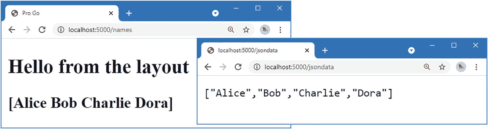
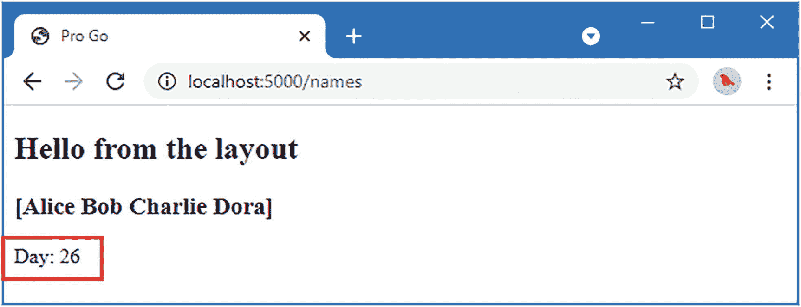
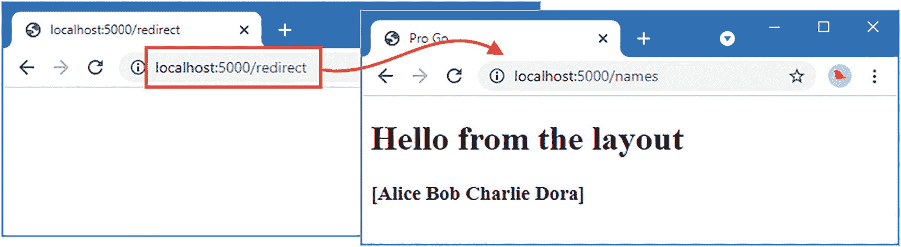
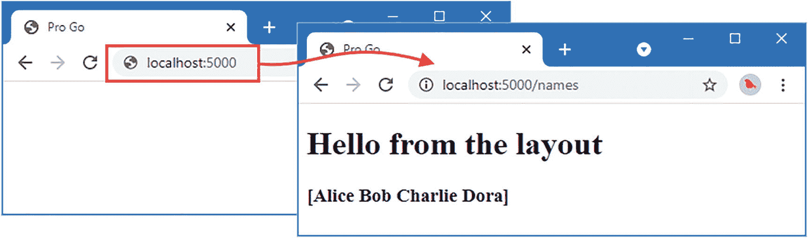
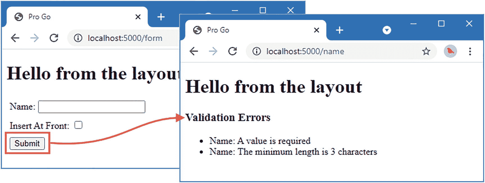
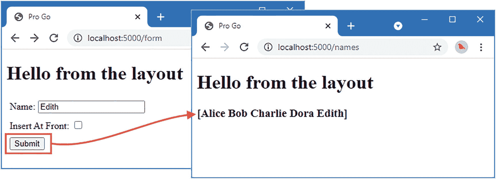
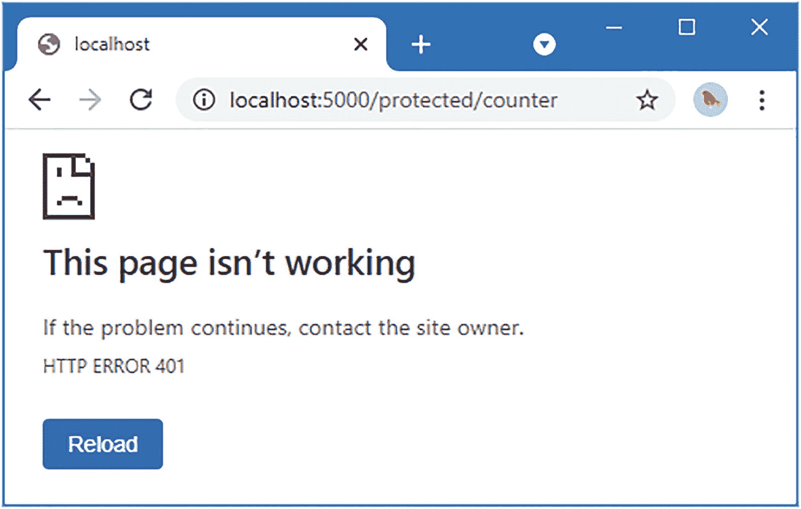
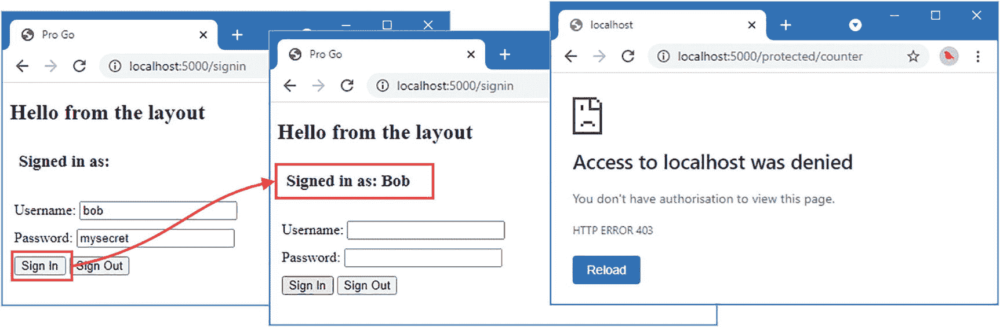
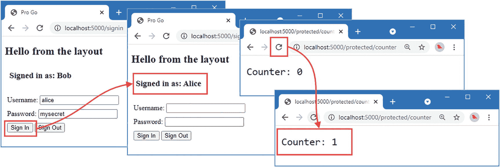

# 34. 操作、会话与授权

在本章中，我将在第 32 章开始、第 33 章继续的自定义 Web 应用程序平台的开发基础上，完成其开发。

提示

您可以从此书（以及书中所有其他章节）的示例项目下载地址 [`https://github.com/apress/pro-go`](https://github.com/apress/pro-go) 获取本章的示例项目。有关运行示例时遇到问题的帮助，请参阅第 2 章。

## 引入操作结果

目前，平台通过将请求处理器生成的响应以字符串形式写入来处理这些响应。我不希望让每个处理器方法都处理如何生成响应的具体细节，因为大多数响应将是相似的（大部分是渲染模板），并且我不希望每次都重复相同的代码。

相反，我将增加对操作结果的支持。操作结果是指示需要什么类型的响应的指令，以及生成该响应所需的任何附加信息。当处理器方法希望渲染一个模板作为响应时，它将返回一个选择该模板的操作结果，该操作将被执行，而无需处理器方法理解其发生过程。创建`platform/http/actionresults`文件夹，并向其中添加一个名为`actionresult.go`的文件，其内容如清单 34-1 所示。

```
package actionresults

import (
    "context"
    "net/http"
)

type ActionContext struct {
    context.Context
    http.ResponseWriter
}

type ActionResult interface {
    Execute(*ActionContext) error
}
清单 34-1：`http/actionresults`文件夹中`actionresult.go`文件的内容
```

`ActionResult`接口定义了一个`Execute`方法，该方法将使用`ActionContext`结构体提供的设施（一个用于获取服务的`Context`和一个用于生成响应的`ResponseWriter`）来生成响应。

清单 34-2 更新了调用处理器方法的代码，使其在使用操作结果时执行它们。

```
package handling

import (
    "platform/http/handling/params"
    "platform/pipeline"
    "platform/services"
    "net/http"
    "reflect"
    "strings"
    "io"
    "fmt"
    "platform/http/actionresults"
)

// ...为简洁起见，省略了函数和类型...

func (router *RouterComponent) invokeHandler(route Route, rawParams []string,
    context *pipeline.ComponentContext) error {
    paramVals, err := params.GetParametersFromRequest(context.Request,
        route.handlerMethod, rawParams)
    if (err == nil) {
        structVal := reflect.New(route.handlerMethod.Type.In(0))
        services.PopulateForContext(context.Context(), structVal.Interface())
        paramVals = append([]reflect.Value { structVal.Elem() }, paramVals...)
        result := route.handlerMethod.Func.Call(paramVals)
        if len(result) > 0 {
            if action, ok := result[0].Interface().(actionresults.ActionResult); ok {
                err = services.PopulateForContext(context.Context(), action)
                if (err == nil) {
                    err = action.Execute(&actionresults.ActionContext{
                        context.Context(), context.ResponseWriter  })
                }
            } else {
                io.WriteString(context.ResponseWriter,
                    fmt.Sprint(result[0].Interface()))
            }
        }
    }
    return err
}
清单 34-2：在`http/handling`文件夹的`request_dispatch.go`文件中执行操作结果
```

实现`ActionResult`接口的结构体被传递给`services.PopulateForContext`函数，以便其字段填充服务，然后调用`Execute`方法来生成结果。


### 定义通用操作结果

最常见的响应类型将通过模板生成，因此需要在 `platform/http/actionresults` 文件夹中添加一个名为 `templateresult.go` 的文件，其内容如代码清单 34-3 所示。

```
package actionresults
import (
"platform/templates"
)
func NewTemplateAction(name string, data interface{}) ActionResult {
return &TemplateActionResult{ templateName:  name, data: data }
}
type TemplateActionResult struct {
templateName string
data interface{}
templates.TemplateExecutor
}
func (action *TemplateActionResult) Execute(ctx *ActionContext) error {
return action.TemplateExecutor.ExecTemplate(ctx.ResponseWriter,
action.templateName, action.data)
}
```

`TemplateActionResult` 结构体是一种操作，它会在执行时渲染一个模板。其字段指定了模板名称、将传递给模板执行器的数据以及模板执行器服务。`NewTemplateAction` 函数用于创建 `TemplateActionResult` 结构体的新实例。

另一种常见的操作结果是重定向，这通常在处理完 `POST` 或 `PUT` 请求后执行。要创建这类操作结果，请在 `platform/http/actionresults` 文件夹中添加一个名为 `redirectresult.go` 的文件，其内容如代码清单 34-4 所示。

```
package actionresults
import "net/http"
func NewRedirectAction(url string) ActionResult {
return &RedirectActionResult{ url: url}
}
type RedirectActionResult struct {
url string
}
func (action *RedirectActionResult) Execute(ctx *ActionContext) error {
ctx.ResponseWriter.Header().Set("Location", action.url)
ctx.ResponseWriter.WriteHeader(http.StatusSeeOther)
return nil
}
```

此操作结果会产生一个 `303 See Other` 响应。这是一种重定向，它会指定一个新的 URL，并确保浏览器不会重复使用原始请求中的 HTTP 方法或 URL。

本节中要定义的另一个操作结果将允许处理方法返回一个 JSON 结果，这在第 38 章创建 Web 服务时会非常有用。请在 `platform/http/actionresults` 文件夹中创建一个名为 `jsonresult.go` 的文件，其内容如代码清单 34-5 所示。

```
package actionresults
import "encoding/json"
func NewJsonAction(data interface{}) ActionResult {
return &JsonActionResult{ data: data}
}
type JsonActionResult struct {
data interface{}
}
func (action *JsonActionResult) Execute(ctx *ActionContext) error {
ctx.ResponseWriter.Header().Set("Content-Type", "application/json")
encoder := json.NewEncoder(ctx.ResponseWriter)
return encoder.Encode(action.data)
}
```

此操作结果设置了 `Content-Type` 标头，以表明响应包含 JSON 数据，并使用 `encoding/json` 包中的编码器来序列化数据并将其发送给客户端。

最后一个内置操作结果将允许请求处理程序指示发生错误，并且无法创建正常响应。请在 `platform/http/actionresults` 文件夹中添加一个名为 `errorresult.go` 的文件，其内容如代码清单 34-6 所示。

```
package actionresults
func NewErrorAction(err error) ActionResult {
return &ErrorActionResult{err}
}
type ErrorActionResult struct {
error
}
func (action *ErrorActionResult) Execute(*ActionContext) error {
return action.error
}
```

此操作结果不会生成响应，而只是将请求处理方法中的错误传递到平台的其他部分。

### 更新占位符以使用操作结果

为确保操作结果按预期工作，代码清单 34-7 更改了占位符处理方法的结果。

```
package placeholder
import (
"fmt"
"platform/logging"
"platform/http/actionresults"
)
var names = []string{"Alice", "Bob", "Charlie", "Dora"}
type NameHandler struct {
logging.Logger
}
func (n NameHandler) GetName(i int) actionresults.ActionResult {
n.Logger.Debugf("GetName method invoked with argument: %v", i)
var response string
if (i < len(names)) {
response = fmt.Sprintf("Name #%v: %v", i, names[i])
} else {
response =  fmt.Sprintf("Index out of bounds")
}
return actionresults.NewTemplateAction("simple_message.html", response)
}
func (n NameHandler) GetNames() actionresults.ActionResult {
n.Logger.Debug("GetNames method invoked")
return actionresults.NewTemplateAction("simple_message.html", names)
}
type NewName struct {
Name string
InsertAtStart bool
}
func (n NameHandler) PostName(new NewName) actionresults.ActionResult {
n.Logger.Debugf("PostName method invoked with argument %v", new)
if (new.InsertAtStart) {
names = append([] string { new.Name}, names... )
} else {
names = append(names, new.Name)
}
return actionresults.NewRedirectAction("/names")
}
func (n NameHandler) GetJsonData() actionresults.ActionResult {
return actionresults.NewJsonAction(names)
}
```

这些变更意味着 `GetName` 和 `GetNames` 方法返回模板操作结果，`PostName` 方法返回一个重定向到 `GetNames` 方法的操作结果，而新增的 `GetJsonData` 方法则返回 JSON 数据。最后的变更是在占位符模板中添加一个表达式，如代码清单 34-8 所示。

```
{{ layout "layout.html" }}
{{ . }}
```

编译并执行该项目，然后使用浏览器请求 `http://localhost:5000/names`。现在，响应是通过执行模板生成的 HTML 文档，如图 34-1 所示。请求 `http://localhost:5000/jsondata`，响应将是 JSON 数据，同样如图 34-1 所示。



*图 34-1* – 使用操作结果生成响应


### 从模板中调用请求处理器

在后续章节中，我将会需要在一个处理器的输出中包含另一个处理器的模板内容，例如，为了在展示商品列表的模板中显示购物车详情。实现这个功能有些棘手，但它能避免处理器向其模板提供与其自身目标无关的数据。清单 34-9 修改了模板服务所使用的接口。

```go
package templates
import "io"

type TemplateExecutor interface {
    ExecTemplate(writer io.Writer, name string, data interface{}) (err error)
    ExecTemplateWithFunc(writer io.Writer, name string,
        data interface{}, handlerFunc InvokeHandlerFunc) (err error)
}

type InvokeHandlerFunc func(handlerName string, methodName string,
    args ...interface{}) interface{}
```
*清单 34-9：在 `templates` 文件夹中的 `template_executor.go` 文件中修改模板接口*

`ExecTemplate` 方法已被修改，它定义了一个 `ExecTemplateWithFunc` 方法，该方法接受一个 `InvokeHandlerFunc` 参数，用于在模板中调用处理器方法。为了支持这个新特性，清单 34-10 定义了一个新的占位符函数，使得模板在包含将执行处理器的关键字时也能被解析。

```go
package templates

import (
    "html/template"
    "sync"
    "errors"
    "platform/config"
)

var once = sync.Once{}

func LoadTemplates(c config.Configuration) (err error) {
    path, ok := c.GetString("templates:path")
    if !ok {
        return errors.New("Cannot load template config")
    }
    reload := c.GetBoolDefault("templates:reload", false)
    once.Do(func() {
        doLoad := func() (t *template.Template) {
            t = template.New("htmlTemplates")
            t.Funcs(map[string]interface{}{
                "body":    func() string { return "" },
                "layout":  func() string { return "" },
                "handler": func() interface{} { return "" },
            })
            t, err = t.ParseGlob(path)
            return
        }
        if reload {
            getTemplates = doLoad
        } else {
            var templates *template.Template
            templates = doLoad()
            getTemplates = func() *template.Template {
                t, _ := templates.Clone()
                return t
            }
        }
    })
    return
}
```
*清单 34-10：在 `templates` 文件夹中的 `template_loader.go` 文件中添加占位符函数*

如清单所示，我将使用关键字 `handler` 从模板内部调用处理器方法。清单 34-11 更新了模板执行器以支持 `handler` 关键字。

```go
package templates

import (
    "io"
    "strings"
    "html/template"
)

type LayoutTemplateProcessor struct{}

var emptyFunc = func(handlerName, methodName string,
    args ...interface{}) interface{} { return "" }

func (proc *LayoutTemplateProcessor) ExecTemplate(writer io.Writer,
    name string, data interface{}) (err error) {
    return proc.ExecTemplateWithFunc(writer, name, data, emptyFunc)
}

func (proc *LayoutTemplateProcessor) ExecTemplateWithFunc(writer io.Writer,
    name string, data interface{},
    handlerFunc InvokeHandlerFunc) (err error) {
    var sb strings.Builder
    layoutName := ""
    localTemplates := getTemplates()
    localTemplates.Funcs(map[string]interface{}{
        "body":    insertBodyWrapper(&sb),
        "layout":  setLayoutWrapper(&layoutName),
        "handler": handlerFunc,
    })
    err = localTemplates.ExecuteTemplate(&sb, name, data)
    if layoutName != "" {
        localTemplates.ExecuteTemplate(writer, layoutName, data)
    } else {
        io.WriteString(writer, sb.String())
    }
    return
}

var getTemplates func() (t *template.Template)

func insertBodyWrapper(body *strings.Builder) func() template.HTML {
    return func() template.HTML {
        return template.HTML(body.String())
    }
}

func setLayoutWrapper(val *string) func(string) string {
    return func(layout string) string {
        *val = layout
        return ""
    }
}
```
*清单 34-11：在 `templates` 文件夹中的 `layout_executor.go` 文件中更新模板执行*

清单 34-12 更新了模板操作结果，使其使用新的参数调用 `ExecTemplate` 方法。

```go
package actionresults

import (
    "platform/templates"
)

func NewTemplateAction(name string, data interface{}) ActionResult {
    return &TemplateActionResult{templateName: name, data: data}
}

type TemplateActionResult struct {
    templateName string
    data         interface{}
    templates.TemplateExecutor
    templates.InvokeHandlerFunc
}

func (action *TemplateActionResult) Execute(ctx *ActionContext) error {
    return action.TemplateExecutor.ExecTemplateWithFunc(ctx.ResponseWriter,
        action.templateName, action.data, action.InvokeHandlerFunc)
}
```
*清单 34-12：在 `http/actionresults` 文件夹中的 `templateresult.go` 文件中添加参数*

`Execute` 方法使用服务功能来获取一个 `InvokeHandlerFunc` 值，然后将其传递给模板执行器。


### 更新请求处理

要实现此功能，我需要为 `InvokeHandlerFunc` 类型创建一个服务。在 `platform/http` 文件夹下，添加一个名为 `handler_func.go` 的文件，其内容参见代码清单 34-13。

```
package handling
import (
"context"
"fmt"
"html/template"
"net/http"
"platform/http/actionresults"
"platform/services"
"platform/templates"
"reflect"
"strings"
)
func createInvokehandlerFunc(ctx context.Context,
routes []Route) templates.InvokeHandlerFunc {
return func(handlerName, methodName string, args ...interface{}) interface{} {
var err error
for _, route := range routes {
if strings.EqualFold(handlerName, route.handlerName) &&
strings.EqualFold(methodName, route.handlerMethod.Name) {
paramVals := make([]reflect.Value, len(args))
for i := 0; i < len(args); i++ {
paramVals[i] = reflect.ValueOf(args[i])
}
structVal := reflect.New(route.handlerMethod.Type.In(0))
services.PopulateForContext(ctx, structVal.Interface())
paramVals = append([]reflect.Value { structVal.Elem() },
paramVals...)
result := route.handlerMethod.Func.Call(paramVals)
if action, ok := result[0].Interface().
(*actionresults.TemplateActionResult); ok {
invoker := createInvokehandlerFunc(ctx, routes)
err = services.PopulateForContextWithExtras(ctx,
action,
map[reflect.Type]reflect.Value {
reflect.TypeOf(invoker): reflect.ValueOf(invoker),
})
writer := &stringResponseWriter{ Builder: &strings.Builder{} }
if err == nil {
err = action.Execute(&actionresults.ActionContext{
Context: ctx,
ResponseWriter: writer,
})
if err == nil {
return (template.HTML)(writer.Builder.String())
}
}
} else {
return fmt.Sprint(result[0])
}
}
}
if err == nil {
err = fmt.Errorf("No route found for %v %v", handlerName, methodName)
}
panic(err)
}
}
type stringResponseWriter struct {
*strings.Builder
}
func (sw *stringResponseWriter) Write(data []byte) (int, error) {
return sw.Builder.Write(data)
}
func (sw *stringResponseWriter) WriteHeader(statusCode int) {}
func (sw *stringResponseWriter) Header() http.Header { return http.Header{}}
代码清单 34-13
http/handling 文件夹中 handler_func.go 文件的内容
```

`createInvokehandlerFunc` 函数会创建一个函数，该函数使用一组路由来查找并执行处理程序方法。处理程序的输出是一个 `string`，可以包含在模板中。

代码清单 34-14 更新了执行操作结果的代码，以提供一个可用于调用处理程序的函数。

```
...
func (router *RouterComponent) invokeHandler(route Route, rawParams []string,
context *pipeline.ComponentContext) error {
paramVals, err := params.GetParametersFromRequest(context.Request,
route.handlerMethod, rawParams)
if (err == nil) {
structVal := reflect.New(route.handlerMethod.Type.In(0))
services.PopulateForContext(context.Context(), structVal.Interface())
paramVals = append([]reflect.Value { structVal.Elem() }, paramVals...)
result := route.handlerMethod.Func.Call(paramVals)
if len(result) > 0 {
if action, ok := result[0].Interface().(actionresults.ActionResult); ok {
invoker := createInvokehandlerFunc(context.Context(), router.routes)
err = services.PopulateForContextWithExtras(context.Context(),
action,
map[reflect.Type]reflect.Value {
reflect.TypeOf(invoker): reflect.ValueOf(invoker),
})
if (err == nil) {
err = action.Execute(&actionresults.ActionContext{
context.Context(), context.ResponseWriter  })
}
} else {
io.WriteString(context.ResponseWriter,
fmt.Sprint(result[0].Interface()))
}
}
}
return err
}
...
代码清单 34-14
在 http/handling 文件夹的 request_dispatch.go 文件中更新结果执行
```

我本可以为调用处理程序的函数创建一个服务，但我希望确保操作接收到的函数，使用的是处理该请求的 URL 路由器。正如你将在本章后续看到的，我将使用多个 URL 路由来处理不同类型的请求，我不希望由一个路由器管理的处理程序，去调用另一个路由器管理的处理程序的方法。

### 配置应用程序

需要做一些更改，以确保模板能够调用处理程序方法。首先，在 `placeholder` 文件夹下添加一个名为 `day_handler.go` 的文件，其内容参见代码清单 34-15，从而创建一个新的请求处理程序。

```
package placeholder
import (
"platform/logging"
"time"
"fmt"
)
type DayHandler struct {
logging.Logger
}
func (dh DayHandler) GetDay() string {
return  fmt.Sprintf("Day: %v", time.Now().Day())
}
代码清单 34-15
placeholder 文件夹中 day_handler.go 文件的内容
```

接下来，注册新的请求处理程序，如代码清单 34-16 所示。

```
...
func createPipeline() pipeline.RequestPipeline {
return pipeline.CreatePipeline(
&basic.ServicesComponent{},
&basic.LoggingComponent{},
&basic.ErrorComponent{},
&basic.StaticFileComponent{},
//&SimpleMessageComponent{},
handling.NewRouter(
handling.HandlerEntry{ "",  NameHandler{}},
handling.HandlerEntry{ "",  DayHandler{}},
),
)
}
...
代码清单 34-16
在 placeholder 文件夹的 startup.go 文件中注册一个新的处理程序
```

最后，添加一个表达式来调用在代码清单 34-15 中定义的 `GetDay` 方法，如代码清单 34-17 所示。

```
{{ layout "layout.html" }}
{{ . }}
{{ handler "day" "getday"}}
代码清单 34-17
在 placeholder 文件夹的 simple_message.html 文件中添加一个表达式
```

编译并执行应用程序，然后请求 `http://localhost:5000/names`；你将看到，通过渲染 `simple_message.html` 模板产生的结果中，包含了 `GetDay` 方法的结果，如图 34-2 所示，不过还会额外输出你运行示例时的日期信息。



图 34-2

从模板中调用处理程序


### 从路由生成 URL

在清单 34-7 中，当我想将浏览器重定向到一个新的 URL 时，不得不像下面这样指定 URL：

```
return actionresults.NewRedirectAction("/names")
```

这种方式并不理想，因为更改路由配置可能会导致这种硬编码的 URL 失效。更可靠的方法是添加对指定处理程序方法的支持，并根据与之关联的路由配置生成 URL。在 `http/handling` 文件夹中添加一个名为 `url_generation.go` 的文件，其内容如清单 34-18 所示。

```
package handling
import (
"fmt"
"net/http"
"strings"
"errors"
"reflect"
)
type URLGenerator interface {
GenerateUrl(method interface{}, data ...interface{}) (string, error)
GenerateURLByName(handlerName, methodName string,
data ...interface{}) (string, error)
AddRoutes(routes []Route)
}
type routeUrlGenerator struct {
routes []Route
}
func (gen *routeUrlGenerator) AddRoutes(routes []Route) {
if gen.routes == nil {
gen.routes = routes
} else {
gen.routes = append(gen.routes, routes...)
}
}
func (gen *routeUrlGenerator) GenerateUrl(method interface{},
data ...interface{}) (string, error) {
methodVal := reflect.ValueOf(method)
if methodVal.Kind() == reflect.Func &&
methodVal.Type().In(0).Kind() == reflect.Struct {
for _, route := range gen.routes {
if route.handlerMethod.Func.Pointer() == methodVal.Pointer() {
return generateUrl(route, data...)
}
}
}
return "", errors.New("No matching route")
}
func (gen *routeUrlGenerator) GenerateURLByName(handlerName, methodName string,
data ...interface{}) (string, error) {
for _, route := range gen.routes {
if strings.EqualFold(route.handlerName, handlerName) &&
strings.EqualFold(route.httpMethod + route.actionName, methodName) {
return generateUrl(route, data...)
}
}
return "", errors.New("No matching route")
}
func generateUrl(route Route, data ...interface{}) (url string, err error) {
url = "/" + route.prefix
if (!strings.HasPrefix(url, "/")) {
url = "/" + url
}
if (!strings.HasSuffix(url, "/")) {
url += "/"
}
url+= strings.ToLower(route.actionName)
if len(data) > 0 && !strings.EqualFold(route.httpMethod, http.MethodGet) {
err = errors.New("Only GET handler can have data values")
} else if strings.EqualFold(route.httpMethod, http.MethodGet) &&
len(data) != route.handlerMethod.Type.NumIn() -1 {
err = errors.New("Number of data values doesn't match method params")
} else {
for _, val := range data {
url = fmt.Sprintf("%v/%v", url, val)
}
}
return
}
```

`URLGenerator` 接口定义了名为 `GenerateURL` 和 `GenerateURLByName` 的方法。`GenerateURL` 方法接收一个处理程序函数，并用它来定位路由；而 `GenerateURLByName` 方法则使用字符串值来定位处理程序函数。`routeUrlGenerator` 结构体实现了 `URLGenerator` 的方法，它利用路由来生成 URL。

## 创建 URL 生成器服务

我想为 `URLGenerator` 接口创建一个服务，但希望该服务仅在请求管道配置为使用第 33 章定义的路由功能时可用。清单 34-19 在路由中间件组件实例化时设置了这个服务。

```
func NewRouter(handlers ...HandlerEntry) *RouterComponent {
routes := generateRoutes(handlers...)
var urlGen URLGenerator
services.GetService(&urlGen)
if urlGen == nil {
services.AddSingleton(func () URLGenerator {
return &routeUrlGenerator { routes: routes }
})
} else {
urlGen.AddRoutes(routes)
}
return &RouterComponent{ routes: routes }
}
```

这个新服务意味着我可以以编程方式生成 URL，如清单 34-20 所示。

```
package placeholder
import (
"fmt"
"platform/logging"
"platform/http/actionresults"
"platform/http/handling"
)
var names = []string{"Alice", "Bob", "Charlie", "Dora"}
type NameHandler struct {
logging.Logger
handling.URLGenerator
}
func (n NameHandler) GetName(i int) actionresults.ActionResult {
n.Logger.Debugf("GetName method invoked with argument: %v", i)
var response string
if (i < len(names)) {
response = fmt.Sprintf("Name #%v: %v", i, names[i])
} else {
response =  fmt.Sprintf("Index out of bounds")
}
return actionresults.NewTemplateAction("simple_message.html", response)
}
func (n NameHandler) GetNames() actionresults.ActionResult {
n.Logger.Debug("GetNames method invoked")
return actionresults.NewTemplateAction("simple_message.html", names)
}
type NewName struct {
Name string
InsertAtStart bool
}
func (n NameHandler) PostName(new NewName) actionresults.ActionResult {
n.Logger.Debugf("PostName method invoked with argument %v", new)
if (new.InsertAtStart) {
names = append([] string { new.Name}, names... )
} else {
names = append(names, new.Name)
}
return n.redirectOrError(NameHandler.GetNames)
}
func (n NameHandler) GetRedirect() actionresults.ActionResult {
return n.redirectOrError(NameHandler.GetNames)
}
func (n NameHandler) GetJsonData() actionresults.ActionResult {
return actionresults.NewJsonAction(names)
}
func (n NameHandler) redirectOrError(handler interface{},
data ...interface{}) actionresults.ActionResult {
url, err := n.GenerateUrl(handler)
if (err == nil) {
return actionresults.NewRedirectAction(url)
} else {
return actionresults.NewErrorAction(err)
}
}
```

这个新服务使得可以动态生成 URL，反映已定义的路由。测试 POST 请求不太方便，因此清单 34-20 添加了一个名为 `GetRedirect` 的新处理方法，它接收 GET 请求并重定向到通过指定 `GetNames` 方法创建的 URL：

```
return n.redirectOrError(NameHandler.GetNames)
```

请注意，在选择处理方法时没有使用括号，因为生成 URL 需要的是方法本身，而不是调用它产生的结果。

编译并执行项目，然后使用浏览器请求 `http://localhost:5000/redirect`。浏览器将自动重定向到指向 `GetNames` 方法的 URL，如图 34-3 所示。




### 定义别名路由

对 URL 生成的支持简化了定义路由的过程，这些路由能将 URL 匹配到处理方法，但除了直接从处理方法生成的路由之外，还存在一些缺口。例如，占位符路由支持的 URL 存在空白，这意味着对默认 URL `http://localhost:5000/` 的请求会返回 404 - 未找到的结果。在本节中，我将添加对定义并非直接源于处理结构体及其方法的额外路由的支持，从而填补此类空白。

在 `platform/http/handling` 文件夹中添加一个名为 `alias_route.go` 的文件，内容如清单 34-21 所示。

```go
package handling
import (
"platform/http/actionresults"
"platform/services"
"net/http"
"reflect"
"regexp"
"fmt"
)
func (rc *RouterComponent) AddMethodAlias(srcUrl string,
method interface{}, data ...interface{}) *RouterComponent {
var urlgen URLGenerator
services.GetService(&urlgen)
url, err := urlgen.GenerateUrl(method, data...)
if (err == nil) {
return rc.AddUrlAlias(srcUrl, url)
} else {
panic(err)
}
}
func (rc *RouterComponent) AddUrlAlias(srcUrl string,
targetUrl string) *RouterComponent {
aliasFunc := func(interface{}) actionresults.ActionResult {
return actionresults.NewRedirectAction(targetUrl)
}
alias := Route {
httpMethod: http.MethodGet,
handlerName: "Alias",
actionName: "Redirect",
expression: *regexp.MustCompile(fmt.Sprintf("^%v[/]?$", srcUrl)),
handlerMethod: reflect.Method{
Type: reflect.TypeOf(aliasFunc),
Func: reflect.ValueOf(aliasFunc),
},
}
rc.routes = append([]Route { alias},  rc.routes... )
return rc
}
```

该文件为 `RouterComponent` 结构体定义了额外的方法。`AddUrlAlias` 方法创建了一个 `Route`，但它是通过创建一个 `reflect.Method` 来实现的，该 `reflect.Method` 调用一个生成重定向操作结果的函数。人们很容易忘记 `reflect` 包定义的类型只是常规的 Go 结构体和接口，但 `Method` 本身就是一个结构体，我可以设置其 `Type` 和 `Func` 字段，使得别名函数看起来像是执行路由的代码中的一个常规方法。

`AddMethodAlias` 方法允许使用 URL 和处理方法来创建路由。使用 `URLGenerator` 服务为处理方法生成 URL，然后将该 URL 传递给 `AddUrlAlias` 方法。

清单 34-22 向占位符路由集合添加了一个别名，这样对默认 URL 的请求会被重定向，从而由 `GetNames` 处理方法进行处理。

```go
package placeholder
import (
"platform/http"
"platform/pipeline"
"platform/pipeline/basic"
"platform/services"
"sync"
"platform/http/handling"
)
func createPipeline() pipeline.RequestPipeline {
return pipeline.CreatePipeline(
&basic.ServicesComponent{},
&basic.LoggingComponent{},
&basic.ErrorComponent{},
&basic.StaticFileComponent{},
//&SimpleMessageComponent{},
handling.NewRouter(
handling.HandlerEntry{ "",  NameHandler{}},
handling.HandlerEntry{ "",  DayHandler{}},
).AddMethodAlias("/", NameHandler.GetNames),
)
}
func Start() {
results, err := services.Call(http.Serve, createPipeline())
if (err == nil) {
(results[0].(*sync.WaitGroup)).Wait()
} else {
panic(err)
}
}
```

编译并执行项目，然后使用浏览器请求 `http://localhost:5000`。浏览器将不会收到 404 响应，而是会被重定向，如图 34-4 所示。



**图 34-4** – 别名路由的效果

### 验证请求数据

一旦应用程序开始接受用户数据，验证的需求就会随之而来。用户可能会在表单字段中输入任何内容，有时是因为说明不清晰，有时则是因为他们只想尽快完成整个流程。通过将验证定义为一项服务，我可以最大限度地减少各个处理程序需要实现的代码量。

由于服务无法知道处理程序需要哪些验证要求，我需要某种方式来将这些要求描述为处理程序处理的数据类型的一部分。最简单的方法是使用结构体标签，通过它可以表达一些基本的验证要求。

创建 `platform/validation` 文件夹，并在其中添加一个名为 `validator.go` 的文件，内容如清单 34-23 所示。

```go
package validation
type Validator interface {
Validate(data interface{}) (ok bool, errs []ValidationError)
}
type ValidationError struct {
FieldName string
Error error
}
type ValidatorFunc func(fieldName string, value interface{},
arg string) (bool, error)
func DefaultValidators() map[string]ValidatorFunc {
return map[string]ValidatorFunc {
"required": required,
"min": min,
}
}
```

`Validator` 接口将用于提供验证作为一项服务，单个验证检查由 `ValidatorFunc` 函数执行。我将定义两个验证器：`required` 和 `min`。`required` 将确保为 `string` 值提供一个值，而 `min` 将对 `int` 和 `float64` 值强制执行最小值，并对 `string` 值强制执行最小长度。根据需要可以定义其他验证器，但对于本项目来说，这两个已经足够。为了定义验证器函数，在 `platform/validation` 文件夹中添加一个名为 `validator_functions.go` 的文件，内容如清单 34-24 所示。

```go
package validation
import (
"errors"
"fmt"
"strconv"
)
func required(fieldName string, value interface{},
arg string) (valid bool, err error) {
if str, ok := value.(string); ok {
valid = str != ""
err = fmt.Errorf("A value is required")
} else {
err = errors.New("The required validator is for strings")
}
return
}
func min(fieldName string, value interface{}, arg string) (valid bool, err error) {
minVal, err := strconv.Atoi(arg)
if err != nil {
panic("Invalid arguments for validator: " + arg)
}
err = fmt.Errorf("The minimum value is %v", minVal)
if iVal, iValOk := value.(int); iValOk {
valid = iVal >= minVal
} else if fVal, fValOk := value.(float64); fValOk {
valid = fVal >= float64(minVal)
} else if strVal, strValOk := value.(string); strValOk {
err = fmt.Errorf("The minimum length is %v characters", minVal)
valid = len(strVal) >= minVal
} else {
err = errors.New("The min validator is for int, float64, and str values")
}
return
}
```

为了执行验证，每个函数接收正在验证的结构体字段的名称、从请求中获取的值以及配置验证过程的可选参数。为了创建实现以及设置服务的函数，在 `platform/validation` 文件夹中添加一个名为 `tag_validator.go` 的文件，内容如清单 34-25 所示。


```go
package validation
import (
"reflect"
"strings"
)
func NewDefaultValidator(validators map[string]ValidatorFunc) Validator {
return &TagValidator{ DefaultValidators() }
}
type TagValidator struct {
validators map[string]ValidatorFunc
}
func (tv *TagValidator) Validate(data interface{}) (ok bool,
errs []ValidationError) {
errs = []ValidationError{}
dataVal := reflect.ValueOf(data)
if (dataVal.Kind() == reflect.Ptr) {
dataVal = dataVal.Elem()
}
if (dataVal.Kind() != reflect.Struct) {
panic("Only structs can be validated")
}
for i := 0; i < dataVal.NumField(); i++ {
fieldType := dataVal.Type().Field(i)
validationTag, found := fieldType.Tag.Lookup("validation")
if found {
for _, v := range strings.Split(validationTag, ",") {
var name, arg string = "", ""
if strings.Contains(v, ":") {
nameAndArgs := strings.SplitN(v, ":", 2)
name = nameAndArgs[0]
arg = nameAndArgs[1]
} else {
name = v
}
if validator, ok := tv.validators[name]; ok {
valid, err := validator(fieldType.Name,
dataVal.Field(i).Interface(), arg )
if (!valid) {
errs = append(errs, ValidationError{
FieldName: fieldType.Name,
Error: err,
})
}
} else {
panic("Unknown validator: " + name)
}
}
}
}
ok = len(errs) == 0
return
}
```

清单 34-25
`validation` 文件夹中 `tag_validator.go` 文件的内容

`TagValidator` 结构体通过查找名为 `validation` 的结构体标签，并解析该标签以确定结构体的每个字段需要哪些验证（如果需要的话），从而实现了 `Validator` 接口。每个指定的验证器都会被使用，并且错误会被收集起来，作为 `Validate` 方法的结果返回。`NewDefaultValidation` 函数用于实例化该结构体并创建验证服务，如清单 34-26 所示。

```go
package services
import (
"platform/logging"
"platform/config"
"platform/templates"
"platform/validation"
)
func RegisterDefaultServices() {
// ...为简洁起见，省略了语句...
err = AddSingleton(
func() validation.Validator {
return validation.NewDefaultValidator(validation.DefaultValidators())
})
if (err != nil) {
panic(err)
}
}
```

清单 34-26
在 `services` 文件夹中的 `services_default.go` 文件里注册验证服务

我已将该新服务注册为单例，并使用由 `DefaultValidators` 函数返回的验证器。

## 执行数据验证

为了检查数据验证是否正常工作，需要进行一些准备工作。首先，清单 34-27 创建了一个新的处理器方法，并将验证结构体标签应用到占位符请求处理器上。

```go
package placeholder
import (
"fmt"
"platform/logging"
"platform/http/actionresults"
"platform/http/handling"
"platform/validation"
)
var names = []string{"Alice", "Bob", "Charlie", "Dora"}
type NameHandler struct {
logging.Logger
handling.URLGenerator
validation.Validator
}
func (n NameHandler) GetName(i int) actionresults.ActionResult {
n.Logger.Debugf("GetName method invoked with argument: %v", i)
var response string
if (i < len(names)) {
response = fmt.Sprintf("Name #%v: %v", i, names[i])
} else {
response =  fmt.Sprintf("Index out of bounds")
}
return actionresults.NewTemplateAction("simple_message.html", response)
}
func (n NameHandler) GetNames() actionresults.ActionResult {
n.Logger.Debug("GetNames method invoked")
return actionresults.NewTemplateAction("simple_message.html", names)
}
type NewName struct {
Name string `validation:"required,min:3"`
InsertAtStart bool
}
func (n NameHandler) GetForm() actionresults.ActionResult {
postUrl, _ := n.URLGenerator.GenerateUrl(NameHandler.PostName)
return actionresults.NewTemplateAction("name_form.html", postUrl)
}
func (n NameHandler) PostName(new NewName) actionresults.ActionResult {
n.Logger.Debugf("PostName method invoked with argument %v", new)
if ok, errs := n.Validator.Validate(&new); !ok {
return actionresults.NewTemplateAction("validation_errors.html", errs)
}
if (new.InsertAtStart) {
names = append([] string { new.Name}, names... )
} else {
names = append(names, new.Name)
}
return n.redirectOrError(NameHandler.GetNames)
}
func (n NameHandler) GetRedirect() actionresults.ActionResult {
return n.redirectOrError(NameHandler.GetNames)
}
func (n NameHandler) GetJsonData() actionresults.ActionResult {
return actionresults.NewJsonAction(names)
}
func (n NameHandler) redirectOrError(handler interface{},
data ...interface{}) actionresults.ActionResult {
url, err := n.GenerateUrl(handler)
if (err == nil) {
return actionresults.NewRedirectAction(url)
} else {
return actionresults.NewErrorAction(err)
}
}
```

清单 34-27
在 `placeholder` 文件夹中的 `name_handler.go` 文件里准备验证

`validation` 标签已添加到 `Name` 字段，应用了 `required` 和 `min` 验证器，这意味着该字段为必填项，且最少需要三个字符。为了使验证更易于测试，我添加了一个名为 `GetForm` 的处理器方法，该方法渲染一个名为 `name_form.html` 的模板。当 `PostName` 方法接收到数据时，会使用该服务进行验证，如果存在验证错误，则使用 `validation_errors.html` 模板来生成响应。

在 `placeholder` 文件夹中添加一个名为 `name_form.html` 的文件，内容如清单 34-28 所示。

```html
{{ layout "layout.html" }}

<form method="POST" action="{{.}}">
  Name: <input type="text" name="Name" />
  Insert At Front: <input type="checkbox" name="InsertAtStart" value="true" />
  <input type="submit" value="Submit" />
</form>
```

清单 34-28
`placeholder` 文件夹中 `name_form.html` 文件的内容

该模板生成一个简单的 HTML 表单，用于将数据发送到从处理器方法获取的 URL。在 `placeholder` 文件夹中添加一个名为 `validation_errors.html` 的文件，内容如清单 34-29 所示。

```html
{{ layout "layout.html" }}
<h1>Validation Errors</h1>
<ul>
{{ range . }}
<li>{{.FieldName}}: {{ .Error }}</li>
{{ end }}
</ul>
```

清单 34-29
`placeholder` 文件夹中 `validation_errors.html` 文件的内容

从处理器方法收到的验证错误切片会以列表形式显示。编译并执行该项目，然后使用浏览器请求 `http://localhost:5000/form`。在不向 Name 字段输入值的情况下点击 Submit 按钮，您将看到来自 `required` 和 `min` 验证器的错误，如图 34-5 所示。



图 34-5

显示验证错误

如果您输入的姓名少于三个字符，那么您只会看到来自 `min` 验证器的警告。如果您输入三个或更多字符的姓名，则该姓名将被添加到姓名列表中，如图 34-6 所示。



图 34-6

通过数据验证


### 添加会话

会话利用 Cookie 来关联相关的 HTTP 请求，使得用户一次操作的结果能够体现在后续操作中。尽管我强烈建议自己编写平台来学习 Go 语言及其标准库，但这并不包括安全相关的特性——这些领域需要使用经过精心设计和充分测试的代码。Cookie 和会话看似与安全无关，但它们构成了许多应用程序在验证用户凭据后识别用户身份的基础。粗心编写的会话功能可能导致用户绕过访问控制或访问其他用户的数据。

在第 32 章中，我推荐了 Gorilla Web 工具包，作为替代自建框架的良好起点。Gorilla 工具包提供的其中一个包名为`sessions`，它支持安全地创建和管理会话。本章将使用此包来添加会话支持。在`platform`文件夹中运行列表 34-30 所示的命令，以下载并安装`sessions`包。

```bash
go get github.com/gorilla/sessions
```
*列表 34-30：安装包*

### 延迟写入响应数据

在请求处理的管道方法中使用 Cookie 处理会话会带来一个问题。会话在处理器方法执行之前获取，在方法执行过程中被修改，然后在处理器方法完成后更新会话 Cookie。这会造成问题，因为处理器已经向`ResponseWriter`写入了数据，之后便无法再更新响应头中的 Cookie。在`pipeline`文件夹中添加一个名为`deferredwriter.go`的代码文件，内容如列表 34-31 所示。（这个写入器类似于我在模板中调用处理器时创建的那个。我更倾向于在拦截请求和响应数据时定义单独的类型，因为拦截数据的使用方式可能会随时间变化。）

```go
package pipeline

import (
	"net/http"
	"strings"
)

type DeferredResponseWriter struct {
	http.ResponseWriter
	strings.Builder
	statusCode int
}

func (dw *DeferredResponseWriter) Write(data []byte) (int, error) {
	return dw.Builder.Write(data)
}

func (dw *DeferredResponseWriter) FlushData() {
	if dw.statusCode == 0 {
		dw.statusCode = http.StatusOK
	}
	dw.ResponseWriter.WriteHeader(dw.statusCode)
	dw.ResponseWriter.Write([]byte(dw.Builder.String()))
}

func (dw *DeferredResponseWriter) WriteHeader(statusCode int) {
	dw.statusCode = statusCode
}
```
*列表 34-31：`pipeline`文件夹中`deferredwriter.go`文件的内容*

`DeferredResponseWriter`是`ResponseWriter`的一个包装器，它不会立即写入响应，直到调用`FlushData`方法时才会写入，在此之前数据都保存在内存中。列表 34-32 在创建传递给中间件组件的上下文时，使用了`DeferredResponseWriter`。

```go
func (pl RequestPipeline) ProcessRequest(req *http.Request,
	resp http.ResponseWriter) error {
	deferredWriter := &DeferredResponseWriter{ResponseWriter: resp}
	ctx := ComponentContext{
		Request:        req,
		ResponseWriter: deferredWriter,
	}
	pl(&ctx)
	if ctx.error == nil {
		deferredWriter.FlushData()
	}
	return ctx.error
}
```
*列表 34-32：在`pipeline`文件夹的`pipeline.go`文件中使用修改后的写入器*

此更改允许在请求沿着管道返回时设置响应头。

### 创建会话接口、服务和中间件

我将将会话作为服务提供，并使用接口，以便平台的其他部分不直接依赖 Gorilla 工具包，从而在需要时易于更换不同的会话包。

创建`platform/sessions`文件夹，并添加一个名为`sessions.go`的文件，内容如列表 34-33 所示。

```go
package sessions

import (
	"context"
	"platform/services"
	gorilla "github.com/gorilla/sessions"
)

const SESSION__CONTEXT_KEY string = "pro_go_session"

func RegisterSessionService() {
	err := services.AddScoped(func(c context.Context) Session {
		val := c.Value(SESSION__CONTEXT_KEY)
		if s, ok := val.(*gorilla.Session); ok {
			return &SessionAdaptor{gSession: s}
		} else {
			panic("Cannot get session from context")
		}
	})
	if err != nil {
		panic(err)
	}
}

type Session interface {
	GetValue(key string) interface{}
	GetValueDefault(key string, defVal interface{}) interface{}
	SetValue(key string, val interface{})
}

type SessionAdaptor struct {
	gSession *gorilla.Session
}

func (adaptor *SessionAdaptor) GetValue(key string) interface{} {
	return adaptor.gSession.Values[key]
}

func (adaptor *SessionAdaptor) GetValueDefault(key string,
	defVal interface{}) interface{} {
	if val, ok := adaptor.gSession.Values[key]; ok {
		return val
	}
	return defVal
}

func (adaptor *SessionAdaptor) SetValue(key string, val interface{}) {
	if val == nil {
		adaptor.gSession.Values[key] = nil
	} else {
		switch typedVal := val.(type) {
		case int, float64, bool, string:
			adaptor.gSession.Values[key] = typedVal
		default:
			panic("Sessions only support int, float64, bool, and string values")
		}
	}
}
```
*列表 34-33：`sessions`文件夹中`sessions.go`文件的内容*

为避免名称冲突，我使用`gorilla`作为别名导入了 Gorilla 工具包。`Session`接口定义了获取和设置会话值的方法，该接口由`SessionAdaptor`结构体实现并映射到 Gorilla 的功能。`RegisterSessionService`函数注册了一个单例服务，该服务从当前`Context`中获取 Gorilla 包的会话，并将其包装在`SessionAdaptor`中。

与会话关联的任何数据都将保存到 Cookie 中。为避免结构体和切片带来的问题，`SetValue`方法仅接受`int`、`float64`、`bool`和`string`类型的值，并支持传入`nil`以从会话中移除某个值。

中间件组件将负责在请求沿管道传递时创建会话，并在请求返回时保存会话。在`platform/sessions`文件夹中添加一个名为`session_middleware.go`的文件，内容如列表 34-34 所示。

> **注意**
> 我选择了最简单的存储会话方式，即将会话数据存储在发送给浏览器的响应 Cookie 中。这限制了可以安全存储在会话中的数据类型范围，并且仅适用于存储少量数据的会话。还有其他的会话存储方式，可以将数据存储在数据库中，从而解决这些问题。请参阅[`github.com/gorilla/sessions`](https://github.com/gorilla/sessions)获取可用存储包的列表。


```go
package sessions
import (
"context"
"time"
"platform/config"
"platform/pipeline"
gorilla "github.com/gorilla/sessions"
)
type SessionComponent struct {
store *gorilla.CookieStore
config.Configuration
}
func (sc *SessionComponent) Init() {
cookiekey, found := sc.Configuration.GetString("sessions:key")
if !found {
panic("Session key not found in configuration")
}
if sc.GetBoolDefault("sessions:cyclekey", true) {
cookiekey += time.Now().String()
}
sc.store = gorilla.NewCookieStore([]byte(cookiekey))
}
func (sc *SessionComponent) ProcessRequest(ctx *pipeline.ComponentContext,
next func(*pipeline.ComponentContext)) {
session, _ := sc.store.Get(ctx.Request, SESSION__CONTEXT_KEY)
c := context.WithValue(ctx.Request.Context(), SESSION__CONTEXT_KEY, session)
ctx.Request = ctx.Request.WithContext(c)
next(ctx)
session.Save(ctx.Request, ctx.ResponseWriter)
}
```

`Init`方法创建一个 cookie 存储，这是 Gorilla 包支持存储会话的方式之一。`ProcessRequest`方法在将请求沿管道传递给`next`参数函数之前，从存储中获取一个会话。当请求沿管道返回时，会话会被保存到存储中。

如果`sessions:cyclekey`配置设置为`true`，则用于会话 cookie 的名称将包含中间件组件初始化时的时间。这在开发期间很有用，因为它意味着每次应用程序启动时会话都会重置。

### 创建使用会话的处理程序

为了简单验证会话功能是否正常工作，请在`placeholder`文件夹中添加一个名为`counter_handler.go`的文件，其内容如列表 34-35 所示。

```go
package placeholder
import (
"fmt"
"platform/sessions"
)
type CounterHandler struct {
sessions.Session
}
func (c CounterHandler) GetCounter() string {
counter := c.Session.GetValueDefault("counter", 0).(int)
c.Session.SetValue("counter", counter + 1)
return fmt.Sprintf("Counter: %v", counter)
}
```

该处理程序通过定义一个结构体字段来声明其对`Session`的依赖关系，当结构体被实例化以处理请求时，该字段将被填充。`GetCounter`方法从会话中获取名为`counter`的值，将其递增，更新会话，然后将该值用作响应。

### 配置应用程序

为了设置会话服务和请求管道，请对`placeholder`文件夹中的`startup.go`文件进行列表 34-36 所示的更改。

```go
package placeholder
import (
"platform/http"
"platform/pipeline"
"platform/pipeline/basic"
"platform/services"
"sync"
"platform/http/handling"
"platform/sessions"
)
func createPipeline() pipeline.RequestPipeline {
return pipeline.CreatePipeline(
&basic.ServicesComponent{},
&basic.LoggingComponent{},
&basic.ErrorComponent{},
&basic.StaticFileComponent{},
&sessions.SessionComponent{},
//&SimpleMessageComponent{},
handling.NewRouter(
handling.HandlerEntry{ "",  NameHandler{}},
handling.HandlerEntry{ "",  DayHandler{}},
handling.HandlerEntry{ "",  CounterHandler{}},
).AddMethodAlias("/", NameHandler.GetNames),
)
}
func Start() {
sessions.RegisterSessionService()
results, err := services.Call(http.Serve, createPipeline())
if (err == nil) {
(results[0].(*sync.WaitGroup)).Wait()
} else {
panic(err)
}
}
```

最后，将列表 34-37 所示的配置设置添加到`config.json`文件中。Gorilla 会话包使用一个密钥来保护会话数据。理想情况下，应将其存储在项目文件夹之外，以避免意外提交到公共源代码仓库，但为简单起见，我已将其包含在配置文件中。

```json
{
"logging" : {
"level": "debug"
},
"main" : {
"message" : "Hello from the config file"
},
"files": {
"path": "placeholder/files"
},
"templates": {
"path": "placeholder/*.html",
"reload": true
},
"sessions": {
"key": "MY_SESSION_KEY",
"cyclekey": true
}
}
```

编译并执行项目，然后使用浏览器请求`http://localhost:5000/counter`。每次重新加载浏览器时，存储在会话中的值都会递增，如图 34-7 所示。

## 添加用户授权

平台所需的最后一个功能是支持授权，能够限制特定用户对 URL 的访问。在本节中，我将定义描述用户的接口，并添加使用这些接口控制访问的支持。

务必不要将授权与身份验证和用户管理混淆。授权是执行访问控制的过程，这是本节的主题。

身份验证是接收和验证用户凭据的过程，以便他们可以被识别以进行授权。用户管理是管理用户详细信息（包括密码和其他凭据）的过程。

在本书中，我只为身份验证创建一个占位符，完全不涉及用户管理。在实际项目中，身份验证和用户管理应由一个经过充分测试的服务提供，此类服务有很多。这些服务提供 HTTP API，可以轻松使用 Go 标准库消费，有关使用 Go 标准库发起 HTTP 请求的功能在第 25 章中已描述。


### 定义基本授权类型

创建`platform/authorization/identity`文件夹，并添加一个名为`user.go`的文件，内容如清单 34-38 所示。

```
package identity

type User interface {
	GetID() int
	GetDisplayName() string
	InRole(name string) bool
	IsAuthenticated() bool
}
```

*清单 34-38：`authorization/identity`文件夹中`user.go`文件的内容*

`User`接口将表示一个已认证的用户，以便可以评估对受限资源的请求。为了创建一个`User`接口的默认实现（这对具有简单授权要求的应用程序很有用），请向`authorization/identity`文件夹添加一个名为`basic_user.go`的文件，内容如清单 34-39 所示。

```
package identity

import "strings"

var UnauthenticatedUser User = &basicUser{}

func NewBasicUser(id int, name string, roles ...string) User {
	return &basicUser{
		Id:            id,
		Name:          name,
		Roles:         roles,
		Authenticated: true,
	}
}

type basicUser struct {
	Id            int
	Name          string
	Roles         []string
	Authenticated bool
}

func (user *basicUser) GetID() int {
	return user.Id
}

func (user *basicUser) GetDisplayName() string {
	return user.Name
}

func (user *basicUser) InRole(role string) bool {
	for _, r := range user.Roles {
		if strings.EqualFold(r, role) {
			return true
		}
	}
	return false
}

func (user *basicUser) IsAuthenticated() bool {
	return user.Authenticated
}
```

*清单 34-39：`authorization/identity`文件夹中`basic_user.go`文件的内容*

`NewBasicUser`函数创建了`User`接口的一个简单实现，而`UnauthenticatedUser`变量将用于表示未登录应用程序的用户。

向`platform/authorization/identity`文件夹添加一个名为`signin_mgr.go`的文件，内容如清单 34-40 所示。

```
package identity

type SignInManager interface {
	SignIn(user User) error
	SignOut(user User) error
}
```

*清单 34-40：`authorization/identity`文件夹中`signin_mgr.go`文件的内容*

`SignInManager`接口将用于定义一个服务，应用程序将使用该服务来让用户登录和退出。用户如何被认证的细节则留给应用程序自行决定。

向`platform/authorization/identity`文件夹添加一个名为`user_store.go`的文件，内容如清单 34-41 所示。

```
package identity

type UserStore interface {
	GetUserByID(id int) (user User, found bool)
	GetUserByName(name string) (user User, found bool)
}
```

*清单 34-41：`authorization/identity`文件夹中`user_store.go`文件的内容*

用户存储提供了对应用程序已知用户的访问，这些用户可以通过 ID 或名称进行查找。

接下来，我需要一个用于描述访问控制需求的接口。向`platform/authorization/identity`文件夹添加一个名为`auth_condition.go`的文件，内容如清单 34-42 所示。

```
package identity

type AuthorizationCondition interface {
	Validate(user User) bool
}
```

*清单 34-42：`authorization/identity`文件夹中`auth_condition.go`文件的内容*

`AuthorizationCondition`接口将用于评估已登录用户是否有权访问受保护的 URL，并且将作为请求处理过程的一部分使用。

### 实现平台接口

下一步是实现平台将提供的用于授权的接口。向`platform/authorization`文件夹添加一个名为`sessionsignin.go`的文件，内容如清单 34-43 所示。

```
package authorization

import (
	"platform/authorization/identity"
	"platform/services"
	"platform/sessions"
	"context"
)

const USER_SESSION_KEY string = "USER"

func RegisterDefaultSignInService() {
	err := services.AddScoped(func(c context.Context) identity.SignInManager {
		return &SessionSignInMgr{Context: c}
	})
	if err != nil {
		panic(err)
	}
}

type SessionSignInMgr struct {
	context.Context
}

func (mgr *SessionSignInMgr) SignIn(user identity.User) (err error) {
	session, err := mgr.getSession()
	if err == nil {
		session.SetValue(USER_SESSION_KEY, user.GetID())
	}
	return
}

func (mgr *SessionSignInMgr) SignOut(user identity.User) (err error) {
	session, err := mgr.getSession()
	if err == nil {
		session.SetValue(USER_SESSION_KEY, nil)
	}
	return
}

func (mgr *SessionSignInMgr) getSession() (s sessions.Session, err error) {
	err = services.GetServiceForContext(mgr.Context, &s)
	return
}
```

*清单 34-43：`authorization`文件夹中`sessionsignin.go`文件的内容*

`SessionSignInMgr`结构体实现了`SignInManager`接口，它将已登录用户的 ID 存储在会话中，并在用户退出时将其移除。依赖会话可以确保用户在退出或会话过期之前保持登录状态。`RegisterDefaultSignInService`函数为`SignInManager`接口创建了一个范围服务，该服务通过`SessionSignInMgr`结构体来解析。

为了提供一个展示已登录用户的服务，请向`platform/authorization`文件夹添加一个名为`user_service.go`的文件，内容如清单 34-44 所示。

```
package authorization

import (
	"platform/services"
	"platform/sessions"
	"platform/authorization/identity"
)

func RegisterDefaultUserService() {
	err := services.AddScoped(func(session sessions.Session,
		store identity.UserStore) identity.User {
		userID, found := session.GetValue(USER_SESSION_KEY).(int)
		if found {
			user, userFound := store.GetUserByID(userID)
			if userFound {
				return user
			}
		}
		return identity.UnauthenticatedUser
	})
	if err != nil {
		panic(err)
	}
}
```

*清单 34-44：`authorization`文件夹中`user_service.go`文件的内容*

`RegisterDefaultUserService`函数为`User`接口创建了一个范围服务，该服务读取当前会话中存储的值，并使用它来查询`UserStore`服务。

为了创建一个简单的访问条件来检查用户是否属于某个角色，请向`platform/authorization`文件夹添加一个名为`role_condition.go`的文件，内容如清单 34-45 所示。

```
package authorization

import ("platform/authorization/identity")

func NewRoleCondition(roles ...string) identity.AuthorizationCondition {
	return &roleCondition{allowedRoles: roles}
}

type roleCondition struct {
	allowedRoles []string
}

func (c *roleCondition) Validate(user identity.User) bool {
	for _, allowedRole := range c.allowedRoles {
		if user.InRole(allowedRole) {
			return true
		}
	}
	return false
}
```

*清单 34-45：`authorization`文件夹中`role_condition.go`文件的内容*

`NewRoleCondition`函数接受一组角色，用于创建一个条件，如果用户被分配了其中任何一个角色，该条件将返回`true`。


### 实现访问控制

下一步是添加对定义访问限制并将其应用于请求的支持。在 `platform/authorization` 文件夹中添加一个名为 `auth_middleware.go` 的文件，其内容如代码清单 34-46 所示。

```
package authorization

import (
    "net/http"
    "platform/authorization/identity"
    "platform/config"
    "platform/http/handling"
    "platform/pipeline"
    "strings"
    "regexp"
)

func NewAuthComponent(prefix string, condition identity.AuthorizationCondition,
    requestHandlers ...interface{}) *AuthMiddlewareComponent {
    entries := []handling.HandlerEntry{}
    for _, handler := range requestHandlers {
        entries = append(entries, handling.HandlerEntry{prefix, handler})
    }
    router := handling.NewRouter(entries...)
    return &AuthMiddlewareComponent{
        prefix:          "/" + prefix,
        condition:       condition,
        RequestPipeline: pipeline.CreatePipeline(router),
        fallbacks:       map[*regexp.Regexp]string{},
    }
}

type AuthMiddlewareComponent struct {
    prefix    string
    condition identity.AuthorizationCondition
    pipeline.RequestPipeline
    config.Configuration
    authFailURL string
    fallbacks   map[*regexp.Regexp]string
}

func (c *AuthMiddlewareComponent) Init() {
    c.authFailURL, _ = c.Configuration.GetString("authorization:failUrl")
}

func (*AuthMiddlewareComponent) ImplementsProcessRequestWithServices() {}

func (c *AuthMiddlewareComponent) ProcessRequestWithServices(
    context *pipeline.ComponentContext,
    next func(*pipeline.ComponentContext),
    user identity.User) {
    if strings.HasPrefix(context.Request.URL.Path, c.prefix) {
        for expr, target := range c.fallbacks {
            if expr.MatchString(context.Request.URL.Path) {
                http.Redirect(context.ResponseWriter, context.Request,
                    target, http.StatusSeeOther)
                return
            }
        }
        if c.condition.Validate(user) {
            c.RequestPipeline.ProcessRequest(context.Request, context.ResponseWriter)
        } else {
            if c.authFailURL != "" {
                http.Redirect(context.ResponseWriter, context.Request,
                    c.authFailURL, http.StatusSeeOther)
            } else if user.IsAuthenticated() {
                context.ResponseWriter.WriteHeader(http.StatusForbidden)
            } else {
                context.ResponseWriter.WriteHeader(http.StatusUnauthorized)
            }
        }
    } else {
        next(context)
    }
}

func (c *AuthMiddlewareComponent) AddFallback(target string,
    patterns ...string) *AuthMiddlewareComponent {
    for _, p := range patterns {
        c.fallbacks[regexp.MustCompile(p)] = target
    }
    return c
}
```
*代码清单 34-46*  
*authorization 文件夹中 auth_middleware.go 文件的内容*

`AuthMiddlewareComponent` 结构体是一个中间件组件，它在请求管道中创建分支，并带有一个 URL 路由器，其处理程序仅在满足授权条件时接收请求。

### 实现应用程序占位功能

按照先前功能所建立的模式，我将为使用该平台的应用程序提供基本的授权功能实现。在 `platform/placeholder` 文件夹中添加一个名为 `placeholder_store.go` 的文件，其内容如代码清单 34-47 所示。

```
package placeholder

import (
    "platform/services"
    "platform/authorization/identity"
    "strings"
)

func RegisterPlaceholderUserStore() {
    err := services.AddSingleton(func() identity.UserStore {
        return &PlaceholderUserStore{}
    })
    if err != nil {
        panic(err)
    }
}

var users = map[int]identity.User{
    1: identity.NewBasicUser(1, "Alice", "Administrator"),
    2: identity.NewBasicUser(2, "Bob"),
}

type PlaceholderUserStore struct{}

func (store *PlaceholderUserStore) GetUserByID(id int) (identity.User, bool) {
    user, found := users[id]
    return user, found
}

func (store *PlaceholderUserStore) GetUserByName(name string) (identity.User, bool) {
    for _, user := range users {
        if strings.EqualFold(user.GetDisplayName(), name) {
            return user, true
        }
    }
    return nil, false
}
```
*代码清单 34-47*  
*placeholder 文件夹中 placeholder_store.go 文件的内容*

`PlaceholderUserStore` 结构体使用静态定义的 `Alice` 和 `Bob` 两个用户数据实现了 `UserStore` 接口，并由 `RegisterPlaceholderUserStore` 函数用于创建单例服务。

### 创建认证处理器

为了实现简单的身份认证，在 `placeholder` 文件夹中添加一个名为 `authentication_handler.go` 的文件，其内容如代码清单 34-48 所示。

```
package placeholder

import (
    "platform/http/actionresults"
    "platform/authorization/identity"
    "fmt"
)

type AuthenticationHandler struct {
    identity.User
    identity.SignInManager
    identity.UserStore
}

func (h AuthenticationHandler) GetSignIn() actionresults.ActionResult {
    return actionresults.NewTemplateAction("signin.html",
        fmt.Sprintf("Signed in as: %v", h.User.GetDisplayName()))
}

type Credentials struct {
    Username string
    Password string
}

func (h AuthenticationHandler) PostSignIn(creds Credentials) actionresults.ActionResult {
    if creds.Password == "mysecret" {
        user, ok := h.UserStore.GetUserByName(creds.Username)
        if ok {
            h.SignInManager.SignIn(user)
            return actionresults.NewTemplateAction("signin.html",
                fmt.Sprintf("Signed in as: %v", user.GetDisplayName()))
        }
    }
    return actionresults.NewTemplateAction("signin.html", "Access Denied")
}

func (h AuthenticationHandler) PostSignOut() actionresults.ActionResult {
    h.SignInManager.SignOut(h.User)
    return actionresults.NewTemplateAction("signin.html", "Signed out")
}
```
*代码清单 34-48*  
*placeholder 文件夹中 authentication_handler.go 文件的内容*

该请求处理程序为所有用户硬编码了密码 `mysecret`。`GetSignIn` 方法显示一个模板来收集用户名和密码。`PostSignIn` 方法在将用户登录到应用程序之前，检查密码并确保存储中存在具有指定名称的用户。`PostSignOut` 方法将用户从应用程序中注销。为了创建处理程序所使用的模板，在 `placeholder` 文件夹中添加一个名为 `signin.html` 的文件，其内容如代码清单 34-49 所示。

```
{{ layout "layout.html" }}
{{ if ne . "" }}
{{. }}
{{ end }}

<form method="post">
    <label>Username:</label>
    <input name="username" type="text" /><br/>
    <label>Password:</label>
    <input name="password" type="password" /><br/>
    <button type="submit" formaction="/signin">Sign In</button>
    <button type="submit" formaction="/signout">Sign Out</button>
</form>
```
*代码清单 34-49*  
*placeholder 文件夹中 signin.html 文件的内容*

该模板显示一个基本的 HTML 表单，并带有由渲染它的处理程序方法提供的消息。


### 配置应用程序

剩下的工作是配置应用程序，以创建一个受保护的处理程序并设置授权功能，如清单 34-50 所示。

```
package placeholder
import (
"platform/http"
"platform/pipeline"
"platform/pipeline/basic"
"platform/services"
"sync"
"platform/http/handling"
"platform/sessions"
"platform/authorization"
)
func createPipeline() pipeline.RequestPipeline {
return pipeline.CreatePipeline(
&basic.ServicesComponent{},
&basic.LoggingComponent{},
&basic.ErrorComponent{},
&basic.StaticFileComponent{},
&sessions.SessionComponent{},
//&SimpleMessageComponent{},
authorization.NewAuthComponent(
"protected",
authorization.NewRoleCondition("Administrator"),
CounterHandler{},
),
handling.NewRouter(
handling.HandlerEntry{ "",  NameHandler{}},
handling.HandlerEntry{ "",  DayHandler{}},
//handling.HandlerEntry{ "",  CounterHandler{}},
handling.HandlerEntry{ "", AuthenticationHandler{}},
).AddMethodAlias("/", NameHandler.GetNames),
)
}
func Start() {
sessions.RegisterSessionService()
authorization.RegisterDefaultSignInService()
authorization.RegisterDefaultUserService()
RegisterPlaceholderUserStore()
results, err := services.Call(http.Serve, createPipeline())
if (err == nil) {
(results[0].(*sync.WaitGroup)).Wait()
} else {
panic(err)
}
}
清单 34-50
在 placeholder 文件夹的 startup.go 文件中配置应用程序
```

这些更改创建了一个以 `/protected` 为前缀的管道分支，该分支仅限于被分配了 `Administrator` 角色的用户访问。本章前面定义的 `CounterHandler` 是该分支上唯一的处理程序。`AuthenticationHandler` 被添加到管道的主分支中。

编译并执行应用程序，然后使用浏览器请求 `http://localhost:5000/protected/counter`。这是一个受保护的处理程序方法，由于没有已登录的用户，将会显示如图 34-8 所示的结果。



图 34-8

未经身份验证的请求

当未经身份验证的用户请求受保护的资源时，会发送 401 响应，这被称为质询响应，通常用于向用户提供登录机会。

接下来，请求 `http://localhost:5000/signin`，在“用户名”字段中输入 `bob`，在“密码”字段中输入 `mysecret`，然后单击“登录”，如图 34-9 所示。请求 `http://localhost:5000/protected/counter`，您将收到 403 响应，当已提供凭据的用户请求访问受保护的资源时会发送此响应。



图 34-9

未经授权的请求

最后，请求 `http://localhost:5000/signin`，在“用户名”字段中输入 `alice`，在“密码”字段中输入 `mysecret`，然后单击“登录”，如图 34-10 所示。请求 `http://localhost:5000/protected/counter`，您将收到处理程序的响应，也显示在图 34-10 中，因为 `Alice` 属于 `Adminstrator` 角色。



图 34-10

已授权的请求

## 总结

在本章中，我通过添加对操作结果、数据验证、会话和授权的支持，完成了自定义 Web 应用程序框架的开发。在下一章中，我将开始使用该平台创建一个在线商店。

