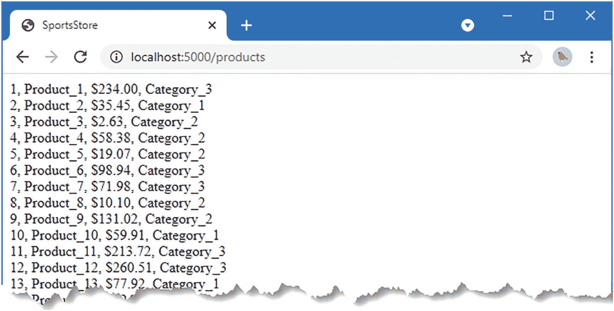
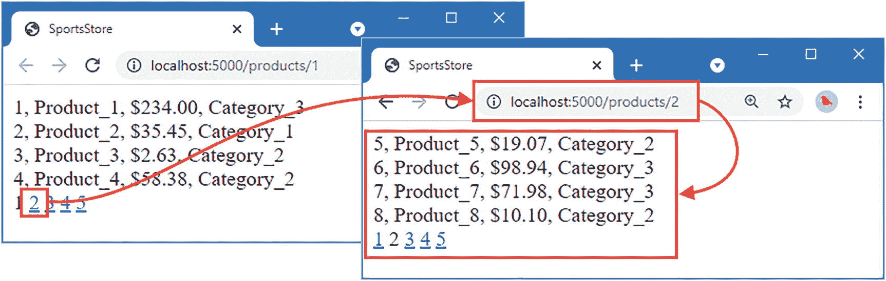
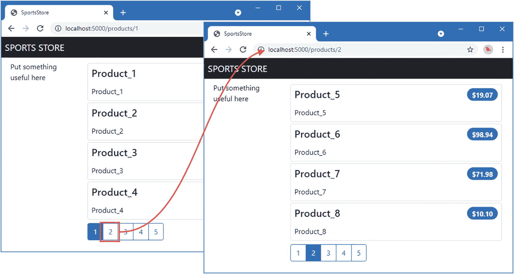
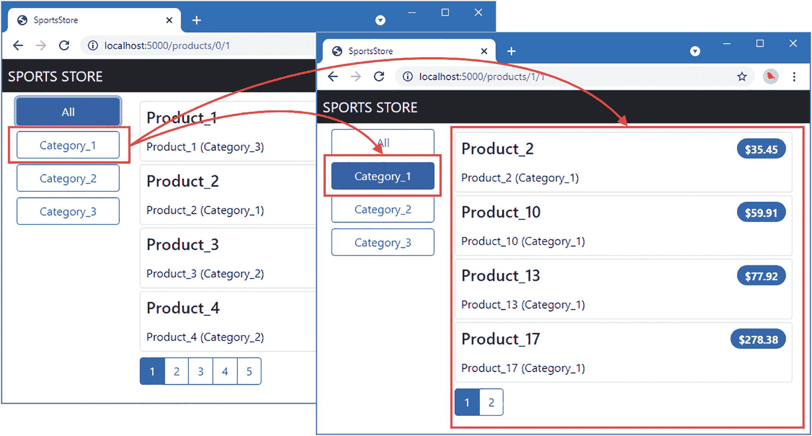
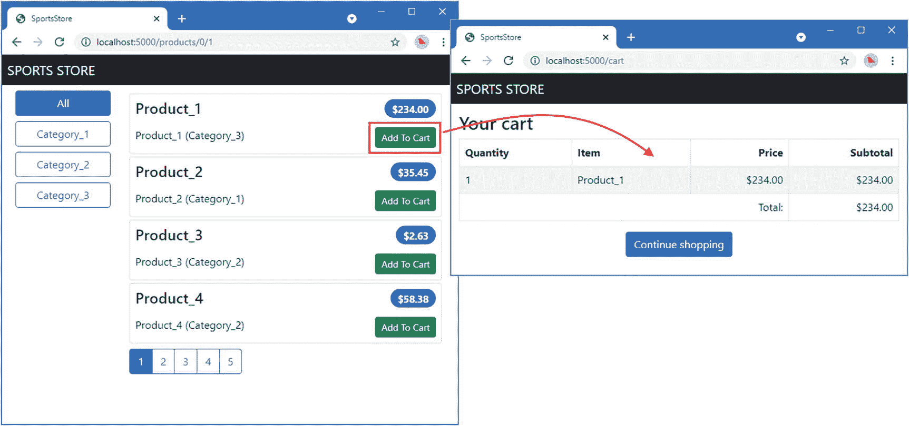
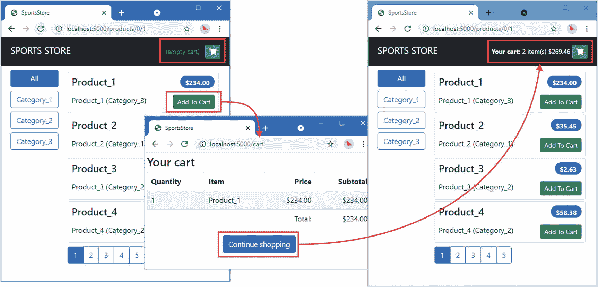
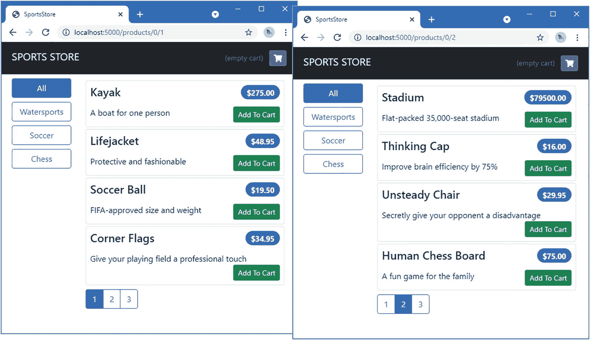

# SportsStore：一个真实的应用程序

在本章中，我将开始开发一个名为 `SportsStore` 的应用程序，这是一个体育用品在线商店。这是一个我在许多书中都包含的示例，它让我能够演示如何用不同的语言和框架实现相同的功能集。

## 创建 SportsStore 项目

我将创建一个应用程序，它使用第 32–34 章中创建的 platform 项目，但定义在自己的项目中。打开命令提示符，在包含 `platform` 文件夹的同一文件夹中创建一个名为 `sportsstore` 的文件夹。导航到 `sportsstore` 文件夹，并运行清单 35-1 所示的命令。

> 提示：您可以从 [`https://github.com/apress/pro-go`](https://github.com/apress/pro-go) 下载本章以及本书所有其他章节的示例项目。如果您在运行示例时遇到问题，请参阅第 2 章了解如何获取帮助。

```
go mod init sportsstore
清单 35-1
初始化项目
```

此命令创建 `go.mod` 文件。为了声明对 platform 项目的依赖，在 `sportsstore` 文件夹中运行清单 35-2 所示的命令。

```
go mod edit -require="platform@v1.0.0"
go mod edit -replace="platform@v1.0.0"="../platform"
go get -d "platform@v1.0.0"
清单 35-2
创建依赖项
```

打开 `go.mod` 文件，您将看到这些命令的效果，如清单 35-3 所示。

```
module sportsstore
go 1.17
require platform v1.0.0
require (
github.com/gorilla/securecookie v1.1.1 // indirect
github.com/gorilla/sessions v1.2.1 // indirect
)
replace platform v1.0.0 => ../platform
清单 35-3
go 命令在 sportsstore 文件夹的 go.mod 文件中的效果
```

`require` 指令声明了对 `platform` 模块的依赖。在实际项目中，这可以指定为版本控制仓库的 URL，例如 GitHub 的 URL。本项目不会提交到版本控制，所以我只使用了名称 `platform`。

`replace` 指令提供了一个本地路径，用于查找 `platform` 模块。当 Go 工具解析对 `platform` 模块中包的依赖时，它们将使用 `platform` 文件夹，该文件夹与 `sportsstore` 文件夹位于同一级别。

`platform` 项目依赖于第三方包，这些包必须先解析才能使用。这是通过 `go get` 命令完成的，该命令生成了 `require` 指令，该指令声明了对第 34 章中用于实现会话的包的间接依赖。

### 配置应用程序

向 `sportsstore` 文件夹添加一个名为 `config.json` 的文件，并使用它定义清单 35-4 所示的配置设置。

```
{
"logging" : {
"level": "debug"
},
"files": {
"path": "files"
},
"templates": {
"path": "templates/*.html",
"reload": true
},
"sessions": {
"key": "MY_SESSION_KEY",
"cyclekey": true
}
}
清单 35-4
sportsstore 文件夹中 config.json 文件的内容

接下来，向 `sportsstore` 文件夹添加一个名为 `main.go` 的文件，内容如清单 35-5 所示。

```
package main
import (
"platform/services"
"platform/logging"
)
func writeMessage(logger logging.Logger) {
logger.Info("SportsStore")
}
func main() {
services.RegisterDefaultServices()
services.Call(writeMessage)
}
清单 35-5
sportsstore 文件夹中 main.go 文件的内容
```

在 `sportsstore` 文件夹中使用清单 35-6 所示的命令编译并执行项目。

```
go run .
清单 35-6
编译并执行项目
```

`main` 方法设置了默认的 `platform` 服务并调用 `writeMessage`，产生以下输出：

```
07:55:03 INFO SportsStore
```


### 启动数据模型

几乎所有项目都有某种数据模型，而我通常从这部分开始开发。我喜欢先从几个简单的数据类型入手，然后让它们能被项目其他部分使用。随着为应用程序添加功能，我会不断回到数据模型，扩展其能力。

在 `sportsstore/models` 文件夹中创建名为 `product.go` 的文件，其内容如清单 35-7 所示。

```
package models
type Product struct {
ID int
Name string
Description string
Price float64
*Category
}
清单 35-7
models 文件夹中 product.go 文件的内容
```

我倾向于在每个文件中定义一个类型，以及与该类型相关的任何构造函数或方法。为了给嵌入的 `Category` 字段创建数据类型，在 `models` 文件夹中添加一个名为 `category.go` 的文件，其内容如清单 35-8 所示。

```
package models
type Category struct {
ID int
CategoryName string
}
清单 35-8
models 文件夹中 category.go 文件的内容
```

在定义嵌入字段的类型时，我尽量选择那些在字段被提升时仍然有用的字段名。在本例中，之所以选择 `CategoryName` 这个字段名，是为了避免与外部 `Product` 类型定义的字段冲突，尽管如果作为独立类型，我不会选用这个名称。

## 定义仓储接口

我喜欢用仓储来将应用程序中的数据源与使用数据的代码分离开。在 `sportsstore/models` 文件夹中添加一个名为 `repository.go` 的文件，其内容如清单 35-9 所示。

```
package models
type Repository interface {
GetProduct(id int) Product
GetProducts() []Product
GetCategories() []Category
Seed()
}
清单 35-9
models 文件夹中 repository.go 文件的内容
```

我将为 `Repository` 接口创建一个服务，这样就能轻松地更改应用程序所使用的数据源。

请注意，清单 35-9 中定义的 `GetProduct`、`GetProducts` 和 `GetCategories` 方法返回的是值而非指针。我倾向于使用值，以防止使用数据的代码通过指针进行修改，从而影响仓储管理的数据。这种方法意味着数据值会被复制，但能确保不会因通过共享引用意外修改而产生奇怪的影响。换句话说，我不希望仓储在提供数据访问时，让使用数据的代码共享引用。

## 实现（临时）仓储

我会将 SportsStore 的数据存储在关系型数据库中，但我更倾向于先基于内存实现一个简单的仓储，在基本应用功能完成前使用它。

项目开发过程中，方法上的调整是不可避免的。如果一开始就使用数据库作为仓储，我就很难再去修改已经写好的 SQL 查询语句。这最终会导致我为了绕开 SQL 的限制而调整应用程序代码——我知道这并不合理，但我知道自己还是会这么做。你可能更有自律性，但对我来说，先使用简单的内存仓储，等我完全清楚数据的最终形态后再编写 SQL，效果最好。

在 `sportsstore/models/repo` 文件夹中创建名为 `memory_repo.go` 的文件，其内容如清单 35-10 所示。

```
package repo
import (
"platform/services"
"sportsstore/models"
)
func RegisterMemoryRepoService() {
services.AddSingleton(func() models.Repository {
repo := &MemoryRepo{}
repo.Seed()
return repo
})
}
type MemoryRepo struct {
products []models.Product
categories []models.Category
}
func (repo *MemoryRepo) GetProduct(id int) (product models.Product) {
for _, p := range repo.products {
if (p.ID == id) {
product = p
return
}
}
return
}
func (repo *MemoryRepo) GetProducts() (results []models.Product) {
return repo.products
}
func (repo *MemoryRepo) GetCategories() (results []models.Category) {
return repo.categories
}
清单 35-10
models/repo 文件夹中 memory_repo.go 文件的内容
```

`MemoryRepo` 结构体实现了 `Repository` 接口所需的大部分功能，将值存储在切片中。为了实现 `Seed` 方法，在 `repo` 文件夹中添加名为 `memory_repo_seed.go` 的文件，其内容如清单 35-11 所示。

```
package repo
import (
"fmt"
"math/rand"
"sportsstore/models"
)
func (repo *MemoryRepo) Seed() {
repo.categories = make([]models.Category, 3)
for i := 0; i < 3; i++ {
catName := fmt.Sprintf("Category_%v", i + 1)
repo.categories[i]= models.Category{ID: i + 1, CategoryName: catName}
}
for i := 0; i < 20; i++ {
name := fmt.Sprintf("Product_%v", i + 1)
price := rand.Float64() * float64(rand.Intn(500))
cat := &repo.categories[rand.Intn(len(repo.categories))]
repo.products = append(repo.products, models.Product{
ID: i + 1,
Name: name, Price: price,
Description: fmt.Sprintf("%v (%v)", name, cat.CategoryName),
Category: cat,
})
}
}
清单 35-11
models/repo 文件夹中 memory_repo_seed.go 文件的内容
```

我将该方法单独定义，这样在向仓储添加功能时，就不必每次都列出种子数据的代码。

### 显示产品列表

显示内容的第一步是展示待售产品的列表。创建 `sportsstore/store` 文件夹，并在其中添加名为 `product_handler.go` 的文件，其内容如清单 35-12 所示。

```
package store
import (
"sportsstore/models"
"platform/http/actionresults"
)
type ProductHandler struct {
Repository models.Repository
}
type ProductTemplateContext struct {
Products []models.Product
}
func (handler ProductHandler) GetProducts() actionresults.ActionResult {
return actionresults.NewTemplateAction("product_list.html",
ProductTemplateContext {
Products: handler.Repository.GetProducts(),
})
}
清单 35-12
store 文件夹中 product_handler.go 文件的内容
```

`GetProducts` 方法渲染一个名为 `product_list.html` 的模板，并传入一个 `ProductTemplateContext` 值，稍后我将利用它向模板提供更多信息。

注意

从匿名嵌入结构体字段提升的方法不会生成路由，这是为了避免意外创建路由，从而将请求处理器的内部机制暴露给 HTTP 请求。这一决定带来的一个后果是，它也会排除那些与提升方法同名的结构体方法。正因如此，我才为 `ProductHandler` 结构体中的 `Products` 字段显式命名。如果我没有这样做，那么 `GetProducts` 方法就不会用于生成路由，因为它与 `models.Repository` 接口中定义的方法名重合。


## 创建模板和布局

为了定义模板，需要创建 `sportsstore/templates` 文件夹，并在其中添加一个名为 `product_list.html` 的文件，其内容如清单 35-13 所示。

```
{{ layout "store_layout.html" }}
{{ range .Products }}

{{.ID}}, {{ .Name }}, {{ printf "$%.2f" .Price }}, {{ .CategoryName }}

{{ end }}
```

*清单 35-13：`templates` 文件夹中 `product_list.html` 文件的内容*

该布局对处理器提供的结构体中的 `Product` 字段使用 `range` 表达式，为 `Repository` 中的每个 `Product` 生成一个 `div` 元素。

要创建清单 35-13 中指定的布局，请将名为 `store_layout.html` 的文件添加到 `sportsstore/templates` 文件夹中，其内容如清单 35-14 所示。

```
SportsStore

{{ body }}
```

*清单 35-14：`templates` 文件夹中 `store_layout.html` 文件的内容*

### 配置应用程序

为了注册服务并创建 SportsStore 应用程序所需的管道，请将 `main.go` 文件的内容替换为清单 35-15 所示的内容。

```
package main
import (
"sync"
"platform/http"
"platform/http/handling"
"platform/services"
"platform/pipeline"
"platform/pipeline/basic"
"sportsstore/store"
"sportsstore/models/repo"
)
func registerServices() {
services.RegisterDefaultServices()
repo.RegisterMemoryRepoService()
}
func createPipeline() pipeline.RequestPipeline {
return pipeline.CreatePipeline(
&basic.ServicesComponent{},
&basic.LoggingComponent{},
&basic.ErrorComponent{},
&basic.StaticFileComponent{},
handling.NewRouter(
handling.HandlerEntry{ "",  store.ProductHandler{}},
).AddMethodAlias("/", store.ProductHandler.GetProducts),
)
}
func main() {
registerServices()
results, err := services.Call(http.Serve, createPipeline())
if (err == nil) {
(results[0].(*sync.WaitGroup)).Wait()
} else {
panic(err)
}
}
```

*清单 35-15：替换 `sportsstore` 文件夹中 `main.go` 文件的内容*

默认服务已注册，同时注册的还有内存存储库。管道包含第 34 章创建的基本组件，并设置了包含 `ProductHandler` 的路由器。

编译并执行该项目，然后使用浏览器请求 `http://localhost:5000`，将得到如图 35-1 所示的响应。



*图 35-1：显示产品列表*

**处理 Windows 防火墙权限请求**

如前几章所述，每次使用 `go run` 命令编译项目时，Windows 都会提示授予防火墙权限，这可以通过一个简单的 PowerShell 脚本避免。提醒一下，以下是我保存为 `buildandrun.ps1` 的脚本内容：

```
$file = "./sportsstore.exe"
&go build -o $file
if ($LASTEXITCODE -eq 0) {
&$file
}
```

要构建并执行该项目，请在 `sportsstore` 文件夹中使用命令 `./buildandrun.ps1`。

## 添加分页功能

图 35-1 的输出显示存储库中的所有产品都显示在一个列表中。下一步是添加对分页的支持，以便向用户展示少量产品，并能够在不同页面之间切换。我喜欢先在存储库中进行更改，然后逐步推进到显示数据的模板。清单 35-16 向 `Repository` 接口添加了一个方法，用于请求一页 `Product` 值。

```
package models
type Repository interface {
GetProduct(id int) Product
GetProducts() []Product
GetProductPage(page, pageSize int) (products []Product, totalAvailable int)
GetCategories() []Category
Seed()
}
```

*清单 35-16：在 `models` 文件夹的 `repository.go` 文件中添加方法*

`GetProductPage` 方法返回一个 `Product` 切片以及存储库中的项目总数。清单 35-17 在内存存储库中实现了该新方法。

```
package repo
import (
"platform/services"
"sportsstore/models"
"math"
)
func RegisterMemoryRepoService() {
services.AddSingleton(func() models.Repository {
repo := &MemoryRepo{}
repo.Seed()
return repo
})
}
type MemoryRepo struct {
products []models.Product
categories []models.Category
}
func (repo *MemoryRepo) GetProduct(id int) (product models.Product) {
for _, p := range repo.products {
if (p.ID == id) {
product = p
return
}
}
return
}
func (repo *MemoryRepo) GetProducts() (results []models.Product) {
return repo.products
}
func (repo *MemoryRepo) GetCategories() (results []models.Category) {
return repo.categories
}
func (repo *MemoryRepo) GetProductPage(page, pageSize int) ([]models.Product, int) {
return getPage(repo.products, page, pageSize), len(repo.products)
}
func getPage(src []models.Product, page, pageSize int) []models.Product {
start := (page -1) * pageSize
if page > 0 && len(src) > start {
end := (int)(math.Min((float64)(len(src)), (float64)(start + pageSize)))
return src[start : end]
}
return []models.Product{}
}
```

*清单 35-17：在 `models/repo` 文件夹的 `memory_repo.go` 文件中实现方法*

清单 35-18 更新了请求处理器，使其选择一页数据并将其传递给模板，同时传递支持分页所需的额外结构体字段。

```
package store
import (
"sportsstore/models"
"platform/http/actionresults"
"platform/http/handling"
"math"
)
const pageSize = 4
type ProductHandler struct {
Repository models.Repository
URLGenerator handling.URLGenerator
}
type ProductTemplateContext struct {
Products []models.Product
Page int
PageCount int
PageNumbers []int
PageUrlFunc func(int) string
}
func (handler ProductHandler) GetProducts(page int) actionresults.ActionResult {
prods, total := handler.Repository.GetProductPage(page, pageSize)
pageCount := int(math.Ceil(float64(total) / float64(pageSize)))
return actionresults.NewTemplateAction("product_list.html",
ProductTemplateContext {
Products: prods,
Page: page,
PageCount: pageCount,
PageNumbers: handler.generatePageNumbers(pageCount),
PageUrlFunc: handler.createPageUrlFunction(),
})
}
func (handler ProductHandler) createPageUrlFunction() func(int) string {
return func(page int) string {
url, _ := handler.URLGenerator.GenerateUrl(ProductHandler.GetProducts, page)
return url
}
}
func (handler ProductHandler) generatePageNumbers(pageCount int) (pages []int) {
pages = make([]int, pageCount)
for i := 0; i < pageCount; i++ {
pages[i] = i + 1
}
return
}
```

*清单 35-18：在 `store` 文件夹的 `product_handler.go` 文件中更新处理器方法*


清单 35-18 中包含许多新语句，因为处理程序必须向模板提供更多信息以支持分页。`GetProducts`方法已被修改为接受一个参数，该参数用于获取一页数据。传递给模板的结构体所定义的额外字段包括：选定的页面、用于生成页面导航链接的函数，以及包含连续数字的切片（这是必需的，因为模板可以使用`range`但不能使用`for`循环来生成内容）。清单 35-19 更新了模板以使用这些新信息。

```
{{ layout "store_layout.html" }}
{{ $context := . }}
{{ range .Products }}

{{.ID}}, {{ .Name }}, {{ printf "$%.2f" .Price }}, {{ .CategoryName }}

{{ end }}
{{ range .PageNumbers}}
{{ if eq $context.Page .}}
{{ . }}
{{ else }}
{{ . }}
{{ end }}
{{ end }}
Listing 35-19
Supporting Pagination in the product_list.html File in the templates Folder
```

我定义了一个`$context`变量，以便始终可以轻松访问由处理程序方法传递给模板的结构体值。新的`range`表达式枚举了页码列表，并为除当前选中页之外的所有页面显示导航链接。链接的 URL 是通过调用分配给上下文结构体`PageUrlFunc`字段的函数来创建的。

接下来，需要对路由系统的别名进行更改，以便默认 URL 和`/products` URL 都能触发重定向到产品第一页，如清单 35-20 所示。

```
...
func createPipeline() pipeline.RequestPipeline {
return pipeline.CreatePipeline(
&basic.ServicesComponent{},
&basic.LoggingComponent{},
&basic.ErrorComponent{},
&basic.StaticFileComponent{},
handling.NewRouter(
handling.HandlerEntry{ "",  store.ProductHandler{}},
).AddMethodAlias("/", store.ProductHandler.GetProducts, 1).
AddMethodAlias("/products", store.ProductHandler.GetProducts, 1),
)
}
...
Listing 35-20
Updating Aliases in the main.go File in the sportsstore Folder
```

编译并执行项目，然后使用浏览器请求`http://localhost:5000`。您将看到产品以每页四个的方式显示，并带有请求其他页面的导航链接，如图 35-2 所示。



Figure 35-2

添加分页支持

### 样式化模板内容

在向应用程序添加更多功能之前，我将先处理产品列表的外观。我打算使用 **Bootstrap**，这是一个流行的 CSS 框架，也是我喜欢使用的框架。Bootstrap 通过 HTML 元素的`class`属性应用样式，详细信息请参见 [`https://getbootstrap.com`](https://getbootstrap.com)。

### 安装 Bootstrap CSS 文件

Go 没有很好的方式来安装 Go 生态系统之外的包。要将 CSS 文件添加到项目中，请创建`sportsstore/files`文件夹，并在`sportsstore`文件夹中使用命令提示符运行清单 35-21 中所示的命令。

```
curl https://cdnjs.cloudflare.com/ajax/libs/bootstrap/5.1.1/css/bootstrap.min.css --output files/bootstrap.min.css
Listing 35-21
Downloading the CSS Stylesheet
```

如果您使用的是 Windows，则改用清单 35-22 中所示的 PowerShell 命令。

```
Invoke-WebRequest -Uri ` "https://cdnjs.cloudflare.com/ajax/libs/bootstrap/5.1.1/css/bootstrap.min.css" `
-OutFile "files/bootstrap.min.css"
Listing 35-22
Downloading the CSS Stylesheet on Windows
```

### 更新布局

将清单 35-23 中所示的元素添加到`templates`文件夹中的`store_layout.html`文件中。

```

SportsStore

SPORTS STORE

{{ template "left_column" . }}

{{ template "right_column" . }}

Listing 35-23
Adding Bootstrap in the store_layout.html File in the templates Folder
```

新增的元素添加了一个用于 Bootstrap CSS 文件的`link`元素，并利用 Bootstrap 功能创建了一个标题和双列布局。列的内容通过名为`left_column`和`right_column`的模板获取。

### 样式化模板内容

`product_list.html`模板的角色必须改变，以符合布局的预期，并为布局中的左列和右列定义模板，如清单 35-24 所示。

```
{{ layout "store_layout.html" }}
{{ define "left_column" }}
Put something useful here
{{end}}
{{ define "right_column" }}
{{ $context := . }}
{{ range $context.Products }}

{{ .Name }}

{{ printf "$%.2f" .Price }}

{{ .Description }}

{{ end }}
{{ template "page_buttons.html" $context }}
{{end}}
Listing 35-24
Creating Column Content in the product_list.html File in the templates Folder
```

新的结构为左列定义了一个占位符，并在右列中生成了一个带样式的产品列表。

我为分页按钮定义了一个单独的模板。在`templates`文件夹中添加一个名为`page_buttons.html`的文件，其内容如清单 35-25 所示。

```
{{ $context := . }}

{{ range .PageNumbers}}
{{ if eq $context.Page .}}
{{ . }}
{{ else }}
{{ . }}
{{ end }}
{{ end }}

Listing 35-25
The Contents of the page_buttons.html File in the templates Folder
```

编译并执行项目，然后请求`http://localhost:5000`。您将看到如图 35-3 所示的样式化内容。



Figure 35-3

样式化内容


好的，作为高级文档工程师和翻译员，我将根据您提供的注意事项和示例，将给定的英文文本翻译成中文。


### 添加对类别筛选的支持

下一步是使用按钮替换左列中的占位内容，这些按钮允许用户选择一个类别，以过滤列表中所显示的产品。首先，将清单 35-26 所示的方法添加到 `Repository` 接口中。

```go
package models

type Repository interface {
	GetProduct(id int) Product
	GetProducts() []Product
	GetProductPage(page, pageSize int) (products []Product, totalAvailable int)
	GetProductPageCategory(categoryId int, page, pageSize int) (products []Product, totalAvailable int)
	GetCategories() []Category
	Seed()
}
```

这个新方法允许在请求一个页面时指定一个类别。清单 35-27 在内存存储库中实现了这个新方法。

```go
package repo

import (
	"math"
	"platform/services"
	"sportsstore/models"
)

func RegisterMemoryRepoService() {
	services.AddSingleton(func() models.Repository {
		repo := &MemoryRepo{}
		repo.Seed()
		return repo
	})
}

type MemoryRepo struct {
	products   []models.Product
	categories []models.Category
}

func (repo *MemoryRepo) GetProduct(id int) (product models.Product) {
	for _, p := range repo.products {
		if p.ID == id {
			product = p
			return
		}
	}
	return
}

func (repo *MemoryRepo) GetProducts() (results []models.Product) {
	return repo.products
}

func (repo *MemoryRepo) GetCategories() (results []models.Category) {
	return repo.categories
}

func (repo *MemoryRepo) GetProductPage(page, pageSize int) ([]models.Product, int) {
	return getPage(repo.products, page, pageSize), len(repo.products)
}

func (repo *MemoryRepo) GetProductPageCategory(category int, page, pageSize int) (products []models.Product, totalAvailable int) {
	if category == 0 {
		return repo.GetProductPage(page, pageSize)
	} else {
		filteredProducts := make([]models.Product, 0, len(repo.products))
		for _, p := range repo.products {
			if p.Category.ID == category {
				filteredProducts = append(filteredProducts, p)
			}
		}
		return getPage(filteredProducts, page, pageSize), len(filteredProducts)
	}
}

func getPage(src []models.Product, page, pageSize int) []models.Product {
	start := (page - 1) * pageSize
	if page > 0 && len(src) > start {
		end := int(math.Min(float64(len(src)), float64(start+pageSize)))
		return src[start:end]
	}
	return []models.Product{}
}
```

这个新方法枚举产品数据，针对所选类别进行过滤，然后选择指定页码的数据。

## 更新请求处理器

下一步是修改请求处理器方法，使其接收一个类别参数，并使用它来获取过滤后的数据，然后将其连同生成导航按钮所需的额外上下文数据一起传递给模板，导航按钮允许用户选择不同的类别，如清单 35-28 所示。

```go
package store

import (
	"math"
	"platform/http/actionresults"
	"platform/http/handling"
	"sportsstore/models"
)

const pageSize = 4

type ProductHandler struct {
	Repository   models.Repository
	URLGenerator handling.URLGenerator
}

type ProductTemplateContext struct {
	Products         []models.Product
	Page             int
	PageCount        int
	PageNumbers      []int
	PageUrlFunc      func(int) string
	SelectedCategory int
}

func (handler ProductHandler) GetProducts(category, page int) actionresults.ActionResult {
	prods, total := handler.Repository.GetProductPageCategory(category, page, pageSize)
	pageCount := int(math.Ceil(float64(total) / float64(pageSize)))
	return actionresults.NewTemplateAction("product_list.html", ProductTemplateContext{
		Products:         prods,
		Page:             page,
		PageCount:        pageCount,
		PageNumbers:      handler.generatePageNumbers(pageCount),
		PageUrlFunc:      handler.createPageUrlFunction(category),
		SelectedCategory: category,
	})
}

func (handler ProductHandler) createPageUrlFunction(category int) func(int) string {
	return func(page int) string {
		url, _ := handler.URLGenerator.GenerateUrl(ProductHandler.GetProducts, category, page)
		return url
	}
}

func (handler ProductHandler) generatePageNumbers(pageCount int) (pages []int) {
	pages = make([]int, pageCount)
	for i := 0; i < pageCount; i++ {
		pages[i] = i + 1
	}
	return
}
```

我还必须更新现有用于生成选择页码的 URL 的函数，并引入一个用于生成选择新类别 URL 的函数。

## 创建类别处理器

我添加对从模板调用处理器的支持，其原因是能够显示自包含的内容，例如类别按钮。在 `sportsstore/store` 文件夹中添加一个名为 `category_handler.go` 的文件，其内容如清单 35-29 所示。

```go
package store

import (
	"platform/http/actionresults"
	"platform/http/handling"
	"sportsstore/models"
)

type CategoryHandler struct {
	Repository   models.Repository
	URLGenerator handling.URLGenerator
}

type categoryTemplateContext struct {
	Categories       []models.Category
	SelectedCategory int
	CategoryUrlFunc  func(int) string
}

func (handler CategoryHandler) GetButtons(selected int) actionresults.ActionResult {
	return actionresults.NewTemplateAction("category_buttons.html", categoryTemplateContext{
		Categories:       handler.Repository.GetCategories(),
		SelectedCategory: selected,
		CategoryUrlFunc:  handler.createCategoryFilterFunction(),
	})
}

func (handler CategoryHandler) createCategoryFilterFunction() func(int) string {
	return func(category int) string {
		url, _ := handler.URLGenerator.GenerateUrl(ProductHandler.GetProducts, category, 1)
		return url
	}
}
```

处理器通过存储库（作为服务获取）获取按钮所需的所有类别。选中的类别通过处理器方法的一个参数接收。

为了创建由 `GetButtons` 处理器方法渲染的模板，请在 `templates` 文件夹中添加一个名为 `category_buttons.html` 的文件，其内容如清单 35-30 所示。

```html
{{ $context := . }}

    All
    {{ range $context.Categories }}
        {{ .CategoryName }}
    {{ end }}
```

我通常倾向于将完整的元素放在 `if`/`else`/`end` 块的条件子句中，但是，正如这个模板所示，您可以使用条件来仅选择元素中不同的部分，在本例中是 `class` 属性。虽然这样减少了重复，但我发现这种方式更难以阅读，但它确实证明了您可以根据自己的偏好使用模板系统。

## 在产品列表模板中显示类别导航

清单 35-31 显示了对列出产品的模板进行更改以包含类别过滤功能所需的内容。

```html
{{ layout "store_layout.html" }}
{{ define "left_column" }}
    {{ $context := . }}
    {{ handler "category" "getbuttons" $context.SelectedCategory}}
{{end}}
{{ define "right_column" }}
    {{ $context := . }}
    {{ range $context.Products }}

        {{ .Name }}

        {{ printf "$%.2f" .Price }}

        {{ .Description }}

    {{ end }}
    {{ template "page_buttons.html" $context }}
{{end}}
```

这些更改将占位消息替换为清单 35-30 中定义的 `GetButtons` 方法的响应。


### 注册处理器与更新别名

最终的修改是更新将 URL 映射到处理器方法的别名，如清单 35-32 所示。

```
...
func createPipeline() pipeline.RequestPipeline {
return pipeline.CreatePipeline(
&basic.ServicesComponent{},
&basic.LoggingComponent{},
&basic.ErrorComponent{},
&basic.StaticFileComponent{},
handling.NewRouter(
handling.HandlerEntry{ "",  store.ProductHandler{}},
handling.HandlerEntry{ "",  store.CategoryHandler{}},
).AddMethodAlias("/", store.ProductHandler.GetProducts, 0, 1).
AddMethodAlias("/products[/]?[A-z0-9]*?",
store.ProductHandler.GetProducts, 0, 1),
)
}
...
```

编译并执行项目，然后请求`http://localhost:5000`，你将看到分类按钮，并能从单一分类中选择产品，如图 35-4 所示。



**图 35-4** 按分类筛选

## 本章小结

在本章中，我利用第 32 章至第 34 章创建的平台，开始了 SportsStore 应用程序的开发。我从基本的数据模型和仓库入手，创建了一个显示产品的处理器，并支持分页和按分类筛选。我将在下一章继续开发 SportsStore 应用程序。

# 36. SportsStore：购物车与数据库

在本章中，我继续开发 SportsStore 应用程序，新增对购物车的支持，并引入数据库来替换我在第 35 章中创建的临时仓库。

> **提示** 你可以从[`https://github.com/apress/pro-go`](https://github.com/apress/pro-go)下载本章——以及本书所有其他章节——的示例项目。如果在运行示例时遇到问题，请参阅第 2 章了解如何获取帮助。

## 构建购物车

SportsStore 应用程序进展顺利，但要销售产品，我必须实现购物车功能，以便用户在结账前将所选商品集中在一起。

### 定义购物车模型与仓库

为了定义购物车数据类型，创建`sportsstore/store/cart`文件夹，并在其中添加一个名为`cart.go`的文件，内容如清单 36-1 所示。

```
package cart

import "sportsstore/models"

type CartLine struct {
    models.Product
    Quantity int
}

func (cl *CartLine) GetLineTotal() float64 {
    return cl.Price * float64(cl.Quantity)
}

type Cart interface {
    AddProduct(models.Product)
    GetLines() []*CartLine
    RemoveLineForProduct(id int)
    GetItemCount() int
    GetTotal() float64
    Reset()
}

type BasicCart struct {
    lines []*CartLine
}

func (cart *BasicCart) AddProduct(p models.Product) {
    for _, line := range cart.lines {
        if (line.Product.ID == p.ID) {
            line.Quantity++
            return
        }
    }
    cart.lines = append(cart.lines, &CartLine{
        Product: p, Quantity: 1,
    })
}

func (cart *BasicCart) GetLines() []*CartLine {
    return cart.lines
}

func (cart *BasicCart) RemoveLineForProduct(id int) {
    for index, line := range cart.lines {
        if (line.Product.ID == id) {
            cart.lines = append(cart.lines[0: index], cart.lines[index + 1:]...)
        }
    }
}

func (cart *BasicCart) GetItemCount() (total int) {
    for _, l := range cart.lines {
        total += l.Quantity
    }
    return
}

func (cart *BasicCart) GetTotal() (total float64) {
    for _, line := range cart.lines {
        total += float64(line.Quantity) * line.Product.Price
    }
    return
}

func (cart *BasicCart) Reset() {
    cart.lines = []*CartLine{}
}
```

`Cart`接口将作为服务提供，我定义了一个`BasicCart`结构体，通过切片实现`Cart`方法。为了定义此服务，在`sportsstore/store/cart`文件夹中添加一个名为`cart_service.go`的文件，内容如清单 36-2 所示。

```
package cart

import (
    "platform/services"
    "platform/sessions"
    "sportsstore/models"
    "encoding/json"
    "strings"
)

const CART_KEY string = "cart"

func RegisterCartService() {
    services.AddScoped(func(session sessions.Session) Cart {
        lines := []*CartLine {}
        sessionVal := session.GetValue(CART_KEY)
        if strVal, ok := sessionVal.(string); ok {
            json.NewDecoder(strings.NewReader(strVal)).Decode(&lines)
        }
        return &sessionCart{
            BasicCart: &BasicCart{ lines: lines},
            Session: session,
        }
    })
}

type sessionCart struct {
    *BasicCart
    sessions.Session
}

func (sc *sessionCart) AddProduct(p models.Product) {
    sc.BasicCart.AddProduct(p)
    sc.SaveToSession()
}

func (sc *sessionCart) RemoveLineForProduct(id int) {
    sc.BasicCart.RemoveLineForProduct(id)
    sc.SaveToSession()
}

func (sc *sessionCart) SaveToSession() {
    builder := strings.Builder{}
    json.NewEncoder(&builder).Encode(sc.lines)
    sc.Session.SetValue(CART_KEY, builder.String())
}

func (sc *sessionCart) Reset() {
    sc.lines = []*CartLine{}
    sc.SaveToSession()
}
```

`sessionCart`结构体通过将其`CartLine`值的 JSON 表示形式添加到会话中，来响应变化。`RegisterCartService`函数创建一个作用域的`Cart`服务，该服务创建一个`sessionCart`，并从会话 JSON 数据中填充其行数据。


### 创建购物车请求处理器

在 `sportsstore/store` 文件夹中添加一个名为 `cart_handler.go` 的文件，其内容如代码清单 36-3 所示。

```
package store

import (
	"platform/http/actionresults"
	"platform/http/handling"
	"sportsstore/models"
	"sportsstore/store/cart"
)

type CartHandler struct {
	models.Repository
	cart.Cart
	handling.URLGenerator
}

type CartTemplateContext struct {
	cart.Cart
	ProductListUrl string
	CartUrl        string
	CheckoutUrl    string
	RemoveUrl      string
}

func (handler CartHandler) GetCart() actionresults.ActionResult {
	return actionresults.NewTemplateAction("cart.html", CartTemplateContext{
		Cart:            handler.Cart,
		ProductListUrl:  handler.mustGenerateUrl(ProductHandler.GetProducts, 0, 1),
		RemoveUrl:       handler.mustGenerateUrl(CartHandler.PostRemoveFromCart),
	})
}

type CartProductReference struct {
	ID int
}

func (handler CartHandler) PostAddToCart(ref CartProductReference) actionresults.ActionResult {
	p := handler.Repository.GetProduct(ref.ID)
	handler.Cart.AddProduct(p)
	return actionresults.NewRedirectAction(
		handler.mustGenerateUrl(CartHandler.GetCart))
}

func (handler CartHandler) PostRemoveFromCart(ref CartProductReference) actionresults.ActionResult {
	handler.Cart.RemoveLineForProduct(ref.ID)
	return actionresults.NewRedirectAction(
		handler.mustGenerateUrl(CartHandler.GetCart))
}

func (handler CartHandler) mustGenerateUrl(method interface{}, data ...interface{}) string {
	url, err := handler.URLGenerator.GenerateUrl(method, data...)
	if err != nil {
		panic(err)
	}
	return url
}
```

*代码清单 36-3：`store` 文件夹中 `cart_handler.go` 文件的内容*

`GetCart` 方法将渲染一个模板，用于显示用户购物车中的内容。调用 `PostAddToCart` 方法可将产品添加到购物车，之后浏览器会重定向到 `GetCart` 方法。要创建 `GetCart` 方法使用的模板，请在 `templates` 文件夹中添加一个名为 `cart.html` 的文件，其内容如代码清单 36-4 所示。

```
{{ layout "simple_layout.html" }}
{{ $context := . }}

<h1>Your cart</h1>

<table>
  <thead>
    <tr>
      <th>Quantity</th>
      <th>Item</th>
      <th>Price</th>
      <th>Subtotal</th>
    </tr>
  </thead>
  <tbody>
    {{ range $context.Cart.GetLines }}
    <tr>
      <td>{{ .Quantity }}</td>
      <td>{{ .Name }}</td>
      <td>{{ printf "$%.2f" .Price }}</td>
      <td>{{ printf "$%.2f" .GetLineTotal }}</td>
      <td>
        <form method="POST" action="{{ $context.RemoveUrl }}">
          <input type="hidden" name="ID" value="{{ .ProductID }}" />
          <button type="submit">Remove</button>
        </form>
      </td>
    </tr>
    {{ end }}
  </tbody>
</table>

<p>Total: {{ printf "$%.2f" $context.Cart.GetTotal }}</p>

<a href="{{ $context.ProductListUrl }}">Continue shopping</a>
```

*代码清单 36-4：`templates` 文件夹中 `cart.html` 文件的内容*

此模板生成一个 HTML 表格，用户选择的每个产品对应一行。还有一个按钮可将用户返回到产品列表，以便继续选择。要创建此模板使用的布局，请在 `templates` 文件夹中添加一个名为 `simple_layout.html` 的文件，其内容如代码清单 36-5 所示。

```
<!DOCTYPE html>
<html>
<head>
  <title>SportsStore</title>
</head>
<body>
  <h1>SPORTS STORE</h1>
  {{ body }}
</body>
</html>
```

*代码清单 36-5：`templates` 文件夹中 `simple_layout.html` 文件的内容*

此布局显示 `SportsStore` 标题，但不应用用于产品列表的列布局。

### 将产品添加到购物车

每个产品都会显示一个 **Add To Cart** 按钮，该按钮会向代码清单 36-3 中创建的 `PostAddToCart` 方法发送请求。首先，添加代码清单 36-6 中所示的元素，这些元素定义了按钮及其提交的表单。

```
{{ layout "store_layout.html" }}
{{ define "left_column" }}
  {{ $context := . }}
  {{ handler "category" "getbuttons" $context.SelectedCategory}}
{{ end }}
{{ define "right_column" }}
  {{ $context := . }}
  {{ range $context.Products }}
  <div>
    <h3>{{ .Name }}</h3>
    <p>{{ printf "$%.2f" .Price }}</p>
    <p>{{ .Description }}</p>
    <form method="POST" action="{{ $context.AddToCartUrl }}">
      <input type="hidden" name="ID" value="{{ .ID }}" />
      <button type="submit">Add To Cart</button>
    </form>
  </div>
  {{ end }}
  {{ template "page_buttons.html" $context }}
{{ end }}
```

*代码清单 36-6：在 `templates` 文件夹的 `product_list.html` 文件中添加表单*

要为模板提供表单中使用的 URL，请对其处理器进行代码清单 36-7 中所示的修改。

```
package store

import (
	"sportsstore/models"
	"platform/http/actionresults"
	"platform/http/handling"
	"math"
)

const pageSize = 4

type ProductHandler struct {
	Repository   models.Repository
	URLGenerator handling.URLGenerator
}

type ProductTemplateContext struct {
	Products        []models.Product
	Page            int
	PageCount       int
	PageNumbers     []int
	PageUrlFunc     func(int) string
	SelectedCategory int
	AddToCartUrl    string
}

func (handler ProductHandler) GetProducts(category, page int) actionresults.ActionResult {
	prods, total := handler.Repository.GetProductPageCategory(category, page, pageSize)
	pageCount := int(math.Ceil(float64(total) / float64(pageSize)))
	return actionresults.NewTemplateAction("product_list.html", ProductTemplateContext{
		Products:        prods,
		Page:            page,
		PageCount:       pageCount,
		PageNumbers:     handler.generatePageNumbers(pageCount),
		PageUrlFunc:     handler.createPageUrlFunction(category),
		SelectedCategory: category,
		AddToCartUrl:    mustGenerateUrl(handler.URLGenerator, CartHandler.PostAddToCart),
	})
}

func (handler ProductHandler) createPageUrlFunction(category int) func(int) string {
	return func(page int) string {
		url, _ := handler.URLGenerator.GenerateUrl(ProductHandler.GetProducts, category, page)
		return url
	}
}

func (handler ProductHandler) generatePageNumbers(pageCount int) (pages []int) {
	pages = make([]int, pageCount)
	for i := 0; i < pageCount; i++ {
		pages[i] = i + 1
	}
	return
}

func mustGenerateUrl(generator handling.URLGenerator, target interface{}) string {
	url, err := generator.GenerateUrl(target)
	if err != nil {
		panic(err)
	}
	return url
}
```

*代码清单 36-7：在 `store` 文件夹的 `product_handler.go` 文件中添加上下文数据*

这些修改为用于向模板传递数据的上下文结构体添加了一个新属性，使处理器能够提供可在 HTML 表单中使用的 URL。

### 配置应用程序

让基本购物车功能正常工作的最后一步是配置会话和购物车所需的服务、中间件和处理器，如代码清单 36-8 所示。

```
package main

import (
	"sync"
	"platform/http"
	"platform/http/handling"
	"platform/services"
	"platform/pipeline"
	"platform/pipeline/basic"
	"sportsstore/store"
	"sportsstore/models/repo"
	"platform/sessions"
	"sportsstore/store/cart"
)

func registerServices() {
	services.RegisterDefaultServices()
	repo.RegisterMemoryRepoService()
	sessions.RegisterSessionService()
	cart.RegisterCartService()
}

func createPipeline() pipeline.RequestPipeline {
	return pipeline.CreatePipeline(
		&basic.ServicesComponent{},
		&basic.LoggingComponent{},
		&basic.ErrorComponent{},
		&basic.StaticFileComponent{},
		&sessions.SessionComponent{},
		handling.NewRouter(
			handling.HandlerEntry{"", store.ProductHandler{}},
			handling.HandlerEntry{"", store.CategoryHandler{}},
			handling.HandlerEntry{"", store.CartHandler{}},
		).AddMethodAlias("/", store.ProductHandler.GetProducts, 0, 1).
			AddMethodAlias("/products[/]?[A-z0-9]*?", store.ProductHandler.GetProducts, 0, 1),
	)
}

func main() {
	registerServices()
	results, err := services.Call(http.Serve, createPipeline())
	if err == nil {
		(results[0].(*sync.WaitGroup)).Wait()
	} else {
		panic(err)
	}
}
```

*代码清单 36-8：在 `sportsstore` 文件夹的 `main.go` 文件中为购物车配置应用程序*

编译并执行该项目，然后使用浏览器请求 `http://localhost:5000`。产品会显示一个 **Add To Cart** 按钮，点击该按钮会将产品添加到购物车，并重定向浏览器以显示购物车内容，如图 36-1 所示。



*图 36-1：创建商店购物车*


### 添加购物车摘要组件

用户希望在浏览可用产品列表时，能够看到其产品选择的摘要。将列表 36-9 所示的方法添加到 `CartHandler` 请求处理器中。

```
package store
import (
"platform/http/actionresults"
"platform/http/handling"
"sportsstore/models"
"sportsstore/store/cart"
)
type CartHandler struct {
models.Repository
cart.Cart
handling.URLGenerator
}
type CartTemplateContext struct {
cart.Cart
ProductListUrl string
CartUrl string
}
func (handler CartHandler) GetCart() actionresults.ActionResult {
return actionresults.NewTemplateAction("cart.html", CartTemplateContext {
Cart: handler.Cart,
ProductListUrl: handler.mustGenerateUrl(ProductHandler.GetProducts, 0, 1),
})
}
func (handler CartHandler) GetWidget() actionresults.ActionResult {
return actionresults.NewTemplateAction("cart_widget.html", CartTemplateContext {
Cart: handler.Cart,
CartUrl: handler.mustGenerateUrl(CartHandler.GetCart),
})
}
// ...statements omitted for brevity...
列表 36-9
在 store 文件夹的 cart_handler.go 文件中添加一个方法
```

要定义新方法使用的模板，请在 `templates` 文件夹中添加一个名为 `cart_widget.html` 的文件，其内容如列表 36-10 所示。

```
{{ $context := . }}
{{ $count := $context.Cart.GetItemCount }}

{{ if gt $count 0 }}
您的购物车：
{{ $count }} 件商品
{{ printf "$%.2f" $context.Cart.GetTotal }}
{{ else }}
（空购物车）
{{ end }}

列表 36-10
templates 文件夹中 cart_widget.html 文件的内容
```

#### 调用处理器并添加 CSS 图标样式表

列表 36-10 调用了 `GetWidget` 方法，将购物车组件插入到布局中。该购物车组件模板需要一个购物车图标，由出色的 Font Awesome 包提供。在第 35 章中，我复制了 Bootstrap CSS 文件，以便通过 Web 平台提供的静态文件功能来提供该文件，但 Font Awesome 包需要多个文件，因此列表 36-11 添加了一个带有内容分发网络 URL 的 `link` 元素。（这意味着您需要在线才能看到这些图标。有关如何下载文件并安装到 `sportsstore/files` 文件夹中的详细信息，请参阅 [`https://fontawesome.com`](https://fontawesome.com)。）

```

SportsStore

SPORTS STORE

{{ handler "cart" "getwidget" }}

{{ template "left_column" . }}

{{ template "right_column" . }}

列表 36-11
在 templates 文件夹的 store_layout.html 文件中添加样式表链接
```

编译并执行项目，您将看到组件显示在页面头部。该组件会指示购物车为空。点击某个“加入购物车”按钮，然后点击“继续购物”按钮，即可看到产品选择反映出的效果，如图 36-2 所示。



图 36-2

显示购物车组件

## 使用数据库存储库

大部分基本功能已经就位，是时候淘汰我在第 35 章中创建的临时存储库，并替换为一个使用持久化数据库的存储库了。我打算使用 SQLite。在命令提示符下，在 `sportsstore` 文件夹中运行列表 36-12 所示的命令，下载并安装 SQLite 驱动，其中也包含 SQLite 运行时。

```
go get modernc.org/sqlite
列表 36-12
安装 SQLite 驱动和数据库包
```

### 创建存储库类型

在 `models/repo` 文件夹中添加一个名为 `sql_repo.go` 的文件，其内容如列表 36-13 所示，该文件定义了 SQL 存储库的基本类型。

```
package repo
import (
"database/sql"
"platform/config"
"platform/logging"
"context"
)
type SqlRepository struct {
config.Configuration
logging.Logger
Commands SqlCommands
*sql.DB
context.Context
}
type SqlCommands struct {
Init,
Seed,
GetProduct,
GetProducts,
GetCategories,
GetPage,
GetPageCount,
GetCategoryPage,
GetCategoryPageCount *sql.Stmt
}
列表 36-13
models/repo 文件夹中 sql_repo.go 文件的内容
```

`SqlRepository` 结构体将用于实现 `Repository` 接口，并作为服务提供给应用程序的其他部分。该结构体定义了一个 `*sql.DB` 字段，用于提供对数据库的访问，以及一个 `Commands` 字段，该字段是一个 `*sql.Stmt` 字段的集合，这些字段将填充实现 `Repository` 接口功能所需的预编译语句。

### 打开数据库并加载 SQL 命令

在第 26 章中，我将 SQL 命令定义为 Go 字符串。在实际项目中，我更喜欢将 SQL 命令定义在扩展名为 `.sql` 的文本文件中，这样我的编辑器可以进行语法检查。这意味着我需要打开一个数据库，然后定位并处理与列表 36-13 中定义的 `SqlCommands` 结构体字段相对应的 SQL 文件。在 `models/repo` 文件夹中添加一个名为 `sql_loader.go` 的文件，其内容如列表 36-14 所示。

```
package repo
import (
"os"
"database/sql"
"reflect"
"platform/config"
"platform/logging"
_ "modernc.org/sqlite"
)
func openDB(config config.Configuration, logger logging.Logger) (db *sql.DB,
commands *SqlCommands, needInit bool) {
driver := config.GetStringDefault("sql:driver_name", "sqlite")
connectionStr, found := config.GetString("sql:connection_str")
if !found {
logger.Panic("无法从配置中读取 SQL 连接字符串")
return
}
if _, err := os.Stat(connectionStr); os.IsNotExist(err) {
needInit = true
}
var err error
if db, err = sql.Open(driver, connectionStr); err == nil {
commands = loadCommands(db, config, logger)
} else {
logger.Panic(err.Error())
}
return
}
func loadCommands(db *sql.DB, config config.Configuration,
logger logging.Logger) (commands *SqlCommands)  {
commands = &SqlCommands {}
commandVal := reflect.ValueOf(commands).Elem()
commandType := reflect.TypeOf(commands).Elem()
for i := 0; i < commandType.NumField(); i++ {
commandName := commandType.Field(i).Name
logger.Debugf("正在加载 SQL 命令：%v", commandName)
stmt := prepareCommand(db, commandName, config, logger)
commandVal.Field(i).Set(reflect.ValueOf(stmt))
}
return commands
}
func prepareCommand(db *sql.DB, command string, config config.Configuration,
logger logging.Logger) *sql.Stmt {
filename, found := config.GetString("sql:commands:" + command)
if !found {
logger.Panicf("配置中未包含 SQL 命令的位置：%v",
command)
}
data, err := os.ReadFile(filename)
if err != nil {
logger.Panicf("无法读取 SQL 命令文件：%v", filename)
}
statement, err := db.Prepare(string(data))
if (err != nil) {
logger.Panicf(err.Error())
}
return statement
}
列表 36-14
models/repo 文件夹中 sql_loader.go 文件的内容
```

`openDB` 函数从配置系统中读取数据库驱动程序名称和连接字符串，并在调用 `loadCommands` 函数之前打开数据库。`loadCommands` 函数使用反射获取 `SqlCommands` 结构体定义的字段列表，并为每个字段调用 `prepareCommand`。`prepareCommand` 函数从配置系统中获取包含该命令 SQL 的文件名，读取文件内容，并创建一个预编译语句，然后将其赋值给 `SqlCommands` 字段。


### 定义种子与初始化语句

对于`Repository`接口所需的每个功能，我需要定义一个包含查询语句的 SQL 文件，以及一个用于执行该查询的 Go 方法。我将从`Seed`和`Init`命令开始。`Seed`命令是`Repository`接口所必需的，而`Init`函数是`SqlRepository`结构体特有的，用于创建数据库模式。在`models/repo`文件夹中创建一个名为`sql_initseed.go`的文件，其内容如代码清单 36-15 所示。

请注意，资源库使用的所有查询都调用了接受`context.Context`参数的方法（`ExecContext`、`QueryContext`等）。在第 32 至 34 章构建的平台会将`Context`值传递给中间件组件和请求处理器，因此我在查询数据库时使用了这些方法。

```
package repo
func (repo *SqlRepository) Init() {
if _, err := repo.Commands.Init.ExecContext(repo.Context); err != nil {
repo.Logger.Panic("Cannot exec init command")
}
}
func (repo *SqlRepository) Seed() {
if _, err := repo.Commands.Seed.ExecContext(repo.Context); err != nil {
repo.Logger.Panic("Cannot exec seed command")
}
}
代码清单 36-15
models/repo 文件夹中 sql_initseed.go 文件的内容
```

为了创建这些方法所使用的 SQL 命令，请创建`sportsstore/sql`文件夹，并在其中添加一个名为`init_db.sql`的文件，其内容如代码清单 36-16 所示。

```
DROP TABLE IF EXISTS Products;
DROP TABLE IF EXISTS Categories;
CREATE TABLE IF NOT EXISTS Categories (
Id INTEGER NOT NULL PRIMARY KEY,        Name TEXT
);
CREATE TABLE IF NOT EXISTS Products (
Id INTEGER NOT NULL PRIMARY KEY,
Name TEXT, Description TEXT,
Category INTEGER, Price decimal(8, 2),
CONSTRAINT CatRef FOREIGN KEY(Category) REFERENCES Categories (Id)
);
代码清单 36-16
sql 文件夹中 init_db.sql 文件的内容
```

该文件包含删除并重新创建`Categories`和`Products`表的语句。在`sportsstore/sql`文件夹中添加一个名为`seed_db.sql`的文件，其内容如代码清单 36-17 所示。

```
INSERT INTO Categories(Id, Name) VALUES
(1, "Watersports"), (2, "Soccer"), (3, "Chess");
INSERT INTO Products(Id, Name, Description, Category, Price) VALUES
(1, "Kayak", "A boat for one person", 1, 275),
(2, "Lifejacket", "Protective and fashionable", 1, 48.95),
(3, "Soccer Ball", "FIFA-approved size and weight", 2, 19.50),
(4, "Corner Flags", "Give your playing field a professional touch", 2, 34.95),
(5, "Stadium", "Flat-packed 35,000-seat stadium", 2, 79500),
(6, "Thinking Cap", "Improve brain efficiency by 75%", 3, 16),
(7, "Unsteady Chair", "Secretly give your opponent a disadvantage", 3, 29.95),
(8, "Human Chess Board", "A fun game for the family", 3, 75),
(9, "Bling-Bling King", "Gold-plated, diamond-studded King", 3, 1200);
代码清单 36-17
sql 文件夹中 seed_db.sql 文件的内容

该文件包含`INSERT`语句，用于创建三个类别和九个产品，所使用的值对于读过我其他任何书籍的读者来说应该都很熟悉。

### 定义基本查询

为了完善资源库，我需要逐一实现`Repository`接口所需的方法，为每个方法定义 Go 实现以及它将使用的 SQL 查询。在`models/repo`文件夹中添加一个名为`sql_basic_methods.go`的文件，其内容如代码清单 36-18 所示。

```
package repo
import "sportsstore/models"
func (repo *SqlRepository) GetProduct(id int) (p models.Product) {
row := repo.Commands.GetProduct.QueryRowContext(repo.Context, id)
if row.Err() == nil {
var err error
if p, err = scanProduct(row); err != nil {
repo.Logger.Panicf("Cannot scan data: %v", err.Error())
}
} else {
repo.Logger.Panicf("Cannot exec GetProduct command: %v", row.Err().Error())
}
return
}
func (repo *SqlRepository) GetProducts() (results []models.Product) {
rows, err := repo.Commands.GetProducts.QueryContext(repo.Context)
if err == nil {
if results, err = scanProducts(rows); err != nil {
repo.Logger.Panicf("Cannot scan data: %v", err.Error())
return
}
} else {
repo.Logger.Panicf("Cannot exec GetProducts command: %v", err)
}
return
}
func (repo *SqlRepository) GetCategories() []models.Category {
results := make([]models.Category, 0, 10)
rows, err := repo.Commands.GetCategories.QueryContext(repo.Context)
if err == nil {
for rows.Next() {
c := models.Category{}
if err := rows.Scan(&c.ID, &c.CategoryName); err != nil {
repo.Logger.Panicf("Cannot scan data: %v", err.Error())
}
results = append(results, c)
}
} else {
repo.Logger.Panicf("Cannot exec GetCategories command: %v", err)
}
return results
}
代码清单 36-18
models/repo 文件夹中 sql_basic_methods.go 文件的内容
```

代码清单 36-18 实现了`GetProduct`、`GetProducts`和`GetCategories`方法。为了定义从 SQL 结果中扫描`Product`值的函数，请在`models/repo`文件夹中添加一个名为`sql_scan.go`的文件，其内容如代码清单 36-19 所示。

```
package repo
import (
"database/sql"
"sportsstore/models"
)
func scanProducts(rows *sql.Rows) (products []models.Product, err error) {
products = make([]models.Product, 0, 10)
for rows.Next() {
p := models.Product{ Category: &models.Category{}}
err = rows.Scan(&p.ID, &p.Name, &p.Description, &p.Price,
&p.Category.ID, &p.Category.CategoryName)
if (err == nil) {
products = append(products, p)
} else {
return
}
}
return
}
func scanProduct(row *sql.Row) (p models.Product, err error) {
p = models.Product{ Category: &models.Category{}}
err = row.Scan(&p.ID, &p.Name, &p.Description, &p.Price, &p.Category.ID,
&p.Category.CategoryName)
return p, err
}
代码清单 36-19
models/repo 文件夹中 sql_scan.go 文件的内容
```

`scanProducts`函数用于扫描有多行数据的情况，而`scanProduct`函数则对单行结果执行相同操作。

#### 为基本查询定义 SQL 文件

现在是时候为每个查询定义 SQL 文件了。在`sportsstore/sql`文件夹中添加一个名为`get_product.sql`的文件，其内容如代码清单 36-20 所示。

```
SELECT Products.Id, Products.Name, Products.Description, Products.Price,
Categories.Id, Categories.Name
FROM Products, Categories
WHERE Products.Category = Categories.Id
AND Products.Id = ?
代码清单 36-20
sql 文件夹中 get_product.sql 文件的内容
```

此查询生成一行数据，其中包含指定`Id`产品的详细信息。在`sportsstore/sql`文件夹中添加一个名为`get_products.sql`的文件，其内容如代码清单 36-21 所示。

```
SELECT Products.Id, Products.Name, Products.Description, Products.Price,
Categories.Id, Categories.Name
FROM Products, Categories
WHERE Products.Category = Categories.Id
ORDER BY Products.Id
代码清单 36-21
sql 文件夹中 get_products.sql 文件的内容
```

此查询会生成数据库中所有产品的行数据。接下来，在`sportsstore/sql`文件夹中添加一个名为`get_categories.sql`的文件，其内容如代码清单 36-22 所示。

```
SELECT Categories.Id, Categories.Name
FROM Categories ORDER BY Categories.Id
代码清单 36-22
sql 文件夹中 get_categories.sql 文件的内容
```

此查询会选择`Categories`表中的所有行。


### 定义分页查询

分页数据的方法更为复杂，因为它们必须执行一次查询来获取一页数据，再查询一次以获得可用结果的总数。在 `sportsstore/models/repo` 文件夹中添加一个名为 `sql_page_methods.go` 的文件，内容如代码清单 36-23 所示。

```
package repo
import "sportsstore/models"
func (repo *SqlRepository) GetProductPage(page,
pageSize int) (products []models.Product, totalAvailable int) {
rows, err := repo.Commands.GetPage.QueryContext(repo.Context,
pageSize, (pageSize * page) - pageSize)
if err == nil {
if products, err = scanProducts(rows); err != nil {
repo.Logger.Panicf("Cannot scan data: %v", err.Error())
return
}
} else {
repo.Logger.Panicf("Cannot exec GetProductPage command: %v", err)
return
}
row := repo.Commands.GetPageCount.QueryRowContext(repo.Context)
if row.Err() == nil {
if err := row.Scan(&totalAvailable); err != nil {
repo.Logger.Panicf("Cannot scan data: %v", err.Error())
}
} else {
repo.Logger.Panicf("Cannot exec GetPageCount command: %v", row.Err().Error())
}
return
}
func (repo *SqlRepository) GetProductPageCategory(categoryId int, page,
pageSize int) (products []models.Product, totalAvailable int) {
if (categoryId == 0) {
return repo.GetProductPage(page, pageSize)
}
rows, err := repo.Commands.GetCategoryPage.QueryContext(repo.Context, categoryId,
pageSize, (pageSize * page) - pageSize)
if err == nil {
if products, err = scanProducts(rows); err != nil {
repo.Logger.Panicf("Cannot scan data: %v", err.Error())
return
}
} else {
repo.Logger.Panicf("Cannot exec GetProductPage command: %v", err)
return
}
row := repo.Commands.GetCategoryPageCount.QueryRowContext(repo.Context,
categoryId)
if row.Err() == nil {
if err := row.Scan(&totalAvailable); err != nil {
repo.Logger.Panicf("Cannot scan data: %v", err.Error())
}
} else {
repo.Logger.Panicf("Cannot exec GetCategoryPageCount command: %v",
row.Err().Error())
}
return
}
代码清单 36-23
sql_page_methods.go 文件在 models/repo 文件夹中的内容
```

为了定义 `GetProductPage` 方法使用的主要 SQL 查询，在 `sportsstore/sql` 文件夹中添加一个名为 `get_product_page.sql` 的文件，内容如代码清单 36-24 所示。

```
SELECT Products.Id, Products.Name, Products.Description, Products.Price,
Categories.Id, Categories.Name
FROM Products, Categories
WHERE Products.Category = Categories.Id
ORDER BY Products.Id
LIMIT ? OFFSET ?
代码清单 36-24
get_product_page.sql 文件在 sql 文件夹中的内容
```

为了定义用于获取数据库中产品总数的查询，在 `sportsstore/sql` 文件夹中添加一个名为 `get_page_count.sql` 的文件，内容如代码清单 36-25 所示。

```
SELECT COUNT (Products.Id)
FROM Products, Categories
WHERE Products.Category = Categories.Id;
代码清单 36-25
get_page_count.sql 文件在 sql 文件夹中的内容
```

为了定义 `GetProductPageCategory` 方法使用的主要查询，在 `sportsstore/sql` 文件夹中添加一个名为 `get_category_product_page.sql` 的文件，内容如代码清单 36-26 所示。

```
SELECT Products.Id, Products.Name, Products.Description, Products.Price,
Categories.Id, Categories.Name
FROM Products, Categories
WHERE Products.Category = Categories.Id AND        Products.Category = ?
ORDER BY Products.Id
LIMIT ? OFFSET ?
代码清单 36-26
get_category_product_page.sql 文件在 sql 文件夹中的内容
```

为了定义确定特定类别中有多少产品的查询，在 `sportsstore/sql` 文件夹中添加一个名为 `get_category_product_page_count.sql` 的文件，内容如代码清单 36-27 所示。

```
SELECT COUNT (Products.Id)
FROM Products, Categories
WHERE Products.Category = Categories.Id AND Products.Category = ?
代码清单 36-27
get_category_product_page_count.sql 文件在 sql 文件夹中的内容
```

### 定义 SQL 仓库服务

为了定义将注册仓库服务的函数，在 `sportssstore/models/repo` 文件夹中添加一个名为 `sql_service.go` 的文件，内容如代码清单 36-28 所示。

```
package repo
import (
"sync"
"context"
"database/sql"
"platform/services"
"platform/config"
"platform/logging"
"sportsstore/models"
)
func RegisterSqlRepositoryService() {
var db *sql.DB
var commands *SqlCommands
var needInit bool
loadOnce := sync.Once {}
resetOnce := sync.Once {}
services.AddScoped(func (ctx context.Context, config config.Configuration,
logger logging.Logger) models.Repository {
loadOnce.Do(func () {
db, commands, needInit = openDB(config, logger)
})
repo := &SqlRepository{
Configuration: config,
Logger: logger,
Commands: *commands,
DB: db,
Context: ctx,
}
resetOnce.Do(func() {
if needInit || config.GetBoolDefault("sql:always_reset", true) {
repo.Init()
repo.Seed()
}
})
return repo
})
}
代码清单 36-28
sql_service.go 文件在 models/repo 文件夹中的内容
```

数据库在第一次解析对 `Repository` 接口的依赖时被打开，以便命令只被准备一次。一个配置设置指定了是否在每次应用程序启动时重置数据库，这在开发过程中很有用，这是通过执行 `Init` 方法，然后执行 `Seed` 方法来完成的。

### 配置应用程序以使用 SQL 仓库

代码清单 36-29 定义了指定 SQL 文件位置的配置设置。如果这些文件无法加载，加载这些文件的代码将引发 panic，因此确保指定的路径与创建文件时使用的路径相匹配非常重要。

```
{
"logging" : {
"level": "debug"
},
"files": {
"path": "files"
},
"templates": {
"path": "templates/*.html",
"reload": true
},
"sessions": {
"key": "MY_SESSION_KEY",
"cyclekey": true
},
"sql": {
"connection_str": "store.db",
"always_reset": true,
"commands": {
"Init":                 "sql/init_db.sql",
"Seed":                 "sql/seed_db.sql",
"GetProduct":           "sql/get_product.sql",
"GetProducts":          "sql/get_products.sql",
"GetCategories":        "sql/get_categories.sql",
"GetPage":              "sql/get_product_page.sql",
"GetPageCount":         "sql/get_page_count.sql",
"GetCategoryPage":      "sql/get_category_product_page.sql",
"GetCategoryPageCount": "sql/get_category_product_page_count.sql"
}
}
}
代码清单 36-29
在 sportsstore 文件夹的 config.json 文件中定义配置设置
```

最终的更改是注册 SQL 仓库，以便用它来解析对 `Repository` 接口的依赖，并注释掉注册临时仓库的语句，如代码清单 36-30 所示。

```
...
func registerServices() {
services.RegisterDefaultServices()
//repo.RegisterMemoryRepoService()
repo.RegisterSqlRepositoryService()
sessions.RegisterSessionService()
cart.RegisterCartService()
}
...
代码清单 36-30
在 sportsstore 文件夹的 main.go 文件中更改仓库服务
```

编译并执行该项目，然后使用浏览器请求 `http://localhost:5000`，您将看到从数据库读取的数据，如图 36-3 所示。



图 36-3

使用数据库中的数据

## 总结

在本章中，我继续开发 SportsStore 应用程序，添加了对购物车的支持，并用使用 SQL 数据库的仓库替换了临时仓库。我将在下一章继续开发 SportsStore 应用程序。


