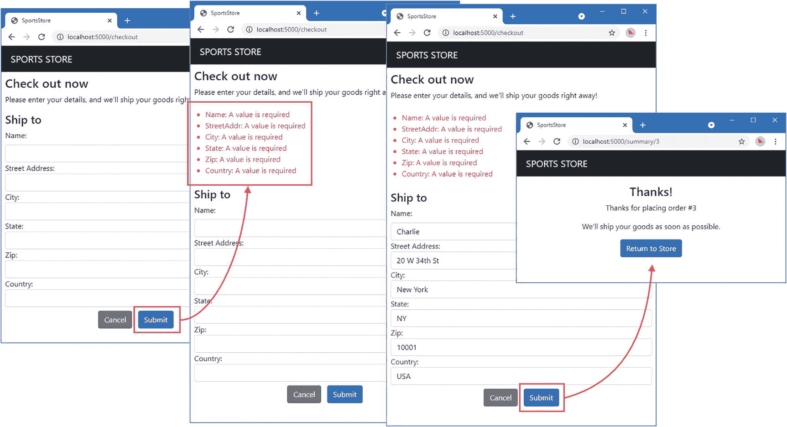
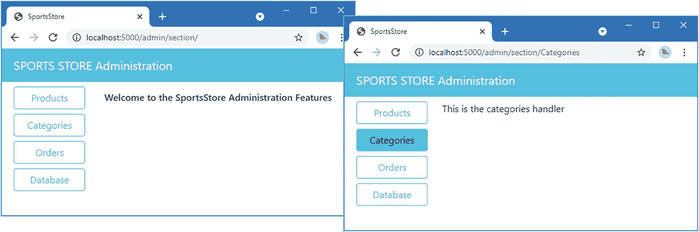
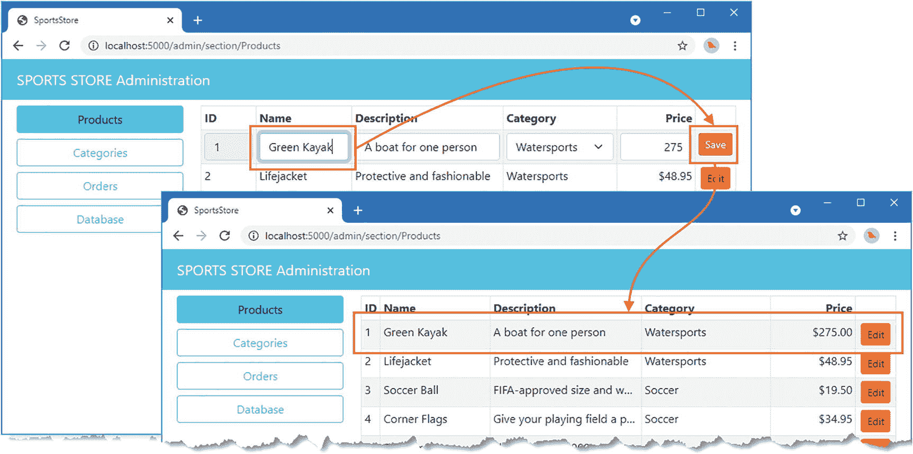
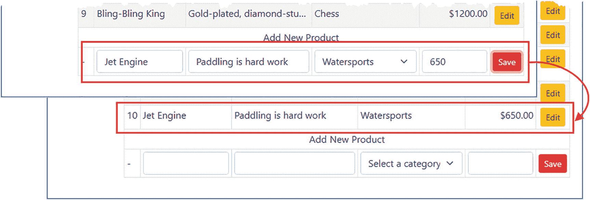
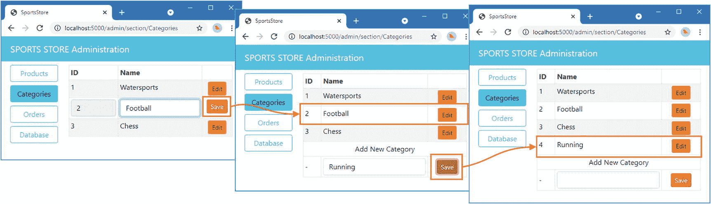
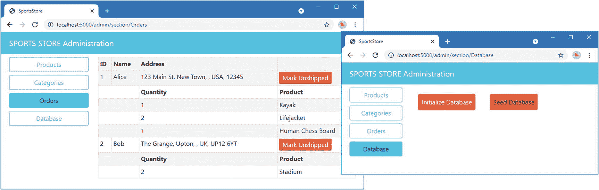
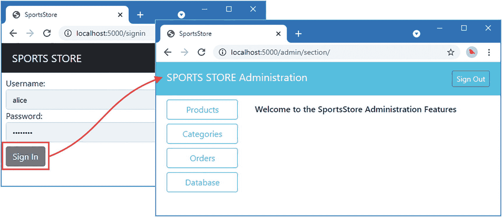
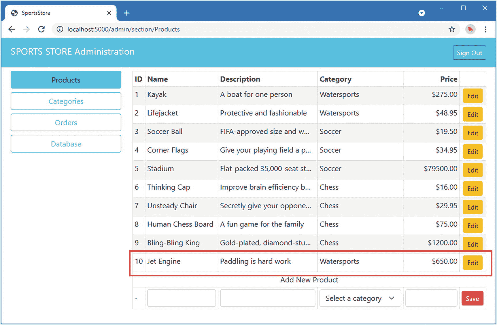
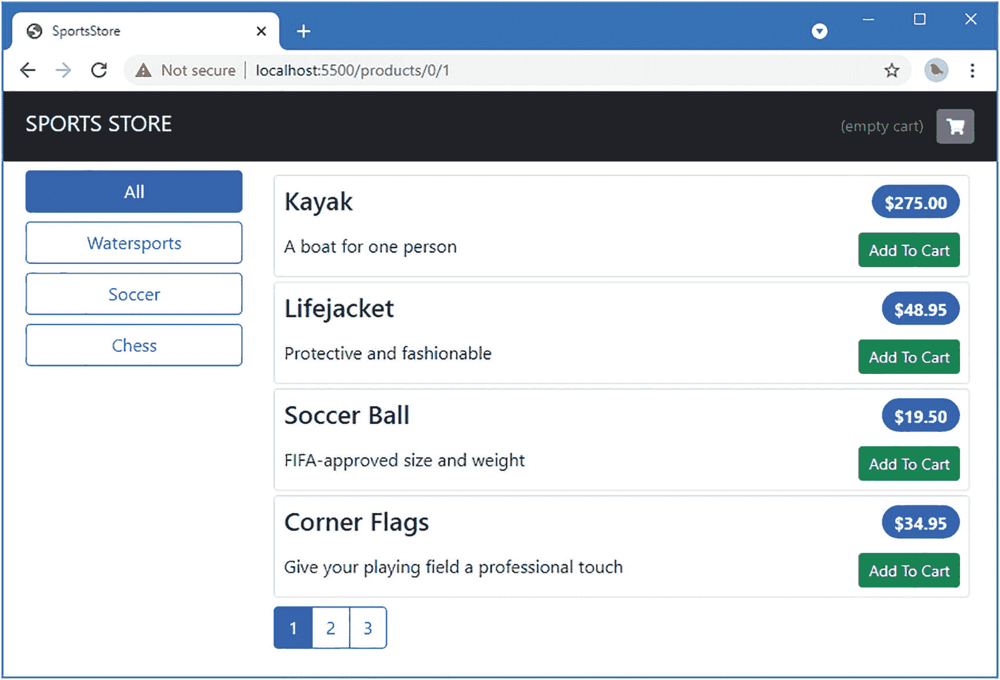

# 37. SportsStore：结账与管理

在本章中，我将继续开发 SportsStore 应用程序，添加结账流程并开始管理功能的开发。

**提示：** 你可以从 [`https://github.com/apress/pro-go`](https://github.com/apress/pro-go) 下载本章以及本书其他章节的示例项目。如果在运行示例时遇到问题，请参阅第 2 章了解如何获取帮助。

## 创建结账流程

为了完善商店体验，我需要让用户能够结账并完成订单。在本节中，我将扩展数据模型以描述配送详情，并创建处理器来捕获这些详情，然后将订单存储到数据库中。当然，大多数电商网站不会止步于此，我也没有提供信用卡或其他支付方式的支持。但我想将重点放在 Go 语言上，因此简单的数据库条目就足够了。

### 定义模型

为了定义表示用户配送详情和商品选择的类型，请在 `models` 文件夹中添加一个名为 `order.go` 的文件，内容如清单 37-1 所示。

```go
package models

type Order struct {
    ID int
    ShippingDetails
    Products []ProductSelection
    Shipped bool
}

type ShippingDetails struct {
    Name       string `validation:"required"`
    StreetAddr string `validation:"required"`
    City       string `validation:"required"`
    State      string `validation:"required"`
    Zip        string `validation:"required"`
    Country    string `validation:"required"`
}

type ProductSelection struct {
    Quantity int
    Product
}
```

**清单 37-1** – `models` 文件夹中 `order.go` 文件的内容

`Order` 类型定义了一个 `ShippingDetails` 字段，用于表示客户的配送详情，并已为平台验证功能定义了结构体标签。此外，还有一个 `Products` 字段，用于存储客户订购的商品及其数量。

### 扩展仓储

下一步是扩展仓储，使其能够存储和检索订单。请将清单 37-2 所示的方法添加到 `sportsstore/models` 文件夹的 `repository.go` 文件中。

```go
package models

type Repository interface {
    GetProduct(id int) Product
    GetProducts() []Product
    GetProductPage(page, pageSize int) (products []Product, totalAvailable int)
    GetProductPageCategory(categoryId int, page, pageSize int) (products []Product, totalAvailable int)
    GetCategories() []Category
    GetOrder(id int) Order
    GetOrders() []Order
    SaveOrder(*Order)
    Seed()
}
```

**清单 37-2** – 在 `models` 文件夹的 `repository.go` 文件中添加接口方法

清单 37-3 显示了 SQL 文件所需的更改，用于创建存储订单数据的新表。

```sql
DROP TABLE IF EXISTS OrderLines;
DROP TABLE IF EXISTS Orders;
DROP TABLE IF EXISTS Products;
DROP TABLE IF EXISTS Categories;

CREATE TABLE IF NOT EXISTS Categories (
    Id INTEGER NOT NULL PRIMARY KEY,
    Name TEXT
);

CREATE TABLE IF NOT EXISTS Products (
    Id INTEGER NOT NULL PRIMARY KEY,
    Name TEXT,
    Description TEXT,
    Category INTEGER,
    Price decimal(8, 2),
    CONSTRAINT CatRef FOREIGN KEY(Category) REFERENCES Categories (Id)
);

CREATE TABLE IF NOT EXISTS OrderLines (
    Id INTEGER NOT NULL PRIMARY KEY,
    OrderId INT,
    ProductId INT,
    Quantity INT,
    CONSTRAINT OrderRef FOREIGN KEY(ProductId) REFERENCES Products (Id),
    CONSTRAINT OrderRef FOREIGN KEY(OrderId) REFERENCES Orders (Id)
);

CREATE TABLE IF NOT EXISTS Orders (
    Id INTEGER NOT NULL PRIMARY KEY,
    Name TEXT NOT NULL,
    StreetAddr TEXT NOT NULL,
    City TEXT NOT NULL,
    Zip TEXT NOT NULL,
    Country TEXT NOT NULL,
    Shipped BOOLEAN
);
```

**清单 37-3** – 在 `sql` 文件夹的 `init_db.sql` 文件中添加表

为了定义一些种子数据，请将清单 37-4 所示的语句添加到 `sportsstore/sql` 文件夹的 `seed_db.sql` 文件中。

```sql
INSERT INTO Categories(Id, Name) VALUES
(1, "Watersports"), (2, "Soccer"), (3, "Chess");

INSERT INTO Products(Id, Name, Description, Category, Price) VALUES
(1, "Kayak", "A boat for one person", 1, 275),
(2, "Lifejacket", "Protective and fashionable", 1, 48.95),
(3, "Soccer Ball", "FIFA-approved size and weight", 2, 19.50),
(4, "Corner Flags", "Give your playing field a professional touch", 2, 34.95),
(5, "Stadium", "Flat-packed 35,000-seat stadium", 2, 79500),
(6, "Thinking Cap", "Improve brain efficiency by 75%", 3, 16),
(7, "Unsteady Chair", "Secretly give your opponent a disadvantage", 3, 29.95),
(8, "Human Chess Board", "A fun game for the family", 3, 75),
(9, "Bling-Bling King", "Gold-plated, diamond-studded King", 3, 1200);

INSERT INTO Orders(Id, Name, StreetAddr, City, Zip, Country, Shipped) VALUES
(1, "Alice", "123 Main St", "New Town", "12345", "USA", false),
(2, "Bob", "The Grange", "Upton", "UP12 6YT", "UK", false);

INSERT INTO OrderLines(Id, OrderId, ProductId, Quantity) VALUES
(1, 1, 1, 1), (2, 1, 2, 2), (3, 1, 8, 1), (4, 2, 5, 2);
```

**清单 37-4** – 在 `sql` 文件夹的 `seed_db.sql` 文件中添加种子数据

### 禁用临时仓储

第 35 章创建的临时仓储不再定义 `Repository` 接口指定的所有方法。在实际项目中，我通常会在添加新功能（如订单）时切换回内存仓储，一旦明确了需求，再切换回 SQL。但对于本项目，我将注释掉创建基于内存服务的代码，如清单 37-5 所示，以避免编译错误。

```go
package repo

import (
    // "platform/services"
    "sportsstore/models"
    "math"
)

// func RegisterMemoryRepoService() {
//     services.AddSingleton(func() models.Repository {
//         repo := &MemoryRepo{}
//         repo.Seed()
//         return repo
//     })
// }

type MemoryRepo struct {
    products   []models.Product
    categories []models.Category
}

// ...其他语句已省略，以保持简洁...
```

**清单 37-5** – 在 `models/repo` 文件夹的 `memory_repo.go` 文件中注释代码

### 定义仓储方法和命令

下一步是定义并实现新的 `Repository` 方法以及它们所依赖的 SQL 文件。清单 37-6 向用于加载数据库 SQL 文件的结构体添加了新命令。

```go
package repo

import (
    "database/sql"
    "platform/config"
    "platform/logging"
    "context"
)

type SqlRepository struct {
    config.Configuration
    logging.Logger
    Commands SqlCommands
    *sql.DB
    context.Context
}

type SqlCommands struct {
    Init,
    Seed,
    GetProduct,
    GetProducts,
    GetCategories,
    GetPage,
    GetPageCount,
    GetCategoryPage,
    GetCategoryPageCount,
    GetOrder,
    GetOrderLines,
    GetOrders,
    GetOrdersLines,
    SaveOrder,
    SaveOrderLine *sql.Stmt
}
```

**清单 37-6** – 在 `models/repo` 文件夹的 `sql_repo.go` 文件中添加命令


### 定义 SQL 文件

在 `sportsstore/sql` 文件夹中添加一个名为 `get_order.sql` 的文件，其内容如代码清单 37-7 所示。

```sql
SELECT Orders.Id, Orders.Name, Orders.StreetAddr, Orders.City, Orders.Zip,
Orders.Country, Orders.Shipped
FROM Orders
WHERE Orders.Id = ?
```

该查询用于检索订单详情。要定义获取已订购产品详情的查询，请在 `sportsstore/sql` 文件夹中添加一个名为 `get_order_lines.sql` 的文件，其内容如代码清单 37-8 所示。

```sql
SELECT OrderLines.Quantity, Products.Id, Products.Name, Products.Description,
Products.Price, Categories.Id, Categories.Name
FROM Orders, OrderLines, Products, Categories
WHERE Orders.Id = OrderLines.OrderId
AND OrderLines.ProductId = Products.Id
AND Products.Category = Categories.Id
AND Orders.Id = ?
ORDER BY Products.Id
```

要定义获取数据库中所有订单的查询，请在 `sportsstore/sql` 文件夹中添加一个名为 `get_orders.sql` 的文件，其内容如代码清单 37-9 所示。

```sql
SELECT Orders.Id, Orders.Name, Orders.StreetAddr, Orders.City, Orders.Zip, Orders.Country, Orders.Shipped
FROM Orders
ORDER BY Orders.Shipped, Orders.Id
```

要定义获取所有订单关联的所有产品详情的查询，请在 `sportsstore/sql` 文件夹中添加一个名为 `get_orders_lines.sql` 的文件，其内容如代码清单 37-10 所示。

```sql
SELECT Orders.Id, OrderLines.Quantity, Products.Id, Products.Name,
Products.Description, Products.Price, Categories.Id, Categories.Name
FROM Orders, OrderLines, Products, Categories
WHERE Orders.Id = OrderLines.OrderId
AND OrderLines.ProductId = Products.Id
AND Products.Category = Categories.Id
ORDER BY Orders.Id
```

要定义用于存储订单的语句，请在 `sportsstore/sql` 文件夹中添加一个名为 `save_order.sql` 的文件，其内容如代码清单 37-11 所示。

```sql
INSERT INTO Orders(Name, StreetAddr, City, Zip, Country, Shipped)
VALUES (?, ?, ?, ?, ?, ?)
```

要定义用于存储与订单关联的产品选择详情的语句，请在 `sportsstore/sql` 文件夹中添加一个名为 `save_order_line.sql` 的文件，其内容如代码清单 37-12 所示。

```sql
INSERT INTO OrderLines(OrderId, ProductId, Quantity)
VALUES (?, ?, ?)
```

代码清单 37-13 为新的 SQL 文件添加了配置设置。

```json
...
"sql": {
"connection_str": "store.db",
"always_reset": true,
"commands": {
"Init":                 "sql/init_db.sql",
"Seed":                 "sql/seed_db.sql",
"GetProduct":           "sql/get_product.sql",
"GetProducts":          "sql/get_products.sql",
"GetCategories":        "sql/get_categories.sql",
"GetPage":              "sql/get_product_page.sql",
"GetPageCount":         "sql/get_page_count.sql",
"GetCategoryPage":      "sql/get_category_product_page.sql",
"GetCategoryPageCount": "sql/get_category_product_page_count.sql",
"GetOrder": "sql/get_order.sql",
"GetOrderLines": "sql/get_order_lines.sql",
"GetOrders": "sql/get_orders.sql",
"GetOrdersLines": "sql/get_orders_lines.sql",
"SaveOrder": "sql/save_order.sql",
"SaveOrderLine": "sql/save_order_line.sql"
}
}
...
```

## 实现存储库方法

在 `sportsstore/models/repo` 文件夹中添加一个名为 `sql_orders_one.go` 的文件，其内容如代码清单 37-14 所示。

```go
package repo
import "sportsstore/models"
func (repo *SqlRepository) GetOrder(id int) (order models.Order) {
order = models.Order { Products: []models.ProductSelection {}}
row := repo.Commands.GetOrder.QueryRowContext(repo.Context, id)
if row.Err() == nil {
err := row.Scan(&order.ID, &order.Name, &order.StreetAddr, &order.City,
&order.Zip, &order.Country, &order.Shipped)
if (err != nil) {
repo.Logger.Panicf("Cannot scan order data: %v", err.Error())
return
}
lineRows, err := repo.Commands.GetOrderLines.QueryContext(repo.Context, id)
if (err == nil) {
for lineRows.Next() {
ps := models.ProductSelection {
Product: models.Product{ Category: &models.Category{}},
}
err = lineRows.Scan(&ps.Quantity, &ps.Product.ID, &ps.Product.Name,
&ps.Product.Description,&ps.Product.Price,
&ps.Product.Category.ID, &ps.Product.Category.CategoryName)
if err == nil {
order.Products = append(order.Products, ps)
} else {
repo.Logger.Panicf("Cannot scan order line data: %v",
err.Error())
}
}
} else {
repo.Logger.Panicf("Cannot exec GetOrderLines command: %v", err.Error())
}
} else {
repo.Logger.Panicf("Cannot exec GetOrder command: %v", row.Err().Error())
}
return
}
```

该方法首先查询数据库获取一个订单，然后再次查询以获取与该订单关联的产品选择详情。接下来，在 `sportsstore/models/repo` 文件夹中添加一个名为 `sql_orders_all.go` 的文件，其内容如代码清单 37-15 所示。

```go
package repo
import "sportsstore/models"
func (repo *SqlRepository) GetOrders() []models.Order {
orderMap := make(map[int]*models.Order, 10)
orderRows, err := repo.Commands.GetOrders.QueryContext(repo.Context)
if err != nil {
repo.Logger.Panicf("Cannot exec GetOrders command: %v", err.Error())
}
for orderRows.Next() {
order := models.Order { Products: []models.ProductSelection {}}
err := orderRows.Scan(&order.ID, &order.Name, &order.StreetAddr, &order.City,
&order.Zip, &order.Country, &order.Shipped)
if (err != nil) {
repo.Logger.Panicf("Cannot scan order data: %v", err.Error())
return  []models.Order {}
}
orderMap[order.ID] = &order
}
lineRows, err := repo.Commands.GetOrdersLines.QueryContext(repo.Context)
if (err != nil) {
repo.Logger.Panicf("Cannot exec GetOrdersLines command: %v", err.Error())
}
for lineRows.Next() {
var order_id int
ps := models.ProductSelection {
Product: models.Product{ Category: &models.Category{} },
}
err = lineRows.Scan(&order_id, &ps.Quantity, &ps.Product.ID,
&ps.Product.Name, &ps.Product.Description, &ps.Product.Price,
&ps.Product.Category.ID, &ps.Product.Category.CategoryName)
if err == nil {
orderMap[order_id].Products = append(orderMap[order_id].Products, ps)
} else {
repo.Logger.Panicf("Cannot scan order line data: %v", err.Error())
}
}
orders := make([]models.Order, 0, len(orderMap))
for _, o := range orderMap {
orders = append(orders, *o)
}
return orders
}
```

该方法查询数据库以获取所有订单及其相关的产品选择。要实现最后一个方法，请在 `sportsstore/models/repo` 文件夹中添加一个名为 `sql_orders_save.go` 的文件，其内容如代码清单 37-16 所示。


```go
package repo
import "sportsstore/models"
func (repo *SqlRepository) SaveOrder(order *models.Order) {
tx, err := repo.DB.Begin()
if err != nil {
repo.Logger.Panicf("Cannot create transaction: %v", err.Error())
return
}
result, err :=  tx.StmtContext(repo.Context,
repo.Commands.SaveOrder).Exec(order.Name, order.StreetAddr, order.City,
order.Zip, order.Country, order.Shipped)
if err != nil {
repo.Logger.Panicf("Cannot exec SaveOrder command: %v", err.Error())
tx.Rollback()
return
}
id, err := result.LastInsertId()
if err != nil {
repo.Logger.Panicf("Cannot get inserted ID: %v", err.Error())
tx.Rollback()
return
}
statement := tx.StmtContext(repo.Context, repo.Commands.SaveOrderLine)
for _, sel := range order.Products {
_, err := statement.Exec(id, sel.Product.ID, sel.Quantity)
if err != nil {
repo.Logger.Panicf("Cannot exec SaveOrderLine command: %v", err.Error())
tx.Rollback()
return
}
}
err = tx.Commit()
if err != nil {
repo.Logger.Panicf("Transaction cannot be committed: %v", err.Error())
err = tx.Rollback()
if err != nil {
repo.Logger.Panicf("Transaction cannot be rolled back: %v", err.Error())
}
}
order.ID = int(id)
}
```
清单 37-16
`models/repo` 文件夹中 `sql_orders_save.go` 文件的内容

此方法使用事务来确保新订单及其相关产品选择被添加到数据库中。如果事务失败，则回滚更改。

## 创建请求处理器和模板

下一步是定义请求处理器，允许用户提供其收货详细信息并结账。如本章开头所述，存储订单将完成结账流程，尽管真实的在线商店会提示用户提供付款方式。在 `sportsstore/store` 文件夹中添加一个名为 `order_handler.go` 的文件，内容如清单 37-17 所示。

```go
package store
import (
"encoding/json"
"platform/http/actionresults"
"platform/http/handling"
"platform/sessions"
"platform/validation"
"sportsstore/models"
"sportsstore/store/cart"
"strings"
)
type OrderHandler struct {
cart.Cart
sessions.Session
Repository models.Repository
URLGenerator handling.URLGenerator
validation.Validator
}
type OrderTemplateContext struct {
models.ShippingDetails
ValidationErrors [][]string
CancelUrl string
}
func (handler OrderHandler) GetCheckout() actionresults.ActionResult {
context := OrderTemplateContext {}
jsonData := handler.Session.GetValueDefault("checkout_details", "")
if jsonData != nil {
json.NewDecoder(strings.NewReader(jsonData.(string))).Decode(&context)
}
context.CancelUrl = mustGenerateUrl(handler.URLGenerator, CartHandler.GetCart)
return actionresults.NewTemplateAction("checkout.html", context)
}
func (handler OrderHandler) PostCheckout(details models.ShippingDetails) actionresults.ActionResult {
valid, errors := handler.Validator.Validate(details)
if (!valid) {
ctx := OrderTemplateContext {
ShippingDetails: details,
ValidationErrors: [][]string {},
}
for _, err := range errors {
ctx.ValidationErrors = append(ctx.ValidationErrors,
[]string { err.FieldName, err.Error.Error()})
}
builder := strings.Builder{}
json.NewEncoder(&builder).Encode(ctx)
handler.Session.SetValue("checkout_details", builder.String())
redirectUrl := mustGenerateUrl(handler.URLGenerator,
OrderHandler.GetCheckout)
return actionresults.NewRedirectAction(redirectUrl)
} else {
handler.Session.SetValue("checkout_details", "")
}
order := models.Order {
ShippingDetails: details,
Products: []models.ProductSelection {},
}
for _, cl := range handler.Cart.GetLines() {
order.Products = append(order.Products, models.ProductSelection {
Quantity: cl.Quantity,
Product: cl.Product,
})
}
handler.Repository.SaveOrder(&order)
handler.Cart.Reset()
targetUrl, _ := handler.URLGenerator.GenerateUrl(OrderHandler.GetSummary,
order.ID)
return actionresults.NewRedirectAction(targetUrl)
}
func (handler OrderHandler) GetSummary(id int) actionresults.ActionResult {
targetUrl, _ := handler.URLGenerator.GenerateUrl(ProductHandler.GetProducts,
0, 1)
return actionresults.NewTemplateAction("checkout_summary.html", struct {
ID int
TargetUrl string
}{ ID: id, TargetUrl: targetUrl})
}
```
清单 37-17
`store` 文件夹中 `order_handler.go` 文件的内容

该处理器定义了三个方法。`GetCheckout` 方法将显示一个 HTML 表单，允许用户输入其收货详细信息，并显示之前结账尝试中的任何验证错误。

`PostCheckout` 方法是 `GetCheckout` 方法渲染的表单的目标。该方法验证用户提供的数据，如果有错误，它会将浏览器重定向回 `GetCheckout` 方法。我使用会话将数据从 `PostCheckout` 方法传递到 `GetCheckout` 方法，并将数据编码和解码为 JSON，以便存储在会话 Cookie 中。

如果没有验证错误，`PostCheckout` 方法将创建一个 `Order`，使用用户提供的收货详细信息和从 `Cart` 获取的产品详细信息（处理器将其作为服务获取）。该 `Order` 通过仓库存储，然后浏览器被重定向到 `GetSummary` 方法，该方法渲染一个显示摘要的模板。

要创建用于收货详细信息的模板，请在 `sportsstore/templates` 文件夹中添加一个名为 `checkout.html` 的文件，内容如清单 37-18 所示。

```html
{{ layout "simple_layout.html" }}
{{ $context := .}}
{{ $details := .ShippingDetails }}

现在结账
请填写您的详细信息，我们将立即发货！

{{ if gt (len $context.ValidationErrors) 0}}

{{ range $context.ValidationErrors }}

{{ index . 0 }}: {{ index . 1 }}

{{ end }}

{{ end }}

收货地址

姓名：

街道地址：

城市：

州/省：

邮政编码：

国家：

取消
提交

```
清单 37-18
`templates` 文件夹中 `checkout.html` 文件的内容

要创建在结账流程结束时显示的模板，请在 `sportsstore/templates` 文件夹中添加一个名为 `checkout_summary.html` 的文件，内容如清单 37-19 所示。

```html
{{ layout "simple_layout.html" }}
{{ $context := . }}

感谢！
感谢您提交订单 #{{ $context.ID }} 
我们将尽快发货。

返回商店

```
清单 37-19
`templates` 文件夹中 `checkout_summary.html` 文件的内容

此模板包含一个链接，可将用户返回到产品列表。`PostCheckout` 方法会重置用户的购物车，允许用户重新开始购物流程。

### 集成结账流程

为了允许用户从购物车摘要开始结账流程，请进行清单 37-20 所示的更改。

```go
...
func (handler CartHandler) GetCart() actionresults.ActionResult {
return actionresults.NewTemplateAction("cart.html", CartTemplateContext {
Cart: handler.Cart,
ProductListUrl: handler.mustGenerateUrl(ProductHandler.GetProducts, 0, 1),
RemoveUrl: handler.mustGenerateUrl(CartHandler.PostRemoveFromCart),
CheckoutUrl: handler.mustGenerateUrl(OrderHandler.GetCheckout),
})
}
...
```
清单 37-20
在 `store` 文件夹的 `cart_handler.go` 文件中添加上下文属性

此更改设置了 `context` 属性的值，为模板提供指向结账处理器的 URL。清单 37-21 添加了使用该 URL 的链接。

```html
...

继续购物

结账

...
```
清单 37-21
在 `templates` 文件夹的 `cart.html` 文件中添加元素


### 注册请求处理器

清单 37-22 注册了请求处理器，使其能够接收请求。

```
...
func createPipeline() pipeline.RequestPipeline {
return pipeline.CreatePipeline(
&basic.ServicesComponent{},
&basic.LoggingComponent{},
&basic.ErrorComponent{},
&basic.StaticFileComponent{},
&sessions.SessionComponent{},
handling.NewRouter(
handling.HandlerEntry{ "",  store.ProductHandler{}},
handling.HandlerEntry{ "",  store.CategoryHandler{}},
handling.HandlerEntry{ "", store.CartHandler{}},
handling.HandlerEntry{ "", store.OrderHandler{}},
).AddMethodAlias("/", store.ProductHandler.GetProducts, 0, 1).
AddMethodAlias("/products[/]?[A-z0-9]*?",
store.ProductHandler.GetProducts, 0, 1),
)
}
...
清单 37-22
在 sportsstore 文件夹的 main.go 文件中注册新处理器
```

编译并执行项目，然后使用浏览器请求 `http://localhost:5000`。将产品添加到购物车，并点击结账按钮，此时会显示如图 37-1 所示的表单。



图 37-1

结账流程

## 创建管理功能

SportsStore 应用已具备基本的产品列表和结账流程，现在需要创建管理功能。我将从一些生成占位内容的简单模板和处理器开始。

创建 `sportsstore/admin` 文件夹，并向其中添加一个名为 `main_handler.go` 的文件，其内容如清单 37-23 所示。

```
package admin
import (
"platform/http/actionresults"
"platform/http/handling"
)
var sectionNames = []string { "Products", "Categories", "Orders", "Database"}
type AdminHandler struct {
handling.URLGenerator
}
type AdminTemplateContext struct {
Sections []string
ActiveSection string
SectionUrlFunc func(string) string
}
func (handler AdminHandler) GetSection(section string) actionresults.ActionResult {
return actionresults.NewTemplateAction("admin.html", AdminTemplateContext {
Sections: sectionNames,
ActiveSection: section,
SectionUrlFunc: func(sec string) string {
sectionUrl, _ := handler.GenerateUrl(AdminHandler.GetSection, sec)
return sectionUrl
},
})
}
清单 37-23
admin 文件夹中 main_handler.go 文件的内容
```

此处理器的目的是为整体管理功能显示一个模板，并提供切换不同功能区域的按钮。在 `sportsstore/templates` 文件夹中添加一个名为 `admin.html` 的文件，其内容如清单 37-24 所示。

```
{{ $context := . }}

SportsStore

SPORTS STORE 管理

{{ range $context.Sections }}

{{ else }}
class="btn btn-outline-info">
{{ end }}
{{ . }}

{{ end }}

{{ if eq $context.ActiveSection ""}}

欢迎使用 SportsStore 管理功能

{{ else }}
{{ handler $context.ActiveSection "getdata" }}
{{ end }}

清单 37-24
templates 文件夹中 admin.html 文件的内容
```

该模板使用不同的配色方案来标识管理功能，并显示两列布局：一侧是功能区域按钮，另一侧是选中的管理功能。选中的功能通过 `handler` 函数显示。

在 `sportsstore/admin` 文件夹中添加一个名为 `products_handler.go` 的文件，其内容如清单 37-25 所示。

```
package admin
type ProductsHandler struct {}
func (handler ProductsHandler) GetData() string {
return "这是产品处理器"
}
清单 37-25
admin 文件夹中 products_handler.go 文件的内容
```

在 `sportsstore/admin` 文件夹中添加一个名为 `categories_handler.go` 的文件，其内容如清单 37-26 所示。

```
package admin
type CategoriesHandler struct {}
func (handler CategoriesHandler) GetData() string {
return "这是类别处理器"
}
清单 37-26
admin 文件夹中 categories_handler.go 文件的内容
```

在 `sportsstore/admin` 文件夹中添加一个名为 `orders_handler.go` 的文件，其内容如清单 37-27 所示。

```
package admin
type OrdersHandler struct {}
func (handler OrdersHandler) GetData() string {
return "这是订单处理器"
}
清单 37-27
admin 文件夹中 orders_handler.go 文件的内容
```

为了完成这组处理器，在 `sportsstore/admin` 文件夹中添加一个名为 `database_handler.go` 的文件，其内容如清单 37-28 所示。

```
package admin
type DatabaseHandler struct {}
func (handler DatabaseHandler) GetData() string {
return "这是数据库处理器"
}
清单 37-28
admin 文件夹中 database_handler.go 文件的内容
```

我将在第 38 章为管理功能添加访问控制，但现在，我将注册这些新处理器，以便任何人都可以访问它们，如清单 37-29 所示。

```
package main
import (
"sync"
"platform/http"
"platform/http/handling"
"platform/services"
"platform/pipeline"
"platform/pipeline/basic"
"sportsstore/store"
"sportsstore/models/repo"
"platform/sessions"
"sportsstore/store/cart"
"sportsstore/admin"
)
func registerServices() {
services.RegisterDefaultServices()
//repo.RegisterMemoryRepoService()
repo.RegisterSqlRepositoryService()
sessions.RegisterSessionService()
cart.RegisterCartService()
}
func createPipeline() pipeline.RequestPipeline {
return pipeline.CreatePipeline(
&basic.ServicesComponent{},
&basic.LoggingComponent{},
&basic.ErrorComponent{},
&basic.StaticFileComponent{},
&sessions.SessionComponent{},
handling.NewRouter(
handling.HandlerEntry{ "",  store.ProductHandler{}},
handling.HandlerEntry{ "",  store.CategoryHandler{}},
handling.HandlerEntry{ "", store.CartHandler{}},
handling.HandlerEntry{ "", store.OrderHandler{}},
handling.HandlerEntry{ "admin", admin.AdminHandler{}},
handling.HandlerEntry{ "admin", admin.ProductsHandler{}},
handling.HandlerEntry{ "admin", admin.CategoriesHandler{}},
handling.HandlerEntry{ "admin", admin.OrdersHandler{}},
handling.HandlerEntry{ "admin", admin.DatabaseHandler{}},
).AddMethodAlias("/", store.ProductHandler.GetProducts, 0, 1).
AddMethodAlias("/products[/]?[A-z0-9]*?", store.ProductHandler.GetProducts, 0, 1).
AddMethodAlias("/admin[/]?", admin.AdminHandler.GetSection, ""),
)
}
func main() {
registerServices()
results, err := services.Call(http.Serve, createPipeline())
if (err == nil) {
(results[0].(*sync.WaitGroup)).Wait()
} else {
panic(err)
}
}
清单 37-29
在 sportsstore 文件夹的 main.go 文件中注册管理处理器
```

编译并执行项目，使用浏览器请求 `http://localhost:5000/admin`，将产生如图 37-2 所示的响应。点击左侧列中的导航按钮将调用右侧列中不同的处理器。



图 37-2

开始开发管理功能

### 创建产品管理功能

产品管理功能将允许向商店添加新产品，以及修改现有产品。为简化起见，我不允许从数据库中删除产品，而该数据库已建立了表之间的外键关系。


### 扩展仓库

第一步是扩展仓库，以便我对数据库进行修改。清单 37-30 为 `Repository` 接口添加了一个新方法。

```go
package models
type Repository interface {
GetProduct(id int) Product
GetProducts() []Product
SaveProduct(*Product)
GetProductPage(page, pageSize int) (products []Product, totalAvailable int)
GetProductPageCategory(categoryId int, page, pageSize int) (products []Product,
totalAvailable int)
GetCategories() []Category
GetOrder(id int) Order
GetOrders() []Order
SaveOrder(*Order)
Seed()
}
```

为了定义用于存储新产品的 SQL，在 `sportsstore/sql` 文件夹中添加一个名为 `save_product.sql` 的文件，其内容如清单 37-31 所示。

```sql
INSERT INTO Products(Name, Description, Category, Price)
VALUES (?, ?, ?, ?)
```

为了定义用于修改现有产品的 SQL，在 `sportsstore/sql` 文件夹中添加一个名为 `update_product.sql` 的文件，其内容如清单 37-32 所示。

```sql
UPDATE Products
SET Name = ?, Description = ?, Category = ?, Price =?
WHERE Id == ?
```

清单 37-33 新增了一些命令，这些命令将提供对用于修改产品数据的 SQL 文件的访问。

```go
package repo
import (
"database/sql"
"platform/config"
"platform/logging"
"context"
)
type SqlRepository struct {
config.Configuration
logging.Logger
Commands SqlCommands
*sql.DB
context.Context
}
type SqlCommands struct {
Init,
Seed,
GetProduct,
GetProducts,
GetCategories,
GetPage,
GetPageCount,
GetCategoryPage,
GetCategoryPageCount,
GetOrder,
GetOrderLines,
GetOrders,
GetOrdersLines,
SaveOrder,
SaveOrderLine,
SaveProduct,
UpdateProduct *sql.Stmt
}
```

清单 37-34 新增了配置设置，用于指定新命令对应 SQL 文件的位置。

```json
{
"sql": {
"connection_str": "store.db",
"always_reset": true,
"commands": {
"Init":                 "sql/init_db.sql",
"Seed":                 "sql/seed_db.sql",
"GetProduct":           "sql/get_product.sql",
"GetProducts":          "sql/get_products.sql",
"GetCategories":        "sql/get_categories.sql",
"GetPage":              "sql/get_product_page.sql",
"GetPageCount":         "sql/get_page_count.sql",
"GetCategoryPage":      "sql/get_category_product_page.sql",
"GetCategoryPageCount": "sql/get_category_product_page_count.sql",
"GetOrder":             "sql/get_order.sql",
"GetOrderLines":        "sql/get_order_lines.sql",
"GetOrders":            "sql/get_orders.sql",
"GetOrdersLines":       "sql/get_orders_lines.sql",
"SaveOrder":            "sql/save_order.sql",
"SaveOrderLine":        "sql/save_order_line.sql",
"SaveProduct":          "sql/save_product.sql",
"UpdateProduct":        "sql/update_product.sql"
}
}
}
```

为了使用 SQL 命令来实现仓库方法，在 `sportsstore/models/repo` 文件夹中添加一个名为 `sql_products_save.go` 的文件，其内容如清单 37-35 所示。

```go
package repo
import "sportsstore/models"
func (repo *SqlRepository) SaveProduct(p *models.Product) {
if (p.ID == 0) {
result, err := repo.Commands.SaveProduct.ExecContext(repo.Context, p.Name,
p.Description, p.Category.ID, p.Price)
if err == nil {
id, err := result.LastInsertId()
if err == nil {
p.ID = int(id)
return
} else {
repo.Logger.Panicf("Cannot get inserted ID: %v", err.Error())
}
} else {
repo.Logger.Panicf("Cannot exec SaveProduct command: %v", err.Error())
}
} else {
result, err := repo.Commands.UpdateProduct.ExecContext(repo.Context, p.Name,
p.Description, p.Category.ID, p.Price, p.ID)
if err == nil {
affected, err := result.RowsAffected()
if err == nil && affected != 1 {
repo.Logger.Panicf("Got unexpected rows affected: %v", affected)
} else if err != nil {
repo.Logger.Panicf("Cannot get rows affected: %v", err)
}
} else {
repo.Logger.Panicf("Cannot exec Update command: %v", err.Error())
}
}
}
```

如果该方法接收到的 `Product` 的 `ID` 属性为零，则数据会被添加到数据库中；否则，则执行更新操作。


### 实现产品请求处理器

下一步是移除请求处理器中的占位符响应，并添加真正的功能，以便管理员能够查看和编辑 `Product` 数据。使用清单 37-36 所示的内容替换 `sportsstore/admin` 文件夹中 `products_handler.go` 文件的内容。（请确保编辑的是 `admin` 文件夹中的文件，而不是 `store` 文件夹中名称相似的文件。）

```go
package admin

import (
	"sportsstore/models"
	"platform/http/actionresults"
	"platform/http/handling"
	"platform/sessions"
)

type ProductsHandler struct {
	models.Repository
	handling.URLGenerator
	sessions.Session
}

type ProductTemplateContext struct {
	Products []models.Product
	EditId   int
	EditUrl  string
	SaveUrl  string
}

const PRODUCT_EDIT_KEY string = "product_edit"

func (handler ProductsHandler) GetData() actionresults.ActionResult {
	return actionresults.NewTemplateAction("admin_products.html",
		ProductTemplateContext{
			Products: handler.GetProducts(),
			EditId:   handler.Session.GetValueDefault(PRODUCT_EDIT_KEY, 0).(int),
			EditUrl:  mustGenerateUrl(handler.URLGenerator, ProductsHandler.PostProductEdit),
			SaveUrl:  mustGenerateUrl(handler.URLGenerator, ProductsHandler.PostProductSave),
		})
}

type EditReference struct {
	ID int
}

func (handler ProductsHandler) PostProductEdit(ref EditReference) actionresults.ActionResult {
	handler.Session.SetValue(PRODUCT_EDIT_KEY, ref.ID)
	return actionresults.NewRedirectAction(mustGenerateUrl(handler.URLGenerator, AdminHandler.GetSection, "Products"))
}

type ProductSaveReference struct {
	Id                  int
	Name, Description   string
	Category            int
	Price               float64
}

func (handler ProductsHandler) PostProductSave(p ProductSaveReference) actionresults.ActionResult {
	handler.Repository.SaveProduct(&models.Product{
		ID: p.Id, Name: p.Name, Description: p.Description,
		Category: &models.Category{ID: p.Category},
		Price:    p.Price,
	})
	handler.Session.SetValue(PRODUCT_EDIT_KEY, 0)
	return actionresults.NewRedirectAction(mustGenerateUrl(handler.URLGenerator, AdminHandler.GetSection, "Products"))
}

func mustGenerateUrl(gen handling.URLGenerator, target interface{}, data ...interface{}) string {
	url, err := gen.GenerateUrl(target, data...)
	if err != nil {
		panic(err)
	}
	return url
}
```

清单 37-36  
在 `admin` 文件夹的 `products_handler.go` 文件中添加功能

`GetData` 方法渲染一个名为 `admin_products.html` 的模板，其上下文数据包含数据库中的 `Product` 值、一个用于标识用户想要编辑的 `Product` 的 `ID` 的 `int` 值，以及用于导航的 URL。要创建该模板，请将名为 `admin_products.html` 的文件添加到 `sportsstore/templates` 文件夹中，其内容如清单 37-37 所示。

```html
{{ $context := . }}

<table>
    <tr>
        <th>ID</th>
        <th>名称</th>
        <th>描述</th>
        <th>分类</th>
        <th>价格</th>
        <th></th>
    </tr>
    {{ range $context.Products }}
    <tr>
        {{ if ne $context.EditId .ID }}
        <td>{{ .ID }}</td>
        <td>{{ .Name }}</td>
        <td>{{ .Description }}</td>
        <td>{{ .CategoryName }}</td>
        <td>{{ printf "$%.2f" .Price }}</td>
        <td><a href='{{ $context.EditUrl }}?id={{ .ID }}'>编辑</a></td>
        {{ else }}
        <form method="POST" action="{{ $context.SaveUrl }}">
            <td>{{ .ID }}<input type="hidden" name="id" value="{{ .ID }}" /></td>
            <td><input name="name" value="{{ .Name }}" /></td>
            <td><input name="description" value="{{ .Description }}" /></td>
            <td>{{ handler "categories" "getselect" .Category.ID }}</td>
            <td><input name="price" value="{{ printf "%.2f" .Price }}" /></td>
            <td><button type="submit">保存</button></td>
        </form>
        {{ end }}
    </tr>
    {{ end }}
</table>

{{ if eq $context.EditId 0 }}
<form method="POST" action="{{ $context.SaveUrl }}">
    <h4>添加新产品</h4>
    <p><input name="name" placeholder="名称" /></p>
    <p><textarea name="description" placeholder="描述"></textarea></p>
    <p><input name="price" placeholder="价格" /></p>
    <p>{{ handler "categories" "getselect" 0 }}</p>
    <button type="submit">保存</button>
</form>
{{ end }}
```

清单 37-37  
`templates` 文件夹中 `admin_products.html` 文件的内容

此模板生成一个 HTML 模板，其中包含所有产品，以及一个用于修改现有产品的内联编辑器，和另一个用于创建新产品的编辑器。这两项任务都需要一个允许用户选择分类的 `select` 元素，该元素通过调用 `CategoriesHandler` 定义的方法生成。清单 37-38 将此方法添加到请求处理器中。

```go
package admin

import (
	"platform/http/actionresults"
	"sportsstore/models"
)

type CategoriesHandler struct {
	models.Repository
}

func (handler CategoriesHandler) GetData() string {
	return "这是分类处理器"
}

func (handler CategoriesHandler) GetSelect(current int) actionresults.ActionResult {
	return actionresults.NewTemplateAction("select_category.html", struct {
		Current    int
		Categories []models.Category
	}{Current: current, Categories: handler.GetCategories()})
}
```

清单 37-38  
在 `admin` 文件夹的 `categories_handler.go` 文件中添加对 Select 元素的支持

为了定义 `GetSelect` 方法使用的模板，请将名为 `select_category.html` 的文件添加到 `sportsstore/templates` 文件夹中，其内容如清单 37-39 所示。

```html
{{ $context := . }}

<select name="category">
    <option value="0">选择一个分类</option>
    {{ range $context.Categories }}
    <option value="{{ .ID }}" {{ if eq $context.Current .ID }}selected{{ end }}>{{ .CategoryName }}</option>
    {{ end }}
</select>
```

清单 37-39  
`templates` 文件夹中 `select_category.html` 文件的内容

编译并运行项目，使用浏览器请求 `http://localhost:5000/admin`，然后点击“产品”按钮。您将看到从数据库中读取的产品列表。单击某个“编辑”按钮选择要编辑的产品，在表单字段中输入新值，然后点击“提交”按钮将更改保存到数据库，如图 37-3 所示。



图 37-3  
编辑产品

**注意：** SportsStore 应用程序配置为每次启动时重置数据库，这意味着您对数据库所做的任何更改都将被丢弃。我在准备第 38 章的部署时会禁用此功能。

当没有选择要编辑的产品时，表格底部的表单可用于在数据库中创建新产品，如图 37-4 所示。



图 37-4  
添加产品

### 创建分类管理功能

我将采用上一节中建立的基本模式来实现其他管理功能。


### 扩展仓储接口

清单 37-40 为 `Repository` 接口添加了一个用于存储 `Category` 的方法。

```
package models
type Repository interface {
GetProduct(id int) Product
GetProducts() []Product
SaveProduct(*Product)
GetProductPage(page, pageSize int) (products []Product, totalAvailable int)
GetProductPageCategory(categoryId int, page, pageSize int) (products []Product,
totalAvailable int)
GetCategories() []Category
SaveCategory(*Category)
GetOrder(id int) Order
GetOrders() []Order
SaveOrder(*Order)
Seed()
}
清单 37-40
在 models 文件夹中的 repository.go 文件中添加方法
```

为了定义用于在数据库中存储新类别的 SQL，请在 `sportsstore/sql` 文件夹中添加一个名为 `save_category.sql` 的文件，其内容如清单 37-41 所示。

```
INSERT INTO Categories(Name) VALUES (?)
清单 37-41
sql 文件夹中 save_category.sql 文件的内容
```

为了定义用于修改现有类别的 SQL，请在 `sportsstore/sql` 文件夹中添加一个名为 `update_category.sql` 的文件，其内容如清单 37-42 所示。

```
UPDATE Categories SET Name = ? WHERE Id == ?
清单 37-42
sql 文件夹中 update_category.sql 文件的内容
```

清单 37-43 添加了用于访问 SQL 文件的新命令。

```
...
type SqlCommands struct {
Init,
Seed,
GetProduct,
GetProducts,
GetCategories,
GetPage,
GetPageCount,
GetCategoryPage,
GetCategoryPageCount,
GetOrder,
GetOrderLines,
GetOrders,
GetOrdersLines,
SaveOrder,
SaveOrderLine,
SaveProduct,
UpdateProduct,
SaveCategory,
UpdateCategory *sql.Stmt
}
...
清单 37-43
在 models/repo 文件夹中的 sql_repo.go 文件中添加命令
```

清单 37-44 添加了用于指定新命令对应 SQL 文件位置的配置设置。

```
...
"sql": {
"connection_str": "store.db",
"always_reset": true,
"commands": {
"Init":                 "sql/init_db.sql",
"Seed":                 "sql/seed_db.sql",
"GetProduct":           "sql/get_product.sql",
"GetProducts":          "sql/get_products.sql",
"GetCategories":        "sql/get_categories.sql",
"GetPage":              "sql/get_product_page.sql",
"GetPageCount":         "sql/get_page_count.sql",
"GetCategoryPage":      "sql/get_category_product_page.sql",
"GetCategoryPageCount": "sql/get_category_product_page_count.sql",
"GetOrder":             "sql/get_order.sql",
"GetOrderLines":        "sql/get_order_lines.sql",
"GetOrders":            "sql/get_orders.sql",
"GetOrdersLines":       "sql/get_orders_lines.sql",
"SaveOrder":            "sql/save_order.sql",
"SaveOrderLine":        "sql/save_order_line.sql",
"SaveProduct":          "sql/save_product.sql",
"UpdateProduct":        "sql/update_product.sql",
"SaveCategory":         "sql/save_category.sql",
"UpdateCategory":       "sql/update_category.sql"
}
}
...
清单 37-44
在 sportsstore 文件夹中的 config.json 文件中添加配置设置

为实现新的接口方法，请在 `sportsstore/models/repo` 文件夹中添加一个名为 `sql_category_save.go` 的文件，其内容如清单 37-45 所示。

```
package repo
import "sportsstore/models"
func (repo *SqlRepository) SaveCategory(c *models.Category) {
if (c.ID == 0) {
result, err := repo.Commands.SaveCategory.ExecContext(repo.Context,
c.CategoryName)
if err == nil {
id, err := result.LastInsertId()
if err == nil {
c.ID = int(id)
return
} else {
repo.Logger.Panicf("Cannot get inserted ID: %v", err.Error())
}
} else {
repo.Logger.Panicf("Cannot exec SaveCategory command: %v", err.Error())
}
} else {
result, err := repo.Commands.UpdateCategory.ExecContext(repo.Context,
c.CategoryName, c.ID)
if err == nil {
affected, err := result.RowsAffected()
if err == nil && affected != 1 {
repo.Logger.Panicf("Got unexpected rows affected: %v", affected)
} else if err != nil {
repo.Logger.Panicf("Cannot get rows affected: %v", err)
}
} else {
repo.Logger.Panicf("Cannot exec UpdateCategory command: %v", err.Error())
}
}
}
清单 37-45
在 models/repo 文件夹中的 sql_category_save.go 文件内容
```

如果此方法接收到的 `Category` 的 `ID` 属性为零，则数据将被添加到数据库中；否则，将执行更新操作。

### 实现类别请求处理程序

用清单 37-46 所示的代码替换 `sportsstore/admin` 文件夹中 `categories_handler.go` 文件的内容。

```
package admin
import (
"sportsstore/models"
"platform/http/actionresults"
"platform/http/handling"
"platform/sessions"
)
type CategoriesHandler struct {
models.Repository
handling.URLGenerator
sessions.Session
}
type CategoryTemplateContext struct {
Categories []models.Category
EditId int
EditUrl string
SaveUrl string
}
const CATEGORY_EDIT_KEY string = "category_edit"
func (handler CategoriesHandler) GetData() actionresults.ActionResult {
return actionresults.NewTemplateAction("admin_categories.html",
CategoryTemplateContext {
Categories: handler.Repository.GetCategories(),
EditId: handler.Session.GetValueDefault(CATEGORY_EDIT_KEY, 0).(int),
EditUrl: mustGenerateUrl(handler.URLGenerator,
CategoriesHandler.PostCategoryEdit),
SaveUrl: mustGenerateUrl(handler.URLGenerator,
CategoriesHandler.PostCategorySave),
})
}
func (handler CategoriesHandler) PostCategoryEdit(ref EditReference) actionresults.ActionResult {
handler.Session.SetValue(CATEGORY_EDIT_KEY, ref.ID)
return actionresults.NewRedirectAction(mustGenerateUrl(handler.URLGenerator,
AdminHandler.GetSection, "Categories"))
}
func (handler CategoriesHandler) PostCategorySave(
c models.Category) actionresults.ActionResult {
handler.Repository.SaveCategory(&c)
handler.Session.SetValue(CATEGORY_EDIT_KEY, 0)
return actionresults.NewRedirectAction(mustGenerateUrl(handler.URLGenerator,
AdminHandler.GetSection, "Categories"))
}
func (handler CategoriesHandler) GetSelect(current int) actionresults.ActionResult {
return actionresults.NewTemplateAction("select_category.html", struct {
Current int
Categories []models.Category
}{ Current: current, Categories: handler.GetCategories()})
}
清单 37-46
替换 admin 文件夹中 categories_handler.go 文件的内容
```

为了定义此处理程序使用的模板，请在 `sportsstore/templates` 文件夹中添加一个名为 `admin_categories.html` 的文件，其内容如清单 37-47 所示。

```
{{ $context := . }}

IDName

{{ range $context.Categories }}
{{ if ne $context.EditId .ID}}

{{ .ID }}
{{ .CategoryName }}

Edit

{{ else }}

Save

{{end }}
{{ end }}

{{ if eq $context.EditId 0}}

Add New Category

-

Save

{{ end }}

清单 37-47
templates 文件夹中 admin_categories.html 文件的内容
```

编译并执行项目，使用浏览器访问 `http://localhost:5000/admin`，然后点击“类别”按钮。您将看到从数据库中读取的类别列表，并且可以编辑和创建类别，如图 37-5 所示。



图 37-5

管理类别

## 总结

在本章中，我继续开发 SportsStore 应用程序，添加了结账流程并开始着手管理功能。在下一章中，我将完成这些功能，增加访问控制支持，并为应用程序的部署做好准备。


# SportsStore：收尾与部署

本章我将完成 SportsStore 应用的开发，并为其部署做好准备。

**提示** 你可以从 [`https://github.com/apress/pro-go`](https://github.com/apress/pro-go) 下载本章（以及本书其他所有章节）的示例项目。如果在运行示例时遇到问题，请参阅第 2 章了解如何获取帮助。

## 完成管理功能

第 37 章定义的四个管理功能中，有两个尚未实现。本节我将同时实现这两个功能，因为它们比产品和分类功能更简单。

### 扩展仓储

完成管理功能需要两个新的仓储方法，如代码清单 38-1 所示。

```go
package models

type Repository interface {
    GetProduct(id int) Product
    GetProducts() []Product
    SaveProduct(*Product)
    GetProductPage(page, pageSize int) (products []Product, totalAvailable int)
    GetProductPageCategory(categoryId int, page, pageSize int) (products []Product, totalAvailable int)
    GetCategories() []Category
    SaveCategory(*Category)
    GetOrder(id int) []Order
    GetOrders() Order
    SaveOrder(*Order)
    SetOrderShipped(*Order)
    Seed()
    Init()
}
```

`SetOrderShipped` 方法将用于更新现有的 `Order`，以标记其已发货状态。`Init` 方法与接口的 SQL 实现中已定义的方法名对应，用于让管理员在部署后首次使用前准备数据库。

为了定义用于更新现有订单的 SQL，在 `sportsstore/sql` 文件夹中添加一个名为 `update_order.sql` 的文件，内容如代码清单 38-2 所示。

```sql
UPDATE Orders SET Shipped = ? WHERE Id == ?
```

代码清单 38-3 新增了一条命令，以便像其他 SQL 语句一样访问代码清单 38-2 中定义的 SQL。

```go
type SqlCommands struct {
    Init,
    Seed,
    GetProduct,
    GetProducts,
    GetCategories,
    GetPage,
    GetPageCount,
    GetCategoryPage,
    GetCategoryPageCount,
    GetOrder,
    GetOrderLines,
    GetOrders,
    GetOrdersLines,
    SaveOrder,
    SaveOrderLine,
    UpdateOrder,
    SaveProduct,
    UpdateProduct,
    SaveCategory,
    UpdateCategory *sql.Stmt
}
```

代码清单 38-4 添加了一个配置设置，用于指定新命令所需 SQL 文件的位置。

```json
{
    "sql": {
        "connection_str": "store.db",
        "always_reset": true,
        "commands": {
            "Init":                  "sql/init_db.sql",
            "Seed":                  "sql/seed_db.sql",
            "GetProduct":            "sql/get_product.sql",
            "GetProducts":           "sql/get_products.sql",
            "GetCategories":         "sql/get_categories.sql",
            "GetPage":               "sql/get_product_page.sql",
            "GetPageCount":          "sql/get_page_count.sql",
            "GetCategoryPage":       "sql/get_category_product_page.sql",
            "GetCategoryPageCount":  "sql/get_category_product_page_count.sql",
            "GetOrder":              "sql/get_order.sql",
            "GetOrderLines":         "sql/get_order_lines.sql",
            "GetOrders":             "sql/get_orders.sql",
            "GetOrdersLines":        "sql/get_orders_lines.sql",
            "SaveOrder":             "sql/save_order.sql",
            "SaveOrderLine":         "sql/save_order_line.sql",
            "SaveProduct":           "sql/save_product.sql",
            "UpdateProduct":         "sql/update_product.sql",
            "SaveCategory":          "sql/save_category.sql",
            "UpdateCategory":        "sql/update_category.sql",
            "UpdateOrder":           "sql/update_order.sql"
        }
    }
}
```

为了实现仓储方法，在 `sportsstore/models/repo` 文件夹中添加一个名为 `sql_order_update.go` 的文件，内容如代码清单 38-5 所示。

```go
package repo

import "sportsstore/models"

func (repo *SqlRepository) SetOrderShipped(o *models.Order) {
    result, err := repo.Commands.UpdateOrder.ExecContext(repo.Context, o.Shipped, o.ID)
    if err == nil {
        rows, err := result.RowsAffected()
        if err != nil {
            repo.Logger.Panicf("Cannot get updated ID: %v", err.Error())
        } else if rows != 1 {
            repo.Logger.Panicf("Got unexpected rows affected: %v", rows)
        }
    } else {
        repo.Logger.Panicf("Cannot exec UpdateOrder command: %v", err.Error())
    }
}
```

### 实现请求处理器

为了添加订单管理支持，将 `sportsstore/admin` 文件夹中的 `orders_handler.go` 文件内容替换为代码清单 38-6 所示的内容。

```go
package admin

import (
    "platform/http/actionresults"
    "platform/http/handling"
    "sportsstore/models"
)

type OrdersHandler struct {
    models.Repository
    handling.URLGenerator
}

func (handler OrdersHandler) GetData() actionresults.ActionResult {
    return actionresults.NewTemplateAction("admin_orders.html", struct {
        Orders      []models.Order
        CallbackUrl string
    }{
        Orders:      handler.Repository.GetOrders(),
        CallbackUrl: mustGenerateUrl(handler.URLGenerator, OrdersHandler.PostOrderToggle),
    })
}

func (handler OrdersHandler) PostOrderToggle(ref EditReference) actionresults.ActionResult {
    order := handler.Repository.GetOrder(ref.ID)
    order.Shipped = !order.Shipped
    handler.Repository.SetOrderShipped(&order)
    return actionresults.NewRedirectAction(mustGenerateUrl(handler.URLGenerator, AdminHandler.GetSection, "Orders"))
}
```

订单唯一允许的修改是改变 `Shipped` 字段的值，以表示订单已发货。将 `database_handler.go` 文件的内容替换为代码清单 38-7 所示的内容。

```go
package admin

import (
    "platform/http/actionresults"
    "platform/http/handling"
    "sportsstore/models"
)

type DatabaseHandler struct {
    models.Repository
    handling.URLGenerator
}

func (handler DatabaseHandler) GetData() actionresults.ActionResult {
    return actionresults.NewTemplateAction("admin_database.html", struct {
        InitUrl, SeedUrl string
    }{
        InitUrl: mustGenerateUrl(handler.URLGenerator, DatabaseHandler.PostDatabaseInit),
        SeedUrl: mustGenerateUrl(handler.URLGenerator, DatabaseHandler.PostDatabaseSeed),
    })
}

func (handler DatabaseHandler) PostDatabaseInit() actionresults.ActionResult {
    handler.Repository.Init()
    return actionresults.NewRedirectAction(mustGenerateUrl(handler.URLGenerator, AdminHandler.GetSection, "Database"))
}

func (handler DatabaseHandler) PostDatabaseSeed() actionresults.ActionResult {
    handler.Repository.Seed()
    return actionresults.NewRedirectAction(mustGenerateUrl(handler.URLGenerator, AdminHandler.GetSection, "Database"))
}
```

这里为每个可在数据库上执行的操作都提供了处理器方法。这样一来，在本章后续完成部署准备后，管理员就可以快速启动应用程序。


### 创建模板

要创建用于管理订单的模板，请在 `sportsstore/templates` 文件夹中添加名为 `admin_orders.html` 的文件，其内容如清单 38-8 所示。

```
{{ $context := .}}

IDNameAddress

{{ range $context.Orders }}

{{ .ID }}
{{ .Name }}
{{ .StreetAddr }}, {{ .City }}, {{ .State }},
{{ .Country }}, {{ .Zip }}

{{ if .Shipped }}

Ship Order

{{ else }}

Mark Unshipped

{{ end }}

QuantityProduct
{{ range .Products }}

{{ .Quantity }}
{{ .Product.Name }}

{{ end }}
{{ end }}
```

清单 38-8
`templates` 文件夹中 `admin_orders.html` 文件的内容

该模板以表格形式显示订单，并包含每个订单中所含产品的详细信息。要创建用于管理数据库的模板，请在 `sportsstore/templates` 文件夹中添加名为 `admin_database.html` 的文件，其内容如清单 38-9 所示。

```
{{ $context := . }}

Initialize Database

Seed Database
```

清单 38-9
`templates` 文件夹中 `admin_database.html` 文件的内容

编译并执行项目，使用浏览器请求 `http://localhost:5000/admin`，然后点击 Orders 按钮即可查看数据库中的订单并更改其发货状态，如图 38-1 所示。点击 Database 按钮，您将能够重置和初始化（seed）数据库，同样见图 38-1。



图 38-1
完成管理功能

## 限制对管理功能的访问

允许开放访问管理功能可以简化开发，但在生产环境中绝不允许这样做。现在管理功能已经完成，是时候确保只有授权用户才能访问它们了。

### 创建用户存储和请求处理器

如前所述，我没有实现一个真正的身份验证系统，因为安全地实现这一点很困难，也超出了本书的范围。相反，我将采用与 `platform` 项目类似的方法，依赖硬编码的凭据来验证用户身份。创建 `sportsstore/admin/auth` 文件夹，并在其中添加一个名为 `user_store.go` 的文件，其内容如清单 38-10 所示。

```
package auth
import (
"platform/services"
"platform/authorization/identity"
"strings"
)
func RegisterUserStoreService() {
err := services.AddSingleton(func () identity.UserStore {
return &userStore{}
})
if (err != nil) {
panic(err)
}
}
var users = map[int]identity.User {
1: identity.NewBasicUser(1, "Alice", "Administrator"),
}
type userStore struct {}
func (store *userStore) GetUserByID(id int) (identity.User, bool) {
user, found := users[id]
return user, found
}
func (store *userStore) GetUserByName(name string) (identity.User, bool) {
for _, user := range users {
if strings.EqualFold(user.GetDisplayName(), name) {
return user, true
}
}
return nil, false
}
```

清单 38-10
`admin/auth` 文件夹中 `user_store.go` 文件的内容

要创建用于处理身份验证请求的处理器，请在 `sportsstore/admin` 文件夹中添加一个名为 `auth_handler.go` 的文件，其内容如清单 38-11 所示。

```
package admin
import (
"platform/authorization/identity"
"platform/http/actionresults"
"platform/http/handling"
"platform/sessions"
)
type AuthenticationHandler struct {
identity.User
identity.SignInManager
identity.UserStore
sessions.Session
handling.URLGenerator
}
const SIGNIN_MSG_KEY string = "signin_message"
func (handler AuthenticationHandler) GetSignIn() actionresults.ActionResult {
message := handler.Session.GetValueDefault(SIGNIN_MSG_KEY, "").(string)
return actionresults.NewTemplateAction("signin.html", message)
}
type Credentials struct {
Username string
Password string
}
func (handler AuthenticationHandler) PostSignIn(creds Credentials) actionresults.ActionResult {
if creds.Password == "mysecret" {
user, ok := handler.UserStore.GetUserByName(creds.Username)
if (ok) {
handler.Session.SetValue(SIGNIN_MSG_KEY, "")
handler.SignInManager.SignIn(user)
return actionresults.NewRedirectAction("/admin/section/")
}
}
handler.Session.SetValue(SIGNIN_MSG_KEY, "Access Denied")
return actionresults.NewRedirectAction(mustGenerateUrl(handler.URLGenerator,
AuthenticationHandler.GetSignIn))
}
func (handler AuthenticationHandler) PostSignOut(creds Credentials) actionresults.ActionResult {
handler.SignInManager.SignOut(handler.User)
return actionresults.NewRedirectAction("/")
}
```

清单 38-11
`admin` 文件夹中 `auth_handler.go` 文件的内容

`GetSignIn` 方法渲染一个模板，该模板会提示用户输入其凭据，并显示存储在会话中的消息。`PostSignIn` 方法从表单接收凭据，然后将用户登录到应用程序，或者向会话添加一条消息并重定向浏览器，以便用户可以再次尝试。

要创建让用户登录应用程序的模板，请在 `sportsstore/templates` 文件夹中添加一个名为 `signin.html` 的文件，其内容如清单 38-12 所示。

```
{{ layout "simple_layout.html" }}
{{ if ne . "" }}
{{ . }}
{{ end }}

Username:

Password:

Sign In
```

清单 38-12
`templates` 文件夹中 `signin.html` 文件的内容

该模板提示用户输入其账户名和密码，这些信息会回发到请求处理器。

要允许用户退出应用程序，请在 `sportsstore/admin` 文件夹中添加一个名为 `signout_handler.go` 的文件，其内容如清单 38-13 所示。

```
package admin
import (
"platform/authorization/identity"
"platform/http/actionresults"
"platform/http/handling"
)
type SignOutHandler struct {
identity.User
handling.URLGenerator
}
func (handler SignOutHandler) GetUserWidget() actionresults.ActionResult {
return actionresults.NewTemplateAction("user_widget.html", struct {
identity.User
SignoutUrl string}{
handler.User,
mustGenerateUrl(handler.URLGenerator,
AuthenticationHandler.PostSignOut),
})
}
```

清单 38-13
`admin` 文件夹中 `signout_handler.go` 文件的内容

要创建让用户退出的模板，请在 `sportsstore/templates` 文件夹中添加一个名为 `user_widget.html` 的文件，其内容如清单 38-14 所示。

```
{{ $context := . }}
{{ if $context.User.IsAuthenticated }}

Sign Out

{{ end }}
```

清单 38-14
`templates` 文件夹中 `user_widget.html` 文件的内容

清单 38-15 将用户控件（user widget）添加到了用于管理功能的布局中。

```
...

SPORTS STORE Administration

{{ handler "signout" "getuserwidget" }}

...
```

清单 38-15
在 `templates` 文件夹的 `admin.html` 文件中添加控件


### 配置应用程序

清单 38-16 添加了一项配置设置，用于指定在请求受限 URL 时使用的 URL，这比直接返回状态码提供了更有用的替代方案。

```json
{
"logging" : {
"level": "debug"
},
"files": {
"path": "files"
},
"templates": {
"path": "templates/*.html",
"reload": true
},
"sessions": {
"key": "MY_SESSION_KEY",
"cyclekey": true
},
"sql": {
// ...为简洁起见，省略了设置...
},
"authorization": {
"failUrl": "/signin"
}
}
```

*清单 38-16：在 `sportsstore` 文件夹的 `config.json` 文件中添加配置设置*

指定的 URL 将提示用户输入其凭据。清单 38-17 重新配置了请求管道，以保护管理功能。

```go
package main
import (
"sync"
"platform/http"
"platform/http/handling"
"platform/services"
"platform/pipeline"
"platform/pipeline/basic"
"sportsstore/store"
"sportsstore/models/repo"
"platform/sessions"
"sportsstore/store/cart"
"sportsstore/admin"
"platform/authorization"
"sportsstore/admin/auth"
)
func registerServices() {
services.RegisterDefaultServices()
//repo.RegisterMemoryRepoService()
repo.RegisterSqlRepositoryService()
sessions.RegisterSessionService()
cart.RegisterCartService()
authorization.RegisterDefaultSignInService()
authorization.RegisterDefaultUserService()
auth.RegisterUserStoreService()
}
func createPipeline() pipeline.RequestPipeline {
return pipeline.CreatePipeline(
&basic.ServicesComponent{},
&basic.LoggingComponent{},
&basic.ErrorComponent{},
&basic.StaticFileComponent{},
&sessions.SessionComponent{},
authorization.NewAuthComponent(
"admin",
authorization.NewRoleCondition("Administrator"),
admin.AdminHandler{},
admin.ProductsHandler{},
admin.CategoriesHandler{},
admin.OrdersHandler{},
admin.DatabaseHandler{},
admin.SignOutHandler{},
).AddFallback("/admin/section/", "^/admin[/]?$"),
handling.NewRouter(
handling.HandlerEntry{ "",  store.ProductHandler{}},
handling.HandlerEntry{ "",  store.CategoryHandler{}},
handling.HandlerEntry{ "", store.CartHandler{}},
handling.HandlerEntry{ "", store.OrderHandler{}},
// handling.HandlerEntry{ "admin", admin.AdminHandler{}},
// handling.HandlerEntry{ "admin", admin.ProductsHandler{}},
// handling.HandlerEntry{ "admin", admin.CategoriesHandler{}},
// handling.HandlerEntry{ "admin", admin.OrdersHandler{}},
// handling.HandlerEntry{ "admin", admin.DatabaseHandler{}},
handling.HandlerEntry{ "", admin.AuthenticationHandler{}},
).AddMethodAlias("/", store.ProductHandler.GetProducts, 0, 1).
AddMethodAlias("/products[/]?[A-z0-9]*?",
store.ProductHandler.GetProducts, 0, 1),    )
}
func main() {
registerServices()
results, err := services.Call(http.Serve, createPipeline())
if (err == nil) {
(results[0].(*sync.WaitGroup)).Wait()
} else {
panic(err)
}
}
```

*清单 38-17：在 `sportsstore` 文件夹的 `main.go` 文件中配置应用程序*

编译并执行应用程序，然后使用浏览器请求 `http://localhost:5000/admin`。当提示时，使用用户名 `alice` 和密码 `mysecret` 进行身份验证，您将被授予访问管理功能的权限，如图 38-2 所示。



*图 38-2：登录应用程序*

## 创建 Web 服务

我要添加的最后一个功能是一个简单的 Web 服务，只是为了展示如何实现。我不会使用授权来保护该 Web 服务，因为这可能是一个复杂的过程，取决于预期需要访问的客户端类型。这意味着任何用户都能够修改数据库。如果您要部署一个真正的 Web 服务，那么您可以像本示例中那样使用 cookie。如果您的客户端不支持 cookie，则可以使用 JSON Web 令牌（JWT），如 [`https://jwt.io`](https://jwt.io) 所述。

要创建 Web 服务，请在 `sportsstore/store` 文件夹中添加一个名为 `rest_handler.go` 的文件，其内容如清单 38-18 所示。

```go
package store
import (
"sportsstore/models"
"platform/http/actionresults"
"net/http"
)
type StatusCodeResult struct {
code int
}
func (action *StatusCodeResult) Execute(ctx *actionresults.ActionContext) error {
ctx.ResponseWriter.WriteHeader(action.code)
return nil
}
type RestHandler struct {
Repository models.Repository
}
func (h RestHandler) GetProduct(id int) actionresults.ActionResult {
return actionresults.NewJsonAction(h.Repository.GetProduct(id))
}
func (h RestHandler) GetProducts() actionresults.ActionResult {
return actionresults.NewJsonAction(h.Repository.GetProducts())
}
type ProductReference struct {
models.Product
CategoryID int
}
func (h RestHandler) PostProduct(p ProductReference) actionresults.ActionResult {
if p.ID == 0 {
return actionresults.NewJsonAction(h.processData(p))
} else {
return &StatusCodeResult{ http.StatusBadRequest }
}
}
func (h RestHandler) PutProduct(p ProductReference) actionresults.ActionResult {
if p.ID > 0 {
return actionresults.NewJsonAction(h.processData(p))
} else {
return &StatusCodeResult{ http.StatusBadRequest }
}
}
func (h RestHandler) processData(p ProductReference) models.Product {
product := p.Product
product.Category = &models.Category {
ID: p.CategoryID,
}
h.Repository.SaveProduct(&product)
return h.Repository.GetProduct(product.ID)
}
```

*清单 38-18：`store` 文件夹中 `rest_handler.go` 文件的内容*

`StatusCodeResult` 结构体是一个操作结果，用于发送 HTTP 状态码，这对 Web 服务非常有用。请求处理程序定义了一些方法，允许通过 `GET` 请求检索单个产品和所有产品，通过 `POST` 请求创建新产品，以及通过 `PUT` 请求修改现有产品。清单 38-19 将新处理程序注册到前缀 `/api`。

```go
...
handling.NewRouter(
handling.HandlerEntry{ "",  store.ProductHandler{}},
handling.HandlerEntry{ "",  store.CategoryHandler{}},
handling.HandlerEntry{ "", store.CartHandler{}},
handling.HandlerEntry{ "", store.OrderHandler{}},
handling.HandlerEntry{ "", admin.AuthenticationHandler{}},
handling.HandlerEntry{ "api", store.RestHandler{}},
).AddMethodAlias("/", store.ProductHandler.GetProducts, 0, 1).
AddMethodAlias("/products[/]?[A-z0-9]*?",
store.ProductHandler.GetProducts, 0, 1),
...
```

*清单 38-19：在 `sportsstore` 文件夹的 `main.go` 文件中注册处理程序*

编译并执行项目。打开一个新的命令提示符，并执行清单 38-20 中所示的命令，以向数据库添加新产品。

```bash
curl --header "Content-Type: application/json" --request POST --data '{"name" : "Jet Engine","description": "Paddling is hard work", "price":650, "categoryid":1}' http://localhost:5000/api/product
```

*清单 38-20：添加新产品*

如果您使用的是 Windows，请打开一个新的 PowerShell 窗口并运行清单 38-21 中所示的命令。

```powershell
Invoke-RestMethod http://localhost:5000/api/product -Method POST -Body  (@{ Name="Jet Engine"; Description="Paddling is hard work"; Price=650; CategoryId=1 } | ConvertTo-Json) -ContentType "application/json"
```

*清单 38-21：在 Windows 中添加新产品*


要查看更改的效果，请运行清单 38-22 中所示的命令。

```
curl http://localhost:5000/api/product/10
Listing 38-22
Requesting Data
```

如果您使用 Windows，请在 PowerShell 窗口中运行清单 38-23 中所示的命令。

```
Invoke-RestMethod http://localhost:5000/api/product/10
Listing 38-23
Requesting Data in Windows
```

您也可以使用浏览器来查看更改的效果。请求 `http://localhost:5000/admin`。使用用户名 `alice` 和密码 `mysecret` 进行身份验证，然后点击“产品”按钮。表格的最后一行将包含使用 Web 服务创建的产品，如图 38-3 所示。



Figure 38-3

Checking the effect of a database change

## 为部署做准备

在本节中，我将完成 SportsStore 应用程序的准备工作，并创建一个可以部署到生产环境中的容器。这并不是部署 Go 应用程序的唯一方式，但我选择 Docker 容器是因为它们被广泛使用，并且适合 Web 应用程序。这不是一份完整的部署指南，但能让您了解准备应用程序的流程。

### 安装证书

第一步是添加用于 HTTPS 的证书。如第 24 章所述，如果您没有真正的证书，可以创建一个自签名证书，或者使用本书 GitHub 仓库中的证书文件（其中包含我创建的一个自签名证书）。

### 配置应用程序

最重要的更改是修改应用程序配置，以禁用那些在开发时方便但在部署中不应使用的功能，并启用 HTTPS，如清单 38-24 所示。

```
{
"logging" : {
"level": "information"
},
"files": {
"path": "files"
},
"templates": {
"path": "templates/*.html",
"reload": false
},
"sessions": {
"key": "MY_SESSION_KEY",
"cyclekey": false
},
"sql": {
"connection_str": "store.db",
"always_reset": false,
"commands": {
"Init": "sql/init_db.sql",
"Seed": "sql/seed_db.sql",
"GetProduct": "sql/get_product.sql",
"GetProducts": "sql/get_products.sql",
"GetCategories": "sql/get_categories.sql",
"GetPage": "sql/get_product_page.sql",
"GetPageCount": "sql/get_page_count.sql",
"GetCategoryPage": "sql/get_category_product_page.sql",
"GetCategoryPageCount": "sql/get_category_product_page_count.sql",
"GetOrder": "sql/get_order.sql",
"GetOrderLines": "sql/get_order_lines.sql",
"GetOrders": "sql/get_orders.sql",
"GetOrdersLines": "sql/get_orders_lines.sql",
"SaveOrder": "sql/save_order.sql",
"SaveOrderLine": "sql/save_order_line.sql",
"SaveProduct":          "sql/save_product.sql",
"UpdateProduct":        "sql/update_product.sql",
"SaveCategory":         "sql/save_category.sql",
"UpdateCategory":       "sql/update_category.sql",
"UpdateOrder":          "sql/update_order.sql"
}
},
"authorization": {
"failUrl": "/signin"
},
"http": {
"enableHttp": false,
"enableHttps": true,
"httpsPort": 5500,
"httpsCert": "certificate.cer",
"httpsKey": "certificate.key"
}
}
Listing 38-24
Changing Settings in the config.json File in the sportsstore Folder
```

确保您为 `httpsCert` 和 `httpsKey` 属性指定的值与您的证书文件名匹配，并且证书文件位于 `sportsstore` 文件夹中。

### 构建应用程序

Docker 容器运行在 Linux 上。如果您使用 Windows，则必须在 PowerShell 窗口中运行清单 38-25 中所示的命令，将 Linux 设置为构建目标，以配置 Go 构建工具。如果您运行的是 Linux，则无需执行此操作。

```
$Env:GOOS = "linux"; $Env:GOARCH = "amd64"
Listing 38-25
Setting Linux as the Build Target
```

在 `sportsstore` 文件夹中运行清单 38-26 中所示的命令来构建应用程序。

```
go build
Listing 38-26
Building the Application
```

注

如果您是 Windows 用户，可以通过以下命令恢复到正常的 Windows 构建：`$Env:GOOS = "windows"; $Env:GOARCH = "amd64"`。但在完成部署流程之前，请不要运行此命令。

### 安装 Docker Desktop

访问 `docker.com` 并下载安装 Docker Desktop 软件包。按照安装流程操作，重启您的机器，然后运行清单 38-27 中所示的命令，检查 Docker 是否已安装并已添加到您的环境路径中。（Docker 的安装过程似乎经常变化，这就是我没有提供更详细说明的原因。）

注

您需要在 `docker.com` 上创建一个帐户才能下载安装程序。

```
docker --version
Listing 38-27
Checking the Docker Desktop Installation
```

### 创建 Docker 配置文件

要为应用程序创建 Docker 配置，请在 `sportsstore` 文件夹中创建一个名为 `Dockerfile` 的文件，其内容如清单 38-28 所示。

```
FROM alpine:latest
COPY sportsstore /app/
COPY templates /app/templates
COPY sql/* /app/sql/
COPY files/* /app/files/
COPY config.json /app/
COPY certificate.* /app/
EXPOSE 5500
WORKDIR /app
ENTRYPOINT ["./sportsstore"]
Listing 38-28
The Contents of the Dockerfile in the sportsstore Folder
```

这些指令将应用程序及其支持文件复制到一个 Docker 镜像中，并配置其执行方式。下一步是使用清单 38-28 中定义的指令创建一个镜像。在 `sportsstore` 文件夹中运行清单 38-29 中所示的命令来创建一个 Docker 镜像。

```
docker build  --tag go_sportsstore .
Listing 38-29
Creating an Image
```

确保您已停止所有其他应用程序实例，然后运行清单 38-30 中所示的命令，从该镜像创建一个新容器并执行它。

```
docker run -p 5500:5500 go_sportsstore
Listing 38-30
Creating and Starting a Container
```

给容器一点时间启动，然后使用浏览器请求 `https://localhost:5500`，这将产生如图 38-4 所示的响应。如果您使用了自签名证书，则可能需要通过安全警告。



Figure 38-4

Running the application in a container

应用程序现在已准备好部署。要停止该容器以及任何其他正在运行的容器，请运行清单 38-31 中所示的命令。

```
docker kill $(docker ps -q)
Listing 38-31
Stopping Containers
```

## 总结

在本章中，我通过完成管理功能、配置授权以及创建一个基本的 Web 服务，完成了 SportsStore 应用程序，然后使用 Docker 容器为应用程序的部署做好了准备。

这就是我要教给您的关于 Go 的全部内容。我只希望您能像我享受写作这本书一样享受阅读它，并祝愿您在 Go 项目取得圆满成功。


# 索引

## A

- 地址运算符
- append 函数
- 算术运算符
- 算术溢出
- 数组
    - 比较
    - 定义
    - 枚举
    - 索引表示法
    - 字面量语法
    - 多维
    - 指向数组的指针
    - 类型
    - 编译器推断
- 箭头表达式

## B

- 基准测试
- 空白标识符
- 布尔数据类型

## C

- `cap()` 函数
- 通道
    - 箭头表达式
    - 缓冲
    - 关闭
    - 协调
    - 枚举
    - 接收结果
    - `select` 语句
    - 发送
    - 类型
    - 单向
- 字符数据类型
- `close()` 函数
- 闭包
- 常量值
- `untyped` 常量
- 上下文
    - 数据库
- 类型转换
    - 显式转换
    - 格式化字符串
    - `math` 包
    - 解析整数
    - 解析字符串
- `copy()` 函数

## D

- 数据库
    - 关闭上下文
    - `DB` 结构体
    - 驱动程序，列出
    - 打开
    - 查询
        - 结果
        - 多行
        - 扫描单行
    - 语句
        - 占位符
        - 预处理语句
    - 事务
        - 提交
        - 回滚
        - 启动
- 数据类型
    - `bool`
    - `byte`
    - `complex64`
    - `complex128`
    - `float32`
    - `float64`
    - `int`
    - `run`
    - `string`
    - `uint`
- 调试
    - 断点命令
    - 在编辑器中调试
    - Delve 调试器
    - `dlv` 命令
- `defer` 关键字
- `delete()` 函数
- 依赖注入
- `dlv` 命令
- Docker
- 文档，代码
- `do...while` 循环
- 持续时间
    - 方法
    - 解析

## E

- 空接口
- 枚举序列，`range` 关键字
- 勘误，报告
- `error` 接口
- 错误
    - 通道
    - 便捷函数
    - `defer` 关键字
    - `error` 接口
    - 忽略错误
    - `panic()` 函数
    - 引发恐慌，可恢复
    - `recover()` 函数
    - 从恐慌中恢复，报告
    - 不可恢复
- 显式类型转换

## F

- 文件路径
- 文件
    - 关闭
    - 常见文件位置
    - 创建
    - 目录
    - 文件路径
    - 文件和目录
    - `File` 结构体
    - 读取
        - 便捷函数
        - 解码 JSON
        - 定位
    - 标准错误
    - 标准输入
    - 标准输出
    - 临时文件
    - 写入
        - 便捷函数
    - `File` 结构体定位
- `File` 结构体
- 浮点数据类型
- 流程控制
    - 完成语句
    - `do...while` 循环
    - `else` 子句
    - `else if` 子句
    - `if` 语句
        - 初始化语句
    - 标签语句
    - `for` 循环
        - 作用域
    - `switch` 语句
        - 穿透
        - 类型切换
        - 语法限制
- `fmt` 包
- `for` 循环
    - 完成语句
    - `do...while` 循环
    - 初始化语句
    - `range` 关键字
- 格式化字符串
- 格式化动词
- `func` 关键字
- 函数
    - 闭包
    - `defer` 关键字
    - 定义
    - `func` 关键字
    - 字面量语法
    - 参数
        - 省略名称
        - 省略类型
        - 指针
        - 可变参数
    - 结果
        - 多个
        - 命名
        - 用作参数
        - 用作结果
- 函数类型
    - 别名
    - 闭包
    - 比较
    - 定义
    - 参数
    - 结果

## G

- `go build` 命令
- `go clean` 命令
- `go` 命令
    - 单元测试参数
- `go doc` 命令
- `go fmt` 命令
- `go get` 命令
- `go install` 命令
- `go` 关键字
- `go mod` 命令
- 协程
    - 通道
    - 条件
    - 创建
    - 延迟执行
    - `go` 关键字
    - 互斥锁，读写
    - `Once` 结构体
    - 暂停
    - 暂停执行
    - 结果
    - 定时通知
- `go run` 命令
- `go vet` 命令

## H

- HTTP
    - Cookies
    - 表单数据
    - `POST` 请求
    - 请求
        - `Client` 结构体
        - 便捷函数
        - Cookies
        - 表单
        - 重定向
        - `Request` 结构体
        - `Response` 结构体
    - `ResponseWriter` 接口
    - 服务器
        - 证书
        - 内容类型嗅探
        - 便捷响应
        - 创建动态内容
        - 文件
        - HTTPS
        - JSON 数据
        - 处理请求
        - 路由
        - 静态内容
        - TLS
    - `URL` 结构体

## I

- `if` 语句
    - 初始化语句
    - 作用域
- `import` 关键字
- `import` 语句
- 初始化语句
- 整数数据类型
- `interface` 关键字
- 接口
    - 比较
    - 定义
    - 动态类型
    - 空接口
    - 实现
    - 静态类型
    - 类型断言
    - 使用
- `iota` 关键字

## J, K

- JSON
    - 解码
        - 数组
        - 接口
        - 映射
        - 数字
        - 结构体
        - `Unmarshaler` 接口
    - 编码
        - 数组
        - 数据类型映射
        - 接口
        - 映射
        - `Marshaler` 接口
        - 切片
        - 结构体
        - 结构体标签
    - `NewDecoder()` 函数
    - `NewEncoder()` 函数

## L

- 标签语句
- `len()` 函数
- Linter
    - 配置
    - 禁用规则
    - 安装
    - `revive`
    - 使用
- 列表
- 字面量值，示例
- 本地化
- 日志记录，`log` 包

## M

- 映射
    - 检查项目
    - `delete()` 函数
    - 枚举
    - 字面量语法
    - 删除项目
    - 类型
- 数学函数
    - `math/rand` 包
        - 随机数
        - 范围
        - 播种
        - 洗牌切片
    - `math` 包
- `math/rand` 包
- 方法
    - 定义
    - 重载
    - 参数
    - 接收器
    - 接收器，指针
    - 结果
    - 用于类型别名
- 模块
    - 创建
    - `go.mod` 文件
- 互斥锁

## N

- `new()` 函数

## O

- 运算符
    - 算术
    - 算术溢出
    - 比较，指针
    - 递减
    - 相等
    - 递增
    - 逻辑
    - 取余
    - 运算符
    - 三元
- `os` 包

## P, Q

- 包声明
- `package` 关键字
- 包
    - 访问控制
    - 空白标识符
    - 创建
    - 初始化函数
    - 名称冲突
    - 别名
    - 点导入
    - 第三方包
    - 使用
- `panic()` 函数
- 管道
- 指针
    - 地址运算符
    - 比较
    - 定义
    - 解引用
    - 方法接收器
    - 指针算术
    - 结构体
    - 零值
- 随机数
- `range` 关键字
- 范围
- 读取器
    - 缓冲
    - `Closer` 接口
    - 管道
    - `Reader` 接口
        - `Read` 方法
    - 扫描
    - 专用实现
    - 工具函数
- `recover()` 函数
- 反射
    - 数据库结果
    - 反射类型
        - 基本特性
        - 识别种类
    - 反射值
        - 基本特性
        - 比较
        - 转换
        - 创建
        - 获取
        - 设置
    - 类型
        - 数组
        - 通道
        - 函数
        - 接口
        - 映射
        - 方法
        - 指针
        - 切片
        - 结构体
    - 值
        - 数组
        - 通道
        - 函数
        - 接口
        - 映射
        - 方法
        - 指针
        - 切片
        - 结构体
- `reflect` 包
- 正则表达式
    - 编译
    - 模式
    - 查找字符串
    - 匹配
    - 匹配字符串
    - 替换字符串
    - 分割字符串
    - 子表达式
- RESTful Web 服务
- Rune
    - 更改大小写
    - 来自字符串

## S

- 作用域
- `select` 语句
    - 超时
- 代码文件中的分号
- 短变量声明语法
- 切片
    - 追加到
    - 容量
    - 分配
    - 比较
    - 复制
    - 元素
    - 从数组创建
    - 从其他切片创建
    - 删除元素
    - 枚举
    - 范围
    - `reflect` 包
    - 洗牌
    - 排序
        - 自定义类型
        - 搜索
    - `sort` 包
    - 类型
    - 底层数组
- `sort` 包
- SportsStore
    - 访问控制
    - 操作结果
    - 管理
    - 授权
    - 购物车
    - 结账
    - 配置
    - CSS
    - 数据库
    - 数据模型
    - 依赖注入
    - 部署
    - Docker
    - 过滤
    - HTML
    - 响应
    - 日志记录
    - 中间件组件
    - 分页
    - 管道
    - 请求处理器
    - 服务
    - 会话
    - URL 生成
    - 验证
    - Web 服务
- 标准错误
- 标准输入
- 标准输出
- 字符串数据类型
- 字符串
    - 构建字符串
    - 字节内容
    - 大小写更改
    - 字符内容
    - 比较
    - 连接
    - 转换大小写
    - 枚举
    - 查找子字符串
    - 格式化
        - `fmt` 包
        - 精度
        - 宽度
    - 格式化动词
    - 解析
    - 正则表达式
    - 替换字符
    - Rune 内容
    - 扫描
    - 分割
    - 修剪
- 结构体
    - 地址运算符
    - 匿名结构体
    - 数组
    - 类
    - 比较
    - 构造函数
    - 转换
    - 定义
    - 嵌入字段
    - 字段
    - 嵌入
    - 映射
    - `new()` 函数
    - 指针
    - 切片
    - 标签
    - 值
    - 零值
- `switch` 语句
    - 穿透

## T

- 模板
    - 动作
    - 块
    - 条件
    - 数据值
    - 枚举
    - 执行
    - 格式化值
    - 函数
    - 加载
    - 模式
    - 嵌套模板
    - 结果编码
    - 切片
    - 变量
    - 空白
- 三元比较
- 时间和日期
    - 持续时间
    - 格式化
    - 布局常量
    - 操作
    - 从字符串解析
    - 表示
    - 类型
- TLS
- 类型别名
- 类型断言
    - 测试
- 类型组合
    - 基础类型
    - 构造函数
    - 嵌入字段
    - 接口
    - 动态类型
    - 提升
    - 歧义
    - 限制
    - 类型链

## U

- Unicode
- 单元测试
    - `go` 命令
    - 管理执行
    - 模拟类型
    - 包语句
    - 运行
    - 跳过
    - 测试文件
    - 测试函数
    - `T` 结构体
- 无类型常量，`iota`

## V

- 变量
    - 空白标识符
    - 定义
    - 重新定义
    - 短语法
    - `var` 关键字
- 变量作用域

## W, X, Y, Z

- 等待组
- 写入器
    - 缓冲
    - `Closer` 接口
    - 管道
    - 扫描
    - 专用实现
    - 工具函数
    - `Writer` 接口
        - `Write` 方法
