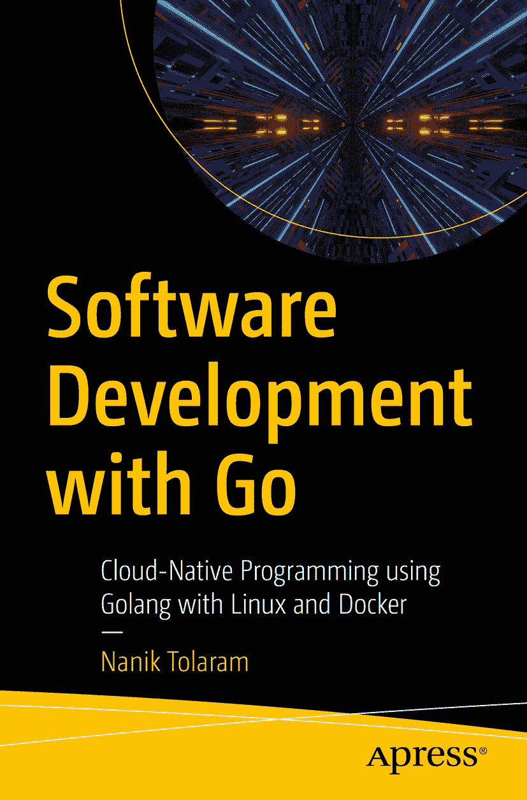

ISBN 978-1-4842-8730-9 e-ISBN 978-1-4842-8731-6 [`doi.org/10.1007/978-1-4842-8731-6`](https://doi.org/10.1007/978-1-4842-8731-6) © Nanik Tolaram 2023 本作品受版权保护。版权所有。所有权利，无论是整体还是部分材料，均专有地由出版商授权，具体包括翻译、重印、重新使用插图、朗诵、广播、在缩微胶片上复制或以任何其他物理方式复制，以及传输或信息存储与检索、电子改编、计算机软件，或通过目前已知或日后开发的类似或不同方法进行。在本出版物中使用通用描述性名称、注册商标、商标、服务标志等，即使在缺乏明确声明的情况下，也不意味着这些名称不受相关保护性法律和法规的约束，因此可随意使用。出版商、作者和编辑可假定本书中的建议和信息在出版之日是真实和准确的。出版商和作者或编辑均不对本材料中包含的内容或可能存在的任何错误或遗漏提供明示或暗示的担保。出版商对于已发布地图和机构归属中的管辖权主张保持中立。

本 Apress 印记由注册公司 APress Media, LLC 出版，该公司是 Springer Nature 的一部分。

注册公司地址为：1 New York Plaza, New York, NY 10004, U.S.A.

*谨以此书献给我已故的父亲，他支持并鼓励我在 17 岁时写下了人生第一本书。献给我最亲爱的母亲，她一直支持我追求梦想，并鼓励我无论生活带来什么，都要坚持下去。献给我美丽的妻子和挚友，感谢她允许我花时间写作，并在我们生活的每一步都支持我。献给我的两个儿子，Rahul 和 Manav，感谢他们允许我在周末花时间坐在电脑前追逐我的梦想和热情。最后但同样重要的是，感谢上苍赐予我生命和机会，让我成为今天的自己。*

