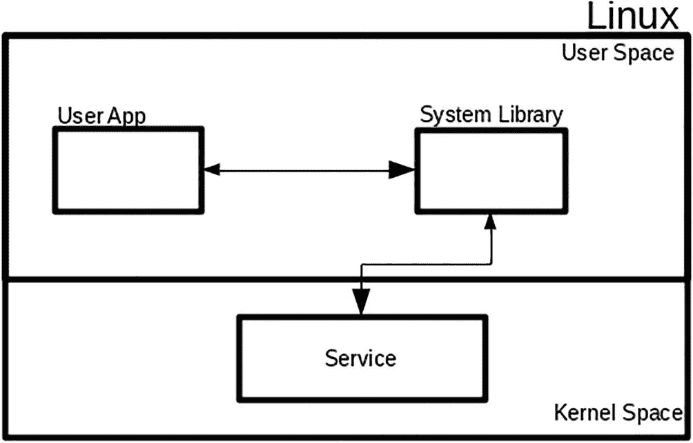
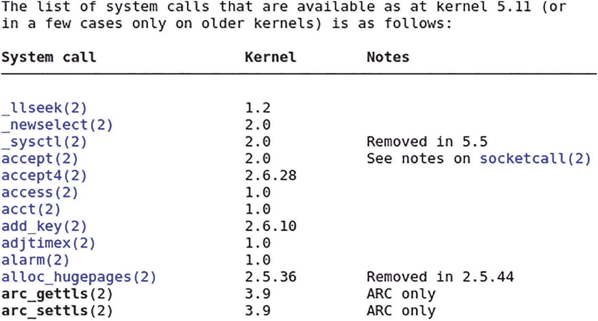
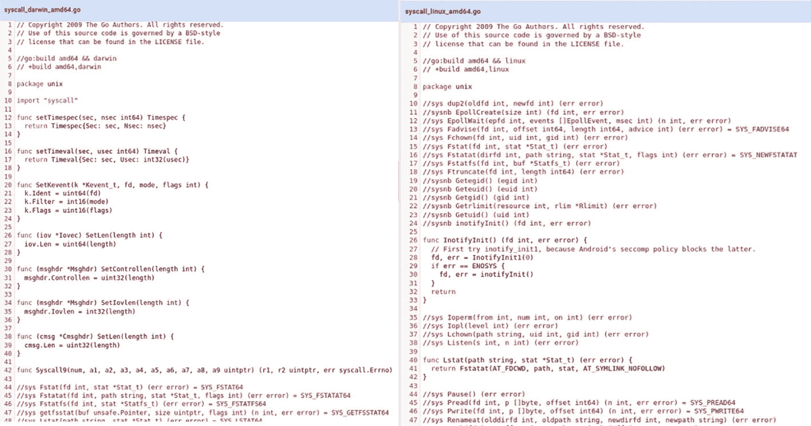
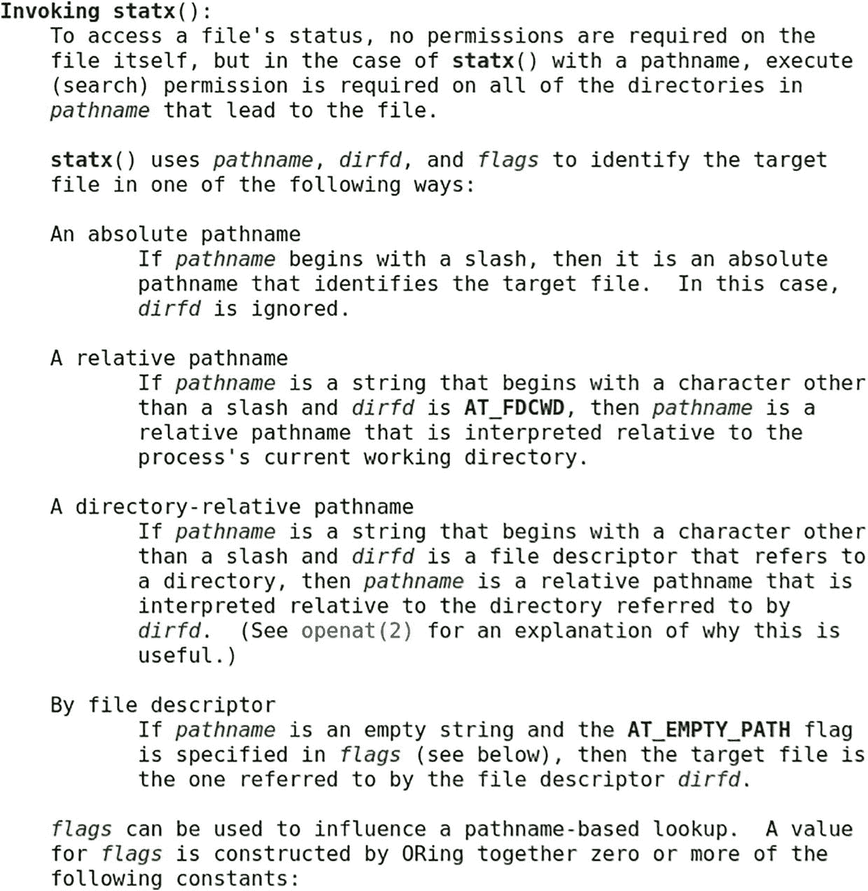

# 第一章：系统调用

Linux 提供了许多功能，并允许应用程序访问操作系统能够访问的一切。当讨论系统调用时，大多数人会将注意力转向使用 C 语言，因为这是与操作系统交互时最常用的语言。

在本章中，你将探索什么是系统调用，以及如何使用 Go 编程进行系统调用。学完本章，你将了解以下内容：

*   系统调用在 C 语言中是什么样的
*   理解 `sys/unix` Go 包
*   探索一个使用系统调用的项目

如果你是第一次使用 Go，请参考 [`https://go.dev/doc/install`](https://go.dev/doc/install) 上的在线文档。该在线文档将指导你在本地计算机上安装 Go 的步骤。请学习 Go 文档提供的 Go 教程，网址为 [`https://go.dev/doc/`](https://go.dev/doc/)。

### 源代码

本章的源代码可从 [`https://github.com/Apress/Software-Development-Go`](https://github.com/Apress/Software-Development-Go) 仓库获取。

### 什么是系统调用？

系统调用是你的应用程序当前所运行的操作系统提供的接口。通过使用此接口，你的应用程序可以与操作系统通信以执行操作。通常，操作系统提供了许多应用程序可以利用的服务。

图 1-1 从高层次展示了应用程序如何使用系统调用向操作系统请求某些服务操作。用户应用程序将调用提供的系统库（在本例中为 Go 库），然后系统库将通过提供的接口调用操作系统服务。数据在不同组件之间双向流动。



Linux 操作系统的框图，包括用户应用程序连接到用户空间的系统库，该库在内核空间提供服务。

**图 1-1** 系统调用的高级视图

操作系统提供了大量应用程序可使用的系统调用。图 1-2 显示了系统调用列表的截图。要查看完整的 Linux 系统调用列表，你可以访问 [`https://man7.org/linux/man-pages/man2/syscalls.2.xhtml`](https://man7.org/linux/man-pages/man2/syscalls.2.xhtml)。



一张截图，以三列（系统调用、内核和备注）列出了内核 5.11 可用的系统调用。总共有 13 个内核版本。

**图 1-2** Linux 系统调用快照


### C 语言中的系统调用

在本节中，你将简要了解系统调用在 C 程序中的典型工作方式。这将让你了解在 C 语言中执行系统调用与在 Go 语言中有何不同。

你将看到一个使用 socket 连接服务器并读取响应的简单示例。代码位于 `chapter1/c` 目录中。该代码创建一个 socket，并用它连接名为 [`httpbin.org`](http://httpbin.org) 的公共网站，然后将收到的响应打印到屏幕上。代码清单 1-1 展示了示例代码。

```c
#include
#include
#include
#include
#include
int main(int argc, char * argv[]) {
int socket_desc;
struct sockaddr_in server;
char * message, server_reply[2000];
struct hostent * host;
const char * hostname = "httpbin.org";
//创建 socket
socket_desc = socket(AF_INET, SOCK_STREAM, 0);
if (socket_desc == -1) {
printf("无法创建 socket");
}
if ((server.sin_addr.s_addr = inet_addr(hostname)) == 0xffffffff) {
if ((host = gethostbyname(hostname)) == NULL) {
return -1;
}
memcpy( & server.sin_addr, host -> h_addr, host -> h_length);
}
server.sin_family = AF_INET;
server.sin_port = htons(80);
if (connect(socket_desc, (struct sockaddr * ) & server, sizeof(server)) < 0) {
puts("连接错误");
return 1;
}
puts("已连接\n");
//发送一些数据
message = "GET / HTTP/1.0\n\n";
if (send(socket_desc, message, strlen(message), 0) < 0) {
puts("发送失败");
return 1;
}
puts("数据已发送\n");
//从服务器接收回复
if (recv(socket_desc, server_reply, 2000, 0) < 0) {
puts("接收失败");
}
puts("已收到回复\n");
puts(server_reply);
return 0;
}
代码清单 1-1
示例代码
```

要测试代码，请确保你的机器上安装了 C 编译器。按照 GCC 网站上的说明安装编译器和工具（[`https://gcc.gnu.org/`](https://gcc.gnu.org/)）。使用以下命令编译代码：

```bash
cc sample.c -o sample
```

代码将被编译成名为 `sample` 的可执行文件，只需在命令行输入 `./sample` 即可运行。成功运行后，它将打印出以下内容：

```
Connected
Data Send
Reply received
HTTP/1.1 200 OK
Date: Tue, 01 Mar 2022 10:21:13 GMT
Content-Type: text/html; charset=utf-8
Content-Length: 9593
Connection: close
Server: gunicorn/19.9.0
Access-Control-Allow-Origin: *
Access-Control-Allow-Credentials: true
```

该代码示例展示了它所使用的系统调用：通过 `gethostbyname` 函数将 [`httpbin.org`](http://httpbin.org) 的地址解析为 IP 地址。它还使用 `connect` 函数，通过新创建的 socket 连接到服务器。

在下一节中，你将开始探索 Go，使用标准库编写涉及系统调用的代码。

### sys/unix 包

`sys/unix` 包是 Go 语言提供的一个包，它提供了与操作系统交互的系统级接口。Go 可以在多种操作系统上运行，这意味着它为不同的操作系统提供了不同的应用程序接口。完整的包文档可以在 [`https://pkg.go.dev/golang.org/x/sys/unix`](https://pkg.go.dev/golang.org/x/sys/unix) 找到。图 1-3 展示了不同操作系统（本例中为 Darwin 和 Linux）中的不同系统调用。



一张截图对比了名为 syscall/darwin/64-bit 和 syscall/linux/64-bit 的两个用户的代码，共 48 行。

图 1-3

Linux 与 Darwin 中的系统调用

代码清单 1-2 展示了如何使用 `sys/unix` 包来进行系统调用。

```go
package main
import (
u "golang.org/x/sys/unix"
"log"
)
func main() {
c := make([]byte, 512)
log.Println("Getpid : ", u.Getpid())
log.Println("Getpgrp : ", u.Getpgrp())
log.Println("Getppid : ", u.Getppid())
log.Println("Gettid : ", u.Gettid())
_, err := u.Getcwd(c)
if err != nil {
log.Fatalln(err)
}
log.Println(string(c))
}
代码清单 1-2
Go 系统调用
```

该代码通过调用以下系统调用来打印获取到的信息：

| `Getpid` | 获取当前正在运行的示例应用的进程 ID |
| `Getpgrp` | 获取当前正在运行的应用程序的进程组 ID |
| `Getppid` | 获取当前正在运行的应用程序的父进程 ID |
| `Gettid` | 获取调用者线程的 ID |

在 Linux 机器上运行该应用程序，将产生类似以下的输出：

```
2022/02/19 21:25:59 Getpid :  12057
2022/02/19 21:25:59 Getpgrp :  12057
2022/02/19 21:25:59 Getpgrp :  29162
2022/02/19 21:25:59 Gettid :  12057
2022/02/19 21:25:59 /home/nanik/
```

应用程序使用的另一个系统调用是通过 `Getcwd` 函数获取当前工作目录。


### Go 语言中的系统调用

在上一节中，你看到了一个使用 `sys/unix` 包的简单示例。在本节中，你将通过研究一个开源项目来进一步探索系统调用。该项目位于 [`https://github.com/tklauser/statx`](https://github.com/tklauser/statx)。它的工作方式类似于 Linux 中的 `stat` 命令，用于打印特定文件的统计信息。

将目录切换到 `statx` 项目，并按如下方式编译和运行该应用：

```
go run statx.go ./README.md
```

你将看到类似以下的输出：

```
File: ./README.md
Size: 476                Blocks: 8          IO Block: 4096   regular file
Device: fd01h/64769d      Inode:  2637168   Links:    1
Access: (0644/-rw-r--r--) Uid:    (1000/     nanik)   Gid: (1000/   nanik)
Access: 2022-02-19 18:10:29.919351223 +1100 AEDT
Modify: 2022-02-19 18:10:29.919351223 +1100 AEDT
Change: 2022-02-19 18:10:29.919351223 +1100 AEDT
Birth: 2022-02-19 18:10:29.919351223 +1100 AEDT
Attrs: 0000000000000000 (-----....)
```

这个应用是如何获取文件所有这些信息的呢？它是通过执行系统调用从操作系统获取这些信息的。让我们看一下清单 1-3 中的代码。

```
import (
....
"golang.org/x/sys/unix"
)
....
func main() {
log.SetFlags(0)
flag.Parse()
if len(flag.Args()) < 1 {
flag.Usage()
os.Exit(1)
}
....
for _, arg := range flag.Args() {
var statx unix.Statx_t
if err := unix.Statx(unix.AT_FDCWD, arg, flags, mask, &statx); err != nil {
....
dev := unix.Mkdev(statx.Dev_major, statx.Dev_minor)
....
}
清单 1-3
使用 statx 的代码
```

如代码片段所示，该应用使用了一个 `unix.Statx` 系统调用，并传递了文件名和其他相关参数。该系统调用作为 [`golang.org/x/sys/unix`](http://golang.org/x/sys/unix) 包的一部分提供，其声明如下：

```
func Statx(dirfd int, path string, flags int, mask int,
stat *Statx_t) (err error)
```

`Statx` 函数系统调用的声明和文档可以在以下链接中找到：[`https://pkg.go.dev/golang.org/x/sys/unix`](https://pkg.go.dev/golang.org/x/sys/unix)。通读文档，发现关于参数的信息并不多。作为替代方案，你可以查看为 Linux 定义的同名系统调用，其文档位于 [`https://man7.org/linux/man-pages/man2/statx.2.xhtml`](https://man7.org/linux/man-pages/man2/statx.2.xhtml)。图 1-4 显示了该函数调用接受的不同参数及其含义的信息。



函数名调用 `statx` 的截图，并显示了通过文件描述符传递的绝对路径名和相对目录路径名。

图 1-4

Linux `statx`

成功调用 `unix.Statx` 函数返回后，应用会处理 `statx` 变量内的信息以提取数据。该变量是 `Statx_t` 类型，在 `sys/unix` 包中定义如下。该结构体包含了应用可访问的大量文件相关数据。应用利用这些信息打印出诸如文件大小、文件类型、用户 ID 和组 ID 等信息。

```
type Statx_t struct {
Mask            uint32
Blksize         uint32
Attributes      uint64
Nlink           uint32
Uid             uint32
Gid             uint32
Mode            uint16
_               [1]uint16
Ino             uint64
Blocks          uint64
Attributes_mask uint64
Atime           StatxTimestamp
...
Dev_major       uint32
Dev_minor       uint32
...
}
```

### 小结

在本章中，你学习了什么是系统调用，以及如何使用 `sys/unix` 包编写一个简单的应用来与操作系统交互。通过研究一个开源项目，你深入了解了系统调用，并学习了它如何利用系统调用来提供特定文件的统计信息。

在接下来的章节中，你将进一步探索系统调用，并了解使用 Go 语言与操作系统进行交互的各种方式。

