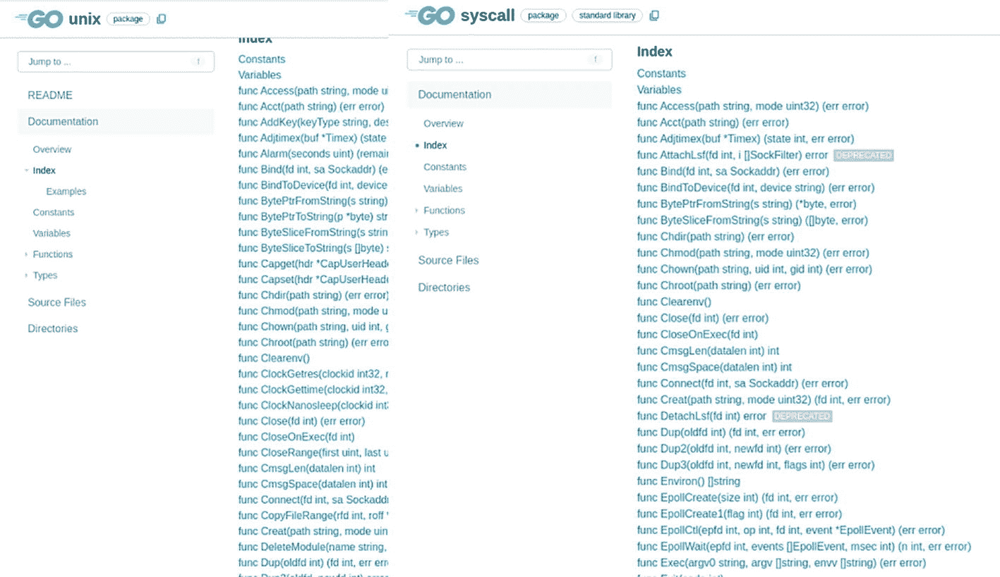
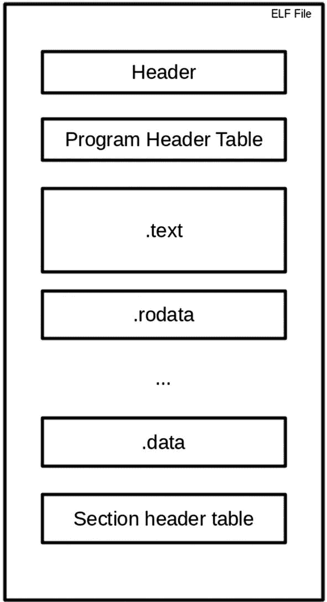
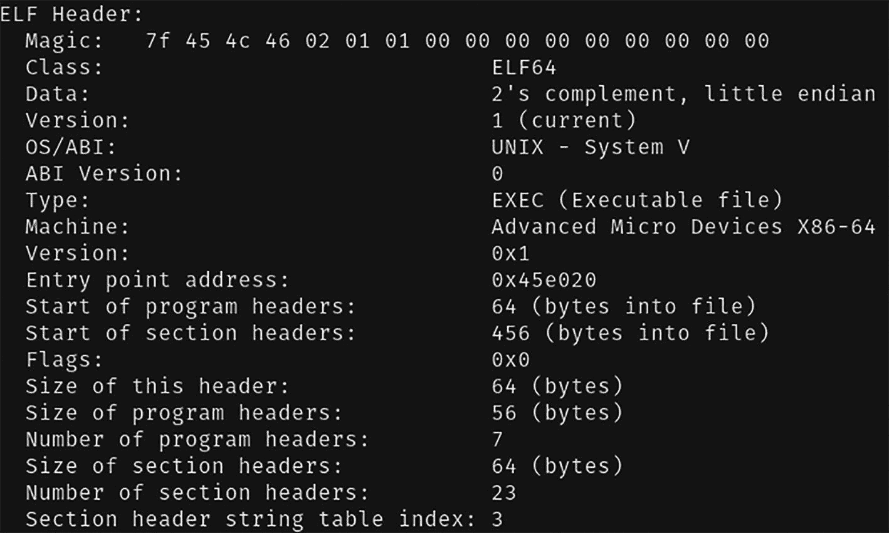
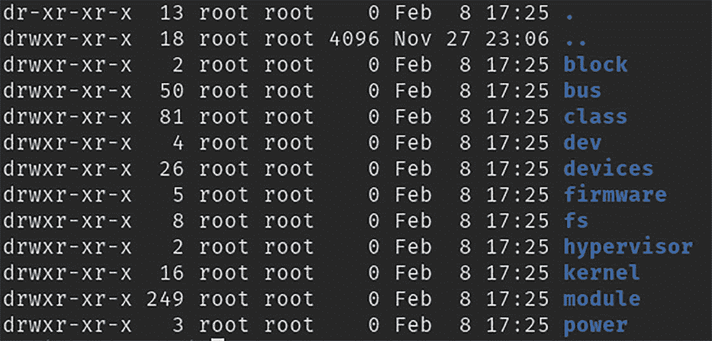

# 使用 Go 语言进行系统调用

在本章中，你将学习编写使用系统调用来执行系统级操作的应用。操作系统提供了多种方式供应用提取信息和执行操作。你将了解提取系统级信息的不同方法，并同时使用 Go 标准库和系统文件。

在本章中，你将学习以下内容：

- 如何使用 `syscall` 包
- 如何理解和读取 ELF 格式文件
- 如何使用 `/sys` 文件系统
- 如何编写一个简单的应用来读取磁盘统计信息

### 源代码

本章的源代码可在 [`https://github.com/Apress/Software-Development-Go`](https://github.com/Apress/Software-Development-Go) 仓库中获取。

### Syscall 包

`syscall` 包是 Go 语言提供的标准库，它提供了与操作系统底层进行交互的函数调用。以下是该包提供的一些功能：

- 切换目录
- 复制文件描述符
- 获取当前工作目录
- ……等等

#### syscall 应用

让我们以第 1 章中的应用为例，将其改造为使用 `syscall` 包。该应用位于 `chapter2/syscalls` 目录下。打开终端，按如下方式运行示例：

```
go run main.go
```

你将看到以下输出：

```
2022/07/17 19:20:42 Getpid :  23815
2022/07/17 19:20:42 Getpgrp :  23712
2022/07/17 19:20:42 Getpgrp :  23712
2022/07/17 19:20:42 Gettid :  23815
2022/07/17 19:20:42 /home/nanik/go/chapter2/syscal
```

示例代码使用系统调用获取自身信息，例如操作系统为其分配的进程 ID、父进程 ID 等。以下是它如何使用 `syscall` 包的示例：

```
package main
import (
"log"
s "syscall"
)
func main() {
...
log.Println("Getpid : ", s.Getpid())
...
_, err := s.Getcwd(c)
...
}
```

代码基本相同，只是将 [`golang.org/x/sys/unix`](http://golang.org/x/sys/unix) 包替换为了 `syscall` 包，而函数调用保持不变。

图 2-1 显示了 `sys/unix` 和 `syscall` 包的对比。如图所示，两个包中都提供了实现相同功能的函数。



Go Unix 和 `syscall` 软件用户界面的截图，展示了文档、概述、索引、示例、常量、变量、函数、类型、源文件和目录等选项。

图 2-1

`sys/unix` 对比 `syscall`


#### 检查磁盘空间

接下来，你将看到一个位于 `chapter2/diskspace` 目录下的示例应用程序。该应用使用 `syscall` 包来获取诸如空闲空间、总空间等硬盘信息。

打开终端，按如下方式运行示例：

```
go run main.go
```

你将看到以下输出：

```
Total Disk Space : 460.1 GB
Total Disk Used  : 322.4 GB
Total Disk Free  : 137.7 GB
```

输出以吉字节为单位，显示了驱动器的总大小、已使用的磁盘总量以及空闲的磁盘总量。以下代码片段展示了如何使用 `syscall` 包获取磁盘信息：

```
func main() {
var statfs = syscall.Statfs_t{}
var total uint64
var used uint64
var free uint64
err := syscall.Statfs("/", &statfs)
if err != nil {
fmt.Printf("[ERROR]: %s\n", err)
} else {
total = statfs.Blocks * uint64(statfs.Bsize)
free = statfs.Bfree * uint64(statfs.Bsize)
used = total - free
}
...
}
```

如上述代码片段所示，该应用程序调用 `syscall.Statfs` 函数来获取指定路径的信息。在本例中，路径是根目录。结果被填充到 `statfs` 变量中，该变量的类型是 `Statfs_t`。`Statfs_t` 结构体的声明如下所示：

```
type Statfs_t struct {
Type    int64
Bsize   int64
Blocks  uint64
Bfree   uint64
Bavail  uint64
Files   uint64
Ffree   uint64
Fsid    Fsid
Namelen int64
Frsize  int64
Flags   int64
Spare   [4]int64
}
```

#### 使用 syscall 的 Web 服务器

我们再来看另一个使用 `syscall` 包的示例，它位于 `chapter2/webserversyscall` 目录下。该示例代码是一个 Web 服务器，它使用 `syscall` 包来创建 socket 连接。

打开终端，按如下方式运行示例：

```
go run main.go
```

你将看到以下输出：

```
2022/07/17 19:27:49 Listening on  127.0.0.1 : 8888
```

该 Web 服务器现已准备好在 8888 端口接受连接。打开你的浏览器，输入 `http://localhost:8888`。你将在浏览器中收到一条响应：`Server with syscall`

以下代码片段展示了负责启动监听 8888 端口服务器的函数：

```
func startServer(host string, port int) (int, error) {
fd, err := syscall.Socket(syscall.AF_INET, syscall.SOCK_STREAM, 0)
if err != nil {
log.Fatal("error (listen) : ", err)
}
sa := &syscall.SockaddrInet4{Port: port}
addrs, err := net.LookupHost(host)
...
for _, addr := range addrs {
...
}
...
return fd, nil
}
```

该代码执行了以下流程：

*   创建一个 socket
*   将 socket 绑定到端口 8888
*   监听传入的请求

该代码使用 `syscall.Socket` 来创建 socket。一旦成功创建 socket，它将通过调用 `syscall.Bind` 将其绑定到指定的端口 8888，如下面的代码片段所示：

```
for _, addr := range addrs {
...
if err = syscall.Bind(fd, srv); err != nil {
log.Fatal("error (bind) : ", err)
}
}
```

绑定过程成功完成后，代码开始监听传入的请求，如下所示：

```
if err = syscall.Listen(fd, syscall.SOMAXCONN); err != nil {
log.Fatal("error (listening) : ", err)
} else {
log.Println("Listening on ", host, ":", port)
}
```

调用了 `syscall.Listen`，并传入 `syscall.SOMAXCONN` 作为参数。这指示操作系统，该代码希望分配最大队列来处理可能发生的待处理连接。现在，服务器已准备好接受连接。

代码的下一部分接受并处理传入的请求，如下面的代码片段所示：

```
for {
cSock, cAddr, err := syscall.Accept(fd)
if err != nil {
...
}
go func(clientSocket int, clientAddress syscall.Sockaddr) {
err := syscall.Sendmsg(clientSocket, []byte(message), []byte{}, clientAddress, 0)
...
syscall.Close(clientSocket)
}(cSock, cAddr)
}
```

该代码使用 `syscall.Accept` 开始接受传入的请求，如 `for{}` 循环中所示。对于每个被接受的请求，代码通过在一个独立的 go 例程中处理它来处理该请求。这使得服务器能够处理传入的请求而不会被阻塞。

### ELF 包

标准库提供了不同的包，可用于与操作系统的不同部分进行交互。在前面的章节中，你通过使用不同的标准库包，了解了如何在系统级别进行交互。在本节中，你将了解 `debug/elf` 包。

该包为应用程序提供了与 ELF 文件交互的接口。ELF 代表可执行与可链接格式（Executable Linkable Format），这意味着 ELF 文件可以是用于链接进程以创建可执行文件的可执行文件或目标文件。我不会深入介绍 ELF 的细节；更多信息可以在 [`https://linux.die.net/man/5/elf`](https://linux.die.net/man/5/elf) 找到。

#### 高级 ELF 格式

ELF 是一种用于可执行文件、目标代码、共享库和核心转储的通用标准文件格式；它是跨平台的。图 2-2 从高级别展示了 ELF 文件的结构。



一个 E L F 文件的框图，展示了头部、程序头部表、点文本文件、点只读数据、点数据以及节头部表。

图 2-2

ELF 文件结构

图 2-3 显示了一个在我本地机器上编译的示例应用程序的头部部分输出。



一个 E L F 头部代码的截图，展示了 class、data、version、ABI versions、type、flags、headers 的大小、section headers 的大小、section headers 的数量以及字符串表索引。

图 2-3

ELF 文件头部部分


好的，作为高级文档工程师和翻译员，我将严格按照您提供的格式和注意事项，将给定的英文文本翻译成中文。


#### 转储示例

在本节中，你将看到一个名为 `GoPlay` 的开源项目，该项目托管于 [`https://github.com/n4ss/GoPlay`](https://github.com/n4ss/GoPlay)。你也可以在 `chapter2/GoPlay` 目录中找到它。这是一个简单的应用程序，用于转储 Go ELF 可执行文件的内容。你将了解该应用程序如何使用 Go 库来读取 ELF 文件。

使用以下命令编译 `GoPlay` 应用程序，以创建可执行文件：

```
go build main.go
```

现在编译 `GoPlay` 并如下运行：

```
./goplay -action=dump -filename=./goplay
```

你指示 `GoPlay` 转储 `goplay` 可执行文件的内容，这将产生类似如下的输出：

```
Tracing program : "[path]goplay".
Action : "dump".
DynStrings:
Symbols:
go.go
runtime.text
cmpbody
countbody
memeqbody
indexbody
indexbytebody
gogo
callRet
gosave_systemstack_switch
setg_gcc
aeshashbody
debugCall32
debugCall64
....
runtime.(*cpuProfile).addNonGo
....
_cgo_init
runtime.mainPC
go.itab.syscall.Errno,error
runtime.defaultGOROOT.str
runtime.buildVersion.str
type.*
runtime.textsectionmap
....
```

让我们开始分析代码的工作原理，以及它使用了哪些系统调用来从可执行文件中获取信息。

```
func main() {
....
file, err := os.Stat(*filename)
....
f, err := os.Open(*filename)
....
switch *action {
....
case "dump": os.Exit(dump_elf(*filename))
}
} else {
goto Usage
}
....
}
```

在启动时，应用程序使用 `os.Stat` 系统调用来检查作为参数指定的可执行文件是否存在，如果存在，则使用 `os.Open` 将其打开。打开后，它将使用 `dump_elf(..)` 函数转储文件内容。以下是该函数的代码片段：

```
func dump_elf(filename string) int {
file, err := elf.Open(filename)
if err != nil {
fmt.Printf("Couldn't open file : \"%s\" as an ELF.\n")
return 2
}
dump_dynstr(file)
dump_symbols(file)
return 0
}
```

该函数使用了另一个名为 `elf.Open` 的系统调用，该调用位于 `debug/elf` 包中。这类似于 `os.Open` 函数，但具有额外的功能，即打开的文件被准备为作为 ELF 文件读取。从调用 `elf.Open` 返回后，返回的 `file` 变量将填充有关 ELF 文件内部结构的信息。

文件打开后，它会调用 `dump_symbols` 来转储文件内容。`dump_symbols` 函数转储文件中所有符号信息，这些信息通过调用 `file.Symbols()` 函数提供。该应用程序仅打印 `Name` 字段。

```
func dump_symbols(file *elf.File) {
fmt.Printf("Symbols:\n")
symbols, _ := file.Symbols()
for _, e := range symbols {
if !strings.EqualFold(e.Name, "") {
fmt.Printf("\t%s\n", e.Name)
}
}
}
```

以下是 `Symbol` 结构体的定义。正如你所看到的，它包含有用的信息。

```
type Symbol struct {
Name        string
Info, Other byte
Section     SectionIndex
Value, Size uint64
// Version and Library are present only for the dynamic symbol
// table.
Version string
Library string
}
```

另一个被调用来转储 ELF 信息的函数是 `dump_dynstr`：

```
func dump_dynstr(file *elf.File) {
fmt.Printf("DynStrings:\n")
dynstrs, _ := file.DynString(elf.DT_NEEDED)
...
dynstrs, _ = file.DynString(elf.DT_SONAME)
...
dynstrs, _ = file.DynString(elf.DT_RPATH)
...
dynstrs, _ = file.DynString(elf.DT_RUNPATH)
...
}
```

该函数用于获取 ELF 文件的特定部分，这些部分作为参数传递给 `file.DynString` 函数。例如，当调用

```
dynstrs, _ = file.DynString(elf.DT_SONAME)
```

时，代码将获取该文件的共享库名称信息。

### /sys 文件系统

在本节中，你将看到另一种读取系统级信息的方式。你将不会使用函数来读取系统信息；相反，你将使用操作系统为用户应用程序提供的系统目录。

你要读取的目录是 `/sys` 目录，这是一个包含设备驱动程序、设备信息和其他内核功能的虚拟文件系统。图 2-4 展示了 Linux 机器上 `/sys` 目录的内容。



一个系统目录的代码截图，用根值表示月份名称。列出的不同文件有 block, bus, class, dev, devices, firmware, fs, hypervisor, kernel, 和 module。

图 2-4

`/sys` 目录内部

#### 读取 AppArmor

Linux 在 `/sys` 目录中提供的一些信息与 AppArmor（Application Armor 的缩写）有关。什么是 AppArmor？它是一个内核安全模块，使系统管理员能够使用配置文件限制应用程序的能力。这使得系统管理员有权选择特定应用程序可以访问哪些资源。例如，系统管理员可以定义应用程序 A 具有网络访问权限或原始套接字访问权限，而应用程序 B 没有访问网络功能的权限。

让我们看一个从`/sys`文件系统读取 AppArmor 信息的示例应用程序，具体是检查 AppArmor 是否已启用以及是否已强制执行。以下是可以在 `chapter2/apparmor` 目录中找到的示例代码：

```
import (
"fmt"
...
)
const (
appArmorEnabledPath = "/sys/module/apparmor/parameters/enabled"
appArmorModePath    = "/sys/module/apparmor/parameters/mode"
)
func appArmorMode() (mode string) {
content, err := ioutil.ReadFile(appArmorModePath)
...
return strings.TrimSpace(string(content))
}
func appArmorEnabled() (support bool) {
content, err := ioutil.ReadFile(appArmorEnabledPath)
...
return strings.TrimSpace(string(content)) == "Y"
}
func main() {
fmt.Println("AppArmor mode : ", appArmorMode())
fmt.Println("AppArmor is enabled : ", appArmorEnabled())
}
```

由于代码正在访问系统文件系统，因此必须使用根用户身份运行它。编译代码并按如下方式运行：

```
sudo ./apparmor
```

该代码使用标准库 `ioUtil.ReadFile` 从目录中读取信息，这就像读取文件一样，因此比你在前面章节中看到的函数调用更简单。

### 总结

在本章中，你学习了如何使用系统调用与操作系统进行交互。你学习了如何使用提供许多函数调用与操作系统交互的 `syscall` 标准库，并编写了一个示例应用程序来打印磁盘空间信息。你学习了如何使用`debug/elf`标准库来读取 Go ELF 文件信息。最后，你了解了如何通过`/sys`文件系统提取你想要读取的信息，以了解操作系统是否支持 AppArmor。

