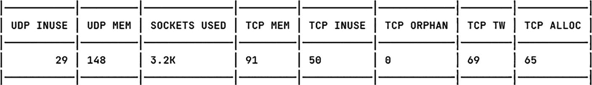
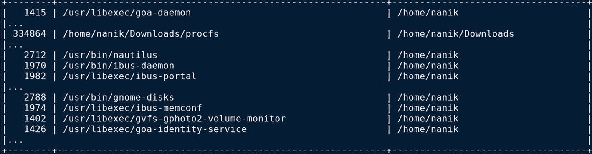
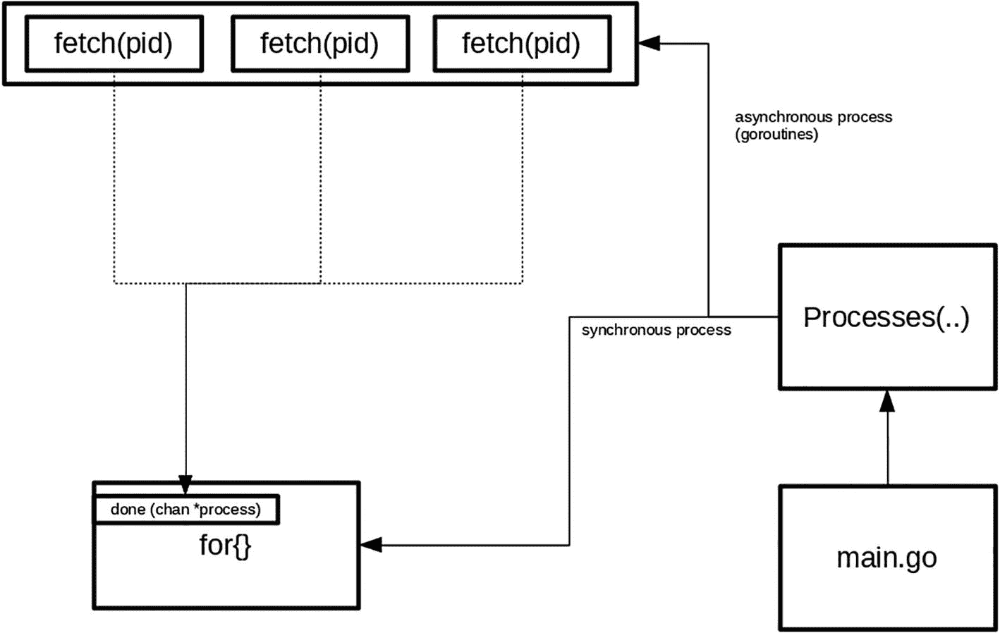

# 3. 访问 proc 文件系统

在第 2 章中，你了解了 Linux 中的 `/sys` 文件系统，并编写了一个简单的应用程序来从中提取信息。在本章中，你将了解另一个名为 `/proc` 的系统目录。`/proc` 目录也被称为 `procfs`，它包含有关当前正在运行的进程的有用信息。内核将其用作所有相关进程的信息中心。

在本章中，你将学习如何执行以下操作：

*   查看 `procfs` 中可用的不同信息
*   编写一个读取 `procfs` 的应用程序
*   使用开源库与 `procfs` 进行交互

### 源代码

本章的源代码可从[`https://github.com/Apress/Software-Development-Go`](https://github.com/Apress/Software-Development-Go) 仓库获取。


### 窥探 procfs

在本节中，我们将研究 `procfs` 并查看其内容。请在终端中使用以下命令查看 `/proc` 目录下的内容：

```
ls /proc -la
```

你将看到类似如下的输出：

```
dr-xr-xr-x 423 root            root       0 Jul 17 17:55 .
drwxr-xr-x  20 root            root       4096 May 25 13:21 ..
dr-xr-xr-x   9 root            root       0 Jul 17 17:55 1
dr-xr-xr-x   9 root            root       0 Jul 17 17:56 10
dr-xr-xr-x   9 nanik           nanik      0 Jul 17 18:02 10023
dr-xr-xr-x   9 nanik           nanik      0 Jul 17 18:02 10057
dr-xr-xr-x   9 nanik           nanik      0 Jul 17 18:02 10075
dr-xr-xr-x   9 root            root       0 Jul 17 17:56 101
...
-r--r--r--   1 root            root       0 Jul 17 17:56 execdomains
-r--r--r--   1 root            root       0 Jul 17 17:56 fb
-r--r--r--   1 root            root       0 Jul 17 17:55 filesystems
dr-xr-xr-x   5 root            root       0 Jul 17 17:56 fs
-r--r--r--   1 root            root       0 Jul 17 17:56 interrupts
-r--r--r--   1 root            root       0 Jul 17 17:56 iomem
-r--r--r--   1 root             root       0 Jul 17 17:56 ioports
dr-xr-xr-x  59 root            root       0 Jul 17 17:56 irq
-r--r--r--   1 root            root       0 Jul 17 17:56 kallsyms
-r--r--r--   1 root            root       0 Jul 17 17:56 keys
-r--r--r--   1 root            root       0 Jul 17 17:56 key-users
-r--------   1 root            root       0 Jul 17 17:56 kmsg
-r--------   1 root            root       0 Jul 17 17:56 kpagecgroup
-r--------   1 root            root       0 Jul 17 17:56 kpagecount
...
dr-xr-xr-x   5 root            root       0 Jul 17 17:56 sysvipc
lrwxrwxrwx   1 root            root       0 Jul 17 17:55 thread-self -> 17987/task/17987
-r--------   1 root            root       0 Jul 17 17:56 timer_list
dr-xr-xr-x   6 root            root       0 Jul 17 17:56 tty
-r--r--r--   1 root            root       0 Jul 17 17:55 uptime
-r--r--r--   1 root             root       0 Jul 17 17:56 version
-r--------   1 root            root       0 Jul 17 17:56 vmallocinfo
-r--r--r--   1 root            root       0 Jul 17 17:56 vmstat
-r--r--r--   1 root            root       0 Jul 17 17:56 zoneinfo
```

输出中包含大量数字命名的目录。这些目录对应系统中正在运行的应用程序的进程 ID，这些目录内部则包含有关对应进程的更多详细信息，例如用于运行进程的命令、可执行文件和库文件的内存映射等。

让我们看看我的系统上正在运行的一个进程。我选择了分配给 **Goland** IDE 的进程 ID，在本例中是 4280。表 3-1 显示了 `/proc/4280` 目录下的信息。

**表 3-1**

来自 `/proc/4280` 的信息

| 目录 | 内容 |
| --- | --- |
| `/proc/4280/cmdline` | `/bin/sh./goland.sh` |
| `/proc/4280/cgroup` | `14:misc:/``13:rdma:/``11:hugetlb:/``10:net_prio:/``9:perf_event:/``8:net_cls:/``7:freezer:/``6:devices:/``4:blkio:/``3:cpuacct:/``2:cpu:/``1:cpuset:/``0::/user.slice/user-1000.slice/user@1000.service/app.slice/app-org.gnome.Terminal.slice/vte-spawn-9c827742-8e1f-42d8-bb25-79119712b0d8.scope` |
| `/proc/4280/mountinfo` | `24 31 0:22 / /sys rw,nosuid,nodev,noexec,relatime shared:7 - sysfs sysfs rw``...``27 26 0:24 / /dev/pts rw,nosuid,noexec,relatime shared:3 - devpts devpts rw,gid=5,mode=620,ptmxmode=000``28 31 0:25 / /run rw,nosuid,nodev,noexec,relatime shared:5 - tmpfs tmpfs rw,size=1607888k,mode=755,inode64``...` |

从表中可以看出，可以提取出许多与进程 ID 4280 相关的信息。这些信息让我们能更清晰地了解应用程序、应用程序使用的资源、用户和组信息等。

#### 读取内存信息

在上一节中，你了解了 `procfs` 的概况，并查看了一些可以查看的进程信息。你通过进入 `/proc` 目录并使用 `ls` 和 `cat` 等标准工具查看文件和目录内容来提取信息。

在本节中，你将编写一个简单的应用程序，从 `procfs` 读取系统内存信息。示例代码位于 `chapter3/readingmemory` 目录下。使用以下命令运行该应用程序：

```
go run main.go
```

你将看到类似如下的输出：

```
MemTotal = 32320240 KB, MemFree = 3260144 KB, MemUsed = 29060096 KB
MemTotal = 32320240 KB, MemFree = 3146556 KB, MemUsed = 29173684 KB
MemTotal = 32320240 KB, MemFree = 3074524 KB, MemUsed = 29245716 KB
MemTotal = 32320240 KB, MemFree = 3068300 KB, MemUsed = 29251940 KB
MemTotal = 32320240 KB, MemFree = 3264940 KB, MemUsed = 29055300 KB
MemTotal = 32320240 KB, MemFree = 3269584 KB, MemUsed = 29050656 KB
MemTotal = 32320240 KB, MemFree = 3270340 KB, MemUsed = 29049900 KB
```

该应用程序持续以千字节为单位打印本地设备的内存信息（总内存、空闲内存和已用内存）。让我们查看代码以了解其工作原理。

```
func main() {
sampler := &sampler{
rate: 1 * time.Second,
}
...
for {
select {
case sampleSet := <-sampler.sample:
...
fmt.Printf("total = %v KB, free = %v KB, used = %v KB\n",
s.total, s.free, s.used)
}
}
}
```

启动时，代码初始化了 `Sampler` 结构体，然后进入循环等待 `SampleSetChan` 通道上的数据。一旦数据到达，它就将内存信息打印到控制台。

收集数据并将其发送到通道的数据采样代码如下所示。`StartSampling` 函数启动一个 Go 协程，该协程调用 `GetMemSample` 来提取内存信息，并在将数据发送到 `SampleSetChan` 通道后休眠。

```
func (s *sampler) start() *sampler {
...
go func() {
for {
var ss sample
ss.memorySample = getMemorySample()
s.sample <- ss
time.Sleep(s.rate)
}
}()
...
}
```

读取内存信息的关键可以在下面的 `getMemorySample` 函数中看到：

```
func getMemorySample() (samp memory) {
...
contents, err := ioutil.ReadFile(memInfo)
if err != nil {
return
}
reader := bufio.NewReader(bytes.NewBuffer(contents))
for {
line, _, err := reader.ReadLine()
if err == io.EOF {
break
}
...
if ok && len(fields) == 3 {
...
switch fieldName {
case "total:":
samp.total = val
case "free:":
samp.free = val
}
}
}
...
}
```

内存信息是从 `/proc/meminfo` 目录收集的。收集到的数据经过解析，仅存储感兴趣的值，即总内存、空闲内存以及计算得出的已用内存值。

这是读取 `/proc/meminfo` 目录时原始数据的样子：

```
MemTotal:       32320240 kB
MemFree:          927132 kB
MemAvailable:    5961720 kB
...
HugePages_Total:       0
HugePages_Free:        0
HugePages_Rsvd:        0
HugePages_Surp:        0
Hugepagesize:       2048 kB
Hugetlb:               0 kB
...
```


#### 窥探网络信息

在本节中，你将了解可从 `procfs` 中提取的网络信息。有一个名为 `/proc/net/sockstat` 的目录，其原始格式如下所示： 表 3-2 解释了上述原始信息中各个字段的含义。

**表 3-2.** `/proc/net` 数据分解

| 套接字 | 已用 | 所有协议套接字的总数 |
| --- | --- | --- |
| TCP | `inuse` | 正在监听的 TCP 套接字总数 |
| | `orphan` | 不属于任何进程的 TCP 套接字总数（即孤儿套接字） |
| | `tw` | 处于 TIME_WAIT 状态或等待关闭的 TCP 套接字总数 |
| | `alloc` | 已分配的 TCP 套接字总数 |
| | `mem` | 分配给 TCP 的页面总数 |
| UDP | `inuse` | 正在使用的 UDP 套接字数 |
| | `mem` | 分配给 UDP 的页面总数 |
| UDPLITE | `inuse` | 正在使用的轻量级 UDP 套接字总数 |
| RAW | `inuse` | 正在使用的*原始*协议总数 |
| FRAG | `inuse` | 正在使用的 IP 分段数 |
| | `memory` | 为分片重组分配的总内存量（以 KB 为单位） |

```
sockets: used 3229
TCP: inuse 49 orphan 0 tw 82 alloc 64 mem 90
UDP: inuse 28 mem 139
UDPLITE: inuse 0
RAW: inuse 0
FRAG: inuse 0 memory 0
```

现在你已经对各个值的含义有了很好的了解，让我们看看如何使用 Go 提取这些信息。示例代码位于 `chapter3/sockstat` 目录中。打开终端，使用以下命令运行代码：

```
go run main.go
```

图 3-1 显示了输出结果。



一个表格以列的形式解释了输出，列名包括 U D P in use、U D P Nem、sockets、used、Top in use、T C P orphan、T C P T W 和 T C P A L L O C。

**图 3-1.** `sockstat` 示例输出

让我们探索一下代码，了解它具体做了什么。应用程序启动时，它会打开 `/proc/net/sockstat` 目录。成功打开后，代码会读取并解析它，将其转换为适合在控制台显示的格式。

```
const (
...
netstat = "/proc/net/sockstat"
)
...
func main() {
fs, err := os.Open(netstat)
...
m := make(map[string]int64)
for {
line, err := readLine(reader)
if bytes.HasPrefix(line, []byte(sockets)) ||
bytes.HasPrefix(line, []byte(tcp)) ||
bytes.HasPrefix(line, []byte((udp))) {
idx := bytes.Index(line, []byte((colon)))
...
}
...
}
...
}
```

正如你所见，编写一个从 `procfs` 读取系统级信息的应用程序非常直接。为了编写读取 `procfs` 的应用程序，你预先需要了解以下信息：

-   所需信息位于哪个目录？
-   访问该信息是否需要 root 权限？
-   如何正确解析原始数据并处理数据解析问题？

### 使用 procfs 库

你现在了解了 `/proc` 目录中可用的信息类型，并且也看到了如何编写代码和解析信息。在本节中，你将了解一个开源库，该库可以访问 `/proc` 目录中的各种不同信息。该项目可以在 [`https://github.com/jandre/procfs`](https://github.com/jandre/procfs) 找到。

#### 代码示例

打开终端，切换到 `chapter3/jandreprocfs` 目录，使用以下命令运行代码：

```
go run main.go
```

你将看到类似图 3-2 的输出。



一个在深色屏幕上的代码输出截图，显示地址为 /home/Nanik。

**图 3-2.** 运行 `procfs` 示例代码的输出

以下代码片段使用了 `jandre/procfs` 库来读取信息：

```
package main
import (
"github.com/jandre/procfs"
...
)
func main() {
processes, _ := procfs.Processes(false)
table := tablewriter.NewWriter(os.Stdout)
for _, p := range processes {
table.Append([]string{strconv.Itoa(p.Pid), p.Exe, p.Cwd})
}
table.Render()
}
```

这个示例代码比你在前面章节中看到的代码更简单。它使用 `procfs.Processes(..)` 函数调用来获取所有当前进程。

#### 了解 procfs 库的内部机制

让我们更深入地研究一下这个库，看看它到底做了什么。我们将深入探讨下面的 `procfs.Processes(..)` 函数调用。库内部的 `Processes` 函数如下所示：

```
func Processes(lazy bool) (map[int]*Process, error) {
...
files, err := ioutil.ReadDir("/proc")
if err != nil {
return nil, err
}
...
fetch := func(pid int) {
proc, err := NewProcess(pid, lazy)
if err != nil {
...
done  0; {
proc := <-done
todo--
if proc != nil {
processes[proc.Pid] = proc
}
}
return processes, nil
}
```

从高层次来看，图 3-3 展示了该函数的实际工作流程。



一个流程图，其中 `main.go` 的 `Processes` 函数被划分为三个子函数，分别名为 `fetch` 和 `PID`，并通过同步和异步并行 `done` 通道连接。

**图 3-3.** `Processes(..)` 函数流程图

该函数从 `/proc` 目录读取进程信息，并通过在单独的 Go 协程中读取每个进程信息来遍历该目录，每个协程调用 `fetch(pid)` 函数。该函数提取并解析分配给它的进程 ID 的信息。一旦收集完毕，它会将信息传递到 `Processes(..)` 函数正在等待的通道中；在本例中，该通道被称为 `done` 通道。

所有繁重的打开和遍历 `/proc` 目录（包括解析结果）的工作都由库处理。应用程序只需关注它接收到的输出即可。

### 总结

在本章中，你了解了 `/proc` 文件系统，并学习了应用程序可以访问的系统信息。你查看了从 `/proc` 目录中读取与设备网络和内存相关信息的示例代码。你还了解到，在提取系统信息时，需要编写的大部分代码都涉及读取和解析信息。你还了解了一个开源库，该库可以提供读取 `/proc` 目录的功能，它执行所有繁重的工作，让你可以专注于编写更简单的代码来读取你所需的所有系统信息。

