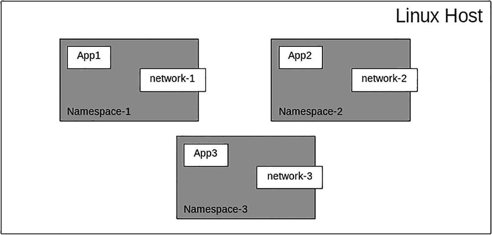
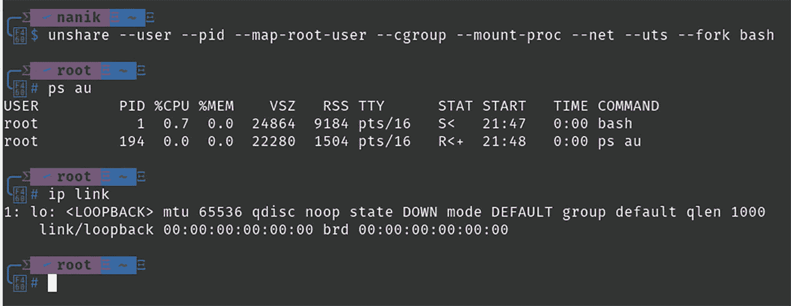
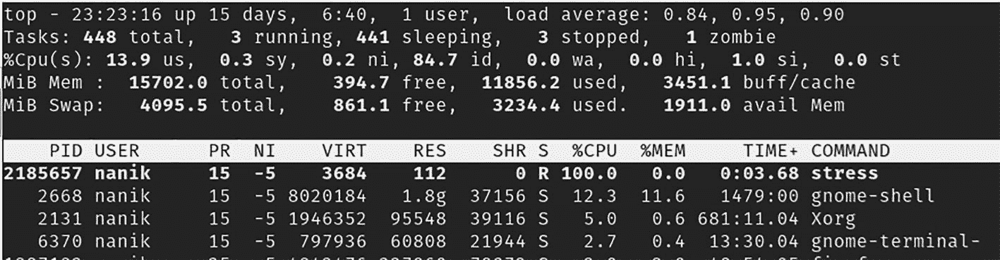
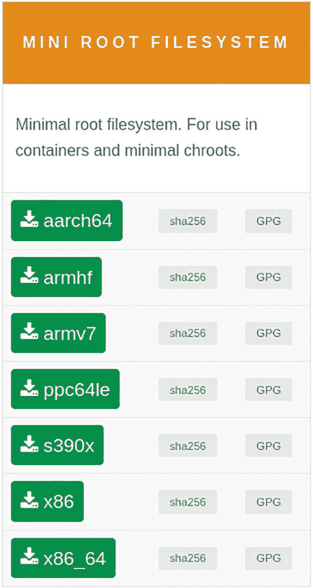
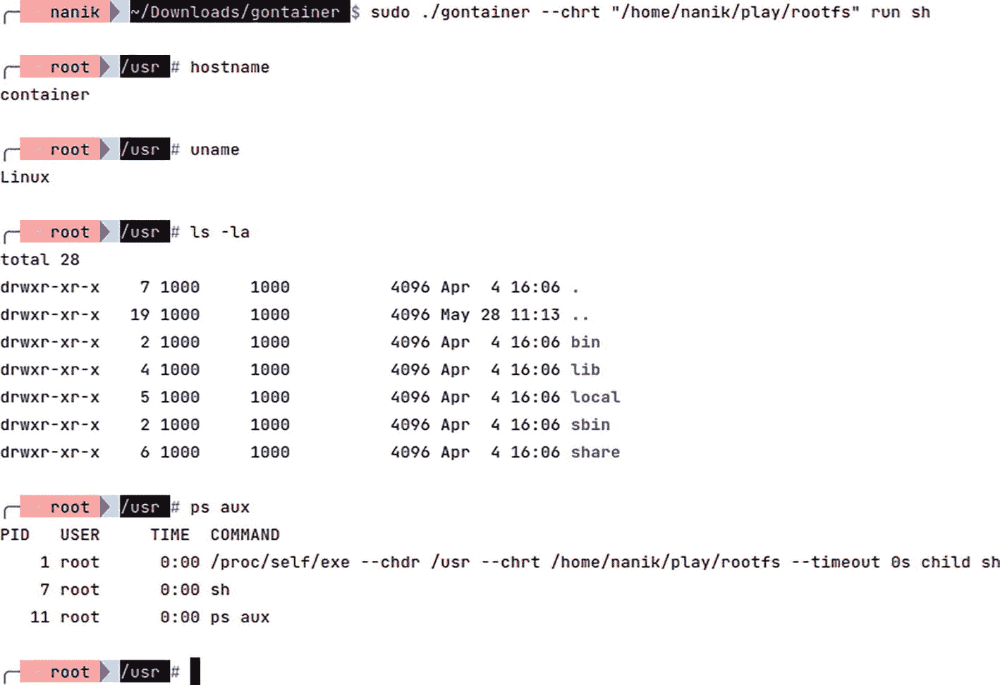

# 4. 简单容器

在本章中，你将学习使用 Go 来探索容器世界。你将了解不同的容器相关项目，以便更好地理解容器及其使用的一些技术。容器有许多不同的方面，例如安全性、故障排除和扩展容器注册表。本章将使你了解以下主题：

-   Linux 命名空间
-   理解 cgroups 和 rootfs
-   容器如何使用 rootfs

你将探索不同的开源项目，以了解容器是如何工作的，以及像 Docker 这样的工具实际上是如何工作的。


### Linux 命名空间

在本节中，你将了解命名空间，它是在本地或云环境中运行容器的关键组件。命名空间是 Linux 内核独有的特性，因此你在这里读到的所有内容都与 Linux 操作系统相关。

命名空间是 Linux 内核提供供应用程序使用的一项特性，那么它到底是什么？它用于为那些你想让它们使用自身资源运行的进程创建一个隔离环境。

图 4-1 展示了每个隔离的命名空间，它们各自运行着拥有自己网络的应用程序。运行在命名空间内的每个应用程序都无法访问其自身命名空间之外的任何内容。例如，App1 无法访问 App2 的资源。如果出于某种原因 App1 崩溃，它不会导致其他应用程序宕机，也不会导致 Linux 主机宕机。可以把命名空间想象成一个运行应用程序的岛屿；它可以提供运行应用程序所需的任何东西，而不会干扰周围的其他岛屿。



一张 Linux 命名空间的示意图，其中包含带有应用和网络编号 1 到 3 的模块。

图 4-1

Linux 命名空间

你可以使用 Linux 系统中已有的工具来创建命名空间。你将尝试使用的工具之一叫做 `unshare`。这是一个允许用户创建命名空间并在该命名空间内运行应用程序的工具。

在你运行 `unshare` 之前，我们先来看看我的本地宿主机与使用 `unshare` 运行应用程序时的对比情况。我们将比较以下内容：

*   宿主机中运行的应用程序与我们在命名空间内运行时的对比
*   宿主机中可用的网络接口与命名空间内的对比

为了列出我的本地 Linux 机器上正在运行的应用程序，我使用了 `ps` 命令。

```
ps au
```

以下是当前在我的本地机器上运行的应用程序列表的片段：

```
USER         PID %CPU %MEM    VSZ   RSS TTY      STAT START   TIME COMMAND
...
nanik       2551    0.0  0.0  231288    4  tty2     SNl+ May09  0:00 /usr/libexec/gnome-session-binary --systemd --session=pop
nanik       6418    0.0  0.0  21644   712  pts/0    S<s  May09  0:00 bash
nanik       8594    0.0  0.0  22820     8  pts/2    S<s  May09  0:00 bash
nanik       9828    0.0  0.0  22516  4300  pts/3    S<s+ May09  0:03 bash
...
nanik       295802  0.0  0.0  1716900 6408 pts/7    S<l+ May11  2:18 docker run -p 6379:6379 redis
nanik       511876  0.0  0.0  21288    24  pts/6    S<s  May13   0:00 bash
nanik       642244  0.0  0.0  21420     8  pts/8    S<s+ May14   0:00 bash
...
root        1368986 0.0  0.0  25220   108  pts/3    T<   May19   0:00 sudo gedit /etc/hosts
```

要查看本地机器上可用的网络接口，请使用 `ip` 命令。

```
ip link
```

它会显示以下接口：

```
1: lo:  mtu 65536 qdisc noqueue state UNKNOWN mode DEFAULT group default qlen 1000
link/loopback 00:00:00:00:00:00 brd 00:00:00:00:00:00
2: enp4s0:  mtu 1500 qdisc fq_codel state DOWN mode DEFAULT group default qlen 1000
link/ether 88:a4:c2:a4:85:ac brd ff:ff:ff:ff:ff:ff
3: wlp0s20f3:  mtu 1500 qdisc noqueue state UP mode DORMANT group default qlen 1000  link/ether xx:xx:xa:xx:xx:xx brd  xx:xx:xx:xx:xx:xx
...
5: docker0:  mtu 1500 qdisc noqueue state UP mode DEFAULT group default
link/ether xx:xx:xa:xx:xx:xx brd ff:ff:ff:ff:ff:ff
...
447: thebridge:  mtu 1500 qdisc noop state DOWN mode DEFAULT group default
link/ether xx:xx:xa:xx:xx:xx brd ff:ff:ff:ff:ff:ff
```

如你所见，本地宿主机中运行着许多进程，并且有许多网络接口。

运行以下命令来创建一个命名空间，并在该命名空间内将 bash 作为应用程序运行：

```
unshare --user --pid --map-root-user --cgroup --mount-proc --net --uts --fork bash
```

它将如图 4-2 所示。



输出屏幕的截图描绘了运行名为 Nanik 和 root 的 `unshare` 的两个要素。

图 4-2

运行 `unshare`

在新的命名空间中，如图 4-2 所示，它只会显示两个进程和一个网络接口（本地接口）。这表明命名空间正在隔离对宿主机的访问。

你已经了解了如何使用 `unshare` 创建命名空间，并将 `bash` 作为应用程序隔离在其自己的命名空间中运行。现在你对命名空间有了基本了解，接下来将在下一节探索另一个关键要素——cgroups。


### cgroups

`cgroups` 是控制组（control groups）的缩写，是 Linux 内核提供的一项功能。我们在上一节中讨论的命名空间与`cgroups`相辅相成。让我们来看看`cgroups`包含什么。`cgroups`赋予用户限制特定进程所能分配的资源（如 CPU 和内存网络）的能力。宿主机的资源是有限的，如果你希望在独立的命名空间中运行多个进程，就需要在不同的命名空间之间分配资源。

`cgroups`位于`/sys/fs/cgroup`目录下。我们要在主`cgroup`目录下创建一个子目录，并查看其内部内容。运行以下命令，使用 root 权限创建一个目录：

```
sudo mkdir /sys/fs/cgroup/example
```

使用以下命令列出新创建目录内的内容：

```
sudo ls /sys/fs/cgroup/example -la
```

你将看到类似如下的输出：

```
-r--r--r--  1 root root 0 May 24 23:06 cgroup.controllers
-r--r--r--  1 root root 0 May 24 23:06 cgroup.events
-rw-r--r--  1 root root 0 May 24 23:06 cgroup.freeze
...
-rw-r--r--  1 root root 0 May 24 23:06 cgroup.type
-rw-r--r--  1 root root 0 May 24 23:06 cpu.idle
-rw-r--r--  1 root root 0 May 24 23:06 cpu.max
-rw-r--r--  1 root root 0 May 24 23:06 cpu.max.burst
-rw-r--r--  1 root root 0 May 24 23:06 cpu.pressure
-rw-r--r--  1 root root 0 May 24 23:06 cpuset.cpus
-r--r--r--  1 root root 0 May 24 23:06 cpuset.cpus.effective
-rw-r--r--  1 root root 0 May 24 23:06 cpuset.cpus.partition
-rw-r--r--  1 root root 0 May 24 23:06 cpuset.mems
-r--r--r--  1 root root 0 May 24 23:06 cpuset.mems.effective
...
-rw-r--r--  1 root root 0 May 24 23:06 io.max
...
-rw-r--r--  1 root root 0 May 24 23:06 memory.low
-rw-r--r--  1 root root 0 May 24 23:06 memory.max
-rw-r--r--  1 root root 0 May 24 23:06 memory.min
-r--r--r--  1 root root 0 May 24 23:06 memory.numa_stat
-rw-r--r--  1 root root 0 May 24 23:06 memory.oom.group
-rw-r--r--  1 root root 0 May 24 23:06 memory.pressure
...
```

你看到的这些目录实际上是配置项，你可以为特定进程设置与想要分配的资源相关的值。让我们看一个示例。

你将运行一个名为 `stress` 的工具（[`https://linux.die.net/man/1/stress`](https://linux.die.net/man/1/stress)），需要将其安装到本地机器上。如果你使用的是 Ubuntu，可以使用以下命令：

```
sudo apt install stress
```

打开一个终端，并按如下方式运行 `stress` 工具。该应用将使用一个核心运行 60 秒，并消耗 100% 的 CPU 使用率。

```
stress --cpu 1 --timeout 60
```

打开另一个终端并运行以下命令，以获取 `stress` 应用的进程 ID：

```
top
```

在我的本地机器上，进程 ID 是 2185657，如图 4-3 所示。



这张输出屏幕截图展示了一个表格，列名分别为 P I D、User、P R、N I、V I R T、RES、S H R、S、CPU 百分比、内存百分比、时间和命令。

图 4-3

`top` 命令的输出

现在，将进程 ID 的值插入到 `cgroups` 目录中，操作如下：

```
sudo echo "200000 1000000" > /sys/fs/cgroup/example/cpu.max
sudo echo "2185657" > /sys/fs/cgroup/example/cgroup.procs
```

该命令为 `example` cgroups 内的所有进程分配了 20% 的 CPU 使用率。在本示例中，`stress` 应用的进程 ID 被标记为 `example` cgroups 的一部分。如果你打开了运行着 `top` 命令的终端，你会看到 `stress` 应用现在只消耗 20% 的 CPU，而不是 100%。

这个示例表明，通过将 `cgroups` 应用于进程，你可以根据分配意图来限制进程消耗的资源量。

在本节中，你了解了 `cgroups`（控制组），并学习了如何为进程分配资源。在下一节中，你将学习 `rootfs`，这是必须理解的概念，因为它是理解容器的关键组成部分。

### rootfs

在本节中，你将探索 `rootfs` 以及它在容器中的应用方式。首先，我们来理解 `rootfs` 到底是什么。`rootfs` 代表根文件系统（root filesystem），简单来说，它是包含启动操作系统所需的所有基本必要文件的文件系统。没有正确的 `rootfs`，操作系统将无法启动，任何应用也无法运行。

`rootfs` 是必需的，因为它使得操作系统能够挂载其他文件系统，这包括配置、必要的启动进程和数据，以及位于其他磁盘分区中的文件系统。以下展示了 `rootfs` 中最基本的目录：

```
/bin
/sbin
/etc
/root
/lib
/lib/modules
/dev
/tmp
/boot
/mnt
/proc
/usr
/var,
/home
```

在容器内部运行应用需要 `rootfs`，这使得应用能够像在正常系统中一样运行。让我们看看一个最小化的 `rootfs` 实际上是什么样子。前往 [`www.alpinelinux.org/downloads/`](http://www.alpinelinux.org/downloads/) 下载 Alpine 的 `rootfs`。Alpine 是一个非常著名的 Linux 发行版，由于镜像体积小，它在创建容器时被广泛使用。

从“Mini Root Filesystem”部分下载 rootfs 文件，如图 4-4 所示。如果你使用的是 x86 处理器，请下载 x86_64 文件。



这张迷你根文件系统软件的用户界面截图包含 ID 名称：aarch64、armhf、armv7、ppc64le、s390x、x86 和 x88_underscore_64。

图 4-4

迷你根文件系统

下载后，将文件复制到一个单独的目录中。在我的例子中，文件名为 `alpine-minirootfs-3.15.4-x86_64.tar.gz`，并已复制到 `/home/nanik/play/rootfs` 目录下。使用以下命令解压它：

```
gunzip ./alpine-minirootfs-3.15.4-x86_64.tar.gz
tar -xvf ./alpine-minirootfs-3.15.4-x86_64.tar
```

以下是解压后的文件输出：

```
drwxr-xr-x 19 nanik nanik    4096 Apr  5 02:06 ./
drwxrwxr-x  3 nanik nanik    4096 May 28 18:46 ../
drwxr-xr-x  2 nanik nanik    4096 Apr  5 02:06 bin/
drwxr-xr-x  2 nanik nanik    4096 Apr  5 02:06 dev/
drwxr-xr-x 16 nanik nanik    4096 Apr  5 02:06 etc/
drwxr-xr-x  2 nanik nanik    4096 Apr  5 02:06 home/
drwxr-xr-x  7 nanik nanik    4096 Apr  5 02:06 lib/
drwxr-xr-x  5 nanik nanik    4096 Apr  5 02:06 media/
drwxr-xr-x  2 nanik nanik    4096 Apr  5 02:06 mnt/
drwxr-xr-x  2 nanik nanik    4096 Apr  5 02:06 opt/
dr-xr-xr-x  2 nanik nanik    4096 Apr  5 02:06 proc/
drwx------  2 nanik nanik    4096 Apr  5 02:06 root/
drwxr-xr-x  2 nanik nanik    4096 Apr  5 02:06 run/
drwxr-xr-x  2 nanik nanik    4096 Apr  5 02:06 sbin/
drwxr-xr-x  2 nanik nanik    4096 Apr  5 02:06 srv/
drwxr-xr-x  2 nanik nanik    4096 Apr  5 02:06 sys/
drwxrwxr-x  2 nanik nanik    4096 Apr  5 02:06 tmp/
drwxr-xr-x  7 nanik nanik    4096 Apr  5 02:06 usr/
drwxr-xr-x 12 nanik nanik    4096 Apr  5 02:06 var/
```

以下输出展示了不同目录包含的内容：

```
.
├── bin
│   ├── arch -> /bin/busybox
...
├── dev
├── etc
...
│   ├── modprobe.d
...
├── home
...
├── sbin
│   ├── acpid -> /bin/busybox
│   ├── adjtimex -> /bin/busybox
...
├── srv
├── sys
├── tmp
├── usr
│   ├── bin
│   │   ├── [ -> /bin/busybox
│   │   ├── [[ -> /bin/busybox
...
│   │   └── yes -> /bin/busybox
│   ├── lib
│   │   ├── engines-1.1
...
│   │   └── modules-load.d
│   ├── local
│   │   ├── bin
...
│       ├── man
│       ├── misc
│       └── udhcpc
│           └── default.script
├── var
│   ├── cache
│   ├── empty
│   ├── lib
```

现在你对 `rootfs` 是什么以及它包含什么有了很好的理解。在下一节中，你将进一步探索如何将所有内容整合到 `rootfs` 中，并像在容器中正常运行一样运行一个应用。


### Gontainer 项目

到目前为止，你已经了解了如何创建在隔离环境中运行应用程序所需的不同组件：命名空间、cgroups 以及配置 rootfs。在本节中，你将看到一个示例应用，它将把所有部分整合在一起，并在其自身的命名空间中运行一个应用程序。换句话说，你将把应用程序作为容器来运行。你可以从 [`https://github.com/nanikjava/gontainer`](https://github.com/nanikjava/gontainer) 检出代码。

请确保按照“rootFS”一节中的说明下载并解压 rootfs。将 rootfs 解压到你的本地机器后，切换到 `gotainer` 目录，并使用以下命令编译项目：

```
go build
```

编译完成后，你将得到一个名为 `gotainer` 的可执行文件。使用以下命令运行该应用程序：

```
sudo ./gontainer --chrt "[rootfs 目录]" run sh
```

该命令将运行 `sh` 命令，它是容器内 Alpine 发行版的原生 bash 命令。将 `[rootfs 目录]` 替换为包含已解压 Alpine rootfs 的目录。例如，在我的机器上，它是 `/home/nanik/play/rootfs`。我本地机器的完整命令是：

```
sudo ./gontainer --chrt "/home/nanik/play/rootfs" run sh
```

你将看到提示符 `/usr #`，并且可以执行任何正常的 Linux 命令。图 4-5 展示了在 gotainer 内部执行的一些命令。



**图 4-5.** Gotainer 运行中

让我们来看看代码，了解整个工作原理。项目中只有一个名为 `gontainer.go` 的文件。如你之前所见，运行应用的方式是通过提供参数 `run sh`，该参数由下面展示的 `main()` 函数处理：

```
func main() {
// 概览清理任务
wg.Add(1)
...
// 实际程序
switch args[0] {
case "run":
go run()
...
}
```

负责运行通过参数 `run` 指定的应用程序的 `run()` 函数如下所示：

```
func run() {
defer cleanup()
infof("run as [%d] : running %v", os.Getpid(), args[1:])
lst := append(append(flagInputs, "child"), args[1:]...)
infof("running proc/self/exe %v", lst)
if timeout > 0 {
ctx, cancel := context.WithTimeout(context.Background(), timeout)
defer cancel()
runcmd = exec.CommandContext(ctx, "/proc/self/exe", lst...)
} else {
runcmd = exec.Command("/proc/self/exe", lst...)
}
runcmd.Stdin = os.Stdin
runcmd.Stdout = os.Stdout
runcmd.Stderr = os.Stderr
runcmd.SysProcAttr = &syscall.SysProcAttr{
Cloneflags:   syscall.CLONE_NEWUTS | syscall.CLONE_NEWPID | syscall.CLONE_NEWNS,
Unshareflags: syscall.CLONE_NEWNS,
}
runcmd.Run()
}
```

你可以看到代码中使用了 `/proc/self/exe`，这是什么？位于 [`https://man7.org/linux/man-pages/man5/proc.5.xhtml`](https://man7.org/linux/man-pages/man5/proc.5.xhtml) 的 Linux 手册说明：

```
/proc/self
当进程访问这个魔法符号链接时，它会解析为进程自身的 /proc/[pid] 目录。
/proc/[pid]/exe
在 Linux 2.2 及更高版本中，此文件是一个符号链接，包含已执行命令的实际路径名。此符号链接可以正常解除引用；尝试打开它将打开可执行文件。
```

解释清楚地表明，使用 `/proc/self/exe` 意味着你正在派生当前正在运行的应用，因此这意味着 `run()` 函数将自己作为一个独立的进程运行，并通过参数传递 `lst`。

该函数使用 `exec.Command` 来运行 `/proc/self/exe`，并将变量作为 `lst` 传递，其中包含以下命令：

```
--chdr /usr --chrt /home/nanik/play/roofs/ --timeout 0s child sh
```

让我们探究一下传递给应用的参数指示应用做什么。`init()` 函数声明了它可以作为参数接收的以下标志：

```
func init() {
pflag.StringVar(&chroot, "chrt", "", "要 chroot 到的目录。应包含一个 Linux 文件系统。推荐使用 Alpine。如果未设置，则默认使用 GONTAINER_FS 环境变量")
pflag.StringVar(&chdir, "chdr", "/usr", "运行容器时执行的初始 chdir")
pflag.DurationVar(&timeout, "timeout", 0, "程序结束前的超时时间。如果为 0，则永不结束")
...
infof("flaginputs: %v", flagInputs)
}
```

表 4-1 解释了通过 `lst` 传递的参数的映射。

**表 4-1.** 参数映射

| 格式 | 解释 |
| --- | --- |
| `--chdr /usr` | 运行容器时执行的初始 `chdir` |
| `--chrt /home/nanik/play/roofs/` | 要 `chroot` 到的目录 |
| `--timeout 0s` | 程序结束前的超时时间。如果为 0，则永不结束。 |
| `sh` | rootfs 启动并运行后要运行的应用 |

表中唯一未显示的参数是 `child` 参数，它没有被处理。`child` 参数将由 `main()` 函数通过在一个 goroutine 中执行 `child()` 函数来处理，如下面的代码片段所示：

```
func main() {
// 概览清理任务
...
// 实际程序
switch args[0] {
...
case "child":
go child()
...
}
```

`child()` 函数承担了在类似容器的环境中运行新进程的所有繁重工作。下面展示了 `child()` 函数的代码：

```
func child() {
defer cleanup()
infof("child as [%d]: chrt: %s,  chdir:%s", os.Getpid(), chroot, chdir)
infof("running %v", args[1:])
must(syscall.Sethostname([]byte("container")))
must(syscall.Chroot(chroot), "error in 'chroot ", chroot+"'")
syscall.Mkdir(chdir, 0600)
// 初始 chdir 是必要的，以便在调用 proc mount 时目录指针位于 chroot 目录中
must(syscall.Chdir("/"), "error in 'chdir /'")
must(syscall.Mount("proc", "proc", "proc", 0, ""), "error in proc mount")
must(syscall.Chdir(chdir), "error in 'chdir ", chdir+"'")
if timeout > 0 {
ctx, cancel := context.WithTimeout(context.Background(), timeout+time.Millisecond*50)
defer cancel()
cntcmd = exec.CommandContext(ctx, args[1], args[2:]...)
} else {
cntcmd = exec.Command(args[1], args[2:]...)
}
cntcmd.Stdin = os.Stdin
...
must(cntcmd.Run(), fmt.Sprintf("run %v return error", args[1:]))
syscall.Unmount("/proc", 0)
}
```

表 4-2 解释了代码每个部分的作用。忽略 `must` 函数调用，因为它是一个内部函数调用，用于检查每个系统调用的返回值。

**表 4-2.** 代码解释

| 代码 | 描述 |
| --- | --- |
| `must(syscall.Sethostname([]byte("container")))` | 设置容器的主机名 |
| `must(syscall.Chdir("/"), "error in 'chdir /'")` | 使用指定的 rootfs 执行 `chroot`（在此示例中，它是 `/home/nanik/play/rootfs`） |
| `must(syscall.Chdir(chdir), "error in 'chdir ", chdir+"'")` | 将目录更改为指定位置 |
| `must(cntcmd.Run(), fmt.Sprintf("run %v return error", args[1:]))` | 运行指定的参数（在此示例中，它是 `sh`） |

下面的代码片段向操作系统指定了为所执行的应用使用标准输入/输出和错误：

```
...
cntcmd.Stdin = os.Stdin
cntcmd.Stdout = os.Stdout
cntcmd.Stderr = os.Stderr
...
```

一旦 `cntcmd.Run()` 完成并出现提示符，就意味着你正在容器内部运行，与主机操作系统隔离。

### 总结

在本章中，你探索了在容器内运行应用程序所需的不同部分：命名空间、cgroups 和 rootfs。你尝试了不同的可用 Linux 工具来创建命名空间，并为特定命名空间配置了资源。

你还探索了 rootfs，它是运行操作系统从而允许应用程序运行的关键组件。最后，你查看了一个示例项目，该项目展示了如何通过使用 Alpine rootfs，在 Go 内部将不同的组件组合在一起。


