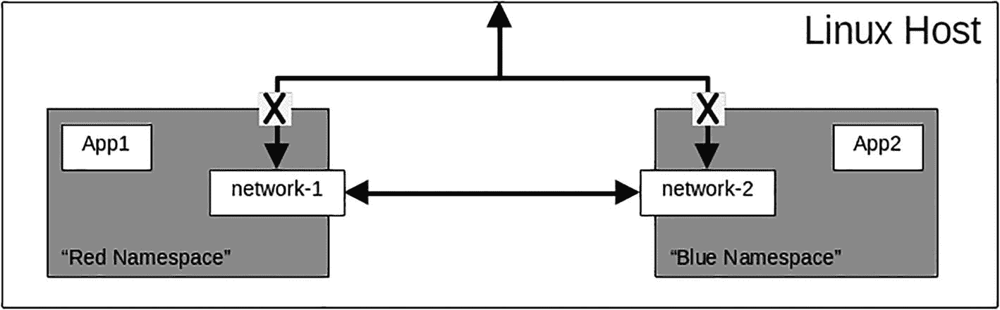
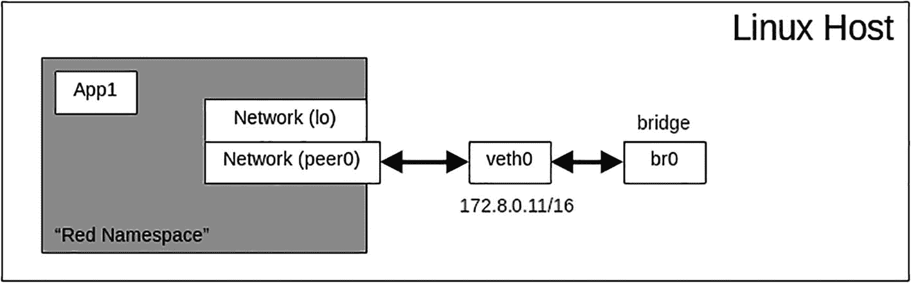
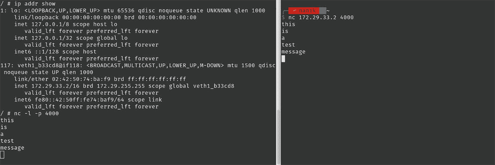

# 5. 带网络功能的容器

在第 4 章中，你学习了用于容器的 Linux 内核的不同特性。你还探索了命名空间以及它们如何帮助应用程序与其他进程隔离。在本章中，你将专注于网络命名空间，理解其工作原理以及如何配置它。

网络命名空间允许运行在各自命名空间中的应用程序拥有一个网络接口，使运行中的进程能够向宿主机或互联网发送和接收数据。在本章中，你将学习如何执行以下操作：

- 创建你自己的网络命名空间
- 与宿主机通信
- 在 Go 中使用网络空间

### 源代码

本章的源代码可从 `https://github.com/Apress/Software-Development-Go` 仓库获取。

### 网络命名空间

在第 4 章中，你已经了解了命名空间，它用于为应用程序创建虚拟隔离，这是在容器内运行应用程序的关键要素之一。网络命名空间是应用程序需要的另一种隔离特性，因为它允许应用程序与宿主机或互联网通信。

为什么网络命名空间如此重要？

查看图 5-1，可以看到在一个宿主机上运行着两个不同的应用程序，它们位于不同的命名空间中，并且每个命名空间都有自己独立的网络命名空间。



Linux 宿主机框架包含两个命名空间，分别命名为红色和蓝色。两个宿主机都包含一个应用程序和网络。

*图 5-1* 网络命名空间

应用程序之间可以相互通信，但应用程序不允许与宿主机通信，反之亦然。这不仅使应用程序更加安全，而且由于无需担心宿主机外部的服务，也使得应用程序更易于维护。

使用网络命名空间需要正确配置一些组件，应用程序才能使用它。图 5-2 展示了所需的不同组件。



Linux 宿主机框架显示了一个标记为红色的命名空间，包含网络`l0`和网络`peer0`，它们可逆地链接到`veth0`，再进一步连接到`br0`。

*图 5-2* 虚拟网络

让我们逐一了解这些组件：

| 网络 (`lo`) | 在你的计算机中，你通常使用 `localhost` 来访问本地运行的服务器。网络命名空间内部的配置也是相同的，它被称为 `lo`。 |
| --- | --- |
| 网络 (`peer0`) | 这被称为对端名称，它被配置用于需要与命名空间外部流量通信的命名空间。如图 5-2 所示，它与 `veth0` 通信。 |
| `veth0` | 这被称为虚拟以太网，它配置在宿主机上。虚拟以太网（在此例中为 `veth0`）负责宿主机与命名空间之间的通信。 |
| `br0` | 这是一个虚拟交换机。它也被称为网桥。任何连接到该网桥的网络都可以相互通信。在此例中，只有一个虚拟以太网 (`veth0`)，但如果存在另一个虚拟以太网，它们也可以相互通信。 |

现在你已经对网络命名空间中需要配置的不同组件有了深入了解，下一节你将探索使用 Linux 工具来操作网络命名空间。

### 使用 ip 工具进行设置

在本节中，你将学习如何设置两个不同的网络命名空间，并为每个命名空间分配一个独立的 IP 地址。脚本将使用标准的 Linux 工具`ip`。如果你的机器上未安装该工具，请使用以下命令进行安装：

```
sudo apt-get install -y iproute
sudo apt-get install -y iproute2
```

该脚本将设置网络命名空间，允许它们相互访问，但不能与任何外部服务通信。脚本位于`chapter5/ns`目录下。切换到该目录并执行以下命令（确保以 root 身份运行）：

```
sudo ./script.sh
```

你将得到类似如下的输出：

```
...
64: virt0:  mtu 1500 qdisc pfifo_fast state DOWN mode DEFAULT group default qlen 1000
...
66: virt1:  mtu 1500 qdisc pfifo_fast state UNKNOWN mode DEFAULT group default qlen 1000
...
PING 10.0.0.1 (10.0.0.1) 56(84) bytes of data.
64 bytes from 10.0.0.1: icmp_seq=1 ttl=64 time=0.069 ms
64 bytes from 10.0.0.1: icmp_seq=2 ttl=64 time=0.052 ms
...
--- 10.0.0.1 ping statistics ---
5 packets transmitted, 5 received, 0% packet loss, time 3999ms
rtt min/avg/max/mdev = 0.044/0.053/0.069/0.009 ms
PING 10.0.0.1 (10.0.0.1) 56(84) bytes of data.
64 bytes from 10.0.0.1: icmp_seq=1 ttl=64 time=0.060 ms
64 bytes from 10.0.0.1: icmp_seq=2 ttl=64 time=0.044 ms
...
--- 10.0.0.1 ping statistics ---
5 packets transmitted, 5 received, 0% packet loss, time 3999ms
rtt min/avg/max/mdev = 0.044/0.053/0.060/0.006 ms
PING 10.0.0.10 (10.0.0.10) 56(84) bytes of data.
64 bytes from 10.0.0.10: icmp_seq=1 ttl=64 time=0.031 ms
64 bytes from 10.0.0.10: icmp_seq=2 ttl=64 time=0.035 ms
...
--- 10.0.0.10 ping statistics ---
5 packets transmitted, 5 received, 0% packet loss, time 3999ms
rtt min/avg/max/mdev = 0.031/0.037/0.047/0.005 ms
PING 10.0.0.10 (10.0.0.10) 56(84) bytes of data.
64 bytes from 10.0.0.10: icmp_seq=1 ttl=64 time=0.070 ms
64 bytes from 10.0.0.10: icmp_seq=2 ttl=64 time=0.070 ms
...
--- 10.0.0.10 ping statistics ---
5 packets transmitted, 5 received, 0% packet loss, time 3999ms
rtt min/avg/max/mdev = 0.043/0.058/0.070/0.013 ms
PING 10.0.0.11 (10.0.0.11) 56(84) bytes of data.
64 bytes from 10.0.0.11: icmp_seq=1 ttl=64 time=0.070 ms
64 bytes from 10.0.0.11: icmp_seq=2 ttl=64 time=0.042 ms
...
--- 10.0.0.11 ping statistics ---
5 packets transmitted, 5 received, 0% packet loss, time 3999ms
rtt min/avg/max/mdev = 0.042/0.057/0.070/0.010 ms
PING 10.0.0.11 (10.0.0.11) 56(84) bytes of data.
64 bytes from 10.0.0.11: icmp_seq=1 ttl=64 time=0.032 ms
...
```

该脚本创建了两个不同的命名空间，分别命名为`ns1`和`ns2`，并为它们都分配了虚拟网络，正如上一节所解释的那样。虚拟网络分配了 IP 地址`10.0.0.10`和`10.0.0.11`，并且这两个网络通过一个被分配了 IP 地址`10.0.0.1`的网桥相互连接。

让我们逐行分析这个脚本，以理解其功能。以下代码片段创建了两个标记为`ns1`和`ns2`的网络命名空间：

```
ip netns add ns1
ip netns add ns2
```

命名空间设置完成后，它将在命名空间内部设置一个本地网络接口。

```
ip netns exec ns1 ip link set lo up
ip netns exec ns1 ip link
ip netns exec ns2 ip link set lo up
ip netns exec ns2 ip link
```

现在，你需要创建一个网络网桥，并将`10.0.0.1`分配为其 IP 地址。

```
ip link add br0 type bridge
ip link set br0 up
#### 设置网桥 IP
ip addr add 10.0.0.1/8 dev br0
```

网桥设置完成后，脚本会将虚拟网络链接到网络命名空间，并将它们也链接到网桥上。这将通过网桥将所有不同的虚拟网络连接在一起。脚本将为虚拟网络分配不同的 IP 地址。


```bash
#### 设置虚拟以太网并将其链接到命名空间
ip link add v0 type veth peer name virt0
ip link set v0 master br0
ip link set v0 up
ip link set virt0 netns ns1
#### 启动虚拟以太网
ip netns exec ns1 ip link set virt0 up
#### 打印网络链接信息
ip netns exec ns1 ip link
#### 设置虚拟以太网并将其链接到命名空间
ip link add v1 type veth peer name virt1
ip link set v1 master br0
ip link set v1 up
ip link set virt1 netns ns2
#### 启动虚拟以太网
ip netns exec ns2 ip link set virt1 up
#### 打印网络链接信息
ip netns exec ns2 ip link
#### 为不同的虚拟接口设置 IP 地址
ip netns exec ns1 ip addr add 10.0.0.10/8 dev virt0
ip netns exec ns2 ip addr add 10.0.0.11/8 dev virt1
```

脚本最后要做的是在网桥之间路由流量。这将允许流量在 `ns1` 和 `ns2` 命名空间之间流动。

```bash
#### 在 iptables 中注册网桥以允许转发
iptables -I FORWARD -i br0 -o br0 -j ACCEPT
```

脚本成功运行后，你可以使用以下命令查看路由信息：

```bash
iptables  -v --list FORWARD  --line-number
```

你会看到如下所示的输出。输出显示网桥 `br0` 已注册到路由表中，以允许流量通过。

```
Chain FORWARD (policy DROP 53 packets, 4452 bytes)
num      pkts bytes target                  prot opt in     out        source               destination
1        4   336 ACCEPT                     all  --  br0    br0        anywhere             anywhere
2        53  4452 DOCKER-USER               all  --  any    any        anywhere             anywhere
3        53  4452 DOCKER-ISOLATION-STAGE-1  all  --  any    any        anywhere             anywhere
4        0     0 ACCEPT                     all  --  any     docker0  anywhere   anywhere             ctstate RELATED, ESTABLISHED
5        0     0 DOCKER                     all  --  any    docker0    anywhere             anywhere
6        0     0 ACCEPT                     all  --  docker0 !docker0   anywhere             anywhere
7        0     0 ACCEPT                     all  --  docker0 docker0    anywhere             anywhere
```

执行脚本后，你可以使用以下命令移除 `br0` 的路由信息。将值 1 替换为运行上述命令打印路由信息时获得的链编号。

```bash
iptables  -v --delete FORWARD  1
```

你刚刚学习了如何使用 Linux 工具设置两个网络命名空间，并允许它们之间的流量流动。在下一节中，你将看到如何在 Go 程序中设置网络命名空间，这与 Docker 等工具所做的类似。

### 带有网络的容器

在本节中，你将了解一个提供类似 Docker 功能的小型项目。该项目将类似于我们在第 4 章中讨论的工具，但这个工具会创建网络命名空间，以使容器具有网络能力。该项目可以从 [`https://github.com/nanikjava/container-networking`](https://github.com/nanikjava/container-networking) 检出。

检出项目并按如下方式编译：

```bash
go build -o cnetwork
```

编译完成后，执行以下命令将其作为 Alpine 容器运行：

```bash
sudo ./cnetwork run alpine /bin/sh
```

你会看到类似如下的输出：

```
2022/06/05 12:59:11 Cmd args: [./cnetwork run alpine /bin/sh]
2022/06/05 12:59:11 New container ID: 20747aa00a4d
2022/06/05 12:59:11 Downloading metadata for alpine:latest, please wait...
2022/06/05 12:59:13 imageHash: e66264b98777
2022/06/05 12:59:13 Checking if image exists under another name...
2022/06/05 12:59:13 Image doesn't exist. Downloading...
2022/06/05 12:59:16 Successfully downloaded alpine
2022/06/05 12:59:16 Uncompressing layer to: /var/lib/gocker/images/e66264b98777/4a973e6cf97f/fs
2022/06/05 12:59:16 Image to overlay mount: e66264b98777
2022/06/05 12:59:16 Cmd args: [/proc/self/exe setup-netns 20747aa00a4d]
2022/06/05 12:59:16 Cmd args: [/proc/self/exe setup-veth 20747aa00a4d]
2022/06/05 12:59:16 Cmd args: [/proc/self/exe child-mode --img=e66264b98777 20747aa00a4d /bin/sh]
/ #
```

你会看到一个提示符 `(/#)`，用于在容器内输入命令。尝试使用 `ifconfig` 命令，它会打印出已配置的网络接口。

```
/ # ifconfig
```

在我的本地机器上，输出如下所示：

```
lo        Link encap:Local Loopback
inet addr:127.0.0.1  Mask:255.0.0.0
inet6 addr: ::1/128 Scope:Host
UP LOOPBACK RUNNING  MTU:65536  Metric:1
RX packets:0 errors:0 dropped:0 overruns:0 frame:0
TX packets:0 errors:0 dropped:0 overruns:0 carrier:0
collisions:0 txqueuelen:1000
RX bytes:0 (0.0 B)  TX bytes:0 (0.0 B)
veth1_7ea0e6 Link encap:Ethernet  HWaddr 02:42:4C:66:FD:FE
inet addr:172.29.69.160  Bcast:172.29.255.255  Mask:255.255.0.0
inet6 addr: fe11::11:4c11:fe11:fdfe/64 Scope:Link
UP BROADCAST RUNNING MULTICAST  MTU:1500  Metric:1
RX packets:19 errors:0 dropped:0 overruns:0 frame:0
TX packets:6 errors:0 dropped:0 overruns:0 carrier:0
collisions:0 txqueuelen:1000
RX bytes:2872 (2.8 KiB)  TX bytes:516 (516.0 B)
```

如你所见，虚拟以太网已配置了 IP 地址 172.29.69.160。在主机上运行 `ifconfig` 时，主机上配置的网桥如下所示：

```
...
gocker0: flags=4163  mtu 1500
inet 172.29.0.1  netmask 255.255.0.0  broadcast 172.29.255.255
inet6 fe80::5851:6bff:fe0e:1768  prefixlen 64  scopeid 0x20
ether ce:cc:2c:e2:9e:97  txqueuelen 1000  (Ethernet)
RX packets 61  bytes 4156 (4.1 KB)
RX errors 0  dropped 0  overruns 0  frame 0
TX packets 110  bytes 15864 (15.8 KB)
TX errors 0  dropped 0 overruns 0  carrier 0  collisions 0
...
veth0_7ea0e6: flags=4163  mtu 1500
inet6 fe80::e8a3:faff:fed2:2ee9  prefixlen 64  scopeid 0x20
ether ea:a3:fa:d2:2e:e9  txqueuelen 1000  (Ethernet)
RX packets 11  bytes 866 (866.0 B)
RX errors 0  dropped 0  overruns 0  frame 0
TX packets 46  bytes 7050 (7.0 KB)
TX errors 0  dropped 0 overruns 0  carrier 0  collisions 0
...
```

`gocker0` 网桥配置了 IP 地址 172.29.0.1，你可以从容器中 ping 通它。

让我们测试容器与主机之间的网络通信。打开终端并运行以下命令：

```bash
sudo ./cnetwork run alpine /bin/sh
```

容器启动并运行后，使用以下命令获取容器的 IP 地址：

```bash
ip addr show
```

获取到容器的 IP 地址后，在容器中运行以下命令：

```bash
nc -l -p 4000
```


容器现已准备好在端口 `4000` 上接受连接。请从主机打开另一个终端窗口，并运行以下命令：

```
nc 4000
```

在终端窗口中输入任何内容，容器将输出您输入的内容。您将看到类似图 5-3 所示的结果。



截图显示了一个包含回环和 IP 地址的程序。程序的输出为 `nanik`，紧接着是一个 IP 地址和一段文本“this is a test message”。

**图 5-3** 容器与主机之间的通信

让我们查看一下代码，了解应用程序如何在 Go 中实现所有这些功能。应用程序执行一个两步执行过程：第一步是设置网桥和虚拟网络，第二步是设置网络命名空间，配置虚拟网络的不同参数，并在命名空间内执行容器。

我们来看一下创建网桥和虚拟网络的第一步，如下所示：

```
func setupGockerBridge() error {
linkAttrs := netlink.NewLinkAttrs()
linkAttrs.Name = "gocker0"
gockerBridge := &netlink.Bridge{LinkAttrs: linkAttrs}
if err := netlink.LinkAdd(gockerBridge); err != nil {
return err
}
addr, _ := netlink.ParseAddr("172.29.0.1/16")
netlink.AddrAdd(gockerBridge, addr)
netlink.LinkSetUp(gockerBridge)
return nil
}
```

该函数通过创建一个新的 `netlink.Bridge` 来设置新网桥，其中包含网络网桥信息，网桥被命名为 `gocker0`，并分配了 IP 地址 `172.29.0.1`。

网桥成功建立后，它将设置虚拟以太网，该虚拟以太网在 `initContainer(..)` 函数内被调用，如下所示：

```
func initContainer(mem int, swap int, pids int, cpus float64, src string, args []string) {
...
if err := setupVirtualEthOnHost(containerID); err != nil {
log.Fatalf("Unable to setup Veth0 on host: %v", err)
}
...
}
```

`setupVirtualEthOnHost(..)` 函数如下所示：

```
func setupVirtualEthOnHost(containerID string) error {
veth0 := "veth0_" + containerID[:6]
veth1 := "veth1_" + containerID[:6]
linkAttrs := netlink.NewLinkAttrs()
linkAttrs.Name = veth0
veth0Struct := &netlink.Veth{
LinkAttrs:        linkAttrs,
PeerName:         veth1,
PeerHardwareAddr: createMACAddress(),
}
if err := netlink.LinkAdd(veth0Struct); err != nil {
return err
}
netlink.LinkSetUp(veth0Struct)
gockerBridge, _ := netlink.LinkByName("gocker0")
netlink.LinkSetMaster(veth0Struct, gockerBridge)
return nil
}
```

该函数创建两个标记为 `veth0_xxx` 和 `veth1_xxx` 的虚拟网络。`xxx` 代表生成的容器 ID，因此在示例中它看起来像 `veth0_7ea0e6`。新的虚拟网络将通过调用 `createMACAddress()` 获得一个生成的 MAC 地址，并将链接到新创建的 `gocker0` 网桥。

现在，网桥和虚拟网络已经设置好，应用程序将设置网络命名空间，配置容器的虚拟网络，并运行容器，这些操作由 `initContainer(..)` 执行：

```
func initContainer(mem int, swap int, pids int, cpus float64, src string, args []string) {
...
prepareAndExecuteContainer(mem, swap, pids, cpus, containerID, imageShaHex, args)
...
}
```

`prepareAndExecuteContainer(..)` 函数处理若干事务，如下面的代码片段所示：

```
func prepareAndExecuteContainer(mem int, swap int, pids int, cpus float64,
containerID string, imageShaHex string, cmdArgs []string) {
cmd := &exec.Cmd{
Path:   "/proc/self/exe",
Args:   []string{"/proc/self/exe", "setup-netns", containerID},
...
}
cmd.Run()
cmd = &exec.Cmd{
Path:   "/proc/self/exe",
Args:   []string{"/proc/self/exe", "setup-veth", containerID},
...
}
cmd.Run()
...
opts = append(opts, "--img="+imageShaHex)
args := append([]string{containerID}, cmdArgs...)
args = append(opts, args...)
args = append([]string{"child-mode"}, args...)
cmd = exec.Command("/proc/self/exe", args...)
...
cmd.SysProcAttr = &unix.SysProcAttr{
Cloneflags: unix.CLONE_NEWPID |
unix.CLONE_NEWNS |
unix.CLONE_NEWUTS |
unix.CLONE_NEWIPC,
}
doOrDie(cmd.Run())
}
```

该函数再次自身运行（通过 `/proc/self/exe` 方式），并传递参数 `setup-ns` 和 `setup-veth`。这两个函数分别执行网络命名空间设置（`setupNewNetworkNamespace`）和虚拟以太网设置（`setupContainerNetworkInterfaceStep1` 和 `setupContainerNetworkInterfaceStep2`）。

```
func setupNewNetworkNamespace(containerID string) {
_ = createDirsIfDontExist([]string{getGockerNetNsPath()})
...
if err := unix.Setns(fd, unix.CLONE_NEWNET); err != nil {
log.Fatalf("Setns system call failed: %v\n", err)
}
}
func setupContainerNetworkInterfaceStep1(containerID string) {
...
veth1 := "veth1_" + containerID[:6]
veth1Link, err := netlink.LinkByName(veth1)
...
if err := netlink.LinkSetNsFd(veth1Link, fd); err != nil {
log.Fatalf("Unable to set network namespace for veth1: %v\n", err)
}
}
func setupContainerNetworkInterfaceStep2(containerID string) {
...
if err := unix.Setns(fd, unix.CLONE_NEWNET); err != nil {
log.Fatalf("Setns system call failed: %v\n", err)
}
veth1 := "veth1_" + containerID[:6]
veth1Link, err := netlink.LinkByName(veth1)
if err != nil {
log.Fatalf("Unable to fetch veth1: %v\n", err)
}
...
route := netlink.Route{
Scope:     netlink.SCOPE_UNIVERSE,
LinkIndex: veth1Link.Attrs().Index,
Gw:        net.ParseIP("172.29.0.1"),
Dst:       nil,
}
...
}
```

所有网络设置完成后，它会再次自身运行，并传入参数 `child-mode`，由以下代码片段执行：

```
...
case "child-mode":
fs := flag.FlagSet{}
fs.ParseErrorsWhitelist.UnknownFlags = true
...
execContainerCommand(*mem, *swap, *pids, *cpus, fs.Args()[0], *image, fs.Args()[1:])
...
```

所有设置完成后，最后一步是通过调用 `execContainerCommand(..)` 来设置容器，以允许用户在容器内执行命令。

在本节中，您了解了为容器设置虚拟网络所涉及的不同步骤。本节中使用的示例应用程序执行了下载镜像、设置根文件系统、设置网络命名空间以及配置容器所需的所有不同虚拟网络等操作。

### 总结

在本章中，您了解了容器内部使用的虚拟网络。您逐步了解了使用名为 `ip` 的 Linux 工具手动配置网络命名空间以及虚拟网络的步骤。您还了解了如何配置 `iptables` 以允许不同网络命名空间之间进行通信。

在理解了如何使用虚拟网络配置网络命名空间后，您查看了一个 Go 示例，了解如何在容器中配置虚拟网络。您学习了执行配置容器虚拟网络所需的不同任务的不同函数。

