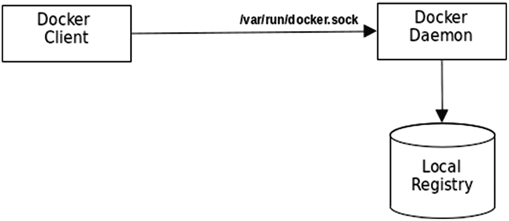
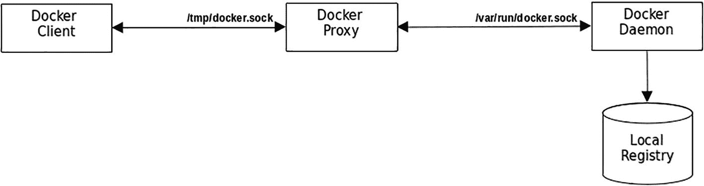

# 6. Docker 安全

本章将介绍 seccomp 配置文件，这是 Docker 提供的安全功能之一，它使用了 Linux 内核内置的 seccomp 功能。独立的 Go 应用程序也可以在不使用 Docker 的情况下实现 seccomp 安全，您将学习如何使用 seccomp 库来实现这一点。

您还将了解 Docker 如何通过编写一个监听 Docker 通信的代理来使用套接字进行通信。了解这一点非常有用，因为它能让您更好地了解如何在基础架构中保护 Docker 的安全。

### 源代码

本章的源代码可从以下仓库获取：[`https://github.com/Apress/Software-Development-Go`](https://github.com/Apress/Software-Development-Go)


### seccomp 配置文件

`seccomp` 是安全计算模式（secure computing mode）的简称。它是 Linux 操作系统内部提供的一项功能。作为操作系统，Linux 原生支持此功能，意味着可以直接使用它。它到底是什么？它是一种安全特性，允许应用程序仅进行特定的系统调用，并且可以针对每个应用程序进行配置。作为开发者，您可以指定想要实施何种限制，例如，应用程序 A 只能进行读写文本文件的系统调用，但不能进行任何其他系统调用；而应用程序 B 只能进行网络系统调用，但不能读写文件。您将了解如何在应用程序中实现这一点，以及如何在将应用程序作为 Docker 容器运行时设置限制。

这种限制为您的基础设施提供了更高的安全性，因为您不希望应用程序在没有任何限制的情况下运行在基础设施上。当与 Docker 容器一起使用时，`seccomp` 为主机操作系统提供了更多的安全层，因为它可以通过配置，允许当前运行在容器内的应用程序访问特定的系统调用。

为了使用 `seccomp`，首先必须检查您的操作系统是否支持它。打开终端并运行以下命令：

```
grep CONFIG_SECCOMP= /boot/config-$(uname -r)
```

如果您的操作系统支持 `seccomp`，您将得到如下输出：

```
CONFIG_SECCOMP=y
```

如果您的 Linux 操作系统不支持 `seccomp`，您可以使用操作系统的包管理器来安装它。例如，在 Ubuntu 中，您可以使用以下命令安装它：

```
sudo apt install seccomp
```

在下一节中，您将看到如何在示例应用程序中使用 `seccomp` 的示例。

#### libseccomp

为了在应用程序内部使用 `seccomp` 安全功能，您必须安装该库。这里，这个库叫做 `libseccomp`（[`https://github.com/seccomp/libseccomp`](https://github.com/seccomp/libseccomp)）。并非所有发行版都默认安装了 `libseccomp`，因此您需要使用操作系统的包管理器来安装它。在 Ubuntu 中，您可以使用以下命令安装它：

```
sudo apt  install libseccomp-dev
```

现在，默认的 `seccomp` 库已安装完毕，您可以开始在应用程序中使用它。按如下方式运行位于 `chapter6/seccomp/libseccomp` 目录中的示例应用程序：

```
go run main.go
```

您将得到如下输出：

```
2022/07/05 22:11:34 Starting app
2022/07/05 22:11:34 Directory /tmp/NjAZmQrt created successfully
2022/07/05 22:11:34 Trying to get current working directory
2022/07/05 22:11:34 Current working directory is: 
```

下面展示了通过创建临时目录并使用系统调用读取当前目录的代码：

```
package main
...
func main() {
...
dirPath := "/tmp/" + randomString(8)
if err := syscall.Mkdir(dirPath, 0600); err != nil {
...
}
...
wd, err := syscall.Getwd()
if err != nil {
...
}
...
}
```

这段代码有什么特别之处？代码本身在做的事情并无特别之处。特别之处在于您在示例代码内部配置 `seccomp` 的方式。代码使用了一个名为 `libseccomp-golang` 的 Go 库，该库可以在 [`github.com/seccomp/libseccomp-golang`](http://github.com/seccomp/libseccomp-golang) 找到。

`libseccomp-golang` 库是原生的 `seccomp` 库（即您在上一节中安装的库）的一个 Go 绑定库。您可以将该库视为 C 语言 `seccomp` 库的一个包装器，以便在 Go 程序内部使用。该库在应用程序内部用于进行自我配置，指定允许它进行哪些系统调用。

那么，为什么要这样做呢？想象一下，您在一个多团队环境中工作，并且希望确保所编写的代码只能执行内部配置好的系统调用。这将消除引入那些进行配置中不允许的系统调用的代码的可能性。如果引入这样的代码，将会导致错误并使应用程序崩溃。

查看示例代码片段，您可以看到以下允许的系统调用，在 `whitelist` 变量中声明为一个字符串数组：

```
var (
whitelist   = []string{"getcwd", "exit_group", "rt_sigreturn", "mkdirat", "write"})
```

列出的系统调用是应用程序所需的所有系统调用。稍后您将看到，如果代码进行了一个未配置的系统调用会发生什么。函数 `configureSeccomp()` 负责将定义好的系统调用注册到库中。

```
func configureSeccomp() error {
...
filter, err = seccomp.NewFilter(seccomp.ActErrno)
...
for _, name := range whitelist {
syscallID, err := seccomp.GetSyscallFromName(name)
if err != nil {
return err
}
err = filter.AddRule(syscallID, seccomp.ActAllow)
if err != nil {
return err
}
}
...
}
```

该函数首先通过调用 `seccomp.NewFilter(..)` 创建一个新的过滤器，并将动作（`seccomp.ActErrno`）作为参数传入。该参数指定了当应用程序调用不允许的系统调用时要采取的动作。在这个例子中，您希望它返回一个错误编号。

创建新过滤器后，它将遍历白名单中的系统调用，首先通过调用 `seccomp.GetSyscallFromName(..)` 获取正确的系统调用 ID，然后使用 `filter.AddRule(..)` 函数将该 ID 注册到库中。参数 `seccomp.ActAllow` 指定该 ID 是应用程序允许进行的系统调用。`configureSeccomp()` 函数完成后，应用程序就被配置为只允许白名单中的调用。

应用程序进行的系统调用很简单。使用以下代码片段创建一个目录：

```
func main() {
...
if err := syscall.Mkdir(dirPath, 0600); err != nil {
return
}
...
}
```

使用以下系统调用获取当前工作目录：

```
func main() {
...
wd, err := syscall.Getwd()
if err != nil {
...
}
...
}
```

现在出现的问题是，如果应用程序进行了一个未配置的系统调用，会发生什么？让我们稍微修改一下代码。将 `whitelist` 变量修改如下：

```
var (
whitelist = []string{
"exit_group", "rt_sigreturn", "mkdirat", "write",
}
...
)
```

这从列表中移除了 `getcwd`。现在运行该应用程序。您将得到如下错误：

```
...
2022/07/05 22:53:06 Failed getting current working directory: invalid argument -
```

代码无法进行获取当前工作目录的系统调用，并返回一个错误。您可以看到，从列表中移除注册的系统调用会阻止应用程序正常运行。在下一节中，您将了解如何为使用 Docker 作为容器运行的应用程序使用 `seccomp`。


#### Docker seccomp

Docker 为容器中运行的应用程序提供了 seccomp 安全机制，无需在代码内部添加安全措施。这通过在运行容器时指定 seccomp 文件来实现。打开 `chapter6/dockerseccomp/seccomp.json` 文件，查看其内容：

```
{
"defaultAction": "SCMP_ACT_ERRNO",
"architectures": [
"SCMP_ARCH_X86_64"
],
"syscalls": [
{
"names": [
"arch_prctl",
...
"getcwd"
],
"action": "SCMP_ACT_ALLOW"
}
]
}
```

`syscalls` 部分列出了容器内允许的各种系统调用。让我们使用 `chapter6/dockerseccomp` 目录下的 `Dockerfile` 构建一个 Docker 容器。打开终端，将目录切换到 `chapter6/dockerseccomp`，然后运行以下命令：

```
docker build -t docker-seccomp:latest -f Dockerfile .
```

这会构建该目录下的示例 `main.go` 文件，并将其打包到容器中。执行 `docker images` 会从本地仓库显示以下镜像：

```
REPOSITORY                 TAG           IMAGE ID      CREATED          SIZE
...
docker-seccomp             latest        4cebeb0b7fce   47 hours ago     21.3MB
...
gcr.io/distroless/base-debian10   latest a5880de4abab   52 years ago    19.2MB
```

现在，你有了一个名为 `docker-seccomp` 的容器。按如下方式运行该容器以进行测试：

```
docker run  docker-seccomp:latest
```

你将获得与在终端中直接运行示例时相同的输出：

```
2022/07/07 12:04:12 Starting app
2022/07/07 12:04:12 Directory /tmp/QPRNrGAA created successfully
2022/07/07 12:04:12 Trying to get current working directory
2022/07/07 12:04:12 Current working directory is: /
```

容器按预期运行，这很好。现在，让我们使用 seccomp 为容器中的应用程序添加一些限制。要运行带有 seccomp 限制的容器，请使用以下命令。在此示例中，seccomp 文件是 `chapter6/dockerseccomp/seccomp.json`。打开终端并运行以下命令：

```
docker run --security-opt="no-new-privileges" --security-opt seccomp=/dockerseccomp/seccomp.json docker-seccomp:latest
```

这会执行容器，并且你将获得与之前相同的输出。即使在添加了 seccomp 之后，你仍然能够毫无问题地运行容器，原因是 `seccomp.json` 包含了容器所需的所有已许可的系统调用。

让我们从 `seccomp.json` 中移除一些系统调用。你还有另一个名为 `problem_seccomp.json` 的文件，该文件从允许的系统调用列表中移除了 `mkdirat` 和 `getcwd`。在终端中运行以下命令：

```
docker run --security-opt="no-new-privileges" --security-opt seccomp=/dockerseccomp/problem_seccomp.json docker-seccomp:latest
```

容器将无法成功运行，并且你将获得以下输出：

```
2022/07/07 12:12:18 Starting app
2022/07/07 12:12:18 Failed creating directory: operation not permitted
```

你已经成功运行了容器，并为应用程序应用了受限的系统调用。

在下一节中，你将了解如何构建一个 Docker 代理来监听 Docker 通信，从而理解 Docker 在接收命令并做出响应时的实际工作原理。

### Docker 代理

Docker 包含两个主要组件：客户端工具（通常你在终端运行时称之为 `docker`）和服务器（它以服务器/守护进程的形式运行并监听传入命令）。Docker 客户端使用套接字（socket）与服务器通信，套接字是一个在不同进程之间传递数据的端点。Docker 使用一种称为非网络套接字（non-networked socket）的通信方式，它主要用于本地机器通信，称为 Unix 域套接字（或 IPC 套接字）。

Docker 默认使用 Unix 套接字 `/var/run/docker.sock` 进行客户端与服务器之间的通信，如图 6-1 所示。



一个 Docker 通信的流程图，包括 Docker 客户端、Docker 守护进程和本地镜像仓库。

**图 6-1** Docker 通信 `/var/run/docker.sock`

在本节中，你将查看如何拦截 Docker 客户端与服务器通信的示例代码。你将逐步分析代码，以理解其实际功能及执行方式。代码位于 `chapter6/docker-proxy` 目录中。在你的终端上按如下方式运行：

```
go run main.go
```

成功运行时，你将获得以下输出：

```
2022/07/09 11:59:04 Listening on /tmp/docker.sock for Docker commands
```

代理现已准备就绪，正在监听 `/tmp/docker.sock`，等待要使用 Docker 的消息，以便消息经过代理，并设置 `DOCKER_HOST` 环境变量。`DOCKER_HOST` 变量由 Docker 命令行工具使用，用于指定发送命令的 Unix 套接字。

例如，要使用代理打印出正在运行的容器列表，请在终端上使用以下命令：

```
DOCKER_HOST=unix:///tmp/docker.sock docker ps
```

在运行代理的终端上，你将看到 JSON 格式的 Docker 输出。在我的本地机器上，输出如下所示：

```
2022/07/09 16:33:02 [Request] : HEAD /_ping HTTP/1.1
Host: docker
User-Agent: Docker-Client/20.10.9 (linux)
2022/07/09 16:33:02 [Request] : GET /v1.41/containers/json HTTP/1.1
Host: docker
User-Agent: Docker-Client/20.10.9 (linux)
2022/07/09 16:33:02 [Response] : [
{
"Id": "56f68f7cafb7e5f8b1b1f6263ac6b26f4d47b7a06536842212d577ddf1910a11",
"Names": [
"/redis"
],
"Image": "redis",
"ImageID": "sha256:bba24acba395b778d9522a1adf5f0d6bba3e6094b2d298e71ab08828b880a01b",
"Command": "docker-entrypoint.sh redis-server",
"Created": 1657331859,
...
},
{
"Id": "2ab2942c2591dcd8eba883a1d57f1183a1d99bafb60be8f17edf8794e9295e53",
"Names": [
"/postgres"
],
"Image": "postgres",
"ImageID": "sha256:1ee973e26c6564a04b427993f47091cd3ae4d5156fbd46d331b17a8e7ab45d39",
"Command": "docker-entrypoint.sh postgres",
"Created": 1657331853,
...
}
]
```

代理将 Docker 客户端的请求和 Docker 服务器的响应打印到控制台。Docker 命令行仍然正常输出，结果如下所示：

```
CONTAINER ID   IMAGE      COMMAND                  CREATED       STATUS       PORTS                                       NAMES
56f68f7cafb7   redis      "docker-entrypoint.s..."   4 hours ago   Up 4 hours   0.0.0.0:6379->6379/tcp, :::6379->6379/tcp   redis
2ab2942c2591   postgres   "docker-entrypoint.s..."   4 hours ago   Up 4 hours   0.0.0.0:5432->5432/tcp, :::5432->5432/tcp   postgres
```

如你所见，Docker 客户端收到的响应是 JSON 格式，并包含大量信息。现在，让我们深入代码，了解内部的工作原理。

图 6-2 展示了从客户端到代理再到 Docker 服务器的命令流程。Docker 客户端的通信在到达 Docker 守护进程之前会先经过代理。



一个 Docker 通信的流程图，包括 Docker 客户端、Docker 代理、Docker 守护进程和本地镜像仓库。

**图 6-2**


#### 使用代理进行 Docker 通信

以下代码片段展示了监听 `/tmp/docker.sock` 套接字的代码：

```
func main() {
in := flag.String("in", proxySocket, "代理 Docker 套接字")
...
sock, err := net.Listen("unix", *in)
if err != nil {
log.Fatalf("错误 : %v", err)
}
...
}
```

代码使用了 `net.Listen(..)` 函数，并传入了参数 `unix`。`unix` 参数向函数指明所需的套接字是一个非网络类型的 Unix 套接字，这在 `net` 库内部会进行特殊处理。

一旦套接字成功初始化，代码将创建一个套接字处理器，负责处理传入的请求和传出的响应。这一操作由 `handler` 结构体的 `ServeHTTP` 函数执行。以下代码片段展示了处理器的声明，并通过调用 `http.Serve` 通知库该处理器将由套接字 `sock` 使用。创建处理器时，传入 `dsocket` 以赋值给 `socket` 变量。

```
func main() {
...
dhandler := &handler{dsocket}
...
err = http.Serve(sock, dhandler)
...
}
```

当套接字准备好接受连接后，`ServeHTTP` 函数负责处理所有通信的请求和响应。该函数首先创建一条与 Docker 套接字独立的连接。

```
func (h *handler) ServeHTTP(response http.ResponseWriter, request *http.Request) {
conn, err := net.DialUnix(unix, nil, &net.UnixAddr{h.socket, unix})
if err != nil {
writeError(response, errCode, err)
return
}
...
}
```

`net.DialUnix(..)` 函数使用 `h.socket` 的值作为套接字名称来创建一个 Unix 套接字；在本示例代码中，该值为 `var/run/docker.sock`。此函数返回的连接对象将被代码用作桥梁，以在请求和响应之间进行双向传递。

代码会将传入的请求*转发*到 Docker 套接字，如下所示：

```
func (h *handler) ServeHTTP(response http.ResponseWriter, request *http.Request) {
...
err = request.Write(conn)
...
}
```

`request.Write(..)` 函数将传入的请求转发到 `conn` 变量指向的原始 Docker 套接字。请求发送后，代码需要获取一个 `http/Response` 结构体，以便读取 Docker 套接字返回的响应。以下代码片段展示了这一过程：

```
func (h *handler) ServeHTTP(response http.ResponseWriter, request *http.Request) {
...
resp, err := http.ReadResponse(bufio.NewReader(conn), request)
if err != nil {
writeError(response, errCode, err)
return
}
...
}
```

现在，`resp` 变量包含了来自原始 Docker 套接字的响应。它会提取相关信息，并将其转发回存储在 `response` 对象中的调用方响应，如下列代码片段所示：

```
func (h *handler) ServeHTTP(response http.ResponseWriter, request *http.Request) {
...
response.WriteHeader(resp.StatusCode)
reader := bufio.NewReader(resp.Body)
for {
line, _, err := reader.ReadLine()
...
// 将响应写回调用方
response.Write(line)
...
}
}
```

在下一节中，你将了解如何配置你的 Dockerfile 以最大限度地减少容器的攻击面。

### 容器攻击面

为云环境构建应用程序需要将应用程序构建为容器镜像，这需要创建 Dockerfile。本节将展示如何在使用 Go 应用程序创建 Docker 镜像时将风险降至最低。

构建 Docker 镜像时要记住的主要事项是应用程序最终将在其上运行的镜像。经验法则是使用最精简的基础镜像来托管你的应用程序。在 Docker 生态中，最精简的基础镜像是 *scratch*。有关 scratch 镜像的更多详细信息，请访问 [`https://hub.docker.com/_/scratch`](https://hub.docker.com/_/scratch)。

使用 scratch 镜像的示例 Dockerfile 可以在 `chapter6/dockersecurity` 目录中找到。打开终端并切换到 `chapter6/dockersecurity` 目录，然后按如下方式构建镜像：

```
docker build -t sample:latest  .
```

构建成功后，你的终端将显示如下输出：

```
Step 1/14 : FROM golang:1.18 as build
---> 65b2f1fa535f
Step 2/14 : COPY ./main.go .
---> 5164c620eaff
...
Step 10/14 : FROM scratch
--->
...
Successfully built 1a977f4b1cec
Successfully tagged sample:latest
```

使用以下命令运行新创建的 Docker 镜像：

```
docker run sample:latest
```

你将看到类似以下的输出：

```
2022/07/09 10:06:42 Hello, from inside Docker image
2022/07/09 10:06:42 Build using Go version  go1.18.2
```

示例 Dockerfile 使用了 scratch 镜像，如下所示：

```
FROM golang:1.18 as build
...
RUN go build -trimpath -v -a -o sample -ldflags="-w -s"
RUN useradd -u 12345 normaluser
FROM scratch
...
ENTRYPOINT ["/sample"]
```

通过使用 scratch 镜像，你最大限度地减少了容器的攻击面，因为此镜像不像其他 Docker 镜像（例如：Ubuntu、Debian 等）那样安装了大量应用程序。

### 本章小结

在本章中，你学习了 Docker 安全方面的知识。首先介绍的是 seccomp 及其重要性。你通过示例代码学习了如何使用 seccomp 来限制 Go 应用程序。你还学习了如何设置 libseccomp，这使得你可以限制应用程序可以进行的系统调用。

接下来，你学习了如何在你的应用程序中使用 libseccomp-golang 库，以及如何在代码内部应用系统调用限制。在代码内部应用限制是好的做法，但一旦代码在生产环境中运行，不断修改这些代码会变得困难，因此你学习了在运行 Docker 容器时使用 seccomp 配置文件。

最后，你学习了 Docker 代理，以拦截并理解 Docker 客户端和服务器之间的通信。你还深入研究了代理代码，了解代理如何转发请求和响应。最后，你简要了解了通过编写 Dockerfile 使用 scratch 基础镜像来减少容器攻击面的最佳方法。

