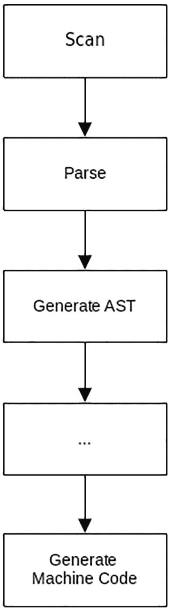
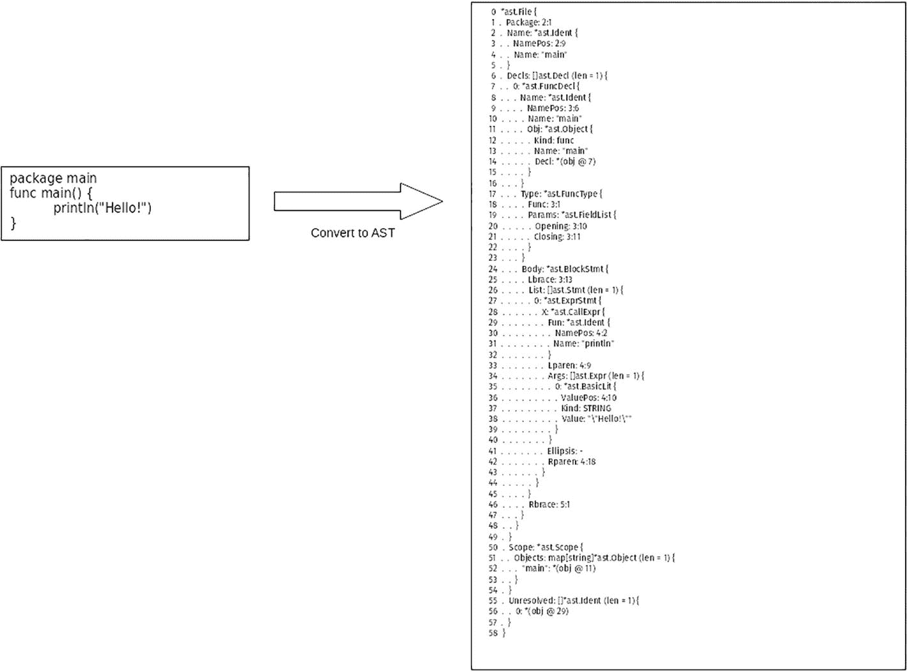
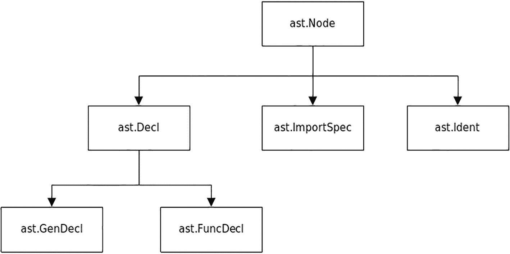
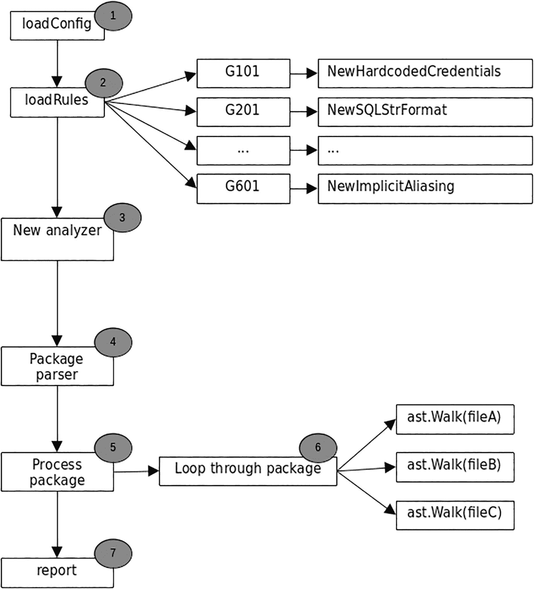

# 7. Gosec 与 AST

在本章中，你将学习 AST（抽象语法树），了解它的概念及其重要性。你将通过本章中的不同示例来学习 AST，从而理解 Go 源代码到 AST 的转换过程。你还将了解一个名为 gosec 的开源代码安全分析工具。该工具利用 AST 进行代码静态分析，你将看到这个工具是如何执行此过程的。

### 源代码

本章的源代码可在 [`https://github.com/Apress/Software-Development-Go`](https://github.com/Apress/Software-Development-Go) 仓库中获取。


### 抽象语法树

抽象语法树（亦称语法树）是一种以树形结构表示编程语言源代码的方式。当你用 Go 编写代码并编译时，编译器会首先在内部将源代码转换成一种表示代码的数据结构。这个数据结构会被编译器用作中间表示形式，并在生成机器码之前经历多个处理阶段。图 7-1 从高层次展示了编译器在编译代码时经历的不同步骤。



流程图展示了源代码的处理阶段，包括扫描、解析、生成 AST 以及生成机器码。

图 7-1

编译源代码的阶段

让我们快速对比一下 AST 与原始代码的异同。图 7-2 展示了原始 Go 代码与它在编译过程中转换为 AST 后的对比。



原始代码（包含包 main、主函数及打印语句）借助抽象语法树转换为最终代码的截图对比。

图 7-2

原始代码 vs. AST

对于普通人来说，AST 看起来就像一堆文本，但对编译器来说它非常有用，因为这种数据结构允许编译器遍历代码的不同部分以检查错误、警告及其他许多问题。

Go 提供了一个内置模块，使应用程序能够轻松地将源代码转换为 AST。这个模块被诸如 `golanci-lint`（`github.com/golangci/golangci-lint`）这类工具用于读取和检查 Go 源代码。

AST 的数据结构是什么样的？图 7-3 简要展示了 AST 的结构。



`Ast.Node` 的分类图，分为三大类：`ast.Declaration`、`ImportSpec` 和 `Identification`。其中 `ast.Declaration` 进一步细分为 `GenDecl` 和 `FunDecl`。

图 7-3

AST 结构

表 7-1 简要说明了这些不同的结构。

表 7-1

不同结构

| `Ast.Node`   | 这是其他结构必须实现的主要接口                     |
|--------------|----------------------------------------------------|
| `ast.FuncDecl`  | 表示类似函数声明的结构，例如 `func myfunc(){ }`    |
| `ast.GenDecl`   | 表示通用声明的结构，例如 `var x = "a string"`      |
| `ast.ImportSpec` | 表示导入声明的结构，例如 `import "go/token"`       |

有许多实际应用场景受益于使用 AST：

- **代码生成器**：这类应用程序需要使用 AST 来生成源代码。
- **静态代码分析器**：像 `gosec`（本章将讨论）这样的工具广泛使用 AST 来读取源代码并识别安全问题。
- **代码覆盖率**：这类工具需要 AST 来衡量应用程序的测试覆盖率，并利用 AST 执行其操作。

#### 模块

本章你将使用的模块是 `go/parser` 和 `go/ast`。它们的官方文档分别位于 [`https://pkg.go.dev/go/parser`](https://pkg.go.dev/go/parser) 和 [`https://pkg.go.dev/go/ast`](https://pkg.go.dev/go/ast)。每个模块提供不同的功能，具体如下：

- `go/parser`：该模块提供对 Go 源文件的解析能力。输入内容可以来自字符串或文件名，解析结果是一个源文件的 AST 结构。
- `go/ast`：解析源文件后的返回值类型是 `go/ast`，该模块允许应用程序遍历源文件中不同的 AST 结构。这个模块提供了应用程序将使用的 AST 数据结构。

在下一节中，通过查看不同的示例，你将更清楚地了解 AST 的工作原理。

#### 示例代码

在本节中，你将使用不同的 Go AST 模块探索多个示例。这些示例将让你深入了解如何使用不同的 AST 模块，以及可以用 AST 结果做什么。

##### 检查（Inspecting）

运行 `chapter7/samplecode/inspecting` 文件夹内的代码，命令如下：

```
go run main.go
```

你将得到以下输出：

```
2:9:	id: p
3:7:	id: c
3:11:	bl: 1.0
4:5:	id: X
4:9:	id: f
4:11:	bl: 3.14
4:17:	bl: 2
4:21:	id: c
```

这段代码为调用 AST 函数时提供的代码创建了一个 AST 数据结构，并过滤出其中声明的常量和变量。让我们逐段分析示例代码，理解各部分的作用。

代码声明了一个名为 `src` 的变量，其中包含源代码。这是一个简单的 Go 代码，包含 `const` 和 `var` 声明。成功解析源代码后会返回 `ast.File` 类型。`ast.File` 包含了代码的 AST 数据结构，代码将利用它进行遍历。

```
package main
import (
...
)
func main() {
src := `
package p
const c = 1.0
var X = f(3.14)*2 + c
`
fset := token.NewFileSet()
f, err := parser.ParseFile(fset, "", src, 0)
...
}
```

`ast.File` 在 `go/ast` 模块中定义，声明如下：

```
type File struct {
Doc        *CommentGroup
Package    token.Pos
Name       *Ident
Decls      []Decl
Scope      *Scope
Imports    []*ImportSpec
Unresolved []*Ident
Comments   []*CommentGroup
}
```

代码随后使用 `ast.Inspect(..)` 函数遍历 AST 数据结构，并调用声明的函数。作为参数传递给 `ast.Inspect(..)` 的简单函数会检查接收到的 `ast.Node` 类型，只过滤出 `ast.BasicLit` 和 `ast.Ident`。这里的 `ast.Node` 与我们在图 7-2 中讨论的相同。

```
package main
import (
...
)
func main() {
...
ast.Inspect(f, func(n ast.Node) bool {
var s string
switch x := n.(type) {
case *ast.BasicLit:
s = "bl: " + x.Value
case *ast.Ident:
s = "id: " + x.Name
}
if s != "" {
fmt.Printf("%s:\t%s\n", fset.Position(n.Pos()), s)
}
return true
})
}
```

`ast.Inspect(..)` 是 `go/ast` 模块提供的主要函数，用于在 Go 中遍历 AST 树。表 7-2 解释了 `ast.BasicLit` 和 `ast.Ident`。

表 7-2

`ast.BasicLit` 和 `ast.Ident`

| `ast.BasicLit` | 表示基本类型的节点，即已声明的变量或常量的值 |
|---------------|---------------------------------------------|
| `ast.Ident`   | 表示标识符。这在 Go 语言规范（[`https://go.dev/ref/spec#Identifiers`](https://go.dev/ref/spec%2523Identifiers)）中有明确定义。 |


##### 解析文件

本节中的示例代码创建了一个 `main.go` 的 AST 数据结构，该结构会打印出导入的不同模块名称、代码中声明的函数名称以及 return 语句所在的行号。代码位于 `chapter7/samplecode/parsing` 目录下。在终端中按如下方式运行示例：

```
go run main.go
```

您将看到以下输出：

```
2022/07/02 16:28:05 Imports:
2022/07/02 16:28:05   "fmt"
2022/07/02 16:28:05   "go/ast"
2022/07/02 16:28:05   "go/parser"
2022/07/02 16:28:05   "go/token"
2022/07/02 16:28:05   "log"
2022/07/02 16:28:05 Functions:
2022/07/02 16:28:05   main
2022/07/02 16:28:05 return statement found in line 36:
2022/07/02 16:28:05 return statement found in line 39:
```

该示例使用了相同的 `parser.ParseFile(..)` 和 `ast.Inspect(..)` 函数，如下所示：

```
package main
import (
...
)
func main() {
...
f, err := parser.ParseFile(fset, "./main.go", nil, 0)
...
ast.Inspect(f, func(n ast.Node) bool {
ret, ok := n.(*ast.ReturnStmt)
if ok {
...
}
return true
})
}
```

`ast.Inspect(..)` 内部的函数仅打印类型为 `ast.ReturnStmt`（代表 return 语句）的节点；其他内容则被忽略。它用于打印导入信息的其他函数如下所示：

```
package main
import (
...
)
func main() {
...
f, err := parser.ParseFile(fset, "./main.go", nil, 0)
...
log.Println("Imports:")
for _, i := range f.Imports {
log.Println(" ", i.Path.Value)
}
...
}
```

`ParseFile` 的返回值是 `ast.File`，该结构中的一个字段是 `Imports`，其中包含了源代码中声明的所有导入项。代码通过循环遍历 `Imports` 字段，并将导入的名称打印到控制台。代码还会打印声明的函数名称，这是通过以下代码实现的：

```
func main() {
...
for _, f := range f.Decls {
fn, ok := f.(*ast.FuncDecl)
...
log.Println(" ", fn.Name.Name)
}
}
```

`Decls` 字段包含了源代码中的所有声明，并过滤出仅包含函数声明的 `ast.FuncDecl` 类型。

您已经了解了不同的 AST 示例代码，现在应该更好地理解如何使用它以及可以从中获取哪些信息。在下一节中，您将了解 AST 如何在一个开源安全项目中使用。

### gosec

gosec 项目是一个开源工具 (`https://github.com/securego/gosec`)，提供安全静态代码分析。该工具为 Go 语言提供了一组安全代码最佳实践，它会扫描您的源代码，检查是否有任何违反这些规则的代码。

如果您使用的是 Go 1.16 及以上版本，请使用以下命令安装它：

```
go install github.com/securego/gosec/v2/cmd/gosec@latest
```

安装完成后，打开您的终端，将目录切换到 `chapter7/samplecode`，然后执行以下命令：

```
gosec  ./...
```

该工具将递归扫描您的示例代码，并将消息打印到控制台。

```
[gosec] 2022/07/02 17:00:11 Including rules: default
...
Results:
...
- G104 (CWE-703): Errors unhandled. (Confidence: HIGH, Severity: LOW)
22:
> 23:         ast.Print(fset, f)
24: }
Summary:
Gosec  : dev
Files  : 3
Lines  : 105
Nosec  : 0
Issues : 1
```

该工具会递归扫描目录中的所有 `.go` 文件，并在完成解析和扫描过程后打印最终结果。在我的目录中，它发现了一个问题，标记为 G104。该工具能够通过使用 `go/ast` 模块执行代码分析，方法与这些示例类似。

#### gosec 内部机制

图 7-4 从高层次展示了 gosec 的工作原理。



一个表示高层级流程的流程图：加载配置、加载规则、新分析器、包解析、处理包、报告、以及循环遍历包。

**图 7-4** Gosec 高层级流程图

该工具会加载内部已定义的规则（步骤 1）。这些规则定义了一些函数，用于检查正在处理的代码。下一节将对此进行详细讨论。

规则加载完成后，它会继续处理作为参数给定的目录，并递归获取所有找到的 `.go` 文件（步骤 4）。这是通过以下代码（`helpers.go`）执行的：

```
func PackagePaths(root string, excludes []*regexp.Regexp) ([]string, error) {
...
err := filepath.Walk(root, func(path string, f os.FileInfo, err error) error {
if filepath.Ext(path) == ".go" {
path = filepath.Dir(path)
if isExcluded(filepath.ToSlash(path), excludes) {
return nil
}
paths[path] = true
}
return nil
})
...
result := []string{}
for path := range paths {
result = append(result, path)
}
return result, nil
}
```

`PackagePaths(..)` 函数使用 Go 内部模块 `path/filepath` 遍历目录，以收集所有包含 `.go` 源代码的不同目录。在成功收集所有目录名称后，它会调用 `Process(..)` 函数（`analyzer.go`），如下所示：

```
func (gosec *Analyzer) Process(buildTags []string, packagePaths ...string) error {
...
for _, pkgPath := range packagePaths {
pkgs, err := gosec.load(pkgPath, config)
if err != nil {
gosec.AppendError(pkgPath, err)
}
for _, pkg := range pkgs {
if pkg.Name != "" {
err := gosec.ParseErrors(pkg)
if err != nil {
return fmt.Errorf("parsing errors in pkg %q: %w", pkg.Name, err)
}
gosec.Check(pkg)
}
}
}
sortErrors(gosec.errors)
return nil
}
```

此函数调用 `gosec.load(..)` 函数，使用另一个名为 `golang.org/x/tools` 的 Go 模块，来收集目录中找到的所有不同 `.go` 源代码。

```
func (gosec *Analyzer) load(pkgPath string, conf *packages.Config) ([]*packages.Package, error) {
abspath, err := GetPkgAbsPath(pkgPath)
...  conf.BuildFlags = nil
pkgs, err := packages.Load(conf, packageFiles...)
if err != nil {
return []*packages.Package{}, fmt.Errorf("loading files from package %q: %w", pkgPath, err)
}
return pkgs, nil
}
```

收集完所有文件名后的最后一步是，遍历这些文件并调用 `ast.Walk`。

```
func (gosec *Analyzer) Check(pkg *packages.Package) {
...
for _, file := range pkg.Syntax {
fp := pkg.Fset.File(file.Pos())
...
checkedFile := fp.Name()
...
gosec.context.PassedValues = make(map[string]interface{})
ast.Walk(gosec, file)
...
}
}
```

`ast.Walk` 被调用时带有两个参数：`gosec` 和 `file`。`gosec` 是接收者，将被 AST 模块调用，而 `file` 参数则将文件信息传递给 AST。

`gosec` 接收者实现了 `Visit(..)` 函数，当获取到节点时，AST 模块会调用该函数。该工具的 `Visit(..)` 函数如下所示：

```
func (gosec *Analyzer) Visit(n ast.Node) ast.Visitor {
...
for _, rule := range gosec.ruleset.RegisteredFor(n) {
...
issue, err := rule.Match(n, gosec.context)
if err != nil {
...
}
if issue != nil {
...
}
}
return gosec
}
```

`Visit(..)` 函数通过调用 `Match(..)` 函数并传入 `ast.Node`，来调用在步骤 2 中加载的规则。规则源代码会检查该 `ast.Node` 是否满足特定规则的某些条件。

最后一步，步骤 7，是打印出从不同已执行规则中获得的报告。


#### 规则

该工具定义的规则本质上是用于验证 `ast.Node` 以检查其是否满足特定条件的 Go 代码。生成规则的函数如下所示（位于 `rulelist.go` 文件中）：

```
func Generate(trackSuppressions bool, filters ...RuleFilter) RuleList {
    rules := []RuleDefinition{
        {"G101", "查找硬编码凭据", NewHardcodedCredentials},
        ...
        {"G601", "RangeStmt 中的隐式内存别名", NewImplicitAliasing},
    }
    ...
    return RuleList{ruleMap, ruleSuppressedMap}
}
```

每条规则由特定代码、描述和函数名称定义。查看 `G101`，你可以看到函数名称为 `NewHardCodedCredentials`，其定义如下：

```
package rules

import (
    ...
)

func (r *credentials) Match(n ast.Node, ctx *gosec.Context) (*gosec.Issue, error) {
    switch node := n.(type) {
    case *ast.AssignStmt:
        return r.matchAssign(node, ctx)
        ...
    }
}

func NewHardcodedCredentials(id string, conf gosec.Config) (gosec.Rule, []ast.Node) {
    ...
    return &credentials{
        pattern:          regexp.MustCompile(pattern),
        entropyThreshold: entropyThreshold,
        ...
        MetaData: gosec.MetaData{
            ID:         id,
            What:       "潜在硬编码凭据",
            Confidence: gosec.Low,
            Severity:   gosec.High,
        },
    }, []ast.Node{(*ast.AssignStmt)(nil), (*ast.ValueSpec)(nil), (*ast.BinaryExpr)(nil)}
}
```

`NewHardcodedCredentials` 函数初始化了处理节点所需的所有不同参数。该规则包含一个 `Match(..)` 函数，当 `gosec` 处理它所处理的每个文件的 AST 数据结构时，会调用此函数。

### 本章小结

在本章中，你了解了什么是抽象语法树及其形态。Go 提供了简化应用程序处理 AST 数据结构的模块。这为编写诸如开源项目 `gosec` 这类静态代码分析工具提供了可能性。

本章提供的示例代码展示了如何使用 AST 完成简单任务，例如计算全局变量的数量以及从导入声明中打印包名。你还通过深入分析 `gosec` 工具的源代码的不同部分，了解了它如何利用 AST 提供安全代码分析。

