# 8. 评分卡

在本章中，你将了解一个名为 Scorecard 的开源安全工具。Scorecard 为你感兴趣的项目提供安全指标。这些指标将让你了解与项目相关的、你需要关注的安全问题。

你将学习如何使用你的 GitHub 帐户创建 GitHub 令牌。该工具需要此令牌来提取公共 GitHub 仓库信息。你将逐步完成安装和使用该工具的步骤。为了更好地理解该工具，你将了解其工作的高级流程，以及它如何使用 GitHub API。

本章的关键要点之一是如何使用 GitHub API 以及可以从托管在 GitHub 上的仓库中提取哪些信息。你将学习如何利用开源库，使用 GraphQL 从 GitHub 查询仓库数据。

### 源代码

本章的源代码可以从以下仓库获取：[`github.com/Apress/Software-Development-Go`](https://github.com/Apress/Software-Development-Go)

### 什么是 Scorecard？

Scorecard 是一个开源项目，分析你项目的依赖关系并对其给出评级的工具。该工具执行多项检查，你可以根据需要进行配置。这些检查与软件安全相关，并被赋予 0 到 10 的评分。该工具能显示项目中的依赖是否安全，并提供其他安全检查，例如你的 GitHub 配置、许可证检查以及许多其他有用的检查。

项目维护者每天运行该工具，扫描数千个 GitHub 仓库并为其打分。评分结果可在 BigQuery 中公开获取，如图 8-1 所示。

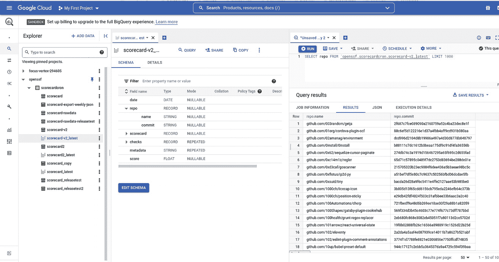

**图 8-1**  
BigQuery 中的 Scorecard 公共数据集

要访问此公共数据集，你需要拥有一个 Google (Gmail) 帐户。打开你的浏览器并输入以下地址：[`console.cloud.google.com/bigquery`](http://console.cloud.google.com/bigquery)。Google Cloud 页面加载后，点击 **添加数据** ➤ **固定项目** ➤ **输入项目名称**，如图 8-2 所示，项目名称为 `openssf`，你将在屏幕左侧看到显示的数据集。

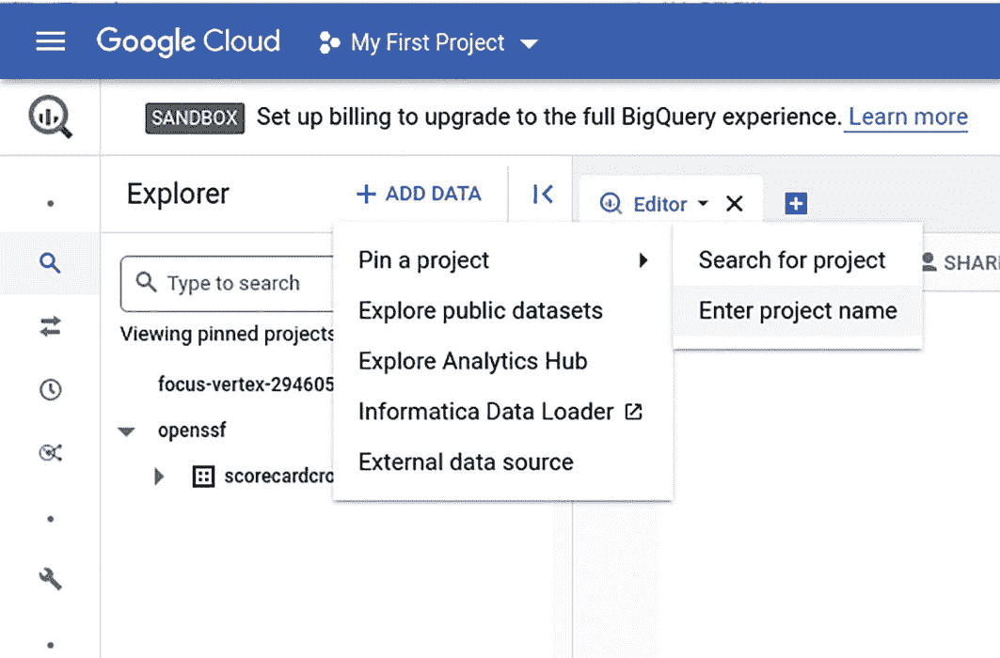

**图 8-2**  
添加 `openssf` 项目

在下一节中，你将学习如何设置 GitHub 令牌密钥，以便用它来扫描你选择的 GitHub 仓库。


#### 设置 Scorecard

`Scorecard` 需要一个 GitHub 令牌密钥来扫描仓库。其原因是 GitHub 对未经身份验证的请求实施了速率限制。让我们按照以下步骤在 GitHub 中创建一个令牌密钥。

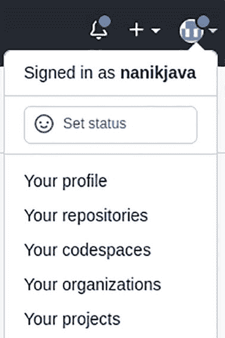

一张展示如何访问设置菜单的截图。个人资料下的下拉菜单包含您的资料、仓库、代码空间、组织和项目等选项。

图 8-3  
访问设置菜单

1. 转到您的 GitHub 仓库（以我的为例，是 `https://github.com/nanikjava`），然后点击右上角的图标，如图 8-3 所示，接着点击*设置*菜单进入个人资料页面。

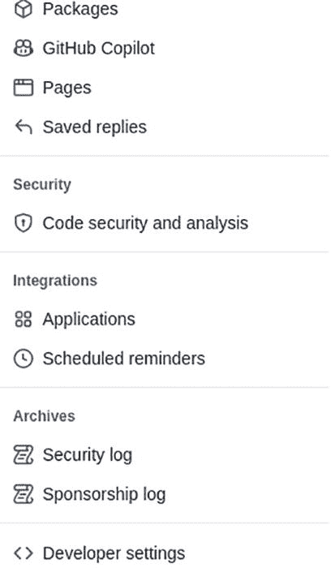

一张展示个人资料页面菜单的截图。这些菜单项包括：软件包、GitHub Copilot、页面、已存回复、代码安全与分析、应用程序、开发者设置以及安全与赞助日志。

图 8-4  
个人资料页面上的菜单

2. 进入图 8-4 所示的个人资料页面后，点击*开发者设置*。

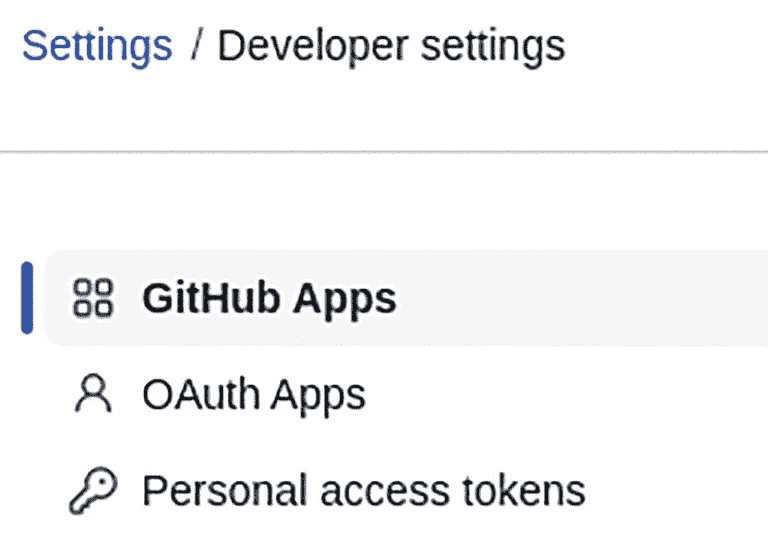

一张带有文字“GitHub 应用程序、OAuth 应用程序和个人访问令牌”的截图。其中“GitHub 应用程序”选项被高亮显示。

图 8-5  
应用程序页面

3. 您将被带到应用程序页面，如图 8-5 所示。点击*个人访问令牌*链接。

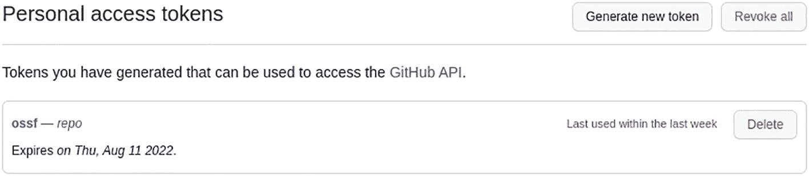

一张个人访问令牌页面的截图，包含三个选项：生成新令牌、删除和撤销所有令牌，并显示过期日期为 2022 年 8 月星期四。

图 8-6  
令牌页面

4. 进入图 8-6 所示的令牌页面后，点击*生成新令牌*。

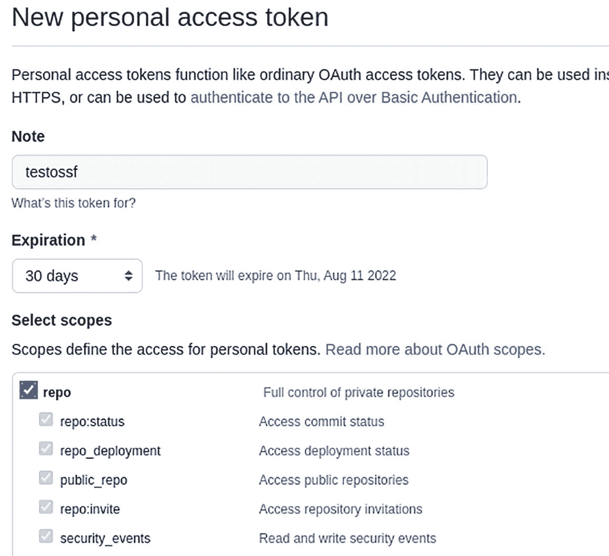

一张新的个人访问令牌页面截图，包含备注名称、过期天数以及用于选择个人令牌作用域访问权限的选项。

图 8-7  
生成新令牌页面

5. 您将看到图 8-7 所示的新个人令牌页面。在*备注*文本框中填写关于该令牌用途的信息，并根据您的需要设置过期时间。最后，在*选择作用域*部分，勾选 *repo* 复选框；这将自动选择其下的所有其他仓库权限。完成后，向下滚动并点击*生成令牌*按钮。

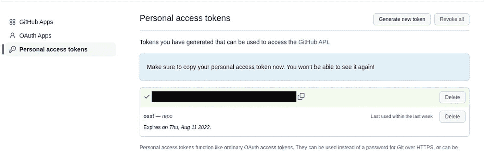

一张个人访问令牌页面的截图，包含三个选项：生成新令牌、删除和撤销所有令牌，并显示过期日期。

图 8-8  
令牌成功生成

6. 令牌生成后，您将看到如图 8-8 所示的屏幕，上面显示了新令牌。复制该令牌并粘贴到您的编辑器某处，以便在下一节中使用。

在下一节中，您将使用生成的令牌来构建和运行 `Scorecard`。

#### 运行 Scorecard

从该项目 GitHub 仓库下载该工具。对于本章，您将使用 `v4.4.0` 版本；其二进制文件可从 `https://github.com/ossf/scorecard/releases/tag/v4.4.0` 下载。下载存档文件后，将其解压到您本地机器上的一个目录中。

执行 `Scorecard` 来检查它是否正常工作。

```
/directory/scorecard help
```

您将在控制台中看到以下输出：

```
A program that shows security scorecard for an open source software.
Usage:
./scorecard --repo= [--checks=check1,...] [--show-details]
or ./scorecard --{npm,pypi,rubgems}= [--checks=check1,...] [--show-details] [flags]
./scorecard [command]
...
Flags:
...
Use "./scorecard [command] --help" for more information about a command.
```

现在 `Scorecard` 已在您的机器上运行，让我们使用上一节生成的令牌来扫描一个仓库。在本例中，您将扫描 `github.com/ossf/scorecard` 仓库。打开终端并执行以下命令：

```
GITHUB_AUTH_TOKEN= /directory_of_scorecard/scorecard --repo=github.com/ossf/scorecard
```

将 `<github_token>` 替换为您的 GitHub 令牌。该工具运行需要一点时间，因为它正在扫描 GitHub 仓库并执行检查。完成后，您将看到类似图 8-9 的输出。

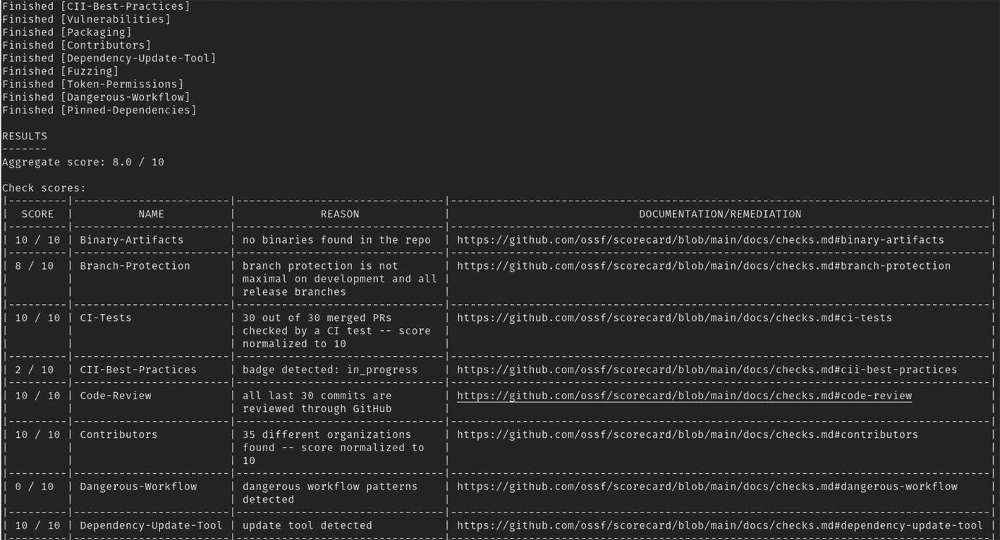

一张 Scorecard 输出结果的截图。一个包含十分制分数、名称、原因以及文档或补救措施的表格。

图 8-9  
Scorecard 输出结果

您已成功运行该工具扫描一个 GitHub 仓库，并获得了最高为 8.0 分的输出结果。分数越高表示该仓库在工具预定义的检查项方面都做得很好。

在下一节中，您将进一步探索该工具，了解其工作原理，并浏览该工具不同部分的代码。


#### 高层流程

在本节中，你将深入理解该工具的工作原理，并查看其不同部分的代码。通过深入分析代码，你将发现可用于设计自有应用的新内容。首先，宏观了解一下该工具的处理流程，如图 8-10 所示。

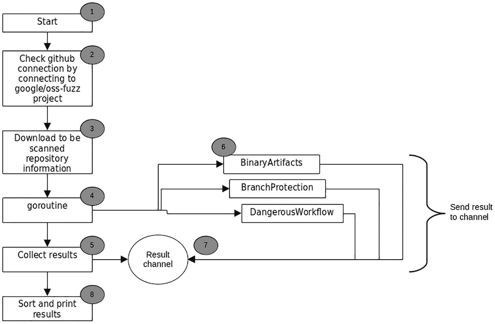

高层数据流程图包括：开始、检查连接、下载扫描信息、goroutine、收集结果、发送结果、排序并打印结果。

**图 8-10** 高层流程

阅读应用不同部分及其代码时，请将此图作为参考。工具启动时首先检查能否使用提供的令牌访问 GitHub。它通过访问 [`github.com/google/oss-fuzz`](http://github.com/google/oss-fuzz) 仓库（步骤 2）来硬编码测试 GitHub 连接。如下代码片段所示（`checker/client.go`）：

```
func GetClients(...) (
...
) {
...
ossFuzzRepoClient, errOssFuzz := ghrepo.CreateOssFuzzRepoClient(ctx, logger)
...
}
func CreateOssFuzzRepoClient(ctx context.Context, logger *log.Logger) (clients.RepoClient, error) {
ossFuzzRepo, err := MakeGithubRepo("google/oss-fuzz")
...
return ossFuzzRepoClient, nil
}
```

成功连接到 GitHub 仓库后，代码通过将连接分配给不同的 GitHub 处理器来继续执行。这些处理器使用该连接从仓库中获取用于执行安全检查的不同信息（步骤 3）。处理器分配的代码如下（`clients/githubrepo/client.go`）：

```
func (client *Client) InitRepo(inputRepo clients.Repo, commitSHA string) error {
...
// 合理性检查。
repo, _, err := client.repoClient.Repositories.Get(client.ctx, ghRepo.owner, ghRepo.repo)
if err != nil {
return sce.WithMessage(sce.ErrRepoUnreachable, err.Error())
}
client.repo = repo
client.repourl = &repoURL{
owner:         repo.Owner.GetLogin(),
...
commitSHA:     commitSHA,
}
client.tarball.init(client.ctx, client.repo, commitSHA)
// 设置 GraphQL。
client.graphClient.init(client.ctx, client.repourl)
client.contributors.init(client.ctx, client.repourl)
...
client.webhook.init(client.ctx, client.repourl)
client.languages.init(client.ctx, client.repourl)
return nil
}
```

图 8-11 概述了使用不同 GitHub 连接的 GitHub 处理器子集。

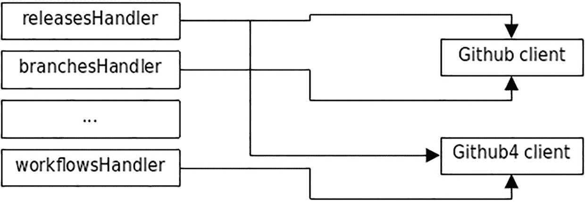

GitHub 连接流程图包含三个处理器：release、branches、workflow，它们分别与 GitHub 客户端 1 和 4 并行连接。

**图 8-11** 使用 GitHub 连接的 GitHub 处理器

一旦处理器成功使用 GitHub 连接完成初始化，工具的主体部分就会启动（步骤 4）。该工具生成一个 goroutine，利用通过 GitHub 连接下载的信息逐一执行安全检查。执行 goroutine 的代码如下（`pkg/scorecard.go`）：

```
func RunScorecards(ctx context.Context,
...
) (ScorecardResult, error) {
...
resultsCh := make(chan checker.CheckResult)
go runEnabledChecks(ctx, repo, &ret.RawResults, checksToRun, repoClient, ossFuzzRepoClient,
ciiClient, vulnsClient, resultsCh)
...
return ret, nil
}
```

图 8-12 展示了在 GitHub 仓库上执行的不同安全检查子集。

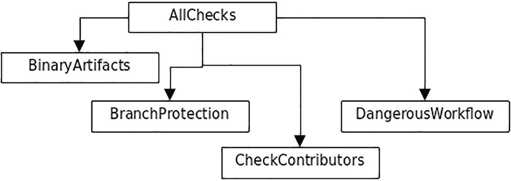

安全检查流程图包括：二进制工件、分支保护、检查贡献者、危险工作流。

**图 8-12** 安全检查

接下来展示的是 `runEnabledChecks(...)` 代码片段。该函数执行每个已配置的检查（步骤 6）。完成后，结果通过 `resultsCh` 通道传回（步骤 7）。

```
func runEnabledChecks(...
resultsCh chan checker.CheckResult,
) {
...
wg := sync.WaitGroup{}
for checkName, checkFn := range checksToRun {
checkName := checkName
checkFn := checkFn
wg.Add(1)
go func() {
defer wg.Done()
runner := checker.NewRunner(
checkName,
repo.URI(),
&request,
)
resultsCh <- runner.Run(ctx, checkFn)
}()
}
wg.Wait()
close(resultsCh)
}
```

工具的最终步骤是收集、格式化并对结果进行评分（步骤 8）。输出取决于配置，可配置为在控制台（默认）显示或输出到文件。代码片段如下所示（`scorecard/cmd/root.go`）：

```
func rootCmd(o *options.Options) {
...
repoResult, err := pkg.RunScorecards(
ctx,
...
)
if err != nil {
log.Panic(err)
}
repoResult.Metadata = append(repoResult.Metadata, o.Metadata...)
sort.Slice(repoResult.Checks, func(i, j int) bool {
return repoResult.Checks[i].Name < repoResult.Checks[j].Name
})
...
resultsErr := pkg.FormatResults(
o,
&repoResult,
checkDocs,
pol,
)
...
}
```

从这个工具中可以学到的是 GitHub API 的用法。该工具广泛使用 GitHub API，通过下载仓库信息并利用预定义的安全检查来执行检查。现在，你将了解如何使用 GitHub API 进行 GitHub 探索。

### GitHub

任何从事软件开发的人都了解 GitHub，并以这样或那样的方式使用过它。你可以在 GitHub 上找到大多数类型的开源软件，而且它是免费托管的。它已成为任何涉足软件开发人员的不二之选。

GitHub 提供允许外部工具与服务交互的 API。该 API 为开发者访问 GitHub 服务以构建能为组织提供价值的工具释放了无限潜力。这使得第三方解决方案（免费和付费）得以普及，并向公众开放。本章中的 Scorecard 项目正是得益于 GitHub API 而得以实现的工具之一。


#### GitHub API

GitHub 提供两种 API：REST 和 GraphQL (`https://docs.github.com/en/graphql`)。有多个不同的项目实现了这两种 API，稍后你会看到它们。

基于 REST 的 API 的访问方式与普通 HTTP 调用类似。例如，你可以在自己的浏览器中输入以下地址：

```
https://api.github.com/users/test
```

你将在浏览器中看到如下的 JSON 响应：

```
{
"login": "test",
"id": 383316,
"node_id": "MDQ6VXNlcjM4MzMxNg==",
"avatar_url": "https://avatars.githubusercontent.com/u/383316?v=4",
"gravatar_id": "",
"url": "https://api.github.com/users/test",
"html_url": "https://github.com/test",
...
"created_at": "2010-09-01T10:39:12Z",
"updated_at": "2020-04-24T20:58:44Z"
}
```

你看到的是 GitHub 中注册的名为 `test` 的用户信息。你可以尝试使用你自己的 GitHub 用户名，然后就会看到你自己的详细信息。现在，让我们获取某个特定组织的仓库列表。在浏览器地址栏中输入以下内容：

```
https://api.github.com/orgs/golang/repos
```

该地址会返回存放在某个特定组织名下、且公开托管在 GitHub 上的仓库列表。在示例中，你想要获取存放在 Golang 组织下的仓库列表。你将得到如下响应：

```
[
{
"id": 1914329,
"node_id": "MDEwOlJlcG9zaXRvcnkxOTE0MzI5",
"name": "gddo",
"full_name": "golang/gddo",
"private": false,
"owner": {
"login": "golang",
"id": 4314092,
...
},
"html_url": "https://github.com/golang/gddo",
"description": "Go Doc Dot Org",
"fork": false,
...
"license": {
...
},
...
"permissions": {
...
}
},
{ ... }
]
```

响应是 JSON 格式。你看到的信息与你访问 `https://github.com/golang` 上的 Golang 项目页面时所看到的信息相同。`https://docs.github.com/en/rest` 上的 GitHub 文档提供了所有可访问的 REST 端点的完整列表。

在 Go 应用程序中使用该 API，需要将不同的端点转换为你可以在应用程序中使用的函数，这是一个耗时的过程。因此，你可以使用来自 `https://github.com/google/go-github` 的 Go 开源库。让我们运行一个使用此库的示例，该示例可以在 `chapter8/simple` 文件夹中找到。打开终端并按如下方式运行：

```
go run main.go
```

你将得到以下输出：

```
2022/07/16 18:43:43 {
"id": 23096959,
"node_id": "MDEwOlJlcG9zaXRvcnkyMzA5Njk1OQ==",
"owner": {
"login": "golang",
"id": 4314092,
...
},
"name": "go",
"full_name": "golang/go",
"description": "The Go programming language",
"homepage": "https://go.dev",
...
"organization": {
"login": "golang",
"id": 4314092,
...
},
"topics": [
"go",
...
],
...
"license": {
...
},
...
}
```

该示例使用该库获取特定仓库 `http://github.com/golang/go` 的信息，如下面的代码片段所示：

```
package main
import (
...
"github.com/google/go-github/v38/github"
)
func main() {
client := github.NewClient(&http.Client{})
ctx := context.Background()
repo, _, err := client.Repositories.Get(ctx, "golang", "go")
...
log.Println(string(r))
}
```

应用程序首先通过调用 `github.NewClient(..)` 并传入 `http.Client` 来初始化该库，`http.Client` 用于向 GitHub 发起 HTTP 调用。库包 `github.com/google/go-github/v38/github` 提供了所需的所有不同函数。在示例中，你使用了 `Repositories.Get(..)` 来获取特定仓库（`golang`）项目（`go`）的信息。

查看库的源代码（`github.com/google/go-github/v38/github/repos.go`），你会发现它执行的是与 `https://docs.github.com/en/rest/repos/repos#get-a-repository` 文档中定义的类似的调用。

```
func (s *RepositoriesService) Get(ctx context.Context, owner, repo string) (*Repository, *Response, error) {
u := fmt.Sprintf("repos/%v/%v", owner, repo)
req, err := s.client.NewRequest("GET", u, nil)
if err != nil {
return nil, nil, err
}
...
return repository, resp, nil
}
```

在浏览器中使用 `https://api.github.com/repos/golang/go` 会得到相同的响应。

GitHub 提供的另一个 API 称为 GraphQL API (`https://docs.github.com/en/graphql`)，它与 REST API 截然不同。它基于 GraphQL (`https://graphql.org/`)，其网站对此描述如下：

GraphQL 是一种用于 API 的查询语言，也是一个利用你现有数据来满足这些查询的运行时。GraphQL 提供了 API 中数据的完整且易于理解的描述，赋予客户端精确请求所需内容（且仅此而已）的能力，让 API 随着时间推移更容易演进，并支持强大的开发者工具。

通常，当使用 REST API 获取不同类型的数据时，你需要从不同的端点获取。在收集完所有数据后，还需要将它们构建成一个结构体。GraphQL 使其变得简单：你只需定义你想要获取的仓库数据，它就会将你请求的数据集合作为一个单一的集合返回。

当你查看提供的示例应用程序时，这一点会变得更加清晰。打开终端并运行 `chapter8/graphql` 中的示例。按如下方式运行：

```
GITHUB_TOKEN= go run main.go
```

你需要使用之前在“设置 Scorecard”部分创建的 GitHub 令牌。如果运行成功，你将得到以下结果（输出会有所不同，因为数据是实时从 GitHub 获取的，在你运行此示例时数据可能已经发生了变化）：


```text
2022/07/16 19:39:00 分叉总数 : 15116
2022/07/16 19:39:00 标签总数 : 10
2022/07/16 19:39:00 ----------------------------------
2022/07/16 19:39:00 Issue 标题 - cmd/cgo: 在 gcc 4.4.1 下失败
2022/07/16 19:39:00 Issue 标题 - net: LookupHost 返回异常值并导致网络测试崩溃
2022/07/16 19:39:00 Issue 标题 - quietgcc 的问题
2022/07/16 19:39:00 Issue 标题 - 在 OS X 10.5 386 环境下运行“net”测试时出现段错误
2022/07/16 19:39:00 Issue 标题 - HTTP 客户端与服务器测试失败。DNS_ServerName 和 URL_Target 字符串拼接成无意义内容。
2022/07/16 19:39:00 Issue 标题 - all.bash 段错误
2022/07/16 19:39:00 Issue 标题 - 运行测试时崩溃，无匹配测试。
2022/07/16 19:39:00 Issue 标题 - go-mode.el 在编辑空文件时崩溃
2022/07/16 19:39:00 Issue 标题 - 我已经为**我的**编程语言使用了这个名称
2022/07/16 19:39:00 Issue 标题 - 运行 all.bash 时抛出错误：index out of range
2022/07/16 19:39:00 ----------------------------------
2022/07/16 19:39:00 提交作者 (dmitshur), url (https://github.com/dmitshur)
2022/07/16 19:39:00 提交作者 (eaigner), url (https://github.com/eaigner)
2022/07/16 19:39:00 提交作者 (nordicdyno), url (https://github.com/nordicdyno)
2022/07/16 19:39:00 提交作者 (minux), url (https://github.com/minux)
2022/07/16 19:39:00 提交作者 (needkane), url (https://github.com/needkane)
2022/07/16 19:39:00 提交作者 (nigeltao), url (https://github.com/nigeltao)
2022/07/16 19:39:00 提交作者 (nigeltao), url (https://github.com/nigeltao)
2022/07/16 19:39:00 提交作者 (h4ck3rm1k3), url (https://github.com/h4ck3rm1k3)
2022/07/16 19:39:00 提交作者 (trombonehero), url (https://github.com/trombonehero)
2022/07/16 19:39:00 提交作者 (adg), url (https://github.com/adg)
```

输出显示了从 `http://github.com/golang/go` 仓库通过 GitHub 获取的信息，包括前 10 个 Issue、前 10 条评论以及前 10 个标签。这类信息非常有用，你将在阅读代码时看到它，而通过使用 GraphQL API 可以轻松执行此操作。

GraphQL API 的主要部分是示例传递给 GitHub 端点的查询，如下所示：

```graphql
query ($name: String!, $owner: String!) {
repository(owner: $owner, name: $name) {
createdAt
forkCount
labels(first: 5) {
edges {
node {
name
}
}
}
issues(first: 5) {
edges {
node {
title
}
}
}
commitComments(first: 10) {
totalCount
edges {
node {
author {
url
login
}
}
}
}
}
}
```

该查询向 GitHub 描述了你感兴趣的仓库信息。它首先定义查询将传入两个参数（`$name` 和 `$owner`），并且你需要的信息的顶层是一个仓库。在仓库内部，你指定了需要以下内容：

*   `createdAt`
*   `forkCount`
*   `labels`（前 10 个标签）
*   `issues`（前 10 个 Issues）
*   `commitComments`（前 10 条评论）

GitHub 提供了一个用于创建和测试 GraphQL 的 GraphQL 工具，你将在下一节中看到它。GraphQL 不能直接在代码中使用，因此你需要将其转换为 Go 结构体，如下所示：

```go
type graphqlData struct {
Repository struct {
CreatedAt githubv4.DateTime
ForkCount githubv4.Int
Labels    struct {
Edges []struct {
Node struct {
Name githubv4.String
}
}
} `graphql:"labels(first: $labelcount)"`
Issues struct {
Edges []struct {
Node struct {
Title githubv4.String
}
}
} `graphql:"issues(first: $issuescount)"`
CommitComments struct {
TotalCount githubv4.Int
Edges      []struct {
Node struct {
Author struct {
URL   githubv4.String
Login githubv4.String
}
}
}
} `graphql:"commitComments(first: $commitcount)"`
} `graphql:"repository(owner: $owner, name: $name) "`
RateLimit struct {
Cost *int
}
}
```

结构体定义使用了库中定义的数据类型（例如 `githubv4.String`、`githubv4.Int` 等）。

一旦定义了 GraphQL 结构体，就可以使用 GraphQL 库了。在本例中，使用托管在 `https://github.com/shurcooL/githubv4` 的开源库，如下所示：

```go
func main() {
...
data := new(graphqlData)
vars := map[string]interface{}{
"owner":       githubv4.String("golang"),
"name":        githubv4.String("go"),
"labelcount":  githubv4.Int(10),
"issuescount": githubv4.Int(10),
"commitcount": githubv4.Int(10),
}
if err := graphClient.Query(context.Background(), data, vars); err != nil {
log.Fatalf(err.Error())
}
log.Println("Total number of fork : ", data.Repository.ForkCount)
...
}
```

代码初始化了 `graphqlData` 结构体，该结构体将由库填充从 GitHub 接收到的信息。然后，它使用 `graphClient.Query(..)` 函数调用 GitHub，并传入新创建的结构体和定义的变量。`vars` 中定义的变量包含将作为 GraphQL 参数传递给 GitHub 的值。

一旦 `.Query(..)` 函数成功返回，你就可以使用填充在 `data` 变量中的返回数据，并将其打印到控制台。

在下一节中，你将了解如何使用 GitHub Explorer 处理 GraphQL。

### GitHub Explorer

GitHub Explorer 是 GitHub 提供的一种基于 Web 的工具，允许开发者查询 GitHub 仓库以获取信息。该工具可从 `https://docs.github.com/en/graphql/overview/explorer` 获取。使用该工具前，你必须使用你的 GitHub 帐户登录。一旦获得访问权限，你将看到 Explorer，如图 8-13 所示。

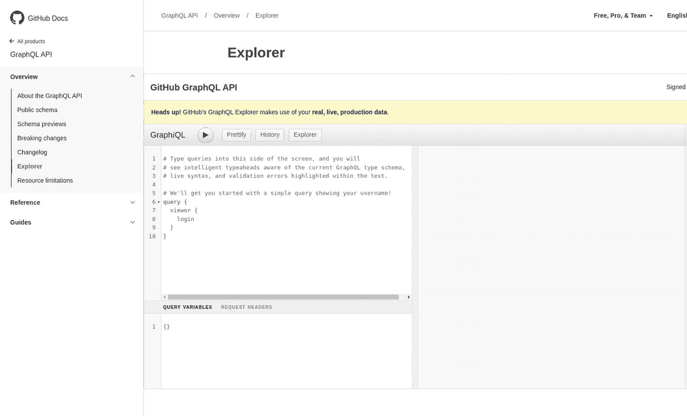

**图 8-13** GitHub Explorer

登录后，尝试以下 GraphQL 并点击运行按钮。

```graphql
{
repository(owner: "golang", name: "go") {
createdAt
diskUsage
name
}
}
```

它向 GitHub 查询仓库 `http://github.com/golang/go`，以提取创建日期、总磁盘使用量和项目名称。你将得到如下响应：

```json
{
"data": {
"repository": {
"createdAt": "2014-08-19T04:33:40Z",
"diskUsage": 310019,
"name": "go"
}
}
}
```

Explorer 会提供关于可以向查询添加哪些数据的快速提示。当你在查询中创建新行并按下 `Alt + Enter` 时，会显示这些提示。它将显示一个可滚动的工具提示，如图 8-14 所示。

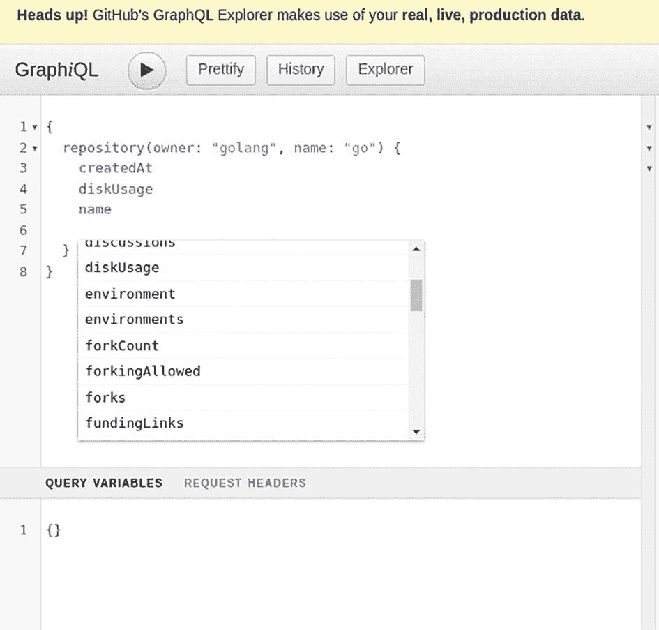

**图 8-14** 智能工具提示

有关可以使用 GraphQL 提取的不同数据的更多信息，请参阅位于 `https://docs.github.com/en/graphql/reference/queries` 的查询文档。


### 总结

在本章中，你了解了一个名为 Scorecard 的开源项目，它为托管在 GitHub 上的项目提供安全指标。该项目以 0-10 的评分标准衡量项目的安全性，该评分标准同样适用于本地存储的项目。该工具的主要优势在于，被扫描项目的相关数据可公开获取。这些数据对开发者极为有用，因为它能提供有关他们计划使用的项目安全指标的洞察和信息。

你还了解了该工具的工作原理，并学习了如何使用 GitHub API 提取仓库信息以执行预定义的安全检查。

你详细了解了 GitHub API 的不同可用形式，即 REST 和 GraphQL。你查看了示例代码，以理解如何使用这些 API 从 GitHub 仓库中提取信息。最后，你探索了 GitHub Explorer，以理解如何构建用于在 GitHub 上执行查询操作的 GraphQL 查询。

