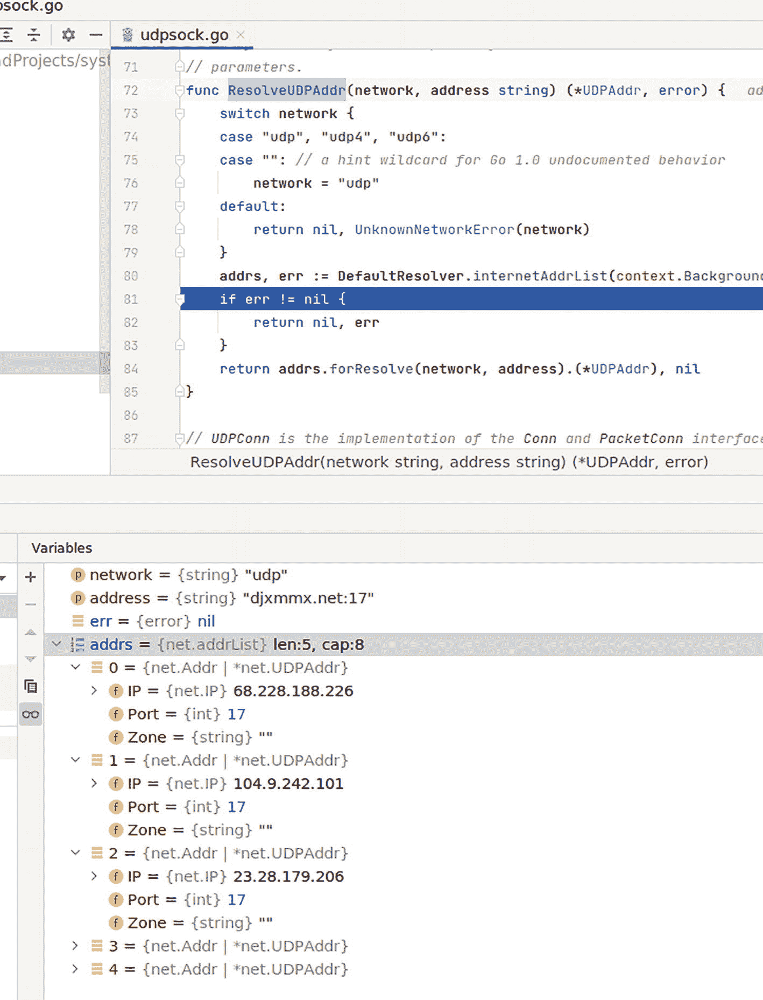

# 9. 简单网络

在本章中，你将学习如何使用 Go 编写网络代码。你将理解如何为 TCP 和 UDP 协议编写客户端和服务器代码。你还将学习如何编写一个能够使用 goroutine 并发处理请求的网络服务器。到本章结束时，你将掌握以下内容：

- 为 TCP 和 UDP 编写网络客户端
- 为 TCP 和 UDP 编写网络服务器
- 使用 goroutine 处理请求
- 对网络服务器进行负载测试

### 源代码

本章的源代码可从 `https://github.com/Apress/Software-Development-Go` 仓库获取。

### TCP 网络

在本节中，你将探索如何使用 Go 标准网络库创建 TCP 应用程序。你将编写的代码包括 TCP 客户端和服务器。

#### TCP 客户端

让我们从编写一个 TCP 客户端开始，该客户端连接到一个特定的 HTTP 服务器，在本例中是 `google.com`，并打印出服务器的响应。代码位于 `chapter9/tcp/simple` 目录下。按如下方式运行它：

```
go run main.go
```

代码运行时，它将尝试连接到 `google.com` 服务器，并将返回的网页打印到控制台，如下所示输出：

```
HTTP/1.0 200 OK
Date: Sun, 05 Dec 2021 10:27:46 GMT
Expires: -1
Cache-Control: private, max-age=0
Content-Type: text/html; charset=ISO-8859-1
P3P: CP="This is not a P3P policy! See g.co/p3phelp for more info."
Server: gws
X-XSS-Protection: 0
X-Frame-Options: SAMEORIGIN
Set-Cookie: 1P_JAR=2021-12-05-10; expires=Tue, 04-Jan-2022 10:27:46 GMT; path=/; domain=.google.com; Secure
Set-Cookie:
...
Accept-Ranges: none
Vary: Accept-Encoding

...
```

该应用使用了标准库中的 `net` 包，并使用如下代码指定的 TCP 连接：

```
conn, err := net.Dial("tcp", t)
if err != nil {
    panic(err)
}
```

以下是连接到服务器的代码：

```
package main
...
const (
    host = "google.com"
    port = "80"
)
func main() {
    t := net.JoinHostPort(host, port)
    conn, err := net.Dial("tcp", t)
    if err != nil {
        panic(err)
    }
...
}
```

代码使用 `net.Dial(..)` 函数通过 TCP 连接到 `google.com` 的 80 端口。成功连接后，它向服务器发送 HTTP 协议，告知服务器正在请求首页，如下所示：

```
func main() {
...
    req := "GET / \r\nHost: google.com\r\nConnection: close\r\n\r\n"
    conn.Write([]byte(req))
...
}
```

收到响应后，它将输出打印到控制台，如下面这段代码所示：

```
...
func main() {
...
    connReader := bufio.NewReader(conn)
    scanner := bufio.NewScanner(connReader)
    for scanner.Scan() {
        fmt.Printf("%s\n", scanner.Text())
    }
    if err := scanner.Err(); err != nil {
        fmt.Println("Scanner error", err)
    }
}
```

现在你已经理解了如何编写 TCP 客户端，下一节你将学习如何编写 TCP 服务器。

#### TCP 服务器

在本节中，你将编写一个 TCP 服务器，它监听本地机器上的 3333 端口。该服务器将打印出收到的内容，并发送一个响应。代码位于 `tcp/server` 目录下，可以按如下方式运行：

```
go run main.go
```

你将得到如下输出：

```
2022/03/05 22:51:19 Listening on port 3333
```

使用 `nc`（网络连接）工具连接到该服务器，如下所示：

```
nc localhost 3333
```

连接后，输入任何文本并按回车键。你将得到一个响应。以下是一个示例。我输入了 *This is a test*，它返回了一个响应：*Message received of length : 15.*

```
This is a test
Message received of length : 15
```

让我们看一下代码。首先，你将看到代码如何等待并监听 3333 端口，如下面这段代码所示：

```
func main() {
    t := net.JoinHostPort("localhost", "3333")
    l, err := net.Listen("tcp", t)
    ...
    for {
        conn, err := l.Accept()
        if err != nil {
            log.Println("Error accepting: ", err.Error())
            os.Exit(1)
        }
        go handleRequest(conn)
    }
}
```

代码使用了 `Listener` 对象的 `Accept` 函数，该对象在调用 `net.Listen(..)` 函数时返回。`Accept` 函数会一直等待，直到收到连接。

当客户端成功连接后，代码会继续调用一个单独的 goroutine 中的 `handleRequest` 函数。在单独的 goroutine 中处理请求，使得应用能够并发处理请求。

请求的处理和响应的发送在 `handleRequest` 函数内部完成，如下面这段代码所示：

```
func handleRequest(conn net.Conn) {
    ...
    len, err := conn.Read(buf)
    ...
    conn.Write([]byte(fmt.Sprintf("Message received of length : %d", len)))
    conn.Close()
}
```

代码使用连接的 `Read(..)` 函数读取客户端发送的数据，并使用同一连接的 `Write(..)` 函数写回响应。

由于代码使用了 goroutine，TCP 服务器能够处理多个客户端请求而不会出现阻塞问题。

### UDP 网络

在本节中，你将学习如何使用 UDP 协议编写网络应用程序。


好的，作为高级文档工程师和翻译员，我将遵循您的注意事项和示例，将给定的英文文本翻译成中文。


#### UDP 客户端

在本节中，您将编写一个简单的 UDP 应用程序，该程序与一个“每日名言”（qotd）服务器通信，该服务器会返回一条字符串名言，并将其打印到控制台。以下链接提供了有关 qotd 协议和可用公共服务器的更多信息：[`www.gkbrk.com/wiki/qotd_protocol/`](http://www.gkbrk.com/wiki/qotd_protocol/)。示例代码连接到在端口 17 上监听的服务器 [`djxms.net`](http://djxms.net)。

代码位于 `chapter9/udp/simple` 目录中，可以按如下方式运行：

```
go run main.go
```

每次运行该应用程序，您都会获得不同的名言。在我的例子中，其中一条如下：

> “人类可以攀登到最高的顶峰，但无法在那里长久居住。”
> 
> 乔治·萧伯纳（George Bernard Shaw，1856-1950）

让我们来看看应用程序的不同部分，并理解其功能。`qotd` 函数包含以下代码片段。它使用标准库中的 `net.ResolveUDPAddr(..)` 连接到服务器并返回一个 `UDPAddr` 结构体。

```
udpAddr, err := net.ResolveUDPAddr("udp", s)
if err != nil {
println("Error Resolving UDP Address:", err.Error())
os.Exit(1)
}
```

该库会执行一次查找，以确保提供的域名有效，这是通过 DNS 查询完成的。如果遇到错误，`err` 变量将返回非空值。

深入研究标准库中的 `net.ResolveUDPAddr` 函数（如图 9-1 所示），您可以看到对该域名的 DNS 查询会返回多个 IP 地址，但只有第一个 IP 地址会被填入返回的 `UDPAddr` 结构体中。



两张截图。上方是解释通过 IP 地址连接到服务器的代码片段。下方是来自解析 UDP 地址的多个 IP 地址。

**图 9-1** 来自 `ResolveUDPAddr` 的多个 IP 地址

一旦 `udpAddr` 成功填充，它将在调用 `net.DialUDP` 时使用。该函数调用会使用 `udpAddr` 中提供的 IP 地址打开一个到服务器的套接字连接：

```
conn, err := net.DialUDP("udp", nil, udpAddr)
```

在本节中，您学习了如何使用标准库连接一个 UDP 服务器。在下一节中，您将进一步学习如何编写一个 UDP 服务器。

#### UDP 服务器

在本节中，您将深入探索并使用标准库编写一个 UDP 服务器。该服务器在端口 3000 上监听，并打印出客户端发送的内容。代码位于 `chapter9/udp/server` 目录中，可以按如下方式运行：

```
go run main.go
```

该示例会在控制台打印出以下内容：

```
2022/03/05 23:51:32 Listening [::]:3000
```

在一个终端窗口中，使用 `nc` 命令连接到端口 3000：

```
nc -u localhost 3000
```

`nc` 工具运行后，输入任何文本，您都会看到它被打印在服务器的终端上。以下是在我的机器上的示例：

```
2022/03/05 23:51:32 Listening [::]:3000
2022/03/05 23:51:36 Received: nanik from [::1]:41518
2022/03/05 23:51:44 Received: this is a long letter from [::1]:41518
```

让我们探讨代码是如何工作的。以下代码片段使用 `net.ListenUDP` 函数设置 UDP 服务器：

```
...
func main() {
conn, err := net.ListenUDP("udp", &net.UDPAddr{
Port: 3000,
IP:   net.ParseIP("0.0.0.0"),
})
...
}
```

函数调用返回一个 `UDPConn` 结构体，用于从客户端读取数据和向客户端写入数据。代码成功创建 UDP 服务器连接后，便开始监听并从中读取数据，如下所示：

```
...
func main() {
...
for {
message := make([]byte, 512)
l, u, err := conn.ReadFromUDP(message[:])
...
log.Printf("Received: %s from %s\n", data, u)
}
}
```

代码使用 UDP 连接的 `ReadFromUDP(..)` 函数来读取客户端发送的数据，并将其打印到控制台。

#### 并发服务器

在上一节中，您编写了一个 UDP 服务器，但其中缺少的一个功能是处理多个 UDP 客户端请求的能力。编写一个能够处理多个请求的 UDP 服务器与普通的 TCP 不同。构建这种应用结构的方法是启动多个 goroutine 来监听同一个连接，并让每个 goroutine 负责处理请求。代码位于 `udp/concurrent` 目录中。让我们看看它与之前的 UDP 服务器实现相比有何不同。

以下代码片段展示了启动多个 goroutine 来监听 UDP 连接的代码：

```
...
func main() {
addr := net.UDPAddr{
Port: 3333,
}
connection, err := net.ListenUDP("udp", &addr)
...
for i := 0; i < runtime.NumCPU(); i++ {
...
go listen(id, connection, quit)
...
}
...
}
```

goroutine 的运行次数取决于 `runtime.NumCPU()` 返回的结果。这些 goroutine 使用 `listen` 函数，如下面的代码片段所示：

```
func listen(i int, connection *net.UDPConn, quit chan struct{}) {
buffer := make([]byte, 1024)
for {
_, remote, err := connection.ReadFromUDP(buffer)
if err != nil {
break
}
...
}
...
}
```

现在，`listen` 函数以多个 goroutine 的形式运行，它通过调用 `ReadFromUDP` 函数等待传入的 UDP 请求。当检测到传入的 UDP 请求时，其中一个正在运行的 goroutine 会处理它。


#### 负载测试

在本节中，你将了解如何使用负载测试来测试在前几节中编写的网络服务器。你将使用一款名为 `fortio` 的开源负载测试工具，该工具可从 [`https://github.com/fortio/fortio`](https://github.com/fortio/fortio) 下载；本书使用 v1.21.1 版本。

使用负载测试工具，你将看到不使用 goroutine 处理请求的代码与使用 goroutine 处理请求的代码之间的时序差异。在此练习中，你将使用 `chapter9/udp/loadtesting` 目录中的 UDP 服务器。你将比较 `chapter9/udp/loadtesting/concurrent` 目录中使用 goroutine 的 UDP 服务器与 `chapter9/udp/loadtesting/server` 目录中不使用 goroutine 的 UDP 服务器。

用于负载测试的代码与上一节讨论的代码之间唯一的区别是增加了 `time.Sleep(..)` 函数。添加该函数是为了模拟或模仿在发送响应之前对请求进行某些处理的过程。代码如下：

```
func listen(i int, connection *net.UDPConn, quit chan struct{}) {
...
for {
...
//假装代码正在执行一些请求处理，耗时 10 毫秒
time.Sleep(10 * time.Millisecond)
...
}
...
}
func main() {
...
for {
...
//假装代码正在执行一些请求处理，耗时 10 毫秒
time.Sleep(10 * time.Millisecond)
...
}
}
```

首先运行 `chapter9/udp/loadtesting/concurrent` 目录下的代码。一旦 UDP 服务器启动，按如下方式运行 `fortio` 工具：

```
./fortio load -n 200 udp://0.0.0.0:3333/
```

该工具会对本地运行在 3000 端口的服务器进行 200 次调用。你将看到类似如下的结果：

```
...
00:00:44 I udprunner.go:223> Starting udp test for udp://0.0.0.0:3333/ with 4 threads at 8.0 qps
Starting at 8 qps with 4 thread(s) [gomax 12] : exactly 200, 50 calls each (total 200 + 0)
...
Aggregated Function Time : count 200 avg 0.011425742 +/- 0.005649 min 0.010250676 max 0.054895756 sum 2.2851485
# range, mid point, percentile, count
>= 0.0102507  0.011  0.045  0.05 <= 0.0548958 , 0.0524479 , 100.00, 2
# target 50% 0.0106453
# target 75% 0.0108446
# target 90% 0.0109641
# target 99% 0.05
# target 99.9% 0.0544062
Sockets used: 200 (for perfect no error run, would be 4)
Total Bytes sent: 4800, received: 200
udp short read : 200 (100.0 %)
All done 200 calls (plus 0 warmup) 11.426 ms avg, 8.0 qps
```

最终结果是平均处理时间为 11.426 毫秒。现在，将其与 `chapter9/udp/loadtesting/server` 目录中不使用 goroutine 的服务器代码进行比较。运行 UDP 服务器后，使用相同的命令运行 `fortio`。你将看到类似如下的结果：

```
...
00:00:07 I udprunner.go:223> Starting udp test for udp://0.0.0.0:3000/ with 4 threads at 8.0 qps
Starting at 8 qps with 4 thread(s) [gomax 12] : exactly 200, 50 calls each (total 200 + 0)
...
Aggregated Function Time : count 200 avg 0.026354093 +/- 0.01187 min 0.010296825 max 0.054235708 sum 5.27081864
# range, mid point, percentile, count
>= 0.0102968  0.011  0.02  0.03  0.035  0.04  0.045  0.05 <= 0.0542357 , 0.0521179 , 100.00, 2
# target 50% 0.025
# target 75% 0.0402041
# target 90% 0.0432653
# target 99% 0.05
# target 99.9% 0.0538121
Sockets used: 200 (for perfect no error run, would be 4)
Total Bytes sent: 4800, received: 200
udp short read : 200 (100.0 %)
All done 200 calls (plus 0 warmup) 26.354 ms avg, 8.0 qps
```

这次记录的平均时间为 26.354 毫秒，高于之前 11.426 毫秒的结果。由此可以得出结论：在编写网络服务器应用程序时，务必牢记使用 goroutine 以确保并发请求处理。

### 总结

在本章中，你学习了如何使用 TCP 和 UDP 创建网络应用程序。你学习了如何为这两种协议编写客户端和服务器。你还学习了如何编写能够使用 goroutine 并发处理多个请求的应用程序。

理解这一点很重要，因为这是编写能够处理海量流量的网络应用程序的基础。本章是下一章的垫脚石，在下一章中，你将学习在 Linux 中编写网络应用程序的不同风格。

