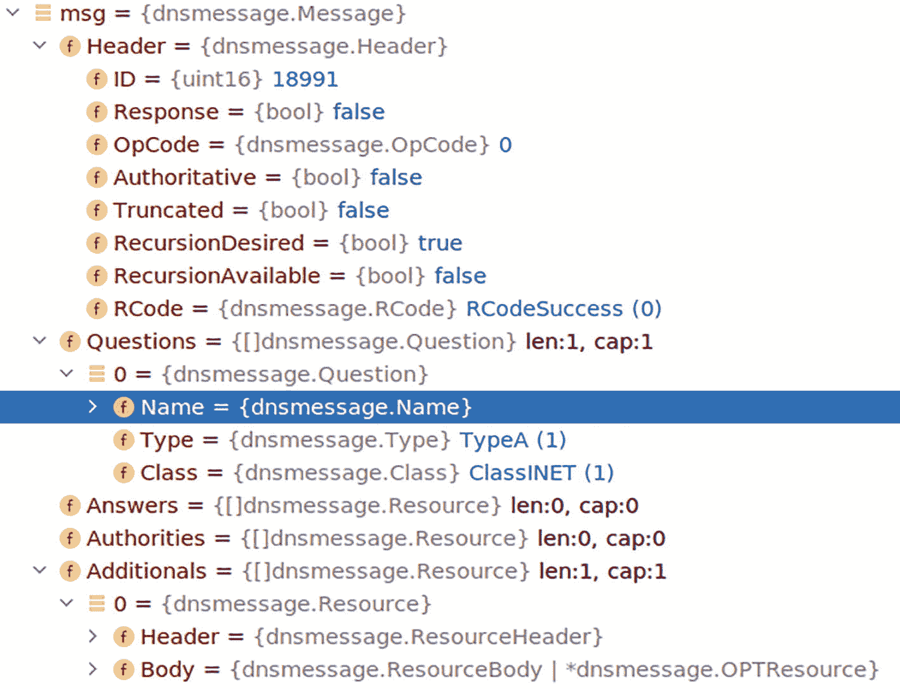
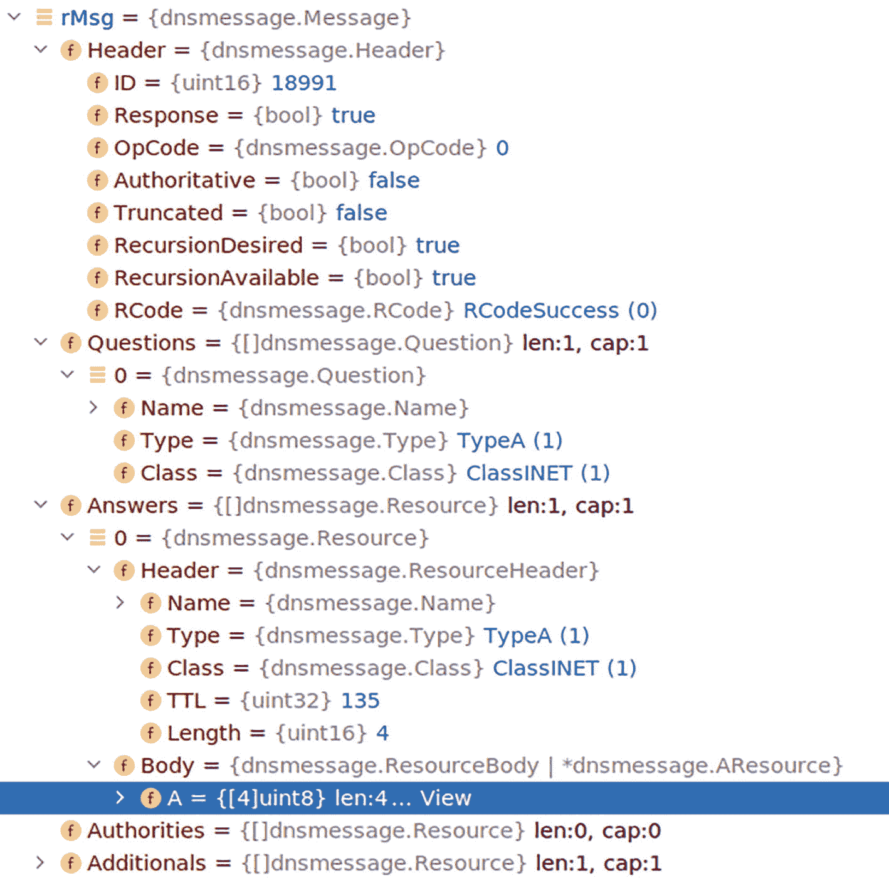

# 系统网络

在上一章中，你使用标准库编写了 TCP 和 UDP 应用程序。在本章中，你将运用这些知识来构建系统网络工具。编写这些工具的目的是为了更深入地理解利用 Go 标准库的能力来实现这一点是多么容易。这突显了标准库提供了丰富的功能，使开发者能够构建各种网络相关应用。

在本章中，你将深入理解以下内容：

- 使用标准库编写网络工具
- `net/dns` 包
- DNS 如何打包和解包消息

### 源代码

本章的源代码可从 [`https://github.com/Apress/Software-Development-Go`](https://github.com/Apress/Software-Development-Go) 仓库获取。

### Ping 工具

在本节中，你将编写一个提供类似 ping 功能的应用程序。代码位于 `chapter10/ping` 文件夹中。

该应用程序使用了 Go 标准库提供的 `icmp` 包，其文档可在 [`https://pkg.go.dev/golang.org/x/net/icmp`](https://pkg.go.dev/golang.org/x/net/icmp) 找到。如文档所述，该包提供了操作基于 RFC 792 和 RFC 4443 的 ICMPv4/6 的函数。

按如下方式编译应用程序：

```
go build -o pinggoogle .
```

使用 root 权限运行应用程序，如下所示：

```
sudo ./pinggoogle
```

你将看到以下输出：

```
2022/01/21 00:07:09 Ping golang.org (142.250.66.241): 21.30063ms
```

为了提供类似 ping 的功能，代码使用了互联网控制消息协议（ICMP），该协议是所有网络协议栈都使用的 IP 协议栈的一部分，这意味着任何使用 IP 协议栈的计算机都可以响应 ICMP 请求，除非被禁用。IP 网络协议栈无论运行在何处，都具有响应 ICMP 请求的能力。ICMP 是 IP 协议栈的一部分，通常用于错误报告和网络诊断。


#### 代码详解

接下来您将深入阅读示例代码，了解其整体运作原理。应用程序首先调用 `Ping()` 函数对单个域名执行 ping 操作。在本示例中，将针对 `golang.org` 域名进行 ping。

```
func main() {
	addr := "golang.org"
	dst, dur, err := Ping(addr)
	if err != nil {
		panic(err)
	}
	log.Printf("Ping %s (%s): %s\n", addr, dst, dur)
}
```

该函数执行一系列操作，我们逐段查看代码。以下代码片段调用了 `icmp.ListenPacket()`，该函数属于 `golang.org/x/net` 标准库包。此函数会打开一个本地套接字，用于与远程主机进行 ICMP 通信。

```
func Ping(addr string) (*net.IPAddr, time.Duration, error) {
	// 监听 ICMP 回复
	c, err := icmp.ListenPacket("ip4:icmp", ListenAddr)
	if err != nil {
		return nil, 0, err
	}
	defer c.Close()
	...
}
```

打开的套接字仅用于 ICMP 通信，这意味着该套接字只能理解 ICMP 网络数据包。当本地套接字成功打开后，代码必须解析目标域名的 IP 地址。以下代码使用 `net.ResolveIPAddr()` 函数调用将域名解析为对应的 IP 地址：

```
dst, err := net.ResolveIPAddr("ip4", addr)
if err != nil {
	panic(err)
	return nil, 0, err
}
```

现在您已打开用于 ICMP 的本地套接字连接并解析了目标域名的 IP 地址，下一步是初始化 ICMP 数据包并将其发送至目标，如下列代码片段所示：

```
// 准备新的 ICMP 消息
m := icmp.Message{
	Type: ipv4.ICMPTypeEcho,
	Code: 0,
	Body: &icmp.Echo{
		ID:   os.Getpid() & 0xffff,
		Seq:  1,
		Data: []byte(""),
	},
}
```

`icmp.Message` 结构体定义了将作为 ICMP 数据包发送至目标的信息，该结构体定义在 `golang.org/x/net` 包中，内容如下：

```
// Message 表示一条 ICMP 消息。
type Message struct {
	Type     Type        // 类型，ipv4.ICMPType 或 ipv6.ICMPType
	Code     int         // 代码
	Checksum int         // 校验和
	Body     MessageBody // 消息体
}
```

ICMP 数据包可以包含不同类型的 ICMP 参数，这可以通过 `Type` 字段指定。此处使用了 `ipv4.ICMPTypeEcho` 类型。以下是 Go 语言中提供的可用类型：

```
const (
	ICMPTypeEchoReply              ICMPType = 0  // 回显回复
	ICMPTypeDestinationUnreachable ICMPType = 3  // 目标不可达
	ICMPTypeRedirect               ICMPType = 5  // 重定向
	ICMPTypeEcho                   ICMPType = 8  // 回显
	ICMPTypeRouterAdvertisement    ICMPType = 9  // 路由器通告
	ICMPTypeRouterSolicitation     ICMPType = 10 // 路由器请求
	ICMPTypeTimeExceeded           ICMPType = 11 // 超时
	ICMPTypeParameterProblem       ICMPType = 12 // 参数问题
	ICMPTypeTimestamp              ICMPType = 13 // 时间戳
	ICMPTypeTimestampReply         ICMPType = 14 // 时间戳回复
	ICMPTypePhoturis               ICMPType = 40 // Photuris
	ICMPTypeExtendedEchoRequest    ICMPType = 42 // 扩展回显请求
	ICMPTypeExtendedEchoReply      ICMPType = 43 // 扩展回显回复
)
```

定义类型后，下一个需要包含信息的字段是 `Body` 字段。此处使用 `icmp.Echo`，它将包含回显请求：

```
type Echo struct {
	ID   int    // 标识符
	Seq  int    // 序列号
	Data []byte // 数据
}
```

数据通过 `Marshal(..)` 函数转换为字节格式，然后通过 `WriteTo(b, dst)` 函数发送至目标。

```
...
// 序列化数据
b, err := m.Marshal(nil)
if err != nil {
	return dst, 0, err
}
...
// 发送 ICMP 数据包
n, err := c.WriteTo(b, dst)
```

最后一步是读取并解析从服务器获得的响应消息，如下所示：

```
// 分配 1500 字节缓冲区用于读取响应
reply := make([]byte, 1500)
// 设置 1 分钟的超时时间
err = c.SetReadDeadline(time.Now().Add(1 * time.Minute))
...
// 从连接中读取数据
n, peer, err := c.ReadFrom(reply)
...
// 使用 ParseMessage 解析接收到的字节数据
rm, err := icmp.ParseMessage(ICMPv4, reply[:n])
if err != nil {
	return dst, 0, err
}
// 检查 ICMP 结果的类型
switch rm.Type {
case ipv4.ICMPTypeEchoReply:
	return dst, duration, nil
...
}
```

读取数据包通过调用 `ReadFrom(..)` 函数完成，结果存储在 `reply` 变量中。`reply` 变量包含一个字节序列，即 ICMP 响应。为了便于读取和操作数据，使用 `ParseMessage(..)` 函数并指定 ICMP 格式类型 `ICMPv4`。返回值是 `Message` 结构体类型。

解析代码后，检查接收到的响应类型，如下所示：

```
switch rm.Type {
case ipv4.ICMPTypeEchoReply:
	return dst, duration, nil
default:
	return dst, 0, fmt.Errorf("从 %v 收到 %+v；期望回显回复", peer, rm)
}
```

在本节中，您学习了在使用标准库提供的 ICMP 时，如何打开并使用本地套接字连接来发送和接收数据。您还学习了如何像 ping 工具那样解析和打印响应。

### DNS 服务器

利用上一章编写 UDP 服务器的知识，您将编写一个 DNS 服务器。本节的目的是编写一个功能完整的 DNS 服务器，而是演示如何使用 UDP 来实现它。该 DNS 服务器是一个 DNS 转发器，它利用其他公开的 DNS 服务器来执行 DNS 查询功能，或者您可以将其视为一个 DNS 服务器代理。

#### 运行 DNS 服务器

代码位于 `chapter10/dnsserver` 文件夹中。编译代码如下：

```
go build -o dns cmd/main.go
```

通过执行 `dns` 可执行文件来运行它：

```
./dns
```

应用成功启动后会显示以下消息：

```
2022/03/14 22:17:15 启动 DNS 服务器，端口 8090
```

现在 DNS 服务器已准备好在端口 8090 上服务 DNS 请求。

要测试 DNS 服务器，请按如下方式使用 `dig`：

```
dig @localhost  -p 8090 golang.org
```

您会从 `dig` 得到类似如下的 DNS 输出：

```
; > DiG 9.11.5-P4-5.1ubuntu2.1-Ubuntu > @localhost -p 8090 golang.org
; (找到 2 个服务器)
;; 全局选项: +cmd
;; 获得回答:
;; ->>HEADER<<- opcode: QUERY, status: NOERROR, id: 26897
;; flags: qr rd ra; QUERY: 1, ANSWER: 1, AUTHORITY: 0, ADDITIONAL: 1
;; OPT PSEUDOSECTION:
; EDNS: version: 0, flags:; udp: 512
;; QUESTION SECTION:
;golang.org.                    IN      A
;; ANSWER SECTION:
golang.org.             294     IN      A       142.250.71.81
;; 查询时间: 6 毫秒
;; SERVER: ::1#8090(::1)
;; WHEN: Mon Mar 14 22:20:31 AEDT 2022
;; MSG SIZE  rcvd: 55
```

您也可以按如下方式使用 `nslookup`：

```
nslookup -port=8090 golang.org localhost
```

现在您已成功运行并使用 DNS 服务器，下一节将介绍如何编写代码。


#### DNS 转发器

在本节中，你将使用基于 UDP 的 DNS 转发器，将查询转发至外部 DNS 服务器，并利用响应结果向客户端回复。在你的代码中，将使用谷歌的公共 DNS 服务器 `8.8.8.8` 来执行查询。

代码首先要做的就是在本地创建一个 UDP 服务器，监听 `8090` 端口，如下所示：

```go
func main() {
dnsConfig := DNSConfig{
...
port:         8090,
}
conn, err := net.ListenUDP("udp", &net.UDPAddr{Port: dnsConfig.port})
...
}
```

成功打开 `8090` 端口后，下一步是打开与外部 DNS 服务器的连接，并启动服务器。

```go
func main() {
dnsConfig := DNSConfig{
dnsForwarder: "8.8.8.8:53",
...
}
...
dnsFwdConn, err := net.Dial("udp", dnsConfig.dnsForwarder)
...
dnsServer := dns.NewServer(conn, dns.NewUDPResolver(dnsFwdConn))
...
dnsServer.Start()
}
```

本地 UDP 服务器等待传入的 DNS 请求。一旦接收到传入的 UDP 请求，就会由 `handleRequest()` 进行处理。你在上一节中已经看到，读取 UDP 请求的方式是调用 `ReadFromUDP(..)` 函数，如下所示：

```go
func (s *Server) handleRequest() error {
msg, clientAddr, err := s.readRequest()
...
}
func (s *Server) readRequest() (dnsmessage.Message, *net.UDPAddr, error) {
buf := make([]byte, 1024)
_, addr, err := s.conn.ReadFromUDP(buf)
...
}
```

`readRequest()` 函数在收到传入请求后，会使用内置的 `golang.org/x/n/dns` 包解包数据，如下所示：

```go
func (s *Server) readRequest() (dnsmessage.Message, *net.UDPAddr, error) {
...
var msg dnsmessage.Message
err = msg.Unpack(buf)
...
}
```

解包后的数据现在存储在一个 `dnsmessage.Message` 结构体中，其声明如下：

```go
type Message struct {
Header
Questions   []Question
Answers     []Resource
Authorities []Resource
Additionals []Resource
}
```

代码成功解包了传入请求中的数据。下一步是将相同的请求发送至 DNS 转发器，并处理响应，以便将其转发回客户端。`ResolveDNS(..)` 函数将新创建的 `dnsmessage.Message` 结构体发送至 DNS 转发器，并处理接收到的响应。

```go
func (r *DNSResolver) ResolveDNS(msg dnsmessage.Message) (dnsmessage.Message, error) {
packedMsg, err := msg.Pack()
...
_, err = r.fwdConn.Write(packedMsg)
...
resBuf := make([]byte, 1024)
_, err = r.fwdConn.Read(resBuf)
...
var resMsg dnsmessage.Message
err = resMsg.Unpack(resBuf)
...
}
```

收到 DNS 转发器的响应后，`handleRequest(..)` 函数会根据 `ResolveDNS(..)` 的返回值，发送 DNS 正常响应或错误消息。

```go
func (s *Server) handleRequest() error {
...
rMsg, err := s.resolver.ResolveDNS(msg)
if err != nil {
s.sendResponseWithError(clientAddr, msg, err)
...
}
...
return s.sendResponse(clientAddr, rMsg)
}
```

`sendResponse(..)` 函数仅将接收自 DNS 转发器的消息打包，然后将其发送回客户端。

```go
func (s *Server) sendResponseWithError(clientAddr *net.UDPAddr, msg dnsmessage.Message, err error) {
...
err = s.sendResponse(clientAddr, msg)
...
}
func (s *Server) sendResponse(addr *net.UDPAddr, message dnsmessage.Message) error {
packed, err := message.Pack()
...
_, err = s.conn.WriteToUDP(packed, addr)
}
```

#### 打包与解包

在上一节中，你了解了请求是如何通过解包响应，然后再打包并作为 DNS 响应发送回客户端来处理的。在本节中，你将了解 DNS 数据的结构。

传入的请求以字节形式到达，这些字节会被解包或转换为 `Message` 结构体。

```go
type Message struct {
Header
Questions   []Question
Answers     []Resource
Authorities []Resource
Additionals []Resource
}
```

`Header` 字段包含以下结构，该结构对应 DNS 协议的头部：

```go
type Header struct {
ID                 uint16
Response           bool
OpCode             OpCode
Authoritative      bool
Truncated          bool
RecursionDesired   bool
RecursionAvailable bool
RCode              RCode
}
```

`Resource` 结构体在 `Answers`、`Authorities` 和 `Additionals` 字段中使用，如下所示：

```go
type Resource struct {
Header ResourceHeader
Body   ResourceBody
}
```

`Questions` 字段包含客户端所请求的 DNS 信息，而 `Answers` 字段则包含对这些问题的响应。图 10-1 展示了当使用 `dig` 命令（如下所示）对 `google.com` 进行查询时，`dnsmessage.Message` 结构体在解包传入请求数据后所包含的内容：



**图 10-1** 包含 DNS 查询数据的 `dnsmessage.Message`

```
dig @localhost -p 8090 google.com
```

图 10-2 展示了当字节被解包时，从 DNS 转发器接收到的响应。如你所见，`Answers` 字段中填充了查询的答案。



**图 10-2** 包含 DNS 响应数据的 `dnsmessage.Message`

### 总结

在本章中，你学习了更多关于使用 UDP 的细节。IP 协议栈的特性之一是能够使用 ICMP 协议检查服务器的可用性。你还学习了如何使用 UDP 编写一个 DNS 转发器服务器，该服务器使用 `net/dns` 包标准库来处理 DNS 请求和响应。现在，你对标准库的特性有了比其提供的功能更深入的理解；同时，这也展示了这些库在帮助我们开发有用的网络工具方面的多功能性。

