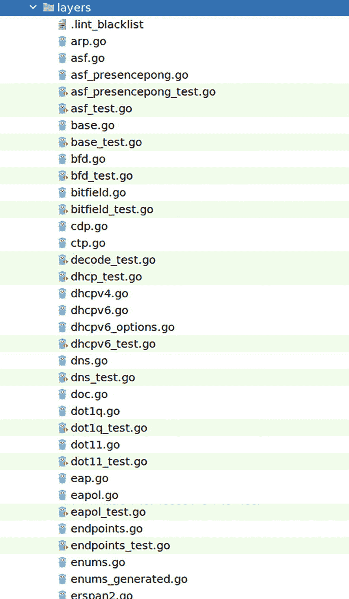
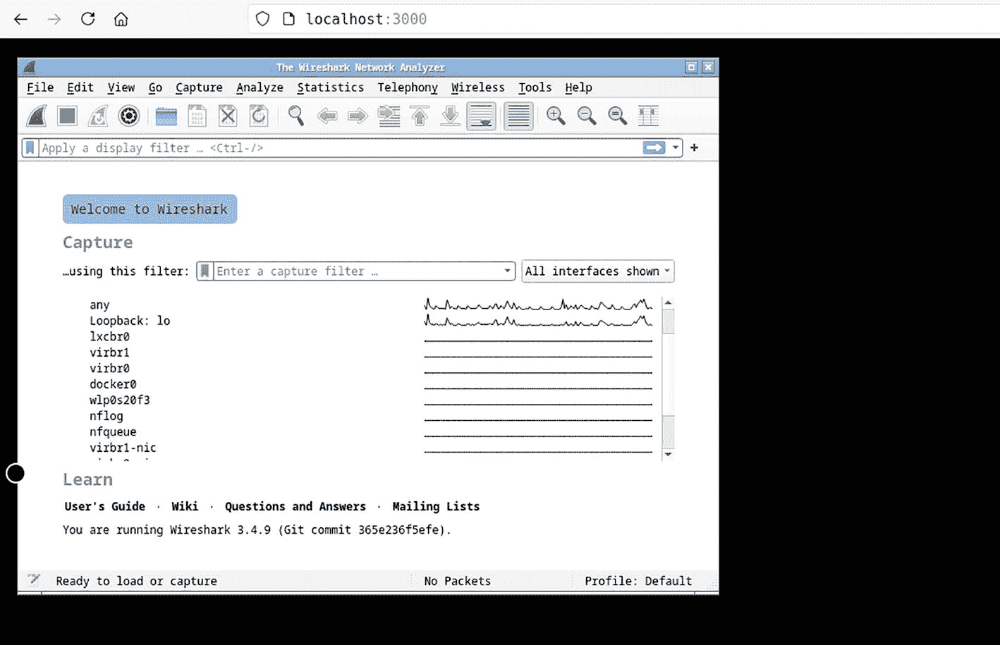
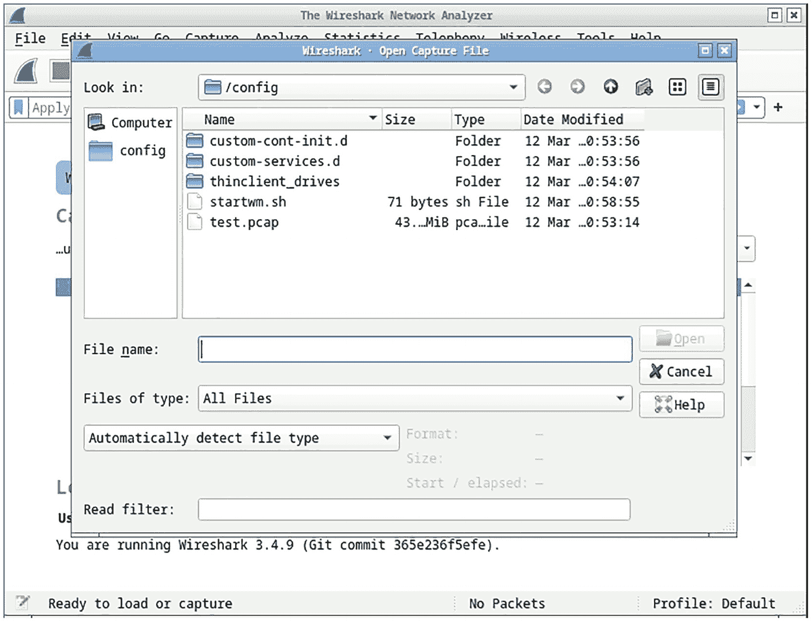
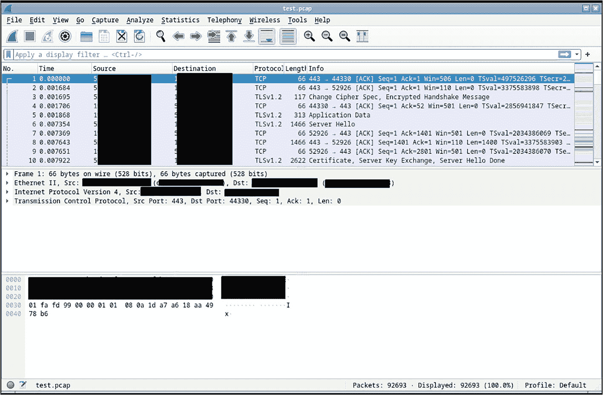

# 11. Google gopacket

在上一章中，你学习了如何使用 Go 标准库构建网络工具。在本章中，你将进一步研究谷歌提供的名为 `gopacket` 的开源网络库。该库的源代码可以在 [`github.com/google/gopacket`](https://github.com/google/gopacket) 找到，库的文档可以在 [`pkg.go.dev/github.com/google/gopacket`](https://pkg.go.dev/github.com/google/gopacket) 找到。你在本章中将要查看的源代码分支是 *master* 分支。

`gopacket` 提供了标准库中无法找到的低层网络数据包操作能力。它为开发者提供了一个简单的 API，用来操作从网络接口获取的不同网络层的信息。在本章中，你将学习：

- `gopacket` 的工作原理
- 如何使用 `gopacket` 编写网络流量嗅探器
- 关于网络捕获文件

### 源代码

本章的源代码可从 [`github.com/Apress/Software-Development-Go`](https://github.com/Apress/Software-Development-Go) 仓库获取。


### gopacket

在本节中，你将探索 `gopacket` 并了解该库的主要部分，以理解其工作原理。该库提供了编写需要捕获和分析网络流量的应用程序的能力。它负责与内核通信以获取所有网络数据，解析数据并将其提供给应用程序使用。`gopacket` 使用了一个长期以来一直是 Linux 工具箱一部分的包捕获 Linux 库，名为 `libpcap`。更多信息可在 [`www.tcpdump.org/index.xhtml`](http://www.tcpdump.org/index.xhtml) 找到。

`libpcap` 库提供了从网卡抓取网络数据包的功能，这些数据包随后被解析并转换为相关协议，以便应用程序轻松使用。`gopacket` 提供了两种主要的可供应用程序使用的数据结构类型，即 `Packet` 和 `Layer`，接下来将详细探讨它们。

#### Layer

在本节中，你将了解 `Layer` 接口。该接口是库中的主要接口，用于保存与原始网络数据相关的数据。该接口定义如下：

```
type Layer interface {
// LayerType 是该层的 gopacket 类型。
LayerType() LayerType
// LayerContents 返回构成该层的字节集合。
LayerContents() []byte
// LayerPayload 返回该层内包含的字节集合，不包括该层本身。
LayerPayload() []byte
}
```

`LayerContents` 包含表示特定层的字节。例如，如果这是一个以太网层，那么它将包含构成以太网帧的字节，而 `LayerPayload` 将包含表示以太网协议的字节。

`LayerType` 定义如下，它包含了该层所代表的类型（例如：以太网、ARP、TCP 等）：

```
type LayerType int64
```

`layertypes.go` 源文件包含了库中支持的不同网络层，如下面的代码片段所示：

```
import (
...
)
var (
LayerTypeARP                          = gopacket.RegisterLayerType(10, gopacket.LayerTypeMetadata{Name: "ARP", Decoder: gopacket.DecodeFunc(decodeARP)})
LayerTypeCiscoDiscovery               = gopacket.RegisterLayerType(11, gopacket.LayerTypeMetadata{Name: "CiscoDiscovery", Decoder: gopacket.DecodeFunc(decodeCiscoDiscovery)})
LayerTypeEthernetCTP                  = gopacket.RegisterLayerType(12, gopacket.LayerTypeMetadata{Name: "EthernetCTP", Decoder: gopacket.DecodeFunc(decodeEthernetCTP)})
...
LayerTypeIPv4                         = gopacket.RegisterLayerType(20, gopacket.LayerTypeMetadata{Name: "IPv4", Decoder:
...
)
```

使用 `Layer` 接口的不同协议可以在 `layers` 目录中找到，如图 11-1 所示。



一张截图展示了 layer 目录中使用 layer 接口的不同协议。

**图 11-1** Layer 结构体实现

`layers` 目录中的源代码包含了每种协议的实现，以及如何从从内核获取的原始字节中读取它们。

##### TCP Layer

让我们看看一个 TCP 协议实现的例子，该实现可以在 `layers/tcp.go` 文件中找到。包含 TCP 协议信息的 TCP 结构体声明如下：

```
type TCP struct {
BaseLayer
SrcPort, DstPort                           TCPPort
Seq                                        uint32
Ack                                        uint32
DataOffset                                 uint8
FIN, SYN, RST, PSH, ACK, URG, ECE, CWR, NS bool
Window                                     uint16
Checksum                                   uint16
Urgent                                     uint16
sPort, dPort                               []byte
Options                                    []TCPOption
Padding                                    []byte
opts                                       [4]TCPOption
tcpipchecksum
}
```

以下代码展示了 `DecodeFromBytes` 函数，它读取原始字节并将其转换为 TCP 结构体：

```
func (tcp *TCP) DecodeFromBytes(data []byte, df gopacket.DecodeFeedback) error {
...
tcp.SrcPort = TCPPort(binary.BigEndian.Uint16(data[0:2]))
tcp.sPort = data[0:2]
tcp.DstPort = TCPPort(binary.BigEndian.Uint16(data[2:4]))
tcp.dPort = data[2:4]
tcp.Seq = binary.BigEndian.Uint32(data[4:8])
tcp.Ack = binary.BigEndian.Uint32(data[8:12])
...
...
}
```

逐个查看每个协议源文件，你将看到该库支持的不同协议的实现。

#### Packet

`Packet` 是你的应用程序将要处理的主要类型。从底层 `libpcap` 库读取的数据将以此处更易于开发者理解的形式呈现。让我们看看定义在 `packet.go` 文件中的 `Packet` 结构体：

```
type Packet interface {
String() string
Dump() string
Layers() []Layer
Layer(LayerType) Layer
LayerClass(LayerClass) Layer
LinkLayer() LinkLayer
NetworkLayer() NetworkLayer
TransportLayer() TransportLayer
ApplicationLayer() ApplicationLayer
ErrorLayer() ErrorLayer
Data() []byte
Metadata() *PacketMetadata
}
```

该结构体包含多个不同的函数，这些函数返回你上一节中看到的不同类型的 `Layer`。为了更好地理解，让我们看看由 `ApplicationLayer()` 函数返回的 `ApplicationLayer` 类型，该类型定义在同一个文件 `packet.go` 中。

```
type ApplicationLayer interface {
Layer
Payload() []byte
}
```

`ApplicationLayer` 是一个接口，它包含了 `Layer` 类型和 `Payload()` 函数，该函数将返回与该特定层相关的网络捕获中的原始字节。下一节你将看到一个关于如何使用 `Packet` 中不同函数的示例。

### 使用 gopacket

在本节中，你将看到如何使用 `gopacket` 的示例。这些示例将为你提供使用该库的思路，并展示该库在读取网络协议方面的能力。

#### pcap

让我们花点时间理解 pcap。它代表包捕获（packet capture）。Linux 拥有允许开发者或系统管理员进行网络故障排除的工具，其中一种工具就是包捕获工具。包捕获工具允许 Linux root 用户捕获机器上的网络流量。

流量数据可以保存到文件中，稍后读取进行分析。这种能力对于在云环境或本地环境中执行审计以及安全和网络故障排除非常有用。在本章中，你将捕获并分析 pcap 文件。

##### 安装 libpcap

代码依赖于一个名为 libpcap 的 Linux 库（[`www.tcpdump.org/manpages/pcap.3pcap.xhtml`](http://www.tcpdump.org/manpages/pcap.3pcap.xhtml)）。这个库是帮助执行网络捕获的主要库。请确保你的本地 Linux 机器上已安装该库。使用以下命令安装该库：

```
sudo apt-get install libpcap-dev
```

安装成功后，你需要重启机器。


好的，作为一名高级文档工程师和翻译员，我将严格遵循您的注意事项和示例，将给定的英文文本翻译为中文。


#### 网络嗅探器

在本节示例中，您将看到一个使用该库的网络嗅探器应用程序示例。示例程序位于 `chapter11/gopacket/sniffer` 文件夹中。示例代码将嗅探您的本地网络并打印出以下信息：

-   IPv4 信息
-   DNS 信息
-   TCP 信息
-   UDP 信息
-   应用层协议信息

在运行应用程序之前，请确保更改以下代码行，以使用您机器上存在的正确网络接口：

```
const (
iface = "enp7s0"
...
)
```

在我的案例中，它叫做 `enp7s0`，可以通过运行 `ifconfig` 工具找到。以下是在我机器上运行 `ifconfig` 的输出结果：

```
enp7s0: flags=4099  mtu 1500
ether ...... txqueuelen 1000  (Ethernet)
RX packets 0  bytes 0 (0.0 B)
RX errors 0  dropped 0  overruns 0  frame 0
TX packets 0  bytes 0 (0.0 B)
TX errors 0  dropped 0 overruns 0  carrier 0  collisions 0
lo: flags=73  mtu 65536
inet 127.0.0.1  netmask 255.0.0.0
......
TX errors 0  dropped 0 overruns 0  carrier 0  collisions 0
wlp6s0: flags=4163  mtu 1500
inet 192.168.1.17  netmask 255.255.255.0  broadcast 192.168.1.255
......
TX errors 239484  dropped 0 overruns 0  carrier 0  collisions 0
device interrupt 18
```

将您的目录切换到 `chapter11/gopacket/sniffer` 文件夹并编译应用程序。

```
go build -o sniffer
```

使用 root 账户运行应用程序。

```
sudo ./sniffer
```

应用程序运行后，您将看到如下输出：

```
2022/03/12 21:11:19 (TCP) Source address : 100.24.164.135, Destination address : 192.168.1.6
2022/03/12 21:11:19 (TCP) From port 443 to 35232
2022/03/12 21:11:19 (TCP) Source address : 192.168.1.6, Destination address : x.x.x.x
2022/03/12 21:11:19 (TCP) From port 35232 to 443
2022/03/12 21:11:20 (TCP) Source address : 192.168.1.6, Destination address : x.x.x.x
2022/03/12 21:11:20 (TCP) From port 45988 to 443
2022/03/12 21:11:20 (TCP) Source address : x.x.x.x, Destination address : x.x.x.x
...
2022/03/12 21:24:03 ----------------------
2022/03/12 21:24:03 (TCP) Source address : x.x.x.x, Destination address : 192.168.1.6
2022/03/12 21:24:03 (TCP) From port 80 to 36910
2022/03/12 21:24:03 HTTP Application layer
2022/03/12 21:24:03 ----------------------
2022/03/12 21:24:03 HTTP/1.1 404 Not Found
Date: Sat, 12 Mar 2022 10:24:03 GMT
Server: Apache/2.4.29 (Ubuntu)
Content-Length: 283
Content-Type: text/html; charset=iso-8859-1
...
2022/03/12 21:24:03 ----------------------
2022/03/12 21:24:03 (TCP) Source address : 192.168.1.6, Destination address : x.x.x.x
2022/03/12 21:24:03 (TCP) From port 36364 to 443
...
```

#### 代码解析

让我们一步一步地查看应用程序的不同部分，以了解它如何使用 `gopacket`。以下代码显示了初始化库以使用指定网络接口嗅探网络流量的过程：

```
func main() {
f, _ := os.Create(fName)
...
handle, err := pcap.OpenLive(iface, sLen, true, -1)
if err != nil {
log.Fatal(err)
}
...
}
```

`pcap.OpenLive` 函数调用 `gopacket` 打开网络设备，传入的 `true` 参数向库指示您希望以混杂模式打开它。

一旦函数无错误返回，它就开始监听传入的数据包并按如下方式处理它们：

```
func main() {
f, _ := os.Create(fName)
...
pSource := gopacket.NewPacketSource(handle, handle.LinkType())
for packet := range pSource.Packets() {
printPacketInfo(packet)
...
}
}
```

正如“数据包”部分所述，应用程序通过 `Packet` 类型与网络数据进行交互。在示例代码中，您创建了一个新的 `PacketSource`，应用程序可以在 `for .. range` 循环中使用它来提取所有传入的数据包，并在 `printPacketInfo(..)` 函数内部处理它们。到目前为止，您已经成功初始化和接收了数据包；现在让我们进一步探讨如何使用 `Packet` 结构体中提供的信息。

以下是 `printPacketInfo(..)` 函数的代码片段，展示了如何使用 `Packet` 结构体检查网络捕获是否包含 HTTP 协议：

```
func printPacketInfo(packet gopacket.Packet) {
...
applicationLayer := packet.ApplicationLayer()
if applicationLayer != nil {
// Search for a string inside the payload
if strings.Contains(string(applicationLayer.Payload()), "HTTP") {
//log.Println("HTTP found!")
log.Println("HTTP Application layer")
log.Println("----------------------")
log.Println(fmt.Sprintf("%s", string(applicationLayer.Payload())))
log.Println("----------------------")
}
}
...
}
```

该代码使用了 `ApplicationLayer()` 函数，该函数指示 `gopacket` 返回与应用层对应的层，这对应 OSI 网络模型的第 7 层。获取后，它将通过检查是否存在 HTTP 字符串来检查该层数据是否是 HTTP 请求。

这展示了该库在访问通过 `Packet` 结构体提供的不同网络层时可以提供的强大功能。


#### 手动分析 pcap 文件

示例代码不仅会打印捕获的网络层信息，还会将其存储在一个名为 `test.pcap` 的文件中。该文件生成于你运行示例代码的目录下；在此示例中，它被存储在 `gopacket/sniffer` 目录内。

该文件包含可通过其他工具查看的原始网络捕获数据。在本节中，你将了解如何使用另一个开源项目来查看捕获的文件，该项目位于 [`https://github.com/mynameiscfed/go-cp-analyzer`](https://github.com/mynameiscfed/go-cp-analyzer)。下载并编译该文件，然后按如下方式运行：

```
./go-cp-analyzer -r /filename.pcap
```

成功运行后，它将输出类似以下内容：

```
+--------------------------------+----------------------+
|      数据包分布统计             |                      |
+--------------------------------+----------------------+
|  <= 66                         | 6474                 |
|  <= 128                        | 5831                 |
|  <= 256                        | 858                  |
|  <= 384                        | 698                  |
|  <= 512                        | 739                  |
|  <= 768                        | 538                  |
|  <= 1024                       | 77                   |
|  <= 1518                       | 3830                 |
|  <= 9000                       | 489                  |
+--------------------------------+----------------------+
+--------------------------------+----------------------+
|         数据包度量指标          |                      |
+--------------------------------+----------------------+
| 总数据包数                     | 19534                |
| 平均数据包大小                 | 446                  |
| 平均数据包数/秒                | 99                   |
| 平均吞吐量 (Mbps)              | 0.36                 |
+--------------------------------+----------------------+
+--------------------------------+----------------------+
|         协议度量指标            |                      |
+--------------------------------+----------------------+
| 以太网                         | 19534                |
| TCP                            | 13019                |
| UDP                            | 6390                 |
| !Ethernet                      | 0                    |
| ARP                            | 11                   |
| IPv4                           | 19419                |
| IPv6                           | 6                    |
| 逻辑链路控制 (LLC)             | 98                   |
+--------------------------------+----------------------+
+--------------------------------+----------------------+
|       连接度量指标              |                      |
+--------------------------------+----------------------+
| TCP 连接数                     | 359                  |
| TCP 连接数/秒 (平均值)         | 1                    |
| TCP 峰值连接数/秒              | 12                   |
| UDP 连接数                     | 138                  |
| UDP 连接数/秒 (平均值)         | 0                    |
| UDP 峰值连接数/秒              | 6                    |
+--------------------------------+----------------------+
```

这表明原始的捕获文件与现有的其他原始网络分析器是兼容的。

#### 使用 WireShark 分析 pcap

在本节中，你将使用 Wireshark 来验证它能否读取你使用示例程序创建的文件，以此证明其兼容性。你将使用 Docker 运行 Wireshark，并通过浏览器加载用户界面。使用以下命令通过 Docker 运行 Wireshark：

```
docker run --name=wireshark --cap-add=NET_ADMIN --security-opt seccomp=unconfined -e PUID=1000 -e PGID=1000 -p 3000:3000 -e TZ=Europe/London -v :/config --restart unless-stopped lscr.io/linuxserver/wireshark:latest
```

将 `<your_directory_that_contains_pcap_file>` 替换为包含 `test.pcap` 文件的本地目录。当 Wireshark 启动并运行后，你将看到类似如下的输出：

```
WARNING: Published ports are discarded when using host network mode
...

_         ()
| |  ___   _    __
| | / __| | |  /  \
| | \__ \ | | | () |
|_| |___/ |_|  \__/
Brought to you by linuxserver.io

To support LSIO projects visit:
https://www.linuxserver.io/donate/

GID/UID

User uid:    1000
User gid:    1000

....
[cont-init.d] done.
[services.d] starting services
[services.d] done.
[guac-init] Auto start not set, application start on login
guacd[429]: INFO:       Guacamole proxy daemon (guacd) version 1.1.0 started
guacd[429]: INFO:       Listening on host 0.0.0.0, port 4822
Starting guacamole-lite websocket server
listening on *:3000
...
```

Wireshark 已准备就绪，正在监听 3000 端口。打开浏览器，输入 `http://localhost:3000`，你将看到如图 11-2 所示的界面。



Wireshark 软件的用户界面截图，展示了文件、编辑、视图、捕获、分析、统计和帮助等工具。弹窗显示“欢迎使用 Wireshark”。

图 11-2

Wireshark 用户界面

通过选择“文件”➤“打开”来打开 `test.pcap` 文件，你将看到如图 11-3 所示的界面。从可用文件列表中选择 `test.pcap` 文件。



Wireshark 软件的用户界面，展示了文件、编辑、视图、捕获、分析、统计和帮助等工具。弹窗代表打开捕获文件的名称。

图 11-3

Wireshark 打开文件选择界面

Wireshark 将成功读取 `test.pcap` 文件并打开它，如图 11-4 所示。



test.pcap 文件的用户界面，展示了文件、编辑、视图、捕获、分析、统计和帮助等工具。

图 11-4

Wireshark 中的 `test.pcap` 文件

在本节中，你验证了由 `gopacket` 执行的网络捕获可以被两种不同的工具成功读取。在下一节中，你将学习如何使用 BPF（伯克利包过滤器）来过滤你感兴趣的网络流量。


#### 使用 BPF 进行捕获

`gopacket` 提供了过滤应用感兴趣的网络流量的能力，这是通过使用 BPF 实现的。BPF 代表伯克利数据包过滤器，它允许应用程序附加一个过滤器来允许或拒绝通过套接字的特定类型数据。更多详细信息可查阅 [www.kernel.org/doc/html/latest/networking/filter.xhtml](http://www.kernel.org/doc/html/latest/networking/filter.xhtml)。

示例代码位于 `chapter11/gopacket/http` 文件夹中。它仅捕获并打印目标端口为 80 的 TCP 流量。按如下方式编译代码：

```
go build -o httponly .
```

使用 root 权限运行代码。将 `<network_device>` 替换为您的本地网络设备。

```
sudo ./httponly -i <network_device>
```

运行成功后，您将看到类似如下的输出。可以看到，它只打印了连接到外部服务器 80 端口的 TCP 流量。

```
2022/03/14 17:10:39 Starting capture on interface "enp0s31f6"
2022/03/14 17:10:39 reading in packets
2022/03/14 17:10:39 -- Extracted Http Data --
2022/03/14 17:10:39 Accept text/*
2022/03/14 17:10:39 If-Modified-Since Thu, 20 May 2021 01:37:53 GMT
2022/03/14 17:10:39 User-Agent Debian APT-HTTP/1.3 (1.9.4)
2022/03/14 17:10:39 Cache-Control max-age=0
2022/03/14 17:10:39 Proto : HTTP/1.1, Host : ppa.launchpad.net, Method : GET, URI : ...
2022/03/14 17:10:39 -------------------------
2022/03/14 17:10:39 Received request from stream 192.168.1.6->x.x.x.x 59494->80 : &{GET ...} with 0 bytes in request body
2022/03/14 17:10:40 -- Extracted Http Data --
2022/03/14 17:10:40 Cache-Control max-age=0
2022/03/14 17:10:40 Accept text/*
2022/03/14 17:10:40 If-Modified-Since Tue, 24 Mar 2020 13:38:15 GMT
2022/03/14 17:10:40 User-Agent Debian APT-HTTP/1.3 (1.9.4)
2022/03/14 17:10:40 Proto : HTTP/1.1, Host : ppa.launchpad.net, Method : GET, URI : ...
2022/03/14 17:10:40 -------------------------
...
```

让我们看一下代码是如何使用 BPF 来过滤网络捕获的。以下代码段展示了您在上一节中学到的内容：如何使用 `gopacket OpenLive` 函数执行数据包捕获：

```
if *fname != "" {
...
} else {
log.Printf("Starting capture on interface %q", *iface)
handle, err = pcap.OpenLive(*iface, int32(*snaplen), true, pcap.BlockForever)
}
...
```

接下来，代码调用 `SetBPFFilter` 函数来指定您想要应用的网络过滤器。

```
var filter = flag.String("f", "tcp and dst port 80", "BPF filter for pcap")
...
func main() {
...
if err := handle.SetBPFFilter(*filter); err != nil {
log.Fatal(err)
}
...
}
```

`filter` 变量包含一条类似英语的简单过滤规则 `tcp and dst port 80`，这意味着它只对访问 80 端口的 TCP 流量感兴趣。这里有关于您可以编写的不同过滤器的更多信息链接：[www.ibm.com/docs/en/qsip/7.4?topic=queries-berkeley-packet-filters](http://www.ibm.com/docs/en/qsip/7.4%253Ftopic%253Dqueries-berkeley-packet-filters)。

代码指定了它想要的过滤器。接下来需要做的是指定 `gopacket` 将用于解析 TCP 原始数据的解析器，这是通过 `httpStreamFactory` 结构体类型完成的，该类型定义了 `New(..)` 和 `run()` 函数。每当有数据可供应用程序消费时，`gopacket` 会在内部调用这两个函数。

```
type httpStreamFactory struct{}
func (h *httpStreamFactory) New(net, transport gopacket.Flow) tcpassembly.Stream {
hstream := &httpStream{
net:       net,
transport: transport,
r:         tcpreader.NewReaderStream(),
}
...
}
func (h *httpStream) run() {
buf := bufio.NewReader(&h.r)
for {
...
}
}
```

`run()` 函数的主要任务是将原始字节组装并解析成更易读的格式进行打印，如下所示：

```
func (h *httpStream) run() {
buf := bufio.NewReader(&h.r)
for {
req, err := http.ReadRequest(buf)
if err == io.EOF {
...
}
...
else {
log.Println("-- Extracted Http Data --")
for k, v := range req.Header {
log.Println(k, v[0])
}
log.Println(fmt.Sprintf("Proto : %s, Host : %s, Method : %s, URI : %s ", req.Proto, req.Host, req.Method, req.RequestURI))
log.Println("-------------------------")
...
}
}
}
```

### 总结

在本章中，您学习了如何使用开源项目 `gopacket` 捕获原始网络。该库通过其简单的公共 API 提供了许多功能。您学习了如何使用该库编写应用程序，以及如何利用不同结构中提供的信息。

您了解了 BPF（伯克利数据包过滤器），并学习如何在代码中使用它，通过 `gopacket` 过滤网络捕获。使用 BPF 允许应用程序只处理它感兴趣的网络捕获，而不是花费时间处理所有传入流量。这使得开发针对特定流量的应用变得更加容易。

