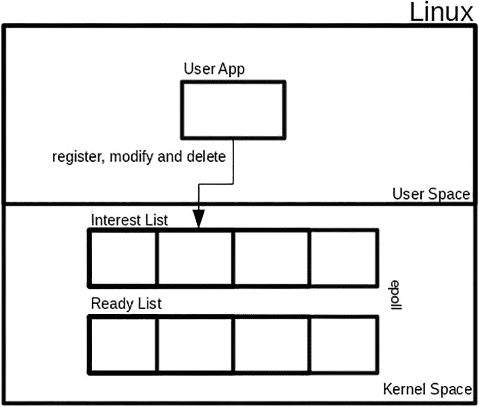
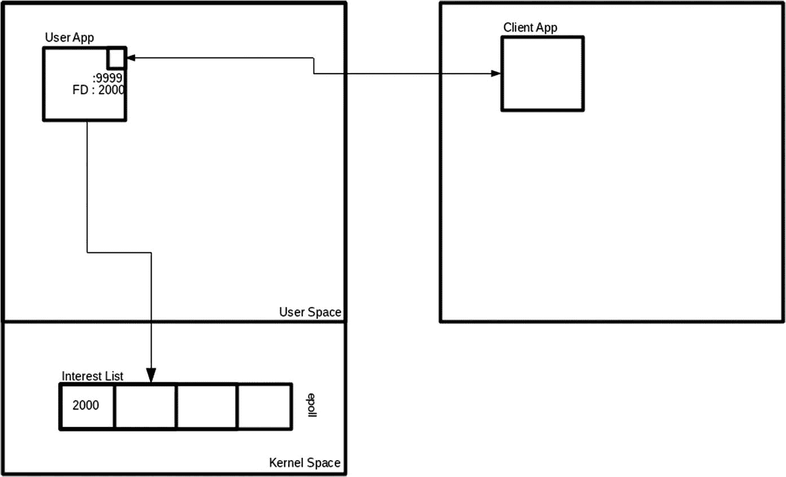
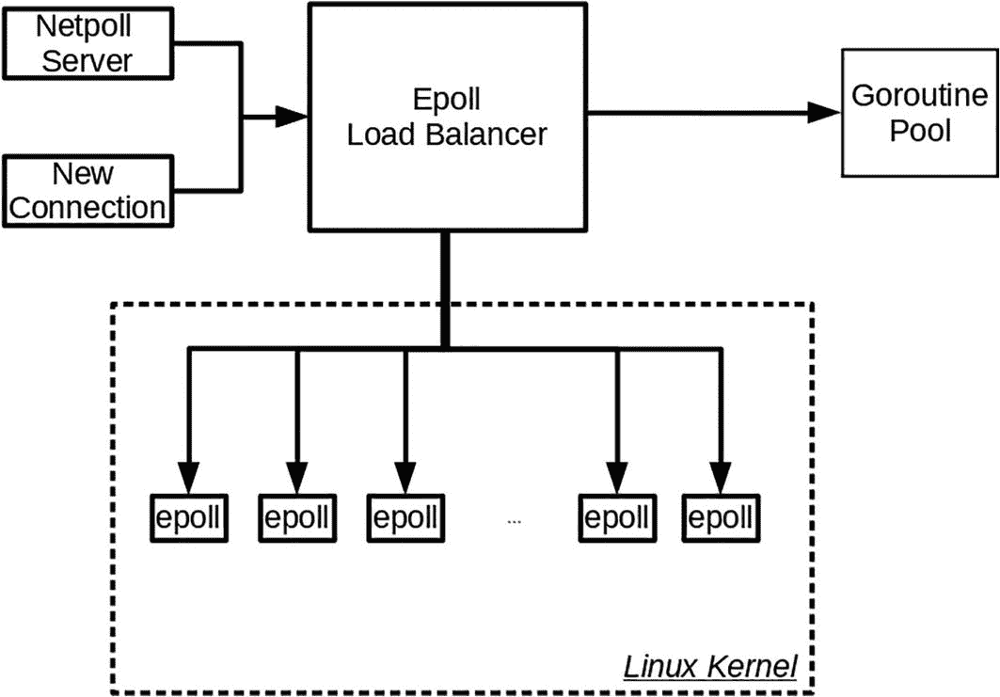
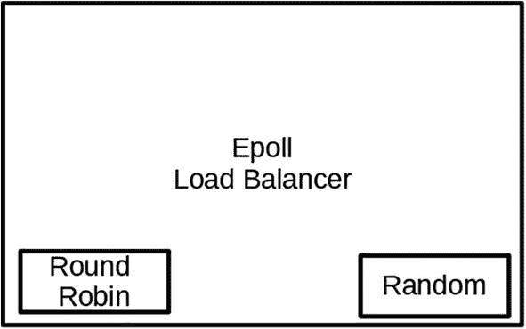

# 12. Epoll 库

构建处理大量网络处理的应用程序需要一种在分布式或云环境中处理连接的特殊方式。得益于 2.5.44 版本中引入的可扩展 I/O 事件通知机制，运行在 Linux 上的应用程序能够做到这一点。在本章中，您将了解 `epoll`。根据 [`linux.die.net/man/7/epoll`](https://linux.die.net/man/7/epoll) 的文档：

epoll API 执行与 [poll](https://man7.org/linux/man-pages/man2/poll.2.xhtml) 类似的任务：监视多个文件描述符，以查看它们中的任何一个是否可以进行 I/O 操作。

您将首先了解什么是 `epoll`，然后继续编写一个简单的应用程序，最后查看 Go 的 `epoll` 库及其工作原理，以及如何在应用程序中使用它。

完成本章后，您将理解以下内容：

*   `epoll` 在 Linux 中如何工作
*   如何编写一个使用 `epoll` API 的 Go 应用程序
*   `epoll` 库如何工作
*   如何编写一个使用 `epoll` 库的 Go 应用程序

### 源代码

本章的源代码可从 [`github.com/Apress/Software-Development-Go`](https://github.com/Apress/Software-Development-Go) 仓库获取。


### 理解 epoll

在本节中，你将首先从系统角度了解 `epoll` 是什么。在 Linux 中打开一个套接字时，你会获得一个文件描述符（简称 FD），它是一个非负值。当用户应用程序要对套接字执行 I/O 操作时，它会将 FD 传递给内核。`epoll` 机制是**事件驱动**的，因此当 I/O 操作发生时，用户应用程序会收到通知。

如图 12-1 所示，`epoll` 实际上是 Linux 内部的一种数据结构，用于在多个文件描述符上复用 I/O 操作。Linux 提供了系统调用，供用户应用程序在此数据结构中注册、修改或删除 FD。另需注意，`epoll` 具有 Linux 特有特性，这意味着应用程序只能运行在基于 Linux 内核的操作系统上。



框图包含用户空间和内核空间两个模块。用户空间包括一个用户应用程序，用于注册、修改和删除，连接到两个矩形块（即兴趣列表和就绪列表）。

**图 12-1** epoll 数据结构

该数据结构包含两组列表：

*   **兴趣列表**：此列表/集合包含应用程序感兴趣的 FD。内核将仅发送与应用程序感兴趣的特定 FD 相关的事件。
*   **就绪列表**：此列表/集合包含来自兴趣列表 FD 的引用 FD 子集。此列表中的 FD 处于**就绪**状态，用户应用程序将收到通知。

以下是应用程序用于与该数据结构配合使用的系统调用。在后续章节中，你将详细了解如何在应用程序中以及在 `epoll` 库内部使用它们。

*   `epoll_create`：一个系统调用，用于创建新的 `epoll` 实例并返回一个文件描述符。
*   `epoll_ctl`：一个系统调用，用于在兴趣列表中注册、修改和删除 FD。
*   `epoll_wait`：一个系统调用，用于等待 I/O 事件，或者用于从就绪列表中获取就绪项。

要在应用程序中有效使用 `epoll`，你需要了解事件分发是如何执行的。简单来说，有两种不同的方式将事件分发给应用程序：

*   **边缘触发**：配置为边缘触发的被监控 FD，如果自上次调用 `epoll_wait` 以来就绪状态发生了变化，则保证收到一次通知。应用程序将收到一个事件，如果需要更多事件，它必须通过系统调用执行操作，以通知 `epoll` 它正在等待更多事件。
*   **水平触发**：配置为水平触发的被监控 FD 会批量处理为单个通知，应用程序可以一次性处理所有事件。

由上可知，显然*边缘触发*相比*水平触发*需要应用程序做更多工作。默认情况下，`epoll` 使用水平触发机制运行。

### Golang 中的 epoll

在本节中，你将编写一个使用 `epoll` 的简单应用程序。该应用是一个回显服务器，接收连接并将响应发送回发送给它的值。

在 `chapter12/epolling/epollecho` 文件夹中运行代码。打开终端并运行以下命令：

```
go run main.go
```

应用运行后，打开另一个终端并使用 `nc`（网络连接）工具连接到该应用。在控制台中输入一些内容并按回车键。这将被发送到服务器。

```
nc 127.0.0.1 9999
```

示例应用将通过返回客户端发送的字符串进行响应。在深入代码之前，让我们先看看 `epoll` 在应用程序中是如何使用的。

#### Epoll 注册

如图 12-2 所示，应用程序在端口 9999 上创建一个监听器，用于监听传入的连接。当客户端连接到该端口时，应用程序会启动一个 goroutine 来处理客户端连接。



框图包含两个模块。客户端应用程序通过 FD 值 2000 与用户空间模块中的用户应用程序双向连接。用户应用程序连接到内核空间中的兴趣列表模块。

**图 12-2** 监听器 epoll 注册

现在，让我们更详细地了解整个机制在应用内部是如何运作的。以下代码片段展示了应用程序使用 `syscall.Socket` 系统调用创建套接字监听器，并使用 `syscall.Bind` 将其绑定到端口 9999：

```
...
fd, err := syscall.Socket(syscall.AF_INET, syscall.O_NONBLOCK|syscall.SOCK_STREAM, 0)
if err != nil {
fmt.Println("Socket err : ", err)
os.Exit(1)
}
defer syscall.Close(fd)
if err = syscall.SetNonblock(fd, true); err != nil {
...
}
// 准备监听器
addr := syscall.SockaddrInet4{Port: 9999}
copy(addr.Addr[:], net.ParseIP("127.0.0.1").To4())
err = syscall.Bind(fd, &addr)
...
// 监听器
err = syscall.Listen(fd, 10)
...
...
```

成功监听端口后，应用程序通过调用 `syscall.EpollCreate1` 创建一个新的 `epoll`。这会指示内核准备一个数据结构，应用程序将使用该数据结构来监听其感兴趣的文件描述符的 I/O 事件。

```
...
epfd, e := syscall.EpollCreate1(0)
if e != nil {
...
}
...
```

数据结构成功创建后，应用程序会继续注册套接字监听器文件描述符，如下代码片段所示。代码使用 `syscall.EPOLL_CTL_ADD` 向系统调用指定它要进行新的注册。

注册基于在 `event` 结构体中提供的信息进行，该结构体包含文件描述符和它感兴趣的监控事件。

应用程序使用 `EPOLLIN` 标志表明它只对读取事件感兴趣。`epoll` 文档（位于 `https://man7.org/linux/man-pages/man2/epoll_ctl.2.xhtml`）提供了可为 `event.Events` 字段设置的不同标志的详细信息。

```
// 将监听器 fd 注册到兴趣列表
event.Events = syscall.EPOLLIN
event.Fd = int32(fd)
if e = syscall.EpollCtl(epfd, syscall.EPOLL_CTL_ADD, fd, &event); e != nil {
...
}
```


#### Epoll 等待

注册的最后一步是调用 `syscall.EpollWait` 来等待来自内核的传入事件，该调用被封装在一个 `for {}` 循环中，如下代码片段所示。传递给系统作为超时参数的 `-1` 表示应用程序将无限期等待，直到内核准备好传递事件。

```go
for {
n, err := syscall.EpollWait(epfd, events[:], -1)
...
}
```

当应用程序接收到事件时，它会遍历接收到的事件数量开始处理，如下所示：

```go
for {
n, err := syscall.EpollWait(epfd, events[:], -1)
...
// 遍历事件
for ev := 0; ev < n; ev++ {
...
}
}
```

接收到的事件包含了系统生成的事件类型及其对应的文件描述符。代码利用这些信息来检查是否有新的客户端连接。这是通过检查接收到的文件描述符是否与监听器的文件描述符相同来完成的；如果相同，则会使用监听器的 FD 调用 `syscall.Accept` 来接受连接。

一旦它为客户端连接获取了新的 FD，代码也会使用 `EpollCtl` 并带有 `EPOLL_CTL_ADD` 标志将其注册到 `epoll` 中。完成后，监听器的 FD 和客户端连接的 FD 都注册在 `epoll` 中，应用程序就可以对两者进行多路复用 I/O 操作。

```go
for {
n, err := syscall.EpollWait(epfd, events[:], -1)
...
// 遍历事件
for ev := 0; ev < n; ev++ {
// 如果与监听器相同，则接受连接
if int(events[ev].Fd) == fd {
connFd, _, err := syscall.Accept(fd)
...
// 新连接应为非阻塞
syscall.SetNonblock(fd, true)
event.Events = syscall.EPOLLIN
event.Fd = int32(connFd)
// 将新的客户端连接 fd 注册到兴趣列表
if err := syscall.EpollCtl(epfd, syscall.EPOLL_CTL_ADD, connFd, &event); err != nil {
log.Print("EpollCtl err : ", connFd, err)
os.Exit(1)
}
} else {
...
}
}
}
```

最后一步，当代码检测到从事件接收到的 FD 与监听器的 FD 不同时，它会派生一个 goroutine 来处理该连接，该 goroutine 会将从客户端接收到的数据原样返回。

### Epoll 库

你已经了解了 `epoll` 是什么，并创建了一个使用它的应用程序。编写一个使用 `epoll` 的应用程序需要编写大量重复的代码，用于处理接受连接、读取请求、注册文件描述符等。

使用开源库有助于编写更好的应用程序，因为该库处理了 `epoll` 所需的繁重工作。在本节中，你将研究 `netpoll` ([`http://github.com/cloudwego/netpoll`](http://github.com/cloudwego/netpoll))。你将使用该库创建一个应用程序，并了解该库如何在内部处理 `epoll`。

代码可以在 `chapter12/epolling/netpoll` 文件夹中找到。它是一个回显服务器，将接收到的请求作为响应发送给用户。

```go
import (
...
"github.com/cloudwego/netpoll"
)
func main() {
listener, err := netpoll.CreateListener("tcp", "127.0.0.1:8000")
if err != nil {
panic("Failure to create listener")
}
var opts = []netpoll.Option{
netpoll.WithIdleTimeout(1 * time.Second),
netpoll.WithIdleTimeout(10 * time.Minute),
}
eventLoop, err := netpoll.NewEventLoop(echoHandler, opts...)
if err != nil {
panic("Failure to create netpoll")
}
err = eventLoop.Serve(listener)
if err != nil {
panic("Failure to run netpoll")
}
}
...
```

这段代码展示了使用库中的 `CreateListener` 创建一个套接字监听器来监听 8000 端口。成功打开监听器后，代码继续配置 `netpoll`，包括指定超时和指定处理传入请求的 `echoHandler` 函数。代码通过调用 `netpoll` 的 `Serve` 函数开始监听传入的请求。

`echoHandler` 函数使用传入参数 `netpoll.Connection` 处理来自客户端套接字连接的读写操作。该函数使用 `connection.Reader()` 进行读取，并使用 `connection.Write()` 进行写入。

```go
func echoHandler(ctx context.Context, connection netpoll.Connection) error {
reader := connection.Reader()
bts, err := reader.Next(reader.Len())
if err != nil {
log.Println("error reading data")
return err
}
log.Println(fmt.Sprintf("Data: %s", string(bts)))
connection.Write([]byte("-> " + string(bts)))
return connection.Writer().Flush()
}
```

你可以看到，使用 `netpoll` 库编写的代码比上一节中看到的代码更容易阅读。大量繁重的工作由库执行；在编写高性能网络代码时，它还能提供更多功能和稳定性。让我们看看 `netpoll` 在幕后是如何工作的。图 12-3 从高层次展示了 `netpoll` 的不同组件。



网络轮询服务器和新连接的流程图展示了 Epoll 负载均衡器，包括 Linux 内核下的 epoll 块，最后连接到 goroutine 池。

**图 12-3** netpoll 高级架构

该库会创建多个 `epoll`，并将 CPU 数量用作它将创建的 `epoll` 总数。在内部，它使用负载均衡策略来决定文件描述符将注册到哪个 `epoll`。

当库接收到新连接或 `netpoll` 服务器首次运行时，它会将文件描述符注册到 `epoll`，并使用随机或轮询负载均衡机制来决定使用哪个 epoll，如图 12-4 所示。可以在应用程序中使用以下函数调用来修改负载均衡器类型：



Epoll 负载均衡器的框图包括两个小框，分别代表轮询和随机。

**图 12-4** netpoll 负载均衡器

```go
netpoll.SetLoadBalance(netpoll.Random)
netpoll.SetLoadBalance(netpoll.RoundRobin)
```

该库通过使用 goroutine 来处理大流量。这是通过内部使用 goroutine 池化机制来实现的。开发人员只需专注于确保他们的应用程序和基础设施能够正确扩展。

### 总结

在本章中，你了解了使用 `epoll` 编写应用程序的不同方法。利用之前从第 2 章学到的关于系统调用的知识，你使用标准库构建了一个基于 `epoll` 的应用程序。你了解到设计和编写 `epoll` 网络应用程序与普通的网络应用程序不同。你深入研究了 `epoll` 库，并学会了如何使用它来编写网络应用程序。同时，你也了解了该库的内部工作原理。

