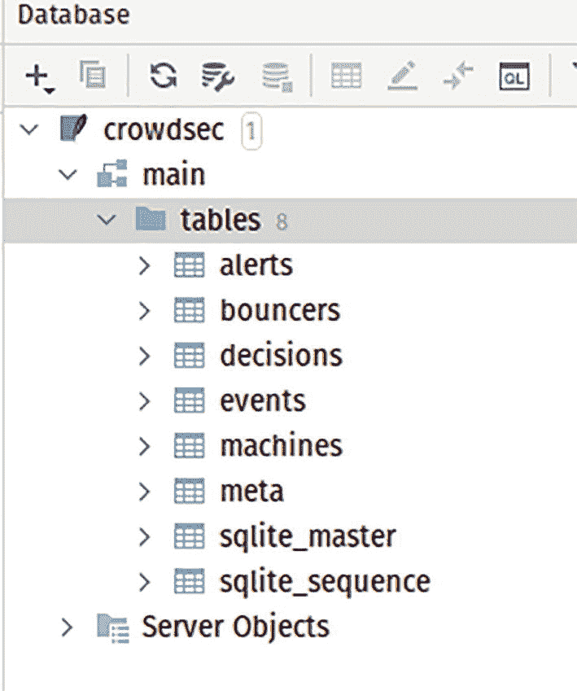
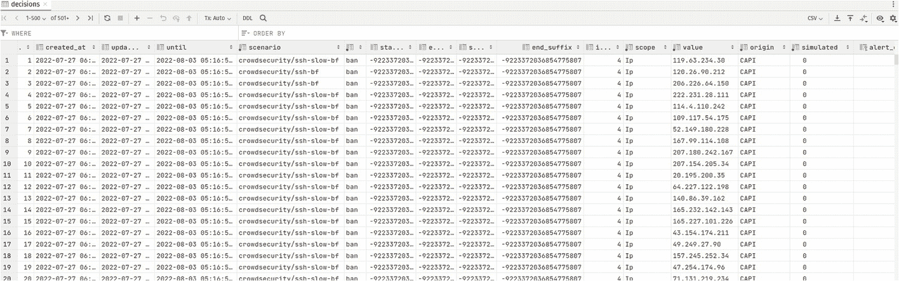
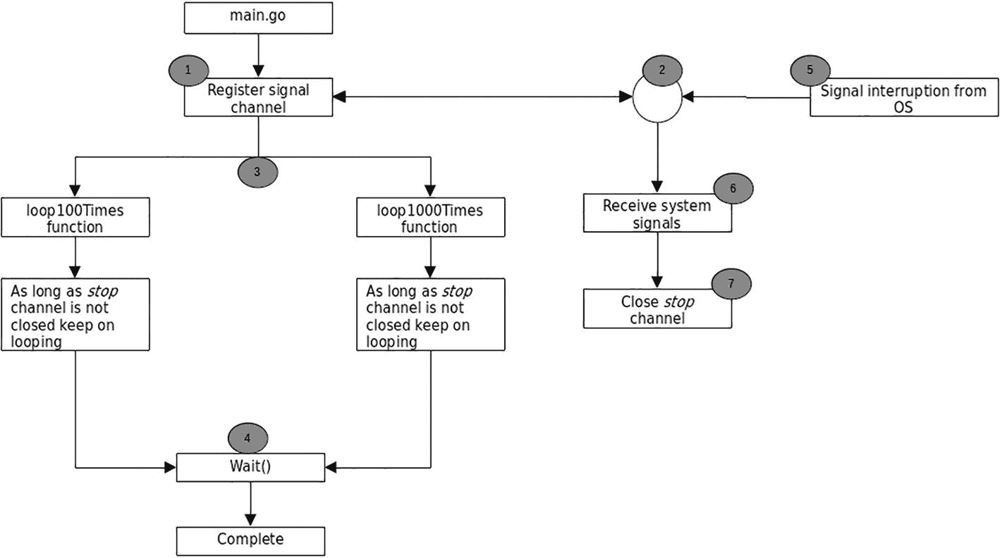
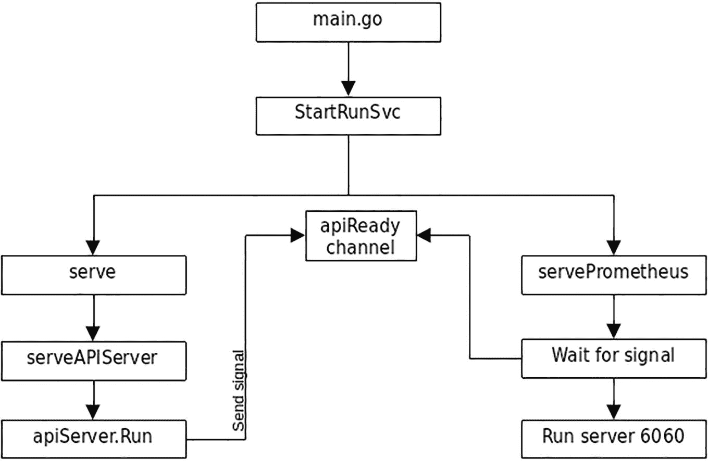

# 14. CrowdSec

在本章中，你将了解一个名为 CrowdSec（`https://github.com/crowdsecurity/crowdsec`）的开源安全工具。研究这个工具之所以有趣，有几个原因：

-   它利用众包数据收集全球范围内的 IP 信息，并与社区共享。
-   它提供了值得查看和学习的代码设计。
-   GeoIP 数据库本身也很有趣。

本章分为安装部分和学习部分。在安装部分，你将了解如何安装 CrowdSec，以理解其工作原理。在学习部分，你将深入探讨 CrowdSec 如何实现某些功能，并通过查看示例代码从中学习。

### 源代码

本章的源代码可从 `https://github.com/Apress/Software-Development-Go` 仓库获取。

### CrowdSec 项目

文档（`https://doc.crowdsec.net/docs/intro`）很好地解释了它：

CrowdSec 是一个开源、轻量级的软件，它允许你检测具有恶意行为的对等节点，并在不同层级（基础设施层、系统层、应用层）阻止它们访问你的系统。

CrowdSec 作为一个开源安全工具，提供了相当多的功能，非常适合在云环境中使用。这个工具最吸引人的地方在于社区收集的数据。这种众包数据使得 CrowdSec 能够判断某个特定 IP 地址是否应该被禁止，或者是否应该被允许进入你的基础设施。

你将从这个项目中学到许多架构和代码设计，这些内容将在“从 CrowdSec 中学习”一节中进一步探讨。


#### 使用 CrowdSec

我不会介绍 CrowdSec 的完整安装过程，而是介绍一个最小化安装步骤，帮助你理解学习“从 CrowdSec 中学习”这一节所需要的内容。本次安装的目标是让你能够看到中央服务器复制到本地数据库的社区数据。

创建一个空目录来执行以下步骤。在我的本地安装中，我在 `/home/nanik/GolandPojects/crowdsec` 下创建了一个新目录。请按照以下步骤操作：

- 从 GitHub 下载发布版本。本节使用 Linux 版的 v1.4.1，通过以下命令下载：
  
  ```
  wget https://github.com/crowdsecurity/crowdsec/releases/download/v1.4.1/crowdsec-release.tgz
  ```

- 下载完成后，使用 `gunzip` 和 `tar` 解压，如下所示：
  
  ```
  gunzip ./crowdsec-release.tgz && tar -xvf crowdsec-release.tar
  ```

- 将创建一个名为 `crowdsec-v1.4.1` 的新目录，如下所示：
  
  ```
  └── crowdsec-v1.4.1
      ├── cmd
      ├── config
      ├── plugins
      ├── test_env.ps1
      ├── test_env.sh
      └── wizard.sh
  ```

- 切换到 `crowdsec-v1.4.1` 目录，并运行 `test_env.sh` 命令。
  
  ```
  ./test_env.sh
  ```

让脚本运行。这需要一些时间，因为它会下载一些东西。你会看到类似下面的输出：

```
[07/27/2022:03:50:14 PM][INFO] Creating test arboresence in /home/nanik/GolandProjects/crowdsec/crowdsec-v1.4.1/tests
[07/27/2022:03:50:14 PM][INFO] Arboresence created
[07/27/2022:03:50:14 PM][INFO] Copying needed files for tests environment
[07/27/2022:03:50:15 PM][INFO] Files copied
...
INFO[27-07-2022 03:50:15 PM] Machine 'test' successfully added to the local API
INFO[27-07-2022 03:50:15 PM] API credentials dumped to '/home/nanik/GolandProjects/crowdsec/crowdsec-v1.4.1/tests/config/local_api_credentials.yaml'
INFO[27-07-2022 03:50:15 PM] Wrote new 438269 bytes index to /home/nanik/GolandProjects/crowdsec/crowdsec-v1.4.1/tests/config/hub/.index.json
INFO[27-07-2022 03:50:16 PM] crowdsecurity/syslog-logs : OK
INFO[27-07-2022 03:50:16 PM] Enabled parsers : crowdsecurity/syslog-logs
INFO[27-07-2022 03:50:16 PM] crowdsecurity/geoip-enrich : OK
INFO[27-07-2022 03:50:16 PM] downloading data 'https://crowdsec-statics-assets.s3-eu-west-1.amazonaws.com/GeoLite2-City.mmdb' in '/home/nanik/GolandProjects/crowdsec/crowdsec-v1.4.1/tests/data/GeoLite2-City.mmdb'
INFO[27-07-2022 03:51:25 PM] downloading data 'https://crowdsec-statics-assets.s3-eu-west-1.amazonaws.com/GeoLite2-ASN.mmdb' in '/home/nanik/GolandProjects/crowdsec/crowdsec-v1.4.1/tests/data/GeoLite2-ASN.mmdb'
INFO[27-07-2022 03:51:41 PM] Enabled parsers : crowdsecurity/geoip-enrich
INFO[27-07-2022 03:51:41 PM] crowdsecurity/dateparse-enrich : OK
INFO[27-07-2022 03:51:41 PM] Enabled parsers : crowdsecurity/dateparse-enrich
...
```

该脚本会创建一个名为 `tests` 的新目录，其中包含 CrowdSec 的完整测试环境。该目录结构如下所示：

```
nanik@nanik:~/GolandProjects/crowdsec/crowdsec-v1.4.1$ tree -L 2 ./tests/
./tests/
├── config
│   ├── acquis.yaml
│   ├── collections
│   ├── crowdsec-cli
│   ├── hub
...
│   ├── scenarios
│   └── simulation.yaml
├── crowdsec
├── cscli
├── data
│   ├── crowdsec.db
│   ├── GeoLite2-ASN.mmdb
│   └── GeoLite2-City.mmdb
├── dev.yaml
├── logs
└── plugins
    ├── notification-email
...
    └── notification-splunk
```

该目录包含多种文件，包括 CrowdSec 命令行工具 `crowdsec` 和 `cscli`，以及一个名为 `data` 的文件夹，你将在下一节中详细了解它。扩展名为 `.mmdb` 的数据库是你在“GeoIP 数据库”一节中将要详细研究的数据库。

#### crowdsec.db

CrowdSec 将数据存储在一个名为 `crowdsec.db` 的 SQLite 数据库中。该数据库包含多个表，如图 14-1 所示。



**图 14-1** CrowdSec 数据库

测试环境在创建数据库时不会填充任何数据，因此你需要设置环境使其与中央服务器同步。为此，你需要首先使用 `cscli` 工具向 CrowdSec 服务器注册，详见文档 [`https://docs.crowdsec.net/docs/cscli/cscli_capi_register/`](https://docs.crowdsec.net/docs/cscli/cscli_capi_register/)。打开终端，切换到 `tests` 目录，并执行以下命令：

```
./cscli capi register -c ./dev.yaml
```

你会看到类似下面的输出：

```
WARN[27-07-2022 04:10:11 PM] can't load CAPI credentials from './config/online_api_credentials.yaml' (missing field)
INFO[27-07-2022 04:10:11 PM] push and pull to Central API disabled
INFO[27-07-2022 04:10:13 PM] Successfully registered to Central API (CAPI)
INFO[27-07-2022 04:10:13 PM] Central API credentials dumped to './config/online_api_credentials.yaml'
...
```

使用 `cscli` 命令行工具，你必须注册到中央服务器。`online_api_credentials.yaml` 文件会被填充注册详情，内容如下：

```
url: https://api.crowdsec.net/
login: 
password: 
```

现在，你可以用中央服务器的数据填充你的数据库了。使用以下命令：

```
./crowdsec -c ./dev.yaml
```

你会看到类似下面的输出：

```
...
INFO[27-07-2022 16:16:45] Crowdsec v1.4.1-linux-e1954adc325baa9e3420c324caabd50b7074dd77
WARN[27-07-2022 16:16:45] prometheus is enabled, but the listen address is empty, using '127.0.0.1'
WARN[27-07-2022 16:16:45] prometheus is enabled, but the listen port is empty, using '6060'
INFO[27-07-2022 16:16:45] Loading prometheus collectors
INFO[27-07-2022 16:16:45] Loading CAPI pusher
INFO[27-07-2022 16:16:45] CrowdSec Local API listening on 127.0.0.1:8081
INFO[27-07-2022 16:16:45] Start push to CrowdSec Central API (interval: 30s)
INFO[27-07-2022 16:16:45] Start pull from CrowdSec Central API (interval: 2h0m0s)
INFO[27-07-2022 16:16:45] Loading grok library /home/nanik/GolandProjects/crowdsec/crowdsec-v1.4.1/tests/config/patterns
INFO[27-07-2022 16:16:46] Loading enrich plugins
INFO[27-07-2022 16:16:46] Successfully registered enricher 'GeoIpCity'
...
INFO[27-07-2022 16:16:46] Loading parsers from 4 files
...
INFO[27-07-2022 16:16:47] capi metrics: metrics sent successfully
INFO[27-07-2022 16:16:47] Start send metrics to CrowdSec Central API (interval: 30m0s)
INFO[27-07-2022 16:16:54] capi/community-blocklist : 0 explicit deletions
INFO[27-07-2022 16:17:15] crowdsecurity/community-blocklist : added 8761 entries, deleted 0 entries (alert:1)
```

注意最后一条日志消息显示了 **added 8761 entries**，这意味着它向你的数据库添加了 8761 条记录。如果你没有收到此消息，请重新运行 `crowdsec` 命令。

查看 `decisions` 表，你会看到填充后的数据，如图 14-2 所示。



**图 14-2** decisions 表中的数据

该表包含了一些有趣的信息：

- 被禁止的 IP 地址
- 特定 IP 被禁止的截止日期
- 检测到 IP 地址的场景

你已经简要了解了如何设置 CrowdSec，并看到了它使用的数据。在下一节中，你将了解 CrowdSec 中一些有趣的部分。你将研究 CrowdSec 内部某些功能的实现方式，然后查看一个更简单的代码示例，了解如何实现这些功能。


### 从 CrowdSec 中学习

CrowdSec 作为一个项目相当复杂，它包含了许多值得学习的、非常有趣的内容。在本节中，你将了解 CrowdSec 内部使用的一些有用主题。这些主题同样适用于使用 Go 语言设计自己的软件。

#### 系统信号处理

作为一个系统，CrowdSec 提供了广泛的功能列表，这些功能被分解为多个不同的模块。将功能分解为模块的原因是为了便于开发、维护和测试。在构建系统时，要记住的关键事项之一是确保所有不同的模块都能够优雅地终止，并且所有资源（如内存、网络连接和磁盘空间）都能被释放。为了确保系统的不同部分能正确关闭，你需要某种协调通信机制，以便了解各个模块何时需要为关闭过程做准备。

想象一个场景：你正在设计一个应用程序，它因某些资源限制而被操作系统终止。应用程序必须意识到这一点，并具备在自身永久关闭之前，独立关闭所有不同模块的能力。你将通过 `chapter14/signalhandler` 文件夹中的代码示例，了解如何实现这一点。

打开你的终端，并按如下方式运行该示例：

```
go run main.go
```

应用程序将持续运行，在终端上打印循环消息，直到你按下 Ctrl+C 将其停止。然后它将打印出以下内容：

```
2022/07/24 22:31:32 loop1000Times -  0
2022/07/24 22:31:32 loop100Times -  0
2022/07/24 22:31:32 loop100Times -  1
...
2022/07/24 22:31:32 loop1000Times -  14
2022/07/24 22:31:33 loop1000Times -  15
2022/07/24 22:31:33 loop100Times -  15
^C2022/07/24 22:31:33 SIGTERM received
2022/07/24 22:31:33 loop1000Times - quit
2022/07/24 22:31:33 loop100Times - quit
2022/07/24 22:31:33 Complete!
```

由于检测到了 Ctrl+C 组合键，应用程序成功实现了优雅关闭。在查看代码之前，图 14-3 展示了应用程序的设计。当你浏览示例代码时，请将图 14-3 作为指导。



CrowdSec 系统的流程图从 `main.go` 开始，然后注册信号通道，之后分叉为循环 100 次和 1000 次的函数，最后等待函数完成。

**图 14-3** CrowdSec 系统信号处理

以下代码片段展示了如何使用 Go 内置的 `os/signal` 包来注册系统中断事件（步骤 1）。调用了 `signal.Notify(..)` 函数，传入了将要注册监听的信号。在示例代码中，注册了 `SIGHUP`、`SIGTERM` 和 `SIGINT`。

```
func main() {
signalChan := make(chan os.Signal, 1)
signal.Notify(signalChan,
syscall.SIGHUP,
syscall.SIGTERM,
syscall.SIGINT)
...
go func() {
for {
s := <-signalChan
switch s {
case syscall.SIGHUP, syscall.SIGINT, syscall.SIGTERM:
...
}
}
}()
...
}
```

以下是对这些信号含义的解释：

- `SIGHUP`：当用于执行应用程序的终端断开、关闭或损坏时，操作系统发送此信号。
- `SIGTERM`：这是一个通用信号，操作系统用它来指示终止进程或应用程序。
- `SIGINT`：这也被称为程序中断信号，当检测到 Ctrl+C 组合键时会产生此信号。

代码监听所有这些信号，以确保如果检测到其中任何一个，它都会履行其职责，正确地关闭自己。

`signalChan` 变量是一个接受 `os.Signal` 类型的通道，并在调用 `signal.Notify()` 时作为参数传入。该 goroutine 负责在 `for{}` 循环中处理从库接收到的信号（步骤 2）。接收到信号（步骤 6）意味着发生了中断，因此代码必须采取必要步骤来启动关闭流程（步骤 7）。

现在，代码已准备好接收系统事件，并且知道在接收到事件时应该做什么，让我们来看看其他模块或 goroutine 是如何获知这一情况的。示例代码生成了两个 goroutine，如下所示：

```
func main() {
...
wg.Add(2)
go loop100Times(stop, &wg)
go loop1000Times(stop, &wg)
wg.Wait()
log.Println("Complete!")
}
```

`loop100Times` 和 `loop1000Times` 作为 goroutine 被调用（步骤 3），并传递了两个参数：`stop` 和 `wg`。`stop` 变量是一个通道变量，goroutine 函数通过它来了解何时需要停止处理。以下代码片段展示了关闭 `stop` 通道的代码：

```
func main() {
...
go func() {
for {
...
switch s {
case syscall.SIGHUP, syscall.SIGINT, syscall.SIGTERM:
...
close(stop)
...
}
}
}()
...
}
```

`close(stop)` 函数关闭了通道，任何正在检查此通道的应用程序部分都会检测到通道上有活动发生，并据此采取行动。检查 `stop` 通道的代码可以在以下代码片段中看到：

```
func loop100Times(stop <-chan string, wg *sync.WaitGroup) {
...
for {
select {
case <-stop:
log.Println("loop100Times - quit")
return
default:
...
}
}
}
```

`loop100Times` 函数在一个 `for{}` 循环内运行，在 `select{}` 语句中检查通道条件。为了便于理解，基本上 `for{ select {} }` 代码块可以翻译为：

持续执行 `for` 循环，并在每次循环时检查以下情况：

- `stop` 通道是否有值可读？如果有，则必须停止处理。
- 否则，只需向控制台打印信息并递增计数器。

相同的逻辑也用于 `loop1000Times` 函数，因此其工作原理完全相同。一旦 `stop` 通道关闭，这两个函数都将停止处理，并将计数器值打印到终端。通过通知代码的不同部分系统正在关闭，应用程序实现了优雅关闭自身的状态。

最后要查看的是等待状态（步骤 4）。现在，不同的 goroutine 知道何时关闭，但应用程序只有在 *所有* goroutine 完成其进程后，才能完全关闭自身。这是通过使用 `sync.WaitGroup` 实现的。以下代码片段展示了 `WaitGroup` 的用法：

```
package main
import (
...
)
func main() {
...
var wg sync.WaitGroup
...
wg.Add(2)
go loop100Times(stop, &wg)
go loop1000Times(stop, &wg)
wg.Wait()
log.Println("Complete!")
}
func loop100Times(stop <-chan string, wg *sync.WaitGroup) {
...
defer wg.Done()
for {
...
}
}
func loop1000Times(stop <-chan string, wg *sync.WaitGroup) {
...
defer wg.Done()
for {
...
}
}
```


#### 处理服务依赖关系

像 CrowdSec 这样的复杂应用包含多个同时运行或按计划运行的服务。为了让服务正常运行，需要进行服务协调，以处理服务之间的依赖关系。

图 14-4 展示了 CrowdSec 内部如何使用通道（channel）进行服务协调。



服务协调器的流程图从 `main.go` 开始，然后进入 `startRunSvc`，之后分为两类：`serve`、`servePrometheus`、`serveAPIServer`，并等待信号。

**图 14-4**  
服务协调

在图 14-4 中，当 CrowdSec 启动时，`apiReady` 通道是服务协调的核心部分。该图显示，`apiServer.Run` 函数向 `apiReady` 通道发送一个信号，这允许另一个服务 `servePrometheus` 运行监听端口 6060 的服务器。

以下代码片段展示了 `StartRunSvc` 函数将 `servePrometheus` 作为一个 goroutine 运行，并传入 `apiReady` 通道，同时在调用 `Serve` 函数时也传入了同一个通道：

```
package main

import (
	"os"
	...
)

func StartRunSvc() error {
	...
	apiReady := make(chan bool, 1)
	agentReady := make(chan bool, 1)
	// 尽早启用性能分析
	if cConfig.Prometheus != nil {
		...
		go servePrometheus(cConfig.Prometheus, dbClient, apiReady, agentReady)
	}
	return Serve(cConfig, apiReady, agentReady)
}
```

只有当 `servePrometheus` 函数能够从 `apiReady` 通道（`<- apiReady`）读取到值时，它才会启动服务器监听端口 6060，如下列代码片段所示：

```
func servePrometheus(config *csconfig.PrometheusCfg, dbClient *database.Client, apiReady chan bool, agentReady chan bool) {
	...
	<-apiReady
	...
	if err := http.ListenAndServe(fmt.Sprintf("%s:%d", config.ListenAddr, config.ListenPort), nil); err != nil {
		log.Warningf("prometheus: %s", err)
	}
}
```

`apiReady` 通道仅在 CrowdSec API 服务器成功运行后才被设置，如下列代码片段所示。`serveAPIServer` 函数在调用 `apiServer.Run(..)` 函数时会产生另一个 goroutine，在该 goroutine 中，当 API 服务器启动时，会向 `apiReady` 通道发送一个值。

```
func serveAPIServer(apiServer *apiserver.APIServer, apiReady chan bool) {
	apiTomb.Go(func() error {
		...
		go func() {
			...
			if err := apiServer.Run(apiReady); err != nil {
				log.Fatalf(err.Error())
			}
		}()
		...
	})
}

func (s *APIServer) Run(apiReady chan bool) error {
	...
	s.httpServerTomb.Go(func() error {
		go func() {
			apiReady <- true
			...
		}()
		...
	})
	return nil
}
```

让我们来看看 `chapter14/services` 文件夹中一个更简单的服务协调示例。该示例代码演示了如何在两个不同的服务 `serviceA` 和 `serviceB` 之间使用服务协调。打开终端，确保你在正确的 `chapter14/services` 目录下，并按如下方式运行代码：

```
go run main.go
```

你将得到类似如下的输出：

```
2022/07/26 20:40:20 ....正在启动 serviceB
2022/07/26 20:40:21 ....serviceB 完成
2022/07/26 20:40:21 ..正在启动 serviceA
2022/07/26 20:40:23 ..serviceA 完成
```

由于代码在 goroutine 中运行，你控制台上打印的输出顺序可能会有所不同；但服务将会正确运行。以下代码展示了将服务作为 goroutine 运行的代码：

```
func main() {
	serviceBDone := make(chan bool, 1)
	alldone := make(chan bool, 1)
	go serviceB(serviceBDone)
	go serviceA(serviceBDone, alldone)
	<-alldone
}
```

示例应用创建了两个通道。让我们看看每个通道的功能：

- `serviceBDone`：此通道用于通知 `serviceB` 已完成其工作。
- `alldone`：此通道用于通知 `serviceA` 已完成其工作，以便应用程序可以退出。

以下代码片段展示了 `serviceA` 和 `serviceB` 函数：

```
func serviceB(serviceBDone chan bool) {
	...
	serviceBDone <- true
	log.Println("....serviceB 完成")
}

// 第二个服务
func serviceA(serviceBDone chan bool, finish chan bool) {
	<-serviceBDone
	...
	log.Println("..serviceA 完成")
	finish <- true
}
```


#### GeoIP 数据库

CrowdSec 使用一个包含 IP 地址地理信息的 GeoIP 数据库。此数据库是在设置“使用 CrowdSec”部分讨论的测试环境时下载的。

在本节中，你将深入了解此数据库，并学习如何读取其中的数据。该数据库的用例之一是能够为你基础设施中的每个传入 IP 打上标签，这对于监控和了解进入基础设施的流量非常有用。GeoIP 数据库来自以下网站：[`https://dev.maxmind.com/geoip/geolite2-free-geolocation-data?lang=en#databases`](https://dev.maxmind.com/geoip/geolite2-free-geolocation-data%253Flang%253Den%2523databases)。请仔细阅读该网站以了解许可条款。

示例代码位于 `chapter14/geoip/city` 文件夹中，但在运行之前，你需要指定代码将要使用的 GeoIP 数据库的位置。如果你已经按照“使用 CrowdSec”部分进行操作，那么你会在 `data` 文件夹中找到一个名为 `GeoLite2-City.mmdb` 的数据库文件。复制该文件的位置以便在代码片段中使用，如下所示。我的文件位置显示在代码片段中。

```
package main
...
func main() {
db, err := maxminddb.Open("/home/nanik/GolandProjects/cloudprogramminggo/chapter14/geoip/city/GeoLite2-City.mmdb")
...
}
```

指定文件位置后，打开终端并按如下方式运行示例：

```
go run main.go
```

你将看到类似以下的输出：

```
IP : 2.0.0.0/17, Long : 2.338700, Lat : 48.858200, Country : FR, Continent: EU
IP : 2.0.128.0/19, Long : -0.947200, Lat : 47.171600, Country : FR, Continent: EU
...
IP : 2.0.192.0/18, Long : 2.338700, Lat : 48.858200, Country : FR, Continent: EU
IP : 2.1.0.0/19, Long : 2.338700, Lat : 48.858200, Country : FR, Continent: EU
IP : 2.1.32.0/19, Long : 2.302200, Lat : 44.858601, Country : FR, Continent: EU
...
```

代码读取数据库以获取 `2.0.0.0` IP 范围内的所有 IP 地址，并打印出在该范围内找到的所有 IP 地址以及相关的国家和大陆信息。让我们仔细阅读代码并了解它如何使用数据库。

数据存储在一个高效打包的单个文件中，因此要读取该数据库，你必须使用另一个库。请使用 [`github.com/oschwald/maxminddb-golang`](http://github.com/oschwald/maxminddb-golang) 库。该库的文档可以在 [`https://pkg.go.dev/github.com/oschwald/maxminddb-golang`](https://pkg.go.dev/github.com/oschwald/maxminddb-golang) 找到。

该库提供了一个函数，用于将数据转换为结构体。在示例代码中，你创建了自己的结构体来表示将要读取的数据。

```
package main
...
type GeoCityRecord struct {
Continent struct {
Code      string                 `json:"code"`
GeonameId int                    `json:"geoname_id"`
Names     map[string]interface{} `json:"names"`
} `json:"continent"`
Country struct {
GeonameId int                    `json:"geoname_id"`
IsoCode   string                 `json:"iso_code"`
Names     map[string]interface{} `json:"names"`
} `json:"country"`
Location struct {
AccuracyRadius int     `json:"accuracy_radius"`
Latitude       float32 `json:"latitude"`
Longitude      float32 `json:"longitude"`
TimeZone       string  `json:"time_zone"`
} `json:"location"`
RegisteredCountry struct {
GeoNameID int                    `json:"geoname_id"`
IsoCode   string                 `json:"iso_code"`
Names     map[string]interface{} `json:"names"`
} `json:"registered_country"`
}
func main() {
...
}
```

当调用库读取数据时，`GeoCityRecord` 结构体会被填充，如下所示：

```
package main
import (
...
)
...
func main() {
...
_, network, err := net.ParseCIDR("2.0.0.0/8")
...
for networks.Next() {
var rec interface{}
r := GeoCityRecord{}
ip, err := networks.Network(&rec)
...
}
```

`networks.Next()` 循环遍历找到的记录，并通过调用 `networks.Network(..)` 函数从数据库中读取所有地理信息，该函数会填充 `rec` 变量。

`rec` 变量是一个接口，因此代码使用 `json.Marshal(..)` 将内容编组为适当的结构体，由 `r` 变量定义，如下所示：

```
package main
...
func main() {
...
for networks.Next() {
var rec interface{}
r := GeoCityRecord{}
ip, err := networks.Network(&rec)
...
j, _ := json.Marshal(rec)
err = json.Unmarshal([]byte(j), &r)
...
fmt.Printf("IP : %s, Long : %f, Lat : %f, Country : %s, Continent: %s\n", ip.String(), r.Location.Longitude, r.Location.Latitude,
r.Country.IsoCode, r.Continent.Code)
}
}
```

一旦 JSON 被反编组回 `r` 变量，代码就会将信息打印到控制台。

### 本章小结

在本章中，你不仅了解了 CrowdSec 使用的数据众包收集方式以及社区如何从中受益，还学习了如何在你的应用程序中使用它。

你学习了如何使用通道在操作系统发送系统信号时通知应用程序。你还了解了在启动期间使用通道处理服务依赖关系。最后，你学习了如何读取 GeoIP 数据库，当你想在基础设施中使用该信息进行日志记录或监控 IP 流量时，这将非常有用。

