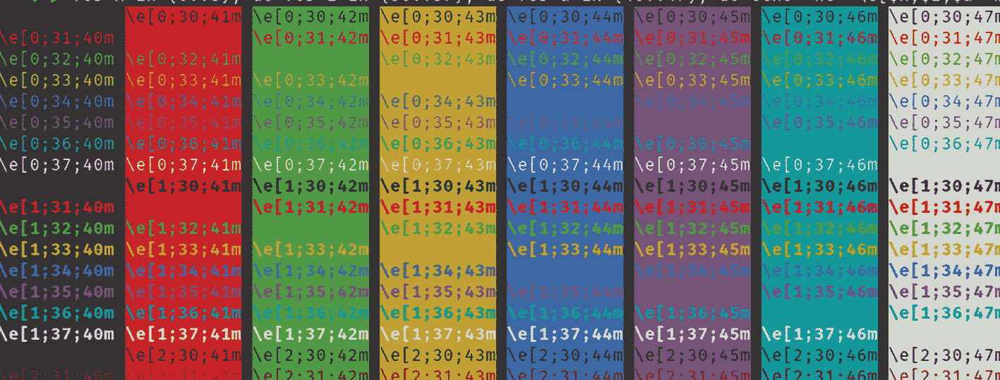
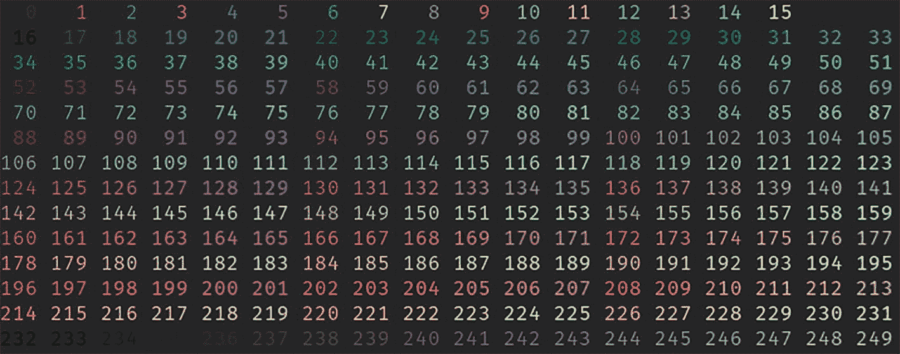
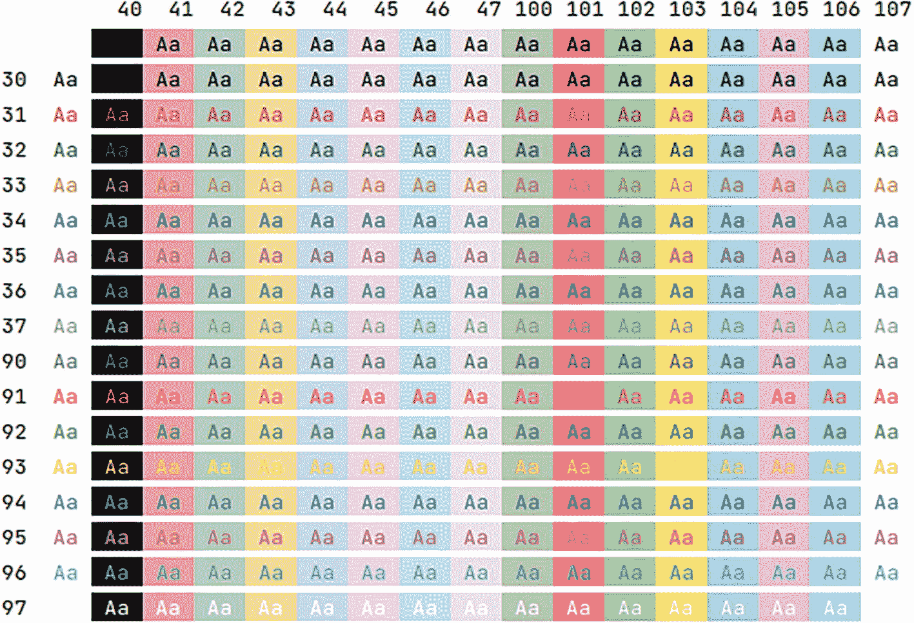
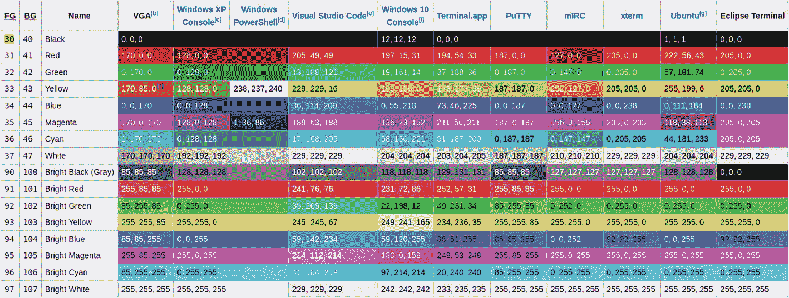
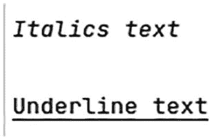
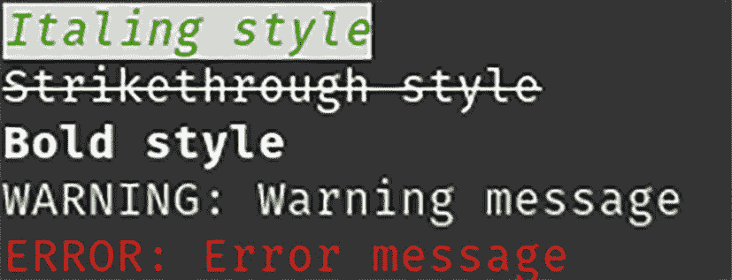
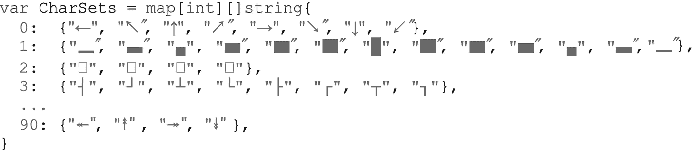
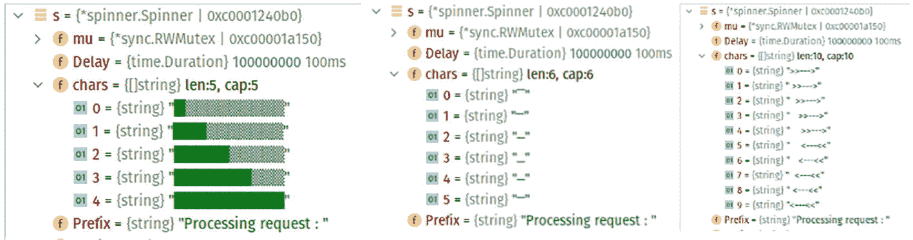
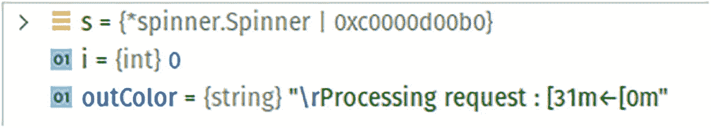

# 第六部分 终端用户界面

## 15. ANSI 与用户界面

在本章中，你将学习编写带有用户界面（UI）的命令行应用程序。你将了解如何添加文本样式，例如斜体或粗体文本、不同颜色的文本、使用旋转器（spinner）的 UI 等等。这种用户界面是通过使用 ANSI 转义码实现的，这些代码包含在终端中执行某些操作的指令。

你还将了解一个开源库，该库简化了用户界面的编写，它负责处理编写各种 ANSI 转义码以实现炫酷 UI 效果的所有繁重工作。在本章中，你将了解以下内容：

*   用于用户界面的 ANSI 转义码
*   用于编写不同类型用户界面的开源库
*   文本样式，例如斜体和粗体

### 源代码

本章的源代码可从 [`https://github.com/Apress/Software-Development-Go`](https://github.com/Apress/Software-Development-Go) 仓库获取。


### ANSI 转义码

提供用户界面的终端应用程序通常使用 ANSI 转义码构建。维基百科页面 [`https://en.wikipedia.org/wiki/ANSI_escape_code`](https://en.wikipedia.org/wiki/ANSI_escape_code) 提供了对 ANSI 码的全面解释：ANSI 转义序列是一种带内信号标准，用于控制视频文本终端和终端模拟器上的光标位置、颜色、字体样式和其他选项。

借助 ANSI 码，涌现了大量提供丰富终端用户界面的应用程序。

让我们用一个简单的 Bash 脚本进行实验，使用 ANSI 码打印不同背景色和前景色的文本，如下例脚本所示：

```
for x in {0..8}; do for i in {30..37}; do
for a in {40..47}; do echo -ne "\e$i;$a""m\\\e[$i;$a""m\e[37;40m "; done
echo
done; done
echo ""
```

图 [15-1 显示了您将在屏幕上看到的输出。



Bash 输出截图。

图 15-1

Bash 输出

以下脚本使用 ANSI 码以 256 种不同的前景色打印数字。图 15-2 显示了输出。



256 色输出截图。数字从 1 排列到 249。

图 15-2

256 色输出

```
for i in {0..255}; do printf '\e38;5;%dm%3d ' $i $i; (((i+3) % 18)) || printf '\e[0m\n'; done
```

两个 Bash 脚本都使用 ANSI 码来选择颜色。对于图 [15-2，ANSI 码如下：

```
\e38;5;228m
```

表 [15-1 解释了该代码的含义。

表 15-1

代码说明

| 代码 | 说明 |
| --- | --- |
| `\e` | 转义字符 |
| `38;5` | 指定前景色的 ANSI 码 |
| `228` | 亮黄色的颜色代码 |

在本节中，您了解了 ANSI 码以及如何通过编写 Bash 脚本使用它们打印不同颜色的文本。这为下一节奠定了基础，在下一节中，您将使用 ANSI 码在 Go 中编写不同类型的终端用户界面。

### 基于 ANSI 的 UI

在上一节中，您了解了 ANSI 码以及如何在 Bash 中使用它们。在本节中，您将在 Go 应用程序中使用 ANSI 码。您将使用 ANSI 码设置文本颜色、设置文本样式（例如斜体）等。

#### 颜色表

打开您的终端，并在 `chapter15/ansi` 文件夹中运行代码。

```
go run main.go
```

图 15-3 显示了输出。



不同颜色文本输出截图。文本 `Aa` 是前景色和背景色的组合。前景色数字从 30 到 97，背景色数字从 40 到 107。

图 15-3

不同颜色文本输出

代码打印文本 `Aa`，并结合了前景色和背景色。颜色值使用从 `fg` 和 `bg` 变量获取的转义码设置，如下代码片段所示：

```
...
for _, fg := range fgColors {
fmt.Printf("%2s ", fg)
...
if len(fg) > 0 {
...
fmt.Printf("\x1b[%sm Aa \x1b[0m", bg)
}
}
}
```

然后，不同的前景色和背景色数字在 `fgColors` 和 `bgColors` 数组中指定，如下所示：

```
var fgColors = []string{
"", "30", "31", "32", "33", "34", "35", "36", "37",
"90", "91", "92", "93", "94", "95", "96", "97",
}
var bgColors = []string{
"", "40", "41", "42", "43", "44", "45", "46", "47",
"100", "101", "102", "103", "104", "105", "106", "107",
}
```

打印到屏幕的字符串如下所示：

```
31;40m Aa [0m
```

以下是该代码含义的分解说明：

*   `[31;40m`：黑色背景与红色文本的 ANSI 转义码
*   `Aa`：文本 `Aa`
*   `[0m`：重置

图 [15-4 显示了一个摘自 [`https://en.wikipedia.org/wiki/ANSI_escape_code`](https://en.wikipedia.org/wiki/ANSI_escape_code) 的表格，展示了不同的前景色和背景色值组合以及每种组合所代表的颜色。



一张包含 FG、BG、名称、VGA、Windows XP 控制台、Windows PowerShell、Visual Studio Code、Windows 10 和终端等列的截图，解释了前景色和背景色的映射关系。

图 15-4

前景色和背景色映射

在下一节中，您将看到如何使用 ANSI 码在屏幕上格式化文本的示例。

#### 文本样式设置

ANSI 码也可用于设置文本样式，例如斜体、上标等。让我们看看 `chapter15/textstyle` 文件夹中的示例代码，它将打印出如图 15-5 所示的输出。



文本顶部显示斜体文本，底部显示下划线文本。

图 15-5

使用 ANSI 进行文本样式设置

以下代码声明了包含 ANSI 码的不同常量，用于以不同样式格式化文本：

```
package main
import "fmt"
const (
Underline    = "\x1b[4m"
UnderlineOff = "\x1b[24m"
Italics      = "\x1b[3m"
ItalicsOff   = "\x1b[23m"
)
...
```

在本节中，您使用了不同的 ANSI 码在控制台中以不同的颜色和格式格式化文本。通过示例代码可以明显看出，编写使用 ANSI 码的命令行应用程序相当繁琐，因为您需要指定应用程序所需的各种 ANSI 码。

在下一节中，您将了解一些开源项目，这些项目负责命令行用户界面开发的不同方面，从而简化代码编写。

### 开源库

在本节中，您将了解两个在编写命令行用户界面时很有用的不同开源库。您将看到如何使用这些库的示例，并了解这些库的内部工作原理。


#### Gookit

该库为应用程序提供了简单的 API，用于以不同的前景色和背景色打印文本。它还提供了文本样式，例如斜体、上标等。以下是该库项目的链接：[`https://github.com/gookit/color`](https://github.com/gookit/color)。

按如下方式运行 `chapter15/gookit` 文件夹内的示例代码：

```
go run main.go
```

图 15-6 显示了输出结果。



Gookit 示例输出的截图。文本内容为：斜体样式、删除线样式、粗体样式。警告：警告消息，错误：错误消息。

图 15-6

Gookit 示例输出

以下代码片段展示了简单的 API 调用：

```
...
func main() {
color.Warn = &color.Theme{"warning", color.Style{color.BgDefault, color.FgWhite}}
...
color.Style{color.FgDefault, color.BgDefault, color.OpStrikethrough}.Println("Strikethrough style")
color.Style{color.FgDefault, color.BgDefault, color.OpBold}.Println("Bold style")
...
}
```

调用 `color.Style.Println` 会使用指定的前景色和背景色打印你想要的文本。例如，

```
color.Style{color.FgDefault, color.BgDefault, color.OpStrikethrough}.Println("Strikethrough style")
```

会以默认的前景色和背景色，并采用删除线文本格式打印单词 *Strikethrough style*。

该库使用常量值来定义其提供的不同颜色，如下面的代码片段所示，这些代码可以在库的 `color_16.go` 文件中找到：

```
const (
FgBlack Color = iota + 30
FgRed
FgGreen
FgYellow
...
)
const (
FgDarkGray Color = iota + 90
FgLightRed
FgLightGreen
...
)
const (
BgBlack Color = iota + 40
BgRed
...
)
const (
BgDarkGray Color = iota + 100
BgLightRed
...
)
const (
OpReset         Color = iota
OpBold
OpFuzzy
OpItalic
...
)
```

该库使用与你之前在上一节中看到的相同的 ANSI 代码来格式化颜色和文本样式。以下代码片段来自 `color.go` 文件：

```
const (
SettingTpl   = "\x1b[%sm"
FullColorTpl = "\x1b[%sm%s\x1b[0m"
)
```

#### Spinner

该库为命令行应用程序提供了进度指示器。进度指示器大多出现在移动应用程序或浏览器等图形用户界面中。进度指示器用于向用户表明应用程序正在处理用户的请求。该库项目的地址是 [`https://github.com/briandowns/spinner`](https://github.com/briandowns/spinner)。打开你的终端，按如下方式运行 `chapter15/spinner` 文件夹内的代码：

```
go run main.go
```

图 15-7 显示了运行示例代码时你将看到的输出。它会打印单词 *Processing request*，并有一个红色条来回移动作为旋转指示器。


左侧文本显示“处理请求”。右侧是深色色块。

图 15-7

Spinner 示例输出

该库使用起来很简单，如下面的代码片段所示：

```
func main() {
s := spinner.New(spinner.CharSets[35], 100*time.Millisecond)
s.Color("red")
s.Prefix = "Processing request : "
s.Start()
...
s.Stop()
}
```

调用 `spinner.New` 会使用指定的类型（此处为 `spinner.CharSets[35]`）以及渲染旋转指示器的时间延迟（100 毫秒）来初始化一个新的旋转指示器。

你可以指定不同的旋转指示器，这些可以在库的 `character_sets.go` 文件中找到。



截图显示文本：字符集 = map[int][]string。从第 0 行到第 90 行列出了符号。

该库通过每隔一定延迟打印指定数组中的每个字符字节，从而将旋转指示器渲染到屏幕上。通过这种方式，当在屏幕上看到它时，会呈现出动画的效果。

在图 15-8 中，你可以在调试窗口中看到构成旋转指示器的不同字符是如何存储在 `Spinner` 结构体中的，这使得库能够逐个渲染它们。这样，当库渲染不同的字符时，看起来就像一个动画。



旋转指示器结构体的截图包含不同的字符，如 mu、delay、包含 5 个字符串的 chars，以及作为处理请求的前缀。

图 15-8

包含旋转指示器字符的 Spinner 结构体

`spinner.Start()` 函数是库中渲染旋转指示器动画的核心逻辑部分。

```
func (s *Spinner) Start() {
...
go func() {
for {
for i := 0; i < len(s.chars); i++ {
select {
...
default:
...
if runtime.GOOS == "windows" {
...
} else {
outColor = fmt.Sprintf("\r%s%s%s", s.Prefix, s.color(s.chars[i]), s.Suffix)
}
...
fmt.Fprint(s.Writer, outColor)
...
time.Sleep(delay)
}
}
}
}()
}
```

该函数启动一个 goroutine，并在屏幕上无限循环播放动画，直到应用程序调用 `stop()` 函数。

`outColor` 变量包含要打印的文本。在此示例中，它是 *Processing request*，以及示例代码中指定颜色的 ANSI 代码，因此该变量的内容如图 15-9 所示。



输出截图。s = (*spinner.Spinner)(0xc0000d00b0)，i = (int)(0)。outColor = (string) "/r"。

图 15-9

`outColor` 最终输出

### 总结

在本章中，你了解了 ANSI 代码以及它们如何用于在终端中创建用户界面。可用的 ANSI 代码允许你编写彩色文本，并对屏幕上打印的文本应用不同的格式。你了解到 ANSI 代码可以在 Bash 脚本和 Go 代码中使用。

通过研究不同的开源库，你更深入地探索了 ANSI 代码的用法，这些库为基于终端的应用程序提供了更丰富的用户界面功能。你所研究的库提供了基于文本的格式设置（如颜色和样式）以及进度指示器。

