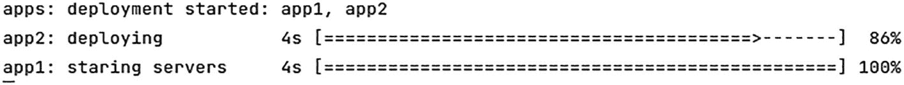
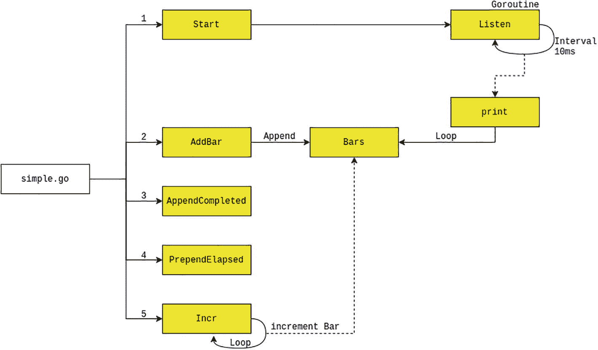
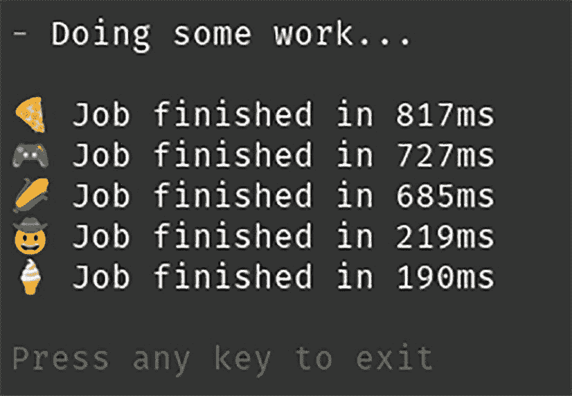
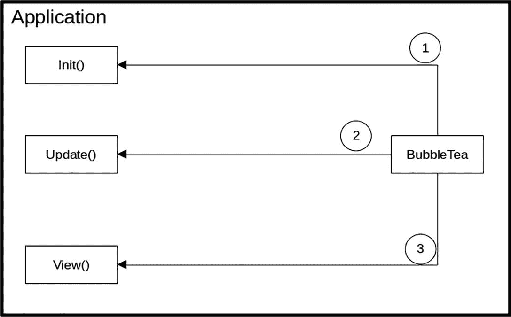
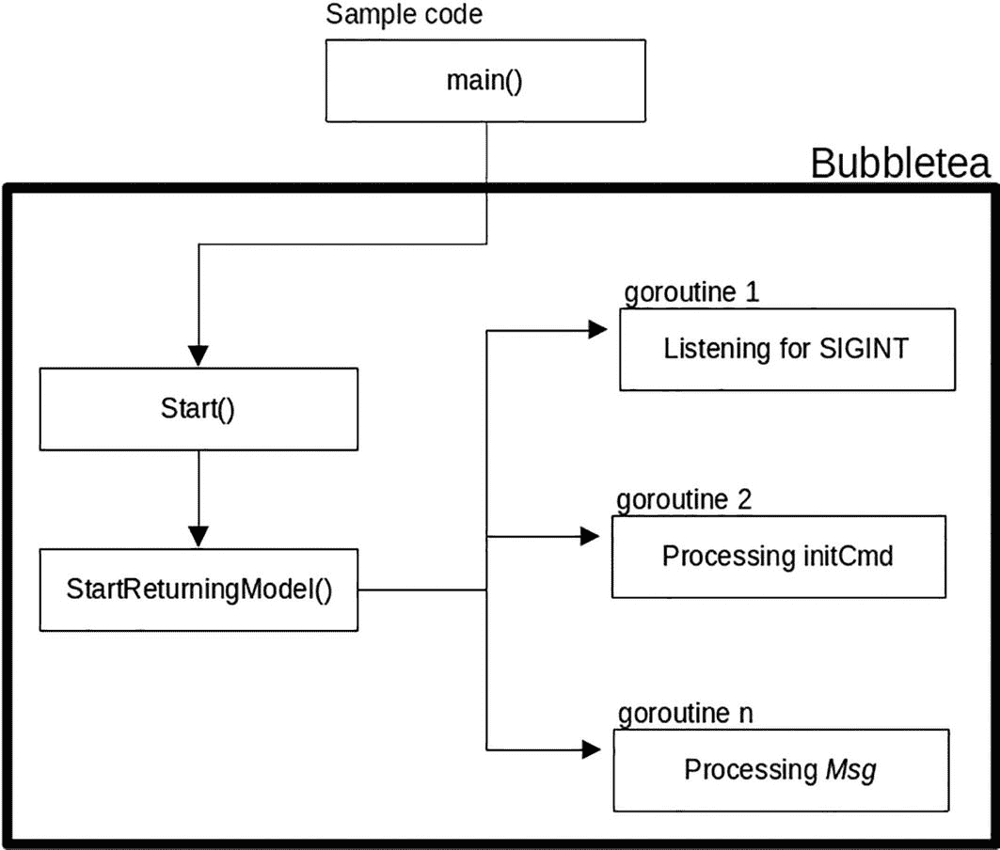
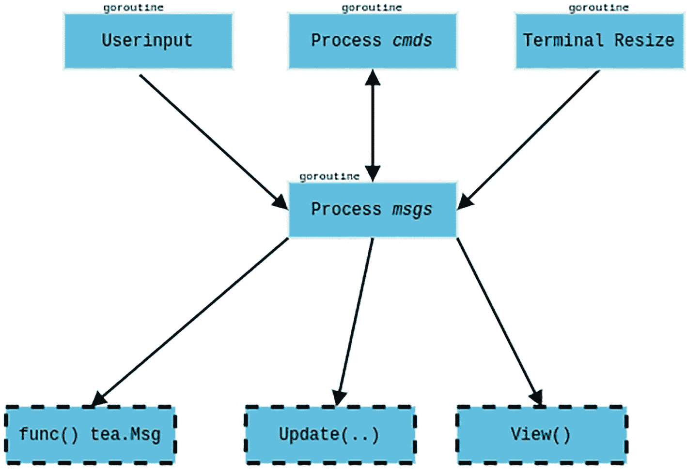

# 16. TUI 框架

你在第 15 章中看到，ANSI 代码包含多种可用于开发基于文本的用户界面的代码。你还看到了使用 ANSI 代码的示例，并了解了不同代码的含义。Go 语言有许多用户界面库，它们处理用户界面操作，从而使开发更简单、更快捷。在本章中，你将研究这些库，并详细探讨它们内部是如何工作的。

在本章中，你将研究两个库。第一个库是一个名为 `uiprogress` 的简单库，它允许应用程序创建基于文本的进度条。另一个库名为 `bubbletea`，它是一个更全面的库，允许应用程序创建不同类型的基于文本的用户界面，例如文本输入、边框、旋转指示器等。

到本章结束时，你将学习以下内容：

- 如何使用这些库
- 这些库内部是如何工作的


### `uiprogress`

在本节中，你将了解 `uiprogress` 库，其托管在 [`https://github.com/gosuri/uiprogress`](https://github.com/gosuri/uiprogress)。该库提供了一个进度条用户界面，如图 16-1 所示。该应用程序使用此库创建了一个进度条，作为一种反馈机制来显示某个操作正在执行中。



*输出屏幕截图。文字显示：应用部署已启动，包括 app 1 和 app 2。app 1 从 4 秒开始，进度达到 86%，app 2 从 4 秒开始，进度达到 100%。*

**图 16-1** — `uiprogress` 进度条

将该项目从 GitHub 检出到本地环境，并运行 `example/simple` 目录下提供的示例应用程序。

```
go run main.go
```

输出结果如图 16-2 所示。


*输出屏幕截图。文字显示：1 秒，84%。*

**图 16-2** — 来自 `simple.go` 的进度条输出

示例代码非常简单。

```
func main() {
uiprogress.Start()            // 开始渲染
bar := uiprogress.AddBar(100) // 新增一个进度条
// 可选地，追加和前置完成时间与已消耗时间
bar.AppendCompleted()
bar.PrependElapsed()
for bar.Incr() {
time.Sleep(time.Millisecond * 20)
}
}
```

#### 代码流程

你将以此示例应用程序为基础，对该库进行一个全面的浏览。图 16-3 展示了应用程序如何与该库交互，并揭示了库内部实际发生的情况。



*代码流程图，从 `simple.go` 开始，分为 5 个要素，命名为：启动、添加进度条、追加已完成、前置已消耗时间、进度条递增，并借助追加和循环进行打印与监听。*

**图 16-3** — 从 `simple.go` 到库的代码流程

让我们浏览一下此图以了解发生了什么。应用程序做的第一件事是调用 `Start()` 函数。这是为了初始化库的内部状态。该函数启动一个 goroutine 并调用位于 `progress.go` 文件中的 `Listen()` 函数，如下所示：

```
func (p *Progress) Listen() {
for {
p.mtx.Lock()
interval := p.RefreshInterval
p.mtx.Unlock()
select {
case <-time.After(interval):
p.print()
case <-p.tdone:
p.print()
close(p.tdone)
return
}
}
}
```

该函数位于 `for{}` 循环中，并以默认设置为 10 毫秒的间隔调用 `print()` 函数。

在完成 `Start()` 函数后，示例应用程序调用 `AddBar()` 函数来创建一个将显示给用户的新进度条。该库可以同时处理多个进度条，因此任何新创建的进度条都将存储在 `Bars` 切片中，如下所示：

```
func (p *Progress) AddBar(total int) *Bar {
...
bar := NewBar(total)
bar.Width = p.Width
p.Bars = append(p.Bars, bar)
...
}
```

#### 更新进度

在 10 毫秒间隔到期后，库会使用在后台运行的 `print()` 函数更新每个已注册的进度条。运行 `print()` 函数的代码片段如下：

```
func (p *Progress) print() {
...
for _, bar := range p.Bars {
fmt.Fprintln(p.lw, bar.String())
}
...
}
```

`print()` 函数遍历 `Bars` 切片，并调用 `String()` 函数，该函数又会调用 `Bytes()` 函数。`Bytes()` 函数执行计算以获取进度条的正确值，并将其与后缀和前缀一起打印出来。

```
func (b *Bar) Bytes() []byte {
completedWidth := int(float64(b.Width) * (b.CompletedPercent() / 100.00))
for i := 0; i < b.Width; i++ {
...
}
if b.CompletedPercent() > 0 && completedWidth < b.Width {
pb[completedWidth-1] = b.Head
}
...
return pb
}
```

调用的 `AppendCompleted()` 和 `PrependElapsed()` 函数用于定义以下内容：

*   `AppendCompleted()` 添加一个函数，该函数将在进度条完成操作时打印出完成百分比。

*   `PrependElapsed()` 在进度条前面加上到目前为止所花费的时间。

```
func (b *Bar) AppendCompleted() *Bar {
b.AppendFunc(func(b *Bar) string {
return b.CompletedPercentString()
})
return b
}
```

```
func (b *Bar) PrependElapsed() *Bar {
b.PrependFunc(func(b *Bar) string {
return strutil.PadLeft(b.TimeElapsedString(), 5, ' ')
})
return b
}
```

最后，应用程序需要指定进度条值的增加或减少。在示例代码中，它按如下方式递增：

```
func main() {
...
for bar.Incr() {
time.Sleep(time.Millisecond * 20)
}
}
```

只要 `bar.Incr()` 返回 `true`，代码就会继续循环，并在再次递增前休眠 20 毫秒。

从你的代码角度来看，该库负责更新和管理进度条，让你的应用程序能够专注于其主要任务。应用程序所需要做的，就是通过调用 `Incr()` 或 `Decr()` 函数来告知进度条的新值。

在下一节中，你将了解一个更全面的库，它为应用程序提供了更好的用户界面。

### `bubbletea`

在上一节中，你了解了 `uiprogress` 进度条库，并查看了它的内部工作原理。在本节中，你将了解另一个名为 `bubbletea` 的用户界面框架。其代码可以从 [`https://github.com/charmbracelet/bubbletea`](https://github.com/charmbracelet/bubbletea) 检出。

运行 `examples/tui-daemon-combo` 文件夹中的示例应用程序，如下所示：

```
go run main.go
```

你将得到类似于图 16-4 的输出。



*解释输出的截图。输出为：五项工作分别在 817、727、658、219 和 190 毫秒内完成。*

**图 16-4** — `tui-daemon-combo` 示例输出

这个 TUI 框架的有趣之处在于它提供了多种用户界面：进度条、旋转器、列表等等。图 16-5 展示了应用程序为了使用该库所必须提供的不同函数。



*解释三个应用程序函数的截图，这些函数包括 `Init`、`Update` 和 `View`。这三个函数并行连接到 Bubble Tea 函数。*

**图 16-5** — 用于 `bubbletea` 交互的应用程序函数

在接下来的几个小节中，你将使用 `tui-daemon-combo` 示例代码来弄清库内部的代码流程。

使用 `bubbletea` 非常简单，如下所示：

```
func main() {
...
p := tea.NewProgram(newModel(), opts...)
if err := p.Start(); err != nil {
fmt.Println("启动 Bubble Tea 程序时出错:", err)
os.Exit(1)
}
}
```

代码调用 `tea.NewProgram()`，并传入需要设置的 `Model` 接口和选项。该库定义的 `Model` 接口如下：

```
type Model interface {
Init() Cmd
Update(Msg) (Model, Cmd)
View() string
}
```

`newModel()` 函数返回了 `Model` 接口的实现，定义如下：

```
func (m model) Init() tea.Cmd {
...
}
func (m model) Update(msg tea.Msg) (tea.Model, tea.Cmd) {
...
}
func (m model) View() string {
...
}
```

现在，你已经定义了在构建和更新 UI 时将由库调用的不同函数。接下来，你将了解库是如何使用每个函数的。


#### Init

`Init()` 函数是 `bubbletea` 在调用 `Start()` 函数后调用的第一个函数。你之前看到，`Init()` 必须返回一个 `Cmd` 类型，该类型被声明为此处展示的函数类型：

```
type Cmd func() Msg
```

`Init()` 函数使用批处理（batches）来返回不同类型的函数类型：`spinner.Tick` 和 `runPretendProcess`。这是通过使用 `tea.Batch()` 函数实现的，如下所示：

```
func (m model) Init() tea.Cmd {
...
return tea.Batch(
spinner.Tick,
runPretendProcess,
)
}
```

在内部，`tea.Batch()` 返回一个匿名函数，该函数将不同的 `Cmd` 函数类型包装到一个 `Cmd` 数组中，如以下代码片段所示：

```
type batchMsg []Cmd
func Batch(cmds ...Cmd) Cmd {
...
return func() Msg {
return batchMsg(validCmds)
}
}
```

在 `bubbletea` 完成调用应用程序的 `Init()` 函数后，它会启动整个进程。在内部，它使用通道（channels）来读取不同的传入消息，以执行不同的用户界面操作。因此，在你的示例代码中，它会处理 `batchMsg` 数组并开始调用 `Cmd` 函数类型。

`Cmd` 函数类型的实现返回 `Msg`，后者是库中定义的一个接口。

```
type Msg interface{}
```

在示例代码中，你使用了 `spinner.Tick` 和 `runPretendProcess`，它们的定义如下：

```
type processFinishedMsg time.Duration
func Tick() tea.Msg {
return TickMsg{Time: time.Now()}
}
func runPretendProcess() tea.Msg {
...
return processFinishedMsg(pause)
}
```

图 16-6 展示了该库如何使用多个 goroutine 在后台执行多项任务，包括处理那些函数类型返回的 `Msg`，这些 `Msg` 将在 `Update()` 函数中使用，下一节将对此进行介绍。



示例代码的框架从主函数开始并启动。Start 函数返回 model，然后将其分为三个部分，分别命名为 S I G N T、initCmD 和 Msg。

图 16-6

内部执行流程的初始化

#### Update

调用 `Update` 函数来更新用户界面的状态。在示例应用中，其定义如下：

```
func (m model) Update(msg tea.Msg) (tea.Model, tea.Cmd) {
switch msg := msg.(type) {
case tea.KeyMsg:
...
return m, tea.Quit
case spinner.TickMsg:
...
m.spinner, cmd = m.spinner.Update(msg)
...
case processFinishedMsg:
...
m.results = append(m.results[1:], res)
...
default:
return m, nil
}
}
```

`Update` 函数接收不同类型的 `tea.Msg`，因为它被定义为一个接口，所以代码需要进行类型检查，并处理它想要处理的类型。例如，当函数接收到 `spinner.TickMsg` 时，它会通过调用 `spinner.Update()` 函数来更新 spinner；当接收到 `tea.KeyMsg` 时，它会退出应用程序。

该函数只需要处理它感兴趣的消息，并执行所需的任何用户界面状态管理。函数中必须避免执行其他重量级的操作。

#### View

最后一个函数 `View()` 由库调用以更新用户界面。应用程序可以自由地以任何合适的方式更新用户界面。这种灵活性允许应用程序渲染出满足其需求的用户界面。

这并不意味着应用程序需要知道如何绘制用户界面。这由每个用户界面可用的函数来处理。以下是 `View()` 函数：

```
func (m model) View() string {
s := "\n" +
m.spinner.View() + " Doing some work...\n\n"
for _, res := range m.results {
...
}
...
if m.quitting {
s += "\n"
}
return indent.String(s, 1)
}
```

应用程序通过从不同的变量中提取不同的值，来组合所有需要向用户显示的用户界面。例如，它提取 `results` 数组的值来显示给用户。当 `Update` 函数接收到 `processFinishedMsg` 消息类型时，`results` 数组就会被填充。

该函数返回一个包含用户界面的字符串，该字符串将由库渲染到终端上。

图 16-7 从高层次展示了该库生成的不同 goroutine，这些 goroutine 负责用户界面的不同部分，例如使用键盘、鼠标的用户输入、终端大小调整等等。

其架构类似于发布/订阅模型，中央 goroutine 处理所有不同的消息，并在内部调用相关函数来执行操作。



一个进程消息框架包含六个要素，包括用户输入、处理 Cmds、终端大小调整、tea dot msg 函数、更新函数和视图函数。

图 16-7

消息的集中处理

### 总结

在本章中，你了解了两种不同的基于终端的用户界面框架，它们为开发者提供了构建命令行用户界面的 API。你看到了如何使用这些框架构建简单命令行用户界面的示例应用。

你研究了这些框架的内部结构，以理解它们的工作原理。了解这些能让你在使用此类框架时，更好地洞察如何排查问题。并且，理解这些框架的复杂性有助于你构建自己的异步应用程序。

