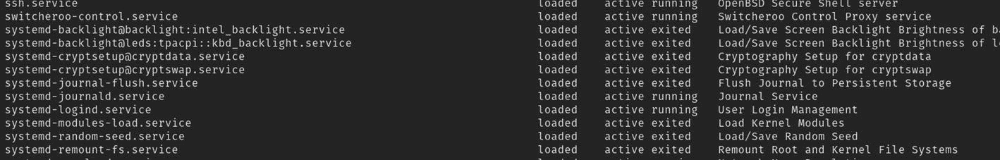

# 17. systemd

在本章中，你将了解 `systemd` 是什么，以及如何编写 Go 应用程序与之交互。`systemd` 是 Linux 系统内部一个重要的软件组件，其内容庞大，无法在本章中完全覆盖。

你将研究一个可用的开源 `systemd` Go 库，并学习如何使用它来访问 `systemd`。在本章中，你将完成以下任务：

-   了解 `systemd` 提供什么功能
-   使用 `systemctl` 和 `journalctl` 与 `systemd` 交互
-   使用 `go-systemd` 库编写代码
-   将日志消息写入 `systemd` 日志
-   查询 `systemd` 以获取已注册服务的列表

### 源代码

本章的源代码可从 [`https://github.com/Apress/Software-Development-Go`](https://github.com/Apress/Software-Development-Go) 仓库获取。

### systemd

`systemd` 是一套用于 Linux 系统的应用程序套件，旨在启动并运行系统。它不仅负责启动核心 Linux 系统运行，还会启动许多程序，例如网络栈、用户登录、日志记录服务器等。它使用套接字和 D-Bus 激活来启动服务、按需启动后台应用程序等等。

D-Bus 代表桌面总线（Desktop Bus）。这是一个用于进程间通信机制的规范，允许同一台机器上的不同进程相互通信。D-Bus 的实现包括服务器组件和一个客户端库。对于 `systemd`，其实现被称为 sd-bus。在稍后的章节中，你将学习如何使用 D-Bus 客户端库与服务器组件通信。

套接字激活是 `systemd` 中的一种机制，用于监听网络端口或 Unix 套接字。当有外部连接时，它将触发服务器应用程序的运行。这在某些情况下非常有用，比如某个资源密集型应用只需要在需要时才运行，而不是在 Linux 系统启动时就运行。


### systemd 单元 (Units)

`systemd` 使用的文件被称为单元 (units)。它是一种表示由 `systemd` 管理的资源的标准方式。系统相关的 `systemd` 单元文件可以在 `/lib/systemd/system` 目录下找到，其内容类似如下：

```
...
-rw-r--r--  1 root root   389 Nov 18  2021  apt-daily-upgrade.service
-rw-r--r--  1 root root   184 Nov 18  2021  apt-daily-upgrade.timer
lrwxrwxrwx  1 root root    14 Apr 25 23:23  autovt@.service -> getty@.service
-rw-r--r--  1 root root  1044 Jul  7  2021  avahi-daemon.service
-rw-r--r--  1 root root   870 Jul  7  2021  avahi-daemon.socket
-rw-r--r--  1 root root   927 Apr 25 23:23  basic.target
-rw-r--r--  1 root root  1159 Apr 18  2020  binfmt-support.service
-rw-r--r--  1 root root   380 Oct  6  2021  blk-availability.service
-rw-r--r--  1 root root   449 Apr 25 23:23  blockdev@.target
-rw-r--r--  1 root root   419 Feb  1 11:49  bluetooth.service
...
-rw-r--r--  1 root root   758 Apr 25 23:23  dev-hugepages.mount
-rw-r--r--  1 root root   701 Apr 25 23:23  dev-mqueue.mount
...
-rw-r--r--  1 root root   251 Aug 31  2021  e2scrub_all.timer
-rw-r--r--  1 root root   245 Aug 31  2021  e2scrub_fail@.service
-rw-r--r--  1 root root   550 Aug 31  2021  e2scrub_reap.service
...
-rw-r--r--  1 root root   444 Apr 25 23:23  remote-fs-pre.target
-rw-r--r--  1 root root   530 Apr 25 23:23  remote-fs.target
```

单元文件的另一个位置是 `/etc/systemd/system` 目录。该目录下的单元文件优先级高于文件系统中找到的任何其他单元文件。以下展示了本地机器上 `/etc/system/system` 目录中的部分单元文件：

```
...
lrwxrwxrwx  1 root root   40 Mar  4 04:53 dbus-org.freedesktop.ModemManager1.service -> /lib/systemd/system/ModemManager.service
lrwxrwxrwx  1 root root   53 Mar  4 04:51 dbus-org.freedesktop.nm-dispatcher.service -> /lib/systemd/system/NetworkManager-dispatcher.service
lrwxrwxrwx  1 root root   44 Aug  7  2021 dbus-org.freedesktop.resolve1.service -> /lib/systemd/system/systemd-resolved.service
lrwxrwxrwx  1 root root   36 Mar  4 04:53 dbus-org.freedesktop.thermald.service -> /lib/systemd/system/thermald.service
lrwxrwxrwx  1 root root   45 Aug  7  2021 dbus-org.freedesktop.timesync1.service -> /lib/systemd/system/systemd-timesyncd.service
...
drwxr-xr-x  2 root root 4096 Mar  4 04:53 graphical.target.wants/
drwxr-xr-x  2 root root 4096 Mar  4 04:51 mdmonitor.service.wants/
drwxr-xr-x  2 root root 4096 May 27 10:10 multi-user.target.wants/
...
lrwxrwxrwx  1 root root   31 Apr  6 17:55 sshd.service -> /lib/systemd/system/ssh.service
...
```

以下是不同单元文件的非详尽列表：

*   `.service`: 描述一个服务或应用程序，以及如何启动或停止该服务。
*   `.socket`: 描述用于基于套接字激活的网络或 Unix 套接字。
*   `.device`: 描述在 `sysfs/udev` 设备树中暴露的设备。
*   `.timer`: 定义一个将由 `systemd` 管理的定时器。

你已经了解了 `systemd` 及其用途。在下一节中，你将学习如何使用提供的工具，通过 `systemctl` 查看 `systemd` 提供的服务。

### systemctl

`systemctl` 是与本地机器上正在运行的 `systemd` 进行通信的主要工具。在终端中输入以下命令：

```
systemctl
```

在不加任何参数的情况下，它会列出所有当前已向 `systemd` 注册的服务，如图 17-1 所示。



输出的屏幕截图列出了服务及其状态（已加载 (loaded)、活动 (active)、已退出 (exited)）。

**图 17-1** systemd 中已注册的服务

让我们看看本地机器上当前正在运行的服务。我们将查看 `systemd-journal.service`，它运行着一个 `systemd` 日志服务。打开终端并使用以下命令：

```
systemctl status systemd-journald.service
```

你将看到类似如下的输出：

```
systemd-journald.service - Journal Service
Loaded: loaded (/lib/systemd/system/systemd-journald.service; static)
Active: active (running) since Thu 2022-06-16 23:21:09 AEST; 1 week 0 days ago
TriggeredBy: • systemd-journald-dev-log.socket
• systemd-journald-audit.socket
• systemd-journald.socket
Docs: man:systemd-journald.service(8)
man:journald.conf(5)
Main PID: 370 (systemd-journal)
Status: "Processing requests..."
Tasks: 1 (limit: 9294)
Memory: 54.2M
CPU: 3.263s
CGroup: /system.slice/systemd-journald.service
└─370 /lib/systemd/systemd-journald
Jun 16 23:21:09 nanik systemd-journald[370]: Journal started
...
Jun 16 23:21:09 nanik systemd-journald[370]: System Journal
```

输出显示了有关该服务的信息，例如服务使用的内存量、进程 ID (PID)、`.service` 文件的位置，以及该服务是否处于活动 (active) 状态。

要停止一个服务，请使用命令 `systemctl stop`。例如，我们尝试停止 `cups.service`（一个用于在 Linux 中提供打印服务的服务）。在终端中使用以下命令检查其状态：

```
systemctl status cups.service
```

你将看到类似如下的输出：

```
• cups.service - CUPS Scheduler
Loaded: loaded (/lib/systemd/system/cups.service; enabled; vendor preset: enabled)
Active: active (running) since Fri 2022-06-24 00:00:35 AEST; 22h ago
TriggeredBy: • cups.socket
• cups.path
Docs: man:cupsd(8)
Main PID: 39757 (cupsd)
Status: "Scheduler is running..."
Tasks: 1 (limit: 9294)
Memory: 2.8M
CPU: 51ms
CGroup: /system.slice/cups.service
└─39757 /usr/sbin/cupsd -l
Jun 24 00:00:35 nanik systemd[1]: Starting CUPS Scheduler...
Jun 24 00:00:35 nanik systemd[1]: Started CUPS Scheduler.
```

要停止该服务，请在终端中使用以下命令：

```
sudo systemctl stop  cups.service
```

如果你再次使用相同的 `systemctl status cups.service` 命令检查状态，你将看到类似如下的输出：

```
○ cups.service - CUPS Scheduler
Loaded: loaded (/lib/systemd/system/cups.service; enabled; vendor preset: enabled)
Active: inactive (dead) since Fri 2022-06-24 22:47:52 AEST; 1s ago
TriggeredBy: ○ cups.socket
○ cups.path
Docs: man:cupsd(8)
Process: 39757 ExecStart=/usr/sbin/cupsd -l (code=exited, status=0/SUCCESS)
Main PID: 39757 (code=exited, status=0/SUCCESS)
Status: "Scheduler is running..."
CPU: 54ms
Jun 24 00:00:35 nanik systemd[1]: Starting CUPS Scheduler...
...
Jun 24 22:47:52 nanik systemd[1]: Stopped CUPS Scheduler.
```

使用 `systemctl` 可以让你查看 `systemd` 中已注册服务的状态。在下一节中，你将编写一个简单的服务器应用程序，并使用 `systemctl` 对其进行控制。


#### 你好，服务器系统守护进程（systemd）

在本节中，你将了解到位于 `chapter17/httpservice` 目录下的示例代码。该应用是一个简单的 HTTP 服务器，监听在 8111 端口。让我们先在终端中使用以下命令正常启动应用：

```
go run main.go
```

你将看到类似如下的输出：

```
2022/06/24 22:55:40 Server running - port 8111
```

打开浏览器并访问 `http://localhost:8111`，你将看到类似下面的输出：


输出屏幕截图显示：你好，你正在从一个通过系统守护进程运行的应用中获取响应。

**图 17-2** HTTP 服务器输出

应用现在正在运行。让我们创建可执行文件，用于将其作为 `systemd` 服务运行。使用以下命令编译应用。请确保你在 `chapter17/httpservice` 目录下。

```
go build -o httpservice
```

现在你的应用已准备好作为一个 `systemd` 服务进行安装。请按照以下步骤进行安装。

1.  将 `httpservice` 可执行文件复制到终端中的 `/usr/local/bin` 目录下，如下所示：

    ```
    sudo cp ./httpservice /usr/local/bin
    ```

2.  将 `httpservice.service` 文件复制到终端中的 `/etc/systemd/system` 目录下，如下所示：

    ```
    sudo cp ./httpservice.service /etc/systemd/system
    ```

3.  使用以下命令查看你新创建的服务的状态：

    ```
    sudo systemctl status httpservice.service
    ```

    你将看到如下输出：

    ```
    ○ httpservice.service - HTTP Server Application
    Loaded: loaded (/etc/systemd/system/httpservice.service; disabled; vendor preset: enabled)
    Active: inactive (dead)
    ```

    `systemd`已识别该服务，但它未启用或处于停止状态。

4.  使用以下命令启动/启用该服务：

    ```
    sudo systemctl start httpservice.service
    ```

    如果你再次运行相同的状态命令（步骤 3），你将得到以下输出：

    ```
    ● httpservice.service - HTTP Server Application
    Loaded: loaded (/etc/systemd/system/httpservice.service; disabled; vendor preset: enabled)
    Active: active (running) since Fri 2022-06-24 23:09:34 AEST; 39s ago
    Main PID: 44068 (httpservice)
    Tasks: 5 (limit: 9294)
    Memory: 1.0M
    CPU: 3ms
    CGroup: /system.slice/httpservice.service
    └─44068 /usr/local/bin/httpservice
    Jun 24 23:09:34 nanik systemd[1]: Started HTTP Server Application.
    Jun 24 23:09:34 nanik httpservice[44068]: 2022/06/24 23:09:34 Server running - port 8111
    ```

5.  为确保机器重启时服务自动启动，请使用以下命令：

    ```
    sudo systemctl enable httpservice.service
    ```

现在，你可以通过浏览器访问 `http://localhost:8111` 来使用该应用。

你已成功部署了示例应用。它已配置为在机器启动时自动启动。在下一节中，你将了解如何使用 Go 库来编写一个系统应用。

#### go-systemd 库

本章前面你已经了解到，D-Bus 规范包含一个客户端库。该客户端库允许应用程序与`system`进行交互。你将了解的这个客户端库是专为 Go 应用程序设计的，名为`go-systemd`。该库可在 `http://github.com/coreos/go-systemd` 找到。

该库提供以下功能：

*   使用套接字激活
*   向`systemd`通知服务状态变化
*   启动、停止和检查服务与单元
*   注册机器或容器
*   ……以及更多功能

对于本章，你将查看使用该库的代码示例，包括写入日志记录、列出本地机器上的可用服务以及查询机器信息。

##### 查询服务

本节的示例代码可在 `chapter17/listservices` 目录下找到。示例代码从`systemd`中查询所有已注册的服务，其工作方式类似于 `systemctl list-units` 命令。

打开终端，确保你在 `chapter17/listservices` 目录下。按如下方式构建应用：

```
go build -o listservices
```

编译完成后，以 root 身份运行可执行文件。

```
sudo ./listservices
```

你将看到在`systemd`中注册的服务的输出。

```
...
Name : sys-module-fuse.device, LoadState : loaded, ActiveState : active, Substate : plugged
Name : gdm.service, LoadState : loaded, ActiveState : active, Substate : running
Name : sysinit.target, LoadState : loaded, ActiveState : active, Substate : active
Name : graphical.target, LoadState : loaded, ActiveState : active, Substate : active
Name : veritysetup.target, LoadState : loaded, ActiveState : active, Substate : active
...
Name : remote-fs-pre.target, LoadState : loaded, ActiveState : inactive, Substate : dead
Name : apt-daily-upgrade.timer, LoadState : loaded, ActiveState : active, Substate : waiting
Name : ssh.service, LoadState : loaded, ActiveState : active, Substate : running
Name : system.slice, LoadState : loaded, ActiveState : active, Substate : active
Name : systemd-ask-password-plymouth.path, LoadState : loaded, ActiveState : active, Substate : waiting
Name : dev-ttyS15.device, LoadState : loaded, ActiveState : active, Substate : plugged
...
```

让我们逐步分析代码，了解应用如何使用该库。以下代码片段显示它正在使用 `NewSystemdConnectionContext` 函数连接到 `systemd` 服务器：

```
import (
...
)
func main() {
...
c, err := d.NewSystemdConnectionContext(ctx)
...
}
```

成功连接到 `systemd` 后，它会发送请求以获取单元列表并将其打印到控制台。

```
import (
...
)
func main() {
...
js, err := c.ListUnitsContext(ctx)
...
for _, j := range js {
fmt.Println(fmt.Sprintf("Name : %s, LoadState : %s, ActiveState : %s, Substate : %s", j.Name, j.LoadState, j.ActiveState, j.SubState))
}
c.Close()
}
```

该库负责处理所有繁重的工作，包括连接到 `systemd`、发送请求，并将请求转换为适合传递给应用的格式。


### 日志

另一个你将看到的示例是使用该库将日志消息写入提供日志服务的日志系统。要访问日志服务，你可以使用 `journalctl` 命令行工具。

```
journalctl -r
```

在我本地机器上，输出如下所示（在你的机器上看起来会有所不同）：

```
...
6 月 25 日 00:06:43 nanik sshd[2567]: pam_unix(sshd:session): session opened for user nanik(uid=1000) by (uid=0)
...
6 月 25 日 00:00:32 nanik kernel: audit: type=1400 audit(1656079232.440:30): apparmor="DENIED" operation="capable" profile="/usr/sbin/cups-browsed" pid=2527 comm="cups-browsed" capability=23  c>
6 月 25 日 00:00:32 nanik audit[2527]: AVC apparmor="DENIED" operation="capable" profile="/usr/sbin/cups-browsed" pid=2527 comm="cups-browsed" capability=23  capname="sys_nice"
6 月 25 日 00:00:32 nanik systemd[1]: Finished Rotate log files.
...
```

参数 `-r` 会将最新的日志消息显示在顶部。现在你知道如何查看日志服务了。让我们运行示例应用程序，将日志消息写入其中。

打开终端，确保你在 `chapter17/journal` 目录内。使用以下命令运行示例：

```
go run main.go
```

打开另一个终端，运行同样的 `journalctl -r` 命令。你会在输出中看到来自示例应用程序的日志消息，如下所示：

```
6 月 25 日 00:06:48 nanik journal[2591]: This log message is from Go application
6 月 25 日 00:06:44 nanik systemd[908]: Started Tracker metadata extractor.
6 月 25 日 00:06:44 nanik systemd[908]: Starting Tracker metadata extractor...
6 月 25 日 00:06:44 nanik systemd-logind[778]: Removed session 6.
6 月 25 日 00:06:44 nanik systemd[1]: session-6.scope: Deactivated successfully.
...
```

写入日志的代码非常简单。

```
package main
import (
j "github.com/coreos/go-systemd/v22/journal"
)
func main() {
j.Print(j.PriErr, "This log message is from Go application")
}
```

`Print()` 函数以错误优先级打印消息 *This log message is from Go application*。当你使用 `journalctl` 查看时，这通常以红色显示。以下是该库提供的不同优先级列表：

```
const (
PriEmerg Priority = iota
PriAlert
PriCrit
PriErr
PriWarning
PriNotice
PriInfo
PriDebug
)
```

以下优先级被分配为红色：`PriErr`、`PriCrit`、`PriAlert` 和 `PriEmerg`。`PriNotice` 和 `PriWarning` 会被高亮显示，而 `PriDebug` 是浅灰色。其中一个有趣的优先级是 `PriEmerg`，它会将日志消息广播到本地机器上所有打开的终端。

在下一节中，你将了解 `systemd` 的一个高级功能，即注册和运行一台机器或容器。

### 机器

`systemd` 提供的一个高级功能是在本地机器上运行虚拟机或容器。此功能默认不附带；为了使用此功能，需要额外安装服务和执行步骤。此功能通过安装名为 `systemd-container` 的软件包来提供。我们来了解下这个软件包的内容。

`systemd-container` 软件包包含许多工具，特别是名为 `systemd-nspawn` 的工具。此工具类似于 `chroot`（我在第 4 章中讨论过），但提供了更高级的功能，例如虚拟化文件系统层次结构、进程树和各种 IPC 子系统。基本上，它允许你使用自己的 `rootfs` 运行一个轻量级容器。

以下步骤将指导你安装该软件包并对其进行配置。

1.  将 `systemd-machined.service` 文件从 `chapter17/machine` 目录复制到 `/usr/lib/systemd/user`。

1.  使用以下命令安装 `systemd-container` 软件包：

```
sudo cp systemd-machined.service /usr/lib/systemd/user
```

1.  使用以下命令启动服务：

```
sudo apt install systemd-container
```

1.  使用以下命令检查状态：

```
sudo systemctl start systemd-machined.service
```

```
sudo systemctl status  systemd-machined.service
```

你会看到类似以下的输出：

```
• systemd-machined.service - 虚拟机与容器注册服务
Loaded: loaded (/lib/systemd/system/systemd-machined.service; static)
Active: active (running) since 周六 2022-06-25 00:51:10 AEST; 21h ago
Docs: man:systemd-machined.service(8)
man:org.freedesktop.machine1(5)
Main PID: 2744 (systemd-machine)
Status: "Processing requests..."
Tasks: 1 (limit: 9294)
Memory: 1.2M
CPU: 220ms
CGroup: /system.slice/systemd-machined.service
└─2744 /lib/systemd/systemd-machined
6 月 25 日 00:51:10 nanik systemd[1]: Starting Virtual Machine and Container Registration Service...
6 月 25 日 00:51:10 nanik systemd[1]: Started Virtual Machine and Container Registration Service.
```

使用 `machinectl` 命令行工具与你刚刚安装的新机器服务进行交互。使用该工具下载 Ubuntu 操作系统镜像，并将其作为容器在本地运行。

使用以下命令下载 Ubuntu 镜像：

```
machinectl pull-tar https://cloud-images.ubuntu.com/trusty/current/trusty-server-cloudimg-amd64-root.tar.gz trusty-server
```

如果此方法不适用于你的 Linux 系统，请使用以下命令：

```
wget https://cloud-images.ubuntu.com/trusty/current/trusty-server-cloudimg-amd64-root.tar.gz
machinectl import-tar trusty-server-cloudimg-amd64-root.tar.gz
```

让我们使用以下命令检查以确保镜像已成功下载：

```
machinectl list-images
```

你将得到类似如下的输出：

```
名称                               类型     RO   使用情况  创建时间                    修改时间
trusty-server-cloudimg-amd64-root  目录    否    n/a     周六 2022-06-25 23:16:16 AEST n/a
列出了 1 个镜像。
```

下载的镜像存储在 `/var/lib/machines` 文件夹中，如下所示：

```
nanik@nanik:~/Downloads/alpine-container$ sudo ls -la  /var/lib/machines
total 24
drwx------  6 root root 4096 Jun 25 23:16 .
drwxr-xr-x 69 root root 4096 May 25 16:19 ..
drwxr-xr-x 22 root root 4096 Jun 25 23:16 trusty-server-cloudimg-amd64-root
```

查看 `trusty-server-cloudimg-amd64-root` 目录内部，你会看到 `rootfs` 目录结构。

```
drwx------  6 root root 4096 Jun 25 23:16 ..
drwxr-xr-x  2 root root 4096 Nov  8  2019 bin
drwxr-xr-x  3 root root 4096 Nov  8  2019 boot
drwxr-xr-x  4 root root 4096 Nov  8  2019 dev
...
drwxr-xr-x  2 root root 4096 Nov  8  2019 sbin
drwxr-xr-x  2 root root 4096 Nov  8  2019 srv
drwxr-xr-x  2 root root 4096 Mar 13  2014 sys
...
drwxr-xr-x 10 root root 4096 Nov  8  2019 usr
drwxr-xr-x 12 root root 4096 Nov  8  2019 var
```


最后，既然你已经下载并本地存储了镜像，就可以使用以下命令来运行它：

```
sudo systemd-nspawn -M trusty-server-cloudimg-amd64-root
```

你将看到类似如下的输出：

```
nanik@nanik:~/Downloads/alpine-container$ sudo systemd-nspawn-M trusty-server-cloudimg-amd64-root
Spawning container trusty-server-cloudimg-amd64-root on /var/lib/machines/trusty-server-cloudimg-amd64-root.
Press ^] three times within 1s to kill container.
root@trusty-server-cloudimg-amd64-root:~#
```

让我们看看位于 `chapter17/machine` 文件夹中的示例应用程序。此示例使用 `go-systemd` 库来查询本地存储的镜像。将目录更改为 `chapter17/machine` 并按如下方式运行示例：

```
go run main.go
```

你将得到类似如下的输出：

```
2022/06/25 23:22:19 image - .host directory
2022/06/25 23:22:19 image - trusty-server-cloudimg-amd64-root directory
```

该示例使用了 `go-systemd` 库的 `machine1` 包，并通过调用 `New()` 函数来建立与 `systemd` 系统的连接。连接成功后，它使用 `ListImages()` 函数检索可用的镜像并将其打印到控制台。

```
package main
import (
m "github.com/coreos/go-systemd/v22/machine1"
...
)
func main() {
conn, err := m.New()
...
s, err := conn.ListImages()
...
for _, img := range s {
log.Println("image - "+img.Name, img.ImageType)
}
}
```

### 小结

在本章中，你了解了 `systemd` 及其在 Linux 操作系统中的功能。你探索了可用于与 `systemd` 交互的不同工具，并查看了展示如何使用 `go-systemd` 库与 `systemd` 交互的 Go 代码示例。

`go-systemd` 提供了与 `systemd` 交互的不同能力。你探索的高级特性之一是，与提供虚拟机和容器注册功能的 `systemd-machine` 服务进行交互。

