# 18. cAdvisor

在本章中，你将了解一个名为 cAdvisor 的开源项目，它代表 Container Advisor（容器顾问）。完整的源代码可以在 [`https://github.com/google/cadvisor`](https://github.com/google/cadvisor) 找到。本章使用的是该项目的 v0.39.3 版本。该项目用于收集正在运行的容器的资源使用情况和性能数据。cAdvisor 支持 Docker 容器，这也是本章将要重点介绍的内容。

选择此项目的原因是为了进一步探讨我们在前几章讨论过的主题，例如：

*   使用系统调用来监控文件系统
*   使用 cgroups
*   使用 `/proc` 和 `/sys` 收集机器信息

### 源代码

本章的源代码可从 [`https://github.com/Apress/Software-Development-Go`](https://github.com/Apress/Software-Development-Go) 仓库获取。

### 运行 cAdvisor

本节将指导你如何检出 cAdvisor 源代码并在本地运行它。让我们首先使用以下命令来检出代码：

```
GO111MODULE=off go get github.com/google/cadvisor
```

该命令使用 `go get` 从给定的 URL 下载源代码。环境变量 `GO111MODULE=off` 告诉 `go` 工具获取模块（`google/cadvisor`）并将其存储在 `GOPATH` 目录中。模块下载完成后，你可以进入 `GOPATH/src` 目录，会看到如下内容：

```
drwxrwxr-x 32 nanik nanik  4096 Jun 17 22:31 ./
drwxrwxr-x  9 nanik nanik  4096 Jun 15 22:19 ../
drwxrwxr-x  2 nanik nanik  4096 Jun 17 22:31 accelerators/
-rw-rw-r--  1 nanik nanik   256 Jun 15 22:19 AUTHORS
drwxrwxr-x  4 nanik nanik  4096 Jun 17 22:31 build/
drwxrwxr-x  3 nanik nanik  4096 Jun 15 22:19 cache/
-rw-rw-r--  1 nanik nanik 22048 Jun 15 22:19 CHANGELOG.md
drwxrwxr-x  4 nanik nanik  4096 Jun 17 22:31 client/
drwxrwxr-x  3 nanik nanik  4096 Jun 17 22:32 cmd/
drwxrwxr-x  3 nanik nanik  4096 Jun 17 22:31 collector/
...
```

进入 `cmd` 目录并运行以下命令来构建项目：

```
go build -o cadvisor
```

你将得到一个名为 `cadvisor` 的可执行文件。让我们使用以下命令运行该项目，以打印它可以接受的不同参数：

```
./cadvisor –help
```

你将得到类似如下的输出：

```
-add_dir_header
If true, adds the file directory to the header of the log messages
...
-boot_id_file string
Comma-separated list of files to check for boot-id. Use the first one that exists. (default "/proc/sys/kernel/random/boot_id")
...
-v value
number for the log level verbosity
...
```

我不会遍历 cAdvisor 拥有的所有不同参数。你将仅使用它分配的默认值。cAdvisor 需要 root 权限才能运行，因此请按如下方式操作：

```
sudo ./cadvisor -v 9
```

默认情况下，它使用 8080 端口运行应用程序，因此如果你有另一个使用 8080 端口的应用程序在运行，它将无法启动。对于 cAdvisor，请使用 `-p` 标志指定一个不同的端口号。

```
sudo ./cadvisor -port 
```

当 cAdvisor 运行时，它会收集与机器和容器相关的各种信息，这只有在它具有 root 权限时才能完成。

一旦 cAdvisor 启动并运行，你将看到终端中打印出大量日志信息。

```
I0617 23:06:13.122455 2311171 storagedriver.go:55] Caching stats in memory for 2m0s
W0617 23:06:13.122498 2311171 manager.go:159] Cannot detect current cgroup on cgroup v2
I0617 23:06:13.122591 2311171 plugin.go:40] CRI-O not connected: Get "http://%2Fvar%2Frun%2Fcrio%2Fcrio.sock/info": dial unix /var/run/crio/crio.sock: connect: no such file or directory
...
I0617 23:06:13.139451 2311171 nvidia.go:61] NVIDIA setup failed: no NVIDIA devices found
...
I0617 23:06:13.192306 2311171 manager.go:991] Added container: "/" (aliases: [], namespace: "")
I0617 23:06:13.192340 2311171 handler.go:325] Added event &{/ 2022-06-14 09:44:58.365378218 +1000 AEST containerCreation {}}
I0617 23:06:13.192356 2311171 manager.go:301] Starting recovery of all containers
I0617 23:06:13.192424 2311171 container.go:527] Start housekeeping for container "/"
...
I0617 23:06:13.197502 2311171 handler.go:325] Added event &{/user.slice/user-1000.slice/user@1000.service/app.slice/dbus.socket 2022-06-14 09:43:53.204034932 +1000 AEST containerCreation {}}
I0617 23:06:13.197513 2311171 factory.go:220] Factory "docker" was unable to handle container "/user.slice/user-1000.slice/user@1000.service/app.slice/app-org.gnome.Terminal.slice/vte-spawn-642db2f1-1648-487e-8c09-58ec92a50865.scope"
```

打开你的浏览器，输入 `http://localhost:8080` 来访问用户界面。你将看到类似图 18-1 的内容。

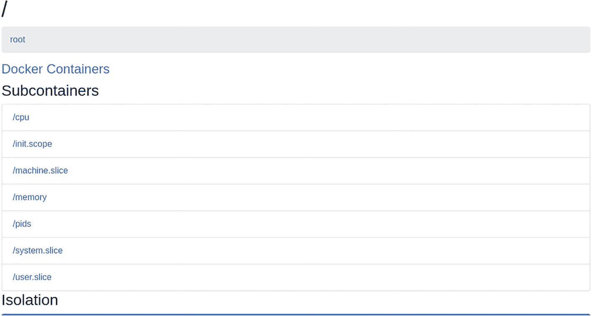

一张列出了开源容器顾问中涉及的 11 个子容器的屏幕截图。

图 18-1

cAdvisor 用户界面

要查看本地运行的容器，请单击主页上的 *Docker Containers* 链接。你将看到一个不同的容器用户界面，如图 18-2 所示。我的本地机器上运行着一个 Postgres 容器，因此你看到的是一个 Postgres 容器。你将看到本地机器上运行的所有不同容器。

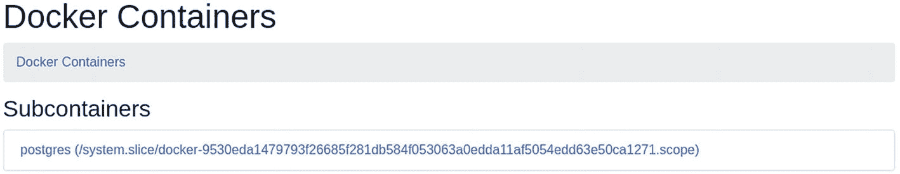

一张显示 Docker 容器内指定子容器 postgres 链接的屏幕截图。

图 18-2

cAdvisor 容器用户界面

在下一节中，你将进一步探索 cAdvisor 的用户界面以及与此项目相关的概念。


### Web 用户界面

请确保你的 `cAdvisor` 已在本地运行，并打开浏览器，通过 URL `http://localhost:8080` 访问它。接下来，我们来理解一下网页上展示的一些数据。

**注意：** 你本地机器上看到的信息可能与本书记载的不同。这取决于你所使用的操作系统或 Linux 发行版。

图 18-3 展示了 `cAdvisor` 中名为 `subcontainers` 的子目录。该目录提供了 `cAdvisor` 用于报告的重要统计信息和性能数据。

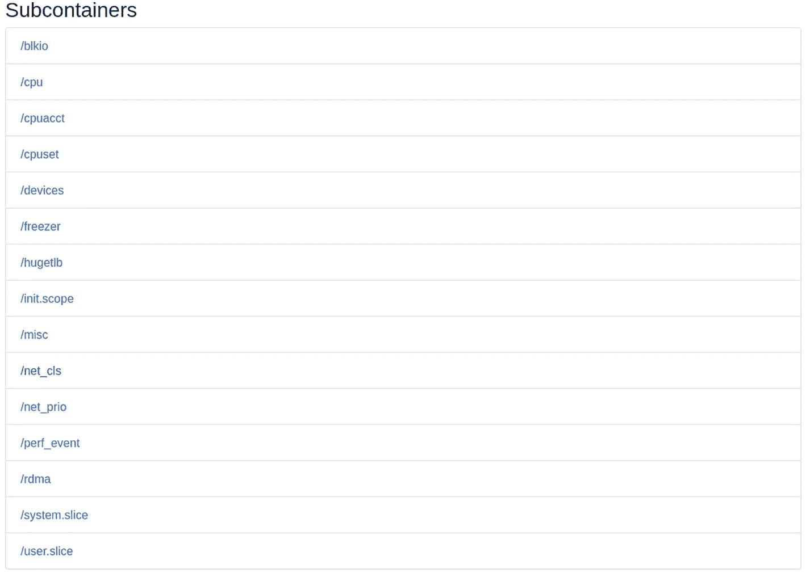

**图 18-3：子容器视图**

一张截图列出了 15 个以正斜杠开头的子容器名称。

点击 `system.slice` 链接，你将看到类似图 18-4 的内容，其中展示了本地机器上运行的不同服务。

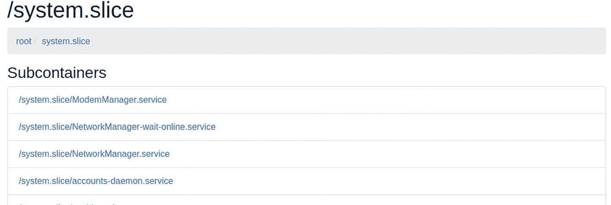

**图 18-4：/system.slice 视图**

一张截图显示了位于 `system.dot.slice` 下的 4 个子容器链接。

图 18-5 展示了内存和磁盘使用率的仪表盘。

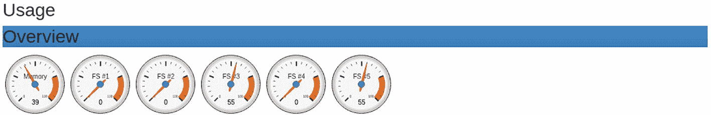

**图 18-5：内存和磁盘使用情况**

一张图片展示了内存和 5 个磁盘的使用率仪表。仪表读数为 39、0、0、55、0 和 55。

`cAdvisor` 还会显示当前系统中正在运行的不同进程。图 18-6 展示了有关进程名称、CPU 使用率、内存使用率、运行时间等信息。

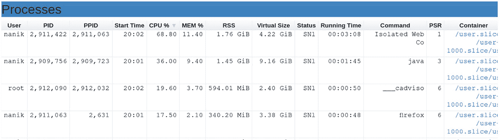

**图 18-6：正在运行的进程信息**

该表格图展示了 `cAdvisor` 中多个设备的设备与内存百分比、RSS、虚拟大小以及状态。

除了本地机器上正在运行的进程之外，`cAdvisor` 还会报告当前机器上正在运行的不同 Docker 容器的信息。点击图 18-7 中所示的 *Docker 容器* 链接。

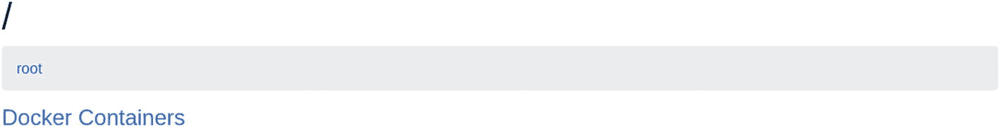

**图 18-7：Docker 容器链接**

一张截图将 Docker 容器链接显示为正斜杠、根目录和 Docker 容器。

点击 *Docker 容器* 链接后，你将看到一个可供查看的容器列表。在我的案例中，如图 18-8 所示，本地机器上当前正在运行一个 Postgres 容器。

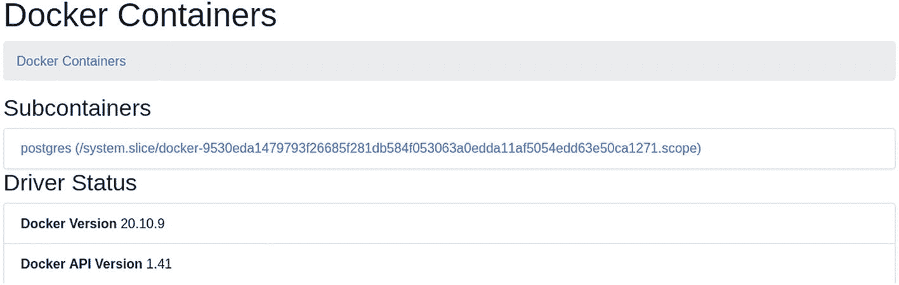

**图 18-8：Docker 子容器视图**

一张 Docker 容器的截图显示了子顾问的链接以及驱动状态，有两个不同版本：20.10.9 和 1.41。

点击 Postgres 容器将显示与该容器相关的不同指标，如图 18-9 所示。

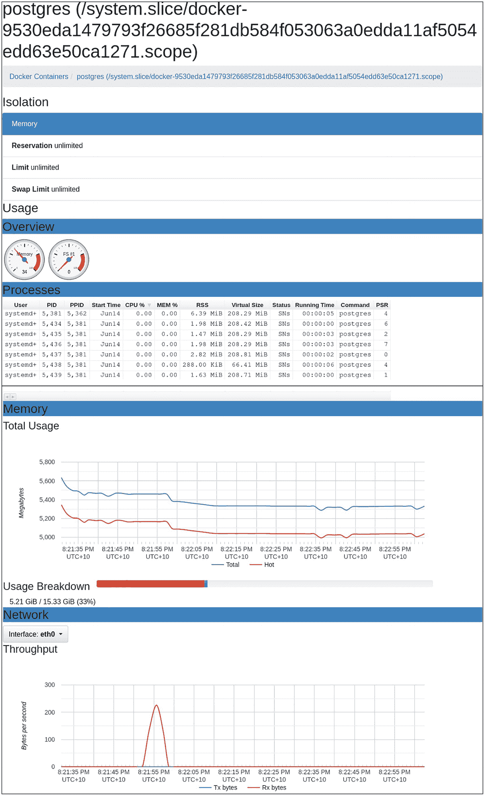

**图 18-9：Postgres 指标**

一张 `system.dot.slice` 的截图包括隔离、概览、进程、内存和网络。内存分为有限预留和无限预留。在线形图中，网络由钟形脉冲显示。

在下一节中，你将深入了解 `cAdvisor` 的内部，并学习它如何在代码中实现所有这些功能。

### 架构

在本节及下一节中，你将了解 `cAdvisor` 的内部结构以及不同组件如何工作。`cAdvisor` 支持不同的容器，但本章节中，你将只关注与 Docker 相关的代码。让我们看一下图 18-10 中展示的 `cAdvisor` 高层组件视图。

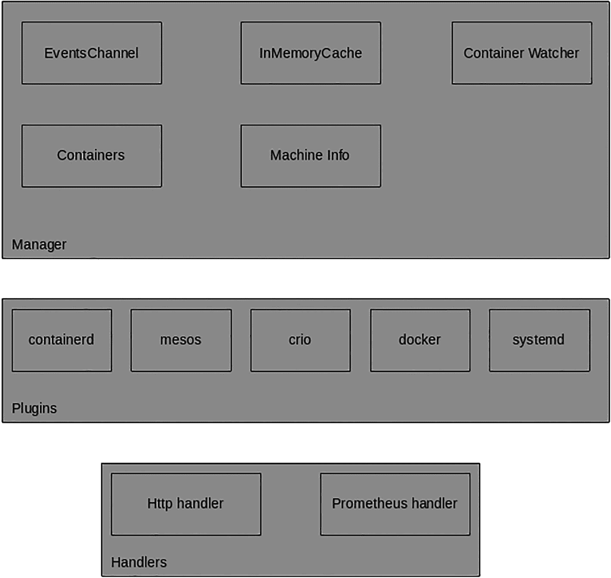

**图 18-10：高层架构**

该框图以标签形式呈现了 `cAdvisor` 进程中插件、管理器和处理程序的组成部分。标签最多的管理器是容器、内存缓存、监视器、机器信息和监视器。

表 18-1 概述了 `cAdvisor` 内部不同的组件及其用途。

**表 18-1：组件**

| 组件 | 描述 |
| --- | --- |
| 事件通道 | 用于报告容器创建或删除的通道 |
| 内存缓存 | 用于存储所有被监控容器相关指标信息的缓存 |
| 容器监视器 | 监控容器活动的监视器 |
| 容器 | 由 `cAdvisor` 监控的不同容器 |
| 机器信息 | 与 `cAdvisor` 正在运行的本地机器相关的信息 |
| 插件 | `cAdvisor` 支持的不同容器：Docker、Mesos、CRIO、Systemd 和 ContainerD |
| 处理程序 | 负责处理 `cAdvisor` 暴露的指标和其他相关 API 请求的 HTTP 处理程序 |

在接下来的几节中，你将了解 `cAdvisor` 的不同部分及其工作原理。


### 初始化

与其他 Go 应用程序一样，cAdvisor 的入口点是 `main.go`。

```go
func main() {
    ...
    memoryStorage, err := NewMemoryStorage()
    if err != nil {
        klog.Fatalf("Failed to initialize storage driver: %s", err)
    }
    ...
    resourceManager, err := manager.New(memoryStorage, sysFs, housekeepingConfig, includedMetrics, &collectorHttpClient, strings.Split(*rawCgroupPrefixWhiteList, ","), *perfEvents)
    ...
    cadvisorhttp.RegisterPrometheusHandler(mux, resourceManager, *prometheusEndpoint, containerLabelFunc, includedMetrics)
    ...
    rootMux := http.NewServeMux()
    ...
}
```

`main()` 函数执行以下初始化流程步骤：

*   设置缓存，用于存储容器及其指标
*   设置管理器（Manager），执行监控容器的所有主要处理
*   设置 HTTP 处理器，允许 Web 用户界面获取不同容器的指标数据
*   通过启动管理器开始收集容器和指标

缓存管理由 `InMemoryCache` 负责，你可以在 `memory.go` 中找到它。

```go
type InMemoryCache struct {
    lock              sync.RWMutex
    containerCacheMap map[string]*containerCache
    maxAge            time.Duration
    backend           []storage.StorageDriver
}
func (c *InMemoryCache) AddStats(cInfo *info.ContainerInfo, stats *info.ContainerStats) error {
    ...
}
func (c *InMemoryCache) RecentStats(name string, start, end time.Time, maxStats int) ([]*info.ContainerStats, error) {
    ...
}
func (c *InMemoryCache) Close() error {
    ...
}
func (c *InMemoryCache) RemoveContainer(containerName string) error {
    ...
}
```

cAdvisor 会初始化两种不同的 HTTP 处理器：供 Web 用户界面使用的基于 API 的 HTTP 处理器，以及以原始格式报告指标信息的指标 HTTP 处理器。以下代码片段展示了主处理器的注册过程，它会注册可用的不同路径（位于 `cmd/internal/http/handlers.go` 中）：

```go
func RegisterHandlers(mux httpmux.Mux, containerManager manager.Manager, httpAuthFile, httpAuthRealm, httpDigestFile, httpDigestRealm string, urlBasePrefix string) error {
    ...
    if err := api.RegisterHandlers(mux, containerManager); err != nil {
        return fmt.Errorf("failed to register API handlers: %s", err)
    }
    mux.Handle("/", http.RedirectHandler(urlBasePrefix+pages.ContainersPage, http.StatusTemporaryRedirect))
    ...
    return nil
}
```

基于 API 的处理器位于 `cmd/internal/api/handler.go` 中，如下所示：

```go
func RegisterHandlers(mux httpmux.Mux, m manager.Manager) error {
    ...
    mux.HandleFunc(apiResource, func(w http.ResponseWriter, r *http.Request) {
        err := handleRequest(supportedApiVersions, m, w, r)
        if err != nil {
            http.Error(w, err.Error(), 500)
        }
    })
    return nil
}
```

这些 API 处理器暴露了 `/api` 路径。要测试此处理器，请确保 cAdvisor 正在运行，然后打开浏览器并输入 URL `http://localhost:8080/api/v1.0/containers`。你将看到类似图 18-11 的内容。

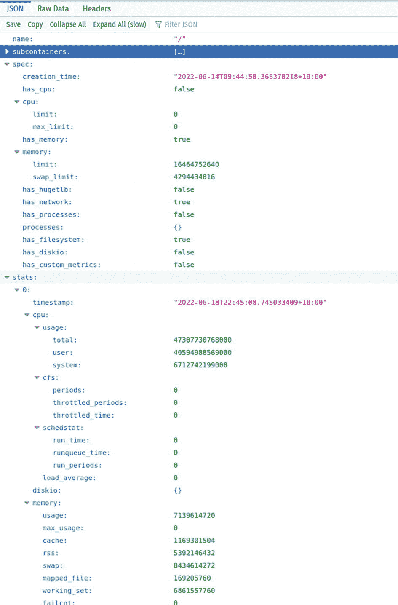

一张屏幕截图，显示输出为子容器，其中包含 CPU、内存范围、状态和 schedstat 的创建时间链接，这些指标针对特定限制进行测量。

**图 18-11** `/api/v1.0/containers` 的输出

### 管理器

管理器是 cAdvisor 的核心组件。它负责初始化、维护和报告其所管理容器的不同指标。其接口声明如下：

```go
type Manager interface {
    Start() error
    Stop() error
    GetContainerInfo(containerName string, query *info.ContainerInfoRequest) (*info.ContainerInfo, error)
    GetContainerInfoV2(containerName string, options v2.RequestOptions) (map[string]v2.ContainerInfo, error)
    SubcontainersInfo(containerName string, query *info.ContainerInfoRequest) ([]*info.ContainerInfo, error)
    AllDockerContainers(query *info.ContainerInfoRequest) (map[string]info.ContainerInfo, error)
    DockerContainer(dockerName string, query *info.ContainerInfoRequest) (info.ContainerInfo, error)
    GetContainerSpec(containerName string, options v2.RequestOptions) (map[string]v2.ContainerSpec, error)
    GetDerivedStats(containerName string, options v2.RequestOptions) (map[string]v2.DerivedStats, error)
    GetRequestedContainersInfo(containerName string, options v2.RequestOptions) (map[string]*info.ContainerInfo, error)
    Exists(containerName string) bool
    GetMachineInfo() (*info.MachineInfo, error)
    GetVersionInfo() (*info.VersionInfo, error)
    GetFsInfoByFsUUID(uuid string) (v2.FsInfo, error)
    GetDirFsInfo(dir string) (v2.FsInfo, error)
    GetFsInfo(label string) ([]v2.FsInfo, error)
    GetProcessList(containerName string, options v2.RequestOptions) ([]v2.ProcessInfo, error)
    WatchForEvents(request *events.Request) (*events.EventChannel, error)
    GetPastEvents(request *events.Request) ([]*info.Event, error)
    CloseEventChannel(watchID int)
    DockerInfo() (info.DockerStatus, error)
    DockerImages() ([]info.DockerImage, error)
    DebugInfo() map[string][]string
}
```

这些接口及其实现位于 `manager.go` 中。

管理器为不同的容器技术使用插件。例如，Docker 插件负责与 Docker 引擎通信。Docker 插件位于 `container/docker/plugin.go` 文件中。以下是 Docker 插件的代码：

```go
package docker

import (
    ...
)

const dockerClientTimeout = 10 * time.Second
...
func (p *plugin) InitializeFSContext(context *fs.Context) error {
    SetTimeout(dockerClientTimeout)
    // Try to connect to docker indefinitely on startup.
    dockerStatus := retryDockerStatus()
    ...
}
...
func retryDockerStatus() info.DockerStatus {
    startupTimeout := dockerClientTimeout
    maxTimeout := 4 * startupTimeout
    for {
        ...
    }
}
```

管理器的主要工作是监控容器，但在它能够执行此操作之前，需要先找出哪些容器可用以及如何监控它们。让我们看看第一步，即找出将被监控的容器。

在上一节中，提到 cAdvisor 在概念上将容器不仅仅指代 Docker，它监控的任何东西都被视为容器。让我们看看 cAdvisor 如何找到它要监控的容器。它将要监控的容器集合是在调用管理器的 `Start()` 函数时收集的，如下所示：

```go
func (m *manager) Start() error {
    ...
    err := raw.Register(m, m.fsInfo, m.includedMetrics, m.rawContainerCgroupPathPrefixWhiteList)
    if err != nil {
        klog.Errorf("Registration of the raw container factory failed: %v", err)
    }
    rawWatcher, err := raw.NewRawContainerWatcher()
    if err != nil {
        return err
    }
    m.containerWatchers = append(m.containerWatchers, rawWatcher)
    ...
    // Create root and then recover all containers.
    err = m.createContainer("/", watcher.Raw)
    if err != nil {
        return err
    }
    klog.V(2).Infof("Starting recovery of all containers")
    err = m.detectSubcontainers("/")
    if err != nil {
        return err
    }
    ...
    return nil
}
```

这个收集过程由 `m.createContainer(..)` 函数执行，图 18-12 展示了创建的内容。

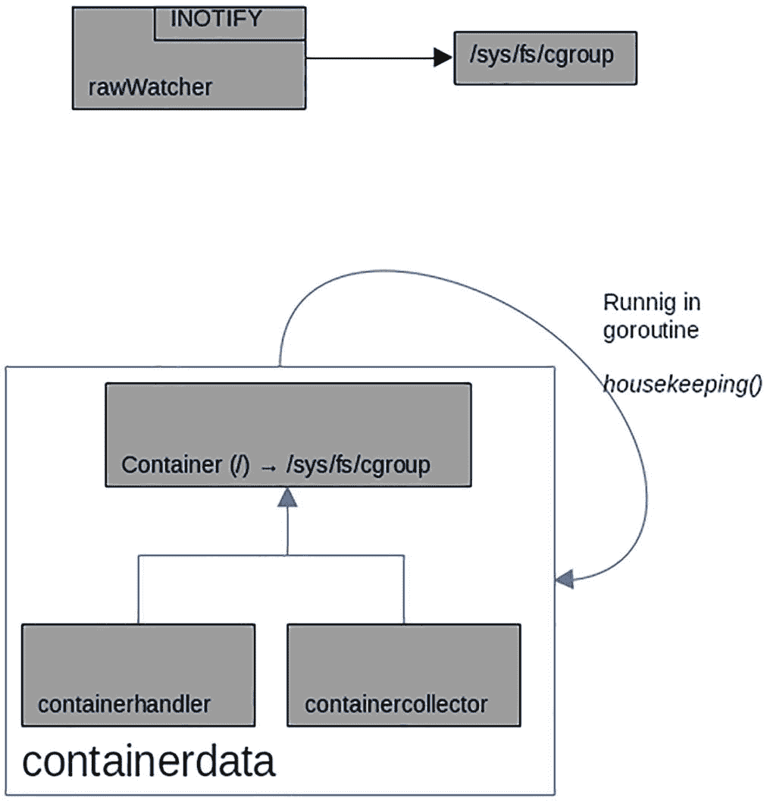


