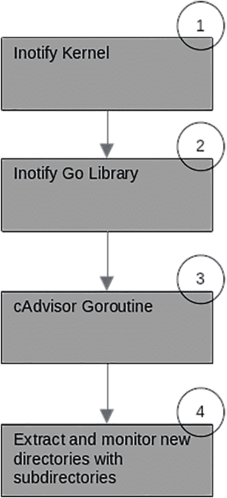

# 沿处理程序的容器数据模型示意图，图像上半部分显示了容器展示及特定链接处的通知面板标记

图 18-12

`createContainer` 函数处理流程

基本上，它执行以下操作：

*   创建一个 `containerData` 结构体，其中填充了与容器相关的信息。在此例中，填充的是关于 `/sys/fs/cgroup` 目录的信息。
*   创建一个 `ContainerHandler` 和 `CollectManager`，用于处理与此特定容器（此处为 `/sys/fs/cgroup`）相关的所有事务，并收集所有必要的指标信息。
*   一旦所有结构体成功初始化，它将调用 `containerData` 结构体的 `Start()` 方法来启动监控。

从上述步骤可以清楚地看到，cAdvisor 正在监控 `/sys/fs/cgroup` 目录内发生的活动。正如你在第 4 章所学到的，该目录指的是 cgroups，它是 Docker 容器的基石。

cAdvisor 还会监控 `/sys/fs/cgroup` 的子目录，这些子目录都被视为容器，并且将像监控主 `/sys/fs/cgroup` 目录一样进行监控。这是通过 `detectSubcontainers(..)` 函数实现的，如下所示：

```
func (m *manager) detectSubcontainers(containerName string) error {
added, removed, err := m.getContainersDiff(containerName)
...
for _, cont := range added {
err = m.createContainer(cont.Name, watcher.Raw)
...
}
...
return nil
}
```

一旦 `/sys/fs/cgroup` 的所有子目录都处理完毕，它就会将这些容器添加到容器监视器的监控列表中。这是通过 `watchForNewContainers()` 函数完成的，代码如下所示：

```
func (m *manager) watchForNewContainers(quit chan error) error {
...
for _, watcher := range m.containerWatchers {
err := watcher.Start(m.eventsChannel)
if err != nil {
for _, w := range watched {
stopErr := w.Stop()
...
}
return err
}
watched = append(watched, watcher)
}
err := m.detectSubcontainers("/")
...
return nil
}
```

当所有容器都设置好被监控后，cAdvisor 将能够获知它们的任何变化。这项工作由上述代码片段中的 goroutine 完成。在下一节中，你将了解 cAdvisor 如何使用 `inotify`——这是 Linux 操作系统提供的一种机制，用于让应用程序在监控的目录中检测到任何活动时收到通知。

### 监控文件系统

cAdvisor 使用了 Linux 内核提供的 `inotify` API ([`https://linux.die.net/man/7/inotify`](https://linux.die.net/man/7/inotify))。该 API 允许应用程序监控文件系统事件，例如是否有文件被删除或创建。图 18-13 展示了 cAdvisor 如何使用 `inotify` 事件。



一个流程图在最终层级标记了 4 个事件：inotify 内核、库、Goroutine，以及新目录和子目录的监控。

图 18-13

cAdvisor 中的 `inotify` 流程图

在上一节中，你了解到 cAdvisor 会监控并监听 `/sys/fs/cgroup` 及其子目录的事件。这就是 cAdvisor 如何知道 Docker 容器是从内存中创建还是删除的。让我们看看它如何利用 `inotify` 实现这一目的。

代码使用了 `inotify` 库来监听来自内核的事件。cAdvisor 代码使用一个 goroutine 来处理 `inotify` 事件。这个 goroutine 是在调用 `watchForNewContainers` 时的初始化过程中创建的。`watchForNewContainers` 调用了 `container/raw/watcher.go` 中的 `Start` 函数，如下所示：

```
func (w *rawContainerWatcher) Start(events chan watcher.ContainerEvent) error {
watched := make([]string, 0)
for _, cgroupPath := range w.cgroupPaths {
_, err := w.watchDirectory(events, cgroupPath, "/")
...
watched = append(watched, cgroupPath)
}
go func() {
for {
select {
case event := <-w.watcher.Event():
err := w.processEvent(event, events)
if err != nil {
...
}
case err := <-w.watcher.Error():
...
case <-w.stopWatcher:
err := w.watcher.Close()
...
}
}
}()
return nil
}
```

`w.processEvent(..)` 函数负责处理接收到的 `inotify` 事件，并将其转换为内部事件，如下所示：

```
func (w *rawContainerWatcher) processEvent(event *inotify.Event, events chan watcher.ContainerEvent) error {
// 将 inotify 事件类型转换为容器创建或删除事件。
var eventType watcher.ContainerEventType
switch {
case (event.Mask & inotify.InCreate) > 0:
eventType = watcher.ContainerAdd
case (event.Mask & inotify.InDelete) > 0:
eventType = watcher.ContainerDelete
...
}
...
switch eventType {
case watcher.ContainerAdd:
alreadyWatched, err := w.watchDirectory(events, event.Name, containerName)
...
case watcher.ContainerDelete:
// 容器已删除，停止对其监控。
lastWatched, err := w.watcher.RemoveWatch(containerName, event.Name)
...
default:
return fmt.Errorf("未知的事件类型 %v", eventType)
}
// 传递事件。
events <- watcher.ContainerEvent{
EventType:   eventType,
Name:        containerName,
WatchSource: watcher.Raw,
}
return nil
}
```

该函数将接收到的事件转换为代码能够理解的内部事件：`watcher.ContainerAdd` 和 `watcher.ContainerDelete`。这些事件会在内部广播，供代码的其他部分处理。


### 来自 `/sys` 和 `/proc` 的信息

在第 2 章和第 3 章中，你了解了 `/sys` 和 `/proc` 文件系统以及可以从中找到哪些与系统相关的信息。cAdvisor 使用相同的方式收集机器信息，并将其作为指标信息的一部分报告。

`Manager` 负责收集和更新机器信息，如下代码片段所示：

```go
func New(memoryCache *memory.InMemoryCache, sysfs sysfs.SysFs, houskeepingConfig HouskeepingConfig, includedMetricsSet container.MetricSet, collectorHTTPClient *http.Client, rawContainerCgroupPathPrefixWhiteList []string, perfEventsFile string) (Manager, error) {
...
machineInfo, err := machine.Info(sysfs, fsInfo, inHostNamespace)
...
}
```

执行机器信息收集的主要代码可以在以下代码片段中看到 (`machine/info.go`)：

```go
func Info(sysFs sysfs.SysFs, fsInfo fs.FsInfo, inHostNamespace bool) (*info.MachineInfo, error) {
...
clockSpeed, err := GetClockSpeed(cpuinfo)
...
memoryCapacity, err := GetMachineMemoryCapacity()
...
filesystems, err := fsInfo.GetGlobalFsInfo()
...
netDevices, err := sysinfo.GetNetworkDevices(sysFs)
...
topology, numCores, err := GetTopology(sysFs)
...
return machineInfo, nil
}
```

以下是 `GetMachineMemoryCapacity()` 函数，以及它如何使用 `/proc` 目录收集内存信息：

```go
func GetMachineMemoryCapacity() (uint64, error) {
out, err := ioutil.ReadFile("/proc/meminfo")
if err != nil {
return 0, err
}
memoryCapacity, err := parseCapacity(out, memoryCapacityRegexp)
if err != nil {
return 0, err
}
return memoryCapacity, err
}
```

该函数读取 `/proc/meminfo` 目录，并通过调用 `parseCapacity()` 函数来解析接收到的信息。从 `/proc/meminfo` 中提取的原始信息如下所示：

```
MemTotal:       16078860 kB
MemFree:          698260 kB
...
Hugepagesize:       2048 kB
Hugetlb:               0 kB
DirectMap4k:      901628 kB
DirectMap2M:    15566848 kB
DirectMap1G:           0 kB
```

让我们再看另一个名为 `GetGlobalFsInfo()` (`fs/fs.go`) 的函数。这个函数调用了另一个名为 `GetFsInfoForPath(..) (fs/fs.go)` 的函数，如下所示：

```go
func (i *RealFsInfo) GetFsInfoForPath(mountSet map[string]struct{}) ([]Fs, error) {
...
diskStatsMap, err := getDiskStatsMap("/proc/diskstats")
...
return filesystems, nil
}
```

它调用 `getDiskStatsMap(..)`，并将 `/proc/diskstats` 作为参数传入。`getDiskStatsMap(..)` 函数读取并解析来自该目录的信息。该目录的原始信息如下所示：

```
...
259       0 nvme0n1 17925716 1726716 2140111562 27153144 9657604 6144332 374398866 10096182 1 7081436 37829936 0 0 0 0 666569 580610
...
253       2 dm-2 728297 0 5837468 252644 2635588 0 21084640 7281316 0 334744 7533960 0 0 0 0 0 0
```

现在让我们看看 cAdvisor 如何使用 `/sys` 目录读取信息。代码片段中显示的 `GetNetworkDevices(..) (utils/sysinfo/sysinfo.go)` 函数调用另一个函数来获取 `/sys/class/net` 的信息：

```go
func GetNetworkDevices(sysfs sysfs.SysFs) ([]info.NetInfo, error) {
devs, err := sysfs.GetNetworkDevices()
...
return netDevices, nil
}
```

`sysfs.GetNetworkDevices() (utils/sysfs/sysfs.go)` 的代码片段如下所示：

```go
const (
...
netDir       = "/sys/class/net"
...
)
func (fs *realSysFs) GetNetworkDevices() ([]os.FileInfo, error) {
files, err := ioutil.ReadDir(netDir)
...
var dirs []os.FileInfo
for _, f := range files {
...
}
return dirs, nil
}
```

该函数提取并解析信息，其原始格式如下所示：

```
lrwxrwxrwx  1 root root 0 Jun 19 14:09 docker0 -> ../../devices/virtual/net/docker0
...
../../devices/virtual/net/veth710aac6
lrwxrwxrwx  1 root root 0 Jun 19 12:30 veth98e6a97 -> ../../devices/virtual/net/veth98e6a97
lrwxrwxrwx  1 root root 0 Jun 19 14:09 wlp0s20f3 -> ../../devices/pci0000:00/0000:00:14.3/net/wlp0s20f3
```

### 客户端库

在仓库的 chapter18 文件夹内，有一些关于如何使用 cAdvisor 客户端库与 cAdvisor 通信的示例。这些示例展示了如何使用客户端库获取容器信息、来自 cAdvisor 的事件流等。

### 总结

在本章中，你学习了如何安装和运行 cAdvisor 来监控本地机器和 Docker 容器的指标。该工具提供了大量信息，用以展示机器上运行的不同容器的性能。本章讨论了 cAdvisor 如何利用你在之前章节中学到的知识，收集容器和本地机器的指标信息。

cAdvisor 提供的功能远不止本章所讨论的这些。例如，它内置支持将指标导出到 Prometheus，它提供了一个 API，可用于与其他第三方或内部工具集成以监控容器性能，等等。


