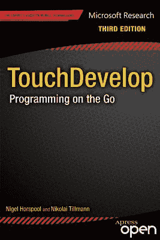

R. Nigel Horspool 与 Nikolai Tillmann：TouchDevelop：移动编程 第三版

ISBN 978-1-4302-6136-0 电子版 ISBN 978-1-4302-6137-7 [`doi.org/10.1007/978-1-4302-6137-7`](https://doi.org/10.1007/978-1-4302-6137-7)  
© 2013 年，Nigel Horspool、Nikolai Tillmann 与 Judith Bishop 著，TouchDevelop：移动编程  
总裁兼出版人：Paul Manning  
编辑：Jeffrey Pepper  
本书在全球图书市场的发行由 Springer Science+Business Media New York（地址：233 Spring Street, 6th Floor, New York, NY 10013）负责。电话：1-800-SPRINGER，传真：(201) 348-4505，电子邮件：`orders-ny@springer-sbm.com`，或访问 [`www.springeronline.com`](http://www.springeronline.com/)。如需了解翻译事宜，请发送电子邮件至 `rights@apress.com`，或访问 [`www.apress.com`](http://www.apress.com)。

(1) 作品分发许可：本作品版权归 Apress Media, LLC 所有，保留所有权利。除本许可规定外，禁止使用本作品。行使本协议项下的任何权利，即表示您接受本许可条款。您拥有非排他性权利，可以为所有非商业目的，以目前已知或未来出现的任何媒体和格式，完整地、以电子方式复制、使用和分发本英文作品，但不得进行修改（为特定设备进行格式化所需的必要修改除外）。尽管本作品中的建议和信息在出版时被认为是真实准确的，但作者、编辑和出版人均不对可能出现的任何错误或遗漏承担法律责任。出版人对本作品所包含的内容不作任何明示或暗示的保证。如果您的分发仅限于 Apress 源代码或完整使用 Apress 源代码，则必须附带以下许可 (2) 和 (3)。如果您使用的内容是对 Apress 在本作品中所提供源代码的改编，则您必须仅使用许可 (3)。

(2) Apress 源代码直接复制许可：本源代码来自 TouchDevelop，ISBN 978-1-4302-6136-0，版权归 Apress Media, LLC 所有，保留所有权利。允许直接复制此 Apress 源代码，但必须包含本许可。对于使用本产品中超过 5 行源代码的情况，如果代码经过改编或修改而偏离其原始 Apress 形式，则必须提供以下许可。此 Apress 代码按“原样”提供，Apress 不对该代码的功能、可用性、准确性或实用性作出任何声明、陈述或保证。

(3) Apress 源代码改编版分发许可：所提供的部分源代码来自或改编自 TouchDevelop，ISBN 978-1-4302-6136-0，版权归 Apress Media LLC 所有。任何使用或重用此 Apress 源代码的行为都必须包含本许可。此 Apress 代码按原样在 Apress.com/9781430261360 上提供，Apress 不对该代码的功能、可用性、准确性或实用性作出任何声明、陈述或保证。

  
开放获取 本书根据知识共享署名-非商业性使用-禁止演绎 4.0 国际许可协议 ([`​creativecommons.​org/​licenses/​by-nc-nd/​4.​0/​`](http://creativecommons.org/licenses/by-nc-nd/4.0/)) 进行许可，该协议允许任何非商业用途，在任何媒介或格式中进行复制、共享、分发和再现，前提是您给予原作者和来源适当的署名，提供指向知识共享许可协议的链接，并注明您是否修改了许可材料。根据本许可协议，您无权分享改编自本书或其部分内容的材料。本书中的图片或其他第三方材料均包含在本书的知识共享许可协议中，除非在材料的署名行中另有说明。如果材料未包含在本书的知识共享许可协议中，并且您的预期使用不受法定法规允许或超出允许范围，您需要直接向版权所有者获得许可。

ApressOpen 权利：您有权仅为非商业目的，完整地、以电子方式复制、使用和分发本作品，不得修改。但是，您还有额外权利，即为任何商业或非商业目的使用或修改本作品中的任何源代码，但必须附带下文 (2) 和 (3) 中的许可，以便分发超过 5 行代码的源代码实例。下文 (1)、(2) 和 (3) 许可及其间文本必须在任何使用本作品文本时提供，并完整描述在此授予本作品的许可。

本书中可能出现商标名称、徽标和图像。我们不会在每次出现商标名称、徽标或图像时都使用商标符号，而是仅以编辑方式使用这些名称、徽标和图像，以利于商标所有者，且无意侵犯商标权。本出版物中使用的商品名称、商标、服务标志及类似术语，即使未标明为商标，也不应被视为对其是否受专有权利保护的表达。

