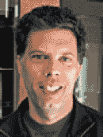
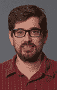
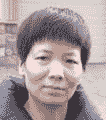
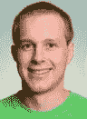
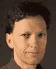
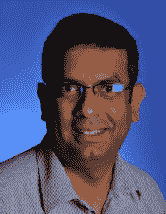
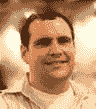

# 前言

智能手机的销量持续呈指数级增长。平板电脑也展现出同样惊人的普及率，并在生活的许多领域取代了笔记本电脑。我们可以想象，在不久的将来，几乎每个人都会随身携带一台以智能手机或平板电脑形式呈现的强大计算机。术语“移动设备”即用于涵盖此类设备。通常，智能手机或平板电脑的应用程序（app）必须在个人电脑上开发，然后传输到移动设备上。但情况必须如此吗？微软研究院的 TouchDevelop 项目已经证明答案是否定的。TouchDevelop 是一个可在所有移动设备上运行的编程环境。它允许在移动设备或个人电脑上编写脚本，并在任何移动设备或个人电脑上运行。该应用于 2011 年发布时仅适用于 Windows Phone，但出乎我们意料的是，它获得了热烈的反响：超过 20 万用户下载了该应用，并发布了超过 1 万个完全在手机上编写的脚本。此后，TouchDevelop 已推出适用于个人电脑、Mac 和 Linux 平台，以及 iPad、iPhone、iPod Touch 和 Android 设备的版本。TouchDevelop 是一个真正用于创建可移植应用的便携式开发环境。

## 本书读者对象

移动设备代表了最新的技术。此外，许多学生实际上拥有自己的智能手机。高中教师和大学讲师都喜欢利用最新技术来吸引学生的注意力。尽管他们可能是编程教学领域的专家，但许多教师在如何驾驭像`TouchDevelop`这样复杂的应用方面仍需要指导：其可视化程序编辑器专为触摸屏设计，并采用了与传统基于键盘的文本处理器不同的编辑范式。另一个机遇与挑战在于如何利用现代移动设备所提供的一些传感器。

本书为教师以及自学编程的学生提供了丰富的内容。对于教师而言，本书详细介绍了应用的各个屏幕，并指出了`TouchDevelop`语言与其他教师可能已熟悉的编程语言之间的异同。对于学生和爱好者来说，本书可以作为一个便捷的参考手册，放在他们正在使用的设备旁边——尤其是当该设备屏幕较小时，本书显得尤为实用。本书系统地阐述了所有编程语言结构，从变量和循环等最基础的结构开始。本书还探讨了许多手机传感器和数据源，这些正是让移动应用开发如此有价值的原因。

如果你刚接触`TouchDevelop`编程，或者你还没有在触摸屏设备上工作过，我们建议你从第 1 章开始阅读本书。如果你已经熟悉`TouchDevelop`编程环境的基本模式，那么你可以直接跳到后面涉及特定主题领域的章节。

本书是从用户在浏览器中编写代码的角度编写的。所有截图和导航说明均指在浏览器中运行的`TouchDevelop` Web 应用，并适用于除 Windows Phone 之外的所有平台。只有附录 E（介绍 Windows Phone 上的编辑器）使用了特定于 Windows Phone 的截图和说明。

本书可在网上获取，同时也由 APress 出版纸质版本。请发送电子邮件至`touchdevelop@microsoft.com`提供反馈。

## 本书背景

本书的这一版本是早期版本历经一年演进的成果，融合了作者在辅导课和讲座中收到的反馈。本书的第一个版本作为限量版（75 本）在 2012 年 3 月于北卡罗来纳州罗利举行的 ACM SIGCSE 会议上制作发行。那个版本基于当时最新发布的`TouchDevelop` 2.6 版本。第二个版本（1000 本）于 2013 年 1 月印刷，基于 2.10 版本，并通过知识共享许可协议发布，同时上架亚马逊书店和`TouchDevelop`网站。第二版中的大部分内容也适用于`TouchDevelop`的 Web 应用版，不过所有截图仍然是手机上的。这第三版已重新定位为`TouchDevelop`的 Web 应用版。

## 其他学习资料

在`TouchDevelop`网站上，你还可以找到大量的视频、教程和幻灯片，以帮助你学习和教授`TouchDevelop`。只需登录`TouchDevelop`网站后，点击“聊天与学习”标题下标注为“Docs”的大图标，即可找到这些学习资源。

欢迎提出宝贵意见。如需联系 TouchDevelop 团队或作者，你可以：

-   发送电子邮件至 `touchdevelop@microsoft.com`
-   在 [`https://facebook.com/touchdevelop`](https://facebook.com/touchdevelop) 上发帖
-   在应用内的论坛上发帖

重要网站

[`https://www.touchdevelop.com`](https://www.touchdevelop.com/)

[`https://www.facebook.com/TouchDevelop`](https://www.facebook.com/TouchDevelop)

[`http://research.microsoft.com/touchdevelop`](http://research.microsoft.com/touchdevelop)

TouchDevelop 团队

托马斯（汤姆）·鲍尔是微软研究院（雷德蒙德）的首席研究员和研究经理，因在程序性能分析、软件模型检查、程序测试和实证软件工程方面的贡献而广为人知。鲍尔因“对软件分析和缺陷检测的贡献”而被授予 2011 年 ACM Fellow 称号。自从在微软担任经理以来，他培育并扩展了自动定理证明、程序测试与验证以及实证软件工程等研究领域。他拥有康奈尔大学计算机科学学士学位，以及威斯康星大学麦迪逊分校的硕士和博士学位。

朱迪斯·毕晓普是美国雷德蒙德微软研究院计算机科学总监。她的职责是通过鼓励项目、支持会议和直接参与研究，在微软的研究团队与全球大学之间建立强有力的联系。她的专长是编程语言和分布式系统，具有强烈的实践导向，并对编译器和设计模式感兴趣。她是 17 本编程语言书籍的作者或编辑。她拥有英国南安普顿大学的计算机科学博士学位。

塞巴斯蒂安·伯克哈特是微软研究院的研究员。他在瑞士巴塞尔出生并长大。他的研究兴趣主要围绕如何方便、高效、正确地编写并发、并行和分布式程序这一普遍问题。更具体的兴趣包括一致性模型、并发测试、自适应计算和并发修订编程模型。在 IBM 拥有几年行业经验后，他在宾夕法尼亚大学获得了计算机科学博士学位。

陈娟是微软研究院雷德蒙德分院 RiSE 小组的研究员。她的主要研究领域包括编译器、程序验证和类型系统。她曾致力于面向对象语言的验证编译器，以及用于指定和验证程序属性的函数式编程语言的设计与实现。她拥有普林斯顿大学计算机科学博士学位。

乔纳森·“佩利”·德哈勒是微软研究院软件工程研究小组的软件工程师。佩利还在当地高中志愿教授移动计算机科学课程。从 2004 年到 2006 年，他在公共语言运行时（CLR）团队担任软件设计工程师（测试），负责即时编译器。他拥有比利时鲁汶天主教大学的应用数学博士学位。

Manuel Fähndrich 是微软雷德蒙德研究院 `RiSE` 组的高级研究员。他致力于编程语言设计、静态类型系统、程序分析与验证，以及运行时技术与优化等领域。他过去和现在参与的项目包括 `Singularity` 操作系统与 `Sing#` 语言、`.NET` 的 `CodeContracts`，以及 `TouchDevelop`。他拥有加州大学伯克利分校的博士学位。

Nigel Horspool 是维多利亚大学的计算机科学教授。他的研究与教学重点一直是编程语言和编译器，尽管他最主要的名望来自于一种字符串搜索算法。他是三本书的作者或合著者，内容涵盖 `C` 语言、`Unix` 和 `C#` 语言。他目前是《`Software: Practice and Experience`》期刊的联合编辑。他拥有加拿大多伦多大学的计算机科学博士学位。

Michał Moskal 是雷德蒙德的研究员。他在 `RiSE` 组从事软件验证、自动定理证明和编程语言方面的工作。他致力于一个名为 `VCC` 的并发 `C` 程序形式化验证器，同时还参与了其他项目，包括 `Boogie` 中间验证语言、`SPUR` 追踪 `JIT` 及 `DKAL` 授权引擎。他拥有波兰弗罗茨瓦夫大学的博士学位。

Michał Moskal 是雷德蒙德的研究员。他在 `RiSE` 组从事软件验证、自动定理证明和编程语言方面的工作。他致力于一个名为 `VCC` 的并发 `C` 程序形式化验证器，同时还参与了其他项目，包括 `Boogie` 中间验证语言、`SPUR` 追踪 `JIT` 及 `DKAL` 授权引擎。他拥有波兰弗罗茨瓦夫大学的博士学位。

Arjmand Samuel 与学术界合作，促进设备和服务于研究领域的研究与协作。他领导微软研究院（`Project Hawaii` 和 `TouchDevelop`）的移动和云计算研究及外联工作。他近期的研究兴趣在于各种形态和形式设备（`TouchDevelop` 和 `HomeOS`）的软件架构和编程范式。他在安全、隐私、位置感知访问控制以及移动技术的创新应用等多个主题上发表了各类出版物。Samuel 拥有普渡大学的信息安全博士学位。

Nikolai Tillmann 是微软研究院的首席研究软件设计工程师。他的主要研究领域包括移动设备上的程序编写、程序分析、测试、优化和验证。他发起了 `TouchDevelop` 项目，该项目使终端用户能够在移动设备上为移动设备编写程序。他还领导 `Pex` 项目，在该项目中他与 `Peli de Halleux` 共同开发了一个基于参数化单元测试和动态符号执行的 `.NET` 运行时验证与自动测试用例生成框架。Nikolai 拥有德国柏林工业大学的计算机科学 `Dipl. Inf.` 学位。

## 致谢

随着 `TouchDevelop` 社区的发展，我们发现自己正从每一位参与该项目的人身上学习——无论是黑客马拉松上的学生、撰写论文的学者，还是集市上那些令人惊叹的应用的开发者们。感谢大家。

