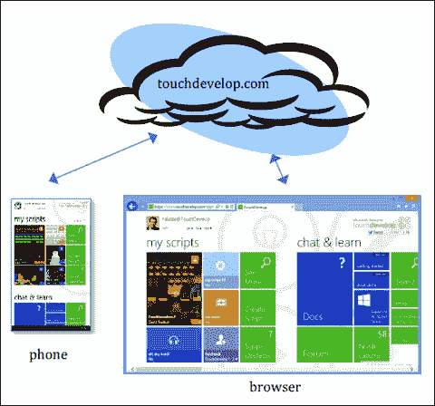
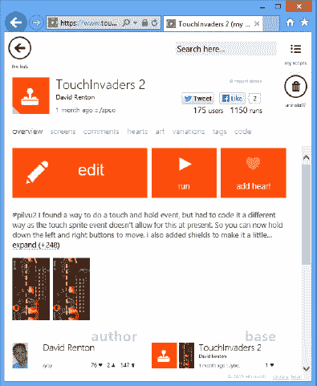
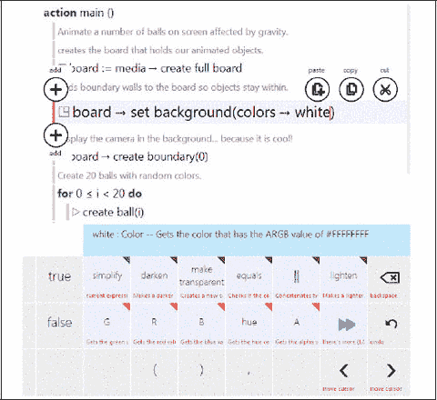

# 1. TouchDevelop 简介

电脑渴望被编程  
什么是 TouchDevelop？  
TouchDevelop 生态系统  
历史与未来  
平台  
脚本语言  
关键词：移动设备 云服务 近场通信 窗口手机 导弹防御

TouchDevelop 是一个完整的应用创建生态系统，专为触控、云端互联的移动设备而设计。本章将简要介绍 TouchDevelop 脚本世界及其支持的设备。

## 电脑渴望被编程

电脑无处不在，且形态各异：电视、智能手机、带应用程序的冰箱等。尽管形式和功能如此丰富，直到最近，大多数人被问及电脑时，首先想到的仍是台式电脑，然后才是笔记本电脑。这种认知正在转变，因为智能手机和平板电脑正迅速成为越来越多人的主要计算设备。事实上，智能手机的销量甚至比某些分析师预期的更快地超过了个人电脑。

新型智能手机和平板电脑性能日益强大，足以胜任许多原本需要个人电脑才能完成的任务。移动设备已成为阅读和撰写电子邮件、浏览网页和玩游戏等用途的成熟工具。这些设备甚至被用于批注文档。然而，有一项可被视为任何计算平台决定性时刻的任务，至今尚未在智能手机和平板电脑上广泛普及：编写代码，甚至创建完整的应用程序。

上一代人是伴随着功能齐全的个人电脑成长的，他们总有机会对这些电脑进行编程。尽管大多数人选择不这样做，但他们至少拥有这个选项。数十年的编程语言和开发环境研究，为个人电脑打造了功能强大的工具。正是通过探索这一机会，许多年轻人对计算机科学产生了兴趣。

不幸的是，在这个以现有精选内容为核心的应用程序和应用程序市场的新世界里，过去曾激励有抱负程序员的那种编程创作途径似乎已不再容易触及。人们在自己拥有且日常使用的设备上进行编程的能力，已不再是显著的选项。

诚然，智能手机和平板电脑为编程任务带来了新的挑战。这些设备没有物理键盘，屏幕通常较小，数据通常不存储在本地，而是从云端动态获取。微软研究院的一个团队提出了一个问题：“是否有可能直接在智能手机上创建有趣的应用程序，而无需使用单独的个人电脑或键盘？”正是为了尝试回答这个问题，TouchDevelop 应运而生。

TouchDevelop 团队接受了从头开始重新思考计算机编程的挑战，试图理解现代移动触屏设备应如何以其自身方式被编程。TouchDevelop 的创建目标是摒弃那些针对通过键盘输入线性文本而优化、且通常因假设大屏幕而显得冗长的编程语言的遗留问题。

我们相信，随着越来越多的人将移动设备作为其主要（甚至可能是唯一）的计算设备，不仅让用户能够消费内容，而且赋予他们生产内容的能力将变得更加重要。我们尤其相信要赋予用户创建新应用程序的能力。

## 什么是 TouchDevelop？

TouchDevelop 是一种新颖的应用程序开发环境，允许任何人在任何地方为其移动设备编写脚本。它不需要单独的个人电脑，可供学生、爱好者、高级用户和开发人员使用。通过 TouchDevelop，用户可以创建脚本（即使用 TouchDevelop 编写的应用），以访问智能手机、平板电脑或个人电脑上的数据、媒体和传感器。这些脚本还可以与用于存储、计算和社交网络的云服务进行交互。TouchDevelop 应用程序用途广泛，通常是为了娱乐、个性化手机以及创建生产力工具而编写的。

TouchDevelop 将第一代可编程个人电脑的兴奋感带到了如今无处不在的移动设备上。使用 TouchDevelop 开发的脚本，用户可以展示和操作存储在自己移动设备上的音乐和图片，使用设备的传感器，并与社交网络中的朋友互动。

TouchDevelop 可用于开发诸如“导弹防御”之类的游戏，这是一款功能完备的游戏，玩家必须保卫城市抵御来袭导弹（ [`https://www.touchdevelop.com/zvpj`](https://www.touchdevelop.com/zvpj) ）。这个示例游戏的脚本可以下载到安装在 Windows Phone 上的 TouchDevelop 应用程序中，或直接从 TouchDevelop 网络应用程序下载。用户可以完全访问脚本，并以任何可以想象的方式修改游戏。如果有人对游戏进行了改进，改进后的游戏可以与其他人分享。只需轻点按钮，即可将修改后的脚本上传回网站。该脚本将被分配一个不同的标识标签（替换 URL 末尾的 `/zvpj` 字符）。如果“导弹防御”的作者发布了更新，TouchDevelop 会自动将用户重定向到该游戏的最新版本。

一个用于提高生产力的 TouchDevelop 脚本示例是“我的在线会议”脚本，该脚本可查找正在进行的在线会议。如果存在此类会议，可以通过手机上安装的 Microsoft Lync 应用程序加入（ [`https://www.touchdevelop.com/mpuj`](https://www.touchdevelop.com/mpuj) ）。

TouchDevelop 网站提供了各种脚本，可用于学习或作为示例。旨在说明如何使用内置 API 的示例脚本可在 URL [`https://www.touchdevelop.com/pboj`](https://www.touchdevelop.com/pboj) 找到。通过访问 TouchDevelop 网址 [`https://www.touchdevelop.com/search`](https://www.touchdevelop.com/search) 并在搜索框中输入诸如“game”之类的术语，可以找到其他用户编写的脚本。此外，也可在 [`https://www.touchdevelop.com/doc/api`](https://www.touchdevelop.com/doc/api) 探索在线 API 手册。

## TouchDevelop 生态系统

使用 TouchDevelop 编辑器开发的脚本，可通过 TouchDevelop 云基础设施（位于[`https://www.touchdevelop.com`](https://www.touchdevelop.com/)）与其他用户共享。

图 1-1 展示了 TouchDevelop 生态系统的高层架构概览：无论用户使用的是手机客户端还是浏览器客户端，所有诸如脚本之类的信息都会被检索并存储于 `touchdevelop.com` 云服务中。

图 1-1

TouchDevelop 生态系统

TouchDevelop 脚本由用户在其设备上开发，并在 TouchDevelop 运行时环境中执行。这些脚本可以与其他用户共享。TouchDevelop 云基础设施在一个 TouchDevelop 用户社区中支持这种共享。这些脚本还可以通过 TouchDevelop 网站进行搜索、查看并安装到用户账户中。云基础设施不仅支持共享，还充当了所有由用户开发并发布的脚本的存储库。

TouchDevelop 网站为每个脚本在 [`http://touchdevelop.com`](http://touchdevelop.com/) 上分配了一个唯一的深层链接；每个脚本由一个看似随机的字母序列来标识。例如，[`https://www.touchdevelop.com/zpco`](https://www.touchdevelop.com/zpco) 指向的是 TouchInvaders 游戏的一个特定版本，如图 1-2 所示。该链接可用于直接打开脚本。这个链接可以分享给其他人，或者发布到社交网络上。

图 1-2

查看脚本的元数据

如果用户喜欢某个脚本，他或她可以通过给予一个“爱心”形式的正面评价来表达对脚本或评论的赞赏。

在任何客户端（手机或网页浏览器）上，用户都可以编辑脚本，如图 1-3 所示。

图 1-3

编辑脚本

### 历史与未来

2011 年 4 月发布 TouchDevelop 后，最初仅面向 Windows Phone 用户，其热烈的反响令我们惊讶。自那时起，已有超过 30 万人下载了该应用。起初，TouchDevelop 仅限于在安装它的设备上创建脚本——用户无法与他人共享脚本。

2011 年 8 月，TouchDevelop 更新至 v2.0 版本，通过 `touchdevelop.com` 云服务实现了脚本共享。此次更新还增加了更多社交功能，例如评论脚本、撰写评论、截取屏幕截图等。自那以后，超过 9 万人注册了在线账户，并分享了超过 2.5 万个脚本，其中大部分完全是在手机上编写的。随着时间的推移，许多功能被陆续添加，使 TouchDevelop 成为一个日益强大的开发环境和编程语言。这些功能包括对代码复用的库支持以及自定义结构化数据类型。

为了让脚本不仅在 TouchDevelop 环境内共享，还能与那些可能不了解 TouchDevelop 的人分享，我们增加了将脚本导出为可提交至 Windows Phone 商店的应用的功能。该功能自 2012 年 3 月起就已存在。

2012 年 10 月，TouchDevelop 迈出了一大步。得益于完全的重写实现，TouchDevelop 现在不仅能在 Windows Phone 上运行，还能在几乎所有现代设备的浏览器中以 Web 应用的形式运行。支持的平台包括 PC、Mac、iPhone、iPad、iPod Touch 和 Android。新的 TouchDevelop 实现利用了 HTML5 和 JavaScript 的强大功能，同时仍沿用之前的编程语言。代码编辑器会根据屏幕尺寸动态调整，以适应智能手机的小屏幕、平板电脑的中等屏幕以及 PC 的大屏幕。Web 应用的用户界面再次针对触摸屏进行了优化，但如果需要且可用，也支持使用键盘和鼠标。同时，我们还增加了将脚本导出为可提交至 Windows 商店（这与 Windows Phone 商店是分开考虑的）的应用的功能。

在不久的将来，适用于 Windows Phone 的 TouchDevelop 应用 v3.0 更新将为 Windows Phone 8 设备带来当前驱动 TouchDevelop Web 应用的相同编辑和执行引擎。

TouchDevelop 编程语言即将迎来的一项重要补充是“云端状态”这一概念。只需像在 C# 中将变量标记为“static”一样，将一个变量标记为“cloud”，应用就会转变为一个具有共享状态的分布式应用。对该变量的所有更改都将自动在不同设备和用户之间同步。

### 平台

Windows Phone 有多种可选传感器。“近场通信”（NFC）、前置摄像头、后置摄像头、磁力计和陀螺仪可能存在于或不存在于任何给定的设备型号中。类似地，有些浏览器选择暴露某些传感器，而有些则不然。iOS 上的 Safari 暴露了加速度计；Android 上的 Chrome 仅部分暴露；而 Internet Explorer 10 则完全不暴露。这种多样性很可能是由于 HTML5 标准不断演进造成的；因此，希望随着时间的推移，所有浏览器都能支持越来越多的传感器。

根据这些限制，以及你是在 Windows Phone 上运行原生 TouchDevelop 应用，还是在浏览器中运行 Web 应用，当你编写脚本时，可用的功能集将有所不同。有关不同平台功能的完整且最新的概述，请参见 [`https://www.touchdevelop.com/platforms`](https://www.touchdevelop.com/platforms)。

#### 在 Windows Phone 上安装 TouchDevelop

如果要在 Windows Phone 上首次使用 TouchDevelop，则需要先进行安装。要安装该应用，请遵循以下步骤：

1.  点击 Windows Phone 上的“商店”磁贴。
2.  按屏幕底部的搜索图标，并在商店搜索文本框中输入文本 `touchdevelop`。在你输入完所有字母之前，TouchDevelop 应用应该会作为一个选项出现在屏幕上。
3.  点击该选项以选中它。
4.  点击“安装”。

如果你的设备运行的是 Windows Phone 7、7.5 或 7.8 操作系统，那么你将获得 TouchDevelop v2.0，它使用的用户界面略有不同，与本书中的截图不符，并且其语言是本书所讨论内容的一个子集。

如果你的设备运行的是 Windows Phone 8，那么你将获得 TouchDevelop v3.0，它与位于 [`https://www.touchdevelop.com/app`](https://www.touchdevelop.com/app) 的 Web 应用类似，但它暴露了手机上更多可用的传感器和数据提供程序。

#### 在其他平台上运行 TouchDevelop

在所有其他平台上，TouchDevelop 并非作为应用商店中的应用出现，而是作为一个 Web 应用。你可以从网页浏览器中运行它：

1.  转到 [`https://www.touchdevelop.com/`](https://www.touchdevelop.com/)
2.  登录。你会被带到 Web 应用。

## 脚本语言

`TouchDevelop` 是一门用于编写移动应用的语言。`TouchDevelop Windows Phone` 应用程序及其 Web 应用同样提供了运行 `TouchDevelop` 脚本的执行环境。

`TouchDevelop` 语言是一种基于类型、结构化的编程语言，其核心设计理念是仅通过触控来编写代码。它内置了多种基本数据类型，方便开发者访问移动设备上丰富的传感器数据。`TouchDevelop` 融合了命令式、面向对象和函数式语言的特点。其中命令式部分最为显著：用户可以更新局部变量以及全局对象的状态。面向对象特性是由自动补全需求所决定的——对象的属性是一种易于访问且直观的概念。然而，为了保持简洁性，该语言不提供定义新类型作为其他类型子类型的功能。

一个 `TouchDevelop` 脚本由若干动作（函数或过程）、事件（当外部事件发生时需执行的动作）、表和记录类型的定义、全局状态（全局变量和只读数据）以及库引用（对其他脚本的引用）构成。该语言的详细介绍请参阅第 2 章。

`TouchDevelop` 脚本编辑器是 `TouchDevelop` 应用程序的一部分。其设计目标是仅通过触摸屏高效录入脚本。`TouchDevelop` 脚本在 `TouchDevelop` 应用内部执行。其执行模式完全是反应式的——动作响应事件而运行。事件可以由用户输入（例如，与 UI 元素交互、改变手机方向或摇晃手机）、手机事件（例如，音乐播放器中当前歌曲的切换）或时间流逝来触发。`TouchDevelop` 采用协作式多线程。动作和事件以单线程方式执行。

 开放获取 本章依据知识共享署名-非商业性使用-禁止演绎 4.0 国际许可协议 ([`creativecommons.org/licenses/by-nc-nd/4.0/`](http://creativecommons.org/licenses/by-nc-nd/4.0/)) 授权。只要您恰当注明原作者及来源，提供指向本知识共享许可协议的链接，并指明您是否修改了许可材料，您就可以在任何媒介或格式中复制、分享、分发和复制本作品，但仅限于非商业性目的。依据本许可协议，您无权分享改编自本章或其部分内容的材料。除非在材料的署名行中另有指明，本章中的图片或其他第三方材料均包含在本章的知识共享许可协议范围内。如果材料未被包含在本章的知识共享许可协议中，且您的预期使用不被法定法规允许，或超出了允许的使用范围，您需要直接向版权所有者获取许可。

