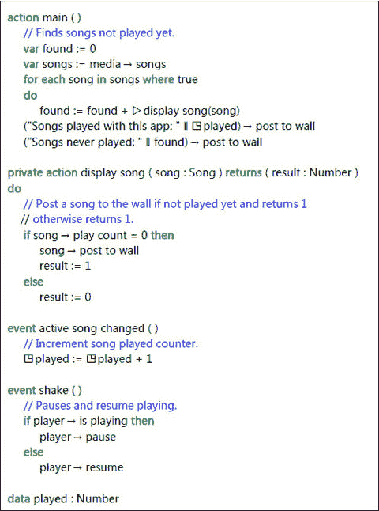

# 2. 脚本语言

引言 – 语言风格 数据类型与变量 表达式 语句 动作 事件 页面 创建库脚本 关键字 结果 参数 对象 类型 集合 类型 引用 类型 窗口 手机

一个 `TouchDevelop` 脚本对用户而言，表现为一种与其他众多编程语言颇为相似的语言所编写的语句。本章将介绍该语言的语法与语义。该语言通过一个功能强大的 API（应用程序编程接口）得到了增强，该 API 显著扩展了 `TouchDevelop` 语言的编程能力。API 将在本章之后的章节中进行介绍。

## 引言 – 语言风格

这几段引言是为那些熟悉部分用于描述编程语言语义术语的读者所写，以便这些读者能够快速浏览本章的大部分内容。

脚本语言以语句为基本单位。语句按顺序执行。控制流结构包括 `if` 语句、`for` 和 `while` 循环以及函数（在本语言中称之为动作）。

语句用于操作数值。所有中间值和变量都经过静态类型检查。只有动作的参数具有显式类型声明。所有其他值和变量的数据类型通过代码分析进行推断。

该语言是强类型语言，这意味着（除一个例外情况外）每个操作都要求操作数具有特定的数据类型，并且不存在自动转换为操作所需类型的机制。数据类型属于两个类别之一：值类型和引用类型。值类型可以在用于局部变量的栈上分配存储空间，其存储空间在退出动作（即退出函数）时自动释放。引用类型的存储空间在堆上分配。

堆内存由垃圾回收机制管理。除了参数和局部变量外，脚本可以在其数据区定义全局可见变量，或者在其艺术区定义只读变量。这些变量的存储在脚本执行期间是持久的。

尽管该语言的语法与面向对象语言有相似之处，但它并不支持面向对象编程范式。例如，没有类继承或方法重载的等价物。

为了节省小屏幕上的空间，部分关键字被替换为符号使用。这些符号都可以在 `Segoe UI Symbol` 字体（Windows 7 和 Windows 8 操作系统附带的一种字体）中以字符形式找到。表 2-1 对这些符号进行了汇总。


### 示例程序（`/okzc`）

该示例程序如图 2-1 所示。它使用了 API 提供的若干特性，此处仅作简要说明，更完整的解释将在后续章节中给出。请注意，该脚本仅在 Windows Phone 上运行。

该脚本包含两个动作和两个事件。名为 `main` 的动作是脚本的入口点。名为 `display song` 的动作由 `main` 调用。它有一个名为 `song`（类型为 `Song`）的输入参数，以及一个名为 `result`（类型为 `Number`）的结果参数。

`main` 动作定义并初始化了一个名为 `found` 的局部变量。该定义中未提供数据类型；它是根据用于初始化的值推断而来，该值类型为 `Number`。名为 `songs` 的局部变量通过使用 API，被初始化为手机中所有歌曲的集合。

表 2-1

脚本中使用的特殊符号

| 符号 | Unicode 值 | 描述 |
| --- | --- | --- |
| → | U+2192 | 选择左侧值所属的方法或字段 |
| ▷ | U+25B7 | 调用右侧命名且在当脚本中定义的动作 |
| ◳ | U+25F3 | 访问脚本数据部分中定义的全局持久变量 |
| ♻ | U+267B | 调用另一个脚本中定义的、已作为库发布的函数 |
| ⌹ | U+2339 | 访问脚本记录部分中声明的数据类型或项 |
| ✿ | U+273F | 访问脚本艺术部分中的值 |

一个 for-each 循环遍历集合中的每一个值，将下一个变量赋值给一个名为 `song` 的新局部变量。循环内的第一条语句使用符号 ▷`display song(song)` 调用一个动作。它传递了对局部变量 `song` 的引用，并接收一个数字作为结果，将其添加到 `found` 变量中。

循环内的第二条语句获取一个字符串常量，并连接名为 `played` 的全局数据项的值。前面的符号 `◳` 表示该变量具有全局作用域且是持久的。字符串连接运算符是 `||`，它是 TouchDevelop 中唯一重载的运算符——这意味着它接受任何数据类型的操作数，并且这些操作数的值会被转换为字符串。

由连接操作构建的结果字符串值出现在箭头运算符 → 的左侧。它表示该值将被传输到右侧显示的方法，其名称为 `post to wall`。几乎每种数据类型都有一个 `post to wall` 方法；它会导致该值的表示形式显示在屏幕上。

该示例脚本包含两个事件。事件是在指定事件发生时执行的动作。`shake` 事件由物理摇晃手机触发。当手机传感器检测到摇晃时，为 `shake` 事件提供的代码将被执行。事件不会相互中断；它们按照先到先服务的顺序执行。



图 2-1

“新歌曲”脚本（`/okzc`）

如果脚本包含一个或多个事件，则主程序不会终止。它会等待事件发生。在这种情况下，脚本仅在用户停止（例如，点击手机的后退按钮）或执行对 API 中相应方法的调用（`time` → `stop`）时才会终止。

## 数据类型和变量

每种类型（特殊类型 `Nothing` 除外）都属于以下两类之一：值类型或引用类型。如果变量是值类型，则该类型实例的存储空间直接保存在变量内部。例如，类型为 `Number` 的变量会被分配用于存储数字值的存储空间。然而，如果变量是引用类型，则其值的存储空间会在堆上分配，变量持有对该堆存储空间的引用。

### 2.2.1 `Invalid` 值

每种数据类型（特殊类型 `Nothing` 除外）除了其所有正常值外，还有一个特殊值 `Invalid`。此特殊值通常用于指示全局数据变量尚未初始化，或 API 中的方法无法返回值。TouchDevelop 提供了一种方法，用于测试任何数据类型（`Nothing` 除外）的值是否为 `Invalid` 值。还有 API 方法用于获取任何所需类型的 `Invalid` 值。

如果使用脚本的 `Records` 部分中声明的 `Object` 类型构建数据结构（如树或链表），则通常使用 `Invalid` 值来扮演 `null` 引用值的角色。

下面是一些演示 `Invalid` 值用法的代码。

```
var numUsers := 0
…
if 检测到连接失败 then
    numUsers := invalid → number
else
…
if numUsers → is invalid then
    “脚本正在终止” → post to wall
Else
```


### `Nothing` 类型

一个不返回可用结果但成功执行的方法或操作，实际上会返回一个 `Nothing` 类型的值。例如，为每种数据类型提供的“发布到墙”方法返回的就是 `Nothing` 类型的结果。在某些语言（如 F#）中，`Unit` 类型等同于 TouchDevelop 中的 `Nothing` 类型。存在一个值为 `Nothing` 类型的单一值。该类型不提供任何操作；它类似于 C/C++ 和 Java 等语言中的 `void` 类型。

### 值类型

TouchDevelop 脚本语言提供的基本类型或基础类型包括 `Number`、`Boolean` 和 `String`。这些都是值类型。此外还有几种复合类型也属于值类型。所有值类型都列在表 2-2 中。以下是关于 `Number` 和 `String` 类型的更多细节。

#### `Number`

`Number` 类型结合了其他语言中的整数和浮点类型。其值以双精度浮点格式存储，符合 IEEE 754 标准。这意味着特殊值`正无穷`、`负无穷`和 `NaN`（非数值）可以作为计算结果产生。

当 `Number` 值在需要整数的上下文中使用时（例如选择集合中的第 k 个值），该值会四舍五入到最接近的整数。恰好位于中间的值会向上取整；例如，`1.5` 向上取整为 `2`，而 `1.49` 向下取整为 `1`。

**表 2-2**  
值类型

| 值类型 | 描述 | 涵盖章节 |
| --- | --- | --- |
| `Number` | 整数或浮点数 | 2 |
| `Boolean` | 常量为 `true` 和 `false` 的类型 | 2 |
| `String` | 零个或多个 Unicode 字符的序列 | 2 |
| `Color` | 用于屏幕上显示的颜色。值兼容 4 字节 ARGB（Alpha、红、绿、蓝）颜色表示。`Color` 数据类型提供了许多标准颜色作为常量。 | 6 |
| `DateTime` | 保存从公元 0001 年到公元 9999 年的任意日期，以及一天中的时间。时间精度为 100 纳秒。 | 8 |
| `Location` | 保存纬度、经度和海拔值的组合，以及二维空间中的航向和速度。 | 8 |
| `Motion` | 描述手机在 3D 空间中运动的传感器读数组合，外加一个记录读数时间的时间戳。运动信息包括速度、加速度和角速度。 | 7 |
| `Vector3` | 三个数字组成的三元组，用于保存三个空间维度上的速度或加速度，或 3D 空间中绕三个轴的角速度。 | 7 |

#### `String`

字符串可以包含零个或多个 Unicode 字符。当字符串常量作为 TouchDevelop 脚本的一部分显示时，使用双引号将字符串括起来，并使用反斜杠转义字符串内部的双引号或特殊字符。但是，在使用编辑器输入字符串常量时，不应输入任何反斜杠字符（除非需要在字符串常量中包含反斜杠字符本身）。

需要注意的是，TouchDevelop 不提供用于处理单个字符的 `char` 类型。应改用长度为 1 的字符串。

### 引用类型

引用类型的实例存储在与声明了该类型的变量不同的位置。具有引用类型的局部变量被实现为指向实际值（存储在别处）的指针（引用）。

在 TouchDevelop 中，提供了两种引用类型。如果值表示存在于 TouchDevelop 外部的实体（例如 Windows Phone 上的歌曲），则存储分配在 TouchDevelop 应用程序之外。否则，存储分配在 TouchDevelop 控制的内存区域中，该区域称为“`堆`”。当堆上的某个值不再有引用时，该值使用的存储空间会自动回收。这被称为“`垃圾回收`”。对 TouchDevelop 脚本中的引用类型所能执行的语言功能和操作，取决于这些值是脚本外部的还是内部的。

当将一个具有引用类型的变量赋值给另一个变量时，两个变量都将成为对同一实例的引用。以下代码提供了一个简单示例来说明两个变量共享一个实例的情况。

```
// 设置 x 指向一个 Contact 类型的值
var x := social → choose contacts
var y := x
x → set title(“His Excellency”)
y → title → post to wall
```

在此示例中，最后一条语句在屏幕上显示的标题始终是“His Excellency”，这是因为 `x` 和 `y` 都是堆上同一实例的引用，并且该实例（`Contact` 类型）的 title 字段已被设置为该字符串。

#### API 提供的引用类型

排除集合类型（将在本章下一小节中介绍），表 2-3 列出了由 API 实现并可供 TouchDevelop 脚本使用的引用类型。该表明确指出了每种类型的实例存储是分配在堆上还是 TouchDevelop 脚本外部。

**表 2-3**  
API 提供的引用类型

| 引用类型 | 描述 | 存储位置 | 涵盖章节 |
| --- | --- | --- | --- |
| `Appointment` | 日历约会 | 堆 | 8 |
| `Board` | 可在其上绘制和移动精灵的 2D 画布 | 堆 | 9 |
| `Camera` | 前置或后置摄像头 | 外部 | 6 |
| `Contact` | 关于个人或公司的联系信息与详情 | 外部 | 8 |
| `Form Builder` | 用于创建 HTML 表单数据 | 堆 | -- |
| `Json Builder` | JSON 数据结构构建器 | 堆 | -- |
| `Json Object` | JSON 数据结构（从网站获取） | 堆 | 4 |
| `Link` | 指向视频、图片、电子邮件或电话号码的链接 | 堆 | 5,6,8 |
| `Location` | 地理位置 | 堆 | 7,8 |
| `Map` | BING 地图 | 堆 | 8 |
| `Matrix` | 二维数字矩阵 | 堆 | -- |
| `Media Link` | 家庭网络上的媒体文件 | 外部 | 5,6 |
| `Message` | 留言板上的帖子 | 堆 | 8 |
| `OAuth Response` | OAuth 2.0 访问令牌或错误 | 堆 | 11 |
| `Page` | 墙面上的页面 | 堆 | 3 |
| `Page Button` | 墙面上可点击的按钮 | 堆 | 3 |
| `Picture` | 包含图形或照片的矩形图片 | 外部 | 6 |
| `Picture Album` | 命名的图片相册 | 外部 | 6 |
| `Place` | 已命名的位置 | 堆 | 8 |
| `Playlist` | 歌曲播放列表 | 堆 | 5 |
| `Song` | 歌曲 | 外部 | 5 |
| `Song Album` | 歌曲专辑 | 外部 | 5 |
| `Sound` | 声音片段 | 堆 | 5 |
| `Sprite` | 可在 `Board` 实例上显示的图形对象 | 堆 | 9 |
| `TextBox` | 用于在屏幕上显示文本的框 | 堆 | 6 |
| `Web Request` | HTTP 网络请求 | 堆 | 4 |
| `Web Response` | HTTP 网络响应 | 堆 | 4 |
| `Xml Object` | XML 元素或元素集合 | 堆 | 4 |


## 集合类型

该 API 也提供同构集合。一个集合包含零个或多个元素，其类型是表 2-2 中列出的值类型或引用类型之一。针对许多可能的元素类型都提供了集合。当某集合类型未提供时，可以使用 `Object` 声明来定义一个等价的列表类型（参见下面的 `Objects` 和 `Decorators`）。

某些集合对应于 Windows Phone 上提供的资源（因此其他平台可能不支持），例如已存储歌曲的集合，此类集合是不可变的。其他集合是可变的，这意味着可以将新元素插入到集合中和/或删除元素。

API 提供的集合类型列于表 2-4 和表 2-5 中。其中三种集合类型已被标记为特殊类型，并在表 2-5 中单独列出。这三种集合类型具有其他集合类型所不具备的一些特殊属性，需要额外说明。

### 表与索引

TouchDevelop 脚本的 `Records` 部分可以包含 `Tables` 的定义。每个 `Table` 类型是一个具有单一实例的数据类型，并且是全局可见的。它对应于一个数据库表，该表由行组成，其字段按列组织。`Records` 部分还可以包含 `Index` 类型的定义。

### 对象

脚本的 `Records` 部分可以包含 `Object` 类型的声明。每个 `Object` 类型是一种新的数据类型，由命名字段组成，类似于其他语言中的 `struct` 或 `class` 类型。`Object` 类型实例的存储空间在堆上分配，并由垃圾回收机制管理。由于是在堆上分配，每个 `Object` 类型都是引用类型。

**表 2-5: 特殊集合类型**

| 集合类型 | 元素类型 | 是否可变？ | 相关章节 |
| --- | --- | --- | --- |
| `Number Map` | `Number` | 是 | 2 |
| `String Map` | `String` | 是 | 2 |
| `Sprite Set` | `Sprite` | 是 | 9 |

**表 2-4: 常规集合类型**

| 集合类型 | 元素类型 | 是否可变？ | 相关章节 |
| --- | --- | --- | --- |
| `Appointment Collection` | `Appointment` | 否 | 8 |
| `Contact Collection` | `Contact` | 否 | 8 |
| `Link Collection` | `Link` | 是 | 8 |
| `Location Collection` | `Location` | 是 | 7,8 |
| `Media Link Collection` | `Media Link` | 否 | 5,6 |
| `Message Collection` | `Message` | 是 | 8 |
| `Number Collection` | `Number` | 是 | 2 |
| `Page Collection` | `Page` | 否 | 3 |
| `Picture Albums` | `Picture Album` | 否 | 6 |
| `Pictures` | `Picture` | 否 | 6 |
| `Place Collection` | `Place` | 是 | 8 |
| `Playlists` | `Playlist` | 否 | 5 |
| `Song Albums` | `Song Album` | 否 | 5 |
| `Songs` | `Song` | 否 | 5 |
| `String Collection` | `String` | 是 | 2 |

### 装饰器

装饰器可以在脚本的 `Records` 部分中声明。装饰器用于将额外信息与某些引用类型的实例关联起来。可以装饰的类型有：`Appointment`、`Board`、`Json Object`、`Link`、`Map`、`Message`、`Page`、`Page Button`、`Place`、`Sound`、`Sprite`、`TextBox`、`Tile`、`Web Request`、`Web Response`、`Xml Object` 和 `Sprite Set`。用户自定义的对象也可以被装饰。

### 全局持久化数据

TouchDevelop 脚本的 `Data` 部分可以包含全局变量的声明。这些变量中的每一个都有一个数据类型，该数据类型必须是语言或 API 中提供的类型之一，或者是脚本的 `Records` 部分中声明的 `Object` 类型之一。

任何声明为简单类型或 `DateTime` 类型的全局变量都会被初始化为一个中性值。这些中性值分别是：`Number` 类型的 `0`，`Boolean` 类型的 `false`，`String` 类型的 `""`，以及 `DateTime` 变量的 1/1/0001 12:00:00 AM。任何其他类型的变量都会被初始化为一个特殊的无效值。

每种数据类型都提供了 `is invalid` 方法，可用于测试全局变量是否尚未初始化或某个值是否无法获取。例如，如果脚本的 `Data` 部分包含一个类型为 `String Collection` 的全局变量 `MyFriends` 的声明，那么该脚本可能包含如下语句来检查该变量是否需要初始化。

```
if ◳MyFriends → is invalid then
  // 这是该脚本的首次使用，初始化全局变量
  ◳MyFriends := collections → create string collection
else
  // 什么都不做
```

许多全局变量持有的值会从一次脚本执行持久保留到下一次执行，因为它们存储在手机的内存中。“遗忘”这些值的唯一方法是卸载脚本或编辑脚本并删除这些全局变量。

### 艺术项目

某些脚本需要显示图片或产生声音。这些图片或声音可以作为全局常量添加到脚本中，并成为脚本的一部分。此类项目保存在脚本的 `Art` 部分。此外，`Art` 部分可以包含脚本所需的特定颜色的定义。

脚本的 `Art` 部分与 `Data` 部分类似，只是这些项目被限制为具有 `Color`、`Picture` 或 `Sound` 数据类型之一，并且这些项目是已初始化的。`Color` 值的初始化通过 ARGB（Alpha、红、绿、蓝）值提供；`Picture` 或 `Sound` 值的初始化则是通过从网站下载所需值来获得。

### 表达式


## 常量

类型为 `Number`、`String` 和 `Boolean` 的显式常量可以直接在编辑器中输入到脚本中。类型为 `Color`、`Picture` 和 `Sound` 的命名常量也可以合并到脚本中，但其值必须通过特殊机制指定，并且这些值通过使用脚本 `Art` 部分中的条目进行访问。最后，还有一种特殊的常量 `invalid`，它为每种数据类型提供。

### 显式常量

`Number` 常量以非负十进制整数和非负十进制定点数的常用格式编写。最大值、最小值和精度对应于 IEEE 754 标准的 64 位浮点数。大小约为 10¹⁴ 以内的整数可以精确表示。较大的值会出现舍入误差。以下是有效的 `Number` 常量的一些示例。

```
0  23  001  3.14159  100000.99
```

请注意，不能编写负数字常量。因此，以下语句中的括号是必需的。

```
(- 3) → post to wall
```

正在打印的值是一个表达式，由应用于正常量 3 的一元求反运算符组成。如果省略括号，则会报告语义错误。

`String` 常量可以使用 TouchDevelop 编辑器输入，并且可以直接包含键盘上提供的任何字符。尽管字符串是作为 Unicode 字符序列实现的，但没有提供将任意 Unicode 字符包含在字符串常量中的机制。（只有通过 `Number` 类型的 `to character` 方法才能获得完整的 Unicode 字符集。）以下是 `String` 常量的一些示例。

```
“”  “abc”  “hello there”
```

两个 `Boolean` 常量可以直接使用编辑器输入。它们在脚本中如下所示。

```
true  false
```

### 命名常量

TouchDevelop WebApp 编辑器提供了一种机制，可以将类型为 `Color Sound Picture String` 和 `Number` 的命名常量添加到脚本的 art 部分。点击编辑器窗口中 art 标题下方的加号，然后选择 `Color` 作为新资源的类型，会打开一个用于选择新颜色的窗口。四个滑块允许独立调整颜色的 alpha、红色、绿色和蓝色分量，其效果会显示在屏幕上。

也可以通过 API 中的 `colors` 资源访问几个预定义的颜色常量。例如，名称 `colors` → `blue` 指的是颜色蓝色，其 ARGB 编码为 `#FF0000FF`。可以通过 `colors` 资源访问的预定义颜色的完整列表见附录 B。

选择 `Picture` 作为 art 资源的类型会显示一个选项菜单。其中一个选项标记为“upload”（上传），允许您选择设备上的图像并将其上传到 Microsoft 网站，通过其 URL 进行访问。其他选项允许选择已存在于网络上的图像。然后，该图像会被添加到当前脚本的 `Art` 部分。

选择 `Sound` 作为类型会提供与图像类似的选项。

类型为 `Number` 和 `String` 的命名常量在脚本中的访问方式与具有这些类型的全局数据变量相同。然而，数据变量在脚本运行时需要初始化，并且它们不受保护，可以被修改。另一方面，命名常量在脚本创建时被初始化，并且不能通过脚本中执行的赋值操作进行修改。

### 无效值

名为 `invalid` 的资源为每种数据类型提供了一个特定的无效值。例如，以下语句将 `DateTime` 类型的无效值赋给变量 `x`。

```
x := invalid → datetime
```

由 `invalid` 资源提供的所有可能的无效值的完整列表见附录 B。

## 变量

脚本可以访问并赋值给局部变量、全局数据变量以及当前操作的参数。

### 局部变量

局部变量遵循块结构语言通常的可见性规则和生命周期规则。变量的名称从其声明点开始可见，直到包含该声明的块结束。对于值的存储，如果类型是值类型，则仅在块活动期间提供。如果类型是引用类型，则引用的存储也仅在块活动期间提供。

局部变量在使用前必须声明并初始化。一条声明语句可同时满足这两个目的。例如，以下语句声明并初始化了一个 `String` 变量。

```
var s1 := “Hello!”
```

在该声明之后，直到封闭块的末尾，名称 `s1` 可用于引用局部变量的当前值。

与大多数编程语言不同，名称 `s1` 不能被嵌套块中另一个名为 `s1` 的变量的声明所隐藏。TouchDevelop 编辑器根本不允许在一个操作内声明两个同名的变量；它强制一个操作中的所有参数和局部变量具有不同的名称。

### 全局数据变量

脚本的 data 部分包含可由脚本内所有操作访问的变量声明。在大多数情况下，这些变量的存储是永久分配的，因此会在脚本的多次调用之间持续存在。然而，需要大量存储空间并且通常在脚本每次执行时重新计算的变量（例如 `Board` 类型的实例）不会在脚本的两次使用之间持久化。

可以通过点击脚本 data 部分标题下方的加号按钮，或者在操作或事件中声明局部变量，然后使用 TouchDevelop 编辑器的“提升为全局”功能来创建全局数据变量。

全局数据变量可以使用任何数据类型创建。如果类型是 `Number`、`Boolean`、`String` 或 `DateTime`，则该变量具有一个中性初始值。该值分别为 `0`、`false`、`“”` 或 `1 January 0001 12:00 am`。对于任何其他数据类型，初始值为 `invalid`。

脚本中对全局数据变量的访问由特殊符号 `◳` 表示。例如，以下语句将值赋给一个 `Board` 类型的全局变量。

```
◳game := media → create board(480)
```

通过对标记为 `◳data` 的键盘磁贴进行操作，然后点击标记有变量名称的磁贴，可以将对全局数据变量的引用插入到脚本中。

### 操作参数

操作的参数是变量，但具有特殊属性。通过编辑操作的属性，可以为其关联零个或多个输入参数以及零个或多个结果参数。可以通过首先显示操作的代码，然后点击操作的第一行（显示其名称的位置）来显示操作信息，从而向操作添加输入参数。在该信息下方会显示一个标记为“add input parameter”（添加输入参数）的加号按钮。输入参数可以有除 `Nothing` 类型之外的任何数据类型。通过点击标记为“add output parameter”（添加输出参数）的加号按钮，可以类似地创建“result”（结果）参数。它也可以有除 `Nothing` 之外的任何类型。

结果参数的特殊之处在于它具有初始值 `invalid`，并且通过操作的每个执行路径都必须为其赋值。

除了这个特殊要求之外，输入参数和输出参数可以在操作内部像局部变量一样使用。


好的，作为高级文档工程师和翻译员，我将严格遵循您提供的注意事项和示例，将给定的英文文本翻译成中文。


### 运算符

除了字符串拼接之外，没有隐式转换；并且所有运算符都没有重载。因此，除了字符串拼接之外，每个运算符只能应用于特定的数据类型。表 2-6 总结了运算符以及操作数和结果的相关数据类型。

**表 2-6 运算符**

| 运算符 | 操作数类型 | 结果类型 | 描述 |
| --- | --- | --- | --- |
| `+` | 数值 | 数值 | 前缀一元加 |
| `-` | 数值 | 数值 | 前缀一元减 |
| `+` | 数值 数值 | 数值 | 加法 |
| `-` | 数值 数值 | 数值 | 减法 |
| `*` | 数值 数值 | 数值 | 乘法 |
| `/` | 数值 数值 | 数值 | 除法 |
| `<` | 数值 数值 | 布尔 | 小于比较 |
| `≤` | 数值 数值 | 布尔 | 小于等于比较 |
| `>` | 数值 数值 | 布尔 | 大于比较 |
| `≥` | 数值 数值 | 布尔 | 大于等于比较 |
| `=` | 数值 数值 | 布尔 | 等于比较 |
| `≠` | 数值 数值 | 布尔 | 不等于比较 |
| `not` | 布尔 | 布尔 | 逻辑非 |
| `and` | 布尔 布尔 | 布尔 | 逻辑与 |
| `or` | 布尔 布尔 | 布尔 | 逻辑或 |
| `\|\|` | 任意 任意 | 字符串 | 字符串拼接 |

字符串拼接运算符的操作数几乎可以是任何数据类型。在进行拼接之前，两个操作数的值将被转换为`String`类型。

### 调用操作

具有单个结果参数的操作可以在任何允许使用表达式的上下文中使用。操作将在下面的章节 2.5 中详细介绍。

### 调用 API 方法

API 提供了许多返回单个结果的方法。任何这些方法的调用都可以在允许使用表达式的上下文中使用。这些方法可以与资源（例如`media`或`languages`）相关联，也可以是 API 中定义的数据类型（例如`Contact`或`Link Collection`）的方法。

## 语句

### 表达式

任何表达式都可以用作语句。例如，以下是一个有效的语句：

```
“Hello “ || “ there!”
```

然而，这个特定的语句毫无用处。该表达式的值被简单地丢弃。只有当语句的求值具有副作用时，将表达式用作语句才有意义。例如，

```
(“Hello “ || “ there!”) → post to wall
```

这个表达式求值为特殊值 `nothing`。但是，求值还具有在屏幕上显示字符串的副作用。

任何返回结果的操作或 API 方法的调用都可以用作语句；这些结果会被直接丢弃。

### 声明和赋值

局部变量的声明与赋值相结合以初始化该变量。初始化表达式的数据类型决定了变量的数据类型。例如，以下语句创建了一个类型为`Location Collection`的局部变量。

```
var places := collections → create location collection
```

赋值也可以为现有变量赋值。例如，脚本可以替换上面声明的`places`变量的值。一个实现此功能的可能语句如下所示。

```
places := invalid → location collection
```

如果一个操作有多个返回参数，则可以使用赋值语句同时分配所有结果。例如，如果脚本包含一个名为`Get Address Info`的操作，该操作返回一个`String`和一个`Number`作为其两个结果，则可以使用如下代码调用该操作。

```
var street name := “”
var street number := 0
street name, street number := ▷Get Address Info(“Joanie”)
```

要么分配所有结果，要么不分配任何结果。不能分配部分结果而丢弃其他结果。

### If 语句

TouchDevelop 编辑器总是为`if`语句生成`if-then-else`形式，为`then`子句和`else`子句提供空主体。这两个子句中的一个或两个后续都可以被替换为语句列表。关键字`if`后面的表达式必须是一个求值为`Boolean`值的表达式。通常，如果表达式求值为`true`，则接下来执行`then`子句并跳过`else`子句。否则，情况相反，跳过`then`子句并执行`else`子句。

例如，以下代码确定了三个值`a`、`b`和`c`中的最小值。

```
if a < b then
    if a < c then
        min := a
    else
        min := c
else
    if b < c then
        min := b
    else
        min := c
```

### While 循环

While 循环有一个控制表达式，该表达式必须求值为一个`Boolean`值。只要控制表达式求值为`true`，就会重复执行循环体。

例如，以下代码搜索存储在 Windows 手机上持续时间超过 10 分钟的任何歌曲。

```
var long song := invalid → song
var my music := media → songs
var num songs := my music → count
var i := 0
while i < num songs and long song → is invalid do
    var sng := my music → at(i)
    if sng→ duration > 10*60 then
        long song := sng
    else
        // 什么也不做
    i := i + 1
```

### For 循环

TouchDevelop 中的 for 循环类似于其他编程语言中的 for 循环，但增加了一些约束。索引变量必须是`Number`类型；它必须初始化为零以进行第一次迭代，并且必须以步长 1 递增。

一个求 0 到 99 整数和的 for 循环示例如下。

```
var sum := 0
for 0 ≤ i < 100 do
    sum := sum + i
```

示例中的索引变量`i`是一个新的局部变量，其可见性仅限于 for 循环。在封闭的操作中，它必须是一个唯一命名的变量。不允许在循环体内对索引变量进行赋值；此变量被限制为只读。

### For each 循环

For each 循环用于遍历集合中的所有元素。例如，此循环累加存储在 Windows 手机上的所有歌曲的播放时间。

```
var total := 0
for each sng in media→songs where true do
    total := total + sng → duration
(“Total playing time = “ || total/60 || “ minutes”) → post to wall
```

请注意，有一个`where`子句可用于仅选择集合中的部分值。TouchDevelop 编辑器为`where`子句提供默认值`true`，但可以将其替换为任何求值为`Boolean`值的表达式。

与`for`循环一样，索引变量是一个只读变量，并且是一个新的局部变量，其可见性仅限于`for each`循环。

## 操作


### 定义动作

一个动作可以有零个或多个输入参数，以及零个或多个结果参数。当结果参数为零时，该动作只能因其副作用而被调用（即调用不返回任何值）。当动作有两个或更多结果参数时，调用可以用在多赋值语句的右侧，也可以仅为了其副作用而进行（任何返回的结果都将被忽略）。当动作恰好有一个结果参数时，调用会返回单个值作为结果，该值可在任何允许使用表达式的上下文中使用。

例如，考虑如下定义的 `Replicate` 动作：
```
action Replicate( s: String, n: Number ) returns r: String
    r := “”
    while n > 0 do
        r := r || s
        n := n – 1
```
该动作可以被调用，其结果值可用于如下所示的语句中：
```
(“The answer is “ || ▷Replicate(“NO! “, 10) || “forever!”) → post to wall
```
在 `Replicate` 动作的语句即将执行之前，字符串 `“NO!”` 会赋值给参数 `s`，数字 10 赋值给参数 `n`，结果参数 `r` 被初始化为 `invalid`。当动作执行完毕时，`r` 的最终值将作为结果返回。

#### 公有与私有

当使用编辑器访问动作的属性时，编辑器提供了指定输入参数、结果参数以及修改动作名称的功能。还有一个标有“私有动作”的复选框。取消选中该框允许该动作被直接调用。如果一个脚本包含两个或更多未标记为私有的动作（或页面，如第 10 章所述），则该脚本有多个入口点。

取消选中该复选框的另一个后果是，当脚本作为库发布时，可以从另一个脚本调用该动作。（请参阅下方关于库脚本的子章节。）

勾选“私有动作”复选框会将动作限制为仅能被同一脚本内的其他动作访问。

### 调用与返回

调用一个动作会导致所有参数被求值并复制到动作相应的输入参数中，然后执行动作的语句，最后将所有结果参数的值复制回调用者，并作为动作的值提供。

对同一脚本中的动作的调用由代码符号 `▷` 表示。

### 输入参数

输入参数采用“按值传递”的机制。由调用者提供的每个参数表达式会被求值，并作为初始值赋给相应的参数。如果参数和参数值是值类型，则值的副本会被赋给参数。当参数和参数值是引用类型时，复制的是引用本身，因此参数引用了调用者提供的堆上的同一个实例。

### 结果参数

当调用一个动作时，每个结果参数都会被初始化为正确类型的 `invalid` 值。在动作的每条可执行路径上，必须至少对每个结果参数进行一次赋值。当控制流到达动作末尾时，结果参数的最终值将被作为调用的结果返回。

### 调用库动作

可以在已声明为库的脚本中调用动作。每个此类库脚本都必须添加至目标脚本的库部分。TouchDevelop 编辑器会为导入的脚本指定一个名称（该名称复制自原始脚本，但后续可更改）。

当在脚本中编辑代码时，编辑器会提供一个标有 `♻libs` 的按钮。点击此键会在代码中插入符号 `♻`，然后编辑器会提供已导入库脚本的各种名称供选择。一旦选定名称，编辑器允许调用该库脚本中的任何非私有动作。

例如，库脚本 `turtle`（在 TouchDevelop 网站上以 `/sicm` 发布）提供了使用虚拟笔绘制彩色线条的动作（该方案称为“海龟图形”）。要在我们自己的脚本 `S` 中使用这个库，首先需要将 `turtle` 脚本添加至 `S` 的库部分。编辑器会为该库使用名称 `turtle`。随后，在 `S` 中定义的动作和事件可以包含如下代码：
```
♻turtle→initialize
♻turtle→pen down
♻turtle→pen color(colors→red)
♻turtle→forward(100)
```
#### 重新绑定库

如果脚本 `S` 使用了库 `L1` 中的某些动作，但另一个实现了相同动作的库 `L2` 变得可用，编辑器提供了将 `S` 重新绑定以使用 `L2` 而非 `L1` 的可能性。更复杂的重新绑定场景是，我们的脚本 `S` 使用了库 `L1`，而 `L1` 又使用了库 `L2`。可以编辑 `S` 的库部分，使得来自 `L1` 的对 `L2` 中动作的引用，可以绑定到另一个库 `L3` 中的动作上，或绑定到 `S` 自身中具有正确签名的动作上。

#### 可见性

虽然库脚本的非私有动作都是可见的，但其他内容均不可见。无法直接访问脚本中声明的任何全局数据项或图稿项。如果库的开发者希望允许此类访问，则必须在库中提供用于返回或替换这些项值的 get 和 set 动作。


## 事件

在某些方面，事件与操作类似。它们包含代码，并且某些类型的事件会接受输入参数。然而，事件不能被调用。它们只有在脚本外部的某些情况发生时才会被触发。例如，手机摇晃被手机的传感器检测到，并可能执行 TouchDevelop 脚本中摇动事件的代码。

事件会中断脚本的正常执行。但是，事件绝不会中断另一个事件的代码。相反，第二个事件的执行会等待，直到正在执行的事件完成。

如果一个脚本包含一个或多个事件的代码，当脚本执行到最初调用的操作末尾时，它不会终止执行。脚本会进入一个内部等待循环，等待事件发生并被执行。要强制脚本停止执行，必须使用 API 方法 `time` → `stop`、`time` → `stop` 和 `close` 或 `time` → `fail if not` 之一。

事件的类型及简要说明列于表 2-7 中。如果已声明了 `Board` 类型和 `Sprite Set` 类型的全局数据项，还会有表 2-8 中描述的附加事件可用。这些事件旨在用于游戏程序中，捕获用户与游戏面板的交互。

表 2-7

事件

| 事件 | 触发时机说明 |
| --- | --- |
| `gameloop` | 每 50 毫秒触发一次。用于更新游戏显示，但也适用于其他用途。 |
| `shake` | 设备被摇晃 |
| `phone face up` | 设备被翻转至平放且屏幕朝上 |
| `phone face down` | 设备被翻转至平放且屏幕朝下 |
| `phone portrait` | 设备被竖立放置 |
| `phone landscape left` | 设备被侧向左侧放置 |
| `phone landscape right` | 设备被侧向右侧放置 |
| `empty space on wall` | 用户已滚动到墙的底部和/或已有可用的空间来显示新的输出 |
| `page navigated from` | 屏幕上显示的页面已被弹出 |
| `active song changed` | 手机正在播放的歌曲已更改 |
| `player state changed` | 媒体播放器开始播放 |
| `camera button pressed` | 手机上的相机按钮被按下 |
| `camera button half pressed` | 手机上的相机按钮被半按 |
| `camera button released` | 手机上的相机按钮被释放 |
| `tap wall XXX (item: XXX)` | 点击了显示在墙上的 `XXX` 类型的值；该值作为输入参数接收。对于由 `XXX` 表示的不同类型，存在不同的点击墙事件。 |

表 2-7 中的 `tap wall XXX` 事件代表了多种事件，其中 `XXX` 可以是以下任何一种类型：`Appointment`、`Camera`、`Color`、`Contact`、`Device`、`Link`、`Media Player`、`Message`、`Page Button`、`Picture`、`Picture Album`、`Place`、`Playlist`、`Printer`、`Song`、`Sound`、`String`、`TextBox`、`Tile`、`Vector3` 或脚本的 Records 部分定义的任何对象类型。

表 2-8

游戏面板事件

| 事件 | 说明 |
| --- | --- |
| `tap board(x: Number, y: Number)` | 游戏面板在坐标 x, y 处被点击。 |
| `swipe board(x: Number, y: Number, delta x: Number, delta y: Number)` | 游戏面板被滑动，起始于坐标 x, y，并沿着向量 delta x, delta y 方向继续。 |
| `tap sprite in sprite set(sprite: Sprite, index in set: Number, x: Number, y: Number)` | 精灵集中的某个精灵被点击；前两个参数指定是哪个精灵，后两个给出该精灵的 x, y 坐标。 |
| `swipe sprite in sprite set(sprite: Sprite, index in set: Number, x: Number, y: Number, delta x: Number, delta y: Number)` | 精灵集中的某个精灵被滑动；前两个参数指定是哪个精灵，接下来两个给出该精灵的 x, y 坐标，最后两个给出描述滑动动作的向量。 |
| `drag sprite in sprite set(sprite: Sprite, index in set: Number, x: Number, y: Number, delta x: Number, delta y: Number)` | 精灵集中的某个精灵被拖动；前两个参数指定是哪个精灵，接下来两个给出该精灵的 x, y 坐标，最后两个给出描述拖动动作的向量。 |

## 页面

页面是 TouchDevelop 语言中新增的内容。它们为脚本编写者提供了开发复杂用户界面的工具。页面以类似于添加操作或事件的方式添加到脚本中，并且与它们一样，包含要执行的语句。

一个名为 `boxed` 的语法结构用作页面内语句列表的包装器，这些语句会创建屏幕显示中一个矩形区域的内容和样式。

页面和 `boxed` 结构在第 10 章中有详细介绍。

## 创建库脚本

当编辑脚本属性时，可以勾选一个标有“此脚本是一个库”的复选框。这允许手机上的其他脚本调用所有未标记为私有的操作。将该脚本发布在 TouchDevelop 网站上，将允许其他用户访问脚本中包含的公共操作。

### 对库的实现限制

库脚本不能在事件或记录部分定义任何条目。库脚本的`Data`或`Art`部分中的项目可以由其他脚本直接访问。如果需要此类访问，则必须定义额外的操作来提供所需的访问形式。


开放获取 本章根据知识共享署名-非商业性使用-禁止演绎 4.0 国际许可协议 ([`creativecommons.org/licenses/by-nc-nd/4.0/`](http://creativecommons.org/licenses/by-nc-nd/4.0/)) 的条款进行许可，该协议允许任何非商业性使用、共享、分发和以任何媒介或格式复制，前提是您给予原作者和来源适当的署名，提供指向知识共享许可协议的链接，并注明您是否修改了许可材料。根据本许可协议，您无权共享改编自本章或其部分的材料。除非在材料的致谢行中另有说明，本章中的图像或其他第三方材料均包含在本章的知识共享许可协议中。如果材料未包含在本章的知识共享许可协议中，并且您的预期用途未被法律规定允许或超出允许的使用范围，您需要直接获得版权所有者的许可。

