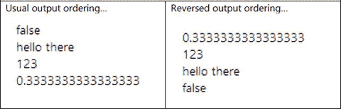
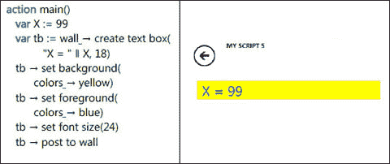
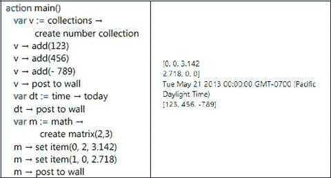
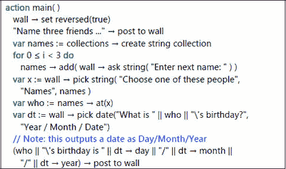
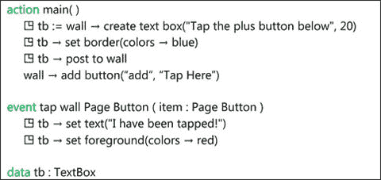
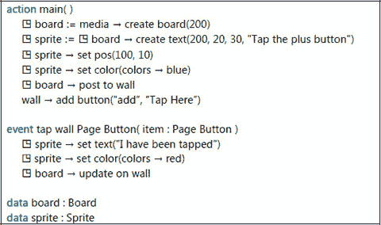
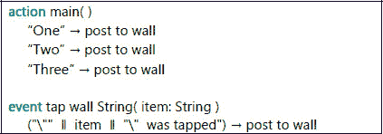
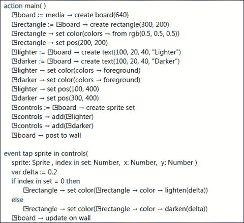
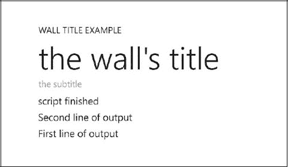
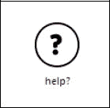

# 3. 墙 – 使用屏幕

3.1 输出 – 墙上的文字 3.2 从触摸屏输入值 3.3 更新墙的内容 3.4 触摸屏上的事件 3.5 推送和弹出页面 3.6 标题和副标题 3.7 墙按钮 3.8 按需创建输出

TouchDevelop 脚本通常需要与用户交互。虽然通过麦克风输入和通过设备内置或连接的扬声器输出是可行的方式，但触摸屏或屏幕加鼠标几乎总是用于输入和输出。在 TouchDevelop 中，屏幕被称为“墙”。API 提供了多种脚本访问墙的方式。

## 3.1 输出 – 墙上的文字


### 3.1.1 简单值的输出

TouchDevelop 中的每种数据类型都提供了一个名为`post to wall`的方法。调用该方法后，会显示该值的某种表现形式。以下是一些简单的示例。

```
action main()
    (1/3) → post to wall
    123 → post to wall
    ("hello" || " there") → post to wall
    (11>11) → post to wall
```

这段代码产生的效果类似于左侧图 3-1 所示。请注意，输出结果明显是按相反顺序显示的。这是因为默认情况下，每个新的输出项都会被插入到屏幕顶部，从而将之前生成的输出项向下推移。如果希望用户无需向下滚动就能看到最新项目，那么这个默认设置是很好的选择。



**图 3-1** — 简单输出，正常顺序与相反顺序

若要以在屏幕上突出显示的方式显示一个值，可以使用`TextBox`值。文本可以以任何颜色、任何字号显示，背景色也可任意选择。图 3-2 显示了一个使用`TextBox`显示字符串的简单示例。左侧是脚本，右侧是运行结果。



**图 3-2** — 使用 `TextBox` 显示字符串

### 3.1.2 输出的方向

屏幕上的默认输出方向是可以更改的，可以使项目从上到下显示。为此，需要调用以下方法：

```
wall → set reversed(true)
```

以下示例脚本可以清楚地说明这种效果。

```
action main()
    (1/3) → post to wall
    123 → post to wall
    wall → set reversed(true)
    ("hello" || " there") → post to wall
    (11>11) → post to wall
```

运行该脚本的结果如图 3-1 右侧所示。对比这两张截图可以发现，这次调用影响了屏幕上的所有输出——而不仅仅是在调用之后生成的输出。

总而言之，使用参数`true`调用该方法的效果是，如果必要，会对屏幕上现有的输出进行重新排序，使得最早的输出位于顶部，最新的输出位于底部。后续对

```
post to wall
```

的调用将使新的输出添加到底部。而调用

```
wall → set reversed(false)
```

则会再次对输出进行重新排序，使得最早的输出位于底部，最新的输出位于顶部，之后对`post to wall`的调用将再次将输出插入到屏幕顶部。

### 3.1.3 复合值的输出

显示复合值（例如`DateTime`或`Vector3`类型的值）会生成格式适当的结果。显示一组值会在屏幕上产生一个项目列表，每个元素都根据其数据类型的格式进行适当格式化。

图 3-3 给出了几个显示复合值的示例。



**图 3-3** — 显示复合值

### 3.1.4 媒体值的输出

每个媒体值都会以适合其数据类型的方式显示在屏幕上。对于`Song`或`Song Album`值，还会显示一个播放按钮。点击该播放按钮会播放歌曲或歌曲专辑。

表 3-1 总结了每种数据类型显示的内容。

**表 3-1** — 媒体值的显示

| 数据类型 | 显示内容 |
| --- | --- |
| `Picture` | 图片，必要时会调整大小以适应屏幕。 |
| `Board` | 板（注意，板可以被动态更改并重新显示）。 |
| `Song` | 一个播放按钮，以及以下可用项：时长、艺术家、歌曲来源专辑名称、专辑封面、曲目编号。 |
| `Sound` | 文本“一段声音…”和一个用于播放声音的按钮。 |
| `Picture Album` | 该专辑中所有图片的序列。 |
| `Song Album` | 一个播放按钮，以及以下可用项（如果可用）：总时长、艺术家、专辑名称、专辑封面、曲目数量。 |

### 3.1.5 社交值的输出

社交 API 管理的每个值都会以适合其数据类型的方式显示。`Contact`和`Link`值包含可点击的按钮，用于发起电话呼叫或发送消息。

表 3-2 总结了每种数据类型显示的内容。

**表 3-2** — 社交值的显示

| 数据类型 | 显示内容 |
| --- | --- |
| `Appointment` | 约会的日期、时间和详情。 |
| `Contact` | 联系人的姓名，以及可点击的按钮，用于发起电话呼叫、发送短信或发送电子邮件给此联系人。 |
| `Link` | 与该链接关联的名称，以及一个按钮，根据链接类型可发起电话呼叫、发送短信或发送电子邮件。 |
| `Location` | 一个可滚动的必应地图，显示该位置。 |
| `Message` | 发件人的姓名、消息发送时间以及消息内容。 |
| `Place` | 与该地点关联的名称，以及一个显示该地点位置的缩略地图。 |

### 3.1.6 Web 值的输出

有几种数据类型专门与 Web 访问相关联。其中五种类型的值会按照表 3-3 显示在墙上。

**表 3-3** — Web 值的显示

| 数据类型 | 显示内容 |
| --- | --- |
| `Form Builder` | 表单的当前内容 |
| `Json Object` | JSON 对象的字符串值。 |
| `Web Request` | 两行显示接受的网页编码，后跟一行包含关键字 GET 和 URL 的内容。 |
| `Web Response` | 响应 |
| `Xml Object` | XML 对象的字符串值 |

## 3.2 从触控屏输入值

wall API 提供了几种方法，提示用户输入一个值或从一系列选项中选择一个值。这些方法列在表 3-4 中。图 3-4 显示了一些示例语句，用于说明它们的用法。

**表 3-4** — 提示输入

| 数据类型 | 方法 | 描述 |
| --- | --- | --- |
| `Boolean` | `ask boolean` | 显示一个“确定”按钮和一个“取消”按钮。点击“确定”返回`true`，点击“取消”返回`false` |
| `Number` | `ask number` | 提示用户输入一个数字，并将其作为结果返回 |
| `String` | `ask string` | 提示用户输入一个字符串，并将其作为结果返回 |
| `DateTime` | `pick date` | 提示用户选择一个日期；该日期与中午 12 点的时间组合后作为结果返回 |
| `String` | `pick string` | 显示一个字符串列表，提示用户选择一个；返回所选字符串的索引 |
| `DateTime` | `pick time` | 提示用户选择一天中的某个时间；该时间与一个未定义的日期组合后作为结果返回 |

## 3.3 更新 Wall 的内容

每次调用`post to wall`都会在屏幕上添加一个新项目。然而，我们经常希望保持项目数量不变，只更改其中某个项目的值。实现这一目的最简单、最原始且效率最低的方法是调用

```
wall → clear
```

然后使用新值重新显示所有项目。

但是，TouchDevelop 提供了一些更推荐使用的替代方法。



**图 3-4** — 提示输入


### 可更新的文本框

对于需要在脚本执行过程中更改的文本显示，文本框提供了一种易于使用的机制。图 3-5 展示了一个简单脚本，它在屏幕上显示一行文本，然后在点击底部的页面按钮时更改该文本。

调用文本框的 `set text` 方法会立即更新屏幕上显示的字符串。还可以在运行时动态更改文本框中文本的大小和颜色。请注意，如果同一个文本框的值已多次发布到墙面，那么 `set text` 方法将导致墙面上该值的所有实例都被更新。



图 3-5：可更新的文本框 (`/censaair`)

### 更新看板显示

为了更新屏幕上更复杂的信息显示，通常使用 `Board` 数据类型的一个实例。图片、文本消息和形状都可以作为精灵绘制在看板上。每个精灵可以单独更改其位置、方向或内容。然后，调用看板的 `update on wall` 方法，会导致屏幕上的看板渲染图立即更新。虽然 `Board` 数据类型的主要用途是实现游戏，但在任何需要更改屏幕上显示信息的情况下，它都很有用。

图 3-6 展示了前一个示例的重新实现，其中使用了看板。使用看板和精灵提供了更大的灵活性，因为屏幕上项目的位置和方向也可以更新。



图 3-6：使用看板更新文本 (`/wkoxnasz`)

## 触摸屏事件

### 点击墙面事件

脚本可以通过屏幕上的点击事件接收输入。几乎每种可以显示在屏幕上的值类型都有对应的一种事件类型。表 3-5 提供了完整列表。

如果这些值之一显示在屏幕上，点击该值将触发执行相应的事件。被点击的项目作为参数传递给事件。使用正常的参数传递规则，这意味着如果项目是值类型，则传递该值的副本；如果项目是引用类型，则传递对该值的引用。图 3-7 展示了一个使用点击事件来选择字符串的简单脚本。



图 3-7：使用点击墙面事件

### 点击看板事件

虽然很容易在屏幕上显示值并将 `tap wall` 事件与它们关联，但对值的位置控制非常有限。为了实现对位置的完全控制，有必要将值作为精灵显示在 `Board` 数据类型的实例上。如果脚本在屏幕上显示带有其精灵的看板，那么点击、滑动或拖拽其中一个精灵将触发一个可由脚本捕获的事件。

图 3-8 展示了一个简单脚本，当点击按钮时，它会调亮或调暗一个实心矩形的颜色。

#### 表 3-5：点击墙面事件

| 事件 | 作用 |
| --- | --- |
| `tap wall Appointment` | 每个事件都接收一个参数。该参数具有事件中命名的数据类型。当此类型的任何值在屏幕上被点击时，相应的事件被触发。对于值类型，被点击值的副本作为参数传递。对于引用类型，对被点击值的引用作为参数传递。 |
| `tap wall Camera` | |
| `tap wall Color` | |
| `tap wall Contact` | |
| `tap wall Link` | |
| `tap wall Message` | |
| `tap wall Motion` | |
| `tap wall Page Button` | |
| `tap wall Picture` | |
| `tap wall Picture Album` | |
| `tap wall Place` | |
| `tap wall Playlist` | |
| `tap wall Song` | |
| `tap wall Song Album` | |
| `tap wall Sound` | |
| `tap wall String` | |
| `tap wall TextBox` | |
| `tap wall Vector3` | |

简单地在脚本的数据部分定义一个数据类型为 `Board`、`Sprite` 或 `Sprite Set` 的变量，就会使新的事件类型可用。以图 3-7 所示的脚本为例，其数据部分包含三个名为 `rectangle`、`Lighter` 和 `Darker` 的精灵，包含类型为 `Sprite Set` 的 `controls`，以及类型为 `Board` 的 `board`。

这些全局可见的数据变量的存在创建了以下 14 个以此命名的事件：



图 3-8：使用精灵事件 (`/akmcnpux`)

- `tap sprite: rectangle`, `swipe sprite: rectangle`, `drag sprite: rectangle`
- `tap sprite: Lighter`, `swipe sprite: Lighter`, `drag sprite: Lighter`
- `tap sprite: Darker`, `swipe sprite: Darker`, `drag sprite: Darker`
- `tap sprite in controls`, `swipe sprite in controls`, `drag sprite in controls`
- `tap board: board`, `swipe board: board`

对于精灵，事件名称的模式是 `tap/swipe/drag sprite: xxx`，其中 `xxx` 是精灵的名称。对于精灵集，名称的模式是 `tap/swipe/drag sprite in YYY`，其中 `YYY` 是精灵集的名称。对于看板，名称的模式是 `tap/swipe board: ZZZ`，其中 `ZZZ` 是看板的名称。传递给每个事件的参数标识了哪个精灵被触摸（在精灵集事件的情况下）、精灵在看板上的坐标以及滑动或拖拽动作的范围。

请注意，`Board` 数据类型还有更多关联事件未在此列出，包括点击看板上的任意位置（不限于精灵）并获取屏幕被点击位置坐标的可能性。

## 页面推送与弹出

某些脚本可能需要临时显示信息，然后使其消失。或者，可能需要从用户那里输入一些额外的信息，但又不希望干扰屏幕上已经显示的内容。对于这类情况，解决方案是创建一个全新的墙面，在该墙面上显示信息并请求输入，然后让该墙面消失并重新显示原始墙面。

该通用工具采用页面栈的形式。每个页面对应墙面（`wall`）的一个实例。

以下命令创建一个新的空白墙面。

```
wall → push new page
```

然后，脚本可以继续在此新墙面上显示信息或提示输入。之后，以下命令

```
wall → pop page
```

将删除该新墙面并恢复到显示之前的版本。

与墙面 API 相关的一些其他方法包括 `wall → pages`（返回页面栈集合）和 `wall → current page`（获取当前页面）。

### 标题和副标题

通过屏幕顶部显示标题，可以使脚本的输出更加美观。如果合适，也可以显示副标题。以下代码行说明了这些功能。

```
wall → set title("The wall's title")
wall → set subtitle("The subtitle")
"First line of output" → post to wall
"Second line of output" → post to wall
```

运行此代码的结果显示在图 3-9 中。请注意，标题和副标题的大小写已被改变；它们都已转换为小写。



图 3-9：标题和副标题示例


### 3.7 墙上按钮

屏幕底部可能会以简单图标的形式显示一些按钮，这些称为页面按钮。点击按钮会触发一个事件，可在脚本中捕获。图标是预定义的，并具有名称。名称如下：

`"add"`、`"back"`、`"cancel"`、`"check"`、`"close"`、`"delete"`、`"download"`、`"edit"`、`"favs.addto"`、`"favs"`、`"feature.camera"`、`"feature.email"`、`"feature.search"`、`"feature.settings"`、`"feature.video"`、`"folder"`、`"minus"`、`"new"`、`"next"`、`"questionmark"`、`"refresh"`、`"save"`、`"share"`、`"stop"`、`"sync"`、`"transport.ff"`、`"transport.pause"`、`"transport.play"`、`"transport.rew"`、`"upload"`

可通过执行以下语句生成此名称列表：

```
wall → button icon names → post to wall
```

生成按钮的语句示例如下：

```
wall → add button( “questionmark”, “help?” )
```

执行该语句后，屏幕底部的栏将包含一个“问号”图标，并带有标签“help?”，如图 3-10 所示。



**图 3-10** “问号”页面按钮

屏幕底部有足够的空间容纳多个页面按钮。因此，点击页面按钮触发的事件会携带一个用于标识按钮的参数，该参数即用作标签的字符串。以下代码展示了事件如何区分不同的按钮可能性：

```
event tap wall Page Button(item: Page Button)
    if (item → icon → equals(“help?”) then
        ▷显示帮助信息
    else
        if (item → icon → equals(“cancel”) then
            time → stop
        else
            // 不执行任何操作
```

为 `Page Button` 数据类型提供的方法列于表 3-6 中。

**表 3-6** Page Table 数据类型的方法

| Page Table 方法 | 描述 |
| --- | --- |
| `equals(page button : Page Button) : Boolean` | 如果此按钮与作为参数传入的按钮相同，则返回 true |
| `icon : String` | 获取图标的名称 |
| `page : Page` | 获取此按钮所附着的页面 |
| `text : String` | 获取与图标关联的文本 |

### 3.8 按需生成输出

某些脚本可能需要生成大量输出，用户需要滚动查看。如果一次性生成所有输出，可能会浪费处理时间（并消耗电池电量）。更好的方法是在用户滚动到屏幕中输出应显示的部分时，才创建输出块。

每当墙上出现可用于显示新输出的空间时，便会触发 `empty space on wall` 事件。当用户滚动到已显示输出的末尾时，墙上就会出现空间。


开放获取 本章根据知识共享署名-非商业性使用-禁止演绎 4.0 国际许可协议 ([`creativecommons.org/licenses/by-nc-nd/4.0/`](http://creativecommons.org/licenses/by-nc-nd/4.0/)) 的条款进行许可，该协议允许任何非商业用途、共享、分发和在任何媒介或格式中复制，前提是您给予原作者和来源适当的署名，提供指向知识共享许可协议的链接，并注明您是否修改了许可材料。根据本许可，您无权分享源自本章或其部分的改编材料。本章中的图片或其他第三方材料已包含在章节的知识共享许可协议中，除非在材料的署名行中另有说明。如果材料未包含在本章的知识共享许可协议中，且您的预期用途不受法律规定允许或超出允许范围，您将需要直接从版权持有者处获得许可。

