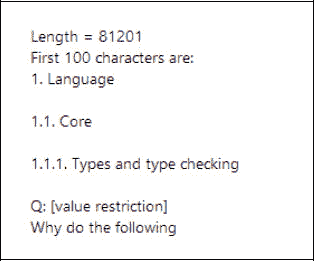
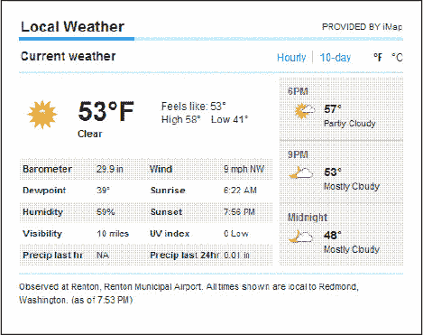
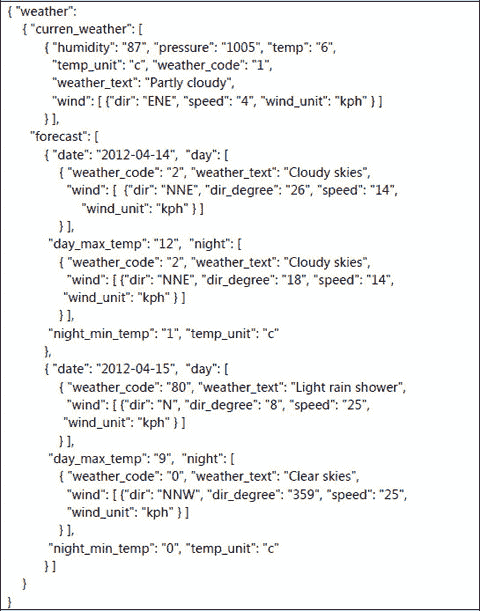
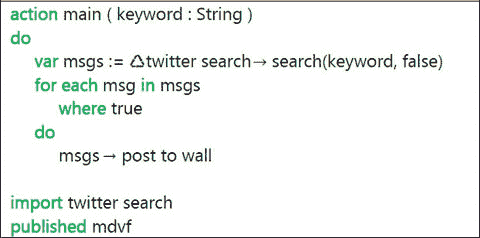
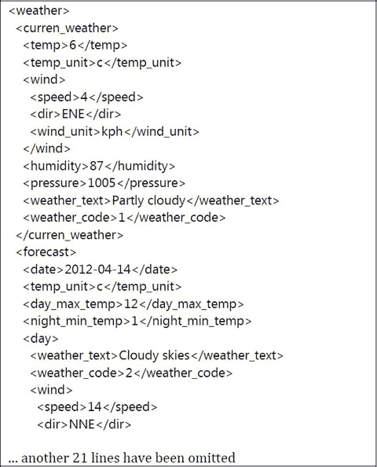

# 4. 网络

4.1 网址与网页 4.2 下载与上传文件 4.3 下载结构化数据 4.4 REST 准则与网络请求

关键词：文本文件、文档类型定义、窗口、手机、附加脚本、删除请求

大多数移动设备可以通过 Wi-Fi 连接或使用手机公司的数据服务连接到互联网。已存在许多有用的脚本，用于从互联网上的网站检索信息。通过使用 TouchDevelop 的功能，您可以轻松构建额外的脚本，以提取您可能需要的特定信息。互联网连接的另一个常见用途是通过 Twitter 或 Facebook 帐户共享信息。TouchDevelop 提供了向您的帐户上传消息的功能。

## 4.1 网址与网页

### 4.1.1 使用 URL

TouchDevelop API 提供了一种简单的方法，与设备上安装的软件进行交互以访问网络。这些交互大多从 URL 开始。以下是一个脚本中最简单的操作示例——在特定网页上打开网络浏览器：

```
if not web→is connected then
    “抱歉，您没有互联网连接！” → post to wall
    time → stop
else
    // 不执行任何操作

web → browse(“http://touchdevelop.com”)
```

在 TouchDevelop 脚本中，大多数网络交互需要 URL 来指定网址。表 4-1 列出了两种有助于处理 URL 的 API 方法。通常，需要在 URL 中包含一些特殊字符。

**表 4-1** 转换 URL

| 方法 | 描述 |
| --- | --- |
| `web→url encode(s : String) : String` | 对特殊字符进行编码，使其能够包含在 URL 中。 |
| `web→url decode(url : String) : String` | 将 URL 解码回包含特殊字符的普通字符串。 |


### 4.1.2 创建和使用网络链接

TouchDevelop 中 `Link` 数据类型的一个用途是保存指向联系人的链接，这些链接可能为电子邮件地址或电话号码。此用法将在第 8 章中介绍。另一个用途是保存指向在网络上发现的资源的链接，例如视频、图片以及一般的网页。TouchDevelop API 中的 `web` 资源提供了用于创建后一类链接的方法。此外，还有一些方法用于搜索网页或网络资源，并返回指向搜索结果的链接集合。这些方法列在表 4-2 中。

`Link` 数据类型将附加信息与地址（例如 URL）结合在一起。它可以选择性地包含一个关联的名称和一个位置（这通常与照片相关，但肯定不限于照片）。API 提供了设置和获取这些附加信息的方法。

请注意，创建 `Link` 实例时，不会对 URL 的有效性进行检查。该 URL 只是作为一个字符串保存，可以通过使用 `address` 方法将其作为字符串访问。

示例：脚本 `flickr search`（`/atue`）提供了一个库的示例，该库创建一个包含对特定类型图片引用的 `Link Collection` 实例；而脚本 `flickr slideshow`（`/fluo`）则使用该库根据用户提供的主题生成一个图片幻灯片。

**表 4-2** 创建网络链接

| 方法 | 描述 |
| --- | --- |
| `web→link image(url : String) : Link` | 创建一个指向图片的链接 |
| `web→link media(url : String) : Link` | 创建一个指向音频文件或视频的链接 |
| `web→link url(name : String, url : String) : Link` | 创建一个指向网页的链接，并为此链接关联一个名称 |
| `web→search(terms : String) : Link Collection` | 使用必应搜索与搜索词匹配的网页 |
| `web→search images(terms : String) : Link Collection` | 使用必应搜索与搜索词匹配的图片 |
| `web→search images nearby(terms : String, location : Location, distance : Number) : Link Collection` | 使用必应搜索与搜索词匹配且位置在指定地点给定距离内的图片 |
| `web→search nearby(terms : String, location : Location, distance : Number) : Link Collection` | 使用必应搜索与搜索词匹配且位置在特定地点给定距离内的网页 |
| `web→search news(terms : String) : Link Collection` | 使用必应搜索与搜索词匹配的新闻条目 |
| `web→search news nearby(terms : String, location : Location, distance : Number) : Link Collection` | 使用必应搜索与搜索词匹配且位置在指定地点给定距离内的新闻条目 |

#### 在墙面上使用网络链接

墙面可用于保存指向一般网站或各种可下载资源的链接。例如，当提供了一个 `Link` 类型的实例时，可以使用类似下面的代码来显示一张图片。

```
// link（Link 类型）指向网站上的一个图片
var pic := web → download picture(link → address)
wall → set background picture(pic)
```

以下是更多示例。以下脚本代码行（摘自 TouchDevelop 示例网站上的脚本 `/hrvg`）展示了一些有趣的可能性。

```
// 1. 这创建了一个基本的互联网链接，点击该链接时
//  会在浏览器中打开
web → link url("这是一个指向 TouchDevelop 的链接", "http://touchdevelop.com") → post to wall

// 2. 这将加载并从网络上显示一张图片
//  当点击该链接时
web → link image("http://www.touchdevelop.com/Images/title1.png") → post to wall

// 3. 你也可以通过 link media 方法链接到电影或声音文件。
//   当点击该链接时，它会开始播放
web → link media(
"http://media.ch9.ms/ch9/06b9/1669dae1-2b5f-4858-abee-9ea7018806b9/
WP7Pex4FunPeliNikolai_ch9.wmv") → post to wall
```

如果上面的第一个例子作为脚本运行，屏幕上显示的结果外形类似于图 4-1。点击右侧的“转到”按钮将显示该网页。


**图 4-1** 将网页链接发布到墙面

运行第二个例子会显示从网络下载的图片。将其作为脚本运行的结果外形类似于图 4-2。（图片看起来模糊，因为原始图片是尺寸较小、分辨率低的图片，在显示到屏幕之前被放大了。）


**图 4-2** 将指向图片的链接发布到墙面

### 4.1.3 检查互联网连接

您的设备通常可以通过 Wi-Fi 连接或手机连接接入互联网。但有时也会没有网络连接。脚本在尝试访问网络资源之前，应该先测试是否存在连接。API 方法调用

```
web → is connected
```

返回 `true` 或 `false` 来指示当前网络状况。

如果存在连接，以下 API 方法调用应提供关于连接类型的信息。结果将是以下字符串之一：“`unknown`”、“`none`”、“`ethernet`”、“`wifi`”或“`mobile`”。

```
web → connection type
```

最后，脚本可以发现处理互联网请求的 Wi-Fi 服务或手机服务的名称。如果存在的话，以下 API 方法调用会返回一个包含该服务名称的字符串。如果无法找到名称，则返回一个空字符串。

```
web → connection name
```

## 4.2 下载和上传文件

如果脚本访问互联网，很可能需要以某种形式下载信息。有时也需要上传信息。TouchDevelop API 提供了多种适用于访问不同类型网络资源的上传和下载方法。这些方法在表 4-3 中进行了总结，并在后续小节中进行了更详细的描述。

**表 4-3** 向网站上传/从网站下载

| 方法 | 描述 |
| --- | --- |
| `web → download(url : String) : String` | 使用 HTTP GET 请求获取一个 HTML 编码的网页，结果以字符串形式返回。 |
| `web → download json(url : String) : Json Object` | 使用 HTTP GET 请求读取一个 JSON 数据结构 |
| `web → download picture(url : String) : Picture` | 下载一张图片 |
| `web → download song(url : String, name : String) : Song` | 创建一个流式歌曲文件；下载操作会延迟到歌曲播放时才开始 |
| `web → download sound(url : String) : Sound` | 下载一个 WAV 格式的声音文件 |
| `web → upload(url : String, body : String) : String` | 使用 HTTP POST 请求将字符串数据上传到一个网站服务；返回值是该服务返回的响应字符串 |
| `web → upload picture(url : String, pic : Picture): String` | 使用 HTTP POST 请求将一张图片上传到一个网站服务；返回值是一个响应字符串 |


### 4.2.1 下载文本文件或 HTML

网络资源最简单的格式是文本文件。如果 URL 以`".txt"`或`".text"`后缀结尾，那么该网络资源几乎肯定是一个纯 ASCII（或 UTF8）文本文件。然而，URL 不一定要有这些后缀才能指向文本文件。

包含 HTML 的网页也是一种文本文件；它只是包含额外命令来指定浏览器显示时网页的结构和格式的文本。如果有用，原始 HTML 可以像文本文件一样被读取。

TouchDevelop 脚本可以下载文本文件或 HTML 页面，并使用类似此示例中所示的脚本行将其读入`String`变量：

```
action main( )
    var s := web →
        download("http://www.smlnj.org/doc/FAQ/faq.txt")
    if s → is invalid then
            "无法读取网页" → post to wall
    else
            // … 继续使用字符串 s
            "" → post to wall
            s → substring(0,100) → post to wall
            "前 100 个字符是：" → post to wall
            ("长度 = " || s → count) → post to wall
```

运行此脚本时，结果如图 4-3 所示。不过，大多数情况下，你的脚本会继续对字符串进行比仅仅显示总长度和前 100 个字符更复杂的操作。



图 4-3

下载文本文件

### 4.2.2 下载图片

有多种格式用于将图片编码为计算机文件。常用的格式有 JPEG、GIF、PNG、BMP、TIFF 和 WMP。TouchDevelop 都支持它们。如果文件名或 URL 以`".jpg"`、`".jpeg"`、`".gif"`、`".png"`、`".bmp"`或`".wmp"`后缀结尾，则使用了其中一种格式，并且 TouchDevelop API 中提供的方法应该能够下载并操作该图片。

脚本语句与之前类似，但使用了不同的方法，以便结果以`Picture`值（而不是`String`值）的形式获取。

```
action main( )
        var pic := web → download picture(
        "http://www.touchdevelop.com/Images/title2.png")
        if pic → is invalid then
                "无法下载图片" → post to wall
        else
                // … 继续以某种方式使用图片 pic
            pic → post to wall
            ("图片尺寸 = " || pic → width || " x " || pic → height) →
        post to wall
```

运行这个特定脚本会产生如图 4-4 所示的结果。


图 4-4

图片下载

### 4.2.3 下载声音和音乐

TouchDevelop 和 Windows 手机软件支持两种音频文件——短音效片段和较长的音频轨道，后者通常包含音乐（或语音）。在 TouchDevelop 中，它们分别对应类型为`Sound`和`Song`的值。

如果文件名或 URL 以`".wav"`后缀结尾，那么文件内容就是“波形音频文件”（WAV）格式，这种素材可以作为`Sound`值下载。`Sound`值只能从 WAV 文件创建。如果后缀是`".mp3"`，那么素材是一种常用于音乐和语音的音频格式。这种素材可以作为`Song`值下载。

下面展示了一些用于下载和播放音效的代码。（此示例中使用的音效来自网站“Partners in Rhyme”，该网站提供免版税的音乐和音效。）

```
action getSound( )
    var snd := web → download sound( "http://www.sound-effect.com/pirsounds/WEB_DESIGN_SOUNDS_WAV1/SOUNDFX/TOYLASER.WAV" )
    if snd → is invalid then
            "无法下载声音" → post to wall
    else
        // … 继续使用声音值 snd
        snd → set volume(0.7)
        snd → play
        ("时长 = " || snd → duration) → post to wall
```

示例：一个用于访问和播放歌曲的脚本可通过从互联网流式传输 mp3（`/ncwo`）获得。该脚本包含一些额外功能使其更有用。这些功能是暂停播放和永久停止播放的事件。运行脚本时，可以将 URL 作为参数提供。如果没有提供 URL，则会再次使用上次使用的 URL。

### 4.2.4 上传字符串和文件

有两个 API 方法可用于将素材上传到网站。一个方法上传字符串，另一个方法上传图片。两者都使用 HTTP POST 协议进行上传。通常，在与遵循 REST 指南（如下所述）的网站交互时会执行上传。

以下是使用 API 方法调用上传字符串的示例语句。

```
var info := "name=an+other&age=37&car=Ford+Mustang"
// 将 info 字符串中的键值对上传到由 url 指定的网站
var response string := web → upload( url, info )
```

接收 POST 请求的网站会将字符串传递给程序进行处理，程序返回的字符串将作为此 API 调用的结果返回。

上传图片类似。示例脚本 web stuff（`/hrvg`）是将 JPEG 格式的二维码图片上传到网站的一个示例。


## 4.3 下载结构化数据

互联网为你的脚本提供了丰富的信息。难点在于如何从网站中提取你需要的信息。假设你想让脚本查询某个地点的当前温度。有许多网站可以用来查找这些信息，其中之一是 [`local.msn.com`](http://local.msn.com/)。例如，如果你在浏览器中访问 URL [`http://local.msn.com/weather.aspx?q=redmond-wa&zip=98052`](http://local.msn.com/weather.aspx?q=redmond-wa&zip=98052)，它会显示一个包含雷德蒙德当前天气状况大量信息的网页，但页面上只有极小一部分显示了温度。图 4-5 重现了该网页的一小部分截图。

原则上，我们可以使用 API 调用 `web` → `download` 将网页的 HTML 代码作为一个非常长的字符串抓取下来。然后，我们可以编写一些语句来搜索 HTML 代码，找到我们需要的那一小段信息。在这个例子中，我们需要在代码中搜索具有如下结构的字符序列。

`<span class="curtemp">53°F</span>`

这里的两个字符“53”是我们想要提取并转换为数字 53 的数据。你必须研究网站的 HTML 代码，找出足以完成任务的字符序列，而且没有两个网站会是相同的。脚本可能还需要对已被 HTML 转义序列替换的字符进行反转义。例如，网页上显示的和号字符，在 HTML 代码中显示为五个字符 `“&amp;”`。该 API 提供了两种在特殊字符及其 HTML 转义序列之间进行转换的方法。它们是 `web` → `html decode` 和 `web` → `html encode`。



**图 4-5** 天气网页截图

这种分析网页以提取信息的编程方式被称为 **网页抓取**（或 **网页收割**）。你只应在别无选择的情况下编写此类代码，即便如此，也应三思而后行。这项工作最好留给拥有专用软件的专业人士去做，而且每当网站设计师更改目标网站的布局时，这项工作都必须重做一遍。

那我们还能做什么？最好的答案是找到一个能以更易于消化的格式提供所需信息的互联网站点。XML 和 JSON 是两种被广泛用于以系统和简单的方式传递信息的格式。

TouchDevelop 支持这两种格式，本章后续章节将通过简单示例进行说明。就查找某个地点的当前天气这一特定需求而言，有几个合适的网站。其中之一是“天气频道”，但不幸的是，访问该服务需要每月订阅。一个免费的替代方案是 Weather2，它同时提供 JSON 和 XML 格式： [`http://www.myweather2.com/developer/`](http://www.myweather2.com/developer/)

### 4.3.1 以 JSON 格式下载信息

JSON 是 **JavaScript 对象表示法** 的缩写。它是一种文本格式，借鉴了 JavaScript 脚本语言的表示法和数据结构思想。这种格式被设计为易于计算机软件处理（因此也易于 TouchDevelop 脚本处理），同时也具有人类可读性。

图 4-6 展示了一个以 JSON 格式表示的数据示例。它是从 weather2 服务获取的天气数据。

对于有效 JSON 信息表示，只有几个简单的规则。一个 JSON 格式的文件包含以下元素。

* 数字和字符串
* 布尔值（`true` 或 `false`）
* 数组——写成由逗号分隔的数组元素序列，整个序列用方括号括起来
* 对象——写成键值对的无序集合，冒号分隔键和值，每对值之间用逗号分隔，整个集合用花括号括起来；键必须写成字符串，且彼此不同。
* 特殊值 `null`，表示空。

参考图 4-6，我们可以看到图中显示了一个只有一对键值对的对象，其中键是 `“weather”`，关联的值是另一个对象。该对象包含两对键值对；一个键是 `“curren_weather”`，另一个是 `“forecast”`。与 `“curren_weather”` 关联的值是一个数组，其中只包含一个元素，该元素是一个对象。与 `“forecast”` 关联的值是一个包含两个元素的数组，这两个元素是具有相同结构的对象。（元素不必具有相同的结构，甚至不必具有相同的类型，但如果它们具有相同的结构，处理 JSON 文件会更简单。）



**图 4-6** 以 JSON 格式呈现的天气数据

* 如果我们找到了一个以 JSON 格式提供结果的网站，我们可以使用调用 `web` → `download json` 来访问它。以下是一个示例调用。

```
var jobj := web → download json(
  "http://www.myweather2.com/developer/forecast.ashx?uac=X&output=json&query=SW1")
```

它将下载类似于图 4-6 所示的 JSON 数据。（URL 中 `‘uac=’` 后面的“X”必须替换为用户访问代码，该代码仅在你于 weather2 网站注册后才会提供。）

此 API 调用检索到的值具有数据类型 `Json Object`。该数据类型提供了许多用于从 JSON 对象内部访问信息的方法。这些方法列在附录 C 中。使用这些方法，以下是我们如何从图 4-6 所示的 JSON 对象中获取今日温度的方法。代码以一系列非常简单的步骤呈现。

```
// 假设 jobj 已经通过前面所示的调用读取
if jobj → is invalid then
  "无法下载 JSON 数据" → post to wall
else
  var w := jobj → field("weather")
  var cw := w → field("curren_weather")
  // 获取数组的第一个元素
  var cw0 := cw → at(0)
  // 获取温度（数字格式）
  var temp := cw0 → string("temp") → to number
  // 获取温度单位（字符串格式）
  var units := cw0 → string("temp_unit")
  ("今天的温度是 " || temp || units) → post to wall
```

我们所需要做的仅仅是查看一次天气查询产生的 JSON 数据示例。从这个示例中，我们很容易就找出了如何提取所需信息。（当然，我们也可以阅读服务提供商提供的文档。）

两个以 JSON 格式提供结果的流行服务是 **Flickr** 和 **Twitter**。TouchDevelop 示例集合中的两个脚本实现了用于使用这些服务的库。图 4-7 展示了一个搜索包含特定关键字（或 `#标签`）的推文的简单脚本。

库的代码可以在名称 `twitter search` (`/stlm`) 下找到。它从每条推文中提取足够的信息，将其格式化为一条包含作者姓名、作者头像、推文发布日期以及消息内容本身的消息。


### 4.3.2 以 XML 格式下载信息

XML 是可扩展标记语言的缩写。它是一种向文本文档添加标记以显示其结构的符号。它为从 Web 服务以易于软件处理且人类阅读相对容易的格式传递结果提供了一种 JSON 的替代方案。



**图 4-7** 使用库访问 Twitter

图 4-8 展示了由 `weather2` 服务生成的 XML 的一个不完整示例。其信息与图 4-6 所示相同，但由于其内容更为丰富，因此仅显示了前 25 行。如示例所示，文档中某个组件（逻辑单元）的开始由开始标签（如 `<weather>`）标记。该组件的结束则由匹配的结束标签（如 `</weather>`）标记。如图中所示，组件可以嵌套。

开始标签可以包含属性，例如 `<font name="Courier" size="12">`，不过在天气数据中未出现这种情况。

下载 XML 数据需要先调用 `web→download` 将数据作为字符串获取，然后调用 `web→xml` 将字符串解析为 XML，如下例所示。

```
var xobj := web→xml( web→download( "http://www.myweather2.com/developer/forecast.ashx?uac=X&output=xml&query=SW1"))
```

这段代码的结果是一个数据类型为 `Xml Object` 的值。该数据类型提供了遍历 XML 对象并提取各种组件的方法。这些方法列于附录 C。

从图 4-8 所示的 XML 中提取当前温度可以按如下方式编程。



**图 4-8** JSON 格式的天气数据

```
// 假设 xobj 已通过之前展示的调用读取
if xobj → is invalid then
    "无法下载 XML 数据" → post to wall
else
    var cw := xobj → child("curren_weather")
    // 获取温度
    var temp := cw → child("temp") → to string
    // 获取温度单位
    var units := cw → child("temp_unit") → to string
    ("今天的温度是 " || temp || units) → post to wall
```

与 JSON 类似，仅通过查看 XML 数据的示例就能相当容易地弄清楚如何提取所需信息。然而，XML 的结构几乎总是由 DTD（文档类型定义）严格定义，该定义规定了要使用的标签名称以及它们如何允许在其他带标签的部分内嵌套。在开发处理 XML 的脚本时，最好参考 DTD。

## 4.4 REST 指南与 Web 请求

许多 Web 服务在实现其服务时遵循称为 REST 的指南。它是表述性状态传递的缩写。这样的 Web 服务通常被描述为 RESTful。关于 REST 指南的阅读起点由维基百科提供，网址为：[`http://en.wikipedia.org/wiki/REST`](http://en.wikipedia.org/wiki/REST)。

特别是，HTTP GET 和 POST 请求被用于访问 RESTful Web 服务的许多功能，并且提供的用于从 Web 上传和下载的 API 调用可能是足够的。HTTP PUT 和 DELETE 请求在 Windows Phone 平台上不受支持，因此无法由 TouchDevelop 脚本生成。许多 RESTful Web 服务提供了 PUT 和 DELETE 请求的替代方案。

API 方法 `web→create request` 可用于构造一个通用的 HTTP 请求。该请求被构造为 `Web Request` 数据类型的一个实例。当请求发送到 Web 服务时，结果以 `Web Response` 类型的实例返回。这两种数据类型的方法总结于表 4-4 和表 4-5 中。（所有数据类型共有的方法已从这两个表中省略。）

**表 4-4 Web Request 数据类型的方法**

| 方法 | 描述 |
| --- | --- |
| `header(name : String) : String` | 获取由名称标识的标头的值 |
| `header names : String Collection` | 获取所有标头的名称 |
| `method : String` | 返回 HTML 方法："get" 或 "post" |
| `send : Web Response` | 发送请求并等待响应 |
| `set compress(value : Boolean) : Nothing` | 如果参数为 true，则请求内容使用 gzip 压缩（并更新标头）。 |
| `set content(content : String) : Nothing` | 设置 POST 请求的内容 |
| `set content as json(json : Json Object) : Nothing` | 将 POST 请求的内容设置为 JSON 数据结构 |
| `set content as picture(picture : Picture, quality : Number) : Nothing` | 将 POST 请求的内容设置为 JPEG 图像；质量参数范围从 0（低质量，最大压缩）到 1（最佳质量）。 |
| `set content as xml(xml : Xml Object): Nothing` | 将 POST 请求的内容设置为 XML 数据结构 |
| `set credentials(name : String,password : String): Nothing` | 当网站需要身份验证时设置用户名和密码；请求的 URL 必须指定 HTTPS 协议。 |
| `set header( name : String, value : String): Nothing` | 设置 HTML 标头值。 |
| `set method( method : String) : Nothing` | 设置方法；必须为 "get" 或 "post"。 |
| `set url(url : String) : Nothing` | 设置 URL。 |
| `url : String` | 返回此请求中使用的 URL |

脚本 `cosm services` (`/ybnr`) 提供了构造 Web 请求并使用响应的示例。

**表 4-5 Web Response 数据类型的方法**

| 方法 | 描述 |
| --- | --- |
| `content : String` | 将响应正文的内容作为字符串获取 |
| `content as json : Json Object` | 将响应正文的内容作为 JSON 数据结构获取 |
| `content as picture : Picture` | 将响应正文的内容作为图片获取 |
| `content as sound : Sound` | 将响应正文的内容作为 WAV 格式的声音获取 |
| `content as xml : Xml Object` | 将响应正文的内容作为 XML 结构获取 |
| `header(name : String) : String` | 获取给定名称的 HTML 标头的值 |
| `header names : String Collection` | 获取标头的名称 |
| `request : Web Request` | 获取所使用的 Web 请求 |
| `status code : Number` | 获取与请求关联的 HTTP 状态码 |

 开放获取 本章根据知识共享署名-非商业性使用-禁止演绎 4.0 国际许可协议 ([`creativecommons.org/licenses/by-nc-nd/4.0/`](http://creativecommons.org/licenses/by-nc-nd/4.0/)) 的条款进行许可，允许以任何媒介或格式进行任何非商业性使用、共享、分发和复制，前提是您给予原始作者和来源适当的署名，提供指向知识共享许可协议的链接，并指明您是否修改了许可材料。根据本许可协议，您无权分享从本章或其部分内容改编的材料。本章中的图像或其他第三方材料包含在本章的知识共享许可协议中，除非在材料的来源说明中另有指明。如果材料未包含在本章的知识共享许可协议中，并且您的预期使用不被法定法规允许或超出了允许的使用范围，您将需要直接从版权所有者处获得许可。


