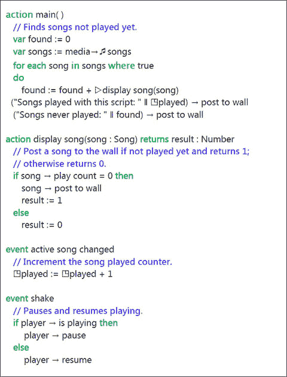

# 5. 音频

5.1 音乐 5.2 声音 5.3 麦克风

智能手机或平板电脑可以兼任便携式音乐播放器。它可以播放存储在设备上以 MP3 格式存在的音乐文件，可以播放通过互联网流式传输的音频，还可以使用其麦克风录制声音……以及更多功能。

## 5.1 音乐

音乐文件可以通过多种方式复制到您的设备上。您也可以从多种在线服务购买并下载音乐到设备中。表 5-1 列出了支持的音乐文件格式。如果您的文件为其他格式，可以使用相关程序将其转换为支持的格式。表中“容器”一列使用的名称，很可能与计算机上文件名使用的扩展名相同（例如“track1.mp3”），但并不保证一定如此。

表 5-1

支持的音乐格式

| 编解码器 | 容器 | 备注 |
| --- | --- | --- |
| `AAC` | `M4A` | 仅支持无保护（无 DRM）的文件 |
| `MP3` | `MP3` | 准确来说是 MPEG-1 的 Layer III |
| `WMA` | `WMA` | Zune 会将无损 WMA 转换为其他格式 |

TouchDevelop API 提供了 `media` 资源。但由于安全限制，该资源的许多方法仅在 Windows Phone 和 Android 设备上可用。在其他设备上，无法访问歌曲专辑或设备上存储的全部歌曲集合。

在 Windows Phone 和 Android 设备上，`media` 资源提供了用于获取手机上所有歌曲、所有歌曲专辑以及所有播放列表集合的方法。TouchDevelop 不提供任何用于更改这三个集合的机制。它们是**不可变的**。因此，TouchDevelop 脚本中的错误绝不可能导致手机上的任何音乐文件被意外删除。这三个媒体方法列在表 5-2 中。

表 5-2

访问媒体资源（仅限 WP8 和 Android）

| 方法 | 描述 |
| --- | --- |
| `media→songs : Songs` | 获取手机上所有歌曲的集合 |
| `media→song albums : Song Albums` | 获取手机上所有歌曲专辑的集合 |
| `media→playlists : Playlists` | 获取手机上所有播放列表的集合 |

### 5.1.1 处理歌曲集合

尽管 TouchDevelop 文档和本书使用了“音乐”和“歌曲”这两个词，但 API 调用当然不限于处理音乐。它们同样适用于以表 5-1 列出的任何音频格式录制的录音。

请注意，TouchDevelop API 也提供了处理 WAV 格式音频录制的方法，但这些录音通常不用于音乐，它们的持续时间较短，并且在 TouchDevelop API 中用 `Sound` 数据类型表示。`Sound` 类型将在本章稍后介绍。

表 5-3 列出了使用歌曲、歌曲专辑和播放列表的方法。表中省略了 `is invalid` 和 `post to wall` 方法（这些方法适用于所有数据类型）。

表 5-3

使用歌曲和歌曲专辑（仅限 WP8 和 Android）

| `Playlist` 数据类型的方法 | 描述 |
| --- | --- |
| `duration : Number` | 返回播放列表中所有歌曲的总时长（以秒为单位） |
| `name : String` | 返回播放列表的名称 |
| `play : Nothing` | 播放播放列表中的所有歌曲 |
| `songs : Songs` | 将播放列表中的所有歌曲作为集合获取 |
| `Song Album` 的方法 | 描述 |
| `art : Picture` | 获取专辑封面图片 |
| `artist : String` | 获取专辑艺术家的姓名 |
| `duration : Number` | 获取专辑中所有歌曲的总时长（以秒为单位） |
| `genre : String` | 获取音乐流派 |
| `has art : Boolean` | 如果有封面图片，则返回 true |
| `name : String` | 返回专辑的名称 |
| `play : Nothing` | 播放专辑中的所有歌曲 |
| `songs : Songs` | 返回专辑中所有歌曲的集合 |
| `thumbnail : Picture` | 获取封面图片的缩略图 |
| `album : Song Album` | 获取歌曲所属的专辑 |
| `artist : String` | 获取歌曲艺术家的姓名 |
| `duration : Number` | 获取歌曲时长（以秒为单位） |
| `genre : String` | 获取歌曲的音乐流派 |
| `name : String` | 获取歌曲的名称 |
| `play : Nothing` | 播放歌曲 |
| `play count : Number` | 获取歌曲被播放的次数 |
| `Song` 数据类型的方法 | 描述 |
| `protected : Boolean` | 如果歌曲受 DRM 保护，则返回 true |
| `rating : Number` | 获取用户设置的评分；如果未评分则为 -1 |
| `track: Number` | 获取歌曲在专辑中的曲目编号 |

TouchDevelop 还提供了一个与歌曲相关的事件。这就是“活动歌曲变更”事件，它在名称所暗示的时刻被触发。例如，当专辑或播放列表正在播放时，每当手机播放到列表中的下一首歌曲时，该事件就会被触发。

### 5.1.2 获取单首歌曲（所有设备均可用）

无论脚本运行在哪个平台上，都可以将单首音乐曲目导入 TouchDevelop 脚本。

一种方法是从网络下载音乐文件。操作如下：

```
var song := web → download song(url)
```

这会将音乐加载到变量 `song`（类型为 `Song`）中，其中 `url` 是一个字符串，提供文件位置的 URL。

另外，脚本可以打开一个选择文件对话框，用户可以在其中导航到其计算机或平板电脑上的音乐文件。用法如下所示。

```
var song := media → choose song
```


### 5.1.3 播放单首歌曲

`Song`、`SongAlbum` 或 `Playlist` 类型的 `play` 方法将在手机上启动一首歌曲或一组歌曲的播放。例如：

```
song → play
```

API 中的播放器资源提供了对歌曲播放的更精确控制。与直接播放歌曲相关的方法列于表 5-4。

**表 5-4**  
用于歌曲的播放器资源方法

| 播放器资源方法 | 描述 |
| --- | --- |
| `player→active song: Song` | 获取当前歌曲（如果有） |
| `player→is muted : Boolean` | 报告播放器是否静音 |
| `player→is paused : Boolean` | 报告当前歌曲是否暂停 |
| `player→is playing : Boolean` | 报告是否正在播放歌曲 |
| `player→is repeating : Boolean` | 报告歌曲是否处于重复模式 |
| `player→is shuffled : Boolean` | 报告歌曲是否随机播放 |
| `player→is stopped : Boolean` | 报告播放器是否已停止 |
| `player→next : Nothing` | 停止当前歌曲并前进到队列中的下一首 |
| `player→pause : Nothing` | 暂停当前歌曲 |
| `player→play(song : Song): Nothing` | 将一首歌曲添加到播放队列 |
| `player→play many(songs : Songs) : Nothing` | 将集合中的所有歌曲添加到队列 |
| `player→play position : Number` | 获取当前歌曲的播放位置（以秒为单位） |
| `player→previous : Nothing` | 停止当前歌曲并返回上一首 |
| `player→resume : Nothing` | 恢复暂停的歌曲 |
| `player→set repeating(repeating : Boolean) : Nothing` | 设置当前歌曲的重复模式 |
| `player→set shuffled(shuffled : Boolean) : Nothing` | 设置队列中歌曲的随机播放开关 |
| `player→set sound volume(x : Number) : Nothing` | 设置音量：0.0 为静音，1.0 为 TouchDevelop 启动时的音量 |
| `player→sound volume : Number` | 获取音量（同样采用 0 到 1 的范围） |
| `player→stop : Nothing` | 停止播放歌曲 |
| `player→volume : Number` | 获取播放器音量，范围从 0.0（静音）到 1.0（最大音量） |

当专辑或播放列表被发送到播放器时，播放器会创建一个待播放的歌曲队列。默认情况下，歌曲将按照它们在专辑或播放列表中出现的顺序播放。但如果选择了随机播放模式，则会使用随机顺序。在当前歌曲播放结束前请求播放新歌曲，会导致当前歌曲终止，并且队列（如果不为空）会被清空，然后新歌曲才开始播放。

歌曲播放发生在后台。这意味着，播放器在执行其任务的同时，设备和（可能）TouchDevelop 脚本正在处理其他事情。当一首歌曲或一组歌曲被交给播放器时，播放器会记住需要播放的内容并开始播放。控制权会立即返回给脚本，以便在音乐播放的同时继续执行语句。

播放音量范围从 0.0 到 1.0。1.0 的值并不对应于设备所能达到的最大音量。该值是相对于 TouchDevelop 脚本外部设置的播放器音量而言的。脚本播放歌曲的音量不能超过设备当前的设置，但可以通过使用小于 1.0 的音量值，以更低的音量播放。

### 5.1.4 示例脚本

TouchDevelop 网站上有许多选择和播放音乐的示例程序。下面图 5-1 重现了一个适用于 Windows Phone 和 Android 平台的示例程序。它使用了 API 提供的若干功能。

该脚本有一个在阅读时不易察觉的特性。当它运行时，会显示手机上所有从未播放过的歌曲的信息。如果用户滚动浏览显示的歌曲列表并点击其中一首，歌曲将立即开始播放。



**图 5-1**  
“新歌曲”脚本（仅适用于 WP8 和 Android）

## 5.2 声音

`Sound` 数据类型用于 WAV 格式的音频录音。该格式通常用于未压缩的音频，因此文件往往较大。因此，此格式应仅用于简短的声音片段（例如 30 秒或更短），例如由脚本播放的铃声、音效或警告声音。对于较长的片段，如果可能，应使用 `Song` 数据类型以及对应的压缩声音格式。

`Sound` 数据类型提供了许多用于播放声音片段和更改其播放属性的方法。这些方法总结在表 5-5 中。

声像平衡指的是选择声音完全通过左声道播放、完全通过右声道播放，还是按一定比例通过两个声道同时播放的能力。声像值范围从 -1.0（完全偏左）到 0.0（居中，即左右声道均等），再到 1.0（完全偏右）。

**表 5-5**  
`Sound` 数据类型的方法

| 声音数据类型方法 | 描述 |
| --- | --- |
| `duration : Number` | 返回声音片段的时长（以秒为单位） |
| `pan : Number` | 获取声像平衡设置：从 -1（完全左声道）到 +1（完全右声道） |
| `play : Nothing` | 播放声音片段 |
| `play special(volume : Number, pitch : Number, pan : Number) : Nothing` | 使用指定的声像平衡、音高和音量值播放声音片段 |
| `pitch : Number` | 获取音高调节值，范围从 -1 到 +1 |
| `set pan(pan : Number) : Nothing` | 设置声像平衡：从 -1（完全左声道）到 +1（完全右声道） |
| `set pitch(pitch : Number) : Nothing` | 设置音高调节值，范围从 -1 到 +1 |
| `set volume(v : Number) : Nothing` | 设置音量，范围从 0（静音）到 +1（最大音量） |
| `volume : Number` | 获取音量，范围从 0（静音）到 +1（最大音量） |

音高调节范围从 -1.0 到 1.0。如果选择 -1.0，播放速度会减慢，使得音高降低一个八度。中间值 0.0 以正常速度播放声音片段。最高值 1.0 会导致播放速度加快，使得音高升高一个八度。

与播放 `Song` 值类似，音量是一个从 0.0 到 1.0 的值，其中 1.0 是 TouchDevelop 脚本外部设置的扬声器当前音量。脚本可以以低于此设置的音量播放声音，但不能超过此音量播放。


## 5.3 麦克风

大多数设备都配有麦克风。然而，在 PC、Mac 或 Linux 平台的浏览器中运行的程序无法访问麦克风。在 Windows Phone 上可以访问麦克风，并且不久的将来，iPad、iPhone、iPod Touch 和 Android 平台也将支持这一功能。

TouchDevelop API 提供了一种激活麦克风并进行录音的方法。

```
var snd := senses → record microphone
// snd 的数据类型为 Sound
```

当上述语句在脚本中执行时，屏幕会显示“Recording…”字样和一个停止按钮。同时，麦克风开始录音。当用户点击停止按钮时，录音停止，并返回一个 `Sound` 数据类型的实例。

如前所述，`Sound` 值采用 WAV 音频格式且未经压缩。因此，不应使用麦克风进行长时间录音。

  
开放获取 本章根据知识共享署名-非商业性使用-禁止演绎 4.0 国际许可协议 ([`​creativecommons.​org/​licenses/​by-nc-nd/​4.​0/​`](http://creativecommons.org/licenses/by-nc-nd/4.0/)) 进行许可。该许可允许以任何媒介或格式进行任何非商业性使用、分享、分发和复制，前提是您给予原作者和来源适当的署名，提供指向知识共享许可协议的链接，并注明是否修改了许可材料。根据本许可，您无权分享源自本章或其部分的改编材料。除非在材料的署名行中另有说明，否则本章中的图片或其他第三方材料均包含在本章的知识共享许可协议范围内。如果材料未包含在本章的知识共享许可协议中，且您的预期用途未被法定法规允许或超出允许范围，则您需要直接获得版权持有人的许可。

