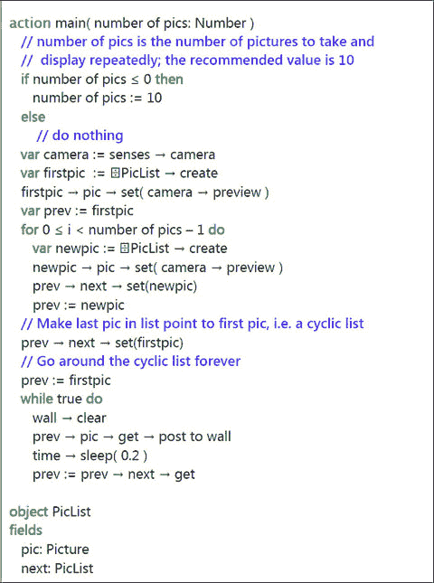
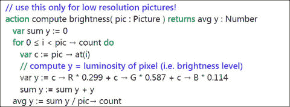
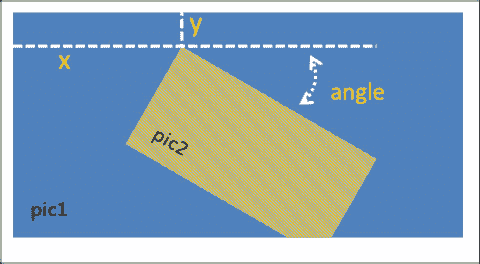
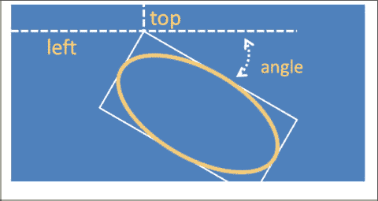

# 6. 摄像头、图形和视频

6.1 摄像头 6.2 处理图片 6.3 静态图形绘制与显示 6.4 播放来自互联网的视频  
关键词 视频 文件 图片 类型 字符串 变量 窗口 手机 摄像头 图片

智能手机、平板电脑和笔记本电脑常用于显示照片和视频。TouchDevelop 脚本提供了下载、创建、修改和显示照片的新方式。脚本可用于通过设备的摄像头录制视频，并播放这些视频以及从其他地方获取的视频。

## 6.1 摄像头

智能手机、平板电脑和大多数笔记本电脑至少配备一个能够拍摄高质量图片或视频的摄像头。这是主摄像头。在手机或平板电脑上，它通常位于屏幕的背面。许多此类设备在屏幕上方还配有第二个摄像头，用于捕捉用户图像，旨在用于视频通话，例如 Skype 通话。笔记本电脑通常只提供屏幕上方的一个摄像头，TouchDevelop 会将其视为主摄像头。

TouchDevelop API 通过其 `senses` 服务提供对摄像头（或多个摄像头）的访问。与使用摄像头相关的 `senses` 方法列于表 6-1 中。其中两个方法返回 `Camera` 类型的实例。此数据类型提供了检索摄像头信息以及在智能手机上快速拍摄低质量图片的方法。

**表 6-1** 使用摄像头的方法

| 方法 | 描述 |
| --- | --- |
| `senses → camera: Camera` | 返回主摄像头（如果有）；否则结果无效。 |
| `senses → front camera: Camera` | 返回副摄像头（如果有）；否则结果无效。 |
| `senses → take camera picture: Picture` | 使用主摄像头拍摄一张图片。 |
| `wall → set background camera( camera: Camera): Nothing` | 将选定摄像头的图像设置为墙背景。 |

使用主摄像头拍照有两种方式。这两种方式在手机上的行为不同，但在笔记本电脑或平板电脑上通常行为相同。两种形式如下：

```
senses → take camera picture
```

和

```
senses → front camera → preview
```

在 Windows Phone 上，第一种形式使用手机内置软件拍摄高分辨率图片。这会导致屏幕上出现预览图像，以及用于调整变焦级别、曝光和闪光灯等的控件。在按下拍照按钮并拍摄图片之前，控制权不会返回给 TouchDevelop 脚本。第二种形式则立即返回预览图像，没有任何延迟。在其他设备上，这两种形式都会几乎立即以相同分辨率拍摄图片。系统可能会提示用户允许或拒绝脚本访问摄像头。

除（无效和发布到墙）外，所有方法都列于表 6-2 中。

在手机上使用高清版本时，用户可以选择取消拍摄图片。因此，脚本中的常规使用模式可能是如下代码。（在脚本中添加一个声音警告（例如哔哔声）来提示即将拍照会是一个有用的补充。）

```
"你只有三秒钟！" → 发布到墙
// 给用户 3 秒钟准备
time → sleep(3)
var pic := senses → take camera picture
if not pic → is invalid then
    // 使用图片 pic
    ...
else
    // 用户取消了拍照
```

要确定设备是否有副摄像头，脚本应调用 `senses → front camera` 方法。（对于笔记本电脑或 PC，此方法的名称可能不太恰当。）如果结果是无效值，则此摄像头不存在。

**表 6-2** `Camera` 数据类型的方法

| 方法 | 描述 |
| --- | --- |
| `height : Number` | 返回摄像头图像的高度（以像素为单位）。 |
| `is front : Boolean` | 如果是副摄像头，返回 `true`；如果是主摄像头，返回 `false`。 |
| `preview : Picture` | 使用摄像头拍摄一张低质量图片，立即返回该图片。 |
| `width : Number` | 返回摄像头图像的宽度（以像素为单位）。 |

### 6.1.1 示例程序

名为穷人摄像机（`/ptxfa`）的脚本要求您缓慢地扫过摄像头，同时使用 `Camera` 类型的 `preview` 方法连续拍摄 10 张图片。然后回放这 10 张图片，产生一种录制时长为 2 秒的摄像机效果。

图 6-1 展示了此脚本的简化重构版本。

此示例程序还演示了在脚本的 Records 部分使用对象声明。它用于创建一种称为循环列表的数据结构。这是一种链表，其中列表中的每个元素都包含对下一个元素的引用，但最后一个元素引用第一个元素，形成一个循环。



**图 6-1** 一个简化的摄像机脚本（`/xbhl`）

## 6.2 处理图片


### 6.2.1 图片集与图片集合（Windows Phone 和 Android）

智能手机通常包含各种图片集。在 Windows Phone 上，这些图片集有诸如“相机胶卷”和“已收藏的收藏夹”之类的名称。

`TouchDevelop` 提供了访问 Windows Phone 上这些图片集的途径，并且很快也将支持访问 Android 设备上的图片集。不幸的是，由于安全限制，在 PC、Mac、Linux、iPad、iPhone 和 iPod Touch 平台上无法访问。

在支持这些功能的平台上，API 调用

`phone` -> `picture albums`

会检索手机上当前维护的所有图片集，而两个方法调用

`phone` -> `pictures`

`phone` -> `saved pictures`

分别返回所有图片的集合，以及名为“已保存的图片”的图片集中所包含的图片。用于处理 `Picture Album`、`Picture Albums` 和 `Pictures`（一个 `Picture` 集合）数据类型的方法列于表 6-3 中。

一旦获得了 `Picture` 值（可能是通过从集合中检索，或使用相机获取），在将其显示到屏幕之前，有许多方法可用于操作该图片。这些内容将在本章后续部分介绍。

**表 6-3** `Picture Album` 和 `Pictures` 数据类型的方法（WP8 和 Android）

| `Picture Album` 数据类型的方法 | 描述 |
| --- | --- |
| `albums : Picture Albums` | 返回此图片集中包含的所有嵌套图片集的集合。 |
| `name : String` | 获取图片集的名称。 |
| `pictures : Pictures` | 返回图片集中包含的所有图片的集合。 |
| `Pictures` 数据类型的方法 | 描述 |
| `find(name : String) : Number` | 返回集合中具有给定名称的图片的索引；如果找不到该图片，结果为 -1。 |
| `random : Picture` | 返回一张随机图片。 |
| `thumbnail(index : Number) : Picture` | 返回集合中给定索引位置图片的缩略图。 |

### 6.2.2 在其他设备上访问图片

在 `TouchDevelop` 的 Web 应用版本中，可以使用方法 `media` -> `choose picture` 从设备硬盘中选择一张图片。也可以通过调用以下方式从网络下载图片：

`Var pic := web` -> `choose picture`

或者将其作为艺术资源添加到脚本中。

### 6.2.3 操作图片

图片的显示使用 `post to wall` 方法，如下例所示。

```
var pic1 := media → choose picture
pic1 → post to wall
```

另一种显示图片的方法是设置墙纸的背景图像，如下所示。

```
var pic1 := media → choose picture
wall → set background picture(pic1)
```

`Picture` 类型的通用方法列于表 6-4 中。

**表 6-4** 通用 `Picture` 方法

| `Picture` 数据类型的方法 | 描述 |
| --- | --- |
| `at(index: Number): Color` | 返回图片中给定索引处像素的颜色 |
| `clone : Picture` | 返回该 `Picture` 的一个副本 |
| `count : Number` | 返回像素数量 |
| `crop(left : Number, top : Number, width : Number, height : Number)` | 将图片裁剪为原始图片的矩形部分。 |
| `date : DateTime` | 返回与该图片关联的日期（如果有的话） |
| `flip horizontal` | 将图片左右翻转 |
| `flip vertical` | 将图片上下翻转 |
| `height : Number` | 返回图片的高度（像素） |
| `is panorama : Boolean` | 如果宽度 > 高度，则返回 true |
| `location : Location` | 返回与该图片关联的位置（如果有的话） |
| `pixel(left : Number, top : Number) : Color` | 获取指定 x,y 位置的像素颜色 |
| `post to wall` | 显示图片 |
| `resize(width : Number, height : Number)` | 缩放图片至新的宽度和高度 |
| `save to library : String` | 将图片存储在“已保存的图片”图片集中，并返回文件名 |
| `set pixel(left : Number, top : Number, color : Color)` | 设置指定 x,y 位置的像素颜色 |
| `update on wall` | 如果此图片已显示后被修改，此方法会用新图像替换已显示的图像 |
| `width : Number` | 返回图片的宽度（像素） |

该表省略了用于改变颜色或亮度的方法，以及在图片上叠加形状等方法。所有这些方法都将在本章的以下小节中介绍。

#### 使用 `at`、`pixel` 和 `set pixel` 方法的注意事项

表 6-4 中包含了 `at`、`pixel` 和 `set pixel` 方法。在脚本中使用这些方法之前，应考虑图片的大小。

任何访问图片中每个像素的 `TouchDevelop` 脚本都可能运行得极其缓慢，同时还会消耗便携设备的电池。这意味着 `Picture` 类型的 `at`、`pixel` 和 `set pixel` 方法应仅用于包含适中数量像素的图片。相机拍摄的图片包含与相机分辨率同样多的像素。例如，手机相机拥有 600 万像素或更高分辨率的情况并不罕见。从互联网下载或从电脑传输的图片可能包含更多像素。

尽管屏幕上显示的图片会缩放以适应屏幕尺寸，但图片在设备内存中仍保留其原始像素数量。除非打算将图片复制到另一台设备，否则通常适合降低图片分辨率以匹配屏幕分辨率。请注意，任何在单次调用中处理所有像素的方法（例如 `resize`）都相当快。

`at` 方法可用于确定图片的各种聚合属性，例如其平均亮度。在更复杂的脚本中，`pixel` 方法可用于分析图片并提取边缘等细节，或者当同时使用 `set pixel` 时，可用于锐化边缘。

图 6-2 显示了一个计算图片平均亮度的示例脚本。图片中的每个像素都有一个由红色 (R)、绿色 (G) 和蓝色 (B) 分量组成的颜色值，其取值范围从零强度（0.0）到最大强度（1.0）。根据像素的 R、G、B 值，可以计算出其亮度（参见 Wikipedia 上关于 YUV 色彩空间的解释以及计算 YUV 值的转换公式）。亮度是衡量该像素明亮程度的指标。



**图 6-2** 计算亮度

`at` 和 `pixel` 方法类似，因为它们都检索特定像素的颜色。一般来说，当像素在图片中的位置无关紧要时（如图 6-2 中的亮度计算），应使用 `at` 方法。它提供了更高效的访问方式，因为只需要一个 for 循环来访问所有像素。而 `pixel` 和 `set pixel` 方法通常放在两个嵌套的 for 循环中，一个循环遍历行，另一个循环遍历列。访问特定像素的两种方式之间的等效性如下：

```
pic1 → pixel(x,y)    ≡   pic1 → at( y * pic1 → width + x )
```

请注意，y 坐标值是从图片顶部向下测量的。这与几何学中使用的惯例相反。


#### 图片着色效果

通过使用 `Picture` 类型的更多方法，可以修改图片的颜色、对比度和亮度，具体方法见表 6-5。

`brightness` 方法可用于统一增加或减少图像中所有像素的亮度，从而使图片看起来更亮或更暗。`contrast` 方法可用于增加或减少亮度范围，从而使明亮区域与黑暗区域之间的对比度更大或更小。

`colorize` 方法旨在从灰度图像创建双色图像。所有像素暗于指定阈值（范围为 0.0 到 1.0 之间的数字）的像素将被背景色替换，而所有像素亮于阈值的像素则被前景色替换。该方法也可应用于彩色图像，但在应用着色效果之前，该图像会被转换为灰度图像。

**表 6-5**  
着色/强度图像效果

| `Picture` 的方法 | 描述 |
| --- | --- |
| `brightness(factor : Number) : Nothing` | 增加或减少图片的亮度。参数范围从 -1 到 +1。 |
| `colorize(background : Color, foreground : Color, threshold : Number) : Nothing` | 将图片更改为双色方案。像素暗于阈值的变为背景色，亮于阈值的变为前景色。 |
| `contrast(factor : Number) : Nothing` | 增加或减少图片的对比度级别。参数范围从 -1 到 +1。 |
| `desaturate : Nothing` | 将图片转换为灰度。 |
| `invert : Nothing` | 反转每个 R、G、B 颜色分量的强度。 |
| `tint(color : Color) : Nothing` | 将图片转换为灰度，然后用提供的颜色着色。 |

最终图片将不再有任何强度变化。所有前景色像素具有相同的强度，所有背景色像素也同样具有相同的强度。

`invert` 方法会产生类似于彩色负片的效果，就像使用 35 毫米相机搭配化学显影彩色胶卷所观察到的那样。（这是一种正变得罕见的相机类型。）

#### 图片叠加

本章下一节，即第 6.3 节，将重点介绍在图片上绘制文本、线条和各种形状。那么在一张图片上叠加另一张图片呢？该功能由 `blend` 方法提供。之所以称之为 blend 而不是“superimpose”，是因为该方法的一个参数可以控制叠加图像的不透明度。通过选择较低的不透明度程度，可以透过顶部图像看到底部图像——从而实现两幅图像的混合。

下面几行代码说明了这一概念。

```
var pic1 := media → choose picture
var w := pic1 → width
var h := pic1 → height
var pic2 := media → choose picture
pic2 → resize( w*0.5, h*0.5 )
pic1 → blend( pic2, w*0.3, h*0.2, 30, 0.7 )
pic1 → post to wall
```

两幅图片之间的相互关系如图 6-3 所示。



**图 6-3**  
混合两幅图片

`pic2` 的左上角位于 `blend` 方法第二和第三个参数给定的 x、y 坐标处。该图片按第四个参数给定的角度顺时针旋转。图片的不透明度设置为 0.7，这意味着在叠加区域，每个像素是 70% 来自 `pic2` 和 30% 来自 `pic1` 的混合。最后，`pic2` 的右下角被裁剪以适应 `pic1` 的范围。

## 6.3 静态图形绘制与显示

图片可以是照片、绘图或两者的结合。`Picture` 数据类型提供的用于绘制线条和形状的方法列于表 6-6 中。

**表 6-6**  
`Picture` 数据类型的绘制方法

| `Picture` 的方法 | 描述 |
| --- | --- |
| `clear(color : Color)` | 将所有像素设置为指定颜色。 |
| `draw ellipse(left: Number, top: Number, width: Number, height : Number, angle : Number, c: Color, thickness: Number)` | 绘制一个椭圆；其边界矩形具有给定的宽度和高度，并位于指定位置；其方向按给定角度顺时针旋转；线条具有指定的颜色和粗细。 |
| `draw line(x1: Number, y1: Number, x2: Number, y2: Number, color: Color, thickness : Number)` | 从 x1,y1 到 x2,y2 绘制一条线；线条具有指定的颜色和粗细。 |
| `draw rect(left : Number, top : Number, width : Number, height : Number, angle : Number, c : Color, thickness : Number)` | 绘制一个矩形，该矩形具有提供的宽度和高度，并位于指定位置；其方向按给定角度顺时针旋转；线条具有指定的颜色和粗细。 |
| `draw text(left : Number, top : Number, text : String, font size : Number, angle : Number, color : Color)` | 在指定位置写入文本，使用给定的字号和指定的颜色；文本按给定角度顺时针旋转。 |
| `fill ellipse(left : Number, top : Number, width : Number, height : Number, angle : Number, color : Color)` | 类似于 `draw ellipse`，但这是一个实心（填充）椭圆。 |
| `fill rect(left : Number, top : Number, width : Number, height : Number, angle : Number, color : Color)` | 类似于 `draw rect`，但这是一个实心（填充）矩形。 |

除了这些方法之外，还有已介绍过的 `set pixel` 方法，以及 `media` 资源的 `create picture` 方法，用于创建一个新的空白图片，如下所示。新图片中的所有像素均为白色。

```
// 创建一个宽度为 400 像素、高度为 200 像素的图片
var pic := media → create picture( 400, 200 )
```

图 6-4 展示了 `draw ellipse` 方法的参数如何控制椭圆在图片中的放置和方向。椭圆适合在一个边界矩形内，如上图所示，该矩形的宽度和高度正是作为该方法参数指定的值。



**图 6-4**  
使用 `draw ellipse` 方法

left 和 top 参数提供了该边界矩形左上角的 x、y 坐标。请注意，y 坐标值是从图片顶部向下测量的。

圆形是椭圆的一种特殊情况。大多数图形绘制软件会绘制一个给定半径、圆心在指定位置的圆。要使用 `draw ellipse` 方法，需要一些额外的算术运算。一个接受半径和圆心位置的操作可以按如下方式编程。

```
// 绘制一个半径为 r、圆心在 x, y 的圆。
action Draw Circle( pic: Picture, r: Number, x: Number, y: Number,
     thickness: Number, color: Color )
  pic → draw ellipse( x-r, y-r, r*2, r*2, 0, color, thickness )
```

绘制矩形以及椭圆和矩形的填充版本的处理方式类似，无需进一步解释。


## 6.4 播放网络视频

视频文件通常非常大。在将视频存储到内存有限的设备（如手机）上之前，你应该三思。手机上的视频可以通过手机摄像头拍摄，也可以在手机同步时从电脑复制而来。

`TouchDevelop` 不提供对存储在智能手机上的视频文件的访问权限。脚本也无法将视频文件下载到手机上。不过，脚本可以访问并播放来自互联网的视频流。

只要提供一个设备能够播放格式的视频文件 URL，`TouchDevelop` 脚本就可以打开并播放该文件。支持的视频格式取决于所使用的具体设备型号。但大多数文件名后缀为 `'.mp4'` 的视频文件应该都能播放。（例如，H.264 编码的 MP4 文件是在所有 Windows 手机上都能播放的格式。）

给定 URL 后，一种直接播放视频的方法如下所示。

```
// url 是存储文件 URL 的字符串变量
web → play media( url )
```

该操作会使用整个窗口来显示视频。可以使用返回按钮来停止视频。

另一种播放视频的方法是创建一个 `Link` 值。示例代码如下所示。

```
// url 是存储文件 URL 的字符串变量
var lnk := web → link media( url )
…
if not lnk → is invalid then
    lnk → post to wall
    “点击视频链接进行播放” → post to wall
else
    (“无法访问 url “ || url) → post to wall
```

上面显示的第二种方法允许脚本在屏幕上显示一个链接列表，让用户选择要播放哪一个。

 开放获取 本章采用知识共享署名-非商业性使用-禁止演绎 4.0 国际许可协议 ([`​creativecommons.​org/​licenses/​by-nc-nd/​4.​0/​`](http://creativecommons.org/licenses/by-nc-nd/4.0/)) 进行许可。只要您给予原作者和来源适当的署名，提供指向知识共享许可协议的链接，并指明您是否修改了许可材料，该协议就允许您以任何媒介或格式进行任何非商业性的使用、分享、分发和复制。根据本许可协议，您无权分享从本章或其部分内容改编的材料。除非在材料的署名行中另有说明，本章中的图片或其他第三方材料均包含在本章的知识共享许可协议中。如果材料未包含在本章的知识共享许可协议中，并且您的预期使用行为不被法定法规允许或超出允许的使用范围，您将需要直接获得版权所有者的许可。

