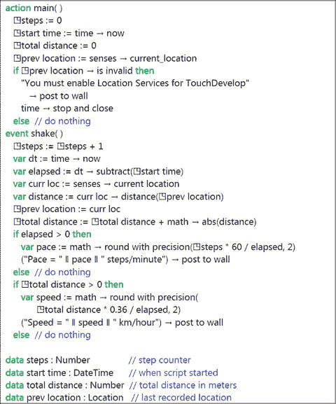
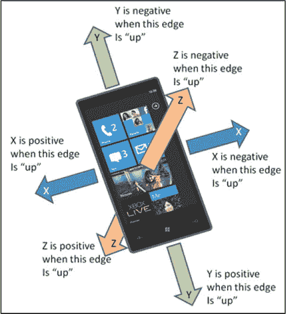
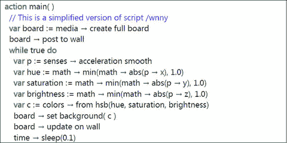
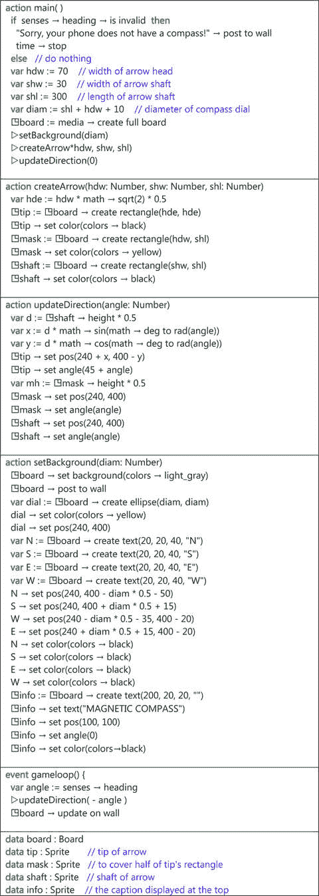
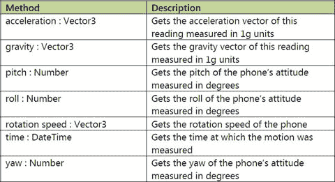
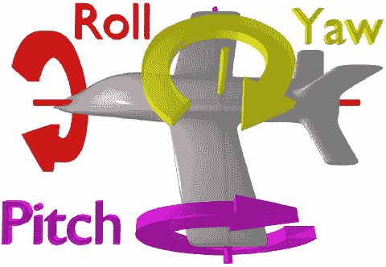

# 7. 传感器

7.1 传感器 7.2 传感器驱动的事件 7.3 加速度计 7.4 指南针 7.5 陀螺仪 7.6 运动 关键词 磁罗盘 磁北 窗口手机 小 高频率 跟随 代码片段

典型的智能手机或平板电脑包含跟踪设备位置、运动和方向的传感器。脚本可以以多种方式使用这些传感器。传感器可以为导航辅助提供输入，可以作为游戏的一个组成部分，也可以为脚本提供简单的输入。可能性是无限的。然而，笔记本电脑和台式电脑很可能没有这些传感器。

## 7.1 传感器

您的设备上可能不具备 `TouchDevelop` 所支持的全部传感器。可能的传感器如下所示。

*   **GPS（全球定位系统）**，用于获取手机在地图上的当前位置。
*   **加速度计**，用于测量手机所受的重力和加速度力。
*   **指南针**，用于返回磁北方向。
*   **陀螺仪**，用于测量手机在 3D 空间中的方向。

脚本对传感器的访问是通过调用各种 API 方法以及与陀螺仪和加速度计相关的事件来提供的。API 方法列于表 7-1 中；事件列于表 7-2 中。

**表 7-1** 感官服务的传感方法

| 加速度计方法 | 描述 |
| --- | --- |
| `senses → acceleration quick : Vector3` | 返回短时间间隔内平均的加速度 |
| `senses → acceleration smooth : Vector3` | 返回中等时间间隔内平均的加速度 |
| `senses → acceleration stable : Vector3` | 返回约 0.5 秒时间间隔内平均的加速度 |
| `senses → is device stable : Boolean` | 如果手机在大约 0.5 秒内未移动，则返回 true |
| 指南针方法 | 描述 |
| `senses → heading : Number` | 返回磁北方向与手机朝向之间的角度（以度为单位） |
| 陀螺仪方法 | 描述 |
| `senses → has gyroscope : Boolean` | 如果手机有陀螺仪，则返回 true |
| `senses → orientation : Vector3` | 获取当前相对于 X、Y、Z 轴的方向（以度为单位，如果可用）。 |
| `senses → rotation speed : Vector3` | 返回绕 X、Y、Z 轴旋转的速度（度/秒） |
| 运动方法 | 描述 |
| `senses → motion : Boolean` | 结合加速度计、指南针和陀螺仪的读数，返回手机的当前运动状态 |

## 7.2 传感器驱动的事件

如果设备被摇晃，加速度计会记录一些快速变化的读数。如果摇晃的幅度超过某个阈值，则会触发一个摇晃事件。脚本可以使用该事件来执行一个动作，例如暂停音频播放。

设备的软件可能正在使用陀螺仪来确定屏幕的方向，从而在呈现信息时选择竖屏模式或横屏模式。多种可能的方向可以通过事件机制传递给 `TouchDevelop` 脚本。

摇晃事件和手机方向事件列于表 7-2 中。

**表 7-2** 传感器事件

| 事件 | 描述 |
| --- | --- |
| `shake` | 当手机被摇晃时触发 |
| `phone face up` | 当设备被翻转至屏幕朝上时触发 |
| `phone face down` | 当设备被翻转至屏幕朝下时触发 |
| `phone portrait` | 当设备被翻转至屏幕处于竖屏模式（例如设备竖直放置）时触发 |
| `phone landscape left` | 当设备被翻转至其左侧朝下时触发 |
| `phone landscape right` | 当设备被翻转至其右侧朝下时触发 |

### 7.2.1 示例脚本：计步器 (/jbpv)

如果你在慢跑或快走时随身携带智能手机，手机的传感器应该在每走一步时触发一个 `shake` 事件。一个简单的脚本可以记录走了多少步，并据此计算每分钟的步数。通过访问 GPS 位置，也可以确定平均速度。然而，脚本不能简单地使用起始位置和结束位置来确定行进距离，因为那样只能给出两点之间的直线距离。确定实际行进距离需要更频繁地检查 GPS 位置，并对许多小段距离求和。

一个简单计步器程序的代码如图 7-1 所示。请注意，你需要先在 `TouchDevelop` 的设置中启用位置服务，脚本才能正常工作。


## 7.3 加速度计

大多数 Windows 手机都配备了一个测量小质量块所受力的装置。当手机保持完全静止时，唯一的力就是重力。如果手机被摇晃或移动，所测量的力将是加速度与重力的合力。因此，这个测量装置被称为加速度计。

重力始终向下，朝向地面。然而，加速度可以在三维空间中的任意方向上。因此，加速度计会返回一个向量，以显示三个维度中每个维度上的当前力。在 TouchDevelop API 中，该向量以`Vector3`数据类型提供。



图 7-1

一个简单的计步器程序（`/jbpv`）

访问加速度计的感知方法列于表 7-1 中。提供了三种方法来查找手机的加速度。之所以需要这三种方法，是因为现实生活中没有任何物体是完全静止的。任何声音或振动都会在物体中引起微小的、高频的加速度。要获得稳定且可重复的读数，需要在一段时间内对测量结果进行平均。更长的时间段将产生高度一致的测量值，但脚本必须等到该时间段过去后才能获得读数。

对于玩家通过移动手机来控制动作的游戏来说，长时间的等待是不合适的。请注意，这三种方法测量到的加速度包含重力。加速度向量的值为`(0.0, 0.0, 0.0)`仅表示手机处于自由落体状态。

### 7.3.1 加速度力的方向

`Vector3`值的三个分量通过`x`、`y`和`z`这三个方法访问。它们对应于 X、Y 和 Z 维度，如图 7-2 所示。

如图所示，当手机平放在桌面上时，该向量的形式为`(0.0, 0.0, k)`，其中`k`是某个负数。`k`的值取决于测量力的单位。TouchDevelop API 以 g（重力）单位报告力。任何完全静止的物体都会受到向下方向的 1g 力。换句话说，当手机保持静止并平放在桌面上（屏幕朝上）时，加速度计返回的`Vector3`值应为精确的`(0.0, 0.0, -1.0)`。

当手机垂直放置，其底边在桌面上时，`Vector3`值应为`(0.0, -1.0, 0.0)`。如果我们把手机上下颠倒，使其顶边在桌面上，则值应为`(0.0, 1.0, 0.0)`。

以下是一个简短的脚本，用于显示这些分量的值。

```
action main( )
    var acc := senses → acceleration quick
    ("Z component = " || acc → z) → post to wall
    ("Y component = " || acc → y) → post to wall
    ("X component = " || acc → x) → post to wall
```



图 7-2

加速度计方向

脚本的典型输出类似于以下内容：

```
X component = 0.0092241987586021423
Y component = -0.03411596268415451
Z component = -0.99446910619735718
```

这些值接近`0.0`、`0.0`和`-1.0`。偏差表明加速度计可能存在一些测量误差，并且手机可能并未放置在完全水平的表面上。

### 7.3.2 示例脚本：灯光秀（`/tbcb`）

该脚本简单地将手机的运动转换为颜色，并将这些颜色应用于整个屏幕。该脚本如图 7-3 所示。

该脚本将加速度读数的 X、Y 和 Z 分量映射到三个颜色分量。然而，这并不是一个简单的映射。脚本需要确保三个颜色分量保持在`0.0`到`1.0`的范围内。其次，颜色的 RGB 分量对人眼的重要性并不相同。正常眼睛对蓝色的敏感度远低于红色或绿色。为了在可能的颜色中更均匀地分布感知到的颜色，使用了另一种称为 HSB（色相、饱和度和亮度）的颜色表示方法。

该脚本每`0.1`秒从加速度计读取一次读数，并用它来设置屏幕的颜色。

该脚本的等效版本发布在 TouchDevelop 网站上，名称为`/wnny`。`/wnny`脚本使用`gameloop`事件每`50`毫秒触发一次加速度计读数，并调用库脚本中的一个操作来将`Vector3`值转换为`Color`值。

另一个使用加速度计的示例脚本是简化的飞机姿态指示器，发布为`/akgk`。通过检查加速度计的结果来确定手机相对于重力的当前方向。该信息用于在屏幕上显示人工地平线，模拟飞行员在飞机上通过姿态指示器所看到的情景。



图 7-3

简化的加速度计颜色（脚本`/tbcb`）

## 7.4 指南针

大多数智能手机都包含一个内置指南针，用于报告手机相对于磁北的方向。直接使用指南针的感知资源方法列于表 7-1 中。

### 7.4.1 示例脚本：磁罗盘（`/drvu`）

作为指南针传感器使用的演示，下面提供的脚本模拟了一个老式的磁罗盘，其中罗盘的指针总是指向北。

该脚本的大部分内容涉及在代表表盘的实心圆上显示一个表示指针的箭头。脚本中与传感器相关的重要语句如下。

```
var angle := senses → heading   // 获取以度为单位的方向角
```

正如 API 文档所述，`senses → heading`返回的值是“从地球磁北顺时针测量的以度为单位的罗盘方向角”。例如，值`15`表示磁北应该位于手机当前所指方向的左侧 15 度处。

该脚本如图 7-4 所示。大部分代码涉及绘制一个大箭头的表示。

## 7.5 陀螺仪

许多 Windows 手机也配备有陀螺仪。这是一种报告手机是否正在旋转（以任意方向绝对旋转）的装置。旋转被测量为角速度，即围绕三维空间中某个轴每秒旋转的度数。用于访问陀螺仪的 API 方法列于表 7-1 中。

TouchDevelop API 将角速度报告为一个`Vector3`值，以表示在三维空间中的旋转。值`(360, 0, 0)`表示绕 X 轴顺时针方向每秒旋转一周的速度，Y 轴和 Z 轴同理。给定一个读数`(a, b, c)`，可以计算出围绕 3D 空间中某个轴的组合旋转速度为`√(a² + b² + c²)`。

`rotation speed`方法返回的值测量了手机绕哪个轴旋转以及旋转的速度。例如，如果角速度的 X 和 Y 分量远小于 Z 分量，那么手机很可能平放在桌面上并正在原地转动（因为 Z 轴垂直于手机屏幕）。



图 7-4

磁罗盘脚本（脚本`/drvu`）


## 7.6 运动

也许在需要旋转设备的游戏中会用到陀螺仪读数？然而，陀螺仪与加速度计和指南针结合使用时才更有可能发挥作用。以下代码片段展示了如何从所有三个传感器中提取组合读数。

```
var motion := senses → motion
if motion → is invalid then
    "您的设备不具备运动功能！" → post to wall
    time → stop
else  // 不执行任何操作
```

第一条语句获取的值具有 `Motion` 数据类型。与该数据类型关联的方法可以提取各种组件读数。`Motion` 类型提供的方法总结在图 7-5 中（省略了 `is invalid` 和 `post to wall` 方法）。

一个非常重要的特性是，软件可以将加速度计上的力分解为重力引起的力和加速度引起的附加力。换句话说，`acceleration` 方法返回的是真实的加速度，不包含重力分量。重力应始终等于 1g，但其方向取决于设备的朝向。

`Motion` 值的另一个重要特性是，可以在捕获该值时获得设备朝向的精确数值。由 `senses → acceleration quick` 返回的 `Vector3` 值的方向通常足够使用，但可能会因晃动设备而受到干扰。设备的真实朝向被称为其姿态。名为 `pitch`、`roll` 和 `yaw` 的三个方法分别报告手机相对于三个正交轴测量的姿态角度。如果用一个智能手机代替飞机，这些轴如图 7-6 所示。如果手机垂直握持并面向磁北，`yaw`、`pitch` 和 `roll` 的值应全部为零。任何相对于该起始位置的旋转都会导致这些值变为非零。



图 7-5 — `Motion` 类型的方法

请注意，手机的当前朝向可以通过 `senses → orientation` 方法获取。



图 7-6 — 偏航角、俯仰角和横滚角

注：该图像复制自维基共享资源，这是一个自由许可的多媒体文件库。

 开放获取 本章遵循知识共享署名-非商业性使用-禁止演绎 4.0 国际许可协议 ([`creativecommons.org/licenses/by-nc-nd/4.0/`](http://creativecommons.org/licenses/by-nc-nd/4.0/)) 的条款进行许可，该协议允许任何非商业性使用、共享、分发和以任何媒介或格式复制，前提是您适当注明原作者和来源，提供指向知识共享许可协议的链接，并说明您是否修改了许可材料。根据本许可协议，您无权分享源自本章或其部分的改编材料。除非在资料来源的署名行中另有说明，本章中包含的图像或其他第三方材料均包含在本章的知识共享许可协议中。如果材料未包含在本章的知识共享许可协议中，且您的预期使用未得到法定法规的许可或超出许可范围，您将需要直接获得版权所有者的许可。

