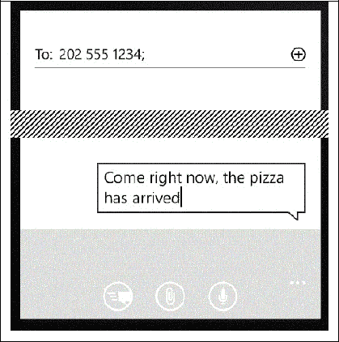

# 8. 交互

8.1 社交消息 8.2 位置、地点、地图 8.3 电子邮件 8.4 电话 8.5 二维码 8.6 短信（仅限 WP8） 8.7 日历和约会（仅限 WP8） 8.8 联系人（仅限 WP8 和 Android）

关键词：电话、智能手机、即时通讯、音频片段、电话公司

智能手机、平板电脑和计算机提供日历、电子邮件、社交媒体访问、某些形式的即时通讯、短信和电话功能。甚至计算机也可以通过 Skype 等服务拨打电话。这些都属于本章涵盖的交互形式。

## 8.1 社交消息

包括 Twitter 和 Facebook 在内的几个网站提供发布消息供他人阅读的功能。这些消息可能附带相关内容，例如图片或音频片段。TouchDevelop API 提供了下载此类消息和发布新消息的功能。

`social` 资源提供了表 8-1 中列出的两个方法，用于创建新消息和从网站检索消息。从这两个支持的社交网络获取消息并显示它们的简单示例如下。

```
var TD msgs := social → search("twitter", "#touchdevelop")
var more msgs := social → search("facebook", "TouchDevelop")
// 将两个集合合并为一个
TD msgs → add many(more msgs)
// 重新排序并显示消息
TD msgs → sort by date
TD msgs → post to wall
```

表 8-1 — `social` 服务的消息处理方法

| 方法 | 描述 |
| --- | --- |
| `social → create message(message : String) : Message` | 使用提供的文本内容创建一条新消息。 |
| `social → search(network : String, terms : String) : Message Collection` | 搜索 Twitter 或 Facebook 上与提供的搜索词匹配的最近消息。 |

### 8.1.1 处理消息

`Message` 值通常包含文本组件，因为这是消息的最简单形式。然而，通常还会附带额外信息。TouchDevelop API 支持多种方法来访问或设置附加到消息的额外内容。这些都是 `Message` 数据类型的方法。用于访问或获取内容的方法列在附录 C 中 C.25 节的第一个表中，设置内容的方法在第二个表中，其他一些方法在第三个表中。

应注意，消息的额外内容并非总是存在。在检索这些可选值（例如 `media link`）之后，脚本应执行 `is invalid` 测试以验证该值是否实际可用。

`Message` 实例的 `share` 方法允许以多种方式之一传输消息。无论为 where 参数提供了何种选择，都会显示一个对话框。只有在做出选择和/或点击发送消息的按钮后，消息才会被发送。


### 8.1.2 消息集合

`Message Collection`（消息集合）类型是一个可变的消息集合。可以使用以下调用创建一个空实例：

`var msgs := collections → create message collection`

然后，可以使用向集合添加新元素的标准方法来填充这个空集合。

消息集合也可以通过 `social → search` 和 `web → feed` 方法创建。`web → feed` 方法访问互联网上的 RSS 流或 Atom 订阅源，并将该流解析为一系列消息。使用该方法的示例脚本是 rmc 阅读器 (`/fiol`)。

`Message Collection` 类型提供了所有可变集合类型通用的几种方法。但还有两种额外的方法对于管理消息集合特别有用。这些方法列于表 8-2 中。

**表 8-2**
`Message Collection` 数据类型的额外方法

| Message Collection 方法 | 描述 |
| --- | --- |
| `reverse: Nothing` | 反转集合中消息的顺序 |
| `sort by date : Nothing` | 按消息关联的日期和时间值排序，从最新到最旧 |

## 8.2 位置、地点、地图

许多消息、图片和媒体资源都关联有位置信息。位置被实现为一对地理坐标。然而，存在用于查找位置附近的地名、在地图上精确定位位置以及获取从一个位置到另一个位置的导航路线的网络服务。

可以使用 `locations` 资源的方法来创建或描述一个位置。这些方法列于表 8-3 中。

除了 `locations` 服务提供的方法之外，还可以从其他几个来源获取位置值。以下是可能来源的列表。

**表 8-3**
`locations` 服务的方法

| 方法 | 描述 |
| --- | --- |
| `locations → create location( latitude : Number, longitude : Number) : Location` | 根据坐标创建一个新位置 |
| `locations → create location list : Location Collection` | 创建一个空的位置列表 |
| `locations → describe location( location : Location) : String` | 使用必应查找某个位置的名称或地址 |
| `locations → search location(address : String, postal code : String, city : String, country : String) : Location` | 使用必应查找某个地址的坐标 |

*   `senses → current location`
*   `senses → current location accurate`
*   `maps → directions`
*   `Link` 数据类型的 `location` 方法
*   `Map` 数据类型的 `center` 方法
*   `Message` 数据类型的 `location` 方法
*   `Picture` 数据类型的 `location` 方法
*   `Place` 数据类型的 `location` 方法

位置与地图密切相关。TouchDevelop API 同时提供了 `maps` 服务和 `Map` 数据类型。通过使用必应提供地图。`maps` 服务的方法列于表 8-4 中，`Map` 数据类型的方法列于表 8-5 中。

脚本 go to picture (`/gpona`) 提供了使用位置和必应地图服务的一个小示例。整个脚本如下所示。

```
action main( )
    // 从库中选择一张照片并显示
    // 前往拍摄地点的路线说明。
    var pic := media → choose picture
    var loc := pic → location
    if loc → is invalid then
        wall → prompt("This picture does not have location information.")
    else
        maps → open directions("", senses → current location, "", loc)
```

`Place` 数据类型为位置提供了一个包装器，以便可以将附加信息关联到该位置。针对不同类型的附加信息，既有 getter 方法也有 setter 方法。它们列于附录 C 的 C.37 节表中。除了这些方法之外，还有常用的 `is invalid` 和 `post to wall` 方法，以及另外两种方法。它们是 `check in`（用于 Facebook 交互）和 `to string`（创建地点的字符串表示形式）。

**表 8-4**
`maps` 服务的方法

| 方法 | 描述 |
| --- | --- |
| `maps → create full map : Map` | 创建一个全屏的必应地图 |
| `maps → create map : Map` | 创建一个必应地图 |
| `maps → directions( from : Location, to : Location, walking : Boolean) : Location Collection` | 提供从一个位置到另一个位置的逐点行程路线。如果 `walking` 为 `true`，则该路线适合步行；否则假定为车辆路线 |
| `maps → open directions( start search : String, start loc : Location, end search : String, end loc : Location) : Nothing` | 打开必应地图应用程序以显示从一个点到另一个点的路线。两个端点可以通过搜索词或位置来指定。如果要使用位置，搜索词应为 ""。 |
| `maps → open map(center : Location, search : String, zoom : Number) : Nothing` | 围绕由搜索词或位置指定的中心点打开必应地图应用程序；`zoom` 值范围从 0（近）到 1（远） |

## 8.3 电子邮件

TouchDevelop 脚本可以准备一封准备发送的电子邮件，但它实际上并不会发送。以下简短脚本准备了一条消息：

```
var msg := social → create message(“The dinner party is tonight!”)
msg → set from(“your friendly host”)
msg → set to(“another@outlook.com”)
msg → set title(“Invitation reminder”)
msg → share(“email”)
```

当这些命令执行时，最后一个命令（`share` 方法调用）会询问应该使用哪个邮件帐户（如果在手机上设置了多个帐户），然后调用手机的电子邮件应用程序。在该应用程序中点击发送按钮之前，消息不会被发送。

**表 8-5**
`Map` 数据类型的方法

| Map 方法 | 描述 |
| --- | --- |
| `add line(locations : Location Collection, color : Color, thickness : Number) : Nothing` | 在位置列表上拟合一条线，使用给定的线宽和颜色绘制该线 |
| `add link(link : Link, background : Color, foreground : Color) : Nothing` | 在与链接值关联的位置处，向地图添加一个链接图钉 |
| `add message(msg : Message, background : Color, foreground : Color) : Nothing` | 在与消息值关联的位置处，向地图添加一个消息图钉 |
| `add picture(location : Location, picture : Picture, background : Color) : Nothing` | 在与图片值关联的位置处，向地图添加一个图片图钉 |
| `add place(place : Place, background : Color, foreground : Color) : Nothing` | 在与地点值关联的位置处，向地图添加一个地点图钉 |
| `add text(location : Location, text : String, background : Color, foreground : Color) : Nothing` | 在指定位置处，向地图添加一个文本图钉 |
| `center : Location` | 获取地图中心位置 |
| `clear : Nothing` | 移除所有线条、图钉和区域 |
| `fill region(locations : Location Collection, fill : Color, stroke : Color, thickness : Number) : Nothing` | 绘制由位置列表指定顶点的区域边缘，并使用给定颜色填充该区域。 |
| `set center(center : Location) : Nothing` | 设置地图中心 |
| `set zoom(level : Number) : Nothing` | 设置地图缩放级别，范围从 1（显示整个地球）到 21（街道级别） |
| `view pushpins : Nothing` | 更改缩放和中心，使所有图钉可见；必须将地图张贴到墙上 |
| `zoom : Number` | 获取当前缩放级别 |

虽然可以调用电子邮件应用程序来发送消息，但 TouchDevelop 脚本没有用于直接读取电子邮件的 API 支持。


## 8.4 电话呼叫

脚本可以通过设置号码并将控制权移交给手机的通话软件，来准备发起一次电话呼叫。此功能由 API 中的 `phone` 资源提供。API 中相关的方法调用列于表 8-6。

表 8-6

处理电话呼叫的方法

| 方法 | 描述 |
| --- | --- |
| `phone → choose phone number: Link` | 打开手机的联系人列表，以便选择电话号码 |
| `phone → dial phone number(number : String) : Nothing` | 使用提供的号码设置一个电话呼叫，但不会拨出该号码 |
| `phone → save phone number(phone number : String) : Nothing` | 打开手机的联系人列表，允许将该号码添加到现有联系人条目或新条目中 |

以下是一些示例代码，用于设置一个电话呼叫，以备发起连接：

```
var link := phone → choose phone number
phone → dial phone number( link → address)
```

无法编写脚本来接听来电或录制通话中的音频片段。

## 8.5 二维条码

TouchDevelop 提供了对 Microsoft Tag 服务的访问，该服务可为文本消息和 URL 生成二维条码。这些条码是正方形的图像，可以打印在文档或宣传材料上。大多数智能手机（无论是否为 Windows 手机）都拥有扫描软件，使用户能够用手机摄像头对准条码，并自动显示文本或访问网页。

条码生成方法由 `tags` 资源提供。其两个方法列于表 8-7。

表 8-7

条码生成方法

| 方法 | 描述 |
| --- | --- |
| `tags → tag text(text : String, size : Number, bw : Boolean) : Picture` | 为文本（最多 1000 个字符）生成条码；`size` 是图片的宽度和高度（以英寸为单位），必须在 0.75 到 5.0 范围内；如果 `bw` 为真，则生成黑白图像，否则为彩色图像。 |
| `tags → tag url(url : String, size : Number, bw : Boolean) : Picture` | 生成指向所提供 URL 的条码；`size` 和 `bw` 的含义同上。 |

以下示例代码生成并显示一个条码：

```
var pic := tags → tag text(“TouchDevelop is cool!”, 1.0, false)
pic → post to wall
```

运行这两条语句的结果如图 8-1 左侧所示。当第三个参数改为 `true` 时的结果显示在右侧。两种版本的条码均可用于扫描软件。


图 8-1

二维条码示例

## 8.6 短信消息（仅限 WP8）

SMS 是短消息服务（Short Message Service）的缩写。它是由电话公司提供的一种文本消息服务。通常用于将消息从一部手机发送到另一部手机，尽管一些电话公司可能提供发送或接收消息的额外方法。SMS 的原始标准将消息正文限制为最多 140 字节。（Twitter 社交网络服务也有相同的限制。）较长的消息会自动被分割成一系列短消息。

TouchDevelop API 允许脚本生成一条准备发送的 SMS 消息，但不会实际发送它。用户必须执行一个额外的操作。

以下是一些生成并准备发送 SMS 消息的脚本代码：

```
var msg := “Come right now, the pizza has arrived”
var recipient := “202 555 1234”
social → send sms( recipient, msg )
```

如果执行该脚本，手机的消息软件将被激活，并显示用于发送 SMS 消息的标准对话框，如图 8-2 所示。



图 8-2

发送 SMS 消息

## 8.7 日历与约会（仅限 WP8）

Windows 手机提供了一个日历，用于记录每一天的日程安排，其中包括各种会议或约会。

手机的日历可能与一个或多个外部日历同步，例如 Windows Outlook 日历或社交网络网站上的事件日历。

TouchDevelop 脚本对手机日历具有只读访问权限，可以检索特定时间范围内的所有约会。以下是一个小示例，其中的语句将检索并显示明天的约会。

```
var start time := time → tomorrow
var end time := start time → add hours(24)
var appts := social → search appointments (start time, end time)
appts → post to wall
```

请注意，`social → search appointments` 是访问日历的唯一机制。从日历中获取的每个约会都有多个相关属性。可以使用表 8-8 中列出的方法来访问它们。（表中省略了 `invalid` 和 `post to wall` 这两个方法。）

表 8-8

约会数据类型的方法

| 约会方法 | 描述 |
| --- | --- |
| `attendees: Contact Collection` | 获取约会的参与者列表 |
| `details: String` | 获取约会的详细信息（正文） |
| `end time: DateTime` | 获取结束时间（如果可用） |
| `is all day event: Boolean` | 如果约会标记为全天事件，则返回真 |
| `is private: Boolean` | 如果日历条目标记为私有，则返回真 |
| `location: String` | 返回与约会关联的地点 |
| `organizer: Contact` | 返回约会的组织者（如果可用） |
| `source: String` | 返回约会的来源，即它来自哪个日历或社交网络网站 |
| `start time: DateTime` | 获取开始时间（如果可用） |
| `status: String` | 返回用户对此约会的状态（空闲、暂定、忙碌或外出） |
| `subject: String` | 返回约会的主题（如果可用） |


## 8.8 联系人（仅限 WP8 和 Android）

每个联系人包含多个字段。除姓名外，所有字段均为可选。这些字段的值可通过附录 C 中 C.7 节第一个表格列出的访问方法获取。几乎所有字段的值都可以通过该节第二个表格列出的方法进行修改。

当联系人的部分信息发生更改时，可以通过 `social` → `save contact` 方法将更新后的联系人保存回手机的联系人列表。

表 8-9 访问与创建联系人的方法

| 方法 | 描述 |
| --- | --- |
| `social→ choose contact : Contact` | 允许用户从手机联系人列表中选择一个联系人 |
| `social→ choose email : Link` | 允许用户从手机联系人列表中选择一个联系人的邮箱 |
| `social→ create contact ( nickname : String) : Contact` | 创建一个仅指定昵称字段的新联系人 |
| `social→ save contact ( contact : Contact): Nothing` | 在手机联系人列表中保存一个新联系人 |
| `social→ search contacts ( prefix : String) : Contact Collection` | 搜索名称以指定前缀开头的联系人 |

 开放获取 本章根据知识共享署名-非商业性使用-禁止演绎 4.0 国际许可协议 ([`creativecommons.org/licenses/by-nc-nd/4.0/`](http://creativecommons.org/licenses/by-nc-nd/4.0/)) 的条款提供，允许任何非商业用途的复制、共享、分发和在任何媒介或格式中复制，前提是您给予原作者和来源适当的署名，提供指向知识共享许可协议的链接，并标明您是否修改了许可材料。根据本许可协议，您无权分享改编自本章或其部分的材料。本章中的图片或其他第三方材料已包含在本章的知识共享许可协议中，除非在材料的署名行中另有说明。如果某材料未包含在本章的知识共享许可协议中，且您的预期用途未得到法定法规允许或超出允许范围，您需要直接获得版权持有人的许可。

