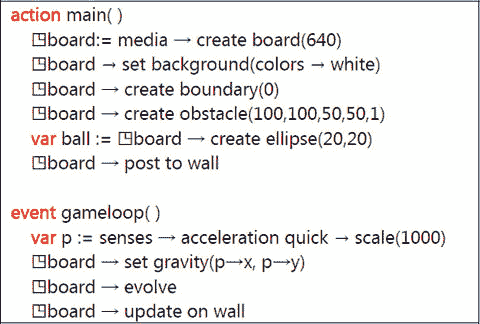

# 9. 游戏板

9.1 简介 9.2 Board 数据类型 9.3 Sprite 数据类型 9.4 Sprite 集合数据类型 9.5 触摸与板事件 9.6 游戏调试

TouchDevelop 包含一个用于编写简单基于 Sprite 的游戏的“游戏板”API。该 API 包含一个基础物理引擎，用于简化常见的游戏循环，使物体在受到重力和摩擦影响时移动。游戏板元素可以通过基于触摸和固定时间间隔的事件来进行编排。

## 9.1 简介

### 9.1.1 什么是 Sprite？

在 TouchDevelop 中，Sprite 是直接绘制到屏幕上的 2D 位图。Sprite 通常用于显示信息，例如生命条、剩余生命数或分数等文本。一些游戏，尤其是较老的游戏，完全由 Sprite 组成。TouchDevelop 允许创建和使用多种类型的 Sprite，例如椭圆形、矩形、文本和图片。有关 Sprite 功能的更多详细信息，请访问 [`msdn.microsoft.com/en-us/library/bb203919.aspx`](http://msdn.microsoft.com/en-us/library/bb203919.aspx)。

### 9.1.2 坐标与单位

游戏板 API 中的位置基于像素。当设备垂直握持时，网格的原点位于左上角，x 轴为水平方向，y 轴为垂直方向。Sprite 的位置指的是其中心点，即在应用任何旋转之前其宽度和高度的中点。选择此中心位置的原因是为了让 Sprite 能够围绕其中心旋转。TouchDevelop 的未来版本可能会提供更多控制 Sprite 偏移量的方法。速度和加速度的单位分别为像素/秒和像素/秒²。

### 9.1.3 游戏程序结构

典型游戏的代码具有如下基本结构。

```
action main( )
    ◳board := media → create board(640)
    // … 创建精灵，为板添加颜色和特性
    ◳board → post to wall

event gameloop( )
    // … 移动物体 …
    ◳board → update on wall
```

`gameloop` 事件大约每 50 毫秒触发一次，即每秒约触发 20 次。

## 9.2 Board 数据类型

`media` 资源提供了两种创建游戏板的方法；这些方法列在表 9-1 中。TouchDevelop 支持的板最大高度为 640 像素。通过 `media` → `create board` 创建的板宽为 456 像素；通过 `media` → `create portrait board` 创建的板宽为 480 像素。板在发布到墙之前保持不可见状态。

一旦发布，对板状态和板上 Sprite 的更新仅在调用 `board` → `update on wall` 时才会变为可见。

`Board` 数据类型中与板尺寸和外观相关的方法列在表 9-2 中。板具有可单独设置的背景色和背景图片。默认背景色为透明，且默认不提供背景图片。另一种可能性是复制设备主摄像头捕获的图像，并将这些图像用作板不断变化的背景。同一时间只能激活其中一种背景选项。

表 9-1 创建板的方法

| 方法 | 描述 |
| --- | --- |
| `media→create board( height : Number) : Board` | 创建一个指定高度（像素）的新板 |
| `media→create portrait board : Board` | 创建一个显示时填满整个屏幕的新板，并假定设备处于竖屏模式。 |
| `media→create landscape board : Board` | 创建一个显示时填满整个屏幕的新板，并假定设备处于横屏模式。 |


### 9.2.1 创建精灵

精灵共有四种类型，可显示不同种类的视觉内容。它们可以呈现为椭圆形或矩形，可以绘制为实心图形，也可以采用可更新文本的形式，或从图片创建而来。还有第五种称为**锚点精灵**的精灵类型，它不可见且有特殊用途，相关内容将在下方“弹簧与锚点”小节中解释。精灵与特定的游戏板相关联，并通过`Board`类型的方法创建。用于创建和访问精灵的方法详见表 9-3。

精灵的初始位置位于游戏板中央，且没有移动速度或角旋转。可使用`Sprite`数据类型的方法为每个精灵设置这些属性。

除`at`方法外，还可使用`for each`循环访问游戏板上的所有精灵。若`board`是`Board`类型的变量，则循环结构如下所示。

```
for each sprite in board where true do

           // 访问精灵
```

**表 9-3**  
`Board`数据类型的方法：创建/访问精灵

| Board 方法 | 描述 |
| --- | --- |
| `at(i : Number) : Sprite` | 返回此游戏板实例上编号为`i`的精灵（0 ≤ `i` < `count`） |
| `count : Number` | 返回此游戏板上的精灵数量 |
| `create anchor(width : Number, height : Number) : Sprite` | 创建一个不可移动的不可见锚点精灵 |
| `create ellipse(width : Number, height : Number) : Sprite` | 创建一个椭圆形精灵 |
| `create picture(picture : Picture) : Sprite` | 创建一个尺寸和图像与指定图片相同的精灵 |
| `create rectangle(width : Number, height : Number) : Sprite` | 创建一个矩形精灵 |
| `create sprite set : Sprite Set` | 创建一个空的精灵集合 |
| `create text(width : Number, height : Number, fontSize : Number, text : String) : Sprite` | 创建一个在游戏板上显示为文本字符串的精灵 |

**表 9-2**  
`Board`数据类型的方法：外观

| Board 方法 | 描述 |
| --- | --- |
| `clear background camera : Nothing` | 移除游戏板背景图像与摄像头的任何关联 |
| `clear background picture : Nothing` | 移除为游戏板设置的任何背景图片 |
| `height : Number` | 返回游戏板的像素高度 |
| `is landscape board : Boolean` | 若游戏板设计为横向模式查看，则返回`true` |
| `set background(color : Color) : Nothing` | 设置游戏板的背景颜色 |
| `set background camera(camera : Camera) : Nothing` | 将游戏板背景设为主摄像头捕获的图像 |
| `set background picture(picture : Picture) : Nothing` | 设置要在游戏板上显示的背景图片 |
| `width : Number` | 返回游戏板的像素宽度 |

在游戏过程中，拥有多个精灵集合非常有用。例如，一个集合包含宇宙飞船，另一个集合包含小行星等。

精灵集合可以创建为`Sprite Set`数据类型的实例。`create sprite set`方法可创建一个新集合，用于容纳与该`Board`实例关联的精灵。通过使用`Sprite Set`数据类型的方法，可以将精灵添加到此集合或从中移除。

### 9.2.2 障碍物与边界

障碍物是可添加到游戏板上的墙壁。墙壁一旦创建便无法移动。遇到障碍物的移动精灵将会反弹，其速度由障碍物弹性与精灵弹性的乘积决定。若障碍物和精灵的弹性均为 1，则精灵将保持全速，只是方向发生改变。若其中一个或两个弹性均为 0，则冲力将被完全吸收，精灵会粘在墙壁上。默认情况下，所有弹性均为 1。

默认情况下，游戏板是开放的，即没有边界。移出游戏板可视区域的精灵会继续远离。由于通常需要在游戏板四周设置反射墙壁，因此可使用`create boundary(distance)`方法，在距离游戏板边缘指定距离处创建一组反射墙壁。这些反射墙壁的弹性为 1，即精灵速度不会降低。若边界距离游戏板边缘的距离大于精灵的尺寸，精灵可能会在反弹并重新出现之前从屏幕上消失。若距离设为负数，则边界位于游戏板区域内部。

用于创建障碍物和边界的方法详见表 9-4。

### 9.2.3 力与动画


#### 重力与摩擦力

可以对板上的所有精灵施加均匀的力。例如，可以存在一个力将物体拉向屏幕底部，模拟重力。然而，这个重力并不需要保持恒定。如果设备配备了必要的传感器，脚本可以利用设备陀螺仪确定的方向或加速度计读数，反复调整游戏中物体所承受的重力大小和方向。

**表 9-4** `Board` 数据类型的方法：障碍物/边界

| Board 方法 | 描述 |
| --- | --- |
| `create boundary(distance : Number) : Nothing` | 在板边缘指定距离处创建完全反射的墙壁 |
| `create obstacle(x : Number, y : Number, xsegment : Number, ysegment : Number, elasticity : Number) : Nothing` | 创建一条实心障碍物线段，起点为 (x, y)，在 x 和 y 方向上分别延伸 xsegment 和 ysegment；弹性系数取值范围为 0（粘性）到 1（完全反射） |

一旦精灵获得了速度，或者重力被设置为非零值，板引擎就会更新精灵的位置。要在一个时间步长内更新所有精灵的位置，应调用 `board` → `evolve` 方法。时间步长的持续时间即为自上次调用 `board` → `evolve` 或自板创建以来经过的时间。

图 9-1 展示了一个使用障碍物和重力的简单脚本。



**图 9-1** 示例脚本：移动的球（`/nyuc`）

该脚本创建了一个板，并在整个板周围添加了反射墙。然后创建了一段小障碍物墙和一个球形的精灵。在游戏循环中，使用加速度计设置游戏板上的重力。为了使球移动得更快，加速度被放大了 1000 倍。

默认情况下，精灵会持续移动而不会减速。只有当它朝与重力相反的方向移动，或者在与弹性系数小于 1 的障碍物碰撞中损失能量时，速度才会降低。如果需要让精灵自行减速，可以为板或每个精灵单独设置默认的摩擦系数。

每个精灵可以有自己的摩擦设置，但若未设置，则每个精灵会承受板默认的摩擦。摩擦系数定义为正向速度中作为反向力所感受到的部分。摩擦系数为 0 表示无摩擦，摩擦系数为 1 意味着精灵将完全无法移动。

用于驱动板动画并对精灵施加力的方法总结于表 9-5。

**表 9-5** `Board` 数据类型的方法：力/动画

| Board 方法 | 描述 |
| --- | --- |
| `create spring(sprite1 : Sprite, sprite2 : Sprite, stiffness : Number) : Nothing` | 在两个精灵之间创建吸引力；stiffness（刚度）决定了力的强度 |
| `evolve : Nothing` | 更新板上所有精灵的位置 |
| `set friction(friction : Number) : Nothing` | 为所有未设置自身摩擦属性的精灵设置默认摩擦系数；取值范围为 0（不减速）到 1（完全减速） |
| `set gravity(x : Number, y : Number) : Nothing` | 为板上所有精灵设置统一的加速度向量 (x, y) |

#### 弹簧与锚点

可以在两个精灵之间添加一个弹簧，使它们相互加速靠近。弹簧通过表 9-5 中列出的 `create spring` 方法创建。弹簧的力与两个精灵之间的距离成正比。它们相距越远，力就越大。比例常数由 `create spring` 方法的 stiffness 参数决定。该值越大，吸引力越强。

如果没有摩擦力随时间消耗能量，由弹簧连接的精灵将无限期地振荡。有了摩擦力，它们最终会收敛到同一个点。一种常见的情况是固定板上两个弹簧连接精灵中的一个（使其不可移动）。

生成不可移动精灵的一种方法是将它的摩擦系数设置为 1。另一种可能性是使用一个不可见的锚点精灵。`create anchor` 方法会创建一个不可见的精灵，并将其摩擦系数设置为 1.0。因此，通过弹簧连接到锚点的精灵会围绕锚点振荡。给精灵一个垂直于弹簧方向的初始速度向量，会使精灵绕锚点做圆周运动。通过多个锚点和弹簧的组合，可以产生一些有趣的振荡路径。

## 9.3 `Sprite` 数据类型

精灵是可移动的对象，在视觉上代表游戏的一部分，例如宇宙飞船和小行星。新的精灵通过 `Board` 数据类型的方法创建。一旦创建了精灵，就可以使用 `Sprite` 数据类型的方法设置其位置、速度、质量、颜色等属性。

### 视觉属性

精灵的视觉属性（如颜色和大小）可通过表 9-6 中列出的方法进行访问。

**表 9-6** `Sprite` 数据类型的方法：视觉属性

| Board 方法 | 描述 |
| --- | --- |
| `color : Color` | 返回精灵的颜色 |
| `height : Number` | 返回精灵的高度（以像素为单位） |
| `hide : Nothing` | 隐藏精灵（使其不可见） |
| `is visible : Boolean` | 如果精灵未被隐藏，则返回 true |
| `move clip(x : Number, y : Number) : Nothing` | 调整围绕由图片创建的精灵的裁剪区域 |
| `opacity : Number` | 返回精灵的不透明度；0 为透明，1 为不透明 |
| `picture : Picture` | 返回图片精灵的图片 |
| `set clip(left : Number, top : Number, width : Number, height : Number) : Nothing` | 为由图片创建的精灵（图像精灵）设置裁剪区域 |
| `set color(color : Color) : Nothing` | 设置精灵的颜色（如果是图片精灵则忽略） |
| `set height(height : Number) : Nothing` | 设置精灵的高度（以像素为单位） |
| `set opacity(opacity : Number) : Nothing` | 设置精灵的不透明度；0 为透明，1 为不透明 |
| `set picture(pic : Picture) : Nothing` | 替换由图片创建的精灵的图片（对于非图片精灵则忽略） |
| `set text(text : String) : Nothing` | 替换由文本字符串创建的精灵的文本（对于非文本精灵则忽略） |
| `set width(width : Number) : Nothing` | 设置精灵的宽度（以像素为单位） |
| `set z index(zindex : Number) : Nothing` | 设置精灵的 z-index |
| `show : Nothing` | 显示精灵（与 hide 相反） |
| `text : String` | 获取文本精灵的文本 |
| `width : Number` | 获取精灵的宽度（以像素为单位） |
| `z index : Number` | 获取精灵的 z-index |

通过 `set z index` 和 `z index` 方法访问的 z-index 用于控制精灵在屏幕上渲染的顺序。如果两个精灵重叠，后渲染的精灵将会显示在第一个精灵的上面。

渲染顺序可以通过 z-index 值来控制。当提供了这些值时，精灵将按照其 z-index 从小到大的顺序进行渲染。

### 位置与运动

精灵有一个当前位置和一个当前角度朝向。两者都以由精灵的速度和角速度决定的速率变化。精灵的这些属性可以通过使用表 9-8 中列出的方法进行访问或更改。


### 加速度、力与弹跳

在没有重力、弹簧和摩擦的情况下，精灵会以恒定速度在面板上持续移动，直到撞上某种障碍物。然而，在存在这些效应的情况下，精灵的速度会发生变化。

弹簧使用面板的`create spring`方法创建。这部分内容已介绍过。由弹簧力在精灵上产生的加速度与精灵的质量成反比。

表 9-7

`Sprite`数据类型的方法：位置/速度

| 面板方法 | 描述 |
| --- | --- |
| `angle : Number` | 获取精灵的角度（单位：度） |
| `angular speed : Number` | 获取角速度（单位：度/秒） |
| `move(deltax : Number, deltay : Number) : Nothing` | 在 x、y 维度上按`deltax`和`deltay`调整精灵的位置 |
| `move towards(other : Sprite, fraction : Number) : Nothing` | 将当前精灵向另一个精灵移动指定比例的距离 |
| `set angle(angle: Number) : Nothing` | 设置精灵的角度（单位：度） |
| `set angular speed(speed : Number) : Nothing` | 设置角速度（单位：度/秒） |
| `set pos(x : Number, y : Number) : Nothing` | 将精灵的位置设置为新的 x 和 y 坐标 |
| `set speed(vx : Number, vy : Number) : Nothing` | 设置精灵的速度 x 和 y 分量，`vx`和`vy`的单位为像素/秒 |
| `set speed x(vx : Number) : Nothing` | 仅设置速度的 x 分量，单位为像素/秒 |
| `set speed y(vy : Number) : Nothing` | 仅设置速度的 y 分量，单位为像素/秒 |
| `set x(x : Number) : Nothing` | 设置精灵的 x 坐标 |
| `set y(y : Number) : Nothing` | 设置精灵的 y 坐标 |
| `speed towards(other : Sprite, magnitude : Number) : Nothing` | 设置当前精灵移向另一个精灵的速度；速度单位为像素/秒 |
| `speed x : Number` | 获取精灵速度的 x 分量，单位为像素/秒 |
| `speed y : Number` | 获取精灵速度的 y 分量，单位为像素/秒 |
| `x : Number` | 获取位置的 x 坐标 |
| `y : Number` | 获取位置的 y 坐标 |

精灵越重，弹簧发挥全部效果所需的时间就越长。每个精灵都有一个默认质量，即精灵宽度和高度的乘积。然而，可以通过精灵的`set mass`方法覆盖该默认值。质量不能为零或负数。

可以为面板指定一个重力，该重力会作用于每个精灵（不包括任何锚点精灵）。力的大小与精灵的质量成正比。然而，力对精灵速度的影响与质量成反比，因此重力产生的加速度与精灵的质量无关。

另一种用于减慢移动精灵速度的力是摩擦力。可以使用面板的`set friction`方法为面板指定一个摩擦力值，该值将成为面板上所有精灵的默认摩擦力值。不过，也可以使用`Sprite`实例的`set friction`方法为单个精灵设置摩擦力。

上述所有力共同作用，产生作用于精灵的净力，并驱动精灵运动。如果这些组合力未能产生预期效果，还可以进行一项调整。这项调整通过`set acceleration`方法实现，本章下一小节将对此进行介绍。

当精灵撞到障碍物时，它会以新的速度向新方向反弹。新速度的大小由精灵与障碍物的弹性系数乘积决定。如果两者的弹性系数均为 1，则为完美弹跳，不损失能量，精灵速度也不会降低。如果乘积为 0，则精灵会停止并粘在障碍物上。

当前游戏面板的实现并未检测精灵之间的碰撞。这需要大量的计算开销，尤其是在精灵数量较多的情况下。一个精灵会直接穿过另一个精灵而毫无阻挡。

表 9-8 列出了用于访问精灵的摩擦力、质量和弹性设置的方法。


### 9.3.1 管理精灵

实现一个游戏通常需要一些额外的编程，这些功能无法通过目前已介绍的板子和精灵特性来提供。例如，如果游戏需要与弹簧和重力所提供的力性质不同的力，或者需要处理精灵之间的碰撞，那么表 9-9 中列出的附加`精灵`方法应该会很有用。

**表 9-9**  
`精灵`数据类型的方法：附加功能

| 精灵方法 | 描述 |
| --- | --- |
| `acceleration x : Number` | 获取精灵当前加速度的 x 分量，单位是像素/秒² |
| `acceleration y : Number` | 获取精灵当前加速度的 y 分量，单位是像素/秒² |
| `delete : Nothing` | 删除该精灵 |
| `equals(other : Sprite) : Boolean` | 如果当前精灵与另一个精灵相同，则返回`true` |
| `location : Location` | 获取精灵的地理位置（由`set location`方法分配） |
| `overlap with(sprites : Sprite Set) : Sprite Set` | 返回与此精灵重叠的精灵子集 |
| `overlaps with(other : Sprite) : Boolean` | 如果两个精灵重叠，则返回`true` |
| `set acceleration(vx : Number, vy : Number) : Nothing` | 设置精灵的加速度，单位是像素/秒² |
| `set acceleration x(vx : Number) : Nothing` | 设置精灵加速度的 x 分量，单位是像素/秒² |
| `set acceleration y(vy : Number) : Nothing` | 设置精灵加速度的 y 分量，单位是像素/秒² |
| `set location(location : Location) : Nothing` | 设置精灵的地理位置 |

**表 9-8**  
`精灵`数据类型的方法：质量、摩擦力、弹性

| 板子方法 | 描述 |
| --- | --- |
| `elasticity : Number` | 获取精灵的弹性，表示为每次反弹速度保留的比例（0 到 1） |
| `friction : Number` | 获取精灵的摩擦力，以速度损失比例（0 到 1）表示 |
| `mass : Number` | 获取精灵的质量 |
| `set elasticity(elasticity : Number) : Nothing` | 设置精灵的弹性，表示为每次反弹速度保留的比例（0 到 1） |
| `set friction(friction : Number) : Nothing` | 设置精灵的摩擦力，以速度损失比例（0 到 1）表示 |
| `set mass(mass : Number) : Nothing` | 设置精灵的质量（一个大于零的值） |

对于碰撞检测，`overlap with` 和 `overlaps with` 方法应该会有所帮助。只要精灵移动速度不是太快，或者精灵不是太小以至于在一个时间步内一个精灵完全穿越另一个精灵，那么发生碰撞的精灵在绘制到板子上时会重叠。这两种方法允许检测到碰撞，然后可以覆盖两个精灵的运动方向来模拟它们相互弹开。

例如，如果精灵代表围绕恒星运行的行星，那么行星和恒星之间的弹簧力远非万有引力的正确实现。在这种情况下，一个好的方法是完全避免使用弹簧，而是计算由万有引力作用在行星上的力。将该力与行星的当前速度和其质量相结合，可以计算出由万有引力引起的加速度。然后可以通过`set acceleration`方法将该加速度显式地赋予行星。当指定加速度时，其效果是在弹簧和重力引起的任何加速度之外的附加效果。该加速度值将一直有效，直到通过新的 `set acceleration` 调用更改为止。

另一种可能性是某个精灵需要被销毁并从板子上移除。在这种情况下，应调用`delete`方法。精灵实例会自动从板子和所有精灵集合中移除。对该实例的所有引用都将变为无效。

## 9.4 `精灵集合` 数据类型

在编写具有多个同类型对象（例如，多个子弹、导弹等）的简单游戏时，很快就有必要将相关的精灵组合成集合。`板子`数据类型提供了 `board` → `create sprite set` 方法，该方法创建一个新的空精灵集合。

`精灵集合`提供了可变集合类型的大部分通用方法。这些方法是 `add`、`add many`、`at`、`count`、`is invalid` 和 `post to wall`。这些在第二章中已经介绍过。但是，有一个主要区别。所有其他集合类型都是值的列表。这意味着同一个值可以在列表中出现多次。相比之下，`精灵集合`是一个有序集合。一个值在集合中最多只能出现一次。集合中的元素按其索引位置排序。

除了上面列出的标准方法外，`精灵集合`数据类型还具有表 9-10 中列出的特殊方法。请注意，`add` 方法出现在表中，尽管它是可变集合的标准方法。这是因为 `精灵集合` 版本的 `add` 方法略有不同。它仅当元素是**新**元素时才添加，并返回一个 `Boolean` 结果以指示是否实际添加了元素。

**表 9-10**  
其他或修改后的`精灵集合`方法

| 精灵方法 | 描述 |
| --- | --- |
| `add(sprite : Sprite) : Boolean` | 如果精灵尚未存在于集合中，则将其添加；如果原先不存在，结果为 `true`。 |
| `add from(old set : Sprite Set, sprite : Sprite) : Boolean` | 将精灵添加到新集合中，并从旧集合中移除；如果精灵在旧集合中，结果为 `true`。 |
| `contains(sprite : Sprite) : Boolean` | 如果精灵在集合中，则返回 `true` |
| `index of(sprite : Sprite) : Number` | 返回精灵在集合中的索引；如果不在集合中，结果为 `-1` |
| `remove first : Sprite` | 移除最先添加到集合中的精灵 |

## 9.5 触摸与板子事件

板子有六种特定类型的事件，将在以下各小节中介绍。除了一个事件之外，所有其他事件都是在用户触摸屏幕并在板子上点击、轻扫或拖动手指时触发的。

### 9.5.1 板子触摸操作

除事件外，`板子`数据类型还提供了五个方法，用于提供关于屏幕如何被触摸的信息。这些方法如表 9-11 所示。然而，本节后面解释的点击、轻扫和拖动事件更易于编程，建议使用它们。

**表 9-11**  
`板子`数据类型的触摸方法

| 精灵方法 | 描述 |
| --- | --- |
| `touch current : Vector3` | 返回板子上当前触摸点的坐标；z 分量为 0。 |
| `touch end : Vector3` | 返回板子上最后一个触摸点的坐标；z 分量为 0 |
| `touch start : Vector3` | 返回板子上最近一次触摸手势起始点的坐标；z 分量为 0 |
| `touch velocity : Vector3` | 返回触摸手势结束后最终的滑动速度；z 分量为 0 |
| `touched : Boolean` | 如果板子曾被触摸，则返回 `true` |

### 9.5.2 `游戏循环` 事件

`游戏循环`事件包含需要定期且频繁运行的代码。该事件大约每 50ms 触发一次。它是放置碰撞检测代码或监控时间流逝的自然位置。

`游戏循环`事件代码应该高效。如果执行时间过长，显示可能会卡顿，并且碰撞可能无法被检测到。


好的，作为一名高级文档工程师和翻译员，我将严格遵循您的格式要求，将给定英文文本翻译成中文。


### 9.5.3 `tap board` 事件

当用户点击（tap）面板上除了精灵所在位置之外的任何地方时，会触发 `tap board` 事件。点击是指用户手指在屏幕上抬起的位置大致与其最初触摸的位置相同。否则，软件会将其报告为滑动（swipe）事件。该事件在手指抬起时触发。

例如，下面的代码会在面板上每次点击的位置创建一个新的球体。

```
event tap board: board(x,y)
    var sprite := ◳board → create ellipse(10,10)
    sprite → set pos(x,y)
```

`tap board` 事件有两个参数 `x` 和 `y`，用于提供点击发生的位置。

### 9.5.4 `swipe board` 事件

`swipe board` 事件与之类似，不同之处在于事件代码会传递四个参数。前两个参数表示滑动起始位置，后两个参数表示滑动在 `x` 和 `y` 方向上的幅度。

例如，下面的代码会创建一个新的精灵，并赋予其一个与滑动幅度相对应的初始速度。

```
event swipe board: board(x, y, delta x, delta y)
    var sprite := ◳board → create ellipse(10,10)
    sprite → set pos(x,y)
    sprite → set speed(delta x, delta y)
```

### 9.5.5 `tap sprite in XXX` 事件

可以为存储在不同精灵集合中的精灵提供点击事件。这使得为飞船（例如）编程一种动作，而为点击小行星（例如）编程另一种不同动作变得更加容易。

例如，如果存在一个类型为 `Sprite Set` 的全局数据变量 `spaceships`，那么就可以提供一个名为 `tap sprite in asteroids` 的事件。该事件会传递四个参数：被点击的精灵、该精灵在精灵集合中的索引，以及该精灵在面板上的坐标。

以下是一个使用该事件的代码示例：

```
action main( )
    …
    ◳asteroids := ◳board → create sprite set
    // populate the board with spaceships and asteroids
    …
event tap sprite in asteroids(sprite, index, x, y)
    // change the asteroid’s color
    sprite → set color(colors → red)
```

### 9.5.6 `swipe sprite in XXX` 事件

`swipe sprite` 事件与 `tap sprite` 事件类似，不同之处在于用户手指在屏幕上滑动，并且滑动的幅度会作为两个额外的参数传递。例如，以下代码将导致被滑动的精灵开始沿着滑动方向移动。

```
event swipe sprite in asteroids(sprite, index, x, y, delta x, delta y)
    sprite → set speed(delta x, delta y)
```

### 9.5.7 `drag sprite in XXX` 事件

与点击和滑动事件不同，拖动事件不会等待手指从屏幕上抬起。它在手指仍停留在屏幕上时触发。当手指在屏幕上移动时，它会反复触发。传递给该事件的参数与 `swipe sprite` 事件非常相似，只是最后两个参数提供了（到目前为止）拖动运动的幅度。

此事件可用于临时将拖动精灵的速度设置为 0，并将其显示在当前拖动位置。这样，精灵看起来就像是停留在手指位置一样。

以下是使用小行星的示例代码：

```
event drag sprite in asteroids(sprite, index, x, y, delta x, delta y)
    sprite → set speed(0, 0)
    sprite → set pos(x, y)
```

当手指在运动结束时抬起，会触发一个 `swipe sprite` 事件（如果已为该动作提供了事件代码）。

### 9.5.8 `tap sprite SSS`、`swipe sprite SSS`、`drag sprite SSS`

除了让事件与精灵集合关联之外，还可以让事件与单个精灵关联。为此，必须将该精灵提升为全局数据变量（在脚本的数据部分）。

如果该数据变量命名为 `SSS`，则相应的事件名称为 `tap sprite SSS`、`swipe sprite SSS` 和 `drag sprite SSS`。

## 9.6 调试游戏

为了更简单地调试脚本中与精灵位置和速度相关的问题，可以启用面板的调试模式。

```
◳board→set debug mode(true)
```

如果调试模式开启，面板将在精灵内容旁边显示其位置和速度。此外，还会显示一个包围精灵的方框，表示其宽度和高度。同时，在调试模式下，即使是不可见的精灵也会被显示出来。这对于查找被遗忘的精灵或锚点的放置位置非常有用。

 开放获取 本章采用知识共享署名-非商业性使用-禁止演绎 4.0 国际许可协议 ([`​creativecommons.​org/​licenses/​by-nc-nd/​4.​0/​`](http://creativecommons.org/licenses/by-nc-nd/4.0/) ) 进行许可。只要您给予原作者和来源适当的署名，提供指向知识共享许可协议的链接，并标明您是否修改了许可材料，您就可以以任何媒介或格式进行任何非商业性的使用、分享、分发和复制。根据本许可协议，您无权分享由本章或其部分内容改编的材料。本章中的图片或其他第三方材料已包含在本章的知识共享许可协议中，除非在材料的署名行中另有说明。如果材料未包含在本章的知识共享许可协议中，并且您的预期使用不受法定法规允许或超出允许范围，您将需要直接获得版权持有人的许可。

